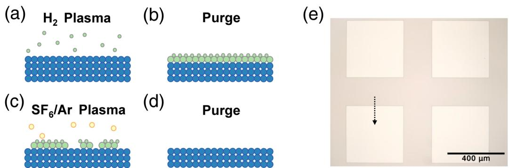
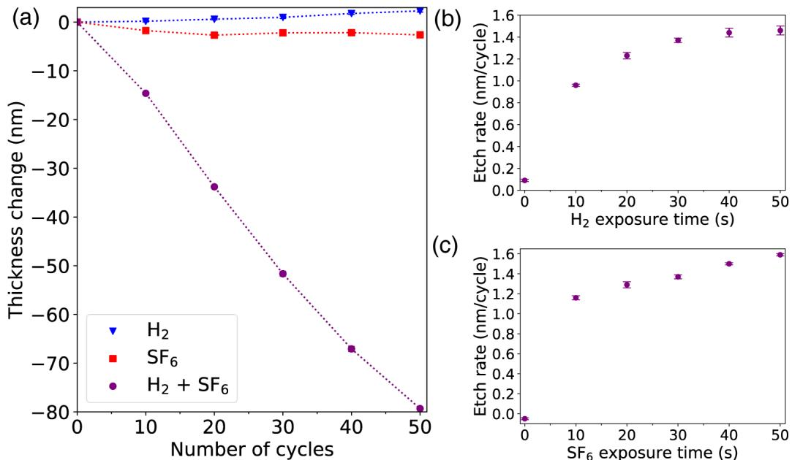
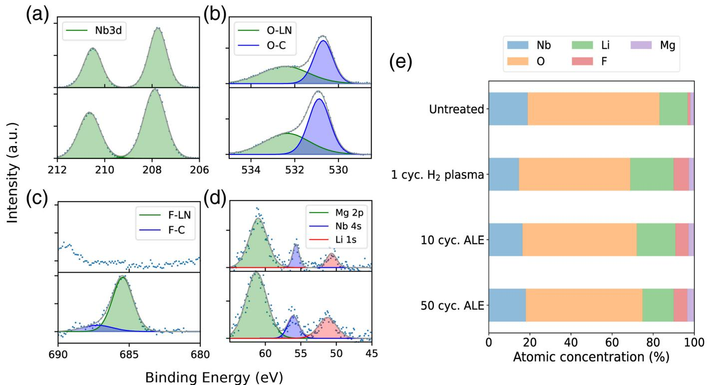
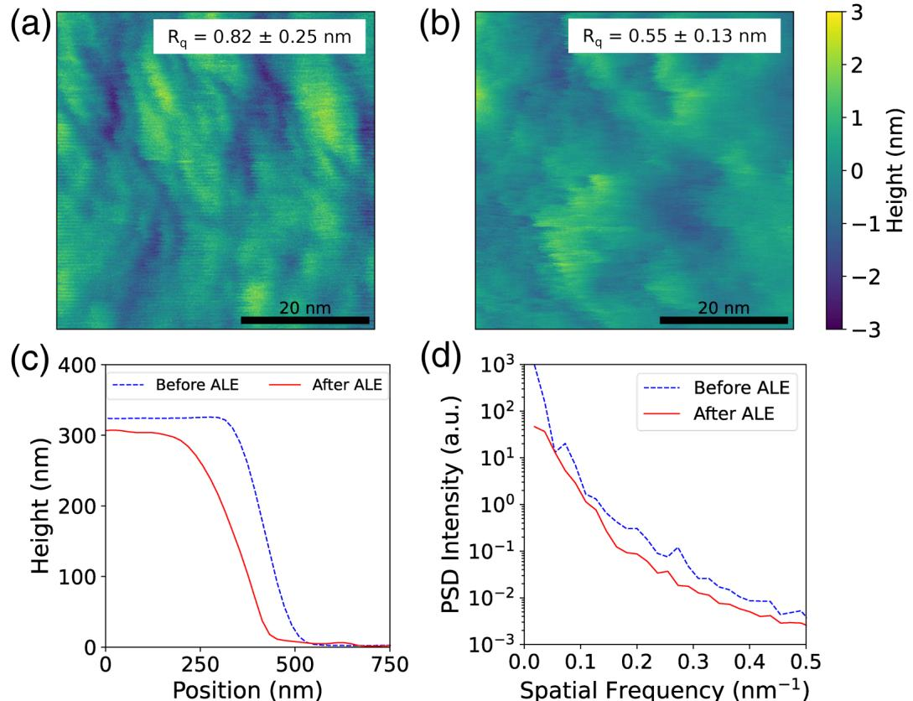

RESEARCH ARTICLE |OCTOBER 11 2024

# Isotropic atomic layer etching of MgO-doped lithium niobate using sequential exposures of  $\mathsf{H}_2$  and  $\mathsf{SF}_6 / \mathsf{Ar}$  plasmas

Special Collection: Atomic Layer Etching (ALE)

Ivy I. Chen  $\oplus$  Jennifer Solgaard  $\oplus$  Ryoto Sekine  $\oplus$  Azmain A. Hossain  $\oplus$  Anthony Ardizzi  $\oplus$  David S. Catherall  $\oplus$  Aireza Marandi  $\oplus$  James R. Renzas  $\oplus$  Frank Greer  $\oplus$  Austin J. Minnich

Check for updates

J.Vac.Sci.Technol.A 42,062603 (2024) https://doi.org/10.1116/0003962 CHORUS

# Articles You May Be Interested In

Heterogeneous integration of III- V semiconductor lasers on thin- film lithium niobite platform by wafer bonding

Appl.Phys.Lett.(February 2023)

Quantifying the coherent interaction length of second- harmonic microscopy in lithium niobate confined nanostructures

J.Appl.Phys.October 2021

High- efficiency edge couplers enabled by vertically tapering on lithium- niobate photonic chips

Appl.Phys.Lett.(December 2023)

# Isotropic atomic layer etching of MgO-doped lithium niobate using sequential exposures of  $\mathsf{H}_2$  and  $\mathsf{SF}_6 / \mathsf{Ar}$  plasmas

Cite as: J. Vac. Sci. Technol. A 42, 062603 (2024); doi: 10.1116/s0003962 Submitted: 6 August 2024 · Accepted: 13 September 2024 · Published Online: 11 October 2024

Ivy I. Chen, $^{1}$ $\oplus$  Jennifer Solgaard, $^{2}$ $\oplus$  Ryoto Sekine, $^{2}$ $\oplus$  Azmain A. Hossain, $^{1}$ $\oplus$  Anthony Ardizzi, $^{1}$ $\oplus$  David S. Catherall, $^{1}$ $\oplus$  Alireza Marandi, $^{2}$ $\oplus$  James R. Renzas, $^{3}$ $\oplus$  Frank Greer, $^{4}$ $\oplus$  and Austin J. Minnich $^{1,a)}$

# AFFILIATIONS

$^{1}$ Division of Engineering and Applied Science, California Institute of Technology, Pasadena, California 91125  $^{2}$ Department of Electrical Engineering, California Institute of Technology, Pasadena, California 91125  $^{3}$ Oxford Instruments Plasma Technology, North End, Bristol BS49 4AP, United Kingdom  $^{4}$ Jet Propulsion Laboratory, California Institute of Technology, Pasadena, California 91109

Note: This paper is part of the 2025 Special Topic Collection on Atomic Layer Etching (ALE).  $^{a)}$ Electronic mail: aminnich@caltech.edu

# ABSTRACT

Lithium niobate  $\mathrm{(LiNbO_3}$  , LN) is a ferroelectric crystal of interest for integrated photonics owing to its large second- order optical nonlinearity and the ability to impart periodic poling via an external electric field. However, on- chip device performance based on thin- film lithium niobate (TFLN) is presently limited by propagation losses arising from surface roughness and corrugations. Atomic layer etching (ALE) could potentilly smooth these features and thereby increase photonic performance, but no ALE process has been reported for LN. Here, we report an isotropic ALE process for  $\mathcal{X}$  cut  $\mathrm{MgO}$  - doped LN using sequential exposures of  $\mathrm{H}_{2}$  and  $\mathrm{SF_6 / Ar}$  plasmas. We observe an etch rate of  $1.59\pm 0.02\mathrm{nm / cycle}$  with a synergy of  $96.9\%$  . We also demonstrate that ALE can be achieved with  $\mathrm{SF_6 / O_2}$  or  $\mathrm{Cl}_2 / \mathrm{BC}_3$  plasma exposures in place of the  $\mathrm{SF_6 / Ar}$  plasma step with synergies of  $99.5\%$  and  $91.5\%$  respectively. The process is found to decrease the sidewall surface roughness of TFLN waveguides etched by physical  $\mathrm{Ar^{+}}$  milling by  $30\%$  without additional wet processing. Our ALE process could be used to smooth sidewall surfaces of TFLN waveguides as a postprocessing treatment, thereby increasing the performance of TFLN nanophotonic devices and enabling new integrated photonic device capabilities.

Published under an exclusive license by the AVs. https://doi.org/10.1116/6.0003962

# I. INTRODUCTION

Lithium niobate  $\mathrm{(LiNbO_3}$  or LN) is a ferroelectric crystal of interest for a variety of integrated photonic applications ranging from electro- optic modulators in fiber- optic communications to quantum optics. LN is a trigonal crystal characterized by a threefold rotational symmetry about the crystallographic  $\mathcal{Z}$  axis. Because  $\mathcal{X}$  - cut electro- optic modulators have fewer processing requirements compared to their  $\mathcal{Z}$  - cut counterparts, the  $\mathcal{X}$  - cut surface is the relevant surface for LN nanophotonic circuits. The crystal structure of LN is described in Refs. 3- 5. LN exhibits a number of desirable properties for photonics, including a large transparency window, wide electro- optic bandwidth, ferroelectric properties, and high second- order nonlinear susceptibility,6- 10 making it an attractive platform compared to other materials like silicon nitride.11 By incorporating  $>5\%$  molar concentration  $\mathrm{MgO}$  into the melt during the Czochralski crystal growth process, the optical damage threshold is raised, allowing for high- intensity photonic applications.12

Early efforts to create on- chip photonic devices involved Ti ion diffusion or proton- exchange on bulk LN wafers to provide the necessary refractive index contrast.13- 18 However, the relatively small refractive index contrast from this approach resulted in weak optical confinement, imposing limitations on the types of devices and nonlinear phenomena that could be observed. With the development of ion- slicing and wafer bonding processes for LN on silicon dioxide,19- 21 thin- film lithium niobate (TFLN) wafers have become commercially available, allowing for the realization of

dense circuits with tightly confining waveguides. Devices that have been fabricated on TFLN include squeezed quantum states on- chip,22  $>100$  GHz electro- optic modulators with CMOS compatible voltages,23 broadband frequency comb sources,24- 26 and on- chip ultrafast lasers.27,28

A necessary step in LN device fabrication is pattern transfer, typically using a dry etching process. Process development for dry etching of LN is more challenging compared to that for other photonic materials such as SiN because LN is a ternary compound. Fluorine29 or chlorine- based30 reactive ion etching (RIE) processes have been reported, but they suffer from redeposition of nonvolatile Li compounds such as LiF, leading to an increase in sidewall roughness and scattering loss, which is the dominant loss mechanism.11,29 Proton- exchanged LN has been noted to have lower LiF redeposition during plasma etching due to lower surface Li content. Deep  $(>1\mu \mathrm{m})$  fluorine- based etches with less LiF redeposition have been accomplished with proton- exchanged LN.13,31- 33

In the device community, physical  $\mathrm{Ar^{+}}$  milling remains the preferred dry etch method used for pattern transfer. However, this method has its own limitations such as low etch selectivity with common lithography resists, nonvertical sidewalls, redeposition of LN, and variations in etch depth across a single chip.11,34 Various approaches are available to remedy some of these limitations; for instance, redeposited LN after  $\mathrm{Ar^{+}}$  milling is typically removed using an RCA clean. However, the wet process also introduces corrugations in periodically poled LN (PPLN) due to differential wet etch rates between poled domains,35 leading to optical loss that dominates the overall loss in TFLN devices.36 As a result, various device figures of merit such as resonator quality factors are at least an order of magnitude from their intrinsic upper limits. Decreasing losses associated with corrugations and sidewall roughness in PPLN circuits will enable system- level integration of on- chip nonlinear optics and allow for quantum information processing.11

These challenges could be addressed with improved nanofabrication techniques that offer sub- nanometer- scale etch depth control and surface smoothing. In particular, thermal or plasma- enhanced atomic layer etching (ALE) has demonstrated etch depth control on the angstrom scale and an ability to smooth surfaces to the sub- nanometer scale.37,38 ALE consists of sequential, self- limiting surface chemical processes that lead to etch per cycles ranging from fractional monolayers to a few monolayers in crystalline materials. ALE can be anisotropic (directional) or isotropic (thermal or plasma- thermal).4- 40 Anisotropic ALE is based on surface modification by adsorption of a reactant followed by low- energy ion or neutral atom sputtering.39,41,42 The self- limiting nature of anisotropic ALE is defined by the thickness of the modified surface and the difference in sputtering threshold between the modified and unmodified surface. Thermal (isotropic) ALE is based on a cycle of surface modification and volatilization reactions. Recent developments in ALE have also employed a pulsed- bias approach, where the flow of gases is held constant and the DC bias is turned on and off, resulting in faster ALE cycle times.43 Thermal and anisotropic ALE recipes have been developed for various semiconductors and dielectrics such as  $\mathrm{SiO}_2$  44,45  $\mathrm{InP},^{46 - 48}$  GaAs,49- 52 and  $\mathrm{Si}_3\mathrm{N}_4$  53- 58 Surface smoothing due to ALE has been observed for various materials,37,58- 64 a feature that has been attributed to conformal layer- by- layer removal and curvature- dependent surface modification.65 Despite the potential to smooth step pattern corrugations and sidewall roughness in PPLN, no ALE processes have been reported for LN.

Here, we report an isotropic ALE process for  $\mathrm{MgO}$  doped LiN. Using sequential exposures of  $\mathrm{H}_2$  and  $\mathrm{SF}_6 / \mathrm{Ar}$  plasmas, we measure an etch per cycle (EPC) of  $1.59\pm 0.02\mathrm{\AA / cycle}$  with a synergy of  $96.9\%$  .We observe the saturation of both half- steps of the process. While surface roughness is observed to increase on flat surfaces, a  $30\%$  reduction in surface roughness on uvwedge sidewalls is observed after 50 cycles of ALE. In addition, we demonstrate that the  $\mathrm{SF}_6 / \mathrm{Ar}$  plasma step can be replaced with an  $\mathrm{O_2 / SF_6}$  or  $\mathrm{Cl}_2 / \mathrm{BCl}_3$  plasma and achieve EPCs of  $2.24\pm 0.02$  and  $1.65\pm$  0.03 and synergies of  $99.5\%$  and  $91.5\%$  respectively. The process could be used as a postprocessing step after  $\mathrm{Ar^{+}}$  milling to smoothen sidewall roughness and corrugations in periodically poled TFLN devices and thereby enhance their photonic performance.

# II. EXPERIMENTAL METHODS

The samples consisted of bulk 3- in.  $5\%$  mol  $\mathrm{MgO}$  doped LN wafers (G & H Photonics). The wafers were diced into  $7\times 7\mathrm{mm}^2$  substrates using a Disco DAD 321 dicing saw and then cleaned by sonication in AZ NMP Rinse, acetone, and isopropyl alcohol. The samples were etched in an Oxford Instruments PlasmaPro 100 Cobra system configured for ALE. As shown in Figs. 1(a)- 1(d), the process consisted of sequential exposures to  $\mathrm{H}_2$  and  $\mathrm{SF}_6 / \mathrm{Ar}$  plasmas with purges between each exposure. This process was motivated by the observation that proton- exchanged LN can be etched with fluorine plasmas with reduced LiF redeposition3,18,31- 33 and because the same plasmas successfully achieved quasi- ALE of SiN.58

The nominal ALE recipe consists of a 40- s  $\mathrm{H}_2$  plasma exposure  $300W$  ICP power,  $52.5W$  RFE power,  $209\mathrm{V}$  DC bias, 50 sccm  $\mathrm{H}_2$  followed by a 40- s  $\mathrm{SF}_6 / \mathrm{Ar}$  exposure  $300W$  ICP power,  $3.5W$  RIE power,  $50\mathrm{V}$  DC bias, 17 SCCM  $\mathrm{SF}_6$  35 SCCM Ar). The effect of EPC on RF bias power was not studied. Five- second purge times with 40 SCCM Ar were used between plasma half- steps. The chamber pressure was set at 10 mTorr, and the substrate table was cooled to  $0^\circ \mathrm{C}$  using liquid nitrogen as measured by the table thermometer.

To measure saturation curves, the chamber pressure and ICP power were kept constant at 10 mTorr and  $300W$  respectively, while the exposure time for each half- step was varied.  $\mathrm{H}_2$  plasma exposure time was varied from 0 to  $50s$  with  $\mathrm{SF}_6 / \mathrm{Ar}$  plasma held at  $30~\mathrm{s},$  and  $\mathrm{SF}_6 / \mathrm{Ar}$  plasma exposure time was varied from 0 to  $50~\mathrm{s}$  with  $\mathrm{H}_2$  plasma exposure held at  $30s$  .Prior to introducing the sample into the chamber for etching, the etching chamber was cleaned with a blank Si wafer and a  $30 - \min \mathrm{Ar}^{+}$  plasma with  $1500W$  ICP and  $100W$  RF power followed by a  $15\mathrm{- minO_2 / SF_6}$  plasma with the same power parameters. After the sample was loaded into the chamber, a  $3\mathrm{- min}$  wait time was used before processing to allow the sample to thermally equilibrate with the table. All samples were etched for 50 cycles unless otherwise noted. After etching, the photoresist was removed using room- temperature AZ NMP Rinse for at least  $30\mathrm{min}$  to ensure complete removal of the resist, followed by sonication in acetone and isopropyl alcohol.

  
FIG.1. (a)(d) ALE process for MgO-doped LN. (a) A hydrogen plasma exposure leads to (b) a hydrogen-rich modified layer at the top of the sample. (c) A subsequent  $\mathsf{SF}_6 / \mathsf{Ar}$  plasma exposure yields volatile species. (d) A final purge completes the cycle. (e) Microscope image (  $10\times$  magnification) of the developed lithography pattern on the LN wafer. The dotted line indicates the direction of AFM scan for etch depth measurements.

To enable etch depth measurements, step patterns consisting of periodic  $400\times 400\mu \mathrm{m}^2$  squares were written into a resist using photolithography, as shown in Fig. 1(e). The pattern was transferred to the  $+x$  face of the samples using AZ5214 photoresist and a Heidelberg MLA 150 Maskless Aligner with a dose of  $150\mathrm{mJ / cm^2}$  followed by development using AZ 300 MIF developer. Etch per cycle (EPC) was calculated by measuring the difference in height from etch depth for a processed sample and dividing it by the total number of cycles. AFM scans were performed on a Bruker Dimension Icon atomic force microscope (AFM) to measure total etch depth and surface roughness. The total etch depth was measured using  $2.5\times 10\mu \mathrm{m}^2$  AFM scan with the scan rate set to  $0.5\mathrm{Hz}$ . The step profile was averaged over the entire scan using Nanoscope Analysis 1.9 software to obtain the etch depth. RMS surface roughness of a reference TFLN  $\mathrm{Ar^{+}}$ - milled waveguide sample and power spectral density (PSD) scans were obtained over a  $50\times 50\mathrm{nm}^2$  area with a  $0.5\mathrm{Hz}$  scan rate. Waveguide sidewall slope on measured TFLN samples and sample tilt from all AFM scans were removed via a quadratic plane fit.

X- ray photoelectron spectroscopy (XPS) analysis was performed using a Kratos Axis Ultra x- ray photoelectron spectrometer using a monochromatic Al- Kα source. A  $1.69\mathrm{nm}$  thick layer of carbon, as measured by a quartz crystal monitor, was deposited using sputtering to reduce charging effects during scans (Leica EM ACE600 Carbon Evaporator). The resulting data were analyzed in CASA- XPS from Casa Software Ltd. For each sample, we collected the carbon C1s, oxygen O1s, niobium  $\mathrm{Nb3d_{5 / 2}}$  and  $\mathrm{Nb3d_{3 / 2}}$  niobium  $\mathrm{Nb4s}$ , lithium  $\mathrm{Li}_{2}\mathrm{s}$ , fluorine  $\mathrm{F1s}$ , and magnesium  $\mathrm{Mg2p}$  peaks. The carbon C1s peak was used as a reference to calibrate peak positions. We fit the data using a Shirley background subtraction and peak fitting routines from Refs. 66 and 67.

Two alternate recipes were also investigated. The first alternate recipe consists of a 40- s  $\mathrm{H}_2$  plasma exposure of the same parameters as the  $\mathrm{SF}_6 / \mathrm{Ar}$  recipe followed by a 40- s  $\mathrm{O}_2 / \mathrm{SF}_6$  exposure (300 W ICP power, 3.5 W RIE power, 39 V DC bias, 35 SCCM  $\mathrm{O}_2$  15 SCCM  $\mathrm{SF}_6$ ). The second alternate recipe uses the same 40- s  $\mathrm{H}_2$  plasma exposure followed by a 40- s  $\mathrm{Cl}_2 / \mathrm{BCl}_3$  exposure (300 W ICP power, 5 W RIE power, 73 V DC bias, 20 SCCM  $\mathrm{Cl}_2$  40 SCCM  $\mathrm{BCl}_3$ ).

The second alternate recipe was motivated by reports of ALE processes for metal oxides based on  $\mathrm{BCl}_3$  and the  $\mathrm{Cl}_2\cdot \mathrm{BCl}_3$  gas flow ratio was selected based on an RIE recipe of LN using chlorine. Whether the  $\mathrm{O}_2 / \mathrm{SF}_6$  and  $\mathrm{Cl}_2 / \mathrm{BCl}_3$  processes were at saturation was not determined. Etch depth measurements and  $500\times 500\mathrm{nm}^2$  surface roughness scans over 20 cycles from these alternate processes were compared with 20 cycles of the original ALE recipe consisting of a 40- s  $\mathrm{H}_2$  plasma exposure followed by a 40- s  $\mathrm{SF}_6 / \mathrm{Ar}$  exposure.

# III. RESULTS

Figure 2(a) shows the thickness change of LN versus cycle number for individual half- cycles and the overall process. An etch rate of  $0.06\mathrm{nm / cycle}$  is observed for the  $\mathrm{SF}_6 / \mathrm{Ar}$  plasma half- step. For the  $\mathrm{H}_2$  plasma step, a thickness increase was observed, which might be attributed to a volume expansion due to amorphization of the crystal during the  $\mathrm{H}_2$  plasma exposure. Such thickness increases for one half- step have been reported in other processes. On the other hand, when using both steps sequentially, an etch rate of  $1.59 \pm 0.02\mathrm{nm / cycle}$  is observed.

To gain more insight into the process and verify its self- limiting nature, we measured saturation curves for each half- cycle. In Fig. 2(b), the  $\mathrm{SF}_6 / \mathrm{Ar}$  plasma half- step is held constant at  $30\mathrm{s}$ , while the  $\mathrm{H}_2$  plasma exposure time is varied from 0 to  $50\mathrm{s}$ . Saturation occurs at  $1.46 \pm 0.04\mathrm{nm / cycle}$  above  $30\mathrm{s}$ $\mathrm{H}_2$  plasma exposure time. In Fig. 2(c), the  $\mathrm{H}_2$  plasma exposure time is held constant at  $30\mathrm{s}$  while the  $\mathrm{SF}_6 / \mathrm{Ar}$  plasma exposure time is varied from 0 to  $50\mathrm{s}$ . The etch rate exhibits a soft saturation, as the etch rate continues to increase with increasing exposure time. For  $\mathrm{SF}_6 / \mathrm{Ar}$  exposure times longer than  $30\mathrm{s}$ , the etch rate continues to increase at a rate of  $0.1\mathrm{nm / cycle}$  per  $10\mathrm{s}$  of additional  $\mathrm{SF}_6 / \mathrm{Ar}$  plasma exposure, indicating that the half- step exhibits soft saturation. Soft saturation with  $\mathrm{SF}_6 / \mathrm{Ar}$  plasma has been reported previously and was attributed to the diffusion- limited fluorination of the surface. In the present case, soft saturation is hypothesized to occur due to the presence of a concentration gradient of hydrogen into the LN film after  $\mathrm{H}_2$  plasma exposure. By increasing the  $\mathrm{SF}_6 / \mathrm{Ar}$  plasma exposure time, more of the hydrogenated surface is removed, resulting in a

  
FIG. 2. (a) EPC vs cycle number with  $40 \text{s} H_{2}$  plasma exposures only (triangles),  $40 \text{s} SF_{6} / Ar$  plasma exposures only (squares), and both half-cycles (circles). All processes occur at  $0^{\circ}C$ . The dashed lines are guides to the eye. (b) EPC versus  $H_{2}$  plasma exposure time with  $SF_{6} / Ar$  plasma exposure time fixed at  $30 \text{s}$ . (c) EPC versus  $SF_{6} / Ar$  plasma exposure time with  $H_{2}$  plasma exposure time fixed at  $30 \text{s}$ . The etch rates are observed to saturate with exposure time, demonstrating the self-limiting nature of the process.

soft- saturating curve. At  $50 \text{s} SF_{6}$  plasma exposure time, the etch rate is  $1.59 \pm 0.02 \text{nm / cycle}$ . The observation of saturation for both half- steps indicates that the process is indeed atomic layer etching.

The synergy,  $S_{i}$  as defined by Ref. 61, quantitatively compares the etch depth using only individual steps of the ALE cycle to etching obtained with the full etch cycle as  $S = (1 - (\alpha + \beta) / EPC) \times 100$ , where  $\alpha$  and  $\beta$  are the etch rates of the  $H_{2}$  plasma and  $SF_{6} / Ar$  half- cycles, respectively, and  $EPC$  is the etch rate of the full cycle. For the present process in which a thickness increase is observed after  $H_{2}$  plasma exposure, we take a conservative approach and calculated the synergy assuming zero EPC for that step. We obtain a synergy value of  $96.9\%$  for the nominal recipe. This synergy value is comparable with typical synergy values reported in Ref. 37.

We also investigated alternate ALE recipes using  $\mathrm{O_2 / SF_6}$  or  $\mathrm{Cl}_2 / \mathrm{BCl}_3$  plasma exposures for the removal step. The  $\mathrm{O_2 / SF_6}$  ALE process yielded an etch rate of  $2.24 \pm 0.01 \text{nm / cycle}$  over 20 cycles. The half- step EPCs for the  $H_{2}$  and  $\mathrm{O_2 / SF_6}$  plasma step are  $- 0.04$  and  $0.01 \text{nm / cycle}$ , respectively. The synergy for this process is  $99.5\%$ , with the  $H_{2}$  plasma half- step assumed to be  $0 \text{EPC}$  for purposes of calculation as previously noted. The  $\mathrm{Cl}_2 / \mathrm{BCl}_3$  ALE process yielded an EPC of  $1.65 \pm 0.03 \text{nm / cycle}$  over 20 cycles; the half- step EPCs for the  $H_{2}$  and  $\mathrm{Cl}_2 / \mathrm{BCl}_3$  plasma step are  $- 0.04$  and  $0.14 \text{nm / cycle}$ , respectively, and the synergy for this process is  $91.5\%$ . While the reaction mechanisms of the three processes were not studied in this work, the possible reactions are hypothesized to be fluorine or chlorine radicals forming volatile compounds such as  $\mathrm{NbF}_5$ ,  $\mathrm{NbOF}_3$ ,  $\mathrm{OF}_2$ ,  $\mathrm{NbOCl}_x$ , and  $\mathrm{BOCl}_x$  as occurs in RIE of LN.  ${ }^{30,69}$

We next characterize the chemical composition of bulk LN before and after 50 cycles of ALE for the  $\mathrm{SF}_6 / \mathrm{Ar}$  plasma process using XPS. No depth- profiling XPS is reported due to preferential sputtering of O over Nb with an Ar beam,  ${ }^{70}$  complicating the interpretation of the measurements. The C1s peak at  $284.8 \text{eV}$  is used as a reference. Binding energy values are reported in Table I. In Figs. 3(a)- 3(d), we show the core levels of Nb3d, O1s; F1s; and Nb4s, Li1s, and Mg2p, respectively. For the Nb3d XPS spectra in Fig. 3(a), we observe a single doublet peak consisting of a  $3d_{5 / 2}$  and  $3d_{3 / 2}$  subpeak corresponding to LN (207.7 and  $210.5 \text{eV}$  ).  ${ }^{71- 73}$  In Fig. 3(b), we report the O1s spectra with two subpeaks at 530.7 and  $532.4 \text{eV}$ , corresponding to metal oxide and O- C bonds, respectively.  ${ }^{74}$  In Fig. 3(c), we report the F1s spectra with two subpeaks at 685.5 and  $687.2 \text{eV}$  corresponding to LiF and F- C bonds, respectively.  ${ }^{73,74}$  In Fig. 3(d), we report the Nb4s, Li1s, and Mg2p spectra at 61.0, 55.7, and  $50.7 \text{eV}$ , respectively (values are for bulk LN).  ${ }^{73,74}$  The Li1s peak energy agrees well with reported binding energies for LiF  $(55.7 \pm 0.5 \text{eV})$ .  ${ }^{72,74}$  After ALE, we observe a  $0.3 \text{eV}$  shift for the Nb4s and Li1s peaks and a  $0.6 \text{eV}$  shift for the Mg2p peaks toward higher binding energies, as expected if fluoride bond formation occurred.  ${ }^{74}$  There is also an increased concentration of Mg after ALE, suggesting that  $\mathrm{MgF}_2$  is also formed.

In Fig. 3(e), we report the atomic concentrations of Nb, Li, Mg, O, and F obtained from the XPS data at various stages of the process. The atomic concentrations are normalized by the estimated carbon content for each sample, which is about  $55\%$  and is due to presence of the conductive carbon coating. The uncertainties for all atomic concentration numbers (including C) were estimated

TABLE I. Atomic concentrations for the fitted XPS data.  

<table><tr><td>Sample</td><td>Nb (%)</td><td>O (%)</td><td>Li (%)</td><td>F (%)</td><td>Mg (%)</td></tr><tr><td>Untreated</td><td>18.92 ± 0.22</td><td>64.17 ± 0.76</td><td>13.68 ± 1.17</td><td>1.32 ± 0.56</td><td>1.91 ± 0.18</td></tr><tr><td>1 half-cycle H2plasma</td><td>14.69 ± 0.26</td><td>54.14 ± 0.97</td><td>21.17 ± 2.15</td><td>7.29 ± 0.23</td><td>2.72 ± 0.44</td></tr><tr><td>10 cycles ALE</td><td>16.40 ± 0.22</td><td>55.64 ± 0.76</td><td>18.79 ± 1.62</td><td>6.38 ± 0.19</td><td>2.79 ± 0.32</td></tr><tr><td>50 cycles ALE</td><td>18.04 ± 0.17</td><td>56.83 ± 0.55</td><td>15.17 ± 1.15</td><td>6.56 ± 0.13</td><td>3.40 ± 0.19</td></tr></table>

from CasaxPs software using a Monte Carlo routine, and the carbon- normalized uncertainties are propagated by adding uncertainties in quadrature. Surface lithium content is observed to increase after  $1\mathrm{H}_{2}$  plasma half- cycle. The presence of fluorine is likely from residual fluorine on the chamber walls after the chamber clean. This trend differs from that reported in previous studies in which surface lithium concentration was found to decrease after a high power  $(500 - 2000\mathrm{W})$  high temperature  $(170^{\circ}\mathrm{C})$  hour- long  $\mathrm{H}_{2}$  plasma exposure, forming proton- exchanged LN [c.f. Fig. 4(a) in Ref. 18]. These plasma conditions in Ref. 18 are more similar in terms of substrate temperature and exposure time to acid- based proton exchange, possibly accounting for the difference. After ALE, the fraction of F, Li, and

Mg increases compared to those of the untreated sample. Considering as well the peak energy shifts mentioned earlier, we hypothesize that LiF and  $\mathrm{MgF_2}$  are formed and redeposited on the surface owing to their low volatility.

We characterized the effect of all three ALE recipes on surface roughness of bulk LN samples. AFM scans over  $500\times 500\mathrm{nm}^2$  were obtained on bulk LN subjected to 20 cycles of ALE. Table II compares the EPC, surface roughness, and synergy of the three different recipes. For reference, the bulk LN samples have an initial surface roughness of  $R_{q} = 0.2 \mathrm{nm}$  . The  $\mathrm{O_2 / SF_6}$  process yielded the. roughest surface but the highest synergy, and the  $\mathrm{Cl_2 / BCl_3}$  process yielded a similar etch rate to the  $\mathrm{SF}_6 / \mathrm{Ar}$  process with the lowest synergy of the three recipes. It is hypothesized that the  $\mathrm{Cl}_2 / \mathrm{BCl}_3$

  
FIG.3. Surfa XPS pects showing a) Nb3d, (b) O1s, (c) F1s spectra, and (d) Nb4s, Li1s, Mg2p. The spectra are shown for (top) original and (bottom) etched bulk MgO-doped LN over 50 ALE cycles consisting of a  $40\mathrm{sH}_2$  plasma exposure followed by a  $40\mathrm{s}$ $\mathrm{SF}_6 / \mathrm{Ar}$  exposure. The measured (dots) and fit spectra (lines) intensity are reported in arbitrary units (a.u.) against the binding energy on the x-axis. (e) Surface atomic concentration normalized by carbon atomic concentration from XPS spectra for each sample for untreated bulk LN, 1 cycle  $\mathsf{H}_{2}$  plasma exposure, 10 ALE cycles, and 50 ALE cycles.

TABLE II. Comparison of metrics from LN ALE recipes with different removal step plasma exposures on bulk LN. The bulk LN samples used have an initial surface roughness of  $R_{\mathrm{q}} = 0.2 \mathsf{nm}$  Values are from a  $40sH_{2}$  plasma exposure followed by a  $40s$  plasma exposure indicated in the table, over 20 cycles. Whether the  $\mathrm{O_2 / SF_6}$  and  $\mathrm{Cl_2 / BC_3}$  processes were at saturation was not determined.  

<table><tr><td>Plasma type</td><td>EPC (nm/cycle)</td><td>RMS roughness (nm)</td><td>Average roughness (nm)</td><td>Synergy (%)</td></tr><tr><td>SF6/Ar</td><td>1.59 ± 0.02</td><td>0.57 ± 0.18</td><td>0.44 ± 0.11</td><td>96.9</td></tr><tr><td>O2/SF6</td><td>2.24 ± 0.02</td><td>1.47 ± 0.52</td><td>0.99 ± 0.40</td><td>99.5</td></tr><tr><td>Cl2/BCl3</td><td>1.65 ± 0.03</td><td>0.90 ± 0.46</td><td>0.59 ± 0.20</td><td>91.5</td></tr></table>

process may be modified to have higher synergy by lowering the RIE power on the  $\mathrm{Cl_2 / BC_3}$  plasma half- step. In comparison, the  $\mathrm{SF}_6 / \mathrm{Ar}$  process at saturation produced the smoothest surface after 20 cycles of ALE with  $R_{\mathrm{q}}$  of  $0.57\pm 0.18\mathrm{nm}$  .The increase in surface roughness may be attributed to redeposition of LiF and  $\mathrm{MgF_2}$

Since sidewall roughnesses of TFLN waveguides are rougher than the surface of bulk LN samples, we next characterized the effect of the  $\mathrm{SF}_6 / \mathrm{Ar}$  ALE process on the sidewall surface roughness of TFLN waveguides. For these measurements, we used additional samples consisting of TFLN with  $\mathrm{Ar^{+}}$  milled waveguides that were smoothed postetch with an HF dip and RCA clean, corresponding to the state- of- art process for TFLN device fabrication.11,34 Figures 4(a) and 4(b) show the quadratic plane- fit height- map of  $\mathrm{Ar^{+}}$  - etched sidewall before and after 50 cycles of ALE, respectively. After ALE, the sidewall surface is visually smoother. The sidewall surface smoothing may be attributed to the isotropic nature of the etch.

To support this hypothesis, we measured the lateral etch rate of the waveguide using AFM. Figure 4(c) shows an AFM profile averaged over the whole scanned image of the TFLN waveguide sidewall before and after 50 cycles of ALE. From the decrease in width, we infer the lateral etch rate to be  $1\mathrm{nm / }$  cycle on each side of the waveguide compared to a vertical etch rate of  $1.59\mathrm{nm / }$  cycle previously measured on bulk LN, confirming the largely isotropic nature of the process.

To more quantitatively characterize the surface topology of the TFLN sidewalls, we computed the surface power spectral density (PSD) from the AFM scans. Figure 4(d) shows the PSD curves before and after ALE on TFLN. Using AFM scans, the initial RMS sidewall roughness is measured to be  $0.82\pm 0.25\mathrm{nm}$  and an

  
FIG.4. AFM scan showing height-maps of TFLN waveguide sidewall with linear-planar tilt removal before (a) and after 50 ALE cycles (b) (c) Averaged AFM line scans of the TFLN waveguide side profile before and after 50 ALE cycles. The waveguide width decreases by  $50 \mathrm{nm}$  on each side, yielding a lateral etch rate of  $1 \mathrm{nm / }$  cycle, which is comparable to the vertical etch rate of  $1.59 \mathrm{nm / }$  cycle measured on bulk LN. (d) Height-map PSD of the samples before ALE and after 50 cycles of ALE.

average roughness of  $0.65 \pm 0.16 \mathrm{nm}$ . After 50 cycles,  $R_{q}$  and  $R_{a}$  are measured as  $0.55 \pm 0.13$  and  $0.44 \pm 0.12 \mathrm{nm}$ , respectively. The PSD is observed to decrease over all measured spatial frequencies. Therefore, despite the roughening observed on flat LN surfaces, sidewall smoothing is still observed owing to the isotropic nature of the process.

# IV. DISCUSSION

Our ALE process may find applications in improving the photonic performance of TFLN devices by reducing optical loss associated with corrugations in PFLN and sidewall roughness. The etch rate of a typical RCA wet etch exhibits uncontrolled variability due to temperature and concentration fluctuations in solution. The reported ALE process has potential to overcome these issues due to the self- limiting nature of the process with well- controlled etch rates.

Future topics of interest include investigating the mechanism for etch selectivity of the hydrogen- exposed surface over the unmodified surface and identifying approaches to reduce the quantity of redeposited Li and  $\mathrm{Mg}$  compounds. A post- ALE wet clean may be beneficial to remove the redeposited compounds selectively, in contrast to the present approach using an RCA wet etch that etches lithium niobate. Development of an in situ gas- based removal process or a process based on thermal cycling may enable redeposition- free ALE. For thermally cyclic processing, investigation of chemistries that produce more volatile products, such as those based on Br, is of interest for further study. Directional ALE processes with high anisotropy are also of interest as they could be employed for pattern transfer, yielding precise and uniform control of etch depth over the entire chip with precision of around the EPC  $(\sim 1 \mathrm{nm})$ . This degree of control would permit scaling of TFLN devices and circuits to the system level. The ALE system in our work (Oxford Instruments, Plasma Pro 100 Cobra) is able to process  $150 \mathrm{mm}$  diameter substrates, and therefore, our process has the potential to extend to wafer- scale applications.

# V. CONCLUSION

We have reported an isotropic ALE process for  $x$ - cut  $\mathrm{MgO}$ - doped lithium niobate consisting of sequential exposures of hydrogen plasma and  $\mathrm{SF_6 / Ar}$  plasma that is compatible with low- pressure ICP RIE systems. We observe an etch rate of  $1.59 \pm 0.02 \mathrm{\AA / cycle}$  with a synergy exceeding  $96\%$ . Both half- steps exhibited saturation with respect to exposure time, though the  $\mathrm{SF_6}$  plasma half- step was observed to soft- saturate. The substitution of  $\mathrm{O_2 / SF_6}$  or  $\mathrm{Cl_2 / BCl_3}$  plasmas in place of  $\mathrm{SF_6 / Ar}$  plasma was also found to yield ALE with synergies exceeding  $90\%$ . Finally, the process was found to smoothen the sidewalls of TFLN waveguides fabricated using the state- of- art process, suggesting the potential of ALE to enhance the photonic performance of TFLN devices.

# ACKNOWLEDGMENTS

This work was supported by Oxford Instruments and by the NSF under Award No. 2234390. This research was carried out, in part, at the Jet Propulsion Laboratory (JPL), California Institute of Technology, under contract with the National Aeronautics and

Space Administration (NASA). We gratefully acknowledge the critical support and infrastructure provided for this work by The Kavli Nanoscience Institute and the Molecular Materials Research Center of the Beckman Institute at the California Institute of Technology.

# AUTHOR DECLARATIONS

# Conflict of Interest

I.I.C., 
J.S., 
R.S., 
A.M., 
F.G., and 
A.J.M. have submitted a United States provisional patent on this technology.

# Author Contributions

Ivy I. Chen: Conceptualization (equal); Data curation (equal); Formal analysis (equal); Investigation (equal); Methodology (equal); Writing - original draft (equal); Writing - review & editing (equal). Jennifer Solgaard: Investigation (supporting); Methodology (supporting). Ryoto Sekine: Conceptualization (supporting); Investigation (supporting); Writing - review & editing (supporting). Azmain A. Hossain: Data curation (supporting); Formal analysis (supporting); Investigation (supporting). Anthony Ardizzi: Investigation (supporting); Methodology (supporting); Writing - review & editing (supporting). David S. Catherall: Investigation (supporting); Methodology (supporting). Alireza Marandi: Conceptualization (supporting); Supervision (supporting). James R. Renzas: Conceptualization (equal); Formal analysis (equal); Funding acquisition (equal); Investigation (equal); Methodology (equal); Writing - review & editing (equal). Frank Greer: Conceptualization (equal); Formal analysis (equal); Investigation (lead); Methodology (lead); Project administration (lead); Resources (lead); Supervision (equal); Validation (equal); Writing - review & editing (equal). Austin J. Minnich: Conceptualization (equal); Formal analysis (equal); Funding acquisition (equal); Methodology (equal); Project administration (equal); Resources (equal); Supervision (equal); Validation (equal); Visualization (equal); Writing - original draft (equal); Writing - review & editing (equal).

# DATA AVAILABILITY

The data that support the findings of this study are available from the corresponding author upon reasonable request.

# REFERENCES

1A. Boes et al., Science 379, eabj4396 (2023). 2M. Zhang, C. Wang, P. Kharel, D. Zhu, and M. Lendar, Optica 8, 652 (2021). 3N. Iyi, K. Kitamura, Y. Yajima, S. Kimura, Y. Furukawa, and M. Sato, J. Solid State Chem. 118, 148 (1995). 4S. Sanna and W. G. Schmidt, J. Phys.: Condens. Matter 29, 413001 (2017). 5S. Sanna and W. G. Schmidt, Phys. Rev. B 81, 214116 (2010). 6R. S. Weis and T. K. Gaylord, Appl. Phys. A 37, 191 (1985). 7K.- K. Wong, Properties of Lithium Niobate, 28 (IET, London, UK, 2002). 8Y. Kong, F. Bo, W. Wang, D. Zheng, H. Liu, G. Zhang, R. Rupp, and J. Xu, Adv. Mater. 32, 1806452 (2020). 9T. Volk and M. Wohlecke, Lithium Niobate: Defects, Photorefraction and Ferroelectric Switching (Springer Science & Business Media, Berlin, 2008), Vol. 115. 10L. Arizmendi, Phys. Status Solidi A 201, 253 (2004). 11D. Zhu et al., Adv. Opt. Photon. 13, 242 (2021). 12D. A. Bryan, R. Gerson, and H. E. Tomaschke, Appl. Phys. Lett. 44, 847 (1984).

$^{13}\mathrm{H}$  Hu, A. P. Milenin, R. R. Wehrspohn, H. Hermann, and W. Sohler, J. Vac. Sci. Technol. A 24, 1012 (2006).  $^{14}\mathrm{O}$  Espeso, G. Garcia, A. Climent, F. Agullo- Lopez, G. de la Paliza, J. M. Cabrera, and T. Sajavaara, J. Appl. Phys. 94, 7710 (2003).  $^{15}\mathrm{J}$  Cabrera, J. Olivares, M. Carrascosa, J. Rams, R. Muller, and E. Dieguez, Adv. Phys. 45, 349 (1996).  $^{16}\mathrm{L}$  Dorrer, P. Tuchel, E. Huger, R. Heller, and H. Schmidt, J. Appl. Phys. 129, 135105 (2021).  $^{17}\mathrm{L}$  Cai, Y. Kang, and H. Hu, Opt. Express 24, 4640 (2016).  $^{18}\mathrm{Z}$  Ren, P. J. Heard, and S. Yu, J. Vac. Sci. Technol. B 25, 1161 (2007).  $^{19}\mathrm{M}$  Levy, P. M. Oggad, Jr., H. Jiv, L. E. Greer, G. S. Gargill III, A. Kumar, and H. Bakhru, Appl. Phys. Lett. 73, 2293 (1998).  $^{20}\mathrm{M}$  Levy and R. M. Osgood, "Crystal lett- slicing of single- crystal films" (2000).  $^{21}\mathrm{P}$  Rabiei and P. Gunter, Appl. Phys. Lett. 85, 4603 (2004).  $^{22}\mathrm{R}$  Nehra, R. Sekine, L. Ledezma, Q. Guo, R. M. Gray, A. Roy, and A. Marandi, Science 377, 1333 (2022).  $^{23}\mathrm{C}$  Wang, M. Zhang, X. Chen, M. Bertrand, A. Shams- Ansari, S. Chandrasekhar, P. Winzer, and M. Loncar, Nature 562, 101 (2018).  $^{24}\mathrm{R}$  Sekine, R. M. Gray, L. Ledezma, S. Zhou, Q. Guo, and A. Marandi, "Multi- octave frequency comb from an ultra- low- threshold nanophotonic parametric oscillator," arXiv:2309.04345 [physics.optics] (2023).  $^{25}\mathrm{T}$  - H. Wu, L. Ledezma, C. Frederick, P. Sekhar, R. Sekine, Q. Guo, R. M. Briggs, A. Marandi, and S. A. Diddams, Nat. Photonics 18, 218 (2024).  $^{26}\mathrm{M}$  Jankowski, C. Langrock, B. Desiatov, A. Marandi, C. Wang, M. Zhang, C. R. Phillips, M. Loncar, and M. M. Fejer, Optica 7, 40 (2020).  $^{27}\mathrm{M}$  Yu et al., Nature 612, 252 (2022).  $^{28}\mathrm{Q}$  Guo et al., Science 382, 708 (2023).  $^{29}\mathrm{H}$  Hu, A. P. Milenin, R. R. Wehrspohn, H. Hermann, and W. Sohler, J. Vac. Sci. Technol. A 24, 1012 (2006).  $^{30}\mathrm{M}$  Mahmoud, L. Cai, C. Bottenfield, and G. Piazza, IEEE Photonics J. 10, 1 (2018).  $^{31}\mathrm{D}$  Jun, J. Wei, C. Eng Png, S. Guangyuan, J. Son, H. Yang, and A. J. Danner, J. Vac. Sci. Technol. B 30, 011208 (2012).  $^{32}\mathrm{Z}$  Ren, P. J. Heard, J. M. Marshall, P. A. Thomas, and S. Yu, J. Appl. Phys. 103, 034109 (2008).  $^{33}\mathrm{A}$  Aryal, I. Stricklin, M. Behzadirad, D. W. Branch, A. Siddiqui, and T. Busani, Nanomaterials 12, 2836 (2022).  $^{34}\mathrm{G}$  Ulliac, V. Calero, A. Ndao, F. Baida, and M.- P. Bernal, Opt. Mater. 53, 1 (2016).  $^{35}\mathrm{C}$  Wang, C. Langrock, A. Marandi, M. Jankowski, M. Zhang, B. Desiatov, M. M. Fejer, and M. Loncar, Optica 5, 1438 (2018).  $^{36}\mathrm{A}$  Shams- Ansari et al., APL Photon. 7, 081301 (2022).  $^{37}\mathrm{K}$  J. Kanarik, S. Tan, and R. A. Gottscho, J. Phys. Chem. Lett. 9, 4814 (2018).  $^{38}\mathrm{S}$  M. George, Acc. Chem. Res. 53, 1151 (2020).  $^{39}\mathrm{K}$  J. Kanarik, T. Lill, E. A. Holdson, S. Sriraman, S. Tan, J. Marks, V. Vahedi, and R. A. Gottscho, J. Vac. Sci. Technol. A 33, 020802 (2015).  $^{40}\mathrm{X}$  Sang and J. P. Chang, J. Phys. D. Appl. Phys. 53, 183001 (2020).  $^{41}\mathrm{Y}$  Horike, T. Tanaka, M. Nakano, S. Iseda, H. Sakaue, A. Nagata, H. Shindo, S. Miyazaki, and M. Hirose, J. Vac. Sci. Technol. A 8, 1844 (1990).  $^{42}\mathrm{G}$  S. Oehrlein, D. Metzler, and C. Li, ECS J. Solid State Sci. 4, N5041 (2015).  $^{43}\mathrm{J}$  A. Michaels, N. Delegan, Y. Tsaturyan, J. R. Renzas, D. D. Awschalom, J. G. Eden, and F. J. Heremans, J. Vac. Sci. Technol. A 41, 032607 (2023).  $^{44}\mathrm{J}$  W. DuMont, A. E. Marquandt, A. M. Cano, and S. M. George, ACS Appl. Mater. Inter. 9, 10296 (2017).  $^{45}\mathrm{R}$  Rahman, E. C. Mattson, J. P. Klesko, A. Dangerfield, S. Rivillon- Amy, D. C. Smith, D. Hausmann, and Y. J. Chabal, ACS Appl. Mater. Inter. 10, 31784 (2018).

$^{46}\mathrm{K}$  K. Ko and S. W. Pang, J. Vac. Sci. Technol. B 11, 2275 (1993).  $^{47}\mathrm{S}$  D. Park, C. K. Oh, J. W. Bae, G. Y. Yeom, T. W. Kim, J. I. Song, and J. H. Jang, Appl. Phys. Lett. 89, 043109 (2006).  $^{48}\mathrm{S}$  D. Park, C. K. Oh, W. S. Lim, H. C. Lee, J. W. Bae, G. Y. Yeom, T. W. Kim, J. I. Song, and J. H. Jang, Appl. Phys. Lett. 91, 013110 (2007).  $^{49}\mathrm{W}$  Lu, Y. Lee, J. C. Gertsch, J. A. Murdzek, A. S. Cavanagh, L. Kong, J. A. del Alamo, and S. M. George, Nano Lett. 19, 5159 (2019).  $^{50}\mathrm{T}$  Meguro, M. Ishii, T. Sugano, K. Gamo, and Y. Aoyagi, Appl. Surf. Sci. 82- 83, 193 (1994).  $^{51}\mathrm{Y}$  Aoyagi, K. Shimmura, K. Kawasaki, T. Tanaka, K. Gamo, S. Namba, and L. Nakazato, Appl. Phys. Lett. 69, 968 (1993).  $^{52}\mathrm{M}$  R. Raziyan, H. Sharma, and J. J. Dubowski, ACS Appl. Mater. Inter. 11, 17968 (2019).  $^{53}\mathrm{C}$  Li, D. Metzler, C. S. Lai, E. A. Hudson, and G. S. Oehrlein, J. Vac. Sci. Technol. A 34, 041307 (2016).  $^{54}\mathrm{A}$  I. Abdulagatov and S. M. George, J. Vac. Sci. Technol. A 38, 022607 (2020).  $^{55}\mathrm{Y}$  Ishii, K. Okuma, T. Saldana, K. Maeda, N. Negishi, and J. Manos, Jpn. J. Appl. Phys. 56, 06HB07 (2017).  $^{56}\mathrm{S}$  D. Sherpa and A. Ranjan, J. Vac. Sci. Technol. A 35, 01A102 (2016).  $^{57}\mathrm{T}$  Matsuura, Y. Honda, and J. Murota, Appl. Phys. Lett. 74, 3573 (1999).  $^{58}\mathrm{D}$  N. Shanks, R. K. Ahmed, J. D. Femi- Oyetoro, M. R. Dickie, A. D. Beyer, and F. Greer, J. Vac. Sci. Technol. A 41, 052601 (2023).  $^{59}\mathrm{D}$  R. Zywotko, J. Faguet, and S. M. George, J. Vac. Sci. Technol. A 36, 061508 (2018).  $^{60}\mathrm{T}$  Ohba, W. Yang, S. Tan, K. J. Kanarik, and K. Nojiri, Jpn. J. Appl. Phys. 56, 06HB06 (2017).  $^{61}\mathrm{K}$  J. Kanarik et al., J. Vac. Sci. Technol. A 35, 057302 (2017).  $^{62}\mathrm{A}$  A. Hossain, H. Wang, D. S. Catherall, M. Leung, H. C. M. Knoops, J. R. Renzas, and A. J. Minnich, J. Vac. Sci. Technol. A 41, 062601 (2023).  $^{63}\mathrm{H}$  Wang, A. Hossain, D. Catherall, and A. J. Minnich, J. Vac. Sci. Technol. A 41, 02606 (2023).  $^{64}\mathrm{M}$  Konh, Y. Wang, H. Chen, S. Bhatt, J. Q. Xiao, and A. V. Teplyakov, Appl. Surf. Sci. 575, 151751 (2022).  $^{65}\mathrm{S}$  H. Gerritsen, N. J. Chittock, V. Vandalon, M. A. Verheijen, H. C. M. Knoops, W. M. M. Kessels, and A. J. M. Mackus, ACS Appl. Nano Mater. 5, 18116 (2022).  $^{66}\mathrm{H}$  Turciová, J. Zemek, J. Tóth, and I. Drbohlav, Surf. Interface Anal. 34, 468 (2002).  $^{67}\mathrm{R}$  Gruenke, O. A. Hitchcock, E. A. Wollack, C. J. Sarabalis, M. Jankowski, T. P. McKenna, N. R. Lee, and A. H. Safavi- Naeini, Sci. Rep. 14, 6663 (2024).  $^{68}\mathrm{N}$  J. Chittock, Y. Shu, S. D. Elliott, H. C. M. Knoops, W. M. M. E. Kessels, and A. J. M. Mackus, J. Appl. Phys. 134, 075302 (2023).  $^{69}\mathrm{A}$  A. Osipov, A. A. Osipov, G. A. Iankevich, A. B. Speshilova, A. Shakhmin, V. I. Berezenko, and S. E. Alexandrov, J. Microelectromech. S. 30, 90 (2021).  $^{70}\mathrm{P}$  C. Karulkar, J. Vac. Sci. Technol. B 18, 169 (1981).  $^{71}\mathrm{N}$  Kaufherr, D. J. Eichorst, and D. A. Payne, J. Vac. Sci. Technol. A 14, 299 (1996).  $^{72}\mathrm{N}$  X. ray Photoelectron Spectroscopy Database: Gaithersburg MD, 20899 (2000).  $^{73}\mathrm{E}$  Skryleva, I. Kubasov, P. Kiryukhantsev- Korneev, B. Senatulin, R. Zhukov, K. Zakutailov, M. Malinkovich, and Y. Parkhomenko, Appl. Surf. Sci. 389, 387 (2016).  $^{74}\mathrm{J}$  Moulder and J. Chastain, Handbook of X- ray Photoelectron Spectroscopy: A Reference Book of Standard Spectra for Identification and Interpretation of XPS Data (Physical Electronics Division, Perkin- Elmer Corporation, Eden Prairie, MN, 1992).