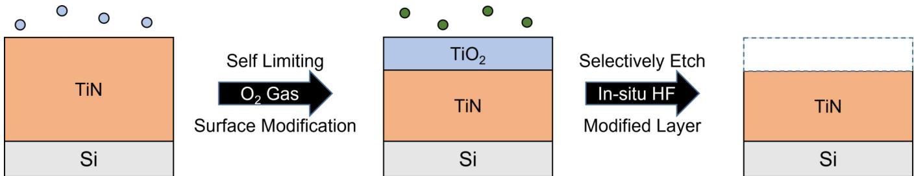
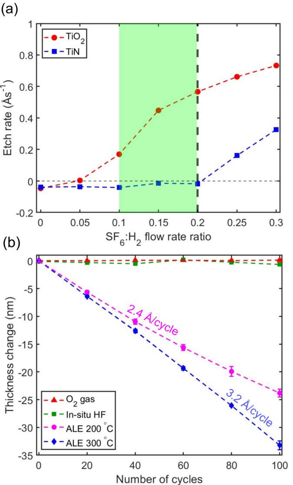
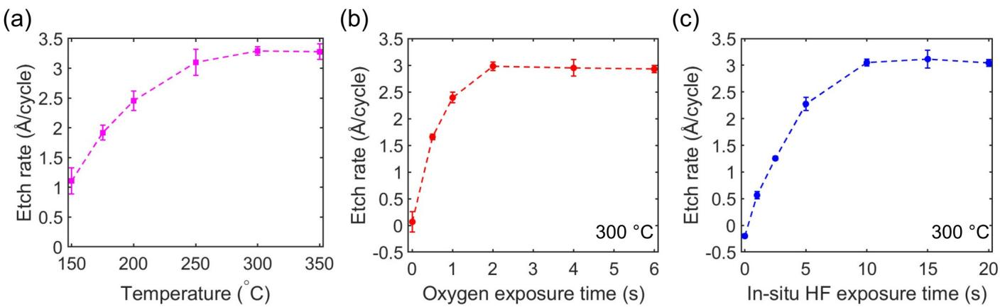
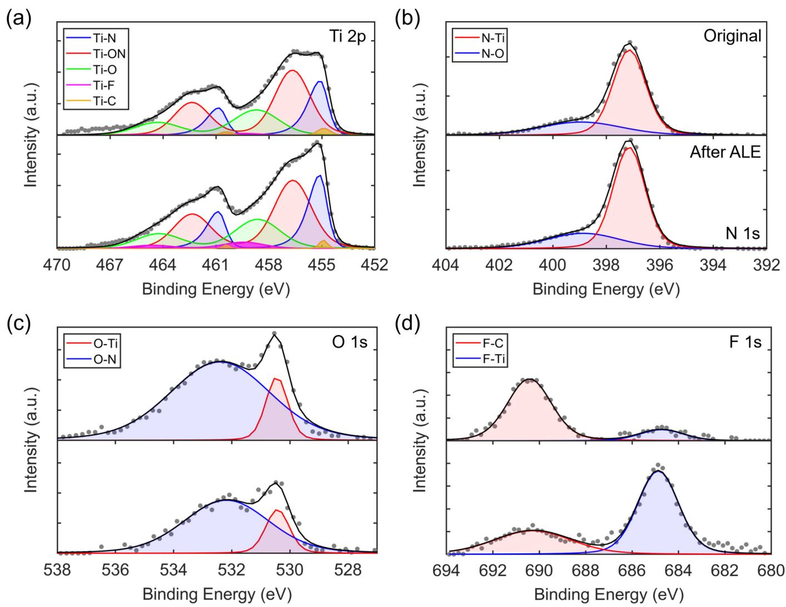
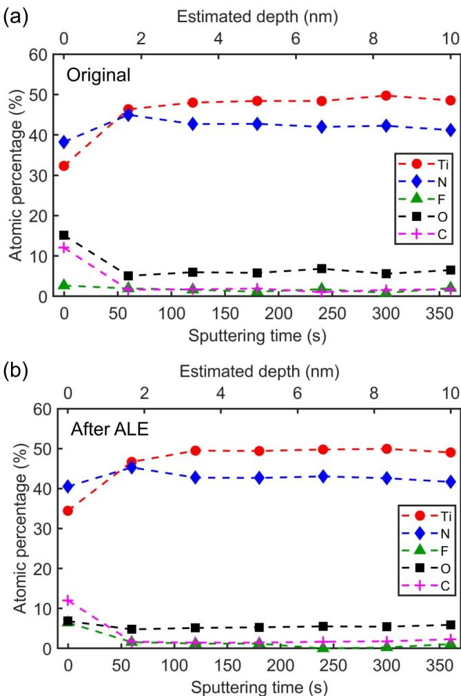
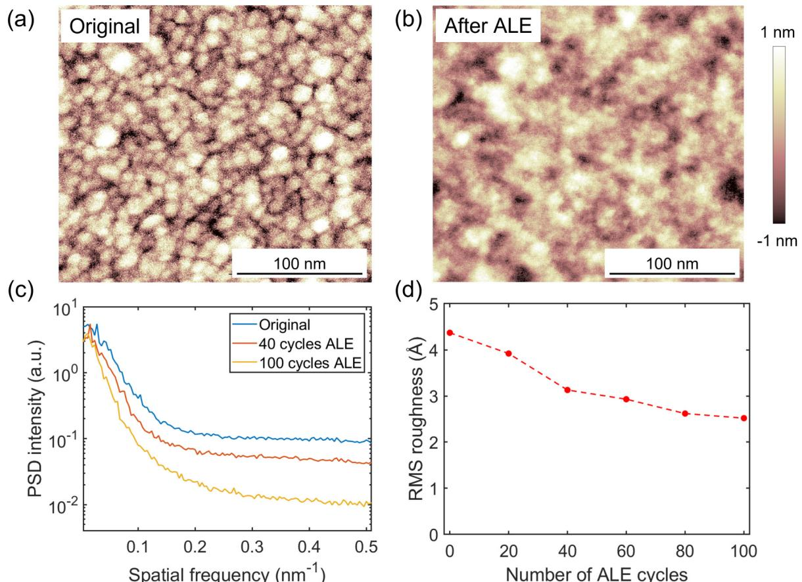
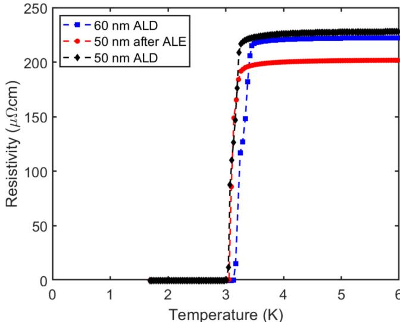

# Isotropic plasma-thermal atomic layer etching of superconducting titanium nitride films using sequential exposures of molecular oxygen and  $\mathsf{SF}_6 / \mathsf{H}_2$  plasma  $\oplus$

Azmain A. Hossain  $\oplus$ ; Haozhe Wang  $\oplus$ ; David S. Catherall  $\oplus$ ; Martin Leung; Harm C. M. Knoops  $\oplus$ ; James R. Renzas  $\oplus$ ; Austin J. Minnich  $\oplus$

# Check for updates

J. Vac. Sci. Technol. A 41, 062601 (2023) https://doi.org/10.1116/0002965

CHORUS

# Articles You May Be Interested In

Atomic layer etching of niobium nitride using sequential exposures of  $\Omega_2$  and  $\mathsf{H}_2 / \mathsf{SF}_6$  plasmas J.Vac.Sci.Technol.A(July 2025)

Atomic layer etching of  $\mathrm{SiO}_2$  using sequential exposures of  $\mathrm{Al(CH_3)_3}$  and  $\mathsf{H}_2 / \mathsf{SF}_6$  plasma J.Vac.Sci.Technol.A (September 2024)

Isotropic atomic layer etching of MgO- doped lithium niobate using sequential exposures of  $\mathsf{H}_2$  and  $\mathrm{SF}_6 / \mathrm{Ar}$  plasmas

J.Vac.Sci.Technol.A (October 2024)

# Isotropic plasma-thermal atomic layer etching of superconducting titanium nitride films using sequential exposures of molecular oxygen and  $\mathrm{SF}_6 / \mathrm{H}_2$  plasma  $\oplus$

Cite as: J. Vac. Sci. Technol. A 41, 062601 (2023); doi: 10.1116/6.0002965  Submitted: 13 July 2023  $\cdot$  Accepted: 10 August 2023  $\cdot$  Published Online: 26 September 2023

Azmain A. Hossain, $^{1}$  Haozhe Wang, $^{1}$  David S. Catherall, $^{1}$  Martin Leung, $^{2}$  Harm C. M. Knoops, $^{3,4}$  James R. Renzas, $^{3}$  and Austin J. Minnich $^{1, \mathrm{a})}$

# AFFILIATIONS

$^{1}$ Division of Engineering and Applied Science, California Institute of Technology, Pasadena, California 91125   $^{2}$ Division of Natural Sciences, Pasadena City College, Pasadena, California 91106   $^{3}$ Oxford Instruments Plasma Technology, North End, Bristol BS49 4AP, United Kingdom   $^{4}$ Department of Applied Physics, Eindhoven University of Technology, P.O. Box 513, 5600MB Eindhoven, The Netherlands

$^{\mathrm{a)}}$ Author to whom correspondence should be addressed: aminnich@caltech.edu

# ABSTRACT

Microwave loss in superconducting TiN films is attributed to two- level systems in various interfaces arising in part from oxidation and microfabrication- induced damage. Atomic layer etching (ALE) is an emerging subtractive fabrication method which is capable of etching with angstrom- scale etch depth control and potentially less damage. However, while ALE processes for TiN have been reported, they either employ HF vapor, incurring practical complications, or the etch rate lacks the desired control. Furthermore, the superconducting characteristics of the etched films have not been characterized. Here, we report an isotropic plasma- thermal TiN ALE process consisting of sequential exposures to molecular oxygen and an  $\mathrm{SF}_6 / \mathrm{H}_2$  plasma. For certain ratios of  $\mathrm{SF}_6{:}\mathrm{H}_2$  flow rates, we observe selective etching of  $\mathrm{TiO}_2$  over TiN, enabling self- limiting etching within a cycle. Etch rates were measured to vary from  $1.1 \mathrm{\AA}$  cycle at  $150^{\circ}\mathrm{C}$  to  $3.2 \mathrm{\AA}$  cycle at  $350^{\circ}\mathrm{C}$  using ex situ ellipsometry. We demonstrate that the superconducting critical temperature of the etched film does not decrease beyond that expected from the decrease in film thickness, highlighting the low- damage nature of the process. These findings have relevance for applications of TiN in microwave kinetic inductance detectors and superconducting qubits.

Published under an exclusive license by the AVs. https://doi.org/10.1116/6.0002965

# I. INTRODUCTION

Titanium nitride (TiN) is a superconducting metal of interest for microelectronics and superconducting quantum devices. Its high kinetic inductance, low microwave loss, and high absorption coefficient in the infrared and optical frequencies make it a promising material for single photon detectors, ultrasensitive current detectors, quantum- limited parametric amplifiers, and qubits. Superconducting microwave resonators based on TiN routinely exhibit internal quality factors  $\mathrm{Q}_i > 10^{6.2,6,7}$  TiN is also used for microelectronics applications in which it is employed as a copper diffusion barrier and metal gate electrode. In many of these applications, imperfections at film interfaces are the primary limitation to figures of merit for various devices; for instance, the quality factor of superconducting microresonators is presently thought to be limited by microwave surface loss associated with two- level systems (TLS) in various interfaces. Subtractive nanofabrication methods based on typical wet or dry etching processes are unsuitable for mitigating TLS density in these devices due to the lack of angstrom- scale precision in etching and the sub- surface damage they induce.

Atomic layer etching (ALE) is an emerging subtractive nanofabrication process with potential to overcome these limitations. Early forms of ALE focused on directional etching. Directional ALE is based on surface modification by adsorption of reactive

species, and subsequent sputtering of the modified surface with ions or neutral atoms of low energy exceeding only the sputtering threshold of the modified surface.2,23 Isotropic thermal ALE processes have also been developed recently using sequential, selflimiting surface chemical reactions.24 In thermal ALE, the material surface is modified to form a nonvolatile layer that can then be removed by a selective mechanism, such as temperature cycling,25,26 ligand- exchange transmetalation reactions,24,27 or others.18 Isotropic thermal and plasma ALE processes have now been reported for various dielectric and semiconductors, including  $\mathrm{Al}_2\mathrm{O}_3$ $\mathrm{SiO}_2$  AIN,32- 34 InGaAs,35,36 and others.18,37- 39

Surface smoothing of etched surfaces using ALE has also been reported for various metalic and semiconductors.28,36,40,41

For TiN, ALE processes based on fluorination and ligand- exchange with  $\mathrm{Sn(acac)}_2$  trimethylaluminum (TMA), dimethylaluminum chloride, and  $\mathrm{SiO_4}$  did not lead to etching.42 When fluorinated, TiN retains its  $^{3 + }$  oxidation state, yielding  $\mathrm{TiF}_3$ $\mathrm{TiF}_3$  either formed nonvolatile ligand- exchange products or did not react with the precursors, and hence, no etching occurred. This difficulty was overcome by first converting the Ti to the  $^{4 + }$  oxidation state with exposure to ozone or  $\mathrm{H}_2\mathrm{O}_2$  which upon fluorination using HF produced volatile  $\mathrm{TiF_4}$  4 A conceptually similar process has also been reported using  $\mathrm{O}_2$  plasma and  $\mathrm{CF_4}$  plasma.44

Despite these advances, limitations remain. The use of HF vapor incurs practical complications. The process of Ref. 44 based on  $\mathrm{O}_2$  plasma and  $\mathrm{CF_4}$  requires a heating and cooling step per cycle, which can lead to impractical time per cycle on conventional plasma tools. Additionally, the recipe achieves nm/cycle etch rates, which lacks the desired angsstrom- scale control and low- damage characteristics. Previous reports did not examine the effects of ALE on the superconducting properties of the samples. Identifying alternate reactants to HF vapor while maintaining angstrom- level precision over the thickness and ensuring that superconducting properties are not degraded, all remain topics of interest for TiN ALE.

Here, we report the isotropic atomic layer etching of TiN using sequential exposures of  $\mathrm{O}_2$  gas and  $\mathrm{SF}_6 / \mathrm{H}_2$  plasma. The process is based on the selective etching of  $\mathrm{TiO_2}$  over TiN for certain ratios of  $\mathrm{SF}_6{:}\mathrm{H}_2$  . The observed etch rates varied from 1.1 up to  $3.2\mathrm{\AA}/$  cycle for temperatures between  $150^{\circ}\mathrm{C}$  and  $350^{\circ}\mathrm{C}_{\cdot}$  respectively, as measured using  $\alpha$  situ ellipsometry. The etched surface was found to exhibit a  $\sim 40\%$  decrease in surface roughness. The superconducting transition temperature was unaffected by ALE beyond the expected change due to the decrease in film thickness, highlighting the low- damage nature of the process. Our findings indicate the potential of ALE in the processing of TiN for superconducting quantum electronics and microelectronics applications.

# II. EXPERIMENT

The plasma- thermal ALE process of this work is illustrated in Fig. 1. An exposure of molecular oxygen was used to oxidize the surface of TiN to  $\mathrm{TiO_2}$  followed by a purge. Next, a mixture of  $\mathrm{SF}_6$  and  $\mathrm{H}_2$  gas was introduced into the chamber and ignited to form  $\mathrm{SF}_6 / \mathrm{H}_2$  plasma. After this exposure, the reactor was again purged to complete the cycle. The use of  $\mathrm{SF}_6 / \mathrm{H}_2$  plasma was motivated by noting that HF does not etch TiN, but fluorine radicals will spontaneously etch TiN.43,45 Studies on SiN and Si etching using hydrogen and fluorine- containing plasma have shown that the plasma formed by the mixture yields different products at different plasma concentration ratios, including HF molecules at high hydrogen concentrations  $\mathrm{H}_2$  to F- containing gas flow rate ratio  $\gtrsim 2$  46- 48 We, therefore, expected to observe an effect similar to that reported in Refs. 46- 48, in which fluorine radicals were found to combine with hydrogen radicals via multiple pathways to form vibrationally excited HF with negligible F radical concentration.46 If this process did occur, the HF formed in situ could then react with the film and selectively etch  $\mathrm{TiO_2}$  over TiN, with minimal spontaneous etching from F radicals at sufficiently high  $\mathrm{H}_2$  concentrations. The etch selectivity of  $\mathrm{TiO_2}$  over TiN is due to the differing oxidation states of Ti in each compound, as previously observed in Ref. 43. The formation of HF in the  $\mathrm{SF}_6 / \mathrm{H}_2$  plasma is referred to as "in situ HF" throughout the paper. An  $\mathrm{SF}_6$  gas was used in this work because of its successful use in previous work on the isotropic ALE of alumina and aluminum nitride.33,49

We investigated this approach to ALE of TiN using an Oxford Instruments FlexAL atomic layer deposition (ALD) system with an inductively coupled plasma source, as described in Refs. 50 and 51. The substrate table temperature varied between  $150^{\circ}\mathrm{C}$  and  $350^{\circ}\mathrm{C}$ , as measured by the FlexAL substrate table thermometer. The minimum temperature in our study was restricted to  $150^{\circ}\mathrm{C}$  by the tool. The sample was placed on a silicon carrier wafer, which sits on the substrate table, which may cause a difference between the true sample temperature and the table temperature. Prior to introducing the sample into the chamber for etching, the chamber walls and the carrier wafer were conditioned by coating with  $50\mathrm{nm}$  of  $\mathrm{Al}_2\mathrm{O}_3$  using 300 cycles of  $\mathrm{Al}_2\mathrm{O}_3$  ALD.51 Alumina was selected as it does not form volatile fluoride species on exposure to  $\mathrm{SF}_6$  plasma. For

  
FIG. 1. Schematic of the TiN ALE process involving exposures to molecular oxygen to oxidize the surface  $\mathrm{O}_2$ , blue dots), followed by  $\mathrm{SF}_6 / \mathrm{H}_2$  plasma (green dots) to produce volatile etch products.

TiN ALE, the sample was first exposed to 50 sccm  $\mathrm{O}_2$  and 50 sccm Ar gas for  $2\mathrm{s}$  at 100 mTorr pressure, followed by a  $10\mathrm{s}$  purge. Next, a mixture of 20 sccm  $\mathrm{H}_2$  and 4 sccm  $\mathrm{SF}_6$  was stabilized at 100 mTorr for  $5\mathrm{s}$  before striking the plasma at  $100\mathrm{W}$  for  $10\mathrm{s}$ . The excess reactants were purged for  $10\mathrm{s}$  before repeating the cycle. The recipe resulted in a total time of  $\sim 48\mathrm{s}$  per cycle. Before the sample was moved to the loadlock, the chamber was pumped down for  $60\mathrm{s}$ . The sample was additionally held in the loadlock for  $2\mathrm{h}$  to cool down before exposure to air to reduce oxygen diffusion into the sample.

The film thickness before and after etching was measured by ex situ spectroscopic ellipsometry (J.A. Woolam M2000) at  $60^{\circ}$  and  $70^{\circ}$  from  $370$  to  $1000\mathrm{nm}$ . Thickness was determined using 5 points on a  $5\times 5\mathrm{mm}^2$  square array. Subsequently, the data were fit using a Lorentz model to obtain the thickness of the samples. The thickness and uncertainty values are the average and standard deviation of the five points, respectively. XPS analysis was performed using a Kratos Axis Ultra x- ray photoelectron spectrometer using a monochromatic Al Kα source. Depth profiling was performed using an Ar ion beam with a  $60\mathrm{s}$  interval for each cycle. The estimated milling depth was calculated based on the initial and final film thickness measured by ex situ ellipsometry and assuming a constant ion milling rate. The XPS data were analyzed in CASA- XPS from Casa Software Ltd. We adopt universal Tougaard background and subpeak fitting routines from Refs. 53 and 54.

The film surface topography was characterized using a Bruker Dimension Icon atomic force microscope (AFM) over a  $0.25\times 0.25\mu \mathrm{m}^2$  area. The raw height maps collected on the AFM were processed by removing tilt via a linear plane- fit. The surface roughness and the power spectral density (PSD) were computed from the plane- fit height maps using procedures outlined in the previous literature. The PSD provides a quantitative measure of the lateral distance over which the surface profile varies in terms of spatial frequencies. The PSD was calculated by taking the absolute square of the normalized 1D- discrete Fourier transform of each row and column from the plane- fit AFM scan. The transformed data were then averaged to produce a single PSD curve. Reported roughness values were found to vary by  $< 7\%$  over three spots on each film.

Electrical resistivity measurements were performed on a Quantum Design DynaCool Physical Property Measurement System (PPMS). The TiN films were connected to the PPMS sample holder by four aluminum wires, wirebonded with a Westbond 7476D Wire Bonder. The film resistivity  $(\rho)$  was measured using a four- point setup. The resistivity was measured from 6 to  $1.7\mathrm{K}$ , and the data were used to calculate the superconducting critical temperature  $(T_c)$  of the films.

The samples consisted of  $50\mathrm{and}60\mathrm{nm}$  thick TiN films on high resistivity Si (100) wafers  $(>20\mathrm{k}\Omega \mathrm{cm}$ , UniversityWafer) prepared using ALD with the same FlexAL system. The ALD process consisted of sequential half- cycles of exposure to tetrakis(dimethylamino)titanium (TDMAT) and nitrogen plasma with a  $20\mathrm{W}$  DC bias at  $350^{\circ}\mathrm{C}$ , similar to the procedure reported in Refs. 7 and 57. The resistance at  $6\mathrm{K}$  and  $T_c$  of a  $60\mathrm{nm}$  thick ALD TiN film were measured to be  $210\mu \Omega \mathrm{cm}$  and  $3.22\pm 0.06\mathrm{K}$ , respectively; these values are comparable to those reported for other TiN films made using TDMAT. The chemical composition of the deposited films is described in Sec. III E. The titania  $(\mathrm{TiO}_2)$  films used for demonstrating etch selectivity in Sec. III A were made by oxidizing

TiN samples under an oxygen plasma for  $5\mathrm{min}$  at  $300^{\circ}\mathrm{C}$ , yielding a  $5\mathrm{nm}$  thick  $\mathrm{TiO}_2$  film on top of the TiN film. The thicknesses of the  $\mathrm{TiO}_2$  films were measured using ex situ ellipsometry.

# II. RESULTS

# A. Selective etching with  $\mathrm{SF}_6 / \mathrm{H}_2$  plasma

We begin by examining the etch rate of  $\mathrm{TiO}_2$  and TiN films for various  $\mathrm{SF}_6{:}\mathrm{H}_2$  flow rate ratios,  $\eta$ . Figure 2(a) shows the etch

  
FIG. 2. (a) Etch rate of  $\mathrm{TiO}_2$  (red circles) and TiN (blue squares) vs the  $\mathrm{SF}_6{:}\mathrm{H}_2$  flow rate ratio. The green shaded area represents the flow rate ratios for which selective etching of  $\mathrm{TiO}_2$  over TiN was achieved. The vertical dashed black line at a ratio of 0.2 represents the ratio used in the ALE experiments. (b) TiN thickness change vs number of cycles with exposure only to  $\mathrm{O}_2$  gas (red triangles), in situ HF (green squares), full ALE process at  $200^{\circ}\mathrm{C}$  (purple circles), and  $300^{\circ}\mathrm{C}$  (blue diamonds). The dashed lines are guides to the eye.

  
FIG. 3. (a) TiN ALE etch per cycle (EPC) vs substrate table temperature. (b) EPC vs  $\Omega_2$  gas exposure time with in situ HF exposure time fixed at  $10s$  at  $300^{\circ}C$  c) EPC vs in situ HF time with  $\Omega_2$  exposure time fixed at  $2s$  at  $300^{\circ}C$  The etch rates are observed to saturate with exposure time, demonstrating the self-limiting nature of the ALE process. The dashed lines are guides to the eye.

rates of TiN and  $\mathrm{TiO_2}$  versus  $\eta$  at  $300^{\circ}\mathrm{C}$ . For  $\eta \lesssim 0.05$ , negligible etching of either film is observed. At  $\eta = 0$ , we measure an etch rate of  $- 0.03\mathrm{\AA / cycle}$ . This value is within the measurement error of the ellipsometer, and as such, we do not attribute physical significance to the negative value. The other negative etch rates correspond to an increase in the thickness of the film, which we assume to be growth of nonvolatile  $\mathrm{TiF_3}$ . For  $\eta \geq 0.1$ , we observe spontaneous etching of  $\mathrm{TiO_2}$ , with the etch rate monotonically increasing with  $\eta$ . For TiN, we observe no etching for  $\eta \leq 0.2$ , but for  $\eta \geq 0.25$ , etching occurs. We attribute these observations to the formation of in situ HF along with negligible fluorine radical concentration for  $0.05< \eta \leq 0.2$ . For  $\eta \geq 0.25$ , the concentration of F radicals becomes sufficient to spontaneously etch the TiN, leading to increasing etch rates for both films. From our measurements, we find that  $0.1\leq \eta \leq 0.2$  achieves selective etching of  $\mathrm{TiO_2}$  over TiN. To obtain the highest etch selectivity of  $\mathrm{TiO_2}$  over TiN, we select  $\eta = 0.2$  for our experiments. This 1:5 ratio of  $\mathrm{SF_6:H_2}$  plasma is used throughout the rest of the paper.

# B. TiN ALE using  $\mathbf{O}_2$  and in situ HF exposures

Figure 3(b) shows the thickness change of TiN versus number of cycles for both half- cycles and for the full ALE recipe at  $200^{\circ}\mathrm{C}$  and  $300^{\circ}\mathrm{C}$ . For the half- cycles, the thickness change was measured after exposure to only molecular oxygen or in situ HF. No etching was observed for either half- cycle. In contrast, we observe a decrease in the thickness with increasing number of cycles when using both steps. The etch rate is calculated by dividing the total thickness change by the number of cycles, giving values of  $2.4\pm 0.16\mathrm{\AA / cycle}$  at  $200^{\circ}\mathrm{C}$  and  $3.2\pm 0.10\mathrm{\AA / cycle}$  at  $300^{\circ}\mathrm{C}$ .

We further examine the effect of temperature on the etch rate. Figure 3(a) shows the EPC versus table temperature ranging from  $150^{\circ}\mathrm{C}$  to  $350^{\circ}\mathrm{C}$ . The etch rates are calculated from the thickness change over 100 cycles. We find that the etch rate increases from

$1.1\mathrm{\AA / cycle}$  at  $150^{\circ}\mathrm{C}$  to  $3.2\mathrm{\AA / cycle}$  at  $300^{\circ}\mathrm{C}$ . In analogy to other works, we attribute the etch rate increase with temperature to the higher diffusion rates at higher temperatures in the oxidation step, leading to thicker oxides, which are etched at each step. We also observe a constant etch rate from  $300^{\circ}\mathrm{C}$  to  $350^{\circ}\mathrm{C}$ , similar to what is reported in Fig. 7 of Ref. 43.

We also explored the self- limiting nature of the process by measuring the saturation curves of each half- cycle. For each saturation curve, the temperature is set to  $300^{\circ}\mathrm{C}$ , and the purge times and one half- cycle time are fixed while the other is varied. In Fig. 3(b), the in situ HF step is fixed at  $10\mathrm{s}$ , while the etch rate is measured versus the oxygen exposure time. The etch rate is observed to saturate to  $\sim 3\mathrm{\AA / cycle}$  above  $2\mathrm{s}$ , which is consistent with the self- limiting nature of the oxidation step. In Fig. 3(c), the oxidation step is fixed at  $2\mathrm{s}$ , while the etch rate is measured versus in situ HF exposure time. The etch rate saturates to  $\sim 3\mathrm{\AA / cycle}$  above  $10\mathrm{s}$ , which is consistent with the selectivity of the in situ HF to etch  $\mathrm{TiO_2}$  and terminate on the TiN.

# C. Characterization of film composition

We next characterize the chemical composition of the TiN films before and after ALE using XPS. In Fig. 4, we show the core levels of Ti2p, N1s, O1s, C1s, and F1s. For the Ti2p XPS spectra in Fig. 4(a), we observe five components. Each component is a doublet consisting of a  $2\mathrm{p}_{3 / 2}$  and  $2\mathrm{p}_{1 / 2}$  subpeak. We observe subpeaks corresponding to Ti- C (454.9 and 460.4 eV), Ti- N (455.1 and 460.8 eV), Ti- ON (456.5 and 462.3 eV), Ti- O (458.5 and 464.2 eV), and Ti- F (459.4 and 465.6 eV). In Fig. 4(b), we report the N1s spectra with two subpeaks at 397.1 and 398.9 eV, belonging to N- Ti and N- O bonds, respectively. In Fig. 4(c), we report the O1s spectra with two subpeaks at 530.4 eV and 532.2 eV, corresponding to O- Ti and O- N bonds, respectively. In Fig. 4(d), we report the F1s spectra with two subpeaks at 684.9 and 690.3 eV, corresponding to F- Ti and F- C bonds, respectively.

  
FIG.4. Surace XPS spect shwng a) Ti2p, b) N1s, (c) O1s, and (d) F1s spectra. The spectra are shown for (top) original and (bottom) etched Ti films. The measured (gray dots) and fit spectra (black lines) intensities are reported in arbitrary units (a.u.) against the binding energy on the  $x$  axis. The  $y$  axis scale is identical between panels within each subfigure.

We observe that the Ti2p spectra are dominated by oxides and oxynitrides, consistent with the presence of a native oxide on TiN.58,63 After ALE [bottom panels of Figs. 4(a)- 4(c)], an increase in the magnitude of the Ti- N and N- Ti peaks is observed along with an overall decrease in the O1s peak magnitude. The decreased O1s signal implies reduced native oxide concentration after ALE, as has been observed in ALE of other materials.33,68,69 The F1s spectra for the original sample may be attributed to contamination from using the same chamber for deposition and etching, which is consistent with the reduced magnitude of the F1s peak in the original sample compared to that in the ALE- treated sample [bottom panel of Fig. 4(d)].

We also performed depth- profiling XPS to determine the atomic concentrations on the surface and in the bulk. In Fig. 5, we show the atomic concentrations of Ti, N, F, C, and O versus sputtering time and estimated depth in the original and ALE- treated films. In the original sample [Fig. 5(a)], the atomic concentrations on the surface are  $31.9\%$  (Ti),  $37.6\%$  (N),  $16.1\%$  (O),  $12.0\%$  (C), and  $2.4\%$  (F). After  $120~\mathrm{s}$  Ar milling ( $\sim 3.5\mathrm{nm}$ ), the atomic concentrations plateau to their bulk values of  $48.6\%$  (Ti),  $42.3\%$  (N),  $6.1\%$  (O),  $1.9\%$  (C), and  $1.1\%$  (F). The carbon and oxygen levels are consistent with other reported ALE TiN films made using TDMAT.58,70,71 The carbon signal on the surface is observed to be predominantly C- O and C- H bonds, expected from adventitious

  
FIG.5. Atomic concentrations of Ti, N, O, F, and C vs Ar milling time and estimated depth for (a) original and (b) ALE-treated TiN thin films. The dashed lines are guides to the eye.

carbon, which occurs on exposure to atmosphere. The carbon signal in the bulk is from C- Ti bonds, which has been attributed to the decomposition of TDMAT during ALD in prior studies.58 The carbon and oxygen contamination in the bulk is known to cause higher resistivities and lower  $T_{c}$  compared to films with lower contamination concentrations.58,72 For the ALE- treated sample [Fig. 5(b)], the atomic concentrations on the surface are  $34.2\%$  (Ti),  $39.5\%$  (N),  $7.9\%$  (O),  $11.9\%$  (C), and  $6.5\%$  (F). After  $120\mathrm{s}$  Ar milling  $(\sim 3.5\mathrm{nm})$ , the atomic concentrations plateau to their bulk values of  $49.0\%$  (Ti),  $42.2\%$  (N),  $5.9\%$  (O),  $1.8\%$  (C), and  $1.1\%$  (F). We observe a  $\sim 49\%$  decrease in the surface oxygen concentration in the ALE- treated film. An increase in the surface fluorine concentration of the ALE- treated film is also observed, consistent with other works involving the interactions of fluorine- containing plasma with dielectric films.33,68,73 The atomic concentrations in the bulk of the ALE- treated film are within  $95\%$  of the values in the original film. Therefore, we conclude that the effect of ALE is confined to a few nanometers of the surface, with negligible effect on the bulk chemical composition.

# D. Surface roughness characterization

We characterized the roughness of the TiN films before and after ALE using AFM. Figure 6(a) shows the plane- fit height map of the film as deposited using ALD. Figure 6(b) shows the plane- fit height map after 100 cycles of ALE at  $300^{\circ}\mathrm{C}$ . Figure 6(c) shows the PSD curves for the original film, after 40 ALE cycles and after 100 ALE cycles at  $300^{\circ}\mathrm{C}$ . We observe a decrease in the PSD intensity across all length scales as the number of ALE cycles is increased, indicating that features with length scales from  $\sim 2 - 20\mathrm{nm}$  are smoothed by the ALE process. In Fig. 6(d), the RMS roughness is plotted versus the number of ALE cycles at  $300^{\circ}\mathrm{C}$ . We observe a monotonic decrease in RMS roughness from 4.4 to  $2.5\mathrm{\AA}$  after 100 cycles. This  $43\%$  reduction in roughness was observed across three different positions on the sample.

# E. Electrical and superconducting properties

We investigated the effect of ALE on the electrical and superconducting properties of the TiN films by measuring their resistivity from 6 to  $1.7\mathrm{K}$ . A  $60\mathrm{nm}$  TiN film was deposited using ALD, which was etched to  $50\mathrm{nm}$  using ALE. Another  $50\mathrm{nm}$  TiN film was prepared using ALD to compare to the ALE- treated  $50\mathrm{nm}$  film. The measured resistivity versus temperature for the three films is shown in Fig. 7. The resistivity at  $6\mathrm{K}$  of the  $60\mathrm{nm}$  ALD film is found to be  $222\mu \Omega \mathrm{cm}$ , with a superconducting critical temperature  $T_{c} = 3.22\pm 0.06\mathrm{K}$ . The resistivity of the TiN film is consistent with those previously reported for ALD TiN films,7,58 and the  $T_{c}$  reported is similar to  $T_{c}$  of other TiN films grown with TDMAT.7,72 After 40 cycles of ALE at  $200^{\circ}\mathrm{C}$ , the TiN thickness decreased to  $50\mathrm{nm}$ , with a resistivity of  $201\mu \Omega \mathrm{cm}$  at  $6\mathrm{K}$  and  $T_{c} = 3.13\pm 0.04\mathrm{K}$ . For comparison, the  $50\mathrm{nm}$  ALD film had a resistivity of  $227\mu \Omega \mathrm{cm}$  at  $6\mathrm{K}$  and  $T_{c} = 3.11\pm 0.05\mathrm{K}$ . We, therefore, find that the change in  $T_{c}$  of the TiN film after ALE is consistent with that expected with a decrease of  $10\mathrm{nm}$  in thickness, without any additional decrease due to process- induced damage. This observation highlights the improved quality of the processed films compared to those obtained from processing methods, which lack atomic control. For example, nitrogen plasma treatment of Nb films resulted in a  $T_{c}$  decrease of  $\sim 9\%$ .74 The reduced resistivity at  $6\mathrm{K}$  of the ALE- treated film is thought to arise due to the removal of the native oxide. To test this hypothesis, the ALE- treated film's electrical properties were measured after two months in ambient atmosphere. The resistivity at  $6\mathrm{K}$  and  $T_{c}$  were measured as  $214\mu \Omega \mathrm{cm}$  and  $3.09\pm 0.02\mathrm{K}$ , respectively. The  $T_{c}$  change is within the uncertainty of the initial ALE- treated film's  $T_{c}$  of  $3.13\pm 0.04\mathrm{K}$ . The aged resistivity increased from  $201\mu \Omega \mathrm{cm}$ , as expected due to reoxidation of the film after ALE with exposure to atmosphere. However, the resistivity did not increase to the value of the  $50\mathrm{nm}$  ALD film  $(227\mu \Omega \mathrm{cm})$ . We hypothesize that the lower resistivity of the ALE- treated sample is due to the fluorinated surface serving as a diffusion barrier for oxygen, similar

  
FIG. 6. AFM scan showing height maps of an original ALD sample (a) and after 100 ALE cycles (b). (c) Height map PSD versus spatial frequency for varying number of ALE cycles, showing a decrease in PSD intensity across all spatial frequencies with increasing number of cycles. (d) RMS roughness computed from an AFM height map against the number of ALE cycles. The dashed line is a guide to the eye.

to the effect observed in Ref. 68. These results warrant further investigation and is a topic of future study.

# IV. DISCUSSION

We now discuss the characteristics of our plasma- thermal TiN ALE process in context with isotropic thermal ALE processes for TiN and related materials. Thermal ALE of TiN has been reported using molecular  $\mathrm{O}_3$  or  $\mathrm{H}_2\mathrm{O}_2$  and HF vapor, and  $\mathrm{O}_2$  plasma and  $\mathrm{CF}_4$  plasma. The first process leads to an EPC of  $0.20\dot{\mathrm{A}} /\mathrm{cycle}$  at  $200^{\circ}\mathrm{C}$ , achieving atomic- scale control of etching. However, the recipe requires the use of HF vapor, which incurs practical complications. The second process based on  $\mathrm{O}_2$  plasma and  $\mathrm{CF}_4$  plasma achieves an EPC of  $17.1\dot{\mathrm{A}} /\mathrm{cycle}$  at  $200^{\circ}\mathrm{C}$ , which is a larger EPC than is desired for manipulating the surface region of the films. The second process also requires an additional heating step, which can lead to impractical process times on conventional tools. The present recipe achieves an EPC of  $2.4\dot{\mathrm{A}} /\mathrm{cycle}$  at  $200^{\circ}\mathrm{C}$ , providing etch rates between the previous reported recipes. The present recipe also avoids the use of HF, requiring only an  $\mathrm{SF}_6 / \mathrm{H}_2$  plasma that yields etching selectivity of  $\mathrm{TiO}_2$  over TiN.

Our isotropic plasma- thermal ALE may find potential applications in the fabrication of TiN- based superconducting microresonators for microwave kinetic inductance detectors and qubits, where the native oxide hosts parasitic TLS that presently limit the device performance. Based on our XPS and resistivity measurements, ALE- treated films have reduced oxygen concentration while maintaining unaltered bulk chemistry and electrical properties. These properties make ALE promising for reducing the number of TLS in the metal- air interface and, therefore, improving the quality factor of superconducting microresonators. While isotropic etching is less suitable for pattern transfer compared to anisotropic etching, isotropic ALE may find application as a post- treatment process by removing the few- nanometer- thick surface region hosting TLS after the primary etch process. The smoothing effect and the isotropic angstrom- scale EPC of the present ALE recipe are also relevant for fabricating TiN- based nanoscale metal gate electrodes in CMOS devices and various transistor designs, where the metal layers are required to have thickness on the order of  $\sim 10 \mathrm{nm}$  with uniformity

  
FIG. 7. Resistivity vs temperature for an original  $60~\mathsf{nm}$  TiN film (blue squares), an ALE-treated film of  $50~\mathsf{nm}$  thickness (red circles), and a  $50~\mathsf{nm}$  ALD TiN film (black diamonds) for comparison. The difference in  $T_{c}$  between the  $50~\mathsf{nm}$  ALD film and the ALE-treated  $50~\mathsf{nm}$  film is negligible. The dashed lines are guides to the eye.

$\lesssim 4\%$  9,75 The ALD system in our work (Oxford Instruments, FlexAL) has demonstrated high uniformity on  $200~\mathrm{mm}$  diameter substrates,51 and therefore, our process has the potential to extend to wafer- scale applications.

# V.CONCLUSION

V. CONCLUSIONWe have reported an isotropic plasma-thermal atomic layer etching process for TiN using sequential exposures of molecular oxygen and  $\mathrm{SF}_6 / \mathrm{H}_2$  plasma. The  $\mathrm{SF}_6 / \mathrm{H}_2$  plasma selectively etches  $\mathrm{TiO}_2$  over TiN for  $\mathrm{SF}_6\cdot \mathrm{H}_2$  flow rate ratios between 0.1 and 0.2. The etch rate varies from  $1.1\mathrm{\AA}$  cycle at  $150^{\circ}\mathrm{C}$  to  $3.2\mathrm{\AA}$  cycle at  $350^{\circ}\mathrm{C}$ . We observe a smoothing effect from ALE, corresponding to a  $\sim 43\%$  reduction in RMS roughness after 100 cycles. The surface oxygen concentration is reduced by  $\sim 49\%$  after 100 cycles of ALE, indicating a decrease in the volume of surface oxide. We also find that ALE does not induce any change in  $T_{c}$  beyond that expected from the decrease in film thickness, highlighting the low-damage nature of the process. We anticipate that the ability to engineer the surface of TiN films on the angstrom-scale using isotropic ALE will facilitate applications of TiN in superconducting resonators and microelectronics.

# ACKNOWLEDGMENTS

This work was supported by NSF under Award No. 2234390. The authors thank Nicholas Chittock (Eindhoven University of Technology) for useful discussions and Phillipe Pearson (California Institute of Technology) for assistance with the wirebonder. We gratefully acknowledge the critical support and infrastructure provided for this work by The Kavli Nanoscience Institute and the

Molecular Materials Research Center of the Beckman Institute at the California Institute of Technology.

# AUTHOR DECLARATIONS

# Conflict of Interest

The authors have no conflicts to disclose.

# Author Contributions

Author ContributionsAzmain A. Hossain: Conceptualization (equal); Data curation (lead); Formal analysis (lead); Investigation (equal); Methodology (equal); Validation (equal); Visualization (equal); Writing - original draft (lead); Writing - review & editing (lead). Haozhe Wang: Data curation (supporting); Formal analysis (supporting); Investigation (supporting). David S. Catherall: Data curation (supporting); Formal analysis (supporting); Investigation (supporting); Methodology (equal); Writing - review & editing (supporting). Martin Leung: Data curation (supporting); Formal analysis (supporting). Harm C. M. Knoops: Conceptualization (equal); Methodology (equal); Writing - review & editing (equal). James R. Renzas: Conceptualization (equal); Methodology (equal); Writing - review & editing (equal). Austin J. Minnich: Conceptualization (equal); Formal analysis (equal); Funding acquisition (lead); Investigation (lead); Methodology (equal); Project administration (lead); Resources (lead); Supervision (lead); Validation (lead); Visualization (lead); Writing - original draft (lead); Writing - review & editing (lead).

# DATA AVAILABILITY

DATA AVAILABILITYThe data that support the findings of this study are available from the corresponding author upon reasonable request.

# REFERENCES

REFERENCES1. H. G. Leduc et al., Appl. Phys. Lett. 97, 102509 (2010).  2. M. R. Vissers, J. Gao, D. S. Wisbey, D. A. Hite, C. C. Tsuei, A. D. Corcoles, M. Steffen, and D. P. Pappas, Appl. Phys. Lett. 97, 232509 (2010).  3. A. Kher, P. K. Day, B. H. Eom, J. Zmuidzinas, and H. G. Leduc, J. Low Temp. Phys. 184, 480 (2016).  4. B. Ho Eom, P. K. Day, H. G. LeDuc, and J. Zmuidzinas, Nat. Phys. 8, 623 (2012).  5. T. M. Hazard, A. Gyenis, A. Di Paolo, A. T. Asfaw, S. A. Lyon, A. Blais, and A. A. Houck, Phys. Rev. Lett. 122, 010504 (2019).  6. J. B. Chang et al., Appl. Phys. Lett. 103, 012602 (2013).  7. A. Shearrow, G. Koolstra, S. J. Whiteley, N. Earnest, P. S. Barry, F. J. Heremans, J. D. Awschalom, E. Shirokoff, and D. I. Schuster, Appl. Phys. Lett. 113, 212601 (2018).  8. H. Kim, J. Vac. Sci. Technol. B 21, 2231 (2003).  9. C. Zhao and J. Xiang, Appl. Sci. 9, 2388 (2019).  10. L. P. B. Lima, M. A. Moreira, J. A. Diniz, and I. Doi, Phys. Status Solidi C 9, 1427 (2012).  11. J. Gao, J. Zmuidzinas, B. A. Mazin, H. G. LeDuc, and P. K. Day, Appl. Phys. Lett. 90, 102507 (2007).  12. R. Barends, H. L. Hortensius, T. Zijlstra, J. J. A. Baselmans, S. J. C. Yates, J. R. Gao, and T. M. Klapwijk, Appl. Phys. Lett. 92, 223502 (2008).  13. J. Gao, M. Daal, A. Vayonakis, S. Kumar, J. Zmuidzinas, B. Sadoulet, B. A. Mazin, P. K. Day, and H. G. Leduc, Appl. Phys. Lett. 92, 152505 (2008).  14. M. Sandberg, M. R. Vissers, J. S. Kline, M. Weides, J. Gao, D. S. Wisbey, and D. P. Pappas, Appl. Phys. Lett. 100, 262605 (2012).  15. M. V. P. Altoé et al., PRX Quant. 3, 020312 (2022).

$^{16}\mathrm{R}$  Gao, W. Yu, H. Deng, H.- S. Ku, Z. Li, M. Wang, X. Miao, Y. Lin, and C. Deng, Phys. Rev. Mater. 6, 035202 (2022).  $^{17}\mathrm{T}$  Lill, K. J. Kanarik, S. Tan, M. Shen, E. Hudson, Y. Pan, J. Marks, V. Vahedi, and R. A. Gottscho, in Encyclopedia of Plasma Technology (CRC Press, Boca Raton, FL, 2016), pp. 133- 142.  $^{18}\mathrm{S}$  M. George, Acc. Chem. Res. 53, 1151 (2020).  $^{20}\mathrm{X}$  Sang, Y. Xia, P. Sautet, and J. P. Chang, J. Vac. Sci. Technol. A 38, 043005 (2020).  $^{21}\mathrm{H}$  Sakaue, S. Iseda, K. Asami, J. Yamamoto, M. Hirose, and Y. Horiike, Jpn. J. Appl. Phys. 29, 2648 (1990).  $^{21}\mathrm{Y}$  Horiike, T. Tanaka, M. Nakano, S. Iseda, H. Sakaue, A. Nagata, H. Shindo, S. Miyasaki, and M. Hirase, J. Vac. Sci. Technol. A 8, 1844 (1999).  $^{22}\mathrm{K}$  J. Katarik, T. Lill, E. A. Hudson, S. Sriraman, S. Tan, J. Marks, V. Vahedi, and R. A. Gottscho, J. Vac. Sci. Technol. A 33, 020802 (2015).  $^{23}\mathrm{G}$  S. Oehrlein, D. Metzler, and C. Li, ECS J. Solid State Sci. Technol. 4, N5041 (2015).  $^{24}\mathrm{S}$  M. George and Y. Lee, ACS Nano 2016, 5 (2016).  $^{25}\mathrm{N}$  Miyoshi, H. Kobayashi, K. Shinoda, M. Kurihara, T. Watanabe, Y. Kouzuma, K. Yokogawa, S. Sakai, and M. Izawa, Jpn. J. Appl. Phys. 56, HB0106 (2017).  $^{26}\mathrm{E}$  - J. Song, J.- H. Kim, J.- D. Kwon, S.- H. Kwon, and J.- H. Ahn, Jpn. J. Appl. Phys. 57, 106505 (2018).  $^{27}\mathrm{K}$  Osakada, in Current Methods in Inorganic Chemistry (Elsevier, Waltham, MA, 2003), Vol. 3, pp. 233- 291.  $^{28}\mathrm{D}$  R. Zywotko, J. Faquet, and S. M. George, J. Vac. Sci. Technol. A 36, 061508 (2018).  $^{29}\mathrm{Y}$  Lee, J. W. DuMont, and S. M. George, Chem. Mater. 27, 3648 (2015).  $^{30}\mathrm{J}$  W. DuMont, A. E. Marquardt, A. M. Cano, and S. M. George, ACS Appl. Mater. Interfaces 9, 10296 (2017).  $^{31}\mathrm{R}$  Rahman, E. C. Mattson, J. P. Klesko, A. Dangerfield, S. Rivillon- Amy, D. C. Smith, D. Hausmann, and Y. J. Chabal, ACS Appl. Mater. Interfaces 10, 31784 (2018).  $^{32}\mathrm{N}$  R. Johnson, H. Sun, K. Sharma, and S. M. George, J. Vac. Sci. Technol. A 34, 050603 (2016).  $^{33}\mathrm{H}$  Wang, A. Hossain, D. Catherall, and A. J. Minnich, J. Vac. Sci. Technol. A 41, 032606 (2023).  $^{34}\mathrm{A}$  M. Cano, A. Lii- Rosales, and S. M. George, J. Phys. Chem. C 126, 6990 (2022).  $^{35}\mathrm{W}$  Lu, Y. Lee, J. C. Gertsch, J. A. Murdzek, A. S. Cavanagh, L. Kong, J. A. del Alamo, and S. M. George, Nano Lett. 19, 5159 (2019).  $^{36}\mathrm{T}$  Ohba, W. Yang, S. Tan, K. J. Kanarik, and K. Nojiri, Jpn. J. Appl. Phys. 56, 06HB06 (2017).  $^{37}\mathrm{Y}$  Lee, J. W. DuMont, and S. M. George, ECS J. Solid State Sci. Technol. 4, N5013 (2015).  $^{38}\mathrm{C}$  Fang, Y. Cao, D. Wu, and A. Li, Prog. Nat. Sci. Mater. Int. 28, 667 (2018).  $^{39}\mathrm{A}$  Fischer, A. Routzahn, S. M. George, and T. Lill, J. Vac. Sci. Technol. A 39, 030801 (2021).  $^{40}\mathrm{K}$  J. Kanarik et al., J. Vac. Sci. Technol. A 35, 05C302 (2017).  $^{41}\mathrm{S}$  H. Gerritsen, N. J. Chittock, V. Vandalon, M. A. Verheijen, H. C. M. Knoops, W. M. M. Kessels, and A. J. M. Mackus, ACS Appl. Nano Mater. 5, 18116 (2022).  $^{42}\mathrm{Y}$  Lee, C. Huffman, and S. M. George, Chem. Mater. 28, 7657 (2016).  $^{43}\mathrm{Y}$  Lee and S. M. George, Chem. Mater. 29, 8202 (2017).  $^{44}\mathrm{D}$  Shim, J. Kim, Y. Kim, and H. Chae, J. Vac. Sci. Technol. B 40, 02208 (2022).  $^{45}\mathrm{S}$  J. Pearton, A. Katz, and A. Feingold, Semicond. Sci. Technol. 6, 830 (1991).  $^{46}\mathrm{V}$  Volynets, Y. Barsukov, G. Kim, J.- E. Jung, S. K. Nam, K. Han, S. Huang, and M. J. Kushner, J. Vac. Sci. Technol. A 38, 023007 (2020).  $^{47}\mathrm{J}$  - E. Jung, Y. Barsukov, V. Volynets, G. Kim, S. K. Nam, K. Han, S. Huang, and M. J. Kushner, J. Vac. Sci. Technol. A 38, 023008 (2020).

$^{48}\mathrm{P}$  A. Pankratiev, Y. V. Barsukov, A. A. Kobelev, A. Y. Vinogradov, I. V. Miroshnikov, and A. S. Smirnov, J. Phys. Conf. Ser. 1697, 012222 (2020).  $^{49}\mathrm{N}$  J. Chittock, M. F. J. Vos, T. Faraz, W. M. M. Kessels, H. C. M. Knoops, and A. J. M. Mackus, Appl. Phys. Lett. 117, 162107 (2020).  $^{50}\mathrm{P}$  C. J. J. Coumou, M. R. Zuiddam, E. F. C. Driessen, P. J. de Visser, T. J. A. Baselmans, and T. M. Klapwijk, IEEE Trans. Appl. Supercond. 23, 00404 (2012).  $^{51}\mathrm{J}$  L. van Hemmen, S. B. S. Heil, J. H. Klootwijk, F. Roozeboom, C. J. Hodson, M. C. M. van de Sanden, and W. M. M. Kessels, J. Electrochem. Soc. 154, G165 (2007).  $^{52}\mathrm{E}$  Langerwiss, S. R. S. Heil, M. C. M. van de Sanden, and W. M. M. Kessels, J. Appl. Phys. 100, 023534 (2006).  $^{53}\mathrm{D}$  Jaeger and J. Patscheider, J. Electron Spectrosc. Relat. Phenom. 185, 523 (2012).  $^{54}\mathrm{M}$  Maarouf, M. B. Haider, Q. A. Drmosh, and M. B. Mekki, Crystals 11, 239 (2021).  $^{55}\mathrm{T}$  D. B. Jacobs, T. Junge, and L. Pastewka, Surf. Topogr. Metrol. Prop. 5, 013001 (2017).  $^{56}\mathrm{J}$  M. Elson and J. M. Bennett, Appl. Opt. 34, 201 (1995).  $^{57}\mathrm{T}$  Faraz et al., ACS Appl. Mater. Interfaces 10, 13158 (2018).  $^{58}\mathrm{J}$  Musschoot, Q. Xie, D. Deduytsche, S. Van den Berghe, R. L. Van Meirhaeghe, and C. Detavernier, Microelectron. Eng. 86, 72 (2009).  $^{59}\mathrm{F}$  Santerre, M. A. El Khakani, M. Chaker, and J. P. Dodelet, Appl. Surf. Sci. 148, 24 (1999).  $^{60}\mathrm{L}$  A. Naslund, P. O. A. Persson, and J. Rosen, J. Phys. Chem. C 124, 27732 (2020).  $^{61}\mathrm{J}$  Luthin and Ch. Linsmeier, Phys. Scr. 91, 134 (2001).  $^{62}\mathrm{M}$  V. Kuznetsov, Ju. F. Zhuravlev, V. A. Zillavaev, and V. A. Gubanov, J. Electron Spectrosc. Relat. Phenom. 58, 1 (1992).  $^{63}\mathrm{N}$  C. Saha and H. G. Tompkins, J. Appl. Phys. 72, 3072 (1992).  $^{64}\mathrm{M}$  - H. Chan and F.- H. Lu, Thin Solid Films 517, 5006 (2009).  $^{65}\mathrm{C}$  Mousty- Desbuquoit, J. Riga, and J. I. Verbist, Inorg. Chem. 26, 1212 (1987).  $^{66}\mathrm{V}$  Natu, M. Benchakar, C. Canaff, A. Habrioux, S. Celerier, and M. W. Barsoum, Matter 4, 1224 (2021).  $^{67}\mathrm{G}$  Beamson and D. Briggs, High resolution XPS of organic polymers: The Scienta ESCA300 database," J. Chem. Educ. 7001, A25 (1993).  $^{68}\mathrm{J}$  Hennessy, C. S. Moore, K. Balasubramanian, A. D. Jewell, K. France, and S. Nikzad, J. Vac. Sci. Technol. A 35, 041512 (2017).  $^{69}\mathrm{D}$  Metzler, C. Li, C. S. Lai, E. A. Hudson, and G. S. Oehrlein, J. Phys. D: Appl. Phys. 50, 254006 (2017).  $^{70}\mathrm{F}$  Fillot, T. Morel, S. Minoret, I. Matko, S. Maitrejean, B. Guillaumot, B. Chenevier, and T. Billon, Microelectron. Eng. 82, 248 (2005).  $^{71}\mathrm{J}$  W. Elam, M. Schuisky, J. D. Ferguson, and S. M. George, Thin Solid Films 436, 145 (2003).  $^{72}\mathrm{T}$  Proslier, J. Klug, N. C. Becker, J. W. Elam, and M. Pellin, ECS Trans. 41, 237 (2011).  $^{73}\mathrm{A}$  Fischer, R. Janek, J. Boniface, T. Lill, K. J. Kanarik, Y. Pan, V. Vahedi, and M. A. Gottscho, Proc. SPIE 10149, 101490H (2017).  $^{74}\mathrm{K}$  Zheng, D. Kowsari, N. J. Thobaben, X. Du, X. Song, S. Ran, E. A. Henriksen, D. S. Wisbey, and K. W. Murch, Appl. Phys. Lett. 120, 102601 (2022).  $^{75}\mathrm{T}$  Matsukawa, K. Endo, H. Akasaka, Y. Kamiya, M. Ikeda, K. Tsunekawa, T. Nakagawa, Y. X. Liu, and M. Masahara, 2015 Silicon Nanoelectronics Workshop (SNW), Kyoto, Japan, 14- 15 June 2015 (IEEE, Tokyo, Japan, 2015), pp. 1- 2.