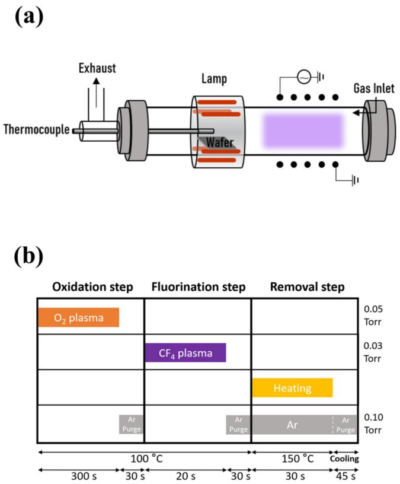
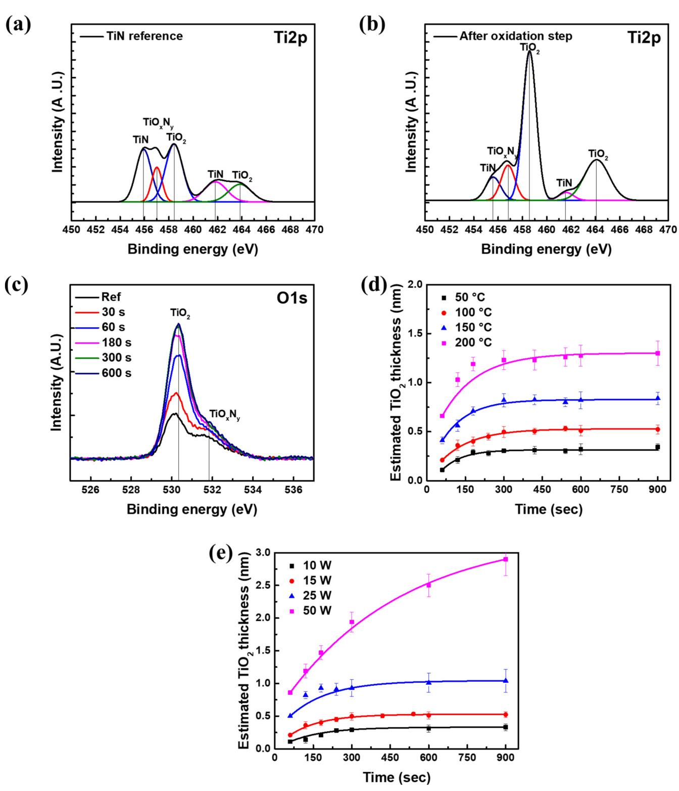
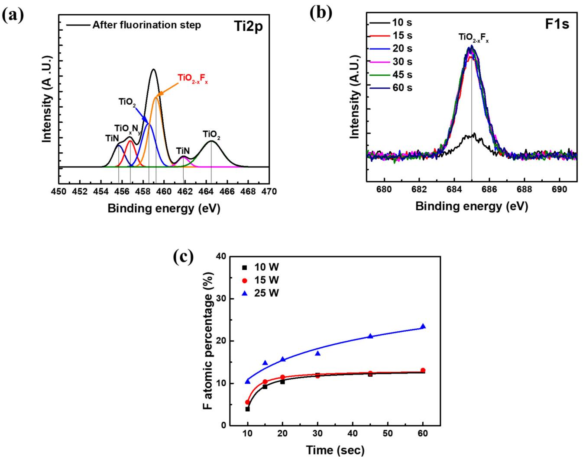
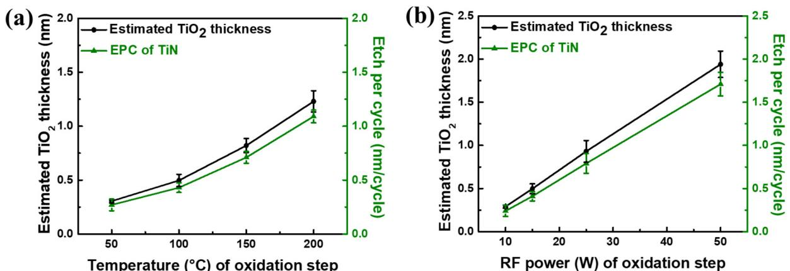
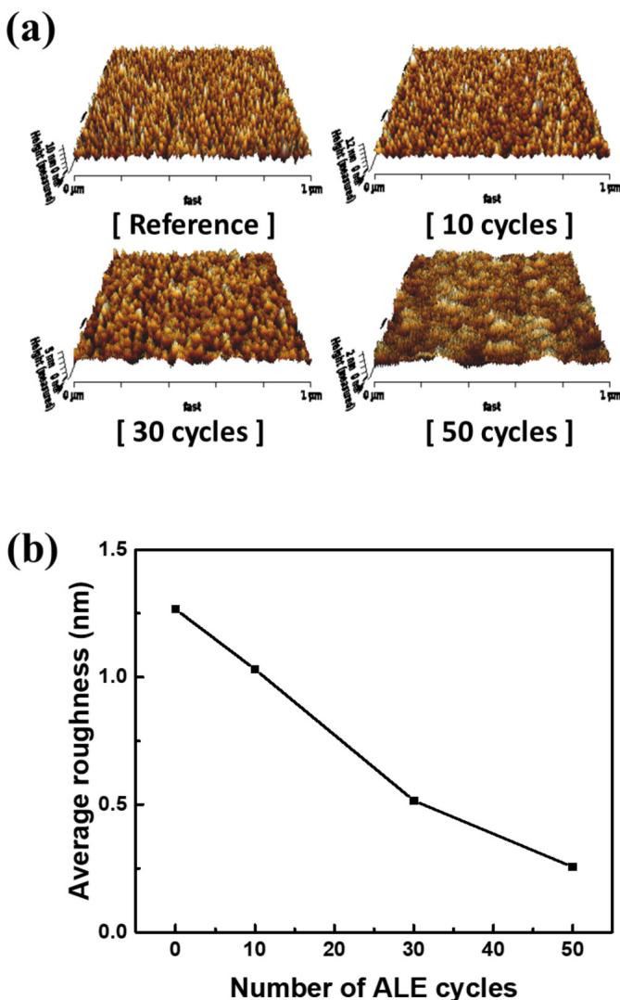
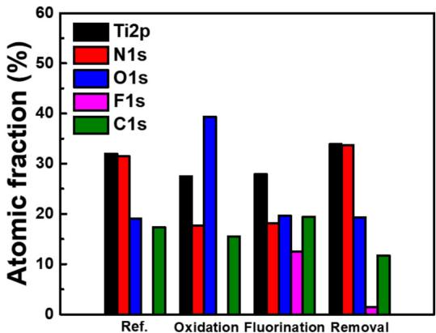

RESEARCH ARTICLE | FEBRUARY 25 2022

# Plasma atomic layer etching for titanium nitride at low temperatures  $\mathcal{O}$

Special Collection: Plasma Processing for Advanced MicroelectronicsDahee Shim; Jihyun Kim; Yongjae Kim; Heeyeop Chae

Check for updatesJ. Vac. Sci. Technol. B 40, 022208 (2022) https://doi.org/10.1116/0001602

# Articles You May Be Interested In

Low- temperature plasma atomic layer etching of molybdenum via sequential oxidation and chlorinationJ. Vac. Sci. Technol. A (January 2022)

Atomic layer etching of  $\mathrm{SiO}_2$  for surface cleaning using ammonium fluorosilicate with  $\mathrm{CF}_4 / \mathrm{NH}_3$  plasmaJ. Vac. Sci. Technol. A (January 2020)

Nanocrystalline Lanthyrum Oxyfluoride Thin Films by XPS

Surf. Sci. Spectra (September 2005)

# Plasma atomic layer etching for titanium nitride at low temperatures

Cite as: J. Vac. Sci. Technol. B 40, 022208 (2022); doi: 10.1116/6.0001602  Submitted: 8 November 2021 · Accepted: 7 February 2022 · Published Online: 25 February 2022

Dahee Shim, $^{1}$  Jihyun Kim, $^{1}$  Yongjae Kim, $^{2}$  and Heeyeop Chae $^{1,2,a)}$

# AFFILIATIONS

$^{1}$ School of Chemical Engineering, Sungkyunkwan University (SKKU), Suwon 16419, Republic of Korea   $^{2}$ SKKU Advanced Institute of Nanotechnology (SAINT), Sungkyunkwan University (SKKU), Suwon 16419, Republic of Korea

Note: This paper is a part of the Special Topic Collection on Plasma Processing for Advanced Microelectronics.   $^{a)}$ Author to whom correspondence should be addressed: hchae@skku.edu

# ABSTRACT

Isotropic plasma atomic layer etching (ALE) was developed for titanium nitride (TiN) through a three- step process: plasma oxidation, plasma fluorination, and thermal removal at low temperatures. In the plasma oxidation step, TiN was oxidized to form a titanium oxide  $\mathrm{(TiO_2)}$  layer with O radicals generated from  $\mathrm{O_2}$  plasma at  $100^{\circ}\mathrm{C}$ . The  $\mathrm{TiO_2}$  thickness was found to be saturated with plasma after an exposure time of  $300~\mathrm{s}$ , and the saturated thickness increased from 0.29 to  $1.23\mathrm{nm}$  with increasing temperature and RF power. In the plasma fluorination step, the  $\mathrm{TiO_2}$  layer was converted to titanium oxyfluoride  $\mathrm{(TiO_2 - xF_x)}$  with F radicals generated in the  $\mathrm{CF_4}$  plasma at  $100^{\circ}\mathrm{C}$ . The F atomic fraction on the surface was found to be saturated at  $12\%$ , with TiO powers below  $15\mathrm{W}$  in the fluorination step. The process temperature was increased during the removal step, and the  $\mathrm{TiO_2 - xF_x}$  formed by plasma fluorination was completely removed above  $150^{\circ}\mathrm{C}$ . The removal rates of TiN ranged from 0.24 to  $1.71\mathrm{nm}$  cycle by controlling the thickness of the  $\mathrm{TiO_2}$  layer determined earlier. The average surface roughness of TiN decreased from 1.27 to  $0.26\mathrm{nm}$  after 50 cycles of the ALE process. This work demonstrated that plasma oxidation and fluorination with thermal removal can remove TiN at the atomic scale at low temperatures for atomic- scale three- dimensional devices.

Published under an exclusive license by the AVs. https://doi.org/10.1116/6.0001602

# I. INTRODUCTION

Semiconductor performance, such as transistor speed and power consumption, has been improving over the last several decades through methods such as reducing critical dimensions and developing 3D structures.12 The reduction of critical dimensions requires scaling down the gate oxide thickness as well as the lateral dimension of metal- oxide- semiconductor field- effect transistors.3- 5

$\mathrm{SiO_2}$  is the most popular gate oxide material, owing to its excellent stability; however, it has reached the limit in thickness reduction because of the tunneling leakage current at nanometer scale thickness. High- k materials such as  $\mathrm{HfO_2}$ $\mathrm{ZrO_2}$  and  $\mathrm{Al}_2\mathrm{O}_3$  (Refs. 6- 10) are being adopted and studied for possible usage as a nanometer scale gate oxide. However, high- k dielectric materials are known to react with the conventional highly doped poly- silicon gate on top of the gate oxide and generate parasitic capacitance and Fermi- level pinning.11- 13 Therefore, high- k materials require new metal gate materials with a midgap work function, high thermal stability, matching lattice structure, and adhesion with the high- k dielectric.4,14,15 Various metal nitride materials, such as TiN, TaN, MoN, and WN, are considered good candidates for metal gates. Titanium nitride (TiN) has been used as a metal gate electrode from 2D FinFETs to 3D FinFETs owing to its effective midgap work function, high thermal stability, and excellent adhesion.4,14,17

TiN gates are typically deposited by chemical vapor deposition and must be etched to form the required field- effect transistor (FET) structure. Various etching processes are developed for TiN, including wet etching processes with an ammonium hydroxide/ hydrogen peroxide mixture and conventional reactive ion etching (RIE) processes with  $\mathrm{Cl}_2$ ,  $\mathrm{Ar / Cl}_2$ ,  $\mathrm{Ar / BrCl}_3$ ,  $\mathrm{Ar / CHF}_3$ ,  $\mathrm{CF}_4 / \mathrm{Ar}$ , and  $\mathrm{SF}_6 / \mathrm{Ar}$  chemistries.18- 21 Wet etching processes typically show high surface roughness, making it difficult to control the etch rate at the nanometer scale.22 Controlling the etch rate at this scale is possible with conventional RIE processes with anisotropic patterns; however, RIE processes are not suitable for next- generation 3D structures, including gate- all- around FET and multibridge channel FET that require lateral and isotropic etching.23- 25 Previous research has demonstrated isotropic etching with thermal etching processes for next- generation 3D structures.4,26,27 The thermal

etching process of TiN is generally removed by forming volatile  $\mathrm{TiF_4}$  or  $\mathrm{TiCl_4}$  products at relatively high temperatures. $^{28,29}$  A thermal gas- phase etching process of TiN was developed by forming volatile  $\mathrm{TiCl_4}$  with  $\mathrm{SOCl}_2$  at temperatures of  $270 - 370^{\circ}\mathrm{C}$ . $^{28}$  Thermal atomic layer etching (ALE) of TiN was also removed by forming  $\mathrm{TiF_4}$  after oxidation with  $\mathrm{O_3}$  or  $\mathrm{H}_2\mathrm{O}_2$  and fluorination with HF at temperatures above  $150^{\circ}\mathrm{C}$ , and the etch rate remained almost constant at temperatures above  $250^{\circ}\mathrm{C}$ . $^{29}$  However, low- temperature processes are typically required to prevent the degradation of device performance, such as threshold voltage in high temperatures. $^{16,30}$  Therefore, atomic- scale etching techniques at low temperatures are required for TiN films in 3D structures.

In this study, a thermal ALE process was developed for atomic- scale TiN removal at low temperatures through plasma processes. This process consists of three sequential steps: plasma oxidation, plasma fluorination, and thermal removal. The chemical composition of the modified layer was analyzed by x- ray photoelectron spectroscopy (XPS) after the plasma oxidation and plasma fluorination steps. The TiN removal rates and self- limiting characteristics of the ALE process were investigated at various temperatures and RF powers. The surface roughness was investigated for each number of ALE cycles using AFM. The atomic composition of the surfaces after each step of ALE was compared using XPS.

# II. EXPERIMENT

The thermal ALE process of TiN was studied in a cylindrical, inductively coupled plasma (ICP) reactor with halogen lamps, as shown in Fig. 1(a). A plasma power with a frequency of  $13.56\mathrm{MHz}$  was supplied through an induction coil, and the samples were heated with six halogen lamps at a power of  $1000\mathrm{W}$ . TiN films  $50\mathrm{nm}$  thick were deposited by sputtering on the  $\mathrm{SiO_2 / Si}$  substrates, and the error range of TiN film thickness was  $\pm 1\mathrm{nm}$ . The  $1.8\times 1.8\mathrm{cm}^2$  TiN samples were positioned on  $5\times 5\mathrm{cm}^2$  Si carrier wafers and placed at the center of the halogen lamps. The sequence for the thermal ALE three- step process for TiN etching is shown in Fig. 1(b). The oxidation step involves the formation reaction of the  $\mathrm{TiO_2}$  on TiN surface by radicals generated in the  $\mathrm{O_2}$  plasma, while the fluorination step is the conversion reaction of the  $\mathrm{TiO_2}$  layer to the  $\mathrm{TiO_{2 - x}F_{x}}$  layer with the F radicals generated in the  $\mathrm{CF_4}$  plasma. In the thermal removal step, the  $\mathrm{TiO_{2 - x}F_{x}}$  layer is partially removed at a temperature higher than  $120^{\circ}\mathrm{C}$  and is completely removed at temperatures above  $150^{\circ}\mathrm{C}$ .

The reaction conditions were as follows: in the plasma oxidation step, the  $\mathrm{O_2}$  flow rate of 5 SCCM and pressure of  $0.05\mathrm{Torr}$  were fixed, while the substrate temperature was varied from 50 to  $300^{\circ}\mathrm{C}$ , and the RF power was varied from 10 to  $50\mathrm{W}$ . The standard process conditions of the oxidation step were set up with an  $\mathrm{O_2}$  gas flow of 5 SCCM, a pressure of  $0.5\mathrm{Torr}$ , a temperature of  $100^{\circ}\mathrm{C}$ , and an RF power of  $15\mathrm{W}$ . In the plasma fluorination step, a  $\mathrm{CF_4}$  flow rate of 2 SCCM, a pressure of  $0.03\mathrm{Torr}$ , and a temperature of  $100^{\circ}\mathrm{C}$  were fixed, while the plasma power was varied in the range of  $10 - 25\mathrm{W}$ . In the thermal removal step, the temperature was increased to  $200^{\circ}\mathrm{C}$  in an Ar environment with a flow rate of  $50\mathrm{SCCM}$  for  $30\mathrm{s}$  without any RF power. The  $50\mathrm{SCCM}$  of Ar was maintained between each step for purging. These three steps were repeated to remove the TiN layer for up to 50 cycles.

  
FIG. 1. (a) Schematic diagram of a cylindrical ICP reactor with halogen lamps and (b) the description of the TiN ALE process using oxidation in  $\mathrm{O_2}$  plasma, fluorination in  $\mathrm{CF_4}$  plasma, and removal step by the heating method.

The thickness of the TiN layer was measured using an ex situ spectroscopic ellipsometer (Ellipso- Technology, Elli- SE- U) by the Lorentz oscillator model $^{31}$  for the fitting range of  $1.4 - 5.2\mathrm{eV}$ , and this measurement employed an incidence angle of  $70.2^{\circ}$ . The binding energy and surface atomic fraction of the TiN surface were measured using XPS (Thermo Scientific, ESCALAB 250) in constant analyzer energy mode by five scans, at a sample tilt of  $\pm 90^{\circ}$ , a step size of  $0.05\mathrm{eV}$ , a beam size of  $650\mu \mathrm{m}$ , and at a beam energy of  $20\mathrm{eV}$ . The average surface roughness was determined by high- resolution atomic force microscopy (HR- AFM, JPK Instruments, Nano- Wizard Ultra Speed) with a physical size of  $1\times 1\mu \mathrm{m}^2$  before and after ALE.

# III. RESULTS AND DISCUSSION

As a first step, titanium nitride (TiN) was oxidized with  $\mathrm{O_2}$  plasma, and the surface chemical composition and oxidation depth were investigated by varying the temperature, RF power, and processing time. The oxidation of TiN was identified by comparing the Ti2p peak in XPS spectra before and after the oxidation, as shown in Fig. 2. The peaks at  $455.9$  and  $461.7\mathrm{eV}$  were identified for TiN,  $458.5$  and  $464.0\mathrm{eV}$  for  $\mathrm{TiO_2}$ , and  $457.0\mathrm{eV}$  for  $\mathrm{TiO_xN_y}$  (Refs. 32 and 33), as shown in Fig. 2(a) before the oxidation. After

  
FIG. 2. Ti2p XPS spectra intensity (a) before and (b) after the oxidation step, and (c) O1s XPS spectra intensity by varying the processing time at  $100^{\circ}$ C and  $15$ W. The thickness of the  $\mathrm{TiO_2}$  layer as a function of (d) temperature at  $15$ W and (e) RF power at  $100^{\circ}$ C in the oxidation step. The standard process conditions of the oxidation step were  $\mathrm{O_2}$  gas flow of  $5$ SCCM, a pressure of  $0.5$  Torr, a temperature of  $100^{\circ}$ C, an RF power of  $15$ W, and a processing time of  $300$ s.

the oxidation step, the  $\mathrm{TiO_2}$  peaks drastically increase and TiN peaks decrease, as shown in Fig. 2(b). The degree of oxidation at  $100^{\circ}\mathrm{C}$  and  $15\mathrm{W}$  was studied by the O1s peak at a binding energy of  $530.3\mathrm{eV}$  for  $\mathrm{TiO_2}$  and  $531.8\mathrm{eV}$  for  $\mathrm{TiO_xN_y}$  (Ref. 32) in the XPS spectra, as shown in Fig. 2(c). The presence of the O1s peak was observed due to the native oxide formed during the ex situ XPS analysis. The peak intensity at  $530.3\mathrm{eV}$  increased until  $300\mathrm{s}$  of plasma- exposure time and saturated after  $300\mathrm{s}$ , indicating the saturation of the oxide thickness. Additionally, the dependence of the  $\mathrm{TiO_2}$  layer thickness on temperature was investigated at various plasma- exposure times, as shown in Fig. 2(d). The thickness of  $\mathrm{TiO_2}$  was determined with ellipsometer data fitted with the Lorentz oscillator model. However, we believe that the accuracy of the thickness measurement has a limitation due to the  $\mathrm{TiO_xN_y}$  interfacial layer formed at the interface between  $\mathrm{TiO_2}$  and TiN, and, therefore, we used the term "Estimated  $\mathrm{TiO_2}$  thickness." At all temperatures, the estimated  $\mathrm{TiO_2}$  thickness was saturated, and the oxidized layer thickened from  $0.31\mathrm{nm}$  at  $50^{\circ}\mathrm{C}$  to  $1.23\mathrm{nm}$  at  $200^{\circ}\mathrm{C}$ . The increase in the  $\mathrm{TiO_2}$  thickness after the oxidation of  $\mathrm{TiN}$  on exposure to  $\mathrm{O_2}$  was also reported at high temperatures of  $250 - 600^{\circ}\mathrm{C}$ . This increase in the oxide thickness can be attributed to the increase in the diffusion depth of the  $\mathrm{O}$  radical at high temperatures. The saturation of the thickness was also reported in an  $\mathrm{O_3}$  environment at  $250^{\circ}\mathrm{C}$  in previous studies. Furthermore, the dependence of oxide thickness on RF power was also investigated at different plasma- exposure times, as shown in Fig. 2(e). The saturation of estimated  $\mathrm{TiO_2}$  thickness was observed at an RF power below  $25\mathrm{W}$ , but no saturation was observed at  $50\mathrm{W}$  within  $900\mathrm{s}$ .

  
FIG. 3. (a) Ti2p XPS spectra intensity after the fluorination step and (b) F1s XPS spectra intensity of  $685.0\mathrm{eV}$  with varying the processing time at  $100^{\circ}\mathrm{C}$  and  $15\mathrm{W}$  of fluorination step. (c) F atomic fraction with  $\mathrm{CF_4}$  plasma-exposure time at RF powers of 10, 15, and  $25\mathrm{W}$  in the fluorination step. The standard process conditions of the fluorination step were a  $\mathrm{CF_4}$  gas flow of 2 SCCM, a pressure of  $0.03\mathrm{Torr}$ , a temperature of  $100^{\circ}\mathrm{C}$ , an RF power of  $15\mathrm{W}$ , and a processing time of  $20\mathrm{s}$ .

  
FIG. 4. (a) Ti2p XPS spectra intensity after the removal step at a temperature of  $150^{\circ}C$ , (b) F1s XPS spectra intensity of  $685.0 \text{eV}$ , and (c) F1s peak area spectra intensity for  $\text{TiO}_{2 - x}\text{F}_x$  products as a function of temperature at the removal step. The standard process conditions of the removal step were an Ar gas flow of 50 SCCM, a pressure of 0.1 Torr, a temperature of  $150^{\circ}C$ , and a time of 30 s without RF power.

  
FIG. 5. Thickness of  $\text{TiO}_2$  and EPC for ten cycles of TiN during the oxidation step as (a) a function of temperature, with a constant RF power of 15 W and (b) a function of RF power, with a constant temperature of  $100^{\circ}C$  The standard process conditions for the oxidation step used  $O_2$  at 5 SCCM, 0.05 Torr,  $100^{\circ}C$  and 15 W, and the fluorination step used  $\mathbb{CF}_4$  at 2 SCCM, 0.03 Torr,  $100^{\circ}C$  and 15 W. At the removal step, the temperature was increased to  $150^{\circ}C$  with an Ar of 50 SCCM for 30 s without RF power.

The saturated  $\mathrm{TiO_2}$  layer thickened from  $0.29\mathrm{nm}$  at  $10W$  to  $0.93\mathrm{nm}$  at  $25W$  This increase in the oxide thickness is attributed to the increased O radical density at high RF power.

Next, during the fluorination step, the oxidized surface  $\mathrm{TiO_2}$  layer was fluorinated with  $\mathrm{CF_4}$  plasma, and the degree of fluorination was investigated using XPS by varying the processing time and RF power. The conversion of  $\mathrm{TiO_2}$  to  $\mathrm{TiO_{2 - x}F_x}$  was identified by Ti2p peaks, as shown in Fig. 3(a). The intensities of the  $\mathrm{TiO_2}$  peaks at 458.6 and  $464.3\mathrm{eV}$  decrease and the intensity of the  $\mathrm{TiO_{2 - x}F_x}$  peak at  $459.2\mathrm{eV}$  (Ref. 35) increases. The intensities of the  $\mathrm{TiO_2}$

  
FIG. 6. (a) Surface morphology and (b) average roughness were investigated by atomic force microscopy of reference material, and a TiN film after 10, 30, and 50 cycles of the ALE process. The oxidation step was performed using  $\mathrm{O_2}$  at 5 SCCM, 0.05 Torr,  $100^{\circ}\mathrm{C}$ , and  $15W$ , and the fluorination step was performed using  $\mathrm{CF_4}$  at 2 SCCM, 0.03 Torr,  $100^{\circ}\mathrm{C}$ , and  $15W$ . At the removal step, the temperature was increased to  $150^{\circ}\mathrm{C}$  with an Ar of 50 SCCM for  $30s$  without RF power.

peak return to the reference level in the Ti2p peak after the fluorination step, indicating that the  $\mathrm{TiO_2}$  layer converted to the  $\mathrm{TiO_{2 - x}F_{x}}$  layer.  $\mathrm{TiO_{2 - x}F_{x}}$  was also identified by the F1s peak at a binding energy of  $685.0\mathrm{eV}$  (Ref. 35) in XPS spectra and its dependence on  $\mathrm{CF_4}$  exposure time was investigated at  $100^{\circ}\mathrm{C}$ , as shown in Fig. 3(b). The peak intensity of  $685.0\mathrm{eV}$  increased for the first  $20s$  of plasma fluorination time and saturated after  $20s$ . The RF power was then varied, and its dependence on the atomic fraction F is shown in Fig. 3(c). The F atomic fraction on the surface is saturated at  $12\%$  with the RF power below  $15W$ , while it continuously increases over time when the RF power is above  $25W$ . The saturation of the fluorinated thickness is essential for self- limiting characteristic ALE processes, and the saturation was achieved with a low power below  $15W$  in this work.

In the final thermal removal step,  $\mathrm{TiO_{2 - x}F_{x}}$  layers were removed by heating the surface, and the temperature dependence of  $\mathrm{TiO_{2 - x}F_{x}}$  removal was investigated in each sample using XPS. The removal of  $\mathrm{TiO_{2 - x}F_{x}}$  at a temperature of  $150^{\circ}\mathrm{C}$  was identified by the Ti2p peak, as shown in Fig. 4(a), and all peaks returned to the TiN reference level, indicating the similar surface state after etching. The variation in the F1s peak intensity at a binding energy of  $685.0\mathrm{eV}$  at different temperatures is shown in Fig. 4(b), and the area of the peak is plotted in Fig. 4(b). The peak intensity began to decline at temperatures above  $120^{\circ}\mathrm{C}$ , and the peak completely disappeared above  $150^{\circ}\mathrm{C}$ . This indicates that the  $\mathrm{TiO_{2 - x}F_{x}}$  products were removed as they got volatile in the range of  $120 - 150^{\circ}\mathrm{C}$  and a temperature above  $150^{\circ}\mathrm{C}$  was required for the removal step, as shown in Fig. 4(c).

Ideally, only the  $\mathrm{TiO_2}$  layer should be removed from the surface without affecting TiN; this phenomenon was investigated by directly comparing the  $\mathrm{TiO_2}$  thickness with the etch per cycle (EPC) of TiN for ten cycles in Figs. 5(a) and 5(b). The difference between the estimated thickness of  $\mathrm{TiO_2}$  and the EPC of TiN increases with increasing temperature and RF power. The total thickness is believed to increase after oxidation because the density of  $\mathrm{TiO_2}$ $(3.9\mathrm{g / cm}^3)$  is lower than that of TiN  $(5.2\mathrm{g / cm}^3)$ . Interfacial  $\mathrm{TiO_{x}N_{y}}$  between TiN and  $\mathrm{TiO_2}$  could also be responsible for the difference. The EPC of TiN increased from  $0.27\mathrm{nm}$  cycle at  $50^{\circ}\mathrm{C}$  to  $1.09\mathrm{nm}$  cycle at  $200^{\circ}\mathrm{C}$ . Similarly, the EPC of TiN increased from  $0.24\mathrm{nm}$  cycle at  $10W$  to  $1.71\mathrm{nm}$  cycle at  $50W$ . A previous ALE study using  $\mathrm{O_3}$  oxidation and HF fluorination also reported an increase in the etch rate with oxidation depth. These results suggest that the etching thickness can be controlled from the atomic scale to the nanometer scale using this plasma ALE process.

The TiN surface roughness was investigated before the ALE process and after 10, 30, and 50 cycles of the ALE process using AFM, as shown in Figs. 6(a) and 6(b). The surface roughness of the TiN films decreases as the number of ALE cycles increases, from  $1.27\mathrm{nm}$  before ALE process to  $0.26\mathrm{nm}$  after 50 cycles. Previous studies reported an improved surface roughness after the ALE process and explain that the protrusions on the surface may have more reactive adsorption sites in the adsorption step. We also believe that the improved surface roughness can be attributed to the reactive sites on the protrusion sites in this study.

The chemical composition of the surfaces during the three steps of the TiN ALE process (plasma oxidation, plasma

  
FIG. 7. Atomic fraction of a TiN surface after the oxidation, fluorination, and removal steps of the TiN ALE process. The oxidation step was performed using  $\Omega_{2}$  at 5 SCCM, 0.05 Torr,  $100^{\circ}\mathrm{C}$ , and  $15\mathrm{W}$ , and the fluorination step was performed using  $\mathrm{CF_4}$  at 2 SCCM, 0.03 Torr,  $100^{\circ}\mathrm{C}$ , and  $15\mathrm{W}$ . At the removal step, the temperature was increased to  $150^{\circ}\mathrm{C}$  with an Ar of 50 SCCM for  $30\mathrm{s}$  without RF power.

fluorination, and thermal step) is analyzed and summarized in Fig. 7. The Ti/N ratio was close to 1.0, and  $19.1\%$  of  $\mathrm{O}$  was observed due to the native oxide formed during the ex situ XPS analysis. After the plasma oxidation step, the  $\mathrm{O}$  fraction increased to  $39.4\%$  and the  $\mathrm{N}$  fraction decreased by  $17.6\%$  from  $31.5\%$  by forming a  $\mathrm{TiO_2}$  layer on the TiN surface. The  $\mathrm{O / Ti}$  ratio was measured at 1.4, which is lower than 2, that of ideal  $\mathrm{TiO_2}$  and this lower value is attributed to the deeper penetration depth of XPS, about  $5\mathrm{nm}$  in this study. After the plasma fluorination step, the  $\mathrm{F}$  fraction increased to  $12.3\%$  and the  $\mathrm{O}$  fraction was reduced to  $19.7\%$  because  $\mathrm{TiO_2}$  was converted to  $\mathrm{TiO_{2 - x}F_x}$ . After the removal step, the Ti/N ratio of 1.0 was observed to be nearly the same as before the ALE processing, and the O1s atomic fraction was observed as a reference level, indicating a surface similar to that before ALE. Only  $1.4\%$  of the  $\mathrm{F}$  fraction remained on the ALE- processed TiN surface.

# IV. SUMMARY AND CONCLUSIONS

In this study, a low- temperature ALE process with plasma was developed for TiN etching. The process consisted of three sequential steps: plasma oxidation, plasma fluorination, and thermal removal. In the plasma oxidation step, the thickness of the  $\mathrm{TiO_2}$  layer increased with increasing temperature and RF power, and the self- limiting characteristics were identified in the temperature range of  $50 - 200^{\circ}\mathrm{C}$  and an RF power below  $25\mathrm{W}$ . In the plasma fluorination step, the  $\mathrm{F}$  atomic fraction on the surface was saturated at  $12\%$  with an RF power below  $15\mathrm{W}$ . In the removal step,  $\mathrm{TiO_{2 - x}F_x}$  products were completely removed at temperatures above  $150^{\circ}\mathrm{C}$ . The removal rates of TiN ranging from 0.24 to  $1.71\mathrm{nm}$  cycle were identified by controlling the thickness of the  $\mathrm{TiO_2}$  layer using temperature and RF power. The surface roughness after the thermal ALE process was lower than that of the TiN reference. From these results, the proposed thermal ALE of TiN is expected to provide an effective process for atomic- scale next- generation three- dimensional structures.

# ACKNOWLEDGMENTS

This work was supported by the National Research Foundation of Korea (NRF) grant funded by the Korea Government (MSIT) (No. 2018R1A2A3074950) and by the Korea Institute for Advancement of Technology (KIAI) and the Ministry of Trade, Industry and Energy (MOTIE) of the Republic of Korea (No. P0017363).

# AUTHOR DECLARATIONS

# Conflict of Interest

The authors have no conflicts to disclose.

# DATA AVAILABILITY

The data that support the findings of this study are available from the corresponding author upon reasonable request.

# REFERENCES

1R. R. Schaller, IEEE Spectrum 34, 52 (1997). 2G. E. Thompson and S. Parthasarathy, Mater. Today 9, 20 (2006). 3H. T. Bohr and I. A. Young, IEEE Micro 37, 20 (2017). 4H. H. Radamson et al., Micromachines 10, 293 (2019). 5D. L. Critchlow, Proc. IEEE 87, 659 (1999). 6R. Mullins, S. Kondati Natarajan, S. D. Elliott, and M. Nolan, Chem. Mater. 32, 3414 (2020). 7N. P. Maity, R. Maity, R. K. Thapa, and S. Baishya, J. Nanoelectron. Optoelectron. 10, 645 (2015). 8C.- G. Lee and A. Dodabalapur, J. Electron. Mater. 41, 895 (2012). 9A. Stesmans and V. V. Afanas'ev, Appl. Phys. Lett. 80, 1957 (2002). 10F. L. Martinez, M. Toledano- Luque, J. J. Gandia, J. Carabe, W. Bohne, J. Rohrich, E. Strub, and I. Martil, J. Phys. D: Appl. Phys. 40, 5256 (2007). 11D. Lim, R. Haight, M. Copel, and E. Cartier, Appl. Phys. Lett. 87, 072902 (2005). 12A. Stesmans and V. V. Afanas'ev, Appl. Phys. Lett. 82, 4074 (2003). 13J. Robertson, Solid State Electron. 49, 283 (2005). 14J. Westlinder, T. Schram, L. Pantisano, E. Cartier, A. Kerber, G. S. Lujan, J. Olsson, and G. Groeseneken, IEEE Electron Device Lett. 24, 550 (2003). 15H. Y. Yu et al., IEEE Electron Device Lett. 24, 230 (2003). 16G. D. Wilk, M. Verghese, P. J. Chen, and J. W. Maes, ECS Trans. 50, 207 (2013). 17B. Claflin, M. Binger, and G. Lucovsky, J. Vac. Sci. Technol. A 16, 1757 (1998). 18H. K. Chiu, T. L. Lin, Y. Hu, K. C. Leeu, H. C. Lin, M. S. Tsai, and J. Y. Huang, J. Vac. Sci. Technol. A 19, 455 (2001). 19J. Tonotani, T. Iwamoto, F. Sato, K. Hattori, S. Ohmi, and H. Iwai, J. Vac. Sci. Technol. B 21, 2163 (2003). 20M. Darnon, T. Chevolleau, D. Eon, L. Vallier, J. Torres, and O. Joubert, J. Vac. Sci. Technol. B 24, 2262 (2006). 21C. J. Choi, Y. S. Seol, and K.- H. Baik, Jpn. J. Appl. Phys. 37, 801 (1998). 22Y. Liu et al., Jpn. J. Appl. Phys. 49, 06GH18 (2010). 23H. Jansen, H. Gardeniers, M. de Boer, M. Elwenspoek, and J. Fluitman, J. Micromech. Microeng. 6, 14 (1996). 24K. Shinoda et al., J. Phys. D: Appl. Phys. 50, 194001 (2017). 25B. Hanrahan, C. M. Waits, and R. Ghodssi, J. Micromech. Microeng. 24, 015021 (2014). 26N. G. Orji et al., Nat. Electron. 1, 532 (2018). 27A. Fischer, A. Routzahn, S. M. George, and T. Lill, J. Vac. Sci. Technol. A 39, 030801 (2021).

28V. Sharma, T. Blomberg, S. Haukka, S. Cembella, M. E. Givens, M. Tuominen, R. Odedra, W. Graff, and M. Ritala, Appl. Surf. Sci. 540, 148309 (2021). 29Y. Lee and S. M. George, Chem. Mater. 29, 8202 (2017). 30R. Wang, J. Dunkley, T. A. DeMassa, and L. F. Jelsma, IEEE Trans. Electron Devices 18, 386 (1971). 31G. E. Jellison, Jr., Thin Solid Films 234, 416 (1993). 32C.- C. Chang, J. Nogan, Z.- P. Yang, W. J. Kort- Kamp, W. Ross, T. S. Luk, D. A. Dalvit, A. K. Azad, and H. T. Chen, Sci. Rep. 9, 15287 (2019).

33P. Yang et al., Adv. Sci. 3, 1500299 (2016). 34A. Glaser, S. Surnev, F. P. Netzer, N. Fateh, G. A. Fontalvo, and C. Mitterer, Surf. Sci. 601, 1153 (2007). 35J. Halim, I. Persson, P. Eklund, P. O. A. Persson, and J. Rosen, RSC Adv. 8, 36785 (2018). 36F. Piallat, R. Gassilloud, P. Caubet, and C. Vallee, J. Vac. Sci. Technol. A 34, 151508 (2016). 37K. J. Kanarik, S. Tan, and R. A. Gottscho, J. Phys. Chem. Lett. 9, 4814 (2018).