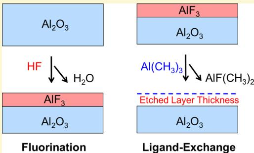
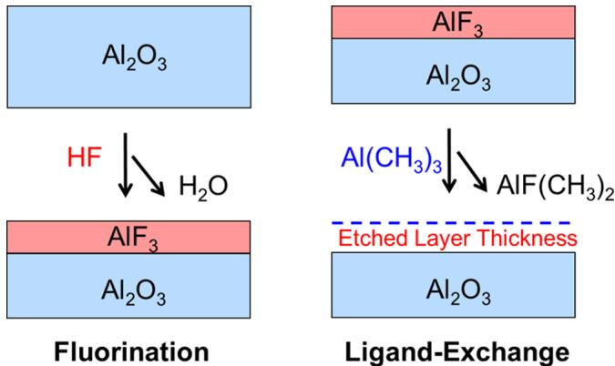
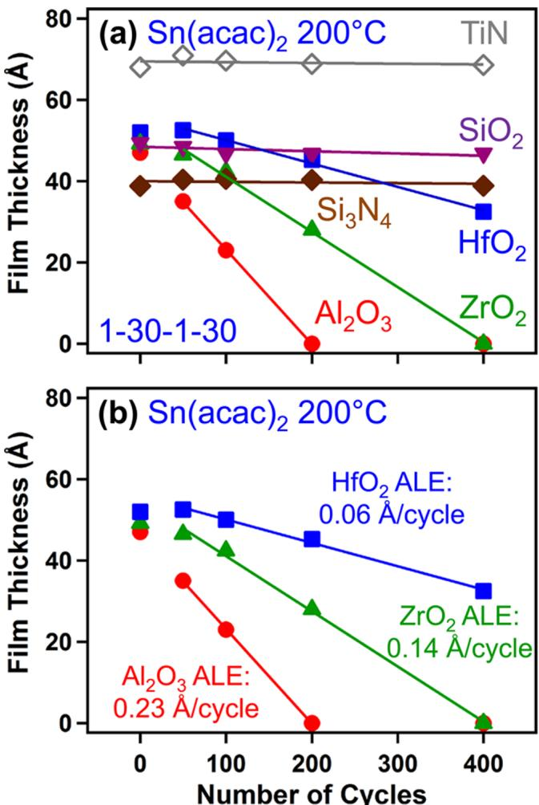
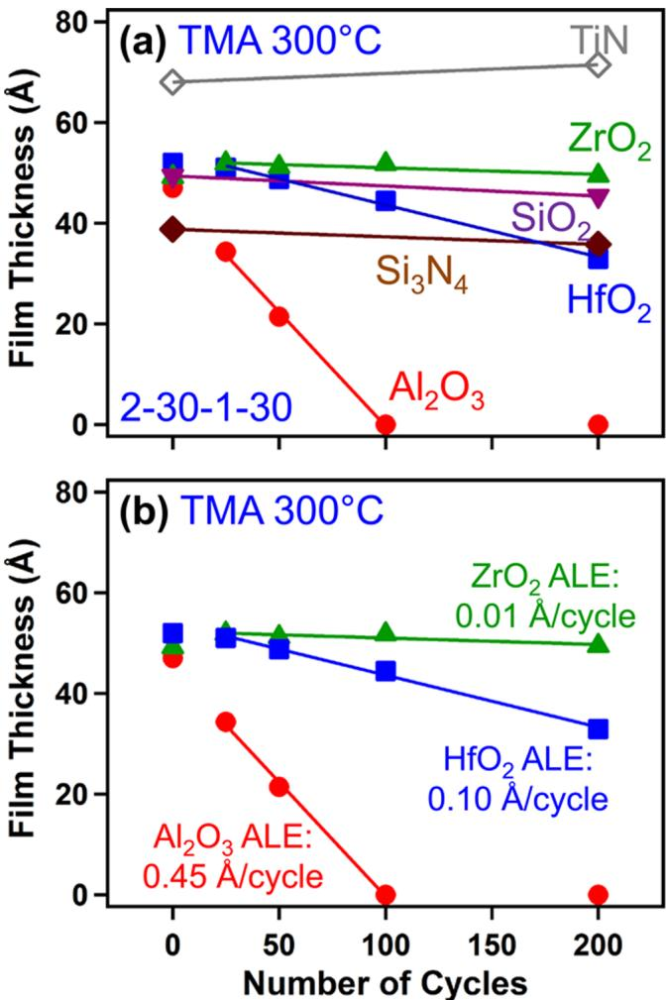
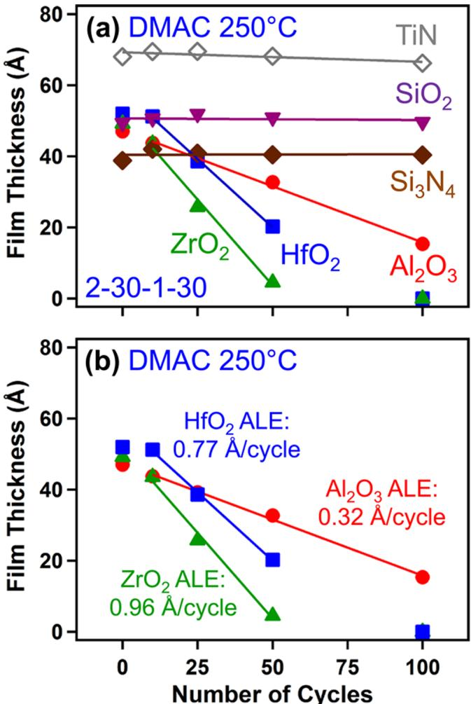
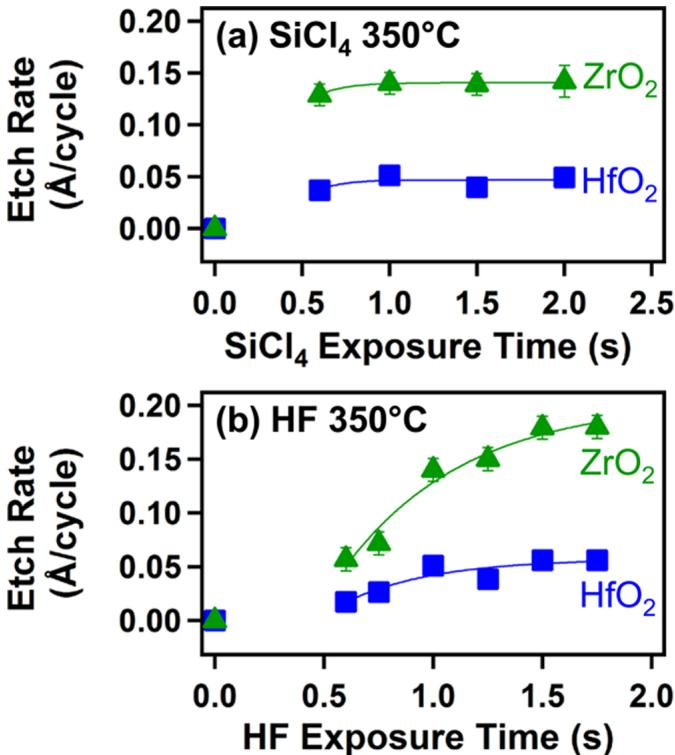
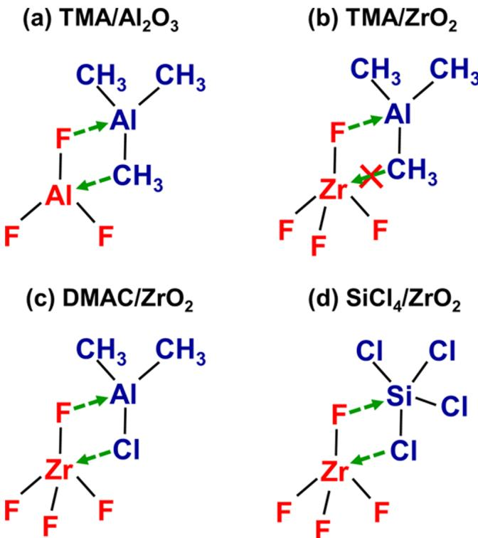
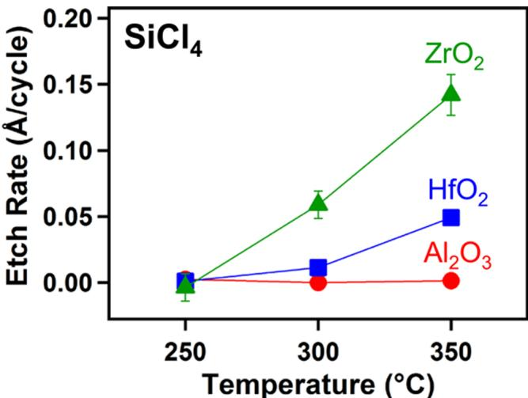
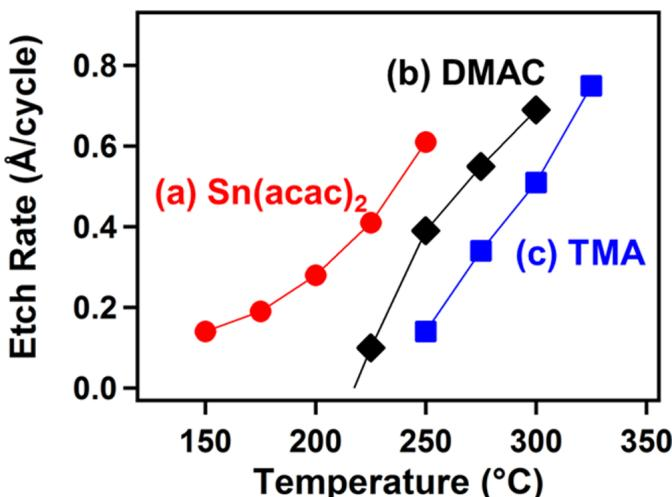

# Selectivity in Thermal Atomic Layer Etching Using Sequential, Self-Limiting Fluorination and Ligand-Exchange Reactions

Younghee Lee,† Craig Huffman,‡ and Steven M. George*,§

†Department of Chemistry and Biochemistry, University of Colorado, Boulder, Colorado 80309, United States  ‡SUNY Poly SEMATECH, Albany, New York 12203, United States  §Department of Mechanical Engineering, University of Colorado, Boulder, Colorado 80309, United States

ABSTRACT: Atomic layer etching (ALE) can result from sequential, self- limiting thermal reactions. The reactions during thermal ALE are defined by fluorination followed by ligand exchange using metal precursors. The metal precursors introduce various ligands that may transfer during ligand exchange. If the transferred ligands produce stable and volatile metal products, then the metal products may leave the surface and produce etching. In this work, selectivity in thermal ALE was examined by exploring tin(II) acetylacetonate  $\left(\mathrm{Sn}(\mathrm{acac})_{2}\right)$ , trimethylaluminum (TMA), dimethylaluminum chloride (DMAC), and  $\mathrm{SiCl}_{4}$  as the metal precursors. These metal precursors provide acac, methyl, and chloride ligands for ligand exchange. HF pyridine was employed as the fluorination reagent. Spectroscopic ellipsometry was used to measure the etch rates of  $\mathrm{Al}_2\mathrm{O}_3,$ $\mathrm{HfO}_2,$ $\mathrm{ZrO}_2,$ $\mathrm{SiO}_2,$ $\mathrm{Si}_3\mathrm{N}_4,$  and TiN thin films on silicon wafers. The spectroscopic ellipsometry measurements revealed that  $\mathrm{HfO}_2$  was etched by all of the metal precursors.  $\mathrm{Al}_2\mathrm{O}_3$  was etched by all of the metal precursors except  $\mathrm{SiCl}_4$ $\mathrm{ZrO}_2$  was etched by all of the metal precursors except TMA. In contrast,  $\mathrm{SiO}_2,$ $\mathrm{Si}_3\mathrm{N}_4,$  and TiN were not etched by any of the metal precursors. These results can be explained by the stability and volatility of the possible reaction products. Temperature can also be used to obtain selective thermal ALE. The temperature dependence of  $\mathrm{ZrO}_2,$ $\mathrm{HfO}_2,$  and  $\mathrm{Al}_2\mathrm{O}_3$  ALE was examined using  $\mathrm{SiCl}_4$  as the metal precursor. Higher temperatures can discriminate between the etching of  $\mathrm{ZrO}_2,$ $\mathrm{HfO}_2,$  and  $\mathrm{Al}_2\mathrm{O}_3$ . The temperature dependence of  $\mathrm{Al}_2\mathrm{O}_3$  ALE was also examined using  $\mathrm{Sn}(\mathrm{acac})_{2}$ , TMA, and DMAC as the metal precursors.  $\mathrm{Sn}(\mathrm{acac})_{2}$  etched  $\mathrm{Al}_2\mathrm{O}_3$  at temperatures  $\geq 150^{\circ}\mathrm{C}$ . DMAC etched  $\mathrm{Al}_2\mathrm{O}_3$  at higher temperatures  $\geq 225^{\circ}\mathrm{C}$ . TMA etched  $\mathrm{Al}_2\mathrm{O}_3$  at even higher temperatures  $\geq 250^{\circ}\mathrm{C}$ . The combination of different metal precursors with various ligands and different temperatures can provide multiple pathways for selective thermal ALE.

# I. INTRODUCTION

Atomic layer etching (ALE) can remove thin films with atomic scale precision using sequential, self- limiting surface reactions.12 Most reported ALE processes have employed halogenation reactions followed by energetic ion or noble gas atom bombardment to etch the material.1- 4 Thermal ALE processes have also been developed using sequential exposures of HF and metal precursors. Thermal ALE is the reverse of atomic layer deposition (ALD).6 Thermal ALE studies have demonstrated  $\mathrm{Al}_2\mathrm{O}_3$  ALE,7,8  $\mathrm{HfO}_2,$  ALE, and  $\mathrm{AlF}_3$  ALE.10 These thermal ALE investigations have utilized HF and  $\mathrm{Sn}(\mathrm{acac})_{2}$  as the reactants. Other recent thermal ALE studies have demonstrated  $\mathrm{Al}_2\mathrm{O}_3$  ALE using HF and trimethylaluminum (TMA) as the reactants.11

The reactions during thermal ALE are based on gas- phase fluorination and ligand exchange as illustrated in Figure 1.5 Fluorination first converts the metal- containing compound to the metal fluoride. Most fluorination reactions of metalcontaining compounds are thermochemically favorable.5,8 The metal precursor then undergoes a ligand- exchange reaction with the metal fluoride. The ligand exchange can be characterized as a metal exchange transmetalation reaction12 or a redistribution reaction.13 During the ligand- exchange reaction, the metal precursor can accept fluorine from the metal fluoride. The ligand- exchange reaction can also transfer a ligand from the metal precursor to the metal fluoride. The transition state is believed to be a four- center ring formed by the metal in the metal precursor and the metal in the metal fluoride with fluorine and ligand bridging species.12

If the ligand- exchange reaction produces stable and volatile metal products, then the metal products may leave the surface and produce etching. The ligand- exchange reaction may not occur or may not produce etching if the possible metal products are not stable or volatile. This difference between the stability and volatility of the possible metal reaction products can lead to selective etching. Selectivity in thermal ALE may also be achievable based on the stability of the resulting metal fluoride or by tuning the etching temperature.

Selectivity in etching is required to remove one material in the presence of other different materials. Selective ALE has many applications in semiconductor device fabrication and surface cleaning. The selectivity in thermal ALE may be much

  
Figure 1. Schematic for  $\mathrm{Al}_2\mathrm{O}_3$  ALE using HF and TMA as the reactants. HF fluorinates  $\mathrm{Al}_2\mathrm{O}_3$  to form an  $\mathrm{AlF}_3$  layer on the surface. Subsequently, TMA accepts  $\mathrm{F}$  from the  $\mathrm{AlF}_3$  layer and donates a methyl ligand to the  $\mathrm{AlF}_3$  layer to form volatile reaction products such as  $\mathrm{AlF}(\mathrm{CH}_3)_2$ .

higher than the selectivity during plasma ALE. The selectivity in plasma ALE depends on the energy thresholds for sputtering that are not clearly differentiated for most materials. One example of selectivity in plasma ALE is between  $\mathrm{SiO}_2$  and Si using fluorocarbon adsorption followed by  $\mathrm{Ar}^+$  ion bombardment. Reasonable selectivity is observed for  $\mathrm{SiO}_2$  etching versus Si etching at an  $\mathrm{Ar}^+$  ion energy of  $25\mathrm{eV}$ . However, selectivity is largely lost at the slightly higher ion energy of 30  $\mathrm{eV}$ .

In this work, the selectivity in thermal ALE was explored using four different metal precursors for ligand exchange with HF- pyridine as the fluorination precursor. The metal precursors were  $\mathrm{tin(II)}$  acetylacetonate  $(\mathrm{Sn(acac)}_2)$ , trimethylaluminum (TMA), dimethylaluminum chloride (DMAC), and silicon tetrachloride  $(\mathrm{SiCl}_4)$ . These metal precursors can transfer acac, methyl, and chloride ligands during the ligand- exchange reaction. These reactants were used to etch  $\mathrm{Al}_2\mathrm{O}_3$ ,  $\mathrm{HfO}_2$ ,  $\mathrm{ZrO}_2$ ,  $\mathrm{SiO}_2$ ,  $\mathrm{Si}_3\mathrm{N}_4$ , and TiN thin films on silicon wafers. These six materials are all important in semiconductor device processing. Spectroscopic ellipsometry was then employed to measure the film thicknesses versus number of ALE cycles for each of the six materials. These experiments were able to determine the selectivity of thermal ALE to the different materials using the various metal precursors and the relative etch rates.

Additional experiments explored the selectivity of thermal ALE resulting from substrate temperature. The etching of  $\mathrm{HfO}_2$ ,  $\mathrm{ZrO}_2$ , and  $\mathrm{Al}_2\mathrm{O}_3$  at different temperatures was explored using  $\mathrm{SiCl}_4$  as the molecular precursor.  $\mathrm{Al}_2\mathrm{O}_3$  ALE was also examined at various temperatures using  $\mathrm{Sn}(\mathrm{acac})_2$ , DMAC, and TMA as the metal precursors. These etching studies revealed that temperature can provide an additional pathway for selective thermal ALE.

# II. EXPERIMENTAL SECTION

The thermal ALE reactions were performed in a viscous flow ALD reactor. The reaction temperatures from 150 to  $350^{\circ}\mathrm{C}$  were maintained by a proportional- integral- derivative (PID) temperature controller (2604, Eurotherm). The pressure was monitored by a capacitance manometer (Baratron 121A, MKS). A constant flow of 150 sccm of ultra high purity (UHP)  $\mathrm{N}_2$  gas was supplied by mass flow controllers (Type 1179A, MKS). This  $\mathrm{N}_2$  gas flow produced a base pressure of  $\sim 1$  Torr in the reactor pumped by a mechanical pump (Pascal 2015SD, Alcatel).

The fluorination reaction employed a HF- pyridine solution (70 wt % HF, Sigma- Aldrich) as the HF source. The HF- pyridine solution has an equilibrium with gaseous HF. The vapor pressure of HF over the HF- pyridine solution is 90- 100 Torr at room temperature. Only gaseous HF, without measurable pyridine vapor, is observed in the gas phase. HF derived from the HF- pyridine solution avoids the difficulty of handling high pressure HF gas cylinders. The HF- pyridine solution was transferred to a gold- plated stainless steel bubbler in a dry  $\mathrm{N}_2$ - filled glovebag. The HF- pyridine solution was held at room temperature. The pressure transients of HF derived from the HF- pyridine source were adjusted to  $\sim 80$  mTorr using a metering bellows- sealed valve (SS- 4BMG, Swagelok).

The metal precursors for the ligand- exchange reaction were tin(II) acetylacetonate  $(\mathrm{Sn(acac)}_2$ ,  $37 - 38\%$  Sn, Gelest), trimethylaluminum (TMA) (97%, Sigma- Aldrich), dimethylaluminum chloride (DMAC) (97%, Sigma- Aldrich), and silicon tetrachloride  $(\mathrm{SiCl}_4)$  (98%, Gelest). The  $\mathrm{Sn}(\mathrm{acac})_2$  precursor was maintained at  $100^{\circ}\mathrm{C}$ . The  $\mathrm{Sn}(\mathrm{acac})_2$  pressure transients were adjusted to  $\sim 20$  mTorr using a metering valve. The TMA, DMAC, and  $\mathrm{SiCl}_4$  precursors were held at room temperature. The TMA and DMAC pressure transients were regulated at  $\sim 40$  mTorr using metering valves. The  $\mathrm{SiCl}_4$  pressure transients were defined at  $\sim 120$  mTorr also using a metering valve. The etch rates reached constant values at longer metal precursor exposures using these pressure transients.

Various thin films on silicon wafers were prepared by SEMATECH to measure the etch rates during thermal ALE. The TiN,  $\mathrm{Al}_2\mathrm{O}_3$ ,  $\mathrm{HfO}_2$ , and  $\mathrm{ZrO}_2$  films were deposited by semiconductor ALD processes in commercially available tools. Chemical vapor deposition was employed to prepare the  $\mathrm{SiO}_2$  and  $\mathrm{Si}_3\mathrm{N}_4$  films using typical process conditions in a high volume single wafer tool. The thickness of all the initial films was targeted to be  $\sim 50$  Å. Actual thicknesses were in the range of  $39-$ $68$  Å as determined by spectroscopic ellipsometry (SE) measurements. The ALE experiments were performed in parallel by placing the  $\mathrm{Al}_2\mathrm{O}_3$ ,  $\mathrm{HfO}_2$ ,  $\mathrm{ZrO}_2$ ,  $\mathrm{SiO}_2$ ,  $\mathrm{Si}_3\mathrm{N}_4$ , and TiN thin films on silicon wafers in the viscous flow reactor. For each experiment, there was one sample for each of the six materials. The six samples were each  $1.25\mathrm{cm}$  by  $1.25\mathrm{cm}$  in size.

The ALE reactions were performed using an optimized reaction sequence. This reaction sequence is represented as  $x - 30 - 1 - 30$  and consists of an exposure of metal precursor for  $x$  s,  $30$  s of  $\mathrm{N}_2$  purge,  $1$  s of HF exposure derived from the HF- pyridine solution, and  $30$  s of  $\mathrm{N}_2$  purge. The ALE reactions using  $\mathrm{Sn}(\mathrm{acac})_2$  as a metal precursor were performed using a reaction sequence of  $1 - 30 - 1 - 30$ . The ALE reactions using TMA, DMAC, or  $\mathrm{SiCl}_4$  as the metal precursor were performed using a reaction sequence of  $2 - 30 - 1 - 30$ . The reaction sequence is optimized when an additional increase in the exposure of the metal precursor does not produce a higher etch rate.

The thicknesses of the various films were measured by SE measurements. A spectroscopic ellipsometer (M- 2000, J. A. Woollam) measured  $\Psi$  and  $\Delta$  at  $240 - 900\mathrm{nm}$  with an incidence angle of  $75^{\circ}$ . The analysis software (CompleteEASE, J. A. Woollam) fitted  $\Psi$  and  $\Delta$  to determine the thicknesses and refractive index of the film. A Sellmeier model was used for fitting the thickness of the  $\mathrm{Al}_2\mathrm{O}_3$ ,  $\mathrm{HfO}_2$ ,  $\mathrm{ZrO}_2$ ,  $\mathrm{SiO}_2$ , and  $\mathrm{Si}_3\mathrm{N}_4$  films. A Lorentz model was used for fitting the TiN film. The film thickness versus number of ALE cycles determined the etch rate. Based on least- squares fitting of the film thicknesses versus number of ALE cycles, the reported etch rates are accurate to within  $\pm 0.01$  Å/cycle. Most of the individual least- squares fittings are accurate to within  $\pm 0.005$  Å/cycle.

The temperature- dependent ALE experiments on  $\mathrm{Al}_2\mathrm{O}_3$  were performed using an in situ quartz crystal microbalance (QCM) in the viscous flow ALD reactor. The quartz crystal (gold coated and polished, RC crystal,  $6\mathrm{MHz}$ , Phillip Technologies) was placed in a sensor head (BSH- 150, Inficon) and then sealed with high temperature epoxy (Epo- Tek H21D, Epoxy technology). The mass changes during the ALE reactions were recorded by a thin film deposition monitor (Maxtek TM- 400, Inficon). The initial  $\mathrm{Al}_2\mathrm{O}_3$  films were grown on the QCM crystal using  $\mathrm{Al}_2\mathrm{O}_3$  ALD with TMA and  $\mathrm{H}_2\mathrm{O}$  as the reactants at the same temperature as the ALE reactions.

# III. RESULTS AND DISCUSSION

A. Results for Selectivity Based on Metal Precursor. The etching results using  $\mathrm{Sn(acac)}_2$  as the metal precursor are presented in Figure 2. Figure 2a shows the SE measurements of

  
Figure 2. (a) Film thickness versus number of HF and  $\mathrm{Sn(acac)}_2$  reaction cycles at  $200^{\circ}\mathrm{C}$  for a variety of materials. (b) Film thickness versus number of HF and  $\mathrm{Sn(acac)}_2$  reaction cycles at  $200^{\circ}\mathrm{C}$  for  $\mathrm{Al}_2\mathrm{O}_3$ ,  $\mathrm{HfO}_2$ , and  $\mathrm{ZrO}_2$  showing etch rates.

the film thicknesses after 50, 100, 200, and 400 ALE cycles using sequential HF and  $\mathrm{Sn(acac)}_2$  exposures at  $200^{\circ}\mathrm{C}$ . The  $\mathrm{Al}_2\mathrm{O}_3$ ,  $\mathrm{ZrO}_2$ , and  $\mathrm{HfO}_2$  films were etched linearly versus the number of ALE cycles. In contrast, there were no measurable thickness changes for the  $\mathrm{SiO}_2$ ,  $\mathrm{Si}_3\mathrm{N}_4$ , and TiN films. Figure 2b displays the film thickness versus the number of ALE cycles for the  $\mathrm{Al}_2\mathrm{O}_3$ ,  $\mathrm{ZrO}_2$ , and  $\mathrm{HfO}_2$  films. The slopes from the linear least- squares fittings of the data in Figure 2b yielded etch rates of  $0.23\mathrm{\AA / cycle}$ ,  $0.14\mathrm{\AA / cycle}$ , and  $0.06\mathrm{\AA / cycle}$  for the  $\mathrm{Al}_2\mathrm{O}_3$ ,  $\mathrm{ZrO}_2$ , and  $\mathrm{HfO}_2$  films, respectively. The etch rates of  $\mathrm{Al}_2\mathrm{O}_3$  and  $\mathrm{HfO}_2$  are consistent with earlier reported values. The etch rate of  $\mathrm{ZrO}_2$  was determined for the first time.

Additional control experiments were performed on the  $\mathrm{Al}_2\mathrm{O}_3$ ,  $\mathrm{ZrO}_2$ , and  $\mathrm{HfO}_2$  films to determine if both HF and  $\mathrm{Sn(acac)}_2$  were necessary for the thermal ALE. Experiments using 200 cycles of HF exposures observed negligible thickness changes for the  $\mathrm{Al}_2\mathrm{O}_3$ ,  $\mathrm{ZrO}_2$ , and  $\mathrm{HfO}_2$  films. In addition, sequential exposures of HF and acetylacetone (acach, Sigma- Aldrich  $>99\%$ ) did not lead to the etching of  $\mathrm{Al}_2\mathrm{O}_3$  at  $200^{\circ}\mathrm{C}$ .

Without the metal acetylacetonate precursor, acetylacetone alone does not yield thermal ALE.

Both the metal and the ligands on the metal precursor were changed for the results for TMA shown in Figure 3. Figure 3a

  
Figure 3. (a) Film thickness versus number of HF and TMA reaction cycles at  $300^{\circ}\mathrm{C}$  for a variety of materials. (b) Film thickness versus number of HF and TMA reaction cycles at  $300^{\circ}\mathrm{C}$  for  $\mathrm{Al}_2\mathrm{O}_3$ ,  $\mathrm{HfO}_2$ , and  $\mathrm{ZrO}_2$  showing etch rates.

displays the film thicknesses after 25, 50, 100, and 200 ALE cycles using sequential HF and TMA exposures at  $300^{\circ}\mathrm{C}$ . The  $\mathrm{Al}_2\mathrm{O}_3$  and  $\mathrm{HfO}_2$  films were etched linearly versus the number of ALE cycles. There were negligible thickness changes during 200 ALE cycles for the  $\mathrm{ZrO}_2$ ,  $\mathrm{SiO}_2$ ,  $\mathrm{Si}_3\mathrm{N}_4$ , and TiN films. The film thicknesses versus the number of ALE cycles for the  $\mathrm{Al}_2\mathrm{O}_3$ ,  $\mathrm{HfO}_2$ , and  $\mathrm{ZrO}_2$  films are shown in Figure 3b. Etch rates of  $0.45\mathrm{\AA / cycle}$  and  $0.10\mathrm{\AA / cycle}$  were measured for the  $\mathrm{Al}_2\mathrm{O}_3$  and  $\mathrm{HfO}_2$  films, respectively. The etch rate of  $\mathrm{Al}_2\mathrm{O}_3$  is in agreement with the value measured earlier by quartz crystal microbalance (QCM) and SE experiments. The etch rate of  $\mathrm{HfO}_2$  using HF and TMA was determined for the first time. A negligible etch rate of  $0.01\mathrm{\AA / cycle}$  was determined for the  $\mathrm{ZrO}_2$  film.

The metal remained Al and the ligands on the metal precursor were either chlorine or methyl for the results for DMAC that are displayed in Figure 4. Figure 4a shows the film thicknesses after 10, 25, 50, and 100 ALE cycles using sequential HF and DMAC exposures at  $250^{\circ}\mathrm{C}$ . Linear etching was observed for the  $\mathrm{ZrO}_2$ ,  $\mathrm{HfO}_2$ , and  $\mathrm{Al}_2\mathrm{O}_3$  films versus the

  
Figure 4. (a) Film thickness versus number of HF and DMAC reaction cycles at  $250^{\circ}\mathrm{C}$  for a variety of materials. (b) Film thickness versus number of HF and DMAC reaction cycles at  $250^{\circ}\mathrm{C}$  for  $\mathrm{Al}_2\mathrm{O}_3$ ,  $\mathrm{HfO}_2$ , and  $\mathrm{ZrO}_2$  showing etch rates.

number of ALE cycles. No measurable thickness changes were observed for the  $\mathrm{SiO}_2$ ,  $\mathrm{Si}_3\mathrm{N}_4$ , and TiN films. The film thicknesses versus the number of ALE cycles are displayed for the  $\mathrm{ZrO}_2$ ,  $\mathrm{HfO}_2$ , and  $\mathrm{Al}_2\mathrm{O}_3$  films in Figure 4b. Etch rates of  $0.96\mathrm{\AA}$  cycle,  $0.77\mathrm{\AA}$  cycle, and  $0.32\mathrm{\AA}$  cycle were determined for the  $\mathrm{ZrO}_2$ ,  $\mathrm{HfO}_2$ , and  $\mathrm{Al}_2\mathrm{O}_3$  films, respectively.

The metal was changed to Si and the ligands on the metal precursor were chlorine for the results for  $\mathrm{SiCl}_4$  that are shown in Figure 5. Figure 5a displays the film thicknesses after 50, 100, 200, and 400 ALE cycles using sequential HF and  $\mathrm{SiCl}_4$  exposures at  $350^{\circ}\mathrm{C}$ . The  $\mathrm{ZrO}_2$  and  $\mathrm{HfO}_2$  films were etched linearly versus the number of ALE cycles. In contrast, there were no measurable thickness changes during 400 ALE cycles for the  $\mathrm{Al}_2\mathrm{O}_3$ ,  $\mathrm{SiO}_2$ ,  $\mathrm{Si}_3\mathrm{N}_4$ , and TiN films. Figure 5b displays the film thickness versus the number of ALE cycles for the  $\mathrm{ZrO}_2$ ,  $\mathrm{HfO}_2$ , and  $\mathrm{Al}_2\mathrm{O}_3$  films. Etch rates of  $0.14\mathrm{\AA}$  cycle and  $0.05\mathrm{\AA}$  cycle were measured for the  $\mathrm{ZrO}_2$  and  $\mathrm{HfO}_2$  films, respectively. The etch rate of  $\mathrm{Al}_2\mathrm{O}_3$  was negligible.

The etching results for  $\mathrm{SiCl}_4$  shown in Figure 5 were performed under self- limiting conditions. To confirm self- limiting behavior, etch rates were measured versus increasing exposure times of  $\mathrm{SiCl}_4$  while keeping the HF exposure time constant at  $1.0\mathrm{~s}$ . These results are shown in Figure 6a. The etch rates for both  $\mathrm{ZrO}_2$  and  $\mathrm{HfO}_2$  are self- limiting versus  $\mathrm{SiCl}_4$  exposure. The etch rates are constant at progressively larger  $\mathrm{SiCl}_4$  exposure times. The etch rates at each  $\mathrm{SiCl}_4$  exposure time were determined using at least 3- 4 measured film thicknesses after different numbers of ALE cycles.

  
Figure 5. (a) Film thickness versus number of HF and  $\mathrm{SiCl}_4$  reaction cycles at  $350^{\circ}\mathrm{C}$  for a variety of materials. (b) Film thickness versus number of HF and  $\mathrm{SiCl}_4$  reaction cycles at  $350^{\circ}\mathrm{C}$  for  $\mathrm{Al}_2\mathrm{O}_3$ ,  $\mathrm{HfO}_2$ , and  $\mathrm{ZrO}_2$  showing etch rates.

The etch rates were also determined versus increasing exposure times of HF while maintaining a constant  $\mathrm{SiCl}_4$  exposure time of  $2.0\mathrm{~s}$ . These results are displayed in Figure 6b. The etch rate for  $\mathrm{HfO}_2$  is self- limiting versus HF exposures. In addition, the etch rate for  $\mathrm{ZrO}_2$  begins to level off at higher HF exposures. The slight increases at larger HF exposures for  $\mathrm{ZrO}_2$  can be attributed to the difficulty purging HF from the reactor after longer HF exposures. Residual HF remaining in the reactor will lead to chemical vapor etching (CVE) during the  $\mathrm{SiCl}_4$  exposure. Similar influences of CVE on thermal ALE have been observed earlier after longer HF exposures.

$\mathrm{Al}_2\mathrm{O}_3$  ALE is self- limiting using HF and  $\mathrm{Sn(acac)}_2$  exposures or HF and TMA exposures.  $\mathrm{HfO}_2$  ALE is also known to be self- limiting using HF and  $\mathrm{Sn(acac)}$  exposures. Additional studies have confirmed that  $\mathrm{Al}_2\mathrm{O}_3$  ALE is self- limiting using HF and DMAC exposures.  $\mathrm{ZrO}_2$  ALE using HF and  $\mathrm{Sn(acac)}_2$  exposures,  $\mathrm{HfO}_2$  or  $\mathrm{ZrO}_2$  ALE using HF and DMAC exposures and  $\mathrm{HfO}_2$  ALE using HF and TMA exposures were run under the same self- limiting reaction conditions as employed for  $\mathrm{Al}_2\mathrm{O}_3$  ALE.

  
Figure 6. (a) Etch rates for  $\mathrm{ZrO}_2$  and  $\mathrm{HfO}_2$  versus  $\mathrm{SiCl}_4$  exposure time with constant HF exposure time of  $1.0~\mathrm{s}$ . (b) Etch rates for  $\mathrm{ZrO}_2$  and  $\mathrm{HfO}_2$  versus HF exposure time with constant  $\mathrm{SiCl}_4$  exposure time of  $2.0~\mathrm{s}$ .

The etch rates from the results in Figures 2- 5 are less than the unit cell length or a "monolayer" of the various materials. The thermal ALE process removes material progressively based on the fluorination and ligand- exchange reactions. The amount etched in one ALE cycle is determined by how much material is fluorinated and then how much of the metal fluoride is removed by ligand exchange. A similar situation occurs for ALD where the growth per ALD cycle is usually less than the unit cell length or a "monolayer" of the material. In the case of ALD, the growth limits are defined primarily by the number surface sites that can react with the ALD precursors.

B. Discussion of Selectivity Based On Metal Precursor. Figures 2-5 illustrate that the etching depends on both the material and the metal precursor. The etching results can be explained by the stability and volatility of the reaction products. The  $\mathrm{Al}_2\mathrm{O}_3$ ,  $\mathrm{ZrO}_2$ , and  $\mathrm{HfO}_2$  films were etched by most of the metal precursors. The fluorination of  $\mathrm{Al}_2\mathrm{O}_3$ ,  $\mathrm{HfO}_2$ , and  $\mathrm{ZrO}_2$  by HF is thermochemically favorable. The reaction  $\mathrm{Al}_2\mathrm{O}_3 + 6\mathrm{HF}(\mathrm{g}) \rightarrow 2\mathrm{AlF}_3 + 3\mathrm{H}_2\mathrm{O}(\mathrm{g})$  has  $\Delta G$  values of  $-58.4$ ,  $-53.8$ ,  $-49.1$ , and  $-44.4$  kcal/mol at  $200$ ,  $250$ ,  $300$ , and  $350^{\circ}\mathrm{C}$ , respectively. The reaction  $\mathrm{HfO}_2 + 4\mathrm{HF}(\mathrm{g}) \rightarrow \mathrm{HfF}_4 + 2\mathrm{H}_2\mathrm{O}(\mathrm{g})$  has  $\Delta G$  values of  $-19.1$ ,  $-16.0$ ,  $-12.8$ , and  $-9.6$  kcal/mol at  $200$ ,  $250$ ,  $300$ , and  $350^{\circ}\mathrm{C}$ , respectively. The reaction  $\mathrm{ZrO}_2 + 4\mathrm{HF}(\mathrm{g}) \rightarrow \mathrm{ZrF}_4 + 2\mathrm{H}_2\mathrm{O}(\mathrm{g})$  has  $\Delta G$  values of  $-18.4$ ,  $-15.2$ ,  $-12.1$ , and  $-8.9$  kcal/mol at  $200$ ,  $250$ ,  $300$ , and  $350^{\circ}\mathrm{C}$ , respectively. The resulting  $\mathrm{AlF}_3$ ,  $\mathrm{HfF}_4$ , and  $\mathrm{ZrF}_4$  reaction products are not volatile.  $\mathrm{AlF}_3$ ,  $\mathrm{HfF}_4$ , and  $\mathrm{ZrF}_4$  sublime at  $1276$ ,  $970$ , and  $912^{\circ}\mathrm{C}$ , respectively.

The subsequent ligand- exchange reactions can produce stable and volatile reaction products for most of the metal precursors with the  $\mathrm{AlF}_3$ ,  $\mathrm{HfF}_4$ , and  $\mathrm{ZrF}_4$  metal fluorides. For example, for the  $\mathrm{Sn}(\mathrm{acac})_2$  results shown in Figure 2,  $\mathrm{Sn}(\mathrm{acac})_2$  can accept F and donate acac to produce volatile  $\mathrm{SnF}(\mathrm{acac})$  and metal products with acac ligands. This ligand exchange is facilitated by the ability of fluorine to form bimetallic bridges. The acac ligand from  $\mathrm{Sn}(\mathrm{acac})_2$  can form stable metal acetylacetonate compounds with Al, Hf, and Zr.  $\mathrm{Al}(\mathrm{acac})_3$  has a vapor pressure of  $\sim 3$  Torr at  $150^{\circ}\mathrm{C}$ . The  $\mathrm{Zr}(\mathrm{acac})_4$  have vapor pressures  $> \sim 0.1$  Torr at  $150^{\circ}\mathrm{C}$ . The exact metal products have not yet been identified with mass spectrometry. Metal fluoro(acetylacetonate) etch products are also possible. Related chloro(acetylacetonate) compounds have been characterized such as  $\mathrm{SnCl}(\mathrm{acac})$  and  $\mathrm{AlCl}_2(\mathrm{acac})$ . Additional halo(acetylacetonate) compounds have also been reported such as  $\mathrm{HfX}(\mathrm{acac})_3$ ,  $\mathrm{HfX}_{2}(\mathrm{acac})_2$ ,  $\mathrm{ZrX}(\mathrm{acac})_3$ , and  $\mathrm{ZrX}_2(\mathrm{acac})_2$  where  $\mathrm{X} = \mathrm{Cl}$  or  $\mathrm{Br}$ .

For the TMA results displayed in Figure 3, TMA can etch  $\mathrm{Al}_2\mathrm{O}_3$  and  $\mathrm{HfO}_2$ . In contrast, TMA can not etch  $\mathrm{ZrO}_2$ . The methyl ligand from TMA can form stable metal methyl compounds with Al and Hf. TMA can accept F from  $\mathrm{AlF}_3$  and donate  $\mathrm{CH}_3$  producing volatile  $\mathrm{AlF}(\mathrm{CH}_3)_2$  from TMA and metal products with methyl ligands from  $\mathrm{AlF}_3$ . The possible four- center transition state for the ligand- exchange reaction between TMA and  $\mathrm{AlF}_3$  is shown in Figure 7a. The vapor

  
Figure 7. Possible four-center transition states for (a) TMA with  $\mathrm{AlF}_3$ ; (b) TMA with  $\mathrm{ZrF}_4$ ; (c) DMAC with  $\mathrm{ZrF}_4$ ; and (d)  $\mathrm{SiCl}_4$  with  $\mathrm{ZrF}_4$ .

pressure of  $\mathrm{AlF}(\mathrm{CH}_3)_2$  is  $80~\mathrm{Torr}$  at  $100^{\circ}\mathrm{C}$ .  $\mathrm{AlF}(\mathrm{CH}_3)_2$  has been characterized as a tetramer in the gas phase.  $\mathrm{AlF}(\mathrm{CH}_3)_2$  may also be the favored metal reaction product derived from  $\mathrm{AlF}_3$ . TMA can also accept F from  $\mathrm{HfF}_4$  and donate  $\mathrm{CH}_3$  to  $\mathrm{HfF}_4$  to produce volatile  $\mathrm{AlF}(\mathrm{CH}_3)_2$  and Hf reaction products with methyl ligands. Tetramethylphafnium  $\mathrm{Hf}(\mathrm{CH}_3)_4$  has been prepared but is known to be unstable at  $> - 30^{\circ}\mathrm{C}$ . The presence of F together with the  $\mathrm{CH}_3$  ligand may stabilize the  $\mathrm{HfF}_x(\mathrm{CH}_3)_{4 - x}$  etch products.

In contrast, Figure 3 illustrates that TMA does not etch the  $\mathrm{ZrO}_2$  film. This result is somewhat surprising because  $\mathrm{Zr}$  and  $\mathrm{Hf}$  generally share many chemical properties due to their similar atomic and ionic radii. However, the stability of

$\mathrm{Hf(CH_3)_4}$  is known to be larger than  $\mathrm{Zr(CH_3)_4}$  29 The  $\mathrm{Hf - CH}_3$  bond energy is also larger than the  $\mathrm{Zr - CH}_3$  bond energy.3  $\mathrm{Zr(CH_3)_4}$  has been prepared but decomposes even at low temperatures  $\leq 15^{\circ}C$  31 The lack of etching of  $\mathrm{ZrO}_2$  by sequential HF and TMA exposures may result from no methyl ligand transfer from TMA to  $\mathrm{ZrF_4}$  in the possible four- center transition state displayed in Figure 7b.

Although TMA did not etch  $\mathrm{ZrO}_2,$  DMAC was able to etch  $\mathrm{ZrO}_2$  effectively as shown in Figure 4. The difference between TMA and DMAC is the chloride ligand on DMAC. The chloride ligand may form  $\mathrm{Al - Cl - Zr}$  bridge species that facilitate etching.32 These  $\mathrm{Al - Cl - Zr}$  bridge species are illustrated in the proposed four- center transition state for ligand exchange between DMAC and  $\mathrm{ZrF_4}$  in Figure 7c. The chloride ligand may also promote the stability or volatility of the  $\mathrm{Zr}$  reaction products. DMAC is known to be a good fluoride acceptor and chloride donor when reacting with Hf and  $\mathrm{Zr}$  fluorides.33 Hf and  $\mathrm{Zr}$  form stable volatile metal chlorides.  $\mathrm{HfCl_4}$  and  $\mathrm{ZrCl_4}$  sublime at 317 and  $331^{\circ}C_{j}$  respectively.18 The presence of Cl in the metal precursor may also stabilize the etch products.  $\mathrm{ZrCl}_2(\mathrm{CH}_3)_2$  and  $\mathrm{ZrCl}_3(\mathrm{CH}_3)$  are much more stable than  $\mathrm{Zr(CH_3)_4}$  34

Figure 5 shows that  $\mathrm{SiCl_4}$  is also able to etch  $\mathrm{ZrO}_2$  .Together with the results for DMAC, these results argue that the chloride ligand is responsible for forming stable and volatile  $\mathrm{Zr}$  reaction products. The possible four- center transition state for ligand exchange between  $\mathrm{SiCl_4}$  and  $\mathrm{ZrF_4}$  is displayed in Figure 7d. This ligand exchange would again form stable and volatile  $\mathrm{Zr}$  chlorides.

The most surprising result in Figure 5 is the lack of  $\mathrm{Al}_2\mathrm{O}_3$  etching by  $\mathrm{SiCl}_4,$ $\mathrm{ZrO}_2$  and  $\mathrm{HfO}_2$  were both etched by sequential  $\mathrm{SiCl_4}$  and HF exposures.  $\mathrm{Zr}$  and Hf are both known to form volatile metal chlorides. Al can also form volatile metal chlorides such as  $\mathrm{AlCl}_3$  The lack of  $\mathrm{Al}_2\mathrm{O}_3$  etching by  $\mathrm{SiCl_4}$  led to the exploration of alternative explanations involving the reaction thermochemistry. The thermochemistry of the ligand exchange was determined assuming complete ligand exchange to form  $\mathrm{SiF_4}$  and the fully chlorinated metal in the original metal fluoride.

The thermochemical results for the ligand exchange between  $\mathrm{SiCl_4}$  and  $\mathrm{AlF}_3,$ $\mathrm{ZrF_4}$  and  $\mathrm{HfF_4}$  are given in Figure 8. These results reveal that the ligand exchange between  $\mathrm{SiCl_4}$  and  $\mathrm{ZrF_4}$  or  $\mathrm{HfF_4}$  is thermochemically favorable at  $>200^{\circ}C$  In contrast, the ligand exchange between  $\mathrm{SiCl_4}$  and  $\mathrm{AlF}_3$  is not thermchemically favorable at any temperature shown in Figure 8. These results are consistent with the results in Figure 5.  $\mathrm{ZrF_4}$  and  $\mathrm{HfF_4}$  can both undergo ligand exchange with  $\mathrm{SiCl_4}$  at  $350^{\circ}C$  because these reactions are spontaneous with  $\Delta G\approx - 10\mathrm{kcal / mol}$  On the other hand,  $\mathrm{Al}_2\mathrm{O}_3$  can not be etched at  $350^{\circ}C$  because the ligand exchange between  $\mathrm{SiCl_4}$  and  $\mathrm{AlF}_3$  is not spontaneous with  $\Delta G\approx +26\mathrm{kcal / mol}$

In contrast to the results for  $\mathrm{Al}_2\mathrm{O}_3,$ $\mathrm{HfO}_2$  and  $\mathrm{ZrO}_2,$ $\mathrm{SiO}_2$  and  $\mathrm{Si}_3\mathrm{N}_4$  were not etched by any of the metal precursors under the reported reaction conditions. The formation of  $\mathrm{SiF_4}$  from  $\mathrm{SiO}_2$  and  $\mathrm{Si}_3\mathrm{N}_4$  by reaction with HF is thermochemically favorable. The reaction  $\mathrm{SiO}_2 + 4\mathrm{HF}(\mathrm{g})\rightarrow \mathrm{SiF}_4(\mathrm{g}) + 2\mathrm{H}_2\mathrm{O}(\mathrm{g})$  has  $\Delta G$  values of  $- 14.0, - 13.0,$  and  $- 12.0\mathrm{kcal / mol}$  at 200, 250, and  $300^{\circ}C_{j}$  respectively.17 The reaction  $\mathrm{Si}_3\mathrm{N}_4 + 12\mathrm{HF}(\mathrm{g})\rightarrow$ $3\mathrm{SiF}_4(\mathrm{g}) + 4\mathrm{NH}_3(\mathrm{g})$  has  $\Delta G$  values of  $- 159.9, - 153.2,$  and  $- 146.5\mathrm{kcal / mol}$  at 200, 250, and  $300^{\circ}C_{j}$  respectively.17 Both of these reactions produce  $\mathrm{SiF_4}$  as a reaction product.  $\mathrm{SiF_4}$  is extremely volatile. However, neither  $\mathrm{SiO}_2$  nor  $\mathrm{Si}_3\mathrm{N}_4$  is etched spontaneously by HF. The fluorination of  $\mathrm{SiO}_2$  or  $\mathrm{Si}_3\mathrm{N}_4$  does not proceed all the way to  $\mathrm{SiF_4}$  . In agreement with these results, HF does not etch  $\mathrm{SiO}_2$  in the absence of  $\mathrm{H}_2\mathrm{O}$  35,36

  
Figure 8. Thermochemical calculations for the ligand-exchange reactions between  $\mathrm{SiCl_4}$  and  $\mathrm{AlF}_3,$ $\mathrm{HfF_4}$  and  $\mathrm{ZrF_4}$  Ligand exchange is assumed to proceed completely to  $\mathrm{SiF_4}$  and the corresponding metal chloride.

Another explanation for the lack of etching of  $\mathrm{SiO}_2$  and  $\mathrm{Si}_3\mathrm{N}_4$  is that the ligand- exchange reactions for  $\mathrm{Si - F}$  species are not favorable. The  $\mathrm{Si - F}$  bond is a very strong. The  $\mathrm{Si - F}$  bond in  $\mathrm{F}_3\mathrm{Si - F}$  has a bond strength of  $167\mathrm{kcal / mol}$  37 The activation energy for breaking the  $\mathrm{Si - F}$  bond may be too high for an effective ligand- exchange reaction. Large  $\mathrm{Si - F}$  bond strengths also lead to large activation energies for the hydrolysis of  $\mathrm{SiF_4}$  38

Ligand exchange may also not occur for the Si- compounds because the resulting reaction products are unstable.  $\mathrm{Si(IV)}$  favors coordination numbers of four or six. The production of  $\mathrm{Si(acac)}_4$  when using  $\mathrm{Sn(acac)}_2$  as the metal precursor is not possible because this complex requires eight coordination. The requirements for Si acetylacetonates lead to a monodentating acac ligand or a cationic product such as  $\mathrm{Si(acac)}_3$  39 In contrast, Si could form stable  $\mathrm{Si(CH_3)_4}$  when using TMA as the metal precursor. Si could also form  $\mathrm{Si(CH_3)_4}$  or  $\mathrm{SiCl_4}$  when using DMAC as the metal precursor. Consequently, the lack of etching of  $\mathrm{SiO}_2$  and  $\mathrm{Si}_3\mathrm{N}_4$  is probably explained by the high activation barrier to break  $\mathrm{Si - F}$  bonds during ligand exchange.

TiN was also not etched by any of the metal precursors. The formation of  $\mathrm{TiF}_3$  from TiN by HF is thermochemically favorable. The reaction  $\mathrm{TiN} + 3\mathrm{HF}(\mathrm{g})\rightarrow \mathrm{TiF}_3 + \mathrm{NH}_3(\mathrm{g})$  has  $\Delta G$  values of  $- 40.3, - 37.0,$  and  $- 33.8\mathrm{kcal / mol}$  at 200, 250, and  $300^{\circ}C$  7 The ligand- exchange reaction between  $\mathrm{TiF}_3$  and  $\mathrm{Sn(acac)}_2$  may also be possible. The production of  $\mathrm{Ti(acac)}_3$  from TiN when using  $\mathrm{Sn(acac)}_2$  should be feasible based on earlier studies that have prepared  $\mathrm{Ti(acac)}_3$  40 In contrast, the production of  $\mathrm{Ti(CH_3)_3}$  from  $\mathrm{TiF}_3$  when using TMA as the metal precursor is not expected because there are no previous reports for  $\mathrm{Ti(CH_3)_3}$  in the literature. Likewise, the production of  $\mathrm{TiCl}_3$  from  $\mathrm{TiF}_3$  when using DMAC or  $\mathrm{SiCl}_4$  as the metal precursor may not be viable because  $\mathrm{TiCl}_3$  has low volatility with a boiling point of  $960^{\circ}C$  18

In addition to the absence of stable or volatile  $\mathrm{Ti(III)}$  reaction products, the lack of etching of TiN may be explained by a  $\mathrm{TiN}_x\mathrm{O}_y$  or  $\mathrm{TiO}_2$  layer on the TiN surface.41,42 In this case, HF would be required to fluorinate a  $\mathrm{Ti(IV)}$  surface species.

This reaction is nearly thermochemically neutral.17 The formation of  $\mathrm{Ti(acac)}_4$  when using  $\mathrm{Sn(acac)}_2$  as the metal precursor for ligand exchange is also not favorable. Producing  $\mathrm{Ti(acac)}_4$  is not possible because this reaction product requires eight coordination.  $\mathrm{Ti(IV)}$  acetylacetonate compounds favor six coordination with complexes such as  $\mathrm{Ti}(= \mathrm{O})$ $(\mathrm{acac})_2$  and  $\mathrm{TiCl}_2(\mathrm{acac})_2$

The production of  $\mathrm{Ti(CH_4)_4}$  from  $\mathrm{TiF_4}$  when using TMA as the metal precursor is also not expected because  $\mathrm{Ti(CH_3)_4}$  decomposes at low temperatures  $\leq 78^{\circ}C$  34 In contrast, the production of  $\mathrm{TiCl_4}$  or  $\mathrm{TiCl}_4\mathrm{F}_{4 - y}$  from  $\mathrm{TiF_4}$  when using DMAC or  $\mathrm{SiCl_4}$  as the metal precursor is possible because  $\mathrm{TiCl_4}$  is a stable and volatile molecule. On the basis of these chemical arguments, the negligible etching of TiN by  $\mathrm{Sn(acac)}_2,$  TMA, DMAC, or  $\mathrm{SiCl_4}$  is attributed to either the absence of stable or volatile  $\mathrm{Ti(III)}$  reaction products or the difficulty of fluorinating  $\mathrm{Ti(IV)}$  surface species using HF.

C. Selectivity Based On Temperature. Temperature is also an important variable for selective thermal ALE. The temperature-dependent etch rates of  $\mathrm{ZrO_2}$ $\mathrm{HfO_2}$  and  $\mathrm{Al}_2\mathrm{O}_3$  using sequential HF and  $\mathrm{SiCl_4}$  exposures are shown in Figure 9.

  
Figure 9. Etch rates of  $\mathrm{ZrO_2}$ $\mathrm{HfO_2}$  and  $\mathrm{Al}_2\mathrm{O}_3$  versus temperature using  $\mathrm{SiCl_4}$  as the metal precursor.

None of the three metal oxides is etched at  $250^{\circ}C$  The etch rates for  $\mathrm{ZrO_2}$  and  $\mathrm{HfO_2}$  become measurable at  $300^{\circ}C$  The etch rates at  $350^{\circ}C$  were obtained from Figure 5. The etch rate of  $\mathrm{ZrO_2}$  is larger than  $\mathrm{HfO_2}$  at both 300 and  $350^{\circ}C$  The etch rate of  $\mathrm{Al}_2\mathrm{O}_3$  is not measurable at any of the three temperatures.

The results in Figure 9 are consistent with the thermochemical calculations in Figure 8. The ligand- exchange reaction between  $\mathrm{SiCl_4}$  and  $\mathrm{AlF}_3$  is unfavorable at all the temperatures shown in Figure 8. The ligand- exchange reaction between  $\mathrm{SiCl_4}$  and  $\mathrm{ZrF_4}$  or  $\mathrm{HfF_4}$  is feasible at  $>200^{\circ}C$  The increasing negative  $\Delta G$  for the ligand- exchange reaction between  $\mathrm{SiCl_4}$  and  $\mathrm{ZrF_4}$  or  $\mathrm{HfF_4}$  in Figure 8 is in agreement with the increasing etch rates at  $>250^{\circ}C$  displayed in Figure 9. The  $\mathrm{ZrO_2}$  etch rate is higher than the  $\mathrm{HfO_2}$  etch rate even though their predicted  $\Delta G$  values are nearly equivalent. There must be additional kinetic factors that determine the actual etch rates.

Temperature and various metal precursors can also be used to tune the etch rate of a particular material. For example, the etch rates for  $\mathrm{Al}_2\mathrm{O}_3$  ALE using various metal precursors are compared at different reaction temperatures in Figure 10. The ALE results for  $\mathrm{Sn(acac)}_2$  as the metal precursor were obtained

  
Figure 10. Etch rates of  $\mathrm{Al}_2\mathrm{O}_3$  at different temperatures using (a)  $\mathrm{Sn(acac)}_2,$  b) DMAC and c) TMA as the metal precursor.

earlier using a reaction sequence of  $1 - 30 - 1 - 30$  8 The ALE results for TMA as the metal precursor were also measured earlier using a reaction sequence of  $2 - 30 - 1 - 30$  11 The ALE results for DMAC as the metal precursor were obtained using a reaction sequence of  $2 - 30 - 1 - 30$  Each etch rate was measured using the mass change per cycle (MCPC) and the density of the  $\mathrm{Al}_2\mathrm{O}_3$  film obtained by XRR.

The  $\mathrm{Al}_2\mathrm{O}_3$  etching has different threshold temperatures for each metal precursor. The  $\mathrm{Al}_2\mathrm{O}_3$  etch rates all increase at higher temperatures after exceeding the threshold temperature. Figure 10a shows that  $\mathrm{Sn(acac)}_2$  etched  $\mathrm{Al}_2\mathrm{O}_3$  at temperatures  $\geq 150$ $^\circ \mathrm{C}$  In comparison, Figure 10b indicates that DMAC etched  $\mathrm{Al}_2\mathrm{O}_3$  at higher temperatures  $\geq 225^{\circ}C$  Figure 10c shows that TMA etched  $\mathrm{Al}_2\mathrm{O}_3$  at even higher temperatures  $\geq 250^{\circ}C$  The different temperature thresholds may be attributed to varying activation barriers for the ligand- exchange reactions. The different temperature thresholds for the etching may provide another method for obtaining selective thermal ALE.

# IV. CONCLUSIONS

Selective thermal ALE can be accomplished by using different metal precursors for ligand exchange. This study explored selectivity in ALE using  $\mathrm{Sn(acac)}_2,$  TMA, DMAC, and  $\mathrm{SiCl_4}$  as the metal precursors. These different metal precursors transfer acac, methyl, and chloride ligands during ligand exchange. Etching can occur if these ligands form stable and volatile reaction products during the ligand- exchange reaction. Differences between the stability and volatility of the possible reaction products can lead to selective etching.

This study examined the etching of  $\mathrm{Al}_2\mathrm{O}_3$ $\mathrm{HfO_2}$ $\mathrm{ZrO_2}$ $\mathrm{SiO}_2,$ $\mathrm{Si}_3\mathrm{N}_4,$  and TiN thin films on silicon wafers. All of the metal precursors etched  $\mathrm{HfO_2}$  . All of the metal precursors also etched  $\mathrm{Al}_2\mathrm{O}_3$  except  $\mathrm{SiCl_4}$ $\mathrm{ZrO_2}$  was etched by all of the metal precursors except TMA. In contrast, none of the metal precursors could etch  $\mathrm{SiO}_2,$ $\mathrm{Si}_3\mathrm{N}_4,$  and TiN. The explanation for these results was based on the stability and volatility of the possible reaction products. The lack of etching of  $\mathrm{Al}_2\mathrm{O}_3$  by  $\mathrm{SiCl_4}$  was explained based on thermochemical considerations.

Selective thermal ALE can also be achieved by tuning the reaction temperature. The etching of  $\mathrm{ZrO_2}$ $\mathrm{HfO_2}$  and  $\mathrm{Al}_2\mathrm{O}_3$

using  $\mathrm{SiCl}_4$  as the metal precursor was consistent with thermochemical calculations. Temperature can be used to adjust the  $\mathrm{ZrO}_2$  etch rate relative to the  $\mathrm{HfO}_2$  etch rate using  $\mathrm{SiCl}_4$  as the metal precursor. The combination of different metal precursors and variable temperature can also tune the etch rate for  $\mathrm{Al}_2\mathrm{O}_3$  ALE over a wide range of temperature.

The combination of different metal precursors with various ligands and different temperatures will provide pathways for selective thermal ALE. The selectivity in thermal ALE will complement the selectivity in ALD to provide for maskless processing. This selectivity will be important for atomic level processing to fabricate advanced semiconductor devices.

# AUTHOR INFORMATION

# Corresponding Author

$^*\mathrm{E}$  - mail: steven.george@acolorado.edu.

# Notes

The authors declare no competing financial interest.

# ACKNOWLEDGMENTS

This research was funded by Intel Corporation through a Member Specific Research Project administered by the Semiconductor Research Corporation. Additional support was provided by the National Science Foundation (CHE- 1306131).

# REFERENCES

(1) Carver, C. T.; Plomboon, J. J.; Romero, P. E.; Suri, S.; Tronic, T. A.; Turkot, R. B. Atomic Layer Etching: An Industry Perspective. ECS J. Solid State Sci. Technol. 2015, 4, N5005-N5009. 
(2) Kanarki, K. J.; Lill, T.; Hudson, E. A.; Sirmaman, S.; Tan, S.; Marks, J.; Vahedi, V.; Gottscho, R. A. Overview of Atomic Layer Etching in the Semiconductor Industry. J. Vac. Sci. Technol., A 2015, 33, 020802. 
(3) Agarwal, A.; Kushner, M. J. Plasma Atomic Layer Etching Using Conventional Plasma Equipment. J. Vac. Sci. Technol., A 2009, 27, 37-50. 
(4) Oehrlein, G. S.; Metzler, D.; Li, C. Atomic Layer Etching at the Tipping Point: An Overview. ECS J. Solid State Sci. Technol. 2015, 4, N5041-N5053. 
(5) George, S. M.; Lee, Y. Prospects for Thermal Atomic Layer Etching Using Sequential, Self-Limiting Fluorination and Ligand-Exchange Reactions. ACS Nano 2016, 10, 4889-4894. 
(6) George, S. M. Atomic Layer Deposition: An Overview. Chem. Rev. 2010, 110, 111-131. 
(7) Lee, Y.; DuMont, J. W.; George, S. M. Mechanism of Thermal  $\mathrm{Al}_2\mathrm{O}_3$  Atomic Layer Etching Using Sequential Reactions with  $\mathrm{Sn(acac)}_2$  and HF. Chem. Mater. 2015, 27, 3648-3657. 
(8) Lee, Y.; George, S. M. Atomic Layer Etching of  $\mathrm{Al}_2\mathrm{O}_3$  Using Sequential, Self-Limiting Thermal Reactions with  $\mathrm{Sn(acac)}_2$  and HF. ACS Nano 2015, 9, 2061-2070. 
(9) Lee, Y.; DuMont, J. W.; George, S. M. Atomic Layer Etching of  $\mathrm{HfO}_2$  Using Sequential, Self-Limiting Thermal Reactions with  $\mathrm{Sn(acac)}_2$  and HF. ECS J. Solid State Sci. Technol. 2015, 4, N5013-N5022. 
(10) Lee, Y.; DuMont, J. W.; George, S. M. Atomic Layer Etching of  $\mathrm{AlF}_3$  Using Sequential, Self-Limiting Thermal Reactions with  $\mathrm{Sn(acac)}_2$  and Hydrogen Fluoride. J. Phys. Chem. C 2015, 119, 25385-25393. 
(11) Lee, Y.; DuMont, J. W.; George, S. M. Trimethylaluminum as the Metal Precursor for the Atomic Layer Etching of  $\mathrm{Al}_2\mathrm{O}_3$  Using Sequential, Self-Limiting Thermal Reactions. Chem. Mater. 2016, 28, 2994-3003. 
(12) Osakada, K., Tranmetalation. In Fundamentals of Molecular Catalysis, Current Methods in Inorganic Chemistry; Kurosawa, H., Yamamoto, A., Eds.; Elsevier Science: Amsterdam, 2003; Vol. 3.

(13) Lockhart, J. C. Redistribution and Exchange Reactions in Groups IIB-VIIB. Chem. Rev. 1965, 65, 131-151. 
(14) Elam, J. W.; Groner, M. D.; George, S. M. Viscous Flow Reactor with Quartz Crystal Microbalance for Thin Film Growth by Atomic Layer Deposition. Rev. Sci. Instrum. 2002, 73, 2981-2987. 
(15) Lee, Y.; DuMont, J. W.; Cavanagh, A. S.; George, S. M. Atomic Layer Deposition of  $\mathrm{AlF}_3$  Using Trimethylaluminum and Hydrogen Fluoride. J. Phys. Chem. C 2015, 119, 14185-14194. 
(16) Faraz, T.; Roozeboom, F.; Knoops, H. C. M.; Kessels, W. M. Atomic Layer Etching: What Can We Learn from Atomic Layer Deposition? ECS J. Solid State Sci. Technol. 2015, 4, N5023-N5032. 
(17) HSC Chemistry 5.1; Outokumpu Research Oy: Pori, Finland. 
(18) CRC Handbook of Chemistry and Physics, 96th ed.; Haynes, W. M.; Eds.; CRC Press, LLC: Boca Raton, FL, 2015. 
(19) Roesky, H. W.; Haiduc, I. Fluorine as a Structure-Directing Element in Organometallic Fluorides: Discrete Molecules, Supramolecular Self-Assembly and Host-Guest Complexation. J. Chem. Soc., Dalton Trans. 1999, 2249-2264. 
(20) Fahlman, B. D.; Barron, A. R. Substituent Effects on the Volatility of Metal Beta-Diketonates. Adv. Mater. Opt. Electron. 2000, 10, 223-232. 
(21) Morozova, N. B.; Zherikova, K. V.; Baidina, I. A.; Sysoev, S. V.; Semyannikov, P. P.; Yakovkina, L. V.; Smirnova, T. P.; Gelfond, N. V.; Igumenov, I. K.; Carta, G.; Rossetto, G. Volatile Hafnium(IV) Compounds with Beta-Diketonate and Cyclopentadienyl Derivatives. J. Phys. Chem. Solids 2008, 69, 673-679. 
(22) Bos, K. D.; Budding, H. A.; Bulten, E. J.; Noltes, J. G. Tin(II) Bis(1,3-Diketonates) and Tin(II) 1,3-Diketonate Chlorides. Inorg. Nucl. Chem. Lett. 1973, 9, 961-963. 
(23) Kroll, W. R.; Kuntz, I.; Birnbaum, E. Investigation of Organoaluminum Beta-Diketonates. J. Organomet. Chem. 1971, 26, 313-320. 
(24) Cox, M.; Lewis, J.; Nyholm, R. S. Complexes of Beta-Diketones with Group 4 Tetrachlorides. J. Chem. Soc. 1964, 6113-6120. 
(25) Pinnavaia, T.; Fay, R. C. Preparation and Properties of Some 6- and 7-Coordinate Halo(acetylacetonato). Complexes of Zirconium(IV) and Hafnium(IV). Inorg. Chem. 1968, 7, 502-508. 
(26) Weidlein, J.; Krieg, V. Vibrational Spectra of Dimethyl and Diethyl Aluminum Fluoride. J. Organomet. Chem. 1968, 11, 9-16. 
(27) Gundersen, G.; Haugen, T.; Haaland, A. Molecular-Structure of Dimethylaluminum Fluoride Tetramer,  $\mathrm{[(CH_3)_2AlF]_4}$ . J. Organomet. Chem. 1973, 54, 77-86. 
(28) Morrow, M. K. Synthesis and Characterization of Tetramethylhafnium. Masters Thesis at University of Tennessee, Knoxville 1970, DOI: 10.2172/4153093. 
(29) Wu, Y. D.; Peng, Z. H.; Chan, K. W. K.; Liu, X. Z.; Tuinman, A. A.; Xue, Z. L. Computational and Experimental Studies on the Thermolysis Mechanism of Zirconium and Hafnium Tetraalkyl Complexes. Difference Between Titanium and Zirconium Complexes. Organometallics 1999, 18, 2081-2090. 
(30) Skinner, H. A. Thermochemistry of Organometallic Compounds. J. Chem. Thermodyn. 1978, 10, 309-320. 
(31) Berthold, H. J.; Groh, G. Preparation of Tetramethylzirconium  $\mathrm{Zr(CH_3)_4}$ . Angew. Chem., Int. Ed. Engl. 1966, 5, 516. 
(32) Herzog, A.; Roesky, H. W.; Jager, F.; Steiner, A.; Noltemeyer, M. Reactions of  $\mathrm{(h^5 - C_5Me_5)ZrF_3}$ ,  $\mathrm{(h^5 - C_5Me_4Et)ZrF_3}$ ,  $\mathrm{(h^5 - C_5Me_5)_2ZrF_2}$ ,  $\mathrm{(h^5 - C_5Me_5)HfF_3}$ , and  $\mathrm{(h^5 - C_5Me_5)TaF_4}$  with  $\mathrm{AlMe_3}$ . Structure of the First Hafnium-Aluminum-Carbon Cluster. Organometallics 1996, 15, 909-917. 
(33) Murphy, E. F.; Lubben, T.; Herzog, A.; Roesky, H. W.; Demsar, A.; Noltemeyer, M.; Schmidt, H. G. First Mixed Fluoro-Chloro Group 4 Organometallics: Synthesis and Spectroscopic and Structural Characterization of  $\{\mathrm{(C_5Me_5)ZrF_2Cl}\}_4$ ,  $\{\mathrm{(C_5Me_5)HfF_2Cl}\}_4$ ,  $\mathrm{(C_5Me_5)_4Zr_4(m - F)(m - F_2)_2(m - Cl)_2Cl_4}$ ,  $\mathrm{(C_5Me_5)_4Hf(m - F)_2(m - F_2)_2(m - Cl)_2Cl_4}$ ,  $\mathrm{(C_5Me_4Et)_2ZrClF}$ , and  $\mathrm{(C_5Me_5)_2HfClF}$ . Inorg. Chem. 1996, 35, 23-29. 
(34) Wailes, P. C.; Coutts, R. S. P.; Weigold, H. Organometallic Chemistry of Titanium, Zirconium and Hafnium; Academic Press, Inc.: New York, 1974.

(35) Helms, C. R.; Deal, B. E. Mechanisms of the  $\mathrm{HF / H_2O}$  Vapor-Phase Etching of  $\mathrm{SiO_2}$ . J. Vac. Sci. Technol., A 1992, 10, 806–811.(36) Kang, J. K.; Musgrave, C. B. The Mechanism of  $\mathrm{HF / H_2O}$  Chemical Etching of  $\mathrm{SiO_2}$ . J. Chem. Phys. 2002, 116, 275–280.(37) Walsh, R. Bond-Dissociation Energy Values in Silicon-Containing Compounds and Some of Their Implications. Acc. Chem. Res. 1981, 14, 246–252.(38) Ignatov, S. K.; Sennikov, P. G.; Chuprov, L. A.; Razuvaev, A. G. Thermodynamic and Kinetic Parameters of Elementary Steps in Gas-Phase Hydrolysis of  $\mathrm{SiF_4}$  Center Dot Quantum-Chemical and FTIR Spectroscopic Studies. Russ. Chem. Bull. 2003, 52, 837–845.(39) Riley, R. F.; West, R.; Barbarin, R.; Slusarczuk, G.; Kirschner, S. Tris(Acetylacetonato)Silicon Chloride Hydrochloride and Some Derivatives. Inorg. Synth. 1963, 7, 30–34.(40) Chakravarti, B. N. Preparation of Titanium (III) Acetylacetonate Tris(2,4-Pentanediono) Titanium (III). Naturwissenschaften 1958, 45, 286–286.(41) Glaser, A.; Surnev, S.; Netzer, F. P.; Fateh, N.; Fontalvo, G. A.; Mitterer, C. Oxidation of Vanadium Nitride and Titanium Nitride Coatings. Surf. Sci. 2007, 691, 1153–1159.(42) Piscanec, S.; Ciacchi, L. C.; Vesselli, E.; Comelli, G.; Sbaizero, O.; Meriani, S.; De Vita, A. Bioactivity of TiN-Coated Titanium Implants. Acta Mater. 2004, 52, 1237–1245.