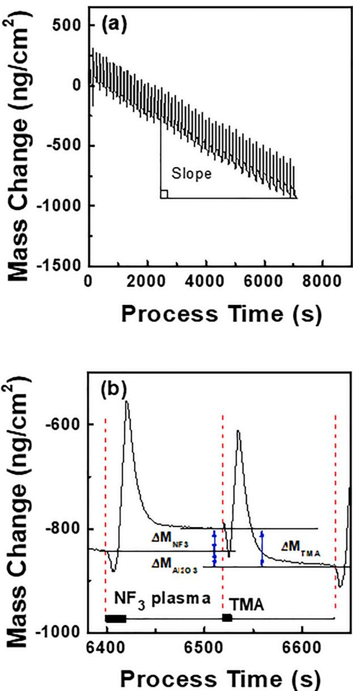
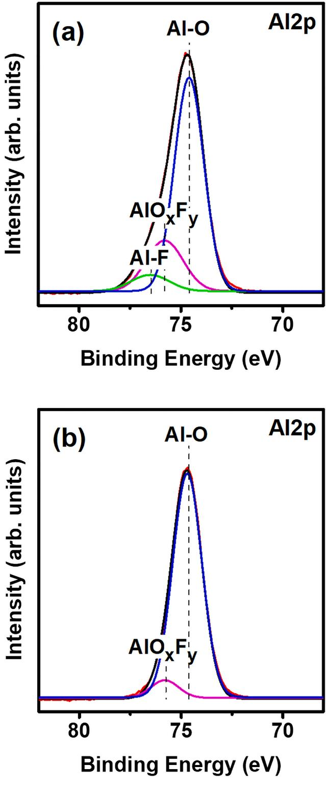
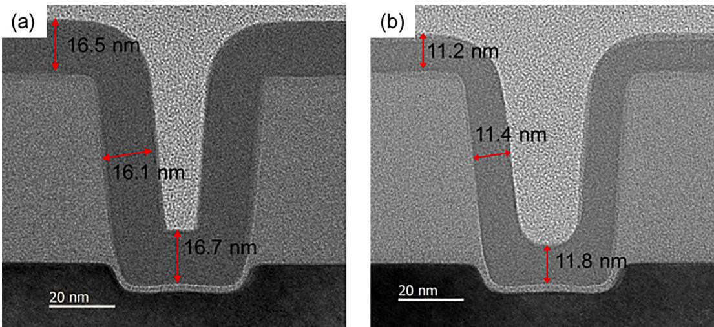
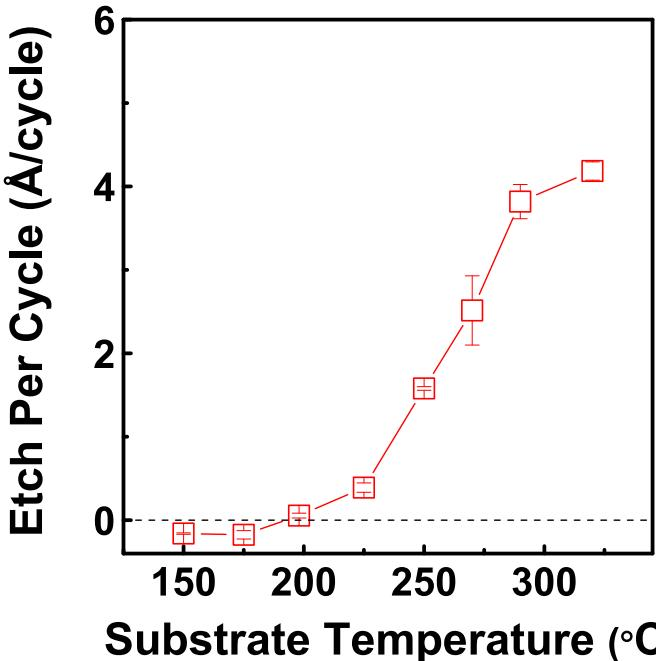
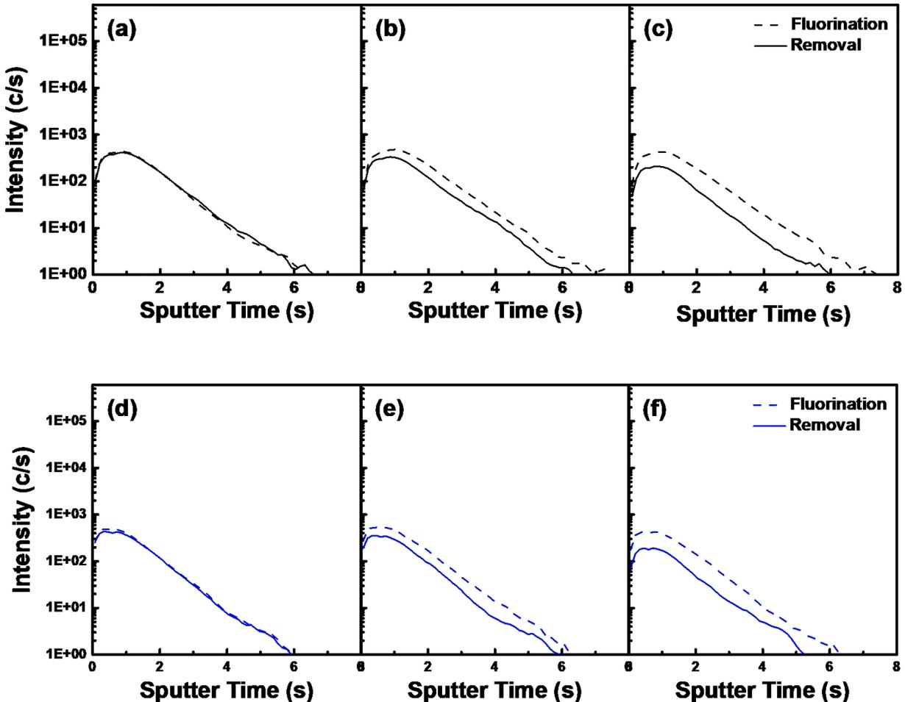

Full Length Article

# Surface reaction during thermal atomic layer etching of aluminum oxide films using fluorine radicals and trimethylaluminum

Yewon Kim a, Okhyeon Kim a, Gyejun Cho a, Hye- Lee Kim a,b, Minsu Kim c, Byungchul Cho c, Sangjoon Park c, Jongwan Jung a, Won- Jun Lee a,b,*

a Department of Nanotechnology and Advanced Materials Engineering, Sejong University, Seoul 05006, Republic of Korea  b Metal- organic Compounds Materials Research Center, Sejong University, Seoul 05006, Republic of Korea  c Wonik IPS, Pyeongtaek 17709, Republic of Korea

# ARTICLEINFO

Keywords: Atomic layer etching Surface reaction Remote plasma Fluorinated layer Etch process temperature

# ABSTRACT

We investigated the surface reaction of the thermal atomic layer etching (ALE) of  $\mathrm{Al_2O_3}$  film using fluorine (F) radicals and trimethylaluminum (TMA). As a strong fluorination source to replace HF, we used  $\mathrm{NF_3}$  remote plasma to generate F radicals without spontaneous or anisotropic etching by ion bombardment. The mass was increased by F radicals and decreased by TMA. X- ray photoelectron spectroscopy (XPS) analysis showed that  $\mathrm{AlF_3}$  and  $\mathrm{AlO_xF_y}$  were formed by F radicals, and all  $\mathrm{AlF_3}$  and a significant portion of  $\mathrm{AlO_xF_y}$  were removed by TMA. At  $250^{\circ}\mathrm{C}$ , the etch per cycle (EPC) was fully saturated at  $1.58\mathrm{\AA}$  cycle for the  $\mathrm{NF_3}$  remote plasma of 4 s and the TMA pulse time of  $3\mathrm{s}$ . Based on the saturation behavior, isotropic etching was demonstrated for the  $\mathrm{Al_2O_3}$  film prepared on a trench pattern. The EPC increased progressively with temperature from  $0.1\mathrm{\AA}$  cycle at  $198^{\circ}\mathrm{C}$  to  $4.2\mathrm{\AA}$  cycle at  $320^{\circ}\mathrm{C}$ . Since the thickness of the fluorinated layer did not increase significantly with increasing temperature, the removal step determined the EPC.

# 1. Introduction

To overcome the miniaturization limitations of planar transistors, three- dimensional (3D) devices such as fin field- effect transistors (FETs), nanosheet FETs, and 3D vertical NAND architecture have been introduced [1- 7]. Accordingly, vertical, anisotropic etching and horizontal, isotropic etching are required to fabricate 3D devices [8]. Reactive ion etching (RIE) is currently a common anisotropic etching technique, and wet etching has been used for isotropic etching. However, wet etching is problematic for nanoscale device fabrication because the surface tension of the liquid causes pattern damage [9]. In addition, it is not easy to integrate with subsequent vacuum processes, and the etch rate needs to be controlled at the atomic level.

The process that can meet all of these requirements is thermal atomic layer etching (ALE) [8,10- 16]. An ALE cycle consists of at least two selflimiting steps, surface modification and removal, separated by purge steps. Therefore, by repeating the ALE cycle, it is possible to precisely etch the desired amount at the atomic level. The ALE process can be divided into plasma ALE and thermal ALE [8,10,15,16]. The main difference between the two is the directionality. Plasma ALE is an anisotropic etching process because it uses ion bombardment to form and remove the modified layer. On the other hand, thermal ALE is an isotropic etching process because chemical reactions form and remove a modified layer. Therefore, thermal ALE attracts much attention as the atomic- level isotropic etching process.

Research on thermal ALE was first reported in 2015 [17,18].  $\mathrm{Al_2O_3}$  films were etched by alternating fluorination with hydrogen fluoride (HF) and removal with  $\mathrm{Sn(acac)_2}$ . Many metalorganic compounds have been tested as precursors for the removal step [13,17,19- 29], and the thermal ALE process using HF and trimethylaluminum (TMA) is the most popular for  $\mathrm{Al_2O_3}$  [27,30- 34]. However, the use of HF presents several problems. HF is difficult to handle, and equipment maintenance is problematic because it is toxic and corrosive. In addition, HF is a weak fluorination source [34], which would increase the ALE processing time. Therefore, looking for other fluorination sources to replace HF is necessary.

Recently,  $\mathrm{SF_6}$  plasma was introduced to utilize F radicals in the modification step [35]. Because the reactivity of the F radicals is

stronger than HF, the use of  $\mathrm{SF}_6$  plasma has improved the etch per cycle (EPC). However, because  $\mathrm{SF}_6$  plasma generates ions such as  $\mathrm{SF}_5^+$ , ion bombardment and sulfur contamination are concerns.  $\mathrm{SF}_4$  was used as a fluorination source and showed better reactivity than HF, but it also has sulfur contamination issues [34].  $\mathrm{NF}_3$  has a higher decomposition rate than  $\mathrm{SF}_6$  in plasma [36], resulting in a higher concentration of F radicals. In addition, N radicals recombine rapidly to form  $\mathrm{N}_2$ , leaving no N residues on the surface. An ALE study using  $\mathrm{NF}_3$  ICP plasma was reported, but the detailed surface reaction of the process has not been reported [37].

In this study, we investigated the surface reaction during the ALE  $\mathrm{Al}_2\mathrm{O}_3$  process using the F radicals as the fluorination source. We used  $\mathrm{NF}_3$  remote plasma to generate F radicals without spontaneous or anisotropic etching by ion bombardment. TMA was used as the removal precursor. The fluorination and removal steps were repeated at the same temperature, and the self- limiting behavior of each step was confirmed, resulting in isotropic etching. The surface reaction was analyzed by changes in mass and composition for each half cycle.

# 2. Experimental

The ALE process of  $\mathrm{Al}_2\mathrm{O}_3$  was studied in a reactor equipped with a remote plasma generator and an in situ quartz crystal microbalance (QCM). The radicals were generated by the remote plasma generator (Litmas RPS 1501, ADVANCED ENERGY, USA), and the plasma power was set to 350 W. The etching process was monitored by the QCM system with a  $\mathrm{GaPO}_4$  crystal resonator (R- 30, Piezocryst, Germany). The details of the QCM measurements are reported elsewhere [38]. The susceptor was coated with  $\mathrm{Y}_2\mathrm{O}_3$ . 600 sccm of Ar  $(99.999\%)$  gas was continuously fed into the reactor, and the working pressure was maintained at 1 Torr. For the modification step, the remote plasma was ignited using only Ar gas, and then 20 sccm of  $\mathrm{NF}_3$  gas  $(99.99\%)$  (Korea Noble Gas Co., Ltd.) was added after  $3\mathrm{s}$ . After the addition of  $\mathrm{NF}_3$ , there was a delay of more than  $1\mathrm{s}$  before F radicals entered the chamber. For the removal step, TMA  $(99.99\%)$  (Hansol Chemical Co.) was injected into the reactor. The modification and removal steps were separated by a  $10\mathrm{s}$  pumping step and a  $100\mathrm{s}$  Ar purging step.

The ALD  $\mathrm{Al}_2\mathrm{O}_3$  thin films for etching were prepared on silicon wafers and  $\mathrm{GaPO}_4$  crystal sensors by alternating exposure to TMA and  $\mathrm{O}_3$  at  $250^{\circ}\mathrm{C}$ . The thickness of the etched  $\mathrm{Al}_2\mathrm{O}_3$  films was measured by an ellipsometer (Elli- SE, Ellipso Technology, Republic of Korea) and then confirmed by cross- sectional transmission electron microscopy (TEM; JEM- 2100F HR, JEOL Ltd., Japan; Tecnai Osiris, FEI Company, USA). The etching profile of the film was also observed by TEM. The chemical bonding of the surface species after the etching was analyzed by an X- ray photoelectron spectroscopy (XPS) system (Nexsa, ThermoFisher Scientific, USA) using a monochromatic Al Kα (1486.6 eV) X- ray source with a beam size of  $400\mu \mathrm{m}\times 400\mu \mathrm{m}$ . The binding energy was calibrated to carbon C1s peak at  $284.8\mathrm{eV}$  of adventitious carbon [39,40]. The baseline was corrected using the PeakFit 4.12 software (Jandel, Scientific Software) with zero second derivative condition. The deconvolution was performed based on the Gaussian function rule, and the  $\mathrm{P}^2$  values of the curve fitting were higher than 0.99. The fluorinated layer thickness was determined by time- of- flight secondary ion mass spectroscopy (ToF- SIMS; M6, IONTOF GmbH, Germany). The  $\mathrm{Cs}^+$  ion (1 keV,  $\sim 106\mathrm{nA}$ ) was used for the sputtering of the films, and the  $\mathrm{Bi}^+$  ion (30 keV,  $\sim 1.31\mathrm{pA}$ ) was used for the analysis.

# 3. Results and discussion

First, the mass change was measured by QCM during the ALE process at  $250^{\circ}\mathrm{C}$ . An ALE cycle consisted of  $4\mathrm{s}$  of  $\mathrm{NF}_3$  remote plasma and  $3\mathrm{s}$  of TMA pulse, separated by Ar purges. Fig. 1 (a) shows the mass change during the first 30 ALE cycles. An almost linear behavior was observed from the beginning of the process. The average mass change per cycle (MCPC) was obtained from the slope of the graph. Fig. 1 (b) shows the mass change during an ALE cycle. The sudden mass change observed after the introduction of F radicals or TMA, as shown in Fig. 1 (b), is the apparent mass change resulting from the temperature variation of the sensor caused by the pumping step [41,42]. The mass increase after the  $\mathrm{NF}_3$  remote plasma  $\left(\Delta \mathrm{M}_{\mathrm{NF3}}\right)$  is due to the fluorination of  $\mathrm{Al}_2\mathrm{O}_3$  by F radicals. As shown in Equation 1,  $\mathrm{Al}_2\mathrm{O}_3$  is converted to  $\mathrm{AlF}_3$  by the F radicals, increasing its mass.

  
Fig. 1. Mass change as a function of processing time (a) during the first 30 ALE cycles and (b) during an ALE cycle. The wafer temperature was  $250^{\circ}\mathrm{C}$ , and the ALE cycle consisted of an  $\mathrm{NF}_3$  remote plasma, a purge, a TMA pulse, and a purge.  $\Delta \mathrm{M}_{\mathrm{Al2O3}}$  indicates the mass loss by an ALE cycle.  $\Delta \mathrm{M}_{\mathrm{NF3}}$  and  $\Delta \mathrm{M}_{\mathrm{TMA}}$  denote the mass change by  $\mathrm{NF}_3$  remote plasma and TMA pulse, respectively.

$$
\mathrm{Al}_2\mathrm{O}_3(\mathrm{s}) + 6\mathrm{F}\cdot (\mathrm{g})\rightarrow 2\mathrm{AlF}_3(\mathrm{s}) + 1.5\mathrm{O}_2(\mathrm{g}) \tag{1}
$$

The  $\mathrm{AlF}_3$  was removed by the TMA pulse, resulting in a mass loss  $\left(\Delta \mathrm{M}_{\mathrm{TMA}}\right)$ . As a result, the  $\mathrm{Al}_2\mathrm{O}_3$  film was etched by an ALE cycle, resulting in a mass loss  $\left(\Delta \mathrm{M}_{\mathrm{Al2O3}}\right)$ .

The modification of the  $\mathrm{Al}_2\mathrm{O}_3$  thin film and the removal of the  $\mathrm{AlF}_3$  layer were investigated by XPS. The Al 2p peak in Fig. 2 (a) was deconvoluted into three peaks: 74.5 eV, 75.8 eV, and 76.5 eV [43], corresponding to the Al- O,  $\mathrm{AlO_xF_y}$ , and Al- F bonds, respectively, indicating that  $\mathrm{AlF}_3$  and  $\mathrm{AlO_xF_y}$  were formed by F radicals. The Al- F peak

  
Fig. 2. Al 2p XPS peak from  $\mathrm{Al_2O_3}$  films (a) after fluorination step, (b) after full cycles of ALE.

was not detected, and the Al- Al peak was reported for ALE using HF [44]. Fig. 2 (b) shows that by the TMA pulse, the peak corresponding to the Al- F bond disappeared, and the intensity of the  $\mathrm{AlO_xF_y}$  peak was significantly reduced. The presence of a small amount of  $\mathrm{AlO_xF_y}$  was also observed in the in situ XPS experiments using HF and TMA [32].

The self- limiting behavior of the ALE process was investigated. Fig. 3 shows the MCPC of the  $\mathrm{Al_2O_3}$  thin film at  $250^{\circ}\mathrm{C}$  as a function of the  $\mathrm{NF_3}$  remote plasma time or TMA pulse time. The MCPC was saturated at  $- 69.8~\mathrm{ng / (cm^2\cdot cycle)}$  for the  $\mathrm{NF_3}$  remote plasma over  $3\mathrm{~s~}$  for a fixed

  
Fig. 3. Mass change per cycle as a function of (a)  $\mathrm{NF_3}$  remote plasma time or (b) TMA pulse time at  $250^{\circ}\mathrm{C}$ . The TMA pulse time was  $3\mathrm{~s~}$  in (a), and the  $\mathrm{NF_3}$  remote plasma time was  $4\mathrm{~s~}$  in (b).

TMA pulse of  $3\mathrm{~s~}$  as shown in Fig. 3(a). Contrary to the report that  $\mathrm{NF_3}$  molecules fluorinate  $\mathrm{Al_2O_3}$  films [45],  $\mathrm{NF_3}$  molecules did not contribute to the etching reaction in our experiments (solid circle in Fig. 3(a)). It was also saturated with the TMA pulse over  $3\mathrm{~s~}$  for a fixed  $\mathrm{NF_3}$  remote plasma of  $4\mathrm{~s~}$  as shown in Fig. 3(b). No etching occurred by supplying only the  $\mathrm{NF_3}$  remote plasma or TMA. Based on Fig. 3, the duration of the  $\mathrm{NF_3}$  remote plasma and the TMA pulse were determined to be  $4\mathrm{~s~}$  and  $3\mathrm{~s~}$  respectively. Unlike other ALE processes with quasi- saturation behavior [27,35], the  $\mathrm{NF_3}$  remote plasma modification step of this work showed fully saturated results. In addition, the MCPC was quickly saturated by a relatively short remote plasma time.

Isotropic etching by ALE was demonstrated using an ALD  $\mathrm{Al_2O_3}$  film deposited over a trench pattern. The depth and bottom width of the trench were  $64~\mathrm{nm}$  and  $8\mathrm{~nm}$  respectively, before the etching. Fig. 4 shows the cross- sectional TEM images of the  $\mathrm{Al_2O_3}$  film before and after 30 ALE cycles. The  $\mathrm{Al_2O_3}$  film was thinned in all directions, and the sharp bottom corners were rounded. A similar phenomenon was observed in the oxidation process of silicon. According to the experiments and modeling [46,47], the oxide growth rate on the concave surface is lower than that on the planar surface due to the lower oxidant

  
Fig. 4. Cross-section TEM image of ALD  $\mathrm{Al_2O_3}$  film on a trench pattern: (a) as-deposited and (b) after 30 ALE cycles at  $250^{\circ}\mathrm{C}$ .

concentration at the  $\mathrm{Si / SiO_2}$  interface. As a result, the  $\mathrm{Si / SiO_2}$  interface becomes round. Analogous to the oxidation process, the fluorine concentration at the  $\mathrm{AlF_3 / Al_2O_3}$  interface would be lower than on the planar surface in the ALE  $\mathrm{Al_2O_3}$  process, so the growth rate of the fluorinated layer would be slower on the concave surface, resulting in a round bottom. Before etching, the average thicknesses of the film at the top, sidewall, and bottom of the trench were  $16.5\mathrm{nm}$ ,  $16.1\mathrm{nm}$ , and  $16.7\mathrm{nm}$ , respectively, as shown in Fig. 4(a). After the ALE process, the average thicknesses were reduced to  $11.2\mathrm{nm}$ ,  $11.4\mathrm{nm}$ , and  $11.8\mathrm{nm}$ , respectively, as shown in Fig. 4(b). As a result, the EPCs at the sidewall and bottom of the trench were  $88\%$  and  $92\%$  of that at the top surface.

We investigate the effect of substrate temperature on the etching rate of the  $\mathrm{Al_2O_3}$  film in the range of 150 to  $320^{\circ}\mathrm{C}$ , as shown in Fig. 5. The thickness change after 30 ALE cycles was measured by ellipsometry. The ALE- ALD transition temperature was close to  $200^{\circ}\mathrm{C}$ , similar to the ALE using HF and TMA [27,31,48]. Since the ALE- ALD transition temperature is determined by the desorption temperature of the etch products, similar transition temperatures for HF and F radicals imply similar etch products. The EPC increased progressively with temperature from  $0.1\mathrm{\AA}/$  cycle at  $198^{\circ}\mathrm{C}$  to  $4.2\mathrm{\AA}/$  cycle at  $320^{\circ}\mathrm{C}$ . Compared to the ALE with  $\mathrm{HF}$ , the ALE with F radicals in this work showed higher EPCs [27], probably due to the higher reactivity of F radicals than HF molecules. On the other hand, the ALE with F radicals showed lower EPCs than the ALE with  $\mathrm{SF_6}$  ICP [35], probably due to the absence of ion bombardment.

  
Fig. 5. EPC versus temperature plot for the ALE of  $\mathrm{Al_2O_3}$  by 30 cycles of  $\mathrm{NF_3}$  remote plasma for  $4\mathrm{s}$  and TMA for  $3\mathrm{s}$ . The etching amount was determined by ellipsometry.

The concentration profile of the fluorinated layer was analyzed at different process temperatures to investigate the rate- limiting step, as shown in Fig. 6. The ALE cycle was repeated 5 times, and the samples were analyzed by ToF- SIMS after the fluorination step and after the removal step. After the fluorination step, the intensity and depth of  $\mathrm{AlF_2^- }$  and  $\mathrm{AlOF_2^- }$  were not significantly different when the temperature was increased from  $200^{\circ}\mathrm{C}$  to  $300^{\circ}\mathrm{C}$ . Therefore, the fluorinated layer thickness could not explain the rapid increase in EPC with the change. In contrast, the ALE with HF showed that the EPC increased with increasing modified layer thickness [44].

On the other hand, a difference in the concentration profile of  $\mathrm{AlF_2^- }$  and  $\mathrm{AlOF_2^- }$  was observed after the removal step. The amount of the fluorinated layer removed by TMA, the area between two curves in linear scale (not shown), increased with increasing temperature. The area of the  $\mathrm{AlF_2^- }$  peak decreased by  $4.1\%$  at  $200^{\circ}\mathrm{C}$ ,  $35\%$  at  $250^{\circ}\mathrm{C}$ , and  $57\%$  at  $300^{\circ}\mathrm{C}$ , respectively. The area of the  $\mathrm{AlOF_2^- }$  peak was also decreased by  $8.0\%$ ,  $38\%$  at  $250^{\circ}\mathrm{C}$ , and  $59\%$  at  $300^{\circ}\mathrm{C}$ , respectively. Therefore, the increase in EPC due to the increase in process temperature was due to the increase in the amount of removal. The byproduct of the reaction of  $\mathrm{AlF_3}$  with TMA is known as  $\mathrm{Al_2F_x(CH_3)_y}$ , dimer- type molecules with relatively low vapor pressure. For reference, the vapor pressure of an  $\mathrm{AlF(CH_3)_2}$  monomer is  $80\%$  for at  $100^{\circ}\mathrm{C}$  [49]. Therefore, high process temperatures are advantageous to enhance the volatility of etching products. It was observed by QCM that the percentage of the fluorinated layer removed by TMA increased with temperature,  $19\%$  at  $250^{\circ}\mathrm{C}$  and  $55\%$  at  $300^{\circ}\mathrm{C}$  [27], which is similar to the result of the present work. Therefore, the removal step determined the EPC.

# 4. Conclusions

We studied the thermal ALE of  $\mathrm{Al_2O_3}$  film using  $\mathrm{NF_3}$  remote plasma and TMA. The mass increased in the modification step by F radicals and decreased in the removal step by TMA. XPS analysis showed that  $\mathrm{AlF_3}$  and  $\mathrm{AlO_xF_y}$  were formed by F radicals, and all  $\mathrm{AlF_3}$  and a significant portion of  $\mathrm{AlO_xF_y}$  were removed by TMA. At  $250^{\circ}\mathrm{C}$ , the EPC was fully saturated at  $1.58\mathrm{\AA}/$  cycle for the  $\mathrm{NF_3}$  remote plasma of  $4\mathrm{s}$  and the TMA pulse time of  $3\mathrm{s}$ . Based on the saturation behavior, isotropic etching by ALE was demonstrated for the  $\mathrm{Al_2O_3}$  film prepared on a trench pattern. The EPC increased progressively with temperature from  $0.1\mathrm{\AA}/$  cycle at

  
Fig. 6. ToF-SIMS depth profiles of  $\mathrm{Al}_2\mathrm{O}_3$  film after ALE process. The ALE cycle was repeated 5 times, and the samples were analyzed after the fluorination and removal steps. The  $\mathrm{AlF_2^-}$  concentration profiles were plotted for the different ALE process temperatures of (a)  $200^{\circ}\mathrm{C}$ , (b)  $250^{\circ}\mathrm{C}$ , and (c)  $300^{\circ}\mathrm{C}$ . The  $\mathrm{AlOF_2^-}$  concentration profiles were also plotted for (d)  $200^{\circ}\mathrm{C}$ , (e)  $250^{\circ}\mathrm{C}$ , and (f)  $300^{\circ}\mathrm{C}$  respectively.

$198^{\circ}\mathrm{C}$  to  $4.2\mathrm{\AA / cycle}$  at  $320^{\circ}\mathrm{C}$ . The ALE- ALD transition temperature was close to  $200^{\circ}\mathrm{C}$ . ToF- SIMS analysis showed that the thickness of the fluorinated layer did not increase significantly with increasing temperature. Therefore, the increase in EPC with temperature was due to the increased volatility of the etch products, and the removal step determined the EPC.

# CRediT authorship contribution statement

Yewon Kim: Conceptualization, Methodology, Validation, Formal analysis, Investigation, Writing - original draft, Visualization. Okhyeon Kim: Conceptualization, Methodology, Validation, Formal analysis, Investigation. Gyejun Cho: Methodology, Validation, Formal analysis, Investigation, Visualization. Hye- Lee Kim: Methodology, Validation, Writing - review & editing. Mimsu Kim: Conceptualization, Methodology, Validation, Formal analysis. Byungchul Cho: Conceptualization, Methodology, Validation, Formal analysis. Sangjoon Park: Conceptualization, Methodology, Validation. Jongwan Jung: Conceptualization, Methodology, Validation. Won- Jun Lee: Conceptualization, Methodology, Validation, Resources, Writing - review & editing, Supervision, Project administration, Funding acquisition.

# Declaration of Competing Interest

The authors declare that they have no known competing financial interests or personal relationships that could have appeared to influence the work reported in this paper.

# Data availability

Data will be made available on request.

# Acknowledgments

This research was supported by the MOTIE (Ministry of Trade, Industry & Energy) (1415177972) and KSRC (Korea Semiconductor Research Consortium) (20012588) support program for the development of the future semiconductor device. This research was also partly supported by the Korea Basic Science Institute (National Research Facilities and Equipment Center) grant funded by the Ministry of Education, Republic of Korea (2022R1A6C101A774).

# References

[1] H. Xiao, 3D IC Devices, Technologies, and Manufacturing, SPIE, Bellingham, Washington, USA, 2016. [2] D. Hisamoto, Wen- Chin Lee, J. Kedzierski, E. Anderson, H. Takeuchi, K. Asano, Tsu- Jae King, J. Bokor, Chenming Hu, A folded- channel MOSFET for deep- sub- tenth micron era, in: Int. Electron Devices Meet. 1998. Tech. Dig. (Cat. No. 98CH36217), IEEE, 1998: pp. 1032- 1034. https://doi.org/10.1109/IEDM.1998.746531. [3] T. Park, S. Choi, D.H. Lee, J.R. Yoo, B.C. Lee, J.Y. Kim, C.G. Lee, K.K. Chi, S.H. Hong, S.J. Hynn, Y.G. Shin, J.N. Han, I.S. Park, U.I. Chung, J.T. Moon, E. Yoon, J. H. Lee, Fabrication of body- tied FinFETs (Omega MOSFETs) using bulk Si wafers, in: 2003 Symp. VLSI Technol. Dig. Tech. Pap. (IEEE Cat. No.03CH37407), Japan Soc. Applied Phys. 2003: pp. 135- 136. https://doi.org/10.1109/VLSIT.2003.1221122. [4] S.- Y. Lee, S.- M. Kim, E.- J. Yoon, C.W. Oh, J. Chung, D. Park, K. Kim, Three- Dimensional MBCFET as an Ultimate Transistor, IEEE Electron Device Lett. 25 (2004) 217- 219. https://doi.org/10.1109/LED.2004.825199.

[5] N. Loubet, T. Hook, P. Montanini, C.- W. Yeung, S. Kanakasabapathy, M. Guillom, T. Yamashita, J. Zhang, X. Miao, J. Wang, A. Young, R. Chao, M. Kang, Z. Liu, S. Fan, B. Hamieh, S. Sieg, Y. Mignot, W. Xu, S.- C. Seo, J. Yoo, S. Mochizuki, M. Sankarapandian, O. Kwon, A. Carr, A. Greene, Y. Park, J. Frougier, R. Galatage, R. Bao, J. Shearer, R. Conti, H. Song, D. Lee, D. Kong, Y. Xu, A. Arceo, Z. Bi, P. Xu, R. Muthinti, J. Li, R. Wong, D. Brown, P. Oldiges, R. Robinson, J. Arnold, N. Felix, S. Skordas, J. Gaudiello, T. Standaert, H. Jagannathan, D. Corliss, M.- H. Na, A. Knorr, T. Wu, D. Gupta, S. Lian, R. Divakaruni, T. Gow, C. Labelle, S. Lee, V. Paruchuri, H. Bu, M. Khare, Stacked nanosheet gate- all- around transistor to enable scaling beyond FinFET, IEEE, 2017, pp. T230- T231. https://doi.org/1 0.23919/VLSIT.2017.7998183. [6] H. Tanaka, M. Kido, K. Yahashi, M. Camura, R. Katsumata, M. Kito, Y. Fukuzumi, M. Sato, Y. Nagata, Y. Matsuoka, Y. Naita, H. Aochi, A. Nitayama. Bit Cost Scalable Technology with Punch and Plug Process for Ultra High Density Flash Memory, IEEE, 2007, pp. 14- 15. https://doi.org/10.1109/VLSIT.2007.4339708. [7] J. Jang, H.S. Kim, W. Cho, H. Cho, J. Kim, I.S. Sun, Y. Jang, J.H. Jeong, B.K. Son, W.K. Dong, K. Kim, J.J. Shim, S.L. Jin, K.H. Kim, Y.Y. Su, J.Y. Lim, D. Chung, H. C. Moon, S. Hwang, J.W. Lee, Y.H. Son, U.J. Chung, W.S. Lee, Vertical cell array using TCAT(terabit cell array transistor) technology for ultra high density NAND flash memory, in: 2009 Symp. VLSI Technol, IEEE, 2009, pp. 192- 193. [8] C.T. Carver, J. Plombon, P.E. Romero, S. Suri, T.A. Tronic, R.B. Turkot, Atomic Layer Etching: An Industry Perspective, ECS J. Solid State Sci. Technol. 4 (6) (2015) N5005- N5009. https://doi.org/10.1149/2.0021506jss. [9] R.P. Venkatesh, M.- S. Kim, J.- G. Park, Contamination Removal From UV and EUV Photomasks, in: R. Kohli, K.L. Mittal (Eds.), Developments in Surface Contamination and Cleaning, William Andrew, Norwich, NY, USA, 2008, pp. 135- 173. [10] K.J. Kanarik, T. Lill, E.A. Hudson, S. Sriraman, S. Tan, J. Marks, V. Vahedi, R.A. Gottscho, Overview of atomic layer etching in the semiconductor industry, J. Vac. Sci. Technol. A. 33 (2015) 020802. https://doi.org/10.1116/1.4913379. [11] T. Faraz, F. Roozeboom, H.C.M. Knoops, W.M.M. Kessels, Atomic Layer Etching: What Can We Learn from Atomic Layer Deposition? ECS J. Solid State Sci. Technol. 4 (2015) N5023- N5032. https://doi.org/10.1149/2.0051506jss. [12] C. Fang, Y. Cao, D. Wu, A. Li, Thermal atomic layer etching: Mechanism, materials and prospects, Prog. Nat. Sci. Mater. Int. 28 (2018) 667- 675. https://doi.org/10 .1016/j.pnsc.2018.11.003. [13] S.M. George, Mechanisms of Thermal Atomic Layer Etching, Acc. Chem. Res. 53 (2020) 1151- 1160. https://doi.org/10.1021/acs.accounts.0c00084. [14] A. Fischer, A. Routzahn, S.M. George, T. Lill, Thermal atomic layer etching: A review, J. Vac. Sci. Technol. A. 39 (2021) 030801. https://doi.org/10.1116/ 6.0000894. [15] G.S. Oehrlein, D. Metzler, C. Li, Atomic Layer Etching at the Tipping Point: An Overview, ECS J. Solid State Sci. Technol. 4 (2015) N5041- N5053. https://doi. org/10.1149/2.0061506jss. [16] X. Sang, J.P. Chang, Physical and chemical effects in directional atomic layer etching, J. Phys. D. Appl. Phys. 53 (18) (2020) 183001. https://doi.org/10.10 88/1361- 6463/ab6d94. [17] Y. Lee, S.M. George, Atomic Layer Etching of  $\mathrm{Al_2O_3}$  Using Sequential, Self- Limiting Thermal Reactions with Sn(acac)2 and Hydrogen Fluoride, ACS Nano 9 (2015) 2061- 2070. https://doi.org/10.1021/nn507277f. [18] Y. Lee, J.W. DuMont, S.M. George, Mechanism of Thermal  $\mathrm{Al_2O_3}$  Atomic Layer Etching Using Sequential Reactions with Sn(acac)2 and HF, Chem. Mater. 27 (2015) 3648- 3657. https://doi.org/10.1021/acs.chemmater.5b00300. [19] Y. Lee, S.M. George, Thermal Atomic Layer Etching of  $\mathrm{Al_2O_3}$ $\mathrm{HfO_2}$  and  $\mathrm{ZrO_2}$  Using Sequential Hydrogen Fluoride and Dimethylaluminum Chlorides, exposures, J. Phys. Chem. C. 123 (2019) 18455- 18466. https://doi.org/10.1021/acs.jpcc.5b04767. [20] Y. Lee, S.M. George, Thermal atomic layer etching of  $\mathrm{HfO_2}$  using HF for fluorination and  $\mathrm{TiCl_4}$  for ligand exchange, J. Vac. Sci. Technol. A. 36 (2018) 061504. https://doi.org/10.1116/1.5045130. [21] S.M. George, Y. Lee, Prospects for Thermal Atomic Layer Etching Using Sequential, Self- Limiting Fluorination and Ligand- Exchange Reactions, ACS Nano 10 (2016) 4889- 4894. https://doi.org/10.1021/acs.nano.6b02991. [22] D.R. Zywotko, S.M. George, Thermal Atomic Layer Etching of ZnO by a "Conversion- Etch" Mechanism Using Sequential Exposures of Hydrogen Fluoride and Trimethylaluminum, Chem. Mater. 29 (2017) 1183- 1191. https://doi.org/ 10.1021/acs.chemmater.6b04529. [23] A.I. Abdulagatov, S.M. George, Thermal Atomic Layer Etching of Silicon Using  $\mathrm{O_2}$  HF, and  $\mathrm{Al(CH_3)_2}$  as the Reactants, Chem. Mater. 30 (2018) 8465- 8475. https:// doi.org/10.1021/acs.chemmater.8b02745. [24] N.R. Johnson, S.M. George,  $\mathrm{WO_3}$  and W Thermal Atomic Layer Etching Using "Conversion- Fluorination" and "Oxidation- Conversion- Fluorination" Mechanisms, ACS Appl. Mater. Interfaces. 9 (2017) 34435- 34447. https://doi.org/10. 1021/acsami.7b09161. [25] A.I. Abdulagatov, S.M. George, Thermal atomic layer etching of silicon nitride using an oxidation and "conversion etch" mechanism, J. Vac. Sci. Technol. A. 38 (2020) 022607. https://doi.org/10.1116/1.5140481. [26] Y. Lee, C. Huffman, S.M. George, Selectivity in Thermal Atomic Layer Etching Using Sequential, Self- Limiting Fluorination and Ligand- Exchange Reactions, Chem. Mater. 28 (2016) 7657- 7665. https://doi.org/10.1021/acs.chemmate r.6b02543.

[27] Y. Lee, J.W. DuMont, S.M. George, Trimethylaluminum as the Metal Precursor for the Atomic Layer Etching of  $\mathrm{Al_2O_3}$  Using Sequential, Self- Limiting Thermal Reactions, Chem. Mater. 28 (2016) 2994- 3003. https://doi.org/10.1021/acs.chemmater.6b00111. [28] A.M. Cano, J.L. Partridge, S.M. George, Thermal Atomic Layer Etching of  $\mathrm{Al_2O_3}$  Using Sequential HF and  $\mathrm{BCl_3}$  Exposures: Evidence for Combined Ligand- Exchange and Conversion Mechanisms, Chem. Mater. 34 (2022) 6440- 6449. https://doi.org/ 10.1021/acs.chemmater.2c01120. [29] A.M. Cano, A. Lili- Rosales, S.M. George, Thermal Atomic Layer Etching of Aluminum Nitride Using HF or  $\mathrm{XeF_2}$  for Fluorination and  $\mathrm{BCl_3}$  for Ligand Exchange, J. Phys. Chem. C. 126 (2022) 6990- 6999. https://doi.org/10.1021/acs. jpcc.1c10972. [30] J.W. DuMont, S.M. George, Competition between  $\mathrm{Al_2O_3}$  atomic layer etching and  $\mathrm{AlF_3}$  atomic layer deposition using sequential exposures of trimethylaluminum and hydrogen fluoride, J. Chem. Phys. 146 (2017) 052819. https://doi.org/10.1063/ 1.4973310. [31] D.R. Zywotko, J. Faguet, S.M. George, Rapid atomic layer etching of  $\mathrm{Al_2O_3}$  using sequential exposures of hydrogen fluoride and trimethylaluminum with no purging, J. Vac. Sci. Technol. A. 36 (2018) 061508. https://doi.org/10.1116/ 1.5043488. [32] J. Reif, M. Knaut, S. Killge, M. Albert, T. Mikolajick, J.W. Bartha, In situ studies on atomic layer etching of aluminum oxide using sequential reactions with trimethylaluminum and hydrogen fluoride, J. Vac. Sci. Technol. A. 40 (2022) 032602. https://doi.org/10.1116/6.0001616. [33] D.R. Zywotko, O. Zandi, J. Faguet, P.R. Abel, S.M. George,  $\mathrm{ZrO_2}$  Monolayer as a Removable Etch Stop Layer for Thermal  $\mathrm{Al_2O_3}$  Atomic Layer Etching Using Hydrogen Fluoride and Trimethylaluminum, Chem. Mater. 32 (2020) 10055- 10065. https://doi.org/10.1021/acs.chemmater.0c03335. [34] J.C. Gertsch, A.M. Cano, V.M. Bright, S.M. George,  $\mathrm{SF_4}$  as the Fluorination Reactant for  $\mathrm{Al_2O_3}$  and  $\mathrm{VO_2}$  Thermal Atomic Layer Etching, Chem. Mater. 31 (2019) 3624- 3635. https://doi.org/10.1021/acs.chemmater.8b05294. [35] N.J. Chittock, M.F.J. Vos, T. Faraz, W.M.M. (Erwin) Kessels, H.C.M. Knoops, A.J. M.J. Mackus, Isotropic plasma atomic layer etching of  $\mathrm{Al_2O_3}$  using a fluorine containing plasma and  $\mathrm{Al(CH_3)_3}$ , Appl. Phys. Lett. 117 (2020) 162107. https://doi. org/10.1063/5.0022531. [36] K. Koike, T. Fukuda, S. Fujikawa, M. Saeda, Study of  $\mathrm{CF_4}$ ,  $\mathrm{C_2F_6}$ ,  $\mathrm{SF_6}$  and  $\mathrm{NF_3}$  Decomposition Characteristics and Etching Performance in Plasma State, Jpn. J. Appl. Phys. 36 (1997) 5724. https://doi.org/10.1134/JJAP.36.5724. [37] J. Kim, D. Shim, Y. Kim, H. Chae, Atomic layer etching of  $\mathrm{Al_2O_3}$  with  $\mathrm{NF_3}$  plasma fluorination and trimethylaluminum ligand exchange, J. Vac. Sci. Technol. A. 40 (2022) 032603. https://doi.org/10.1116/6.0001616. [38] H. Roh, H.- L. Kim, K. Khumaini, H. Son, D. Shin, W.- J. Lee, Effect of deposition temperature and surface reactions in atomic layer deposition of silicon oxide using Bis(diethylamino)silane and ozone, Appl. Surf. Sci. 571 (2022) 151231. https://doi.org/10.1016/j.apsusc.2021.151231. [39] ASTM E1523- 15. Standard Guide to Charge Control and Charge Referencing Techniques in X- Ray Photoelectron Spectroscopy, ASTM International, West Conshohocken, PA, 2015. [40] ISO 19318:2004. Surface chemical analysis—reporting of methods used for charge control and charge correction, (ISO, Geneva, 2004). [41] M.N. Rocklein, S.M. George, Temperature- induced apparent mass changes observed during quartz crystal microbalance measurements of atomic layer deposition, Anal. Chem. 75 (2003) 4975- 4982. https://doi.org/10.1021/ ac003141u. [42] J.W. Elam, M.J. Pellin,  $\mathrm{GaPO_4}$  Sensors for Gravimetric Monitoring during Atomic Layer Deposition at High Temperatures, Anal. Chem. 77 (2005) 3531- 3535. http s://doi.org/10.1021/ac050349a. [43] R. Ramos, G. Cunge, B. Pelissier, O. Joubert, Cleaning aluminum fluoride coatings from plasma reactor walls in  $\mathrm{SiCl_4 / Cl_2}$  plasmas, Plasma Sources Sci. Technol. 16 (2007) 711- 715. https://doi.org/10.1088/0963- 0252/16/4/004. [44] A.M. Cano, A.E. Marquardt, J.W. DuMont, S.M. George, Effect of HF Pressure on Thermal  $\mathrm{Al_2O_3}$  Atomic Layer Etch Rates and  $\mathrm{Al_2O_3}$  Fluorination, J. Phys. Chem. C. 123 (2019) 10346- 10355. https://doi.org/10.1021/acs.jpcc.9b00124. [45] A. Fischer, A. Routzahn, Y. Lee, T. Lill, S.M. George, Thermal etching of  $\mathrm{AlF_3}$  and thermal atomic layer etching of  $\mathrm{Al_2O_3}$ , J. Vac. Sci. Technol. A. 38 (2020), 022603. https://doi.org/10.1116/1.5135912. [46] D.- B. Kao, J.P. McVittie, W.D. Nix, K.C. Saraswat, Two- dimensional thermal oxidation of silicon—I. Experiments, IEEE Trans. Electron Devices. 34 (1987), 1008- 1017. https://doi.org/10.1109/T- ED1987.23037. [47] D.- B. Kao, J.P. McVittie, W.D. Nix, K.C. Saraswat, Two- dimensional thermal oxidation of silicon—II. Modeling stress effects in wet oxides, IEEE Trans. Electron Devices. 35 (1988) 25- 37. https://doi.org/10.1109/16.2412. [48] J. Hennessy, C.S. Moore, K. Balasubramanian, A.D. Jewell, K. France, S. Nikzad, Enhanced atomic layer etching of native aluminum oxide for ultraviolet optical applications, J. Vac. Sci. Technol. A. 35 (2017), 041512. https://doi.org/10.1116/ 1.4986945. [49] J.W. Clancey, A.S. Cavanagh, J.E.T. Smith, S. Sharma, S.M. George, Volatile Etch Species Produced during Thermal  $\mathrm{Al_2O_3}$  Atomic Layer Etching, J. Phys. Chem. C. 124 (2020) 287- 299. https://doi.org/10.1021/acs.jpcc.9b06104.