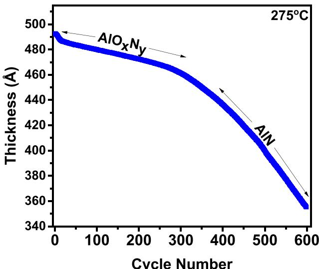
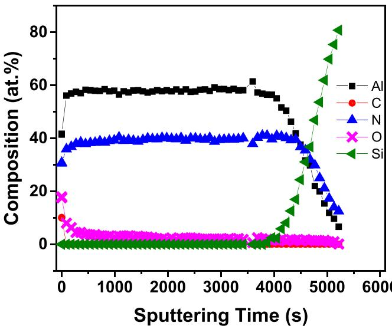
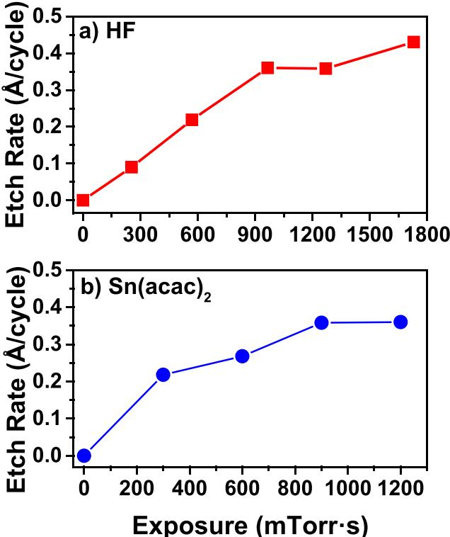
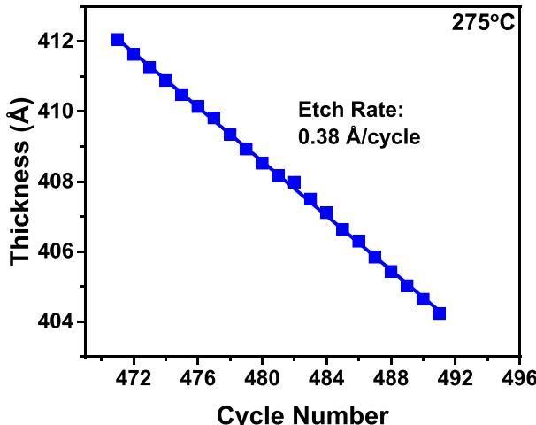
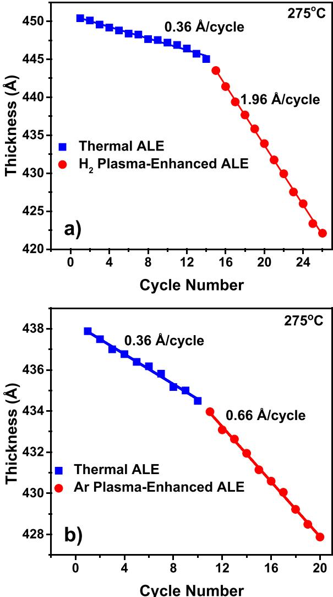

# Thermal atomic layer etching of crystalline aluminum nitride using sequential, self-limiting hydrogen fluoride and Sn(acac) $_2$  reactions and enhancement by  $H_{2}$  and Ar plasmas

Nicholas R. Johnson; Huaxing Sun; Kashish Sharma; Steven M. George

# Check for updates

J. Vac. Sci. Technol. A 34, 050603 (2016) https://doi.org/10.1116/1.4959779 CHORUS

# Articles You May Be Interested In

Thermal etching of  $AlF_{3}$  and thermal atomic layer etching of  $Al_{2}O_{3}$

J. Vac. Sci. Technol. A (January 2020)

Chemistry of Cu(acac) $_2$  on Ni(110) and Cu(110) surfaces: Implications for atomic layer deposition processes

J. Vac. Sci. Technol. A (October 2012)

Surface chemistry of a Cu(i) beta- diketonate precursor and the atomic layer deposition of  $Cu_{2}O$  on  $SiO_{2}$  studied by x- ray photoelectron spectroscopy

J. Vac. Sci. Technol. A (May 2014)

# Thermal atomic layer etching of crystalline aluminum nitride using sequential, self-limiting hydrogen fluoride and Sn(acac) $_2$  reactions and enhancement by  $\mathsf{H}_2$  and Ar plasmas

Nicholas R. Johnson, Huaxing Sun, and Kashish Sharma  Department of Chemistry and Biochemistry, University of Colorado at Boulder, Colorado 80309

Steven M. George $^{a)}$   Department of Chemistry and Biochemistry, University of Colorado at Boulder, Colorado 80309 and Department of Mechanical Engineering, University of Colorado at Boulder, Colorado 80309

(Received 28 May 2016; accepted 13 July 2016; published 4 August 2016)

Thermal atomic layer etching (ALE) of crystalline aluminum nitride (AlN) films was demonstrated using sequential, self- limiting reactions with hydrogen fluoride (HF) and tin(II) acetylacetonate  $[\mathrm{Sn(acac)}_2]$  as the reactants. Film thicknesses were monitored versus number of ALE reaction cycles at  $275^{\circ}C$  using in situ spectroscopic ellipsometry (SE). A low etch rate of  $\sim 0.07\mathrm{\AA / cycle}$  was measured during etching of the first  $40\mathrm{\AA}$  of the film. This small etch rate corresponded with the  $\mathrm{AlO_xN_y}$  layer on the AlN film. The etch rate then increased to  $\sim 0.36\mathrm{\AA / cycle}$  for the pure AlN films. In situ SE experiments established the HF and  $\mathrm{Sn(acac)}_2$  exposures that were necessary for self- limiting surface reactions. In the proposed reaction mechanism for thermal AlN ALE, HF fluorinates the AlN film and produces an  $\mathrm{AlF}_3$  layer on the surface. The metal precursor,  $\mathrm{Sn(acac)}_2$  then accepts fluorine from the  $\mathrm{AlF}_3$  layer and transfers an acac ligand to the  $\mathrm{AlF}_3$  layer in a ligand- exchange reaction. The possible volatile etch products are  $\mathrm{SnF(acac)}$  and either  $\mathrm{Al(acac)}_3$  or  $\mathrm{AlF(acac)}_2$ . Adding a  $\mathrm{H}_2$  plasma exposure after each  $\mathrm{Sn(acac)}_2$  exposure dramatically increased the AlN etch rate from 0.36 to  $1.96\mathrm{\AA / cycle}$ . This enhanced etch rate is believed to result from the ability of the  $\mathrm{H}_2$  plasma to remove acac surface species that may limit the AlN etch rate. The active agent from the  $\mathrm{H}_2$  plasma is either hydrogen radicals or radiation. Adding an Ar plasma exposure after each  $\mathrm{Sn(acac)}_2$  exposure increased the AlN etch rate from 0.36 to  $0.66\mathrm{\AA / cycle}$ . This enhanced etch rate is attributed to either ions or radiation from the Ar plasma that may also lead to the desorption of acac surface species. © 2016 American Vacuum Society.

[http://dx.doi.org/10.1116/1.4959779]

# I. INTRODUCTION

Atomic layer etching (ALE) is a sequential, self- limiting thin film removal technique that can etch materials precisely with Ångstrom- level precision. ALE is needed for future semiconductor manufacturing processes. Until recently, most ALE processes have been conducted using halogen or halocarbon adsorption followed by energetic ion or atom bombardment to remove material. This approach has been demonstrated for a variety of materials including Si, Ge, GaAs,  $\mathrm{SiO}_2$ ,  $\mathrm{HfO}_2$ , and graphene. Etching with energetic ion or atom bombardment produces anisotropic material removal, but can also damage the underlying substrate.

Recently, new ALE methods have been developed based on sequential, self- limiting thermal reactions. Thermal ALE has been demonstrated for  $\mathrm{Al}_2\mathrm{O}_3$  ALE and  $\mathrm{HfO}_2$  ALE using hydrogen fluoride (HF) and tin(II) acetylacetonate  $[\mathrm{Sn(acac)}_2]$  as the reactants.  $\mathrm{Al}_2\mathrm{O}_3$  ALE has also been performed using HF and trimethylaluminum (TMA) as the reactants. During the thermal ALE reactions, HF fluorinates the metal oxide and forms a metal fluoride layer on the surface. The metal precursors,  $\mathrm{Sn(acac)}_2$  and TMA, then accept fluorine from the metal fluoride and transfer their ligands to the metal fluoride in a ligand- exchange reaction. This transmetalation or redistribution process can form volatile species such as  $\mathrm{AlF(acac)}_2$  or  $\mathrm{Al(acac)}_3$

The fluorination and ligand- exchange reactions have etched amorphous metal oxides such as  $\mathrm{Al}_2\mathrm{O}_3$  and  $\mathrm{HfO}_2$  films that were grown using atomic layer deposition (ALD). A related study also described the thermal ALE of amorphous  $\mathrm{AlF}_3$  films. In contrast, there have been no reports for the thermal ALE of crystalline material. There have also been no previous demonstrations of the thermal ALE of a metal nitride, such as aluminum nitride (AlN), or any III- V semiconductor. However, the continuous dry etching of crystalline III- V metal nitrides, such as AlN, has been previously documented using different halogen plasma sources. To extend the development of atomic layer processing methods, this letter presents the thermal ALE of crystalline AlN films using sequential, self- limiting exposures of HF and  $\mathrm{Sn(acac)}_2$  and the enhancement of the etching rates using plasma exposures. AlN ALE should be useful for the processing of AlN in high power and high temperature transistors, MEMS acoustic resonators, and photonic devices.

# II. EXPERIMENT

AlN samples were grown epitaxially on Si(111) wafers by Kyma Technologies using their plasma vapor deposition

of nanocolumns (PVDNCTM) crystal growth process. The AlN films are in the wurtzite crystalline phase with the (0001) plane parallel to the surface. The initial AlN films had a thickness of  $\sim 500\mathrm{\AA}$  Etching of the AlN films was analyzed using in situ spectroscopic ellipsometry (SE) in a reaction chamber that has been described elsewhere.21,22 This reaction chamber is very similar to plasma ALD reactors equipped for in situ ellipsometry measurements.23 The chamber was pumped by a rotary vane pump (Alcatel 2010). The chamber was also equipped with a capacitance manometer for pressure measurements and a differentially pumped mass spectrometer for gas analysis. The base pressure of the reaction chamber was  $\sim 10\mathrm{mTorr}$

The AlN films on the Si(111) wafers had dimensions of  $1.5\times 1.5\mathrm{cm}$  . These samples were placed on a heated sample stage inside the reaction chamber. The temperature of the samples was held constant at  $275^{\circ}C$  for all of the experiments. The walls of the chamber were held at  $\sim 170^{\circ}\mathrm{C}$ $\mathrm{Sn(acac)}_2$ $99.9\%$  Sigma- Aldrich) and HF- pyridine (70 wt.  $\%$  HF, Sigma- Aldrich) were used as the reactants.11- 13 Each reactant was separately dosed into the chamber and held statically for  $10\mathrm{s}$  After each reactant exposure, the reaction chamber was purged with 80 sccm of ultrahigh purity (UHP)  $\mathbf{N}_2$  gas at a pressure of 840 mTorr for  $130\mathrm{s}$

The AlN films were analyzed with in situ SE to obtain the film thickness after each reaction cycle or after each individual fluorination and ligand- exchange reaction. The AlN samples were analyzed with a Sellmeier model using the COMPLETE EASE software (J. A. Woolfam). Because of the large bandgap of AlN at  $\sim 6.2\mathrm{eV}$  AlN behaves as a dielectric. AlN is not absorptive over the  $0.73 - 5.18\mathrm{eV}$  spectral range of the SE analysis. Accurate thickness measurements can be obtained without a complex model accounting for light absorption. The fit of the Sellmeier model to the  $\psi$  and  $\Delta$  ellipsometry parameters after removal of the  $\mathrm{AlO_xN_y}$  layer yielded refractive indices in the range of 2.13- 2.17. These refractive indices are in agreement with previous measurements for crystalline AlN.24

X- ray photoemission spectroscopy (XPS) analysis was performed using a PHI  $5600\mathrm{x}$  - ray photoelectron spectrometer using a monochromatic Al  $\mathrm{K}\alpha$  source. The XPS depthprofiling was obtained using Ar ion sputtering. The XPS data were collected using AugerScan (RBD Instruments) and analyzed in Casaxps Casa Software, Ltd.). The  $\mathbf{X}$  - ray reflectivity (XRR) scans were recorded by a high resolution  $\mathbf{X}$  - ray diffractometer (Bede D1, Jordan Valley Semiconductors) using Cu  $\mathrm{K}\alpha$ $(\lambda = 1.540\mathrm{\AA})$  radiation. The analysis software (Bede REFS, Jordan Valley Semiconductors) fitted the XRR scans to determine film thicknesses.

The reactor was equipped with a remote inductively coupled plasma (ICP) source. The ICP plasma source was positioned with the opening roughly  $3\mathrm{- }4\mathrm{cm}$  above the heated sample stage. The ICP source was a quartz tube  $6\mathrm{cm}$  inner diameter  $\times 25\mathrm{cm}$  long) surrounded by a copper helical coil. The ICP was generated using a  $13.56\mathrm{MHz}$  RF generator (Paramount RF Power Supply, Advanced Energy) and  $50\Omega$  impedance matching network (Navigator Digital Matching Network, Advanced Energy).

# III. RESULTS AND DISCUSSION

Figure 1 shows the etching of a typical AlN sample for 600 reaction cycles at  $275^{\circ}C$  under self- limiting reaction conditions with an HF exposure of 1270 mTorr s and a  $\mathrm{Sn(acac)}_2$  exposure of 900 mTorr s. The slow etch rate over the first 300 reaction cycles is attributed to an  $\mathrm{AlO_xN_y}$  layer on the surface of the AlN film. The etch rate in this  $\mathrm{AlO_xN_y}$  region is  $\sim 0.07\mathrm{\AA}$  /cycle. After a thickness change of  $\sim 30\mathrm{\AA}$  corresponding with  $\sim 300$  ALE reaction cycles, there is an increase in the etch rate. This increase is attributed to reaching a purer AlN film with less oxidation. After a thickness change of  $\sim 50\mathrm{\AA}$  corresponding with  $\sim 400$  ALE reaction cycles, the etch rate increases to  $\sim 0.36\mathrm{\AA}$  /cycle in the pure AlN region.

To confirm the presence of an  $\mathrm{AlO_xN_y}$  layer on the AlN film, the film composition was evaluated using  $\mathbf{X}$  - ray photoelectron spectroscopy (XPS). Figure 2 displays the results of an XPS depth- profile experiment versus sputtering time. Figure 2 indicates that there is a large concentration of oxygen on the surface that decays as a function of sputtering time. The oxygen concentration in the bulk of the AlN film is only  $\sim 1.5 - 2.0$  at.  $\%$  . Using the sputtering time and the Si XPS signal as a marker for the removal of the entire AlN film with an initial thickness of  $\sim 500\mathrm{\AA}$  , the thickness of the  $\mathrm{AlO_xN_y}$  layer is estimated to be  $\sim 40\mathrm{\AA}$  . This  $\mathrm{AlO_xN_y}$  layer thickness agrees with the etching results in Fig. 1. The thickness of the  $\mathrm{AlO_xN_y}$  layer is also consistent with  $\mathbf{X}$  - ray reflectivity (XRR) experiments that yield an oxide thickness of  $\sim 44\mathrm{\AA}$  on the AlN film. The  $\mathrm{AlO_xN_y}$  layer thickness is slightly higher than the typical oxide thicknesses of  $\sim 20 - 30\mathrm{\AA}$  reported on AlN samples exposed to ambient air at room temperature.25,26 Figure 2 also observes that the AlN films are Al- rich in agreement with previous XPS characterization by Kyma Technologies. Similar Al- rich AlN films are

  
FIG. 1. (Color online) Film thickness measured by spectroscopic ellipsometry vs number of AlN ALE reaction cycles at  $275^{\circ}C$  The etch rate increases after removing the  $\mathrm{AlO_xN_y}$  layer on the AlN film.

  
FIG. 2. (Color online) Film composition vs sputter time obtained by XPS depth-profiling analysis. The initial AlN film on the Si(111) wafer had a thickness of  $\sim 500\mathrm{\AA}$

reported by XPS depth- profiling studies of AlN films grown using various techniques. $^{27 - 29}$

Figure 3 investigates the self- limiting nature of the HF and  $\mathrm{Sn(acac)}_2$  reactions during the AlN ALE reactions at  $275^{\circ}C$  Etch rates were determined by varying one reactant exposure while keeping the other reactant exposure constant. Figure 3(a) depicts the self- limiting behavior of the HF reaction with a  $\mathrm{Sn(acac)}_2$  exposure of  $900\mathrm{mTorr}$  s defined by a  $\mathrm{Sn(acac)}_2$  exposure time of  $10\mathrm{s}$  and a  $\mathrm{Sn(acac)}_2$  pressure of  $90\mathrm{mTorr}$  .The HF exposures were changed from 254 to  $1730\mathrm{mTorr}$  s using an HF exposure time of  $10\mathrm{s}$  and different HF pressures. The reaction chamber was purged with 80 sccm of UHP  $\mathbf{N}_2$  gas at a pressure of 840 mTorr for  $130\mathrm{s}$  after each reactant exposure.

Figure 3(a) shows that small etch rates were observed for low HF exposures when the surface has not yet formed a saturated fluoride layer thickness. After an exposure of 966 mTorr s, the fluorination by HF has reached self- limiting conditions and the etch rate is  $\sim 0.36\mathrm{\AA}$  cycle. The slight increase in the etch rate at an HF exposure of  $1730\mathrm{mTorr}$  s is likely caused by chemical vapor etching. HF has a long residence time in the reaction chamber and purge times over  $10\mathrm{min}$  are needed to remove HF from the reactor after large HF exposures.

Figure 3(b) demonstrates the self- limiting nature of the  $\mathrm{Sn(acac)}_2$  reaction.  $\mathrm{Sn(acac)}_2$  exposures were varied while HF exposures were held constant at an exposure of 1270 mTorr s defined by a HF exposure time of  $10\mathrm{s}$  and a HF pressure that varied between 140 and 110 mTorr. The  $\mathrm{Sn(acac)}_2$  exposures were varied from 300 to  $1200\mathrm{mTorr}$  s using an exposure time of  $10\mathrm{s}$  and different  $\mathrm{Sn(acac)}_2$  pressures. The etch rate slowly increases with  $\mathrm{Sn(acac)}_2$  exposure until reaching an etch rate of  $\sim 0.36\mathrm{\AA}$  cycle at an  $\mathrm{Sn(acac)}_2$  exposure of  $900\mathrm{mTorr}$  s. At this point, the  $\mathrm{Sn(acac)}_2$  reaction is self- limiting. Both Figs. 3(a) and 3(b) show self- limiting behavior with an AlN etch rate of  $\sim 0.36\mathrm{\AA}$  cycle.

  
FIG. 3. (Color online) Etch rate vs reactant exposure during AlN ALE at  $275^{\circ}C$  a Etch rate vs HF exposure with  $\mathrm{Sn(acac)}_2$  exposure fixed at 900 mTorr s and (b) etch rate vs  $\mathrm{Sn(acac)}_2$  exposure with HF exposure fixed at  $1270\mathrm{mTorr}$  s.

Figure 4 shows an expansion of a section of Fig. 1 for 21 AlN ALE reaction cycles corresponding to reaction cycles No. 471- 491 under self- limiting reaction conditions. The change in AlN thickness versus number of ALE reaction cycles is linear. The measured etch rate of  $0.38\mathrm{\AA}$  cycle is consistent with the etch rate of  $\sim 0.36\mathrm{\AA}$  cycle determined by the self- limiting studies displayed in Fig. 3. Numerous experiments were performed for AlN ALE at  $275^{\circ}C$  .The measured etch rates varied from 0.34 to  $0.38\mathrm{\AA}$  cycle and the majority of the individual measurements yielded an etch rate of  $0.36\mathrm{\AA}$  cycle.

The proposed reaction mechanism for thermal AlN ALE is similar to the reaction mechanism proposed for  $\mathrm{Al}_2\mathrm{O}_3$  ALE and  $\mathrm{HfO}_2$  ALE. $^{11 - 13}$  During the HF exposure, the HF fluorinates the AlN film and produces an  $\mathrm{AlF}_3$  layer on the surface and  $\mathrm{NH}_3$  as a volatile reaction product.  $\mathrm{AlF}_3$  is a very stable metal fluoride with a sublimation point at  $1291^{\circ}\mathrm{C}$ . The metal precursor,  $\mathrm{Sn(acac)}_2$ , then accepts fluorine from the  $\mathrm{AlF}_3$  layer and transfers an acac ligand to the  $\mathrm{AlF}_3$  layer in a ligand- exchange reaction. This ligand- exchange process is believed to occur via a four- center transition state. $^{10,15}$  For AlN ALE using HF and  $\mathrm{Sn(acac)}_2$ , this four- center transition state would be defined by F and acac ligands bridging between the Sn and Al metal centers. The probable reaction products of the ligand- exchange process are  $\mathrm{SnF(acac)}$  and either  $\mathrm{AlF(acac)}_2$  or  $\mathrm{Al(acac)}_3$  as volatile etch products. A similar reaction mechanism based on a combination of AlN ALE and  $\mathrm{Al}_2\mathrm{O}_3$  ALE would also apply for the etching of the  $\mathrm{AlO}_x\mathrm{N}_y$  layer. $^{11,12}$

  
FIG. 4. (Color online) Film thickness vs number of AlN ALE reaction cycles at  $275^{\circ}\mathrm{C}$  in pure AlN region of AlN film. Change of thickness vs number of AlN ALE reaction cycles gives an etch rate of  $0.38\mathrm{\AA}$  /cycle.

The effect of  $\mathrm{H}_{2}$  plasma exposure on thermal AlN ALE was also examined using in situ SE analysis. Plasma exposures are known to enhance ALD and similar plasma effects may be beneficial during thermal ALE. During the  $\mathrm{H}_{2}$  plasma experiments, the reactant exposures and purge times were the same as the reactant exposures and purge times used for thermal ALE. The  $\mathrm{H}_{2}$  plasma exposure was added after each  $\mathrm{Sn(acac)}_{2}$  exposure. The  $\mathrm{H}_{2}$  plasma with a power of  $100\mathrm{W}$  was generated at a  $\mathrm{H}_{2}$  pressure of  $40\mathrm{mTorr}$  and exposed to the surface for  $15\mathrm{s}$ . After the  $\mathrm{H}_{2}$  plasma exposure, the chamber was purged for  $60\mathrm{s}$  with the same conditions as used for the HF and  $\mathrm{Sn(acac)}_{2}$  reactants.

Figure 5(a) shows the effect of adding the  $\mathrm{H}_{2}$  plasma exposure after the  $\mathrm{Sn(acac)}_{2}$  exposure during each thermal ALE reaction cycle. These thickness measurements were performed in the pure AlN region of the AlN film. The etch rate increases from  $0.36\mathrm{\AA}$  /cycle for thermal ALE to  $1.96\mathrm{\AA}$  /cycle for  $\mathrm{H}_{2}$  plasma- enhanced thermal ALE. This large increase in the etch rate is attributed to the removal of acac surface species by  $\mathrm{H}$  radicals from the  $\mathrm{H}_{2}$  plasma. Earlier experiments have shown that acac surface species may block surface sites and limit the etching during thermal  $\mathrm{Al}_{2}\mathrm{O}_{3}$  ALE with HF and  $\mathrm{Sn(acac)}_{2}$  as the reactants. Removal of these blocking species may allow for more HF to fluorinate the surface and, subsequently, for more ligand- exchange with  $\mathrm{Sn(acac)}_{2}$ . Additionally, heat released by recombination of  $\mathrm{H}$  radicals may facilitate desorption of the acac surface species. The  $\mathrm{H}_{2}$  plasma by itself did not etch the AlN film unless the  $\mathrm{H}_{2}$  plasma was used in conjunction with the thermal ALE reaction cycles.

Similar experiments were performed using an argon plasma exposure instead of the  $\mathrm{H}_{2}$  plasma exposure. The Ar plasma with a power of  $100\mathrm{W}$  was generated at an Ar pressure of  $40\mathrm{mTorr}$  and exposed to the surface for  $15\mathrm{s}$ . Figure 5(b) displays the effect of adding the Ar plasma exposure after the  $\mathrm{Sn(acac)}_{2}$  exposure during each thermal ALE reaction cycle. After the Ar plasma exposure, the chamber was purged for  $60\mathrm{s}$  with the same conditions as used for the HF and  $\mathrm{Sn(acac)}_{2}$  reactants. In this case, the etch rate for AlN

  
FIG. 5. (Color online) Film thickness vs number of AlN ALE reaction cycles at  $275^{\circ}\mathrm{C}$  in pure AlN region of AlN film showing results for thermal AlN ALE and plasma-enhanced ALE. (a)  $\mathrm{H}_{2}$  plasma increases AlN etch rate from  $0.36$  to  $1.96\mathrm{\AA}$  /cycle. (b) Ar plasma increases AlN etch rate from  $0.36$  to  $0.66\mathrm{\AA}$  /cycle.

ALE increases from  $0.36\mathrm{\AA}$  /cycle for thermal ALE to  $0.66\mathrm{\AA}$  /cycle for the plasma- enhanced thermal ALE. Because the Ar plasma is not a source of reactive radicals, the increase in the etch rate for AlN ALE from the Ar plasma indicates that ions or radiation produced by the Ar plasma may be enhancing the AlN ALE. The Ar plasma did not change the AlN film thickness unless the Ar plasma was employed together with the thermal ALE reaction cycles.

Recent studies have explored the effect of plasmas on ALD processing. Plasmas are believed to enhance ALD reactions primarily through reactive radical species. However, ions and radiation produced by plasmas can also influence surface reactions. The enhancement of the etch rate for AlN ALE by the Ar plasma indicates that ions or radiation may be playing a role. The ions from ICP sources typically have energies  $< 50\mathrm{eV}$  and could desorb the acac surface species that may limit the etching. Ar plasmas also have a variety of optical emission lines at wavelengths  $< 200\mathrm{nm}$  that have photon energies larger than the AlN

bandgap at  $\sim 6.2\mathrm{eV}$  33 These photons may be able to photodesorb acac surface species or excite electron/hole pairs by bandgap excitation that may lead to desorption. Optical emission from the  $\mathrm{H}_{2}$  plasma may also be adding to the effect of H radicals on thermal AIN ALE.30

The plasma enhancement effects on thermal ALE are very promising. Thermal ALE will be valuable for etching three- dimensional nanostructures, such as semiconductor nanowires, because thermal ALE is expected to be isotropic and conformal.' The plasma enhancement effects on thermal ALE from ions can facilitate anisotropic etching that will be useful for fabricating high aspect ratio nanodevices.1 In addition, the plasma enhancement of thermal ALE will also lower the required processing temperatures for semiconductor nanofabrication.

# IV.CONCLUSIONS

IV. CONCLUSIONSThe thermal ALE of crystalline AlN was performed using sequential, self-limiting HF and  $\mathrm{Sn(acac)}_2$  reactions. This is the first demonstration of the thermal ALE of a metal nitride and the first report of the thermal ALE of a crystalline III-V material. At self-limiting reaction conditions, the etch rate for AlN ALE was  $0.36\mathrm{\AA}$  cycle at  $275^{\circ}C$ . These results suggest that other similar crystalline III-V metal nitrides, such as GaN and InN, should also be etched using HF and  $\mathrm{Sn(acac)}_2$ .  $\mathrm{H}_{2}$  or Ar plasma exposures increased the AlN etch rate to 1.96 or  $0.66\mathrm{\AA}$  cycle, respectively, at  $275^{\circ}C$ . The plasma enhancement of thermal ALE should be useful for introducing anisotropic etching and also for lowering the temperatures required for etching. Thermal ALE and plasma-enhanced thermal ALE have great promise for etching a number of important materials and expanding the tool set for advanced semiconductor manufacturing.

# ACKNOWLEDGMENTS

This work was supported by the Defense Advanced Research Projects Agency DARPA) under Grant No. W911NF- 13- 1- 0041. The authors thank Tyler McQuade from DARPA for his support and encouragement. The authors also acknowledge Advanced Energy in Fort Collins, Colorado, for the RF power supply and impedance matching network for the ICP plasma source.

1C. T.Carver, 
J. 
J. Plombon, 
P. 
E. Romero, 
S. Suri, 
T. 
A. Tronic, and 
R. 
B. Turkot, ECS J. Solid State Sci. Technol. 4, N5005 (2015).

2V. M. Donnelly and A. Kornblit, J. Vac. Sci. Technol., A 31, 050825 (2013). 3K. J. Kanarik, T. Lill, E. A. Hudson, S. Sriraman, S. Tan, J. Marks, V. Vahedi, and R. A. Gottscho, J. Vac. Sci. Technol., A 33, 020802 (2015). 4S. D. Athavale and D. J. Economou, J. Vac. Sci. Technol., B 14, 3702 (1996). 5T. Sugiyama, T. Matsuura, and J. Murota, Appl. Surf. Sci. 112, 187 (1997). 6W. S. Lim, S. D. Park, B. J. Park, and G. Y. Yeom, Surf. Coat. Technol. 202, 5701 (2008). 7D. Metzler, R. L. Bruce, S. Engelmann, E. A. Joseph, and G. S. Oehrlein, J. Vac. Sci. Technol., A 32, 020603 (2014). 8J. B. Park, W. S. Lim, B. J. Park, I. H. Park, Y. W. Kim, and G. Y. Yeom, J. Phys. D: Appl. Phys. 42, 055202 (2009). 9W. S. Lim et al., Carbon 50, 429 (2012). 10S. M. George and Y. Lee, ACS Nano 10, 4889 (2016). 11Y. Lee and S. M. George, ACS Nano 9, 2061 (2015). 12Y. Lee, J. W. DuMont, and S. M. George, Chem. Mater. 27, 3648 (2015). 13Y. Lee, J. W. DuMont, and S. M. George, ESC J. Solid State Sci. Technol. 4, N5013 (2015). 14Y. Lee, J. W. DuMont, and S. M. George, Chem. Mater. 28, 2994 (2016). 15K. Osakada, "Tranmetalation," in Fundamentals of Molecular Catalysis, Current Methods in Inorganic Chemistry, edited by H. Kurosawa and A. Yamamoto (Elsevier Science, Amsterdam, 2003), Vol. 3. 16J. C. Lockhart, Chem. Rev. 65, 131 (1965). 17Y. Lee, J. W. DuMont, and S. M. George, J. Phys. Chem. C 119, 25385 (2015). 18D. Chen, D. Xu, J. Wang, B. Zhao, and Y. Zhang, Vacuum 83, 282 (2008). 19S. J. Pearton, C. R. Abernathy, and F. Ren, Appl. Phys. Lett. 64, 2294 (1994). 20R. J. Shul, C. G. Willison, M. M. Bridges, J. Han, J. W. Lee, S. J. Pearton, C. R. Abernathy, J. D. MacKenzie, and S. M. Donovan, Solid-State Electron. 42, 2269 (1998). 21J. W. Clancey, A. S. Cavanagh, R. S. Kukreja, A. Kongkanand, and S. M. George, J. Vac. Sci. Technol., A 33, 01A130 (2015). 22A. S. Cavanagh, E. Baker, J. W. Clancey, J. Yin, A. Kongkanand, F. T. Wagner, and S. M. George, ECS Trans. 58, 19 (2013). 23E. Langereis, S. B. S. Heil, H. C. M. Knops, W. Keuning, M. C. M. van de Sanden, and W. M. M. Kessels, J. Phys. D: Appl. Phys. 42, 073001 (2009). 24H. Y. Joo, H. J. Kim, S. J. Kim, and S. Y. Kim, J. Vac. Sci. Technol., A 17, 862 (1999). 25M. Sternitzke, J. Am. Ceram. Soc. 76, 2289 (1993). 26J. H. Edgar, L. Du, L. Nyakiti, and J. Chaudhuri, J. Cryst. Growth 310, 4002 (2008). 27N. Laidani, L. Vanzetti, M. Anderle, A. Basillais, C. Boulmer-Leborgue, and J. Perriere, Surf. Coat. Technol. 122, 242 (1999). 28L. Rosenberger, R. Baird, E. McCullen, G. Auner, and G. Shreve, Surf. Interface Anal. 40, 1254 (2008). 29Y. Watanabe, Y. Hara, T. Tokuda, N. Kitazawa, and Y. Nakamura, Surf. Eng. 16, 211 (2000). 30H. B. Profit, S. E. Potts, M. C. M. van de Sanden, and W. M. M. Kessels, J. Vac. Sci. Technol., A 29, 050801 (2011). 31R. K. Grubbs and S. M. George, J. Vac. Sci. Technol., A 24, 486 (2006). 32H. B. Profit, P. Kudlacek, M. C. M. van de Sanden, and W. M. M. Kessels, J. Electrochem. Soc. 158, G88 (2011). 33J. W. Carr and M. W. Blades, Spectrochim. Acta, Part B 39, 567 (1984).