# Thermal Atomic Layer Etching of Titanium Nitride Using Sequential, Self-Limiting Reactions: Oxidation to  $\mathrm{TiO_2}$  and Fluorination to Volatile  $\mathrm{TilF_4}$

Younghee Lee $^{+}$  and Steven M. George $^{*,\dagger ,\ddagger}$

$^{+}$ Department of Chemistry and Biochemistry, University of Colorado, Boulder, Colorado 80309, United States  $^{+}$ Department of Mechanical Engineering, University of Colorado, Boulder, Colorado 80309, United States

ABSTRACT: The thermal atomic layer etching (ALE) of TiN was demonstrated using a new etching mechanism based on sequential, self- limiting oxidation and fluorination reactions. The oxidation reactant was either  $\mathrm{O_3}$  or  $\mathrm{H}_2\mathrm{O}_2,$  and the fluorination reactant was hydrogen fluoride (HF) derived from HF- pyridine. In the proposed reaction mechanism, the  $\mathrm{O_3}$  reaction oxidizes the surface of the TiN substrate to a  $\mathrm{TiO_2}$  layer and gaseous NO. HF exposure to the  $\mathrm{TiO_2}$  layer then produces  $\mathrm{TiF_4}$  and  $\mathrm{H}_2\mathrm{O}$  as volatile reaction products. The overall reaction can be written as  $\mathrm{TiN + 3O_3 + 4HF\longrightarrow TiF_4 + 3O_2 + NO + 2H_2O}$  Quartz crystal microbalance studies showed that HF can spontaneously etch  $\mathrm{TiO_2}$  films. Spectroscopic ellipsometry and X- ray reflectivity analysis showed that TiN films were etched linearly versus the number of ALE cycles using  $\mathrm{O_3}$  and HF as the reactants. The TiN etching also occurred selectively in the presence of  $\mathrm{Al}_2\mathrm{O}_3,$ $\mathrm{HfO_2},$ $\mathrm{ZrO_2},$ $\mathrm{SiO_2},$  and  $\mathrm{Si}_3\mathrm{N}_4$  . The etch rate for TiN ALE was determined at temperatures from 150 to  $350^{\circ}C$  The etch rates increased with temperature from  $0.06\mathrm{\AA}$  cycle at  $150^{\circ}C$  to  $0.20\mathrm{\AA}$  cycle at  $250^{\circ}C$  and stayed nearly constant for temperatures  $\geq 250^{\circ}C$  TiN ALE was also accomplished using  $\mathrm{H}_2\mathrm{O}_2$  and HF as the reactants. The etch rate was  $0.15\mathrm{\AA}$  cycle at  $250^{\circ}C$  The TiN films were smoothed by TiN ALE using either the  $\mathrm{O_3}$  or  $\mathrm{H}_2\mathrm{O}_2$  oxidation reactants. The thermal ALE of many other metal nitrides should be possible using this new etching mechanism based on oxidation and fluorination reactions. This thermal ALE mechanism should also be applicable to metal carbides, metal sulfides, metal selenides, and elemental metals that have volatile metal fluorides.

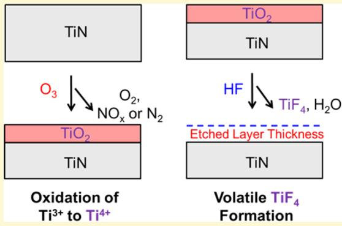

# I. INTRODUCTION

Atomic layer etching (ALE) is a thin- film removal method based on sequential, self- limiting surface reactions.12 ALE is usually defined by two separate reactions that enable atomiclevel removal of thin films. The ALE process is the reverse of atomic layer deposition (ALD).3,4 The first reaction during ALE is often an activation step where the surface of the film is modified by adsorption of a reactive species. The second reaction is then the removal of this activated layer using highenergy collisions.1,5 Energetic ions or noble gas atoms have been used to remove the activated material in many previously reported ALE processes.6

Thermal ALE processes have also been developed recently using sequential, self- limiting fluorination and ligand- exchange reactions.78 For metal oxide ALE, a gas- phase fluorination reagent, such as HF, forms a stable and nonvolatile fluoride layer on the metal oxide film. Metal reagents then can remove the fluoride layer through ligand- exchange transmetalation reactions. Thermal ALE processes for  $\mathrm{Al}_2\mathrm{O}_3,$ $\mathrm{HfO_2},$ $\mathrm{ZrO_2},$ $\mathrm{ZnO}_3$ $\mathrm{SiO}_2,$  AlN, and  $\mathrm{AlF}_3$  have been demonstrated using HF and various metal precursors such as  $\mathrm{Sn(acac)}_2,$  trimethylaluminum, dimethylaluminum chloride, and silicon tetrachloride.7,8,10- 18

The thermal ALE process using fluorination and ligandexchange reactions has not been able to etch some metal nitrides, such as titanium nitride (TiN).15 TiN is an important material as a copper diffusion barrier and a complementary metal- oxide- semiconductor (CMOS) gate electrode material in semiconductor devices.19,20 Previous thermal ALE studies have observed that TiN was not etched using HF together with a variety of metal precursors for ligand- exchange.15 One reason for observing no etching is that the oxidation state of Ti in TiN is  $^{3 + }$  .Fluorination would retain the oxidation state by fluorinating TiN to  $\mathrm{TiF}_3$  .However, the oxidation state of Ti is  $^{4 + }$  for most stable and volatile Ti compounds. The ligandexchange process for  $\mathrm{TiF}_3$  does not produce a stable and volatile reaction product.15

Different approaches are needed for thermal TiN ALE. A new thermal ALE process can be defined by sequential, selflimiting oxidation and fluorination reactions as illustrated in Figure 1. The first step is the oxidation reaction where an ozone  $(O_3)$  exposure produces a titanium oxide  $(\mathrm{TiO}_2)$  surface layer on the TiN substrate:

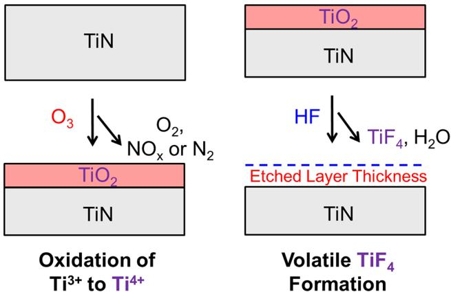  
Figure 1. Schematic for TiN ALE using  $\mathrm{O}_3$  and HF as the reactants.  $\mathrm{O}_3$  oxidizes the TiN substrate to form a  $\mathrm{TiO}_2$  layer on the surface. Subsequently, HF removes the  $\mathrm{TiO}_2$  layer by forming volatile  $\mathrm{TiF}_4$  and  $\mathrm{H}_2\mathrm{O}$  reaction products.

$$
\mathrm{TiN} + 3\mathrm{O}_3\rightarrow \mathrm{TiO}_2 + \mathrm{NO} + 3\mathrm{O}_2 \tag{1}
$$

$\mathrm{O}_3$  is a strong oxidant that is able to convert the oxidation state of Ti from  $3+$  to  $4+$ . This oxidation reaction is thermochemically favorable.  ${}^{21}\mathrm{O}_3$  can also form a stable, self- passivating  $\mathrm{TiO}_2$  layer. The  $\mathrm{TiO}_2$  layer forms a diffusion barrier that impedes further oxidation and leads to a self- limiting oxidation reaction.

A fluorinating reagent, such as HF, can then react with  $\mathrm{TiO}_2$  and form a volatile titanium tetrafluoride  $\mathrm{(TiF_4)}$  reaction product:

$$
\mathrm{TiO}_2 + 4\mathrm{HF}\rightarrow \mathrm{TiF}_4 + 2\mathrm{H}_2\mathrm{O} \tag{2}
$$

This fluorination reaction is thermochemically favorable at room temperature and becomes less favorable at higher temperatures.  ${}^{21}$  The  $\mathrm{TiF}_4$  reaction product will be removed from the surface because of its high volatility.  $\mathrm{H}_2\mathrm{O}$  is also produced as a volatile reaction product. The  $\mathrm{O}_3$  and HF reactions can then be repeated to etch the TiN substrate with atomic layer control.

The thermal ALE process shown in Figure 1 using oxidation and fluorination reactions is very different from the previous thermal ALE approach using fluorination and ligand- exchange reactions. In the new process illustrated in Figure 1, HF etches the  $\mathrm{TiO}_2$  layer by producing volatile  $\mathrm{TiF}_4$ . In contrast, the fluorination step in the previous thermal ALE approach has been used to form stable and nonvolatile metal fluorides such as  $\mathrm{AlF}_3$ ,  $\mathrm{ZrF}_4$ , and  $\mathrm{HfF}_4$ .  ${}^{8,11,13,14}$  These stable metal fluorides were then removed by a ligand- exchange reaction.

This new thermal ALE process should be valuable for a number of conducting transition metal nitrides such as TiN, VN, TaN, and WN. These metal nitrides have an oxidation state of  $^{3 + }$  that is lower than the oxidation state in their fully oxidized forms. The fluorides of these metal nitrides may have difficulty undergoing ligand- exchange reactions. However, oxidation can convert these metal nitrides to metal oxides with higher oxidation states. For example, the  $\mathrm{TiO}_2$ ,  $\mathrm{V}_2\mathrm{O}_5$ ,  $\mathrm{Ta}_2\mathrm{O}_5$ , and  $\mathrm{WO}_3$  metal oxides have oxidation states of  $^{4 + }$ ,  $^{5 + }$ ,  $^{5 + }$ , and  $^{6 + }$ , respectively. The  $\mathrm{TiF}_4$ ,  $\mathrm{VF}_5$ ,  $\mathrm{TaF}_5$ , and  $\mathrm{WF}_6$  metal fluorides that may form during the fluorination of these metal oxides have high volatility and share the same high oxidation states as their respective metal oxides.

In this work, thermal TiN ALE was demonstrated using oxidation and fluorination reactions.  $\mathrm{O}_3$  or  $\mathrm{H}_2\mathrm{O}_2$  vapor was employed as the oxidation reactant. HF vapor derived from

HF- pyridine solution was used as the fluorination reactant. Spectroscopic ellipsometry was used to measure the thicknesses of TiN thin films on silicon wafers versus the number of ALE cycles. X- ray reflectivity measurement was also employed to confirm the thickness changes as well as to determine the roughness of the TiN film after ALE reactions.

The oxidation and fluorination reactions were also used to demonstrate the selective etching of TiN in the presence of other materials such as  $\mathrm{Al}_2\mathrm{O}_3$ ,  $\mathrm{HfO}_2$ ,  $\mathrm{ZrO}_2$ ,  $\mathrm{SiO}_2$ , and  $\mathrm{Si}_3\mathrm{N}_4$ . These materials are all important materials in semiconductor fabrication processes. This thermal ALE strategy using oxidation and fluorination reactions that yield a volatile metal fluoride is general and should provide a pathway for the thermal ALE of a number of new materials. In addition to other metal nitrides, possible new materials include metal carbides, metal sulfides, metal selenides, and elemental metals.

# II. EXPERIMENTAL SECTION

All the reactions were conducted in a viscous- flow, hot- wall reactor defined by a stainless steel tube with the length of  $\sim 60 \mathrm{cm}$  and inside diameter of  $3.8 \mathrm{cm}$ .  ${}^{22}$  The reactor was isothermally heated by heating elements attached to the outside of the stainless steel tube. The reaction temperatures from 150 to  $350^{\circ}\mathrm{C}$  were stabilized within  $\pm 0.04^{\circ}\mathrm{C}$  of the set point by a proportional- integral- derivative (PID) temperature controller (2604, Eurotherm). A constant flow of 150 sccm UHP nitrogen gas  $(\mathrm{N}_2, 99.999\% , \mathrm{Argas})$  was regulated by mass flow controllers (Type 1179A, MKS). This  $\mathrm{N}_2$  gas flow established a base pressure of  $\sim 1$  Torr in the reactor when pumped by a mechanical pump (Pascal 2015SD, Alcatel). The pressure was recorded by a capacitance manometer (Baratron 121A, MKS).

The demonstration of spontaneous etching of  $\mathrm{TiO}_2$  was performed using an in situ quartz crystal ambulance (QCM) located at the center of the hot- wall reactor.  ${}^{23}$  The gold- coated quartz crystal (polished, RC crystal, 6 MHz, Phillip Technologies) was placed in a sensor head (BSH- 150, Inficon) and sealed with high- temperature epoxy (Epo- Tek H21D, Epoxy Technology). The mass changes during the reactions were measured by a thin- film deposition monitor (Maxtek TM- 400, Inficon). The  $\mathrm{TiO}_2$  films were deposited on the QCM crystal using  $\mathrm{TiO}_2$  ALD with titanium tetrachloride  $(\mathrm{TiCl}_4, 99\% , \mathrm{Strem})$  and deionized  $\mathrm{H}_2\mathrm{O}$  (Chromasolv for HPLC, Sigma- Aldrich) as the reactants at 200, 250, and  $300^{\circ}\mathrm{C}$ .  ${}^{23}$  HF exposures on these  $\mathrm{TiO}_2$  ALD films were performed at the same temperature as the  $\mathrm{TiO}_2$  ALD reactions.

The HF source was a HF- pyridine solution (70 wt % HF, Sigma- Aldrich). A gold- plated stainless steel bubbler was filled with the HF- pyridine solution in a dry  $\mathrm{N}_2$ - filled glovebag and held at room temperature. A HF vapor pressure of 90- 100 Torr was in equilibrium with the HF- pyridine solution.  ${}^{11}$  Only HF vapor was delivered in the gas phase as confirmed by mass spectrometry.  ${}^{24}$  The pressure transients of HF were adjusted to  $\sim 80$  mTorr using a metering bellows- sealed valve (SS- 4BMG, Swagelox).

The  $\mathrm{O}_3$  was produced in a corona discharge ozone generator (LG- 14, Del Ozone). A flow of 480 sccm of UHP oxygen gas  $(\mathrm{O}_2, 99.994\% , \mathrm{Argas})$  was supplied to produce a maximum  $\sim 5$  wt % of  $\mathrm{O}_3$  in  $\mathrm{O}_2$ . When the  $\mathrm{O}_3$  was not delivered to the reactor, the  $\mathrm{O}_3$  was passed through an ozone destruct unit (ODS- 1, Ozone Solutions) connected to the exhaust line. Hydrogen peroxide  $(\mathrm{H}_2\mathrm{O}_2)$  vapor was evaporated with  $\mathrm{H}_2\mathrm{O}$  from a  $\mathrm{H}_2\mathrm{O}_2$  solution (50 wt %, Sigma- Aldrich) contained in a glass bubbler. The  $\mathrm{H}_2\mathrm{O}_2$  solution was held at room temperature.

The TiN films were prepared by SEMATECH. The TiN film was deposited on a  $300~\mathrm{mm}$  diameter silicon wafer by semiconductor ALD processes in commercially available tools. The initial thickness of TiN was measured as  $\sim 70$  Å by spectroscopic ellipsometry (SE) measurements. The TiN film on the silicon wafers was cleaved to produce samples that were  $1.25 \mathrm{cm}$  by  $1.25 \mathrm{cm}$  in size and used in the ALE experiments. For the selectivity experiments, the  $\mathrm{Al}_2\mathrm{O}_3$ ,  $\mathrm{HfO}_2$ ,  $\mathrm{ZrO}_2$ ,  $\mathrm{SiO}_2$ , and  $\mathrm{Si}_3\mathrm{N}_4$  thin films on silicon wafers were placed together with the TiN sample in the reactor. The  $\mathrm{Al}_2\mathrm{O}_3$ ,  $\mathrm{HfO}_2$ , and  $\mathrm{ZrO}_2$  films

were prepared by SEMATECH and deposited by ALD processes. The  $\mathrm{SiO}_2$  and  $\mathrm{Si}_3\mathrm{N}_4$  films were prepared by SEMATECH and deposited by chemical vapor deposition (CVD) processes.

$\mathrm{Al}_2\mathrm{O}_3$  ALD films were coated inside the reactor before TiN ALE to minimize  $\mathrm{O}_3$  decomposition on the walls of the hot- wall reactor.25 The ALE reactions were conducted using a reaction sequence represented as  $x - 30 - y - 30$  .This reaction sequence consists of an exposure of the oxidation reagent for  $x\leq 30s$  30 s of  $\mathbf{N}_2$  purge,  $y$  s of HF exposure, and 30 s of  $\mathbf{N}_2$  purge. The ALE reactions using  $\mathrm{O}_3$  as an oxidation reagent were performed using an optimized reaction sequence of 3- 30- 1- 30. The ALE reactions using  $\mathrm{H}_2\mathrm{O}_2$  as an oxidation source were performed using an optimized reaction sequence of 2.5- 30- 1- 30.

$Ex$  situ spectroscopic ellipsometry (SE) measurements determined the thicknesses of the various films  $\Psi$  and  $\Lambda$  at  $240 - 900\mathrm{nm}$  were measured by a spectroscopic ellipsometer (M- 2000, J. A. Woollam) and fitted by the analysis software (CompleteEASE, J. A. Woollam). These measurements employed an incidence angle of  $75^{\circ}$  near the Brewster angle of the silicon wafer. A Lorentz model was used for fitting the thickness of the TiN film. A Sellmeier model was used for fitting of the  $\mathrm{Al}_2\mathrm{O}_3,$ $\mathrm{HfO}_2,$ $\mathrm{ZrO}_2,$ $\mathrm{SiO}_2,$  and  $\mathrm{Si}_3\mathrm{N}_4$  films.

The thicknesses, roughness, and film density were obtained by ex situ XRR analysis. The X- ray reflectivity (XRR) scans at  $300 - 9000$  arcsec were measured by a high- resolution X- ray diffractometer (Bede D1, Jordan Valley Semiconductors) using  $\mathrm{CuK}\alpha$  radiation  $\lambda = 1.540$  A). The filament voltage was  $40\mathrm{kV},$  and the current was  $35~\mathrm{mA}$  in the X- ray tube. All XRR scans were recorded with a 10 arcsec step size and a  $5\mathrm{s}$  acquisition time and fitted using the analysis software (Bede REFS, Jordan Valley Semiconductors) to determine film thickness, film density, and surface roughness.

# III. RESULTS AND DISCUSSION

A. Spontaneous Etching of  $\mathrm{TiO}_2$  by HF. Figure 2 shows the mass changes during 10 consecutive HF exposures on  $\mathrm{TiO}_2$

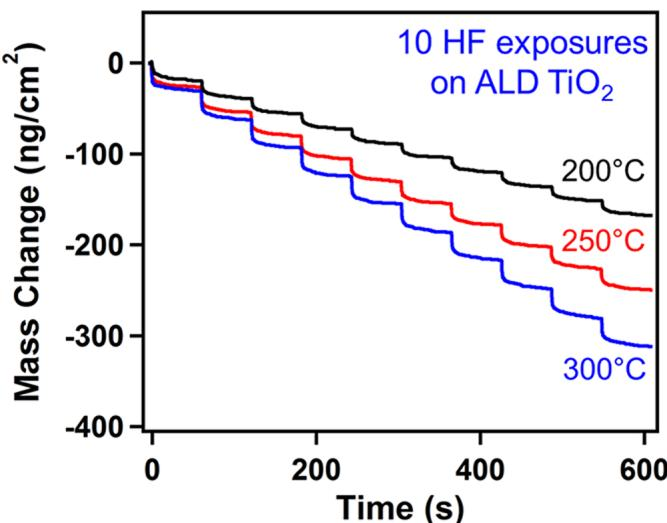  
Figure 2. Mass changes during 10 consecutive HF exposures on  $\mathrm{TiO}_2$  ALD film at 200, 250, and  $300^{\circ}\mathrm{C}$

films grown on the quartz crystal microbalance. The  $\mathrm{TiO}_2$  ALD films were deposited using  $\mathrm{TiCl}_4$  and  $\mathrm{H}_2\mathrm{O}$  as the reactants at 200, 250, and  $300^{\circ}\mathrm{C}$  23 Each HF exposure for  $1\mathrm{s}$  leads to a mass loss consistent with spontaneous etching of the  $\mathrm{TiO}_2$  film. The average mass change during the HF exposure is  $- 17\mathrm{ng}/$ $\mathrm{cm}^2$  at  $200^{\circ}\mathrm{C}$  There are slightly higher mass changes at higher temperatures. Mass changes of  $- 25$  and  $- 32\mathrm{ng} / \mathrm{cm}^2$  were obtained with the same HF exposure time of  $1\mathrm{s}$  at 250 and 300  $^\circ \mathrm{C}_i$  respectively. These results suggest that an HF exposure of 1 s is able to etch a  $\mathrm{TiO}_2$  thickness of  $0.66 - 0.85\mathrm{\AA}$  at  $250 - 300$ $^\circ \mathrm{C}$  based on the density of  $3.76~\mathrm{g / cm^3}$  for  $\mathrm{TiO}_2$  ALD films.23

The fluorination reaction given by eq 2 has a standard reaction enthalpy  $\Delta H^{\circ} = - 22.7\mathrm{kcal / mol}$  at  $25^{\circ}\mathrm{C}$  21 This negative enthalpy value is maintained at high temperatures with  $\Delta H^{\circ} = - 21.9\mathrm{kcal / mol}$  at  $250^{\circ}\mathrm{C}$  21 The standard free energy of this reaction is favorable at room temperature with  $\Delta G^{\circ} =$ $- 6.1\mathrm{kcal / mol}$  at  $25^{\circ}\mathrm{C}$  21 The standard free energy change becomes unfavorable at temperatures  $>150~^{\circ}\mathrm{C}$  for entropic reasons. The  $\Delta G^{\circ}$  value at  $250^{\circ}\mathrm{C}$  is  $+6.3\mathrm{kcal / mol}$  21 However, the  $\Delta G$  values for the HF reaction with  $\mathrm{TiO}_2$  may be negative and may predict a spontaneous reaction under nonstandard conditions. The etching could be favorable in the presence of excess of HF vapor when the  $\mathrm{TiF_4}$  and  $\mathrm{H}_2\mathrm{O}$  reaction products are quickly removed by the  $\mathbf{N}_2$  purge gas.

B. Thermal TiN ALE Using  $\mathbf{O}_3$  and HF. Previous studies have shown that HF by itself or in conjunction with other metal precursors cannot etch TiN.15 However, HF is able to etch  $\mathrm{TiO}_2$  spontaneously as shown in Figure 2. These results suggest that if a  $\mathrm{TiO}_2$  layer can be formed on a TiN substrate using an oxidizing reagent, then a fluorination reagent, such as HF, should be able to etch the  $\mathrm{TiO}_2$  layer on the TiN substrate. These oxidation and fluorination reactions define the thermal TiN ALE process illustrated in Figure 1.

Ozone  $(\mathrm{O}_3)$  is a gas- phase reagent with strong oxidation power.  $\mathrm{O}_3$  has often been preferred to  $\mathrm{O}_2$  as an oxygen source for metal oxide ALD when its stronger oxidizing ability is needed, or the  $\mathrm{H}_2\mathrm{O}$  purge is difficult.26 In addition,  $\mathrm{O}_3$  is also known to form an excellent passivation oxide layer on polycrystalline aluminum metal or crystalline silicon.27,28  $\mathrm{O}_3$  also can be employed as an oxidation reagent for the formation of a  $\mathrm{TiO}_2$  layer on the TiN substrate.

The proposed oxidation reaction of TiN using  $\mathrm{O}_3$  is given by eq 1. This oxidation reaction is thermochemically favorable. The standard free energy of this reaction is  $\Delta G^{\circ} = - 242.1\mathrm{kcal}/$  mol at  $250^{\circ}\mathrm{C}$  21 Other nitrogen- containing reaction products in addition to NO, such as  $\mathbf{N}_2$  and  $\mathrm{NO}_2,$  may be possible. The  $\Delta G^{\circ}$  values with  $\mathbf{N}_2$  or  $\mathrm{NO}_2$  as the reaction product yield favorable standard free energy values of  $\Delta G^{\circ} = - 219$  or  $- 288$ $\mathrm{kcal / mol}$  at  $250^{\circ}\mathrm{C},$  respectively.21

The fluorination reaction of HF with  $\mathrm{TiO}_2$  is given by eq 2. This reaction has  $\Delta G^{\circ}$  values of  $- 6.1\mathrm{kcal / mol}$  at  $25^{\circ}\mathrm{C}$  and  $+6.3\mathrm{kcal / mol}$  at  $250^{\circ}\mathrm{C}$  21 As discussed above in Section A, the positive  $\Delta G^{\circ}$  value at  $250^{\circ}\mathrm{C}$  does not preclude the reaction because the reactions are not performed under standard conditions. The production of  $\mathrm{TiF_4}$  can lead to etching because  $\mathrm{TiF_4}$  is a volatile solid that sublimes at  $284^{\circ}\mathrm{C}$  29

After HF removes the  $\mathrm{TiO}_2$  layer on the TiN substrate, HF could also form  $\mathrm{TiF}_3$  by fluorination of TiN. The reaction between TiN and HF is given by

$$
\mathrm{TiN(s)} + 3\mathrm{HF(g)}\rightarrow \mathrm{TiF}_3(s) + \mathrm{NH}_2(\mathrm{g}) \tag{3}
$$

This reaction is favorable with a  $\Delta G^{\circ}$  value of  $- 37.0\mathrm{kcal / mol}$  at  $250^{\circ}\mathrm{C}$  21  $\mathrm{TiF}_3$  is a nonvolatile solid with a melting point of  $1200^{\circ}\mathrm{C}$  21  $\mathrm{TiF}_3$  is a nonvolatile solid with a melting point of  $1400^{\circ}\mathrm{C}$  29  $\mathrm{TiF}_3$  may act as an etch stop. However, the HF reaction with TiN may not occur if HF does not remove the entire  $\mathrm{TiO}_2$  film or does not remove the  $\mathrm{TiO}_x\mathrm{N}_y$  layer at the interface between  $\mathrm{TiO}_2$  and TiN.

Figure 3 shows the spectroscopic ellipsometry (SE) and Xray reflectivity (XRR) measurements of the initial TiN film thickness and the TiN film thickness after 25, 50, 100, 150, 200, and 300 ALE cycles using  $\mathrm{O}_3$  and HF as the reactants at 250  $^\circ \mathrm{C}$  The film thickness versus the number of ALE cycles is linear. An etch rate of  $0.19\mathrm{\AA}/$  cycle was obtained from the SE measurements using a least- squares fitting. The XRR measure

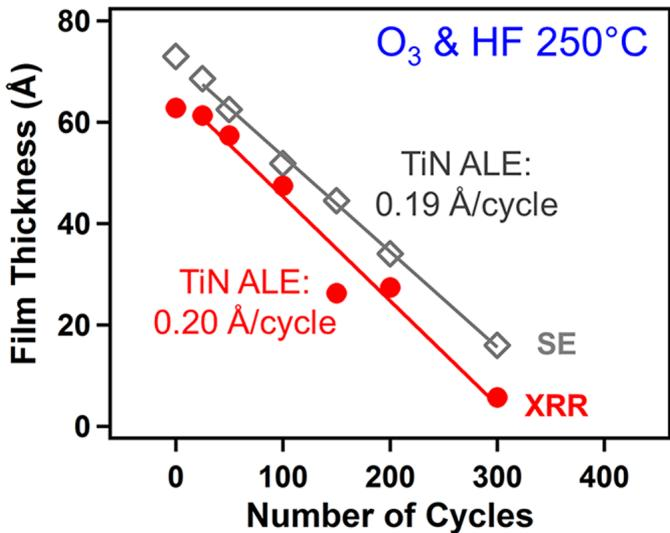  
Figure 3. X-ray reflectivity and spectroscopic ellipsometry measurements of TiN film thickness versus number of  $\mathrm{O}_3$  and HF reaction cycles at  $250^{\circ}\mathrm{C}$ .

ments on the same samples yielded an etch rate of  $0.20\mathrm{\AA}/$  cycle. These XRR results are consistent with the SE results.

No TiN etch was observed when using  $\mathrm{O}_2$  by itself as the oxidation reactant together with HF. The oxidation reaction  $\mathrm{TiN(s) + ^3 / _2O_2(g)\rightarrow TiO_2(s) + NO(g)}$  is thermochemically favorable having a standard free energy change of  $\Delta G^{\circ} =$ $- 113.7\mathrm{kcal}$  at  $250^{\circ}\mathrm{C}$  21 However, the oxidation of TiN by  $\mathrm{O}_2$  at  $< 350^{\circ}C$  is known to slowly form a thin  $\mathrm{TiO}_2$  layer.30,31 The surface of TiN also reacts with  $\mathrm{O}_2$  and creates an intermediate titanium oxynitride  $(\mathrm{TiO_xN_y})$  phase, in addition to a thin  $\mathrm{TiO}_2$  layer. The oxidation state of Ti in this intermediate phase is  $^{3 + }$  and  $^{4 + }$  by XPS analysis.30 The strong oxidizing ability of  $\mathrm{O}_3$  may be necessary for the oxidation of TiN or  $\mathrm{TiO_xN_y}$  to  $\mathrm{TiO}_2$  The  $\mathrm{TiO}_2$  layer can then be etched by HF during TiN ALE at  $250^{\circ}\mathrm{C}$

Figure 4 shows the self- limiting behavior for the  $\mathrm{O}_3$  and HF exposures during TiN ALE at  $250^{\circ}\mathrm{C}$ . The etch rates were obtained versus reactant exposure time while holding the other reactant exposure time constant. The etch rate was determined using the average thickness change during 200 ALE cycles. Figure 4a examines the self- limiting reaction using different  $\mathrm{O}_3$  exposure times with a HF exposure time of  $1\mathrm{~s}$ . A  $\mathrm{N}_2$  purge time of  $30\mathrm{~s}$  was used between reactant exposures. The etch rate increases and levels off at  $\sim 0.2\mathrm{\AA}/$  cycle versus the  $\mathrm{O}_3$  exposure time. The oxidation of the TiN substrate is believed to be self- limiting because of the formation of a  $\mathrm{TiO}_2$  passivation layer on the TiN substrate that acts as a diffusion barrier.32

Figure 4b examines the self- limiting reaction using different HF exposure times with an  $\mathrm{O}_3$  exposure time of  $3\mathrm{~s}$ . The etch rate versus the HF exposure time increases and levels off at  $\sim 0.2\mathrm{\AA}/$  cycle. The fluorination reaction is self- limiting because the etching reaction to produce volatile  $\mathrm{TiF}_4$  and  $\mathrm{H}_2\mathrm{O}$  is limited by the thickness of the  $\mathrm{TiO}_2$  layer on the TiN substrate. HF does not etch the TiN film by itself. Figure 2 shows that an HF exposure of  $1\mathrm{~s}$  is able to remove  $25\mathrm{ng} / \mathrm{cm}^2$  or  $0.66\mathrm{\AA}$  of a  $\mathrm{TiO}_2$  film at  $250^{\circ}\mathrm{C}$ . This thickness of  $\mathrm{TiO}_2$  film removed by the HF exposure is much greater than the etch rate of  $0.2\mathrm{\AA}/$  cycle for the  $\mathrm{TiO}_2$  layer on the TiN substrate.

Figure 5 shows results for TiN ALE in the presence of various materials. These results demonstrate the selective etching of TiN using  $\mathrm{O}_3$  and HF as the reactants at  $250^{\circ}\mathrm{C}$ .

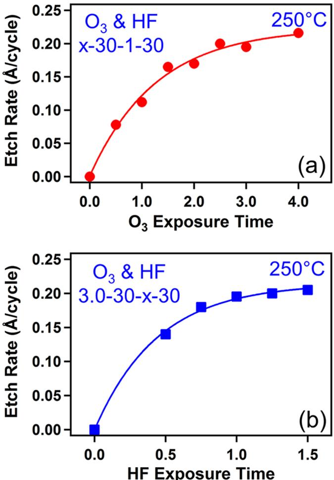  
Figure 4. (a) Etch rates for TiN versus  $\mathrm{O}_3$  exposure time with constant HF exposure time of  $1.0\mathrm{~s}$ . (b) Etch rates for TiN versus HF exposure time with constant  $\mathrm{O}_3$  exposure time of  $3.0\mathrm{~s}$ .

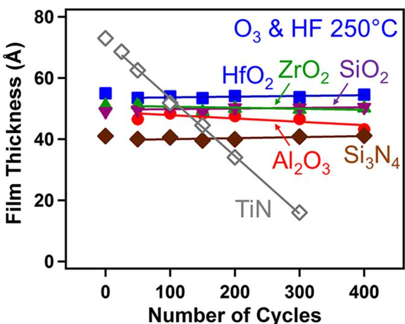  
Figure 5. Film thickness versus number of  $\mathrm{O}_3$  and HF reaction cycles at  $250^{\circ}\mathrm{C}$  for  $\mathrm{Al}_2\mathrm{O}_3$ ,  $\mathrm{HfO}_2$ ,  $\mathrm{ZrO}_2$ ,  $\mathrm{SiO}_2$ ,  $\mathrm{Si}_3\mathrm{N}_4$ , and TiN.

There are negligible thickness changes for  $\mathrm{Al}_2\mathrm{O}_3$ ,  $\mathrm{HfO}_2$ ,  $\mathrm{ZrO}_2$ ,  $\mathrm{SiO}_2$ , and  $\mathrm{Si}_3\mathrm{N}_4$  during the TiN ALE reactions. The  $\mathrm{O}_3$  and HF exposures could not etch the  $\mathrm{Al}_2\mathrm{O}_3$ ,  $\mathrm{HfO}_2$ , and  $\mathrm{ZrO}_2$  metal oxides because the fluorides of these metal oxides,  $\mathrm{AlF}_3$ ,  $\mathrm{HfF}_4$ , and  $\mathrm{ZrF}_4$ , are stable and nonvolatile. The  $\mathrm{O}_3$  and HF exposures

could also not etch silicon oxide and silicon nitride. In the absence of  $\mathrm{H}_2\mathrm{O}$ , dry HF can not etch  $\mathrm{SiO}_2$ . Previous thermal ALE studies using fluorination and ligand- exchange reactions could also not etch  $\mathrm{SiO}_2$  or  $\mathrm{Si}_3\mathrm{N}_4$ . New approaches are needed for  $\mathrm{SiO}_2$  ALE and  $\mathrm{Si}_3\mathrm{N}_4$  ALE.

Figure 6 shows XRR scans for the initial TiN film on the Si wafer and for TiN films after various numbers of ALE cycles with  $\mathrm{O}_3$  and HF as the reactants at  $250^{\circ}\mathrm{C}$ . The initial TiN film thickness is reduced linearly after various numbers of ALE cycles as shown in Figure 3. The XRR scans also reveal the roughness of the TiN films versus the ALE cycles. The roughness of initial TiN film was  $9.3\mathrm{\AA}$ . The roughness was then reduced as the TiN film was smoothed by the ALE process. The etched TiN films have roughness values of 8.5, 8.2, and  $7.5\mathrm{\AA}$  after 25, 50, and 100 ALE cycles, respectively. This decreased roughness versus number of TiN ALE cycles is consistent with the surface smoothing observed by previous studies of  $\mathrm{Al}_2\mathrm{O}_3$  and  $\mathrm{HfO}_2$  ALE using fluorination and ligand- exchange reactions.

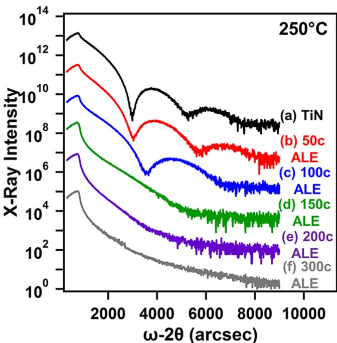  
Figure 6. X-ray reflectivity scans versus number of  $\mathrm{O}_3$  and HF reaction cycles on TiN films at  $250^{\circ}\mathrm{C}$ .

Figure 7 shows the TiN ALE etch rates obtained at different temperatures using  $\mathrm{O}_3$  and HF as the reactants. The etch rates were obtained by the average of the thickness change measured by SE after 200 ALE cycles. All ALE reactions used an optimized reaction sequence of 3- 30- 1- 30. The etch rate is  $0.060\mathrm{\AA}$  cycle at  $150^{\circ}\mathrm{C}$  and increases to  $0.20\mathrm{\AA}$  cycle at  $250^{\circ}\mathrm{C}$ . The etch rates are then constant with temperature between 250 and  $350^{\circ}\mathrm{C}$ . This result may indicate that a similar thickness for the  $\mathrm{TiO}_2$  layer is formed by  $\mathrm{O}_3$  and removed by HF at  $250 - 350^{\circ}\mathrm{C}$ . The HF can only remove the amount of  $\mathrm{TiO}_2$  that is formed during the  $\mathrm{O}_3$  exposure. This constant etch rate over a range of temperatures is similar to the "ALD window" often observed for many ALD processes.

$\mathrm{O}_3$  decomposition at high temperatures could affect the uniformity of the TiN film thicknesses in the reactor. For exploration of this issue, studies were performed using 200 ALE cycles at 250, 300, and  $350^{\circ}\mathrm{C}$  where the etch rate was nearly constant according to the results in Figure 7. Five TiN film samples were placed within a length of  $12.7\mathrm{cm}$  in the hot- wall reactor as shown in Figure 8. The TiN thicknesses were measured before and after the 200 ALE cycles to determine the uniformity of the TiN film.

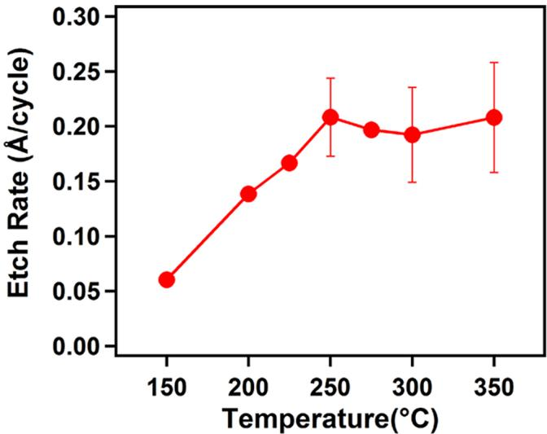  
Figure 7. Etch rates for TiN ALE versus temperature using  $\mathrm{O}_3$  and HF as the reactants.

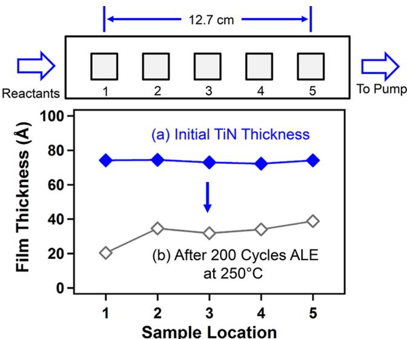  
Figure 8. Film thickness for (a) initial TiN film and (b) after 200 TiN ALE cycles at  $250^{\circ}\mathrm{C}$  for different locations in the reactor.

Figure 8 reveals that TiN ALE yielded fairly uniform TiN film thicknesses after 200 ALE cycles at  $250^{\circ}\mathrm{C}$ . Positions 2- 5 yield an etch rate of  $0.19\mathrm{\AA}$  cycle. In contrast, a slightly larger etch rate of  $0.27\mathrm{\AA}$  cycle is observed in Position 1 close to the reactant entry into the hot- wall reactor. This slightly larger etch rate may correspond with larger reactant exposures at Position 1.

Figure 9 shows uniformity results obtained at a higher temperature of  $350^{\circ}\mathrm{C}$ . These film thicknesses after 200 ALE cycles indicate that a lower etch rate is observed at the downstream positions. These downstream positions are furthest from the reactant entry into the hot- wall reactor. The recombination between gaseous  $\mathrm{O}_3$  molecules is negligible at a reaction pressure of  $\sim 1$  Torr. Consequently, this result

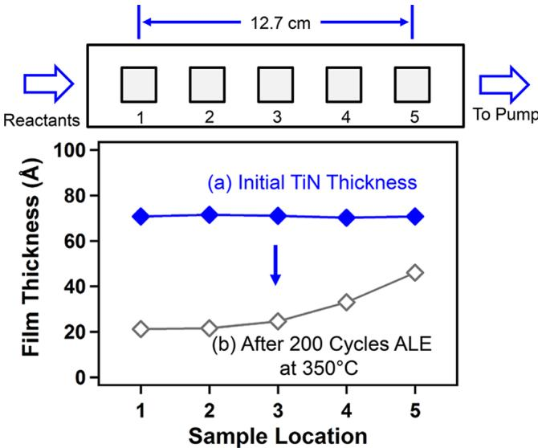  
Figure 9. Film thickness for (a) initial TiN film and (b) after 200 TiN ALE cycles at  $350^{\circ}\mathrm{C}$  for different locations in the reactor.

may indicate that  $\mathrm{O}_3$  is undergoing some decomposition on the surfaces of the hot- wall reactor.

The decomposition of  $\mathrm{O}_3$  may be accelerated at the high temperature of  $350^{\circ}\mathrm{C}$ . This decomposition may lead to lower  $\mathrm{O}_3$  concentrations downstream in the reactor. These lower  $\mathrm{O}_3$  concentrations then produce lower TiN etch rates and thicker TiN film thicknesses. Similar effects were observed for  $\mathrm{ZnO}$  ALD as a function of position in the reactor using  $\mathrm{Zn(CH_2CH_3)_2}$  and  $\mathrm{O}_3$  as the reactants. Thinner  $\mathrm{ZnO}$  ALD films were observed downstream in the reactor at  $200^{\circ}\mathrm{C}$  because of the lower  $\mathrm{O}_3$  concentrations.

C. Thermal TiN ALE Using  $\mathrm{H}_2\mathrm{O}_2$  and HF. Other oxidants, in addition to  $\mathrm{O}_3$ , may be able to oxidize the TiN substrate and form a  $\mathrm{TiO}_2$  layer.  $\mathrm{H}_2\mathrm{O}_2$  is a strong oxidizer that has been used as a reactant for metal oxide ALD.  $\mathrm{H}_2\mathrm{O}_2 / \mathrm{H}_2\mathrm{O}$  vapor derived from 30 to 50 wt  $\% \mathrm{H}_2\mathrm{O}_2$  solution has been used for ALD.  $\mathrm{H}_2\mathrm{O}_2$  is a stronger oxidizer than  $\mathrm{O}_2$ , but weaker than  $\mathrm{O}_3$ . The redox potential of oxidants measured in solution is consistent with this order of oxidant strength.

The proposed oxidation reaction of TiN using  $\mathrm{H}_2\mathrm{O}_2$  can be expressed as

$$
\mathrm{TiN(s)} + 3\mathrm{H}_2\mathrm{O}_2(\mathrm{g})\rightarrow \mathrm{TiO}_2(\mathrm{s}) + \mathrm{NO}(\mathrm{g}) + 3\mathrm{H}_2\mathrm{O}(\mathrm{g})
$$

This oxidation reaction is thermochemically favorable. The standard free energy is  $\Delta G^0 = - 211.6\mathrm{kcal / mol}$  at  $250^{\circ}\mathrm{C}$ .

Figure 10 shows the SE and XRR measurements of the initial TiN film thickness and the TiN film thickness after 50, 100, 200, and 400 ALE cycles using  $\mathrm{H}_2\mathrm{O}_2$  and HF as the reactants at  $250^{\circ}\mathrm{C}$ . The film thickness versus the number of ALE cycles is linear. An etch rate of  $0.15\mathrm{\AA}$  cycle was obtained by SE using a least- squares fitting. The XRR measurements on the same samples yielded an etch rate of  $0.14\mathrm{\AA}$  cycle that is consistent with the SE results.

The ALE reactions using  $\mathrm{H}_2\mathrm{O}_2$  and HF were also self- limiting. However, achieving reproducible results was challenging because of changes in the  $\mathrm{H}_2\mathrm{O}_2$  concentration. Purging the excess  $\mathrm{H}_2\mathrm{O}$  after the  $\mathrm{H}_2\mathrm{O}_2 / \mathrm{H}_2\mathrm{O}$  exposure was also difficult. There also may be a thermal decomposition of  $\mathrm{H}_2\mathrm{O}_2$  at high temperatures. These factors contributed to making  $\mathrm{H}_2\mathrm{O}_2$  more problematic than  $\mathrm{O}_3$  as an oxidant for TiN ALE.

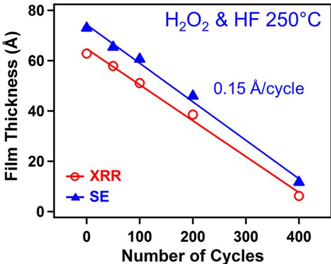  
Figure 10. X-ray reflectivity and spectroscopic ellipsometry measurements of TiN film thickness versus number of  $\mathrm{H}_2\mathrm{O}_2$  and HF reaction cycles at  $250^{\circ}\mathrm{C}$ .

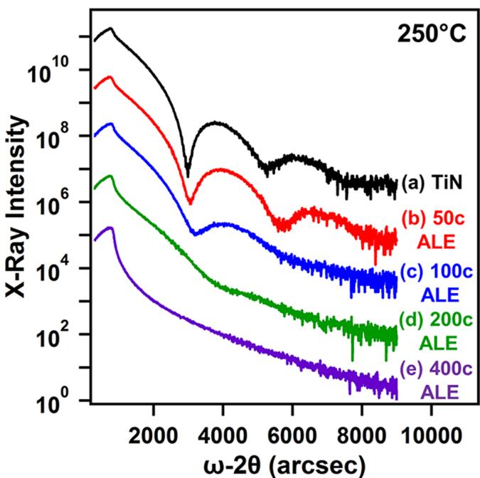  
Figure 11 shows the XRR scans of the initial TiN film on the Si wafer and the TiN films after various numbers of ALE cycles  Figure 11. X-ray reflectivity scans versus number of  $\mathrm{H}_2\mathrm{O}_2$  and HF reaction cycles on TiN films at  $250^{\circ}\mathrm{C}$

using  $\mathrm{H}_2\mathrm{O}_2$  and HF as the reactants at  $250^{\circ}\mathrm{C}$ . The initial TiN film thickness of  $63\mathrm{\AA}$  was reduced versus number of ALE cycles as shown in Figure 10. The initial TiN film roughness was  $9.3\mathrm{\AA}$ . This roughness was reduced to  $8.1\mathrm{\AA}$  after 50 cycles and  $6.5\mathrm{\AA}$  after 100 ALE cycles. These measurements indicate that the TiN films were smoothed by TiN ALE using  $\mathrm{H}_2\mathrm{O}_2$  and HF as the reactants. These results are consistent with the TiN film smoothing obtained from Figure 6 during TiN ALE using  $\mathrm{O}_3$  and HF as the reactants.

D. Generality of Thermal ALE Using Oxidation and Fluorination Reactions. The ALE of other materials including metal nitrides, metal sulfides, metal selenides, and

elemental metals should be possible using sequential, self- limiting oxidation and fluorination reactions. This approach requires that oxidation by oxidants, such as  $\mathrm{O}_3$  and  $\mathrm{H}_2\mathrm{O}_2$ , is able to form a self- passivating metal oxide layer with a finite thickness that prevents further oxidation. The fluorination reactants, such as HF and  $\mathrm{SF}_4$ , then remove only the metal oxide layer formed during the oxidation step. The removal occurs because the fluorides produced by the fluorination reactions are volatile. The oxygen in the metal oxide is removed as  $\mathrm{H}_2\mathrm{O}$  and  $\mathrm{SO}_2$  by HF and  $\mathrm{SF}_4$ , respectively.

ALE processes using oxidation and fluorination reactions for representative materials are given in Table 1. The oxidation reactions for many transition metal nitrides that have volatile metal fluorides, such as TiN, to form their corresponding metal oxides are very favorable. The  $\Delta G^{\circ}$  values for the oxidation of TiN, TaN, NbN, VN, W/N,  $\mathrm{Mo}_2\mathrm{N}$ , MoN, and  $\mathrm{CrN}$  using  $\mathrm{O}_3$  to form  $\mathrm{TiO}_2$ ,  $\mathrm{Ta}_2\mathrm{O}_5$ ,  $\mathrm{Nb}_2\mathrm{O}_5$ ,  $\mathrm{V}_2\mathrm{O}_5$ ,  $\mathrm{WO}_3$ ,  $\mathrm{MoO}_3$ ,  $\mathrm{MoO}_3$ , and  $\mathrm{CrO}_3$  are  $- 241$ ,  $- 296$ ,  $- 284$ ,  $- 246$ ,  $- 294$ ,  $- 280$ ,  $- 298$ , and  $- 238\mathrm{kcal / mol}$  at  $250^{\circ}\mathrm{C}$ , respectively. The  $\Delta G^{\circ}$  values for oxidation using  $\mathrm{H}_2\mathrm{O}_2$  are somewhat lower, but still very favorable, with  $\Delta G^{\circ}$  values  $< - 200\mathrm{kcal / mol}$ .

Table 1. ALE Using Oxidation and Fluorination Reactions for Various Materials  

<table><tr><td colspan="2">Metal Nitride</td></tr><tr><td colspan="2">oxidation: TiN + 3O3→ TiO2+ NO + 3O2(ΔG° = -241 kcal/mol)</td></tr><tr><td colspan="2">fluorination: TiO2+ SF4→ TiF4+ SO2(ΔG° = -62 kcal/mol)</td></tr><tr><td colspan="2">overall: TiN + 3O3+ SF4→ TiF4+ NO + 3O2+ SO2</td></tr><tr><td colspan="2">Metal Carbide</td></tr><tr><td colspan="2">oxidation: NbC + 7/2O3→ 1/NbF2O3+ CO + 7/2O2(ΔG° = -353 kcal/mol)</td></tr><tr><td colspan="2">fluorination: 1/Nb2O5 + 5/4SF4→ NbF5 + 5/4SO2(ΔG° = -74 kcal/mol)</td></tr><tr><td colspan="2">overall: NbC + 7/2O3 + 5/4SF4→ NbF5 + CO + 7/2O2 + 5/4SO2</td></tr><tr><td colspan="2">Metal Sulfide</td></tr><tr><td colspan="2">oxidation: WS2+ 7O3→ WO3+ 2SO2+ 7O2(ΔG° = -552 kcal/mol)</td></tr><tr><td colspan="2">fluorination: WO3 + 3/2SF4→ WF6 + 3/2SO2(ΔG° = -68 kcal/mol)</td></tr><tr><td colspan="2">overall: WS2+ 7O3 + 3/2SF4→ WF6 + 7/2SO2+ 7O2</td></tr><tr><td colspan="2">Metal Selenide</td></tr><tr><td colspan="2">oxidation: MoSe2+ 9O3→ MoO3+ 2SeO3+ 9O2(ΔG° = -519 kcal/mol)</td></tr><tr><td colspan="2">fluorination: MoO3 + 3/2SF4→ MoF6 + 3/2SO2(ΔG° = -43 kcal/mol)</td></tr><tr><td colspan="2">overall: MoSe2+ 9O3 + 7/2SF4→ MoF6 + 2SeO3+ 9O2 + 7/2SO2</td></tr><tr><td colspan="2">Elemental Metal</td></tr><tr><td colspan="2">oxidation: Ta + 5/2O3→ 1/Ta2O5 + 5/2O2(ΔG° = -323 kcal/mol)</td></tr><tr><td colspan="2">fluorination: 1/Ta2O5 + 5/4SF4→ TaF2 + 5/4SO2(ΔG° = -79 kcal/mol)</td></tr><tr><td colspan="2">overall: Ta + 5/2O3 + 5/4SF4→ TaF5 + 5/2O2 + 5/4SO2</td></tr><tr><td colspan="2">“Standard free energy change values are given at 250 °C.”</td></tr></table>

The fluorinations of these metal oxides should all yield volatile metal fluorides. The  $\Delta G^{\circ}$  values for the fluorination of  $\mathrm{TiO}_2$ ,  $\mathrm{Ta}_2\mathrm{O}_5$ ,  $\mathrm{Nb}_2\mathrm{O}_5$ ,  $\mathrm{V}_2\mathrm{O}_5$ ,  $\mathrm{WO}_3$ ,  $\mathrm{MoO}_3$ , and  $\mathrm{CrO}_3$  using  $\mathrm{SF}_4$  to form  $\mathrm{TiF}_4$ ,  $\mathrm{TaF}_5$ ,  $\mathrm{NbF}_5$ ,  $\mathrm{VF}_5$ ,  $\mathrm{WF}_6$ ,  $\mathrm{MoF}_6$ , and  $\mathrm{CrF}_6$  are  $- 62$ ,  $- 79$ ,  $- 74$ ,  $- 45$ ,  $- 68$ ,  $- 53$ , and  $- 40\mathrm{kcal / mol}$  at  $250^{\circ}\mathrm{C}$ , respectively. These metal fluorides are all volatile. For other metal nitrides that do not produce volatile fluorides after the fluorination of the metal oxide, a ligand- exchange reaction may be required to remove the metal fluoride.

Metal carbides are important materials that can be used as gate electrode materials with low work functions in semiconductor devices. Metal carbides have many similar properties to metal nitrides such as structure, bonding characteristics, and electronic properties. The oxidation reactions for transition metal carbides to form their corresponding metal oxides are very favorable. The  $\Delta G^{\circ}$  values for the oxidation of  $\mathrm{TaC}$ ,  $\mathrm{VC}$ , and  $\mathrm{W}_2\mathrm{C}$  using  $\mathrm{O}_3$  to form  $\mathrm{Ta}_2\mathrm{O}_5$ ,  $\mathrm{V}_2\mathrm{O}_5$ , and  $\mathrm{WO}_3$  are  $- 369$ ,  $- 321$ , and  $- 334\mathrm{kcal / mol}$  at  $250^{\circ}\mathrm{C}$ , respectively. These reactions assume  $\mathrm{CO}$  as an etching product. The  $\mathrm{Ta}_2\mathrm{O}_5$ ,  $\mathrm{V}_2\mathrm{O}_5$ , and  $\mathrm{WO}_3$  metal oxides then should produce volatile fluorides during the fluorination reaction using HF or  $\mathrm{SF}_4$ .

Transition metal sulfides and selenides are important 2D semiconductor materials. The oxidation of metal sulfides and selenides to form their corresponding metal oxides is also favorable. The  $\Delta G^{\circ}$  values for the oxidation of  $\mathrm{WS}_2$ ,  $\mathrm{MoS}_2$ ,  $\mathrm{WSe}_2$ , and  $\mathrm{MoSe}_2$  using  $\mathrm{O}_3$  to form  $\mathrm{WO}_3$ ,  $\mathrm{MoO}_3$ ,  $\mathrm{WO}_3$ , and  $\mathrm{MoO}_3$  are  $- 553$ ,  $- 526$ ,  $- 531$ , and  $- 515\mathrm{kcal / mol}$  at  $250^{\circ}\mathrm{C}$ , respectively. The oxidation should also yield volatile  $\mathrm{SO}_2$  or  $\mathrm{SeO}_3$  reaction products. In addition to these thermochemical calculations, previous studies have recently reported the oxidation of  $\mathrm{WSe}_2$  to form a  $\mathrm{WO}_x$  layer on  $\mathrm{WSe}_2$ . These metal oxides should then form volatile metal fluorides after fluorination with  $\mathrm{SF}_4$ .

Elemental metals with volatile metal fluorides can also be etched using oxidation and fluorination reactions. The  $\Delta G^{\circ}$  values for the oxidation of Ti, Ta, Nb, V, W, Mo, and Cr using  $\mathrm{O}_3$  to form  $\mathrm{TiO}_2$ ,  $\mathrm{Ta}_2\mathrm{O}_5$ ,  $\mathrm{Nb}_2\mathrm{O}_5$ ,  $\mathrm{V}_2\mathrm{O}_5$ ,  $\mathrm{WO}_3$ ,  $\mathrm{MoO}_3$ , and  $\mathrm{CrO}_3$  are  $- 288$ ,  $- 323$ ,  $- 305$ ,  $- 264$ ,  $- 296$ ,  $- 273$ , and  $- 234\mathrm{kcal / mol}$  at  $250^{\circ}\mathrm{C}$ , respectively. The oxidation reaction is expected to form a self- passivating metal oxide on the surface of the metal. If the oxide layer does not self- limit versus oxidant exposure, either milder oxidation reactants such as  $\mathrm{NO}_2$ ,  $\mathrm{N}_2\mathrm{O}$ , and  $\mathrm{NO}^{44}$  may be useful to obtain a self- limiting oxide thickness. These metal oxides should then form volatile metal fluorides after fluorination with HF or  $\mathrm{SF}_4$ .

The choice of the fluorination reactant is important for metal ALE using oxidation and fluorination reactions. Some metals will spontaneously etch with fluorination reactants that are stronger than HF. For example,  $\mathrm{XeF}_2$  and  $\mathrm{F}_2$  are both strong fluorination reagents. After removing the metal oxide,  $\mathrm{XeF}_2$  and  $\mathrm{F}_2$  could proceed to etch the underlying metal spontaneously. For example,  $\mathrm{XeF}_2$  spontaneously etches Ti, V, Nb, Ta, Mo, W, and metal alloys such as  $\mathrm{Ti / W}$ . In contrast, HF can often etch the metal oxide layer without etching the underlying metal.

Some metals will also be difficult to etch using oxidation and fluorination reactions because their metal oxides are not favorable or stable. For example, Re and Pt have volatile fluorides such as  $\mathrm{ReF}_6$  and  $\mathrm{PtF}_6$  respectively. Re ALE may be difficult because the thermochemistry for fluorination of  $\mathrm{ReO}_3$  is not very favorable. The reaction  $\mathrm{ReO}_3(\mathrm{s}) + {}^3 /2\mathrm{SF}_4(\mathrm{g}) \rightarrow \mathrm{ReF}_6(\mathrm{g}) + {}^3 /2\mathrm{SO}_2(\mathrm{g})$  has a  $\Delta G^{\circ}$  value of  $0.9\mathrm{kcal / mol}$  at  $250^{\circ}\mathrm{C}$  and becomes negative at  $>450^{\circ}\mathrm{C}$ . The ALE may also be difficult because  $\mathrm{PtO}_3$  is not a stable oxide. The formation of  $\mathrm{PtO}_2$  on Pt may be possible, but  $\mathrm{PtF}_4$  is not volatile.

# IV. CONCLUSIONS

Thermal ALE of TiN can be accomplished using sequential oxidation and fluorination reactions that yield volatile metal fluorides. This work employed two oxidation reagents,  $\mathrm{O}_3$  and  $\mathrm{H}_2\mathrm{O}_2$ , for the oxidation reaction. HF derived from HF- pyridine solution was then used for the fluorination reaction. TiN ALE occurred with a linear reduction of the TiN film thickness versus the number of ALE cycles. The etch rate of TiN ALE versus temperature using  $\mathrm{O}_3$  and HF as the reactants increased from  $0.06\mathrm{\AA}$  cycle at  $150^{\circ}\mathrm{C}$  to  $0.20\mathrm{\AA}$  cycle at  $250^{\circ}\mathrm{C}$ . The etch rate was then constant at  $\geq 250^{\circ}\mathrm{C}$ .

The selective etching of TiN was also observed in the presence of other materials using  $\mathrm{O}_3$  and HF as the reactants.

TiN ALE occurred selectively with no observed etching of the  $\mathrm{Al}_2\mathrm{O}_3$ ,  $\mathrm{HfO}_2$ ,  $\mathrm{ZrO}_2$ ,  $\mathrm{SiO}_2$ , and  $\mathrm{Si}_3\mathrm{N}_4$  surrounding materials. TiN ALE was also achieved using  $\mathrm{H}_2\mathrm{O}_2$  and HF as the reactants. An etch rate of  $0.15\mathrm{\AA}$  /cycle was measured at  $250^{\circ}\mathrm{C}$ . TiN ALE led to surface smoothing when using either  $\mathrm{O}_3$  or  $\mathrm{H}_2\mathrm{O}_2$  as the oxidation reactant.

The overall etching reaction is believed to follow the following reaction:  $\mathrm{TiN} + 3\mathrm{O}_3 + 4\mathrm{HF} \rightarrow \mathrm{TiF}_4 + \mathrm{NO} + 3\mathrm{O}_2 + 2\mathrm{H}_2\mathrm{O}$ . In the proposed reaction mechanism, the oxidizing reactant,  $\mathrm{O}_3$ , oxidizes TiN and forms a  $\mathrm{TiO}_2$  layer on the TiN substrate. The HF exposure then removes the  $\mathrm{TiO}_2$  layer by producing volatile  $\mathrm{TiF}_4$  and  $\mathrm{H}_2\mathrm{O}$  from  $\mathrm{TiO}_2$ . The ALE of many other metal nitrides should be possible using the oxidation and fluorination reactions that yield a volatile metal fluoride. This ALE reaction mechanism should also be applicable for the ALE of metal carbides, metal sulfides, metal selenides, and elemental metals.

# AUTHOR INFORMATION

ORCID  $\oplus$  Younghee Lee: 0000- 0002- 0492- 6826 Steven M. George: 0000- 0003- 0253- 9184 Notes The authors declare no competing financial interest.

# ACKNOWLEDGMENTS

This research was funded by Intel Corporation through a Member Specific Research Project administered by the Semiconductor Research Corporation. The authors would like to acknowledge SEMATECH for providing various thin films on silicon wafers.

# REFERENCES

(1) Kanarik, K. J.; Lill, T.; Hudson, E. A.; Sriraman, S.; Tan, S.; Marks, J.; Vahedi, V.; Gottscho, R. A. Overview of Atomic Layer Etching in the Semiconductor Industry. J. Vac. Sci. Technol., A 2015, 33, 020802. 
(2) Lill, T.; Kanarik, K. J.; Tan, S.; Shen, M.; Hudson, E.; Pan, Y.; Marks, J.; Vahedi, V.; Gottscho, R. A. Directional Atomic Layer Etching. Encyclopedia of Plasma Technology 2016, 133. 
(3) Faraz, T.; Roozeboom, F.; Knoops, H. C. M.; Kessels, W. M. M. Atomic Layer Etching: What Can We Learn from Atomic Layer Deposition? ECS J. Solid State Sci. Technol. 2015, 4, N5023-N5032. 
(4) George, S. M. Atomic Layer Deposition: An Overview. Chem. Rev. 2010, 110, 111-131. 
(5) Oehrlein, G. S.; Metzler, D.; Li, C. Atomic Layer Etching at the Tipping Point: An Overview. ECS J. Solid State Sci. Technol. 2015, 4, N5041-N5053. 
(6) Agarwal, A.; Kushner, M. J. Plasma Atomic Layer Etching Using Conventional Plasma Equipment. J. Vac. Sci. Technol., A 2009, 27, 37-50. 
(7) George, S. M.; Lee, Y. Prospects for Thermal Atomic Layer Etching Using Sequential, Self-Limiting Fluorination and Ligand-Exchange Reactions. ACS Nano 2016, 10, 4889-4894. 
(8) Lee, Y.; George, S. M. Atomic Layer Etching of  $\mathrm{Al}_2\mathrm{O}_3$  Using Sequential, Self-Limiting Thermal Reactions with  $\mathrm{Sn(acac)}_2$  and HF. ACS Nano 2015, 9, 2061-2070. 
(9) Osakada, K., Transmetalation. In Fundamentals of Molecular Catalysis, Current Methods in Inorganic Chemistry, Vol. 3; Kurosawa, H., Yamamoto, A., Eds.; Elsevier Science: Amsterdam, 2003. 
(10) Johnson, N. R.; Sun, H.; Sharma, K.; George, S. M. Thermal Atomic Layer Etching of Crystalline Aluminum Nitride Using Sequential, Self-Limiting Hydrogen Fluoride and  $\mathrm{Sn(acac)}_2$  Reactions and Enhancement by  $\mathrm{H}_2$  and Ar Plasmas. J. Vac. Sci. Technol., A 2016, 34, 050603.

(11) Lee, Y.; DuMont, J. W.; George, S. M. Atomic Layer Etching of  $\mathrm{HfO}_2$  Using Sequential, Self-Limiting Thermal Reactions with  $\mathrm{Sn(acac)}_2$  and HF. ECS J. Solid State Sci. Technol. 2015, 4, N5013-N5022. 
(12) Lee, Y.; DuMont, J. W.; George, S. M. Atomic Layer Etching of  $\mathrm{AlF}_3$  Using Sequential, Self-Limiting Thermal Reactions with  $\mathrm{Sn(acac)}_2$  and Hydrogen Fluoride. J. Phys. Chem. C 2015, 119, 25385-N5393. 
(13) Lee, Y.; DuMont, J. W.; George, S. M. Mechanism of Thermal  $\mathrm{Al}_2\mathrm{O}_3$  Atomic Layer Etching Using Sequential Reactions with  $\mathrm{Sn(acac)}_2$  and HF. Chem. Mater. 2015, 27, 3648-N567. 
(14) Lee, Y.; DuMont, J. W.; George, S. M. Trimethylaluminum as the Metal Precursor for the Atomic Layer Etching of  $\mathrm{Al}_2\mathrm{O}_3$  Using Sequential, Self-Limiting Thermal Reactions. Chem. Mater. 2016, 26, 2994-N303. 
(15) Lee, Y.; Huffman, C.; George, S. M. Selectivity in Thermal Atomic Layer Etching Using Sequential, Self-Limiting Fluorination and Ligand-Exchange Reactions. Chem. Mater. 2016, 28, 7657-N665. 
(16) Zywotko, D. R.; George, S. M. Thermal Atomic Layer Etching of  $\mathrm{ZnO}$  by a "Conversion-Etch" Mechanism Using Sequential Exposures of Hydrogen Fluoride and Trimethylaluminum. Chem. Mater. 2017, 29, 1183-N191. 
(17) DuMont, J. W.; George, S. M. Competition Between  $\mathrm{Al}_2\mathrm{O}_3$  Atomic Layer Etching and  $\mathrm{AlF}_3$  Atomic Layer Deposition Using Sequential Exposures of Trimethylaluminum and Hydrogen Fluoride. J. Chem. Phys. 2017, 146, 052819. 
(18) DuMont, J. W.; Marquardt, A. E.; Cano, A. M.; George, S. M. Thermal Atomic Layer Etching of  $\mathrm{SiO}_2$  by a "Conversion-Etch" Mechanism Using Sequential Reactions of Trimethylaluminum and Hydrogen Fluoride. ACS Appl. Mater. Interfaces 2017, 9, 10296-N307. 
(19) Kim, H. Atomic Layer Deposition of Metal and Nitride Thin Films: Current Research Efforts and Applications for Semiconductor Device Processing. J. Vac. Sci. Technol., B: Microelectron. Process. Phenom. 2003, 21, 2231-N226. 
(20) Wittmer, M. Properties and Microelectronic Applications of Thin Films of Refractory Metal Nitrides. J. Vac. Sci. Technol., A 1985, 3, 1797-N1803. 
(21) HSC Chemistry 5.1; Outokumpu Research Oy: Pori, Finland. 
(22) Elam, J. W.; Groner, M. D.; George, S. M. Viscous Flow Reactor with Quartz Crystal Microbalance for Thin Film Growth by Atomic Layer Deposition. Rev. Sci. Instrum. 2002, 73, 2981-N987. 
(23) Ritala, M.; Leskela, M.; Nykanen, E.; Soininen, P.; Niinisto, L. Growth of Titanium Dioxide Thin Films by Atomic Layer Epitaxy. Thin Solid Films 1993, 225, 288-N295. 
(24) Lee, Y.; DuMont, J. W.; Cavanagh, A. S.; George, S. M. Atomic Layer Deposition of  $\mathrm{AlF}_3$  Using Trimethylaluminum and Hydrogen Fluoride. J. Phys. Chem. C 2015, 119, 14185-N194. 
(25) Knoops, H. C. M.; Elam, J. W.; Libera, J. A.; Kessels, W. M. M. Surface Loss in Ozone-Based Atomic Layer Deposition Processes. Chem. Mater. 2011, 23, 2381-N387. 
(26) Niinisto, L.; Paivasaari, J.; Niinisto, J.; Putkonen, M.; Nieminen, M. Advanced Electronic and Optoelectronic Materials by Atomic Layer Deposition: An Overview with Special Emphasis on Recent Progress in Processing of High-k Dielectrics and Other Oxide Materials. Phys. Status Solidi A 2004, 201, 1443-N152. 
(27) Fink, C. K.; Nakamura, K.; Ichimura, S.; Jenkins, S. J. Silicon Oxidation by Ozone. J. Phys.: Condens. Matter 2009, 21, 183001. 
(28) Kuznetsova, A.; Yates, J. T.; Zhou, G.; Yang, J. C.; Chen, X. D. Making a Superior Oxide Corrosion Passivation Layer on Aluminum Using Ozone. Langmuir 2001, 17, 2146-N2152. 
(29) Haynes, W. M.; Ed. CRC Handbook of Chemistry and Physics, 96th ed.; CRC Press, LLC: Boca Raton, FL, 2015. 
(30) Glaser, A.; Surnev, S.; Netzer, F. P.; Fateh, N.; Fontalvo, G. A.; Mitterer, C. Oxidation of Vanadium Nitride and Titanium Nitride Coatings. Surf. Sci. 2007, 601, 1153-N159. 
(31) Saha, N. C.; Tompkins, H. G. Titanium Nitride Oxidation Chemistry - An X-Ray Photoelectron Spectroscopy Study. J. Appl. Phys. 1992, 72, 3072-N3079.

(32) Deal, B. E.; Grove, A. S. General Relationship for Thermal Oxidation of Silicon. J. Appl. Phys. 1965, 36, 3770–3778.  
(33) Helms, C. R.; Deal, B. E. Mechanisms of the HF/H2O Vapor Phase Etching of SiO2. J. Vac. Sci. Technol., A 1992, 10, 806–811.  
(34) Benson, S. W.; Axworthy, A. E. Mechanism of the Gas Phase, Thermal Decomposition of Ozone. J. Chem. Phys. 1957, 26, 1718–1726.  
(35) Itoh, H.; Rusinov, I. M.; Suzuki, S.; Suzuki, T. Variation of Ozone Reflection Coefficient at a Metal Surface with its Gradual Oxidation. Plasma Processes Polym. 2005, 2, 227–231.  
(36) Oyama, S. T. Chemical and Catalytic Properties of Ozone. Catal. Rev.: Sci. Eng. 2000, 42, 279–322.  
(37) Hwang, W. S.; Chan, D. S. H.; Cho, B. J. Metal Carbides for Band-Edge Work Function Metal Gate CMOS Devices. IEEE Trans. Electron Devices 2008, 55, 2469–2474.  
(38) Toth, L. E.; Transition Metal Carbides and Nitrides; Academic Press: New York, 1971.  
(39) Chhowalla, M.; Shin, H. S.; Eda, G.; Li, L. J.; Loh, K. P.; Zhang, H. The Chemistry of Two-Dimensional Layered Transition Metal Dichalcogenide Nanosheets. Nat. Chem. 2013, 5, 263–275.  
(40) Yamamoto, M.; Dutta, S.; Aikawa, S.; Nakaharai, S.; Wakabayashi, K.; Fuhrer, M. S.; Ueno, K.; Tsukagoshi, K. Self-Limiting Layer-by-Layer Oxidation of Atomically Thin WSe2. Nano Lett. 2015, 15, 2067–2073.  
(41) Yamamoto, M.; Nakaharai, S.; Ueno, K.; Tsukagoshi, K. Self-Limiting Oxides on WSe2 as Controlled Surface Acceptors and Low-Resistance Hole Contacts. Nano Lett. 2016, 16, 2720–2727.  
(42) Drozd, V. E.; Baraban, A. P.; Nikiforova, I. O. Electrical Properties of Si-Al2O3 Structures grown by ML-ALE. Appl. Surf. Sci. 1994, 82–83, 583–586.  
(43) Kumagai, H.; Toyoda, K.; Matsumoto, M.; Obara, M. Comparative Study of Al2O3 Optical Crystalline Thin Films Grown by Vapor Combinations of (Al(CH3)3/N2O and Al(CH3)3/H2O2. Jpn. J. Appl. Phys., Part 1 1993, 62, 6137–6140.  
(44) Heo, J.; Kim, S. B.; Gordon, R. G. Atomic Layer Deposition of Tin Oxide with Nitric Oxide as an Oxidant Gas. J. Mater. Chem. 2012, 22, 4599–4602.  
(45) Williams, K. R.; Gupta, K.; Wasilik, M. Etch Rates for Micromachining Processing - Part II. J. Microelectromech. Syst. 2003, 12, 761–778.  
(46) Ellinger, C.; Stierle, A.; Robinson, I. K.; Nefedov, A.; Dosch, H. Atmospheric Pressure Oxidation of Pt(111). J. Phys.: Condens. Matter 2008, 20, 184013.