# Thermal Selective Vapor Etching of  $\mathrm{TiO_2}$ : Chemical Vapor Etching via  $\mathrm{WF_6}$  and Self-Limiting Atomic Layer Etching Using  $\mathrm{WF_6}$  and  $\mathrm{BCl_3}$

Paul C. Lemaire and Gregory N. Parsons*

Department of Chemical & Biomolecular Engineering, North Carolina State University, Raleigh, North Carolina 27695, United States

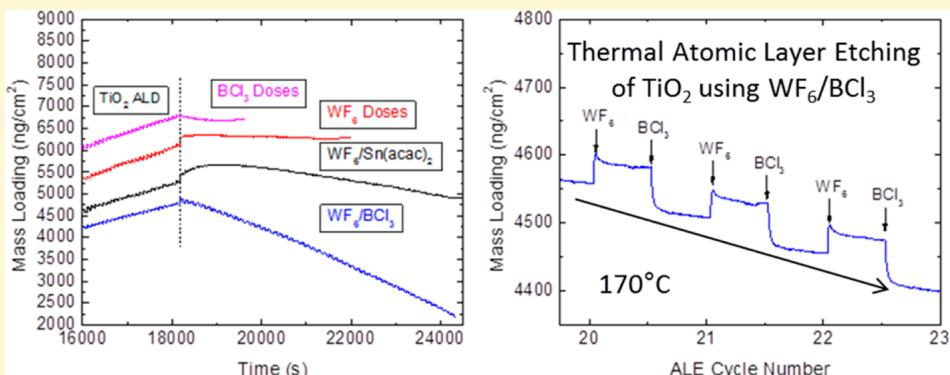

ABSTRACT: Controlled thin film etching is essential for further development of sub-  $10 \mathrm{nm}$  semiconductor devices. Vapor- phase thermal etching of oxides is appealing for achieving highly conformal etching of high aspect ratio features. We show that tungsten hexafluoride  $\left(\mathrm{WF}_6\right)$  can be used to selectively etch amorphous  $\mathrm{TiO}_2$  films versus other oxides including  $\mathrm{Al}_2\mathrm{O}_3$ . Chemical vapor etching (CVE) of  $\mathrm{TiO}_2$  by  $\mathrm{WF}_6$  was studied with quartz crystal microbalance (QCM), spectroscopic ellipsometry, X- ray photoelectron spectroscopy (XPS), and thermodynamic modeling. The XPS results show evidence for a  $\mathrm{WO}_x\mathrm{F}_y$  layer forms on of the  $\mathrm{TiO}_2$  films during the etch process, which may act as a surfactant layer to help enable fluorination of  $\mathrm{TiO}_2$ . Direct CVE of  $\mathrm{TiO}_2$  by  $\mathrm{WF}_6$  is strongly temperature dependent, where etching proceeds readily at  $220^{\circ}\mathrm{C}$ , but not at  $T \leq 170^{\circ}\mathrm{C}$ . This is consistent with thermodynamic modeling showing that the etching rate is determined by the volatilization of metal fluoride and  $\mathrm{WF}_2\mathrm{O}_2$  product species. We also show that, at low temperature,  $\mathrm{BCl}_3$  can be used as a coreagent with  $\mathrm{WF}_6$  to achieve self- limiting atomic layer etching (ALE) of  $\mathrm{TiO}_2$ . At  $170^{\circ}\mathrm{C}$ , the rate of ALE saturates at  $\sim 0.6 \mathrm{A / cycle}$ , which is  $\sim 2 \times$  the rate of  $\mathrm{TiO}_2$ . ALD at the same temperature. Experimental QCM analysis shows selectivity for  $\mathrm{TiO}_2$  ALE vs  $\mathrm{Al}_2\mathrm{O}_3$  as predicted by thermodynamic modeling. We also demonstrate and describe how etching reactions during initial cycles can differ from those during steady- state ALE, and we draw a physical analogy between rate evolution in ALE and well- known rate evolution during nucleation in atomic layer deposition (ALD). This work expands understanding of surface reactions in CVE and ALE and the range of reactants and materials that can be active for advanced thermal ALE processing.

# 1. INTRODUCTION

The semiconductor industry foresees multiple challenges in designing and manufacturing transistor devices for the 7 and 5 nm nodes. For example, standard patterning techniques, such as lithography, become much less applicable because of challenges maintaining edge definition and alignment to the underlying features. In addition, semiconductor devices typically utilize three- dimensional designs, creating complex high- aspect- ratio features. Accordingly, the semiconductor industry is looking toward controllable etching techniques to supplement currently used thin film deposition techniques.

Chemical vapor etching (CVE) of silicon (Si) native oxide is of interest to the semiconductor industry. Hydrogen fluoride (HF) liquid etching of Si native oxide1- 3 is ubiquitously utilized in the semiconductor industry, but in situ vapor etching helps limit the reformation of an interfacial oxide layer between Si and a deposited film.4- 9 For both solution and vapor phase etching,  $\mathrm{H}_2\mathrm{O}$  plays a significant role in HF etching of Si native oxide, with significantly lower etch rates in anhydrous conditions.10- 13 In vapor phase etching, water creates a interfacial layer between the substrate and gas and acts as a proton donor and acceptor to catalytically activate the HF etch.2,11,12 Although HF is a promising etchant, high HF concentrations can lead to uncontrolled etching.

Extending the anhydrous HF vapor etch to other oxides is often limited, because unlike  $\mathrm{SiF}_4$ , many of the formed metal fluorides are nonvolatile at typical process temperatures and pressures.14 Yet the nonvolatile product formation also creates an opportunity to create a more controlled etching process because the surface fluoride species passivate the substrate from additional fluorination. Surface fluorides or chlorides can then be removed anisotropically by a subsequent energy- enhanced

technique such as plasma exposure or  $\mathrm{Ar^{+}}$  bombardment or plasma species. Ideally, the two individual steps are self- limiting, creating a process known as atomic layer etching (ALE). But even with large control over the bias and the energy of the species, it is possible to get uncontrolled etching or damage to sensitive features.15- 18

In order to limit the issues that arise from energy- enhanced techniques, there is interest in purely thermally driven chemical ALE processes. Such techniques would enable conformal isotropic etching, which has many applications for etching in high aspect ratio structures.19 There has been considerable work by George et al. studying selective etching of oxides using HF in combination with different metal coregents.20- 25 Specifically, HF was used to fluorinate metal oxides including  $\mathrm{Al}_2\mathrm{O}_3,$ $\mathrm{HfO}_2,$  and  $\mathrm{ZrO}_2$  creating a passivating metal fluoride layer.20- 23 Exposing the metal fluoride layer to a coreagent such as trimethylaluminum  $(\mathrm{TMA})_{20,23}$  tin acetylacetone (Sn $(\mathrm{acac})_2$ )20- 22,24 diethylaluminum chloride (DMAC),20 or silicon tetrachloride  $(\mathrm{SiCl}_4)^{20}$  can lead to a ligand- exchange reaction. Depending on the metal fluoride and the extent of the ligand- exchange, the modified surface layer will be volatilized, reforming the original substrate surface termination. For example, an  $\mathrm{AlF}_3$  surface layer is proposed to react with  $\mathrm{Sn(acac)}_2$  to form volatile  $\mathrm{Al(acac)}_3$  and  $\mathrm{SnF(acac)}_{2}$  21,22 This etching approach bears similarities to earlier work in which zinc oxide and copper were etched with hexafluoroacetonate  $(\mathrm{hHfac})^{25}$  and hHfac and  $\mathrm{O}_2 / \mathrm{H}_2\mathrm{O}_2^{26,27}$  processes, respectively. Selective oxide etching has been achieved by adjusting the process temperature and selecting specific metal precursors that serve as ligand sources. For example, a HF/TMA ALE process was observed to etch  $\mathrm{Al}_2\mathrm{O}_3$  but not  $\mathrm{ZrO}_2$  at  $300^{\circ}\mathrm{C}$  20 In place of HF, other chemicals could be considered for the surface modification step, such as  $\mathrm{BCl}_3,$  28  $\mathrm{Cl}_2^{24,25}$  and  $\mathrm{WF}_6$

$\mathrm{WF}_6$  is an appealing fluorinating agent and etchant. As a higher oxidation state covalently bound metal fluoride,  $\mathrm{WF}_6$  is highly volatile at room temperature.30 Tungsten is also among the most electronegative of the transition metals,31 enabling selective fluoride transfer to other transition metals.30 For example,  $\mathrm{WF}_6$  was observed to undergo halogen exchange with  $\mathrm{TiCl}_4$  and  $\mathrm{BCl}_3$  but was considerably less reactive than  $\mathrm{MoF}_6$  30 Yet despite being less reactive, fluorination of  $\mathrm{TiO}_2$  with  $\mathrm{WF}_6$  proceeds with a Gibbs free energy of  $- 14.9\mathrm{kcal / mol}$  whereas HF fluorination is endothermic with  $\Delta G = 6.9\mathrm{kcal / mol}$  The thermodynamic fluorination step by HF may in part explain why other reported thermally driven ALE processes that utilize HF are unable to etch  $\mathrm{TiN}^{\circ}$  20 In addition,  $\mathrm{WF}_6$  has been observed to etch  $\mathrm{SiO}_2^{32}$  and  $\mathrm{WO}_3$  films33 and in an analogous system  $\mathrm{NbCl}_5$  was observed to etch  $\mathrm{Nb}_2\mathrm{O}_5$  34  $\mathrm{WF}_6$  also has a zero net dipole moment, making it relatively easy to evacuate from a reaction chamber, an attractive feature for a cyclic ALE process. In contrast, HF is "stickier" because of its high dipole moment, which can lead to hydrogen bonding and long residence times.19

In this paper, we demonstrate that  $\mathrm{WF}_6$  can be used as an etchant for controlled removal of  $\mathrm{TiO}_2$  films in both chemical vapor etching and atomic layer etching sequences. We find that  $\mathrm{WF}_6$  selectively etches  $\mathrm{TiO}_2$  over  $\mathrm{Al}_2\mathrm{O}_3,$  which we ascribe to the ability of  $\mathrm{TiO}_2$  to more readily form volatile products at low process temperatures. Using ex situ XPS analysis, we confirm  $\mathrm{WF}_6$  etching of  $\mathrm{TiO}_2$  films and provide evidence that etching proceeds through  $\mathrm{TiO}_2$  fluorination in the film bulk and formation of a low density  $\mathrm{WO}_x\mathrm{F}_y$  surface layer on the etching film. Thinner  $\mathrm{TiO}_2$  films require less time to become fully fluorinated, resulting in overall more rapid chemical vapor etching than thicker  $\mathrm{TiO}_2$  films.

We also find that by using a surface coupling agent the chemical etching via  $\mathrm{WF}_6$  can be controlled to achieve a self- limiting ALE process. Specifically we find that coupling exposures of  $\mathrm{WF}_6$  with  $\mathrm{Sn(acac)}_2$  or  $\mathrm{BCl}_3$  in a stepwise sequence acts to volatilize the  $\mathrm{WO}_x\mathrm{F}_y$  surface layer formed during  $\mathrm{WF}_6$  etching, enabling etching of a fraction of a monolayer of  $\mathrm{TiO}_2$  (i.e.,  $\sim 0.6\mathrm{\AA}$ ) per ALE cycle at  $170^{\circ}\mathrm{C}$

# 2. EXPERIMENTAL SECTION

a. List of Supplies and Materials. The  $99.99\%$  tungsten hexafluoride  $(\mathrm{WF}_6)$  and  $99.9\%$  boron trichloride  $(\mathrm{BCl}_3)$  were purchased in stainless steel lecture bottles from Galaxy Chemical and Matheson, respectively. Trimethylaluminum (TMA) and titanium tetrachloride  $(\mathrm{TiCl}_4)$  were obtained from Strem Chemicals Inc. and used without further treatment.  $99.9\%$  tin acetylacetonate  $(\mathrm{Sn(acac)}_2)$  was purchased from Sigma-Aldrich. The Si substrates were boron doped  $\mathrm{Si}(100)$ $6 - 10\Omega \cdot \mathrm{cm}$  (WRS Materials) and were used as received. For the carrier and purge gas, dry  $99.999\%$  argon  $(\mathrm{Ar})$  was passed through an Entegris GateKeeper inert gas purifier to remove any residual water before entering the reactor.

b. Reactor Design and Reaction Sequence. Depositions were carried out in two home-built tubular hot-wall isothermal ALE reactors described in previous publications.35,36 The chambers were heated resistively using PID controllers. The reaction chamber for the chemical vapor etching (CVE) experiments was  $\sim 60\mathrm{cm}$  long with a diameter of  $\sim 10\mathrm{cm}$  The reactor for atomic layer etching (ALE) was a similar design with the same reactor length but with a smaller diameter of  $\sim 4\mathrm{cm}$  Silicon substrates were loaded into the reactors and allowed to reach thermal equilibrium with the walls by flowing carrier gas for  $30\mathrm{min}$  prior to deposition or etching.

In the larger CVE chamber, the baseline operating pressure was maintained at 1.5 Torr with an Ar carrier flow rate of 210 standard cubic centimeters per minute (sccm). The  $\mathrm{WF}_6$  flow was restricted with a needle valve to generate a pressure increase of  $300\mathrm{mTorr}$  over the baseline 1.5 Torr. The pulse sequence was  $\mathrm{WF}_6 / \mathrm{Ar} = 1 / 60\mathrm{s}$ , respectively. In some instances,  $\mathrm{Sn(acac)}_2$  was used in a  $\mathrm{WF}_6 / \mathrm{Ar} / \mathrm{Sn(acac)}_2 / \mathrm{Ar}$ $(1 / 60 / 1 / 60\mathrm{s})$  sequence to increase the  $\mathrm{WF}_6$  CVE etch rate.  $\mathrm{Sn(acac)}_2$  was heated to  $105^{\circ}\mathrm{C}$  to produce a pressure changed of  $\sim 75\mathrm{mTorr}$  during dosing. Immediately prior to etching experiments,  $\mathrm{Al}_2\mathrm{O}_3$  and  $\mathrm{TiO}_2$  ALD films were deposited in the same reaction chamber using an  $\mathrm{x / Ar / H}_2\mathrm{O / Ar}$  sequence where  $\mathrm{x}$  is TMA and  $\mathrm{TiCl}_4$  respectively, with a timing sequence of  $0.25 / 45 / 0.25 / 45\mathrm{s}$ . In some cases, fresh ALD films were loaded into the reactor before etching. The data presented here were generally collected after preparing the surface with ALD metal oxide.

In the smaller ALE reactor, a  $\mathrm{N}_2$  carrier flow rate of  $150\mathrm{sccm}$  produced a baseline pressure of  $800\mathrm{mTorr}$ . For the ALE runs, the typical reaction sequence followed  $\mathrm{WF}_6 / \mathrm{N}_2 / \mathrm{BCl}_3 / \mathrm{N}_2 = 0.2 / 45 / 1 / 45$  s. During  $\mathrm{WF}_6$  and  $\mathrm{BCl}_3$  dosing, the pressure increase was approximately  $600$  and  $800\mathrm{mTorr}$ , respectively. Under typical etch conditions, the short  $\mathrm{WF}_6$  dose time in the ALE reactor produced a smaller net  $\mathrm{WF}_6$  exposure per cycle compared to that during typical CVE. Prior to ALE,  $\mathrm{Al}_2\mathrm{O}_3$  and  $\mathrm{TiO}_2$  ALD films were deposited using  $\mathrm{x / Ar / H}_2\mathrm{O / Ar}$  of  $0.1 / 45 / 0.1 / 45\mathrm{s}$ , where  $\mathrm{x}$  is either TMA or  $\mathrm{TiCl}_4$ , respectively. The growth rate for the  $\mathrm{TiO}_2$  ALD film was  $\sim 0.3\mathrm{\AA}$  cycle at  $170^{\circ}\mathrm{C}$ . The  $\mathrm{WF}_6 / \mathrm{BCl}_3$  etching experiments were generally performed after preparing the reactor surface with ALD metal oxide.

c. Sample Characterization. Film deposition and etching were characterized using ex situ and in situ analytical tools. Spectroscopic ellipsometry (SE) data were obtained with a J.A. Woollam alpha-SE ellipsometer at an incidence angle of  $70^{\circ}$ . Chemical analysis was done using a SPECS X-ray photoelectron spectroscopy (XPS) system with a PHOIBOS 150 analyzer. Spectra were generated using an Al Ka X-ray source operated at  $400\mathrm{W}$ . For all analyses, data reduction and fitting was carried out using CasaXPS software with charge compensation based on the C 1s (C-C, C-H) peak set to  $285\mathrm{eV}$ . For some

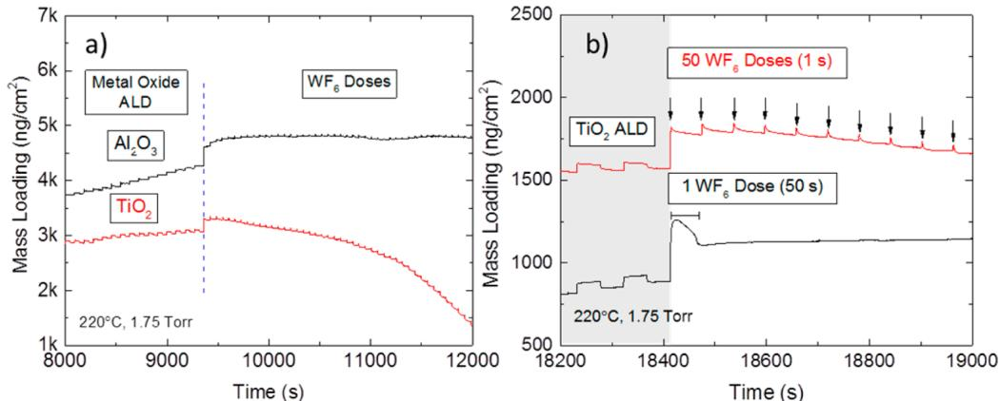  
Figure 1. QCM analysis at  $220^{\circ}\mathrm{C}$  of (a) 200 cycles of  $\mathrm{Al}_2\mathrm{O}_3$  or  $\mathrm{TiO}_2$  followed immediately by  $50\mathrm{WF}_6 / \mathrm{Ar}$  exposures of  $1 / 60\mathrm{s}$  each and (b) initial loading of  $1\mathrm{WF}_6$  exposure of  $50\mathrm{s}$  versus  $50\mathrm{WF}_6 / \mathrm{Ar}$  exposures of  $1 / 60\mathrm{s}$  on  $\mathrm{TiO}_2$  (200 cycles).

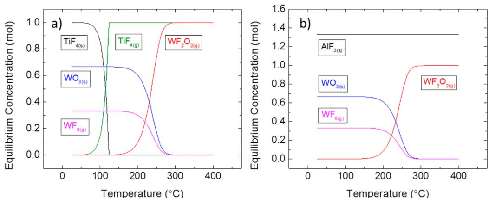  
Figure 2. Thermodynamic modeling results showing the expected equilibrium species concentrations from 25 to  $400^{\circ}\mathrm{C}$  for  $\mathrm{N}_2$ -diluted  $\mathrm{WF}_6$  exposed to  $\mathrm{TiO}_2$  or  $\mathrm{Al}_2\mathrm{O}_3$  at  $P = 1.5$  Torr: (a)  $1\mathrm{mol}$ $\mathrm{WF}_6 + 1\mathrm{mol}$ $\mathrm{TiO}_2$  and (b)  $1\mathrm{mol}$ $\mathrm{WF}_6 + 0.667\mathrm{mol}$ $\mathrm{Al}_2\mathrm{O}_3$ .

analyses, we utilized the  $\mathrm{T}52\mathrm{p}_{3 / 2}$  XPS peak intensity to estimate the thickness of  $\mathrm{WO}_x\mathrm{F}_y$  films formed as a result of  $\mathrm{WF}_6$  adsorption. For this analysis, we measured the attenuation of the Ti  $2\mathrm{p}_{3 / 2}$  peak and modeled the film thickness using parameters available from the NIST Effective Attenuation Length Database, coupled with electron inelastic mean- free path values determined using the TPP- 2 M equation. For this equation, we used a bandgap of  $3.45\mathrm{eV}^{39}$  and density of  $3.58\mathrm{g / cm}^3$  consistent with reported values for amorphous low density  $\mathrm{WO}_3$  films.

Process conditions were further characterized using in situ QCM analysis. For these tests, a  $6\mathrm{MHz}$  gold coated QCM crystal sensor (Inficon) was placed into the QCM housing. The crystal backside was purged with  $45\mathrm{~sccm}$  of  $\mathrm{Ar}$  to prevent deposition on the back of the QCM crystal. Inclusion of a crystal back purge increased the operating pressure from  $1.5$  to  $1.75\mathrm{Torr}$ . In the smaller ALE chamber, the QCM crystal backside was purged with  $35\mathrm{~sccm}$  of  $\mathrm{N}_2$ , increasing the baseline pressure from  $0.8$  to  $1\mathrm{Torr}$ . The mass change signals were detected by an Inficon SQM- 160 monitor and recorded using a home designed LabVIEW program. The mass change reported from the QCM data provides reliable measurements of relative mass change under different process conditions. The measured frequency shifts are not specifically calibrated for quantitative analysis of individual mass change values.

d. Thermodynamic Modeling. Gibbs free energy values and equilibrium amounts in closed systems were calculated using HSC Chemistry 7.1 software. For the equilibrium composition calculations for the  $\mathrm{WF}_6$  reaction, the starting input amounts were  $5\mathrm{~mol}$  of  $\mathrm{N}_2$ ,  $1\mathrm{~mol}$  of  $\mathrm{WF}_6$ , and  $1\mathrm{~mol}$  of oxide ( $\mathrm{TiO}_2$ ,  $\mathrm{HfO}_2$ ,  $\mathrm{ZrO}_2$ ,  $\mathrm{SiO}_2$ , and  $\mathrm{ZnO}$ ). The initial moles of  $\mathrm{Al}_2\mathrm{O}_3$  were set as  $0.667$  to compensate for reaction stoichiometry. For modeling the  $\mathrm{BCl}_3$  reaction with the  $\mathrm{WF}_6$  modified surface, the starting concentrations were  $5\mathrm{~mol}$  of  $\mathrm{N}_2$ ,  $1\mathrm{~mol}$  of metal fluoride ( $\mathrm{TiF}_4$ ,  $\mathrm{AlF}_3$ ,  $\mathrm{ZrF}_4$ , etc.),  $1\mathrm{~mol}$  of  $\mathrm{WO}_3$ , and  $3\mathrm{~mol}$  of

$\mathrm{BCl}_3$ . For each data set,  $50$  calculations were done from  $25$  to  $400^{\circ}\mathrm{C}$  at  $1.5$  Torr (0.002 bar).

# 3. RESULTS AND DISCUSSION

Selective Chemical Vapor Etching of  $\mathrm{TiO}_2$  Using  $\mathrm{WF}_6$ . The  $\mathrm{WF}_6$  interaction with ALD metal oxide films at  $220^{\circ}\mathrm{C}$  was assessed with in situ QCM analysis, where the layer to be etched (either  $\mathrm{Al}_2\mathrm{O}_3$  or  $\mathrm{TiO}_2$ ) is deposited in the reactor on the QCM crystal via ALD immediately before etching experiments. Deposition and etching were performed in the same reactor at the same temperature, without air exposure between ALD and etching. Figure 1a shows that immediately following steady- state  $\mathrm{Al}_2\mathrm{O}_3$  or  $\mathrm{TiO}_2$  ALD at  $220^{\circ}\mathrm{C}$ , the first  $3 - 5\mathrm{WF}_6$  dose steps result in an increase in the mass loading of  $355$  and  $226\mathrm{ng / cm}^3$  for  $\mathrm{Al}_2\mathrm{O}_3$  and  $\mathrm{TiO}_2$ , respectively. Additional  $\mathrm{WF}_6$  exposures on the  $\mathrm{Al}_2\mathrm{O}_3$  surface lead to saturation, whereas additional  $\mathrm{WF}_6$  exposures on the  $\mathrm{TiO}_2$  surface lead to mass loss. After  $\sim 17\mathrm{WF}_6$  doses, the QCM begins to record a net overall mass loss, and further  $\mathrm{WF}_6$  dosing leads to additional mass loss, consistent with  $\mathrm{TiO}_2$  etching by the  $\mathrm{WF}_6$ . We note that the etch rate appears to increase as etching proceeds. For example, after  $10\mathrm{WF}_6$  doses, the etch rate is  $\sim 15\mathrm{ng / cm}^2$  per  $\mathrm{WF}_6$  dose but increases to  $\sim 87\mathrm{ng / cm}^2$  per  $\mathrm{WF}_6$  dose at  $25\mathrm{WF}_6$  doses. The increase in etch rate is attributed to the etch process transitioning through an incubation period before attaining steady state. This gives rise to an apparent thickness dependence in the etch rate, as discussed in detail in a further section below.

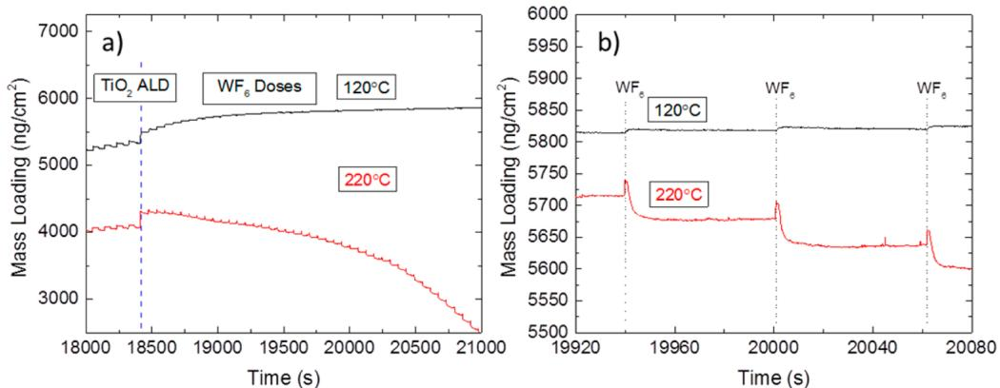  
Figure 3. (a) QCM analysis of  $\mathrm{TiO_2}$  ALD followed by  $50~\mathrm{WF}_6$  doses at 120 and  $220^{\circ}C$  and (b) an enlarged view of the mass loading during the  $\mathrm{WF}_6$  doses, showing net mass loss during each  $\mathrm{WF}_6$  step at  $220^{\circ}C$  and little to no change at  $120^{\circ}C$

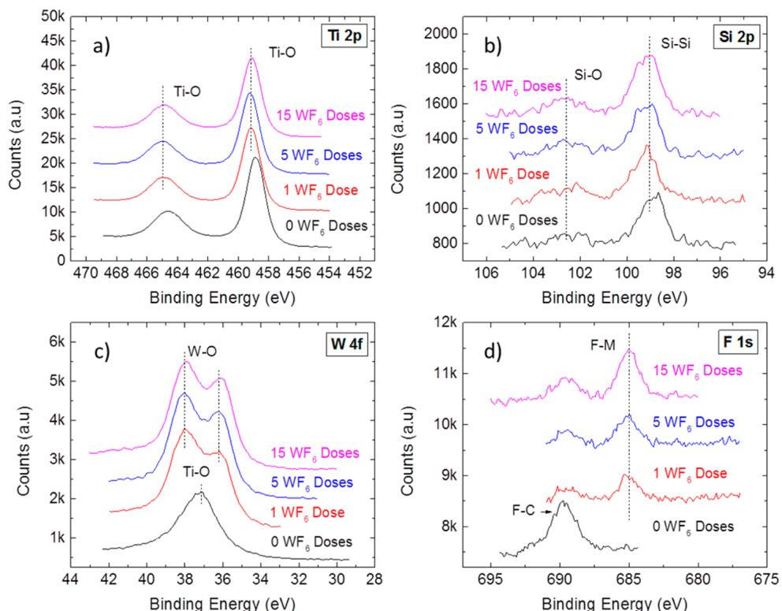  
Figure 4. High resolution XPS scans of (a) Ti  $2\mathrm{p}$ , (b) Si  $2\mathrm{p}$ , (c) W  $4\mathrm{f}$ , and (d) F  $1\mathrm{s}$  regions for  $\sim 6.5 \mathrm{nm} \mathrm{TiO}_2$  films exposed to  $0$ ,  $1$ ,  $5$ , and  $15 \mathrm{WF}_6$  doses at  $220^{\circ}C$

Results in Figure 1b compare QCM mass response for a series of  $\mathrm{WF}_6 / \mathrm{Ar} = 1 / 60$  s doses (as used in Figure 1a) with that for a single longer  $(50 \mathrm{s}) \mathrm{WF}_6$  dose step. In these experiments, the Ar carrier flow rate was maintained at 210 sccm with a QCM back purge of 45 sccm for a baseline pressure of  $1.75 \mathrm{Torr}$ . The  $50 \mathrm{s} \mathrm{WF}_6$  dose increased the pressure by  $250 \mathrm{mTorr}$ . This pressure change and dose time corresponds approximately to a net exposure that is equivalent to  $50 \mathrm{WF}_6 / \mathrm{Ar}$  pulses of  $1 / 60 \mathrm{s}$  each. The  $50 \mathrm{s} \mathrm{WF}_6$  pulse initially leads to a  $360 \mathrm{ng / cm}^2$  mass increase, somewhat larger than for the individual dose steps  $(226 \mathrm{ng / cm}^2)$ . As the  $\mathrm{WF}_6$  dose continued, the measured mass decreased, but after  $50 \mathrm{s}$ , QCM analysis shows a net mass increase of  $205 \mathrm{ng / cm}^2$  relative to the mass measured immediately following  $\mathrm{TiO}_2$  ALD. On the basis of data and modeling presented below, the initial mass increase during the  $\mathrm{WF}_6$  dosing period is ascribed to fluorine and tungsten uptake on the  $\mathrm{TiO}_2$  surface, and the mass decrease during further exposure corresponds to etching via desorption of  $\mathrm{TiF}_4$  and  $\mathrm{WF}_2\mathrm{O}_2$  vapor products. In this case, the  $50 \mathrm{WF}_6 / \mathrm{Ar}$  pulses of  $1 / 60 \mathrm{s}$  leads to more etching than a single  $50 \mathrm{s} \mathrm{WF}_6$  pulse because the purge provided time to promote etch product volatilization.

Thermodynamic Modeling of Metal Oxide Chemical Vapor Etching by  $\mathrm{WF}_6$ . Thermodynamic calculations based on minimizing free energy were performed to determine probable product species and to shed light on expected differences for etching of  $\mathrm{Al}_2\mathrm{O}_3$  and  $\mathrm{TiO}_2$  by  $\mathrm{WF}_6$ . The (unbalanced) overall reaction follows:

$$
\mathrm{TiO}_2(\mathrm{s}) + \mathrm{WF}_6(\mathrm{g})\rightarrow \mathrm{WO}_3(\mathrm{s}) + \mathrm{WF}_2\mathrm{O}_2(\mathrm{g}) + \mathrm{TiF}_4(\mathrm{g})
$$

Figure 2a shows the calculated equilibrium composition for a closed system initially consisting of  $1:1$  molar ratio of  $\mathrm{TiO}_2$  to  $\mathrm{WF}_6$  as temperatures changes from  $25$  to  $400^{\circ}C$ . At room temperature  $\mathrm{WF}_6$  reacts with  $\mathrm{TiO}_2$  to form solid  $\mathrm{WO}_3$  and solid

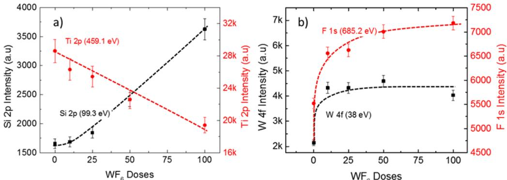  
Figure 5. Peak intensity of high resolution XPS scans of (a) Ti 2p  $(459.1~\mathrm{eV})$  and Si 2p  $(99.3\mathrm{eV})$  and (b) W 4f and  $(38\mathrm{eV})$  and F 1s  $(685.2\mathrm{eV})$  for  $5.5\mathrm{nm}$ $\mathrm{TiO_2}$  films exposed to 0, 10, 25, 50, and  $100\mathrm{WF}_6$  doses at  $220^{\circ}\mathrm{C}$ . Lines are a guide for the eye. The decrease in the Ti 2p signal confirms film etching.

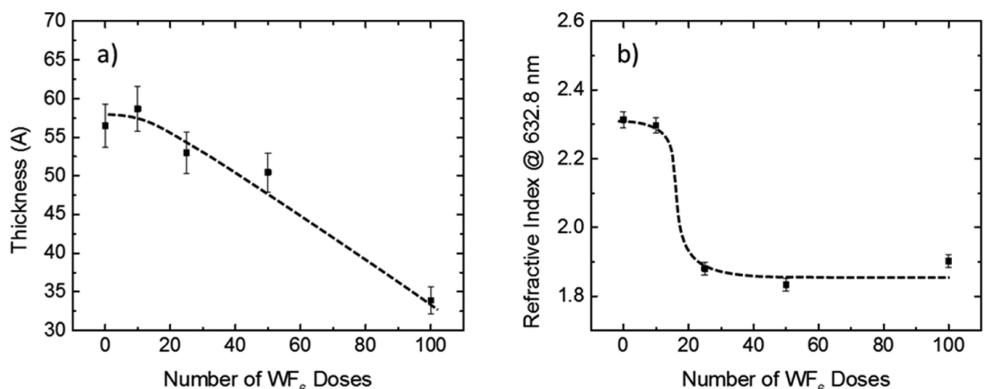  
Figure 6. (a) Thickness and (b) refractive index at  $632.8~\mathrm{nm}$  of samples with  $5.5\mathrm{nm}$ $\mathrm{TiO_2}$  followed by 0, 15, 25, 50, and  $100\mathrm{WF}_6$  doses at  $220^{\circ}\mathrm{C}$ , measured with spectroscopic ellipsometry. Lines are a guide to the eye.

$\mathrm{TiF_4}$  and at  $\sim 125^{\circ}\mathrm{C}$  the solid  $\mathrm{TiF_4}$  completely volatilizes. At  $\sim 150^{\circ}\mathrm{C}$ ,  $\mathrm{WF}_6$  begins to etch the solid  $\mathrm{WO}_3$  to form volatile  $\mathrm{WF}_2\mathrm{O}_2$ . Similar modeling also indicates that  $\mathrm{WF}_6$  will etch  $\mathrm{SiO}_2$  though  $\mathrm{SiO}_2$  differs from  $\mathrm{TiO}_2$  because, unlike  $\mathrm{TiF_4}$ ,  $\mathrm{SiF_4}$  is volatile even at room temperature. It should be noted that, in the calculations, when either the initial  $\mathrm{WF}_6$ :oxide ratio or the Ar partial pressure is increased, the temperature required to generate the volatile products decreases, indicating more favorable etching. This analysis is strictly accurate only for closed systems, where products are not purged.

Similar modeling results for  $\mathrm{Al}_2\mathrm{O}_3$  shown in Figure 2b suggest that  $\mathrm{WF}_6$  reacts at room temperature with  $\mathrm{Al}_2\mathrm{O}_3$  to form solid  $\mathrm{WO}_3$  and solid  $\mathrm{AlF}_3$ . At higher temperatures, like the case of  $\mathrm{TiO}_2$ , the solid  $\mathrm{WO}_3$  reacts further with  $\mathrm{WF}_6$  to form volatile  $\mathrm{WF}_2\mathrm{O}_2$ . However, the  $\mathrm{AlF}_3$  remains nonvolatile up to  $400^{\circ}\mathrm{C}$ . This solid  $\mathrm{AlF}_3$  layer likely passivates the surface, preventing etching.

Process Temperature and  $\mathrm{WF}_6$  Chemical Vapor Etching Behavior. The etching behavior of  $\mathrm{TiO}_2$  by  $\mathrm{WF}_6$  was assessed experimentally at different temperatures to collaborate the thermodynamic analysis. Data from QCM analysis in Figure 3a shows that when the temperature was reduced from 220 to  $120^{\circ}\mathrm{C}$ , the initial  $1 - 5\mathrm{WF}_6$  doses result in a mass gain on the  $\mathrm{TiO}_2$  surface. Additional  $\mathrm{WF}_6$  doses are accompanied by relatively small mass increases, which plateau with time. The enlarged view in Figure 3b further shows the response to the  $\mathrm{WF}_6$  doses at 220 and  $120^{\circ}\mathrm{C}$ , in which there are clear mass losses following the  $\mathrm{WF}_6$  doses at  $220^{\circ}\mathrm{C}$ .

Analysis of  $\mathrm{WF}_6$  Chemical Vapor Etching of  $\mathrm{TiO}_2$  by XPS and Ellipsometry. The composition of the  $\mathrm{TiO}_2$  surfaces following the initial few  $\mathrm{WF}_6$  cycles, i.e., prior to significant  $\mathrm{TiO}_2$  mass loss, was analyzed with ex situ XPS analysis. Figure 4 shows high resolution XPS scans of  $\mathrm{TiO}_2$  surfaces after 0, 1, 5, and  $15\mathrm{WF}_6$  doses. For this analysis, the initial  $\mathrm{TiO}_2$  film was sufficiently thin (i.e.,  $\sim 6.5 \mathrm{nm}$ ) to allow detection of the underlying Si substrate. In addition, the starting  $\mathrm{TiO}_2$  shows evidence for fluorine at  $\sim 690 \mathrm{eV}$ , consistent with fluoride from the reactor, likely remaining from previous  $\mathrm{WF}_6$  etch experiments. Figure 4a shows the Ti 2p signal decreases slightly following 1, 5, and  $15\mathrm{WF}_6$  doses, but the Si 2p signal intensity in Figure 4b stays relatively constant. The presence of surface tungsten and fluorides is confirmed by results in Figure 4c,d, showing W 4f and F 1s peaks on the  $\mathrm{TiO}_2$  surface after  $1\mathrm{WF}_6$  dose. The tungsten signal stays relatively constant between 1 and  $15\mathrm{WF}_6$  doses, whereas the F 1s peak at 685 eV (associated with metal fluorides) progressively increases. This is consistent with  $\mathrm{WF}_6$  fluorinating the  $\mathrm{TiO}_2$  surface and with fluorine diffusion into the  $\mathrm{TiO}_2$  subsurface.

The relative location of the XPS peaks provides additional information concerning the etching mechanisms. For example, after  $15\mathrm{WF}_6$  doses, the Ti 2p doublet shifts by  $\sim 0.4 \mathrm{eV}$  to higher binding energy (i.e., the Ti  $2\mathrm{p}_3 / 2$  peak shifts from 459.2 to  $458.8 \mathrm{eV}$ ). This increase in binding energy is consistent with highly electronegative surface species on the  $\mathrm{TiO}_2$  such as  $\mathrm{WO}_x\mathrm{F}_y$  or  $\mathrm{TiO}_y\mathrm{F}_y$ . Full titanium fluorination to  $\mathrm{TiF}_3$  or  $\mathrm{TiF}_4$  would produce a much larger shift in the Ti  $2\mathrm{p}_3 / 2$  peaks to 462

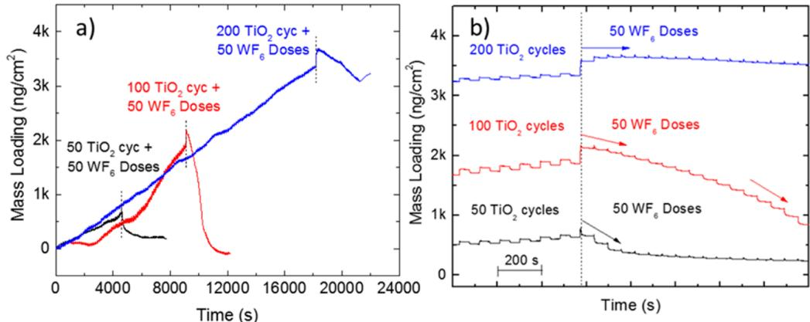  
Figure 7. (a) QCM analysis of  $\mathrm{WF}_6$  etching following 50, 100, and  $200\mathrm{TiO}_2$  ALD cycles on a bare Au QCM crystal at  $220^{\circ}C$  and 1.75 Torr. (b) Enlarged view of  $\mathrm{WF}_6$  etching showing an "incubation" period for the vapor etching that is dependent on the initial  $\mathrm{TiO}_2$  film thickness.

and  $464~\mathrm{eV}$ , respectively.43 In addition, the W 4f doublet peaks at 37.9 and  $36~\mathrm{eV}$  are shifted  $\sim 0.5\mathrm{eV}$  to higher binding energy compared to oxidized tungsten (37.6 and  $35.5\mathrm{eV}$ ),35,44 again consistent with surface fluorides.45

Figure 5a shows the Ti  $2\mathrm{p}$  and Si  $2\mathrm{p}$  peak intensity values collected from the high resolution XPS scans plotted versus number of  $\mathrm{WF}_6$  dose steps (i.e.,  $\mathrm{WF}_6$  exposure) after 0, 15, 25, 50, and  $100\mathrm{WF}_6$  doses. More  $\mathrm{WF}_6$  exposures lead to a linear decrease in the Ti signal and an increase in signal from the silicon substrate, as expected for etching of  $\mathrm{TiO}_2$ . Some initial decrease in the Ti  $2\mathrm{p}$  signal is ascribed to surface tungsten oxide. The W 4f signal associated with oxidized tungsten (Figure 5b) increases rapidly and stays constant, even up to 100  $\mathrm{WF}_6$  doses. Figure 5b also shows that the F 1s signal increases significantly within the first  $10\mathrm{WF}_6$  doses followed by saturating behavior with additional  $\mathrm{WF}_6$  exposure.

The film thickness for the samples in Figure 5 was further analyzed by spectroscopic ellipsometry, and results are shown in Figure 6. Figure 6a shows that, for the first few  $\mathrm{WF}_6$  cycles, the physical film thickness slightly increases, consistent with formation of a tungsten oxy- fluoride surface layer. As  $\mathrm{WF}_6$  dosing proceeds, the  $\mathrm{TiO}_2$  film thickness decreases, consistent with etching observed by QCM and XPS in Figures 1, 3, and 5. Furthermore, the refractive index at  $632.8~\mathrm{nm}$  for the  $\mathrm{TiO}_2$  films is  $\sim 2.3$  after 0 and  $10\mathrm{WF}_6$  doses but decreases to  $\sim 1.9$  with  $25 - 100\mathrm{WF}_6$  doses. The decrease in refractive index can be correlated with a decrease in film density. The observed decrease suggests that the  $\mathrm{WF}_6$  exposure promotes formation of a porous  $\mathrm{WO}_3$  film40,46 or the formation of a low density  $\mathrm{WO}_x\mathrm{F}_y$  surface layer.

Incubation of Chemical Vapor Etching and Effect of  $\mathrm{TiO}_2$  Film Thickness. The results in Figure 1a suggest that the etch rate increases as the etching proceeds. We hypothesized, therefore, that the  $\mathrm{WF}_6$  etch rate may depend on the thickness of the initial  $\mathrm{TiO}_2$  layer. We tested this by monitoring QCM crystals coated with 50, 100, and 200 cycles of ALD  $\mathrm{TiO}_2$  at  $220^{\circ}C$  (estimated to be 10, 25, 55 Å thick), each followed by  $50\mathrm{WF}_6 / \mathrm{Ar}$  dose steps. Results are given in Figure 7. In this data set, the trace for  $200\mathrm{TiO}_2$  ALD cycles  $+50\mathrm{WF}_6$  doses is reproduced from Figures 1 and 3. Note that these experiments required continuous data collection over  $3 - 5\mathrm{h}$ , and in Figure 7a, the long- period fluctuations in the QCM data result from small instabilities in the controlled reactor temperature.

Figure 7b reproduces the results from Figure 7a on an expanded time scale, shifted to align the first  $\mathrm{WF}_6$  dose step.

Note that the mass loading scale on the  $y$ - axis remains the same as in Figure 7a, allowing the relative rates of mass loss to be directly compared. Figure 7b clearly shows that, during the initial  $\mathrm{WF}_6$  doses, the rate of mass loss is slow for the thickest (200 cycle)  $\mathrm{TiO}_2$  film and relatively fast for the thin (50 cycle) ALD  $\mathrm{TiO}_2$ . For the 200 cycle  $\mathrm{TiO}_2$  layer, after an initial mass gain of  $\sim 250\mathrm{ng / cm^2}$ , the first 25 etch cycles produce no mass loss, after which etching readily proceeds (as shown in Figure 7a), indicating etch "incubation". For the 100 cycle  $\mathrm{TiO}_2$  film, the first  $\mathrm{WF}_6$  dose also produces mass gain, and etching proceeds with less incubation time, attaining steady- state etching after several  $\mathrm{WF}_6 / \mathrm{Ar}$  doses. For the thinnest (50 cycle)  $\mathrm{TiO}_2$  film, the mass gain is only  $28\mathrm{ng / cm^2}$  during the initial  $\mathrm{WF}_6$  dose, and relatively fast etching proceeds after the first dose, slowing after  $\sim 5\mathrm{WF}_6 / \mathrm{Ar}$  doses, consistent with complete  $\mathrm{TiO}_2$  removal.

The apparent higher etch rate for the thinnest starting  $\mathrm{TiO}_2$  layer is ascribed, therefore, to a shorter incubation period for the thinner films to reach steady- state etching. This etch incubation arises because a thin starting film requires fewer  $\mathrm{WF}_6$  doses to attain the surface fluorine concentration required to volatilize surface products. A thicker starting film can draw more fluorine into the film bulk, thereby needing more  $\mathrm{WF}_6$  doses before etching begins.

Schematic of the  $\mathrm{WF}_6$  Chemical Vapor Etch Reaction Process. Figure 8 shows the proposed  $\mathrm{WF}_6$  chemical vapor etching mechanism of  $\mathrm{TiO}_2$  films at  $220^{\circ}C$  based on QCM, XPS, and ellipsometry analysis. First, forming the initial  $\mathrm{WF}_6$  doses,  $\mathrm{WF}_6$  adsorbs and reacts with the  $\mathrm{TiO}_2$  surface, forming a low density  $\mathrm{WO}_x\mathrm{F}_y / \mathrm{TiO}_y\mathrm{F}_z$  layer. Analysis of the XPS results confirms mixing of metal oxides in this layer. If the top layer

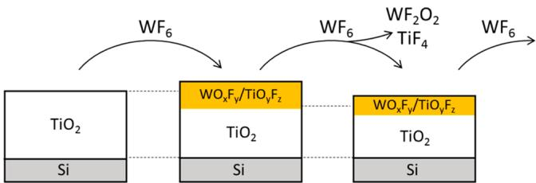  
Figure 8. Schematic of the chemical vapor etching mechanism for  $\mathrm{TiO}_2$  films exposed to  $\mathrm{WF}_6$  at  $220^{\circ}C$ : (1)  $\mathrm{WF}_6$  adsorbs on thick  $\mathrm{TiO}_2$  surface, forming surface-bound  $\mathrm{TiO}_y\mathrm{F}_z$  and  $\mathrm{WO}_x\mathrm{F}_y$ ; (2) Additional  $\mathrm{WF}_6$  exposure further fluorinates the  $\mathrm{TiO}_y\mathrm{F}_z$  and  $\mathrm{WO}_x\mathrm{F}_y$  creating volatile  $\mathrm{WF}_2\mathrm{O}_2$  and  $\mathrm{TiF}_4$ , etching the  $\mathrm{TiO}_2$  film.

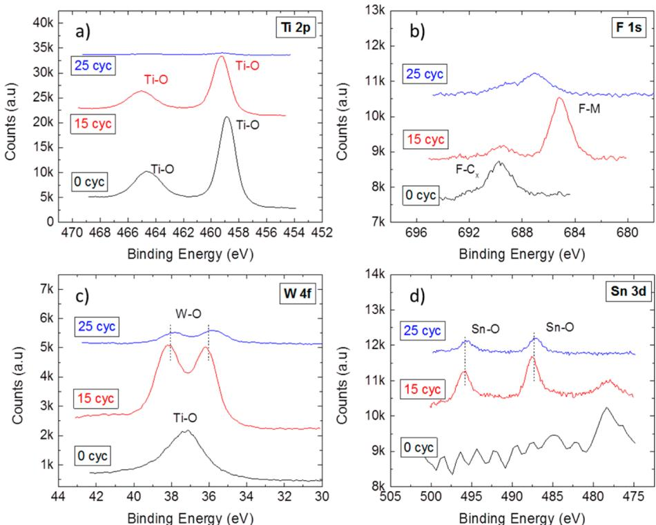  
Figure 9. High resolution XPS scans of (a) Ti 2p, (b) F 1s, (c) W 4f, and (d) Sn 3d regions for  $6.5 \mathrm{nm} \mathrm{TiO}_2$  films following 0, 15, and  $25 \mathrm{WF}_6 / \mathrm{Ar} / \mathrm{Sn}(\mathrm{acac})_2 / \mathrm{Ar}$  cycles at  $220^{\circ} \mathrm{C}$  and 1.75 Torr.

consisted of only  $\mathrm{WO}_x \mathrm{~F}_x$ , then (using a density of  $\sim 3.6 \mathrm{~g} / \mathrm{cm}^3$  reported for low density  $\mathrm{WO}_3$ ) a mass increase of  $\sim 250 \mathrm{~nm} / \mathrm{cm}^3$  during the first  $\mathrm{WF}_y$  dose (shown in Figure 1 at  $220^{\circ} \mathrm{C}$ ) would correspond to a  $\mathrm{WO}_x \mathrm{~F}_y$  layer that is  $\sim 4 - 6 \mathrm{~\AA}$  thick. However, after  $1 \mathrm{WF}_6$  exposure, the attenuation of the  $\mathrm{Ti} 2 \mathrm{p}_3 / 2$  XPS signal is about 2- 3 times less than expected for an  $\sim 6 \mathrm{~\AA}$ $\mathrm{WO}_x \mathrm{~F}_y$  layer, consistent with the presence of nonvolatile  $\mathrm{TiF}_{3}^{42,46}$  and  $\mathrm{TiOF}_2^{47}$  with  $\mathrm{WO}_3^{32,33,46,48}$

During the initial  $\mathrm{WF}_y$ , the observed net mass gain for thick starting  $\mathrm{TiO}_2$  indicates that the extent of surface fluorination within the mixed  $\mathrm{WO}_x \mathrm{~F}_y / \mathrm{TiO}_y \mathrm{~F}_z$  surface layer is not sufficient to produce a significant amount of volatile products. Subsequent  $\mathrm{WF}_6$  doses further fluorinate the surface- bound  $\mathrm{WO}_x \mathrm{~F}_y$  and  $\mathrm{TiO}_y \mathrm{~F}_z$  producing volatile etch products, including  $\mathrm{WO}_2 \mathrm{~F}_2$  and  $\mathrm{TiF}_4$ , as indicated by the equilibrium thermodynamics results in Figure 2. Some surface fluorine will diffuse and remain within the underlying oxide. A relatively thick starting  $\mathrm{TiO}_2$  layer provides a large "sink" for fluorine diffusion, whereas a thin  $\mathrm{TiO}_2$  layer allows rapid surface fluorination. This results in a thickness- dependent incubation time for the onset of etching, displayed in the QCM results in Figure 7. We also note that, during the purge step at steady state, volatilization of metal fluorides and metal oxy- fluorides reduces the fluoride concentration in the surface layer. Etching stops when the surface fluoride density is not sufficient to support further vaporization. This is supported by the QCM results in Figures 1, 3, and 7 where the mass loading reaches a steady plateau during the  $\mathrm{WF}_6$  purge step. This mechanism for etching is consistent with results from Kobayashi et al. showing that  $\mathrm{WF}_6$  reacts with  $\mathrm{SiO}_2$  to form volatile  $\mathrm{WOF}_4$  and  $\mathrm{SiF}_4$ . Furthermore, in similar systems,  $\mathrm{WF}_6$  has been shown to etch  $\mathrm{WO}_3 \mathrm{~films}^{33}$  and  $\mathrm{NbCl}_5$  was observed to etch  $\mathrm{Nb}_2 \mathrm{O}_5$  films by forming volatile  $\mathrm{NbOCl}_3$ .

Co- Reagents To Modify  $\mathrm{TiO}_2$  Chemical Vapor Etching. On the basis of the XPS analysis in Figures 4 and 5, the  $\mathrm{TiO}_2$  chemical vapor etching by  $\mathrm{WF}_6$  produces a thin layer of  $\mathrm{WO}_x \mathrm{~F}_y$  on the etched  $\mathrm{TiO}_2$  surface. To explore approaches to avoid or remove this layer, we performed several experiments. As one approach,  $\mathrm{Sn}(\mathrm{acac})_2$  was incorporated into the CVE sequence at  $220^{\circ} \mathrm{C}$ .  $\mathrm{Sn}(\mathrm{acac})_2$  has been observed to assist in metal fluoride volatilization in similar atomic layer etching processes. For this experiment, we deposited 200 cycles of  $\mathrm{TiO}_2$  at  $220^{\circ} \mathrm{C}$ , and then etched at the same temperature using a  $\mathrm{WF}_6 / \mathrm{Ar} / \mathrm{Sn}(\mathrm{acac})_2 / \mathrm{Ar}$  sequence of  $1 / 60 / 1 / 60$  s. Figure 9 shows high resolution XPS scans collected after  $6.5 \mathrm{~nm}$  of  $\mathrm{TiO}_2$  ALD (0 etch cycles) and after  $\mathrm{TiO}_2$  ALD followed by 15 and 25  $\mathrm{WF}_6 / \mathrm{Sn}(\mathrm{acac})_2$  etch cycles. We first note that at  $220^{\circ} \mathrm{C}$ , the  $\mathrm{WF}_6 / \mathrm{Sn}(\mathrm{acac})_2$  sequence leads to loss of the  $\mathrm{Ti} 2 \mathrm{p}$  signal, indicating film etching. Comparing the measured XPS intensities in Figure 9 to those in Figure 5 (with only  $\mathrm{WF}_6$  exposure steps), the addition of  $\mathrm{Sn}(\mathrm{acac})_2$  significantly increases the etch rate for an  $\sim 6.5 \mathrm{~nm} \mathrm{TiO}_2$  film, so that after  $25 \mathrm{WF}_6 / \mathrm{Sn}(\mathrm{acac})_2$  cycles the  $\mathrm{Ti} 2 \mathrm{p}$  signal is near the detection limit ( $\sim 0.5$  atom  $\%$  ). We also note the presence of surface tin after 15 and 25 cycles at  $220^{\circ} \mathrm{C}$ . After  $25 \mathrm{WF}_6 / \mathrm{Sn}(\mathrm{acac})_2$  cycles, the amount of surface fluorine and tungsten is less than observed in Figure 5 after  $25 \mathrm{WF}_6$  cycles. These results suggest that the addition of  $\mathrm{Sn}(\mathrm{acac})_2$  into the  $\mathrm{WF}_6 / \mathrm{Ar}$  sequential etch process increases the etch rate by creating additional volatile etch products such as  $\mathrm{TiO}(\mathrm{acac})_2$  or  $\mathrm{TiF}_2(\mathrm{acac})_2$ .

Low Temperature  $\mathrm{TiO}_2$  Atomic Layer Etching Using  $\mathrm{WF}_6 / \mathrm{BCl}_3$ . As shown above in Figures 5 and 6,  $\mathrm{TiO}_2$  CVE at  $220^{\circ} \mathrm{C}$  proceeds nearly continuously without evidence for self- limiting behavior. A self- limiting atomic layer etching (ALE) process, consisting of self- limiting adsorption and activation steps, is more desirable in that it will allow the extent of etching

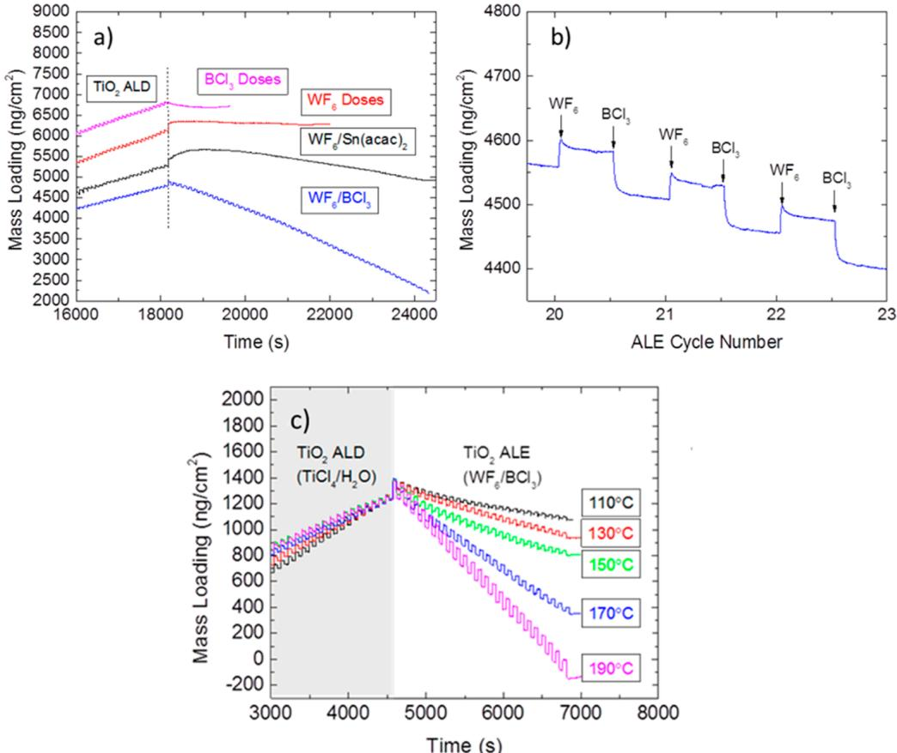  
Figure 10. (a) QCM analysis at  $170^{\circ}\mathrm{C}$  and 1.75 Torr of  $\mathrm{TiO_2}$  ALD followed by  $25\mathrm{BCl}_3 / \mathrm{Ar}$  doses (pink),  $50\mathrm{WF}_6 / \mathrm{Ar}$  doses (red),  $50\mathrm{WF}_6 / \mathrm{Ar} / \mathrm{Sn}(\mathrm{acac})_2 / \mathrm{Ar}$  cycles (black), or  $50\mathrm{WF}_6 / \mathrm{Ar} / \mathrm{BCl}_3 / \mathrm{Ar}$  cycles (blue). (b) Enlarged view of the  $\mathrm{WF}_6 / \mathrm{Ar} / \mathrm{BCl}_3 / \mathrm{Ar}$  etch sequence. (c) QCM of  $\mathrm{WF}_6 / \mathrm{Ar} / \mathrm{BCl}_3 / \mathrm{Ar}$  sequence at 110, 130, 150, 170, and  $190^{\circ}\mathrm{C}$ .

to be well controlled and defined. Therefore, we worked to modify the  $\mathrm{WF}_6 / \mathrm{Ar} / \mathrm{Sn}(\mathrm{acac})_2 / \mathrm{Ar}$  reaction sequence to identify possible ALE conditions. Using the results in Figures 2, 3, and 8, we (1) reduced the process temperature from 220 to  $170^{\circ}\mathrm{C}$  to prevent uncontrolled  $\mathrm{WF}_6$  etching and (2) explored  $\mathrm{BCl}_3$  as an alternative coreagent in place of  $\mathrm{Sn}(\mathrm{acac})_2$  to volatilize surface- adsorbed product species.

Figure 10a shows QCM results collected at  $170^{\circ}\mathrm{C}$ . For each run,  $\mathrm{TiO_2}$  ALD was performed for at least 100 cycles, followed immediately by exposure to (i)  $\mathrm{BCl}_3 / \mathrm{Ar}$  doses; (ii)  $\mathrm{WF}_6 / \mathrm{Ar}$  doses; (iii)  $\mathrm{WF}_6 / \mathrm{Ar} / \mathrm{Sn}(\mathrm{acac})_2 / \mathrm{Ar}$  cycles; or (iv)  $\mathrm{WF}_6 / \mathrm{Ar} / \mathrm{BCl}_3 / \mathrm{Ar}$  cycles. At  $170^{\circ}\mathrm{C}$ , without the additional coreagent,  $\mathrm{WF}_6$  shows initial mass gain consistent with surface adsorption, followed by a plateau indicting little to no  $\mathrm{TiO_2}$  etching. Dosing only  $\mathrm{BCl}_3$  appears to initially etch the  $\mathrm{TiO_2}$ , but like the  $\mathrm{WF}_6$ , additional  $\mathrm{BCl}_3$  does not lead to substantial etching. In contrast, the  $\mathrm{WF}_6 / \mathrm{Sn}(\mathrm{acac})_2$  sequence produces an initialization period in which the mass increases, followed by controlled layer- by- layer etching.

Figure 10a shows that the  $\mathrm{WF}_6 / \mathrm{BCl}_3$  sequence yields stepwise linear etching, but unlike the  $\mathrm{WF}_6 / \mathrm{Sn}(\mathrm{acac})_2$  sequence, it starts immediately from the first  $\mathrm{BCl}_3$  exposure step. An expanded view of the steady- state  $\mathrm{WF}_6 / \mathrm{BCl}_3$  etching process is shown in Figure 10b. The mass gain during the  $\mathrm{WF}_6$  dose at steady state is  $\sim 29\mathrm{ng} / \mathrm{cm}^2$ . A larger mass uptake is observed during the first  $\mathrm{WF}_6$  dose. After one complete  $\mathrm{WF}_6 / \mathrm{BCl}_3$  cycle, the mass change is  $\sim 53\mathrm{ng} / \mathrm{cm}^2 /$  cycle, indicating an etch rate that is larger than the  $26\mathrm{ng} / \mathrm{cm}^2$  per cycle mass gain measured during  $\mathrm{TiO_2}$  ALD at the same process temperature.

Figure 10c shows QCM results for process temperatures between 110 and  $190^{\circ}\mathrm{C}$  for  $\mathrm{WF}_6 / \mathrm{Ar} / \mathrm{BCl}_3 / \mathrm{Ar} = 0.2 / 45 / 1 / 45$  s. The etch rate is nearly independent of temperature between  $\sim 110^{\circ}$  and  $150^{\circ}\mathrm{C}$ , consistent with an "ALE temperature window" in this range. This range corresponds to limited volatility of  $\mathrm{TiF}_4$ , suggesting that product elimination is a likely rate- limiting step for the ALE reaction mechanism. Higher temperature generally promotes fluorine diffusion during the  $\mathrm{WF}_6$  dose, and increases the rate of etch product volatilization, leading to an overall faster etch rate.

Thermodynamic Modeling of  $\mathrm{WF}_6 / \mathrm{BCl}_3$  ALE of  $\mathrm{TiO_2}$  and  $\mathrm{Al}_2\mathrm{O}_3$ . Thermodynamic modeling of the  $\mathrm{WF}_6 / \mathrm{BCl}_3$  ALE reaction was also performed. The expected etch stoichiometry and Gibbs free energy change at  $170^{\circ}\mathrm{C}$  are given. The first  $\mathrm{WF}_6$  dose leads to surface adsorption and fluorination:

$$
\begin{array}{c}{2\mathrm{WF}_6(\mathrm{g}) + 3\mathrm{TiO}_2(\mathrm{s})\rightarrow 2\mathrm{WO}_3(\mathrm{s}) + 3\mathrm{TiF}_4(\mathrm{s})}\\ {\Delta G = -78\mathrm{kJ / molTiO}_2} \end{array} \tag{1}
$$

The stoichiometric solid products,  $\mathrm{WO}_3$  and  $\mathrm{TiF}_4$ , are used in the  $\Delta G$  analysis to represent the expected solid  $\mathrm{WO}_x\mathrm{F}_y / \mathrm{TiO}_y\mathrm{F}_z$  surface layer. At  $170^{\circ}\mathrm{C}$ ,  $\mathrm{TiF}_4$  vapor is also an expected product. The  $\mathrm{BCl}_3$  dose then allows ligand exchange that activates and volatizes the solid reaction products:

$$
\begin{array}{c}{4\mathrm{BCl}_3(\mathrm{g}) + 3\mathrm{TiF}_4(\mathrm{s})\rightarrow 3\mathrm{TiCl}_4(\mathrm{g}) + 4\mathrm{BF}_3(\mathrm{g})}\\ {\Delta G = -166\mathrm{kJ / molTiF}_4} \end{array} \tag{2}
$$

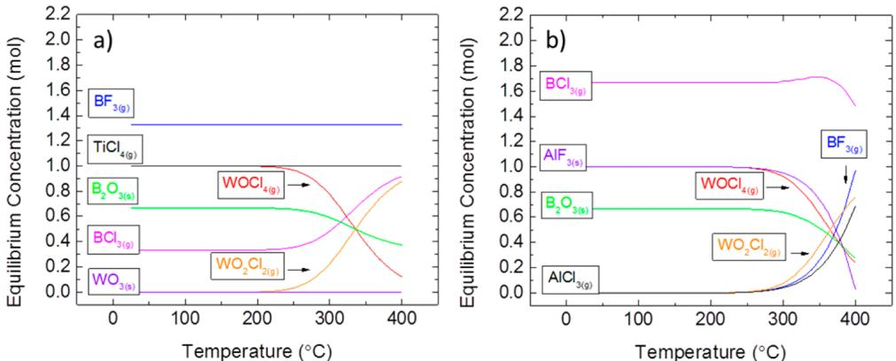  
Figure 11. Thermodynamic modeling results showing the expected equilibrium species concentrations from 25 to  $400^{\circ}C$  for (a) reactions 2 and 3, exposing  $\mathbb{N}_2$  -diluted  $\mathrm{BCl}_3$  at 1.5 Torr to  $\mathrm{TiF_4 / WO_3}$  ..  $3\mathrm{mol}$  of  $\mathrm{BCl}_3(\mathrm{g}) + 1$  mol of  $\mathrm{TiF_4(s) + 1}$  mol of  $\mathrm{WO}_3(\mathrm{s})$  ; and (b) the analogous reactions for the  $\mathrm{Al}_2\mathrm{O}_3$  system: 3 mol of  $\mathrm{BCl}_3(\mathrm{g}) + 1$  mol of  $\mathrm{AlF}_3(\mathrm{s}) + 1$  mol of  $\mathrm{WO}_3(\mathrm{s})$  . At equilibrium at  $170^{\circ}\mathrm{C},$ $\mathrm{BCl}_3 + \mathrm{TiF}_4 / \mathrm{WO}_3$  produces predominantly volatile  $\mathrm{BF}_3,$ $\mathrm{TiCl}_4,$  and  $\mathrm{WOCl_4}$  and solid  $\mathrm{B}_2\mathrm{O}_3$

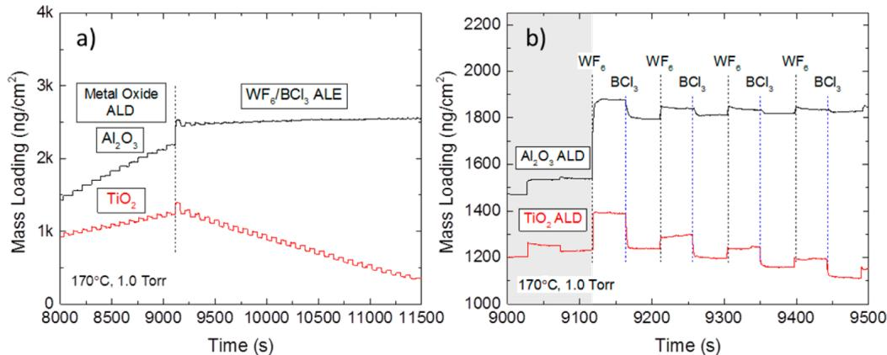  
Figure 12. (a) QCM analysis of  $\mathrm{Al}_2\mathrm{O}_3$  and  $\mathrm{TiO}_2$  ALD followed by  $50\mathrm{WF}_6 / \mathrm{BCl}_3$  ALE cycles at  $170^{\circ}\mathrm{C}$ . The ALE sequence follows  $\mathrm{WF}_6 / \mathrm{Ar} / \mathrm{BCl}_3 / \mathrm{Ar}$ $(0.2 / 45 / 2.5 / 60\mathrm{s})$ . (b) Enlarged view of (a).

$$
\begin{array}{rl} & 4\mathrm{BCl}_3(\mathrm{g}) + 3\mathrm{WO}_3(\mathrm{s})\rightarrow 2\mathrm{B}_2\mathrm{O}_3(\mathrm{s}) + 3\mathrm{WOCl}_4(\mathrm{g})\\ & \Delta G = -83\mathrm{kJ / mol}\mathrm{WO}_3 \end{array} \tag{3}
$$

Some surface fluorine also remains as a  $\mathrm{TiF}_y\mathrm{O}_z(\mathrm{s})$  product. Subsequent  $\mathrm{WF}_6$  doses repeat the  $\mathrm{TiO}_2$  surface adsorption and fluorination shown in (1) (repeated here as 4) and also activate and volatilize the surface boron oxide:

$$
\begin{array}{rl} & 2\mathrm{WF}_6(\mathrm{g}) + 3\mathrm{TiO}_2(\mathrm{s})\rightarrow 2\mathrm{WO}_3(\mathrm{s}) + 3\mathrm{TiF}_4(\mathrm{s})\\ & \Delta G = -78\mathrm{kJ / mol}\mathrm{TiO}_2\\ & \mathrm{WF}_6(\mathrm{g}) + \mathrm{B}_2\mathrm{O}_3(\mathrm{s})\rightarrow 2\mathrm{BF}_3(\mathrm{g}) + \mathrm{WO}_3(\mathrm{s})\\ & \Delta G = -203\mathrm{kJ / mol}\mathrm{B}_2\mathrm{O}_3 \end{array} \tag{5}
$$

The expected equilibrium thermodynamics for the  $\mathrm{WF}_6$  activation step (reaction 1 or reaction 4) was previously given in Figure 2. That figure also shows the case of  $\mathrm{WF}_6$  reaction with  $\mathrm{Al}_2\mathrm{O}_3$ . At  $170^{\circ}\mathrm{C}$  in Figure 2, the main surface species are solid  $\mathrm{WO}_3$  and metal fluorides, i.e.,  $\mathrm{AlF}_3$  on  $\mathrm{Al}_2\mathrm{O}_3$  and  $\mathrm{TiO}_y\mathrm{F}_z$  on  $\mathrm{TiO}_2$ . Figure 11 shows the thermodynamic results for the second half- reaction in the ALE sequence (e.g., reactions 2 and 3), when  $\mathrm{BCl}_3$  is exposed to solid  $\mathrm{WO}_3$  and metal fluoride  $\mathrm{(TiF_4}$  or  $\mathrm{AlF}_3$ . Figure 11a shows that, at low temperature,  $\mathrm{BCl}_3$  reacts with  $\mathrm{TiF}_4$  and  $\mathrm{WO}_3$  to form volatile  $\mathrm{TiCl}_4$ ,  $\mathrm{WOCl}_4$ , and  $\mathrm{BF}_3$ , along with solid  $\mathrm{B}_2\mathrm{O}_3$ , consistent with the reaction stoichiometry in eqs 2 and 3. Similar modeling of reaction 5 also shows consistent results. Although not included in the figure, the model suggests that at low temperatures a small amount of solid  $\mathrm{WO}_x\mathrm{Cl}_y$  species may also form via elimination of  $\mathrm{Cl}_2$ . Additionally, other modeling studies (not shown) indicate that the  $\mathrm{WF}_6 / \mathrm{BCl}_3$  process is thermodynamically favorable for etching  $\mathrm{HfO}_2$  and  $\mathrm{ZrO}_2$  but a somewhat higher process temperature is needed because  $\mathrm{HfCl}_4$  and  $\mathrm{ZrCl}_4$  are less volatile than  $\mathrm{TiCl}_4$ .

In contrast to the favorable etching of  $\mathrm{TiO}_2$  or other oxides with  $\mathrm{WF}_6 / \mathrm{BCl}_3$ , modeling results in figures 2b and 11b indicate that  $\mathrm{Al}_2\mathrm{O}_3$  etching is not thermodynamically favorable at low temperature. With  $\mathrm{Al}_2\mathrm{O}_3$ , Figure 2b shows that  $\mathrm{WF}_6$  will readily form tungsten oxides, and in Figure 11b, the  $\mathrm{BCl}_3$  will react with  $\mathrm{WO}_3$  to form volatile  $\mathrm{WOCl}_4$ . However, the solid  $\mathrm{AlF}_3$  remains stable up to  $\sim 300^{\circ}\mathrm{C}$  where it then reacts to form the  $\mathrm{AlCl}_3$  vapor. Other modeling results indicate that low oxidation state metal oxides such as  $\mathrm{ZnO}$ ,  $\mathrm{CoO}$ , and  $\mathrm{CuO}$  are also not etched by  $\mathrm{WF}_6 / \mathrm{BCl}_3$  until  $T > 350^{\circ}\mathrm{C}$  because of the low volatility of the corresponding metal chloride. Overall, these results indicate that the  $\mathrm{WF}_6 / \mathrm{BCl}_3$  etch sequence is overall thermodynamically favorable for etching  $\mathrm{TiO}_2$  at  $170^{\circ}\mathrm{C}$  but not favorable for etching  $\mathrm{Al}_2\mathrm{O}_3$  at the same process temperature. The data in the following section test this expectation experimentally.

Experimental Analysis of  $\mathrm{WF}_6 / \mathrm{BCl}_3$  ALE Selectivity. The selectivity of  $\mathrm{WF}_6 / \mathrm{BCl}_3$  ALE for  $\mathrm{TiO}_2$  versus  $\mathrm{Al}_2\mathrm{O}_3$  was assessed with QCM at  $170^{\circ}\mathrm{C}$ , and results are given in Figure

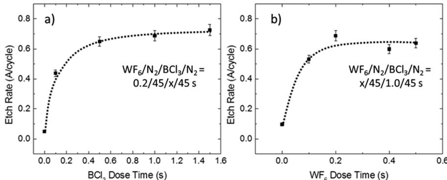  
Figure 13. Etch rates at  $170^{\circ}\mathrm{C}$  for  $\mathrm{TiO_2}$ : (a)  $\mathrm{BCl_3}$  with a constant  $\mathrm{WF_6}$  dose time of  $0.2\mathrm{s}$  and (b)  $\mathrm{WF_6}$  dose time with a constant  $\mathrm{BCl_3}$  exposure time of  $1\mathrm{s}$ . The ALE reactor was conditioned with  $200\mathrm{TiO_2}$  ALD cycles after every 3 subsequent ALE runs.

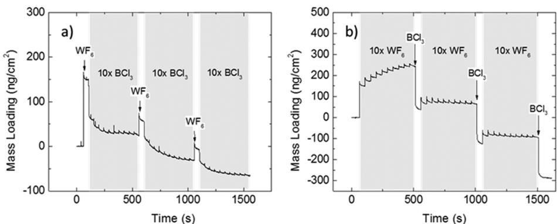  
Figure 14. Saturation study of  $\mathrm{WF_6 / BCl_3}$  ALE process at  $170^{\circ}\mathrm{C}$  using QCM: (a)  $1\mathrm{WF_6}$  dose of  $0.2\mathrm{s}$  per  $10\mathrm{BCl_3}$  doses of  $0.2\mathrm{s}$  each and (b)  $10\mathrm{WF_6}$  doses of  $0.1\mathrm{s}$  each per  $1\mathrm{BCl_3}$  dose of  $1.0\mathrm{s}$ .

12. In this experiment, the QCM crystal was exposed to more than 100 cycles of  $\mathrm{TiO_2}$  or  $\mathrm{Al}_2\mathrm{O}_3$  ALD at  $170^{\circ}\mathrm{C}$ , followed immediately by  $\mathrm{WF_6 / BCl_3}$  etching. For  $\mathrm{TiO_2}$ , data in Figure 12 (repeated from Figure 10) show linear mass loss during  $\mathrm{WF_6 / BCl_3}$  exposures, consistent with ALE. For  $\mathrm{Al}_2\mathrm{O}_3$ , however, no etching is observed. As in Figure 2, the first  $\mathrm{WF_6}$  exposure leads to mass gain, but the mass does not change substantially during subsequent  $\mathrm{WF_6}$  and  $\mathrm{BCl_3}$  exposures. This result is consistent with the thermodynamic analysis where  $\mathrm{WF_6}$  reacts with  $\mathrm{Al}_2\mathrm{O}_3$  to form a solid passivating  $\mathrm{AlF_3}$  surface layer, which will not react with  $\mathrm{BCl_3}$  to form volatile  $\mathrm{AlCl_3}$ .

Self- Limiting Behavior of  $\mathrm{WF_6 / BCl_3}$  ALE. To determine if  $\mathrm{WF_6 / BCl_3}$  etching of  $\mathrm{TiO_2}$  proceeds through self- limiting reactions, Figure 13 shows results of experiments at  $170^{\circ}\mathrm{C}$  in the ALE reactor on predeposited  $\mathrm{TiO_2}$  films where the change in film thickness was measured by ellipsometry after different extents of  $\mathrm{WF_6}$  or  $\mathrm{BCl_3}$  dosing. For these tests, we first deposited 100 cycles of ALD  $\mathrm{TiO_2}$ $(\sim 45\mathrm{\AA})$  on a set of samples and removed them from the ALD reactor. Individual samples were then exposed to 50 cycles of ALE under different exposure conditions, and the etch rate was determined by ellipsometry. Keeping the  $\mathrm{WF_6}$  exposure at  $0.2\mathrm{s}$ , increasing the  $\mathrm{BCl_3}$  exposure to  $1\mathrm{s}$  or larger showed etch saturation at  $\sim 0.6 - 0.7$ $\mathrm{\AA}$  cycle. Similarly, keeping the  $\mathrm{BCl_3}$  exposure fixed at  $1\mathrm{s}$ , the etch rate saturated with a  $\mathrm{WF_6}$  exposure greater than  $\sim 0.2\mathrm{s}$  cycle. These etch rate values correspond to the average steady- state etch rate and are consistent with the QCM results in Figure 10b showing the steady- state etch rate is somewhat larger than the ALD growth rate per cycle.

The saturation behavior for the  $\mathrm{WF_6 / BCl_3}$  ALE process was further assessed with QCM, and data are given in Figure 14. It is important to note that whereas the ellipsometry results in Figure 13 show the average steady- state etch rates, the QCM data in Figure 14 were collected during the first few ALE cycles immediately after ALD. We find that, under self- limiting saturated conditions, vide infra, the initial etch rates can be different from those determined during steady- state ALE. For the data in Figure 14a, a fresh ALD  $\mathrm{TiO_2}$  surface was exposed to  $0.2\mathrm{s}$  of  $\mathrm{WF_6}$  followed by  $10\mathrm{BCl_3}$  subdoses of  $0.2\mathrm{s}$  each. The  $\mathrm{WF_6}$  produced a mass gain followed by mass loss during the  $\mathrm{BCl_3}$  step. After the first  $\mathrm{WF_6}$  dose, the mass loss during  $\mathrm{BCl_3}$  saturates after 3 or 4 subdoses. After the second and third  $\mathrm{WF_6}$  doses, saturation is achieved within  $10\mathrm{BCl_3}$  subdoses, demonstrating self- limiting etching in the  $\mathrm{BCl_3}$  step. This condition corresponds to  $\mathrm{WF_6 / BCl_3} = 0.2 / 1.0\mathrm{s}$ , which is consistent with saturation conditions in Figure 13.

Likewise, Figure 14b shows results when a fresh  $\mathrm{TiO_2}$  surface is exposed to  $10\mathrm{WF_6}$  subdoses of  $0.1\mathrm{s}$  each, followed by  $1.0\mathrm{s}$  of  $\mathrm{BCl_3}$ . On the fresh  $\mathrm{TiO_2}$  surface, the first  $\mathrm{WF_6}$  dose leads to a relatively large mass gain followed by mass loss during the  $\mathrm{BCl_3}$  dose. In the second cycle, the first  $\mathrm{WF_6}$  subdose shows a much smaller mass gain, and subsequent  $\mathrm{WF_6}$  subdoses lead to no net mass change, indicating  $\mathrm{WF_6}$  reaction saturation. The overall dose conditions correspond to  $\mathrm{WF_6 / BCl_3} = 1.0 / 1.0\mathrm{s}$ . This is also consistent with saturation in Figure 13, but the net  $1.0\mathrm{s}$ $\mathrm{WF_6}$  dose/cycle substantially exceeds the  $0.1 - 0.2\mathrm{s}$  cycle required for steady- state saturation. This excess  $\mathrm{WF_6}$  leads to a different etch rate during the first few ALE cycles than that measured at steady state, but the overall reaction remains self- limiting. The ellipsometry (at steady state) and QCM analysis (during initial etch cycles) both confirm that the  $\mathrm{WF_6 / BCl_3}$  reaction sequence gives rise to self- limiting etching half-

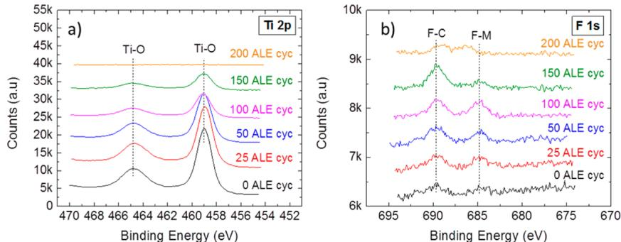  
Figure 15. High resolution XPS scans of (a) Ti 2p and (b) Ti 1s regions for  $4\mathrm{mm}$ $\mathrm{TiO_2}$  film following 0, 25, 50, 100, 150, and  $200\mathrm{W}\mathrm{F}_6 / \mathrm{BCl}_3$  cycles in the ALE reactor at  $170^{\circ}\mathrm{C}$ .

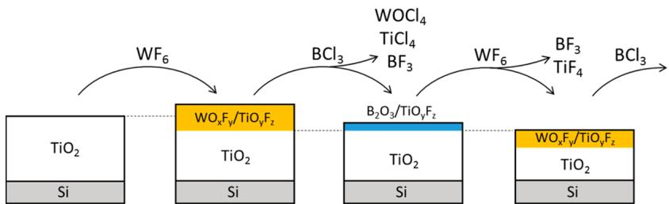  
Figure 16. Schematic diagram describing the proposed etch mechanism for the  $\mathrm{TiO_2}$  ALE process using  $\mathrm{WF}_6$  and  $\mathrm{BCl}_3$  at  $170^{\circ}\mathrm{C}$ : (1)  $\mathrm{WF}_6$  adsorbs on the thick  $\mathrm{TiO_2}$  surface, forming surface-bound  $\mathrm{TiO_yF_z}$  and  $\mathrm{WO}_x\mathrm{F}_{y}$ . (2)  $\mathrm{BCl}_3$  volatilizes the surface metal oxy fluoride species, forming  $\mathrm{TiCl}_4$ ,  $\mathrm{WCl}_2\mathrm{O}_2$ , and  $\mathrm{BF}_3$ .

reactions, thereby validating that the process follows a thermal ALE sequence.

Mass Uptake and Etch Rates during Initial  $\mathrm{WF}_6 / \mathrm{BCl}_3$  Exposures versus Steady- State ALE. In the CVE experiments at  $220^{\circ}\mathrm{C}$  shown in Figure 1, we noted that the mass gain during the first  $\mathrm{WF}_6$  exposure was larger than that during subsequent dose steps. The QCM results in Figures 12 and 14 for the  $\mathrm{WF}_6 / \mathrm{BCl}_3$  process show the  $\mathrm{WF}_6$  mass uptake is also larger during the first dose than during the steady state ALE process. In this case, the mass loss during the first  $\mathrm{BCl}_3$  dose is also larger than at steady state. The differences between the initial and the steady state behavior reflects differences in the surface condition. On the fresh  $\mathrm{TiO_2}$  surface, the  $\mathrm{WF}_6$  will react readily to yield surface tungsten oxides and fluorine that diffuse into the film. During steady- state etching, however, some of the  $\mathrm{WF}_6$  is also consumed to volatilize surface boron oxide, creating a more well- defined etch rate per cycle. The different reactions and reaction rates during the first cycles will lead to ALE rate transitions, where the etch rate during early cycles could be faster or slower than at steady state.

It is interesting to note that rate evolution during ALE can be viewed as physically analogous to growth incubation commonly observed in ALD. Delayed nucleation in ALD occurs when the ALD precursors react differently on the growth substrate than on the growth surface. Likewise, in ALE, it is reasonable to expect the etch reactants will react differently with the fresh material being etched, i.e., the "etch substrate", compared to the "etch surface", i.e., the surface that is present following multiple etch cycles. This suggests, therefore, that early ALE rate inhibition or enhancement is a general phenomenon in thermal ALE processes, not limited to the  $\mathrm{WF}_6 / \mathrm{BCl}_3$  process. Likewise, like growth incubation in ALD, the ALE rate transitions are expected to depend on the material being etched, the etch reactants, the process temperature, reactor wall preparation, and other conditions. Regarding reactor wall preparation, the data presented here were generally collected after preparing our isothermal hot- wall reactor surface with ALD metal oxide. In our reactors, we noted that the ALE rate could be reduced when a series of ALE runs was performed in sequence, possibly resulting from excess boron oxide present on the reactor walls. We found performing a long  $\mathrm{WF}_6$  exposure to remove boron oxide in the ALE chamber before loading samples acted to mitigate the effect.

Analysis of  $\mathrm{WF}_6 / \mathrm{BCl}_3$  ALE by XPS. The  $\mathrm{WF}_6 / \mathrm{BCl}_3$  ALE etching process was further characterized using XPS. For this data, a set of recently deposited  $\mathrm{TiO_2}$  samples were etched with different numbers of  $\mathrm{WF}_6 / \mathrm{BCl}_3$  ALE cycles and then removed from the reactor for analysis. Figure 15a shows that the intensity of the Ti 2p signal decreases with increasing number of  $\mathrm{WF}_6 / \mathrm{BCl}_3$  ALE cycles, consistent with film etching. Figure 15b shows the F 1s signal under the same conditions. The peaks near 685 and  $690\mathrm{eV}$  are assigned to fluorine bound to metal and carbon, respectively, indicating metal fluorides and trace organic fluorine on the  $\mathrm{TiO_2}$  surface. The metal fluorides are consistent with the expected ALE reactions. The organic fluorides are ascribed to reaction with adventitious carbon during sample transfer. Furthermore, the boron, chlorine, and tungsten content are also below the XPS detection limit. After 200 ALE cycles, the Ti 2p signal is below the detection limit confirming that the  $\mathrm{TiO_2}$  film was completely etched, leaving trace amounts of halogen on the Si substrate surface.

Schematic of the  $\mathrm{WF}_6 / \mathrm{BCl}_3$  ALE Reaction Process. Figure 16 shows a schematic for the proposed  $\mathrm{WF}_6 / \mathrm{BCl}_3$  ALE reaction sequence consistent with the thermodynamic modeling, as well as the QCM, ellipsometry, and XPS data. First, like the chemical vapor etching mechanism, the initial  $\mathrm{WF}_6$  adsorbs and fluorinates the  $\mathrm{TiO_2}$  surface producing solid  $\mathrm{WO}_x\mathrm{F}_y$  and  $\mathrm{TiO_yF_z}$ . This is shown in the XPS results in Figure 4, as well as QCM in Figures 10 and 12. At  $T< 200^{\circ}\mathrm{C}$ , the solid  $\mathrm{WO}_x\mathrm{F}_y$  layer is not sufficiently volatile to allow CVE.

After  $\mathrm{WF}_{6},$  the subsequent  $\mathrm{BCl}_3$  exposure then leads to ligand exchange43 yielding volatile  $\mathrm{TiCl}_4$  and  $\mathrm{WOCl}_4,$  as indicated by equilibrium thermodynamics in Figure 12. Thermodynamic models also suggest solid  $\mathrm{B}_2\mathrm{O}_3$  is a surface product. However, XPS analysis after  $\mathrm{BCl}_3$  exposure showed no evidence for surface boron. The lack of B signal is expected because the samples are transferred in air for  $\mathrm{XPS},$  allowing surface  $\mathrm{B}_2\mathrm{O}_3$  to react with ambient moisture to form volatile boric acid,  $\mathrm{H}_3\mathrm{BO}_3$  54 The XPS data in Figure 15 show that, after  $\mathrm{BCl}_3$  exposure, some fluorine remains on the  $\mathrm{TiO}_2$  surface, denoted as  $\mathrm{TiO}_y\mathrm{F}_z$  Also during the  $\mathrm{BCl}_3$  exposure step at 170  $^\circ \mathrm{C}$ $\mathrm{BCl}_3$  is expected to react with  $\mathrm{TiO}_2$  to form  $\mathrm{TiCl}_4$  and  $\mathrm{B}_2\mathrm{O}_3$ $(\Delta G = - 109\mathrm{kJ / mol}\mathrm{TiO}_2)$  . The solid  $\mathrm{B}_2\mathrm{O}_3$  passivates the  $\mathrm{TiO}_2$  surface, thereby self- limiting the  $\mathrm{BCl}_3$  etching.

After  $\mathrm{BCl}_3,$  the subsequent  $\mathrm{WF}_6$  exposure reacts with  $\mathrm{B}_2\mathrm{O}_3$  to form volatile  $\mathrm{BF}_3$  and  $\mathrm{TiF}_4,$  and surface  $\mathrm{WO}_3,$ $\mathrm{WO}_x\mathrm{F}_y$  and  $\mathrm{TiO}_y\mathrm{F}_z$  . Some surface  $\mathrm{TiO}_y\mathrm{F}_z$  is present from previous cycles, and this impedes fluorine diffusion,20- 23,49,50 thereby leading to less  $\mathrm{WF}_6$  reaction than on fresh  $\mathrm{TiO}_2$  .Upon establishing steady- state conditions, the  $\mathrm{WF}_6 / \mathrm{BCl}_3$  atomic layer etch sequence continues until the  $\mathrm{TiO}_2$  film is consumed. As shown in Figure 15, after 200 ALE cycles, no evidence for Ti 2p is observed by XPS. Moreover, the silicon substrate remaining after ALE shows a relatively small  $\mathrm{F}$  1s signal, indicating this ALE sequence leaves a clean surface after etching.29

# SUMMARY AND CONCLUSIONS

In this article, we demonstrated and described mechanisms for thermally driven selective chemical vapor etching (CVE) of  $\mathrm{TiO}_2$  using  $\mathrm{WF}_6$  at  $T > 200^{\circ}\mathrm{C}$  and selective atomic layer etching (ALE) of  $\mathrm{TiO}_2$  using  $\mathrm{WF}_6 / \mathrm{BCl}_3$  reactant exposures at  $T$ $< 190^{\circ}\mathrm{C}$  Other reactants, including  $\mathrm{WF}_6 / \mathrm{Sn}(\mathrm{acac})_2,$  also provided routes for low- temperature ALE. Using XPS and ellipsometry analysis, we physically confirm  $\mathrm{TiO}_2$  etching and provide evidence that etching proceeds through  $\mathrm{TiO}_2$  fluorination and formation of a low density  $\mathrm{WO}_x\mathrm{F}_y$  region. We also showed that the chemical selectively for etching of  $\mathrm{TiO}_2$  over other oxides including  $\mathrm{Al}_2\mathrm{O}_3$  is due to the relative volatility of the metal fluoride product species.

For etching of  $\mathrm{TiO}_2$  using  $\mathrm{WF}_6$  and  $\mathrm{BCl}_3,$  modeling confirms that the process proceeds through two complementary thermodynamically favorable half- reaction steps, indicating creation of volatile  $\mathrm{TiCl}_4,$ $\mathrm{WF}_3,$  and  $\mathrm{WOCl}_4$  .Film thickness measurements after etching under a range of exposure conditions confirm steady- state self- limiting etch saturation, confirming thermal atomic layer etching, with an etch rate of  $\sim 0.6 - 0.7\mathrm{\AA / cycle}$  at  $170^{\circ}\mathrm{C}_{\cdot}$  At slightly lower temperatures, between  $130^{\circ}$  and  $150^{\circ}\mathrm{C},$  the process is more temperature independent, with an etch rate of  $\sim 0.3\mathrm{\AA / cycle}$  .We show that the ALE process is selective for etching  $\mathrm{TiO}_2$  over  $\mathrm{Al}_2\mathrm{O}_3,$  and modeling further suggests this process will be favorable for ALE of  $\mathrm{HfO}_2$  and  $\mathrm{ZrO}_2$  Analysis by XPS shows complete removal of  $\mathrm{TiO}_2$  films on silicon, resulting in a clean substrate with trace amounts of surface fluorination. We also describe and demonstrate how the rate of ALE during initial etch cycles may be different from that observed at steady state, and we conclude that rate evolution during initiation of thermal ALE may be a general phenomenon that is physically analogous to well- known rate transitions during substrate- dependent nucleation in ALD.

# AUTHOR INFORMATION

Corresponding Author \*(G.N.P.) E- mail: gnp@ncsu.edu.

# ORCID

Paul C. Lemaire: 0000- 0002- 2077- 8114 Gregory N. Parsons: 0000- 0002- 0048- 5859

# Author Contributions

All authors have given approval to the final version of the manuscript.

# Notes

The authors declare no competing financial interest.

# ACKNOWLEDGMENTS

The authors acknowledge support from Lam Research and EMD Performance Materials. They also acknowledge the use of the Analytical Instrumentation Facility (AIF) at North Carolina State University, which is supported by the State of North Carolina and the National Science Foundation.

# REFERENCES

(1) Trucks, G. W.; Raghavachari, K.; Higashi, G. S.; Chabal, Y. C. Mechanism of HF Etching of Silicon Surfaces: A Theoretical Understanding of Hydrogen Passivation. Phys. Rev. Lett. 1990, 65, 504-507. 
(2) Kang, J. K.; Musgrave, C. B. The Mechanism of HF/H[sub 2]O Chemical Etching of SiO[sub 2]. J. Chem. Phys. 2002, 116, 275. 
(3) Hoshino, T.; Nishioka, Y. Etching Process of SiO[sub 2] by HF Molecules. J. Chem. Phys. 1999, 111, 2109. 
(4) Ritala, M. Atomic Layer Deposition of Oxide Thin Films with Metal Alkoxides as Oxygen Sources. Science (Washington, DC, U. S.) 2000, 288, 319-321. 
(5) Atanasov, S. E.; Kalanyan, B.; Parsons, G. N. Inherent Substrate-Dependent Growth Initiation and Selective-Area Atomic Layer Deposition of TiO2 Using "water-Free" Metal-Halide/metal Alkoxide Reactants. J. Vac. Sci. Technol., A 2016, 34, 01A148. 
(6) Liu, J.; Lennard, W. N.; Goncharova, L. V.; Landheer, D.; Wu, X.; Rushworth, S. A.; Jones, A. C. Atomic Layer Deposition of Hafnium and Tris(2-Methyl-2-Butoxy)silanol. J. Electrochem. Soc. 2009, 156, G89. 
(7) Frank, M. M.; Chabal, Y. J.; Green, M. L.; Delabie, A.; Brijs, B.; Wilk, G. D.; Ho, M.-Y.; da Rosa, E. B. O.; Baumvol, I. J. R.; Stedile, F. C. Enhanced Initial Growth of Atomic-Layer-Deposited Metal Oxides on Hydrogen-Terminated Silicon. Appl. Phys. Lett. 2003, 83, 740. 
(8) Chaukulkar, R. P.; Agarwal, S. Atomic Layer Deposition of Titanium Dioxide Using Titanium Tetrachloride and Titanium Tetraisopropoxide as Precursors. J. Vac. Sci. Technol., A 2013, 31, 413509. 
(9) Park, K. J.; Terry, D. B.; Stewart, S. M.; Parsons, G. N. In Situ Auger Electron Spectroscopy Study of Atomic Layer Deposition: Growth Initiation and Interface Formation Reactions during Ruthenium ALD on Si-H, SiO2, and HfO2 Surfaces. Langmuir 2007, 23, 6106-6112. 
(10) Holmes, P. J.; Snell, J. E. A Vapour Etching Technique for the Photolithography of Silicon Dioxide. Microelectron. Reliab. 1966, 5, 337-341. 
(11) McIntosh, R.; Kuan, T.-S.; Defreesart, E. Hydrogen Fluoride Vapor Etching for Pre-Epi Silicon Surface Preparation. J. Electron. Mater. 1992, 21, 57-60. 
(12) Helms, C. R.; Deal, B. E. Mechanisms of the HF/H2O Vapor Phase Etching of SiO2. J. Vac. Sci. Technol., A 1992, 10, 806. 
(13) Miki, N.; Kikuyama, H.; Kawanabe, I.; Miyashita, M.; Ohmi, T. Gas-Phase Selective Etching of Native Oxide. IEEE Trans. Electron Devices 1990, 37, 107-115. 
(14) Lee, Y.; Sun, H.; Young, M. J.; George, S. M. Atomic Layer Deposition of Metal Fluorides Using HF-Pyridine as the Fluorine Precursor. Chem. Mater. 2016, 28, 2022.

(15) Oehrlein, G. S.; Metzler, D.; Li, C. Atomic Layer Etching at the Tipping Point: An Overview. ECS J. Solid State Sci. Technol. 2015, 4, N5041-N5053.  
(16) Kanarik, K. J.; Lill, T.; Hudson, E. A.; Sriraman, S.; Tan, S.; Marks, J.; Vahedi, V.; Gottscho, R. A. Overview of Atomic Layer Etching in the Semiconductor Industry. J. Vac. Sci. Technol., A 2015, 33, 020802.  
(17) Faraz, T.; Roozeboom, F.; Knoops, H. C. M.; Kessels, W. M. M. Atomic Layer Etching: What Can We Learn from Atomic Layer Deposition? ECS J. Solid State Sci. Technol. 2015, 4, N5023-N5032.  
(18) Carver, C. T.; Plombon, J. J.; Romero, P. E.; Suri, S.; Tronic, T. A.; Turkot, R. B., Jr. Atomic Layer Etching: An Industry Perspective. ECS J. Solid State Sci. Technol. 2015, 4, N5005-N5009.  
(19) George, S. M.; Deep, Y. Prospects for Thermal Atomic Layer Etching Using Sequential, Self-Limiting Fluorination and Ligand-Exchange Reactions. ACS Nano 2016, 10, 4889-4894.  
(20) Lee, Y.; Huffman, C.; George, S. M. Selectivity in Thermal Atomic Layer Etching Using Sequential, Self-Limiting Fluorination and Ligand-Exchange Reactions. Chem. Mater. 2016, 28, 7657.  
(21) Lee, Y.; George, S. M. Atomic Layer Etching of Al2O3 Using Sequential, Self-Limiting Thermal Reactions with Sn(acac)2 and Hydrogen Fluoride. ACS Nano 2015, 9, 2061-2070.  
(22) Lee, Y.; DuMont, J. W.; George, S. M. Mechanism of Thermal Al 2 O 3 Atomic Layer Etching Using Sequential Reactions with Sn(acac) 2 and HF. Chem. Mater. 2015, 27, 3648-3657.  
(23) Lee, Y.; DuMont, J. W.; George, S. M. Trimethylaluminum as the Metal Precursor for the Atomic Layer Etching of Al 2 O 3 Using Sequential, Self-Limiting Thermal Reactions. Chem. Mater. 2016, 28, 2994-3003.  
(24) Lee, Y.; DuMont, J. W.; George, S. M. Atomic Layer Etching of HfO2 Using Sequential, Self-Limiting Thermal Reactions with Sn(acac)2 and HF. ECS J. Solid State Sci. Technol. 2015, 4, N5013-N5022.  
(25) Droes, S. R.; Kodas, T. T.; Hampden-Smith, M. J. Etching of ZnO Films with Hexafluoroacetylacetone. Adv. Mater. 1998, 10, 1129-1133.  
(26) Steger, R.; Masel, R. Chemical Vapor Etching of Copper Using Oxygen and 1,1,1,5,5,5-Hexafluoro-2,4-Pentanedione. Thin Solid Films 1999, 342, 221-229.  
(27) Jain, A.; Kodas, T. T.; Hampden-Smith, M. J. Thermal Dry Etching of Copper Using Hydrogen Peroxide and Hexafluoroacetylacetone. Thin Solid Films 1995, 269, 51-56.  
(28) Min, K. S.; Kang, S. H.; Kim, J. K.; Jhon, Y. I.; Jhon, M. S.; Yeom, G. Y. Atomic Layer Etching of Al2O3 Using BCl3/Ar for the Interface Passivation Layer of III-V MOS Devices. Microelectron. Eng. 2013, 110, 457-460.  
(29) Ikeda, K.; Imai, S.; Matsumura, M. Atomic Layer Etching of Germanium. Appl. Surf. Sci. 1997, 112, 87-91.  
(30) O'Donnell, T. A.; Stewart, D. F. Reactivity of Transition Metal Fluorides. I. Higher Fluorides of Chromium, Molybdenum, and Tungsten. Inorg. Chem. 1966, 5, 1434-1437.  
(31) Koutsospyros, A.; Braida, W.; Dermatas, D.; Strigul, N.; Christodoulatos, C. A Review of Tungsten: From Environmental Obscurity to Scrutiny. J. Hazard. Mater. 2006, 136, 1-19.  
(32) Kobayashi, N.; Nakamura, Y.; Goto, H.; Homma, Y. In Situ Infrared Reflection and Transmission Absorption Spectroscopy Study of Surface Reactions in Selective Chemical-Vapor Deposition of Tungsten Using WF6 and SiH4. J. Appl. Phys. 1993, 73, 4637.  
(33) Tägtström, P. Atomic Layer Epitaxy of Tungsten Oxide Films Using Oxyfluorides as Metal Precursors. J. Electrochem. Soc. 1999, 146, 3139.  
(34) Knapas, K.; Rahtu, A.; Ritala, M. Etching of Nb 2 O 5 Thin Films by NbCl 5. Chem. Vap. Deposition 2009, 15, 269-273.  
(35) Kalanyan, B.; Lemaire, P. C.; Atanasov, S. E.; Ritz, M. J.; Parsons, G. N. Using Hydrogen To Expand the Inherent Substrate Selectivity Window During Tungsten Atomic Layer Deposition. Chem. Mater. 2016, 28, 117-126.  
(36) Kalanyan, B.; Losego, M. D.; Oldham, C. J.; Parsons, G. N. Low-Temperature Atomic Layer Deposition of Tungsten Using Tungsten

Hexafluoride and Highly- Diluted Silane in Argon. Chem. Vap. Deposition 2013, 19, 161- 166.  (37) Powell, C. J.; Jablonski, A. NIST Standard Reference Database 82; 2011.  (38) Fuentes, G. G.; Elizalde, E.; Yubero, F.; Sanz, J. M. Electron Inelastic Mean Free Path for Ti, TiC, TiN and TiO2 as Determined by Quantitative Reflection Electron Energy- Loss Spectroscopy. Surf. Interface Anal. 2002, 33, 230- 237.  (39) Vasilopoulou, M.; Kostis, I.; Vourdas, N.; Papadimitropoulos, G.; Douvas, A.; Boukos, N.; Kennou, S.; Davroglou, D. Influence of the Oxygen Substoichiometry and of the Hydrogen Incorporation on the Electronic Band Structure of Amorphous Tungsten Oxide Films. J. Phys. Chem. C 2014, 118, 12632- 12641.  (40) Maret, A. B.; Maret, A. U.; Elam, J. W.; Delfreres, M.; Marks, T. J.; Stair, P. C. Volatile Hexavalent Oxo- Amidinate Complexes: Polybdenum and Tungsten Precursors for Atomic Layer Deposition. Chem. Mater. 2016, 28, 1907- 1919.  (41) Lee, Y.; DuMont, J. W.; George, S. M. Atomic Layer Etching of AlF 3 Using Sequential, Self- Limiting Thermal Reactions with Sn(acac) 2 and Hydrogen Fluoride. J. Phys. Chem. C 2015, 119, 25385- 25393.  (42) Ramanath, G.; Greene, J. E.; Carlasson, J. R. A.; Allen, L. H.; Hornback, V. C.; Allman, D. J. W Deposition Titanium Fluoride- Formation during WF[sub 6] Reduction by Ti: Reaction Path and Mechanisms. J. Appl. Phys. 1999, 85, 1961.  (43) Fracassi, F.; d'Agostino, R. Chemistry of Titanium Dry Etching in Fluorinated and Chlorinated Gases. Pure Appl. Chem. 1992, 64, 703- 707.  (44) Lemaire, P. C.; King, M.; Parsons, G. N. Understanding Inherent Substrate Selectivity during Atomic Layer Deposition: Effect of Surface Preparation, Hydroxyl Density, and Metal Oxide Composition on Nucleation Mechanisms during Tungsten ALD. J. Chem. Phys. 2017, 146, 052811.  (45) Bestwick, T. D.; Oehrlein, G. S. Tungsten Etching Mechanisms in CF4/O2 Reactive Ion Etching Plasmas. J. Appl. Phys. 1989, 66, 5034.  (46) Lee, Y. J.; Park, C.- O.; Kim, D.- W.; Chun, J. S. The Effects of Deposition Temperature on the Intefacial Properties of SiH4 Reduced Blanket Tungsten on TiN Glue Layer. J. Electron. Mater. 1994, 23, 1075- 1080.  (47) Louvain, N.; Karkar, Z.; El- Ghozzi, M.; Bonnet, P.; Guerin, K.; Willmann, P. Fluorination of Anatase TiO 2 towards Titanium Oxyfluoride TiOF 2: A Novel Synthesis Approach and Proof of the Li- Insertion Mechanism. J. Mater. Chem. A 2014, 2, 15308.  (48) Baxter, D. V.; Chisolm, M. H.; Doherty, S.; Gruhn, N. E. Chemical Vapour Deposition of Electrochromic Tungsten Oxide Films Employing Volatile tungsten(VI) Oxo Alkoxide/?- Diketonate Complexes. Chem. Commun. 1996, 1129.  (49) Ortega, Y.; Lamiel- Garcia, O.; Hevia, D. F.; Tosoni, S.; Oviedo, G.; San- Miguel, M. A.; Illas, F. Theoretical Study of the Fluorine Doped Anatase Surfaces. Surf. Sci. 2013, 618, 154- 158.  (50) Tosoni, S.; Lamiel- Garcia, O.; Fernandez Hevia, D.; Illas, F. Theoretical Study of Atomic Fluorine Diffusion through Bulk TiO 2 Polymorphs. J. Phys. Chem. C 2013, 117, 5855- 5860.  (51) Mäntymäki, M.; Heikkilä, M. J.; Paukilainen, E.; Mäntoata, K.; Marchand, B.; Raisänen, J.; Ritala, M.; Leskelä, M. Atomic Layer Deposition of AlF 3 Thin Films Using Halide Precursors. Chem. Mater. 2015, 27, 604- 611.  (52) Pilvi, T.; Puukilainen, E.; Munnik, F.; Leskelä, M.; Ritala, M. ALD of YF 3 Thin Films from TiF 4 and Y(thd) 3 Precursors. Chem. Vap. Deposition 2009, 15, 27- 32.  (53) Thermo Scientific XPS: Fluorine. http://xpssimplified.com/elements/fluorine.php (accessed May 28, 2017).  (54) Putkonen, M.; Niinistö, L. Atomic Layer Deposition of B2O3 Thin Films at Room Temperature. Thin Solid Films 2006, 514, 145- 149.