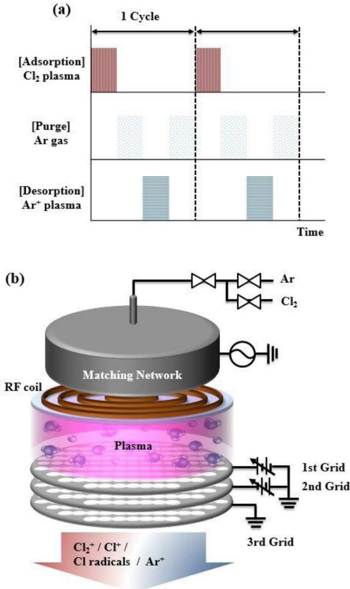
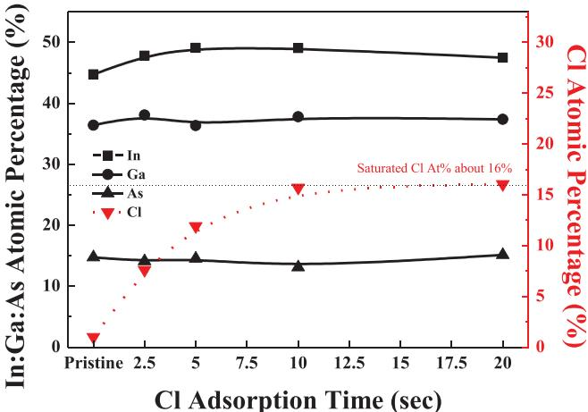
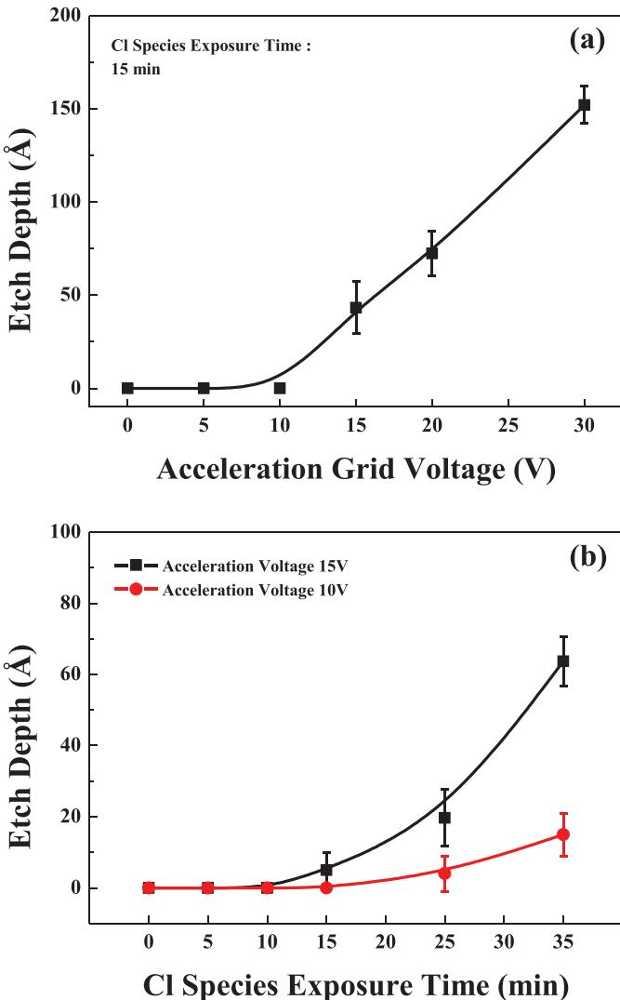
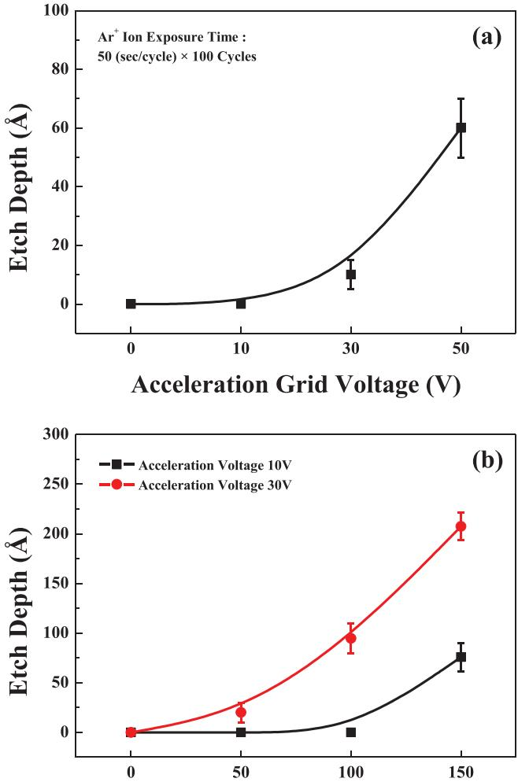
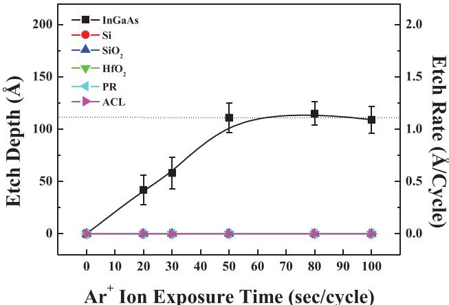
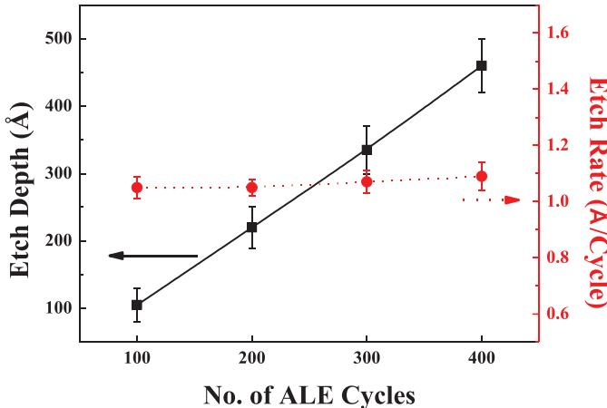
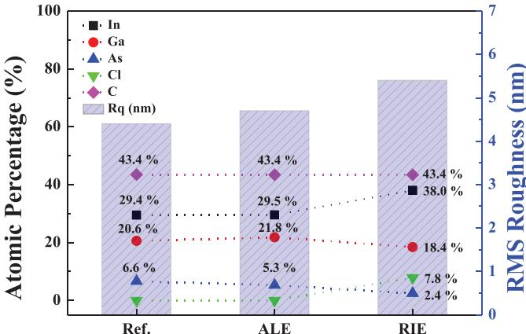

PAPER

# You may also like

# Atomic layer etching of InGaAs by controlled ion beam

InGaAs photo field- effect- transistors (PhotoFETs) on half- inch Si wafer using layer transfer technology  Fatsuro Maeda, Hiroyuki Ishii, Wen Hsin  Chang et al.

To cite this article: Jin Woo Park et al 2017 J. Phys. D: Appl. Phys. 50 254007

Selective- Area Growth of Vertical InGaAs Nanowires on Ge for Transistor Applications  Atinobo Yoshida, Katouhiro Tomioka, Fumiya Ishizaka et al.

View the article online for updates and enhancements.

Cleaning of InGaAs and InP Layers for Nanoelectronics and Photonics Contact Technology Applications  Philippe Rodriguez, Laura Toselli, Elodie Ghegin et al.

This content was downloaded from IP address 194.95.115.83 on 24/04/2023 at 17:42

# Atomic layer etching of InGaAs by controlled ion beam

Jin Woo Park $^{1}$ , Doo San Kim $^{1}$ , Mu Kyeom Mun $^{1}$ , Won Oh Lee $^{1}$ , Ki Seok Kim $^{1}$  and Geun Young Yeom $^{1,2}$

$^{1}$  School of Advanced Materials Science and Engineering, Sungkyunkwan University, Suwon 16419, Republic of Korea   $^{2}$  SKKU of Advanced Institute of Nano Technology (SAINT), Sungkyunkwan University, Suwon 16419, Republic of Korea

E- mail: gyyeom@skku.edu

Received 1 February 2017, revised 20 April 2017  Accepted for publication 3 May 2017  Published 6 June 2017

# Abstract

Atomic layer etching (ALE) could be an important next- generation etching technique, applicable to various semiconductor materials including III- V compound materials such as indium gallium arsenide (InGaAs) which has high carrier mobility, an advantageous characteristic in nanoscale electronic devices. In this study, the ALE characteristics of InGaAs have been investigated using a reactive ion beam technique. For the ALE of InGaAs, chlorine radicals/low- energy (10–19 eV) reactive ions and low- energy (5–8 eV)  $\mathrm{Ar^{+}}$  ions were used for adsorption and desorption, respectively, during the etch cycle to precisely control the etch depth and to minimize the surface damage of the InGaAs. By using the ALE technique, a constant etch rate of 1.1 Å/cycle could be obtained for InGaAs, as well as an infinite etch selectivity of InGaAs over various materials such as photoresist, silicon, amorphous carbon layer,  $\mathrm{SiO_2}$ , and  $\mathrm{HfO_2}$ . The surface composition and surface roughness of the InGaAs after ALE were similar to those of as- received un- etched InGaAs.

Keywords: atomic layer etching, indium- gallium arsenide, etch selectivity, chlorine adsorption,  $\mathrm{Ar^{+}}$  ion beam, x- ray photoelectron spectroscopy

Supplementary material for this article is available online

(Some figures may appear in colour only in the online journal)

# 1. Introduction

Among the various III- V compound semiconducting materials, indium- gallium arsenide (InGaAs) has been most widely investigated for use in various devices, such as electronic devices and optical devices, due to its excellent electrical properties such as high carrier mobility and direct energy band structure [1- 4]. Recently, InGaAs has attracted attention as a potential candidate material for a new channel layer for a high- speed and low- power III- V based metal- oxide- semiconductor field- effect transistor (MOSFET) [1]. In particular, it is a possible candidate for the gate material in the structure of next- generation semiconductor devices, such as fin- field- effect transistors (FinFETs) and nanowire field- effect transistors (NWFETs), which consist of 3D device structures which can be maintained even with a short gate length because of the control of the short- channel effect and near ideal turn- off slope [5- 7].

In the past, chemical etching has been widely used for the fabrication of III- V based semiconductor devices because it allows high etch rates without surface damage, but it has disadvantages, such as difficulty in controlling etch rates and undercutting due to the isotropic etching. Therefore, as the device scale has decreased, dry etching such as reactive ion etching (RIE), has also been investigated for anisotropic etching of III- V compound materials [8- 13]. When RIE is used to etch III- V compound materials, the materials can be easily damaged by the reactive ions and the device performance can be easily degraded even though more controllable etch rates and anisotropic etch profiles are obtained [14]. For

the fabrication of nanoscale FinFETs and NWFETs in particular, more controlled etch rates and near damageless etching is required in addition to the anisotropic etching. Therefore, in order to overcome the problems of conventional dry etching techniques in nanoscale devices, the atomic layer etching (ALE) technique, which is a cyclic etch process composed of an adsorption step (the chemisorption of reactive gas species on the material's surface) and a desorption step (the removal of the chemisorbed species by various methods) has been investigated recently. Even though the etch rate is very slow, it is the most suitable method for nanoscale etching, with a precise etch rate in the atomic scale and with negligible physical and chemical damage on the etched material's surface.

For III- V compound based semiconductors, ALE techniques have also been investigated using various methods. Due to the volatile compound formation of chlorine with III- V compound materials, as the adsorption gas, chlorine- based reactive gas radicals have generally been used. However, for the desorption of chemisorbed gas species, an energetic Ar/ Ne ion/neutral beam (Ar ion for GaAs [15] and Ne neutral beam for GaAs [16] and InP [17]), KrF excimer laser (for GaAs [18]), halogen lamp (for InP [19]), etc has been used. For the electron- beam- generated energetic Ar ions with an energy of  $- 17\mathrm{eV}$ , the saturated etch depth of  $\sim 0.142\mathrm{nm}$  cycle, which corresponds to one atomic layer/cycle for GaAs (1 0 0), was observed by Meguro et al [15], and, by using a Ne neutral beam  $(>10\mathrm{V})$ , the saturated etch depths of  $\sim 0.163\mathrm{nm}/$  cycle for GaAs (1 1 1) and  $\sim 0.141\mathrm{nm}$  cycle for GaAs (1 0 0) were obtained by Lim et al [16]. In the case of InP, by using a Ne neutral beam  $(>5\mathrm{V})$ , the saturated InP etch depths of  $\sim 0.169\mathrm{nm}$  cycle for InP (1 1 1) and  $\sim 0.147\mathrm{nm}$  cycle for InP (1 0 0) could also be achieved [17]. The use of a  $248\mathrm{nm}$  KrF excimer laser for the desorption of chlorine chemisorbed GaAs during ALE yielded the saturated etch amount of  $\sim 0.2\mathrm{nm}$  cycle [18]. In the case of Otsuka et al [19], instead of chlorine, trisdimethylaminophosphorus was injected digitally while the substrate was heated using a halogen lamp for the digital etching, and the saturated etch depth of  $\sim 0.05\mathrm{nm}/$  cycle was observed. Among these ALE desorption methods, the desorption with the Ar/Ne ion/neutral beam resulted in anisotropic etching while other desorption methods, such as with a KrF excimer laser, and with a halogen lamp, resulted in isotropic etching.

Even though the above previous studies on III- V compounds exhibit the feasibility of ALE for III- V compound materials, these previous ALE studies are limited to binary- component III- V compounds; ALE on three- component compounds has never been investigated and the etch selectivities over various semiconductor related materials during ALE have not yet been reported either. Therefore, in this study, as a feasibility study of an anisotropic ALE for three- component III- V compounds, the ALE characteristics of InGaAs, which is one of the most promising gate materials for next- generation FinFETs and NWFETs, has been investigated. For the ALE method, a cycle process composed of an adsorption step with chlorine radical/low- energy ions and a desorption step with a low energy  $\mathrm{Ar^{+}}$  ion beam was used. In addition to the ALE of InGaAs, at an optimized ALE condition, the final etch selectivities of InGaAs over various materials such as photoresist (PR), amorphous carbon layer (ACL),  $\mathrm{SiO_2}$ , and  $\mathrm{HfO_2}$  were also investigated.

  
Figure 1. (a) The process steps in the ALE cycle for InGaAs etching. (b) Schematic diagram of ICP ion beam source with three-grid assembly used to etch InGaAs by ALE.

# 2. Experimental

As the InGaAs sample for ALE,  $\mathrm{In}_{0.53}\mathrm{Ga}_{0.47}\mathrm{As}$ $(200\mathrm{nm})/$  InP  $(1000\mathrm{nm}) / \mathrm{GaAs}$ $(300\mathrm{nm})$  grown on silicon substrate by metal organic chemical vapor deposition was used. Prior to loading in the chamber, the InGaAs sample was dipped in a HCl solution to remove native oxide on the InGaAs surface, followed by rising with de- ionized (DI) water and drying with nitrogen gas. To investigate the etch selectivities over various materials, mask materials such as PR and ACL and dielectric materials such as  $\mathrm{SiO_2}$ ,  $\mathrm{HfO_2}$  deposited on silicon wafer were prepared and also etched together during the ALE of InGaAs.

Figures 1(a) and (b) show the process steps in the ALE cycles and the ion beam source used for the InGaAs ALE, respectively. As shown in figure 1(a), one ALE cycle was composed of four sequential steps; the first step (adsorption step) was for the adsorption (reaction) of chlorine reactant species

on the surface and the third step (desorption step) was for the desorption (removal) of surface atoms- reactant chemisorbed species on the surface, and the second and fourth steps were for the purging of residual reactant and purging of desorbed chemisorbed species from the surface, respectively. As shown in figure 1(b), a three- grid inductively coupled plasma (ICP)- type ion source operated at a  $13.56\mathrm{MHz}$  radio frequency (RF) was used as the source for adsorption and desorption. In this three- grid assembly, a positive voltage was applied to the first grid located close to the source (acceleration grid) for the ion energy control and a negative voltage was applied to the second grid located between the first grid and the third grid for ion beam flux control and electron shielding. The third grid was grounded.

For the adsorption step,  $200~\mathrm{W}$  of RF power was applied to the ICP source for  $2.5 - 20\mathrm{s}$  at a constant  $\mathrm{Cl}_2$  pressure of about  $1.0~\mathrm{mTorr}$  in the processing chamber and the first grid voltage was varied from  $+5$  to  $+30\mathrm{V}$  while keeping  $- 20\mathrm{V}$  to the second grid for the extraction of low energy chlorine ions/ radicals and to chemisorb chlorine on the InGaAs surface. For the desorption step,  $200~\mathrm{W}$  of RF power was also applied to the ICP source for  $50\mathrm{s}$  with a constant Ar pressure of about  $3.0\mathrm{mTorr}$  in the processing chamber and the first grid voltage was varied from  $+10$  to  $+50\mathrm{V}$  while keeping the second grid voltage at  $- 100\mathrm{V}$  for the extraction of the directional  $\mathrm{Ar^{+}}$  ion beam and to desorb the chemisorbed species.  $\mathbf{N}_2$  gas flow for  $20\mathrm{s}$  was used for purging both after the adsorption and after the desorption. The substrate temperature was maintained at  $- 20^{\circ}\mathrm{C}$  for the effective adsorption of chlorine species on the InGaAs surface.

To measure the etch rate (etch depth/cycle) during the ALE, the samples patterned with PR were etched for 100 cycles and the total etch depths were estimated using a surface profilometer (Tencor Instruments, Alpha- Step 500) after the removal of PR. The measured etch depth was divided by the total number of ALE cycles to yield the etch rate. The change in surface roughness was measured using atomic force microscopy (AFM; Bruker Innova). To analyze the  $\mathrm{Ar^{+}}$  ion energy of the ions extracted from the ICP ion source through the three- grid, a homemade retarding grid ion energy analyzer equipped with a current meter (Keithley 2400) and a voltage meter (Hewlett Packard 34401A) was installed at the wafer location. Also, the surface composition of InGaAs was analyzed by x- ray photoelectron spectroscopy (XPS; Thermo VG, MultiLab 2000, Mg  $K\alpha$  source).

# 3. Results and discussion

First, the degree of adsorption of chlorine on the InGaAs surface during the adsorption step for ALE was investigated using XPS by increasing the adsorption time from 2.5 to  $20\mathrm{s}$  while operating the ICP power at  $200~\mathrm{W}$  at  $\mathrm{Cl}_2$ $1.0~\mathrm{mTorr}$  of the process chamber. The grid voltages to the ICP ion gun were maintained at  $+10\mathrm{V}$  for the first grid and at  $- 20\mathrm{V}$  for the second grid. The adsorption process condition was optimized for the ALE investigation. Figure 2 shows the relative atomic percentages among In, Ga, and As in InGaAs, and the atomic percentage of Cl on the InGaAs surface measured by XPS as a function of Cl adsorption time. As shown in figure 2, in the case of In, Ga, and As, as the chlorine adsorption time is increased, no changes of relative atomic percentage among In:Ga:As were observed, indicating no preferential etching of In, Ga, or As on the InGaAs surface during the adsorption up to  $20\mathrm{s}$ . However, in the case of chlorine, the chlorine atomic percentage was increased on the InGaAs surface as adsorption time increased, until the  $10\mathrm{s}$ , and saturated at about  $16\%$ . The coverage of chlorine on the InGaAs surface could be higher than  $16\%$  because the chlorine species are adsorbed only on the InGaAs surface but the XPS sampling depth is as deep as  $10\mathrm{nm}$ . Therefore, it is believed that the chlorine was almost fully adsorbed on the InGaAs surface at about  $10\mathrm{s}$  and no further adsorption was observed after  $10\mathrm{s}$  by saturation of chlorine on the InGaAs surface. As a reference, when chlorine gas was supplied with the condition in figure 2 without generating chlorine plasma, very little adsorption of chlorine on the InGaAs surface was observed (see supplementary information figure S1 (stacks.iop.org/JPhysD/50/254007/mmedia)).

  
Figure 2. Relative atomic percentages among In, Ga, and As in InGaAs, and the atomic percentage of Cl on the InGaAs surface measured by XPS as a function of Cl adsorption time from 2.5 to  $20\mathrm{s}$ . The power to the ICP ion source was  $200\mathrm{W}$  at  $\mathrm{Cl}_2$ $1.0~\mathrm{mTorr}$  of process chamber pressure. The grid voltages to the ICP ion gun were maintained at  $-10\mathrm{V}$  for the first grid and  $-20\mathrm{V}$  for the second grid.

In figure 2, during the adsorption of chlorine species on the InGaAs surface, if the energy of the chlorine ion is high enough (above the threshold), InGaAs can be etched due to the reactive sputtering of InGaAs by chlorine ions, not adsorption on the InGaAs surface. On the other hand, if the energy of the chlorine ion is too low (below the threshold), the adsorption time required for chlorine chemisorption on InGaAs surface is increased significantly because chlorine is not easily chemisorbed on the InGaAs surface. To investigate an optimized condition for the adsorption, the effect of the first grid voltage (acceleration grid voltage) of the ICP ion gun and the chlorine adsorption time on the InGaAs etch depth during the chlorine adsorption step was investigated and the results are shown in figures 3(a) and (b), respectively. In figure 3(a), to investigate the etch possibility of InGaAs during the adsorption step, the InGaAs was exposed for a long time of  $15\mathrm{min}$  (it is related

  
Figure 3. InGaAs etch depth measured as a function of (a) first grid voltage (acceleration grid voltage) of the ICP ion gun for chlorine species (ions/radicals) exposure time of  $15\mathrm{min}$  and (b) the chlorine adsorption time for the first grid voltages of  $+10$  and  $+15\mathrm{V}$  during the chlorine adsorption step. The other conditions are the same as those in figure 2.

to the total adsorption time of 100 cycles for an optimized ALE condition) and the InGaAs etch depth was measured by varying the first grid voltage from 0 to  $+30\mathrm{V}$ . As shown in figure 3(a), InGaAs was not etched until the first grid voltage was increased to  $+10\mathrm{V}$  but when the first grid voltage was increased higher than  $+10\mathrm{V}$ , the InGaAs was etched almost linearly with the increasing  $=$  first grid voltage. Therefore, no etching of InGaAs was expected when the first grid voltage of  $+10\mathrm{V}$  was used for the adsorption step of InGaAs ALE.

However, even though no etch was observed at  $+10\mathrm{V}$  in figure 3(a), if the exposure time is increased to longer than  $15\mathrm{min}$ , the InGaAs can still be etched; therefore, the effect of chlorine adsorption time on the InGaAs etch depth for first grid voltages of  $+10\mathrm{V}$  and  $+15\mathrm{V}$  was also investigated and the results are shown in figure 3(b). As shown in figure 3(b), when  $+10\mathrm{V}$  of first grid voltage was used, no etching was observed until  $15\mathrm{min}$ , but when the exposure time was increased to  $+15\mathrm{V}$ , no etching was observed until  $10\mathrm{min}$  and the further increase of exposure time etched InGaAs almost linearly. Therefore, for the chlorine exposure conditions without etching InGaAs, it is believed that chlorine is adsorbed on the surface of InGaAs as the chlorides such as InClx, GaCly, and AsClz without desorbing with the InGaAs as etch products. When the first grid voltage is decreased, the time for the Cl saturation on the InGaAs surface is generally increased. Therefore, as an optimized chlorine adsorption condition, we used  $+10\mathrm{V}$  of first grid voltage and  $10\mathrm{s}$  exposure to Cl species (in- radicals) while operating the ICP power at  $200\mathrm{W}$  at  $\mathrm{Cl}_21.0\mathrm{mTorr}$  of process chamber pressure. The actual chlorine ion energy at different first grid voltages during the operation of the ICP ion gun using  $\mathrm{Cl}_2$  gas was measured using a homemade retarding grid ion energy analyzer and, for  $+10\mathrm{V}$  of first grid voltage, it was in the range of  $10 - 19\mathrm{eV}$ , which is a little higher than the first grid voltage (see supplementary information figure S2). Even though the chlorine ion energy appears to be a little high, no sputtering was observed, possibly due to the strong chemical binding energy of chlorine with InGaAs.

The chlorine adsorbed species will be chemisorbed on the surface of the InGaAs, and the chemisorbed species on the InGaAs surface need to be removed during the desorption step by  $\mathrm{Ar^{+}}$  ion bombardment. Figures 4(a) and (b) show the sputter etch depth of InGaAs itself during the  $\mathrm{Ar^{+}}$  ion gun operation for different first grid voltages and  $\mathrm{Ar^{+}}$  ion exposure times, respectively. The power of the ICP ion gun for the  $\mathrm{Ar^{+}}$  ion was maintained at  $200\mathrm{W}$  at the process chamber pressure of  $3.0\mathrm{mTorr}$  Ar. The second grid voltage to the ICP ion gun was maintained at  $- 100\mathrm{V}$  for a directional ion beam, while the third grid voltage was grounded. The sputtering was processed in a cyclic manner, using the ALE steps in figure 1(a) for 100 cycles without adsorption of chlorine during the chlorine adsorption step. For figure 4(a), InGaAs was sputter etched at different first grid voltages for  $50\mathrm{s}/$  cycle (therefore, a total of  $5000\mathrm{s}$ ). As shown in figure 4(a), no sputtering of InGaAs was observed until  $10\mathrm{V}$  of first grid voltage and the further increase of first grid voltage increased the sputter depth almost linearly. When the  $\mathrm{Ar^{+}}$  ion exposure time was varied, as shown in figure 4(b), sputter etching of InGaAs was observed after  $100\mathrm{s}/$  cycle (therefore, after the total exposure time of  $10000\mathrm{s}$ ) even at  $+10\mathrm{V}$  of first grid voltage. However, for the first grid voltage of  $+30\mathrm{V}$ , the sputter etching was observed even at  $50\mathrm{s}/$  cycles (therefore, at a total of  $5000\mathrm{s}$ ). Therefore, for the desorption of chemisorbed species,  $+10\mathrm{V}$  of first grid voltage and  $50\mathrm{s}$  of desorption time was used as the optimized  $\mathrm{Ar^{+}}$  ion desorption condition. The actual  $\mathrm{Ar^{+}}$  ion energy at different first grid voltages during the operation of the Ar ICP ion gun was also measured using a homemade retarding grid ion energy analyzer and, for  $+10\mathrm{V}$  of first grid voltage, it was in the range of  $5 - 8\mathrm{eV}$ , which is a little lower than the first grid voltage (see supplementary information figure S3).

InGaAs was etched by ALE using the optimized conditions of chlorine adsorption and  $\mathrm{Ar^{+}}$  ion desorption shown in figures 3 and 4. The results are shown in figure 5 as a function of different  $\mathrm{Ar^{+}}$  ion desorption time (s/cycle) during the desorption step. The etch depth was measured after the operation of 100 ALE cycles, therefore, the etch rate (Å/cycle) was calculated by dividing the total number of etch cycles by the

  
Figure 5. Etch depth (Å) and etch rate  $(\mathrm{\AA} / \mathrm{cycle})$  of InGaAs, Si,  $\mathrm{SiO}_2$ ,  $\mathrm{HfO}_2$ , PR, and ACL measured as a function of  $\mathrm{Ar^{+}}$  ion desorption time (s/cycle) with the optimized ALE condition in figures 3 and 4.

measurement of total etch depth. To estimate the etch selec tivities with other materials, mask materials such as PR and ACL and dielectric materials such as  $\mathrm{SiO}_2$  and  $\mathrm{HfO_2}$  were also etched together by ALE and their etch depths were also measured. As shown in figure 5, with increasing  $\mathrm{Ar^{+}}$  ion exposure time during the desorption step, the etch rate was increased almost linearly and, when the  $\mathrm{Ar^{+}}$  ion exposure time was about  $50\mathrm{s}/$  cycle, the etch rate was saturated at about  $1.1\mathrm{\AA}/$  cycle and the further increase in  $\mathrm{Ar^{+}}$  ion exposure time to  $100\mathrm{s}/$  cycle did not change the etch rate. For the ALE cycle, during the chlorine adsorption step, chlorine was almost saturated, therefore, the increase in etch rate with the increase of  $\mathrm{Ar^{+}}$  ion exposure time from 0 to 50s/cycle is related to the partial removal of chemisorbed species on the InGaAs surface. When the  $\mathrm{Ar^{+}}$  ion exposure time was higher than  $50\mathrm{s}/$  cycle, all the InGaAs chemisorbed by chlorine was removed and fresh InGaAs under the chemisorbed InGaAs was exposed after  $50\mathrm{s}/$  cycle and it was not etched by further  $\mathrm{Ar^{+}}$  ion exposure time, therefore, the etch rate  $(\mathrm{\AA} / \mathrm{cycle})$  was saturated for  $50\mathrm{- }100\mathrm{s / cycle}$ . In the case of other materials such as PR, ACL, Si,  $\mathrm{SiO}_2$ , and  $\mathrm{HfO}_2$ , no etching was observed even for the  $\mathrm{Ar^{+}}$  ion exposure time of  $100\mathrm{s / cycle}$ . It is considered that the low- energy  $\mathrm{Ar^{+}}$  ion cannot etch InGaAs substrate and other materials such as PR, ACL, Si,  $\mathrm{SiO}_2$ , and  $\mathrm{HfO}_2$  because the energy of an  $\mathrm{Ar^{+}}$  ion is lower than the sputter threshold energies of these materials. And only the top layer of the InGaAs surface bonded with chlorine species was removed by the  $\mathrm{Ar^{+}}$  ion because of the decreased binding energy between the top chlorine- adsorbed InGaAs and InGaAs under the top InGaAs. Therefore, infinite etch selectivities during the ALE of InGaAs were obtained, which is beneficial in the etching of InGaAs anisotropically and selectively.

  
Figure 4. Sputter etch depth of InGaAs itself during the  $\mathrm{Ar^{+}}$  ion gun operation as a function of (a) different first grid voltages for the  $\mathrm{Ar^{+}}$  ion exposure time of 50 s/cycle and (b)  $\mathrm{Ar^{+}}$  ion exposure time for the first grid voltages of  $+10$  and  $+30\mathrm{V}$ . The sputtering was cyclic processed for 100 cycles without adsorption of chlorine during the chlorine adsorption step. The power of the ICP ion gun for the  $\mathrm{Ar^{+}}$  ion was maintained at  $200\mathrm{W}$  at the process chamber pressure of  $3.0\mathrm{mTorr}$  Ar. The second grid voltage to the ICP ion gun was maintained at  $-100\mathrm{V}$  for a directional ion beam while the third grid voltage was grounded.

The etch depth and etch rate  $(\mathrm{\AA} / \mathrm{cycle})$  of InGaAs by the ALE condition were measured as a function of etch cycles from 100 to 400 cycles and the results are shown in figure 6. As shown in figure 6, with increasing the etch cycles up to 400 cycles, the etch depth was increased linearly, and the etch rate remained the same at  $\sim 1.1\mathrm{\AA} / \mathrm{cycle}$ , therefore, the exact InGaAs etch depth could be controlled with atomic precision by controlling the etch cycles.

The InGaAs surface characteristics such as surface roughness and surface composition after the 100 cycles of ALE were investigated using AFM and XPS, respectively, and the results are shown in figure 7. As references, the surface roughness and surface composition of as- received InGaAs and the InGaAs etched by conventional RIE were included. For the InGaAs RIE, InGaAs were etched for  $1\mathrm{min}$  using an ICP etcher operated at  $13.56\mathrm{MHz}200\mathrm{W}$ ,  $- 50\mathrm{V}$  of bias voltage, and  $\mathrm{Cl}_2$  gas pressure of  $10\mathrm{mTorr}$ . As shown in figure 7, the surface roughness of the InGaAs etched by ALE was similar to that of as- received InGaAs, while for InGaAs etched by the RIE, the increase in surface roughness was observed. Also, in the case of surface composition, the composition ratio of In:Ga:As of the InGaAs etched by ALE was similar to that of as- received InGaAs. However, the InGaAs etched by RIE showed an In- rich surface, possibly due to the lower vapor pressure of indium chlorides compared to other chlorides.

  
Figure 6. Etch depth  $(\mathring{\mathrm{A}})$  and etch rate (A/cycle) of InGaAs measured as a function of the number of ALE cycles.

  
Figure 7. Surface roughness and surface composition after the 100 cycles of ALE, investigated using AFM and XPS, respectively. As references, the surface roughness and surface composition of as-received un-etched InGaAs and the InGaAs etched by conventional RIE were included. For the InGaAs RIE, InGaAs was etched for 1 min using an ICP etcher operated at  $13.56\mathrm{MHz}200\mathrm{W}$ $-50\mathrm{V}$  of bias voltage, and  $\mathrm{Cl}_2$  gas pressure of  $50\mathrm{mTorr}$

Also, for the InGaAs etched by RIE, chlorine remained on the surface as the etch residue while no such residue was observed for the InGaAs etched by ALE. The increase in surface roughness of InGaAs etched by RIE compared to the InGaA etched by ALE could be related to the formation of an In- rich modified layer formed on the etched InGaAs surface while no such modified layer was observed for the InGaAs etched by ALE. Therefore, the results showed that, by using the ALE technique, InGaAs can be etched selectively and with significantly lower surface damage and contamination compared to conventional RIE, and it could be an essential etch method for subnanometer- scale device technologies.

# 4. Conclusion

In this study, ALE characteristics of InGaAs by a controlled ion beam technique were investigated. As the adsorption of chlorine on InGaAs surface, low- energy chlorine ions/ radicals were used, and as the desorption of the InGaAs surface atoms chemisorbed by chlorine, low energy  $\mathrm{Ar^{+}}$  ion beam was used. The results showed that, by using a low energy chlorine ion (10- 19 eV at  $+10\mathrm{V}$  of 1st grid voltage)/ radical for 10 sec, InGaAs surface was effectively adsorbed and covered with chlorine and, by using a low energy  $\mathrm{Ar^{+}}$  ion beam (5- 8 eV at  $+10\mathrm{V}$  of  $1^{\mathrm{st}}$  grid voltage) for 50 sec, the InGaAs chemisorbed by chlorine could be effectively removed from the surface without sputtering InGaAs. Using the ALE method, a saturated InGaAs etch rate of about  $1.1\mathrm{\AA}/$  cycle could be obtained and the etch rate was remained constant regardless the etch cycles up to 400 cycles, therefore, the InGaAs etch depth could be controlled precisely with atomic precision by controlling etch cycles in addition to the infinite etch selectivities over other materials such as mask materials and dielectrics. No significant changes in surface roughness and composition of etched InGaAs surface were also observed after the 100 cycles of ALE. Therefore, it is believed that the ALE method used for InGaAs etching can be applied as an essential etch method for next generation subnanometer scale device technologies.

# Acknowledgment

This work was supported by the Technology Innovation Program (or Industrial Strategic Technology Development Program (10054882, Development of dry cleaning technology for nanoscale patterns) funded by the Ministry of Trade, Industry & Energy (MI, Korea).

# References

[1] Xuan Y, Wu Y Q and Ye P D 2008 High- performance inversion- type enhancement- mode InGaAs MOSFET with maximum drain current exceeding  $1\mathrm{Amm}^{- 1}$  IEEE Electron Devices Lett. 29 294- 6 [2] Ren F et al 1998  $\mathrm{Gd_2O_3(Gd_2O_3) / InGaAs}$  enhancement- mode n- channel MOSFET's IEEE Electron Devices Lett. 19 309- 11 [3] Ribordy G, Gautier J D, Zbinden H and Gisin N 1998 Performance of InGaAs/InP avalanche photodiodes as gated- mode photon counters Appl. Opt. 37 2272- 7 [4] Xu S J et al 1998 Characteristics of InGaAs quantum dot infrared photodetectors Appl. Phys. Lett. 73 3153- 5 [5] Xiong S and Bokor J 2003 Sensitivity of double- gate and FinFET devices to process variations IEEE Trans. Electron Devices 50 2255- 6 [6] Hisamoto D, Lee W- C, Kedzierski J, Takeuchi H, Asano K, Kuo C, Anderson E, King T- J, Bokor J and Hu C 2000 FinFET- A self- a signed double- gate MOSFET scalable to 20 nm IEEE Trans. Electron Devices 47 2320- 5 [7] Gu J J, Wu H, Liu Y, Neal A T, Gordon R G and Ye P D 2012 Size- dependent- transport study of  $\mathrm{In}_{0.53}\mathrm{Ga}_{0.47}\mathrm{As}$  gate- all- around nanowire MOSFETs: impact of quantum confinement and volume inversion IEEE Electron Devices Lett. 33 967- 9 [8] Pearton S J, Chakrabarti U K, Hobson W S and Perley A P 1990  $\mathrm{Cl}_2$  and  $\mathrm{SiCl}_4$  reactive ion etching of in- based III- V semiconductors J. Electrochem. Soc. 137 3188- 202 [9] Asakawa K, Yoshikawa T, Kohmoto S, Nambu Y and Sugimoto Y 1998 Chlorine- based dry etching of III/V compound semiconductors for optoelectronic application Japan. J. Appl. Phys. 37 373- 87

[10] Cooper C B III, Salimian S and Macmillan H F 1989 Reactive ion etch characteristics of thin InGaAs and AlGaAs stop- etch layers J. Electron. Mater. 18 619–22[11] Malherbe J B and Barnard W O 1991 Preferential sputtering of InP: an AES investigation Surf. Sci. 255 309–20[12] Lamontagne B, Stapledon J, Chow- Chong P, Buchanan M, Fraser J, Phillips J and Davies M 1999 InP etching using chemically assisted ion beam etching  $(\mathrm{Cl}_2 / \mathrm{Ar})$  formation of  $\mathrm{InCl}_x$  clusters under high concentration of chlorine J. Electrochem. Soc. 146 1918–20[13] Clawson A R 2001 Guide to references on III–V semiconductor chemical etching Mater. Sci. Eng. 31 1–438[14] Henry L, Vaudry C, Corre A L, Lechosnier D, Alnot P and Olivier J 1989 Epitaxial growth on InP substrates etched with methane reactive ion etching technique Electron. Lett. 25 1257–9[15] Meguro T, Ishii M, Kodama H, Hamagaki M, Hara T, Yamamoto Y and Aoyagi Y 1990 Layer- by- layer controlled digital etching by means of an electron- beam- excited plasma system Japan. J. Appl. Phys. 29 2216–9

[16] Lim W S, Park S D, Park B J and Yeom G Y 2008 Atomic layer etching of 1100/(111) GaAs with chlorine and low angle forward reflected Ne neutral beam Surf. Coat. Technol. 202 5701–4[17] Park S D, Oh C K, Bae J W, Yeom G Y and Kim T W 2006 Atomic layer etching of InP using a low angle forward reflected Ne neutral beam Appl. Phys. Lett. 89 043109[18] Ishii M, Meguro T, Gamo K, Sugano T and Aoyagi Y 1993 Digital etching using KrF excimer laser: approach to atomic- order- controlled etching by photo induced reaction Japan. J. Appl. Phys. 32 6178–81[19] Otsuka N, Oyama Y, Kikazaki H, Nishizawa J- I and Sute K 1998 Digital etching of (001) InP substrate by intermittent injection of tertiary butylphosphine in ultrahigh vacuum Japan. J. Appl. Phys. 37 L1509–12