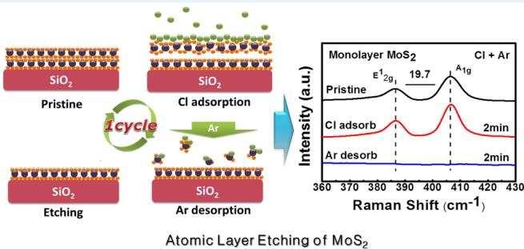
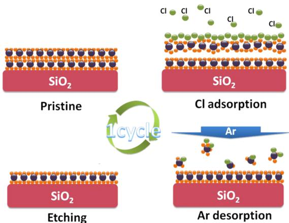
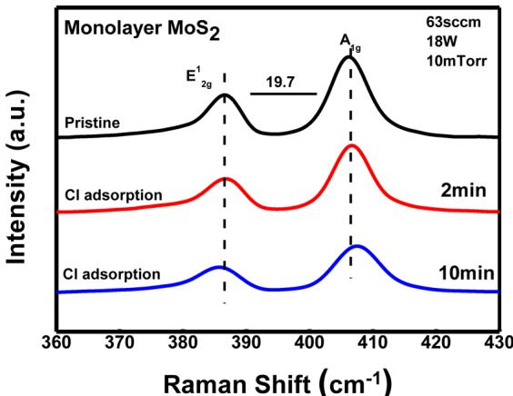
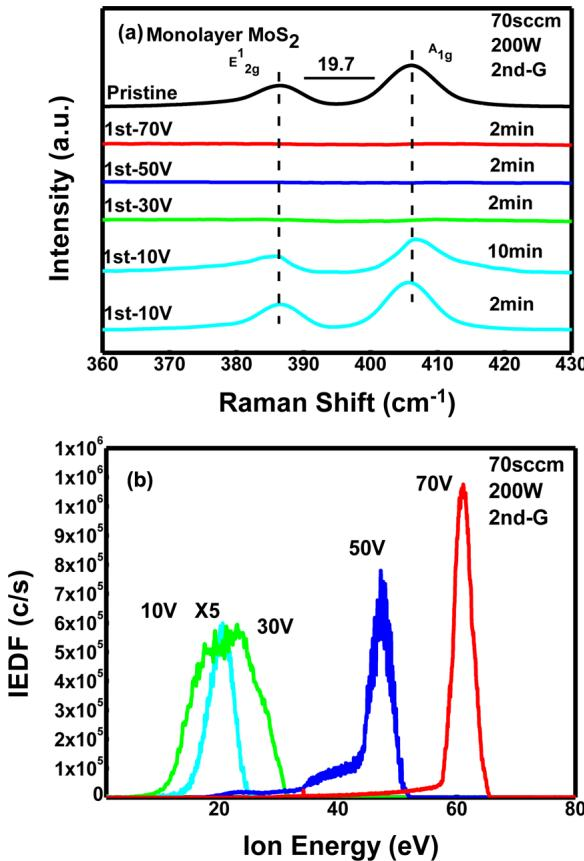
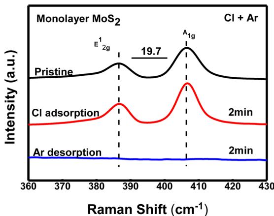
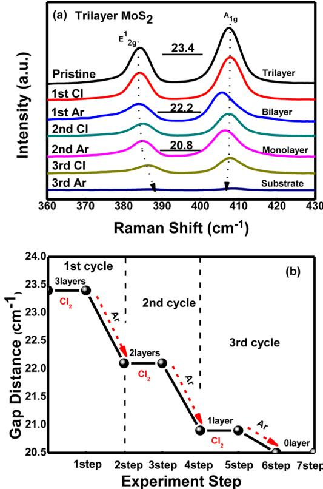
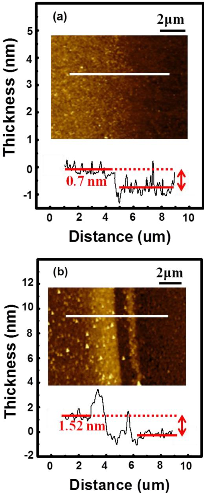
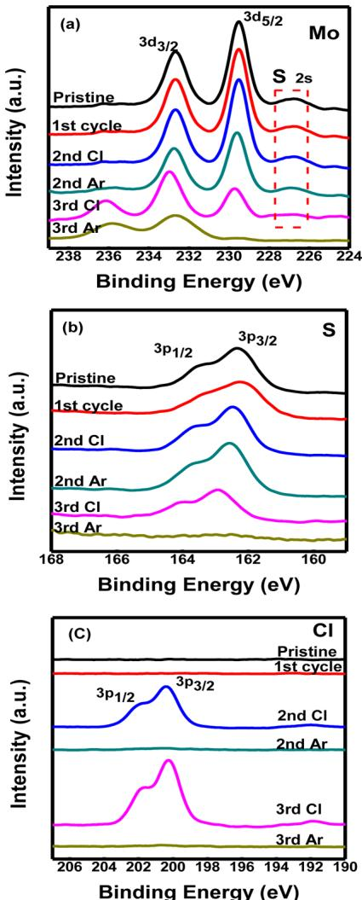

# Controlled Layer-by-Layer Etching of  $\mathrm{MoS}_2$

TaiZhe Lin, BaoTao Kang, MinHwan Jeon, Craig Huffman, JeaHoo Jeon, SungJoo Lee, Wei Han, JinYong Lee, SeHan Lee, GeunYoung Yeom, \*, and KyongNam Kim\*

$^{\dagger}$ Department of Advanced Materials Science and Engineering, Sungkyunkwan University, Suwon 440- 746, Korea   $^{\ddagger}$ SKKU Advanced Institute of Nano Technology (SAINT), Sungkyunkwan University, Suwon 440- 746, Korea   $^{\S}$ SEMATECH, 257 Fuller Road, Suite 2200, Albany, New York 12203, United States   $^{\parallel}$ Department of Physics, Jilin University, Changchun, Province of Jilin China   $^{\ddagger}$ Department of Chemistry, Sungkyunkwan University, Suwon 440- 746, Korea

Supporting Information

ABSTRACT: Two- dimensional (2D) metal dichalcogenides like molybdenum disulfide  $(\mathrm{MoS}_2)$  may provide a pathway to high- mobility channel materials that are needed for beyond- complementary metal- oxide- semiconductor (CMOS) devices. Controlling the thickness of these materials at the atomic level will be a key factor in the future development of  $\mathrm{MoS}_2$  devices. In this study, we propose a layer- by- layer removal of  $\mathrm{MoS}_2$  using the atomic layer etching (ALET) that is composed of the cyclic processing of chlorine (Cl)- radical adsorption and argon  $(\mathrm{Ar})^{+}$  ion- beam desorption.  $\mathrm{MoS}_2$  etching was not observed with only the Cl- radical adsorption or low- energy  $(< 20\mathrm{eV})$ $\mathrm{Ar}^{+}$  ion- beam desorption steps; however, the use of sequential etching that is composed of the Cl- radical adsorption step and a subsequent  $\mathrm{Ar}^{+}$  ion- beam desorption step resulted in the complete etching of one monolayer of  $\mathrm{MoS}_2$  . Raman spectroscopy, X- ray photoelectron spectroscopy (XPS), and atomic force microscopy (AFM) indicated the removal of one monolayer of  $\mathrm{MoS}_2$  with each ALET cycle; therefore, the number of  $\mathrm{MoS}_2$  layers could be precisely controlled by using this cyclical etch method. In addition, no noticeable damage or etch residue was observed on the exposed  $\mathrm{MoS}_2$

KEYWORDS:  $\mathrm{MoS}_2$ , atomic layer etching, layer by layer etching, two- dimensional (2D) material, adsorption, desorption, plasma

# 1. INTRODUCTION

Molybdenum disulfide  $(\mathrm{MoS}_2)$  is a typical layer- structured composite metal dichalcogenide composed of a  $\mathrm{S - Mo - S}$  crystal structure and is one of the newly investigated twodimensional (2D) electronic materials that is similar to graphene.1- 7 van der Waals force is dominant between the layers, while covalent bonds control the interaction within the layers.8- 12  $\mathrm{MoS}_2$  is a semiconducting material, and different band gap energies have been found for different numbers of  $\mathrm{MoS}_2$  layers. As the layers of material decrease, the band gap is enhanced from 1.29 to  $1.8\mathrm{eV}$  a monolayer is due to the quantum confinement effect). At the same time, with a decrease of the number of layers, a tendency from the indirect gap to the direct gap is observed between the conduction band and the valence band.

$\mathrm{MoS}_2$  has a stable crystal structure, does not react with strong acids, and has an electron mobility that can reach  $200~\mathrm{cm^2V^{- 1}}$ $\mathbf{s}^{- 1}$  at room temperature.11,12  $\mathrm{MoS}_2$  - monolayer field- effect transistors that have been fabricated with hafnium(IV) oxide  $\left(\mathrm{HfO}_2\right)$  as the gate dielectric show a current on/off ratio as high as  $1\times 10^{8}$  at room temperature and a very low standby- power dissipation; therefore, it can be used in the fabrication of 2D semiconductor nanodevices.13 The volume of  $\mathrm{MoS}_2$  is smaller than that of an Si crystal structure, and the mass of  $\mathrm{MoS}_2$  is lighter than the Si crystal structure when it obtains the same electron- mobility effect. At a steady state, the energy consumption is known to be lower than that of traditional Si transistors.14 Moreover,  $\mathrm{MoS}_2$  is investigated as a promising material for hydrogen evolution,15 transistors,16,17 and sensors,18 in addition to flexible electronics due to a high Young's modulus of approximately 33 TPa.19

The electronic properties of 2D materials and their application strongly depend on the number of layers; therefore, a simple and efficient method to control thickness is necessary. The chemical vapor deposition (CVD) method is widely investigated regarding the growth of large- area  $\mathrm{MoS}_2,$  but currently, it is difficult to control the layers of  $\mathrm{MoS}_2,$  especially for a low layer number, with this method. At present, only  $\mathrm{MoS}_2$  devices that use a  $\mathrm{MoS}_2$  flake obtained by exfoliation have a proven reliability.13,17

Instead of the control of  $\mathrm{MoS}_2$  layers by growth,  $\mathrm{MoS}_2$  layers can be controlled by removing the layers after synthesis. Recently, the use of argon  $(\mathrm{Ar})$  plasma to conduct the layer- by- layer etching of  $\mathrm{MoS}_2$  has been investigated by Liu et al., and the results showed the possibility of using sputter etching to achieve a monolayer  $\mathrm{MoS}_2$ ; however, their etching process resulted in physical damage to the sample surface, as detected by Raman spectroscopy.  ${ }^{19}$  Huang et al. controlled the  $\mathrm{MoS}_2$  layer thickness by using xerom difluoride  $\left(\mathrm{XeF}_2\right)$  etching, which formed volatile etch products such as molybdenum hexafluoride  $\left(\mathrm{MoF}_6\right)$  and sulfur hexafluoride  $\left(\mathrm{SF}_6\right)$  without damaging the sample.  ${ }^{11}$  Castellanos- Gomez et al. reported the use of a laser thinning technique on a multilayer  $\mathrm{MoS}_2$  film to achieve a monolayer, but this method showed drawbacks such as thermal damage to the bottom layer.  ${ }^{21}$  Thermal- annealing and oxygen- treatment methods have also been reported as approaches that can thin  $\mathrm{MoS}_2$ .  ${ }^{14,15,22}$  On the basis of an analysis of all of the currently reported techniques, however, the removed  $\mathrm{MoS}_2$  depth can only be controlled by etch time, and a precise control of the number of  $\mathrm{MoS}_2$  layers at the atomic scale cannot be achieved.

Previously, in the etching of various semiconducting materials, the atomic layer etching technique (ALET) has shown promising results for next- generation devices due to characteristics such as precise atomic- scale control of the etch depth, extreme uniformity over a large wafer area, and low levels of damage and contamination.  ${ }^{23- 26}$  In this research, we propose the ALET as a precise layer- by- layer etching technique for  $2\mathrm{D}\mathrm{MoS}_2$  material. Using ALET, we investigated the possibility of removing one monolayer of  $\mathrm{MoS}_2$  through the chemical absorption and physical desorption of the cyclic reaction. Also, the possibility of obtaining one monolayer of  $\mathrm{MoS}_2$  from a trilayer  $\mathrm{MoS}_2$  formation without inducing damage and contamination on the remaining  $\mathrm{MoS}_2$  layers was explored.

# 2. EXPERIMENTAL SECTION

The 2D  $\mathrm{MoS}_2$  layers that had been synthesized using the CVD method (shown in Figure S1 in Supporting Information) were etched layer by layer using a two- step ALET. First, chlorine radicals that were generated from an inductively coupled plasma (ICP) system were adsorbed onto the  $\mathrm{MoS}_2$  surface. Then, the chlorinated  $\mathrm{MoS}_2$  surface was removed using a low- energy  $\mathrm{Ar}^+$  ion beam.

During Cl- radical adsorption, ion bombardment was significantly reduced by installing a grounded, metal mesh grid between the ICP source and the substrate. The  $\mathrm{Cl}_2$  plasma for adsorption was generated with 63 sccm of  $\mathrm{Cl}_2$  and  $18\mathrm{W}13.56\mathrm{MHz}$  radio frequency (rf) source power at  $10\mathrm{mTorr}$  pressure. For the desorption step, the samples were transferred to a dual- grid  $\mathrm{Ar}^+$  ion- beam system. The process conditions were 70 sccm of  $\mathrm{Ar}$ ,  $200\mathrm{W}13.56\mathrm{MHz}$  ICP power, and 6.7 mTorr pressure. An extraction grid voltage of between  $+10$  and  $+100$  V was used to accelerate the  $\mathrm{Ar}^+$  ion, while the outside grid of the ion- beam system was grounded. (For schematic diagrams of the ICP systems used for the adsorption of the Cl radical and the  $\mathrm{Ar}^+$  ion- beam system used to desorb the chemisorbed  $\mathrm{MoS}_2$  layer, see Figure S2, (a) and (b).) The ion flux and energy distribution of the  $\mathrm{Ar}^+$  ion beam were measured using a quadruple mass spectrometer with an ion energy analyzer (Hiden Analytical Ltd., EQP1000) that was located close to the sample location (shown in Figure S2, (b)).

The numbers of  $\mathrm{MoS}_2$  layers before and after the layer- by- layer etching were estimated using Raman spectroscopy (WITEC 2000, 532 nm wavelength, installed with a grating of 1800 grooves/m and a spectral center of  $600~\mathrm{cm^{- 1}}$ ). The thickness was determined by measuring the shift of the Raman peaks at the  $\mathrm{E}_{2\mathrm{g}}^1$  and  $\mathrm{A_{1\mathrm{g}}}$  peaks. The thickness of the  $\mathrm{MoS}_2$  was also measured using atomic force microscopy (AFM, INOVA microscope by Bruker) and a sample patterned by photoresist; the photoresist was removed before the measurement with AFM. The chemical binding states of the  $\mathrm{MoS}_2$  surface before and after the Cl- radical adsorption and before and after the  $\mathrm{Ar}^+$  ion desorption were observed using X- ray photoelectron spectroscopy (XPS, Thermo VG, Multilab 2000).

# 3. RESULTS AND DISCUSSION

The schematic diagram of the atomic layer etching of  $\mathrm{MoS}_2$  using the adsorption of Cl radicals and the desorption of Cl- adsorbed  $\mathrm{MoS}_2$  is shown in Figure 1. Since Cl is a better oxidizing agent than  $\mathrm{S}$ , the adsorbed Cl on the  $\mathrm{MoS}_2$  surface weakens the covalent bonding between the outermost electrons in  $\mathrm{Mo}4\mathrm{d}^{5}\mathrm{fs}^{1}$  and  $3\mathrm{Sc}^{6}$ . The bond angle is changed and the bond length is increased by the movement of Mo electrons toward the surface Cl atom; therefore, the adsorption of Cl on  $\mathrm{MoS}_2$  not only changes the Mo- S binding energy but also decreases the van der Waals force between the  $\mathrm{MoS}_2$  layers.  ${ }^{27- 29}$  The weakened Cl- adsorbed  $\mathrm{MoS}_2$  top layer was physically desorbed by the ion bombardment from a low- energy  $\mathrm{Ar}^+$  ion beam during the desorption step. The  $\mathrm{Ar}^+$  ion bombardment not only breaks the Mo- S binding in the layer but also removes the broken  $\mathrm{MoS - Cl / S - Cl}$  from the  $\mathrm{MoS}_2$  surface. This process will continue until all of the broken  $\mathrm{MoS - Cl / S - Cl}$  species are removed and the next  $\mathrm{MoS}_2$  layer is exposed.

  
Figure 1. Schematic drawing of  $\mathrm{MoS}_2$  ALET cycle for the layer-by-layer etching.

During Cl- radical adsorption, the  $\mathrm{MoS}_2$  layer should not be chemically etched by the plasma etching, which involves the synergic effect of Cl- radical adsorption and  $\mathrm{Cl}^+$  ion bombardment. The removal of these reactive  $\mathrm{Cl}^+$  ions is accomplished by the grounded, metal mesh grid that was installed between the ion beam and wafer surface, as shown in Figure S2. Figure 2 shows the Raman spectra of one monolayer of  $\mathrm{MoS}_2$  before and after Cl- radical exposure. The monolayer  $\mathrm{MoS}_2$  surface was exposed to the Cl radicals for 2 and  $10\mathrm{min}$ . As shown in Figure 2, for the pristine  $\mathrm{MoS}_2$ , two peaks related to the  $\mathrm{E}_{12\mathrm{g}}^1$  and  $\mathrm{A_{1\mathrm{g}}}$  peaks of the  $\mathrm{MoS}_2$  crystal were observed at  $386.4~\mathrm{cm^{- 1}}$  (in- plane vibration mode) and  $406.1~\mathrm{cm^{- 1}}$  (out- of- plane vibration mode), respectively; therefore, the gap between the two peaks was about  $19.7~\mathrm{cm^{- 1}}$ , indicating the monolayer  $\mathrm{MoS}_2$ . The width of the Raman peaks of the monolayer  $\mathrm{MoS}_2$  that was measured after the Cl- radical exposures of 2 and  $10\mathrm{min}$  was not changed; therefore, the Cl exposure did not etch the monolayer  $\mathrm{MoS}_2$ .

During the desorption step, the weakened Cl- adsorbed  $\mathrm{MoS}_2$  bonds were broken and desorbed by the  $\mathrm{Ar}^+$  ion bombardment.

  
Figure 2. Raman spectra of one monolayer of  $\mathrm{MoS}_2$  before and after the exposure to the Cl plasma for the Cl-radical-adsorption step up to  $10\mathrm{min}$ . No change in the Raman spectra of the  $\mathrm{MoS}_2$  was observed, even after a  $10\mathrm{min}$  exposure.

Ion- energy control is critical for the desorption of the Cl- modified  $\mathrm{MoS}_2$  surface. If the energy is too high, then the unreacted  $\mathrm{MoS}_2$  is damaged; conversely, if the ion energy is too low, no amount of material is removed. During the  $\mathrm{Ar^{+}}$  ion exposure for the desorption step, the energy of the  $\mathrm{Ar^{+}}$  ion was varied to investigate the  $\mathrm{Ar^{+}}$  ion- energy window during the desorption step. Figure 3a shows the Raman spectra of the monolayer  $\mathrm{MoS}_2$  before and after the  $\mathrm{Ar^{+}}$  ion exposure at different grid voltages, which controls the energy of the  $\mathrm{Ar^{+}}$  ions bombarding the  $\mathrm{MoS}_2$  surface. As shown in the figure, when the  $\mathrm{MoS}_2$  was exposed to the  $\mathrm{Ar^{+}}$  ion source for  $2\mathrm{min}$  with a grid voltage higher than  $+30\mathrm{V}$ , no Raman peaks were observed, indicating that the  $\mathrm{MoS}_2$  was removed. However, when the  $\mathrm{MoS}_2$  was exposed to the  $\mathrm{Ar^{+}}$  ion beam using a grid voltage of  $+10\mathrm{V}$  for 2 and  $10\mathrm{min}$ , no change was observed. This indicates that there was no change to the  $\mathrm{MoS}_2$  material when  $+10\mathrm{V}$  was used to accelerate the  $\mathrm{Ar^{+}}$  ion beam. Figure 3b shows the  $\mathrm{Ar^{+}}$  ion- energy distribution that was measured using an ion- energy analyzer during the  $\mathrm{Ar^{+}}$  ion- desorption step for different grid voltages between  $+10$  and  $+70\mathrm{V}$ . As shown in Figure 3b, the ion energy distribution for  $+10\mathrm{V}$  grid voltage showed a nearly monoenergetic  $\mathrm{Ar^{+}}$  ion beam, with an energy peak at approximately  $+20\mathrm{eV}$ $(10 - 25\mathrm{eV})$ .

Figure 4 shows the Raman spectra in sequence following the previously described optimized- process step on the monolayer  $\mathrm{MoS}_2$  sample. For the Cl- radical adsorption step,  $2\mathrm{min}$  of Cl- radical exposure time was used, and for the  $\mathrm{Ar^{+}}$  ion desorption step,  $2\mathrm{min}$  exposure time with  $+10\mathrm{V}$  of grid voltage was used. As previously shown, no change was detected in the peak width between the pristine and Cl- exposed steps; however, when the Cl- modified  $\mathrm{MoS}_2$  was exposed to the  $\mathrm{Ar^{+}}$  ion- desorption step, no peaks were detected, indicating that the monolayer  $\mathrm{MoS}_2$  was completely removed. It is therefore expected that during the Cl- adsorption step, the  $\mathrm{MoS}_2$  binding energy is weakened by chlorine adsorbing onto the  $\mathrm{MoS}_2$  and is then removed during the desorption step by the controlled  $\mathrm{Ar^{+}}$  ion energy.

Controlled thinning of multilayer  $\mathrm{MoS}_2$  may be possible using the above- described process. To demonstrate, a trilayer  $\mathrm{MoS}_2$  sample was exposed to three cycles of ALET and Raman spectra were collected between each step. Figure 5a and Figure 5b show the Raman spectra and the peak distance between the  $\mathrm{E}^1_{2\mathrm{g}}$  and  $\mathrm{A_{1g}}$  peaks, respectively, as the process progresses through each step. It is known that with a decrease of the  $\mathrm{MoS}_2$  layer thickness, the peak distance between the  $\mathrm{E}_{2\mathrm{g}}^{1}$  and  $\mathrm{A_{1g}}$  peaks is decreased to a specific value, depending on the number of  $\mathrm{MoS}_2$  layers.  ${}^{6,11,12,16,30}$  As shown in Figure 5a and Figure 5b, during the Cl- adsorption step, the peak distance does not change; however, after each  $\mathrm{Ar^{+}}$  ion- desorption step, the gap

  
Figure 3. (a) Raman spectra of one monolayer  $\mathrm{MoS}_2$  exposed to different  $\mathrm{Ar^{+}}$  ion energies for  $2\mathrm{min}$  by changing the first grid voltages of the ICP ion gun. For  $+10\mathrm{V}$  of the first grid voltage,  $10\mathrm{min}$  exposure to the  $\mathrm{Ar^{+}}$  ion beam is also included. (b)  $\mathrm{Ar^{+}}$  ion energy distribution for  $+10\mathrm{V}$  to  $+70\mathrm{V}$  of the first grid voltage measured using a quadruple mass spectrometer with an ion energy analyzer. For the  $\mathrm{Ar^{+}}$  ICP ion gun operation,  $70\mathrm{scm}$  of  $\mathrm{Ar}$  and  $13.56\mathrm{MHz}$ $200\mathrm{W}$  rf power were applied to the ICP source. "X5" means that the actual ion-energy distribution of  $+10\mathrm{V}$  is  $5$  times smaller than that shown in the figure.

  
Figure 4. Raman spectra of pristine  $\mathrm{MoS}_2$  monolayer, after  $\mathrm{Cl}_2$  adsorption for  $2\mathrm{min}$ , and after  $\mathrm{Ar^{+}}$  ion desorption for  $2\mathrm{min}$ , sequentially, resulting in the etching of one monolayer of  $\mathrm{MoS}_2$ .

  
Figure 5. Raman spectra of trilayer  $\mathrm{MoS}_2$  after each step of ALET for three cycles: (a) Raman spectra of  $\mathrm{MoS}_2$  during each step of ALET; (b) change of the gap distance between  $\mathrm{E}_{12}^{1}$  and  $\mathrm{A_{1g}}$  of the  $\mathrm{MoS}_2$  Raman spectra during each step of the three ALET cycles.

between the  $\mathrm{E}_{12}^{1}$  and  $\mathrm{A_{1g}}$  peaks decreased by a specific value related to monolayer- to- bilayer  $\mathrm{MoS}_2$ . (In addition to the CVD  $\mathrm{MoS}_2$ , a similar ALET experiment was carried out using trilayer  $\mathrm{MoS}_2$  flakes obtained from crystal  $\mathrm{MoS}_2$ . The trilayer  $\mathrm{MoS}_2$  was etched using the same ALET cycle, and after one ALET cycle, the peak distance decreased to the specific value related to bilayer  $\mathrm{MoS}_2$ . See Figure S3. ) Also, when the  $\mathrm{MoS}_2$  structure is distorted by the physical ion bombardment, the  $\mathrm{E}_{1\mathrm{u}}^{2}$  peak near  $379~\mathrm{cm}^{- 1}$  is known to appear because of the Raman edge effect that is caused by the distortion of the  $\mathrm{MoS}_2$  structure, but as shown in Figure 5a, no such peak was observed. It can therefore be understood that during each ALET cycle, one monolayer  $\mathrm{MoS}_2$  was completely removed without noticeably damaging the exposed  $\mathrm{MoS}_2$  underlayer.

In addition to Raman spectroscopy, the change of the  $\mathrm{MoS}_2$  layer during the ALET cycles was measured using AFM. For this measurement, a trilayer  $\mathrm{MoS}_2$  film was masked with photoresist and exposed to one and two ALET cycles. The photoresist was removed by acetone, and the step was measured using AFM. Figure 6a) and Figure 6b show the AFM data after a single cycle of ALET for the monolayer  $\mathrm{MoS}_2$  and two cycles of ALET for the trilayer  $\mathrm{MoS}_2$ , respectively. As shown in Figure 6a, after one ALET cycle, the measured etch step of the  $\mathrm{MoS}_2$  was about  $0.7 \mathrm{nm}$ , which is a little thicker than the theoretical value of  $0.65 \mathrm{nm}$ . Previous investigations have shown that because of the trapping of  $\mathrm{H}_2\mathrm{O}$  on the  $\mathrm{SiO}_2$  substrate, the monolayer  $\mathrm{MoS}_2$  thickness may be slightly greater than the theoretical value; therefore, we believe that one  $\mathrm{MoS}_2$  layer was completely etched after one ALET cycle. After the two cycles of ALET, as shown in Figure 6b, about  $1.52 \mathrm{nm}$  of etch depth, which is close to the thickness of two  $\mathrm{MoS}_2$  layers, was observed.

  
Figure 6. AFM step height (a) after one ALET cycle of one monolayer of  $\mathrm{MoS}_2$  and (b) after two ALET cycles of trilayer  $\mathrm{MoS}_2$ . The  $\mathrm{MoS}_2$  was patterned with a photoresist, and the photoresist was removed after the ALET for the measurement of the etch height using AFM. The big step heights at the boundary (two bright lines on the optical microscopic picture) are due to the photoresist residue remaining even after the photoresist removal to measure the etch step after two ALET cycles.

Figure 7 shows the narrow- scan XPS data of (a) Mo, (b) S, and (c) Cl that were measured during each step of the three cycles of ALET for the trilayer  $\mathrm{MoS}_2$ . As shown in Figure 7a, the peaks at 229.5 and  $232.6 \mathrm{eV}$  that relate to the orbital binding energy of Mo  $3\mathrm{d}_{5 / 2}$  and Mo  $3\mathrm{d}_{3 / 2}$  were observed after the third Cl- adsorption step; but after the third desorption step, these peaks were removed and distorted. We believe that the remaining peak of Mo after the third  $\mathrm{Ar}^+$  ion- desorption step is related to the diffusion of the Mo into the  $\mathrm{SiO}_2$  or the oxidized Mo particle on the  $\mathrm{SiO}_2$ , because the peak positions of the remaining Mo after the third  $\mathrm{Ar}^+$  ion- desorption step are

  
Figure 7. Narrow-scan XPS data of (a) Mo 3d, (b) S 2p, and (c) Cl 2p that were measured during each step of the three ALET cycles for the trilayer  $\mathrm{MoS}_2$ .

exactly matched with those of the Mo  $3\mathrm{d}_{3 / 2}$ $(236.3\mathrm{eV})$  and Mo  $3\mathrm{d}_{5 / 2}$ $(232.6\mathrm{eV})$  that are related to  $\mathrm{MoO}_3$ . Figure 7b shows the two peaks at 162.3 and  $165.6\mathrm{eV}$  that are related to the binding energy of S  $2\mathrm{p}_{3 / 2}$  and S  $2\mathrm{p}_{1 / 2}$ . These peaks are present throughout the third Cl- adsorption step but are not detected after the third  $\mathrm{Ar}^+$  exposure, indicating the complete removal of the third  $\mathrm{MoS}_2$  layer. In the case of Cl, the large peak at 200.2 eV was only observed after the Cl- adsorption step; this peak was not detected after the  $\mathrm{Ar}^+$  ion- desorption step, indicating that the Cl adsorption on the  $\mathrm{MoS}_2$  during the radical- adsorption step was removed during the  $\mathrm{Ar}^+$  ion desorption. From the XPS results, the precise removal of one  $\mathrm{MoS}_2$  layer by one ALET cycle from the use of this method is therefore expected.

In the XPS narrow- scan data of Mo in Figure 7a, an additional peak at  $227\mathrm{eV}$  is also shown and it remains until the Cl- adsorption step of the third ALET cycle. We found that this peak is related to the 2D  $\mathrm{MoS}_2$  structure, and when the 2D  $\mathrm{MoS}_2$  structure is damaged, the peak intensity decreased in addition to the emergence of an additional peak at  $236\mathrm{eV}$  related to  $\mathrm{Mo}^{6 + }$  (see Figure S4). In the case of S, when the  $\mathrm{MoS}_2$  is damaged, the S  $2\mathrm{p}_{1 / 2}$  peak decreased (see Figure S4); however, as shown in Figure 7a and Figure 7b, the peak related to the 2D  $\mathrm{MoS}_2$  structure was not removed, and no peak related to the  $\mathrm{Mo}^{6 + }$  was observed until the  $\mathrm{Ar}^+$  ion- desorption step of the third ALET cycle. Also, a decrease of the S  $2\mathrm{p}_{1 / 2}$  peak was not found until the third ALET cycle. It is therefore believed that by using this ALET, a multilayer  $\mathrm{MoS}_2$  can be etched precisely layer- by- layer without noticeably damaging the exposed  $\mathrm{MoS}_2$  underlayer.

# 4. CONCLUSIONS

We have demonstrated that the thickness of a multilayer  $\mathrm{MoS}_2$  can be controlled layer- by- layer using Cl- radical adsorption and  $\mathrm{Ar}^+$  ion desorption in accordance with the ALET. Raman spectra, AFM data, and XPS data suggest that one monolayer of  $\mathrm{MoS}_2$  can be etched with one ALET cycle; therefore, the precise control of the etch layer can presumably be achieved using the ALET. Moreover, no Cl residue and no noticeable damage were found on the remaining  $\mathrm{MoS}_2$  underlayer after each ALET cycle. We believe that this ALET method can also be applicable when precisely controlling the layers of other 2D materials such as  $\mathrm{MoSe}_2$ ,  $\mathrm{WS}_2$ , and  $\mathrm{BN}$ ; therefore, it can be utilized as a useful engineering tool for controlling the properties of next- generation 2D devices without inducing residue and damage.

# ASSOCIATED CONTENT

# $\bullet$  Supporting Information

Figures showing CVD system, ICP system, microscope pictures and Raman spectra, and XPS data. The Supporting Information is available free of charge on the ACS Publications website at DOI: 10.1021/acsami.5b03491.

# AUTHOR INFORMATION

Corresponding Authors \*G.Y.: e- mail, gyyeom@skku.edu. \*K.K.: e- mail, knam1004@skku.edu.

# Notes

The authors declare no competing financial interest.

# ACKNOWLEDGMENTS

This work was supported by SEMATECH through the SRC Project (2013- SE- 2492) and also supported by Nano Material Technology Development Program through the National Research Foundation of Korea (NRF) funded by the Ministry of Education, Science and Technology (2012M3A7B4035323).

# REFERENCES

(1) Tsukamoto, T.; Ogino, T. Control of Graphene Etching by Atomic Structures of the Supporting Substrate Surfaces. J. Phys. Chem. C 2011, 115, 8580-8585. 
(2) Novoselov, K. S.; Geim, A. K.; Morozov, S. V.; Jiang, D.; Zhang, Y.; Dubonos, S. V.; Grigorieva, I. V.; Firsov, A. A. Electric Field Effect in Atomically Thin Carbon Films. Science 2004, 306, 666-669. 
(3) Novoselov, K.; Geim, A. K.; Morozov, S.; Jiang, D.; Grigorieva, M. K. I.; Dubonos, S.; Firsov, A. Two-Dimensional Gas of Massless Dirac Fermions in Graphene. Nature 2005, 438, 197-200. 
(4) Zhang, Y. B.; Tan, Y. W.; Stormer, H. L.; Kim, P. Experimental Observation of the Quantum Hall Effect and Berry's Phase in Graphene. Nature 2005, 438, 201-204. 
(5) Tsukamoto, T.; Ogino, T. Morphology of Graphene on Step-Controlled Sapphire Surfaces. Appl. Phys. Express 2009, 2, 075502. 
(6) Yang, S.; Li, Y.; Wang, X.; Huo, N.; Xia, J.; Li, S.; Li, J. High Performance Few-Layer GaS Photodetector and Its Unique Photo-Response in Different Gas Environments. Nanoscale 2014, 6, 2582-2587.

(7) Yang, S.; Tongay, S.; Yue, Q.; Li, Y.; Li, B.; Lu, F. High-Performance Few-Layer Mo-Doped  $\mathrm{ReS}_2$  Nanosheet Photodetectors. Sci. Rep. 2014, 4, 5442. 
(8) Lee, C.; Yan, H.; Brus, L.; Heinz, T.; Hone, J.; Ryu, S. Anomalous Lattice Vibrations of Single-and Few-Layer  $\mathrm{MoS}_2$ . ACS Nano 2010, 4 (5), 2695-2700. 
(9) Li, B.; Yang, S.; Huo, N.; Li, Y.; Yang, J.; Li, R.; Fan, C.; Lu, F. Growth of Large Area Few-Layer or Monolayer  $\mathrm{MoS}_2$  from Controllable  $\mathrm{MoO}_3$  Nanowire Nuclei. RSC Adv. 2014, 4, 26407-26412. 
(10) Yang, S.; Kang, J.; Yue, Q.; Yao, K. Vapor Phase Growth and Imaging Stacking Order of Bilayer Molybdenum Disulfide. J. Phys. Chem. C 2014, 118, 9203-9208. 
(11) Huang, Y.; Wu, J.; Xu, X.; Ho, Y.; Ni, G.; Zou, Q.; Koon, G. K. W.; Zhao, W.; Neto, A.; Eda, G.; Shen, C.; Ozyilmaz, B. An Innovative Way of Etching  $\mathrm{MoS}_2$ : Characterization and Mechanistic Investigation. Nano Res. 2013, 6, 200-207. 
(12) Brown, N.; Cui, N.; Mckinley, A. An XPS Study of the Surface Modification of Natural  $\mathrm{MoS}_2$  Following Treatment in an RF-Oxygen Plasma. Appl. Surf. Sci. 1998, 134, 11-21. 
(13) Radisavlievic, B.; Radenovic, A.; Brivio, J.; Giacometti, V.; Kis, A. Single-Layer  $\mathrm{MoS}_2$  Transistors. Nat. Nanotechnol. 2011, 6, 147-150. 
(14) Welser, J.; Takaqi, S.-I.; Gibbons, J. F. Strain Dependence of the Performance Enhancement in Strained-Si n-MOSFETs. IEDM Technical Digest, International Electron Devices Meeting, San Francisco, CA, December 11-14, 1994; Institute of Electrical and Electronics Engineers: Piscataway, NJ, 1994; pp 373-376. 
(15) Wu, J.; Li, H.; Yin, Z.; Li, H.; Liu, H.; Liu, J.; Cao, X.; Zhang, Q.; Zhang, H. Layer Thinning and Etching of Mechanically Exfoliated  $\mathrm{MoS}_2$  Nanosheets by Thermal Annealing in Air. Small 2013, 19, 3314-3319. 
(16) Yin, Z.; Li, H.; Jiang, L.; Shi, Y.; Sun, Y.; Lu, G.; Zhang, Q.; Chen, X.; Zhang, H. Single-Layer  $\mathrm{MoS}_2$  Phototransistors. ACS Nano 2011, 6, 74-80. 
(17) Zeng, Z.; Yin, Z.; Huang, X.; Li, H.; He, Q.; Lu, G.; Boev, F.; Zhang, H. Single-Layer Semiconducting Nanosheets: High-Yield Preparation and Device Fabrication. Angew. Chem., Int. Ed. 2011, 50, 11093-11097. 
(18) Subhamov, G.; Atindra Nath, P.; Arindam, G. Nature of Electronic States in Atomically Thin  $\mathrm{MoS}_2$  Field-Effect Transistors. ACS Nano 2011, 5, 7707-7712. 
(19) Fu, Y.; Feng, X.; Yan, M. F.; Wang, S. Y. First Principle Study on Electronic Structure and Optical Phonon Properties of 2H-MoS2. Physica B 2013, 426, 103-107. 
(20) Laura, G.; Juan, P.; Ruben, R.; Silvia, V. R.; Amelia, M. A.; Tascon, J. M. D. Production of Aqueous Dispersions of Inorganic Graphene Analogues by Exfoliation and Stabilization with Non-Ionic Surfactants. RSC Adv. 2014, 4, 14115-14127. 
(21) Andres, C. G.; Maria, B.; Goossens, A. M.; Calado, V. E.; Zant, V. D.; Herre, S. J.; Steele, G. A. Laser-Thinning of  $\mathrm{MoS}_2$ : On Demand Generation of a Single-Layer Semiconductor. Nano Lett. 2012, 12, 3187-3192. 
(22) Yamamoto, M.; Einstein, T.; Fuhrer, M. S.; Cullen, W. G. Anisotropic Etching of Atomically Thin  $\mathrm{MoS}_2$ . J. Phys. Chem. C 2013, 117 (48), 25643-25649. 
(23) Lim, W. S.; Kim, Y. Y.; Kim, H. K.; Jang, S.; Kwon, N. Y.; Park, B. J.; Ahn, J. H.; Chung, L.; Hong, B. H.; Yeom, G. Y. Atomic Layer Etching of Graphene for Full Graphene Device Fabrication. Carbon 2012, 50, 429-435. 
(24) Min, K. S.; Kang, S. H.; Kim, J. K.; Jhon, M. S.; Yeom, G. Y. Atomic Layer Etching of  $\mathrm{Al}_2\mathrm{O}_3$  using  $\mathrm{BCl}_3$  Ar for the Interface Passivation Layer of III-V MOS Devices. Microelectron. Eng. 2013, 110, 457-460. 
(25) Kim, Y. Y.; Lim, W. S.; Park, J. B.; Yeom, G. Y. Layer by Layer Etching of the Highly Oriented Pyrolytic Graphite by Using Atomic Layer Etching. J. Electrochem. Soc. 2011, 158, D710-D714. 
(26) Min, K. S.; Kang, S. H.; Kim, J. K.; Jhon, Y. I.; Hudnall, T. W.; Bielawski, C. W.; Banerjee, S. K.; Bersuker, G.; Jhon, M. S. Atomic

Layer Etching of BeO Using  $\mathrm{BCl}_3$  Ar for the Interface Passivation Layer of III- V MOS Devices. Microelectron. Eng. 2014, 114, 121- 125. (27) Lim, W. S.; Park, J. B.; Park, B. J.; Yeom, G. Y. Low Damage Atomic Layer Etching of  $\mathrm{ZrO}_2$  by Using  $\mathrm{BCl}_3$  Gas and Ar Neutral Beam. J. Nanosci. Nanotechnol. 2009, 9, 7379- 7382. (28) Park, J. B.; Lim, W. S.; Park, B. J.; Park, I. H.; Kim, Y. W.; Yeom, G. Y. Atomic Layer Etching of Ultra- Thin  $\mathrm{HfO}_2$  Film for Gate Oxide in MOSFET Devices. J. Phys. D 2009, 42, 755202. (29) Jhon, Y. I.; Min, K. S.; Yeom, G. Y.; Jhon, Y. M. Understanding Time- Resolved Processes in Atomic- Layer Etching of Ultra- Thin  $\mathrm{Al}_2\mathrm{O}_3$  Film Using  $\mathrm{BCl}_3$  and Ar Neutral Beam. Appl. Phys. Lett. 2014, 105, 093104. (30) Liu, Y. L.; Nan, H.; Wu, X.; Pan, W.; Wang, W.; Bai, J.; Zhao, W.; Sun, L.; Wang, X.; Ni, Z. Layer by Layer Thinning of  $\mathrm{MoS}_2$  by Plasma. ACS Nano 2013, 7, 4202- 4209. (31) Lee, H. C.; Lee, M. H.; Chung, C. W. Experimental Observation of the Transition from Nonlocal to Local Electron Kinetics in Inductively Coupled Plasmas. Appl. Phys. Lett. 2010, 96, 041503. (32) Lee, Y. B.; Lee, J. H.; Bark, H.; Oh, H. K.; Ryu, G. H.; Lee, Z. H.; Kim, H. Q.; Cho, J. H.; Ahn, J. H.; Lee, C. G. Synthesis of Wafer- Scale Uniform Molybdenum Disulfide Films with Control over the Layer Number Using a Gas Phase Sulfur Precursor. Nanoscale 2014, 6, 2821- 2826.