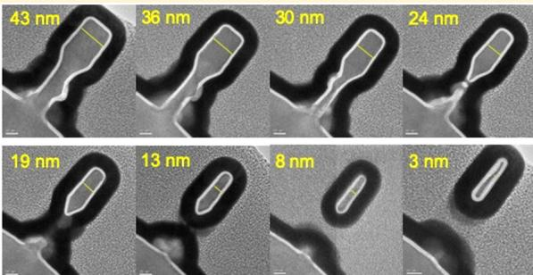
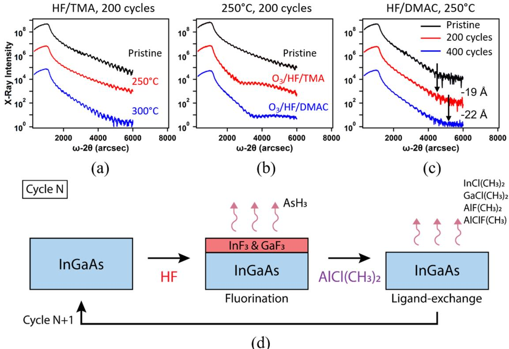
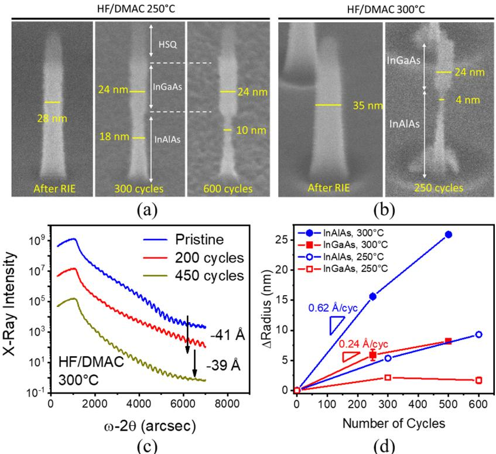
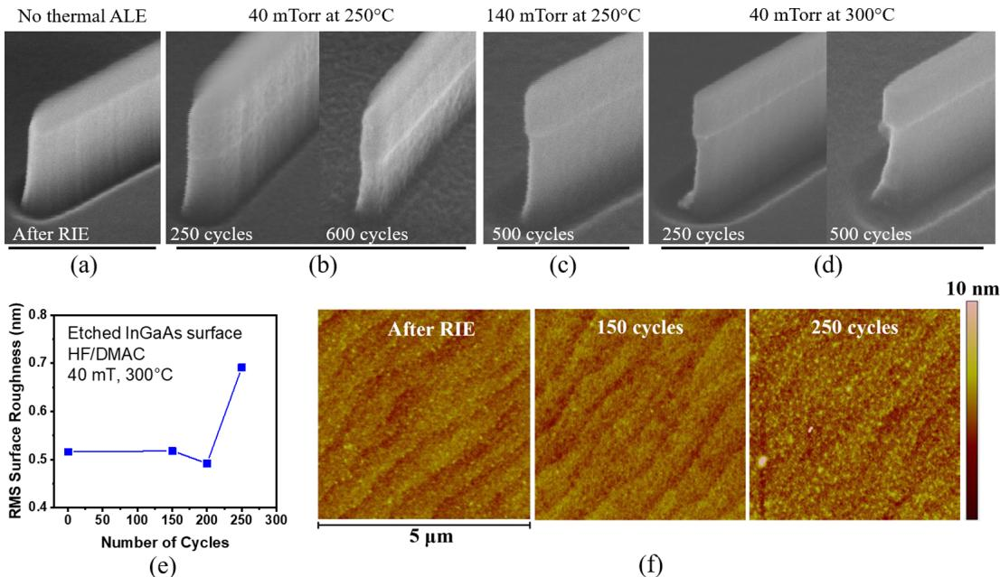
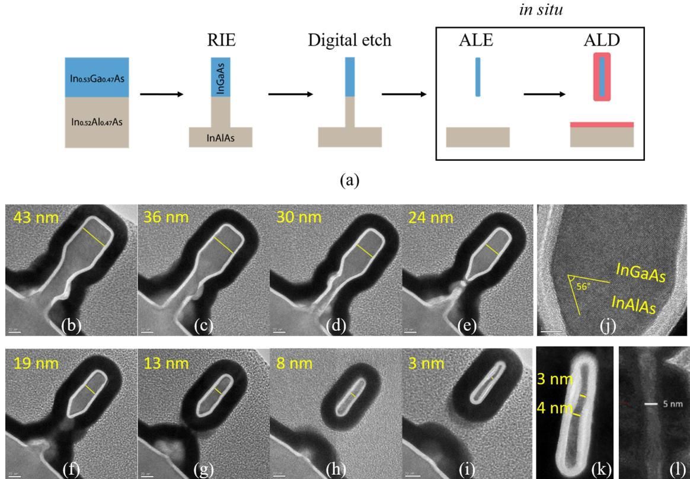
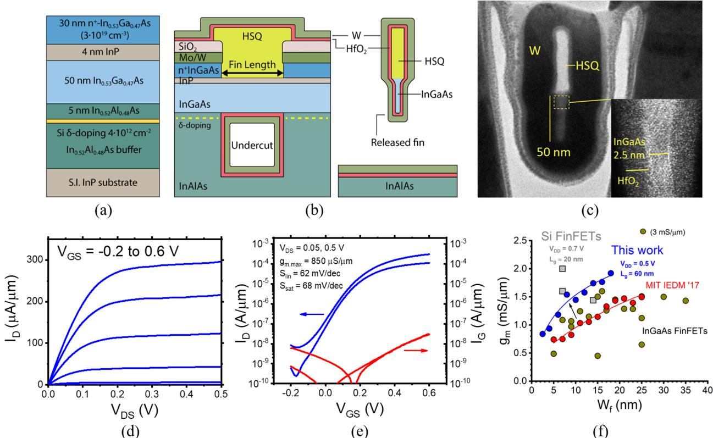

# In Situ Thermal Atomic Layer Etching for Sub-5 nm InGaAs Multigate MOSFETs

Wenjie Lu,\* Younghee Lee, Jonas C. Gertsch, Jessica A. Murdzek, Andrew S. Cavanagh, Lisa Kong, Jesus A. del Alamo, and Steven M. George\*

Microsystems Technology Laboratories, Massachusetts Institute of Technology, Cambridge, Massachusetts 02139, United States Department of Chemistry, University of Colorado, Boulder, Colorado 80309, United States

Supporting Information

ABSTRACT: Thermal atomic layer etching (ALE) was demonstrated on ternary III- V compound semiconductors. In particular, thermal ALE on InGaAs and InAlAs was achieved with sequential, self- limiting fluorination and ligand- exchange reactions using hydrogen fluoride (HF) as the fluorination reactant and dimethylaluminum chloride (DMAC) as the ligand- exchange reactant. Thermal ALE was investigated on planar surfaces and three- dimensional nanostructures. The measured radial etch rates on  $\mathrm{In}_{0.53}\mathrm{Ga}_{0.47}\mathrm{As}$  and  $\mathrm{In}_{0.52}\mathrm{Al}_{0.48}\mathrm{As}$  vertical nanowires (VNWs) at 300  $^\circ \mathrm{C}$  were 0.24 and 0.62 A/cycle, respectively. An optimized thermal ALE process did not increase the surface roughness after 200 cycles.

The etching process also displayed selectivity and orientation dependence. This new thermal ALE process in combination with in situ atomic layer deposition (ALD) was used to fabricate InGaAs gate- all- around structures with minimum width down to 3 nm. The in situ ALK- ALD process produced a sharp vertical MOS interface. Finally, the merits of thermal ALE were demonstrated in the fabrication of n- channel InGaAs FinFETs with record ON- state and OFF- state transistor performance. On the basis of this transistor demonstration, thermal ALE shows great promise for high- volume device manufacturing.

KEYWORDS: Atomic layer etching, III- V semiconductors, InGaAs, nanowires, FinFETs, ligand- exchange

As complementary metal oxide semiconductor (CMOS) technology continues to scale following Moore's law, device fabrication has entered the era of nanoscale three- dimensional (3D) structures. Since the introduction of Si multigate metal- oxide- semiconductor field- effect transistors (MOSFETs), there has been a relentless effort using smaller and higher aspect ratio structures to overcome short- channel effects and achieve higher current density. State- of- the- art Si FinFETs have fin widths  $(W_{\mathrm{f}})$  as narrow as  $7\mathrm{nm}$  and fin heights  $(H_{\mathrm{f}})$  as tall as  $50~\mathrm{nm}$  To keep scaling, future generations of CMOS will employ gate- all- around (GAA) nanowire structures2- 4 and alternative channel materials, such as Ge and III- V compound semiconductors.5- 8 To realize devices beyond the  $5\mathrm{nm}$  node, fabrication technology demands etching and deposition with unprecedented precision.

In recent years, atomic layer etching (ALE) has emerged as an etching technique with atomic- level precision.9,10 ALE comprises two sequential reactions that are self- limiting. One type of ALE is plasma ALE. In plasma ALE, the first step is an activation step in which the surface of the film is modified by reactive species, such as  $\mathrm{Cl}_2$  plasma. The second step is a desorption step in which the modified layer is removed by energetic ions or neutrals, such as Ar plasma.11- 13 Plasma ALE is driven by ion flux and is highly anisotropic. Plasma ALE is also useful for many processes that involve pattern transfer.

Thermal ALE is another type of ALE that avoids using plasma and is a more recent development. Thermal ALE was first reported for  $\mathrm{Al}_2\mathrm{O}_3$  in 2015.14,15 The reaction sequence of thermal ALE closely resembles the reaction sequence of thermal ALD. Thermal ALE consists of surface modification usually by fluorination. The surface fluorination can be followed by desorption usually resulting from ligand- exchange reactions. Thermal ALE can be performed in an ALD reactor without the aid of plasma and enables selective and damage free etching. The etching can also be isotropic if there are no crystallographic effects. Thermal ALE has been successfully reported for various thin- film materials, including metal oxides  $(\mathrm{Al}_2\mathrm{O}_3,\mathrm{HfO}_2,\mathrm{ZrO}_2)$  15- 17 metal fluorides and nitrides  $\mathrm{AlF_3,}$ $\mathrm{TiN})$  18,19 and recently Si as well.20

Still in its youth, thermal ALE research has mainly focused on developing new recipes to etch various thin films. However, the usefulness of thermal ALE needs to be demonstrated through the fabrication of transistors. In this work, thermal ALE is investigated for etching of fins or nanowires with minimal damage. Integration with ALD in an in situ process should also be possible to eliminate air exposure during the

  
Figure 1. (a) XRR measurements of  $\mathrm{In}_{0.53}\mathrm{Ga}_{0.47}\mathrm{As}$  film before and after 200 cycles of sequential HF and TMA exposures at 250 and  $300^{\circ}\mathrm{C}$ , respectively. No etching is observed. (b) XRR measurements before and after the three-step sequence with the addition of  $\mathrm{O}_3$  oxidation before each HF/TMA or HF/DMAC sequence, at  $250^{\circ}\mathrm{C}$  for 200 cycles each. Formation of oxides is observed in both cases, whereas etching happens only for the  $\mathrm{O}_3 / \mathrm{HF}$  DMAC process. (c) XRR before and after the HF/DMAC process performed at  $250^{\circ}\mathrm{C}$  for 200 and 400 cycles, without an oxidation step. The average etching rate is  $0.1\mathrm{A / cycle}$ . (d) Prepared reaction mechanism of InGaAs thermal ALE. Each cycle consists of a fluorination reaction using HF and a ligand-exchange reaction using  $\mathrm{AlCl(CH_3)_2}$  (DMAC). Volatile reaction byproducts are purged away between each step.

gate stack process. Preventing contamination and oxidation of the etched channel surface is highly desired in CMOS fabrication.

In this Letter, thermal ALE was performed on III- V compound semiconductors, which constitute an important family of semiconductors for their potential as future high- mobility transistor channel materials.21,22 Thermal ALE was also demonstrated on ternary compounds. The device worthiness of thermal ALE in combination with in situ ALD was illustrated by fabricating high aspect ratio  $\mathrm{In}_{0.53}\mathrm{Ga}_{0.47}\mathrm{As}$  n- channel FinFETs.

The experiments were performed in a viscous- flow, hot- wall ALD reactor.23 The baseline pressure was  $5 - 10\mathrm{mTorr}$  and the ambient pressure was  $\sim 1$  Torr with 150 sccm of  $\mathbf{N}_2$  flow. The starting heterostructure used to develop the process consisted of  $70 \mathrm{nm}$  of  $\mathrm{In}_{0.53}\mathrm{Ga}_{0.47}\mathrm{As}$  on a  $300 \mathrm{nm}$ $\mathrm{In}_{0.52}\mathrm{Al}_{0.48}\mathrm{As}$  buffer, grown by molecular beam epitaxy (MBE) on a semi- insulating InP substrate. Planar substrates were first examined to establish the ALE process before moving to vertical structures. For planar substrates etched by various thermal ALE processes, X- ray reflectivity (XRR) measurements were used to determine the etching rates.

In this work, three etching processes were employed for thermal ALE on InGaAs. (1) HF/TMA, (2) ozone/HF/TMA, and (3) HF/DMAC. These experiments showed that the HF/DMAC process provided the best working conditions for InGaAs thermal ALE. The details of each etching process are described as follows.

Figure 1a- c shows XRR measurements of planar InGaAs surfaces after thermal ALE using sequential exposures of HF and  $\mathrm{Al(CH_3)_3}$  (timethylaluminum, TMA). Gaseous hydrogen fluoride (HF) derived from HF- pyridine was the fluorination reactant. TMA was the reactive reagent for ligand- exchange.24 HF/TMA has been employed for the thermal ALE of  $\mathrm{Al}_2\mathrm{O}_3$  and  $\mathrm{HfO}_2$ .17 TMA may be able to etch In and Ga compounds because  $\mathrm{In(CH_3)_3}$  and  $\mathrm{Ga(CH_3)_3}$  are volatile. However, HF/TMA was not able to etch InGaAs. Figure 1a shows XRR scans of InGaAs ALE performed with HF/TMA for 200 cycles at reaction temperatures of 250 and  $300^{\circ}\mathrm{C}$ . The XRR scans revealed negligible change in the InGaAs film thickness at both reaction temperatures.

The fluorination of InGaAs may be difficult with HF. To facilitate fluorination, a three- step process with an oxidation step was tested using ozone  $(\mathrm{O}_3)$  before HF/TMA. Ozone forms oxides, such as  $\mathrm{In}_2\mathrm{O}_3$  and  $\mathrm{Ga}_2\mathrm{O}_3$ , on the InGaAs film. Fluorination of oxides such as  $\mathrm{In}_2\mathrm{O}_3$  and  $\mathrm{Ga}_2\mathrm{O}_3$ , which form  $\mathrm{InF}_3$  and  $\mathrm{GaF}_3$ , respectively, is more favorable than fluorination of metal arsenides such as InAs and GaAs.25 Figure 1b shows XRR scans before and after 200 cycles of  $\mathrm{O}_3 / \mathrm{HF}$ /TMA at  $250^{\circ}\mathrm{C}$ . The XRR scans are consistent with the formation of a  $34\mathrm{\AA}$  oxide layer on the surface without noticeable decrease in the total film thickness. These experiments indicate that TMA is not an efficient metal reactant for InGaAs thermal ALE. TMA can only provide  $\mathrm{CH}_3$  ligands during the ligand- exchange reaction. Alternative ligands may be needed for InGaAs thermal ALE.

A different metal precursor,  $\mathrm{AlCl(CH_3)_2}$  (dimethylaluminum chloride, DMAC) was also tested using a  $\mathrm{O}_3 / \mathrm{HF}$ /DMAC three- step sequence.17 DMAC can provide two different ligands,  $\mathrm{CH}_3$  and  $\mathrm{Cl}$ , for the ligand- exchange reaction. To

  
Figure 2. (a) Scanning electron microscopy (SEM) images of InGaAs/InAlAs vertical nanowires (VNWs) after  $\mathrm{BCl}_3 / \mathrm{SiCl}_4 / \mathrm{Ar}$  RIE and after 300 and 600 cycles of HF/DMAC thermal ALE at  $250^{\circ}C$  b) SEM images of InGaAs/InAlAs VNWs before and after 250 cycles of HF/DMAC thermal ALE at a higher reaction temperature of  $300^{\circ}C$  . VNWs after 500 cycles were not shown because the InAlAs in the VNWs was completely etched. (c) XRR measurement of a planar InGaAs film after  $300^{\circ}C$  HF/DMAC thermal ALE, confirming the higher etch rate of  $\sim 0.18\mathrm{\AA}/$  cycle. (d) Summary of changes in VNW radius versus number of cycles for InGaAs and InAlAs VNWs at 250 and  $300^{\circ}C$

test DMAC, 200 cycles of  $\mathrm{O}_3 / \mathrm{HF} / \mathrm{DMAC}$  exposure were examined at  $250^{\circ}C$  as shown in Figure 1b. The XRR scans are consistent with a  $50\mathrm{\AA}$  decrease in total film thickness and a 23 A oxide remaining on the surface. These results demonstrate the promise of DMAC for InGaAs thermal ALE.

DMAC may work for InGaAs thermal ALE without an oxidation step. To test this idea, DMAC was employed with HF without ozone. Figure 1c shows XRR scans for HF/DMAC thermal ALE at  $250^{\circ}C$  The InGaAs film thickness was decreased by  $19\mathrm{\AA}$  after 200 cycles and an additional  $22\mathrm{\AA}$  after a total of 400 cycles. The average etch rate over 400 cycles was  $0.1\mathrm{\AA}/$  cycle. XRR modeling was consistent with a negligible oxide thickness. These results confirm InGaAs thermal ALE using the HF/DMAC process.

Figure 1d illustrates the proposed reaction mechanism for the HF/DMAC thermal ALE chemistry. During the first halfcycle, a HF pulse fluorimates the InGaAs surface. HF forms nonvolatile metal fluorides, such as  $\mathrm{InF}_3$  and  $\mathrm{GaF}_3,$  and releases gaseous  $\mathrm{AsH}_3$  byproducts that are purged away. The surface chemistry is proposed as follows

$$
\mathrm{In}_{0.5}\mathrm{Ga}_{0.5}\mathrm{As}(\mathrm{s}) + 3\mathrm{HF}(\mathrm{g})\rightarrow 0.5\mathrm{InF}_{3}(\mathrm{s}) + 0.5\mathrm{GaF}_{3}(\mathrm{s}) + \mathrm{AsH}_{3}(\mathrm{g}) \tag{1}
$$

In the second half- cycle, a DMAC pulse is introduced to remove  $\mathrm{InF}_3$  and  $\mathrm{GaF}_3$  by ligand- exchange reactions. DMAC provides  $\mathrm{Cl}$  and  $\mathrm{CH}_3$  to form volatile etch products, such as  $\mathrm{GaCl}(\mathrm{CH}_3)_2$  and  $\mathrm{InCl}(\mathrm{CH}_3)_2$  . The proposed surface chemistry in the second half- cycle is as follows

$$
\begin{array}{rl} & {\mathrm{InF}_3(\mathrm{s}) + \mathrm{GaF}_3(\mathrm{s}) + 6\mathrm{AlCl}(\mathrm{CH}_3)_2(\mathrm{g})}\\ & {\quad \rightarrow \mathrm{InCl}(\mathrm{CH}_3)_2(\mathrm{g}) + \mathrm{GaCl}(\mathrm{CH}_3)_2(\mathrm{g}) + 2\mathrm{AlF}(\mathrm{CH}_3)_2(\mathrm{g})}\\ & {\quad \quad +4\mathrm{AlClF}(\mathrm{CH}_3)(\mathrm{g})} \end{array} \tag{2}
$$

The etch products in (2) that include Cl, such as  $\mathrm{InCl}(\mathrm{CH}_3)_2$  and  $\mathrm{GaCl}(\mathrm{CH}_3)_2,$  are expected to be produced because TMA does not work as a ligand- exchange reactant in InGaAs thermal ALE. DMAC may play an essential role by providing Cl ligand during the ligand- exchange reaction. Equation 2 assumes that each ligand- exchange reaction involves a separate  $\mathrm{AlCl}(\mathrm{CH}_3)_2$  precursor. Ligand- transfer between Cl and F will produce  $\mathrm{AlF}(\mathrm{CH}_3)_2$  .Ligand- transfer between  $\mathrm{CH}_3$  and  $\mathrm{F}$  will produce  $\mathrm{AlClF}(\mathrm{CH}_3)$  .These proposed etch products need to be confirmed by mass spectrometer studies.

Performing thermal ALE on planar thin films facilitates process development and confirms etching behavior. However, examination of thermal ALE on realistic device structures, especially on nonplanar nanostructures, is critical. Imaging of nanoscale structures can be used to provide direct etch rate measurement in both lateral and vertical directions. In contrast, most thin- film thickness measurements rely on parameter fitting and only measure thickness in the vertical direction. Etching 3D structures also examines important aspects of integration of thermal ALE in advanced transistor fabrication.

Before investigating the integration of thermal ALE in a full transistor process, thermal ALE was first be applied to etch fin and vertical nanowire (VNW) sidewalls. Figure 2a shows InGaAs/InAlAs VNWs fabricated by  $\mathrm{BCl}_3 / \mathrm{SiCl}_4 / \mathrm{Ar}$  reactive ion etching (RIE).26 Hydrogen silsesquioxane (HSQ) was used as the etch hardmask. VNW diameters and etch rates were assessed by scanning electron microscopy (SEM). After RIE, the VNWs were  $28~\mathrm{nm}$  in diameter and  $185~\mathrm{nm}$  in height. Subsequently, the VNWs were etched by thermal ALE with the HF/DMAC process for 300 cycles at  $250^{\circ}C$  The diameters of

  
Figure 3. SEM side-view images of InGaAs/InAlAs fins after (a) fin RIE and after subsequent thermal ALE with HF/DMAC under various conditions: (b)  $P_{\mathrm{DMAC}} = 40 \mathrm{mTorr}$  for 250 and 600 cycles at  $250^{\circ}\mathrm{C}$ , (c)  $P_{\mathrm{DMAC}} = 150 \mathrm{mTorr}$  for 500 cycles at  $250^{\circ}\mathrm{C}$ , and (d)  $P_{\mathrm{DMAC}} = 40 \mathrm{mTorr}$  for 250 and 500 cycles at  $300^{\circ}\mathrm{C}$ . (e,f) AFM measurement of RMS surface roughness and topography of a planar InGaAs surface after sequential thermal ALE (HF/DMAC,  $P_{\mathrm{DMAC}} = 40 \mathrm{mTorr}$ ,  $300^{\circ}\mathrm{C}$ ). In all cases, the InGaAs wafer was etched by  $\mathrm{BCl}_3 / \mathrm{SiCl}_4 / \mathrm{Ar}$  RIE prior to the thermal ALE treatment.

the InGaAs and InAlAs portions of the VNWs have decreased to 24 and  $18 \mathrm{nm}$ , respectively. The changes in radius of the InGaAs and InAlAs VNWs versus number of cycles at  $250^{\circ}\mathrm{C}$  are summarized in Figure 2d. These results demonstrate a substantially different etching rate between InGaAs and InAlAs by thermal ALE.

The partial etching selectivity between InGaAs and InAlAs is an important finding. This selectivity might occur because fluorination of AlAs (Gibbs free energy  $\Delta G^{\circ} = - 86.0 \mathrm{kcal / mol}$ ) is thermochemically more favorable than the fluorination of GaAs ( $\Delta G^{\circ} = - 17.4 \mathrm{kcal / mol}$ ) at  $250^{\circ}\mathrm{C}$ . This behavior is also consistent with the faster oxidation of InAlAs versus InGaAs at  $300 - 500^{\circ}\mathrm{C}$ . Fluorination/oxidation of InAlAs is probably more favorable than for InGaAs because  $\mathrm{Al - F / Al - O}$  bonds are stronger than  $\mathrm{Ga - F / Ga - O}$  bonds.

After the 300 cycles of thermal ALE at  $250^{\circ}\mathrm{C}$ , another 300 cycles of thermal ALE were performed at  $250^{\circ}\mathrm{C}$ . Figure 2a shows that the diameter of InAlAs VNWs continued to shrink to  $10 \mathrm{nm}$ , whereas the etching of InGaAs VNWs nearly stopped. The negligible etching of InGaAs after 300 cycles of thermal ALE at  $250^{\circ}\mathrm{C}$  may be caused by the low temperature of  $250^{\circ}\mathrm{C}$ . Consequently, thermal ALE was examined at a higher reaction temperature of  $300^{\circ}\mathrm{C}$ . Figure 2b shows InGaAs/InAlAs VNWs with an initial diameter of  $35 \mathrm{nm}$ . After 250 cycles of thermal ALE at  $300^{\circ}\mathrm{C}$ , the diameters of InGaAs and InAlAs VNWs have decreased to 24 and  $4 \mathrm{nm}$ , respectively. The average radial etch rate for the InGaAs VNWs is  $0.22 \mathrm{\AA / cycle}$ . This etch rate is close to the average etch rate of  $0.18 \mathrm{\AA / cycle}$  determined by the XRR measurements on a planar InGaAs film that is shown in Figure 2c (0.21  $\mathrm{\AA / cycle}$  for the first 200 cycles, and  $0.16 \mathrm{\AA / cycle}$  for the second 250 cycles).

At  $300^{\circ}\mathrm{C}$ , the radial etch rates of InGaAs and InAlAs VNWs for the first 250 cycles are 0.24 and  $0.62 \mathrm{\AA / cycle}$  on average, respectively. After the second 250 cycles, the radial etch rates of InGaAs and InAlAs VNWs decrease to 0.10 and

$0.41 \mathrm{\AA / cycle}$  on average, respectively. The thermal ALE of InGaAs at  $300^{\circ}\mathrm{C}$  also slows down after a large number of cycles, whereas the etch rate of InAlAs ALE remains relatively linear. The changes in radius of the InGaAs and InAlAs VNWs versus number of cycles at  $300^{\circ}\mathrm{C}$  are summarized in Figure 2d.

To understand why the etching of InGaAs VNWs stops at  $250^{\circ}\mathrm{C}$ , an XPS study was performed on pristine and thermal ALE- etched planar InGaAs films (see Supporting Information). After 300 and 600 cycles of thermal ALE at  $250^{\circ}\mathrm{C}$  or 300 cycles at  $300^{\circ}\mathrm{C}$ , the In/As ratio remained constant, while the In/Ga ratio decreased. The XPS data suggest the difficulty in GaAs thermal ALE, which is consistent with the more favorable fluorination of InAs ( $\Delta G^{\circ} = - 26.8 \mathrm{kcal / mol}$ ) than GaAs ( $\Delta G^{\circ} = - 17.4 \mathrm{kcal / mol}$ ). The difficulty in etching GaAs may result in a Ga- rich layer accumulated on the surface that may reduce the etch rate. If the temperature is not high enough, the etching may eventually stop, as observed at  $250^{\circ}\mathrm{C}$ . In addition, the higher etch rate of InGaAs during earlier cycles might have its origin in the relatively fast etching of a damaged layer produced by the RIE patterning process. The damaged initial surface may be easier to remove by thermal ALE.

An interesting observation in Figure 2b is that the VNWs did not collapse after 250 cycles of thermal ALE. The narrowest part of the VNW has a diameter of only  $4 \mathrm{nm}$ , with a  $70 \mathrm{nm}$  tall InGaAs mushroom- shape head. Thermal ALE is able to produce such delicate VNWs because thermal ALE is a gas- phase process without a wet etchant. In contrast, conventional solution- based self- limiting etching techniques, such as the digital etch, can be destructive to fragile nanostructures.

One of the most important aspects of an etching process is the impact of etching on surface topography. Surface roughness is a critical concern in MOSFETs because surface roughness affects both device performance and device- to-

  
Figure 4. (a) Process flow for fabrication of gate-all-around InGaAs fins using an in situ thermal ALE-ALD process. The final InGaAs fins are covered by  $4.7 \mathrm{nm}$  of ALD  $\mathrm{Al}_2\mathrm{O}_3$  and  $20 \mathrm{nm}$  of ALD W.  $\mathrm{Al}_2\mathrm{O}_3$  is deposited in situ in the same reactor as the thermal ALE. (b–i) Gallery of TEM images of fabricated InGaAs fins with  $W_{\mathrm{f}} = 43$  to  $3 \mathrm{nm}$ . Fin release occurs for  $W_{\mathrm{f}}$  below  $20 \mathrm{nm}$ . (j) Close-up TEM image of (e). The [111] InAlAs plane underneath InGaAs is revealed during the release process. (k) Close-up TEM image of (i). (l) An InGaAs fin fabricated from the same heterostructure by RIE and digital etch (but not thermal ALE).

device variability. Thermal ALE and plasma ALE are known to have a smoothening effect on roughness on planar surfaces.9,16 Resulting from its similarity to ALD, thermal ALE is expected to be isotropic on three- dimensional nanostructures. Therefore, thermal ALE is an attractive method to etch FinFETs or nanowire sidewalls to mitigate RIE damage and produce smooth, high- quality surfaces.

Planar and nonplanar surface roughness was investigated after thermal ALE using SEM studies. Figure 3a–d shows SEM images of InGaAs/InAlAs fins after RIE and subsequent thermal ALE processes. The InGaAs/InAlAs sidewall and InAlAs floor surface help visualize the resulting roughness. Here, three thermal ALE conditions with HF/DMAC were examined: (1) DMAC pressure,  $P_{\mathrm{DMAC}} = 40 \mathrm{mTorr}$  at  $250^{\circ}\mathrm{C}$ ; (2)  $P_{\mathrm{DMAC}} = 140 \mathrm{mTorr}$  at  $250^{\circ}\mathrm{C}$ ; and (3)  $P_{\mathrm{DMAC}} = 40 \mathrm{mTorr}$  at  $300^{\circ}\mathrm{C}$ .

In case (1) at lower DMAC pressure and lower temperature, the fin sidewalls become rougher after 250 and 600 cycles. In the cases of (2) or (3), with a higher  $P_{\mathrm{DMAC}}$  or higher temperature, the quality of the sidewall and planar surfaces significantly improves. Overall, process (3) with the higher temperature of  $300^{\circ}\mathrm{C}$  for 250 cycles produces the smoothest fin sidewall and planar surfaces. The higher temperature may help the ligand- exchange reaction to become more self- limiting which may facilitate the smoothening of the initial surface roughness. The SEM images in Figure 3a–d qualitatively show that the fin sidewall roughness produced by the RIE process can be reduced after thermal ALE. Thermal ALE can preserve or possibly improve sidewall quality even after hundreds of cycles. The improvement in fin sidewall roughness, in particular, can have a significant impact on FinFET performance.30

Figure 3e,f shows the evolution of surface topography of an InGaAs wafer etched after the same fin RIE process. The surface roughness was measured by atomic force microscopy (AFM). The initial root mean- square surface roughness,  $R_{\mathrm{rms}}$ , after RIE is  $0.52 \mathrm{nm}$ . Figure 3f shows that the surface topography is preserved after 150 and 200 cycles ( $R_{\mathrm{rms}} \sim 0.5 \mathrm{nm}$ ).  $R_{\mathrm{rms}}$  slightly increased to  $0.69 \mathrm{nm}$  after 250 cycles of thermal ALE.

The slight increase of  $R_{\mathrm{rms}}$  after 250 thermal ALE cycles may occur because InGaAs and InAlAs are ternary materials. When they are etched, the surface can suffer from preferential etching of one metal over the other. XPS analysis (see Supporting Information) confirmed that the In/Ga ratio decreased from 1.0 to  $0.8 - 0.9$  after 600 thermal ALE cycles at  $250 - 300^{\circ}\mathrm{C}$  as expected from the preferential etching of InAs compared with GaAs. There was also increased Al content perhaps resulting from partial conversion of InGaAs/InAlAs to AlAs during the DMAC reaction.

Having developed InGaAs/InAlAs thermal ALE, the next step was to integrate thermal ALE into a MOSFET fabrication flow. On the basis of the above observations, thermal ALE offers multiple new possibilities in device processing, such as precise and low damage etching. Another important feature of thermal ALE is its potential to be integrated with ALD into an in situ process, which can completely prevent air exposure of the MOS interface.

To illustrate these advantages, a process was developed that is depicted in Figure 4a. The InGaAs/InAlAs heterostructure

  
Figure 5. (a) Starting heterostructure for InGaAs n-channel FinFETs grown by MBE. (b) Cross-sectional schematics of the FinFET along the source-drain direction and across the fin. Because of the partial ALE selectivity between InGaAs and InAlAs, the InGaAs channel is released. (c) Cross-section TEM image of a finished FinFET with minimum  $W_{\mathrm{f}} = 2.5 \mathrm{nm}$  and a highest fin aspect ratio  $\mathrm{AR} = 20$ . The inset is a close-up image of the InGaAs channel. (d,e) Output and subthreshold characteristics of the most scaled InGaAs FinFET with  $W_{\mathrm{f}} = 2.5 \mathrm{nm}$  and  $L_{\mathrm{g}} = 60 \mathrm{nm}$ . (f) Benchmark of maximum  $g_{\mathrm{m}}$  as a function of  $W_{\mathrm{f}}$  for InGaAs FinFETs and state-of-the-art Si FinFETs.  $V_{\mathrm{DD}} = 0.5 \mathrm{V}$  for InGaAs FinFETs and  $V_{\mathrm{DD}} = 0.7 \mathrm{V}$  for the latest two generations of Si FinFETs. The blue data represents results from this work, whereas the red data are obtained from the same heterostructure following an identical process to the present one with the exception of in situ thermal ALE and ALD.7

was first patterned and dry etched into fins with a minimum  $W_{\mathrm{f}} = 24 \mathrm{nm}$ . Subsequently, the HSQ hardmask was removed by BOE etch, and the fins were etched by alcohol- based digital etch for eight cycles, using  $\mathrm{O}_2$  plasma and  $0.1 \mathrm{M}$  HCl:IPA. This process had an etch rate of  $1.0 \mathrm{nm / cycle}$ .29 The digital etch process helps to decreases the initial fin width. This step is not necessary when a completely dry process is desired and accessible.

Next, the InGaAs fins were etched by thermal ALE with HF/DMAC for 250 cycles at  $300^{\circ}\mathrm{C}$ . Note that for very narrow fins, the thermal ALE released the InGaAs fins by undercutting the InAlAs buffer layer due to the selectivity of thermal ALE. Following thermal ALE, the InGaAs fins were covered by  $4.7 \mathrm{nm}$  of  $\mathrm{Al}_2\mathrm{O}_3$  and  $20 \mathrm{nm}$  of  $\mathrm{W}$  by ALD. The thermal ALE and  $\mathrm{Al}_2\mathrm{O}_3$  ALD were performed in situ in the same reactor. The undercutting of the InAlAs buffer layer resulted in a gate- all- around (GAA) structure.

Figure  $4\mathrm{b - i}$  shows transmission electron microscopy (TEM) cross- section images of the fabricated InGaAs fin with fin widths  $W_{\mathrm{f}} = 43 - 3 \mathrm{nm}$ . The final fin widths were consistent with the previous assessment of the etch rate. The InGaAs fins were released when the final  $W_{\mathrm{f}}$  was  $< 20 \mathrm{nm}$  as shown in Figure  $4\mathrm{f - i}$ .

Etching of InAlAs was found to be orientation- dependent, as shown in Figure 4j, which is a close- up image of the InGaAs/ InAlAs interface in Figure 4e. For these samples, the wafer orientation is [001] and the fin sidewall orientation is [011]. After thermal ALE, the InAlAs [111] plane underneath InGaAs was revealed, suggesting a lower etch rate on [111] plane. This is reasonable because the {111} planes have the highest packing density. Slower etch rates have indeed been observed at higher packing density surfaces in the chemical etching of Si and GaAs by Cl2,31,32

Figure  $4\mathrm{k}$  shows a close- up TEM image of Figure 4i, the narrowest fin with  $W_{\mathrm{f}} = 3 \mathrm{nm}$  in the upper part and  $W_{\mathrm{f}} = 4 \mathrm{nm}$  in the middle. For comparison, a TEM image of an earlier InGaAs FinFET ( $W_{\mathrm{f}} = 5 \mathrm{nm}$ ) is also shown.7 This device was fabricated using the same heterostructure with the fins formed by RIE and digital etch. A much shorter MOS interface is obtained by the in situ thermal ALE- ALD process, illustrating the unique advantage of preventing oxidation of the MOS interface.

Lastly, and in an effort to demonstrate active device worthiness, the in situ thermal ALE- ALD technique was integrated in a complete InGaAs n- channel FinFET process flow. Figure 5a shows the starting MBE heterostructure. The channel consisted of  $50 \mathrm{nm}$  of  $\mathrm{In}_{0.53}\mathrm{Ga}_{0.47}\mathrm{As}$  on top of a Si  $\delta$ - doping layer of  $5 \mathrm{nm}$  ( $N_{\mathrm{d}} = 4 \times 10^{12} \mathrm{cm}^{- 2}$ ). The capping layer was  $30 \mathrm{nm} \mathrm{n}^{+} \mathrm{In}_{0.53}\mathrm{Ga}_{0.47}\mathrm{As}$  ( $N_{\mathrm{d}} = 3 \times 10^{19} \mathrm{cm}^{- 3}$ ) on a  $4 \mathrm{nm}$  InP etch stopper. Device fabrication followed an ohmic contact- first, gate- last, self- aligned flow.7

Figure 5b shows schematics of the final device along the source- drain and fin cross sections. There is an undercut below the channel made by thermal ALE. The FinFETs have an inverted trigate geometry because the HSQ hardmask remained in the final device. The ohmic contact was a Mo/

W refractory contact,33 and the MOS gate stack consisted of 3 nm  $\mathrm{HfO}_2$  (effective oxide thickness,  $\mathrm{EOT}\approx 0.8 \mathrm{nm}$  and 30 nm W, both deposited by ALD. Prior to MOS stack formation, 162 cycles of thermal ALE with HF/DMAC were performed at  $300^{\circ}\mathrm{C}$  with  $P_{\mathrm{DMAC}} = 40$  mTorr.  $W_{\mathrm{f}}$  and  $L_{\mathrm{g}}$  in the finished devices were measured by TEM and SEM, respectively. Final  $W_{\mathrm{f}}$  ranged from 2.5 to  $18~\mathrm{nm}$  and the minimum gate length  $L_{\mathrm{g}}$  was  $60~\mathrm{nm}$

Figure 5c shows TEM images of the narrowest FinFET with  $W_{\mathrm{f}} = 2.5 \mathrm{nm}$ , which corresponds to a fin aspect ratio  $\mathrm{AR} = H_{\mathrm{f}} / W_{\mathrm{f}}$  of 20. Figure 5d,e shows output and subthreshold characteristics, respectively, normalized to the total gate periphery  $(2H_{\mathrm{c}} + W_{\mathrm{f}})$  of the most scaled FinFET with  $W_{\mathrm{f}} = 2.5 \mathrm{nm}$  and  $L_{\mathrm{g}} = 60 \mathrm{nm}$ . The device exhibited well- behaved MOSFET characteristics with nearly ideal linear  $(V_{\mathrm{DS}} = 50 \mathrm{mV})$  and saturation  $(V_{\mathrm{DS}} = 0.5 \mathrm{V})$  subthreshold swing,  $S_{\mathrm{lin}}$  and  $S_{\mathrm{sat}}$  of 62 and  $68 \mathrm{mV / dec}$ , respectively. DIBL of this device was  $40 \mathrm{mV / V}$ . The off- state current was dominated by the gate leakage current. A peak transconductance of  $g_{\mathrm{m}} = 850 \mu \mathrm{S} / \mu \mathrm{m}$  was achieved at  $V_{\mathrm{DS}} = 0.5 \mathrm{V}$ . More details of the process and electrical characteristics can be found in the 2018 IEDM conference proceedings.34

Figure 5f benchmarks: the maximum  $g_{\mathrm{m}}$  as a function of  $W_{\mathrm{f}}$  for InGaAs FinFETs as well as state- of- the- art Si FinFETs. Among the InGaAs FinFETs, the devices in this paper are the most aggressively scaled in the width dimension. In addition to the results listed above for  $W_{\mathrm{f}} = 2.5 \mathrm{nm}$ , the InGaAs FinFET in this paper demonstrated a record  $g_{\mathrm{m}}$  at  $W_{\mathrm{f}}$  below  $20 \mathrm{nm}$ $(g_{\mathrm{m,max}} = 1.9 \mathrm{mS / \mu m}$  at  $V_{\mathrm{DS}} = 0.5 \mathrm{V}$ ,  $W_{\mathrm{f}} = 18 \mathrm{nm}$ ,  $L_{\mathrm{g}} = 60 \mathrm{nm}$ . The  $g_{\mathrm{m}}$  of the InGaAs FinFETs around  $W_{\mathrm{f}} = 7 \mathrm{nm}$  also approaches that of the second generation Si FinFETs35 despite a lower  $V_{\mathrm{DD}} = 0.5 \mathrm{V}$  and longer  $L_{\mathrm{g}} = 60 \mathrm{nm}$ $(V_{\mathrm{DD}} = 0.7 \mathrm{V}$  and  $L_{\mathrm{g}} \approx 20 \mathrm{nm}$  for Si FinFETs). These results highlight the great potential of this novel technique for future generations of CMOS technology and other device applications.

In summary, a thermal ALE process to etch ternary III- V compound semiconductors, such as InGaAs and InAlAs, with atomic- level precision has been presented. Several process conditions were investigated and the best thermal ALE was obtained using HF as the fluorination reactant and DMAC as the ligand- exchange reactant. Thermal ALE was performed on planar substrates and nonplanar nanostructures. The etching rate and the resulting surface roughness exhibited temperature dependence. Optimized etching was achieved with a DMAC pressure of  $40 \mathrm{mTorr}$  and a reaction temperature of  $300^{\circ}\mathrm{C}$ . The average radial etch rates over 250 cycles for InGaAs and InAlAs VNWs were 0.24 and  $0.62 \mathrm{\AA / cycle}$ , respectively. The surface quality was maintained after 200 ALE cycles.

A device fabrication process was also developed based on a novel in situ thermal ALE- ALD process. GAA fin structures were fabricated with a minimal  $W_{\mathrm{f}} = 3 \mathrm{nm}$ . Thermal ALE on InGaAs/InAlAs fins exhibited orientation- dependent etching. Thermal ALE also produced a much sharper MOS interface, compared with previous generations of FinFETs made without the new technique. Lastly, thermal ALE was integrated into an n- channel InGaAs FinFET process and led to the successful demonstration of a transistor. Using combined in situ thermal ALE and ALD, the most aggressively scaled InGaAs FinFETs to date were fabricated with minimum  $W_{\mathrm{f}}$  as narrow as  $2.5 \mathrm{nm}$ . The electrical characteristics of the FinFETs indicated that thermal ALE yields excellent device performance and electrostatic control.

As an early device- level study of this technique, there is still much to understand about the thermal ALE process. Future research is required to verify the detailed reaction mechanisms of III- V thermal ALE, and the resulting surface stoichiometry. A more extensive exploration of process conditions is also needed to optimize thermal ALE. In conclusion, this work proves the concept of applying thermal ALE, one of the most advanced etching techniques today, to fabricate future generations of CMOS devices with unprecedented control at the atomic scale.

# ASSOCIATED CONTENT

# $\bullet$  Supporting Information

The Supporting Information is available free of charge on the ACS Publications website at DOI: 10.1021/acs.nanolett.9b01525.

Thermal ALE system and process; InGaAs FinFET fabrication and characterizations (PDF)

# AUTHOR INFORMATION

Corresponding Authors \*E- mail: wenjie@mit.edu. \*E- mail: steven.george@colorado.edu.

# ORCID

Wenjie Lu: 0000- 0002- 6341- 9226 Younghee Lee: 0000- 0002- 0492- 6826 Jonas C. Gertsch: 0000- 0002- 0626- 9635 Steven M. George: 0000- 0003- 0253- 9184

# Author Contributions

W.L. and 
Y.L. are equal contributors. Funding

The University of Colorado authors acknowledge support from Intel Corporation through SRC and additional support from NSF (CHE- 1609554). The MIT authors acknowledge support in part by DTRA (no. HDTRA1- 14- 1- 0057), SRC (no. 2016- LM- 2655), and Lam Research.

# Notes

The authors declare no competing financial interest.

# ACKNOWLEDGMENTS

Thermal ALE and ALD were performed at The University of Colorado, Boulder. Device fabrication and characterization were performed at the Microsystems Technology Laboratories (MTL) and SEBL at MIT. The authors thank Dr. Nerissa Draeger at Lam Research for helpful discussions.

# REFERENCES

1) Auth, C.; Aliyarukunju, A.; Asoro, M.; Bergstrom, D.; Bhagwat, V.; Birdsall, J.; Bisnik, N.; Buehler, M.; Chikarmane, V.; Ding, G.; et al. A 10nm High Performance and Low-Power CMOS Technology Featuring 3rd Generation FinFET Transistors, Self-Aligned Quad Patterning, Contact over Active Gate and Cobalt Local Interconnects. 2017 IEEE International Electron Devices Meeting (IEDM). 2017, 29.1.1-29.1.4. 
2) Loubet, N.; Hook, T.; Montanini, P.; Yeung, C.-W.; Kanakasabapathy, S.; Guillom, M.; Yamashita, T.; Zhang, J.; Miao, X.; Wang, J.; et al. Stacked Nanosheet Gate-All-around Transistor to Enable Scaling beyond FinFET. In 2017 Symposium on VLSI Technology; 2017; pp T230-T231. 
3) Mertens, H.; Ritzenthaler, R.; Hikayy, A.; Kim, M. S.; Tao, Z.; Wostyn, K.; Chew, S. A.; Keersgieter, A. D.; Mannaert, G.; Rosseel, E.; et al. Gate-All-around MOSFETs Based on Vertically Stacked

Horizontal Si Nanowires in a Replacement Metal Gate Process on Bulk Si Substrates. 2016 IEEE Symposium on VLSI Technology. 2016, 1- 2. (4) Yang, B.; Buddharaju, K. D.; Teo, S. H. G.; Singh, N.; Lo, G. Q.; Kwong, D. L. Vertical Silicon- Nanowire Formation and Gate- AllAround MOSFET. IEEE Electron Device Lett. 2008, 29 (7), 791- 794. (5) Lin, J.; Cai, X.; Wu, Y.; Antoniadis, D. A.; del Alamo, J. A. Record Maximum Transconductance of  $3.45~\mathrm{mS / \mu m}$  for III- V FETs. IEEE Electron Device Lett. 2016, 37 (4), 381- 384. (6) Hashemi, P.; Ando, T.; Cartier, E. A.; Lee, K. L.; Bruley, J.; Lee, C. H.; Narayanan, V. High Performance and Reliable Strained SiGe PMOS FinFETs Enabled by Advanced Gate Stack Engineering. 2017 IEEE International Electron Devices Meeting (IEDM). 2017, 37.3.1- 37.3.4. (7) Vardi, A.; Kong, L.; Lu, W.; Cai, X.; Zhao, X.; Grajal, J.; del Alamo, J. A. Self- Aligned InGaAs FinFETs with 5- nm Fin- Width and 5- nm Gate- Contact Separation. 2017 IEEE International Electron Devices Meeting (IEDM). 2017, 17.6.1- 17.6.4. (8) Zota, C. B.; Convertino, C.; Deshpande, V.; Merkle, T.; Sousa, M.; Caimi, D.; Czomomaz, L. InGaAs- on- Insulator MOSFETs Featuring Scaled Logic Devices and Record RF Performance. IEEE Symposium on VLSI Technology. 2018, 2018, 165- 166. (9) Kanarik, K. J.; Tan, S.; Gottscho, R. A. Atomic Layer Etching: Rethinking the Art of Etch. J. Phys. Chem. Lett. 2018, 9 (16), 4814- 4821. (10) Carver, C. T.; Plombon, J. J.; Romero, P. E.; Suri, S.; Tronic, Z. T. A.; Turkot, R. B. Atomic Layer Etching: An Industry Perspective. ECS J. Solid. State. Sci. Technol. 2015, 4 (6), N5005. (11) Kanarik, K. J.; Lill, T.; Hudson, E. A.; Sriraman, S.; Tan, S.; Marks, J.; Vahedi, V.; Gottscho, R. A. Overview of Atomic Layer Etching in the Semiconductor Industry. J. Vac. Sci. Technol., A 2015, 33 (2), No. 020802. (12) Oehrlein, G. S.; Metzler, D.; Li, C. Atomic Layer Etching at the Tipping Point: An Overview. ECS J. Solid State Sci. Technol. 2015, 4 (6), N5041- N5053. (13) Agarwal, A.; Kushner, M. J. Plasma Atomic Layer Etching Using Conventional Plasma Equipment. J. Vac. Sci. Technol., A 2009, 27 (1), 37- 50. (14) George, S. M.; Lee, Y. Prospects for Thermal Atomic Layer Etching Using Sequential, Self- Limiting Fluorination and Ligand- Exchange Reactions. ACS Nano 2016, 10 (5), 4889- 4894. (15) Lee, Y.; George, S. M. Atomic Layer Etching of  $\mathrm{Al}_2\mathrm{O}_3$  Using Sequential, Self- Limiting Thermal Reactions with  $\mathrm{Sn}(\mathrm{acac})_2$  and Hydrogen Fluoride. ACS Nano 2015, 9 (2), 2061- 2070. (16) Lee, Y.; DuMont, J. W.; George, S. M. Atomic Layer Etching of  $\mathrm{HfO}_2$  Using Sequential, Self- Limiting Thermal Reactions with  $\mathrm{Sn}(\mathrm{acac})_2$  and HF. ECS J. Solid State Sci. Technol. 2015, 4 (6), N5013- N5022. (17) Lee, Y.; Huffman, C.; George, S. M. Selectivity in Thermal Atomic Layer Etching Using Sequential, Self- Limiting Fluorination and Ligand- Exchange Reactions. Chem. Mater. 2016, 28 (21), 7657- 7665. (18) Lee, Y.; DuMont, J. W.; George, S. M. Atomic Layer Etching of  $\mathrm{AlF}_3$  Using Sequential, Self- Limiting Thermal Reactions with  $\mathrm{Sn}(\mathrm{acac})_2$  and Hydrogen Fluoride. J. Phys. Chem. C 2015, 119 (45), 25385- 25393. (19) Johnson, N. R.; Sun, H.; Sharma, K.; George, S. M. Thermal Atomic Layer Etching of Crystalline Aluminum Nitride Using Sequential, Self- Limiting Hydrogen Fluoride and  $\mathrm{Sn}(\mathrm{acac})_2$  Reactions and Enhancement by  $\mathrm{H}_2$  and Ar Plasmas. J. Vac. Sci. Technol., A 2016, 34 (5), No. 050603. (20) Abdulagatov, A. I.; George, S. M. Thermal Atomic Layer Etching of Silicon Using  $\mathrm{O}_2$ , HF, and  $\mathrm{Al}(\mathrm{CH}_3)_3$  as the Reactants. Chem. Mater. 2018, 30 (23), 8465- 8475. (21) del Alamo, J. A. Nanometre- Scale Electronics with III- V Compound Semiconductors. Nature 2011, 479 (7373), 317- 323. (22) del Alamo, J. A.; Antoniadis, D. A.; Lin, J.; Lu, W.; Vardi, A.; Zhao, X. Nanometer- Scale III- V MOSFETs. IEEE J. Electron Devices Soc. 2016, 4 (5), 205- 214.

(23) Elam, J. W.; Groner, M. D.; George, S. M. Viscous Flow Reactor with Quartz Crystal Microbalance for Thin Film Growth by Atomic Layer Deposition. Rev. Sci. Instrum. 2002, 73 (8), 2981-2987. 
(24) Lee, Y.; DuMont, J. W.; George, S. M. Trimethylaluminum as the Metal Precursor for the Atomic Layer Etching of  $\mathrm{Al}_2\mathrm{O}_3$  Using Sequential, Self-Limiting Thermal Reactions. Chem. Mater. 2016, 28 (9), 2994-3003. 
(25) HSC Chemistry, Version 5.1; Outokumpu Research Oy: Pori, Finland, 2002. 
(26) Zhao, X.; del Alamo, J. A. Nanometer-Scale Vertical-Sidewall Reactive Ion Etching of InGaAs for 3-D III-V MOSFETs. IEEE Electron Device Lett. 2014, 35 (5), 521-523. 
(27) Hussey, R. J.; Sproule, G. I.; McCaffrey, J. P.; Graham, M. J. Characterization of Oxides Formed on InP, InGaAs, InAlAs, and InGaAs/InAlAs Heterostructures at  $300 - 500^{\circ}\mathrm{C}$ . Oxid. Met. 2002, 57 (5), 427-447. 
(28) Haynes, W. M.; William, M.; Francis, T. CRC Handbook of Chemistry and Physics, Ninety-Fifth ed.; CRC Press, 2014. 
(29) Lu, W.; Zhao, X.; Choi, D.; Kazi, S. E.; del Alamo, J. A. Alcohol-Based Digital Etch for III-V Vertical Nanowires With Sub-10 nm Diameter. IEEE Electron Device Lett. 2017, 38 (5), 548-551. 
(30) Baravelli, E.; Dixit, A.; Rooyackers, R.; Jurczak, M.; Speciale, N.; Meyer, K. D. Impact of Line-Edge Roughness on FinFET Matching Performance. IEEE Trans. Electron Devices 2007, 54 (9), 2466-2474. 
(31) Ogrzylo, E. A.; Ibbotson, D. E.; Flamm, D. L.; Mucha, J. A. Doping and Crystallographic Effects in Cl-atom Etching of Silicon. J. Appl. Phys. 1990, 67 (6), 3115-3120. 
(32) Ibbotson, D. E.; Flamm, D. L.; Donnelly, V. M. Crystallographic Etching of GaAs with Bromine and Chlorine Plasmas. J. Appl. Phys. 1983, 54 (10), 5974-5981. 
(33) Lin, J.; Antoniadis, D. A.; del Alamo, J. A. InGaAs Quantum-Well MOSFET Arrays for Nanometer-Scale Ohmic Contact Characterization. IEEE Trans. Electron Devices 2016, 63 (3), 1020-1026. 
(34) Lu, W.; Lee, Y.; Murdzek, J.; Gertsch, J.; Vardi, A.; Kong, L.; George, S. M.; del Alamo, J. A. First Transistor Demonstration of Thermal Atomic Layer Etching: InGaAs FinFETs with Sub-5 nm Fin-Width Featuring in situ ALE-ALD. 2018 IEEE International Electron Devices Meeting (IEDM). 2018, 39.1.1-39.1.4. 
(35) Natarajan, S.; Agostinelli, M.; Akbar, S.; Bost, M.; Bowonder, A.; Chikarmane, V.; Chouksey, S.; Dasgupta, A.; Fischer, K.; Fu, Q.; et al. A 14nm Logic Technology Featuring 2nd-Generation FinFET, Air-Gapped Interconnects, Self-Aligned Double Patterning and a  $0.0588\mu \mathrm{m}^2$  SRAM Cell Size. 2014 IEEE International Electron Devices Meeting. 2014, 3.7.1-3.7.3.