# A molecular dynamics investigation of fluorocarbon based layer-by-layer etching of silicon and SiO₂

S. Rauf; 
T. Sparks; 
P. 
L. 
G. Ventzek; 
V. 
V. Smirnov; 
A. 
V. Stengach; 
K. 
G. Gaynullin; 
V. 
A. Pavlovsky

Check for updates

J. Appl. Phys. 101, 033308 (2007) https://doi.org/10.1063/1.2464192

# Articles You May Be Interested In

Molecular- dynamics model of energetic fluorocarbon- ion bombardment on SiO 2. II. CF x + (x = 1, 2, 3) ion etch characterization

J. Appl. Phys. (April 2005)

Molecular- dynamics model of energetic fluorocarbon- ion bombardment on SiO 2 I. Basic model and CF 2 + - ion etch characterization

J. Appl. Phys. (April 2005)

A molecular dynamics model for the interaction of energetic ions with SiOCH low- κ dielectric

J. Appl. Phys. (March 2007)

# A molecular dynamics investigation of fluorocarbon based layer-by-layer etching of silicon and  $\mathrm{SiO}_2$

S. Rauf, $^{a)}$  
T. Sparks, and 
P. 
L. 
G. Ventzek  Freescale Semiconductor, Inc., 3501 Ed Bluestein Bonlevand, MD K-10, Austin, Texas 78721

V. 
V. Smirnov, 
A. 
V. Stengach, 
K. 
G. Gaynullin, and 
V. 
A. Pavlovsky $^{b)}$  SarovLabs, Sarov, Russia

(Received 8 October 2006; accepted 20 December 2006; published online 15 February 2007)

A molecular dynamics model is used to understand the layer- by- layer etching of Si and  $\mathrm{SiO}_2$  using fluorocarbon and  $\mathrm{Ar^{+}}$  ions. In these two- step etch processes, a nanometer- scale fluorocarbon passivation layer is grown on the material's surface using low energy  $\mathrm{CF}_x^+$  ions or radicals. The top layers of the material are then reactive ion etched by  $\mathrm{Ar^{+}}$  ions utilizing the fluorocarbon already present on the material surface. By repeating these two steps, Si or  $\mathrm{SiO}_2$  can be etched with nanometer- scale precision and the etch rate is considerably faster than what traditional atomic layer etching techniques provide. The modeling results show that fluorocarbon passivation films can be grown in a self- limiting manner on both Si and  $\mathrm{SiO}_2$  using low energy  $\mathrm{CF}_2^+$  and  $\mathrm{CF}_3^+$  ions. The fluorocarbon passivation layer is a few angstroms thick, and its thickness increases with the fluorocarbon ion's energy. Increasing the ion energy, however, amorphizes the top atomic layers of the material. In addition, the fluorocarbon film becomes  $\mathrm{F}$  rich with increasing ion energy. Simulations of fluorocarbon passivated  $\mathrm{SiO}_2$  surface show that  $\mathrm{Ar^{+}}$  ions with energy below  $50~\mathrm{eV}$  etch Si (within  $\mathrm{SiO}_2$ ) in a self- limiting manner. Si etching stops once  $\mathrm{F}$  in the fluorocarbon passivation layer is exhausted or is pushed too deep into the substrate. Oxygen within  $\mathrm{SiO}_2$  is more easily sputtered from the material surface than Si, and the top layers of  $\mathrm{SiO}_2$  are expected to become O deficient during  $\mathrm{Ar^{+}}$  ion bombardment.  $\mathrm{Ar^{+}}$  ion etching of fluorocarbon passivated Si also appears to be self- limiting below  $30~\mathrm{eV}$  ion energy, and etching stops once  $\mathrm{F}$  on the material surface is either consumed or becomes inaccessible. © 2007 American Institute of Physics. [DOI: 10.1063/1.2464192]

# I. INTRODUCTION

Microelectronic device dimensions are rapidly shrinking and subnanometer control of device dimensions is expected to become essential in the near future. Many techniques have been developed to enable dimensional control with such high degree of precision. These techniques include atomic layer deposition $^{1 - 3}$  (ALD) and atomic layer etching (ALE). $^{4 - 20}$

Both techniques are pulsed in nature and make use of self- limiting growth processes in which deposition is limited to a few angstroms during each step. During ALD, several such self- limiting deposition processes are alternated to deposit films in a layer- by- layer fashion. In many ALE schemes, following the deposition of a subnanometer thick passivant, the top monolayer or less of the substrate is removed using energetic ions, ultraviolet radiation, or through thermal means. $^{7}$  ALD has found many applications in microelectronics including the deposition of high-  $\kappa$  gate dielectrics $^{1}$  and metallic diffusion barriers for copper interconnects. $^{2}$  However, ALE is still not widely used, one of the primary hindrances being its extremely slow etch rate. ALE etch rates are slow enough that the use of ALE for the fabrication of microelectronics devices is currently economically impractical. Current plasma etching techniques, on the other hand, do not allow the degree of control necessary for fabricating devices with subnanometer precision. There is therefore a need for etching processes that proceed at a reasonable rate, but allow subnanometer- scale control of film dimensions. One potential solution for such an etch process is to use a pulsed technique similar to ALE but etch several monolayers during each cycle. This can be achieved, for example, through the deposition of nanometer- scale fluorocarbon passivation layers. Previous experimental work has shown that such passivation films can be grown using fluorocarbon plasmas, ions, or radicals. $^{21 - 28}$  Our article attempts to elucidate the details of such pulsed etching processes for Si and  $\mathrm{SiO}_2$ . A molecular dynamics (MD) model is used for this purpose, and the model is used to examine both the deposition and etching steps during the layer- by- layer etching of Si and  $\mathrm{SiO}_2$ .

Our investigation builds on insight from experiments in recent years that have started to shed light on the fundamental mechanisms responsible for the etching of Si and dielectrics (e.g.,  $\mathrm{SiO}_2$  and  $\mathrm{Si}_3\mathrm{N}_4$ ). $^{21 - 26}$  According to the qualitative picture that has emerged from this work, a nanometer- scale fluorocarbon reactive layer forms on the material surface when it is exposed to a fluorocarbon based plasma. Both low energy ions and neutral fluorocarbon radicals are known to contribute to the growth of this fluorocarbon (CF) polymer film. $^{27,28}$  When energetic ions bombard the CF- polymerized Si or dielectric surface, they are able to etch the underlying material at a rate substantially faster than possible through

physical sputtering alone. The radical and ion compositions of the plasma determine CF- polymer properties, which in turn impacts ion etching characteristics. Experimental work has also characterized the fundamentals of spontaneous etching processes, one monolayer at a time.29- 31

MD has been used to investigate ion etching in many related systems in the past. Abrams and Graves32- 35 developed a MD based model for an etch system comprising of Si, C, and F and used this model to investigate Si etching using  $\mathrm{CF}_x^+$ $(x = 0 - 3)$  ions. Their modeling results indicated that a reactive layer forms on the Si surface, and the structure of this  $\mathrm{SiC}_x\mathrm{F}_y$  reactive layer is more complicated than etching with only  $\mathrm{F}$  or Cl. The thickness of the reactive layer increased with the energy of the bombarding radical. Abrams and Graves characterized etch byproduct distributions as a function of ion energy, looked at the differences between etching due to the different  $\mathrm{CF}_x^+$ $(x = 0 - 3)$  ions, and attempted to capture their complex MD results in terms of a simple set of mass balance equations. Ohta and Hamaguchi36 developed pseudopotentials for Si- O- F and Si- O- Cl etch systems and used them in MD simulations to investigate the sputtering of  $\mathrm{SiO}_2$  by  $\mathrm{F}^+$ $\mathrm{Cl^+}$  and  $\mathrm{Ar^{+}}$  ions. It was found that  $\mathrm{F^{+}}$  and  $\mathrm{Cl^+}$  are more reactive compared to  $\mathrm{Ar^{+}}$  ions, resulting in higher etch yields for comparable energies. Smirnov et al. have recently investigated the fluorocarbon ion etching properties of  $\mathrm{SiO}_2$  37,38 Detailed analysis of sputtered clusters has shed light on energy and angular distribution of various etched clusters and surface etching reactions. Athavale and Economou used MD to investigate ALE of Si using  $\mathrm{Cl^+}$  and  $\mathrm{Ar^{+}}$  ions.

This article is organized in the following manner. Our computational model is described in Sec. II, and computational results are discussed in Sec. III Concluding remarks are in Sec.IV.

# II.COMPUTATIONAL MODEL

The computational model used in the present study has been described in detail in Ref. 37. We therefore only briefly discuss the model's key features in this article. Simulations have been conducted using a MD based model that can take account of interactions between Si, O, C, and F. In the model, pseudopotentials for two- and three- body interactions have either been obtained from the literature or computed using ab initio techniques utilizing GAUssIAN98.39 The Stillinger- Weber potential construct has been used to represent pseudopotentials, and velocity- Verlet algorithm40 is used to advance particle trajectories. Following ion impact, material temperature is controlled using the Berendsen thermal bath model.41 In the primary computational experiments reported in this article, energetic fluorocarbon  $(\mathrm{CF}_2^+,\mathrm{CF}_3^+)$  or  $\mathrm{Ar^{+}}$  ions are bombarded on modeled surfaces and characteristics of material ejected from the surface or deposited on the surface are analyzed.

Several aspects of this model have been validated against available data.37 This includes the validation of the underlying pseudopotentials by comparing computed binding energies and bond lengths with experiments and other theoretical work. Results are presented in Ref. 37 and the agree ment between our calculations and previously available data is considered reasonable. The overall computational model and the modeled  $\mathrm{SiO}_2$  surface are validated by comparing the computed sputter yield for  $\mathrm{Ar^{+}}$  ion bombardment on  $\mathrm{SiO}_2$  with experimental data from several sources. As shown in Ref. 37, the computed etch yield is slightly larger than the experimentally measured yields over the range of energy considered, although there is considerable spread in experimental data as well. The computed yield does, however, capture the correct trend of  $\mathrm{SiO}_2$  sputter yield with ion energy and the etch threshold. The complexity of the underlying physical processes makes more thorough validation essential, although it is difficult at present given the scarcity of relevant experimental data that can be used for quantitative comparison. Without this direct validation against experiments, we consider the results presented here semiquantitative. The biggest source of uncertainty in our opinion is the fidelity of the pseudopotentials and the model in capturing low energy  $(< 1\mathrm{eV})$  processes.

# III.RESULTS

We investigate the layer- by- layer etching of  $\mathrm{SiO}_2$  and Si in this article using low energy fluorocarbon and  $\mathrm{Ar^{+}}$  ions. These ions can, for example, be extracted from a high density plasma or equivalent source. Our goal is to examine the following sequence of processes:

a) the deposition of a thin fluorocarbon layer on the material surface using low energy  $\mathrm{CF}_x^+$  ions and b) the removal of the top layer of the material using  $\mathrm{Ar^{+}}$  ions in a manner that only the amount of material commensurate with  $\mathrm{F}$  on the surface is removed through reactive ion etching.

These steps are to be repeated until the desired depth has been etched. It is anticipated that more than one atomic layer will be etched during each step and the surface might become rough on an atomic scale. The use of a fluorocarbon passivation layer will not result in atomic layer etching per se, but will lead to the layer- by- layer etching of the material in which dimensions can be controlled on a nanometer scale.

We first focus on  $\mathrm{SiO}_2$  . The  $\mathrm{SiO}_2$  test structure on which ion bombardment simulations are conducted is shown in Fig. 1(a). This is a perfect crystal of  $\alpha$  quartz with dimensions  $24.57\times 25.53\times 27.6\mathrm{\AA}^3$  . A thin fluorocarbon layer is grown on this test structure using  $20\mathrm{eVCl}_2^+$  or  $\mathrm{CF}_3^+$  ion bombardment at normal incidence. These ions can, for example, be extracted from plasmas based on  $\mathrm{C}_2\mathrm{F}_4$  and  $\mathrm{C}_2\mathrm{F}_6$  ,respectively. An adaptive time step is used during the simulations, and the initial location of the ion is chosen randomly above the sample. The time interval between subsequent simulations is  $0.8~\mathrm{ps}$  .During the first  $0.25\mathrm{ps}$  of each ion impact, temperature control was turned off in the simulations. The temperature of the sample was controlled at  $300~\mathrm{K}$  for the remainder of the ion impact time. The test structure after 100 and 200 continuous impacts of  $20\mathrm{eV}$ $\mathrm{CF}_2^+$  ions is shown in Figs. 1(b) and 1(c), respectively. The number of  $\mathrm{F}$  and C in the test structure as a function of the number of ion impacts is shown in Fig. 2. The fluorocarbon layer gradually grows

thicker and denser, and its composition and thickness eventually reach quasi- steady- state conditions. From the results in Fig. 2, it can be observed that both C and F concentrations saturate after about 250 ion impacts. The fluorocarbon is rich in F, i.e.,  $\mathrm{F} / \mathrm{C}\gg 1$ . The  $\mathrm{F} / \mathrm{C}$  ratio is observed to decrease as ion energy is decreased, and this effect is later demonstrated for Si. C is sputtered with relative ease from the surface if incident ion energy is greater than  $10\mathrm{eV}$  which results in the F rich film. C sputters more easily compared to F as F- Si is stronger than the C- Si bond.37

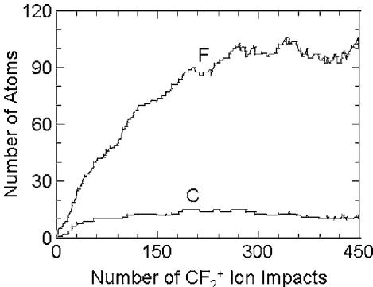  
FIG. 2. F and C atoms in the  $\mathrm{SiO}_2$  sample as a function of the number of  $20\mathrm{eV}\mathrm{CF}_2^+$  ion impacts.

We have plotted F concentration as a function of height  $h$  within the test structure for different numbers of  $\mathrm{CF}_2^+$  ion impacts in Fig. 3, where  $h$  has been measured with respect to structure bottom [Fig. 1(c)]. The passivation layer at the top is about  $8\mathrm{\AA}$  thick, and its thickness does not change significantly after 200 ion impacts. From the results in Fig. 1, the roughness of the fluorocarbon passivation film is less than  $5\mathrm{\AA}$  but the top  $10\mathrm{\AA}$  of the  $\mathrm{SiO}_2$  crystal is amorphized due to  $\mathrm{CF}_2^+$  ion bombardment. One can possibly reduce the thickness of the amorphization region by reducing ion energy, but we have not currently explored this scenario.

Figure 4 shows the  $\mathrm{SiO}_2$  test structure in Fig. 1(a) after bombardment with  $20\mathrm{eV}\mathrm{CF}_3^+$  ions. The test structure is shown after 200 and 400 impacts. The corresponding number of F and C atoms in the test structure is plotted in Fig. 5 as a function of the number of ion impacts. Compared to  $\mathrm{CF}_2^+$  ions, it takes longer to reach steady- state conditions with  $\mathrm{CF}_3^+$  and the fluorocarbon passivation film has less C. At  $20\mathrm{eV}$ , a large number of incident ions are found to "reflect" back as equivalent neutral without fragmentation or reaction. The proportion of reflected  $\mathrm{CF}_3^+$  ions is larger than  $\mathrm{CF}_2^+$  ions (for simulations described previously, Figs. 1- 3) due to fewer C dangling bonds in  $\mathrm{CF}_3^+$  and the presence of more F in the near surface region which terminate the available bonds and make the particle unreactive.  $\mathrm{CF}_3^+$  ions therefore react less, and it takes longer for the fluorocarbon passivation

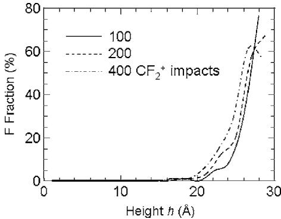  
FIG. 1. (Color online) (a) Crystalline  $\mathrm{SiO}_2$  sample used for the molecular dynamics investigation in this article. (b) The  $\mathrm{SiO}_2$  sample after 100 impacts of  $20\mathrm{eV}\mathrm{CF}_2^+$  ions. (c) The  $\mathrm{SiO}_2$  sample after 200 impacts of  $20\mathrm{eV}\mathrm{CF}_2^+$  ions.  
FIG. 3. Fluorine concentration in the sample as a function of sample height for different numbers of  $20\mathrm{eV}\mathrm{CF}_2^+$  ion impacts.

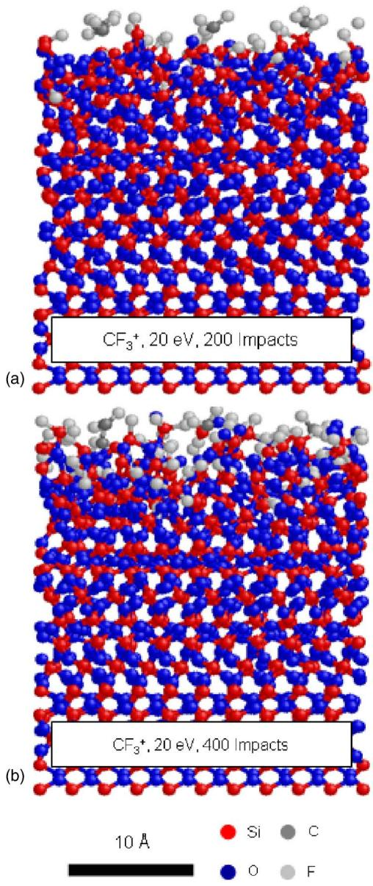

film to reach steady state with  $\mathrm{CF}_3^+$  ions. The passivation film grown through  $\mathrm{CF}_3^+$  ion bombardment has less  $\mathrm{F}$  compared to the film grown through  $\mathrm{CF}_2^+$  ion bombardment, and the  $\mathrm{F}$  concentration profile shows that the passivation film is thinner if grown using  $\mathrm{CF}_3^+$  ions.

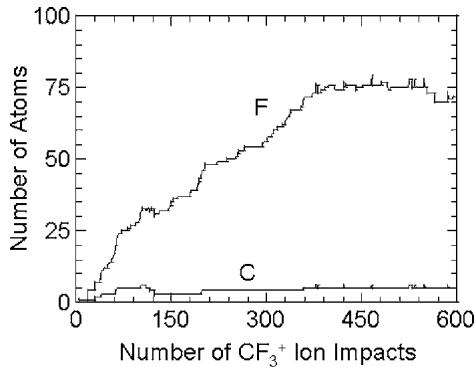  
FIG. 4. (Color online) The  $\mathrm{SiO}_2$  sample after (a) 200 and (b) 400 impacts of  $20\mathrm{eV}\mathrm{CF}_3^+$  ions.  
FIG. 5. F and C atoms in the  $\mathrm{SiO}_2$  sample as a function of the number of  $20\mathrm{eV}\mathrm{CF}_3^+$  ion impacts.

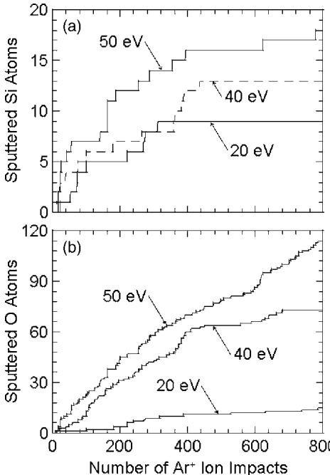  
FIG. 6. Effect of  $\mathrm{Ar^{+}}$  ion energy on the number of Si and O atoms sputtered from the  $\mathrm{SiO}_2$  sample with a fluorocarbon overlayer grown using  $\mathrm{CF}_3^+$  ions (400 impacts).

To examine the second step of the layer- by- layer etch process, we bombarded the test structure in Fig. 4(b) with  $\mathrm{Ar^{+}}$  ions having energies between 20 and  $50\mathrm{eV}$ . The fluorocarbon passivation layer on this test structure has been deposited using  $20\mathrm{eV}\mathrm{CF}_3^+$  ions. For reference, the physical sputtering threshold for  $\mathrm{SiO}_2$  is about  $50\mathrm{eV}$ . The number of sputtered Si and O atoms is plotted in Fig. 6 as a function of the number of  $\mathrm{Ar^{+}}$  ion impacts. Si and O are etched from the material as part of a variety of clusters, where the term "cluster" is used here to collectively refer to sputtered atoms, molecules, radicals, or large atomic aggregates. Dominant clusters include  $\mathrm{SiF}_x$ $(x = 2,3)$ ,  $\mathrm{SiO}_x\mathrm{F}_y$ $(x = 1,2$ ,  $y = 2,3,4)$ ,  $\mathrm{CO}$ , and  $\mathrm{CO}_2$ . Results in Fig. 6 include Si and O atoms in all clusters. It is found that, in the presence of  $\mathrm{F}$  atoms on the surface, Si is initially etched for all  $\mathrm{Ar^{+}}$  ion energies considered. However, as the concentration of  $\mathrm{F}$  atoms in the near surface region decreases, the sputtering of Si atoms ceases at  $20\mathrm{eV}\mathrm{Ar^{+}}$  ion energy. The sputtering of Si atoms stops at  $40\mathrm{eV}$  as well, although more Si atoms are removed from the surface. At  $50\mathrm{eV}$ , Si continues to etch even after  $\mathrm{F}$  concentration at the surface has been reduced although the etch rate decreases. In contrast to Si atoms, O atom ejection from the surface does not stop even up to  $800\mathrm{Ar^{+}}$  ion impacts, the maximum number of ion impacts we have examined. The rate of O loss, however, decreases after the initial stage of  $\mathrm{Ar^{+}}$  ion bombardment for ion energies below  $40\mathrm{eV}$ . Each O atom is bound to two Si atoms in a crystalline  $\mathrm{SiO}_2$  lattice while Si atoms are attached to four O atoms. As  $\mathrm{Si - O}$  bond energy is about  $4.2\mathrm{eV}$ ,  $\sim 16.8\mathrm{eV}$  is needed to liberate a Si atom from the lattice. O atoms, on the other hand, only require  $\sim 8.4\mathrm{eV}$  to break free from the lattice. Because of this lower energy requirement, O atoms continue to exit the material at a slow pace even after Si sputtering has ceased. It is expected that the region near the surface will become deficient in O atoms before O etching stops.

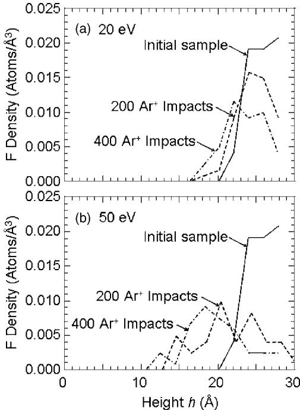  
FIG. 7. Effect of  $\mathrm{Ar^{+}}$  ion impact on  $\mathrm{F}$  density in the  $\mathrm{SiO}_2$  sample with a fluorocarbon overlayer grown using  $\mathrm{CF}_3^+$  ions (400 impacts). Results have been plotted for (a)  $20\mathrm{eV}$  and (b)  $50\mathrm{eV}$ $\mathrm{Ar^{+}}$  ion energies.

As  $\mathrm{Ar^{+}}$  ions continue to bombard the  $\mathrm{SiO}_2$  test structure with the fluorocarbon passivation layer,  $\mathrm{F}$  atoms etch away Si atoms from the surface. In addition,  $\mathrm{F}$  atoms are also pushed down into the bulk  $\mathrm{SiO}_2$  material, making them less accessible to the bombarding ions. We have shown the concentration of  $\mathrm{F}$  atoms in the fluorocarbon passivated  $\mathrm{SiO}_2$  test structure in Fig. 7 at several stages during  $\mathrm{Ar^{+}}$  ion bombardment. Results have been shown for 20 and  $50\mathrm{eV}$ $\mathrm{Ar^{+}}$  ion energies. For both energies,  $\mathrm{F}$  concentration decreases as the  $\mathrm{F}$  atoms are removed through etching. At  $20\mathrm{eV}$ ,  $\mathrm{F}$  atoms are not pushed far into the film by the bombarding atoms. However, it can be observed that  $\mathrm{F}$  atom concentration becomes considerably broad through ion bombardment at  $50\mathrm{eV}$ . MD is a computationally expensive technique, and it is difficult to follow the ion bombardment process for very long. It is expected that, as the  $\mathrm{F}$  atoms are present in the test structure even after Si sputtering visibly stops at  $20\mathrm{eV}$  [Fig. 6(a)], the  $\mathrm{F}$  atoms will continue to etch Si either through reactive ion etching or through chemical means. We have currently not examined these long time scale processes.

Bombardment with  $\mathrm{Ar^{+}}$  ions not only etches the top layer of  $\mathrm{SiO}_2$  but also amorphizes the remaining material and can potentially introduce surface roughness. We have shown the  $\mathrm{SiO}_2$  test structure after bombardment by  $400\mathrm{Ar^{+}}$  ions of energies of 20 and  $40\mathrm{eV}$  in Fig. 8. The initial sample had a fluorocarbon overlayer grown using  $\mathrm{CF}_3^+$  ions (400 impacts). Compared to the sample in Fig. 4(b), one can observe that  $\mathrm{Ar^{+}}$  ion bombardment increases the thickness of the amorphized top layer and the amorphized region is thicker when  $\mathrm{Ar^{+}}$  ions are more energetic. This is because more energetic  $\mathrm{Ar^{+}}$  ions can penetrate deeper into the sample. Due to the small sample size, it is difficult to determine if surface roughness has changed due to  $\mathrm{Ar^{+}}$  ion bombardment.

Similar to  $\mathrm{SiO}_2$ , fluorocarbon species also form a thick passivation layer on Si surface. It is therefore possible to use the layer- by- layer etch process described above for Si as well. We next examine the two steps of the layer- by- layer etching process (fluorocarbon passivation layer deposition and  $\mathrm{Ar^{+}}$  ion etching) for Si. The initial crystalline Si test structure is shown in Fig. 9(a), and it is  $27.17\times 27.17\times 38.04\mathrm{\AA}^3$  in size. Before any bombardment took place on this test structure, it was equilibrated at  $300\mathrm{K}$ . Following equilibration, the test structure was bombarded with  $\mathrm{CF}_2^+$  ions with energies of 10, 20, and  $30\mathrm{eV}$ . During the first  $0.25\mathrm{ps}$  of each ion impact simulation, thermal control was turned off. For the remainder of the  $0.8\mathrm{ps}$  ion impact time period, the external thermal bath was set at  $300\mathrm{K}$ . The resulting samples in quasi- steady- state condition for three ion

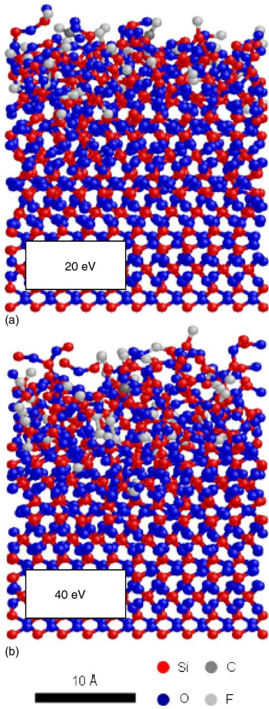  
FIG. 8. (Color online) Side view of the  $\mathrm{SiO}_2$  sample after bombardment by  $\mathrm{Ar^{+}}$  ions of energies of (a)  $20\mathrm{eV}$  and (b)  $40\mathrm{eV}$ . This sample had initially a fluorocarbon overlayer grown using  $20\mathrm{eV}$ $\mathrm{CF}_3^+$  ions (400 impacts).

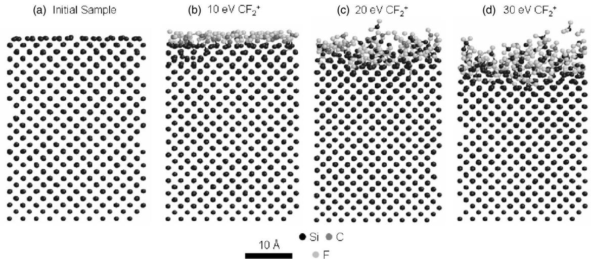  
FIG. 9. (a) Initial Si sample. The sample after bombardment with  $\mathrm{CF}_2^+$  ions of energies of (a)  $10\mathrm{eV}$ , (b)  $20\mathrm{eV}$ , and (c)  $30\mathrm{eV}$ .

energies are shown in Figs. 9(b)- 9(d). At  $10\mathrm{eV}$  ion energy, the underlying Si lattice is barely disturbed and a  $4 - 5\mathrm{\AA}$  thick fluorocarbon passivation layer is grown on top of Si. The fluorocarbon passivation layer thickens as  $\mathrm{CF}_2^+$  ion energy is increased, and  $\mathrm{F}$  and  $\mathrm{C}$  atoms also penetrate the underlying Si. By comparing the samples in Fig. 9, it can be observed that some amount of Si etching also occurs at  $30\mathrm{eV}$ . It is therefore inferred that a fluorocarbon passivation layer can be grown on Si for layer- by- layer etching if ion energy is kept below  $30\mathrm{eV}$ . The passivation layer is about  $8\mathrm{\AA}$  thick at  $20\mathrm{eV}$ $\mathrm{CF}_2^+$  ion energy.

We have shown the number of  $\mathrm{F}$  and  $\mathrm{C}$  atoms in the test structure in Fig. 10 as a function of the number of  $\mathrm{CF}_2^+$  ion impacts. Results have been plotted for 10 and  $20\mathrm{eV}$ $\mathrm{CF}_2^+$  ion bombardments.  $\mathrm{F}$  and  $\mathrm{C}$  reach quasi- steady- state condition for all ion energies considered after about  $450\mathrm{CF}_2^+$  ion impacts. The film contains considerably more  $\mathrm{C}$  at  $10\mathrm{eV}$  than at higher energies, and the fluorocarbon layer is  $\mathrm{F}$  rich at higher energies.

The thickness of passivation layer can be extracted from the  $\mathrm{F}$  density plots shown in Fig. 11. These results have been plotted for 10 and  $30\mathrm{eV}$ $\mathrm{CF}_2^+$  ion energies. At  $10\mathrm{eV}$ ,  $\mathrm{F}$  concentration in the film increases as more  $\mathrm{CF}_2^+$  ions bombard the sample. The  $\mathrm{F}$  concentration for  $600\mathrm{ion}$  impact is close to quasi- steady- state and the fluorocarbon film is about  $5\mathrm{\AA}$  thick. The  $\mathrm{F}$  containing passivation layer is much broader at  $30\mathrm{eV}$ . From the density profiles at  $300$  and  $600$  ion impacts [Fig. 11(b)], it can be observed that the  $\mathrm{F}$  layer is moving downwards, which is due to the etching of the underlying Si.

The second step of the atomic layer- by- layer etch pro

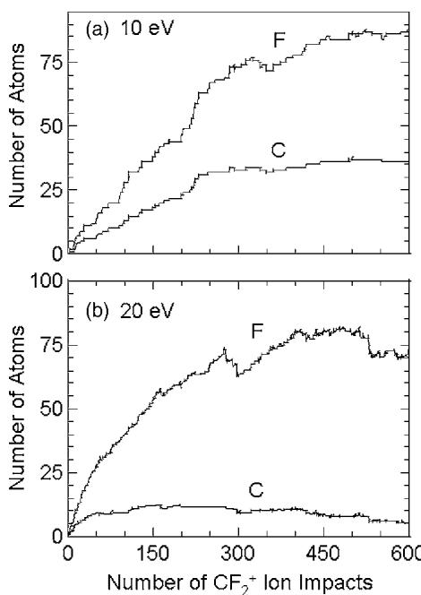  
FIG. 10. Number of  $\mathrm{F}$  and  $\mathrm{C}$  atoms in the Si sample after bombardment with  $\mathrm{CF}_2^+$  ions. Results have been plotted for (a)  $10\mathrm{eV}$  and (b)  $20\mathrm{eV}$  ion energies.

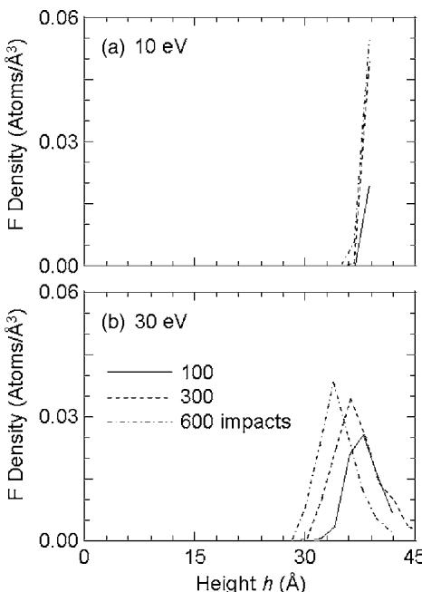  
FIG. 11.  $\mathrm{F}$  density as a function of sample height in the Si sample with the fluorocarbon overlayer. Results have been plotted for  $100$ ,  $300$ , and  $600\mathrm{eV}$  ion impacts on the initial crystalline sample.  $\mathrm{CF}_2^+$  ion energies are (a)  $10$  and (b)  $30\mathrm{eV}$ .

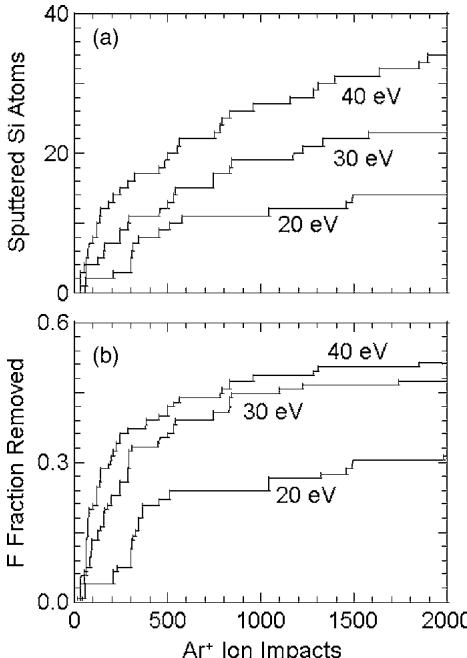  
FIG. 12. (a) Number of Si atoms that are sputtered from the Si sample with the fluorocarbon overlayer (10 eV  $\mathrm{CF}_2^+$ , 300 impacts) as  $\mathrm{Ar^{+}}$  ions of different energies are bombarded on it. (b) Fraction of initial F left in the sample as  $\mathrm{Ar^{+}}$  ions of different energies are bombarded on the Si sample with the fluorocarbon overlayer (10 eV  $\mathrm{CF}_2^+$ , 300 impacts).

cess is the  $\mathrm{Ar^{+}}$  ion etching of the fluorocarbon passivated Si sample. We used the test structure in Fig. 9(b) for this purpose, which has been grown using  $10\mathrm{eV}\mathrm{CF}_2^+$  ions. This test structure was continuously bombarded with  $\mathrm{Ar^{+}}$  ions with energies of  $20–40\mathrm{eV}$ . The number of sputtered Si atoms and fraction of initial F removed from the sample are shown in Fig. 12 as a function of the number of  $\mathrm{Ar^{+}}$  ion impacts. Results for 20, 30, and  $40\mathrm{eV}$  ion energies have been plotted. These results show that Si is initially etched from the sample and the number of F atoms in the sample also decreases. The rate of Si or F loss increases with ion energy. After the initial stage of etching, Si loss virtually stops at  $20\mathrm{eV}$ . As explained earlier in the context of  $\mathrm{SiO}_2$ , there is still considerable amount of F left in the sample so the slow loss of Si (in combination with F) cannot be precluded. At  $30\mathrm{eV}$ , Si sputtering has slowed down by the end of our simulation, although it has not completely stopped. The rate of Si loss is substantial at  $40\mathrm{eV}$  even up to the end of the simulation (1000  $\mathrm{Ar^{+}}$  ion impacts).  $\mathrm{Ar^{+}}$  ion energies below  $30\mathrm{eV}$  therefore appear well suited for the layer- by- layer etching of Si.

We have shown the concentration of F within the film at several stages during the  $\mathrm{Ar^{+}}$  ion bombardment process in Fig. 13. Results for 20 and  $40\mathrm{eV}$  have been plotted. At  $20\mathrm{eV}$ , one can observe that F is lost from the sample as more  $\mathrm{Ar^{+}}$  ions are bombarded on the test structure. F atoms are also pushed slightly downwards into the test structure. The same effects are observed at  $40\mathrm{eV}$  as well, although F concentration is broader at  $40\mathrm{eV}$  and F is spread over  $\sim 18\mathrm{\AA}$  by the end of the simulation.

Similar to  $\mathrm{SiO}_2$ , bombardment with  $\mathrm{Ar^{+}}$  ions is expected to amorphize the top layers of the remaining Si and introduce surface roughness. We have shown the Si test structure after bombardment by  $1000\mathrm{Ar^{+}}$  ions of energies of 20 and  $40\mathrm{eV}$

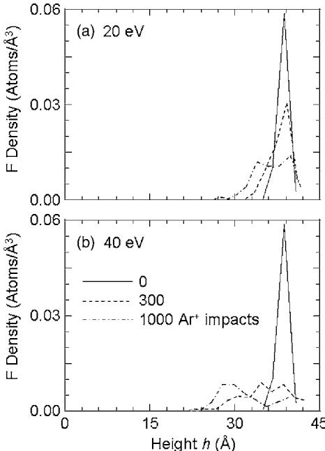  
FIG. 13. F density as a function of sample height in the Si sample with the fluorocarbon overlayer (10 eV  $\mathrm{CF}_2^+$ , 300 impacts). Results have been plotted for the initial sample and after 300 and  $600\mathrm{Ar^{+}}$  ion impacts.  $\mathrm{Ar^{+}}$  ion energies are (a) 20 and (b)  $40\mathrm{eV}$ .

in Fig. 14. The initial sample had a fluorocarbon overlayer grown using  $10\mathrm{eV}\mathrm{CF}_2^+$  ions (300 impacts). Compared to the sample in Fig. 9(b), one can observe that  $\mathrm{Ar^{+}}$  ion bombardment increases the thickness of the amorphized top layer and the amorphized region is thicker when  $\mathrm{Ar^{+}}$  ions are more energetic. This is because more energetic  $\mathrm{Ar^{+}}$  ions can penetrate deeper into the sample.

# IV. CONCLUSIONS

A MD model is used to understand layer- by- layer etching of Si and  $\mathrm{SiO}_2$  using fluorocarbon and  $\mathrm{Ar^{+}}$  ions in this article. Both the passivation and etching steps are examined. In these etch processes, a nanometer- scale fluorocarbon passivation layer is grown on the material's surface using low energy  $\mathrm{CF}_x^+$  ions or radicals. The top layers of the material are then reactive ion etched by  $\mathrm{Ar^{+}}$  ions utilizing the fluorocarbon already present on the material surface. By repeating these two steps, Si or  $\mathrm{SiO}_2$  can be etched with nanometer- scale precision and the etch rate is considerably faster than what traditional atomic layer etching techniques provide. The modeling results show that fluorocarbon passivation films can be grown in a self- limiting manner on both Si and  $\mathrm{SiO}_2$  using low energy  $\mathrm{CF}_2^+$  and  $\mathrm{CF}_3^+$  ions. The fluorocarbon passivation layer is a few angstroms, thick, and its thickness increases with the fluorocarbon ion's energy. Increasing the ion energy, however, amorphizes the top atomic layers of the material. In addition, the fluorocarbon film becomes F rich with increasing ion energy. Simulations of fluorocarbon passivated  $\mathrm{SiO}_2$  surface show that  $\mathrm{Ar^{+}}$  ions with energy below  $50\mathrm{eV}$  etch Si (within  $\mathrm{SiO}_2$ ) in a self- limiting manner. Si etching stops once F in the fluorocarbon passivation layer is exhausted or it is pushed too deep into the substrate. On the other hand, oxygen (within  $\mathrm{SiO}_2$ ) is more easily sputtered from the material surface than Si, and the top layers of  $\mathrm{SiO}_2$

  
FIG. 14. Si sample after bombardment by  $1000\mathrm{Ar^{+}}$  ions with energies of (a) 20 and (b)  $40\mathrm{eV}$ . The initial Si sample had a fluorocarbon overlayer grown using  $10\mathrm{eV}\mathrm{CF}_2^+$  ions (300 impacts).

are expected to become deficient in O during the  $\mathrm{Ar^{+}}$  ion bombardment step.  $\mathrm{Ar^{+}}$  ion etching of fluorocarbon passivated Si also appears to be self- limiting below  $30\mathrm{eV}$  ion energy, and etching stops once  $\mathrm{F}$  on the material surface is either consumed or becomes inaccessible.

The layer- by- layer etching of Si or dielectrics is a complex physical phenomenon. Our investigation is an attempt to theoretically understand the intricacies of the relevant surface processes during etching and, by necessity, only addresses a subset of the complete problem. For example, as the pseudopotentials are not expected to adequately capture low energy chemical processes, we have grown the fluorocarbon passivation layers through fluorocarbon ion bombardment with ion energies above  $10\mathrm{eV}$ . We are currently attempting to improve the pseudopotentials to better capture chemical effects, which will allow the treatment of fluorocarbon passivation film growth using even lower energy ions or neutral radicals. The results presented in this article are also specific to the crystalline test structures for  $\mathrm{SiO}_2$  [Fig. 1(a)] and Si [Fig. 9(a)]. It is unclear how well the observed trends will translate to amorphous films.

$^1\mathrm{M}$  - H.Cho et al.Appl.Phys.Lett.81472 2002.  $^2\mathrm{S}$  M. Rossnagel, A. Sherman, and F. Turner, J. Vac. Sci. Technol. B 18, 2016 (2000).  $^3\mathrm{H}$  Kim, J. Vac. Sci. Technol. B 21, 2231 (2003).  $^4\mathrm{S}$  D. Athavale and D. J. Economou, J. Vac. Sci. Technol. A 13, 966 (1995).  $^5\mathrm{T}$  Matsuura, J. Murota, Y. Sawada, and T. Ohmi, Appl. Phys. Lett. 63, 2803 (1993).  $^6\mathrm{T}$  Meguro, M. Ishii, T. Sugano, K. Gamo, and Y. Aoyagi, Appl. Surf. Sci. 82- 83, 193 (1994).  $^7\mathrm{K}$  Ikeda, S. Imai, and M. Matsumara, Appl. Surf. Sci. 112, 87 (1997).  $^8\mathrm{W}$  T. Tsang, T. H. Chiu, and R. M. Kapre, Appl. Phys. Lett. 63, 3500 (1993).  $^9\mathrm{T}$  Matsuura, Y. Honda, and J. Murota, Appl. Phys. Lett. 74, 3573 (1999).  $^{10}\mathrm{T}$  Sugiyama, T. Matsuura, and J. Murota, Appl. Surf. Sci. 187, 187 (1997).  $^{11}\mathrm{N}$  Otsuka, J. Nishizawa, Y. Oyama, H. Kikuchi, and K. Suto, J. Electrochem. Soc. 146, 547 (1999).  $^{12}\mathrm{S}$  D. Park, D. H. Lee, and G. Y. Geom, Electrochem. Solid- State Lett. 8, C106 (2005).  $^{13}\mathrm{S}$  Matsu, M. Baba, and A. Satoh, Nanotechnology 3, 156 (1992).  $^{14}\mathrm{H}$  Sakaue, S. Iseda, K. Asami, J. Yamamoto, M. Hirose, and Y. Horiike, Jpn. J. Appl. Phys., Part 1 29, 2648 (1990).  $^{15}\mathrm{S}$  D. Park, K.- S. Min, B.- Y. Yoon, D.- H. Lee, and G.- Y. Geom, Jpn. J. Appl. Phys., Part 1 44, 389 (2005).  $^{16}\mathrm{Y}$  Horiike et al., J. Vac. Sci. Technol. A 8, 1844 (1990).  $^{17}\mathrm{Y}$  Horiike et al., J. Vac. Sci. Technol. A 8, 1844 (1990).  $^{18}\mathrm{S}$  D. Athavale and D. J. Economou, J. Vac. Sci. Technol. B 14, 3702 (1996).  $^{19}\mathrm{T}$  Matsuura, T. Sugiyama, and J. Murota, Surf. Sci. 402, 202 (1998).  $^{20}\mathrm{T}$  Yamamoto, T. Kawasaki, H. Sakaue, S. Shingubara, and Y. Horiike, Thin Solid Films 225, 124 (1993).  $^{21}\mathrm{M}$  Matsui, T. Tatsumi, and M. Sekine, J. Vac. Sci. Technol. A 19, 1282 (2001).  $^{22}\mathrm{M}$  Matsui, T. Tatsumi, and M. Sekine, J. Vac. Sci. Technol. A 19, 2089 (2001).  $^{23}\mathrm{M}$  Schaepkens, G. S. Oehrlein, C. Hedlund, L. B. Jonsson, and H. Blom, J. Vac. Sci. Technol. A 16, 3281 (1998).  $^{24}\mathrm{M}$  Schaepkens, T. E. F. M. Standaert, N. R. Rueger, P. G. M. Sebel, G. S. Oehrlein, and J. M. Cook, J. Vac. Sci. Technol. A 17, 26 (1999).  $^{25}\mathrm{N}$  R. Rueger, M. F. Doemling, M. Schaepkens, J. J. Beulens, T. E. F. M. Standaert, and G. S. Oehrlein, J. Vac. Sci. Technol. A 17, 2492 (1999).  $^{26}\mathrm{X}$  Li, X. Hua, L. Ling, G. S. Oehrlein, M. Barela, and H. M. Anderson, J. Vac. Sci. Technol. A 20, 2052 (2002).  $^{27}\mathrm{M}$  Inayoshi, M. Ito, M. Hori, T. Goto, and M. Hiramatsu, J. Vac. Sci. Technol. A 16, 233 (1998).  $^{28}\mathrm{K}$  Takahashi, M. Hori, and T. Goto, J. Vac. Sci. Technol. A 14, 2011 (1996).  $^{29}\mathrm{M}$  Chander, Y. Z. Li, J. C. Patrin, and J. H. Weaver, Phys. Rev. B 47, 13035 (1993).  $^{30}\mathrm{C}$  M. Aldao and J. H. Weaver, Prog. Surf. Sci. 68, 189 (2001).  $^{31}\mathrm{M}$  Chander, D. A. Goetsch, C. M. Aldao, and J. H. Weaver, Phys. Rev. Lett. 74, 2014 (1995).

$^{32}$ C. F. Abrams and D. B. Graves, J. Appl. Phys. **86**, 5938 (1999).   $^{33}$ C. F. Abrams and D. B. Graves, J. Vac. Sci. Technol. A **18**, 411 (2000).   $^{34}$ C. F. Abrams and D. B. Graves, J. Appl. Phys. **88**, 3734 (2000).   $^{35}$ C. F. Abrams and D. B. Graves, J. Vac. Sci. Technol. A **19**, 175 (2001).   $^{36}$ H. Ohta and S. Hamaguchi, J. Vac. Sci. Technol. A **19**, 2373 (2001).   $^{37}$ V. V. Smirnov, A. V. Stengach, K. G. Gaynullin, V. A. Pavlovsky, S. Rauf, P. J. Stout, and P. L. G. Ventzek, J. Appl. Phys. **97**, 093302 (2005).   $^{38}$ V. V. Smirnov, A. V. Stengach, K. G. Gaynullin, V. A. Pavlovsky, S. Rauf, P. J. Stout, and P. L. G. Ventzek, J. Appl. Phys. **97**, 093303 (2005).

P. 
J. Stout, and 
P. 
L. 
G. Ventzek, 
J. Appl. Phys. **97**, 093303 (2005).  
 $^{39}$ M. 
J. Frisch et al., GAUSSIAN98, Revision 
A.9, Gaussian, Inc., Pittsburgh, PA, 1998.  
 $^{40}$ M. 
P. Allen and 
D. 
J. Tildesley, Computer Simulation of Liquids (Clarendon, Oxford, 1994).  
 $^{41}$ H. 
J. 
C. Berendsen, 
J. 
P. 
M. Postma, 
W. 
F. van Gunsteren, 
A. DiNola, and 
J. 
R. Yaak, 
J. Chem. Phys. **81**, 3684 (1984).