# Microscopic and data-driven modeling and operation of thermal atomic layer etching of aluminum oxide thin films

Sungil Yun $^{a}$ , Matthew Tom $^{a}$ , Junwei Luo $^{a}$ , Gerassimos Orkoulas $^{c}$ , Panagiotis D. Christofides $^{a,b,*}$

$^{a}$  Department of Chemical and Biomolecular Engineering, University of California, Los Angeles, CA 90095- 1592, USA   $^{b}$  Department of Electrical and Computer Engineering, University of California, Los Angeles, CA 90095- 1592, USA   $^{c}$  Department of Chemical Engineering, Widener University, Chester, PA 19013, USA

# ARTICLE INFO

# ABSTRACT

Article history:  Received 9 September 2021  Received in revised form 7 October 2021  Accepted 11 October 2021  Available online 23 October 2021

Keywords:  Thermal atomic layer etching  Kinetic Monte- Carlo model  Density functional theory  Feed- forward neural network  Process operation

With increasing demands for microchips and increasing needs in the nano- scale semiconductor manufacturing industry, atomic layer etching (ALE) has been developing into a critical etching process. Unlike its counterpart in the film deposition domain, atomic layer deposition (ALD), which has been extensively studied, ALE has not been fully studied yet from a modeling and operation point of view. Therefore, this work develops microscopic models to characterize the thermal ALE process of aluminum oxide thin films with two precursors (hydrogen fluoride and trimethylaluminum). First, the reaction mechanisms for the two half- cycles for the thermal ALE process are established. Electronically predicted geometries of the  $\mathrm{Al}_2\mathrm{O}_3$  structure with two precursors are optimized. Along with the optimized geometries, possible reaction pathways are proposed and calculated by density functional theory (DFT)- based electronic structure calculations. The proposed reaction paths and their kinetic parameters are used in a kinetic Monte Carlo (kMC) algorithm, which is capable of capturing the features of the thermal ALE of aluminum oxide. The kMC simulation provides an etch time for the given steady- state operating conditions, which are validated via comparison with available experimental results. Finally, data sets collected from the kMC simulation are used to train a feed- forward artificial neural network (FNN) model. The trained FNN model accurately predicts an etch time and dramatically reduces the computation time compared to the kMC simulation, thereby making it possible to carry out real- time, model- based operational parameter calculations. In addition, the trained FNN model can be used to establish a feasible range of operating conditions without demanding experimental work.

$\mathfrak{G}$  2021 Institution of Chemical Engineers. Published by Elsevier B.V. All rights reserved.

# 1. Introduction

Atomic layer deposition (ALD) is a process where thin films are deposited on the surface of a material, which has evolved considerably in the semiconductor manufacturing industry. Atomic layer etching (ALE) has been used to etch metal oxides in metal- oxide- semiconductor field- effect transistors (MOSFETs) and fin field- effect transistors (FinFETs). The demand for the miniaturization of semiconductors, which is capable of decreasing current leakage and power loss, has been growing recently as predicted by Moore's law. However, gate oxides have reached their physical limits for size reduction making

the ALD process more challenging. In addition, 3D FinFETs have required more precise etching technology, thus, leading to growing interest in ALE. As a result, ALE has emerged to become one of the most promising and essential techniques in the nano- scale processing era.

The decrease in the size of these semiconducting materials has led to the reduction in the amount of deposit required to coat the material surfaces. The reduction in coating thickness would generate problems due to the delivery of minuscule amounts of film and lack of controllability of the process (Natarajan and Elliott, 2018). ALE resolves this obstacle by uniformly etching the localized surface of the material through a series of cycles that are controlled by the specificity of the kinetic nature of the reactions in this process. Nevertheless, unlike the ALD process, the ALE process has not been fully investigated and further research is needed from the point of view of modeling and model- based operational decision- making. There are two brood types of ALE, which are known as plasma ALE and thermal ALE. Plasma ALE introduces highly reactive radicals that chemisorb to the surface and convert the modified surface into a volatile layer whereas thermal ALE is dependent on temperature to promote chemisorption of reagents on the surface (Kanarik et al., 2018). Plasma ALE is more difficult to control due to the instability of the ions produced as opposed to thermal ALE, which is capable of being controlled due to the use of thermally dependent reactions (Natarajan and Elliott, 2018), which enables the production of high- quality conformal and ultra- smooth thin films.

Thermal ALE introduces sequential cycles of etching, which contain two steps (half- cycles) consisting of layer modification performed by self- limiting etch reactions that remove a single atomic layer at once and succeeded by a removal step of the modified layer (Kanarik et al., 2015). ALE has been recently studied with various materials such as Si (Park et al., 2005),  $\mathrm{SiO_2}$  (DuMont et al., 2017), graphene (Lim et al., 2012), and  $\mathrm{Al_2O_3}$  (Lee et al., 2016). Among some metal oxides, considerable research has been concentrated on  $\mathrm{SiO_2}$ . However,  $\mathrm{SiO_2}$  is not appropriate for sub- 10- nm semiconductor fabrication.  $\mathrm{Al_2O_3}$ , as a high-  $\kappa$  oxide, has been focused on as an approach to overcome this miniaturization issue. Moreover, there has been a special investigation for the thermal ALE of  $\mathrm{Al_2O_3}$  since aluminum oxide with HF (hydrogen fluoride) and TMA (trimethylaluminum) is able to undergo both ALD and ALE (DuMont and George, 2017). The thermal ALE of aluminum oxide has been experimentally studied recently (Lee et al., 2016). Nonetheless, this process has not been fully characterized yet. In order to completely understand thermal ALE and its process operational behavior, a more efficient and computational approach could be conducted in conjunction with experimental work.

In this work, microscopic and data- driven models are developed for the thermal ALE process of aluminum oxide thin films. First, DFT (density functional theory)- based electronic structure calculations are conducted using Quantum ESPRESSO (QE), which contains a database of pseudopotentials to obtain the activation energies for species not published in the literature. Then, these activation energies are used as input parameters in a microscopic model using the kinetic Monte Carlo (kMC) algorithm, which provides the progression of the etching process over time. The developed microscopic model is validated via comparison with available experimental results (Lee et al., 2016). Nevertheless, the kMC simulation is a time- consuming task so its use in generating the etch time data set over a wide range of operating conditions may be ineffective for real- time calculations. Therefore, a feedforward artificial neural network (FNN) model is established to capture the relationship between operating conditions and the etch time by using training data sets generated from the kMC simulation. FNNs have recently been utilized to correlate and fit the results of kMC data. Ding et al. (2020) utilized a feed- forward Bayesian regularized artificial neural network (BRANN) to characterize the relationship between input, temperature and pressure, and output, half- cycle time, using kMC data for plasma enhanced atomic layer deposition of  $\mathrm{HfO_2}$ . Ding et al. (2019) utilized both FNN and BRANN to fit kMC data produced by simulating thermal atomic layer deposition of  $\mathrm{SiO_2}$ . Therefore, the FNN model is used to identify the optimal operating conditions for the thermal ALE of aluminum oxide. The data- driven FNN model offers significant economic benefits since it is costly to conduct many experiments over a wide range of operating conditions to determine the optimal operating conditions.

# 2. DFT (density functional theory) calculation

In order to build a microscopic model for the thermal ALE of aluminum oxide, all of the possible reaction pathways and their kinetic parameters should be listed and determined. However, it is a time- consuming and practically unnecessary task to simulate the entirety of the intermediate reactions involved and these parameters are not known in general and must be calculated using theoretical concepts and simulation. To simplify the reaction network, critical reaction steps that have slow kinetics and low thermodynamic spontaneity are chosen to define the calculated process time while reactions that occur spontaneously are neglected. Then, this work models crystal structures of  $\mathrm{Al_2O_3}$ , which are approximated by developing their 3D lattice models in Python. Next, the structural optimization of potential geometries, which are segregated from unstable structures, is performed based on the DFT (density functional theory) method. The open- source computation package, Quantum ESPRESSO (QE), is used to optimize the geometries of the molecular structures and to perform other electronic structure calculations that are pertinent to computing the thermodynamic properties of the molecular structure. QE has been widely used to compute fundamental quantum properties on the basis of first- principles DFT calculations (Pitriana et al., 2018). With the optimized structures computed from QE, reaction mechanisms are identified and established. Finally, the nudged elastic band (NEB) method is introduced to compute the activation energies that are later substituted into the kinetic Monte Carlo (kMC) algorithm, described in Section 3, to model the etching process.

# 2.1. Aluminum oxide lattice modeling

Building a lattice structure plays an important role in atomistic modeling because kinetic parameters and thermodynamic properties vary in accordance with crystal structures and their orientations. Therefore, it is of paramount importance to build a suitable lattice model at the atomistic level. There are a number of crystal structures of aluminum oxide (Rahane et al., 2011), which can be found in different conditions. Among them,  $\theta - \mathrm{Al_2O_3}(\overline{2} 01)$  was found to grow along the  $(\overline{2} 01)$  orientation stacked on  $\mathrm{Si}(100)$  through the atomic layer deposition

Table 1-Lattice parameters of monoclinic  $\theta -A\mathbf{l}_2\mathbf{O}_3$  

<table><tr><td>Lattice parameter</td><td>Experimental value</td></tr><tr><td>a (Å)</td><td>11.85</td></tr><tr><td>b (Å)</td><td>2.90</td></tr><tr><td>c (Å)</td><td>5.62</td></tr><tr><td>α (°)</td><td>90.00</td></tr><tr><td>β (°)</td><td>103.83</td></tr><tr><td>γ (°)</td><td>90.00</td></tr></table>

(ALD) process under annealing (Brosa et al., 2017). Thus,  $\theta$ -  $\mathrm{Al}_2\mathrm{O}_3(\overline{2} 01)$ , which is designated as A0 in this study, is used for atomistic modeling as shown in Table 2. BURAI, a GUI (graphical user interface) system of the QE package, is applied to visualize the geometries studied in this work. Table 1 provides the lattice parameters for monoclinic  $\theta - \mathrm{Al}_2\mathrm{O}_3$  from experimental results (Zhou and Snyder, 1991).

# 2.2. SCF (self-consistent field) calculation

The electronic structure calculation is performed using pseudopotentials that are built in the QE simulation packages. The pseudopotentials assume that the core ions are frozen and only the valence electrons are involved in the potentials. In other words, the pseudopotentials dramatically decrease the number of plane waves so that the Schrodinger equation becomes solvable. The time- dependent Schrodinger equation is defined as:

$$
\hat{H}\Psi = \mathbb{E}\Psi \tag{1}
$$

where  $\hat{H}$  is the Hamiltonian,  $\Psi$  is the wave function, and  $\mathbb{E}$  is the energy of the system. The Hamiltonian is described as follows:

$$
\hat{H} = -\frac{\hbar^2}{2m}\nabla^2 +\hat{\nabla} \tag{2}
$$

where  $\hbar$  is the Planck constant divided by  $2\pi$ ,  $m$  is the mass of the particle,  $\nabla^2$  is the Laplacian operator in Cartesian coordinates, and  $\hat{\nabla}$  is the potential energy. There are three pseudopotentials in general: norm- conserving (NC), ultrasoft (US), and projector augmented wave (PAW) pseudopotentials. In this work, PAW pseudopotentials are used for their computational efficiency (Pitriana et al., 2018).

It is necessary to perform the self- consistent field (SCF) calculation to obtain quantum parameters that can facilitate accurate calculation results, such as the kinetic energy cutoff (ecutwfc), the kinetic energy cut- off for charge density and potential (ecutrho), and the  $k$ - points. First, the optimization of the kinetic energy cut- off (ecutwfc) is performed to limit the number of plane waves for computational efficiency. Fig. 1a shows the convergence of the total energy at various ecutwfc. The total energy decreases as the ecutwfc increases. However, the total energy does not change when ecutwfc is greater than 50. Next, the optimization of the kinetic energy cut- off for charge density and potential (ecutrho) is computed as shown in Fig. 1b. Unlike the ecutwfc, the total energy increases as the ecutrho increases. The total energy does not change significantly when ecutrho is greater than 200. Lastly, the total energy calculations are carried out with different  $k$ - points. The convergence of the total energy is achieved when the number of  $k$ - points is 4 as shown in Fig. 1c. Thus, a kinetic energy cutoff (ecutwfc) of 50, a kinetic energy cut- off for charge density and potential (ecutrho) of 200, and a  $k$ - point value of 4 are (a) The kinetic energy cut-off (ecutwfc) optimization of  $\theta -\mathrm{Al}_2\mathrm{O}_3$  (2 0 1).

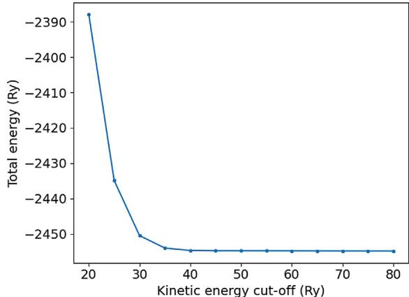

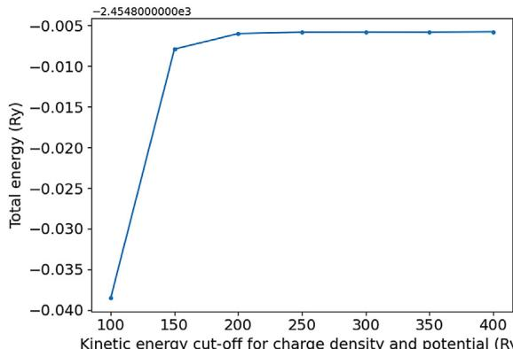

(b) The kinetic energy cut-off for charge density and potential (ecutrho) optimization of  $\theta -\mathrm{Al}_2\mathrm{O}_3$  (2 0 1).

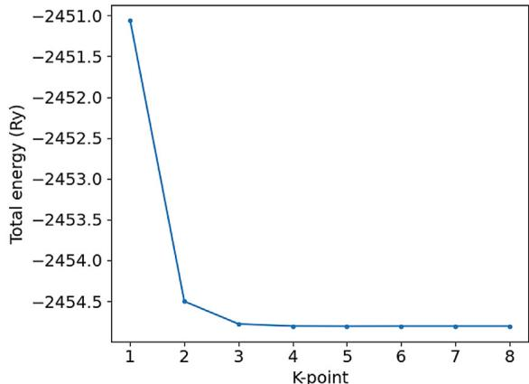  
(c) The  $k$ -point optimization of  $\theta -\mathrm{Al}_2\mathrm{O}_3$  (2 0 1). Fig. 1 - The total energy converges when ecutwfc is 50 (a), ecutrho is 200 (b), and the number of  $k$ -points is 4 (c), respectively.

used as the input parameters for all the electronic structure calculations in this work.

# 2.3. Structural optimization and reaction mechanisms

Due to the difficulty of modeling the entirety of the intermediate reactions, the reaction mechanisms for Steps A and B can be selected based on the critical reaction paths that have longer reaction times, which are directly proportional to the reaction rate constant and hence the activation energy. An overall process time will essentially be dependent on slow reaction paths rather than fast reaction paths. Thus, neglecting the reaction paths that occur at a fast or instantaneous

rate has negligible effect on the overall process time. Therefore, it is essential to study critical reaction paths for the kMC simulation. Finding the critical paths, which affect the overall process time, can be achieved through structural optimization. If a structure can be optimized from the electronic structure calculation, the optimized structure can be assumed to be at a minimum energy state along with the reaction path, which implies that the reaction for the formation of the structure is stable and relatively slow enough to influence the overall reaction time. On the other hand, if a structure is not optimized, it can be assumed that this structure is thermodynamically unstable and is essentially nonexistent such that this reaction path may not be considered as a critical path.

Quantum ESPRESSO (QE) also provides various packages, including the PWscf (plane- wave self- consistent field), to optimize crystal structures using DFT. The lattice parameters of  $\theta - \mathrm{Al}_2\mathrm{O}_3$  in Table 1 and the parameters computed from the scf calculation in Section 2.2 are applied in the PWscf calculation as input parameters. The results from the PWscf calculation for possible crystal structures are optimized and reaction mechanisms are proposed in Tables 2 and 3

The first half- cycle, hereby referred to as Step A, for the etching of  $\mathrm{Al}_2\mathrm{O}_3$  involves the addition of gaseous HF, which binds to the surface Al and O atoms (George, 2020). This crucial step involves the addition of a reactive species that prevents further permeation beyond the surface of the substrate; thus, the process is said to experience transport- limited phenomena (Kanarik et al., 2015). Following the modification step, the second half- cycle, hereby referred to as Step B, utilizes a secondary precursor to convert the surface from Step A into a volatile species. For the  $\mathrm{Al}_2\mathrm{O}_3$ , trimethylaluminum (TMA) is commonly used to convert  $\mathrm{Al}_2\mathrm{O}_3$  into the volatile species, dimethylaluminum fluoride (DMAF) (George, 2020).

Natarajan and Elliott (2018) have proposed that there is a possibility that dissociative adsorption exists of HF, hydrogen diffusion, and surface reaction including the desorption of  $\mathrm{H}_2\mathrm{O}$  in the reaction mechanism of Step A. In this paper, the surface reaction is divided into a surface reaction to form an  $\mathrm{H}_2\mathrm{O}$  molecule and a desorption of the  $\mathrm{H}_2\mathrm{O}$ , which is obtained from the structural optimization. The reaction mechanism is summarized below and visualized in Table 2.

(1)  $\mathrm{A0}\leftrightarrow \mathrm{A1}$  An HF molecule is dissociatively adsorbed onto the substrate in which the H atom is attached to an O atom and the F atom binds to an Al atom. The reverse reaction might occur but can be negligible due to the order of magnitude difference in the forward and reverse reaction rates. 
(2)  $\mathrm{A1}\leftrightarrow \mathrm{A2}$  The adsorbed H atom can freely diffuse on the substrate as the neighboring site is vacant. 
(3)  $\mathrm{A3}\leftrightarrow \mathrm{A4}$  When two H atoms are neighboring each other, one of the two H atoms can shift and react with the adjacent OH group, thus forming an  $\mathrm{H}_2\mathrm{O}$  molecule. For the reverse reaction, the  $\mathrm{H}_2\mathrm{O}$  molecule attached on the surface can also decompose and synthesize to the former state. 
(4)  $\mathrm{A4}\leftrightarrow \mathrm{A5}$  Finally, the  $\mathrm{H}_2\mathrm{O}$  molecule can be released. The reverse reaction might be possible; however, it is assumed that the reverse reaction does not occur for the existence of the stop condition specified in the simulation.

The proposed mechanism for Step B involves the conversion of the  $\mathrm{Al}_3$  surface into a volatile layer. It has been proposed to use trimethylaluminum (TMA) as the secondary precursor that modifies the  $\mathrm{Al}_3$  into the volatile species, dimethylaluminum fluoride (DMAF) (Lee and George, 2015). Despite this proposal, detailed mechanisms, especially reaction intermediates, are not known in a kinetic manner. Thus, this work proposes the reaction mechanisms for Step B in detail by comparing the thermodynamic feasibility of the intermediate molecules developed from QE in Section 2.2. There are two reaction sites (aluminum fluorides) in the unit cell of B0, which are visualized in Table 3. The left  $\mathrm{AlF}_2$  is referred to as  $\mathrm{l - AlF}_2$  and the right  $\mathrm{AlF}_3$  is referred to as  $r\mathrm{- AlF}_3$ . A proposed mechanism for Step B is discussed below. The proposal is elaborated with  $\mathrm{l - AlF}_2$  first (from molecules B1 to B3) and followed by  $r\mathrm{- AlF}_3$  (from molecules B4 to B7).

(1)  $\mathrm{B0}\leftrightarrow \mathrm{B1}$  Initially, a molecule of TMA binds to an F atom on one of the two reaction sites. It is also noted that  $\mathrm{l - AlF}_2$  is dissociated from one of the F atoms, which becomes attached to the neighboring Al atom. Here, it is assumed that the binding is non-regiospecific, that is to say, no adsorption site (left or right) predominates during the first TMA adsorption. As a result,  $\mathrm{B0}\leftrightarrow \mathrm{B4}$  has an equal probability of occurring initially.

(2)  $\mathrm{B1}\leftrightarrow \mathrm{B2}$  The attached TMA molecule on the  $\mathrm{l - AlF}_2$  site undergoes a ligand-exchange that occurs with an F atom and a  $\mathrm{CH}_3$  molecule being exchanged. Then, the product, DMAF, is removed from the surface. It is reasonably assumed that DMAF is extremely volatile that the reverse reaction is negligible.

(3)  $\mathrm{B2}\leftrightarrow \mathrm{B3}$  The second adsorption of TMA on the  $\mathrm{l - AlF}_2$  site can occur. Unlike  $\mathrm{B0}\leftrightarrow \mathrm{B1}$ , The physisorbed structure is not able to be optimized due to its electronic instability. Thus, it can be assumed that the adsorption of TMA and the desorption of DMAF occur instantaneously. The  $\mathrm{Al(CH_3)_2}$  molecule on the  $\mathrm{l - AlF}_2$  site of B3 cannot be detached without binding to the neighboring F atom. However, according to the electronic structure calculation, the  $\mathrm{Al(CH_3)_2}$  molecule is not able to react with the F atom in the presence of the  $r\mathrm{-AlF}_3$  site. Therefore, the  $\mathrm{Al(CH_3)_2}$  molecule can combine with the neighboring F atom and then, can be withdrawn in the same way as  $\mathrm{B6}\leftrightarrow \mathrm{B7}$  until the  $r\mathrm{-AlF}_3$  is removed.

(4)  $\mathrm{B0}\leftrightarrow \mathrm{B4}$  A molecule of TMA binds to an F atom on  $r\mathrm{-AlF}_3$  site. The attached TMA can also be desorbed on the surface. However, it can also be negligible due to the order of magnitude difference between the forward and reverse reaction rates.

(5)  $\mathrm{B4}\leftrightarrow \mathrm{B5}$  The TMA and  $\mathrm{AlF}_3$  undergo a ligand-exchange, and the volatile leaving group, DMAF, is formed. It is also assumed that DMAFs are extremely volatile that the reverse reaction does not occur in the same manner as  $\mathrm{B1}\leftrightarrow \mathrm{B2}$ .

(6)  $\mathrm{B5}\leftrightarrow \mathrm{B6}$  The second adsorption of TMA occurs and the product, DMAF (from TMA), is released immediately in the same manner as  $\mathrm{B2}\leftrightarrow \mathrm{B3}$ .

(7)  $\mathrm{B6}\leftrightarrow \mathrm{B7}$  By increasing the temperature, the volatile DMAF molecule bound to the substrate is desorbed and an Al atom is removed from the  $\mathrm{Al}_2\mathrm{O}_3$  substrate. The neighboring  $\mathrm{l - F}$  atom attaches to the  $\mathrm{l - AlF}_2$  site to form  $\mathrm{l - AlF}_3$  so that the  $\mathrm{l - AlF}_3$  can be removed through further reactions. This reaction mechanism is the propagation step that will contribute to  $\mathrm{l - AlF}_3$  removal if TMA is adsorbed to the  $\mathrm{l - AlF}_2$  before  $r\mathrm{-AlF}_3$  is removed. Thus, additional species in place of the  $\mathrm{l - AlF}_3$  site include  $\mathrm{AlF(CH_3)}$ ,  $\mathrm{AlF}_2(\mathrm{CH}_3)$ ,  $\mathrm{Al(CH_3)_2}$ , and  $\mathrm{AlF(CH_3)_2}$ . In Table 3, molecule B7 generalizes the latter list

Table 2-Reaction mechanism for Step A.  

<table><tr><td rowspan="2"></td><td rowspan="2" colspan="3">Reaction pathwayb</td><td colspan="2">Ea(eV)</td></tr><tr><td>Forward</td><td>Reverse</td></tr><tr><td>A0</td><td>A1</td><td>NAa</td><td>2.02</td><td></td><td></td></tr><tr><td>A1</td><td>A2</td><td>0.98</td><td>0.71</td><td></td><td></td></tr><tr><td>A3</td><td>A4</td><td>1.28</td><td>0.76</td><td></td><td></td></tr><tr><td>A4</td><td>A5</td><td>0.88</td><td>-</td><td></td><td></td></tr></table>

a The rate constants for the adsorption and physisorption are calculated by Collision Theory. b Red, gray, green, and white atoms represent O, Al, F, and H, respectively.

of possible molecules in place of l- AIF. It is assumed that the left and right  $\mathrm{AlF_3}$  reactions proceed in multiple pathways that are randomized using the kMC method, which is described in Section 3, instead of a sequential reaction path that may be implied in Table 3.

# 2.4. NEB (nudged elastic band) calculation

To build the kinetic Monte Carlo (kMC) based microscopic model, all of the rate constants involved in the reaction mechanisms should be provided. To be specific, the activation energies are required so that the rate constants can be derived from the Arrhenius equation or other kinetic theories. The nudged elastic band (NEB) calculation is carried out to compute the activation energies, which is enabled by the PWneb (plan- wave nudged elastic band) package built in QE. The NEB method is widely used for calculating reaction pathways and activation energies (Sheppard et al., 2012). In addition to the parameters used for the PWscf calculations in Section

2.2, when optimized images of the initial and final structures are known in Section 2.3, the NEB method calculates activation energies by determining a minimum- energy path (MEP) between the reactants and products. The computed activation energies for each reaction path are shown in Tables 2 and 3.

The rate constants can be calculated by Collision Theory and Transition State Theory- based Arrhenius equations. For adsorption reactions, the rate constant can be calculated by Collision Theory:

$$
k_{ads} = \frac{P A_{site}}{\sqrt{2\pi m k_B T}} \tag{3}
$$

where  $\mathbb{P}$  is the partial pressure of the precursor,  $A_{site}$  is the area of the single site,  $m$  is the mass of the atom or the molecule,  $k_{B}$  is the Boltzmann constant, and  $T$  is the temperature. However,

Table 3-Reaction mechanism for Step B.  

<table><tr><td rowspan="2"></td><td rowspan="2" colspan="3">Reaction pathwayb</td><td colspan="2">Ea(eV)</td></tr><tr><td>Forward</td><td>Reverse</td></tr><tr><td>B0</td><td></td><td>B1</td><td>NAa</td><td>42.27</td><td></td></tr><tr><td>B1</td><td>B2</td><td>1.45</td><td>-</td><td></td><td></td></tr><tr><td>B2</td><td>B3</td><td>NAa</td><td>-</td><td></td><td></td></tr><tr><td>B0</td><td>B4</td><td>NAa</td><td>21.29</td><td></td><td></td></tr><tr><td>B4</td><td>B5</td><td>0.82</td><td>-</td><td></td><td></td></tr><tr><td>B5</td><td>B6</td><td>NAa</td><td>-</td><td></td><td></td></tr></table>

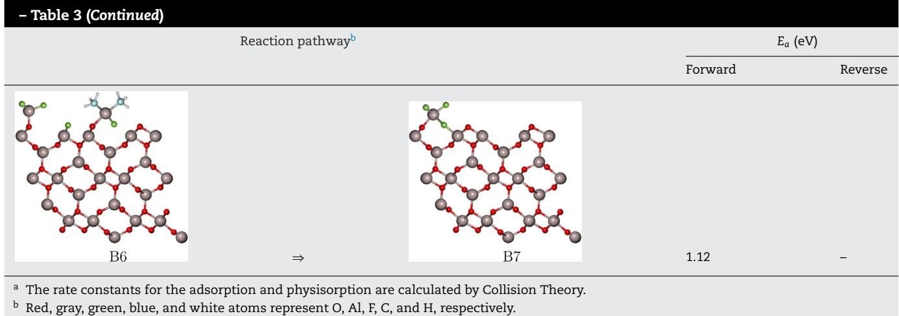

an HF is dissociatively adsorbed on the reaction site. The rate constant for dissociative adsorption is expressed as below:

$$
k_{d,ads} = \frac{2PA_{site}\sigma}{Z\sqrt{2\pi mk_BT}} \tag{4}
$$

where  $z$  is the coordination number, and  $\sigma$  is the sticking coefficient. The sticking coefficients of HF and TMA are given as 0.15 (Fontaine et al., 2012) and 0.02 (Schwille et al., 2017), respectively.

For the desorption, the surface, and the diffusion reactions, the rate constants can be given by the Arrhenius equation:

$$
k = \nu \exp \left(\frac{-E_a}{RT}\right) \tag{5}
$$

where  $\nu$  is the pre- exponential factor and  $E_{a}$  is the activation energy. The pre- exponential factor is defined by Transition- State Theory as follows:

$$
\nu = \frac{k_B T}{h}\frac{Q^\ddagger}{Q} \tag{6}
$$

where  $h$  is the Planck constant,  $Q^{\ddagger}$  is the partition function of the transition state, and  $Q$  is the partition function of the reactant. Though the pre- exponential factor is calculated from the partition functions of the reactants, the ratio of the partition functions can be approximated as 1 for simplicity (Jansen, 2012). Thus, this approximation is applied to this work.

# 3. Kinetic Monte Carlo simulation of etching process

The kinetic Monte Carlo (kMC) is a computational sampling work in the basis of the randomness, which has been widely used in various fields. The computational works for the atomic layer deposition (ALD) have been widely performed in different materials (Weckman et al., 2018; Ding et al., 2019; Yun et al., 2021) and the performance of the kMC has been approved. There are various kMC algorithms such as the variable step size method (VSSM), the random selection method (RSM), and the first reaction method (FRM) (Jansen, 2012). Among them, the VSSM has been widely used for the kMC simulation, which was developed by Bortz, Kalos, and Lebowitz (so- called BKL). The kMC simulation for the thermal ALE process of  $A1_{2}O_{3}$  using VSSM computes the progress of the etch process over time and the etch time where a single layer of the aluminum oxide is completely removed. The kMC simulation is performed according to the following procedure:

(7) First, a list of all possible reaction paths across all the reaction sites is prepared so that the total of the rate constants,  $k_{total}$ , is calculated as the sum of all the rate constants.

$$
k_{total} = \sum_{i = 1}^{N}k_{i} \tag{7}
$$

where  $k_{i}$  is the rate constant of the reaction  $i$ , and  $N$  is the number of the possible reaction paths.

(8) Then, a reaction path is chosen at a single reaction site using the algorithm defined as:

$$
\sum_{i = 1}^{q - 1}k_{i}\leq \gamma_{1}k_{total}\leq \sum_{i = 1}^{q}k_{i} \tag{8}
$$

where  $q$  represents the reaction,  $q$ , and  $\gamma_{1} \in (0, 1]$  is the first random number for the reaction selection. The reaction selection is performed at each reaction site with a random number that is generated for every reaction site. If the value of  $\gamma_{1} k_{total}$  falls between  $\sum_{i = 1}^{q - 1} k_{i}$  and  $\sum_{i = 1}^{q} k_{i}$ , reaction  $q$  is selected for the reaction site.

(9) When the reaction selection is completed across the reaction sites, a time interval is computed as follows:

$$
\Delta \mathfrak{t} = \frac{-\ln{\gamma_2}}{\mathfrak{k}_{total}} \tag{9}
$$

where  $\gamma_{2} \in (0, 1]$  is the second random number for the time progression.

(10) Finally, the system time changes,  $t \to t + \Delta t$ .

The system time of the VSSM (variable step size method) does not depend on the lattice size. However, it is governed by the sum of the rate constants with respect to all of the possible reaction paths in the system. After the simulation for all the reaction sites in the system is performed, the  $k_{total}$  is updated. In other words, the disabled reaction paths are removed from the list of the reactions, and the newly enabled reactions are included in the list. If the  $k_{total}$  is updated, the system repeats the aforementioned simulation steps until the stop condition (i.e., full etching) is fulfilled.

# 4. Feed-forward artificial neural network model

The half- cycle time is the most critical consideration when designing an industrial ALE process. The kMC model, initially proposed by Bortz et al. (1975), received increasing attention in molecular dynamic simulation due to its capability of generating a probabilistic model to mimic the randomness of molecular movement in the natural reaction. Therefore, the kMC simulation can provide a reliable reference to the half- cycle time. However, the kMC simulation is highly computationally demanding, especially for the process invoking large- scale particles and multi- step reactions, and on the other hand, it is a discontinuous open- form simulation. Thus, it may not be utilized directly as the supervising model for both the process operation and experimental decision- making tasks. A classical regression model, such as a polynomial regression model, may be considered to characterize the relationship between the inputs (pressure, temperature) and output (half- cycle time). Nevertheless, it may not be applicable due to the non- linearity and the randomness caused by the kMC simulation. Thus, significant efforts may be required for the classical regression analysis. On the other hand, a feedforward artificial neural network (FNN) model, as one of the robust data- driven deep learning models, can be trained easily regardless of the non- linearity while preserving fidelity and accuracy. Thus, FNN models are formulated in this work.

An artificial neural network (NN) is designed to portray a biological neuron, which is capable of perceiving and understanding the components that define objects, patterns, or concepts. From a mathematical perspective, artificial NNs collect and analyze data and then perform a regression analysis on the data to process their behavior at various conditions. The structure of the NN for this thermal ALE process with temperature and pressure defined as inputs to the NN in order to study their effect on the output, half- cycle time. The FNN model can be expressed in the following form:

$$
\begin{array}{r}\Upsilon = \mathrm{F}_{NN}(X) = \left\{ \begin{array}{ll}h_j^{[1]} = \sigma^{[1]}(\sum_{i = 1}^q\omega_{ji}^{[1]}x_i + b^{[1]})\\ h_j^{[2]} = \sigma^{[2]}(\sum_{i = 1}^q\omega_{ji}^{[2]}h_i^{[1]} + b^{[2]})\\ y_j = \sigma^{[0]}(\sum_{i = 1}^q\omega_{ji}^{[0]}h_i^{[0]} + b^{[0]}) \end{array} \right. \end{array} \tag{10}
$$

where  $b^{[k]}$  and  $\omega_{ji}^{[k]}$  are the biases and weights, respectively, connecting the ith input from the prior layer to the jth neuron in the kth layer,  $j = 1,\dots,q,k = 1,\dots,o$  .The notation  $q$  is the number of neurons in the kth layer and it is not necessary to be constant for each layer, and o stands for the output layer.  $\mathbf{X} = [\mathbf{x}_1,\dots,\mathbf{x}_n]\in \mathbb{R}^n$  and  $\mathbf{Y} = [\mathbf{y}_1,\dots,\mathbf{y}_m]\in \mathbb{R}^m$  are the input vectors containing the operating states of the process and the corresponding output vector.  $\sigma^{[k]}$  denotes the activation function taking outputs from the prior layer in the calculation of hidden neurons  $h_j^{[k]}$  in the kth layer.

In this work, as shown in Fig. 2, two two- input- singleoutput FNN models are developed with two hidden layers to apply to Steps A and B for nonlinear regression, respectively. TensorFlow's Keras, which is an API(Application Programming Interface) widely used to build and train deep- learning models, is used to build the FNN models. Both FNN models have two neurons in the input layer and one neuron in the output layer representing the pressure and temperature as the causation and the half- cycle time as the consequent.  $80\%$  of the data points of the kMC simulation is chosen randomly for training the FNN models while the remaining kMC data points are used for the model evaluation. The models for Steps A and B contain 50 neurons each in the first and second hidden layers, which were selected due to the complexity of their reaction mechanisms.

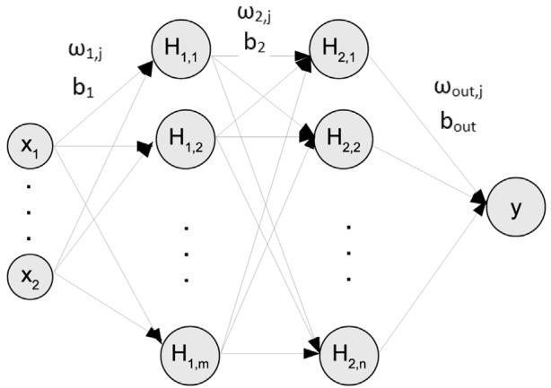  
Fig.2-Two-input-one-output FNN model with two hidden layers.

The exponential linear unit (ELU) equation is utilized for all layers, as defined in Eq. (11), in order for the activation function to have effective gradient propagation and smoother prediction:

$$
ELU(z) = \left\{ \begin{array}{ll}z & \text{for} z > 0\\ \alpha (e^z -1) & \text{for} z\leq 0 \end{array} \right. \tag{11}
$$

where  $\alpha$  is a positive constant. Subsequently, the FNN is trained in terms of minimizing the following mean square error function:

$$
Loss(X,\Omega) = \frac{1}{N_D}\sum_{i = 1}^{N_D}[\hat{y} -F_{NN}(X,\Omega)]^2 \tag{10}
$$

where  $\Omega = [\omega_{11}^{[1]},\dots,\omega_{10}^{[0]},b^{[1]},\dots,b^{[0]}]$  is the weight vector containing all the weights and biases to be optimized.  $N_{D}$  denotes the number of data points in the training data set, and  $\hat{y}$  is the reference output value. The optimum weight vectors  $\Omega^{*}$  are calculated by adopting the "Adam" optimizer.

# 5. Simulation results

# 5.1. Validation of microscopic kinetic Monte-Carlo model

A number of the kMC simulations with the lattice size of  $50\times 50$  through  $1500\times 1500$  were performed to investigate their dependence on lattice size. There was no significant disparity among different- sized lattice models, which is supported by Huang et al. (2010). In this work, the  $300\times 300$  lattice is applied to the microscopic model. Fig. 3 plots the lattice at different times in the course of the simulation, which visualizes how the etch process takes place on the reaction sites. The lattice simulation begins with the blue color, which represents the surface of the aluminium oxide substrate. As the reaction

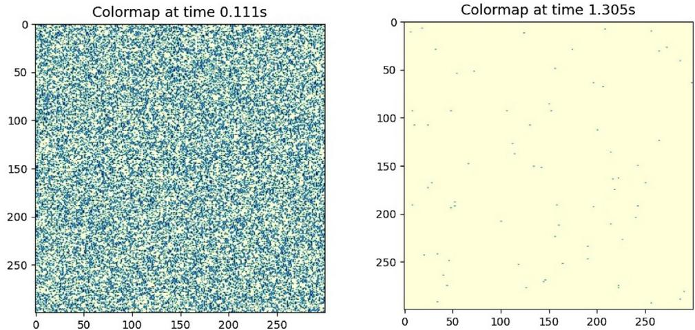  
Fig. 3 - Film structure from the kMC simulations for Step A. The simulation begins with blue colors (unetched film). When the simulation progresses, a reaction site that is etched turns yellow. The left map shows the lattice at 0.111 s and the right one shows the lattice at 1.305 s. (For interpretation of the references to color in this figure legend, the reader is referred to the web version of this article.)

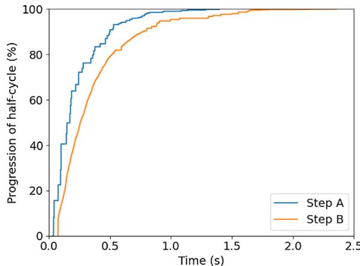  
Fig. 4 - Reaction progression of half-cycles for both steps over time with an operating temperature of 573 K. The full progression is achieved at 1.38 s for Step A and 2.38 s for Step B, respectively.

progresses, the color of each reaction site turns yellow, which indicates that the surface is fluorinated. Eventually, the lattice completely turns yellow, which indicates full fluorine coverage and that the half- cycle is complete.

The progression of the half- cycle over time for both steps is shown in Fig. 4. A monolayer of  $\mathrm{Al_2O_3}$  is fully fluorinated as  $\mathrm{AlF_3}$  at 1.38 s, and then, the modified thin film of  $\mathrm{AlF_3}$  from Step A is completely etched at 2.38 s. The microscopic model of this work can be validated from the experimental results (Lee et al., 2016). From the results of Lee's work, nearly self- limiting behavior was observed after 1.0 s of HF exposure for Step A, and then there was no significant mass change of the substrate after 1.5 s. The half- cycle time of 1.38 s calculated from this kMC simulation lies within this range of times. For Step B, the experimental results indicate that there is no considerable mass change of the substrate after 2.25 s of TMA exposure, and thus, it can be regarded that the fluorinated layer is fully etched at 2.25 s. Likewise, the half- cycle time of 2.38 s from the kMC simulation is comparable to the experimental half- cycle time of 2.25 s. Therefore, it is demonstrated that the developed microscopic model successfully characterizes the thermal ALE process of aluminum oxide.

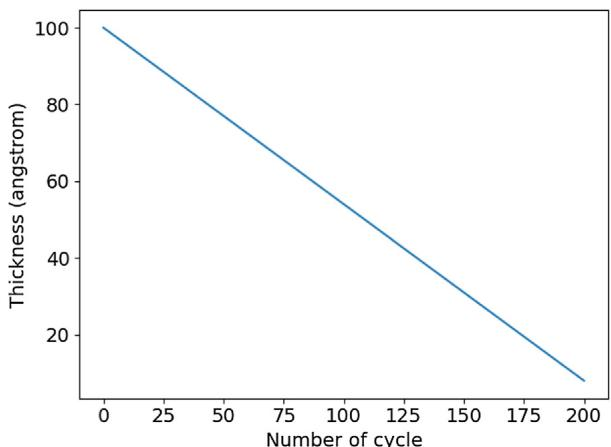  
Fig. 5 - Film thickness with respect to number of cycles. It is assumed that the initial thickness is 100 Å. An etch thickness per cycle of 0.46 Å/cycle is applied.

The developed microscopic model does not provide the etch per cycle (EPC). Nevertheless, it is capable of plotting the thickness of the wafer over the number of cycles by using the experimental data. The EPC was observed as 0.46 Å/cycle (George, 2020), which is employed to graph the thickness over the number of cycles as shown in Fig. 5. The initial thickness is assumed to be 100 Å. The microscopic model can also provide the mass change of each half- cycle. Fig. 6a provides the mass change over time for 3 cycles in which the mass change of 13 and  $- 29 \mathrm{ng} / \mathrm{cm}^2$  are applied for HF and TMA, respectively. The purge time is set to 30 s for Steps A and B. During Step A, the mass change increases as 3 oxygen atoms are released, meanwhile, 6 fluorine atoms are attached onto the surface. After the purge time of 30 s, a  $\mathrm{AlF_3}$  monolayer is etched, thus leading to the reduction in the mass change. Fig. 6b reveals that the lower the temperature, the longer it would take for 3 cycles to run. These results are expected because the rate constants are calculated by the Arrhenius equation.

# 5.2. FNN Model Validation and Prediction

In order to train a data- driven deep learning model, data sets should be generated for various operating conditions. As shown in Fig. 7a and b, the kMC model is executed with a

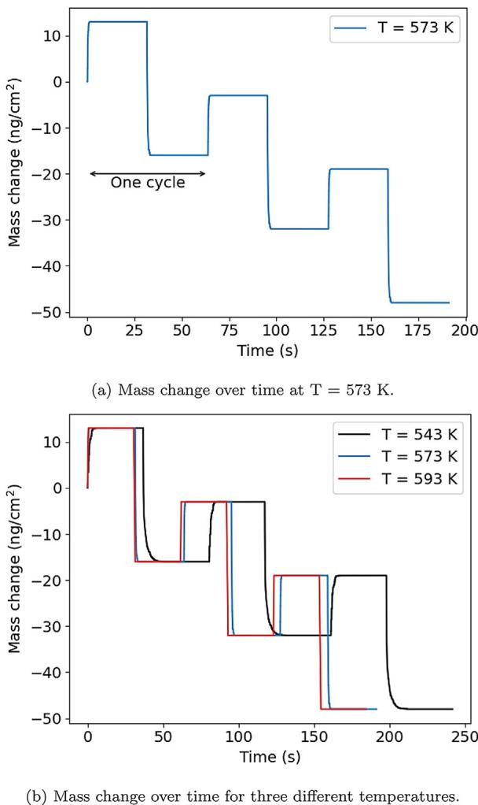

pressure range of  $10 - 100Pa$  in intervals of  $5\mathrm{Pa}$  and with a temperature range of  $533 - 598K$  in intervals of  $5\mathrm{K}$ . For generating data sets, the stop condition of the kMC simulation is set to  $99.9\%$  of the full etch progression. The kMC computational time for a single data point (i.e., half- cycle time) depends on the input parameters, but it took about  $20\mathrm{min}$  on average with 64 GB memory. The data sets were collected from an average of 10 simulations for each operating condition so that the randomness of the kMC simulation yields a lesser effect on the results. The data sets for both half- cycles were generated and were employed for the training and validation of the feed- forward artificial neural network (FNN) model discussed in Section 4. With respect to the training of the FNN models, it took less than  $5\mathrm{min}$  on average with the same processor for the kMC simulation. However, once the model was trained, it took less than a second to predict a data point, which is sufficient for real- time operational parameter calculation since a batch run for a half- cycle typically takes less than 5 seconds in the semiconductor industry. In other words, the FNN models can be used for real- time operational control for the semiconductor industry.

The results from the FNN model indicate that there is an agreement between the operating conditions and the halfcycle time. The comparisons between the data from the kMC model and the predicted data from the FNN model are represented in Fig.8. A mean squared error of  $0.0856\%$  and  $0.175\%$  for the sample test size data set  $20\%$  of the data points from the kMC data set) was calculated for Steps A and B, respectively, which indicates that the regression model is characteristic of the data from the kMC model. The scatter plots in Fig. 8a and c demonstrate that the FNN data are representative of the kMC data. The accuracy of the predictions is visualized in the line plots as shown in Fig. 8b and d, which shows a majority of data points in the predicted time region. Therefore, the results of the FNN model verifies that the trained FNN model accurately provides the half- cycle time without demanding kMC computational work.

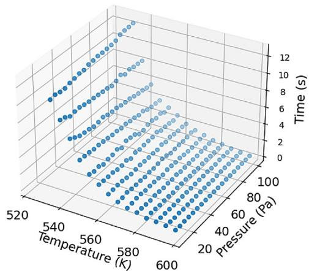  
(a) Data set for Step A generated from the microscopic model.

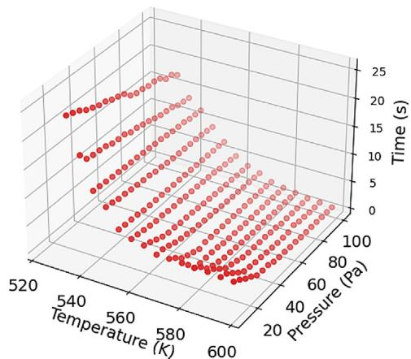  
Fig. 6 - Mass change over time during 3 cycles with purge time of  $30s$ .  
(b) Data set for Step B generated from the microscopic model. Fig. 7 - Data points collected for Step A and Step B at various operating conditions.

As shown in Fig. 9a and c, the contour plots depict the half- cycle times at various temperature and pressure ranges. The objective of these graphs is to determine whether the given operating conditions are feasible or not in an industrial setting. The threshold half- cycle times for the feasible operating conditions are defined as 1.5 and  $2.5s$  for Steps A and B, respectively, as aforementioned in Section 5.1 and visualized in Fig. 9b and d. This is reasonable for the steady- state microscopic kMC modeling. If a gas transport time- scale domain of  $2 - 3s$  is considered, the overall process time including the half- cycle time in the microscopic domain and the gas transport time in the macroscopic domain can be less than the industrial half- cycle time of  $5s$ .

The contour plots for both steps show different patterns. Fig. 9a reveals that Step A is independent on pressure as opposed to Fig. 9c for Step B, which indicates that the process is pressure- dependent on the TMA reagent. In other words, the half- cycle time does not vary significantly in different operating pressures, which is unsurprising due to HF

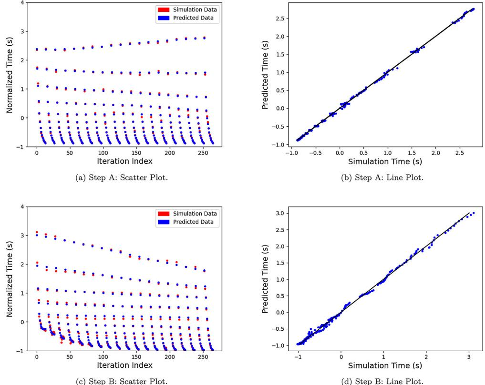  
Fig. 8 - Comparison of the kMC simulation data and of the predicted data calculated by the PIN for Steps A and B. Scatter (a) and line (b) plots of Step A represent a mean squared error of  $0.0856\%$ , which were calculated from  $20\%$  of the data points of the full kMC data set for Step A. Scatter (c) and line (d) plots of Step B represent a mean squared error of  $0.175\%$ , which were calculated from  $20\%$  of the data points of the full kMC data set for Step B.

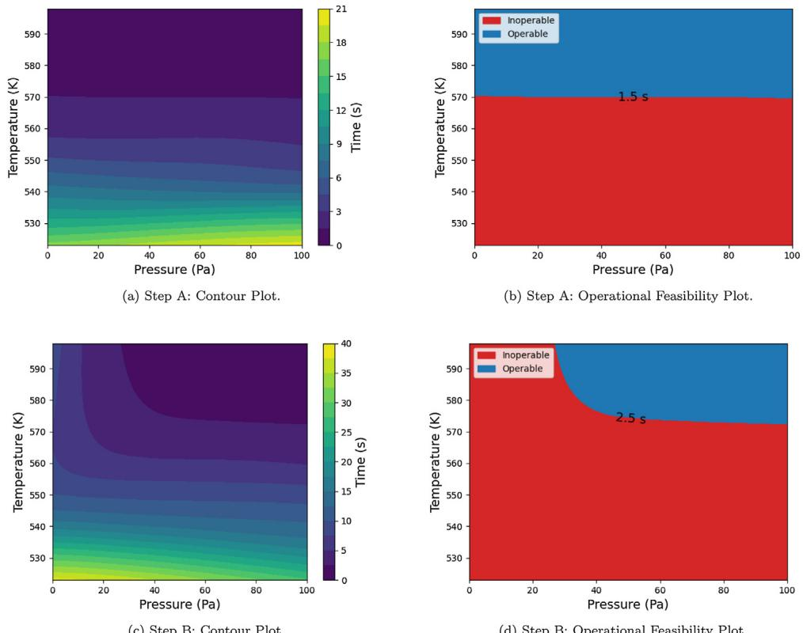  
Fig. 9 - Comparison of the projected half-cycle time zones at differing operating conditions for temperature and pressure of the reagents. For Step A, a time contour plot (a) and an operational feasibility plot (b) with a feasible time range of  $1.5\mathrm{s}$  are shown. For Step B, a time contour plot (c) and an operational feasibility plot (d) with a feasible time range of  $2.5\mathrm{s}$  are shown.

molecules being readily adsorbed to the surface from a kinetic perspective. However, Step B is pressure- dependent, which is caused by the kMC model equipped with the kinetic mechanisms of Step B. If a TMA molecule adsorbs and remains on the reaction site, the secondary TMA cannot react with the surface molecule due to the instability and the steric hindrance effect. In addition, no matter how low the operating pressure is, the first TMA adsorption occurs due to the so- called no- rejection rule of the kMC model minus, the secondary adsorption increases with increasing pressure.

# 6. Conclusion

In this work, microscopic and data- driven models were developed for the thermal atomic layer etching (ALE) process of aluminum oxide. First, the kinetic mechanisms for HF and TMA were proposed and their activation energies were determined by DFT (density functional theory)- based electronic structure calculations, which were performed by Quantum ESPRESSO. The kinetic mechanisms and parameters were then used in a microscopic model using the kinetic Monte Carlo (kMC) algorithm. The kMC model was validated with available experimental results. Subsequently, the kMC model was used to generate data points for various operating conditions, which were used to train a computationally efficient feedforward artificial neural network (FNN) model that can be used to determine optimal operating conditions in real- time. Based on the development of the reaction network in this work, the design of a reactor that can yield the desired etching results can be developed. Future work aims to broaden this research into macroscale modeling of an ALE reactor chamber by accounting for the effects of fluid dynamics, heat transfer, and mass transport phenomena.

# Conflict of interest

None declared.

# Declaration of Competing Interest

The authors report no declarations of interest.

# Acknowledgments

Financial support from the National Science Foundation is gratefully acknowledged. In addition, our thanks to our colleague, Feiyang Ou, for contributing to the machine learning portion of this work.

# References

Bortz, A., Kalos, M., Lebowitz, J., 1975. A new algorithm for Monte Carlo simulation of Ising spin systems. J. Comput. Phys. 17, 10- 18. Broas, M., Kanninen, O., Vuorinen, V., Tulli, M., Paulasto- Kröckel, M., 2017. Chemically stable atomic- layer- deposited  $\mathrm{Al}_2\mathrm{O}_3$  films for processability. ACS Omega 2 (7), 3390- 3398. Ding, Y., Zhang, Y., Kim, K., Tran, A., Wu, Z., Christofides, P.D., 2019. Microscopic modeling and optimal operation of thermal atomic layer deposition. Chem. Eng. Res. Des. 145, 159- 172. Ding, Y., Zhang, Y., Orkoulas, G., Christofides, P.D., 2020. Microscopic modeling and optimal operation of plasma

enhanced atomic layer deposition. Chem. Eng. Res. Des. 159, 439- 454. DuMont, J.W., George, S.M., 2017. Competition between  $\mathrm{Al}_2\mathrm{O}_3$  atomic layer etching and  $\mathrm{AlF}_3$  atomic layer deposition using sequential exposures of trimethylaluminum and hydrogen fluoride. J. Chem. Phys. 146, 052819. DuMont, J.W., Marquart, A.E., Cano, A.M., George, S.M., 2017. Thermal atomic layer etching of  $\mathrm{SiO}_2$  by a conversion- etch mechanism using sequential reactions of trimethylaluminum and hydrogen fluoride. Appl. Mater. Interfaces 9, 10296- 10307. Fontaine, H., Veillerot, M., Danel, A., 2012. Deposition behavior of volatile acidic contaminants on metallic interconnect surfaces. Mater. Sci. 103- 104, 365- 368. George, S.M., 2020. Mechanisms of thermal atomic layer etching. Acc. Chem. Res. 55, 1151- 1160. Huang, J., Hu, G., Orkoulas, G., Christofides, P.D., 2010. Dynamics and lattice- size dependence of surface mean slope in thin- film deposition. Ind. Eng. Chem. Res. 50, 1219- 1230. Jansen, A.P.J. (Ed.), 2012. An Introduction to Kinetic Monte Carlo Simulations of Surface Reactions, Vol. 1. Academic Press, London. Kanarik, K.J., Lill, T., Hudson, E.A., Sriraman, S., Tan, S., Marks, J., Vahedi, V., Gottscho, R.A., 2015. Overview of atomic layer etching in the semiconductor industry. J. Vacuum Sci. Technol. A 33, 020802. Kanarik, K.J., Tan, S., Gottscho, R.A., 2018. Atomic layer etching: rethinking the art of etch. J. Phys. Chem. Lett. 9, 4814- 4821. Lee, Y., DuMont, J.W., George, S.M., 2016. Trimethylaluminum as the metal precursor for the atomic layer etching of  $\mathrm{Al}_2\mathrm{O}_3$  using sequential, self- limiting thermal reactions. Chem. Mater. 28, 2994- 3003. Lee, Y., George, S.M., 2015. Atomic layer etching of  $\mathrm{Al}_2\mathrm{O}_3$  using sequential, self- limiting thermal reactions with Sn(acac)2. ACS Nano 9, 2061- 2070. Lim, W.S., Kim, Y.Y., Kim, H., Jang, S., Kwon, N., Park, B.J., Ahn, J., Chung, I., Hong, B.H., Yeon, C.Y., 2012. Atomic layer etching of graphene for full graphene device fabrication. Carbon 50, 429- 435. Natarajan, S.K., Elliott, S.D., 2018. Modeling the chemical mechanism of the thermal atomic layer etch of aluminum oxide: a density functional theory study of reactions during HF exposure. Chem. Mater. 30, 5912- 5922. Park, S.D., Lee, D.H., Yeom, G.Y., 2005. Atomic layer etching of Si(100) and Si(111) using  $\mathrm{Cl}_2$  and Ar neutral beam. Electrochem. Solid- State Lett. 8, C106- C109. Pitriana, P., Wungu, T.D.K., Herman, H., Hidayat, R., 2018. The computation parameters optimizations for electronic structure calculation of  $\mathrm{LiPbI}_3$  perovskite by the density functional theory method. IOP Conf. Ser. Mater. Sci. Eng. 434, 012026. Rahane, A.B., Deshpande, M.D., Kumar, V., 2011. Structural and electronic properties of  $(\mathrm{Al}_2\mathrm{O}_3)_n$  clusters with  $n = 1 - 10$  from first principles calculations. J. Phys. Chem. C 115, 18111- 18121. Schwille, M.C., Schossler, T., Schon, F., 2017. Temperature dependence of the sticking coefficients of bis- diethyl amionsilane and trimethylaluminum in atomic layer deposition. J. Vacuum Sci. Technol. A 35, 01B119. Sheppard, D., Xiao, P., Chemelewski, W., Johnson, D.D., Henkelman, G., 2012. A generalized solid- state nudged elastic band method. J. Chem. Phys. 136, 074103. Weckman, T., Shirazi, M., Elliott, S.D., Laasonen, K., 2018. Kinetic Monte Carlo study of the atomic layer deposition of zinc oxide. J. Phys. Chem. C 122, 27044- 27058. Yun, S., Ding, Y., Zhang, Y., Christofides, P.D., 2021. Integration of feedback control and run- to- run control for plasma enhanced atomic layer deposition of hafnium oxide thin films. Comput. Chem. Eng. 148, 107267. Zhou, R.S., Snyder, R.L., 1991. Structures and transformation mechanisms of the  $\gamma$ ,  $\gamma$  and  $\theta$  transition aluminas. Acta Crystallogr. B47, 617- 630.