# Modeling the Chemical Mechanism of the Thermal Atomic Layer Etch of Aluminum Oxide: A Density Functional Theory Study of Reactions during HF Exposure

Suresh Kondati Natarajan and Simon D. Elliott\*

Tyndall National Institute, University College Cork, Lee Maltings, Dyke Parade, Cork T12 RSCP, Ireland

Supporting Information

ABSTRACT: Thermal atomic layer etch, the reverse of atomic layer deposition, uses a cyclic sequence of plasma- free and solvent- free gas surface reactions to remove ultrathin layers of material with a high degree of control. A theoretical investigation of the hydrogen fluoride pulse in the thermal atomic layer etch of monoclinic alumina has been performed using density functional theory calculations. From experiments, it has been suggested that the HF pulse forms a stable and nonvolatile layer of  $\mathrm{AlF}_3$  on an alumina surface. Consistent with this, the desorption of an  $\mathrm{AlF}_3$  molecule from an HF- saturated surface was computed to be energeti cally unfavorable. HF molecules adsorbed on the alumina surface by forming hydrogen bonds and either remained intact or dissociated to form Al- F and  $\mathrm{O - H}$  species. At higher coverages, a mixture of molecularly and dissociatively adsorbed HF molecules in a hydrogen- bonded network was observed. Binding energies converged as the coverage of dissociated F became saturated, consistent with a self- limiting reaction. The formation of  $\mathrm{H}_2\mathrm{O}$  molecules in the HF pulse was found to be endoergic with an energy barrier of at least  $+0.9\mathrm{eV}$  but their subsequent desorption was computed to cost as little as  $+0.2\mathrm{eV}$  On the basis of a model of the saturated Al- F surface, the theoretical maximum of the etch rate was estimated to be  $- 0.57\pm 0.02\mathrm{\AA}/$  cycle  $(- 20.0\pm 0.8\mathrm{ngcm}^{- 2}\mathrm{cycle}^{- 1})$  , which matches the range of maximum experimental values. The actual etch rate will, however, be dependent on the specific reagent used in the subsequent step of the atomic layer etch cycle.

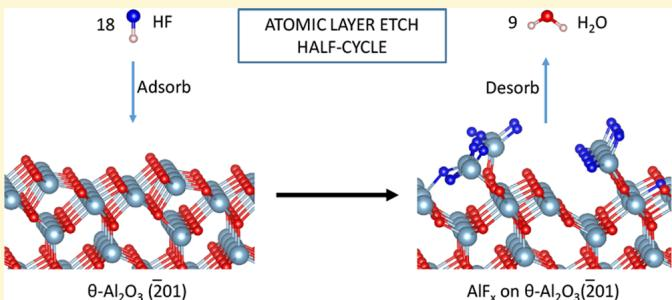

# INTRODUCTION

With Moore's law driving semiconductor devices to ever- smaller dimensions, atomic scale precision in device fabrication has become imperative. While atomic layer deposition (ALD) has already been established as a key enabler in cutting- edge semiconductor device manufacturing, it still has to be augmented with robust atomically controlled selective etching to fabricate next- generation devices. Historically, etching of materials has been performed using plasma in the process known as "dry etching". The plasma, an energized gas containing ions and radicals, continuously etches the material as long as it is switched on or until stops or masks are reached, making it a relatively uncontrolled process. Because the critical dimensions of semiconductor devices have shrunk tremendously, etch accuracy down to a single atomic layer has become necessary.

Atomic layer etch (ALE) opens up a new degree of control in material processing and lowers the cost by removing the need for etch stops. In ALE, the substrate is sequentially exposed to self- limiting etch reactions that affect the substrate material just one atomic layer at a time. This can also be understood in terms of the synergy concept published by Kanarik et al. Currently, there are two different approaches to ALE. In the first approach, the surface is modified by halogenation and high- energy ion bombardment is then used to remove the modified layer.12- 14 This method is anisotropic in nature because the energized ions travel toward the surface in one direction only. To keep this step as self- limiting as possible, accurate control of the ion energies and process conditions is required. An alternative approach to the use of high- energy ions is termed "thermal" ALE, as it uses thermally activated reactions to remove the modified layer. Because only non- ionized gas phase precursors are used, this method allows for isotropic etching of materials even at high aspect ratios. Typically, the thermal energy used in such etch processes is much lower than the ion bombardment energy, and therefore, this method could be used when materials are sensitive to the high- energy techniques. For particular applications, a combination of directional plasma ALE and thermal ALE can also be considered.

Thermal ALE can also be viewed as the reverse of ALD in which the target material is grown a fraction of an atomic layer in each cycle. In ALD, the success of the technique depends on the ability to create a stable and nonvolatile layer at the surface of the substrate. Conversely, the focus in thermal ALE is in the formation of a layer of volatile species via surface reactions.

Combining ALD and thermal ALE could allow the manufacture of an ultrasmooth thin film in which ALD grows the film and thermal ALE smooths it. Thermal ALE is thus likely to be essential for the sub-  $10\mathrm{nm}$  critical dimensions in semiconductor technology, e.g., for processing nanowires and nanosheets for gate- all- around transistors and vertical NAND flash memories.

A thermal ALE cycle typically consists of two precursor pulses and two purges as shown in Figure 1a. In the first pulse, precursor 1 is allowed to interact with the clean substrate that must be etched and chemically "modifies" the exposed surface atomic layer. This surface modification has to be self- limiting in nature; i.e., the intermediates produced in the reaction must not be volatile species that would continuously desorb and lead to uncontrolled etching of the substrate. Any additional precursor molecules that do not participate in the surface modification and other byproducts are purged away efficiently. In the second pulse, precursor 2 (for example, a ligand exchanging agent) is introduced into the ALE chamber to interact with the modified layer of the substrate and produce stable and volatile byproducts. It is important once again that this step is also self- limiting in nature and that the precursor 2 molecules do not interact with the "unmodified" substrate atoms. The volatile byproducts and unreacted precursor molecules are then safely removed in the second purge event, which leaves a clean substrate layer. This completes one ALE cycle. In some cases, the second precursor pulse may leave nonvolatile species at the surface that may block surface sites for the first precursor in the next cycle.

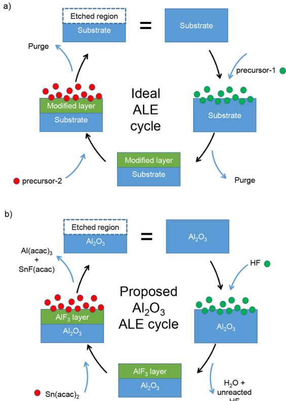  
Figure 1. (a) Schematic representation of an ideal ALE cycle. (b) Schematic representation of a proposed  $\mathrm{Al}_2\mathrm{O}_3$  ALE cycle.

The thermal ALE cycle of  $\mathrm{Al}_2\mathrm{O}_3$  with alternating fluorination (using HF) and ligand exchange reactions [using  $\mathrm{Sn(acac)}_2$ ] was developed by George and co- workers, and the proposed mechanism is given in Figure 1b. In the first pulse, HF gas is introduced on a clean  $\mathrm{Al}_2\mathrm{O}_3$  surface. The HF molecules adsorb to the surface and form a stable and nonvolatile  $\mathrm{AlF}_3$  layer, releasing  $\mathrm{H}_2\mathrm{O}$  as a byproduct, which is purged away along with unreacted HF. The spectral signature of an  $\mathrm{AlF}_3$  layer on aluminum has also been identified using FTIR experiments. Subsequently, a second precursor  $\mathrm{Sn(acac)}_2$  is introduced that exchanges its ligands with the  $\mathrm{AlF}_3$  layer and is proposed to produce volatile  $\mathrm{Sn(acac)F}$  and  $\mathrm{Al(acac)}_3$ , which are flushed away in the subsequent purge step. One ALE cycle is thus completed and has achieved etching of the  $\mathrm{Al}_2\mathrm{O}_3$  surface. These two precursors are also effective in the etching of other compounds such as narium oxide and aluminum nitride. Trimethylaluminum (TMA) has also been found to be an effective precursor for the ligand exchange pulse of  $\mathrm{Al}_2\mathrm{O}_3$  ALE. Because TMA and HF are also used as precursors for the ALD of  $\mathrm{AlF}_3$  films, there will be competition between  $\mathrm{AlF}_3$  ALD and  $\mathrm{Al}_2\mathrm{O}_3$  ALE in this case.

In this paper, we use density functional theory (DFT) calculations to probe the HF pulse in detail to understand the mechanism of fluorination of a bare  $\theta$ - alumina surface. Our main goal is to identify the key step that converts the Al- O bonds in the clean alumina surface to Al- F bonds during the HF pulse. On that basis, a HF- saturated surface model of ALD- deposited alumina will be constructed and a theoretical maximum of the etch rate will be deduced.

# METHOD AND COMPUTATIONAL DETAILS

In this paper, bulk as well as slab (surface) calculations have been performed within DFT using the Vienna ab initio simulation package (VASP), which uses plane wave basis sets to describe valence electrons, here with an energy cutoff of  $400\mathrm{eV}$ . The calculations are performed within spin- polarized generalized gradient approximation (GGA) using the Perdew- Burke- Ernzerhof (PBE) exchange- correlation (XC) functional, and the behavior of the core electrons is described by projector- augmented wave (PAW) potentials. To compute the energy of possible reactions, gas phase calculations of reagent molecules and byproducts have also been performed in a large periodic box with dimensions of  $15.0\mathrm{\AA}\times 16.0\mathrm{\AA}\times 15.5\mathrm{\AA}$  with an energy cutoff of  $400\mathrm{eV}$ .

As- deposited alumina films from ALD are in general amorphous. However, the majority of theoretical studies of alumina ALD in the literature use the  $\alpha$  phase in periodic models because it is the most stable crystalline phase. For example, a first- principles simulation of ALD of alumina on the  $\alpha - \mathrm{Al}_2\mathrm{O}_3$  (0 0 0 1) surface has been published. The mechanism of HF adsorption on the  $\alpha - \mathrm{Al}_2\mathrm{O}_3$  (0 0 0 1) surface has been studied in detail by Quan et al. However, ALD- deposited alumina is found to transform under annealing into  $\theta - \mathrm{Al}_2\mathrm{O}_3$ , which is the most stable transition phase of alumina. We therefore use  $\theta - \mathrm{Al}_2\mathrm{O}_3$  as a periodic model for ALD- grown alumina in this study. The first reported ab initio investigation of the properties of bulk and surface  $\theta - \mathrm{Al}_2\mathrm{O}_3$  used Hartree- Fock theory. In 2002, Cai et al. studied the transformation of  $\gamma - \mathrm{Al}_2\mathrm{O}_3$  to  $\theta - \mathrm{Al}_2\mathrm{O}_3$  using DFT calculations. Norskov and co- workers investigated the change in surface energy with an increasing thickness of  $\theta - \mathrm{Al}_2\mathrm{O}_3$  surface slabs using DFT calculations and reported that hydroxylated  $\theta - \mathrm{Al}_2\mathrm{O}_3$  surfaces may be more stable than those of  $\alpha$ - alumina. However, we did not find any published literature about the mechanism of HF adsorption on  $\theta - \mathrm{Al}_2\mathrm{O}_3$  surfaces.

The unit cell of monoclinic  $\theta - \mathrm{Al}_2\mathrm{O}_3$  consists of 8 Al atoms and 12 O atoms with lattice parameters  $a\neq b\neq c$  and  $(\alpha = \beta)\neq \gamma$ . To compute these parameters, we have simultaneously relaxed the atomic positions, cell shape, and cell volume with a higher energy cutoff (550 eV) and a  $2\times 4\times 4$  Monkhorst- Pack K- point sampling mesh. A convergence test for the choice of K- point mesh is also performed,

and the results can be seen in the section S1 of the Supporting Information. The computed lattice parameters are compared with the experimental values35 in Table 1, and it can be seen that there is a

Table 1. Lattice Parameters of Monoclinic  $\theta -\mathrm{Al}_2\mathrm{O}_3$  Computed with the PBE XC Functional with and without Dispersion Correction (TS, Tkatchenko-Scheffler method37) Compared with Experimental Results35,a  

<table><tr><td>lattice parameter</td><td>DFT (PBE)</td><td>DFT (PBE+TS)</td><td>experiment35</td></tr><tr><td>a (Å)</td><td>11.94</td><td>11.85</td><td>11.85</td></tr><tr><td>b (Å)</td><td>2.94</td><td>2.92</td><td>2.90</td></tr><tr><td>c (Å)</td><td>5.67</td><td>5.63</td><td>5.62</td></tr><tr><td>α (deg)</td><td>90.00</td><td>90.00</td><td>90.00</td></tr><tr><td>β (deg)</td><td>103.99</td><td>104.01</td><td>103.83</td></tr><tr><td>γ (deg)</td><td>90.00</td><td>90.00</td><td>90.00</td></tr></table>

$^a\mathrm{A}$  close agreement between the calculated and experimental values is observed, with a slight improvement due to inclusion of dispersion correction.

good agreement between them within an error of only  $2\%$  The band gap of bulk  $\theta - \mathrm{Al}_2\mathrm{O}_3$  is computed to be  $5\mathrm{eV}$  The overall band structure and the contributions of Al and  $\mathrm{o}$  to the total density of states are given in the section S2 of the Supporting Information. An illustration of the equilibrium bulk geometry of  $\theta - \mathrm{Al}_2\mathrm{O}_3$  along the  $^a a-$ $c^{\gg}$  plane is given in Figure 2a. Of the 8 Al atoms per cell, 4 are located

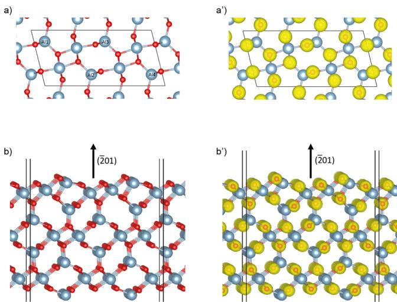  
Figure 2. (a and  $\mathbf{a}^{\prime}$  ) Equilibrium geometry of bulk  $\theta -\mathrm{Al}_2\mathrm{O}_3$  along the  $a - c$  lattice plane in panel a along with the valence charge density as yellow spheres in panel  $\mathbf{a}^{\prime}$  .The Al atoms marked with labels  $\mathrm{(Al1 - }$  Al4) are found in tetrahedral coordination sites of the oxygen lattice, while those that are not marked are in octahedral coordination sites. The isosurface value is set to  $0.2\mathrm{e} / \mathrm{\AA}^3$  b and  $\mathbf{b}^{\prime}$  Optimized geometry of the  $\mathrm{Al}_2\mathrm{O}_3$ $(\overline{2} 01)$  surface slab in panel b along with the valence charge density in panel  $\mathbf{b}^{\prime}$  . The isosurface value is set to 0.25  $\mathrm{e} / \mathrm{\AA}^3$  .It can be seen that the electrons are localized around the O atoms, which is an indication of predominantly ionic bonding between Al and O.

in tetrahedral coordination sites (labeled in the figure) and the other 4 in octahedral coordination sites relative to the oxygen lattice. In the equilibrium geometry, the valence electrons are found to be localized mainly around the O atoms reflecting the predominantly ionic character of the Al- O bond. We also performed Bader analysis36 on the charge density to find the valence charges on individual atoms, which revealed that only  $4.6\%$  of total valence electrons are around Al atoms average charge of  $+2.43$  and  $95.4\%$  are around O atoms (average charge of  $- 1.62$  ).We have also included the lattice constants obtained by adding dispersion corrections to the energy based on the

Tkatchenko- Scheffler method,37 and from Table 1, it is evident that this additional description of dispersion does not have a substantial effect on the structure of bulk alumina.

The surface of monoclinic  $\theta - \mathrm{Al}_2\mathrm{O}_3$  oriented at the  $(\overline{2} 01)$  plane is considered for the slab calculations. Even though this is not the most stable surface of  $\theta - \mathrm{Al}_2\mathrm{O}_3,$  34 it is considered in this study mainly because the ALD- deposited alumina has been found to grow along the  $(\overline{2} 01)$  surface orientation.31 A  $(1\times 4)$  supercell of a  $13\mathrm{\AA}$  thick  $(\overline{2} 0$  1) slab of  $\theta - \mathrm{Al}_2\mathrm{O}_3$  with fixed atoms at the bottom face and  $16\mathrm{\AA}$  of vacuum separating the slabs is used as the surface model  $\mathrm{(Al_{96}O_{144}}$  per cell). Calculations for obtaining converged values of the K- point mesh, the plane wave energy cutoff, and the vacuum thickness between slabs have been performed, and the results are tabulated in the section S1 of the Supporting Information. Figure 2b shows the optimized geometry of the  $\mathrm{Al}_2\mathrm{O}_3$ $(\overline{2} 01)$  slab along with the electronic valence charge density. Similar to the bulk case, it can be seen that the valence electrons are concentrated mostly around the oxygen atoms. The surface energy of the fully relaxed surface slab is found to be  $7.25\mathrm{eV} / \mathrm{nm}^2$

The first step of the alumina ALE process is the introduction of a fluorinating agent, in this case the HF molecule. At the optimized surface slab, HF molecules are introduced at various surface sites and at various coverages. The resulting geometries of slab and adsorbate atoms are further relaxed to obtain energetic minima. This is done to find the maximum possible coverage of  $\mathrm{F}$  atoms on the alumina surface, from which we can then estimate the maximum possible etch rate. For the geometry relaxation problem, we have adopted a twostep approach in which an estimated local minimum is first obtained from the conjugate gradient (CG) method, which is known to be efficient when the starting geometry is far from a local minimum, and the resulting geometry is reoptimized with a RMM- DIIS algorithm, which is known to be efficient close to the minimum, as implemented in VASP. The methodology of computing adsorption/binding energies and charge density difference is provided in section S3 of the Supporting Information.

# RESULTS

In the first part of this section, we evaluate the energetics of several postulated reactions to obtain a qualitative idea of the nature of the HF pulse, whether it etches or self- limits. Following that, the mechanism of molecular HF adsorption on a bare alumina surface is reported. This includes the estimation of minimum energy pathways for the migration of a H atom on the surface along with corresponding energetic barriers. In the next part, multiple HF adsorption and the resulting minimum energy geometries are investigated to understand the saturation of the alumina surface with HF. Toward the end of this section, a possible hydrogen transport mechanism and pathways leading to the formation and desorption of water molecules are reported.

Energetics of Overall Reactions. In this section, model reactions representing the HF pulse will be postulated and their energetics will be evaluated. The reaction energies  $(\Delta E)$  of the balanced reactions are listed in Table 2. Two types of reactions are considered, bulk  $\rightarrow$  gas and surface  $\rightarrow$  surface. In the case of bulk  $\rightarrow$  gas reactions, we assume bulk  $\theta - \mathrm{Al}_2\mathrm{O}_3$  and gaseous HF as the reactants that produce gaseous byproducts. These represent continuous etch reactions that produce volatile gaseous species, restore the initial surface, and thus etch away units of bulk alumina. For this computation, the equilibrium energy of bulk  $\theta - \mathrm{Al}_2\mathrm{O}_3$  and optimized gas phase energies of molecules are used. For the surface  $\rightarrow$  surface reactions, we assume a clean  $\mathrm{Al}_2\mathrm{O}_3$ $(\overline{2} 01)$  slab and gaseous HF as reactants and the corresponding F- covered alumina surface and  $\mathrm{H}_2\mathrm{O}$  as products. This represents a self- limiting reaction that saturates the surface with a stable and nonvolatile

Table 2. Reaction Energies  $(\Delta E)$  of Postulated Reactions of the HF Pulse Compared for Two Scenarios, Bulk  $\rightarrow$  Gas (continuous etching) and Surface  $\rightarrow$  Surface (self-limiting) Reactionsa  

<table><tr><td rowspan="2">label</td><td rowspan="2">possible reactions</td><td colspan="2">ΔE</td></tr><tr><td>eV/Al2O3</td><td>eV/HF</td></tr><tr><td colspan="4">bulk → gas</td></tr><tr><td>R1</td><td>Al2O3(b) + 6HF(g) → 2AlF3(g) + 3H2O(g)</td><td>0.40 (0.66)</td><td>0.07 (0.11)</td></tr><tr><td>R2</td><td>Al2O3(b) + 6HF(g) → Al2F6(g) + 3H2O(g)</td><td>-1.53 (-1.41)</td><td>-0.26 (-0.24)</td></tr><tr><td>R3</td><td>Al2O3(b) + 2HF(g) → 2AlOF(g) + H2O(g)</td><td>9.88 (10.84)</td><td>4.94 (5.42)</td></tr><tr><td colspan="4">surface → surface</td></tr><tr><td>R4</td><td>3Al2O3(surf) + 18HF(g) → 6AlF3(surf) + 9H2O(g)</td><td>-3.60</td><td>-0.60</td></tr></table>

aThe energy values are normalized per unit of  $\mathrm{Al}_2\mathrm{O}_3$  and per HF molecule for the purpose of comparison. The  $\Delta E$  values within parentheses refer to the PBE0 hybrid functional. (b) refers to the bulk,  $(\underline{\mathbf{g}})$  to the gas phase, and (surf) to the surface.

fluorinated layer  $\mathrm{AlF}_x$  (not necessarily a layer of  $\mathrm{AlF}_3$ ). To model an F- covered alumina surface, we have introduced  $18\mathrm{F}$  atoms as HF and removed  $9\mathrm{O}$  atoms as  $\mathrm{H}_2\mathrm{O}$  from the bare alumina surface model described in Method and Computational Details.

We consider three bulk  $\rightarrow$  gas reactions, namely,  $\mathrm{R}_1 - \mathrm{R}_3,$  where  $\mathrm{AlF}_3,$ $\mathrm{Al}_2\mathrm{F}_6,$  and AlOF, respectively, are the gas phase reaction byproducts along with  $\mathrm{H}_2\mathrm{O}$

$$
\begin{array}{r}\mathrm{R}_1\colon \mathrm{Al}_2\mathrm{O}_{3(\mathrm{b})} + 6\mathrm{HF}_{(\mathrm{g})}\rightarrow 2\mathrm{AlF}_{3(\mathrm{g})} + 3\mathrm{H}_2\mathrm{O}_{(\mathrm{g})}\\ \mathrm{R}_2\colon \mathrm{Al}_2\mathrm{O}_{3(\mathrm{b})} + 6\mathrm{HF}_{(\mathrm{g})}\rightarrow \mathrm{Al}_2\mathrm{F}_{6(\mathrm{g})} + 3\mathrm{H}_2\mathrm{O}_{(\mathrm{g})}\\ \mathrm{R}_3\colon \mathrm{Al}_2\mathrm{O}_{3(\mathrm{b})} + 2\mathrm{HF}_{(\mathrm{g})}\rightarrow 2\mathrm{AlOF}_{(\mathrm{g})} + \mathrm{H}_2\mathrm{O}_{(\mathrm{g})} \end{array} \tag{1}
$$

These reactions are nonredox type as Al, O, H, and F atoms retain their formal oxidation states of  $+3, - 2, + 1,$  and  $- 1,$  respectively. According to the  $\Delta E$  values in Table 2,  $\mathbb{R}_1$  and  $\mathbb{R}_2$  were found to be endoergic, whereas  $\mathbb{R}_2$  is exoergic. Moreover, the surface  $\rightarrow$  surface reaction

$$
\mathrm{R}_4\colon 3\mathrm{Al}_2\mathrm{O}_{3(\mathrm{surf})} + 18\mathrm{HF}_{(\mathrm{g})}\rightarrow 6\mathrm{AlF}_{3(\mathrm{surf})} + 9\mathrm{H}_2\mathrm{O}_{(\mathrm{g})} \tag{4}
$$

is found to be exoergic with a  $\Delta E$  value of  $- 3.6\mathrm{eV / Al}_2\mathrm{O}_3,$  which is much lower than that of  $\mathbb{R}_2$  .We have also computed the  $\Delta E$  values of the bulk  $\rightarrow$  gas reactions using the much more computationally expensive PBE0 hybrid functional and compared them to the PBE values in Table 2. It can be seen that the values obtained with the two functionals agree within  $0.04\mathrm{eV / HF}$  for  $\mathbb{R}_1$  and  $\mathbb{R}_2,$  suggesting that the PBE functional is reliable enough for these calculations. From these simplified models, it appears that HF will saturate to form an  $\mathrm{AlF}_x$  layer and not etch away  $\theta - \mathrm{Al}_2\mathrm{O}_3$  by itself under reactor conditions. Therefore, the next step is to find the key mechanism that is responsible for this  $\mathrm{AlF}_x$  layer formation on the alumina surface.

Adsorption of One HF to a Bare Alumina Surface. We initiated DFT- based adsorption calculations by introducing one HF molecule to the optimized  $(1\times 4)$  supercell of the  $\theta$ $\mathrm{Al}_2\mathrm{O}_3$ $(\overline{2} 01)$  surface. The detailed geometry of this supercell is provided in section S4 of the Supporting Information. Depending on the binding site of the HF molecule, it could either adsorb molecularly or dissociatively as shown in Figure 3. Molecular adsorption of the HF molecule to the surface via hydrogen bonding resulted in a binding energy of  $- 0.44\mathrm{eV}$  in geometry  $\mathrm{M}_{\mathrm{A}}^{\mathrm{I}}$  . Here,  $\mathrm{M}_{\mathrm{Y}}^{\mathrm{X}}$  refers to a minimum geometry where  $X$  is the number of HF molecules adsorbed on the  $(1\times 4)$  supercell of the  $\theta - \mathrm{Al}_2\mathrm{O}_3$ $(\overline{2} 01)$  surface and the alphabetical index  $\mathrm{Y}$  refers to a specific minimum of that configuration. For example,  $\mathbf{M}^{\mathrm{I}}$  refers to all the possible minimum geometries of the studied alumina surface with one adsorbed HF molecule.

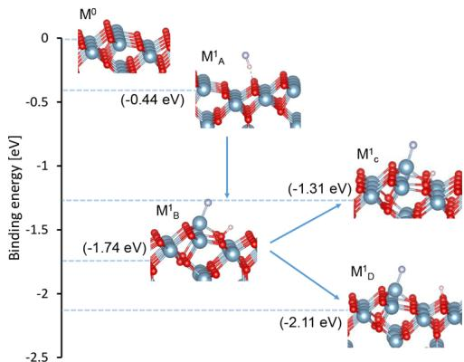  
Figure 3. Chart showing the geometries and binding energies of identified minima with respect to one HF adsorption at the  $\theta -\mathrm{Al}_2\mathrm{O}_3$ $(\overline{2} 01)$  surface. Here,  $\mathrm{M}^0$  corresponds to the clean alumina surface.  $\mathrm{M}_{\mathrm{A}}^{\mathrm{I}}$  and  $\mathrm{M}_{\mathrm{B}}^{\mathrm{I}}$  denote molecularly and dissociatively adsorbed HF, respectively.  $\mathrm{M}_{\mathrm{C}}^{\mathrm{I}}$  and  $\mathrm{M}_{\mathrm{D}}^{\mathrm{I}}$  refer to the geometries in which the dissociated H atom hopped to an adjacent O atom in the same row and to an oxygen atom in the adjacent row, respectively. Activation energies where computed are shown in Figure 4.

When more than one minimum is considered for discussion, we refer to them as  $\mathrm{M}_{\mathrm{A}}^{\mathrm{I}},\mathrm{M}_{\mathrm{B}}^{\mathrm{I}},$  etc. (see section S5 of the Supporting Information). We find that molecular adsorption results when the F atom in HF is not close enough to a surface Al atom for binding, which could drive HF dissociation. This shows that Al- F bonding is crucial for the HF splitting reaction to take place. In geometry  $\mathrm{M}_{\mathrm{B}}^{\mathrm{I}},$  the HF adsorbs dissociatively with a binding energy of  $- 1.74\mathrm{eV}$  and forms  $- \mathrm{Al - F}$  and  $- \mathrm{O - H}$  species on the surface. A detailed analysis of the nature of the HF splitting reaction for the formation of  $\mathrm{M}_{\mathrm{B}}^{\mathrm{I}}$  is discussed further below.

With  $\mathrm{M}_{\mathrm{B}}^{\mathrm{I}}$  as a starting point, two other minima are possible depending on where the H atom hops and binds. A further low- energy minimum  $\mathrm{M}_{\mathrm{D}}^{\mathrm{I}}$  with a binding energy of  $- 2.11\mathrm{eV}$  is possible when the H atom hops to the adjacent row of O atoms. Alternatively when the H atom is displaced in the same row of O atoms  $(\mathrm{M}_{\mathrm{C}}^{\mathrm{I}})$  binding becomes weaker and the binding energy increases to  $- 1.31\mathrm{eV}$ $\mathrm{M}_{\mathrm{D}}^{\mathrm{I}}$  and  $\mathrm{M}_{\mathrm{C}}^{\mathrm{I}}$  did not result directly from our geometry relaxation calculations, so there must be energetic barriers separating them from  $\mathrm{M}_{\mathrm{B}}^{\mathrm{I}}$  Using the climbing image nudged elastic band (CI- NEB) approach22,23 with three images between the minima, we computed minimum energy pathways (MEPs) connecting them and the activation energies, as shown in Figure 4. The MEP connecting  $\mathrm{M}_{\mathrm{B}}^{\mathrm{I}}$  and  $\mathrm{M}_{\mathrm{C}}^{\mathrm{I}}$  involves hopping of the H atom to the adjacent row of O atoms first (forming  $\mathrm{M}_{\mathrm{D}}^{\mathrm{I}}$ ) and then hopping back. Therefore, the MEP connecting  $\mathrm{M}_{\mathrm{D}}^{\mathrm{I}}$  and  $\mathrm{M}_{\mathrm{C}}^{\mathrm{I}}$  is

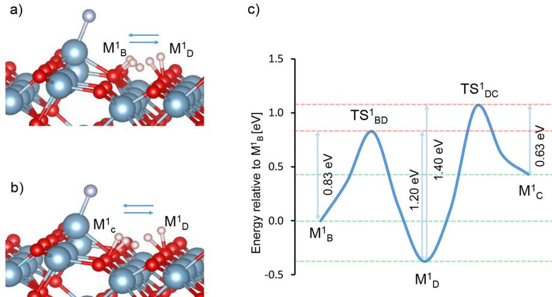  
Figure 4. (a) Pictorial representation of the pathway between minima  $\mathrm{M}_{\mathrm{B}}^{\mathrm{I}}$  and  $\mathrm{M}_{\mathrm{D}}^{\mathrm{I}}$  that shows an aggregate of all  $\mathrm{H}$  atom positions as the  $\mathrm{H}$  atom hops from one surface  $\mathrm{O}$  atom to another  $\mathrm{O}$  atom in the adjacent row. (b) Similarly, for the pathway between minima  $\mathrm{M}_{\mathrm{D}}^{\mathrm{I}}$  and  $\mathrm{M}_{\mathrm{C}}^{\mathrm{I}}$ . Three images are chosen between the two minima and are optimized within the CI-NEB approach. (c) The graph shows the energy difference of the images with respect to  $\mathrm{M}_{\mathrm{B}}^{\mathrm{I}}$  and the energy barriers with respect to panels a and b. Here,  $\mathrm{TS}_{\mathrm{BD}}^{\mathrm{I}}$  and  $\mathrm{TS}_{\mathrm{DC}}^{\mathrm{I}}$  represent the transition states connecting  $\mathrm{M}_{\mathrm{B}}^{\mathrm{I}} - \mathrm{M}_{\mathrm{D}}^{\mathrm{I}}$  and  $\mathrm{M}_{\mathrm{D}}^{\mathrm{I}} - \mathrm{M}_{\mathrm{C}}^{\mathrm{I}}$ , respectively.

also calculated. The  $\mathrm{H}$  transport MEPs  $\mathrm{M}_{\mathrm{B}}^{\mathrm{I}} - \mathrm{M}_{\mathrm{D}}^{\mathrm{I}}$  and  $\mathrm{M}_{\mathrm{D}}^{\mathrm{I}} - \mathrm{M}_{\mathrm{C}}^{\mathrm{I}}$  are shown in panels a and b of Figure 4, respectively, with a series of superimposed  $\mathrm{H}$  atoms representing the images connecting them. The plot in Figure 4c shows the relative energy difference of the images with respect to  $\mathrm{M}_{\mathrm{B}}^{\mathrm{I}}$  from which the forward and reverse barriers connecting  $\mathrm{M}_{\mathrm{B}}^{\mathrm{I}}$  and  $\mathrm{M}_{\mathrm{D}}^{\mathrm{I}}$  are found to be  $+0.83$  and  $+1.20 \mathrm{eV}$ , respectively. Similarly, the forward and reverse barriers connecting  $\mathrm{M}_{\mathrm{D}}^{\mathrm{I}}$  and  $\mathrm{M}_{\mathrm{C}}^{\mathrm{I}}$  are computed as  $+1.40$  and  $+0.63 \mathrm{eV}$ , respectively. Therefore, the most probable pathways for  $\mathrm{H}$  transport are from  $\mathrm{M}_{\mathrm{B}}^{\mathrm{I}}$  and  $\mathrm{M}_{\mathrm{C}}^{\mathrm{I}}$  to  $\mathrm{M}_{\mathrm{D}}^{\mathrm{I}}$ .

Figure 5 describes in detail the mechanisms involved in the dissociative adsorption of a HF molecule on an  $\mathrm{Al}_2\mathrm{O}_3$  (2 0 1) surface corresponding to geometry  $\mathrm{M}_{\mathrm{B}}^{\mathrm{I}}$ . This figure also includes a complementary graph showing the energy change relative to the initial geometry as well as the change in interatomic distance among  $\mathrm{H} - \mathrm{F}$ ,  $\mathrm{Al} - \mathrm{F}$ , and  $\mathrm{O} - \mathrm{H}$  ( $d_{\mathrm{H} - \mathrm{F}}$ ,  $d_{\mathrm{Al} - \mathrm{F}}$ , and  $d_{\mathrm{O} - \mathrm{H}}$ ) respectively) during geometry optimization. The labeled vertical dashed lines in the graph correspond to the geometries shown in the figure. Geometry a refers to the initial state in which the HF molecule is introduced  $\sim 3 \mathrm{\AA}$  from the surface. During optimization, the HF molecule approaches the surface until a hydrogen bond ( $d_{\mathrm{O} - \mathrm{H}} < 2.5 \mathrm{\AA}$ ) is made with a surface oxygen atom as shown in geometry b. In the graph, this can be observed from the correlated decrease in  $d_{\mathrm{Al} - \mathrm{F}}$  and  $d_{\mathrm{O} - \mathrm{H}}$  that ends at geometry b, beyond which the hydrogen bond continues to strengthen as indicated by the continued decrease in  $d_{\mathrm{O} - \mathrm{H}}$ . Moreover, a surface  $\mathrm{Al}$  atom is attracted by the  $\mathrm{F}$  atom, which is evident from its out- of- lattice position and decreasing  $d_{\mathrm{Al} - \mathrm{F}}$ . The strengthening of the hydrogen bond and the  $\mathrm{Al} - \mathrm{F}$  bond leads to cleavage of the  $\mathrm{HF}$  bond as seen in geometry c ( $d_{\mathrm{H} - \mathrm{F}} > 1.2 \mathrm{\AA}$ ), which marks the crossover point of  $d_{\mathrm{O} - \mathrm{H}}$  and  $d_{\mathrm{H} - \mathrm{F}}$ . The favorable nature of  $\mathrm{HF}$  bond dissociation in these circumstances is also indicated by a sharp decrease in the relative energy difference and an increase in  $d_{\mathrm{H} - \mathrm{F}}$  beyond geometry c in the graph. The splitting of  $\mathrm{HF}$  results in the formation of isolated  $- \mathrm{Al} - \mathrm{F}$  and  $- \mathrm{O} - \mathrm{H}$  species on the surface as seen in geometry d, which further decreases the energy difference. Beyond this point,  $d_{\mathrm{Al} - \mathrm{F}}$ ,  $d_{\mathrm{H} - \mathrm{F}}$ ,  $d_{\mathrm{O} - \mathrm{H}}$ , and the relative energy difference converge to stable values, indicating the formation of stable  $- \mathrm{Al} - \mathrm{F}$  and  $- \mathrm{O} - \mathrm{H}$  species resulting in minimum geometry e ( $\mathrm{M}_{\mathrm{B}}^{\mathrm{I}}$  in Figure 3). The final  $\mathrm{Al} - \mathrm{F}$  and  $\mathrm{O} - \mathrm{H}$  bond lengths are 1.67 and  $0.99 \mathrm{\AA}$ , respectively, and the F- bound  $\mathrm{Al}$  atom is displaced  $\sim 1 \mathrm{\AA}$  upward from its lattice position along the surface normal direction. The mechanism described above drives the conversion of  $\mathrm{Al} - \mathrm{O}$  bonds into  $\mathrm{Al} - \mathrm{F}$  bonds by means of the  $\mathrm{HF}$  splitting reaction, which results in the formation of an  $\mathrm{AlF}_{x}$  layer at the end of the  $\mathrm{HF}$  pulse. We find that the inclusion of dispersion corrections based on the TS scheme did not result in a significant difference in the geometry or in the binding energy values.

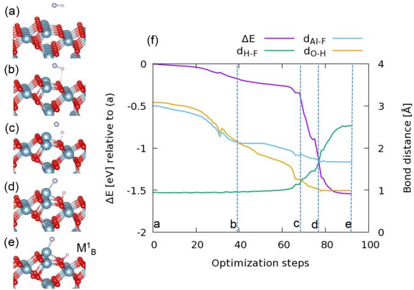  
Figure 5. Spontaneous dissociative adsorption of a HF molecule on the  $\theta -\mathrm{Al}_2\mathrm{O}_3$  (2 0 1) surface. Snapshots taken from geometry optimization run where geometry a is the chosen starting geometry with the HF molecule at least  $3.0 \mathrm{\AA}$  from the surface. The HF molecule hydrogen bonds to a surface  $\mathrm{O}$  atom in geometry b. The onset of the HF dissociation is given in geometry c. The completely dissociated HF forming  $-\mathrm{Al} - \mathrm{F}$  and  $-\mathrm{O} - \mathrm{H}$  species at the surface can be seen in geometry d. Final optimized geometry  $\mathrm{M}_{\mathrm{B}}^{\mathrm{I}}$  is shown in geometry e. Panel f shows the total energy of the system relative to the starting geometry (a) for the optimization steps along with the changes in  $\mathrm{Al} - \mathrm{F}$ ,  $\mathrm{H} - \mathrm{F}$ , and  $\mathrm{O} - \mathrm{H}$  bond distances.

To identify the nature of the surface  $- \mathrm{HF}$  bonding in  $\mathrm{M}_{\mathrm{B}}^{\mathrm{I}}$ , a charge density difference plot is constructed as shown in Figure

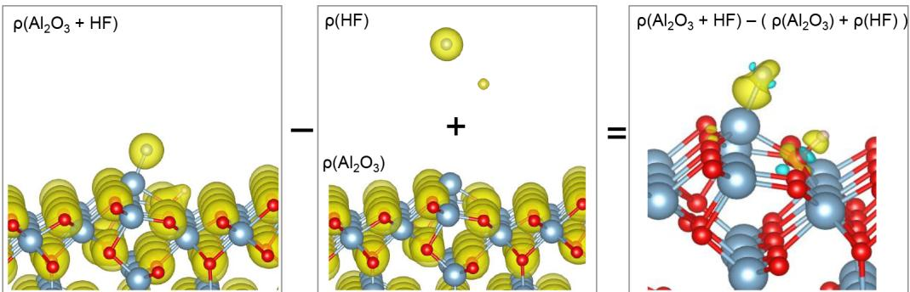  
Figure 6. Analysis of the charge density difference in geometry  $\mathrm{M}_{\mathrm{B}}$ . Here, the combined electronic charge density of the noninteracting systems  $\left[\rho \left(\mathrm{Al}_{2}\mathrm{O}_{3}\right)\right.$  and  $\left.\rho \left(\mathrm{HF}\right)\right]$  is subtracted from that of the interacting system  $\left[\rho \left(\mathrm{Al}_{2}\mathrm{O}_{3} + \mathrm{HF}\right)\right]$  to give the density difference plot at the right. The isosurface value for  $\rho \left(\mathrm{Al}_{2}\mathrm{O}_{3} + \mathrm{HF}\right)$ ,  $\rho \left(\mathrm{Al}_{2}\mathrm{O}_{3}\right)$ , and  $\rho \left(\mathrm{HF}\right)$  is  $0.1 \mathrm{e} / \mathrm{\AA}^{3}$ . The isosurface value for the difference plot at the right is  $0.02 \mathrm{e} / \mathrm{\AA}^{3}$ .

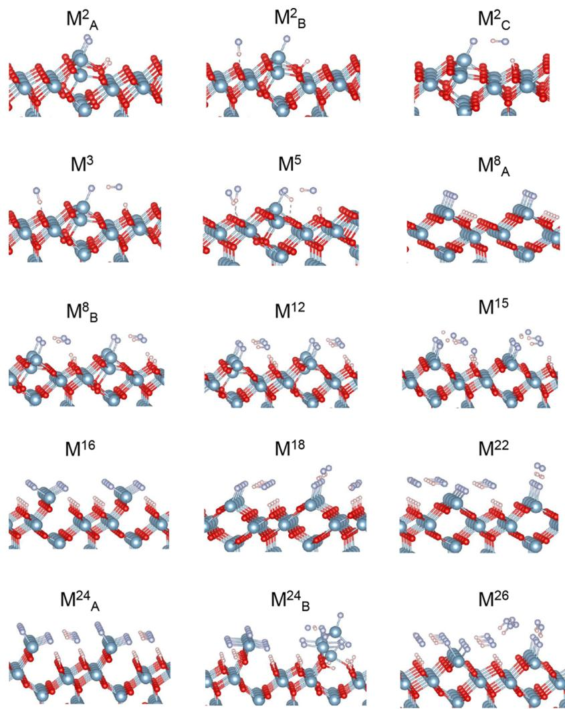  
Figure 7. Optimized geometries of  $2 - 26 \mathrm{HF}$  molecules adsorbed on the bare  $\mathrm{Al}_{2}\mathrm{O}_{3}$ $(\overline{2} 0 1)$  surface. Here,  $\mathrm{M}_{\mathrm{B}}^{\mathrm{X}}$  denotes a minimum with  $X \mathrm{HF}$  molecules, and in case there are several minima, they are indexed with a label Y. In some cases, multiple minima are shown to convey the fact that very different stable configurations are possible. In most of the minimum geometries shown above, a mixed dissociative and molecular adsorption of HF molecules can be seen.

6 in which electrons accumulate in the yellow region and are depleted in the cyan region. The charge density difference is obtained by subtracting the individual charge densities of the substrate  $\left[\rho \left(\mathrm{Al}_{2}\mathrm{O}_{3}\right)\right]$  and adsorbate molecule  $\left[\rho \left(\mathrm{HF}\right)\right]$  from the charge density of the combined geometry  $\left[\rho \left(\mathrm{Al}_{2}\mathrm{O}_{3} + \mathrm{HF}\right)\right]$ . From the figure, it can be seen that the electronegative  $\mathrm{F}$  atom gains electrons that are polarized toward the bound  $\mathrm{Al}$  atom at the surface and that the  $\mathrm{H}$  atom forms a covalent bond with a surface oxygen atom  $\left(d_{\mathrm{O - H}} = 0.99 \mathrm{\AA}\right)$ . The optimized geometry and charge density difference plots are similar to those of one  $\mathrm{HF}$  adsorbed on the  $\alpha - \mathrm{Al}_{2}\mathrm{O}_{3}$ $(0 0 0 1)$  surface reported by Quan et al.24 We also performed Bader charge analysis and found that the surface  $\mathrm{O} - \mathrm{H}$  and  $\mathrm{Al} - \mathrm{F}$  have

charges of  $- 0.85$  and  $+1.62$ , respectively. More information about this is given in section S6 of the Supporting Information.

Adsorption of Multiple HFs to Bare Alumina. In subsequent simulations, we introduced multiple HF molecules onto the bare  $\mathrm{Al}_2\mathrm{O}_3$ $(2.01)$  surface with coverages ranging from 1.2 to  $15.4\mathrm{HF / nm^2}$ . From the previous section, we know that  $\mathrm{Al - F}$  bond formation drives the HF splitting reaction. There are 8 topmost Al atoms on the surface of the  $(1\times 4)$  supercell (geometry in Figure 2 and also in section S4 of the Supporting Information) that can potentially form  $\mathrm{Al - F}$  bonds readily. It should be noted that for  $\leq 16\mathrm{HF}$  molecules, there is a possibility that all the adsorbed HF molecules will dissociate provided they adsorb in a certain fashion (see  $\mathrm{M}_{\mathrm{A}}^2$ ,  $\mathrm{M}_{\mathrm{A}}^3$ , and  $\mathrm{M}^{16}$  in Figure 7). Therefore, we introduced the HF molecules by hand in such a way that not all of the HF would bind to those 8 Al atoms and then optimized the resulting geometries. A mixture of molecular and dissociative adsorption of HF molecules is observed in the optimized geometries shown in Figure 7. A list of these minima along with the HF coverage,  $\mathrm{Al - F}$  coverage, and corresponding binding energies is given in Table 3. The least binding per HF is observed in the geometry Here,  $\mathrm{M}_{\mathrm{Y}}^{\mathrm{X}}$  denotes a minimum with  $X$  HF molecules, and in case there are several minima, they are indexed with a label Y. HF coverage denotes the coverage of the total number of HF molecules introduced into the supercell, whereas  $\mathrm{Al - F}$  coverage refers to the coverage of dissociated  $\mathrm{F}$  atoms that form  $\mathrm{Al - F}$  bonds.

Table 3. Adsorbate Coverages and Binding Energies for the Minimum Geometries  $\mathbf{M}_{\mathrm{Y}}^{\mathrm{X}}$  given in Figure  $7^{a}$  

<table><tr><td rowspan="2">minimum</td><td rowspan="2">HF coverage (nm-2)</td><td rowspan="2">Al-F coverage (nm-2)</td><td colspan="2">Ebind</td></tr><tr><td>eV/HF</td><td>eV/nm2</td></tr><tr><td>M1</td><td>1.2</td><td>1.2</td><td>-1.5</td><td>-1.8</td></tr><tr><td>M2</td><td>1.2</td><td>0.6</td><td>-1.1</td><td>-1.3</td></tr><tr><td>M3</td><td>1.2</td><td>0.6</td><td>-1.4</td><td>-1.7</td></tr><tr><td>M4</td><td>1.8</td><td>0.6</td><td>-1.2</td><td>-2.0</td></tr><tr><td>M5</td><td>3.0</td><td>0.6</td><td>-0.8</td><td>-2.5</td></tr><tr><td>M6</td><td>4.8</td><td>4.8</td><td>-1.5</td><td>-7.1</td></tr><tr><td>M7</td><td>4.8</td><td>2.4</td><td>-1.6</td><td>-7.6</td></tr><tr><td>M12</td><td>7.1</td><td>3.6</td><td>-1.5</td><td>-10.5</td></tr><tr><td>M15</td><td>8.9</td><td>4.8</td><td>-1.4</td><td>-12.1</td></tr><tr><td>M16</td><td>9.5</td><td>9.5</td><td>-1.5</td><td>-13.9</td></tr><tr><td>M18</td><td>10.7</td><td>4.8</td><td>-1.3</td><td>-13.7</td></tr><tr><td>M22</td><td>13.1</td><td>4.8</td><td>-1.2</td><td>-15.1</td></tr><tr><td>M24</td><td>14.3</td><td>9.5</td><td>-1.0</td><td>-14.4</td></tr><tr><td>M24</td><td>14.3</td><td>13.7</td><td>-1.1</td><td>-16.2</td></tr><tr><td>M26</td><td>15.5</td><td>7.1</td><td>-1.0</td><td>-16.0</td></tr></table>

with S HF molecules where only one HF molecule dissociated. Also, via comparison of the binding energies of  $\mathrm{M}_{\mathrm{A}}^2$  and  $\mathrm{M}_{\mathrm{B}}^2$  geometries, it may appear that the dissociation of HF molecules would lead to lower binding energies. However, from  $\mathrm{M}_{\mathrm{A}}^8$  and  $\mathrm{M}_{\mathrm{B}}^8$  geometries, it seems that the dissociation of all HF molecules is less favorable than that of a mixture of dissociative and molecular adsorption. In fact, the greatest binding energy per HF molecule is observed in the case of  $\mathrm{M}_{\mathrm{B}}^8$  where only 4 of the adsorbed HF molecules dissociated while the others formed hydrogen bonds with the remaining HF molecules and dissociated  $\mathrm{F}$  atoms. Therefore, as the HF coverage increases, we can expect more formation of a hydrogen- bonded HF network. The transport of  $\mathrm{H}$  atoms within this network would likely play a major role in facilitating diffusion of  $\mathrm{H}$  to reactive  $\mathrm{O}$  and thus the formation of a stable  $\mathrm{AlF}_{x}$  layer on the alumina surface.

Scatter plots of HF coverage versus  $\mathrm{Al - F}$  coverage, HF coverage versus binding energy, and  $\mathrm{Al - F}$  coverage versus binding energy of the minima are shown in panels a- c of Figure 8, respectively. The data points with square markers along the regression line in panel a correspond to minima  $\mathrm{M}_{\mathrm{A}}^2$ ,  $\mathrm{M}_{\mathrm{A}}^8$ ,  $\mathrm{M}^{16}$ , and  $\mathrm{M}_{\mathrm{B}}^2$ , where nearly all of the adsorbed HF molecules are dissociated to form  $\mathrm{Al - F}$  bonds. The rest of the data points are below the regression line, indicating that some HF molecules remain undissociated. It is evident from panel b that binding to the surface becomes stronger as the surface is exposed to more HF, though some leveling off is evident at high coverages. However, in panel c, we observe that complete dissociation of HF into  $\mathrm{Al - F}$  is not necessary to attain the greatest binding energies. The saturating coverage of dissociated  $\mathrm{F}$  atoms is obtained when there is a convergence in the values of binding energy in electronvolts per square nanometer. The circular markers show dissociated  $\mathrm{Al - F}$  coverage saturating at  $5 - 7\mathrm{F / nm^2}$  with further energetic stabilization to at most  $- 16\mathrm{eV / nm^2}$  coming from additional molecular HF at a constant  $\mathrm{Al - F}$  coverage. Comparing squares and circles shows that negligible energy is gained through further dissociation.

These data suggest that a coverage of  $7.1\pm 0.3\mathrm{F / nm^2}$  of dissociated  $\mathrm{F}$  can be readily achieved. Further molecular HF can bind and dissociate, but without lowering the surface energy appreciably. This value for the saturating  $\mathrm{F}$  coverage will therefore be used further below to derive the etch rate. Moreover, in this  $(1\times 4)$  supercell or  $\theta$ - alumina with a surface area of  $1.68~\mathrm{nm^2}$ , there are 8 topmost Al atoms at the surface (see section S5 of the Supporting Information) that could readily form  $\mathrm{Al - F}$  bonds, which corresponds to a coverage of  $4.8\mathrm{Al / nm^2}$ . Therefore, for a coverage of  $7.1\pm 0.3\mathrm{F / nm^2}$ , there will be  $\sim 1.5\mathrm{F}$  atoms per surface  $\mathrm{Al}$  atom on average.

Hydrogen Transport Mechanism. We now describe in detail the hydrogen transport mechanism observed in the adsorption of two HFs per cell on the  $(201)$  surface of alumina, corresponding to minimum  $\mathrm{M}_{\mathrm{C}}^2$  in Figure 7. The initial geometry considered for this optimization problem is shown in Figure 9a, where the two HF molecules are hydrogen bonded to surface oxygen atoms. Upon optimization, we have observed dissociative adsorption of only one HF molecule while the other is intact and forms hydrogen bonds with the surface  $- \mathrm{Al - F}$  and  $- \mathrm{O - H}$  species as shown in geometry e  $\mathrm{M}_{\mathrm{C}}^2$  in Figure 7). The binding at this geometry shows an energy of  $- 1.4\mathrm{eV}$  per HF, which is just  $0.1\mathrm{eV}$  weaker than that of geometry  $\mathrm{M}_{\mathrm{A}}^2$ , where both HF molecules are dissociated.

The mechanism of HF dissociation observed here is different from that of the one- HF case detailed earlier (see Figure 5), as here the dissociated  $\mathrm{H}$  atom did not covalently bind to the surface  $\mathrm{O}$  atom to which it was initially hydrogen bonded but rather to the  $\mathrm{O}$  atom in the adjacent row. We have already seen in the case of one- HF adsorption that displacement of  $\mathrm{H}$  to the adjacent row of  $\mathrm{O}$  atoms is energetically favorable. Figure 9 also includes a reference graph showing the change in energy (relative to the initial geometry) and important bond distances as a function of the optimization steps. Going from a to b, we find the initial hydrogen bond between molecule H1F1 and the surface is broken and a new hydrogen bond is beginning to form between H1F1 and H2F2. At the same time, the strengthening of the bond between  $\mathrm{Al}'$

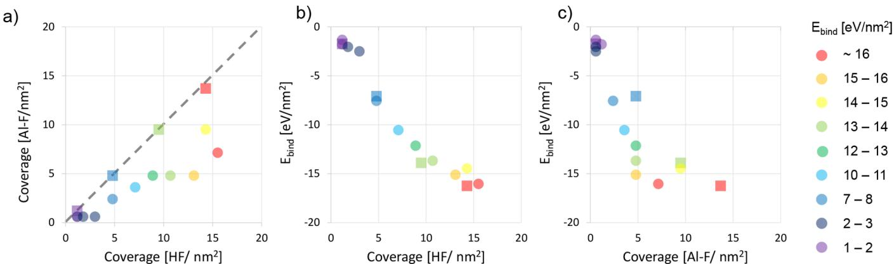  
Figure 8. (a) Scatter plot showing the coverage of total HF adsorbed vs the Al-F coverage in the minima shown in Figure 7. The data points are colored according to the corresponding total binding energy per square nanometer (color plot online). The square markers along the diagonal dashed line indicate geometries where the HF coverage is equal to the Al-F coverage. Panels b and c show the change in binding energy per square nanometer with an increase in HF and Al-F coverage, respectively.

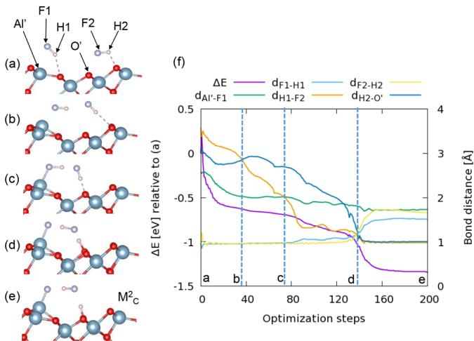  
Figure 9. (a-e) Snapshots representing the hydrogen transport mechanism observed in the optimization of two HF molecules adsorbed on the alumina surface to form  $\mathbf{M}_{\mathrm{C}}^{2}$ . (f) Complementary graph showing the trends of important interatomic distances and relative energy with respect to the initial geometry.

and F1 is evident from the out- of- lattice position of  $\mathrm{Al}^{\prime}$  and the decrease in  $d_{\mathrm{Al}^{\prime} - \mathrm{F}1}$ . These events lead to a decrease in the relative energy of approximately  $- 0.6\mathrm{eV}$ . In the next segment, between b and c, the hydrogen bond between H1F1 and H2F2 becomes stronger, which is evident from the considerable decrease in  $d_{\mathrm{H1} - \mathrm{F2}}$ . Moreover, the H2F2 molecule switches its surface hydrogen bond acceptor (to  $\mathrm{O}^{\prime}$ ) as it is displaced closer to the H1F1 molecule due to stronger  $\mathrm{Al}^{\prime} - \mathrm{F}1$  binding. Toward the end of the region between c and d, four simultaneous events that lead to the transfer of H atoms take place: dissociation of H1F1, dissociation of H2F2, formation of H1F2, and formation of surface  $\mathrm{O}^{\prime}\mathrm{H}2$  species. From c to d, the energy decreases gradually but decreases steeply after the crossover point at d as the newly formed surface  $\mathrm{O}^{\prime}\mathrm{H}2$  and H1F2 molecules stabilize. These events could be more pronounced at higher coverages where a network of hydrogen- bonded HF molecules, which transfers H atoms in this fashion, could affect surface fluorination and thus influence etch rates.

$\mathbf{H}_2\mathbf{O}$  Formation and Desorption. In the postulated reactions given above, we have assumed the release of volatile  $\mathrm{H}_2\mathrm{O}$  in the HF pulse. However, we did not observe any spontaneous formation and desorption of water molecules in our geometry relaxation calculations. Therefore, it will be interesting to estimate the energetic barriers involved. In Figure 10, two pathways leading to the formation and

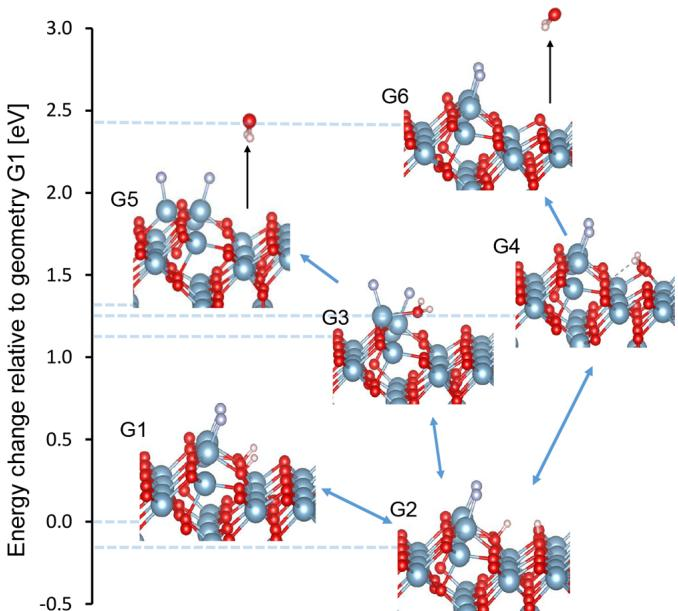  
Figure 10. Pictorial representation of possible pathways in  $\mathrm{H}_2\mathrm{O}$  formation and desorption. The horizontal dotted line connecting each minimum corresponds to the energy change relative to geometry G1, which is also  $\mathrm{M}_{\mathrm{A}}^{2}$  in Figure 7.

desorption of  $\mathrm{H}_2\mathrm{O}$  molecules are identified using minimum geometry G1 ( $\mathrm{M}_{\mathrm{A}}^{2}$  in Figure 7) as the starting point. In the  $\mathrm{H}_2\mathrm{O}$  formation process, the first step is the hop transfer of one H atom to the adjacent row of O atoms ( $\mathrm{G1} \rightarrow \mathrm{G2}$ ). This is an exoergic event because the resulting minimum G2 is  $0.14\mathrm{eV}$  lower in energy than G1. However, there is an energetic barrier of  $+0.92\mathrm{eV}$  to go from G1 to G2. The activation barriers discussed here are computed using the CI- NEB method, and the results are listed in Table 4. Because the minimum G2 is lower in energy than G1, the reverse hop of the H atom will have a slightly larger barrier of  $+1.06\mathrm{eV}$ .

From this point, there are two possibilities for  $\mathrm{H}_2\mathrm{O}$  formation. The first possibility ( $\mathrm{G2} \rightarrow \mathrm{G3}$ ) is when the displaced H atom hops back to the OH in the initial row,

Table 4. Activation Energies for the Barriers between Minima Involved in the  $\mathbf{H}_2\mathbf{O}$  Formation Pathways Shown in Figure  $10^{a}$  

<table><tr><td>barrier</td><td>activation energy (eV)</td><td>ΔE (eV)</td></tr><tr><td>G1→G2</td><td>0.92</td><td>-0.14</td></tr><tr><td>G2→G1</td><td>1.06</td><td>0.14</td></tr><tr><td>G2→G3</td><td>1.63</td><td>1.21</td></tr><tr><td>G3→G2</td><td>0.19</td><td>-1.21</td></tr><tr><td>G2→G4</td><td>1.79</td><td>1.44</td></tr><tr><td>G4→G2</td><td>0.58</td><td>-1.44</td></tr></table>

$^a\Delta E$  is the energy difference between the product (minimum) state and reactant (minimum) state.

crossing an energy barrier of  $+1.63\mathrm{eV},$  resulting in  $\mathrm{H}_2\mathrm{O}$  formation. The second possibility  $(\mathrm{G}2\rightarrow \mathrm{G}4)$  is when the undisplaced  $\mathrm{H}$  atom in minimum G2 also hops to the OH in the adjacent row and forms  $\mathrm{H}_2\mathrm{O}$  after crossing an energy barrier of  $+1.79\mathrm{eV}$  In both cases, the resulting geometries G3 and G4 are higher in energy than G2 by 1.21 and  $1.44~\mathrm{eV},$  respectively. Therefore, the formation of  $\mathrm{H}_2\mathrm{O}$  is endoergic at 0 K and is dependent on the ALE operating conditions  $T$  and  $p$  .The reverse pathways  $\mathrm{G3}\rightarrow \mathrm{G2}$  and  $\mathrm{G4}\rightarrow \mathrm{G2}$  have relatively lower barriers of  $+0.19$  and  $+0.58\mathrm{eV},$  respectively. Therefore, the water molecules must desorb before they disintegrate and re- form minimum G2 once again. The energies of desorption of  $\mathrm{H}_2\mathrm{O}$  from geometries G3 and G4 are computed to be  $+0.26$  and  $+1.17\mathrm{eV},$  respectively (corresponding to minima G5 and G6, respectively). On the basis of the results for the two pathways presented above,  $\mathrm{G1 - }$ $\mathrm{G}2\mathrm{- G}3\mathrm{- G}5$  and  $\mathrm{G1 - G2 - G4 - G6},$  the former seems to be more preferable because of the relatively lower activation energies for  $\mathrm{H}_2\mathrm{O}$  formation and desorption.

If  $\mathrm{H}_2\mathrm{O}$  molecules are not formed and OH persists at the alumina surface, this is likely to lead to TMA adsorption via the competing surface reaction

$$
\mathrm{OH_{(surf)} + Al(CH_3)_3(gas)}\rightarrow \mathrm{O - Al(CH_3)_2(surf)} + \mathrm{CH_4(gas)}
$$

Moreover, as mentioned above, the same precursors HF and TMA are used in the ALD of  $\mathrm{AlF}_3,$  20,21 which might lead to a competition between the ALE of  $\mathrm{Al}_2\mathrm{O}_3$  and the ALD of  $\mathrm{AlF}_3$  On the other hand, if  $\mathrm{Sn(acac)}_2$  is used as the second precursor, the persistent surface OH species might also lead to  $\mathrm{Sn(acac)}_2$  adsorption via the following reaction

$$
\mathrm{OH_{(surf)} + Sn(acac)_2(gas)}\rightarrow \mathrm{O - Sn(acac)_{(surf)} + acacH_{(gas)}}
$$

# DISCUSSION

We started our investigation of the HF pulse on alumina by comparing the reaction energies of continuous bulk etching and those of surface saturation. In both cases, it is assumed that the surface oxygen atoms are removed as  $\mathrm{H}_2\mathrm{O}$  molecules.We found that the saturating surface reaction was energetically more favorable than the continuous etching reactions by at least  $2\mathrm{eV / Al}_2\mathrm{O}_3$  .This suggested that the HF pulse is selflimiting in nature, forming a stable and nonvolatile  $\mathrm{AlF}_x$  layer on the alumina surface.

As the next step, we studied the adsorption mechanism of one HF molecule per cell on the model  $\theta - \mathrm{Al}_2\mathrm{O}_3$  surface to identify the key reaction step that is responsible for the conversion of Al- O bonds on the surface to Al- F bonds. With a computed dipole moment of  $1.8~\mathrm{D},$  the HF molecule initially physisorbed to the bare alumina surface by means of strong dipole interactions. We observed that the HF molecule can next chemisorb either molecularly or dissociatively. In either case, the HF molecule initially formed a hydrogen bond with a surface O atom. On the basis of whether the F atom was oriented to find an Al partner on the surface, the HF molecule either remained intact or dissociated to form surface- bound Al- F and  $\mathrm{O - H}$  species. The  $\mathrm{H - F}$  bond is strong with a bond dissociation energy of  $6\mathrm{eV}$  Upon adsorption to the alumina surface, the  $\mathrm{H - F}$  bond did not begin to dissociate until the  $\mathrm{O - H}$  and Al- F bonds were almost formed (evident from the bond distances in Figure 5). The splitting of the  $\mathrm{H - F}$  bond correlates closely with the reduction of the total energy of the system. In the case of dissociative adsorption, we found that the adsorbed H atom could hop to other atop O sites on the surface subject to energetic barriers. The hop of  $\mathrm{H}$  to an adjacent row of O atoms away from the Al- F bond was energetically preferred, albeit impeded by a barrier of  $+0.83\mathrm{eV}$  There was an energy cost for  $\mathrm{H}$  to hop to an adjacent O atom in the same row.

As the coverage of HF was increased in our simulations, we observed a mixture of intact and dissociated HF molecules that formed a hydrogen- bonded network on the surface. In fact, such a mixed adsorption state was found to be similar in energy to the state in which almost all HF molecules were dissociated. This indicates that after the initial surface coating of  $\mathrm{AlF}_{x},$  there is little energetic driving force for further dissociation of HF molecules, potentially therefore achieving the self- limiting condition. No spontaneous formation of the discrete  $\mathrm{AlF}_3$  molecule is observed at the surface in our calculations even at high HF coverages. Moreover, at the saturating dissociated F coverage of  $7.1\pm 0.3\mathrm{F / nm}^2,$  we find that on average only 1.5 F atoms are bound to each surface Al atom. Our investigations further indicate that such a molecule  $(\mathrm{AlF}_3)$  would be involatile, as evidenced by a very high computed energy of  $+2.75\mathrm{eV}$  at  $0\mathrm{K}$  for desorption from HF- saturated surface  $\mathrm{M}_8^{24}$  in Figure 7. Similarly, the desorption energy of the  $\mathrm{Al}_2\mathrm{F}_6$  molecule is found to be  $+3.17\mathrm{eV}$  .Exposing the surface to various coverages of HF, we observe saturation in the coverage of dissociated F (at  $5 - 7\mathrm{F / nm}^2)$  and eventually also saturation in the binding energy (at  $- 16\mathrm{eV / nm}^2)$  even when additional HF molecules are present. Taken together, these findings strongly suggest that the HF reaction is self- limiting, which is a key requirement for thermal ALE. To confirm this will require detailed study of pathways of diffusion of  $\mathrm{F}$  into  $\mathrm{Al}_2\mathrm{O}_3$  sublayers, including relaxation of associated stress in large simulation cells.

The unreacted HF molecules as well as any  $\mathrm{H}_2\mathrm{O}$  formed should be removed in the purge step, leaving an  $\mathrm{AlF}_x$  - covered alumina surface. The desorption energies of  $\mathrm{AlF}_3$  and  $\mathrm{Al}_2\mathrm{F}_6$  relative to the  $\mathrm{AlF}_x$  layer on the alumina surface obtained after the purge are computed to be as high as  $+5.08$  and  $+5.24\mathrm{eV},$  respectively, substantially higher than the desorption energies quoted above. Evidently, the molecules bind more strongly to the surface when some surface O atoms have been removed as  $\mathrm{H}_2\mathrm{O}$  . The geometries used for the calculations presented above are shown in section S7 of the Supporting Information.

Because the HF reaction self- limits, a co- reagent is needed to chemically remove residual  $\mathrm{F}$  and Al atoms from the surface and complete the ALE cycle. In the literature,  $\mathrm{Sn(acac)}_2^{15}$  and  $\mathrm{Al(CH_3)_3^{10}}$  have been demonstrated to be successful coreagents. Analysis of the ligand exchange mechanisms between

the  $\mathrm{AlF}_x$  layer and the co- reagents mentioned above is beyond the scope of this paper.

Having established the chemical nature of the saturating surface in one of the ALE pulses, we are now able to estimate the maximum etch rate that is theoretically possible. Of all the  $\mathrm{AlF}_x$  covered surface models that we computed, it can be seen from the  $\mathrm{Al - F}$  coverage and surface energy values in Table 3 that  $\mathrm{M}^{26}$  (Figure 7) is the most probable representative geometry of the saturated surface. Although  $\mathrm{M}_{\mathrm{B}}^{24}$  is slightly more stable at  $0\mathrm{K},$ $\mathrm{M}^{26}$  has a similar binding energy per unit area at a considerably lower  $\mathrm{Al - F}$  coverage. The coverage of dissociated  $\mathrm{F}$  in  $\mathrm{M}^{26}$  is  $7.1\pm 0.3\mathrm{F / nm}^2$  . The maximum etch rate can clearly be achieved when all of this dissociated  $\mathrm{F}$  leads to etching of  $\mathrm{Al}_2\mathrm{O}_3$  in each ALE cycle. According to the etch reactions proposed by George and co- workers,15,16,19 three  $\mathrm{F}$  atoms lead to the etching of one Al atom, so the coverage of Al that can be etched is one- third of the  $\mathrm{F}$  coverage,  $2.4\pm 0.1$  Al  $\mathrm{nm}^{- 2}\mathrm{cycle}^{- 1}$  . Because the surface layer of  $\theta - \mathrm{Al}_2\mathrm{O}_3$ $(\bar{2} 01)$  shows an Al coverage of  $4.8\pm 0.3\mathrm{Al / nm}^2$  this maximum etch rate corresponds to 0.5 monolayer/cycle. Upon conversion to other units, this etch rate is  $- 20.0\pm 0.8\mathrm{ngcm}^{- 2}\mathrm{cycle}^{- 1}$  and, via the mass density of bulk  $\theta$  - alumina  $(3.5\mathrm{g} / \mathrm{cm}^3)$ $- 0.57\pm$ $0.02\mathrm{\AA / cycle}$  .(For the sake of comparison, the removal of a complete monolayer of  $\mathrm{Al}_2\mathrm{O}_3$  would require a dissociated  $\mathrm{F}$  coverage of  $14.2\pm 0.3\mathrm{F / nm}^2$  and the corresponding etch rate would be  $- 1.14\pm 0.02\mathrm{\AA / cycle}$  or  $- 40.0\pm 0.8\mathrm{ngcm}^{- 2}$  cycle- .) Clearly, the magnitude of the etch rate will be lower than the theoretical maximum of  $0.57\pm 0.02\mathrm{\AA / cycle}$  if reaction kinetics do not allow the etch reaction to proceed to completion. This could happen if residual  $\mathrm{F}$  remains adsorbed at the surface after the ligand exchange pulse or if the desorption of  $\mathrm{H}_2\mathrm{O}$  is incomplete. Indeed, residual OH at the surface could allow competing ALD growth reactions to take place when TMA is used as the ligand exchange reagent.20,21

Using HF and  $\mathrm{Sn(acac)}_2$  as precursors, George and coworkers report etch rates ranging from  $- 4.1\mathrm{ngcm}^{- 2}\mathrm{cycle}^{- 1}$  at  $150^{\circ}C$  to  $- 18.3\mathrm{ngcm}^{- 2}\mathrm{cycle}^{- 1}$  at  $250^{\circ}C$  from quartz crystal microbalance measurements, albeit hindered by residual acac impurities. The higher- temperature value is very close to our predicted maximum of  $- 20.0\pm 0.8\mathrm{ngcm}^{- 2}\mathrm{cycle}^{- 1}$  .An additional  $\mathrm{H}_{2}$  plasma pulse after the  $\mathrm{Sn(acac)}_2$  pulse has been reported to increase the etch rates from 0.36 to  $1.96\mathrm{\AA / cycle}$  in the case of aluminum nitride using the same precursors.18 This additional plasma pulse seems to remove the acac residual impurities on the surface after the ligand exchange pulse. Therefore, the etch rates of alumina can perhaps also be improved by similar means. Alternatively, when trimethylaluminum (TMA) is used for the ligand exchange pulse, the experimental etch rate varies from  $- 4.2\mathrm{ngcm}^{- 2}\mathrm{cycle}^{- 1}$  at 250  $^\circ \mathrm{C}$  to  $- 23.3\mathrm{ngcm}^{- 2}\mathrm{cycle}^{- 1}$  at  $325^{\circ}C$  19 The upper value is slightly higher than the maximum rate that we predict. It appears therefore that the ligand exchange precursor also has an effect on the actual etch rate and temperature behavior.

We can speculate that the hydrogen- bonded network of HF molecules formed at high coverages can efficiently transport H atoms across the surface of alumina, which would affect flourination of the surface and thus influence the etch rate. We studied in detail the mechanism of hydrogen transport for the case of two adsorbed HF molecules, which indicated Grotthuss- like transport of a proton,25 i.e., the net migration of charge in a hydrogen- bonded liquid where individual protons switch positions but do not physically migrate.

Using geometry  $\mathrm{M}_{\mathrm{A}}^{2}$  in Figure 7 as the starting point, we studied two pathways leading to the formation and desorption of  $\mathrm{H}_2\mathrm{O}$  molecules. We found that there are high energetic barriers ranging from  $+0.9$  to  $+1.8\mathrm{eV}$  that inhibit the association of hydroxyl groups with adsorbed water. By contrast, the desorption energies of the thus- formed water molecules were found to range from  $+0.2$  to  $+1.2\mathrm{eV}$ , which can be overcome under actual experimental conditions, leading to the formation of gaseous  $\mathrm{H}_2\mathrm{O}$  as the etch byproduct. Any OH that persists on the surface at the end of the HF pulse, due to the high energetic barrier for  $\mathrm{H}_2\mathrm{O}$  formation and desorption, is likely to lead to the competing growth reaction (i.e., ALD) in the ligand exchange pulse, which is undesirable.

# CONCLUSION

CONCLUSIONTheoretical insights into the HF pulse in the thermal ALE of monoclinic alumina were gained using DFT calculations. On the basis of the reaction energetics of the postulated reactions, qualitative evidence suggesting the self- limiting nature of the HF pulse was found. Following that, explicit slab calculations were conducted to study the adsorption of  $1 - 26\mathrm{HF}$  molecules per cell on a monoclinic alumina surface. While a single HF molecule readily dissociated upon adsorbing to the alumina surface, a hydrogen- bonded network of mixed dissociated and intact HF molecules was observed at higher coverages. Evidence from surface binding energies and dissociated HF coverages indicated that the dissociative chemisorption of HF is self- limiting, as required for ALE, rather than etching away the oxide continuously. On the basis of a saturated surface model, a theoretical maximum etch rate was computed to be  $- 0.57\pm 0.02\mathrm{\AA / cycle}$ $(- 20.0\pm 0.8\mathrm{ngcm}^{- 2}\mathrm{cycle}^{- 1})$ , which amounted to the removal of  $0.5\mathrm{monolayer}$  of material per cycle. Mechanisms for various surface chemical reactions such as hydrogen transport and formation of the etch byproduct  $\mathrm{H}_2\mathrm{O}$  were studied, and their activation barriers were computed. Hydrogen transport was identified as a favorable event, whereas the formation and desorption of  $\mathrm{H}_2\mathrm{O}$  molecules were hindered by substantial energetic barriers of at least  $0.9$  and  $0.2\mathrm{eV}$ , respectively.

# ASSOCIATED CONTENT

# $=$  Supporting Information

The following files are available free of charge. The Supporting Information is available free of charge on the ACS Publications website at DOI: 10.1021/acs.chemmater.8b01930.

Convergence test results, density of states and band structure of bulk  $\theta$  - alumina, equations of the computed properties, detailed  $(\overline{2} 01)$  surface geometries, description of the  $\mathrm{M}_\mathrm{Y}^\mathrm{X}$  notation, Bader charge analysis of dissociated HF on the alumina surface, and desorption of  $\mathrm{AlF}_3$  and  $\mathrm{Al}_2\mathrm{F}_6$  (PDF)

# AUTHOR INFORMATION

# Corresponding Author

\*E- mail: simon.elliott@schrodinger.com.

# ORCID

ORCIDSuresh Kondati Natarajan: 0000- 0002- 7018- 5253Simon D. Elliott: 0000- 0001- 5573- 5694Present Address†S.D.E.: Schrödinger Inc., 120 W. 45th St., 17th Floor, New York, NY 10036- 4041.

# Notes

NotesThe authors declare no competing financial interest.

# ACKNOWLEDGMENTS

ACKNOWLEDGMENTSThe authors thank Lam Research Corp. for funding and acknowledge access to the Science Foundation Ireland- funded computing cluster at Tyndall.

# REFERENCES

REFERENCES(1) Puurunen, R. L. Surface Chemistry of Atomic Layer Deposition: A Case Study for the Trimethylaluminum/Water Process. J. Appl. Phys. 2005, 97, 121301. (2) George, S. M. Atomic Layer Deposition: An Overview. Chem. Rev. 2010, 110, 111- 113. (3) Elliott, S. D. Atomic- Scale Simulation of ALD Chemistry. Semicond. Sci. Technol. 2012, 27, 074008. (4) Carver, C. T.; Plombon, J. J.; Romero, P. E.; Suri, S.; Tronic, T. A.; Turkot, R. B., Jr. Atomic Layer Etching: An Industry Perspective. ECS J. Solid State Sci. Technol. 2015, 4, N5005- N5009. (5) Loubet, N.; Hook, T.; Montanini, P.; Yeung, C. W.; Kanakasabapathy, S.; Guillem, M.; Yamashita, T.; Zhang, J.; Miao, X.; Wang, J.; et al. Stacked Nanosheet Gate- All- Around Transistor to Enable Scaling Beyond FinFET. 2017 Symposia on VLSI Technology and Circuits; 2017; pp T230- T231. (6) Donnelly, V. M.; Kornblit, A. Plasma Etching: Yesterday, Today, and Tomorrow. J. Vac. Sci. Technol., A 2013, 31, 050825. (7) Lee, C. G. N.; Kanarik, K. J.; Gottscho, R. A. The Grand Challenges of Plasma Etching: A Manufacturing Perspective. J. Phys. D: Appl. Phys. 2014, 47, 273001. (8) Faraz, T.; Roozeboom, F.; Knoops, H. C. M.; Kessels, W. M. M. Atomic Layer Etching: What Can We Learn from Atomic Layer Deposition? ECS J. Solid State Sci. Technol. 2015, 4, N5023- N5032. (9) George, S. M.; Lee, Y. Prospects for Thermal Atomic Layer Etching Using Sequential, Self- Limiting Fluorination and Ligand- Exchange Reactions. ACS Nano 2016, 10, 4889- 4894. (10) Lee, Y.; Huffman, C.; George, S. M. Selectivity in Thermal Atomic Layer Etching Using Sequential, Self Limiting Fluorination and Ligand- Exchange Reactions. Chem. Mater. 2016, 28, 7657- 7665. (11) Kanarik, K. J.; Tan, S.; Yang, W.; Kim, T.; Lill, T.; Kabansky, A.; Hudson, E. A.; Ohba, T.; Nojiri, K.; Yu, J.; et al. Predicting Synergy in Atomic Layer Etching. J. Vac. Sci. Technol., A 2017, 35, 05C302. (12) Athavale, S.; Economou, D. Molecular- Dynamics Simulation of Atomic layer Etching of Silicon. J. Vac. Sci. Technol., A 1995, 13, 966- 971. (13) Kanarik, K. J.; Lill, T.; Hudson, E. A.; Sriraman, S.; Tan, S.; Marks, J.; Vahedi, V.; Gottscho, R. A. Overview of Atomic Layer Etching in the Semiconductor Industry. J. Vac. Sci. Technol., A 2015, 33, 020802. (14) Oehrlein, G. S.; Metzler, D.; Li, C. Atomic Layer Etching at the Tipping Point: An Overview. ECS J. Solid State Sci. Technol. 2015, 4, N5041- N5053. (15) Lee, Y.; George, S. M. Atomic Layer Etching of Al2O3 Using Sequential, Self- Limiting Thermal Reactions with Sn(acac)₂ and Hydrogen Fluoride. ACS Nano 2015, 9, 2061- 2070. (16) Lee, Y.; DuMont, J. W.; George, S. M. Mechanism of Thermal Al₂O₃ Atomic Layer Etching Using Sequential Reactions with Sn(acac)₂ and HF. Chem. Mater. 2015, 27, 3648- 3657. (17) Lee, Y.; DuMont, J. W.; George, S. M. Atomic Layer Etching of HfO₂ Using Sequential, Self- Limiting Thermal Reactions with Sn(acac)₂ and HF. ECS J. Solid State Sci. Technol. 2015, 4, N5013- N5022. (18) Johnson, N. R.; Sun, H.; Sharma, K.; George, S. M. Thermal Atomic Layer Etching of Crystalline Aluminum Nitride Using Sequential, Self- Limiting Hydrogen Fluoride and Sn(acac)₂ Reactions and Enhancement by H₂ and Ar Plasmas. J. Vac. Sci. Technol., A 2016, 34, 050603.

(19) Lee, Y.; DuMont, J. W.; George, S. M. Trimethylaluminum as the Metal Precursor for the Atomic Layer Etching of Al₂O₃ Using Sequential, Self-Limiting Thermal Reactions. Chem. Mater. 2016, 28, 2994-3003.  
(20) Hennessy, J.; Moore, C. S.; Balasubramanian, K.; Jewell, A. D.; France, K.; Nikzad, S. Enhanced Atomic Layer Etching of Native Aluminum Oxide for Ultraviolet Optical Applications. J. Vac. Sci. Technol., A 2017, 35, 041512.  
(21) DuMont, J. W.; George, S. M. Competition Between Al₂O₃ Atomic Layer Etching and AlF₃ Atomic Layer Deposition Using Sequential Exposures of Trimethylaluminum and Hydrogen Fluoride. J. Chem. Phys. 2017, 146, 052819.  
(22) Henkelman, G.; Uberuaga, B. P.; Jonsson, H. A Climbing Image-Nested Elastic Band Method for Finding Saddle Points and Minimum Energy Paths. J. Chem. Phys. 2000, 113, 9901-9904.  
(23) Henkelman, G.; Jonsson, H. Improved Tangent Estimate in the Nudged Elastic Band Method for Finding Minimum Energy Paths and Saddle Points. J. Chem. Phys. 2000, 113, 9978-9985.  
(24) Quan, J.-L.; Teng, B.-T.; Wen, X.-D.; Zhao, Y.; Liu, R.; Luo, M.-F. Hydrogen Fluoride Adsorption and Reaction on the AlphaAl₂O₃(0001) Surface: A Density Functional Theory Study. J. Chem. Phys. 2012, 136, 114701.  
(25) Agmon, N. The Grotthuss Mechanism. Chem. Phys. Lett. 1995, 244, 456.  
(26) Kresse, G.; Furthmuller, J. Efficient Iterative Schemes for Ab Initio Total-Energy Calculations Using a Plane-Wave Basis Set. Phys. Rev. B: Condens. Matter Mater. Phys. 1996, 54, 11169.  
(27) Perdew, J. P.; Burke, K.; Ernzerhof, M. Generalized Gradient Approximation Made Simple. Phys. Rev. Lett. 1996, 77, 3865.  
(28) Blochl, P. Projector Augmented-Wave Method. Phys. Rev. B: Condens. Matter Mater. Phys. 1994, 50, 17953.  
(29) Kresse, G.; Joubert, D. From Ultra-soft Pseudopotentials to the Projector Augmented-Wave Method. Phys. Rev. B: Condens. Matter Mater. Phys. 1999, 59, 5758.  
(30) Elliott, S. D.; Greer, J. C. Simulating the Atomic Layer Deposition of Alumina from First Principles. J. Mater. Chem. 2004, 14, 3246-3250.  
(31) Broas, M.; Kanninen, O.; Vuorinen, V.; Tilli, M.; Paulasto-Krockel, M. Chemically Stable Atomic-Layer-Deposited Al₂O₃ Films for Processability. ACS omega 2017, 2, 3390-3398.  
(32) Borosy, A.; Silvi, B.; Allavena, M.; Nortier, P. Structure and Bonding of Bulk and Surface Theta-Alumina from Periodic Hartree-Fock Calculations. J. Phys. Chem. 1994, 98, 13189-13194.  
(33) Cai, S. H.; Rashkeev, S. N.; Pantelides, S. T.; Sohlberg, K. Atomic Scale Mechanism of the Transformation of Gamma-Alumina to Theta-Alumina. Phys. Rev. Lett. 2002, 89, 235501.  
(34) Lodziana, Z.; Topsee, N. Y.; Norskov, J. K. A Negative Surface Energy for Alumina. Nat. Mater. 2004, 3, 289-293.  
(35) Zhou, R.; Snyder, R. Structures and Transformation Mechanisms of the Eta, Gamma and Theta Transition Aluminas. Acta Crystallogr., Sect. B: Struct. Sci. 1991, 47, 617-630.  
(36) Henkelman, G.; Arnaldsson, A.; Jonsson, H. A fast and Robust Algorithm for Bader Decomposition of Charge Density. Comput. Mater. Sci. 2006, 36, 354-360.  
(37) Tkatchenko, A.; Scheffel, M.; Accurate Molecular Van Der Waals Interactions from Ground-State Electron Density and Free-Atom Reference Data. Phys. Rev. Lett. 2009, 102, 073005.