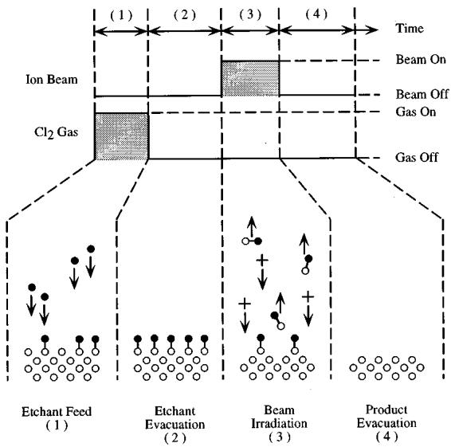
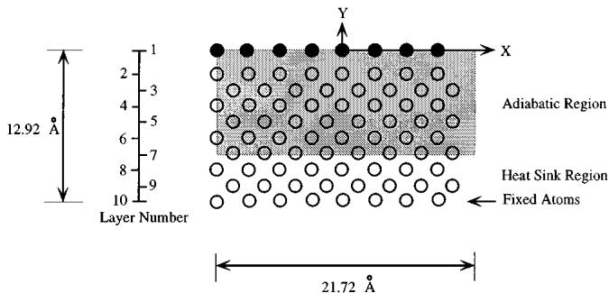
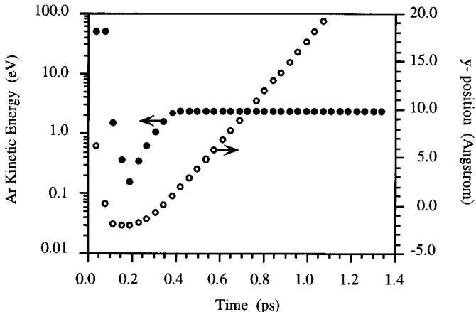
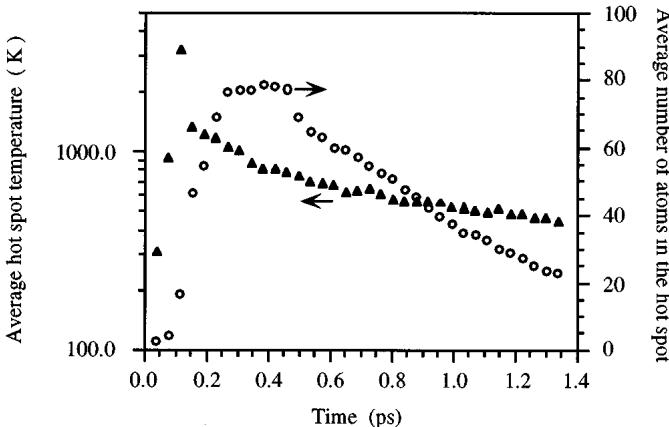
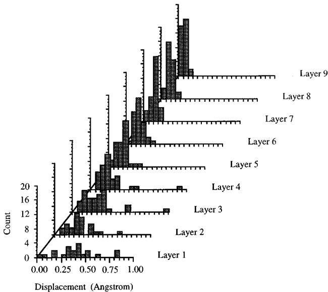

# Molecular dynamics simulation of atomic layer etching of silicon

Satish D. Athavale and Demetre J. Economoua)  Plasma Processing Laboratory, Department of Chemical Engineering, University of Houston, Houston, Texas 77204- 4792

(Received 5 October 1994; accepted 13 March 1995)

A molecular dynamics study of  $50\mathrm{eVAr^{+}}$  ion bombardment of a Si(100) crystal with a monolayer of adsorbed chlorine was conducted to simulate atomic layer etching (ALET) of Si. The total reaction yield (Si atoms removed per ion) was 0.172;  $84\%$  of silicon was removed as  $\mathrm{SiCl}_2$  8% as elemental Si and  $8\%$  as  $\mathrm{SiCl}_2$ . Based on the total yield, an ion dose of  $1.16\times 10^{16}$  ions/cm2 is necessary to remove one monolayer of silicon. Reaction occurs during the ps time scale of the ion- solid interaction. Long time- scale chemistry (100s of ms) which is possible in ion- assisted etching with simultaneous exposure to neutral and ion beams does not happen in ALET. It was further found that  $93\%$  of Si originated from the top silicon layer and  $7\%$  from the layer underneath. In addition, some structural "damage" was induced to the top three silicon layers. It appears that perfect ALET of silicon is not possible for an ion energy of  $50\mathrm{eV}$ . © 1995 American Vacuum Society.

# I. INTRODUCTION

Dimensional control down to the atomic level is becoming progressively important in the fabrication of abrupt heterostructure interfaces and extremely thin layers for optoelectronics, quantum devices, and nanostructures.1 For example, molecular- beam epitaxy (MBE) and metalorganic chemical vapor deposition (MOCVD) have been used to grow extremely thin layers of compound semiconductors and their alloys.2 Also, atomic layer epitaxy (ALE) and flow- rate modulation epitaxy (FME) have been developed to deposit with atomic- resolution heterointerfaces which are smoother than conventional MBE.3,4 In ALE, the precursor species (e.g., trimethylgallium and arsine to deposit GaAs) are fed to the epitaxial reactor in a sequential manner such that GaAs is grown one layer at a time.

Much attention has been paid to deposition, but etching with atomic layer resolution is also a crucial step for fabrication of nanoelectronic devices. Dry etching techniques5 such as reactive ion etching (RIE) and chemically assisted ion beam etching (CAIBE) are not capable of atomic layer resolution because etching is too rapid. In addition, the relatively high ion energy (100s of eV) can damage the crystal. Atomic layer etching (ALET) can provide monolayer resolution without substrate damage. By exposing the crystalline substrate to a reactive gas and an energetic beam (ions, electrons, photons) in a cyclic manner, etching of a monolayer per cycle may be achieved.

Atomic layer etching: The ALET concept is demonstrated schematically in Fig. 1, which shows a complete cycle of the process.9 The cycle consists of the following four steps.

(1) Exposure of the clean semiconductor surface to a gas, and adsorption (chemisorption) of the gas onto the surface. 
(2) Evacuation of the chamber, so that only the chemisorbed layer can subsequently react. This step is necessary to avoid etching by gas-phase species in step 
(3).

(3) Exposure to an energetic beam, to effect chemical reaction between the adsorbed gas and the underlying solid. In this step a monolayer of the solid is removed. 
(4) Evacuation of the chamber to exhaust the reaction products.

Completion of a cycle results in etching of one atomic layer of the film. The cycle can be repeated to etch as many atomic layers as required.

Etching with monolayer accuracy places some limitations regarding the choice of gas and energetic beam. For example, the gas must be selected such that spontaneous etching of the solid does not occur in step (1). This is not a severe limitation since, even if spontaneous etching could normally occur, cooling of the substrate at sufficiently low temperature would quench the spontaneous reaction, without affecting the reaction in step (3) [in step (3) energy is supplied by the energetic beam, i.e., this is not a thermally activated process]. Also, the energetic beam must be chosen so that the process is self- limiting, i.e., once surface reaction has been completed in step (3), any further irradiation by the energetic beam should not damage the exposed underlayer. If the above precautions are not taken, etching with monolayer accuracy is not possible.

ALET of GaAs has been demonstrated6- 13 by using  $\mathrm{Cl}_2 / \mathrm{Cl}$  gas and low- energy  $\mathrm{Ar}^+$  bombardment or KrF excimer laser irradiation. It has been shown that by carefully controlling the reactive species and energetic beam exposure, it is possible to achieve monolayer etching. However, monolayer etching of Si is difficult to achieve. Oxygen in the reactor atmosphere, even in minute amounts, can lead to formation of oxide islands on the surface, resulting in less than a monolayer etching per cycle and rough surfaces. ALET of  $\mathrm{Si}^{14 - 16}$  has been studied using  $\mathrm{Cl}_2\mathrm{Cl}$  or fluorine- containing gases and  $\mathrm{Ar}^+$  bombardment. Molecular chlorine or chlorine radicals do not spontaneously etch undoped Si at room temperature.17 Chlorine does chemisorb on the silicon surface18,19 but surface reaction leading to volatile chlorides

  
FIG. 1. Schematic of the ALET process. The filled circles represent Cl atoms, the open circles represent Si atoms, and  $+$  represent  $\mathrm{Ar}^+$  ions.

$(\mathrm{SiCl}_x)$  does not occur. This reaction can be induced by energetic ion bombardment. In fact the etching of silicon under simultaneous exposure to chlorine gas and  $\mathrm{Ar}^+$  ions has been reported extensively in the literature. $^{20 - 25}$

Assuming that a suitable combination of gas and energetic beam have been identified, one needs to determine the duration of steps (1)- (4) so that a monolayer of the substrate is removed per cycle. The duration of exposure to the reactive gas [step (1)] and the energetic beam [step (3)] are of particular importance. For example, if less than a monolayer of gas is adsorbed during step (1), less than a monolayer etching per cycle and a rough surface are expected. In the case of ions used as an energetic beam in step (3), the ion dose and energy must be such that the top layer reacts completely, yet damage of the underlayers does not occur.

Molecular dynamics (MD) simulations are suitable for studying the interaction of energetic ions with materials. MD follows the trajectory of each atom in the simulation cell as a function of time for several ps of the ion- solid interaction; physical quantities of interest may be calculated by time or ensemble averaging. MD simulations have been used in the past to study physical sputtering, $^{26}$  physical vapor deposition, $^{27}$  and the reaction of energetic neutrals with a surface in the absence of ion bombardment. $^{28}$  MD simulations have also been used to study the interaction of  $\mathrm{Ar}^+$  ions with Si under simultaneous exposure to chlorine $^{29}$  and fluorine. $^{30}$  Some of the key results of these simulations are the formation of surface roughness $^{29}$  and the creation of weakly bound species that can desorb spontaneously. $^{30}$

In this work, we have performed MD simulations to study the interaction of  $50\mathrm{eV}\mathrm{Ar}^+$  ions with a  $\mathrm{Si}(100)$  surface covered with a monolayer of chlorine. The focus of the simulations is step (3) of ALET. Emphasis was placed on the extent of subsurface damage created by the ions, the nature and energy distribution of the products, the etching mechanism, and the ion dose required for complete reaction to occur. The goal is to identify conditions under which etching with monolayer accuracy may be possible. The results ob tained from these simulations are used to guide our experimental ALET system. This work differs from other MD simulation studies reported in the literature $^{29,30}$  in that there is no simultaneous exposure of the substrate to neutral and ion beams.

  
FIG. 2. Schematic of the cell used for molecular dynamics simulations. The filled circles represent Cl atoms and the open circles represent Si atoms.

# II. MD SIMULATION

The simulation cell consisted of 288 Si atoms arranged in nine layers of 32 atoms each to form a Si(100) lattice. The top silicon layer was covered with a monolayer of chlorine, as shown in Fig. 2. The approximate dimensions of the cell are  $21.7\mathrm{\AA}\times 21.7\mathrm{\AA}\times 12.9\mathrm{\AA}$ . The surface area of the cell in the  $x - z$  plane is approximately  $472\mathrm{\AA}$ . Periodic boundary conditions were applied in the  $x$  and  $z$  directions to simulate an infinite crystal,  $\mathrm{Ar}^+$  ions with  $50\mathrm{eV}$  kinetic energy were introduced perpendicular to the cell surface. The  $x$  and  $z$  coordinates of the ion location were picked at random but the vertical distance was fixed at  $y = 8.5\mathrm{\AA}$ . At this distance the interaction between the ion and the cell is negligible. Distance  $y$  was measured with respect to the chlorine layer (layer No. 1) on top of a pristine Si lattice.

MD is a deterministic simulation which follows the trajectory of individual atoms by solving Newton's equation of motion. $^{31}$  The force on each atom is calculated as the spatial gradient of the potential field. The interatomic potential consists of contributions due to two- body and three- body interactions. We have used the interatomic potentials developed by Feil et al. $^{29}$  The Si- Cl, Si- Si, and Cl- Cl interactions were calculated using two- body and three- body interactions similar to those first developed by Stillinger and Weber $^{32}$  for the Si- F system. When an ion approaches the surface, the ion wave functions overlap those of the surface atoms and charge transfer takes place through Auger or resonant tunneling processes. $^{33}$  Therefore, the Ar ion is modeled as an energetic neutral. The Ar- Ar, Ar- Cl, and Ar- Si interactions were expressed by a purely repulsive Moliere potential with a screening length of 0.88 times the Firsov values. $^{34}$  A dimensionless time step of  $0.005\tau$  was used, where  $\tau = 0.0766$  ps corresponds to the period of vibrations of an isolated Si- Si bond. A fifth- order predictor- corrector algorithm of the Gear type $^{31}$  was used to advance the simulation in time by integrating the equation of motion for each atom in the simulation cell.

Each simulation run consisted of two phases: (a) an "equilibration" phase lasting 600 time steps during which

the system was allowed to relax to  $300~\mathrm{K}$  and b an "etchingphase which started with the introduction of an argon ion at  $t = 0$  and continued for 3500 time steps until  $t = 1.34$  ps. Some simulations were continued further up to  $t = 4$  ps but no substantial change in the results was observed. However, for ion energies higher than  $50~\mathrm{eV}$  used here, a simulation for more than 1.34 ps may be necessary. At the beginning of the etching phase of each simulation run, an  $\mathrm{Ar}^+$  was directed at a pristine Si surface covered with a monolayer of Cl atoms. Subsequent ions were directed at the lattice generated by the previous ions. This way the depletion of Cl from the surface as etching proceeds was accounted for properly. Such a sequence of ion bombardments represented one group of simulation runs. An average of 60 simulation runs were conducted for each group. Five groups of runs were performed, each starting with a pristine cell, to gather statistics.35

At the end of each simulation run, a search was made for weakly bound species (wbs) on the surface. A wbs is defined as one with a binding energy of less than  $1\mathrm{eV}$  30 The binding energy of each surface species was determined by the difference of the potential energy of the crystal with that species on the surface and with the species removed to an infinite distance away from the surface.

The temperature of the crystal rises during ion bombardment, and heat must be removed so as to represent the physical mechanisms of heat loss from the crystal. Heat removal can be carried out in a number of different ways. The simplest way is to scale the atomic velocities so that the temperature of the crystal remains at a desired set point. Another method, proposed by Berendsen et al.,36 uses an algorithm to remove/add a quantity of heat from the simulation cell depending on the actual temperature and the set point. We have used the Berendsen scheme of coupling to a heat bath maintained at  $T = 300\mathrm{K}$  with a coupling constant of 30 fs. For this purpose, the simulation cell was divided into three regions as shown in Fig. 2. The top seven atomic layers constitute the adiabatic region where the atomic velocities were not rescaled during the 3500 etching time steps of the simulation (the velocities were rescaled during the 600 equilibration time steps). The next two atomic layers form the heat sink region, where heat was removed throughout the simulation. Finally, the bottom layer of the cell was fixed in space.

# III. RESULTS AND DISCUSSION

In the figures to follow,  $t = 0$  refers to the time of introduction of the argon ion at a vertical distance of  $y = 8.5\mathrm{\AA}$  .It is interesting to analyze the sequence of events that occur when an individual  $\mathrm{Ar}^+$  ion bombards the surface. Eventually the ion is either reflected/recoiled from the surface or it is trapped inside the lattice. A plot of the ion kinetic energy and its projected position along the  $y$  axis as a function of time is shown in Fig. 3. The energetic Ar (starting kinetic energy  $50\mathrm{eV}$  penetrates the lattice and undergoes collisions with the atoms in the top few layers of the crystal, rapidly losing its kinetic energy (KE);more than  $95\%$  of the Ar KE is lost within about  $0.14~\mathrm{ps}$  . Ar continues its journey inside the lattice further losing KE reaching a minimum of less than  $0.2\mathrm{eV}.$  At this moment  $(0.17~\mathrm{ps})$  Ar is at its maximum penetration depth  $(y = - 2\mathrm{\AA})$  .Collisions with the lattice atoms continue, until a violent collision causes Ar to regain a significant portion of the lost KE and start its upward movement. Ar eventually leaves the lattice after about  $0.4\mathrm{ps}$  with  $2\mathrm{eV}$  kinetic energy. We consider an atom to leave the "influence" of the lattice when this atom crosses the  $y = 4.50\mathrm{\AA}$  plane moving upwards. It is clear from Fig. 3 that the kinetic energy of the Ar atom remains constant after it has crossed the  $y = 4.50\mathrm{\AA}$  plane suggesting that the atom is then outside the influence of the surface.

  
FIG. 3. A typical plot of Ar kinetic energy (filled circles) and Ar projected position along the vertical axis (empty circles) as a function of time. The dashed horizontal line indicates the position at which an atom moving away from the lattice is removed from the simulation cell.

Quantitative measures related to Fig. 3 were for the particular ion bombardment events shown in that figure. Average values of interesting quantities obtained from a total of  $300~\mathrm{MD}$  simulation runs and the corresponding  $95\%$  confidence intervals are shown in Table I.

TABLE I. Average values for different physical quantities.  

<table><tr><td>Quantity</td><td>Average value with 95% confidence intervals</td></tr><tr><td>Time at which Ar loses more than 95% of its kinetic energy (ps)</td><td>0.14±0.01</td></tr><tr><td>Time at which Ar is at the maximum depth inside the lattice (ps)</td><td>0.16±0.02</td></tr><tr><td>Time at which Ar leaves the lattice (ps)</td><td>0.46±0.08</td></tr><tr><td>Time at which product species leaves the lattice (ps)</td><td>0.20±0.01</td></tr><tr><td>Time at which the hot spot is at maximum temperature (ps)</td><td>0.08±0.02</td></tr><tr><td>Time at maximum number of atoms in the hot spot (ps)</td><td>0.36±0.04</td></tr><tr><td>Time at which the lattice is at maximum temperature (ps)</td><td>0.13±0.01</td></tr><tr><td>Maximum penetration depth of Ar inside lattice when it is reflected (Å)</td><td>3.66±0.32</td></tr><tr><td>Maximum penetration depth of Ar inside lattice when it is trapped (Å)</td><td>5.82±0.47</td></tr><tr><td>Maximum temperature of the lattice (K)</td><td>1070±53</td></tr><tr><td>Maximum hot-spot temperature (K)</td><td>3235±815</td></tr><tr><td>Maximum number of atoms in the hot spot</td><td>78±8</td></tr></table>

  
FIG. 4. The hot-spot temperature (triangles) and the number of atoms in the hot spot (circles) as a function of time. The figure shows an average over 300 simulation runs.

The instantaneous temperature of the crystal, averaged over all the atoms in the adiabatic region, rises significantly reaching a maximum of about  $1070~\mathrm{K}$  around the time when most of the kinetic energy of the ion has dissipated in collisions with the lattice atoms  $(\sim 0.15\mathrm{ps})$ . Beyond that point "heat" removal by the constant temperature bath dominates, causing the crystal temperature to gradually decay (over a few ps) towards the bath temperature  $(300~\mathrm{K})$ . One can characterize the development of the "hot spot" by considering only the atoms in the crystal which are "directly" affected by the energetic Ar. The temperature of the hot spot was calculated as an average over all atoms with "temperature" in excess of  $400~\mathrm{K}$ . The time evolution of the hot- spot temperature and the number of atoms in the hot spot, again averaged over 300 simulations runs, are shown in Fig. 4. The hot- spot temperature passes through a maximum of over  $3000\mathrm{K}$  around  $0.10~\mathrm{ps}$ , when only a dozen or so atoms are directly affected by the impinging Ar. These relatively energetic atoms transfer part of their energy to the surroundings increasing the number of atoms in the hot spot. This is equivalent to spatial spreading of the hot spot with a concomitant decrease in temperature. As the process continues, the number of atoms in the hot spot passes through a broad maximum at around  $0.35\mathrm{ps}$  when approximately 75 atoms are in the hot spot. Later on the number of atoms in the hot spot decreases as the KE is dissipated further. The hot- spot temperature should be considered only qualitatively, since temperature is difficult to define for a small number of atoms.

Table II lists the product yields obtained by the MD simu

TABLE II. Average product yield.  

<table><tr><td>Yield</td><td>Average value ± (95% confidence intervals)</td></tr><tr><td>Si</td><td>0.013±0.002</td></tr><tr><td>Cl</td><td>0.040±0.003</td></tr><tr><td>Ar</td><td>0.803±0.078</td></tr><tr><td>Ar thermalization</td><td>0.192±0.062</td></tr><tr><td>Ar trapped permanently</td><td>&amp;lt;0.01</td></tr><tr><td>SiCl</td><td>0.145±0.035</td></tr><tr><td>SiCl2</td><td>0.014±0.003</td></tr></table>

Table II lists the product yields obtained by the MD simulation. Of the silicon- containing species, SiCl is the majority product followed by  $\mathrm{SiCl}_2$  and Si. Chlorine atoms are removed with a  $4\%$  yield. Also, for every 100 argon ions impinging on the surface, 80 are reflected/recoiled back during the same ion bombardment event and the remaining 20 are thermalized inside the lattice only to be removed during the subsequent ion bombardment event. The statistics are not adequate to report the fraction of impinging ions that are permanently trapped in the lattice; it seems that this fraction is below  $1\%$ . When the product is SiCl, the Cl atom corresponds to the one originally attached to the Si atom at the beginning of the group of simulation runs. When  $\mathrm{SiCl}_2$  is removed, the Cl atom was previously attached to an adjacent Si atom. This is to be expected since surface diffusion is negligible under the conditions of our simulation.

Because in ALET the surface is deficient in chlorine, products of higher chlorination are unlikely to form. This explains the relatively small yield of  $\mathrm{SiCl}_2$  and the absence of any products of higher chlorination. The total sputtering yield of silicon under the conditions studied (0.172) is lower than that of a silicon surface exposed to chlorine and  $50\mathrm{eV}$ $\mathrm{Ar}^+$  bombardment simultaneously (0.25), but it is higher than the physical sputtering yield of  $\mathrm{Si}(0.015)$  by  $50\mathrm{eV}$ $\mathrm{Ar}^+$  ions. The enhancement of the sputtering yield due to the presence of Cl is evident; the lower sputtering yield under ALET conditions is expected due to the limited amount of Cl available on the surface compared to that available during simultaneous and continuous exposure of Si to chlorine and  $\mathrm{Ar}^+$  ions.

The kinetic energies of the product species ranged from 0.2 to  $7.0\mathrm{eV}$ . The products leave the surface about  $0.2\mathrm{ps}$  following ion impact, which is after the peak in the crystal temperature  $(0.13\mathrm{ps})$  and the peak in the hot- spot temperature  $(0.08\mathrm{ps})$ , but before the time  $(0.36\mathrm{ps})$  at which the number of atoms in the hot spot reaches a maximum (Table I). The kinetic energy distribution of the products could not be fit to either collision cascade or "evaporation" from a hot spot. The latter mechanism was postulated by Oostra et al., for  $75\mathrm{eV}$ $\mathrm{Ar}^+$  bombardment of Si with simultaneous exposure to chlorine.

No weakly bound species (wbs) have been detected in our simulations. This is consistent with the results of Barone and Graves who observed no wbs when the F/Si atomic ratio in the fluorinated top layers of the silicon lattice was  $< 0.39$ . These authors observed that, when F atoms were plentiful enough to passivate the silicon dangling bonds, weakly bound species formed readily. These wbs may be sputtered or desorbed spontaneously on a much longer time scale (ms) than it is possible to capture by the MD simulation. Under simultaneous exposure to neutral and ion beams, as in the study of Barone and Graves, wbs can be formed when the neutral to ion flux ratio is high enough. Under the ALET conditions, the Cl/Si ratio is too low for wbs to be formed.

Figure 5 shows the layer- by- layer distribution of "damage" of the crystal lattice after 43 consecutive ion bombardments starting from the pristine cell of Fig. 1. The amount of damage is expressed as the displacement, in Å, of the atoms from their position in the pristine cell. We only accounted for atoms that were present in the lattice after 43 bombardment

  
FIG. 5. The layer-by-layer distribution of the atomic displacements in the lattice after 43 ion bombardments of the same cell starting from a pristine silicon crystal with a monolayer of chlorine at the surface. See Fig. 2 for layer numbering.

events, neglecting the species that were removed as products. As expected, the damage is maximum at the topmost atomic layer, (layer 1) and diminishes as one goes deeper into the lattice. The average displacement for the heat sink layers (layers 8 and 9) is about  $0.1\mathrm{\AA}$  as expected for a crystal at room temperature  $(- 5\% - 10\%$  of interatomic distance37).

The crystal "damage" can also be studied in terms of creation of vacancies and interstitial atoms. Following the treatment used by Karetra and Urbassek,38 we observed that the number of vacancies and interstitials is maximum in the topmost atomic layer. Although, no vacancies are present below the third atomic layer, a few interstitials can be created in those deeper layers during the early stages of an ion bombardment event. However, these interstitials are annealed quickly before the ion leaves the lattice.

Implication for ALET. Table III shows that almost  $93\%$  of the Si- containing species originate from the topmost silicon layer (layer 2 in Fig. 2); however, some product removal occurs from the underlying silicon layer. Also, crystal "damage" extends over a few atomic layers at the top (Fig. 5), which may result in unacceptable surface "roughness"29 with repeated ALET cycling. Hence perfect atomic layer etching cannot be achieved with an ion energy of  $50\mathrm{eV}$ . Also, practical systems may be limited by residual oxygen in the chamber forming oxide islands on the surface. The ion energy should then be high enough to remove any oxide by sputtering. Otherwise, surface roughness will again be a problem. Based on a total sputtering yield of 0.172 for the silicon- containing species (Table II), and the silicon surface atom density  $(2\times 10^{15}$  atoms  $/\mathrm{cm}^2)$  , the required ion dose to remove a monolayer is  $1.16\times 10^{16}$  ions  $/\mathrm{cm}^2$  . For an ion current density of  $1\mathrm{mA / cm}^2$  the ion irradiation step 3 would require an exposure for about  $2\mathrm{s}$

TABLE III. Fraction of Si atoms removed from different atomic layers in the crystal. See Fig. 2 for layer numbering.  

<table><tr><td>Layer No.</td><td>Fraction of Si atoms removed from this layer</td></tr><tr><td>2</td><td>0.93</td></tr><tr><td>3</td><td>0.07</td></tr><tr><td>4–9</td><td>0.00</td></tr></table>

# IV. CONCLUSIONS

Atomic layer etching (ALET) is a technique to etch a crystalline solid with monolayer accuracy. It is a cyclic process consisting of gas adsorption on the surface (step 1), evacuation of excess gas (step 2), irradiation of the surface by an energetic beam (step 3), and evacuation to remove the reaction product (step 4). Completion of a cycle results in etching of one monolayer of the solid. A molecular dynamics simulation of ALET of silicon with chlorine gas was performed focusing on step 3. For this purpose, a Si(100) surface with an adsorbed monolayer of chlorine was bombarded by  $50\mathrm{eV}\mathrm{Ar}^{+}$ ions. Ion bombardment creates a "hot spot" with temperatures in excess of  $3000\mathrm{K}$ . The hot spot is dissipated within a few ps after ion bombardment, and the crystal returns to ambient temperature. The total silicon etch yield was 0.172 (Si atoms removed per ion);  $84\%$  of silicon was removed as SiCl,  $8\%$  as elemental Si, and  $8\%$  as  $\mathrm{SiCl}_2$ . Based on the total yield, an ion dose of  $1.16\times 10^{16}$  ions  $/\mathrm{cm}^2$  is necessary to remove one monolayer of silicon. It should be cautioned that, in reality, the silicon total yield would be smaller than that predicted by the simulation. This is because simulation of complete reaction of the adsorbed Cl would require an excessive amount of computer time, as the yield decreases with decreasing surface coverage by Cl.

The reaction products were removed during the collision cascade, a few tenths of ps after ion bombardment. No weakly bound species were detected after ion bombardment. In addition, surface diffusion is negligible under the conditions of interest. These observations suggest that, in ALET, chemistry happens only during the ps time scale of ion- solid interaction. This is in sharp contrast to ion- assisted etching effected by simultaneous and continuous exposure of the surface to reactive neutral and ion beams. Under these conditions long time- scale (100s of ms) chemistry can readily happen. Because MD can only capture the events occurring on the ps time scale, MD is suitable for the study of ALET.

It was found that  $93\%$  of the silicon removed originated from the topmost silicon layer; the remaining  $7\%$  was from the layer underneath. An ion energy of  $50\mathrm{eV}$  caused some structural "damage" to the top three silicon layers. This could result in unacceptable surface "roughness" with repeated ALET cycling. Furthermore, the ion energy may be limited by the need to sputter away surface oxides which may form as a result of residual oxygen, that can also lead to rough surfaces.

# ACKNOWLEDGMENTS

ACKNOWLEDGMENTSThe authors gratefully acknowledge the financial support provided by the State of Texas through the Advanced Technology Program. They would like to thank Dr. H. Feil for helpful discussions and Dr. M. Barone and Professor D. Graves for helpful discussions and for sharing a preprint prior to publication. Thanks are also due to Dr. James M. Briggs for allowing the use of the visualization facilities of the Institute for Molecular Design at the University of Houston.

$^1\mathrm{T}.$  F. Kuech, P. D. Dapkus, and Y. Aoyagi, Mater. Res. Soc. Symp. Proc. 222, 195 (1991). 2Advances in Materials, Processing, and Devices in III- V Compound Semiconductors," edited by D. K. Sadana, L. Eastman, and R. Dubuis, Mater. Res. Soc. Symp. Proc. No. 144 (Materials Research Society, Pittsburgh, PA, 1989).  $^3\mathrm{T}.$  Yao, Z. Zhu, K. Uesugi, S. Kamiyama, and M. Fujimoto, J. Vac. Sci. Technol. A 8, 996 (1990).  $^4\mathrm{N}.$  Kobayashi, T. Makimoto, Y. Yamauchi, and Y. Horikoshi, J. Appl. Phys. 66, 640 (1989).  $^5\mathrm{S}.$  M. Rossnagel, J. J. Cuomo, and W. D. Westwood, Handbook of Plasma Processing Technology (Noyes, Park Ridge, NJ, 1989).  $^6\mathrm{T}.$  Meguro, M. Hamagaki, S. Modaressi, T. Hara, Y. Aoyagi, M. Ishii, and Y. Yamamoto, Appl. Phys. Lett. 56, 1552 (1990).  $^7\mathrm{T}.$  Meguro and Y. Aoyagi, Mater. Res. Soc. Symp. Proc. 222, 121 (1991).  $^8\mathrm{Y}.$  Aoyagi, K. Shinmura, K. Kawasaki, T. Tanaka, K. Gamo, S. Namba, and I. Nakamoto, Appl. Phys. Lett. 60, 968 (1992).  $^9\mathrm{M}.$  Ishii, T. Meguro, H. Kodama, Y. Yamamoto, and Y. Aoyagi, Jpn. J. Appl. Phys. 31, 2212 (1992).  $^{10}\mathrm{Y}.$  Aoyagi, K. Shinmura, K. Kawasaki, I. Nakamoto, K. Gamo, and S. Namba, Thin Solid Films 225, 120 (1993).  $^{11}\mathrm{T}.$  Meguro, M. Ishii, K. Kodama, Y. Yamamoto, K. Gamo, and Y. Aoyagi, Thin Solid Films 225, 130 (1993).  $^{12}\mathrm{O}.$  L. Bourne, D'Arcy Hart, D. M. Rayner, and P. A. Hackett, J. Vac. Sci. Technol. B 11, 556 (1993).  $^{13}\mathrm{M}.$  Ishii, T. Meguro, K. Gamo, T. Sugano, and Y. Aoyagi, Jpn. J. Appl. Phys. 32, 6178 (1993).  $^{14}\mathrm{Y}.$  Horiike, T. Tanaka, M. Nakano, S. Iseda, H. Sakaue, A. Nagata, H. Shindo, S. Miyazaki, and M. Hirose, J. Vac. Sci. Technol. A 8, 1844 (1990).  $^{15}\mathrm{H}.$  Sakaue, K. Asami, T. Ishihara, S. Ishizuka, K. Kawamura, and Y. Horiike, Mater. Res. Soc. Symp. Proc. 222, 195 (1991).

$^{16}\mathrm{J}.$  Yamamoto, T. Kawakasi, H. Sakaue, S. Shingubara, and Y. Horiike, Thin Solid Films 225, 124 (1993).  $^{17}\mathrm{E}.$  A. Ogryzlo, D. L. Flamm, D. E. Ibbosson, and J. A. Mucha, J. Appl. Phys. 64, 6510 (1988).  $^{18}\mathrm{D}.$  J. D. Sullivan, H. C. Flaum, and A. C. Kummel, J. Phys. Chem. 97, 12051 (1993); Q. Gao, C. C. Cheng, P. J. Chen, W. J. Choyke, and J. T. Yates, Jr., J. Chem. Phys. 98, 8308 (1993), see references therein.  $^{19}\mathrm{J}.$  E. Rowe, G. Margaritondo, and S. B. Christman, Phys. Rev. B 16, 1581 (1977); L. J. Whitman, S. A. Joyce, J. A. Yarmoff, F. R. McFeely, and L. J. Terminello, Surf. Sci. 232, 297 (1990).  $^{20}\mathrm{J}.$  Dieleman, F. H. M. Sanders, A. W. Kolfschoten, P. C. Zalm, A. E. de Vries, and A. Haring, J. Vac. Sci. Technol. B 3, 1384 (1985).  $^{21}\mathrm{D}.$  J. Oostra, R. P. van Ingen, A. Haring, A. E. de Vries, and G. N. A. van Veen, Appl. Phys. Lett. 50, 1506 (1987).  $^{22}\mathrm{D}.$  J. Oostra, A. Haring, R. P. van Ingen, and A. E. de Vries, J. Appl. Phys. 64, 515 (1988).  $^{23}\mathrm{J}.$  van Zwol, J. van Laar, A. W. Kolfschoten, and J. Dieleman, J. Vac. Sci. Technol. B 5, 1410 (1987).  $^{24}\mathrm{J}.$  W. Coburn, J. Vac. Sci. Technol. B 12, 1384 (1994).  $^{25}\mathrm{G}.$  J. P. Joosten, M. J. M. Vugts, H. J. Spruijt, H. A. J. Senhorst, and H. C. W. Bieijerinck, J. Vac. Sci. Technol. A 12, 636 (1994); H. F. Winters, ibid. 6, 1997 (1988).  $^{26}\mathrm{R}.$  Maboudian, Z. Postwa, M. El- Maazawi, B. J. Garrison, and N. Wino- grad, Phys. Rev. B 42, 7311 (1990).  $^{27}\mathrm{K}.$  H. Muller, J. Vac. Sci. Technol. A 5, 2161 (1987).  $^{28}\mathrm{P}.$  C. Weakliem and E. A. Carter, J. Chem. Phys. 98, 737 (1993); T. A. Schoolcraft and B. J. Garrison, J. Am. Chem. Soc. 113, 8221 (1991).  $^{29}\mathrm{H}.$  Feil, J. Dieleman, and B. J. Garrison, J. Appl. Phys. 74, 1303 (1993).  $^{30}\mathrm{M}.$  E. Barone and D. B. Graves, J. Appl. Phys. 77, 1263 (1995).  $^{31}\mathrm{J}.$  M. Haile, Molecular Dynamics Simulation: Elementary Methods (Wiley, New York, 1992).  $^{32}\mathrm{F}.$  H. Stillinger and T. A. Weber, Phys. Rev. B 31, 5262 (1985); F. H. Stillinger and T. A. Weber, J. Chem. Phys. 88, 5123 (1988); F. H. Stillinger and T. A. Weber, Phys. Rev. Lett. 62, 2144 (1989).  $^{33}\mathrm{P}.$  Sigmund, Phys. Rev. 184, 383 (1969).  $^{34}\mathrm{J}.$  F. Ziegler, J. P. Bierseck, and U. Litternik, The Stopping and Range of Ions in Solids (Pergamon, New York, 1985), Vol. 1.  $^{35}\mathrm{L}.$  Davies, Efficiency in Research, Development and Production: The Statistical Design and Analysis of Chemical Experiments (Royal Society of Chemistry, Cambridge, 1993).  $^{36}\mathrm{H}.$  C. J. Berendsen, J. P. M. Postma, W. F. van Gunsteren, A. DiNola, and J. R. Haak, J. Chem. Phys. 81, 3684 (1984).  $^{37}\mathrm{C}.$  A. Wert and R. M. Thomson, Physics of Solids, 2nd ed. (McGraw- Hill, New York, 1970).  $^{38}\mathrm{F}.$  Karetta and H. M. Urbassek, J. Appl. Phys. 71, 5410 (1992).