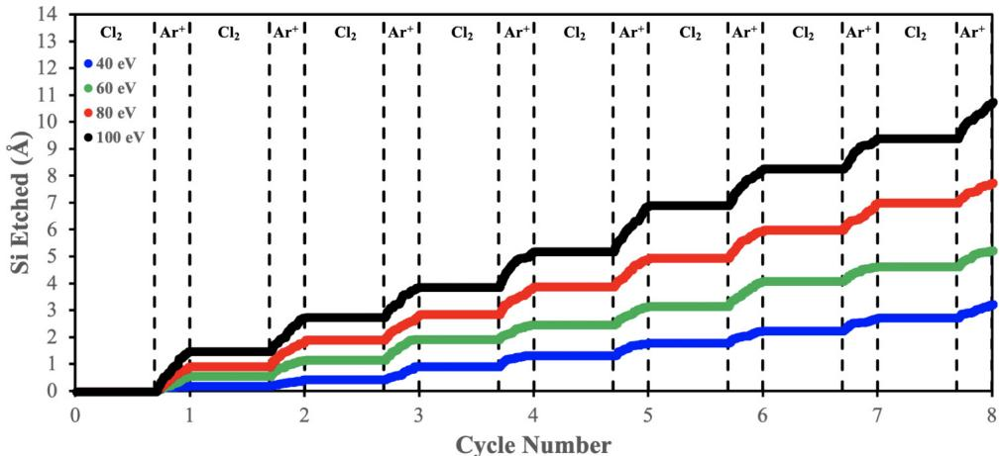
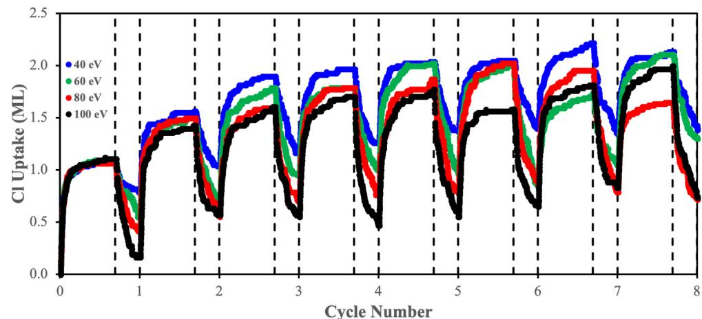
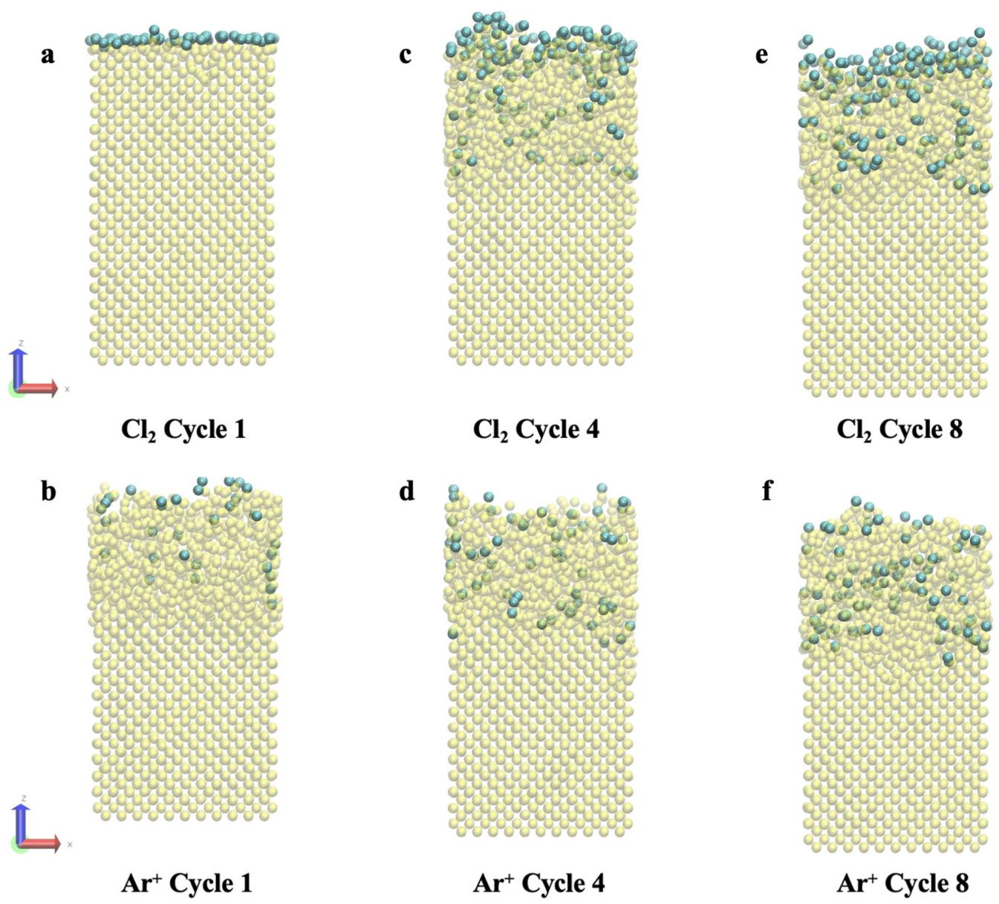
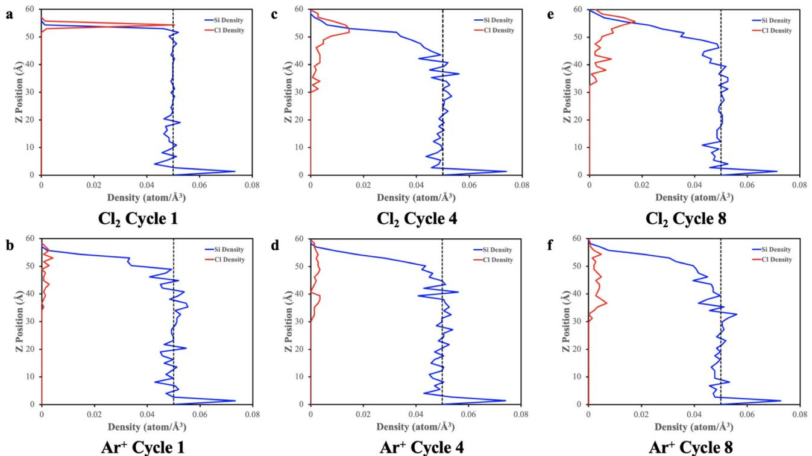
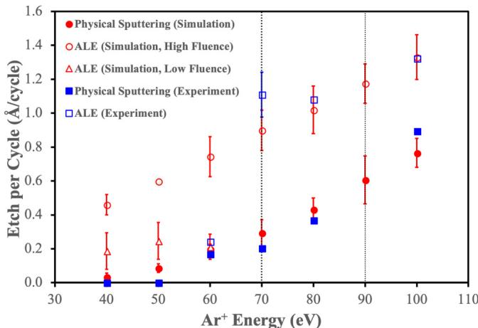
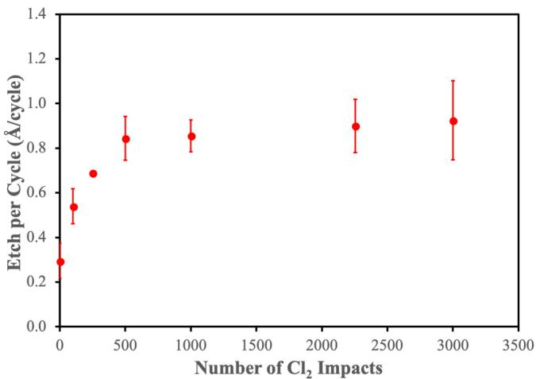
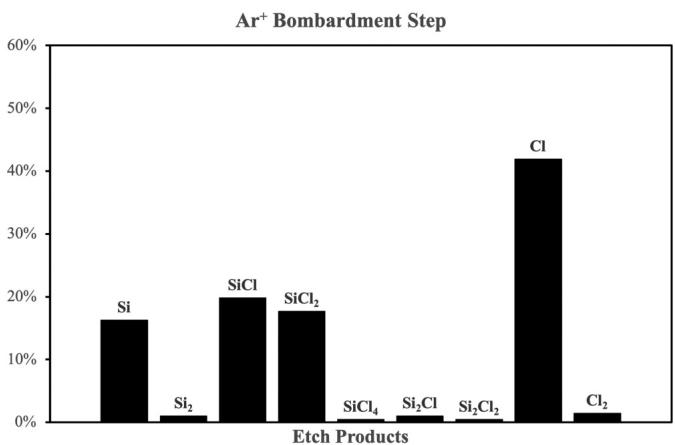
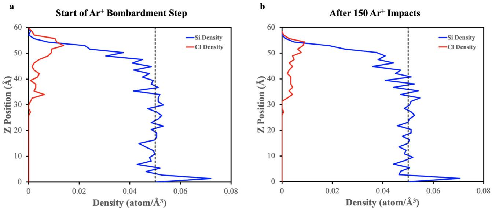

# Molecular dynamics study of silicon atomic layer etching by chlorine gas and argon ions

Special Collection: Plasma Processing for Advanced Microelectronics

Joseph R. Vella  $\oplus$  David Humbird; David B. Graves

Check for updates J.Vac.Sci.Technol.B40,023205 (2022) https://doi.org/10.1116/6.0001681

# Articles You May Be Interested In

Simulations shed light on key process in semiconductor device manufacturing

Scilight (February 2022)

Near- surface damage and mixing in  $\mathrm{Si - Cl}_2\mathrm{Ar}$  atomic layer etching processes: Insights from molecular dynamics simulations

J.Vac.Sci.Technol.A (July 2023)

An examination of the performance of molecular dynamics force fields: Silicon and silicon dioxide reactive ion etching

J.Vac.Sci.Technol.A (February 2024)

# Molecular dynamics study of silicon atomic layer etching by chlorine gas and argon ions

Cite as: J. Vac. Sci. Technol. B 40, 023205 (2022); doi: 10.1116/6.0001681  Submitted: 8 December 2021 · Accepted: 12 January 2022 · Published Online: 10 February 2022

Joseph R. Vella, $^{1}$  David Humbird, $^{2}$  and David B. Graves $^{1,3,a)}$

# AFFILIATIONS

$^{1}$ Princeton Plasma Physics Laboratory, Princeton, New Jersey 08536   $^{2}$ DWH Consulting, Centennial, Colorado 80112   $^{3}$ Department of Chemical and Biological Engineering, Princeton University, Princeton, New Jersey 08540

Note: This paper is a part of the Special Topic Collection on Plasma Processing for Advanced Microelectronics.   $^{a)}$ Author to whom correspondence should be addressed: dgraves@pppl.gov

# ABSTRACT

Classical molecular dynamics (MD) is used to simulate atomic layer etching processes of silicon by alternating exposure to chlorine gas and argon ions. In order to validate our model, a rigorous comparison is done with ion beam experiments found in the literature [Park et al., Jpn. J. Appl. Phys. 44, 389 (2005)]. It is shown that the etch per cycle (EPC) as a function of argon ion energy from simulations is in quantitative agreement with experimental results if the correct argon ion fluence is used in the simulations. The EPC as a function of ion irradiation time and amount of chlorine exposure also show good agreement with the experiment. The MD simulations also show the formation of an amorphous silicon region with chlorine atoms mixed uniformly throughout following ion bombardment. Finally, the etch products during the ion irradiation step are analyzed and discussed.

Published under an exclusive license by the AVs. https://doi.org/10.1116/6.0001681

# I. INTRODUCTION

Atomic layer etching (ALE) $^{1 - 3}$  processes offer the potential to remove material from surfaces with atomic- scale precision. $^{4}$  In ALE, surface modification and removal steps are separated either spatially or temporally. ALE can be thought of as analogous to atomic layer deposition (ALD) $^{5}$  since both ideally include two self- limiting half steps. The first reaction modifies only the surface atoms in such a way that they can be selectively removed in the subsequent step. The second reaction removes the modified layer but without removing layers below the surface. ALE has been applied to a variety of materials, including silicon (Si), $^{6 - 11}$  various oxides, $^{12 - 18}$  compound materials, $^{19 - 21}$  metals, $^{22 - 24}$  polymers, $^{25}$  and graphene. $^{26 - 28}$  However, despite the large amount of experimental work on ALE, there are many questions that are not understood. For example, the extent of surface damage and the degree of roughness developed during ALE have not been examined in great detail. Molecular simulations can augment experimental studies by illustrating mechanisms at the atomic scale.

Classical molecular dynamics (MD) simulations are a type of molecular simulation technique in which the time- dependent trajectory of a system of atoms is calculated. Empirical interatomic potentials (mathematical descriptions of the potential energy as a function of the distance between atoms) are used to represent interactions between atoms. This is in contrast to ab initio MD where a firstprinciples approach is used and interactions between atoms are computed from electronic structure calculations. While ab initio MD generally tends to be more accurate than classical MD, it is a much more computationally expensive technique. This additional accuracy may not be needed to effectively interpret experimental results. Comparisons with the experiment have demonstrated that classical MD can often reproduce experiments, making them a powerful tool to understand plasma- surface interaction mechanisms.

In this work, we use classical MD simulations in order to demonstrate its ability to simulate ALE processes. We focus on Si etching where the surface modification step is driven by room temperature chlorine gas  $(\mathrm{Cl}_2)$  and the removal step is achieved by the bombardment of argon ions  $(\mathrm{Ar}^{+})$ . This specific ALE process is chosen such that we can compare it with the ion beam experiments of Park et al. $^{11}$  To the best of our knowledge, a rigorous comparison of molecular simulation results with experimental data has never been done for Si- Cl- Ar ALE.

The paper is organized as follows. Section II gives details about the MD simulations. Section III discusses results and compares with the experimental data. Finally, Sec. IV gives concluding remarks.

# II. SIMULATION DETAILS

As mentioned in Sec. I, this work will focus on performing MD simulations of Si ALE using  $\mathrm{Cl}_2$  and  $\mathrm{Ar^{+}}$  . The reactive empirical bond order (REBO) potential29 parametrized by Humbird and Gurwa30 was used for Si- Cl interactions. See supplementary material45 for the functional form and parameters of the REBO potential. All  $\mathrm{Ar^{+}}$  interactions are described using the Moliere potential.31 It should be noted that  $\mathrm{Ar^{+}}$  ions are actually represented in the simulation as neutral Ar atoms as it is assumed that these ions recombine through Auger neutralization before hitting the surface.

The Si substrate is modeled as a semi- infinite diamond cubic crystalline slab of size  $32.60\mathrm{\AA}$  by  $32.60\mathrm{\AA}$  by  $52.98\mathrm{\AA}$  with periodic boundaries imposed in the x and y directions. The (100) surface of the Si crystal with an area of  $1063\mathrm{\AA}^2$  is exposed to a vacuum in the z direction. The bottom two layers of Si atoms are fixed in order to simulate a semi- infinite crystal. For this simulation cell size, one monolayer corresponds to 72 atoms. This simulation cell was deemed to be large enough to not see any substantial system- size effects. We concluded this by examining some results for a larger system size and not observing any significant differences.

In order to simulate a Si- Cl- Ar ALE process, we consider the two main reactions that are assumed to drive the process: the chemical modification reaction by  $\mathrm{Cl}_2$  and the removal reaction by  $\mathrm{Ar^{+}}$  ions. Each reaction is modeled as a series of impacts each involving one particle of the relevant species and the Si slab within the microcanonical ensemble (constant number of particles, volume, and energy) for a maximum of 2 ps. Particles are placed in a random position above the substrate before the impact simulation begins. Between impacts, it is assumed that nothing happens except that weakly bound products thermally desorb. This is done because a full MD simulation of a plasma process would not only be intractable computationally but also is not necessary to capture the essential processes.

In experiments, the time between impacts within the simulated area of the Si substrate is typically on the order of milliseconds. Given that the time scale of integration in MD simulations is typically around a femtosecond, simulating multi- millisecond long processes is computationally impractical. However, the more important point is that simulating the relatively long times between impacts may not be needed to capture experimentally relevant results, such as surface structure and etch rates. Indeed, an important motivation for the present study is to carefully compare simulation results with experimental measurements to justify the assumptions made in the simulation.

During each impact, the temperature of the simulation cell will rise because energy is being added to the system. Therefore, in order to maintain a constant temperature over the course of many impacts, the temperature of the cell is brought to  $300\mathrm{K}$  using a Berendsen thermostat32 after each impact. This procedure has been used for many similar molecular dynamics studies in the past.30,33- 38

For all simulations described in this work, the  $\mathrm{Cl}_2$  gas will be at  $300\mathrm{K}$  This means that the velocity components of each  $\mathrm{Cl}_2$  molecule are randomly sampled from a Maxwell- Boltzmann distribution corresponding to this temperature. For  $\mathrm{Ar^{+}}$  ions, only the zcomponent of the velocity is assigned corresponding to the ion acceleration voltage of experiments being simulated. We neglect the possible effects of a distribution of ion energies or impact angles.

During the course of the MD simulations, an algorithm is used to identify etch products and remove them from the simulation. An etch product is identified as a cluster of atoms (excluding fixed Si atoms) for which the switching function [see Eq. (A5) of Humbird and Gurwa30 or Eq. (S6) in the supplementary material45] is equal to 1. If a cluster is identified as a saturated product (such as  $\mathrm{SiCl}_4$ ), it is immediately removed. If the cluster is not saturated, the value of switching function between each atom in the cluster and each atom in the bulk crystal is calculated. If the maximum value is less than 0.1, the cluster is defined as weakly bound and is removed. Periodically, two new fixed layers of Si are added to the bottom of the simulation cell once a certain number of Si atoms is removed through etching. Once this is done, the Si atoms that were previously fixed are now free to move. This is done in order to run simulations without completely depleting the Si atoms.

As mentioned previously, the experimental work of Park et al.11 is used for comparison of our simulation results. When describing their experiments, the authors give  $\mathrm{Cl}_2$  and  $\mathrm{Ar^{+}}$  flow rates as well as supply and irradiation times. However, given that the MD simulations only explicitly simulate the picosecond time scale during each impact (of either  $\mathrm{Cl}_2$  or  $\mathrm{Ar^{+}}$ ) and ignore the time between impacts, exposure time cannot be used directly in the MD simulations. Instead, in order to directly compare with the experimental results, we need to match the fluence of  $\mathrm{Cl}_2$  molecules and  $\mathrm{Ar^{+}}$  ions in their respective ALE steps. Recall that fluence is defined to be species flux multiplied by exposure time. It is equivalent to the total number of impacts on the simulation cell surface. Finally, when we compare our simulation results with the experiment, we make sure to run 3- 5 independent simulations in order to calculate 95% confidence intervals.

# III. RESULTS AND DISCUSSION

Figure 1 shows the amount of Si etched (in units of Angstroms) as a function of cycle number for various  $\mathrm{Ar^{+}}$  ion energies from the MD simulations. In this case, one cycle consists of  $2255\mathrm{Cl}_2$  impacts and  $1000\mathrm{Ar^{+}}$  impacts. It is clear from the results shown that Si is etched only during the  $\mathrm{Ar^{+}}$  bombardment step. As expected, the etch per cycle (EPC) increases as the energy of the  $\mathrm{Ar^{+}}$  ion increases.

Figure 2 shows the Cl uptake as a function of cycle number for the same cycles described in Fig. 1. Obviously, the amount of Cl accumulated in the near surface region increases during the chlorination steps and decreases during the ion bombardment steps. However, it is clear that the amount of Cl in the simulation during the first three cycles is lower than in subsequent cycles. Therefore, for this specific cycle, it takes a few cycles (about 4) for the ALE process to reach a cyclic steady state when starting from a perfect Si crystal. As mentioned by Timacba et al.,38 many molecular simulation studies of ALE only focus on the first cycle. Thus, this phenomenon would not be observed. This is due to the fact

  
FIG. 1. Amount of silicon etched as a function of cycle number. For these results, one cycle corresponds to 2255  $\mathrm{Cl}_2$  impacts and  $1000\mathrm{Ar}^+$  impacts. Each line corresponds to results for a different  $\mathrm{Ar}^+$  ion energy: blue (lowest curve)  $-40\mathrm{eV}$ , green (second lowest curve)  $-60\mathrm{eV}$ , red (second highest curve)  $-80\mathrm{eV}$ , and black (highest curve)  $-100\mathrm{eV}$ . The vertical dashed lines separate the  $\mathrm{Cl}_2$  and  $\mathrm{Ar}^+$  portions of the ALE cycles.

that it takes several cycles to form the near surface amorphous region (described below) and to mix Cl atoms into this layer. This can be seen by examining simulation snapshots of the layer side view illustrated below. It should be noted that each of the results shown in Fig. 2 is from a single MD simulation. Therefore, they are subjected to a degree of randomness and statistical fluctuation. This is why, for some cycles, the  $1000\mathrm{eV}\mathrm{Ar}^+$  case has a higher Cl uptake than the  $80\mathrm{eV}\mathrm{Ar}^+$  case.

We can estimate the initial sticking coefficient of  $\mathrm{Cl}_2$  on the (100) surface of Si from the initial Cl uptake curves in Fig. 2. Considering the first  $36\mathrm{Cl}_2$  impacts (which corresponds to  $1\mathrm{ML}$  of Cl atoms for our simulation cell size) and performing a linear fit to the data, we obtain a sticking coefficient of  $0.42\pm 0.05$ . Barker et al. report a sticking coefficient of  $0.3$ . Sullivan et al. present data that indicate the sticking coefficient [on the  $(2\times 1)$  reconstructed (100) Si surface] is between 0.4 and 0.6. Doshita et al. give a value of around 0.6 at  $300\mathrm{K}$ . Thus, we believe our simulations of molecular chlorine dissociative chemisorption are in reasonable agreement with the experiment.

Figure 3 shows side views of the simulation cell at the end of the chlorination step and ion bombardment step for cycles 1, 4, and 8. For these results, the cycle is composed of the same number of  $\mathrm{Cl}_2$  and  $\mathrm{Ar}^+$  ion impacts as the ones described in Figs. 1 and 2. However, the  $\mathrm{Ar}^+$  ion energy for these snapshots is  $70\mathrm{eV}$ . In order to visualize the results more clearly, Si atoms are shown as translucent yellow spheres, while Cl atoms are solid cyan spheres. After the first chlorination step, the Si slab retains its crystal structure, while Cl atoms adhere to the surface.

After the first ion bombardment step, a significant amorphous region is formed in the Si layer and many of the Cl atoms have been removed; however, some of them still remain and some have been mixed into the amorphous region. Once the fourth chlorination step finishes, the amorphous region still remains. There is a relatively large amount of Cl atoms at the surface of the amorphous

  
FIG. 2. Chlorine uptake (in units of equivalent monolayers) as a function of cycle number for the cycles described in Fig. 1. Each line corresponds to results for a different  $\mathrm{Ar}^+$  ion energy: blue (lowest curve)  $-40\mathrm{eV}$ , green (second lowest curve)  $-60\mathrm{eV}$ , red (second highest curve)  $-80\mathrm{eV}$ , and black (highest curve)  $-100\mathrm{eV}$ . The vertical dashed lines separate the  $\mathrm{CI}_2$  and  $\mathsf{Ar}^+$  portions of the ALE cycles.

  
FIG.3. i 255  $\mathbb{C}\mathbb{I}_2$  impacts and  $1000~\mathrm{Ar^{+}}$  impacts, the  $\mathsf{Ar}^+$  energy is  $70\in V.$  Yellow translucent spheres are Si and cyan solid spheres are Cl. Si atoms are translucent in order to visualize Cl atoms mixed into the amorphous layer. Panel (a) is the side view of the simulation cell after the first chlorination step, panel (b) is after the first ion bombardment step, panel (c) is after the fourth chlorination step, panel (d) is after the fourth ion bombardment step, panel (e) is after the eighth chlorination step, and panel (f) is after the eighth ion bombardment step. The snapshots were created in Visual Molecular Dynamics (VMD) (Ref. 42).

region from the recent exposure to  $\mathrm{Cl}_2$ . The fourth ion bombardment step removes the top layer of Cl atoms and we once again see the amorphous Si region with Cl atoms mixed throughout. It appears there are more Cl atoms in the amorphous region when compared with the end of the first ion bombardment step. This is consistent with what is shown in Fig. 2. The side views at the end of the eighth chlorination and ion bombardment steps look similar to their fourth cycle counterparts. This is because the process has reached a cyclic steady state. It should be noted that as the number of cycles progress, additional layers of Si atoms are added to the bottom of the simulation cell as described in Sec. II.

Figure 4 gives the Si and Cl atomic density depth profiles for the corresponding simulation snapshots in Fig. 3. The black dotted line in each subfigure corresponds to the bulk Si atomic density at  $300\mathrm{K}$ . The same observations discussed in the previous paragraph can also be observed from the density profiles. The spike in

  
FIG.4.   t  t 3.  t 300 4.  t  t  t  t  t  t  t  t  t  t  t  t  t  t  t  t  t  t  t  t  t  t  t  t  t  t  t  t  t  t  t  t  t  t  t  t  t  t  t  t  t  t  t  t  t  t  t  t  t  t  a  t  t  t  t  t  t  t  t  t  t  t  t  t  t  t  t  t  t  t  t  t  t  t  t  t  t  t  t  t  t  t  t  t  t  t  t  t  t  t  t  t  t  t  t  t  t  t  t  t  h  t  t  t  t  t  t  t  t  t  t  t  t  t  t  t  t  t  t  t  t  t  t  t  t  t  t  t  t  t  t  t  t  t  t  t  t  t  t  t  t  t  t  t  t  t  t  t  t  t  s  t  t  t  t  t  t  t  t  t  t  t  t  t  t  t  t  t  t  t  t  t  t  t  t  t  t  t  t  t  t  t  t  t  t  t  t  t  t  t  t  t  t  t  t  t  t  t  t  t  u  t  t  t  t  t  t  t  t  t  t  t  t  t  t  t  t  t  t  t  t  t  t  t  t  t  t  t  t  t  t  t  t  t  t  t  t  t  t  t  t  t  t  t  t  t  t  t  t  t  e  t  t  t  t  t  t  t  t  t  t  t  t  t  t  t  t  t  t  t  t  t  t  t  t  t  t  t  t  t  t  t  t  t  t  t  t  t  t  t  t  t  t  t  t  t  t  t  t  t  o  t  t  t  t  t  t  t  t  t  t  t  t  t  t  t  t  t  t  t  t  t  t  t  t  t  t  t  t  t  t  t  t  t  t  t  t  t  t  t  t  t  t  t  t  t  t  t  t  t  c  t  t  t  t  t  t  t  t  t  t  t  t  t  t  t  t  t  t  t  t  t  t  t  t  t  t  t  t  t  t  t  t  t  t  t  t  t  t  t  t  t  t  t  t  t  t  t  t  t  b  t  t  t  t  t  t  t  t  t  t  t  t  t  t  t  t  t  t  t  t  t  t  t  t  t  t  t  t  t  t  t  t  t  t  t  t  t  t  t  t  t  t  t  t  t  t  t  t  t  n  t  t  t  t  t  t  t  t  t  t  t  t  t  t  t  t  t  t  t  t  t  t  t  t  t  t  t  t  t  t  t  t  t  t  t  t  t  t  t  t  t  t  t  t  t  t  t  t  t  w  t  t  t  t  t  t  t  t  t  t  t  t  t  t  t  t  t  t  t  t  t  t  t  t  t  t  t  t  t  t  t  t  t  t  t  t  t  t  t  t  t  t  t  t  t  t  t  t  t  f  t  t  t  t  t  t  t  t  t  t  t  t  t  t  t  t  t  t  t  t  t  t  t  t  t  t  t  t  t  t  t  t  t  t  t  t  t  t  t  t  t  t  t  t  t  t  t  t  t  i  t  t  t  t  t  t  t  t  t  t  t  t  t  t  t  t  t  t  t  t  t  t  t  t  t  t  t  t  t  t  t  t  t  t  t  t  t  t  t  t  t  t  t  t  t  t  t  t  t  y  t  t  t  t  t  t  t  t  t  t  t  t  t  t  t  t  t  t  t  t  t  t  t  t  t  t  t  t  t  t  t  t  t  t  t  t  t  t  t  t  t  t  t  t  t  t  t  t  t  r  t  t  t  t  t  t  t  t  t  t  t  t  t  t  t  t  t  t  t  t  t  t  t  t  t  t  t  t  t  t  t  t  t  t  t  t  t  t  t  t  t  t  t  t  t  t  t  t  t  d  t  t  t  t  t  t  t  t  t  t  t  t  t  t  t  t  t  t  t  t  t  t  t  t  t  t  t  t  t  t  t  t  t  t  t  t  t  t  t  t  t  t  t  t  t  t  t  t  t  m  t  t  t  t  t  t  t  t  t  t  t  t  t  t  t  t  t  t  t  t  t  t  t  t  t  t  t  t  t  t  t  t  t  t  t  t  t  t  t  t  t  t  t  t  t  t  t  t  t  g  t  t  t  t  t  t  t  t  t  t  t  t  t  t  t  t  t  t  t  t  t  t  t  t  t  t  t  t  t  t  t  t  t  t  t  t  t  t  t  t  t  t  t  t  t  t  t  t  t  1  t  t  t  t  t  t  t  t  t  t  t  t  t  t  t  t  t  t  t  t  t  t  t  t  t  t  t  t  t  t  t  t  t  t  t  t  t  t  t  t  t  t  t  t  t  t  t  t  t

atomic Si density at the bottom of the layers is an artifact of the fixed layers at the bottom of the simulation cell. The Cl density profiles at the end of the fourth and eighth  $\mathrm{Ar^{+}}$  bombardment steps show that Cl appears to be approximately uniformly mixed into the amorphous layer. The amorphous layer is about  $1\mathrm{nm}$  deep for the ion energy used here.

We now move to the comparison of simulation predictions with the reported experimental data of Park et al. Park reports pure physical sputtering results in terms of  $\mathrm{\AA}$  of Si etched per cycle as a function of  $\mathrm{Ar^{+}}$  ion energy. In this context, the "cycle" refers to the ALE cycle without any chlorination. At the end of Sec. II, it was mentioned that the fluence of molecules and ions in the molecular simulation needs to match those in experiments in order do to a proper comparison. For pure physical sputtering, the fluence used in our molecular simulations was derived from the reported result of Park et al. at  $100\mathrm{eV}$  It was found that a fluence of  $9.61\times 10^{15}\mathrm{Ar^{+} / cm^{2}}$ $(1000\mathrm{Ar^{+}}$  impacts for the cell size used) gives excellent agreement with the experimental result. This fluence was used for physical sputtering simulations at all other energies and also gives quantitative agreement with the experiment as shown in Fig. 5.

It should be noted that Park et al. report an  $\mathrm{Ar^{+}}$  ion flux of  $2.11\times 10^{13}\mathrm{Ar^{+} / cm^{2}}$  s only for experiments run at  $40\mathrm{eV}$  11 They do not report fluxes for any other conditions. Considering they report an irradiation time of  $30\mathrm{s}$  this corresponds to a fluence of  $6.36\times 10^{14}\mathrm{Ar^{+} / cm^{2}}$  (about  $68\mathrm{Ar^{+}}$  impacts for the cell size used). This is a much lower fluence than the value used for the physical sputtering results. However, if we applied this lower fluence to the physical sputtering results at higher energies, we would not match the experimental results. For example, the physical sputtering EPC at  $100\mathrm{eVAr^{+}}$  from simulations using only 68 impacts would be  $0.05\pm 0.01\mathrm{\AA / cycle}$  a value much lower than the experimentally reported value of about  $0.9\mathrm{\AA / cycle}$  This suggests that the fluence of  $\mathrm{Ar^{+}}$  ions is not kept constant as the energy is changed in the experiments of Park et al.11 Due to the fact that fluxes are not reported for all energies, we consider two limiting cases in our ALE simulations for the results shown in Fig. 5. These are a "High Fluence" case where  $1000\mathrm{Ar^{+}}$  impacts are used for the ion bombardment step and a "Low Fluence" case where  $68\mathrm{Ar^{+}}$  impacts are used. We apply the former to all  $\mathrm{Ar^{+}}$  ion energies, while we apply the latter to 40, 50, and  $60\mathrm{eV}$  In all cases, the chlorination step corresponds to  $2255\mathrm{Cl}_2$  impacts. This was chosen in order to reach complete Cl saturation and appears to be consistent with the experimental conditions reported.

The results for the "High Fluence" and "Low Fluence" simulation cases are also shown in Fig. 5. For the "High Fluence" simulations, quantitative agreement with the experimental EPC is achieved for ions impacting at  $70\mathrm{eV}$  and above. For ions at

  
FIG. 5. Etch per cycle as a function of  $\mathsf{Ar}^+$  ion energy. For the "High Fluence" simulation results, one cycle corresponds to  $2255\mathrm{Cl}_2$  impacts and  $1000\mathrm{Ar}^+$  impacts, while for "Low Fluence," one cycle corresponds to  $2255\mathrm{Cl}_2$  impacts and  $68\mathrm{Ar}^+$  impacts. Solid red circles are physical sputtering results from the MD simulations, open red circles are ALE results from the "High Fluence" MD simulations, and open red triangles are ALE results from the "Low Fluence" MD simulations. Solid blue squares are experimental physical sputtering results, while open blue squares are experimental ALE results, both from Park et al. (Ref. 11). The dotted lines indicate where the supposed ALE window is located from experimental results.

$40 - 60\mathrm{eV}$ , these simulations overestimate the reported experimental EPC values. Better agreement is achieved with the "Low Fluence" simulations, supporting our assertion that the fluence is likely not constant with respect to  $\mathrm{Ar}^+$  energy in the experiments.

  
FIG. 6. Etch per cycle as a function of irradiation time for  $70\mathrm{eV}\mathrm{Ar}^+$  ions. Red circles are from MD simulations, while blue squares are experimental results from Park et al. (Ref. 11). For the simulation results, the chlorination step consists of  $2255\mathrm{Cl}_2$  impacts, while for experiments  $20\mathrm{SCCM}$  of  $\mathrm{Cl}_2$  is supplied for  $20\mathrm{s}$ . It is assumed a  $30\mathrm{s}$  ion irradiation time corresponds to  $1000$  impacts in the simulation. The dotted line is the experimentally saturated EPC (1.36 Å/cycle).

  
FIG. 7. Etch per cycle as a function of  $\mathrm{Cl}_2$  impacts from MD simulations.  $1000\mathrm{Ar}^+$  ion impacts are used for the ion bombardment step in every case. The energy of the  $\mathrm{Ar}^+$  ions is  $70\mathrm{eV}$ .

Figure 6 shows how the EPC changes with respect to the irradiation time of  $70\mathrm{eV}\mathrm{Ar}^+$  ions. For these results, the chlorination step is kept constant (20 SCCM of  $\mathrm{Cl}_2$  for the experiments and  $2255\mathrm{Cl}_2$  impacts for the simulations). The dotted line marks where one monolayer of (100) Si is etched every cycle (1.36 Å/cycle). We assumed  $1000\mathrm{Ar}^+$  impacts correspond to  $30\mathrm{s}$  of irradiation time. EPC from both experiments and simulations increases with respect to the irradiation time, until a saturated value is reached. The MD simulations seem to slightly overestimate the reported experimental EPC values below  $30\mathrm{s}$  and underestimate them above  $30\mathrm{s}$ ; however, the trend matches the experimental results.

  
FIG. 8. Distribution of etch products from MD simulations during the (70 eV)  $\mathrm{Ar}^+$  ion bombardment step. The cycle in this case corresponds to  $2255\mathrm{Cl}_2$  molecule impacts and  $1000\mathrm{Ar}^+$  ion impacts. The distribution of products is taken once the cyclic steady state is reached.

  
FIG. 9. Si and Cl number density profiles at the beginning of  $\mathsf{Ar}^+$  ion bombardment step [panel (a)] and after  $150\mathrm{Ar}^+$  ion impacts [panel (b)]. The black dotted line corresponds to the density of Si at  $300\mathrm{K}$  (Ref. 43). The cycle in this case corresponds to  $2255\mathrm{Cl}_2$  molecule impacts and  $1000\mathrm{Ar}^+$  ion impacts.

In Fig. 7, the EPC calculated from ALE MD simulations is shown as a function of number of  $\mathrm{Cl}_2$  impacts during the chlorination step. In these results,  $100070\mathrm{eV}\mathrm{Ar}^+$  ion impacts make up the ion bombardment step. The trend shown in this figure matches the Langmuir- like trend seen in the experimental results [Fig. 4 (solid squares) in Park et al.11].

We now report the etch products observed from the MD simulations. The etch product distribution of the  $70\mathrm{eVAr^{+}}$  ion bombardment step during cyclic steady state for the "High Fluence"

ALE simulations is given in Fig. 8. Not surprisingly, Cl is the most observed etch product and most Si- containing products are silicon chlorides. It should be noted that no Si- containing etch products are observed during the chlorination step. This is expected as  $\mathrm{Cl}_2$  molecules do not spontaneously etch Si at  $300\mathrm{K}$  44

Insight into the time evolution of etch products during the ALE cycle is obtained by splitting the ion bombardment step into two sections. We consider the first  $150\mathrm{Ar}^+$  ion impacts as the first portion of the step (consisting of  $15\%$  of the ion impacts for the

  
FIG. 10. Distribution of etch products from MD simulations during the first  $15\%$  [panel (a)] and final  $85\%$  [panel (b)] of the  $(70\mathrm{eV})\mathrm{Ar}^+$  ion bombardment step. The cycle in this case corresponds to  $2255\mathrm{Cl}_2$  molecule impacts and  $1000\mathrm{Ar}^+$  ion impacts. The distributions of products are taken once the cyclic steady state is reached.

step) and the last 850 ion impacts as the second portion. The reason for splitting up the ion bombardment step in this manner can be explained using Fig. 9.

In Fig. 9, the depth profiles of number density of Si and Cl are shown at the beginning of the ion bombardment step and after the initial 150 ion impacts. Before the start of the ion bombardment step, there is a large peak in the Cl density near the top of the simulation cell as the chlorination step has just ended and Cl has saturated the exposed surface. After  $150\mathrm{Ar^{+}}$  ion impacts, the near surface Cl density peak has decreased significantly due to both Cl loss from the surface and Cl atom mixing into the amorphous Si layer. Due to the fact that much of the near surface loss of Cl occurs after 150 ion impacts, we chose to split the ion bombardment step at this point and examine the etch products during each portion of the ion bombardment step.

The etch product distributions for the two portions of the ion bombardment step are shown in Fig. 10. During the initial portion of the ion bombardment step, a majority of etch products consist of atomic chlorine and various silicon chlorides. As the bombardment step progresses, we observe an increase in the percentage of Si and  $\mathrm{Si}_2$  and a decrease in Cl and some silicon chlorides. As was mentioned above, this is expected as much of the Cl at the top of the simulation cell has already been sputtered or mixed into the Si subsurface region. These results suggest that during an ALE cycle, we should expect the etch product composition to evolve as a function of time during the ion bombardment step. Experimental validation of this prediction is not yet available to our knowledge.

# IV. CONCLUDING REMARKS

In this paper, classical MD simulations are used to simulate Si- Cl- Ar ALE processes. During the simulations, a semi- infinite crystalline slab of Si is subjected to two alternating steps (a surface modification step and a removal step) that when taken together make up one cycle. The first step is modeled by exposure to  $\mathrm{Cl}_2$  molecules at  $300\mathrm{K}$  while the second step is bombardment by  $\mathrm{Ar^{+}}$  ions. The main focus of this paper is the comparison of experimental data in order to test the validity of the modeling procedure. The ion beam experiments of Park et al. are used for this purpose. We were also able to draw conclusions on the structural properties of the Si surface and near surface regions as well as product distributions during the etching process.

Starting from a pristine (100) Si surface, MD simulations indicate that there is significant transient behavior during the beginning of an ALE process, most evident in tracking the Cl uptake as a function of cycle number. The ALE process will eventually reach the cyclic steady state after a number of cycles. For  $70\mathrm{eV}\mathrm{Ar^{+}}$  ions, a significant amorphous region of about  $1\mathrm{nm}$  is formed in the Si slab with Cl atoms roughly uniformly mixed in the following argon ion bombardment. An earlier study, consistent with these results, demonstrated that the thickness of the amorphous region depends on the energy of the  $\mathrm{Ar^{+}}$  ions used in the bombardment step.

The EPC as a function of ion energy calculated from MD simulations is in quantitative agreement with the experimental results of Park et al. However, it was shown that the fluence of ions used in the simulations needs to match those reported in experiments.

Although there is some slight disagreement, the effect of ion irradiation time on the EPC is semi- quantitatively captured with the MD simulations. Finally, the Langmuir- type behavior of the EPC as a function of  $\mathrm{Cl}_2$  impacts also agrees with what is observed in the ion beam experiments.

By tracking the etch products during the simulation, it was observed, as expected, that no Si was etched during the chlorination step. During the  $\mathrm{Ar^{+}}$  bombardment step, the first portion of the step saw many Cl and silicon chlorides being etched. The distribution shifts to include loss of unchlorinated Si during the latter portion of the step.

This work demonstrates the ability of MD simulations to accurately predict experimental ALE data. It also shows how information on the structure of the Si substrate and etch products can be extracted. In future work, we aim to expand this simulation approach to different ALE conditions, such as chlorination by chlorine plasmas and higher  $\mathrm{Ar^{+}}$  energies.

# ACKNOWLEDGMENTS

This work was partially supported by the US Department of Energy OFES, Contract No. DE- AC02- 09CH11466. The authors gratefully acknowledge discussions with Vince Donnelly (University of Houston) and Keren Kanarik (Lam Research Corporation). The authors have no conflicts to disclose.

# DATA AVAILABILITY

The data that support the findings of this study are available from the corresponding author upon reasonable request.

# REFERENCES

1C. T. Carver, J. J. Plombon, P. E. Romero, S. Suri, T. A. Tronic, and R. B. Turkot, Jr., ECS J. Solid State Sci. Technol. 4, N5005 (2015). 2K. J. Kanarik, T. Lill, E. A. Hudson, S. Sriraman, S. Tan, J. Marks, V. Vahedi, and R. A. Gottscho, J. Vac. Sci. Technol. A 33, 020802 (2015). 3K. J. Kanarik, S. Tan, and R. A. Gottscho, J. Phys. Chem. Lett. 9, 4814 (2018). 4T. Lill, Atomic Layer Processing Semiconductor Dry Etching Technology (Wiley- VCH, Weinheim, 2021). 5S. M. George, Chem. Rev. 110, 111 (2010). 6Y. Horiike, T. Tanaka, M. Nakano, S. Iseda, H. Sakaue, A. Nagata, H. Shindo, S. Miyazaki, and M. Hirose, J. Vac. Sci. Technol. A 8, 1844 (1990). 7T. Matsuura, J. Murota, Y. Sawada, and T. Ohmi, Appl. Phys. Lett. 63, 2803 (1993). 8K. Suzue, T. Matsuura, J. Murota, Y. Sawada, and T. Ohmi, Appl. Surf. Sci. 82/ 96, 422 (1994). 9S. Imai, T. Haga, O. Matsuzaki, T. Hattori, and M. Matsumura, Jpn. J. Appl. Phys. 34, 5049 (1995). 10B. Kim, S. Chung, and S. M. Cho, Appl. Surf. Sci. 187, 124 (2002). 11S. Park, K. Min, B. Yoon, D. Lee, and G. Yeom, Jpn. J. Appl. Phys. 44, 389 (2005). 12S. Park, W. Lim, B. Park, H. Lee, J. Bae, and G. Yeom, Electrochem. Solid- State Lett. 11, H71 (2008). 13J. Park, W. Lim, B. Park, I. Park, Y. Kim, and G. Yeom, J. Phys. D: Appl. Phys. 42, 055202 (2009). 14J. Park, W. Lim, S. Park, B. Park, and G. Yeom, J. Korean Phys. Soc. 54, 976 (2009). 15K. Min, S. Kang, J. Kim, Y. Jhon, and G. Yeom, Microelectron. Eng. 110, 457 (2013). 16K. Min et al., Microelectron. Eng. 114, 121 (2014).

17J. Hennessy, C. S. Moore, K. Balasubramanian, A. D. Jewell, K. France, and S. Nikzad, J. Vac. Sci. Technol. A 35, 041512 (2017). 18Y. Lee, N. R. Johnson, and S. M. George, Chem. Mater. 32, 5937 (2020). 19P. A. Maki and D. J. Ehrlich, Appl. Phys. Lett. 55, 91 (1989). 20T. Meguro, M. Hamagaki, S. Modaressi, T. Hara, Y. Aoyagi, M. Ishii, and Y. Yamamoto, Appl. Phys. Lett. 56, 1552 (1990). 21T. Kim et al., IEEE Trans. Electron. Devices 55, 1577 (2008). 22Y. Kuo and S. Lee, Jpn. J. Appl. Phys. 39, L188 (2000). 23P. A. Tamirisa, G. Levitin, N. S. Kulkarni, and D. W. Hess, Microelectron. Eng. 84, 105 (2007). 24Y. Song, Y. Xia, P. Swett, and J. P. Chang, J. Vac. Sci. Technol. A 38, 043905 (2020). 25E. Vogli, D. Metzler, and G. S. Oehrlein, Appl. Phys. Lett. 102, 253105 (2013). 26Y. Kim, W. Lim, J. Park, and G. Yeom, J. Electrochem. Soc. 158, D710 (2011). 27W. Lim, et al., Carbon 50, 429 (2012). 28K. Kim, Y. Ji, Y. Nam, K. Kim, E. Singh, J. Lee, and G. Yeom, Sci. Rep. 7, 1 (2017). 29D. W. Brenner, O. A. Shenderova, J. A. Harrison, S. J. Stuart, B. Ni, and S. B. Sinnott, J. Phys.: Condens. Matter 14, 783 (2002). 30D. Humbird and D. B. Graves, J. Chem. Phys. 120, 2405 (2004). 31G. Moliere, Z. Naturforsch., A 2, 133 (1947). 32H. J. C. Berenden, J. P. M. Postma, W. F. van Gunsteren, A. DiNola, and J. R. Haak, J. Chem. Phys. 81, 3684 (1984).

33S. D. Athavale and D. J. Economou, J. Vac. Sci. Technol. A 13, 966 (1995). 34M. E. Barone and D. B. Graves, J. Appl. Phys. 78, 6604 (1995). 35J. J. Vegh, D. Humbird, and D. B. Graves, J. Vac. Sci. Technol. A 23, 1598 (2005). 36D. Humbird, D. B. Graves, A. A. E. Stevens, and W. M. M. Kessels, J. Vac. Sci. Technol. A 25, 1529 (2007). 37P. Brichon, E. Despiau- Pujo, O. Mourey, and O. Joubert, J. Appl. Phys. 118, 053303 (2015). 38E. J. C. Tinacba, M. Isobe, and S. Hamaguchi, J. Vac. Sci. Technol. A 39, 042603 (2021). 39P. A. Barker, T. M. Mayr, and W. C. Parson, J. Vac. Sci. Technol. B 1, 37 (1983). 40D. J. D. Sullivan, H. C. Flaum, and A. C. Kummel, J. Chem. Phys. 97, 12051 (1993). 41H. Doshita, K. Ohtani, and A. Namiki, J. Vac. Sci. Technol. A 16, 265 (1998). 42W. Humphrey, A. Dalke, and K. Schulten, J. Mol. Graphics 14, 33 (1996). 43K. C. Mills and L. Courtney, ISIJ Int. 40, S130 (2000). 44U. Gerlach- Meyer, J. W. Coburn, and E. Kay, Surf. Sci. 103, 177 (1981). 45See the supplementary material at https://www.scitation.org/doi/suppl/10.1116/4566.0001681 for a description of the REBO potential form and the parameters used in this work.