# Multiscale computational fluid dynamics modeling of thermal atomic layer etching: Application to chamber configuration design

Sungil Yuna, Matthew Toma, Feiyang Oua, Gerassimos Orkoulasc, Panagiotis D. Christofidesa,b,*

a Department of Chemical and Biomolecular Engineering, University of California, Los Angeles, CA 90095- 1592, USA  b Department of Electrical and Computer Engineering, University of California, Los Angeles, CA 90095- 1592, USA  c Department of Chemical Engineering, Widener University, Chester, PA 19013, USA

# ARTICLE INFO

# ABSTRACT

Article history:  Received 3 January 2022  Revised 1 March 2022  Accepted 3 March 2022  Available online 5 March 2022

Keywords:  Thermal Atomic Layer Etching  Computational Fluid Dynamics Modeling  Multiscale Modeling  Computational Chemistry  Kinetic Monte Carlo Modeling  Reactor Design

Atomic layer etching (ALE) is a promising method that can overcome the challenges that are encountered during the assembly of nanoscale devices. Experiments may be conducted to investigate chamber configuration designs and optimal operating conditions; however, they can be costly and time consuming. Therefore, this work develops a multiscale computational fluid dynamics (CFD) modeling framework to simulate thermal ALE of aluminum oxide thin films. First, a CFD reactor model for four different reactor designs (typical, multi- inlet, showerhead, and inclined plate) is constructed through Ansys software. Next, the macroscopic CFD model is combined with a previously developed microscopic model of the etching process, which is based on a kinetic Monte Carlo algorithm to describe the features of the atomistic etching processes occurring on the film. The multiscale CFD model is used to determine the best reactor configuration for achieving film etching uniformity while minimizing process operating time resulting in a reduction of reagent consumption.

$\mathfrak{G}$  2022 Elsevier Ltd. All rights reserved.

# 1. Introduction

The demand for high performance semiconductors caused by the Fourth Industrial Revolution has been increasing rapidly over the past decade. In line with this demand, extensive research for optimizing semiconductor manufacturing processes has been conducted recently. Fin field- effect transistors (FinFETs), as types of modern nanoelectronic semiconductors, were developed as a consequence to this increasing demand. FinFETs have facilitated the process of engraving three- dimensional (3D) circuit patterns on the substrate with a high aspect ratio, leading to higher computing speed with lower current leakage (Jurczak et al., 2009). Atomic layer deposition (ALD) has greatly contributed to the development of FinFET technology. ALD is a thin film deposition process in which a wafer is exposed to two precursor pulses in a sequential manner. Each precursor reacts with the surface species separately to avoid undesired reactions, known as self- limiting behavior, resulting in the production of high- quality thin films. As a result, ALD has led to the reduction in the size of FinFETs, which has scaled down from  $22~\mathrm{nm}$  to  $5\mathrm{nm}$  .Despite the efforts to decrease the fin width of FinFETs to  $5\mathrm{nm}$  or lower, a FinFET of  $5\mathrm{nm}$  is rarely achieved, which causes undesirable mobility loss and shortchannel effects (Razavich et al., 2019). Many leading semiconductor fabrication companies have extensively invested enormous resources to overcome this issue.

As a proposal to fabricate sub- 5 nm nodes, a gate- all- around (GAA) approach has been pursued, which may one day become a potential successor to FinFETs, resulting in faster speed and greater power efficiency (Lee et al., 2020). GAA transistors use vertically stacked nanosheets or nanowires instead of fins in FinFETs so nanosheets are covered on all sides by the gate. The GAA technology has been predicted to reach an era of sub- 5 nm thickness. Nevertheless, it has been difficult to commercialize GAA technology. In addition to ALD, atomic layer etching (ALE), as a counter part of ALD, has emerged as an essential process for GAA- based nanochip production. ALE is an etching process in which the substrate is exposed to sequential precursor pulses to remove a monolayer of the substrate in each etching cycle. ALE is a relatively new technique, and therefore, it has not been fully investigated in both empirical and computational ways. In order to completely understand the ALE process and make it possible to optimize the process configuration design, it is essential to fully develop a multiscale computational fluid dynamics (CFD) model for ALE processes.

# Nomenclature

Constants  $\vec{g}$  gravitational acceleration constant  $9.80665\mathrm{m}\cdot \mathrm{s}^{- 2}$ $R$  universal gas constant 8.314403 J  $\mathbb{K}^{- 1}$  .mol- 1 Other symbols  $\nu$  kinematic viscosity of the fluid  $\frac{\overline{\overline{F}}}{F}$  stress tensor  $\rho$  density of the precursor species  $A_{i}$  area vector of the cell face  $\vec{C}_i$  vector from the centroid of the cell to the centroid of the adjacent cell  $\overline{v}$  velocity of the mixture  $A_{j}$  pre- exponential factor for reaction,  $j$ $E$  internal energy  $E_{A,j}$  activation energy for reaction,  $j$ $h_j$  sensible enthalpy of the species,  $j$ $J_{j}$  diffusion flux of the species,  $j$ $k_{i}$  reaction rate constant for reaction, i  $k_{j}$  reaction rate constant for reaction,  $j$ $k_{total}$  sum of reaction rate constants  $N$  number of reaction pathways  $p$  static pressure of the species  $S_{h}$  heat transfer source  $S_{m}$  mass transfer source term  $T$  operating temperature of the reactor t process time of the reaction  $u_{\infty}$  free stream velocity of the fluid  $X$  boundary layer starting distance from the wall  $\nu_{p}$  distance between the wall to the adjacent cell centroid  $\beta_{j}$  temperature exponent for reaction,  $j$ $\gamma$  coefficient for reaction selection and time evolution where  $\gamma \in (0,1]$  Abbreviations G0 typical reactor geometry G1 multi- inlet reactor geometry G2 showerhead reactor geometry G3 inclined plate reactor geometry Reaction species  $\mathrm{Al(CH_3)_3}$  trimethylaluminum, TMA  $\mathrm{Al_2O_3}$  aluminum oxide  $\mathrm{AlF(CH_3)_2}$  dimethylaluminum fluoride, DMAF  $\mathrm{AlF_3}$  aluminum fluoride  $\mathrm{H}_2\mathrm{O}$  water HF hydrogen fluoride

A number of studies using a computational fluid dynamics (CFD) approach for atomic layer deposition processes have been carried out since 2010. Pan et al. (2014) and Shaeri et al. (2015) carried out CFD simulations for atomic layer deposition processes. An area- selective deposition process from a CFD point of view has been studied (De la Huerta et al., 2018). Crose et al. (2018) and Zhang et al. (2020) performed multiscale CFD simulations for plasma enhanced chemical vapor deposition (PECVD) and plasma enhanced atomic layer deposition (PEALD), respectively. Their research, however, is limited to simulations for understanding atomic layer processes but not for reactor design and optimization. Zhang et al. (2019) recently proposed an optimized showerhead design for top injection reactors. Despite the progress made on the research for these cross- flow reactors, with their strengths and drawbacks being generally described by Granneman et al. (2007), there has not been any quantitative comparison of reactor design performance via multiscale CFD- based modeling. Thus, this work is aimed to evaluate different types of cross- flow reactors for thermal ALE and to characterize their features and performances using multiscale CFD modeling. Several factors including film uniformity and reduction in process etching time will be investigated to determine the optimal reactor design.

Specifically, in this work, a multiscale computational fluid dynamics (CFD) model for thermal atomic layer etching of aluminum oxide  $(\mathrm{Al}_2\mathrm{O}_3)$  thin films is developed. Initially, a previously developed microscopic model based on the kinetic Monte Carlo (kMC) algorithm is adopted for the microscopic surface domain to describe the etching process (Yun et al., 2022) to capture the nature of the surface etching reactions at the atomic level. Next, a 3D CFD macroscopic model using Ansys Fluent 2021R2, as a commercial CFD software, is established for the gas- phase domain in which mass, momentum, and energy transport are considered. Lastly, the microscopic and the macroscopic models are combined to fully characterize the thermal atomic layer etching of aluminum oxide thin films and used to evaluate four reactor chamber designs.

# 2. Multiscale CFD modeling for thermal ALE

# 2.1. Background and overall modeling framework

Experiments only permit data to be obtained from limited locations in the system that is equipped with sensors, and despite having these sensors, the amount of data collected experimentally may not gather the complete information of the system under various operating conditions. Meanwhile, 3D computational fluid dynamics (CFD) modeling based on the principles of fluid dynamics and transport phenomena allows one to obtain engineering data without any physical experiments for a considerably inexpensive cost. Moreover, the CFD simulation can be performed at various operating conditions, enabling one to ascertain an empirical model with a greater collection of data. It is, however, limited to provide the atomistic reaction information from a microscopic point of view even if macroscopic CFD modeling offers extensive data in terms of mass, momentum, and energy transport. To overcome this issue in this work, a 3D multiscale CFD model is built by combining a macroscopic CFD model with a previously developed microscopic model (Yun et al., 2022) of the etching process based on a kinetic Monte Carlo (kMC) algorithm, thus resulting in providing a comprehensive understanding for the thermal ALE process of aluminum oxide thin films. Zhang et al. (2020) and Yun et al. (2021) have important and timely articles on multiscale CFD modeling for plasma enhanced atomic layer deposition (PEALD). The authors provided valuable insight of the PEALD process of hafnium oxide thin films and used these models to study real- time control. Despite their efforts, their multiscale CFD modeling lacked a degree of accuracy since they did not consider the consumption of reactants and the production of products, which would affect the pressure distribution of the system. To address this issue, in this work, the heterogeneous surface reactions in the 3D CFD model are established in accordance with the reaction mechanisms of the microscopic model so that the etching of the surface species on the substrate can be simulated. Those reactions clearly have an impact on the momentum, energy, and mass transport in the gas- phase domain, in which the two precursors are consumed and the products of water and dimethylaluminum fluoride are yielded and transported from the substrate to the gas- phase domain. Pressure and temperature at different locations on the substrate are calculated at every time step and transferred to the microscopic model to calculate the etching progression in an

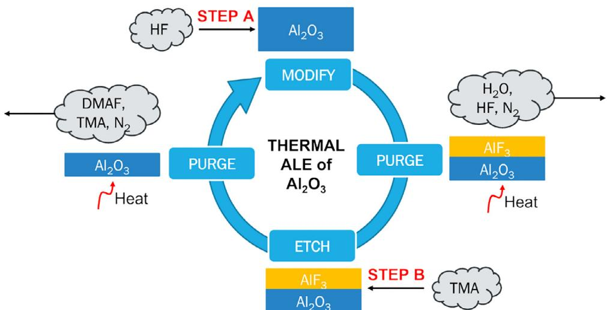  
Fig. 1. The thermal ALE cyclical process for  $\mathrm{Al_2O_3}$ . The process begins with Step A, in which HF fluorinates the surface of the substrate and modifies the surface producing  $\mathrm{AlF_3}$ . Following Step A is a purge step to remove  $\mathrm{H}_2\mathrm{O}$  vapor and residual HF. Next, Step B consists of the etching cycle to convert the modified  $\mathrm{AlF_3}$  layer into the volatile species DMAF using the reagent, TMA. The cycle concludes with another purging step to remove trace TMA and DMAF produced during the etching cycle. The addition of heat allows for complete vaporization of volatile species.

atomistic level, of which detailed descriptions are provided in the following sections.

# 2.2. Microscopic modeling

The thermal atomic layer etching (ALE) of aluminum oxide is driven by two reaction steps (Step A and Step B) using sequential and self- limiting thermal reactions that are each followed by purge steps. Hydrogen fluoride (HF) and trimethylaluminum [TMA,  $\mathrm{Al(CH_3)_3}$ ] are involved to remove the  $\mathrm{Al_2O_3}$  surface layer. In Step A (Modification cycle), HF exposure fluorinates the  $\mathrm{Al_2O_3}$  surface and forms  $\mathrm{AlF_3}$  on the substrate. During Step B (Etching cycle), TMA exposure facilitates ligand- exchange reactions and modifies the  $\mathrm{AlF_3}$  surface into a volatile layer composed of dimethylaluminum fluoride [DMAF,  $\mathrm{AlF(CH_3)_2}$ ]. Following Step A and Step B, a purge gas,  $\mathrm{N}_2$  is used to remove any byproducts produced and remaining precursors during a purge time. The schematic of the thermal ALE of aluminum oxide is illustrated in Fig. 1 and the overall reaction can be described by

$$
\begin{array}{rl} & {\mathrm{Al}_2\mathrm{O}_3\mathrm{(s)} + 6\mathrm{HF}\mathrm{(g)} + 4\mathrm{Al}(\mathrm{CH}_3)_3\mathrm{(g)}}\\ & {\rightarrow 6\mathrm{AlF}(\mathrm{CH}_3)_2\mathrm{(g)} + 3\mathrm{H}_2\mathrm{O}\mathrm{(g)}} \end{array} \tag{1}
$$

The microscopic model for the thermal ALE process of aluminum oxide thin films is formulated based on the variable step size method (VSSM) known as the kinetic Monte Carlo (kMC) algorithm, of which the detailed description was given in (Yun et al., 2021). In this previous work,  $\theta - \mathrm{Al_2O_3}$  (2.0 1) for the aluminum oxide structure was employed and approximated to a  $300\times 300$  lattice model. After modeling the surface, DFT (Density Functional Theory) calculations were performed to investigate all critical reaction steps that have significant impacts on the overall surface reaction time and to estimate their kinetic parameters.

In this work, the wafer is divided into twelve regions to spatially simulate the microscopic model to obtain realistic and accurate etching data across the entire wafer surface, which is presented in Fig. 2a. Pressure and temperature data at the twelve wafer regions are extracted from the CFD model at each time step and substituted into the kMC algorithm. All reaction rate constants are obtained from temperature and pressure by using Collision Theory and Transition- State Theory. Finally, the sum of the rate constants  $(k_{total})$  is calculated by

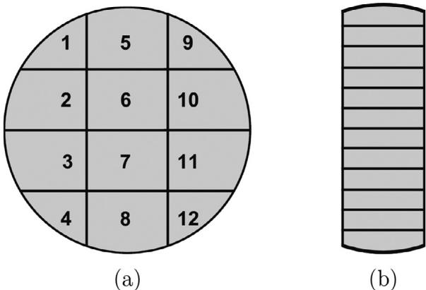  
Fig. 2. (a) Twelve substrate regions for microscopic simulations. (b) Twelve substrate positions for the investigation of the flow distribution.

$$
k_{total} = \sum_{i = 1}^{N}k_{i} \tag{2}
$$

where  $k_{i}$  is the reaction rate constant of the reaction  $i$ , and  $N$  is the number of reaction pathways. For the reaction selection of a single reaction site on the wafer, a specific reaction can be randomly chosen as follows:

$$
\sum_{i = 1}^{j - 1}k_{i}\leq \gamma_{1}k_{total}\leq \sum_{i = 1}^{j}k_{i} \tag{3}
$$

where  $j$  represents the reaction  $j$  and  $\gamma_{1}\in (0,1]$  is the first random number for the reaction selection. The reaction selection is implemented at every reaction site in which a random number is generated for each reaction site. If the value of  $\gamma_{1}k_{total}$  lies between  $\sum_{i = 1}^{j - 1}k_{i}$  and  $\sum_{i = 1}^{j - 1}k_{i}$ , the reaction  $j$  is chosen for the reaction site. Otherwise, no reaction occurs at the reaction site. Once the reaction selection task for every reaction site is completed, the system clock evolves with a time interval determined as follows:

$$
\Delta t = \frac{-\ln\gamma_2}{k_{total}} \tag{4}
$$

where  $\gamma_{2}$  is the second random number used for the time evolution  $(\gamma_{2}\in (0,1])$

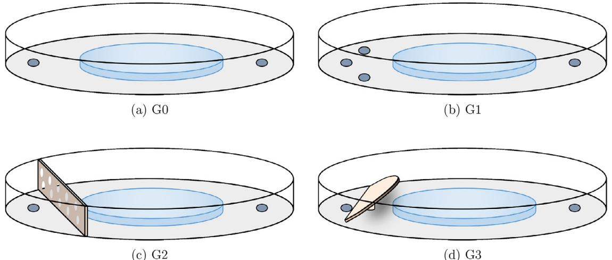  
Fig 3. t t to color in this figure legend, the reader is referred to the web version of this article.)

# 2.3. Macroscopic gas-phase modeling for four reactor configurations

For macroscopic modeling, four different types of reactors are constructed and their performances are evaluated with respect to two metrics: film uniformity and etching speed (the specific designs considered are discussed in greater detail in the next subsection). The performance of a reactor is closely related to how fast a film on the wafer is deposited or etched. The magnitude of the deposition and etching rates is largely dependent on the type of fluid flow (laminar or turbulent), which is directly related to the precursor flow rates. For instance, Peltonen et al. (2018) demonstrated that higher precursor flow rates resulted in higher deposition and etching rates, but the reduction in their process operating times was not significant. In addition to the deposition/etching rate, the film etching uniformity across the wafer is another key factor to evaluate the reactor designs. Despite the fact that self- limiting behaviors have been reported in atomic layer processes (Lill, 2021), the spatial film etching uniformity could be degraded due to the non- uniform distribution of precursors (Elers et al., 2006) in the gas- phase above the wafer, and this could compromise the integrity of the etched product. For instance, turbulent flow can disrupt the uniformity of the fluid flow, thus undermining the film quality of the wafer. For this research, it is desirable to consider several reactor configurations that can introduce inherent reactor resistance to turbulent flow and maintain a laminar flow profile for the operating flow rate regime to improve film etching quality. Therefore, these two aforementioned factors, etching rate and uniformity, are considered to compare the performances of the four reactor configurations considered in this work.

# 2.3.1. Reactor chamber designs

There are two general types of reactors for single- wafer systems: the top injection reactor and the cross- flow reactor (Granneman et al., 2007). The top injection reactor with distributors enables precursors to be uniformly injected above the wafer leading to highly uniform etching of the thin films. On the other hand, the cross- flow reactor has a smaller height of a few mm so that the gas displacement time is minimized. The cross- flow model also maximizes the lateral convective flow across the wafer. In this work, the cross- flow reactor is adopted to reduce the process and purge time since HF has a long residence time, which may remove self- limiting behavior resulting in spontaneous chemical vapor etching (Lee and George, 2015). These cross- flow reactors are constructed with a feed source from one end of the reactor and the output source on the opposing end of the reactor to induce mass transport from one end of the wafer to the opposing end of the wafer. However, for conformal thin film etching, it is essential to obtain uniform flow profiles across the surface of the wafer (Elers et al., 2006). Therefore, different distributors are employed in the cross- flow reactors to optimize the flow profiles of the precursor. Then, the modified reactors are compared to the simplest reactor geometry that has no distributor to determine if the distributor is effective in improving the performance of the precursor flow uniformity and the etching rate.

Specifically, in this work, four types of reactor chambers are created and their performances are evaluated by multiscale CFD simulations. First of all, the typical geometry (G0) is developed, which is a cylindrical- shaped chamber with a  $500~\mathrm{mm}$  outer diameter and  $10~\mathrm{mm}$  height as shown in Fig. 3a. A wafer of  $300~\mathrm{mm}$  diameter is placed at the center of the bottom face of the chamber where an inlet of  $20~\mathrm{mm}$  diameter and an outlet of  $40~\mathrm{mm}$  diameter are located on the bottom face. Based on G0, a multi- inlet geometry (G1), a showerhead geometry (G2), and an inclined plate geometry (G3) are proposed. The multi- inlet geometry (G1) is constructed with three inlets in place of one inlet, in which each inlet has the same diameter as that of G0, but the total feed flow rate is divided evenly for all three inlets, with the total flow rate summing to the same inlet flow rate as that of G0. G1 is visualized in Fig. 3b. As shown in Fig. 3c, the showerhead geometry (G2) is constructed similarly to G0 but includes a showerhead divider of  $2~\mathrm{mm}$  thickness that distributes the inlet flow to achieve a uniform flow. The size of the pores is  $4~\mathrm{mm}$  in diameter for a total of 63 pores that are distributed into two rows. Lastly, the inclined plate geometry (G3) is developed with an arch- shaped inclined plate with  $2~\mathrm{mm}$  thickness between the inlet and the wafer surface with five degrees of deviation from the horizontal as shown in Fig. 3d. There are several assumptions that are applied to the operation of the reactor:

1. There are carrier gas manifolds in the upstream facility so that the precursors and  $\mathbb{N}_2$  are well-mixed when introduced into the reactor. 
2. Other geometric objects such as sensors and mechanical structures are ignored. 
3. The temperature of the substrate is maintained through a PID (proportional-integral-derivative) controller at a desired setpoint.

Table 1 The mesh quality acceptability criteria range and mesh parameters calculated from Ansys Fluent for various reactor geometries. For orthogonality, the minimum value is presented on the left and the average value is presented on the right.  

<table><tr><td>Quality indicator</td><td>Orthogonality</td><td>Skewness</td><td>Aspect ratio</td><td>Number of cells</td></tr><tr><td>Criteria</td><td>0.001～1*</td><td>0*～0.95</td><td>1*～8</td><td>N/A</td></tr><tr><td>G0</td><td>0.130/0.727</td><td>0.271</td><td>2.060</td><td>266,291</td></tr><tr><td>G1</td><td>0.152/0.727</td><td>0.272</td><td>2.036</td><td>273,210</td></tr><tr><td>G2</td><td>0.002/0.741</td><td>0.252</td><td>1.525</td><td>1,550,322</td></tr><tr><td>G3</td><td>0.207/0.738</td><td>0.261</td><td>2.977</td><td>574,414</td></tr></table>

\*Desired value for ideal mesh quality.

4. The operating pressure is controlled and maintained via the vacuum pump in the downstream facility. 
5. The flow through the reactor is characterized as laminar flow.

The above assumptions are implemented into the boundary conditions that would generate the mesh for the multiscale computational fluid dynamics simulation.

# 2.3.2.Meshing

The characteristics of the mesh for each reactor geometry will play a substantial role in the convergence, accuracy, and stability of the numerical solutions that will be calculated. Meshing Mode, an application of Ansys Fluent, is used to construct the mesh for the reactors described in Section 2.3.1. An acceptable mesh can be determined by mesh quality criteria in accordance with the standards outlined by ANSYS (2021) as shown in Table 1.

Specifically, Table 1 shows the key indicators used for analyzing the mesh quality. The quality of the mesh depends on the geometry of the cells and the boundary conditions used to define the overall geometry of the mesh. In this work, hybrid meshes, consisting of mixed element types, are generated to substantially reduce the computation time but still maintain acceptable mesh quality. Prism layers are utilized to resolve the boundary regions and tetrahedral cells are employed as a rudimentary element in the reactor chambers.

Among the factors that affect the mesh quality, skewness; orthogonality; aspect ratio; and resolution, are considered for the evaluation of the developed mesh structures for the various chamber geometries. The skewness of a cell is defined as the measure of the difference between a cell's geometry with that of an equivalent equilateral geometry of the same volume of the actual cell. The equilateral skewness for the tetrahedral mesh is calculated from the following equation:

$$
\mathrm{Skewness} = \frac{\mathrm{optimalcellsize} - \mathrm{cellsize}}{\mathrm{optimalcellsize}} \tag{5}
$$

The optimal cell size is defined as the size of an equilateral cell with the same circumradius. Thus, if the cell size is approximately equal to the optimal cell size, an ideal skewness of O is obtained. A low skewness is desirable to obtain an accurate and stable solution. The orthogonality is defined as the minimum value of all of the cells of the mesh from the following equation:

$$
\frac{\vec{A_i}\cdot\vec{C_i}}{|\vec{A_i}||\vec{C_i}|} \tag{6}
$$

where  $\vec{A_i}$  is the area vector of a face and  $\vec{C_i}$  is the vector from the centroid of the cell to the centroid of the adjacent cell. An ideal mesh has an orthogonality that is close to unity. For tetrahedral cells, the orthogonal quality is the minimum of the orthogonality of all cells in the mesh. Due to the variance in the orthogonality for each cell, the minimum orthogonality of all the cells should be greater than O.001. The aspect ratio is another important indicator, which is a measure of the stretching of a cell. The aspect ratio is calculated as the ratio of the maximum to the minimum of the normal distance between the face centroids and the cell centroids, and the distance between the nodes and the centroid. A uniform aspect ratio is desirable for regions where the flow field varies greatly and an ideal aspect ratio is equivalent to unity for equilateral cells. Lastly, the resolution has a significant contribution to how critical regions are calculated and directly affects the total number of cells used to describe the mesh. The resolution of the mesh is a measure of the distribution of cells in particular regions of the mesh geometry and is measured in terms of coarseness or fineness. Meshing mode contains a tool that produces adaptive sizing that automatically generates regions where the mesh is finer at the boundary regions and coarser in regions away from the boundary. It is important to obtain high resolution, especially in critical regions where boundary layers change dramatically in their behavior, specifically, wall- fluid boundaries, which will affect the accuracy of the computed numerical solution. Thus, the following equation, which is derived from the Blasius approximate solution for laminar flow over a flat plate, can be employed for determining the meshing in the flow domain near the walls:

$$
y_{p}\sqrt{\frac{u_{\infty}}{\nu x}}\leq 1 \tag{7}
$$

where  $y_{p}$  is the distance to the wall from the adjacent cell centroid,  $u_{\infty}$  is the free stream velocity,  $\nu$  is the kinematic viscosity of the fluid, and  $x$  is the distance along the wall from the starting point of the boundary layer.

The consideration of the aforementioned factors affecting mesh quality leads to the development of the meshes for each reactor configuration, which are visualized in Fig. 4. The results from the meshing process for all reactor configurations, which are listed in Table 1, indicate that all reactor geometries are within the acceptability criteria for the average values. This also implies that the meshes built via Fluent's Meshing Mode would have reliable computed results. Mesh independence studies were also carried out for all reactor designs to ensure that the simulation results are independent of the mesh structure.

# 2.3.3. Thermophysical property calculation

Thermophysical data are required for the materials used in the etching process and are employed in the computational fluid dynamics (CFD) simulations. However, some species produced during the etching process have limited thermophysical data in the open literature. One of these species, dimethylaluminum fluoride (DMAF), has little to no available experimental data, thus computational chemistry calculations via the open- source thermochemistry simulation software, Quantum Espresso (QE), are utilized to calculate thermophysical parameters including the standard enthalpy, the standard entropy, and the specific heat (Giannozzi, 2009; Baroni et al., 2011) for DMAF. Despite the accessibility of QE, there are limitations for calculating other thermophysical parameters including thermal conductivity and viscosity. For this work, these parameters are determined by adopting the parameters from a chemically similar molecule, dimethylaluminum chloride (DMACI),

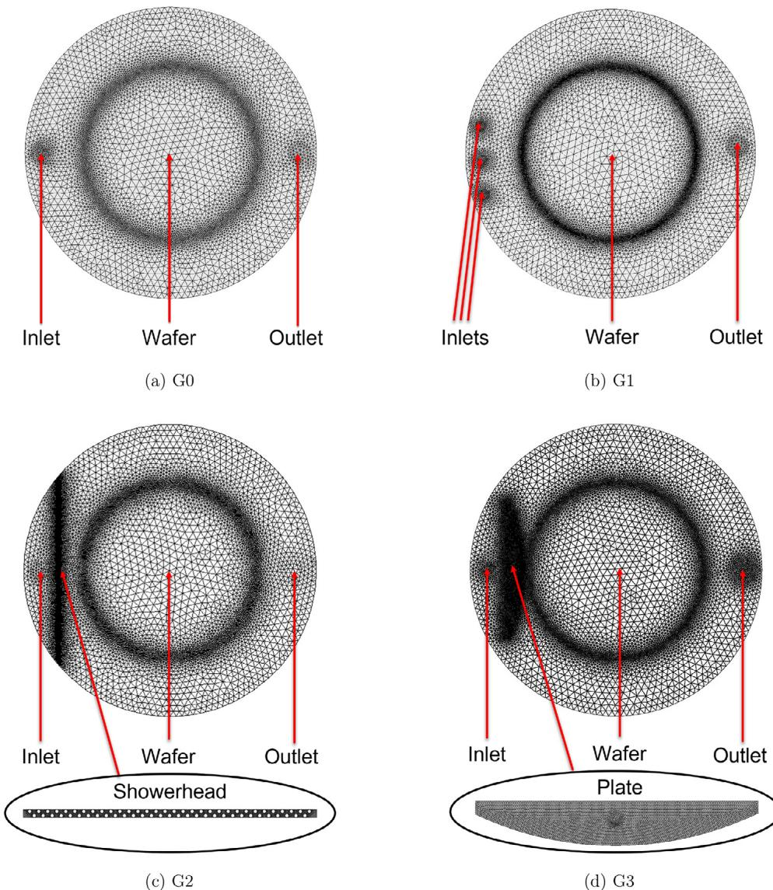  
Fig.4. reactor, and (d) the inclined plate reactor.

to DMAF (DIPPR, 2020), because chlorine and fluorine exhibit similar chemical behaviors as halogens. Lastly, the density of DMAF is calculated by assuming that the species behaves as an ideal gas due to the ambient environment of the reactor having low pressure and high temperature operating conditions, which are summarized in Table 3.

Quantum Espresso contains several packages that are required for calculating thermophysical data and these programs must be run sequentially. First, the PWscf (Plane- Wave self- consistent field) program is used to calculate the electronic properties and optimize the atomic positions of the molecule, which are modeled using Density Functional Theory (DFT) and PAw (Projector Augmented Wave) pseudopotential data. Next, the PHonon package is used to calculate the dynamical matrix of the phonons. Various programs are dedicated to the building of the dynamical matrix (PH program), to the solving of the interatomic force constants (IFC) from the dynamical matrix (Q2R program), and to calculating the eigenvalues of the dynamical matrix, which are the vibrational frequencies of the molecule (MATDYN program), by employing the finite displacement method and the density functional perturbation theory.

Lastly, the QHA (Quasi- Harmonic Approximation) package including the Partial Phonon DOS (Density of States) program is used to calculate atom projected density of states, the Mean Square Displacement program in the QHA package is utilized to calculate the deviation of the atom with respect to a reference position caused by the vibration of the atoms, and lastly, the FQHA (Fractional Quasi- Harmonic Approximation) program combines the results produced from the latter- mentioned programs to calculate the thermophysical properties including entropy, enthalpy, Helmholtz free energy, and specific heat at constant volume as functions of temperature. The results from the phonon calculation are displayed in Table 2. The formulation and derivation of the equations to solve the vibrational frequencies of the dynamical matrix and to calculate the thermophysical properties using statistical thermodynamics are discussed in greater detail by Baroni et al. (2010) and Togo and Tanaka (2015).

# 2.3.4. Three-Dimensional computational fluid dynamics simulation

Facilitated by the Hoffman2 Cluster at UCLA, the Fluent computations are implemented with 24 parallel central processing units (CPU) with 16 GB memory for each core processor so that the par

Table 2 Thermophysical material properties of DMAF specified in Ansys Fluent.  

<table><tr><td>Thermophysical parameter</td><td>Value</td><td>Units</td></tr><tr><td>Standard Enthalpy of Formation*</td><td>4499.290</td><td>kJ/mol</td></tr><tr><td>Standard Entropy of Formation*</td><td>196.421</td><td>J/(mol K)</td></tr><tr><td>Specific Heat at Constant Pressure*</td><td>123.633</td><td>J/(mol K)</td></tr><tr><td>Thermal Conductivityf</td><td>6.07268</td><td>W/(m K)</td></tr><tr><td>Viscosityf</td><td>0.01100</td><td>kg/(m s)</td></tr></table>

Parameters calculated from Quantum Espresso. Property data of DMACI (DIPPR, 2020).

allel processing splits the gas- phase domain into multiple partitions to improve the computation efficiency. There are two solver technologies available in Fluent: pressure- based and density- based. The pressure- based solver has been traditionally used for incompressible and mildly compressible flow. The thermal ALE is operated at an extremely low pressure in a single- phase flow, and thus, the pressure change of the mixture is negligible. In addition, the feed composition of the precursor is low, therefore the density and pressure change of the species are negligible for this simulation. Therefore, the pressure- based solver is applicable for this work. The operating conditions of the reactor are listed in Table 3. In addition, under the pressure- based solver, the coupled algorithm is used to significantly decrease the convergence time, in which the momentum equation and the pressure- based continuity equation are solved simultaneously. Transient analysis for comprehensive computational fluid dynamics (CFD) modeling of thermal ALE is performed with a time step of  $0.025~s$  with 200 iterations under transport phenomena. The conservation equations for mass and momentum are written as follows:

Table 3 Operating conditions for the thermal ALE process.  

<table><tr><td>Parameter</td><td>Value</td><td>Units</td></tr><tr><td>Operating Pressure</td><td>133</td><td>Pa</td></tr><tr><td>Operating Temperature</td><td>573</td><td>K</td></tr><tr><td>N2flow rate</td><td>150</td><td>sccm</td></tr><tr><td>HF half-cycle</td><td>2.0</td><td>s</td></tr><tr><td>1st Purge</td><td>5.0</td><td>s</td></tr><tr><td>TMA half-cycle</td><td>3.0</td><td>s</td></tr><tr><td>2nd Purge</td><td>5.0</td><td>s</td></tr></table>

$$
\frac{\partial\rho}{\partial t} +\nabla \cdot (\rho \vec{v}) = S_m \tag{8}
$$

$$
\frac{\partial(\rho\vec{v})}{\partial t} +\nabla \cdot (\rho \vec{v}\vec{v}) = -\nabla p + \nabla \cdot (\overrightarrow{\overline{v}}) + \rho \vec{g} +\overrightarrow{F} \tag{9}
$$

where  $\rho$  is the density of the mixture,  $\overrightarrow{F}$  is the velocity of the mixture,  $S_{m}$  is the mass transfer source term,  $p$  is the static pressure,  $\overrightarrow{\overline{t}}$  is a rank two stress tensor that is symmetric,  $\rho \overrightarrow{g}$  is the gravitational body force, and  $\overrightarrow{F}$  is the external body force. In addition, the conservation of energy is described by

$$
\frac{\partial}{\partial t} (\rho E) + \nabla (\vec{v} (\rho E + p)) = -\nabla (\Sigma h_{j}j_{j}) + S_{h} \tag{10}
$$

where  $E$  is the internal energy,  $h_j$  is the sensible enthalpy of species  $j,j_{j}$  is the diffusion flux of species  $j,$  and  $S_{h}$  is the heat transfer source term.

The inclusion of precursor consumption from Steps A and B to the multiscale 3D CFD simulation is employed to generate a more realistic flow profile. The consumption of the precursors and generation of products are calculated from the reaction rate constants determined by the modified Arrhenius equation that is defined as follows:

$$
k_{j} = A_{j}T^{\beta_{j}}e^{-E_{A,j} / RT} \tag{11}
$$

In the above equation,  $k_{j}$  is the reaction rate constant for reaction  $j,T$  is the ambient temperature of the reactor,  $\beta_{j}$  is the temperature exponent for reaction  $j,E_{A,j}$  is the activation energy for reaction  $j,$  and  $R$  is the ideal gas constant. For simplicity, the temperature exponent,  $\beta_{j}$  would be declared O for the simulation. Due to the large number of reactions and the lack of thermophysical data for numerous species obtained from prior microscopic research from Yun et al. (2022), Eq. (1) will be simplified into two surface reaction steps that are defined below:

$$
\mathrm{Al}_2\mathrm{O}_3(\mathrm{s}) + 6\mathrm{HF}(\mathrm{g})\rightarrow 2\mathrm{AlF}_3(\mathrm{s}) + 3\mathrm{H}_2\mathrm{O}(\mathrm{g}) \tag{12}
$$

$$
2\mathrm{AlF}_3(\mathrm{s}) + 4\mathrm{Al}(\mathrm{CH}_3)_3(\mathrm{g})\rightarrow 6\mathrm{AlF}(\mathrm{CH}_3)_2(\mathrm{g}) \tag{13}
$$

First, the gaseous precursor, HF, physisorbs onto the surface of  $\mathrm{Al}_2\mathrm{O}_3$  to produce  $\mathrm{AlF}_2$  and water vapor when reacting under high temperatures. Subsequently, the gaseous species, TMA, chemisorbs onto the  $\mathrm{AlF}_3$  surface forming the volatile species DMAF. After defining these reactions, operating conditions are needed to fully define the system.

Table 3 shows the operating conditions of the multiscale 3D CFD simulations presented below. The operating pressure is set to be  $133\mathrm{Pa}$  and the temperature is maintained at  $573~\mathrm{K}$  thus, the material thermophysical properties are expected to be constant, hence, the data calculated in Table 2 is not required to account for the temperature dependence. As previously mentioned in Section 2.3.1, the temperature of the surface can be maintained through a control system that measures the temperature in real time while the operating pressure is controlled by discharging effluent through a vacuum pump. A constant flow of 150 sccm of  $\mathbb{N}_2$  gas is used to carry hydrogen fluoride (HF) and trimethylaluminum (TMA) into the reactor. The operating conditions are defined by a user- defined function (UDF) implemented in Ansys Fluent, in which the operating conditions are automatically adjusted according to the cyclical operation.

# 3. Simulation results and reactor design evaluation

The multiscale computational fluid dynamics (CFD) simulations are first performed for each reactor model with an HF flow rate of 150 sccm and a TMA flow rate of 70 sccm to validate the 3D multiscale CFD model. Next, the results from the multiscale CFD modeling of the four reactors, G0 through G3, are discussed to observe which reactor design achieves a better distribution of precursor flow for the film uniformity and faster half- cycle times for Steps A and B. Finally, the reactor that produces the best performance is selected and simulated at different precursor flow rates to be compared with the typical type reactor (G0) in terms of efficiency and effectiveness.

# 3.1. Simulation results of multiscale CFD modeling and validation

In the multiscale CFD simulations, the flow is assumed to be laminar in the fluid dynamics point of view as discussed in Section 2.3.1. The assumption is validated by the contours of the Reynolds number at 0.025 s of half- cycle time elapsed at standard reactor operating conditions, which are illustrated in Figs. 5 and 6. It is observed that the highest Reynolds number is localized at the precursor injection region for Steps A and B, with the largest Reynolds number among all reactor configurations being 1.30 for Step A and 2.59 for Step B with both values obtained from the showerhead reactor. Consequently, no turbulent regime is observed throughout all of the reactors due to the atmospheric operating condition which provides more control over the flow pattern. As a result, the flow through the reactor is characterized by laminar behavior and supports the assumption made in Section 2.3.1.

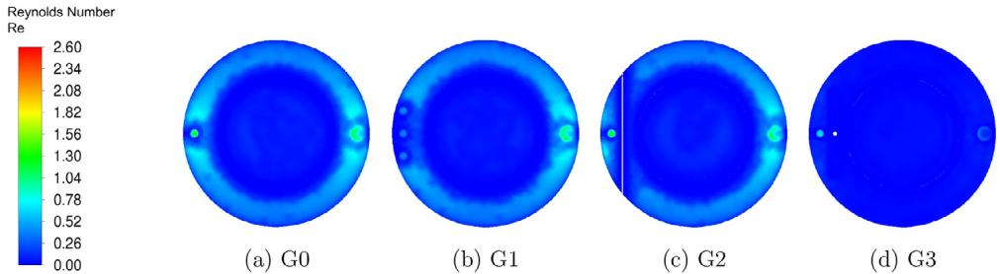  
Fig. 5. Contours of Reynolds Number for Step A of various reactor configurations at 0.025 s in the standard condition in Table 3.

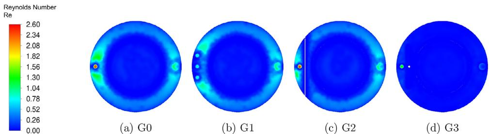  
Fig. 6. Contours of Reynolds Number for Step B of various reactor configurations at 0.025 s in the standard condition in Table 3.

Table 4 Half-cycle times determined by the kMC simulation of the multiscale CFD model.  

<table><tr><td>Reactor</td><td>Step A</td><td>Step B</td></tr><tr><td>G0</td><td>1.437 s</td><td>2.514 s</td></tr><tr><td>G1</td><td>1.446 s</td><td>2.542 s</td></tr><tr><td>G2</td><td>1.436 s</td><td>2.528 s</td></tr><tr><td>G3</td><td>1.414 s</td><td>2.498 s</td></tr></table>

As shown in Fig. 2a, the wafer is divided into twelve parts to calculate the etching progression for the microscopic simulations since the process data varies with location on the surface. Dividing the wafer into twelve sections enables one to collect more accurate and plausible numerical solutions than simulations with averaged pressure and temperature for the whole wafer. The results of multiscale computational fluid dynamics (CFD) simulations for the reactors are provided in Table 4. For all four reactors, the half- cycle times for Step A are calculated as 1.414 s through 1.446 s and the half- cycle times for Step B are also calculated as 2.498 s through 2.542 s using the kinetic Monte Carlo (kMC) method. The half- cycle times for both steps were computationally determined to be 1.38 s and 2.38 s, respectively, in the previously developed microscopic model (Yun et al., 2022) where the simulations were performed under ideal conditions without the influence of transport phenomena effects in the gas phase, which was supported by the experimental data from Lee et al. (2016). It is obvious that the half- cycle times from the multiscale CFD modeling are delayed due to the inclusion of mass transport as it takes some time for the wafer to be saturated by the precursors unlike the microscopic model at the steady- state. Furthermore, the consideration of the consumption of precursor species contributes to the slower process time. Hence, it is demonstrated that the overall multiscale CFD modeling including the thermophysical data is successfully developed.

# 3.2. Comparison of reactor designs

The central region (sections 5 through 8 in Fig. 2a) of the wafer, as shown in Fig. 2b, is divided into 12 substrate positions (labeled in increasing order from the top to the bottom of the figure) to calculate the pressure of the precursors at each part so that the analy sis of film uniformity is carried out. Fig. 7 shows the flow patterns of the four reactors over substrate position, which exactly agrees with the pressure contours of the precursor in Fig. 8. The pressure contours of HF precursor are also consistent with the pressure contours of TMA in Fig. 9, thus the type of species in the thermal ALE cycle of  $\mathrm{Al_2O_3}$  plays a limited role in affecting the flow profile. As shown in Fig. 7a, the flow of the typical reactor (G0) is formed in a circular shape due to the isotropic flow. The largest pressure deviation (i.e., the difference between the maximum and minimum pressures) is given as  $15.2\mathrm{Pa}$  at  $0.2s$  and the half- cycle times are 1.437 s for Step A and 2.514 s for Step B.

Fig. 7b indicates that the flow of the reactor with three inlets (G1) is more evenly distributed than that of G0, and consequently, G1 has less pressure deviation than G0, of which the largest value is  $11.4\mathrm{Pa}$  at  $0.2s$  This is also shown in Fig. 8b. However, the half- cycle times (1.446 s for Step A and  $2.54s$  for Step B) are greater than those of G0 due to the lower precursor velocity as can be seen in Table 4. Despite the input being distributed through three inlets, the flow appears to migrate more towards the outlet of the wafer, leading to an uneven flow profile.

Fig. 7c reveals that the reactor with the showerhead (G2) improves the flow pattern when compared to that of G0 and G1, and the largest pressure deviation is calculated to be  $8.5\mathrm{Pa}$  at  $0.2s$  Also, with time progression, the uniformity of the flow improves faster, hence, the pressure deviation decreases, compared to G0 and G1. In the initial stages of flow development, the parabolic pressure profile mentioned in the discussion of G0 is also displayed with that of G2 in Figs. 8c and 9c. It is observed that the showerhead serves to decrease the amount of precursor in central regions of the wafer, and therefore G2 has better uniformity compared to G0 and G1. The half- cycle times (1.436 s for Step A and 2.528 s for Step B) are similar to the half- cycle times of G0 due to the flow resistance of the showerhead divider. Thus, the addition of the showerhead divider improves the uniformity, but marginally improves the half- cycle time for Step A and slightly increases the half- cycle time for Step B.

As shown in Fig. 7d, the reactor with the inclined plate (G3) has the most uniform flow pattern at every time step, in which the largest pressure deviation is  $2.9\mathrm{Pa}$  at  $0.2s$  Table 4 shows that G3 has the least half- cycle times (1.414 s for Step A and 2.528 s for

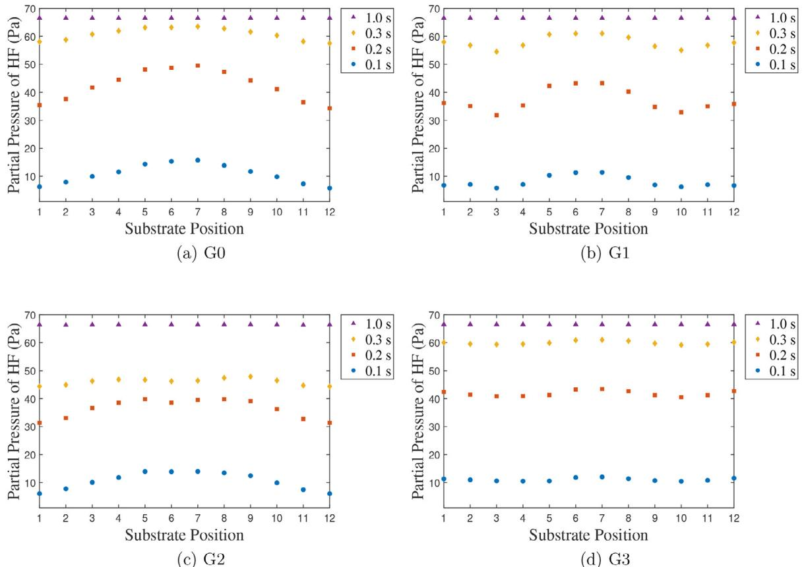  
Fig.7. t  t divided wafer in Fig. 2b to the bottom.

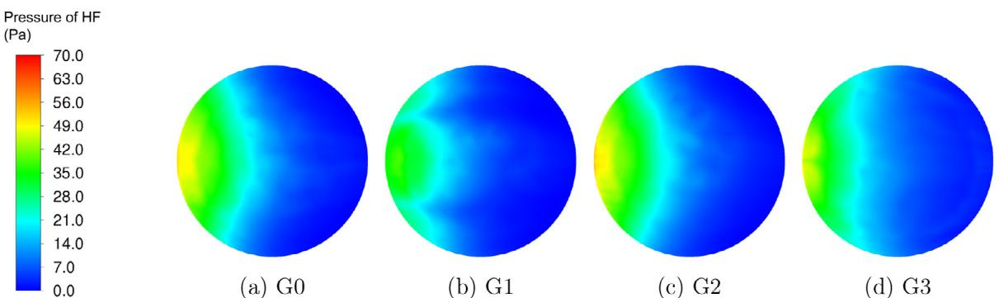  
Fig. 8. Contours of pressure of HF on the surface of the wafer for a Step A process time of 0.1 s and for a HF feed flow rate of 150 sccm.

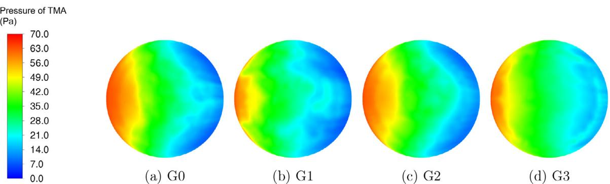  
Fig. 9. Contours of pressure of TMA on the surface of the wafer for a Step B process time of 0.2 s and for a TMA feed flow rate of 70 sccm.

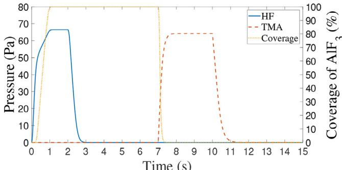  
Fig. 10. Complete cycle of G3 displaying the pressure of HF and TMA and coverage of  $\mathrm{AlF_3}$  for all HF and TMA feed flow rate of  $150~\mathrm{scm / h}$  and  $70~\mathrm{scm / h}$ , respectively. The blue solid line and the orange dashed line indicate the pressure of HF and TMA over time, respectively. The yellow solid line shows the coverage of  $\mathrm{AlF_3}$ . The  $\mathrm{AlF_3}$  is formed in Step A and etched in Step B. (For interpretation of the references to color in this figure legend, the reader is referred to the web version of this article.)

Step B) among the reactors despite the inclined plate acting as a flow resistance. Nevertheless, the results indicate that the effect of the uniformity outweighs the flow resistance, thus leading to the expediting of the etching process. Therefore, it is concluded that G3 may be able to provide better film quality and thickness control than the other types of reactors. The complete etching cycle of  $\mathrm{Al_2O_3}$  for G3 is displayed in Fig. 10. The inclined plate reactor (G3) shows the best performance in terms of the film uniformity and etching speed. Fig. 10 shows the pressure of the two precursors and the etching progression over time, which is provided from the multiscale CFD simulation. The cycle consists of an HF dose of  $2s$ , an  $\mathrm{N}_2$  purge of  $5s$ , a TMA dose of  $3s$ , and an  $\mathrm{N}_2$  purge of  $5s$ .

# 3.3. Efficiency of the inclined plate reactor

Multiscale CFD simulations are performed previously for different feed flow rates for the typical reactor (G0) and the reactor with the inclined plate (G3). The comparison of the half- cycle times of Steps A and B and the annual feed consumption of the precursor species, HF and TMA, are displayed in Fig. 11. The annual feed consumption is calculated by assuming that 96 cycles of etching are conducted daily and that the half- cycle times for each feed flow rate remain constant with each cycle in a single wafer system. The estimates for the precursor consumption are calculated for a single wafer. The results for Step A in Fig. 11a indicate that the half- cycle time for Step A for G3 is consistently faster compared to that of G0, thus, the amount of precursor needed to ensure complete coverage is less than that of G0. By utilizing G3, at least  $1.3\times 10^{3}$  std  $\mathtt{cm}^3$  and at most  $5.5\times 10^{4}$  std  $\mathtt{cm}^3$  of HF can be saved for the range of the simulated flow rates with 600 sccm flow rate achieving the greatest amount of precursor that could be saved. The quantitative results from Step B are displayed in Fig. 11b where faster etching results for Step B are observed for G3, thus, lesser TMA is needed to achieve complete etching of a monolayer of surface substrate. Adopting the G3 model could save at least  $6.5\times 10^{2}$  std  $\mathtt{cm}^3$  and at most  $6.7\times 10^{4}$  std  $\mathtt{cm}^3$  of TMA for the simulated range of feed flow rates. The greatest amount of TMA saved for G3 in comparison to G0 occurs with a flow rate of 600 sccm. Consequently, the benefits of utilizing the inclined plate reactor not only include reduced modification (Fluorination) and etching times but also a lesser amount of precursors is needed when compared to the typical reactor. Despite being able to maximize the amount of precursor saved for the 600 sccm flow rate, the reduction in the half- cycle times for Steps A and B suggest that increasing the precursor flow rate does not reduce the half- cycle times significantly, and thus, it may be preferable to operate under laminar- like conditions with a lower magnitude of flow rate as discussed by Peltonen et al. (2018).

# 4. Conclusion

The thermal atomic layer etching (ALE) process of  $\mathrm{Al}_2\mathrm{O}_3$  was simulated using a multiscale 3D computational fluid dynamics (CFD) model to investigate the impact of gas- phase transport phenomena on the etching process across a wafer. The CFD simulation was performed first by constructing various reactor geometries (typical, multi- inlet, showerhead, and inclined plate) and meshing these geometries was completed until the quality criteria were met using Ansys software. Next, Ansys Fluent was used to perform the CFD simulation with the inclusion of precursor consumption via reactions corresponding to the microscopic model of the etching process. The phonon calculations to obtain thermophysical data were carried out prior to CFD calculations with some materials requiring the use of computational chemistry software, Quantum Espresso (QE), to calculate the thermophysical data through electronic calculations. Lastly, the process data exported at every time step from Fluent were used in the kinetic Monte Carlo (kMC) microscopic model to determine the half- cycle times for Steps A and B for each reactor geometry. The results of the multiscale CFD model were validated by the experimental results from Lee and George (2015). It was found that the inclined plate reactor produces a desirable distribution of precursor to the wafer and has

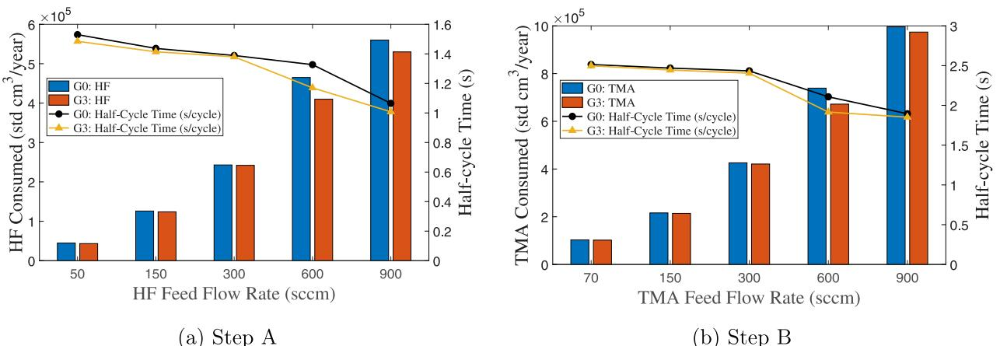  
Fig.1. t time of G0 and G3 for both steps, respectively. (For interpretation of the references to color in this figure legend, the reader is referred to the web version of this article.)

faster half- cycle times for both Steps A and B compared to the other three reactor geometries studied.

# Declaration of Competing Interest

The authors declare that they have no known competing financial interests or personal relationships that could have appeared to influence the work reported in this paper.

# CRediT authorship contribution statement

Sungil Yun: Conceptualization, Methodology, Software, Writing - original draft. Matthew Tom: Conceptualization, Methodology, Software, Writing - original draft. Feijung Ou: Software, Writing - original draft. Gerassimos Orkoulas: Writing - review & editing. Panagiotis D. Christofides: Writing - review & editing.

# Acknowledgments

Financial support from the National Science Foundation is gratefully acknowledged. In addition, technical support from the UCLA Institute for Digital Research and Education (IDRE) is thankfully acknowledged. The authors would also like to thank Junwei Luo and Yi Ming Ren for their comments.

# References

ANSYS, 2021. Ansys Fluent Theory Guide. ANSYS Inc., Canonsburg, PA. Baroni, S., Giannozzi, P., Isaev, E., 2010. Density- functional perturbation theory for quasi- harmonic calculations. Rev. Mineral. Geochem. 11, 93- 58. Baroni, S., Giannozzi, P., Isaev, E., 2011. Thermal properties of materials from ab initio quasi- harmonic phonons. arXiv preprint arXiv:1112.4977. Crose, M., Zhang, W., Tran, A., Christofides, P.D., 2018. Multiscale three- dimensional CFD modeling for PECVD of amorphous silicon thin films. Comput. Chem. Eng. 112, 184- 198. De la Huerta, C.M., Nguyen, V.H., Dedulle, J- M., Behet, D., Jimenez, C., Munoz- Rojas, D., 2018. Influence of the geometric parameters on the deposition mode in spatial atomic layer deposition: a novel approach to area- selective deposition. Coatings 9, 5.

DIPPR, 2020. DIPPR Project 801. Design Institute for Physical Properties, AIChE, New York, NY. Elers, K.- E., Blomberg, T., Peussa, M., Aitchison, B., Haukka, S., Marcus, S., 2006. Film uniformity in atomic layer deposition. Chem. Vap. Depos. 12, 13- 24. Giannozzi, P., 2009. Quantum- dechess: a modular and open- source software project for quantum simulations of materials. J. Phys. 21, 395502. Granneman, E., Fischer, P., Pierreux, D., Terhorst, H., Zagwijn, P., 2007. Batch ALD: characteristics, comparison with single wafer ALD, and examples. Surf. Coat. Technol. 201, 22- 23. Jurczak, M., Collaert, N., Veloso, A., Hoffmann, T., Biesemans, S., 2009. Review of FINFET technology. In: 2009 IEEE International SOI Conference, Foster City, CA, USA, pp. 1- 4. Lee, Y., DuMont, J.W., George, S.M., 2016. Trimethylaluminum as the metal precursor for the atomic layer etching of  $\mathrm{Al}_2\mathrm{O}_3$  using sequential, self- limiting thermal reactions. Chem. Mater. 28, 2994- 3003. Lee, Y., George, S.M., 2015. Atomic layer etching of  $\mathrm{Al}_2\mathrm{O}_3$  using sequential, self- limiting thermal reactions with  $\mathrm{Sn(acac}_2\mathrm{)}$  and hydrogen fluoride. ACS Nano 9, 1261- 1267. Lee, Y., Kim, G.- H., Choi, B., Yoon, J., Kim, H.- J., Kim, D.H., Kim, D.M., Kang, M.- H., Choi, S.- J., 2020. Design study of the gate- all- around silicon nanosheet MOSFETs. Semicond. Sci. Technol. 39, 03LT01. Lill, T., 2021. Atomic Layer Processing. Wiley- VCH, Freemont, CA. Pan, D., Li, T., Jen, T.- C., Yuan, C., 2014. Numerical modeling of carrier gas flow in atomic layer deposition vacuum reactor: a comparative study of lattice Boltzmann models. J. Vacuum Sci. Technol. A 32, 01A110. Peltonen, P., Vuorinen, V., Marin, G., Karttunen, A.J., Karppinen, M., 2018. Numerical study on the fluid dynamical aspects of atomic layer deposition process. J. Vacuum Sci. Technol. A 36, 021516. Razavieh, A., Zeitzoff, P., Nowak, E.J., 2019. Challenges and limitations of CMOS scaling for FinFET and beyond architectures. IEEE Trans. Nanotechnol. 18, 999- 1004. Shaeri, M.R., Jen, T.- C., Yuan, C.Y., 2015. Reactor scale simulation of an atomic layer deposition process. Chem. Eng. Res. Des. 94, 584- 593. Togo, A., Tanaka, I., 2015. First principles phonon calculations in materials science. Scr. Mater. 108, 1- 5. Yun, S., Dinger, Y., Zhang, Y., Christofides, P.D., 2021. Integration of feedback control and run- to- run control for plasma enhanced atomic layer deposition of hafnium oxide thin films. Comput. Chem. Eng. 148, 107267. Yun, S., Tom, M., Luo, J., Orkoulas, G., Christofides, P.D., 2022. Microscopic and data- driven modeling and operation of thermal atom layer etching of aluminum oxide thin films. Chem. Eng. Res. Des. 177, 96- 107. Zhang, Y., Ding, Y., Christofides, P.D., 2019. Multiscale computational fluid dynamics modeling of thermal- atomic layer deposition with application to chamber design. Chem. Eng. Res. Des. 147, 529- 544. Zhang, Y., Ding, Y., Christofides, P.D., 2020. Multiscale computational fluid dynamics modeling and reaction design of plasma- enhanced atomic layer deposition. Comput. Chem. Eng. 142, 107066.