RESEARCH ARTICLE | DECEMBER 08 2008

# Plasma atomic layer etching using conventional plasma equipment

Ankur Agarwal; Mark J. Kushner

Check for updates

J. Vac. Sci. Technol. A 27, 37-40 (2009) https://doi.org/10.1116/13021361

# Articles You May Be Interested In

Space and phase resolved ion energy and angular distributions in single- and dual- frequency capacitively coupled plasmas

J. Vac. Sci. Technol. A (October 2013)

Control of ion energy and angular distributions in dual- frequency capacitively coupled plasmas through power ratios and phase: Consequences on etch profiles

J. Vac. Sci. Technol. A (March 2015)

Characteristics of pulsed plasma doping sources for ultrashallow junction formation

J. Appl. Phys. (March 2007)

# Plasma atomic layer etching using conventional plasma equipment

Ankur Agarwala)  Department of Chemical and Biomolecular Engineering, University of Illinois, 600 S. Mathews Ave., Urbana, Illinois 61801

Mark J. Kushnerb)  Department of Electrical Engineering and Computer Science, University of Michigan, 1301 Beal Ave., Ann Arbor, Michigan 48109- 2122

(Received 26 June 2008; accepted 20 October 2008; published 8 December 2008)

The decrease in feature sizes in microelectronics fabrication will soon require plasma etching processes having atomic layer resolution. The basis of plasma atomic layer etching (PALE) is forming a layer of passivation that allows the underlying substrate material to be etched with lower activation energy than in the absence of the passivation. The subsequent removal of the passivation with carefully tailored activation energy then removes a single layer of the underlying material. If these goals are met, the process is self- limiting. A challenge of PALE is the high cost of specialized equipment and slow processing speed. In this work, results from a computational investigation of PALE will be discussed with the goal of demonstrating the potential of using conventional plasma etching equipment having acceptable processing speeds. Results will be discussed using inductively coupled and magnetically enhanced capacitively coupled plasmas in which nonsinusoidal waveforms are used to regulate ion energies to optimize the passivation and etch steps. This strategy may also enable the use of a single gas mixture, as opposed to changing gas mixtures between steps. © 2009 American Vacuum Society. [DOI: 10.1116/1.3021361]

# I. INTRODUCTION

Plasma etching for microelectronics fabrication is facing extreme challenges as processes are developed for the sub45- nm technology nodes. The thinning of the dielectric in the metal (and nonmetal) field- effect transistor gate stacks and advanced three- dimensional structures (e.g., double- and trigate metal- oxide semiconductor field- effect transistors) require extreme selectivity; and will eventually require atomic layer resolution during plasma etching.2- 4 Plasma- assisted etching typically relies on energetic ion bombardment to define anisotropic features. Although high energy ion bombardment provides high rates of etching, it makes obtaining selectivity between materials difficult. As a result, precise control of selectivity on a monolayer basis having rates of industrial interest is difficult. Chemically enhanced selective etching which relies on passivation layers, such as fluorocarbon plasma etching of dielectrics, is additionally challenged to obtain monolayer control due to the need to control both the deposition of passivation as well as the removal of the passivated material. To obtain the necessary selectivity, plasma atomic layer etching (PALE) may be necessary.

PALE is a technique analogous to plasma atomic layer deposition in which processing proceeds in a cyclic, selflimiting manner. PALE relies on a chemically enhanced process in which passivation of the top layer of the material to be etched reduces the activation energy required by ion bombardment to remove that layer. For example, passivation of the top layer of Si with Cl atoms, producing  $\mathrm{SiCl}_x$  complexes, reduces the ion energy required to remove the Si as a gaseous  $\mathrm{SiCl}_x$  product compared to directly sputtering the Si. If a single layer of  $\mathrm{SiCl}_x$  can be formed followed by ion bombardment with energies above that required to remove the passivation but below the threshold for directly sputtering Si, atomic layer etching may be achieved.

A single cycle of PALE (Ref. 8) during which a monolayer of material is removed is schematically shown in Fig. 1. The cycle consists of first exposing the substrate to a minimally etching plasma to passivate the top atomic layer with only that amount of precursor required to remove a single underlying layer. The ion energies should be  $\epsilon < \epsilon_{t1}$  ,where  $\epsilon_{t1}$  is the threshold for etching the passivated top monolayer. If  $\epsilon \geq \epsilon_{t1}$  , some etching will occur. The second step is exposure of the passivated layer to an etching plasma to remove the top layer in a self- limiting manner. The ion energies should be  $\epsilon_{t1}< \epsilon < \epsilon_{t2}$  ,where  $\epsilon_{t2}$  is the threshold for sputtering the unpassivated substrate. If  $\epsilon \approx \epsilon_{t1}$  the removal of the passivated top layer may be incomplete. If  $\epsilon >\epsilon_{t2}$  , the etch will proceed beyond the passivated top layer. In principle, completion of 1 cycle results in etching of a single monolayer and the cycle can be repeated to etch as many monolayers as required. The self- limiting aspect of PALE is obtained by controlling ion energies in such a way that once the top monolayer of passivated material is removed no further etching of the underlying material can occur. In the absence of this control, etching beyond the top monolayer may occur and atomic level resolution will be lost.

PALE has been previously investigated for fabrication of GaAs and Si devices. A plasma- like atomic layer etching process was first demonstrated for GaAs devices using an

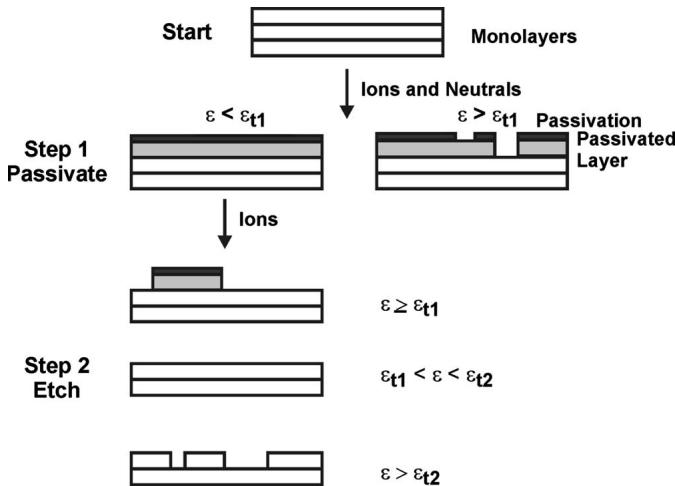  
FIG. 1. Schematic of the PALE process. Completion of 1 cycle (passivation followed by etch) results in removal of a single monolayer. The cycle is repeated to etch many monolayers.  $\epsilon_{t1}$  is the threshold for chemically enhanced sputtering and  $\epsilon_{t2}$  is the threshold for physical sputtering.

electron beam excited plasma. The sequence consisted of a  $\mathrm{Cl}_2$  gas pulse to passivate the GaAs surface, a purge cycle to remove excess  $\mathrm{Cl}_2$  and then bombardment with  $100\mathrm{eV}$  electrons followed by purge of the by- products. The etch rate was  $0.1\mathrm{nm / cycle}$  and was independent of the  $\mathrm{Cl}_2$  exposure time. Meguro et al. used a beam of  $25\mathrm{eVAr^{+}}$  to increase the etch rate to  $0.2\mathrm{nm / cycle}$  using a similar process. However, increasing the  $\mathrm{Cl}_2$  dose required longer  $\mathrm{Ar^{+}}$  irradiation to remove excess adsorbed  $\mathrm{Cl}_2$  before etching occurred. Other investigations in atomic layer etching of GaAs have involved energetic electron bombardment,  $\mathrm{KrF}$  excimer laser irradiation, and chemical beam etching.

PALE of Si has also been investigated using halogen gases for passivation and  $\mathrm{Ar^{+}}$  ion bombardment for removal of the passivation layer. Horiike et al. demonstrated atomic layer etching of Si using cryogenic adsorption of  $\mathrm{F}$  atoms followed by  $\mathrm{Ar^{+}}$  bombardment. Cooling the substrate to 113 K decreased spontaneous etching of the Si by fluorine. The etch rate was a function of  $\mathrm{F}$  atom mole fraction in the gas flow and of the exposure time of Si to  $\mathrm{F}$  atoms. As a result, self- limiting etching was not totally achieved. Matsuura et al. demonstrated PALE of Si at room temperature using  $\mathrm{Cl}_2$  gas and  $\mathrm{Ar^{+}}$  generated in an electron cyclotron resonance plasma. However, the  $\mathrm{Ar^{+}}$  ion bombardment energy or fluence was not sufficient to remove a complete atomic layer of silicon per cycle. Athavale and Economou demonstrated complete removal of an atomic layer of silicon per cycle using  $\mathrm{Cl}_2$  as a passivant and a helicon plasma as a source of  $\mathrm{Ar^{+}}$ . By adjusting the dc bias on the substrate, the  $\mathrm{Ar^{+}}$  bombardment energy could be controlled to etch one atomic layer of silicon per cycle. The etch was self- limiting with respect to both chlorine dose and the ion dose.

Park et al. used an inductively coupled plasma (ICP) ion gun as the source for  $\mathrm{Ar^{+}}$  in their investigation of PALE of Si by chlorine. The etch rate was dependent on the chlorine flow rate (necessary for complete passivation of the substrate surface) and the fluence of  $\mathrm{Ar^{+}}$  necessary for complete re moval of an atomic layer). However, self- limiting etch rates could be achieved for most conditions. PALE of Si employing ions, although at low energy, may eliminate physical damage but may not eliminate damage due to charging. To address the damage issue, PALE of Si was investigated by Park et al. using  $\mathrm{Cl}_2$  passivation followed by irradiation with an energetic Ar neutral beam. Although the etch rates depended on the  $\mathrm{Cl}_2$  pressure and Ar neutral beam fluence, one atomic layer etching per cycle of Si for the (100) and (111) orientations was obtained without charging damage.

The PALE strategies demonstrated to date have typically employed specialized plasma equipment. A common feature of this equipment is the use of different gas mixtures for the passivation and etch steps. Due to the inherently slow etch rate of PALE, it will likely be implemented only after a conventional process has more rapidly etched the overlying material and approached within a few monolayers of the interface between materials. Following this strategy would require at least two processing chambers; the first to rapidly etch to the interface (the main etch) and the second more specialized apparatus to obtain monolayer resolution at the interface (the final or over- etch). This represents additional costs to integrate the specialized equipment with conventional plasma equipment and to provide space in the clean room, as well as additional processing times and wafer handling steps.

To minimize costs and increase processing speeds, it would be desirable to perform PALE in conventional plasma equipment in which both the main etch and monolayer capable processes are performed. Even if this goal is achieved, if different gas mixtures are used for the passivation and etching steps, PALE could be slowed by having to purge the chamber of the previous gas mixture between steps. The speed of PALE could be increased if the purge steps are eliminated and the entire cycle is performed using a single gas mixture. To eliminate the purge step, precise control of the ion energy and angular distribution (IEAD) is necessary to discriminate between the threshold energies of passivated and unpassivated surfaces. The angle of the IEAD is respect to the normal to the wafer.

One method to control the ion energies incident on the wafer is using a nonsinusoidal bias waveform to narrow the spread in energy. It has been demonstrated that selectivity can be significantly improved using a narrow (in energy) IEAD as afforded by nonsinusoidal waveforms where the average ion energy is tuned to a value between the threshold energies of the two materials. One strategy for PALE would be to employ nonsinusoidal biases to discriminate between the threshold energies during the passivation and etch steps, thereby possibly eliminating the need for different gas mixtures (and so eliminate the purge step). Since this strategy requires only a change in the bias waveform, which in principle requires no change in the plasma etching chamber, the same chamber and gas mixture could be used for both the main etch and the PALE steps.

In this article, we report on results from a computational investigation of the feasibility of using conventional plasma

equipment for PALE processes by utilizing a nonsinusoidal bias waveform as a means to control the IEADs. Results will be discussed for PALE of Si in  $\mathrm{Ar / Cl}_2$  plasmas sustained in an inductively coupled plasma (ICP) reactor and for PALE of  $\mathrm{SiO}_2$  by fluorocarbon mixtures in a capacitively coupled plasma (CCP) reactor. We found that repeatable and self- limiting etching can be obtained. The selectivity of PALE and integrity of the etch (e.g., degree of roughening) depends on the ion energy of the etch step. However, depending on the reaction mechanism the emphasis may shift from control of ion energies to control of length of a cycle (either passivation or etch). Etching recipes combining a main etch with PALE were also investigated.

The reactor and feature- scale models used in this investigation are described in Sec. II. Results for PALE of Si etching using  $\mathrm{Ar / Cl}_2$  mixtures in an ICP are discussed in Sec. III, and those for PALE of  $\mathrm{SiO}_2$  using  $\mathrm{Ar / C_4F_8}$  mixtures in a magnetically enhanced CCP are discussed in Sec. IV. For these results, sinusoidal bias voltages and different gases for steps 1 and 2 are used. Etching recipes based on PALE using nonsinusoidal bias waveforms with a single gas mixture are discussed in Sec. V. Our concluding remarks are in Sec. VI.

# II. DESCRIPTION OF THE MODELS

The Hybrid Plasma Equipment Model (HPEM) was used to obtain reactor scale plasma properties and produce reactant fluxes to the substrate. The HPEM has been previously described and so will only be briefly discussed here.25,26 The HPEM is a two- dimensional simulator which iteratively achieves a quasisteady state solution. The HPEM consists of three main modules. The electromagnetic fields calculated in the Electromagnetics Module, and electrostatic fields computed in the Fluid- Kinetics Module (FKM), are used to obtain electron impact source functions and transport coefficients in the Electron Energy Transport Module. In this work, this was accomplished by solving the electron energy equation with transport coefficients obtained by solving Boltzmann's equation for the bulk electron energy distribution. A Monte Carlo simulation was used to follow the trajectories of sheath accelerated secondary electrons. These results are passed to the FKM which solves the continuity, momentum, and energy equations for neutral and charged species, and Poisson's equation for the time varying electrostatic potential. Results from the FKM (densities and electrostatic fields) are then transferred to the other modules. The modules are sequentially integrated in a time- slicing manner for a time resolved solution. However, within any given module, the fine time scales (e.g., radio frequency cycle) are resolved. The modules are iterated until a converged solution based on cycle- averaged quantities is obtained.

The Plasma Chemistry Monte Carlo Module (PCMCM) in the HPEM produces the energy and angular distributions for neutrals and ions striking surfaces in contact with the plasma. The PCMCM launches pseudoparticles representing ions and neutrals based on the electron impact source functions and the time dependent electric fields obtained from the other modules of the HPEM. Using a Monte Carlo simula tion, the PCMCM tracks the trajectories of the ions and neutrals using the same reaction mechanism as in the HPEM. Statistics are collected on the energy and angle of pseudoparticles as they strike surfaces. Angles are recorded relative to the local normal.

The two- dimensional Monte Carlo Feature Profile Model (MCFPM) then uses the energy and angular distributions at the wafer to predict etch profiles. The MCFPM has also been previously described and will only be briefly summarized here.25,26 The MCFPM resolves features on the wafer on the nm scale using a two- dimensional rectilinear mesh. Each cell in the mesh has a material identity. Pseudoparticles representing the incident plasma species are randomly selected from the distributions obtained from the PCMCM and launched toward the surface. When a pseudoparticle strikes a material cell, an outcome is chosen based on probabilities from a surface reaction mechanism using Monte Carlo techniques. Based on the selected reaction, the identities of the mesh cells are changed thereby representing deposition or a chemical reaction, or the cell is removed and turned into a gas phase particle constituting an etch or sputter product. Gas- phase species evolving from these reactions are tracked as new pseudoparticles. The mesh has square cells with dimensions of  $0.3 \mathrm{nm}$  or approximately  $\approx 1$  ML (monolayer) thickness or an atomic spacing.

The specifics of the interaction of energetic particles with surface species are in part determined by their energy and angular distributions. The source of energetic particles is ions accelerated through the sheath with energies of up to hundreds of eV and angular spreads  $\approx 5^{\circ} - 10^{\circ}$  from the vertical. We assumed that ions neutralize upon interaction with the surface and so we do not distinguish between the activation ability of ions and energetic neutrals. This is similar to the techniques used in molecular dynamics simulations.27 Energetic particles can either specularly or diffusively reflect from surfaces, with an energy loss which is larger for diffusive scattering than for specular scattering. The reaction mechanism we used for Si etching in chlorine plasmas is discussed in Ref. 28 and the mechanism for fluorocarbon etching of  $\mathrm{SiO}_2$  is discussed in Ref. 26.

Silicon etching in chlorine plasmas takes place by first successively chlorinating surface sites forming  $\mathrm{SiCl}_n$  (i.e.,  $\mathrm{SiCl}$  followed by  $\mathrm{SiCl}_2$  and  $\mathrm{SiCl}_3$ ).28,29 This chlorination is predominantly accomplished by neutral  $\mathrm{Cl}$  atoms and does not typically produce multiple layers of passivation (i.e., multiple layers of  $\mathrm{SiCl}_n$  growing on top of  $\mathrm{SiCl}_n$ ) due to the slow diffusivity of  $\mathrm{Cl}$  into the lattice. Removal of the  $\mathrm{SiCl}_n$  etch product then occurs through ion activation. (We note that with energetic ion bombardment, there may be a mixed surface layer that extends chlorination deeper than a monolayer.27 This mixed layer is not resolved in this model.) Silicon etching in chlorine plasmas can have a spontaneous component since successive chlorination of the  $\mathrm{Si}$  surface can ultimately form  $\mathrm{SiCl}_4$  which is a volatile product.

In contrast, fluorocarbon etching of  $\mathrm{SiO}_2$  proceeds through the deposition of an overlying fluorocarbon polymer layer by  $\mathrm{C}_x\mathrm{F}_y$  radicals.30 The polymer aids in the chemical

sputtering of  $\mathrm{SiO}_2$  as the carbon in the polymer promotes removal of the oxygen in the  $\mathrm{SiO}_2$  while the  $\mathrm{F}$  from the polymer aids in removal of the Si. The lack of an oxidizing atom in an underlying Si layer slows the consumption of the polymer and so results in thicker polymer layers. Since the polymer layer regulates the delivery of activation energy and the transport of neutral and ion fluxes to the underlying materials, the thicker polymer on Si slows the etch rate and allows for there to be selectivity between  $\mathrm{SiO}_2$  and Si.31 Polymer formation is promoted by low energy ion bombardment, whereas the etch process and polymer removal are initiated by high energy ion bombardment. The thickness of the polymer layer controls the etch process. A thick polymer layer impedes the delivery of activation energy to the polymer-  $\mathrm{SiO}_2$  interface, thereby slowing or even stopping the etch. On the other hand, too thin of a polymer layer can also reduce the etch rate by limiting the availability of the reaction precursor even at high ion energies (below the physical sputtering threshold).

In order to resolve monolayers in the MCPFM, the numerical mesh should resolve single atoms. As such, modeling feature sizes relevant to the current technology nodes e.g.,  $50\mathrm{- }100\mathrm{nm}$  in width with more than a 10:1 aspect ratio) would be computationally prohibitive. Since the majority of feature- dependent trends depend on the aspect ratio (AR) of the feature and not its absolute size, we have chosen to maintain the relevant AR while shrinking the absolute extent of the feature to a more computationally manageable size. By having each cell in the mesh represent one atom, then every gas phase particle also represents a single atom or ion. The major dependence being on AR, a trend empirically determined, should apply for conditions where passivation thickness is a small fraction of the characteristic dimension.

# III. PALE OF SI IN  $\mathbf{Ar} / \mathbf{Cl}_2$  INDUCTIVELY COUPLED PLASMAS

PALE of Si was investigated using the ICP reactor schematically shown in Fig. 2 as a model for conventional plasma equipment. Inductive power at  $13.56\mathrm{MHz}$  is supplied through a three- turn coil,  $16\mathrm{cm}$  in diameter on top of a  $23\mathrm{cm}$  diameter,  $0.8\mathrm{cm}$  thick quartz window. The wafer is on a radio frequency (rf) biased substrate. The PALE process for Si etching by a chlorine plasma consists of first passivating a single layer of the Si surface with Cl atoms (referred to as step 1) followed by ion bombardment which ideally removes this one layer of Si (referred to as step 2). For step 1, a 20 mTorr  $\mathrm{Ar / Cl}_2 = 80 / 20$  gas mixture was used. (The reaction mechanism for  $\mathrm{Ar / Cl}_2$  is discussed in Ref. 32. ) The flow rate was 100 SCCM (SCCM denotes cubic centimeter per minute at STP) and the coil delivered a purely inductive power of  $500\mathrm{W}$ . The substrate was not biased in order to minimize etching while passivating the surface. For step 2, the plasma was sustained in pure Ar at 16 mTorr with a flow rate of 100 SCCM. The substrate was biased with a  $100\mathrm{V}$  sinusoidal waveform at  $2\mathrm{MHz}$  to produce sufficient ion energies to remove the passivated layer.

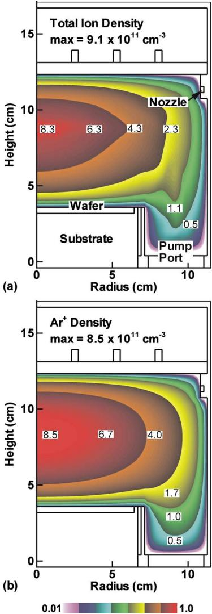  
FIG. 2. (Color online) Total positive ion densities during the PALE of Si using an ICP reactor. (a) Step 1 (passivation) is performed in  $\mathrm{Ar / Cl}_2 = 80 / 20$  (500 W ICP, 20 mTorr, 100 SCCM) without an applied bias. (b) Step 2 (etching) is performed in pure Ar (500 W ICP, 16 mTorr, 100 SCCM) with a  $100\mathrm{V}$  sinusoidal bias at  $2\mathrm{MHz}$ . Contour levels shown are on a scale of  $10^{11}$ . (Densities are plotted using a log scale over 2 decades. The color bar shows the range of the contours relative to the maximum value.)

The computational strategy is as follows. The HPEM was separately executed to compute quasisteady state fluxes onto the wafer for steps 1 and 2. The MCPFM was then run using fluxes from step 1. At the termination of step 1, the state of the surface was retained while changing the fluxes to those obtained from the HPEM for step 2 to complete 1 PALE cycle. These cycles were then repeated. In the case where different gas mixtures were used for steps 1 and 2, we did not resolve the chamber pump down or gas injection periods.

The total positive ion density for step 1 and the  $\mathrm{Ar^{+}}$  density for step 2 are shown in Fig. 2. The peak ion density is  $9.1\times 10^{11}\mathrm{cm}^{- 3}$  during step 1 and  $8.8\times 10^{11}\mathrm{cm}^{- 3}$  during step 2. Corresponding ion fluxes to the wafer surface are shown in Fig. 3(a).  $\mathrm{Cl^{+}}$  has the largest flux, 3.6  $\times 10^{16}\mathrm{cm}^{- 2}\mathrm{s}^{- 1}$ , during step 1 due to dissociation of the  $\mathrm{Cl}_2$  feedstock and charge exchange from  $\mathrm{Ar^{+}}$ , which has a flux of  $1.3\times 10^{16}\mathrm{cm}^{- 2}\mathrm{s}^{- 1}$ . The lack of any competing ionization or

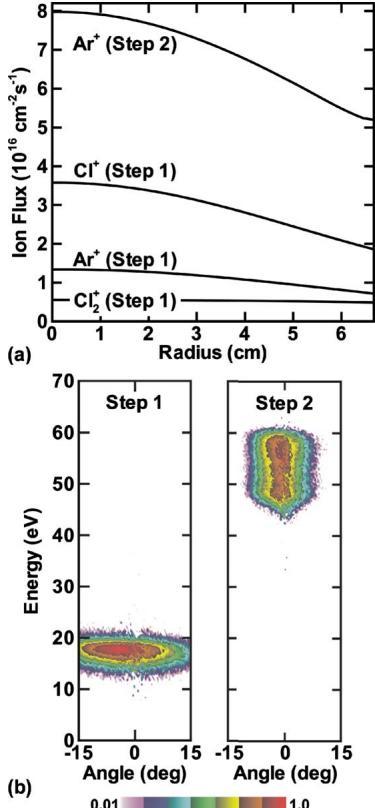  
FIG. 3. (Color online) Ion properties for the PALE cycle. (a) Ion fluxes to the wafer as a function of radius.  $\mathrm{Cl}^+$  is the major ion during step 1 (passivation) due to dissociation of the  $\mathrm{Cl}_2$  feedstock. The  $\mathrm{Ar^{+}}$  flux is higher during step 2 (etching) step due to lack of any competing processes. (b) Total IEDs averaged over the wafer. Low ion energies are necessary to minimize etching during step 1 while higher ion energies in step 2 enable etching of the  $\mathrm{SiCl}_x$  passivation. (IEADs are plotted using a log scale over 2 decades.)

dissociation processes results in a larger  $\mathrm{Ar^{+}}$  flux during step 2 of  $8\times 10^{16}\mathrm{cm}^{- 2}\mathrm{s}^{- 1}$ . The passivating Cl radical flux is two orders of magnitude higher at  $1\times 10^{18}\mathrm{cm}^{- 2}\mathrm{s}^{- 1}$  and is uniform across the wafer. The uniformity of the flux is important to ensure that the surface is uniformly passivated and so have the same removal rate during step 2.

The cycle- averaged IEDs (the sum of all ions) are shown in Fig. 3(b) for 1 PALE cycle. During passivation, step 1, ion energies should be low to minimize etching and enable passivation of the top Si layer as  $\mathrm{SiCl}_x$ . The absence of an applied bias produces ion fluxes with maximum energies near the plasma potential at  $20\mathrm{eV}$ . During etching, step 2, a rf bias of  $100\mathrm{V}$  is applied, providing the moderately high ion energies  $(55\mathrm{eV})$  that are required to activate etching of the  $\mathrm{SiCl}_x$  layer (based on a purely chemical sputter mechanism) while being low enough to minimize purely physical sputtering.

The feature first investigated is a Si- FinFET having a 10:1 AR as shown in Fig. 4. The desired process is to thin the FinFET uniformly in both axial and lateral directions. The computational mesh has a spacing of  $1\mathrm{ML}$  in both directions, so the removal of one mesh cell corresponds to etching a monolayer. Predicted etch properties at the top corner of the feature are shown in Fig. 4. After 1 cycle, approximately  $1\mathrm{ML}$  of Si is removed in both the axial and lateral direc tions. The top surface is, however, rough due in part to a small amount of etching that takes place during the passivation step by the low energy, but still moderately anisotropic, ion flux. In extending the PALE process to 3 cycles, one layer per cycle was removed in the lateral direction. In the axial direction, however,  $4\mathrm{ML}$  were removed, the cumulative effect of there being fractionally more than  $1\mathrm{ML}$  removed per cycle. The extra etching primarily occurs during the passivation step, emphasizing the need to control the length of exposure (process cycle time) and the ion energies.

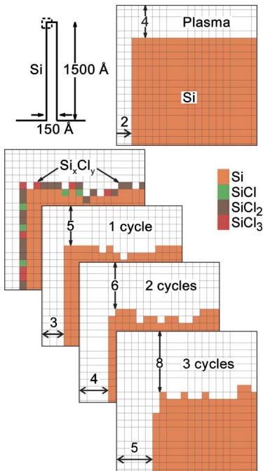  
FiG. 4. (Color online) Etch profiles using PALE at the top corner of a 10:1 aspect ratio Si-FinFET using  $\mathrm{Ar / Cl}_2$  step 1 followed by Ar (step 2). The mesh resolution is  $3\mathrm{\AA}$ . After 1 cycle, approximately  $1\mathrm{ML}$  is removed from both axial and lateral directions. After 3 cycles,  $3\mathrm{ML}$  were removed in the lateral direction but  $4\mathrm{ML}$  were removed in the axial direction.

Note that in our model, we do not allow passivation of greater than a monolayer. In reality there is likely some mixing of the top layers and diffusion of Cl into the mixed zone that allows for more than a single monolayer to be passivated and subsequently removed. As such, the layer- by- layer removal discussed here is a best case scenario. At the same time, the roughness we predict is probably a worst case scenario in that some mixing of the topmost layers would remove sharp transitions.

For example, the evolution of roughness in the Si- FinFET feature at the bottom corner is shown in Fig. 5 for 3 cycles of PALE. The original height of the bottom surface is indicated by the arrow. A layer is inadvertently etched at the location labeled A during the passivation step, creating a locally rough surface. Each subsequent cycle removes an additional monolayer which preserves the initial roughness, propagating this defect through additional PALE cycles. The ion- activated etching during step 1 tends to be sparse and random compared to the etch in step 2. This is due to the activation of etching during step 1 resulting from ions which are in the tail of the IEAD which is sparsely populated

  
FIG. 5. (Color online) Etch profiles using PALE at the bottom corner of a 10:1 aspect ratio Si-FinFET using  $\mathrm{Ar / Cl}_2$  (step 1) followed by Ar (step 2). The mesh resolution is  $3\mathrm{\AA}$ . The original height of the bottom surface is indicated by the arrow. Nonuniformities during a given cycle propagate to subsequent cycles.

whereas etching during step 2 results from ions in the more populated bulk part of the IEAD. For example, there is no etching during the second passivation cycle but there is etching, adding to the surface roughness, which takes place during the third passivation cycle (location B in frame 5). In addition to the ion- activated process, etching during step 1 may be thermally activated. Too long of an exposure during step 1 that over- chlorinates the surface could contribute to etching by either thermal means or by reducing the activation energy for the ion- activated process. Therefore, controlling the ion energies and the cycle time during step 1 (depending on the etch mechanism) is important to achieving atomic layer resolution with minimal roughness.

The consequences of varying ion energies during step 1 on the surface roughness are shown in Fig. 6 for the upper left edge of the Si- FinFET. The IEADs for this parameterization are those for step 1 in Fig. 3(b) while adding (or subtracting) a fixed energy. The cited energy is the average, which is approximately that of the peak value of the IEAD [17 eV for Fig. 3(b)]. The surface roughness increases with increasing ion energies. The probability for an ion of energy  $\epsilon$  activating an etch scales as  $(\epsilon - \epsilon_0)^{1 / 2}$ , where  $\epsilon_0$  is a threshold energy. In this work,  $\epsilon_0 = 16.0 \mathrm{eV}$ . For average energies less than this threshold energy the surface roughness results from ions in the tail of the IEAD or thermal etching. As ion energies increase beyond the threshold energy, additional ion- enhanced etching occurs during step 1. Since passivation occurs rapidly, an etched site can be repassivated and etched a second time, thereby producing roughness with an average greater than 1 ML. These effects are enhanced at a corner which, on the average, sees higher fluxes than flat surfaces due to the larger view angle.

  
FIG. 6. (Color online) Surface roughness as a function of ion energy during step 1 of PALE. (a) Final etch profiles of the top corner of the Si-FinFET for passivation steps carried out with ion energies of 15, 25, and  $40 \mathrm{eV}$ . The arrows indicate the original height of the feature. (b) Surface roughness (in monolayers) increases with ion energies during step 1.

The consequences on roughness of exposure time,  $\tau$ , for passivation during step 1 are shown in Fig. 7. The upper left corner of the Si- FinFET after 1 cycle is shown in Fig. 7(a) for different  $\tau$ . A value of  $\tau = 1$  corresponds to an exposure time of approximately one second with the IEAD shown in Fig. 3(b). The surface roughness increases with  $\tau$  primarily due to stochastic etching, repassivation and subsequent etch

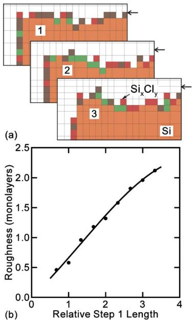  
FIG. 7. (Color online) Surface roughness as a function of exposure time,  $\tau$ , for passivation during step 1 for Si PALE. A value of  $\tau = 1$  corresponds to exposure time of approximately 1 s with the IEADs shown in Fig. 3. (a) Upper left corner of Si-FinFET after 1 cycle. (b) Surface roughness (in monolayers) increases with  $\tau$  due to increased stochastic etching.

  
FIG. 8. (Color online) Etch profiles for a 5:1 aspect ratio Si-over-  $\mathrm{SiO}_2$  feature using an etching recipe which combines a conventional main etch followed by PALE for a soft landing. The main etch terminates with the taper shown in frame 2. The remaining feature is etched in 25 cycles of PALE with sufficient selectivity that damage to the underlying  $\mathrm{SiO}_2$  is limited to the first monolayer. (The number of PALE cycles is the number at the top of the trench.)

ing of isolated sites. With an average ion energy of  $17\mathrm{eV}$  the ions arriving with energies above the etching threshold are sparse, and so etching during passivation is somewhat random. Should that stochastic etch occur early during the passivation step, or  $\tau$  is larger than the average passivation time, the likelihood that the site will be repassivated (and perhaps etched again) increases. Keeping the average ion energy significantly below threshold reduces the stochastic etching during passivation.

The selectivity that PALE potentially provides may be useful in enabling a soft landing during the over- etch portion of a conventional etch recipe. (Soft landing is a process that slowly approaches the underlying interface with high selectivity.) Such a process might begin with a rapid but not particularly selective main etch. Upon approaching the interface, PALE would then be used to achieve a soft landing. For example, etch profiles for a 5:1 aspect ratio Si- over-  $\mathrm{SiO}_2$  feature are shown in Fig. 8. The main etch was performed in the ICP plasma sustained in a 20 mTorr  $\mathrm{Ar / Cl}_2 = 80 / 20$  mixture (100 SCCM, 500 W ICP) with a sinusoidal substrate bias of  $100\mathrm{V}$

The profile at the end of the main etch is in frame 2. The main etch is tapered, thereby requiring that it be stopped many monolayers before the  $\mathrm{Si} - \mathrm{SiO}_2$  interface is reached to ensure that small wafer- to- wafer variations in main etch rate (or time) do not result in breaching the interface. Following the main etch, 25 cycles of PALE are used to clear the trench to the bottom to achieve the soft landing. The large number of cycles is necessitated by the initial severe taper. The interface is reached in the center of the trench after 14 cycles of PALE (frame 7). The potentially high selectivity provided by PALE enables the remainder of the feature to be cleared using an additional 11 cycles with there being minimal penetration into the underlying  $\mathrm{SiO}_2$  (limited to the first monolayer) in the already cleared center of the trench. There will be a tradeoff between stopping the main etch significantly above the interface to minimize likelihood of breaching the interface and the larger number of PALE cycles required to clear the feature that lengthens the total time of the process.

# IV.PALE OF  $\mathrm{SiO}_2$  IN Ar/c-C  $\mathbf{4F}_8$  MAGNETICALLY ENHANCED CAPACITIVELY COUPLED PLASMAS

Successful implementation of PALE requires the ability to predictably and rapidly vary Ieads to, for example, shift ion energies from dominantly above to dominantly below etching thresholds. Magnetically enhanced reactive ion etching (MERIE) reactors may provide this capability. In MERIE reactors, magnetic fields parallel to the wafer may cause a reversal of the electric field in the sheath, which in turn produce a shift in ion fluxes to lower energies, although with a spread in their angular distribution.35 This modulation in the Ieads can be accomplished as rapidly as one is able to change the current through the solenoids producing the magnetic fields.

PALE of  $\mathrm{SiO}_2$  was investigated using the MERIE reactor schematically shown in Fig. 9. The substrate is powered at  $10\mathrm{MHz}$  through a blocking capacitor. The wafer,  $20~\mathrm{cm}$  in diameter, sits in electrical contact with the powered substrate and is surrounded by dielectric focus rings. All other surfaces in the reactor are grounded metal including the showerhead, which extends to a radius of  $12~\mathrm{cm}$  and the annular pump port.

During step 1 of the PALE process, a 40 mTorr  $\mathrm{Ar} / c\mathrm{- C}_4\mathrm{F}_8 = 75 / 25$  gas mixture with a flow rate of 300 SCCM was used. A bias power of  $500~\mathrm{W}$  at  $10\mathrm{MHz}$  was produced with a sinusoidal voltage amplitude of approximately  $200\mathrm{V}$  (The  $\mathrm{Ar} / c\mathrm{- C}_4\mathrm{F}_8$  reaction mechanism is discussed in Ref. 36. ) The goal is to rapidly deposit a single layer of fluorocarbon passivation which is sufficient to remove a ML of  $\mathrm{SiO}_2$ . Since low energy ion bombardment enhances the rate of polymer formation, a magnetic field of  $250\mathrm{G}$  parallel to the electrode was used to lower ion energies to being dominantly below the threshold for etching.35 During step 2, the plasma was sustained in Ar at  $40~\mathrm{mTorr}$

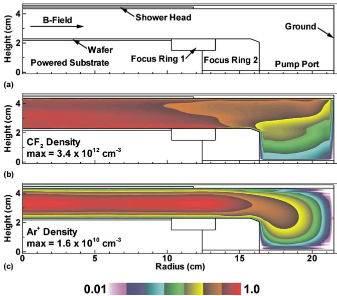  
FIG. 9. (Color online) Plasma properties during  $\mathrm{SiO}_2$  PALE using a MERIE CCP reactor. (a) Schematic of the reactor. The magnetic field, when applied, is parallel to the electrode. (b)  $\mathrm{CF}_2$  density. Step 1 is performed in a  $\mathrm{Ar / C_4F_8 = 75 / 25}$  gas mixture (500 W, 50 mTorr, 100 SCCM, 250 G). The high magnetic field shifts the ions to lower energies. (c)  $\mathrm{Ar^{+}}$  density during step 2 performed in pure Ar (100 W, 40 mTorr, 300 SCCM). A magnetic field is not used. (Plots are on a log scale over 2 decades.)

and 300 SCCM with a power of  $100\mathrm{W}$  (obtained with approximately a  $130\mathrm{V}$  sinusoidal amplitude bias). Since the etch is facilitated by high energy ion bombardment, a magnetic field was not used. The absence of fluorocarbon gas during step 2 would require physical sputtering for significant etching.

The  $\mathrm{CF}_2$  radical density during step 1 and the  $\mathrm{Ar^{+}}$  density during step 2 are shown in Fig. 9. The peak  $\mathrm{CF}_2$  density during step 1 is  $3.4\times 10^{12}\mathrm{cm}^{- 3}$  and the peak ion density during step 2 is  $1.6\times 10^{10}\mathrm{cm}^{- 3}$ . Radical (step 1) and ion fluxes (steps 1 and 2) to the wafer are shown in Fig. 10. The  $\mathrm{CF}_2$  radical density is nearly uniform across the wafer which is critical to achieving a uniform polymer coverage. The ion flux is radially uniform to better than  $10\%$  over the inner two- thirds of the wafer (except for  $\mathrm{Ar^{+}}$ ) with there being a maximum near the edge of the wafer. This is a profile that is characteristic of narrow gap CCPs. The large electron density  $(\approx 10^{11}\mathrm{cm}^{- 3})$  highly dissociates the  $c - \mathrm{C_4F_8}$  feedstock. As a result, the major radical fluxes are  $\mathrm{CF}_3$ ,  $\mathrm{C}_3\mathrm{F}_5$ , and  $\mathrm{F}$ ; and the major ion fluxes consist of  $\mathrm{Ar^{+}}$ ,  $\mathrm{C_2F_4^+}$ , and  $\mathrm{CF}_x^+$ $(x = 1 - 3)$ . The  $\mathrm{Ar^{+}}$  flux  $(2.3\times 10^{16}\mathrm{cm}^{- 2}\mathrm{s}^{- 1})$  during step 2 is nearly uniform across the wafer although the etch rate may not be uniform owing to there being nonuniform passivation layers.

Time- averaged Ieads for all ions are shown in Fig. 11 for step 1  $\mathrm{(Ar / c - C_4F_8}$  for passivation) and step 2 (Ar for etching). Low ion energies are important for rapidly depositing the passivating polymer layer during Step 1 which is the precursor to etching of  $\mathrm{SiO}_2$  during step 2. With the parallel magnetic field, the reduction in the cross- field mobilities of electrons thickens the sheath, increases the voltage drop across the bulk plasma and, in some cases, causes a reversal of the electric field in the sheath. The result is that the voltage drop across the sheath is lower and, in some cases, decelerates ions, both of which produce an IEAD which is lower in energy and broader in angle. Although there is a high energy component in the tail of the IEAD during step 1, the average ion energy is only  $24\mathrm{eV}$  with the ions above  $45\mathrm{eV}$  constituting  $< 10\%$  of the total flux. The

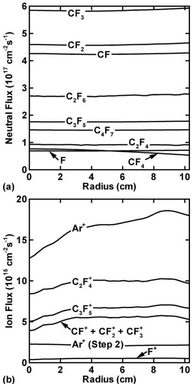  
FIG. 10. Fluxes to the wafer as a function of radius for the  $\mathrm{Ar / c - C_4F_8}$  CCP. (a) Neutral and (b) ion fluxes.  $\mathrm{CF}_3$ ,  $\mathrm{C}_3\mathrm{F}_5$ , and  $\mathrm{F}$  are the dominant radicals.  $\mathrm{Ar^{+}}$ ,  $\mathrm{C}_2\mathrm{F}_4^+$ , and  $\mathrm{CF}_x^+$ $(x = 1 - 3)$  are the dominant ions.

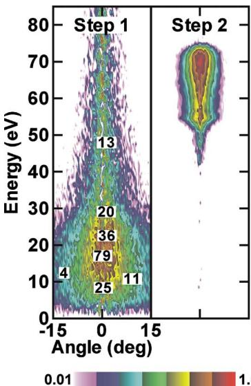  
FIG. 11. (Color online) Total Ieads averaged over the wafer during  $\mathrm{SiO}_2$  PALE in the MERIE reactor. The high magnetic field during step 1 enables low ion energies which promote polymer formation. The high ion energies during step 2 enable sputtering of the passivated layer. Controlling the ion energies during step 2 avoids physical etching and enables self-limiting etching.

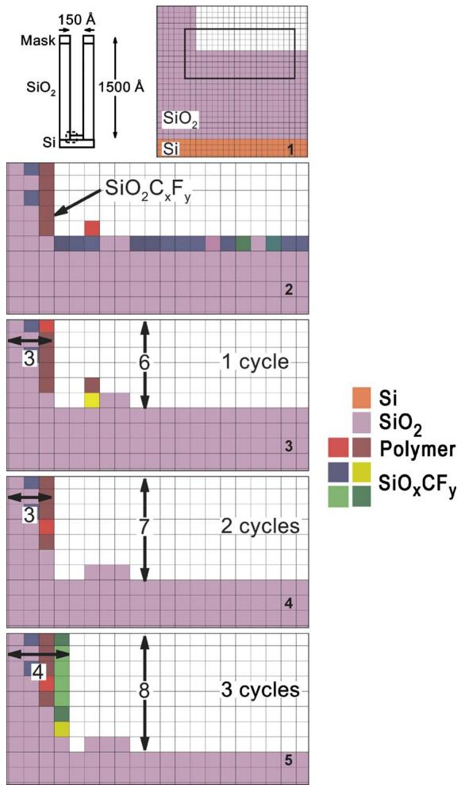  
FiG. 12. (Color online) Predicted etch profiles for a 10:1 aspect ratio  $\mathrm{SiO}_2$  -over-Si trench using  $\mathrm{Ar / c - C_4F_8}$  followed by Ar PALE for the first 3 cycles. There are initially  $20~\mathrm{ML}$  of  $\mathrm{SiO}_2$  on top of Si. The feature after the first passivation step is shown in frame 2 and following the first 3 cycles in frames 3-5. During each cycle,  $1\mathrm{ML}$  of  $\mathrm{SiO}_2$  is removed.

broad angular distribution will produce additional sidewall impacts which further contribute to polymer formation. The IEAD for Step 2 is fairly narrow with an average energy of  $71\mathrm{eV}$  which is marginally higher than the etch threshold energy  $(69\mathrm{eV})$  for the polymer and  $\mathrm{SiO}_2\mathrm{C}_x\mathrm{F}_y$  complexes at the interface of the  $\mathrm{SiO}_2$  . Maintaining the average energies near threshold reduces the likelihood of physical sputtering by ions in the higher energy tail of the IEAD.

The feature investigated is the 10:1 aspect ratio  $\mathrm{SiO}_2$  - over- Si trench shown in Fig. 12. Demonstrations of PALE are shown at the bottom of the trench in Figs. 12 and 13 where selectivity and critical dimension (CD) requirements are most stringent.

The etch begins with  $20~\mathrm{ML}$  of  $\mathrm{SiO}_2$  on top of the Si. The desired process is to remove the  $\mathrm{SiO}_2$  without damaging the underlying Si while maintaining an anisotropic profile. The feature after the first passivation step is shown in frame 2 of Fig. 12, and following the first three etch steps in frames 3- 5. A single monolayer is removed during each step in the vertical direction with some small amount of nonuniformity. Although most sites are passivated with a single layer of polymer, statistically some sites are not passivated and others have multiple layers of passivation. During the following etch step,  $\mathrm{SiO}_2$  is not removed at either of these sites. For sites without polymer, the threshold energy of the bare  $\mathrm{SiO}_2$  is greater than the energy of the majority of the ions and poly etching does not occur. For sites with multiple layers of polymer, the etch step is not long enough to both sputter the overlying polymer and etch the passivated site. Subsequent PALE cycles that remove additional layers tend to preserve previous roughness. Preventing rough surfaces requires having a uniform coverage of the passivating polymer. The flu- . ence of polymerizing radicals and low energy ions over the exposure time must be large enough to passivate all the sites but not so large that multiple passivating layers are deposited.

  
FiG. 13. (Color online) Predicted etch profiles for a 10:1 aspect ratio  $\mathrm{SiO}_2$  -over-Si trench using  $\mathrm{Ar / c - C_4F_8}$  followed by Ar PALE. The bottom of feature is cleared in 20 cycles of PALE. Thick polymer layers buildup on the sidewall due to the redeposition of sputtered polymer and etch products from the bottom of the feature. This leads to narrowing of the feature.

The clearing of the bottom of the feature during 20 cycles of PALE is shown in Fig. 13. During each cycle, the bottom  $\mathrm{SiO}_2$  surface advances roughly a monolayer. There is, however, etching of and deposition on the sidewalls. This results from the low energy and broad angular distribution of ions during step 1 that efficiently produces polymer on the sidewall, and redeposition of sputtered polymer and etch products from the bottom of the trench. The buildup of sidewall polymer which is not fully removed during the etch step produces some narrowing of the feature. The thickening of the passivation layers on the sidewalls might require using a cleaning step following the etch step (e.g., an oxygen plasma), thereby making PALE a three- step process.

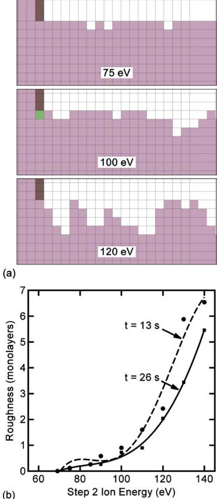  
FIG. 14. (Color online) Surface roughness as a function of ion energies during step 2 of  $\mathrm{SiO}_2$  PALE. (a) Final profiles for etching steps carried out with ion energies of 75, 100, and  $120\mathrm{eV}$ . (b) Surface roughness (in monolayers) increases with ion energies while decreasing cycle time. As the ion energies increase, the etch mechanism transitions from being chemically dominated to being physically dominated. The larger roughness at lower cycle time results from there being incomplete passivation during step 1.

Controlling the IEAD is critical to achieving monolayer resolution while minimizing roughness. For example, the consequences of increasing ion energies on surface roughness during the etching step are shown in Fig. 14. The bottom surfaces of the  $\mathrm{SiO}_2$ - over- Si trench and monolayers of roughness are shown for different ion energies. The IEADs are those for step 2 shown in Fig. 11 while adding (or subtracting) a fixed energy. The cited energy is the average, which is approximately that of the peak (71 eV for Fig. 11). Increasing ion energies have the advantage of facilitating an etch even if the passivation layer is thicker than a single monolayer. It also facilitates sputtering of passivation off the sidewalls. Unfortunately, there is also the disadvantage of increasing the surface roughness.

Surface roughness as a function of ion energy is shown in Fig. 14 for step 2 times of  $13\mathrm{~s}$  (1 s for step 1) and  $26\mathrm{~s}$  (2 s for step 1). The general trend is that surface roughness increases with increasing ion energy and decreasing cycle time. The larger roughness at the lower cycle time results from there being incomplete passivation. Passivated sites are chemically etched with lower ion energies whereas adjacent sites are not etched or require higher ion energies to etch. The more complete passivation afforded by the longer step 1 time enables more sites to be chemically etched by lower ion energies. The increasing roughness with increasing ion energy indicates two etching regimes. For ion energies  $< 110\mathrm{eV}$ , the etch mechanism is dominated by chemically enhanced processes benefiting from passivation. The transition to physical etching occurs at higher ion energies, resulting in a steep increase in surface roughness.

In fabricating an integrated circuit, a conducting region may be encapsulated by a layer of insulation (such as  $\mathrm{Si}_3\mathrm{N}_4$ ) and buried under  $\mathrm{SiO}_2$ . Etching a via past the encapsulated structure is called self- aligned if the encapsulation is resistant to the process that is used to etch the overlying  $\mathrm{SiO}_2$ . For example, self- aligned processing enables etching through an  $\mathrm{SiO}_2$  overlayer which simultaneously opens separate contacts landing on the source, drain and gate. While these processes improve packing density and relax lithography requirements, they impose severe selectivity requirements as multiple materials are landed on in one process. Several different stop layers have been suggested, for example, polysilicon, silicon- rich nitrides, and oxynitrides.

Since an important requirement for etching self- aligned contacts (SACs) is high selectivity of the overlying  $\mathrm{SiO}_2$  with respect to the stop layer, PALE may be appropriate for this process. For example, the  $\mathrm{Ar / d - C_4F_8}$  PALE process was used to etch a SAC as shown in Fig. 15. As an approximation to an actual SAC, a protrusion of Si representing the stop layer is at the bottom of a trench being etched in  $\mathrm{SiO}_2$ . The feature has a 10:1 aspect ratio and PALE begins with 20 layers of Si at the same height as the remaining layers of  $\mathrm{SiO}_2$ . (Note that only the bottom of the trench is shown in Fig. 15. ) The IEADs for the PALE cycles are those shown in Fig. 11. The high selectivity of PALE enables the exposed Si feature to maintain its CD while the adjacent  $\mathrm{SiO}_2$  is etched away during 20 cycles of PALE. The damage to the top surface of the Si protrusion is  $1 - 2\mathrm{~ML}$  with the corner of the feature being most eroded since its view angle to the plasma is greatest. The sidewall of the protrusion is less prone to damage as redeposition of etch products provides additional passivation that slows etching.

# V. PALE USING NONSINUSOIDAL BIAS WAVEFORMS

In the previous sections we discussed PALE using conventional plasma etching tools with sinusoidal bias waveforms. Control of the IEADs to finely discriminate etching thresholds is difficult with the broad IEADs produced with sinusoidal biases. As a consequence, high selectivity during PALE is usually enabled by using different gas mixtures for steps 1 and 2. This strategy enables the passivation process to be chemically independent of the etching process. The tradeoff is increasing the total elapsed processing time of PALE cycles by having to purge and refill gas mixtures between steps. If the gas purge and refill can be eliminated by using the same gas mixture for both passivation and etching, the overall speed of PALE can be increased. However this goal can only be met by having precise control over the

  
FiG. 15. (Color online) Etch profiles for  $\mathrm{Ar / c - C_4F_8}$  and Ar PALE etching of a  $\mathrm{SiO}_2$  -over-Si self-aligned contact. The etch begins with  $20~\mathrm{ML}$  of Si aligned with  $20~\mathrm{ML}$  of  $\mathrm{SiO}_2$  A highly selective etch of the contact is achieved in 20 cycles of PALE using the IEADs shown in Fig. 11. The sidewall of the Si is less prone to damage due to passivation by redeposited etch products.

IEADs to discriminate between etch thresholds. This goal can be potentially achieved by using nonsinusoidal waveforms in which narrow IEADs are produced.

To investigate PALE using a single gas mixture, a nonsinusoidal, bias waveform was used consisting of a constant negative bias with a narrow positive voltage spike applied at rf frequencies.25 The purpose of the constant negative bias is to accelerate positive ions into the wafer with nearly a constant energy equal to the sheath potential. The purpose of the positive voltage spike is to allow electrons to reach the substrate and so balance the positive ion current. As long as the positive voltage excursion is of short enough duration, the sheath potential, as seen by the heavy ions, is largely undisturbed from its quasi- dc value. The resulting IEAD is narrow in energy.23

PALE of  $\mathrm{SiO}_2$  using a single gas mixture and a nonsinusoidal waveform was investigated for an  $\mathrm{Ar / c - C_4F_8} = 75 / 25$  (100 SCCM), 15 mTorr plasma in the ICP reactor. The inductive power is  $500~\mathrm{W}$  at  $5\mathrm{MHz}$  and the bias is applied at  $2\mathrm{MHz}$ . The fraction of the rf cycle occupied by the positive voltage spike is  $10\%$ . During step 1, a  $\mathrm{C}_x\mathrm{F}_y$  polymer is de posited on top of the  $\mathrm{SiO}_2$  using a bias producing low ion energies. During step 2, etching of the  $\mathrm{SiO}_2\mathrm{C}_x\mathrm{F}_y$  polymer complex is performed with a bias producing above threshold ion energies. The entire recipe consists of first using a conventional process for etching the majority of the feature using a sinusoidal bias waveform. This is followed by PALE cycles to clear the bottom of the trench using nonsinusoidal waveforms.

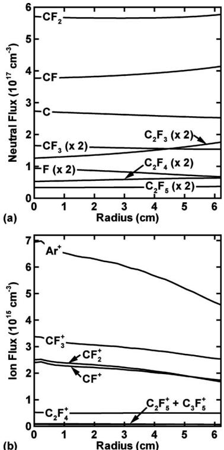  
FiG. 16. Fluxes to the wafer as a function of radius for the nonsinusoidal bias PALE process. (a) Neutral and (b) ion fluxes.  $\mathrm{CF}_2$  CF,and  $\mathrm{CF}_3$  are the dominant fluorine containing neutral radicals.  $\mathrm{Ar^{+}}$ $\mathrm{CF}_3^+$ $\mathrm{CF}_2^+$  and  $\mathrm{CF^{+}}$  are the dominant ion fluxes.

Radical and ion fluxes to the wafer are shown in Fig. 16. The major radical fluxes are CF,  $\mathrm{C}_2\mathrm{F}_3$  and F; and the major ion fluxes consist of  $\mathrm{Ar^{+}}$ $\mathrm{CF}_3^+$  and  $\mathrm{CF^{+}}$ . Lower F atom and ion fluxes near the edge of the wafer during step 1 may result in thicker passivation layers and hence lower etch rates during step 2. These same lower ion fluxes initiate less polymer deposition during step 1. The net result of these two opposing effects is that the etch rates near the edge of the wafer are only slightly lower than at the center.

Time- averaged IEADs for all ions are shown in Fig. 17 for the main etch and the PALE steps. The main etch utilizes a  $200~\mathrm{V}$  (peak- to- peak) sinusoidal bias waveform which produces the familiar broad IEAD with high- and- low energy peaks. The peaks result from ions of different masses entering the sheath at random times during the rf cycle. The lighter ions arrive at the substrate with nearly the instantaneous sheath potential while the heavier ions arrive with an energy corresponding to the average sheath potential. The end result is a fairly broad IEAD, in this case extending from 66 to  $176\mathrm{eV}$ , or nearly  $110\mathrm{eV}$ . The PALE steps are performed using nonsinusoidal biases,  $50~\mathrm{V}$  (peak to peak) for

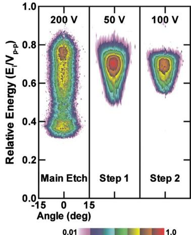  
FIG. 17. (Color online) Total IEADs averaged over the wafer for PALE with nonsinusoidal biases. First, a main etch is performed with a  $200\mathrm{V}$  (peak-to-peak) sinusoidal bias followed by PALE utilizing a nonsinusoidal bias waveform with biases of  $50\mathrm{V}$  (peak-to-peak) for step 1 (passivation) and  $100\mathrm{V}$  (peak-to-peak) for step 2 (etching). The narrow IEADs with nonsinusoidal biases enable using a single gas mixture for the entire cycle of PALE.

step 1 and  $100\mathrm{V}$  (peak to peak) for step 2. The average ion energies are 35 and  $75\mathrm{eV}$ , respectively. The nonsinusoidal biases generally produce narrower IEADs than the sinusoidal case in large part because the sheath voltage remains nearly constant between the positive going spikes of the bias. The transit time across the sheath for even the heavier ions is longer than the positive spike, and so the IEADs remain fairly narrow in energy.

The feature is a 10:1 aspect ratio  $\mathrm{SiO}_2$ - over- Si trench. Profiles during the main etch are shown in Fig. 18. Ions striking the walls at grazing angles and their subsequent specular reflection results in microtrenching at the sides of the trench. As a consequence of this microtrenching, when the main etch approaches the  $\mathrm{SiO}_2$ - Si interface, the underlying Si is first exposed at the sides of the trench. To clear the bottom of the trench, high selectivity is required so as to not damage the Si at the sides of the trench while removing the remaining  $\mathrm{SiO}_2$  in the center of the trench.

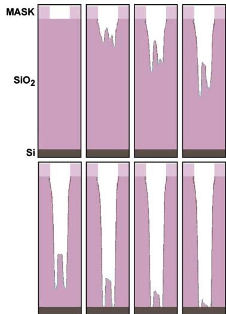  
FIG. 18. (Color online) Etch profiles for a 10:1 aspect ratio  $\mathrm{SiO}_2$ -over-Si trench during the main etch process. Microtrenching causes the Si at the sides of the trench to be exposed first.

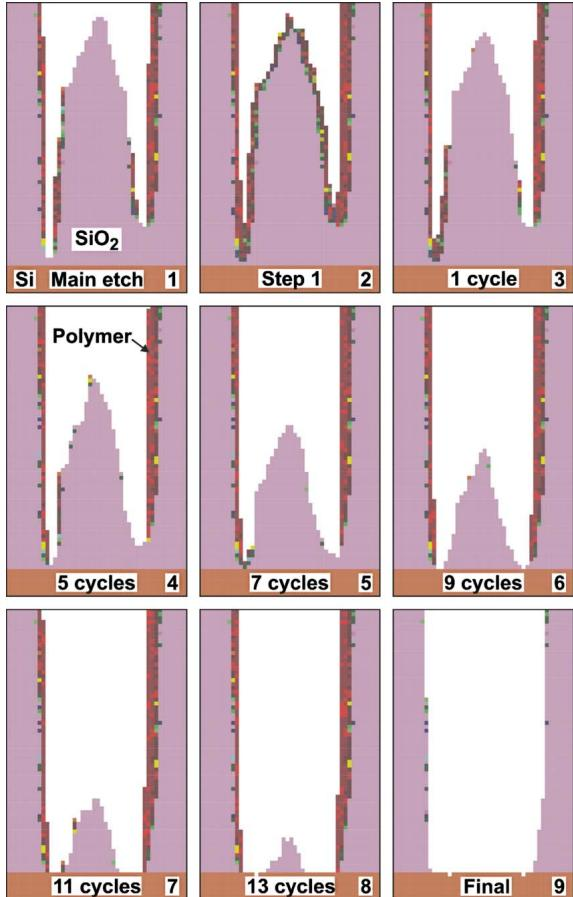  
FIG. 19. (Color online) Predicted etch profile for the over-etch of the  $\mathrm{SiO}_2$ -Si trench using an  $\mathrm{Ar} / \tau \mathrm{c}_{41}\mathrm{F}_{8}$  nonsinusoidal PALE. The feature is cleared in 15 PALE cycles yielding an effective etch rate of  $4 - 5\mathrm{ML}$  cycle. The polymerizing radicals and low energy ions not only contribute to increased etching rates but also limit the damage to underlying Si. Note that the underlying Si is first exposed after 9 cycles of PALE.

The clearing of the feature with PALE using nonsinusoidal waveforms is shown in Fig. 19. The main etch was stopped well before the  $\mathrm{SiO}_2$ - Si interface was reached to eliminate the possibility of run- to- run variation in etch rate producing damage of the underlying Si. This leaves many monolayers to be etched using PALE. The feature was cleared using 15 cycles of PALE. (The profile at the end of the main etch is in frame 1. ) A true PALE process should, in principle, have an etch rate of  $1\mathrm{ML}$  cycle. However we found that with this PALE process, an effective etch rate of  $4 - 5\mathrm{ML}$  cycle was obtained. The high etch rates resulted from there being fluxes of polymerizing radicals during the etch step which repassivated the exposed  $\mathrm{SiO}_2$ , thereby compromising the self- limiting nature of the process. This also contributed to there being thicker passivation in the microtrenches, thereby preventing early exposure of the underlying Si. The interface is reached at the side of the trench exposing the underlying Si after 9 cycles of PALE (frame 6). The polymerizing radicals during step 2, however, limit etching of the underlying Si allowing PALE to clear the feature.

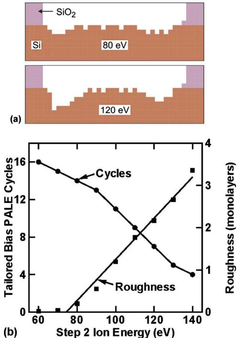  
FiG. 20. (Color online) Surface roughness and number of PALE cycles to clear the feature as a function of ion energies during step 2 of PALE. (a) Final etch profiles for step 2 ion energies of 80 and  $120\mathrm{eV}$ . (b) Surface roughness increases with increasing ion energies.

The damage to the underlying Si is less than a monolayer. Although true PALE was not achieved, a highly selective etch was.

Unlike conventional PALE using different gas mixtures, tailored bias PALE using a single gas mixture produces  $>1$  ML/cycle while retaining high selectivity. The speed of the process is ultimately a tradeoff between achieving monolayer control and the onset of roughness. The number of tailored bias PALE cycles required to perform the over- etch and the resulting roughness in the underlying Si are shown in Fig. 20 as a function of ion energy during step 2. The IEDs for step 2 are the same as shown in Fig. 16 while adding (or subtracting) a fixed energy. The cited energy is the average, which is approximately that of the peak  $70\mathrm{eV}$  for Fig. 16). Higher ion energies enable higher etch rates which decrease the number of cycles required for the same over- etch. However, the roughness increases with increasing ion energy from marginal at ion energies below  $75\mathrm{eV}$  to  $3\mathrm{ML}$  at ion energies above  $140\mathrm{eV}$ . Over this range of energies, the PALE cycles required decreases from 16 to 4.

# VI. CONCLUDING REMARKS

The potential of using conventional plasma etching tools for PALE was discussed based on results from a computational investigation using a reactor scale model coupled to a feature- scale model. PALE of Si (using  $\mathrm{Ar / Cl}_2$  plasmas) in an ICP reactor and PALE of  $\mathrm{SiO}_2$  (using  $\mathrm{Ar / C_4F_8}$  plasmas) in a MERIE CCP reactor were investigated. In both cases, atomic level (one monolayer) control was achieved using different gas mixtures for steps 1 (passivation) and 2 (etching). PALE using a single gas mixture was investigated by exploiting the precise control of ion energies made possible with nonsinusoidal bias waveforms. These narrow IEDs discriminate between threshold energies of different materials while using a single gas mixture. PALE of  $\mathrm{SiO}_2$  in an  $\mathrm{Ar / c - C_4F_8}$  plasma was obtained by changing voltage amplitudes to alternate between the passivation and etching regimes. Although highly selective, the PALE recipe yielded effective etch rates of up to 4- 5 ML/cycle. The self- limiting nature of the process was compromised as a consequence of there being polymerizing radical fluxes during the etching step thereby enabling higher etch rates. The high selectivity at high speeds of PALE using tailored bias waveforms make it a useful complement to conventional etching to obtain soft landings in high aspect ratio etching.

# ACKNOWLEDGMENTS

This work was supported by Semiconductor Research Corporation and Applied Materials Inc.

$^1\mathrm{S}$  Samukawa, Jpn. J. Appl. Phys., Part 1, 45, 2395 (2006).  $^2\mathrm{T}$  Skotnicki, Microelectron. Eng. 84, 1845 (2007).  $^3\mathrm{J}$  P. Colinge, Microelectron. Eng. 84, 2071 (2007).  $^4\mathrm{S}$  E. Thompson, R. S. Chau, T. Ghani, S. Tyagi, and M. T. Bohr, IEEE Trans. Semicond. Manuf. 18, 26 (2005).  $^5\mathrm{M}$  Armacost et al., IBM J. Res. Dev. 43, 39 (1999).  $^6\mathrm{S}$  J. Fonash, IBM J. Res. Dev. 43, 103 (1992).  $^7\mathrm{P}$  D. Agnello, IBM J. Res. Dev. 46, 317 (2002).  $^8\mathrm{S}$  D. Athavale and D. J. Economou, J. Vac. Sci. Technol. A 13, 966 (1995).  $^9\mathrm{T}$  Meguro, M. Hamagaki, S. Modaressi, T. Hara, Y. Aoyagi, M. Ishii, and Y. Yamamoto, Appl. Phys. Lett. 56, 1552 (1990).  $^{10}\mathrm{T}$  Meguro, M. Ishii, K. Kodama, Y. Yamamoto, K. Gamo, and Y. Aoyagi, Thin Solid Films 225, 136 (1993).  $^{11}\mathrm{K}$  K. Ko and S. W. Pang, J. Vac. Sci. Technol. B 11, 2275 (1993).  $^{12}\mathrm{M}$  Ishii, T. Meguro, K. Gamo, T. Sugano, and Y. Aoyagi, Jpn. J. Appl. Phys., Part 1 32, 6178 (1993).  $^{13}\mathrm{W}$  T. Tsang, T. H. Chiu, and R. M. Kapre, Appl. Phys. Lett. 63, 3500 (1993).  $^{14}\mathrm{Y}$  Horiike, T. Tanaka, M. Nakano, S. Iseda, H. Sakaue, A. Nagata, H. Shindo, S. Miyazaki, and M. Hirose, J. Vac. Sci. Technol. A 8, 1844 (1990).  $^{15}\mathrm{T}$  Matsuura, J. Murota, Y. Sawada, and T. Ohmi, Appl. Phys. Lett. 63, 2803 (1993).  $^{16}\mathrm{K}$  Suzue, T. Matsuura, J. Murota, Y. Sawada, and T. Ohmi, Appl. Surf. Sci. 82- 83, 422 (1994).  $^{17}\mathrm{S}$  D. Athavale and D. J. Economou, J. Vac. Sci. Technol. B 14, 3702 (1996).  $^{18}\mathrm{S}$  - D. Park, K.- S. Min, B.- Y. Yoon, D.- H. Lee, and G.- Y. Yeom, Jpn. J. Appl. Phys., Part 1 44, 389 (2005).  $^{19}\mathrm{S}$  - D. Park, D.- H. Lee, and G.- Y. Yeom, Electrochem. Solid- State Lett. 8, C106 (2005).  $^{20}\mathrm{S}$  D. Park, C.- K. Oh, D.- H. Lee, and G.- Y. Yeom, Electrochem. Solid- State Lett. 8, C177 (2005).  $^{21}\mathrm{S}$  M. Rossnagel, J. J. Cuomo, and W. D. Westwood, Handbook of Plasma Processing Technology (Noyes, Park Ridge, New Jersey, 1990).  $^{22}\mathrm{E}$  Collard, C. Lejuene, J. P. Grandchamp, J. P. Gilles, and P. Scheiblin, Thin Solid Films 193- 194, 100 (1990).  $^{23}\mathrm{M}$  M. Patterson, H.- Y. Chu, and A. E. Wendt, Plasma Sources Sci. Technol. 16, 257 (2007).  $^{24}\mathrm{R}$  Silapunt, A. E. Wendt, and K. Kirmse, J. Vac. Sci. Technol. B 25, 1882 (2007).  $^{25}\mathrm{A}$  Agarwal and M. J. Kushner, J. Vac. Sci. Technol. A 23, 1440 (2005).  $^{26}\mathrm{A}$  Sankaran and M. J. Kushner, J. Vac. Sci. Technol. A 22, 1242 (2004).  $^{27}\mathrm{J}$  J. Vegh, D. Humbird, and D. B. Graves, J. Vac. Sci. Technol. A 23, 1598 (2005).  $^{28}\mathrm{R}$  J. Hoekstra, M. J. Grapperhaus, and M. J. Kushner, J. Vac. Sci. Technol. A 15, 1913 (1997).

$^{29}\mathrm{C}$ . C. Cheng, K. V. Guinn, V. M. Donnelly, and I. P. Herman, J. Vac. Sci. Technol. A 12, 2630 (1994).   $^{30}\mathrm{A}$ . J. Bariya, C. W. Frank, and J. P. McVittie, J. Electrochem. Soc. 137, 2575 (1990).   $^{31}\mathrm{T}$ . E. F. M. Standaert, M. Schaepkens, N. R. Rueger, P. G. M. Sebel, G. S. Oehrlein, and J. M. Cook, J. Vac. Sci. Technol. A 16, 239 (1998).   $^{32}\mathrm{P}$ . Subramonium and M. J. Kushner, J. Vac. Sci. Technol. A 20, 325 (2002).   $^{33}\mathrm{O}$ . Kwon and H. H. Sawin, J. Vac. Sci. Technol. A 24, 1914 (2006).   $^{34}\mathrm{J}$ . P. Chang, J. C. Arnold, G. C. H. Zau, H.- S. Shin, and H. H. Sawin, J. Vac. Sci. Technol. A 15, 1854 (1997).

$^{35}\mathrm{M}$ . J. Kushner, J. Appl. Phys. 94, 1436 (2003).   $^{36}\mathrm{A}$ . V. Vasenkov, X. Li, G. S. Oehrlein, and M. J. Kushner, J. Vac. Sci. Technol. A 22, 511 (2004).   $^{37}\mathrm{M}$ . Masahara, T. Matsukawa, H. Tanoue, K. Ishii, Y. Liu, K. Sakamoto, S. Kanemaru, and E. Suzuki, Jpn. J. Appl. Phys., Part 1 42, 4138 (2003).   $^{38}\mathrm{S}$ . B. Kim, D.- G. Choi, T.- E. Hong, T.- S. Park, D.- S. Kim, and Y.- W. Song, J. Vac. Sci. Technol. A 23, 953 (2005).   $^{39}\mathrm{J}$ . H. Kim, J.- S. Yu, C.- K. Ryu, S.- J. Oh, S.- B. Kim, J.- W. Kim, J.- W. Hwang, S.- Y. Lee, and I. Kouichiro, J. Vac. Sci. Technol. A 18, 1401 (2000).   $^{40}\mathrm{K}$ . P. Giapis and G. S. Hwang, Thin Solid Films 374, 175 (2000).