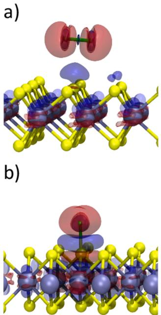
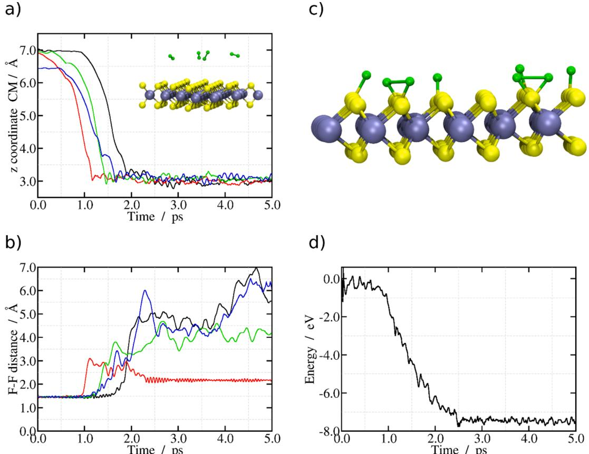
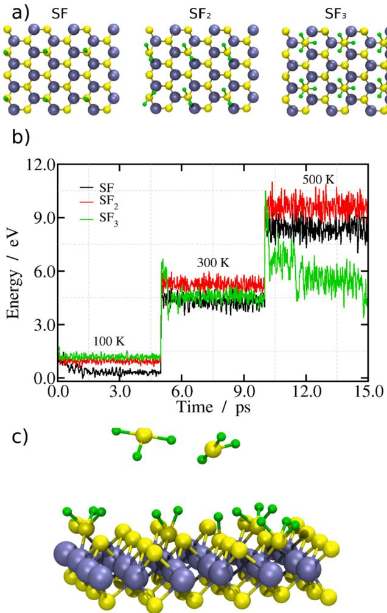
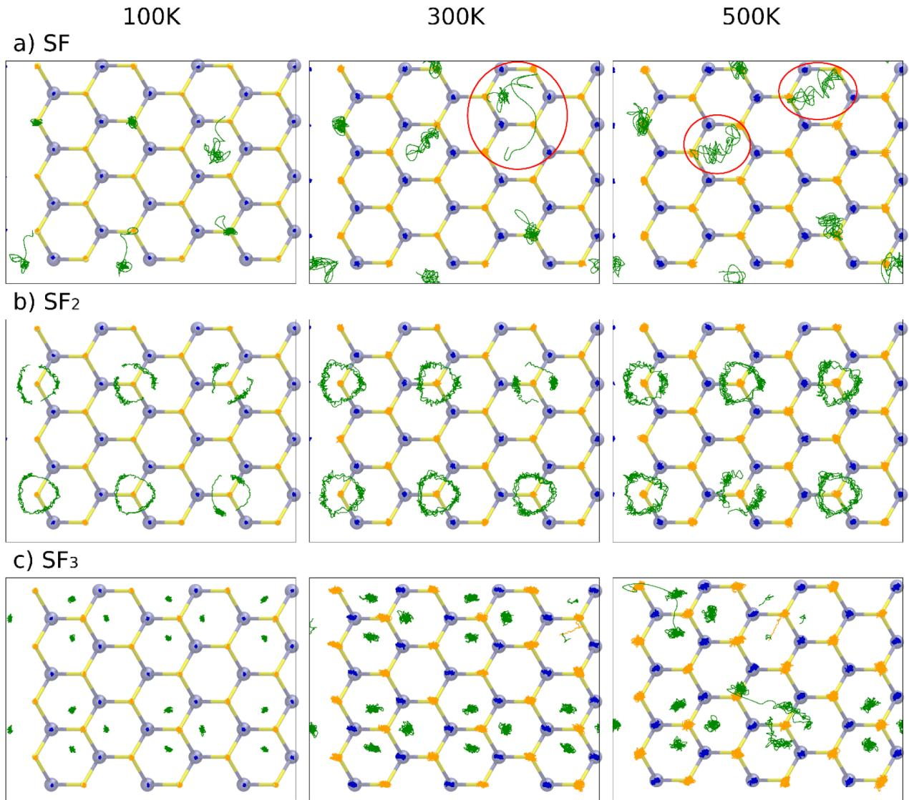
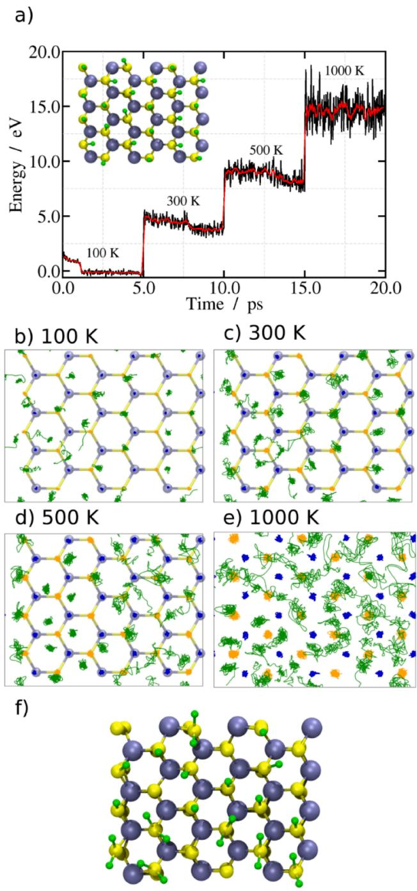
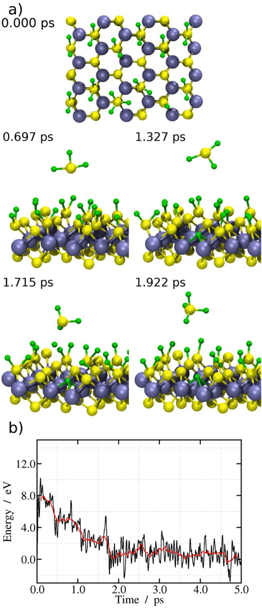
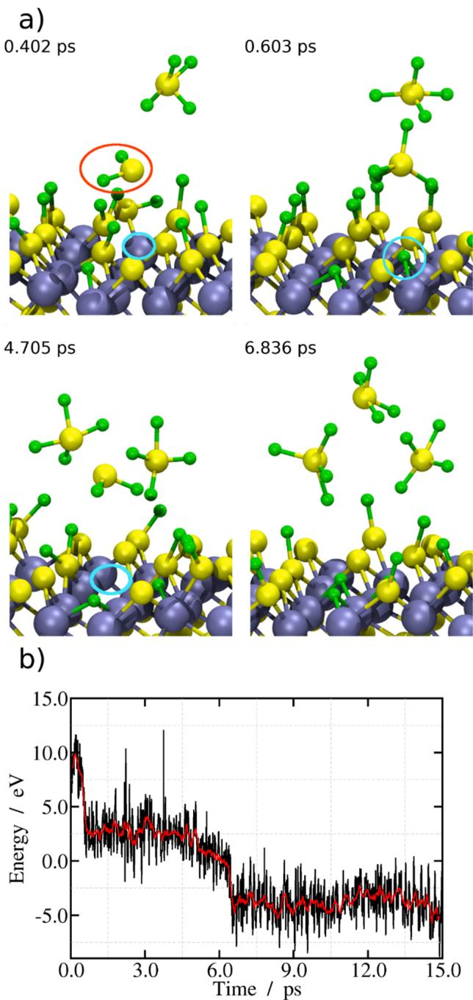
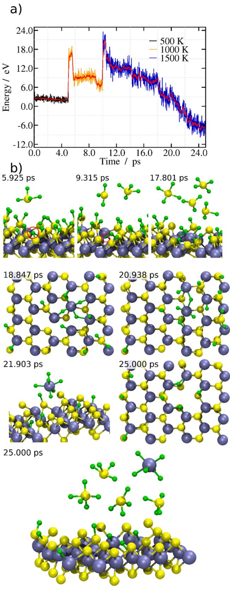
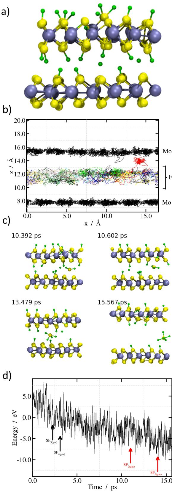

Full Length Article

# Ab-initio molecular dynamics simulations of the reactivity of  $\mathrm{MoS_2}$  towards  $\mathrm{F_2}$  molecules: Implications for etching processes

Lucas M. Farigliano a, Patricia A. Paredes- Olivera b, Eduardo M. Patrito a,

a Departamento de Fisicoquimica, Instituto de Investigaciones en Fisico Quimica de Cordoba (INFIQC), Facultad de Ciencias Quimicas, Universidad Nacional de Cordoba, X5000HUA Cordoba, Argentina b Departamento de Quimica Teorica y Computacional, Instituto de Investigaciones en Fisico Quimica de Cordoba (INFIQC), Facultad de Ciencias Quimicas, Universidad Nacional de Cordoba, X5000HUA Cordoba, Argentina

# ARTICLEINFO

Keywords: 2D materials  $\mathrm{MoS_2}$ $\mathrm{F_2}$  adsorption  $\mathrm{F_2}$ - induced etching Molecular dynamics Density functional theory

# ABSTRACT

We investigated the reactivity of fluorinated monolayer and bilayer  $\mathrm{MoS_2}$  in relation to etching processes. We considered both the energetics and the dynamics of the different processes: a) interaction of fluorine species in the gas phase with  $\mathrm{MoS_2}$ , b) the surface chemistry of  $\mathrm{SF_2}$ , and  $\mathrm{SF_3}$  groups and c) the desorption of fluorine- containing molecules into the gas phase. The dissociative adsorption of  $\mathrm{F_2}$  occurs at very low temperatures (100 K) and the surface becomes populated by  $\mathrm{SF_2}$  (the most stable), and  $\mathrm{SF_3}$  groups. Etching processes begin with the desorption of the  $\mathrm{SF_3}$  group and only at very high temperatures the desorption of  $\mathrm{SF_2}$  was observed. Sulfur vacancies left by the removal of S atoms are rapidly filled by F atoms due to the formation of strong  $\mathrm{Mo}$  F bonds. The formation of a sulfur vacancy induces the subsequent formation of S- vacancies on adjacent surface sites, and this finally promotes the desorption of  $\mathrm{MoF_5}$  or  $\mathrm{MoF_6}$  species, thus leaving a surface pit defect. For a  $\mathrm{MoS_2}$  bilayer with the top layer fluorinated on both sides, the etching of the top layer was observed as a consequence of the release of  $\mathrm{SF_x}$  species within the interlayer region.

# 1. Introduction

The electronic properties of two- dimensional  $\mathrm{MoS_2}$  depend on the number of layers.[1] Multilayered  $\mathrm{MoS_2}$  has an indirect bandgap of  $\sim 1.3\mathrm{eV}$  which increases to  $\sim 1.9\mathrm{eV}$  for single- layer  $\mathrm{MoS_2}$ . The direct bandgap of the monolayer confers  $\mathrm{MoS_2}$  a strong luminescence and high quantum yield with promising applications in different optoelectronic devices.[2,3] Therefore, controlling the number of layers of 2D materials is indispensable for nanodevice applications because of their layer- dependent optical features. Controlling the thickness of  $\mathrm{MoS_2}$  films during growth is a difficult task due to nonuniform domains having different number of layers.[4,5] A different strategy is to remove  $\mathrm{MoS_2}$  layers after synthesis using post- treatment procedures. Etching is one of the key steps in materials processing in the semiconducting industry and several etching techniques have been proposed to control the layer number and patterning of 2D materials.[4- 12] The main etching techniques include plasma etching,[5,7,8,11,13] laser thinning,[4,14], and thermal annealing thinning.[6,15] Thinning of  $\mathrm{MoS_2}$  leads to enhanced photoluminescence which is beneficial for photodetector fabrication. [13,16] Etching of  $\mathrm{MoS_2}$  also induces the activation of the basal plane of $\mathrm{MoS_2}$  to enhance the hydrogen evolution reaction.[17,18].

The fluorinated gases  $(\mathrm{SF_6},[13,19,20]$ $\mathrm{CF_4}$  [21] and  $\mathrm{XeF_2}$  [22]) used in gas- assisted etching are attractive candidates for the spontaneous etching of 2D materials because Mo and S elements form volatile compounds with fluorine at room temperature.  $\mathrm{XeF_2}$  has been used to spontaneously etch  $\mathrm{MoS_2}$  at room temperature with a uniform change of layer number.[22] Multilayer  $\mathrm{WSe_2}$  can also be thinned down to monolayer and bilayer upon exposure to  $\mathrm{XeF_2}$  vapor.[23] On the contrary,  $\mathrm{MoS_2}$  etching was not observed after Cl- radical adsorption, and it required a subsequent  $\mathrm{Ar^+}$  ion- beam desorption step to achieve the complete etching of one monolayer of  $\mathrm{MoS_2}$ .[24] The atomic picture of etching mechanisms is unknown in most cases. For the  $\mathrm{XeF_2}$  etchant, the following overall reaction has been proposed:[22]  $\mathrm{MoS_2 + XeF_2\rightarrow Xe + MoF_4 + SF_6}$ , where the products are gaseous species.

The electronic structure of F adatoms on  $\mathrm{MoS_2}$  has been studied using Density Functional Theory (DFT).[25- 27] At low coverages, the F atom adsorbs on top of the S atom whereas at high coverages the S- F bond is slightly tilted with respect to the surface normal.[25,26] The high electronegativity of fluorine induces a charge transfer of around 0.5 e

  
Fig. 1. Electron density difference plots after a) the adsorption of an  $\mathbb{F}_2$  molecule on top of an S atom and b) the adsorption of an F atom on top of an S atom of  $\mathrm{MoS_2}$ . Red lobules correspond to regions of charge accumulation  $(+0.01$  contour) whereas blue lobules correspond to charge depletion regions  $(-0.01$  contour).

towards the F atoms, which produces  $p$ - type doping of  $\mathrm{MoS_2}$ .[25,26] Substitutional fluorine doping using a gentle  $\mathrm{SF_6}$  plasma treatment has a  $p$ - type doping effect for monolayer  $\mathrm{MoS_2}$ .[29] Therefore, the fluorination of  $\mathrm{MoS_2}$  can be used to tune the catalytic activity of either the basal plane[27,28] or the edges[30] or  $\mathrm{MoS_2}$ .

Notably, the surface chemistry involved in the interaction of fluorine atoms with the  $\mathrm{MoS_2}$  surface has not been thoroughly investigated yet. Previous total energy calculations performed at the DFT level (corresponding to a temperature of  $0. \mathrm{K}$ ) only considered SF surface moieties, [25- 27] but failed to identify  $\mathrm{SF_2}$  and  $\mathrm{SF_3}$  moieties, which play a key role in the etching of  $\mathrm{MoS_2}$ . In this work we first consider the energetics involved in a) the interaction of the  $\mathrm{F_2}$  molecule and the F atom with the  $\mathrm{MoS_2}$  surface, b) the formation of  $\mathrm{SF_x}$  groups and their surface reactions, c) the desorption of  $\mathrm{SF_x}$  species, which is the onset of the etching process. In the second part, we investigate the dynamics of the fluorinated surfaces at different temperatures, which clearly reveal the mechanisms of surface reactions and desorption processes. The  $\mathrm{MoS_2}$  surface is very reactive toward  $\mathrm{F_2}$  molecules and high surface coverages are readily obtained. The  $\mathrm{SF_2}$  surface group is the most stable, having stronger S- F bonds than the SF and  $\mathrm{SF_3}$  groups. The etching process mainly begins with the desorption of  $\mathrm{SF_3}$  species which, upon abstraction of an F atom from adjacent surface sites, leads to the desorption of  $\mathrm{SF_4}$  molecules into the gas phase. Sulfur vacancies are readily occupied by F atoms leading to the formation of strong Mo- F bonds and this finally leads to the desorption of  $\mathrm{MoF_6}$  molecules.

# 2. Theoretical methods and surface modelling

Ab- initio molecular dynamics (AIMD) simulations at the DFT level of theory were performed using the Quantum Espresso (QE) package.[31] The Perdew- Burke- Ernzerhof (PBE) exchange- correlation functional [32] and norm- conserving ultrasoft pseudopotentials were employed. [33] The one- electron wave functions were expanded in a plane- wave basis set up to a kinetic energy cutoff of 40 Ry (240 Ry for the density). The calculations were performed with a  $3\sqrt{3}\times 6\mathrm{MoS_2}$  supercell with dimensions  $16.71\mathrm{\AA}\times 19.30\mathrm{\AA}$  which exposes 24 S atoms on each surface. For this large unit cell, calculations were performed at the gamma point. A time step of 1 fs was used in the MD simulations and the temperature was set using a Berendsen thermostat. The longest simulations were performed up to around 25 picoseconds (25,000 simulation steps). Dispersive forces using Grimme's semiempirical DFT- D2 approach were employed in the dynamics involving the adsorption of  $\mathrm{F_2}$ .[34] The climbing- image nudged- elastic- band (CI- NEB) method was employed to find energy profiles along reaction paths.[35] CI- NEB calculations were performed using a  $3\times 3$  supercell and the integration in the first Brillouin zone was performed with a  $(4\times 4\times 1)$  Monkhorst- Pack mesh.[36] Calculations were performed for both monolayer and bilayer  $\mathrm{MoS_2}$ .

# 3. Results and discussion

# 3.1. Energetics of formation of surface species from  $F_{2}$  and  $F$  in the gas phase

The fluorine molecule adsorbs at a height of  $2.91\mathrm{\AA}$  above the sulfur atom with its axes parallel to the  $\mathrm{MoS_2}$  surface (Fig. 1a). The adsorption process is exothermic with  $\Delta \mathrm{E} = - 0.47\mathrm{eV}$ , showing that there is a strong interaction between  $\mathrm{F_2}$  and the pristine  $\mathrm{MoS_2}$  monolayer. Small inorganic molecules have much lower adsorption energies, typically ranging from  $- 0.10$  to  $- 0.25\mathrm{eV}$ .[37- 40] The F- F bond distance increases from  $1.417\mathrm{\AA}$  in vacuum to  $1.581\mathrm{\AA}$  upon adsorption. The weakening of the F- F bond is a consequence of charge transfer process from the surface to the  $\sigma^{*}_{2\mathrm{p}}$  antibonding orbital. The electron density difference plot in Fig. 1a shows a region of charge accumulation around the F atoms which resembles the shape of  $\sigma^{*}_{2\mathrm{p}}$  orbital. Fig. 1b shows the electron difference plot around an F atom bound to a sulfur atom. Besides the region of charge accumulation around the F atom, regions of charge depletion are observed along the S- Mo bonds, which anticipate the weakening of these bonds. The formation of the S- F bond from a fluorine atom in vacuum has  $\Delta \mathrm{E} = - 2.18\mathrm{eV}$  and the adsorption of the F atom on an S vacancy site has  $\Delta \mathrm{E} = - 4.61\mathrm{eV}$ . In the latter case, the F atom adsorbs in the hollow site between three Mo atoms (see Fig. S1). The surface S- F bond  $(2.18\mathrm{eV})$  is weaker than the average S- F bond strength in the  $\mathrm{SF_4}$  molecule for which we calculated a value of  $4.06\mathrm{eV}$ . The different strength between surface and gas- phase S- F bonds explains many features observed in the MD simulations. The strong interaction of F atoms on the pristine and S defective  $\mathrm{MoS_2}$  surface and the weak F- F bond energy of the fluorine molecule, which is  $1.60\mathrm{eV}$ [41], indicate that the dissociative adsorption of  $\mathrm{F_2}$  will be an exothermic process, as we show next.

A CI- NEB calculation for the reaction  $\mathrm{F_2}(\mathrm{ads})\rightarrow \mathrm{SF_2}$  shows that the F- F bond of the adsorbed fluorine molecule breaks with a small energy barrier of  $0.23\mathrm{eV}$  to yield a surface  $\mathrm{SF_2}$  group in a very exothermic reaction with  $\Delta \mathrm{E} = - 1.85\mathrm{eV}$  (energy profile along reaction path in Fig. S2).  $\mathrm{MoS_2}$  is therefore an efficient catalyst for  $\mathrm{F_2}$  dissociation, as the barrier for this process decreases from  $1.60\mathrm{eV}$  in vacuum[41] to  $0.23\mathrm{eV}$  on the  $\mathrm{MoS_2}$  surface. Finally, considering as a reference the  $\mathrm{F_2}$  molecule in the gas phase, the energy change for the dissociative adsorption process (yielding an  $\mathrm{SF_2}$  group) can be calculated from:

$$
\mathrm{F}_{2(gas)} + \mathrm{MoS}_2\rightarrow \mathrm{SF}_2\quad \Delta \mathrm{E} = -2.32\mathrm{eV} \tag{1}
$$

which clearly shows the high reactivity of  $\mathrm{MoS_2}$  toward  $\mathrm{F_2}$ .

Fluorinated surfaces have three stable surface groups:  $\mathrm{SF}$ ,  $\mathrm{SF_2}$  and  $\mathrm{SF_3}$  (surface structures shown in Fig. S3). We calculated the average S- F bond strength of the different species from the following reactions:

$$
\mathrm{F}_{(gas)} + \mathrm{MoS}_2\rightarrow \mathrm{SF}\quad \Delta \mathrm{E} = -2.18\mathrm{eV} \tag{2}
$$

$$
2\mathrm{F}_{(gas)} + \mathrm{MoS}_2\rightarrow \mathrm{SF}_2\quad \Delta \mathrm{E} = -4.79\mathrm{eV} \tag{3}
$$

$$
3\mathrm{F}_{(gas)} + \mathrm{MoS}_2\rightarrow \mathrm{SF}_3\quad \Delta \mathrm{E} = -6.43\mathrm{eV} \tag{4}
$$

Dividing the  $\Delta \mathrm{E}$  values of reactions (2)- (4) by the number of bonds, we obtained average S- F bond strengths of  $2.18\mathrm{eV}$ ,  $2.40\mathrm{eV}$ , and

  
Fig. 2. The reaction of 4  $\mathbb{F}_2$  molecules initially in the gas phase with the  $\mathrm{MoS_2}$  surface at  $100\mathrm{K}$  a) variation of the  $\Xi$  coordinate of the center of mass (CM) of  $\mathbb{F}_2$  molecule during simulation time the inset shows the initial structure with the  $\mathbb{F}_2$  molecules in the vacuum region); b) F-F distance as a function of simulation time for each of the four  $\mathbb{F}_2$  molecules; c) side view of the surface structure after  $5\mathrm{ps}$  d) total energy profile vs simulation time.

$2.14\mathrm{eV}$  for the SF,  $\mathrm{SF_2}$  and  $\mathrm{SF_3}$  groups, respectively. The  $\mathrm{SF_2}$  moiety, therefore, has the strongest surface bonds and this is evidenced in the MD simulations in the next sections.

# 3.2. Energetics of surface reactions

Fig. S4 contains the energy profiles along the reaction path obtained from CI- NEB calculations for the following surface processes:

$$
\begin{array}{rl} & {\mathrm{SF} + \mathrm{S}\rightarrow \mathrm{S} + \mathrm{SF}\quad \Delta \mathrm{E} = 0.00\mathrm{eV}}\\ & {\mathrm{SF} + \mathrm{SF}\rightarrow \mathrm{S} + \mathrm{SF}_2\quad \Delta \mathrm{E} = -0.31\mathrm{eV}}\\ & {\mathrm{SF} + \mathrm{SF}_2\rightarrow \mathrm{S} + \mathrm{SF}_3\quad \Delta \mathrm{E} = 0.31\mathrm{eV}}\\ & {2\mathrm{SF}_2\rightarrow \mathrm{SF} + \mathrm{SF}_3\quad \Delta \mathrm{E} = 0.13\mathrm{eV}} \end{array} \tag{5}
$$

Reaction (5) corresponds to the diffusion of an F atom to an adjacent S site and has an energy barrier of  $0.54\mathrm{eV}$  (Fig. S4). When an F atom diffuses to an adjacent SF group to yield an  $\mathrm{SF_2}$  moiety (Reaction (6)), the energy barrier decreases to  $0.29\mathrm{eV}$  and the reaction is exothermic with  $\Delta \mathrm{E} = - 0.31\mathrm{eV}$ . However, the formation of the  $\mathrm{SF_3}$  moiety by the diffusion of an F atom to an  $\mathrm{SF_2}$  group (Reaction (7)) has a higher energy barrier of  $0.55\mathrm{eV}$  and the reaction becomes endothermic with  $\Delta \mathrm{E} = 0.31\mathrm{eV}$ . Finally, the disproportionation reaction between two adjacent  $\mathrm{SF_2}$  groups to yield SF and  $\mathrm{SF_3}$  groups (Reaction (8)) is slightly endothermic and has a small barrier of  $0.27\mathrm{eV}$ . In summary, the energetics of the surface reactions show that the most stable surface group is the  $\mathrm{SF_2}$  moiety. As the surface coverage of  $\mathrm{SF_2}$  groups increases, the conversion to  $\mathrm{SF_3}$  may occur according to Reaction (8).

# 3.3. Energetics of desorption processes

We calculated the  $\Delta \mathrm{E}$  values for the following etching reactions in which surface  $\mathrm{SF_x}$  species are desorbed into the gas phase:

$$
\begin{array}{rl} & {\mathrm{S}\rightarrow \mathrm{S}_{\mathrm{(gas)}}\quad \Delta \mathrm{E} = 5.94\mathrm{eV}}\\ & {\mathrm{SF}\rightarrow \mathrm{SF}_{\mathrm{(gas)}}\quad \Delta \mathrm{E} = 3.78\mathrm{eV}}\\ & {\mathrm{SF}_2\rightarrow \mathrm{SF}_{2\mathrm{(gas)}}\quad \Delta \mathrm{E} = 2.08\mathrm{eV}}\\ & {\mathrm{SF}_3\rightarrow \mathrm{SF}_{3\mathrm{(gas)}}\quad \Delta \mathrm{E} = 0.39\mathrm{eV}}\\ & {\mathrm{SF} + \mathrm{SF}_3\rightarrow \mathrm{SF}_{4\mathrm{(gas)}}\quad \Delta \mathrm{E} = -1.11\mathrm{eV}} \end{array} \tag{13}
$$

These desorption reactions involve the breakage of S- Mo bonds leaving the surface with an S vacancy site. As a reference, the  $\Delta \mathrm{E}$  value for the desorption of atomic sulfur is also included (Reaction (9)). Its large endothermic value is consistent with the high chemical and thermal stability of  $\mathrm{MoS_2}$ . Reactions (10)- (12) show that the  $\Delta \mathrm{E}$  values for the desorption of SF,  $\mathrm{SF_2}$ , and  $\mathrm{SF_3}$  become less endothermic, which is consistent with the observation that the formation of SF bonds weakens the S- Mo backbonds (Fig. 1). The weakening of S- Mo bonds is consistent with the increasing S- Mo bond lengths for these groups  $2.38\mathrm{\AA}$ ,  $2.45\mathrm{\AA}$ , and  $2.59\mathrm{\AA}$ , respectively (Fig. S3). The fact that desorption of an  $\mathrm{SF_3}$  molecule only requires  $0.39\mathrm{eV}$  predicts that this species will have an important role in the etching of  $\mathrm{MoS_2}$ . Finally, the desorption of  $\mathrm{SF_4}$  from surface SF and  $\mathrm{SF_3}$  groups (Reaction (13)) is very exothermic with  $\Delta \mathrm{E} = - 1.11\mathrm{eV}$ . This reaction was observed in the MD simulations when a desorbing  $\mathrm{SF_3}$  group abstracts an F atom from an adjacent SF moiety. A CI- NEB calculation (Fig. S5) shows that this reaction occurs in two steps according to

$$
\mathrm{SF} + \mathrm{SF}_3\rightarrow \mathrm{SF}_{4(ads)}\quad \Delta \mathrm{E} = -1.56\mathrm{eV} \tag{14}
$$

  
Fig. 3. a) Initial surface structures containing 6  $\mathrm{SF}_x$  groups in the unit cells; b) Energy profiles for each structure at 100, 300 K, and 500 K; c) Snapshot after 15 ps for the simulation starting for the structure initially having 6  $\mathrm{SF}_3$  groups.

corresponding F- F distances. Dissociative adsorption is observed for all molecules yielding SF and  $\mathrm{SF}_2$  surface groups (Fig. 2c) and these processes are very exothermic as shown in the energy profile of Fig. 2d. The red profile in Fig. 2a corresponds to the case of an  $\mathrm{F}_2$  molecule which yields an  $\mathrm{SF}_2$  surface moiety after adsorbing on the surface. Consequently, the F- F bond length increases from  $1.49\mathrm{\AA}$  in the gas phase to  $2.15\mathrm{\AA}$  in the  $\mathrm{SF}_2$  moiety (red profile in Fig. 2b). The other profiles in Fig. 2b show a random behavior because after the dissociative adsorption process, the F atoms diffused on the surface.

# 3.4.2. Surface loading at 300 K

We performed a series of simulations at  $300~\mathrm{K}$  in which we introduced four  $\mathrm{F}_2$  molecules into the vacuum region every 5 ps of simulation time. All the fluorine molecules dissociatively adsorbed on the surface mainly yielding surface SF groups. After the diffusion of F atoms, some  $\mathrm{SF}_2$  moieties were also formed. The final surface structure is shown in Fig. S6. Despite the short simulation time of 20 ps, high fluorine surface coverages of 50 and  $70\%$  were obtained on each surface of  $\mathrm{MoS_2}$ . These results show that the surface can easily reach high coverages at room temperature.

# 3.4.3. Thermal stability of SF,  $\mathrm{SF}_2,$  and  $\mathrm{SF}_3$  surface groups

$$
\mathrm{SF}_{4(ads)}\rightarrow \mathrm{SF}_{4(gas)}\quad \Delta \mathrm{E} = 0.45\mathrm{eV} \tag{15}
$$

First, an adsorbed  $\mathrm{SF_4}$  molecule is formed on a S- vacancy site in an exothermic reaction with  $\Delta \mathrm{E} = - 1.56\mathrm{eV}$  and energy barrier of  $1.28\mathrm{eV}$  (reaction (14)). Then, the  $\mathrm{SF_4}$  molecule desorbs with  $\Delta \mathrm{E} = 0.45$  (reaction (15)).

In summary, the  $\mathrm{MoS_2}$  surface has a high reactivity towards fluorine molecules due to the weakened  $\mathrm{F - F}$  bond of the adsorbed fluorine molecule (Fig. S2) as a consequence of charge transfer processes to the  $\sigma^{*}_{2\mathrm{p}}$  antibonding orbital. On the other hand, the etching processes are anticipated by the differences in  $\mathrm{S - F}$  bond strengths between surface and gas phase species. For example, whereas the average  $\mathrm{S - F}$  bond strength in surface  $\mathrm{SF}_2$  moieties is  $2.40\mathrm{eV}$ , it amounts to  $4.06\mathrm{eV}$  in the  $\mathrm{SF_4}$  molecule. These differences in bond strength make Reaction (13) exothermic.

# 3.4. AIMD simulations

# 3.4.1. Reactivity of the  $\mathrm{MoS_2}$  surface at 100 K

The high reactivity of the  $\mathrm{MoS_2}$  surface towards  $\mathrm{F}_2$  is observed even at very low temperatures, as a consequence of the low energy barrier involved in  $\mathrm{F - F}$  bond breakage (Section 3.1). Four  $\mathrm{F}_2$  molecules were placed in the vacuum region of the unit cell (inset in Fig. 2a) and were allowed to react at  $100\mathrm{K}$ . Fig. 2a shows the height above the surface of the center of mass of each  $\mathrm{F}_2$  molecule and Fig. 2b contains the

In order to investigate the thermal stability of these groups, we performed simulations with six  $\mathrm{SF}_x$  moieties within the unit cell (Fig. 3a) in order to have more statistical information. The MD simulations were performed at 100, 300, and  $500\mathrm{K}$  (5 ps at each temperature). The energy profiles for each type of surface structure are shown in Fig. 3b. In the case of SF species, only fluorine diffusion is observed at the highest temperature.  $\mathrm{SF}_2$  groups remained stable at all temperatures and consequently, the energy profiles at each temperature remained constant (red profile, Fig. 3b). On the other hand, several processes occurred on the  $\mathrm{MoS_2}$  surface having  $\mathrm{SF}_3$  groups. An  $\mathrm{SF}_3$  molecule was desorbed at  $5.9\mathrm{ps}$  (at  $300\mathrm{K}$ ) and then another one was desorbed at  $10.2\mathrm{ps}$  (at  $500\mathrm{K}$ ). These desorption processes produced a decrease in the energy (green profile in Fig. 3b). Fig. 3c shows a snapshot of the simulation at 11 ps where two  $\mathrm{SF}_3$  molecules are in the gas phase. Another decrease in the temperature profile was observed at around  $12\mathrm{ps}$  corresponding to the formation of an  $\mathrm{S}_2\mathrm{F}_6$  molecule in the gas phase. In summary, out of the six  $\mathrm{SF}_3$  groups initially present, two of them desorbed, two remained intact, and two decomposed into  $\mathrm{SF}_2$  and SF groups. The observed decomposition of  $\mathrm{SF}_3$  groups corresponds to the reverse of Equation (7)  $(\mathrm{SF}_3 + \mathrm{S}\rightarrow \mathrm{SF} + \mathrm{SF}_2)$  and is, therefore, an exothermic process with  $\Delta \mathrm{E} = - 0.31\mathrm{eV}$ .

The dynamics of the surface groups are shown in Fig. 4, where we have plotted the  $\times$  and  $y$  coordinates of the trajectory of each fluorine atom during 5 ps of simulation time. In the case of SF groups, some F atoms remained on top of S atoms at  $100\mathrm{K}$ , whereas others diffused to the hollow site between the three S atoms (Fig. 4a). As the temperature increases, diffusion between adjacent S atoms occurs, as indicated by the circles in the Figure. As discussed in a previous section, F diffusion between adjacent S atoms has a small barrier of  $0.54\mathrm{eV}$  (at  $0.0\mathrm{K}$ ). Fig. 4b shows that the F atoms in  $\mathrm{SF}_2$  groups rotate around the sulfur atom and they remain stable at all temperatures, which is consistent with the fact that they have the strongest  $\mathrm{S - F}$  bonds of all surface groups (Section 3.1). The F atoms of the  $\mathrm{SF}_3$  group remain in fixed positions around the S atom (Fig. 4c). Neither F rotation (as for  $\mathrm{SF}_2$  groups) nor F diffusion (as for SF groups) is observed. This lack of degrees of freedom in  $\mathrm{SF}_3$  groups probably explains the fact that as the temperature is increased, the only pathway for vibrational energy transfer is the desorption of the  $\mathrm{SF}_3$  moiety (reaction (12)), which is slightly endothermic with  $\Delta \mathrm{E} = 0.39\mathrm{eV}$ .

# 3.4.4. Surface reactivity at  $100\%$  surface coverage

As outlined above, high fluorine surface coverages are readily attained upon the reaction of  $\mathrm{F}_2$  molecules with the  $\mathrm{MoS_2}$  surface. Therefore, in this section, we considered a  $100\%$  surface coverage,

  
Fig. 4. Trajectories of F atoms on the surface plane show the dynamics of the different surface groups as a function of temperature. The  $\mathrm{MoS_2}$  unit cells contain a) six SF groups, b) six  $\mathrm{SF_2}$  groups and c) six  $\mathrm{SF_3}$  groups.

which implies one F atom per surface S atom. We started the simulations with a configuration having 24 SF groups in the unit cell (inset in Fig. 5a). During the first picoseconds of simulation at  $100~\mathrm{K}$ , there is a decrease in the energy profile (Fig. 5a) due to the formation of two  $\mathrm{SF_2}$  groups. At  $300~\mathrm{K}$ , an  $\mathrm{SF_3}$  group was formed whereas at  $500~\mathrm{K}$  two new  $\mathrm{SF_2}$  groups were formed. The trajectory profiles in Fig. 5b- e clearly show the diffusion of F atoms and the formation of  $\mathrm{SF_x}$  groups. Fig. 5f shows the final surface structure after 15 ps of simulation time, having 10 SF groups and 7  $\mathrm{SF_2}$  groups. No desorption processes were observed for this surface composition.

Another set of simulations was started from an initial configuration having 6 SF groups and 6  $\mathrm{SF_2}$  groups (a total of 24F atoms in the unit cell). When the temperature reached  $1000~\mathrm{K}$  (after temperature steps at 100 and  $500~\mathrm{K}$ ) the surface composition equilibrated to one SF group, 10  $\mathrm{SF_2}$  groups, and one  $\mathrm{SF_3}$  group (structure at 0.0 ps Fig. 6a). At  $0.0~\mathrm{K}$ , this surface structure is  $4.63~\mathrm{eV}$  more stable than the initial configuration with 24 SF groups (inset in Fig. 5a), since  $\mathrm{SF_2}$  groups have the strongest S- F bonds, as we discussed previously. At 0.389 ps an  $\mathrm{SF_3}$  species begins to desorb, and it can be observed in the gas phase in Fig. 6a at 0.697 ps. The sulfur vacancy produced by the desorption of  $\mathrm{SF_3}$  is filled by an F atom at 1.0 ps which diffuses from an adjacent  $\mathrm{SF_2}$  group. The F atom on the hollow site between the Mo atoms can be observed in the snapshot at 1.327 ps. As the  $\mathrm{SF_3}$  molecule in the gas phase approaches the surface at 1.715 ps, it begins to abstract an F atom from an SF group giving rise to an  $\mathrm{SF_4}$  molecule in the gas phase as shown at 1.922 ps. The final surface composition corresponds to 5 SF groups and 7  $\mathrm{SF_2}$  groups and an F atom within a sulfur vacancy, whereas an  $\mathrm{SF_4}$  molecule was released into the gas phase.

The energy profile in Fig. 6b shows three steps with decreasing energy during the first two ps. The second step of approximately  $- 2.5\mathrm{eV}$  corresponds to the filling of the sulfur vacancy with an F atom from an adjacent SF group. The  $\Delta \mathrm{E}$  value for this reaction:

$$
\mathrm{S - F + vac\rightarrow S + F_{(vac)}} \tag{16}
$$

(where vac stands for the sulfur vacancy site) can be calculated from the energetics in Section 3.1. We obtained  $\Delta \mathrm{E} = - 2.48~\mathrm{eV}$  in good agreement with the energy jump observed in Fig. 6b.

To speed up the simulations, we further increased the temperature to  $1500~\mathrm{K}$ . We observed the desorption of  $\mathrm{SF_2}$  groups which leave S- vacancy sites on the surface (see blue ovals in Fig. 7a, 0.402 ps, and 4.705 ps panels). Two processes occur after the desorption of  $\mathrm{SF_2}$ : the abstraction of F atoms to yield an  $\mathrm{SF_4}$  molecule (see panels at 0.603 and 6.836 ps) and the filling of the S- vacancy sites by F atoms (see panels at 0.603 and 6.836 ps). At the end of the simulation, the surface contains 8 SF groups and 4F atoms bonded to Mo atoms in S- vacancy sites whereas 3  $\mathrm{SF_4}$  molecules are desorbed. The pronounced energy decreases

  
Fig. 5. a) Total energy profiles upon increasing the temperature for simulations started with an initial configuration having 24 SF groups within the unit cell (inset). Trajectories of F atoms on the surface plane at b)  $100\mathrm{K}$ , c)  $300\mathrm{K}$ , d)  $500\mathrm{K}$  and e)  $1000\mathrm{K}$ . f) Final surface composition after 5 ps of simulation time at  $1000\mathrm{K}$ , having 10 SF groups and  $7\mathrm{SF}_2$  groups.

observed in Fig. 7b correspond to the filling of S vacancy sites with adjacent F atoms which is a very exothermic process (Equation (16)).

# 3.4.5. Surface reactivity for  $125\%$  surface coverage

In another set of calculations, we increased the surface coverage to  $125\%$  by adding 30F atoms to the simulation cell (having 24 S atoms on the surface). After stabilizing the system during 5 ps at  $300\mathrm{K}$  and 5 ps at  $500\mathrm{K}$ , the temperature was raised to  $1000\mathrm{K}$  during 5 ps and then to  $1500\mathrm{K}$  during 15 ps. The energy profiles at 500, 1000, and  $1500\mathrm{K}$  are shown in Fig. 8a (black, orange, and blue profiles, respectively). At  $1000\mathrm{K}$  the surface had the following composition: 9 SF,  $6\mathrm{SF}_2$ , and  $3\mathrm{SF}_3$  groups. The snapshots in Fig. 8b show that between 5.6 and  $5.9\mathrm{ps}$ , an  $\mathrm{SF}_4$  molecule is released into the gas phase (initial desorption of the  $\mathrm{SF}_3$  group which then abstracts an F atom from the surface), and the S vacancy is filled with an F atom. These processes produce a sharp decrease in the energy profile of  $6.3\mathrm{eV}$  (orange curve in Fig. 8a). Then a second  $\mathrm{SF}_3$  desorbs leaving an S vacancy (snapshot at  $9.315\mathrm{ps}$ ). These events also lead to a decrease in the energy profile of around  $1.4\mathrm{eV}$ , which is

  
Fig. 6. a) Snapshots of AIMD simulation at  $1000\mathrm{K}$  starting from a surface composition having 1 SF group,  $10\mathrm{SF}_2$  groups, and  $1\mathrm{SF}_3$  group in the unit cell. A desorbed  $\mathrm{SF}_3$  species begins to abstract an F atom at  $1.715\mathrm{ps}$  to yield an  $\mathrm{SF}_4$  molecule at  $1.922\mathrm{ps}$ . b) Total energy profile (black curve) and averaged profile (red curve) for better appreciation of energy changes.

  
Fig. 7. a) Snapshots of AIMD simulation at  $1500\mathrm{K}$  started with the final structure reached after 5 ps at  $1000\mathrm{K}$  (Fig. 6). b) Total energy (black curve) and smoothed profile (red curve).

not very pronounced because an  $\mathrm{F}$  atom has not diffused into the vacancy site yet. At  $1500\mathrm{K}$ , the energy profile continuously decreases as the etching of the surface continues. The snapshot at  $17.801\mathrm{ps}$  shows that there are two more  $\mathrm{SF}_3$  molecules in the gas phase, whereas the sulfur vacancies left by the desorption of these groups are filled with  $\mathrm{F}$  atoms, as shown in the top view in Fig. 8b at  $18.847\mathrm{ps}$  (gas- phase species were removed for clarity). At  $20.938\mathrm{ps}$  4F atoms are coordinated to a Mo atom and as the  $\mathrm{MoF}_4$  moiety begins to desorb, it abstracts two more  $\mathrm{F}$  atoms from the surface yielding the  $\mathrm{MoF}_6$  molecule in the gas phase shown at  $21.903\mathrm{ps}$ . The top view at  $25.0\mathrm{ps}$  shows the etched surface which lacks three S atoms and one Mo, whereas the side view at  $25.00\mathrm{ps}$  shows all the gas phase species produced during this simulation ( $1\mathrm{SF}_5$  molecule,  $3\mathrm{SF}_4$  molecules, and  $1\mathrm{MoF}_6$  molecule). In summary, three sulfur vacancies (which were rapidly filled by  $\mathrm{F}$  atoms) were

  
Fig. 8. a) Energy profiles for AIMD simulations performed at  $500$ ,  $1000$ , and  $1500\mathrm{K}$  for a surface with a  $125\%$  coverage of  $\mathrm{F}$  atoms. b) Snapshots at different simulation times first showing the desorption of  $\mathrm{SF}_3$  and  $\mathrm{SF}_4$  molecules and then the desorption of  $\mathrm{MoF}_6$  at  $21.903\mathrm{ps}$ . Gas-phase molecules are removed from the top views.

Table 1 Relative energies of  $\mathrm{MoS_2}$  with different numbers of  $\mathrm{SF}_x$  groups. Only one face of  $\mathrm{MoS_2}$  was fluorinated. For the unit cell employed, there are 24 S atoms in each face. In all cases, there are 24F atoms in the unit cell.  

<table><tr><td colspan="3">Number of SFx groups</td><td rowspan="2">Energy / eV</td></tr><tr><td>SF</td><td>SF2</td><td>SF3</td></tr><tr><td>-</td><td>12</td><td>-</td><td>0.00</td></tr><tr><td>1</td><td>10</td><td>1</td><td>0.01</td></tr><tr><td>6</td><td>-</td><td>6</td><td>0.20</td></tr><tr><td>11</td><td>5</td><td>1</td><td>0.92</td></tr><tr><td>10</td><td>7</td><td>-</td><td>1.21</td></tr><tr><td>24</td><td>-</td><td>-</td><td>4.63</td></tr></table>

formed around an Mo atom and, upon additional diffusion of F atoms to Mo, the  $\mathrm{MoF_6}$  molecule desorbed into the gas phase. Fig. S7 shows another example of this mechanism for a simulation in which an  $\mathrm{MoF_5}$  molecule is desorbed.

During the MD simulations, the composition of surface groups changed with temperature. Before the occurrence of desorption processes, the fluorinated  $\mathrm{MoS_2}$  layer was annealed by running simulations every  $200~\mathrm{K}$  (1000 steps) down to  $100~\mathrm{K}$  and finally, we performed a geometry optimization (final structures in Fig. S8). Table 1 compares the relative energies for the surface compositions observed in the different simulations (  $100\%$  coverage in all cases). The most stable structure has  $12\mathrm{SF}_2$  groups and the structure with 1 SF group,  $10\mathrm{SF}_2$  groups, and 1  $\mathrm{SF_3}$  group has virtually the same energy (see Fig. S8). On the other hand, the least stable structure, with 24 SF groups, is  $4.63\mathrm{eV}$  higher in energy. Notably, the latter structure was used in several theoretical works for electronic structure calculations. [25- 27] The general trend observed in Table 1 is that the most stable surfaces have the largest proportion of  $\mathrm{SF_2}$  groups. This is consistent with the fact that  $\mathrm{SF_2}$  groups have the strongest S- F bond.

In order to obtain a deeper insight into the etching mechanism of multilayer  $\mathrm{MoS_2}$  we performed simulations for a  $\mathrm{MoS_2}$  bilayer where the top layer is fluorinated on both sides as shown in Fig. 9a. We started the simulations with the top layer having a pit originating from 3 S to vacancies sites and 1 Mo vacancy, which is the outcome of the simulation shown in Fig. 8 (see the top view in the panel at 25.000 ps). We assume that the interlayer F atoms are incorporated at grain boundaries or surface pits. The snapshot in Fig. 9a (1500 K) shows that most F atoms are bound to the top layer, and this is more clearly evidenced in the trajectories of F and Mo atoms shown in Fig. 9b (for the sake of clarity, the trajectories of S atoms are not shown). On average, the trajectories of F atoms are closer to the top layer of Mo atoms than to the bottom layer (the red profile shows the trajectory of an F atom that penetrated the layer of S atoms). Fig. 9b shows that most F atoms diffuse freely in the interlayer region at  $1500~\mathrm{K}$ . Only the F atoms bound to the S atoms around the pit remain in this position, indicating a stronger SF bonding. Up to around 10 ps, the average interlayer spacing remains constant. Fig. S9 compares the interlayer separation in the absence of F atoms (around  $6.5\mathrm{\AA}$ ) as well as when there are 5 and 12F atoms in the interlayer region (around  $7.5\mathrm{\AA}$ ). However, in the latter case, the interlayer separation begins to increase after 10 ps of simulation time. This is explained by the snapshots shown in Fig. 9c. An SF group within the interlayer region around the pit reacts with a diffusing F atom (not shown) giving rise to an  $\mathrm{SF_2}$  group in the interlayer region (panel at 10.392 ps). As the simulation advances the  $\mathrm{SF_2}$  molecule abstracts F atoms to become  $\mathrm{SF_3}$  (panel at 10.602 ps) and  $\mathrm{SF_4}$  (panel at 13.479 ps) and the interlayer separation keeps increasing as is clearly shown in the panel at 15.567 ps of Fig. 9c. The decreasing energy profile in Fig. 9d indicates that these etching processes are exothermic. The black arrows in Fig. 9d indicate the times at which  $\mathrm{SF_3}$  and  $\mathrm{SF_4}$  desorbed from the top layer to the gas phase (not shown) whereas the red arrows indicate the desorption times within the interlayer region. In summary, this simulation shows the mechanisms involved in the etching of the top  $\mathrm{MoS_2}$

  
Fig. 9. a) Snapshot of MD simulation (5 ps) for  $\mathrm{MoS_2}$  bilayer at  $1500~\mathrm{K}$ . There are 12F atoms on the top layer and 12F atoms in the interlayer region. The top layer has a pit defect (3 S and 1 Mo vacancies). b) Trajectories of Mo and F atoms during 10 ps of simulation time within the interlayer region. c) Snapshots showing the release of  $\mathrm{SF_2}$  (and later conversion to  $\mathrm{SF_3}$  and  $\mathrm{SF_4}$ ) in the interlayer region. Note the continuous separation of the layers. d) Variation of total energy during the simulation. The black arrows indicate desorption processes from the top layer towards the gas phase, whereas the red arrows indicate the time of appearance  $\mathrm{SF_x}$  species within the interlayer region.

layer, mainly triggered by the appearance of  $\mathrm{SF_x}$  species within the interlayer region.

layer, mainly triggered by the appearance of  $\mathrm{SF_x}$  species within the interlayer region.Experimentally, the fluorination and subsequent etching of  $\mathrm{MoS_2}$  have been performed with  $\mathrm{XeF_2}$  gas.[22] The AIMD simulations in Fig. S10 show that the  $\mathrm{XeF_2}$  molecule dissociatively adsorbs at  $300~\mathrm{K}$  yielding an adsorbed Xe atom and two SF groups. The energy change for the dissociative adsorption of  $\mathrm{XeF_2}$  was obtained from total energy calculations at  $0.0~\mathrm{K}$  according to the reaction.

temperatures. And second, the dynamics of  $\mathrm{F_2}$  molecules impinging on the surface indicate that most collisions are reactive, thus leading to the dissociative adsorption of  $\mathrm{F_2}$ . This implies that low  $\mathrm{F_2}$  pressures can be used. Therefore, proper mild temperature and pressure conditions could be found to promote the desorption of fluorinated species in order to induce a controlled layer- by- layer thinning of  $\mathrm{MoS_2}$ .

$$
\mathrm{XeF_2}_{(gas)} + \mathrm{MoS_2}\rightarrow 2\mathrm{SF} + \mathrm{Xe}_{(ads)} - \Delta \mathrm{E} = -0.16\mathrm{eV} \tag{17}
$$

which is slightly exothermic, and it is less exothermic than the dissociative adsorption of  $\mathrm{F_2}$  (Equation (1)) which has  $\Delta \mathrm{E} = - 2.32\mathrm{eV}$ . This indicates that  $\mathrm{XeF_2}$  is less reactive than  $\mathrm{F_2}$ . The Xe atom has a small desorption energy of  $0.19\mathrm{eV}$ $\mathrm{Xe}_{(gas)} - \mathrm{Xe}_{(gas)}\Delta \mathrm{E} = - 0.19\mathrm{eV}$ , therefore it will readily desorb upon dissociative adsorption of  $\mathrm{XeF_2}$  molecules. The overall reaction of  $\mathrm{MoS_2}$  with  $\mathrm{XeF_2}$  is expected to be the qualitatively same as with  $\mathrm{F_2}$ , leading to an increased surface coverage of F atoms and formation of SF,  $\mathrm{SF_2}$ , and  $\mathrm{SF_3}$  groups upon F diffusion, but at a lower rate, due to the lower reactivity of  $\mathrm{XeF_2}$  toward the  $\mathrm{MoS_2}$  surface.

# 4. Conclusions

Total energy calculations and molecular dynamics simulations were performed at the DFT level to investigate the mechanism of  $\mathrm{F_2}$ - induced  $\mathrm{MoS_2}$  etching. The  $\mathrm{MoS_2}$  surface has a high reactivity towards  $\mathrm{F_2}$  molecules which dissociatively adsorb at temperatures as low as  $100~\mathrm{K}$ , whereas at  $300~\mathrm{K}$  surface coverages up to  $70\%$  were achieved during the short times of AIMD simulations. This high reactivity is explained by the formation of strong S- F bonds after the breakage of the weak F- F bond of  $\mathrm{F_2}$ . The surface chemistry of fluorinated  $\mathrm{MoS_2}$  is characterized by the presence of SF,  $\mathrm{SF_2}$ , and  $\mathrm{SF_3}$  groups with different stabilities and dynamical behaviors. The most stable surface structures have a majority of  $\mathrm{SF_2}$  groups (Table 1). Diffusing F atoms mainly originate from SF groups whereas  $\mathrm{SF_2}$  groups are the most stable, with the F atoms half rotating around the S atom. On the contrary, the F atoms of  $\mathrm{SF_3}$  remain rather fixed on the xy plane even at high temperatures and the only pathway for vibrational energy relaxation is the desorption of the  $\mathrm{SF_3}$  group, in a slightly endothermic process  $(\Delta \mathrm{E} = 0.39\mathrm{eV})$ . The high stability of  $\mathrm{SF_2}$  groups is also evidenced in the large  $\Delta \mathrm{E}$  value of  $2.08\mathrm{eV}$  for  $\mathrm{SF_2}$  desorption (Equation (11)).

$\mathrm{MoS_2}$  etching requires a critical surface coverage. At  $50\%$  surface coverage, we did not observe desorption processes, only the diffusion of F atoms between adjacent S sites occurred at high temperatures. At surface coverages of  $100\%$  and  $125\%$ , the surface is mainly populated by  $\mathrm{SF_2}$  groups, but desorption processes involved the  $\mathrm{SF_3}$  groups. The initial desorption of  $\mathrm{SF_3}$  also promoted the abstraction of adjacent F atoms when available to yield a gas- phase  $\mathrm{SF_4}$  molecule. As shown by Equation (13), this reaction is very exothermic with  $\Delta \mathrm{E} = - 1.11\mathrm{eV}$ . The sulfur vacancies left by the desorption of  $\mathrm{SF_x}$  species are rapidly filled by F atoms in adjacent SF groups. Equation (16) shows that this reaction is very exothermic  $(\Delta \mathrm{E} = - 2.48\mathrm{eV})$  and the driving force for this process relies on the fact that the Mo- F bond energy  $(4.61\mathrm{eV})$  is much stronger than the S- F bond energy  $(2.18\mathrm{eV})$  as discussed in section 3.1. The formation of a sulfur vacancy induces the etching of adjacent sulfur atoms, and this finally promotes the desorption of  $\mathrm{MoF_5}$  or  $\mathrm{MoF_6}$  species, thus leaving a surface pit defect (Fig. 8b, panel at 25.000 ps). For a  $\mathrm{MoS_2}$  bilayer with the top layer fluorinated on both sides, the etching of the top layer was clearly observed as a consequence of the release of  $\mathrm{SF_x}$  species within the interlayer region.

In conclusion, our results help to unveil the main mechanistic steps involved in the etching of  $\mathrm{MoS_2}$  upon exposure to  $\mathrm{F_2}$  and provide insights for experimentalists regarding the etching conditions. First, the energetics considerations show that the etching processes can be performed under mild experimental conditions comprising room or even lower

# Declaration of Competing Interest

The authors declare that they have not known competing financial interests or personal relationships that could have appeared to influence the work reported in this paper.

# Data availability

Data will be made available on request.

# Acknowledgments

EMP acknowledges funding from Focnyt (PICT- 2014- 2199), Conicet (PIP 11220200100075CO) and Secyt- UNC. This work used computational resources from CCAD - Universidad Nacional de Cordoba (http://ccad.unc.edu.ar/), which is part of SNCAD - MinCyT, República Argentina.

# Appendix A. Supplementary material

Supplementary data to this article can be found online at https://doi. org/10.1016/j.apsusc.2022.154637.

# References

[1] Q.H. Wang, K. Kalantar- Zadeh, A. Ris, J.N. Coleman, M.S. Strano, Electronics and Optoelectronics of Two- Dimensional Transition Metal Dichalcogenides, Nat. Nanotechnol. 7 (2012) 699. [2] Z. Yin, H. Li, H. Li, L. J. Dong, Y. Shi, Y. Sun, G. Lu, Q. Zhang, X. Chen, H. Zhang, Single- Layer MoS2 Phototransistors, ACS Nano 6 (1) (2012) 74- 80. [3] H.S. Lee, S.W. Min, Y.G. Chang, M.K. Park, T. Nam, H.J. Kim, J.H. Kim, S. Ryu, S. Im, MoS2 Nanosheet Phototransistors with Thickness- Modulated Optical Energy Gap, Nano Lett. 12 (2012) 3695. [4] A. Castellanos- Gomez, M. Barkelid, A. Goossens, V.E. Calado, H.S.J. van der Zant, G.A. Steele, Laser- thinning of MoS2: On Demand Generation of a Single- layer Semiconductor, Nano Lett. 12 (2012) 3187- 3192. [5] S. Xiao, P. Xiao, X. Zhang, D. Yan, X. Gu, F. Qin, Z. Ni, Z.J. Han, K. Ostrikov, Atomic- Layer Soft Plasma Etching of MoS2, Sci. Rep. 6 (1) (2016). [6] J. Wu, H. Li, Z. Yin, H. Li, J. Liu, X. Cao, Q. Zhang, H. Zhang, Layer Thinning and Etching of Mechanically Exfoliated MoS2 Nanosheets by Thermal Annealing in Air, Small 9 (2013) 3314- 3319. [7] Y. Liu, H. Nan, X. Wu, W. Pan, W. Wang, J. Bai, W. Zhao, L. Sun, X. Wang, Z. Ni, Layer- by- Layer Thinning of MoS2 by Plasma, ACS Nano 7 (2013) 4202- 4420. [8] H. Zhu, X.Y. Qin, L.X. Cheng, A. Azcatl, J. Kim, R.M. Wallace, Remote Plasma Oxidation and Atomic Layer Etching of MoS2, ACS Appl. Mater. Interface 8 (2016) 19119- 19126. [9] M.G. Stanford, P.D. Rack, D. Jariwala, Emerging Nanofabrication and Quantum Confinement Techniques for 2D Materials Beyond Graphene, NPJ 2D Mater. Appl. 2 (2018) 1- 15. [10] T. He, Z. Wang, F. Zhong, H. Fang, P. Wang, W. Hu, Etching Techniques in 2D Materials, Adv. Mater. Technol. 4 (2019) 1900064. [11] J. Jadwiszczak, D.J. Kelly, J. Guo, Y. Zhou, H. Zhang, Plasma Treatment of Ultrathin Layered Semiconductors for Electronic Device Applications, ACS Appl. Electron. Mater. 3 (2021) 1505- 1529. [12] H. Sun, J. Dong, F. Liu, F. Ding, Etching of Two- Dimensional Materials, Mater. Today 42 (2021) 192- 213. [13] F. Ghasemi, A. Abdollahi, S. Mohajerzadeh, Controlled Plasma Thinning of Bulk MoS2 Flakes for Photodetector Fabrication, ACS Omega 4 (2019) 19693- 19704. [14] B.- C. Tran- Khac, R.M. White, F.W. DelRio, K.- H. Chung, Layer- by- Layer Thinning of MoS2 via Laser Irradiation, Nanotechnology 30 (27) (2019) 275302. [15] G.P. Neupane, K.P. Dhakal, H. Kim, J. Lee, M.S. Kim, G. Han, Y.H. Lee, J. Kim, Formation of Nanosized Monolayer MoS2 by Oxygen- Assisted Thinning of Multilayer MoS2, J. Appl. Phys. 120 (2016) 051702. [16] S. Kang, Y.S. Kim, J.H. Jeong, J. Kwon, J.H. Kim, Y. Jung, J.C. Kim, B. Kim, S. H. Bae, P.Y. Huang, Enhanced Photoluminescence of Multiple Two- Dimensional van der Waals Heterostructures Fabricated by Layer- by- Layer Oxidation of MoS2, ACS Appl. Mater. Interfaces 13 (2021) 1245- 1252. [17] Z. Wang, Q. Li, H. Xu, C. Dahl- Petersen, Q. Yang, D. Cheng, D. Cao, F. Besenbacher, J.V. Lauritsen, S. Helveg, M. Dong, Controllable Etching of MoS2 Basal Planes for

Enhanced Hydrogen Evolution through the Formation of Active Edge Sites, Nano Energy 49 (2018) 634- 643. [18] X. Zhang, F. Jia, S. Song, Recent Advances in Structural Engineering of Molybdenum Disulfide for Electrocatalytic Hydrogen Evolution Reaction, Chem. Eng. J. 405 (2021), 127013. [19] D. Kotekar- Patil, J. Deng, S.L. Wong, C.S. Lau, K.E.J. Goh, Single Layer MoS2 Nanoribbon Field Effect Transistor, Appl. Phys. Lett. 114 (2019), 013508. [20] S.S. Chee, M.H. Ham, Low- Damaged Layer- by- Layer Etching of Large- Area Molybdenum Disulfide Films via Mild Plasma Treatment, Adv. Mat. Interf. 7 (2020) 2000762. [21] M.H. Jeon, C. Ahn, H. Kim, K.N. Kim, T.Z. LiN, H. Qin, Y. Kim, S. Lee, T. Kim, G. Y. Yeom, Controlled MoS2 Layer Etching using CF4 Plasma, Nanotechnology 26 (35) (2015) 355706. [22] Y. Huang, J. Wu, X. Xu, Y. Ho, G. Ni, Q. Zou, G.K.W. Koon, W. Zhao, A. Castro Neto, G. Eda, C. Shen, B. Ozyilmaz, An Innovative Way of Etching MoS2: Characterization and Mechanistic Investigation, Nano Res. 6 (2013) 200- 207. [23] R. Zhang, D. Drysdale, V. Koutsos, R. Cheung, Controlled Layer Thinning and p- Type Doping of WSe2 by Vapor- FeF2, Adv. Funct. Mater. 27 (2017) 1702455. [24] T. Lin, B. Kang, M. Jeon, C. Huffman, J. Jeon, S. Lee, W. Han, J. Lee, S. Lee, G. Yeom, K. Kim, Controlled Layer- by- Layer Etching of MoS2, ACS Appl. Mater. Interfaces 7 (29) (2015) 15892- 15897. [25] J. Chang, S. Larentis, E. Tutuc, L.F. Register, S.K. Banerjee, Atomistic Simulation of the Electronic States of Adatoms in Monolayer MoS2, Appl. Phys. Lett. 104 (2014), 141603. [26] H. Li, M. Huang, G. Cao, Stability, Bonding and Electronic Structures of Halogenated MoS2 Monolayer: A First- Principles Study, Phys. E 91 (2017) 8- 14. [27] G. Copetti, E.H. Nunes, T.O. Feijó, E.R.F. Gerling, E. Pitthan, G.V. Soares, M. Segala, C. Radtke, Tuning MoS2 Reactivity Toward Halogenation, J. Mat. Chem. C 7 (2019) 14672- 14677. [28] Y. Wang, S. Liu, X. Hao, J. Zhou, D. Song, D. Wang, L. Hou, F. Gao, Fluorine- and Nitrogen- Codoped MoS2 with a Catalytically Active Basal Plane, ACS Appl. Mater. Interfaces 9 (2017) 27715- 27719.

[29] S.- S. Chee, H. Jang, K. Lee, M.- H. Ham, Substitutional Fluorine Doping of Large- Area Molybdenum Disulfide Monolayer Films for Flexible Inverter Device Arrays, ACS Appl. Mater. Interfaces 12 (2020) 31804- 31809. [30] R. Zhang, M. Zhang, H. Yang, G. Li, S. Xing, M. Li, Y. Xu, Q. Zhang, S. Hu, H. Liao, Y. Cao, Creating Fluorine- Doped MoS2 Edge Electrodes with Enhanced Hydrogen Evolution Activity, Small 5 (11) (2021) 2100612. [31] P. Giannozzi, S. Baroni, N. Bonini, M. Calandra, R. Car, C. Cavazzoni, D. Ceresoli, G.L. Chiarotti, M. Cococcioni, I. Dabo, et al., QUANTUM ESPRESSO: a Modular and open- Source Software Project for Quantum Simulations of Materials, J. Phys. Cond. Matt. 21 (2009), 395502. [32] J.P. Perdew, K. Burke, M. Ernzerhof, Generalized Gradient Approximation Made Simple, Phys. Rev. Lett. 77 (1996) 3865- 3868. [33] D. Vanderbilt, Soft- self- consistent Pseudo- potentials in a Generalized Eigenvalue Formalism, Phys. Rev. B 41 (11) (1990) 7892- 7895. [34] S. Grimme, Semiempirical GGA- type Density Functional Constructed with a Long- Range Dispersion Correction, J. Comput. Chem. 27 (2006) 1787- 1799. [35] G. Henkelman, B.P. Uberuaga, H. Jónsson, A Climbing Image Nudged Elastic Band Method for Finding Saddle Points and Minimum Energy Paths, J. Chem. Phys. 113 (2000) 9901- 9904. [36] H.J. Monkhorst, J.D. Pack, Special Points for Brillouin- Zone Integrations, Phys. Rev. B 13 (12) (1976) 5188- 5192. [37] S. Zhao, J. Xue, W. Kang, Gas Adsorption on MoS2 Monolayer from First- Principles Calculations, Chem. Phys. Lett. 595- 596 (2014) 35- 42. [38] C. González, B. Biel, Y.J. Dappe, Adsorption of Small Inorganic Molecules on a Defective MoS2 monolayer, Phys. Chem. Chem. Phys. 19 (14) (2017) 9485- 9499. [39] Y. Linghu, C. Wu, Gas Molecules on Defective and Nonmetal- Doped MoS2 Monolayers, J. Phys. Chem. C 124 (2) (2020) 1511- 1522. [40] V.M. Bermudez, Computational Study of the Adsorption of NO2 on Monolayer MoS2, J. Phys. Chem. C 124 (28) (2020) 15275- 15284. [41] L.E. Forslunda, N. Kaltsoyannis, Why is the F2 Bond so Weak? A Bond Energy Decomposition Analysis, New J. Chem. 27 (2003) 1108- 1114.