# Prediction and Validation of the Process Window for Atomic Layer Etching: HF Exposure on  $\mathrm{TiO_2}$

Published as part of The Journal of Physical Chemistry virtual special issue "Dor Ben- Amotz Festschrift".

Suresh Kondati Natarajan,\* Austin M. Cano, Jonathan L. Partridge, Steven M. George, and Simon D. Elliott

Cite This: J. Phys. Chem. C 2021, 125, 25589- 25599

# ACCESS

# Metrics & More

# Article Recommendations

Supporting Information

ABSTRACT: A combined computational and experimental study is employed to understand the competition between self- limiting (SL) and chemical vapor etch (CVE) reactions to design an atomic layer etch (ALE) process. The pulses in an ALE process have to be self- limiting; i.e., the reactions should reach saturation after sufficient pulse time. By comparing the reaction free energies of corresponding SL and CVE reactions using density functional theory (DFT), the temperature and pressure conditions can be predicted that favor the SL or CVE reactions. The etching of  $\mathrm{TiO_2}$  when exposed to HF gas is utilized as a test case. Simulations reveal that when  $\mathrm{TiO_2}$  is exposed to reactant HF at a pressure of 0.2 Torr, the SL reaction removing  $\mathrm{H}_2\mathrm{O}$  at 0.01 Torr and fluorinating the surface is preferred up to  $87^{\circ}C$  (360 K). At higher temperatures, continuous removal of  $\mathrm{TiO_2}$  by CVE occurs according to the reaction  $\mathrm{TiO_2 + HF\rightarrow TiF_4 + H_2O}$  subject to kinetic activation barriers. Experimental results from in situ Fourier transform infrared (FTIR) spectroscopy and quadrupole mass spectrometry (QMS) are compared with the theoretical predictions. In good agreement with theory, the FTIR spectroscopy studies revealed an onset of spontaneous etching (CVE) at temperatures around  $80 - 90^{\circ}C$  In addition, the QMS analysis observed  $\mathrm{TiF_4}$  and  $\mathrm{H}_2\mathrm{O}$  as the etch products, further validating the calculations. The calculations also predicted that an increase in the reactant gas pressure would enhance etching at high temperatures. The low computational cost of this theoretical approach allows for rapid screening of etch reagents and prediction of the temperature/pressure windows where the reactions will be in the SL or CVE regimes.

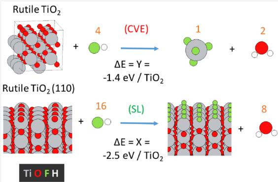

# I. INTRODUCTION

Materials may be processed reliably and uniformly with atomic level control by exploiting self- limiting gas- surface reactions. For instance, atomic layer deposition (ALD) is a process in which a precise fraction of a monolayer of material is deposited in each cycle of gas pulses via a sequence of self- limiting (SL) surface reactions. ALD has become an indispensable step in the fabrication of modern semiconductor devices.1- 5 Alteratively, materials may be deposited faster, but with less control, by means of chemical vapor deposition (CVD), which is a spontaneous and continuous process.

A sequence of SL reactions is also the basis for the atomic layer etch (ALE) process.6,7 ALE is expanding in scope to become a key enabling technology for the fabrication of next generation semiconductor devices. In some cases, combining ALD and ALE will be advantageous for the production of ultrasmooth thin films only on selected substrates. This area- selectivity could reduce the number of lithographic steps and allow further size reduction in semiconductor devices.6,8 The challenge is to identify SL chemistries, or more precisely, to identify reagents and reaction conditions for the desired SL reaction. This paper presents a combined experimental and computational approach for meeting this challenge.

In the ALE concept, the target material surface is first chemically modified by exposure to a pulse of a suitable gas reactant that self- limits after forming a nonvolatile surface layer.7,9,10 The modified layer is then volatilized by the action of the second reactant pulse. Plasma ALE employs directional (i.e., anisotropic) high energy ion bombardment in the second pulse to remove the modified surface layer.7,11 Thermal isotropic ALE processes have also recently been introduced where the modified layer is removed by chemical reaction with another gas phase reactant.9,10,12 The second reactant may

then remove the entire modified layer in a continuous, unlimited way, but it self- limits upon reaching the unmodified material underneath.

Modification of the surface by the first reactant is the subject of this study. The first reactant is introduced into the etch chamber as a gas and adsorbs onto the substrate material by binding with the surface atoms. A volatile byproduct may be produced at this stage. If some fragment of the reactant passivates the surface and causes the surface to become inert toward further reactant adsorption, then this is an SL reaction, as required for ALE.13 On the other hand, the adsorbate could continue to react with the substrate by diffusing into and reacting with subsurface layers. This process would result in continual formation of volatile byproducts that desorb and regenerate active sites on the surface. This spontaneous reaction would be a CVE process.13

Thermochemical calculations of model reactions have been performed by researchers investigating ALD and ALE processes.10,14- 20 One popular approach is to model the reactions using thermochemical tables from databases such as NIST- JANAF20 with the help of software packages such as the HSC Chemistry.21 Alternatively, reactions can be modeled from first- principles using density functional theory (DFT) calculations. Such calculations have been used to investigate ALD mechanism in detail3,14,22 and recently also to study thermal ALE with HF13,23 One advantage of using firstprinciples calculations is that any specific phase of a solid system or any gas phase molecule of interest, however exotic, can be modeled explicitly by ab initio methods. In addition, databases typically include only bulk materials, and so the calculated thermochemistry is valid only for bulk deposition or etching, and not for the surface reactions.

Applying DFT to a slab model is the standard computational procedure for investigating material surfaces, including their interaction with gas phase molecules.13,23 This approach can be used to model the SL reaction. By comparing the free energy profiles (FEPs) of CVE and SL reactions using the "Natarajan- Elliott" analysis,13 the nature of a reactant pulse can be understood. From this analysis, a "minimum thermodynamic barrier" to etch is computed, which is the difference between the corresponding reaction free energies of the CVE and SL reactions. Four distinct reaction states are identified based on the value of this "minimum thermodynamic barrier". These states are purely self- limiting, preferred selflimiting, preferred etching, and purely etching. A detailed description of this analysis methodology is given elsewhere.13

$\mathrm{TiO}_2$  has significant applications in a variety of technological fields.24 For example,  $\mathrm{TiO}_2$  is an important photocatalyst and has been explored for the production of hydrogen and selfcleaning surfaces.25  $\mathrm{TiO}_2$  is also a key material in semiconductor devices such as metal- oxide resistive random access memory (RRAM).26 This films of  $\mathrm{TiO}_2$  are also used in mirror coatings, orthopedic implants and pharmacological applications. A great number of examples are available where thin films of  $\mathrm{TiO}_2$  have been deposited using the ALD approach.27,28

HF has been used as the fluorinating agent in the thermal ALE of several metal oxides such as  $\mathrm{Al}_2\mathrm{O}_3,$ $\mathrm{HfO}_2$  and  $\mathrm{ZrO}_2$  10,15,16 However, HF was found to be unsuitable in the thermal ALE of  $\mathrm{TiO}_2$  where the Ti atoms are in an oxidation state of  $+4$  29  $\mathrm{TiO}_2$  is spontaneously etched by HF at temperatures greater than  $200^{\circ}C,$  probably forming gaseous  $\mathrm{TiF_4}$  and  $\mathrm{H}_2\mathrm{O}$  29 However, when  $\mathrm{WF}_6$  was used as the fluorination reactant at lower temperatures below  $170^{\circ}\mathrm{C},$ $\mathrm{TiO}_2$  ALE was possible using  $\mathrm{WF}_6$  and  $\mathrm{BCl}_3$  without the spontaneous etching of  $\mathrm{TiO}_2$  17 Therefore, HF exposure on  $\mathrm{TiO}_2$  presents an excellent test case for investigating the competition between self- limiting and spontaneous etch reactions.

The purpose of this paper is to demonstrate and validate a combined computational and experimental approach for the design of new ALE processes. The main design steps are (1) choosing reactant molecules for each pulse, (2) optimizing the process conditions in terms of temperature and reactant gas pressure, and (3) identifying and treating the exhaust gases. In a purely experimental approach, each design choice is evaluated by trial and error in the laboratory. This is a time intensive process that limits the number of options that can be considered. On the other hand, a purely computer- based design can consider a much larger range of molecules. However, the computational model may not be able to include all the variables. A closely coupled combination of computations to narrow down the design choices and experiments to optimize the reaction conditions may provide the best strategy.

# II. METHODS SECTION

II.A. Computational Methods. The calculations described in this paper were performed within spin-polarized density functional theory (DFT) using the Vienna ab initio simulation package (VASP, version 5.3).30 The calculations were based on the generalized gradient approximation (GGA) using the Perdew-Burke-Ernzerhof (PBE) exchange-correlation functional.31 The core electrons were described by projector augmented wave potentials32,33 and the valence electrons were treated explicitly using plane wave basis sets up to  $400\mathrm{eV}$  of energy.

The reaction free energies reported in this paper were computed as follows

$$
\Delta G = G_{\mathrm{p}} - G_{\mathrm{r}} + RT\ln (Q)
$$

with

$$
\begin{array}{rl} & G_{\mathrm{plr}} = H_{\mathrm{plr}} - TS_{\mathrm{plr}}\\ & H_{\mathrm{plr}} = E_{\mathrm{plr}} + \mathrm{ZPE}_{\mathrm{plr}} + W(T)_{\mathrm{plr}}\\ & Q = \prod p_{\mathrm{p}}^{\mu} / \prod p_{\mathrm{r}}^{\mu} \end{array}
$$

Here,  $\Delta G$  is the reaction free energy,  $\mathbb{P}$  and  $\mathbf{r}$  in the subscript refer to products and reactants, respectively,  $H$  is the enthalpy, which includes the DFT electronic energy  $E$  and the zero- point energy (ZPE), and  $S$  is entropy. The temperature- dependent enthalpy  $W(T)$  is simply  $RT$  for molecules and  $\Sigma_{q^{\prime}}\dot{\hbar}\omega (q^{\nu})/$ $(\exp (\hbar \omega (q^{\nu}) / k_{\mathrm{B}}T) - 1)$  for solids where  $q$  is wave vector,  $\nu$  is phonon mode index, and  $\omega$  is the phonon frequency.  $Q$  is the reaction quotient, which measures the relative amounts of product and reactant molecules participating in the reaction, and  $\mu$  is the stoichiometric coefficient for the reaction. The quantities  $H$  and  $S$  for bulk and surface models were obtained from phonon frequencies using the Phonopy code.34 Accurate force constants are a prerequisite for this, and they were obtained from density functional perturbation theory (DFPT) calculations in VASP using a strict energy convergence threshold of  $1.0\mathrm{e}^{- 8}\mathrm{eV}$

"Natarajan- Elliott" analysis was used to study the competition between CVE and SL reactions via free energies from a modest number of DFT calculations. In this analysis, each precursor pulse is designated to one of four possible cases depending on the reaction free energies of the SL and CVE reactions (negative free energy means the reaction is favorable). $^{13}$

(a) preferred self-limiting  $(\Delta G_{\mathrm{CVE}}, \Delta G_{\mathrm{SL}} < 0; \Delta G_{\mathrm{SL}} < \Delta G_{\mathrm{CVE}})$ ,  
(b) purely self-limiting  $(\Delta G_{\mathrm{CVE}} > 0; \Delta G_{\mathrm{SL}} < 0; \Delta G_{\mathrm{SL}} < \Delta G_{\mathrm{CVE}})$ ,  
(c) preferred etching  $(\Delta G_{\mathrm{CVE}}, \Delta G_{\mathrm{SL}} < 0; \Delta G_{\mathrm{SL}} > \Delta G_{\mathrm{CVE}})$ , and  
(d) purely etching  $(\Delta G_{\mathrm{CVE}} < 0; \Delta G_{\mathrm{SL}} > 0; \Delta G_{\mathrm{SL}} > \Delta G_{\mathrm{CVE}})$ .

The bulk and surface models of  $\mathrm{TiO}_2$  in the calculations were constructed from its rutile crystalline phase (space group  $P42 / mnm$ ), and the corresponding relaxed geometries are shown in Figure 1. The bulk unit cell consists of two  $\mathrm{TiO}_2$  units, which are optimized by simultaneously relaxing the ionic positions, cell volume and cell shape with a higher energy cutoff of  $550~\mathrm{eV}$  and a Monkhorst- Pack  $k$  - point mesh of  $6\times 6$ $\times 6$  For the surface calculations, a  $15\mathrm{\AA}$  thick slab of  $(2\times 4)$  supercell of the rutile-  $\mathrm{TiO}_2$  110) surface  $(\mathrm{Ti}_{80}\mathrm{O}_{160})$  with a surface area of  $1.57~\mathrm{nm}^2$  and relaxed surface energy of  $0.91~\mathrm{J}/$ $\mathrm{m}^2$  was constructed with  $15\mathrm{\AA}$  of vacuum separating the periodic images in the surface normal direction. This supercell consists of  $5\mathrm{Ti}_{16}\mathrm{O}_{32}$  layers, out of which the bottom two layers were kept fixed.A  $k$  - point mesh of  $2\times 2\times 1$  was used for geometry optimization of this slab. The (110) surface of rutile  $\mathrm{TiO}_2$  was chosen for this study as its signature was found from the XRD spectra of  $\mathrm{TiO}_2$  ALD at high film thicknesses. $^{35}$

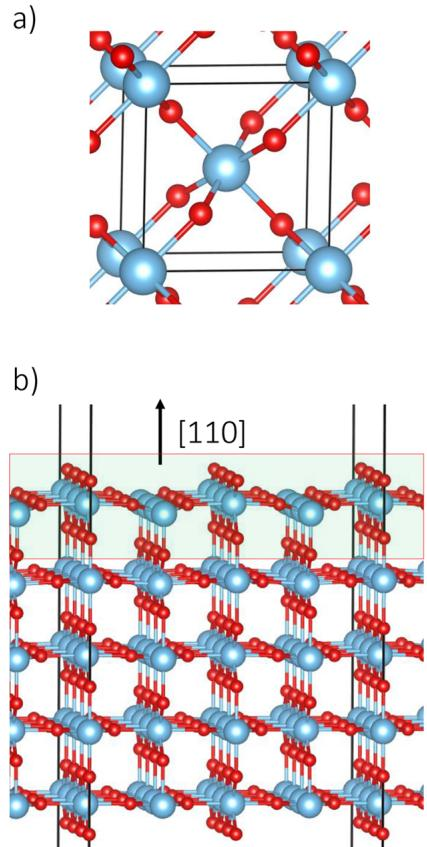  
Figure 1. (a) Equilibrium bulk geometry of rutile  $\mathrm{TiO}_2$ . (b) Relaxed surface slab of  $\mathrm{TiO}_2(110)$ . Ti and O atoms are displayed in cyan and red, respectively.

To model the surface geometries resulting from the SL reactions, preserving stoichiometry, 8 surface O atoms are removed from the bare surface of  $\mathrm{TiO}_2(110)$  followed by the adsorption of  $16\mathrm{F}$  atoms as shown in Figure 2a. Moreover, to represent the reduced  $\mathrm{TiO}_{2 - x}$  surface, just  $12\mathrm{F}$  atoms are adsorbed following the removal of  $8\mathrm{O}$  atoms as shown in Figure 2b. For these surface slabs,  $H$  and  $S$  are computed by considering only the top layer of surface atoms highlighted in the figures.

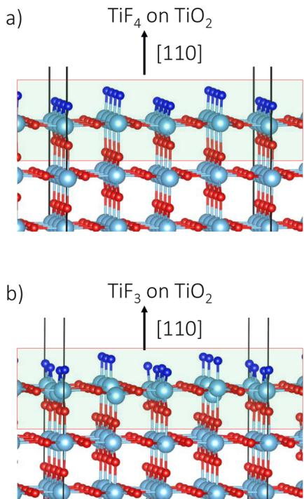  
Figure 2. (a) Relaxed surface slab model of self-limited fluorination of  $\mathrm{TiO}_2(110)$  as  $\mathrm{TiF}_4$ . (b) Relaxed surface slab model of self-limited fluorination of  $\mathrm{TiO}_2(110)$  as  $\mathrm{TiF}_3$ .

Gas phase calculations of the reagent molecules and byproducts were performed using VASP with a large periodic box of dimensions  $15.0\mathrm{\AA}\times 16.0\mathrm{\AA}\times 15.5\mathrm{\AA}$  with an energy cutoff of  $400\mathrm{eV}$ . However, for convenience,  $H$  and  $S$  values for these gas phase molecules are obtained from the "free" program of the Turbomole suite $^{36}$  at a constant pressure of 1 atm. All gas phase calculations in Turbomole were performed with the PBE functional and a valence triple-  $\zeta$  basis set (der- TZVPP).

II.B. Experimental Methods. For the FTIR studies of etching,  $\mathrm{TiO}_2$  ALD films were first deposited on silicon nanopowder covered with native oxide ( $>98\%$  US Research Nanomaterials) that had an approximate diameter of  $30~\mathrm{nm}$ . This nanopowder was used to achieve a high  $\mathrm{TiO}_2$  surface area for greater signal-to-noise for the FTIR experiments. $^{37}$  The powder was pressed into a  $1.5\mathrm{cm}\times 3\mathrm{cm}$  tungsten grid that was  $50\mu \mathrm{m}$  thick with 100 grid lines per inch. $^{37}$  The tungsten grid was resistively heated with a DC power supply (6268B, 12 V/40 A, HP) to heat to the temperatures needed for the ALD and spontaneous etching experiments. The power supply was controlled by a PID temperature controller (Love Controls

Table 1. Reaction Energies  $(\Delta E)$  of the Postulated CVE (Y) and SL  $(\mathbf{X})$  Reactions Representing the HF Pulse on  $\mathrm{TiO_2}$  along with the Corresponding Minimum Thermodynamic Barrier'  $(\mathbf{Y} - \mathbf{X})$  to Etch  

<table><tr><td colspan="2">reactions</td><td>ΔE [eV/u.b.]</td><td>Y-X [eV/u.b.]</td></tr><tr><td>CVE1</td><td>TiO2(b) + 4HF(g)TiF4(g) + 2H2O(g)</td><td>Y1 = -1.4</td><td>1.1</td></tr><tr><td>SL1</td><td>TiO2(surf) + 4HF(g)TiF4(surf) + 2H2O(g)</td><td>X1 = -2.5</td><td></td></tr><tr><td>CVE2</td><td>TiO2(b) + 2HF(g)TiOF2(g) + 1H2O(g)</td><td>Y2 = 2.0</td><td>3.3</td></tr><tr><td>SL2</td><td>TiO2(surf) + 2HF(g)TiOF2(surf) + 1H2O(g)</td><td>X2 = -1.3</td><td></td></tr><tr><td>CVE3</td><td>TiO2(b) + 3HF(g)TiF3(g) + 1.5H2O(g) + 0.25L2(g)</td><td>Y3 = 2.1</td><td>2.5</td></tr><tr><td>SL3</td><td>TiO2(surf) + 3HF(g)TiF3(surf) + 1.5H2O(g) + 0.25L2(g)</td><td>X3 = -0.4</td><td></td></tr></table>

aThe energy values are normalized per unit bulk (ub.) material. (b) refers to bulk,  $(\underline{\mathbf{g}})$  to gas-phase and (surf) to surface.

16B, Dwyer Instruments). To monitor the temperature, a type K thermocouple was connected to the tungsten grid with a non conductive epoxy (Cermabond 571).

$\mathrm{TiO}_2$  ALD was performed in a home- built warm- walled ALD reactor equipped for FTIR studies as described previously.38,39 For sample temperatures greater than  $150^{\circ}\mathrm{C}_{\cdot}$  the chamber walls were held at  $150^{\circ}\mathrm{C}$  and the sample was heated using the DC power supply. For sample temperatures below  $150^{\circ}\mathrm{C}_{\cdot}$  the temperature of the chamber walls controlled the sample temperature.  $\mathrm{TiO}_2$  ALD was accomplished with sequential exposures of  $\mathrm{TiCl_4}$ $(\geq 99.995\%$  trace metals basis, SigmaAldrich) and  $\mathrm{H}_2\mathrm{O}$  at  $200^{\circ}\mathrm{C}$  27,28,39,40 The  $\mathrm{TiCl_4}$  and  $\mathrm{H}_2\mathrm{O}$  reactants produce a  $\mathrm{TiO}_2$  ALD growth rate of  $\approx 0.4\mathrm{\AA}/$  cycle at  $200^{\circ}\mathrm{C}$  28,40 The resulting  $\mathrm{TiO}_2$  ALD films are amorphous by X- ray diffraction analysis and known to have low chlorine concentrations of  $\approx 1\mathrm{at}\%$  by  $X$  - ray photoelectron spectroscopy measurements.28,40

During the  $\mathrm{TiO}_2$  ALD process, the  $\mathrm{TiCl_4}$  half- cycle was a  $2\mathrm{s}$  exposure at  $50 - 100\mathrm{mTorr}$  in viscous flow with the  $\mathbf{N}_2$  carrier gas. The  $\mathrm{TiCl_4}$  exposure was followed by purging with the  $\mathbf{N}_2$  carrier gas for  $90\mathrm{~s~}$  Then the FTIR spectrum was acquired during a scan for  $60\mathrm{~s~}$  Then  $\mathrm{H}_2\mathrm{O}$  half- cycle consisted of a 1 s exposure at  $50 - 80\mathrm{mTorr}$  in viscous flow with the  $\mathbf{N}_2$  carrier gas. The  $\mathrm{H}_2\mathrm{O}$  exposure was followed by purging with the  $\mathbf{N}_2$  carrier gas for  $60\mathrm{~s~}$  Then the FTIR spectrum was acquired during a scan for  $60\mathrm{~s~}$

For HF exposures on  $\mathrm{TiO}_2,$  each HF exposure was a  $2\mathrm{~s~}$  exposure at  $200\mathrm{mTorr}$  in viscous flow with the  $\mathbf{N}_2$  carrier gas. The HF exposure was followed by purging with the  $\mathbf{N}_2$  carrier gas for  $90\mathrm{~s~}$  Then the FTIR spectrum was acquired during a scan for  $60\mathrm{~s~}$  Longer purges than necessary for ALD were used to reduce the possibility of HF contact with the KBr windows during the FTIR scan. Spectra were recorded with a spectral resolution of  $4\mathrm{~cm}^{- 1}$  .Prior to the etching experiments at different temperatures, the sample was equilibrated at each temperature for  $30\mathrm{~min}$

The QMS investigations employed a new reactor that has been described earlier.41 This reactor allows the study of etch products produced by flowing reactant gases through powder samples. The etch products and background gas are then expanded through an aperture and form a molecular beam. The beam of background gas and etch products are then passed through a skimmer and enter a differentially pumped region for QMS analysis. The details of this apparatus have been given previously.41

The skimmer aperture diameter was  $1.4~\mathrm{mm}$  and the skimmer was positioned  $41~\mathrm{mm}$  from the sample aperture. The volatile etch products were observed using a high sensitivity, high mass quadrupole mass spectrometer (Extrel, MAX- QMS Flanged Mounted System). Each spectrum was recorded in 1 s and monitored mass intensities from 1 to 500 amu. After the position of the products was determined, the mass spectrum was recorded from 30 to 300 amu using optimized ionization energy and electron multiplier gain. An average of 100 scans were recorded during HF exposures to eliminate noise. Electron- impact ionization of gas- phase etching products was achieved with a circular thoriated iridium filament in the ionization volume inside the ionizer housing. An electron ionization energy of  $70\mathrm{eV}$  was used for these experiments.

HF was first introduced into a reservoir at a pressure of 9 Torr to have a consistent HF partial pressure during the reaction. HF was leaked into the flowing  $\mathbf{N}_2$  background gas. The HF pressure in the sample holder containing the  $\mathrm{TiO}_2$  powder was 5.2 Torr. The background  $\mathbf{N}_2$  pressure was 2.8 Torr.  $\mathrm{TiO}_2$  nanopowder was purchased from US Research Nanomaterials  $(99.9\%)$ $165~\mathrm{nm}$  diameter) and added to a sample holder. The mass of the  $\mathrm{TiO}_2$  nanopowder was recorded before and after the etching experiments. The mass of the nano powder before etching was  $40.58~\mathrm{mg}$

# III. RESULTS

III.A. Computational Results. III.A.1. Computed Energetics of HF Reactions with  $\mathrm{TiO}_2$ . The possible CVE and SL reactions representing the HF pulse on  $\mathrm{TiO}_2$  are listed in Table 1 along with their corresponding reaction energies computed with DFT. Three sets of CVE and SL reactions are postulated for the  $\mathrm{TiO}_2$  and HF interaction. In the CVE1 reaction of  $\mathrm{TiO}_2$ , four HF molecules are needed to etch away one unit of bulk as  $\mathrm{TiF}_4$  and  $\mathrm{H}_2\mathrm{O}$ , whereas in the CVE2 reaction, two HF molecules are assumed to be enough to etch a unit of  $\mathrm{TiO}_2$  by forming  $\mathrm{TiO}_2$  and  $\mathrm{H}_2\mathrm{O}$ . These two reactions are of nonredox type since the Ti ion in the product species retains the oxidation state of  $+4$ . On the other hand, in the CVE3 reaction, the  $\mathrm{Ti}^{4 + }$  ion in  $\mathrm{TiO}_2$  is reduced to  $\mathrm{Ti}^{3 + }$  by forming  $\mathrm{TiF}_3$ . The CVE2 and CVE3 reactions are computed to be unfavorable at  $0\mathrm{K}$  with positive reaction energies while the CVE1 reaction is exoergic.

Surface- limited versions of these three reactions are also postulated. The SL1, SL2, and SL3 reactions of  $\mathrm{TiO}_2$  are found to be energetically more favorable than the CVE1, CVE2, and CVE3 reactions, respectively. This behavior can be interpreted as the TiF units bonded on the surface being much more favorable than  $\mathrm{TiF}_x$  molecules in the gas phase at  $0\mathrm{K}$ . CVE1 and SL1 are the most favorable reactions for  $\mathrm{TiO}_2$  since the minimum thermodynamic barriers (differences between CVE and SL reaction energies) of the other reaction sets are significantly larger. Therefore, the energy profile of the HF pulse at  $T = 0\mathrm{K}$  falls under the "preferred self- limiting" category as both SL and CVE are energetically allowed, but with CVE facing a minimum thermodynamic barrier of  $1.1\mathrm{eV} / \mathrm{TiO}_2$ .

III.A.2. Reaction Free Energy Profiles for Etching of  $TiO_{2}$ . FEPs of the candidate etching reactions in Table 1 are computed with a reactant pressure of 0.2 Torr and product pressure of 0.01 Torr in the temperature range 0 to  $1000\mathrm{K}$ . The various contributions to the free energy of the CVE1 reaction of  $\mathrm{TiO_2}$  are plotted in Figure 3.  $\Delta E$  and  $\Delta ZPE$  do not

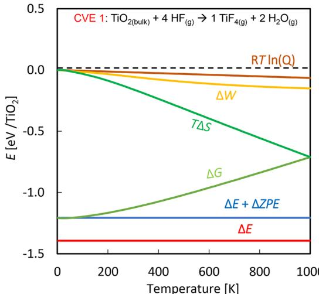  
Figure 3. Various contributions to the reaction FEP for the CVE1 reaction of  $\mathrm{TiO}_2 + \mathrm{HF}\rightarrow \mathrm{TiF}_4 + \mathrm{H}_2\mathrm{O}$  at an HF reactant pressure of 0.2 Torr.

change with temperature and are represented as horizontal lines. The entropy term,  $T\Delta S,$  dominates the FEP of this reaction by spanning from  $0\mathrm{eV}$  at  $0\mathrm{K}$  to  $- 0.73\mathrm{eV}$  per bulk unit at  $1000\mathrm{K}$ . The entropy decreases primarily because four gaseous molecules react to produce only three product molecules, which indicates that the relative entropies of reactant and product gases play a crucial role in the temperature- dependence of the etch process. The  $RT\ln (Q)$  and  $\Delta W$  terms contribute relatively little in magnitude compared with the entropy term at this pressure. However, these terms do have the effect of offsetting some of the entropic increase in free energy at high temperature for CVE1. At these reactant and product pressures, the FEP shows that the CVE1 reaction is exergonic  $(\Delta G< 0)$  up to at least 1000 K.

The FEPs of CVE and SL reactions for  $\mathrm{TiO_2}$  can be compared as shown in Figure 4. The CVE2 and CVE3 reactions have almost identical FEPs and are endergonic even though their FEPs have a negative slope. In contrast, the CVE1 reaction is fully exergonic even though its FEP has a slightly positive slope. At some very high temperature, the  $\Delta G$  profiles of CVE1 and CVE2 may cross over each other. In that case, CVE2 producing  $\mathrm{TiOF_2}$  would become the most favorable etch reaction. However, judging from the slopes of their FEPs, CVE2 and CVE3 will not cross each other. Consequently, the formation of volatile  $\mathrm{TiF_4}$  will never be more favorable than the formation of volatile  $\mathrm{TiOF_2}$

The SL reactions are comparatively more exoergic than the CVE counterparts at low temperatures up to  $360~\mathrm{K}$ $(87^{\circ}\mathrm{C})$  The HF molecules passivate the  $\mathrm{TiO_2}$  surface and form surface- bound products in the SL reactions. As a result, there is a significant entropic penalty that is evident in the strongly positive slope of the FEPs of the SL reactions. The SL3 reaction is unfavorable at all temperatures above  $70~\mathrm{K}$ , which indicates that reduction by HF of surface Ti atoms to  $\mathrm{TiO}_{2 - x}$  is unlikely.

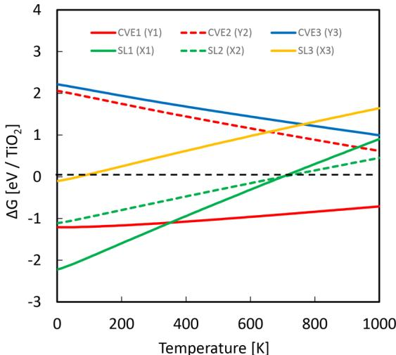  
Figure 4. FEPs for the CVE1, CVE2, CVE3, SL1 SL2, and SL3 reactions for HF interacting with  $\mathrm{TiO_2}$  versus temperature. The labels X and Y correspond to the values listed in Table 1.

Considering only the most favorable reactions, CVE1 and SL1, the graph in Figure 5 can be divided into three regions.

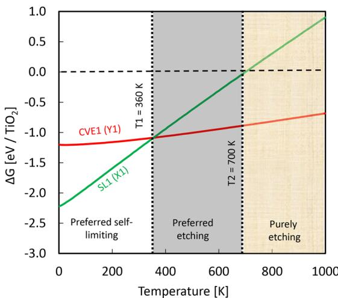  
Figure 5. FEPs of CVE1 and SL1 showing three regions: preferred self-limiting, preferred etching, and purely etching. SL1 and CVE1 line crossing occurs at  $360~\mathrm{K}$ $(87^{\circ}\mathrm{C})$

The FEPs of the CVE1 and SL1 reactions cross at  $360~\mathrm{K}$ $(87^{\circ}\mathrm{C})$ . The region between 0 and  $360~\mathrm{K}$  is labeled as "preferred self- limiting", since the SL1 reaction is the most favorable in this region and the 'minimum thermodynamic barrier' for SL1 to CVE1 is positive. HF etching of the bulk by CVE1 is possible in this region if the energetic barrier, including kinetic requirement, can be overcome at the reactor conditions. The "minimum thermodynamic barrier" drops from a value of 1.1 eV per bulk unit at  $0\mathrm{K}$  to zero at  $360~\mathrm{K}$  where the CVE1 and SL1 reactions become equally favorable for producing byproducts at pressure of 0.01 Torr.

The region between  $360~\mathrm{K}$ $(87^{\circ}\mathrm{C})$  and  $700~\mathrm{K}$ $(427^{\circ}\mathrm{C})$  is called "preferred etching", since fluorination of the surface by reaction SL1 is possible, but the CVE1 reaction to volatile  $\mathrm{TiF_4}$  is more favored. The actual etch pathway may face kinetic barriers that have not been computed in this study. While

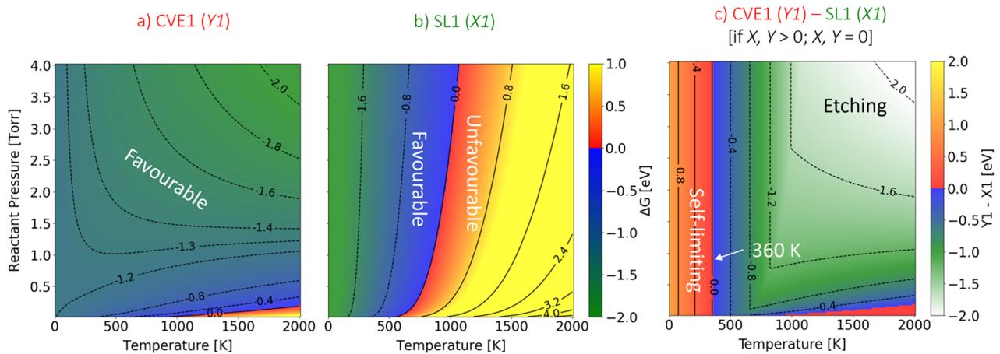  
Figure 6. "Heat" maps showing the change in free energy of (a) CVE1 and (b) SL1 reactions for HF exposure on  $\mathrm{TiO_2}$ . (c) Change in corresponding minimum thermodynamic barrier with respect to reactant pressure and temperature.

computing the entire mechanism and associated kinetics would always be the ideal approach, resource limitations may not allow it. The SL1 reaction becomes endergonic beyond  $700~\mathrm{K}$ , and this temperature region is labeled "purely etching". This label suggests that, at these high temperatures, the surface may resist fluorination via SL1, which may constitute a barrier toward the formation of volatile  $\mathrm{TiF_4}$  (for CVE1), though we have no data on such details of the mechanism.

III.A.3. Influence of Reactant and Product Pressures. The etch reactions have been considered above at a constant reactant (HF) pressure of 0.2 Torr and a byproduct pressure of 0.01 Torr. The reactant gas pressure can be controlled in the reactor. However, the product pressure is not an experimentally adjustable parameter. Any change in the reactant and product pressures will alter the slope of the FEPs due to the contributions from the  $RT\ln (Q)$  term, and will hence change the process window. This is now shown for the CVE1 and SL1 reactions of  $\mathrm{TiO_2}$  under changes in reactant (HF) pressure from 0.01 to 4 Torr at a constant byproduct pressure of 0.01 Torr.

Parts a and b of Figure 6 display color maps showing the free energy changes of the CVE1 and SL1 reactions of  $\mathrm{TiO_2}$  along with the minimum thermodynamic barrier for etching (CVE1- SL1) in Figure 6c. The CVE1 reaction shown in Figure 6a is mostly favorable in the entire reactant pressure range. CVE1 also becomes more favorable at high temperatures and high reactant pressure. Consequently, an increase of the reactant pressure decreases the slope of the FEP of the CVE1 reaction. In the SL1 reaction shown in Figure 6b, the favorable region is pushed to higher temperatures at higher reactant pressure.

From the minimum thermodynamic barrier map in Figure 6c, the SL1 reaction is computed to be preferred up to  $360~\mathrm{K}$ $(87^{\circ}\mathrm{C})$  for the entire reactant pressure range. This means that the temperature at which the FEPs of the CVE1 and SL1 reactions cross over is constant with respect to increase in the reactant pressure, under the assumption of a constant product pressure. This behavior occurs because the number of reactant HF molecules per unit  $\mathrm{TiO_2}$  is the same for both CVE1 and SL1 reactions. In the "purely etching" region  $(\Delta G(\mathrm{SL1}) > 0$  and  $\Delta G(\mathrm{CVE1})< 0)$ , the minimum thermodynamic barrier to etch decreases at higher reactant pressure.

III.B. Experimental Results. III.B.1. FTIR Spectroscopy. Figure 7 shows the progressive growth of a  $\mathrm{TiO_2}$  film during 36 ALD cycles on silicon nanoparticles measured by the infrared

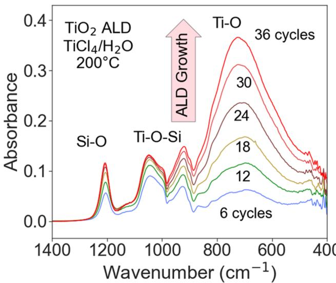  
Figure 7. FTIR absorbance during  $\mathrm{TiO_2}$  ALD on silicon nanoparticles at  $200^{\circ}\mathrm{C}$  versus number of ALD cycles using  $\mathrm{TiCl_4}$  and  $\mathrm{H}_2\mathrm{O}$  as the reactants.

absorbance.  $\mathrm{TiCl_4}$  and  $\mathrm{H}_2\mathrm{O}$  were employed as the reactants at  $200^{\circ}\mathrm{C}$  for  $\mathrm{TiO_2}$  ALD. The spectra are referenced to the original silicon nanoparticle sample that has a thin native oxide of the silicon surface. The absorption peak at  $400 - 960~\mathrm{cm}^{- 1}$  corresponds to  $\mathrm{Ti - O}$  stretching vibrations. The  $\mathrm{Ti - O}$  stretching vibrations yield a peak at  $722~\mathrm{cm}^{- 1}$  that increases linearly with number of  $\mathrm{TiCl_4}$  and  $\mathrm{H}_2\mathrm{O}$  cycles.

The initial cycles of  $\mathrm{TiO_2}$  ALD also give rise to several other absorption peaks at 1209, 1048, and  $940~\mathrm{cm}^{- 1}$ . The vibrational band at  $1209~\mathrm{cm}^{- 1}$  is assigned to  $\mathrm{Si - O}$  vibrations that arise due to the oxidation of the silicon powder with  $\mathrm{H}_2\mathrm{O}$  exposures. This peak grows rapidly during the first 10  $\mathrm{TiO_2}$  ALD cycles, and then the growth slows at higher  $\mathrm{TiO_2}$  ALD film thicknesses. The bands at 940 and  $1048~\mathrm{cm}^{- 1}$  are assigned to  $\mathrm{Si - O - Ti}$  vibrations resulting from the mixing of  $\mathrm{TiO_2}$  and  $\mathrm{SiO_2}$  at the interface. These vibrational bands also do not increase further as  $\mathrm{TiO_2}$  ALD continues past 30 cycles.

The etching of the  $\mathrm{TiO_2}$  ALD films by HF was studied by monitoring the changes to the FTIR spectrum. Another  $\mathrm{TiO_2}$  ALD film was grown using multiple  $\mathrm{TiO_2}$  ALD cycles. Figure 8

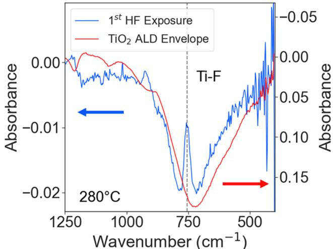  
Figure 8. FTIR difference spectrum for the first HF exposure on  $\mathrm{TiO_2}$ . Difference spectrum was obtained using the FTIR absorbance spectrum for  $\mathrm{TiO_2}$  ALD after 36 cycles as a reference. Absorbance for the  $\mathrm{TiO_2}$  ALD film after 36 cycles is also shown for comparison

shows the difference spectrum after the first exposure of HF at  $200\mathrm{mTorr}$  for  $2\mathrm{s}$  at  $280^{\circ}C$  This difference spectrum is referenced to the infrared spectrum from the last 20 cycles used to grow the  $\mathrm{TiO_2}$  ALD film. The vertical axis for this reference spectrum has been scaled and shown in Figure 8. The comparison between the difference spectrum and the reference spectrum reveals that the HF exposure removes the  $\mathrm{TiO_2}$  ALD film. The difference spectrum displays a broad decrease in absorbance at  $400 - 960\mathrm{cm}^{- 1}$  that is consistent with the spectrum for the  $\mathrm{TiO_2}$  ALD film.

There is also a new feature in Figure 8 that is not in agreement with the loss of the absorbance from the  $\mathrm{Ti - O}$  stretching vibration. This feature is observed as an absorption peak at  $777~\mathrm{cm^{- 1}}$  . This absorption feature is assigned to a  $\mathrm{Ti - }$  F stretching vibration.48,49 The difference spectrum is consistent with the HF exposure spontaneously etching  $\mathrm{TiO_2}$  and leaving the  $\mathrm{TiO_2}$  surface terminated with  $\mathrm{Ti - F}$  species after the HF exposure. This  $\mathrm{Ti - F}$  surface species may be viewed as an intermediate on the way to volatile etch species. The expected possible volatile etch products from the spontaneous etching of  $\mathrm{TiO_2}$  by HF may be  $\mathrm{TiF_4}$  or  $\mathrm{TiOF_2},$  which is checked by OMS measurements and DFT calculations.

Figure 9 shows the difference spectra after  $10\mathrm{HF}$  exposures at  $200\mathrm{mTorr}$  for  $2\mathrm{s}$  at  $280^{\circ}C$  The starting sample was a  $\mathrm{TiO_2}$  ALD film deposited after 60 ALD cycles. The difference spectra are referenced to the absorption spectrum for this  $\mathrm{TiO_2}$  ALD film. The decrease of the absorbance for the  $\mathrm{Ti - O}$  stretching vibration between 500 and  $900~\mathrm{cm^{- 1}}$  in Figure 9 is linear with respect to the HF exposure. The continuous loss of  $\mathrm{TiO_2}$  indicates spontaneous etching (CVE) during each HF exposure.

Figure 9 also provides confirmation that the absorption feature at  $777~\mathrm{cm^{- 1}}$  corresponds to a  $\mathrm{Ti - F}$  surface species. This absorption peak at  $777~\mathrm{cm^{- 1}}$  persists through the first, third, fifth, and 10th HF exposures. The size of this absorption feature also remains constant during the ten HF exposures. These results are expected since the surface area of  $\mathrm{Ti - F}$  surface species stays constant as the  $\mathrm{TiO_2}$  ALD film is progressively removed by spontaneous etching.

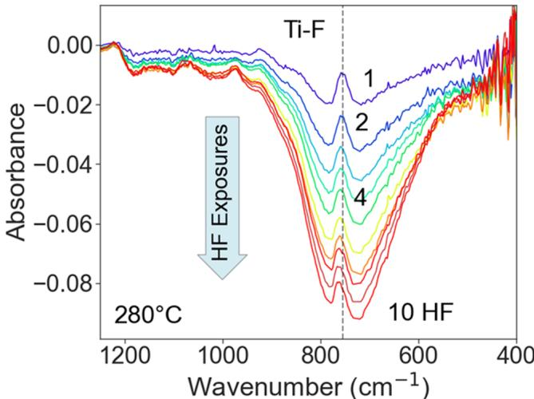  
Figure 9. FTIR difference spectra after 10 sequential HF exposures at  $280^{\circ}C$  on  $\mathrm{TiO_2}$  ALD films. Absorbance feature at  $777~\mathrm{cm^{-1}}$  is assigned to  $\mathrm{Ti - F}$  stretching vibration.

The spontaneous etching of  $\mathrm{TiO_2}$  increases at higher substrate temperature. To quantify the spontaneous etching rate, experiments were performed at 14 different temperatures between 80 and  $300^{\circ}C$  The change in FTIR absorbance was integrated over the frequency range 400 to  $960~\mathrm{cm^{- 1}}$  after each HF exposure for  $10\mathrm{HF}$  exposures at each temperature. This change in the integrated absorbance during each HF exposure is proportional to the  $\mathrm{TiO_2}$  etch rate, which is shown in Figure 10. There is a small but measurable integrated absorbance loss at temperatures as low as  $80^{\circ}C$ $(353\mathrm{K})$  but not at lower temperatures. The  $\mathrm{TiO_2}$  etching starts to increase more noticeably at approximately  $150^{\circ}C$ $(423\mathrm{K})$  . The etch rate increases progressively with temperature up to  $300^{\circ}C$  573 K). These results for the spontaneous etching of  $\mathrm{TiO_2}$  are in agreement with previous experiments that revealed the

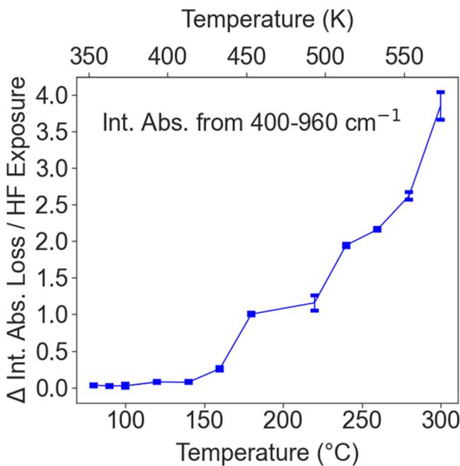  
Figure 10. Etch rate as measured by change in integrated absorbance of the  $\mathrm{Ti - O}$  vibrational modes from 400 to  $960~\mathrm{cm^{-2}}$  for each HF exposure. Temperature is varied from 80 to  $300^{\circ}C$

spontaneous etching of  $\mathrm{TiO}_2$  ALD films by HF exposures at 200, 250, and  $300^{\circ}\mathrm{C}$  using quartz crystal microbalance (QCM) measurements. A central question in this paper is whether this temperature window for etching can be predicted computationally.

The change in the integrated absorbance during each HF exposure can also be related to the thickness of the  $\mathrm{TiO}_2$  ALD film. From the results in Figure 7, an integrated absorbance (units of absorbance  $\times \mathrm{cm}^{- 1}$ ) of  $118~\mathrm{cm^{- 1}}$  is obtained from 400 to  $960~\mathrm{cm^{- 1}}$  after  $36\mathrm{TiO}_2$  ALD cycles at  $200^{\circ}\mathrm{C}$ . Previous  $\mathrm{TiO}_2$  ALD studies have measured a  $\mathrm{TiO}_2$  ALD growth rate of  $0.4\mathrm{\AA}$  cycle using  $\mathrm{TiCl}_4$  and  $\mathrm{H}_2\mathrm{O}$  as the reactants at  $200^{\circ}\mathrm{C}$ . Using this growth rate, the integrated absorbance of  $118~\mathrm{cm^{- 1}}$  after  $36\mathrm{TiO}_2$  ALD cycles can be equated to a  $\mathrm{TiO}_2$  ALD film thickness of  $14.4\mathrm{\AA}$ . Using this correlation between integrated absorbance and  $\mathrm{TiO}_2$  film thickness, the  $\mathrm{TiO}_2$  film thickness removed for the HF exposure of  $200~\mathrm{mTorr}$  for  $2\mathrm{s}$  at  $300^{\circ}\mathrm{C}$  is estimated to be  $0.5\mathrm{\AA}$ .

Figure 11 shows the Arrhenius plot of the temperature- dependent etch rates. This plot of the logarithm of the etch

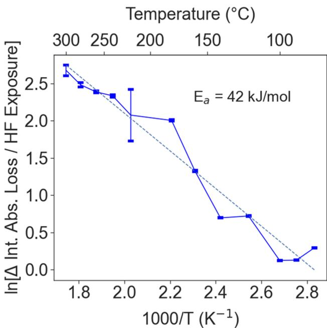  
Figure 11. Arrhenius plot obtained from etch rates versus temperature presented in Figure 10. Slope of the plot yields an activation barrier of  $E_{\mathrm{a}} = 42\mathrm{kJ / mol}$ .

rate versus  $1 / T$  is approximately linear. The slope of the Arrhenius plot yields an activation energy of  $E_{\mathrm{a}} = 42\mathrm{kJ / mol}$ . This activation energy is presumably associated with the kinetics of the rate- limiting mechanistic step during HF etching of  $\mathrm{TiO}_2$ .

II.B.2. QMS Spectrometry. Quadrupole mass spectroscopy was used to investigate the volatile etch species produced when HF interacts with  $\mathrm{TiO}_2$  at  $300^{\circ}\mathrm{C}$ . Figure 12a shows the mass spectrum from 46 to 110 amu that reveals the peaks for  $\mathrm{TiF}_3^+$ ,  $\mathrm{TiF}_2^+$ ,  $\mathrm{TiF}^+$ , and  $\mathrm{Ti}^+$ . The  $\mathrm{TiF}_3^+$  fragments have the highest intensity. The main fragment for  $\mathrm{TiF}_3^+$  is at  $m / z = 105$  amu. These titanium fluoride species are assigned to the cracking fragments of  $\mathrm{TiF}_4^+$ . The small peaks found at 55 and 57 amu correspond to hydrocarbons that are often observed during heating of the filament for electron impact ionization.

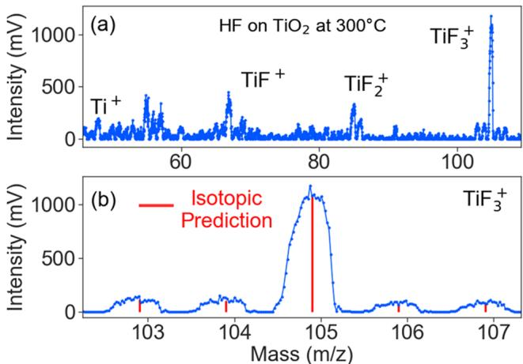  
Figure 12. (a)  $\mathrm{TiF}_x^+$  mass species observed during HF exposure on  $\mathrm{TiO}_2$  powder at  $300^{\circ}\mathrm{C}$ . (b) Expansion of the mass range around the main  $\mathrm{TiF}_3^+$  fragment at  $m / z = 105$  amu showing the measured signals and the predicted signals based on the Ti isotopes.

Figure 12b expands the mass spectrum around 105 amu. The  $\mathrm{TiF}_3^+$  fragment can be confirmed by the Ti isotopic ratios. Due to the isotopes of titanium, there should be expected peaks at 103, 104, 105, 106, and 107 amu with intensities of  $10.8\%$ ,  $9.9\%$ ,  $100\%$ ,  $7.5\%$ , and  $7.3\%$ , respectively. These expectations accurately match the intensities of the peaks observed for the  $\mathrm{TiF}_4^+$  fragment.  $\mathrm{TiF}_3^+$  could be a fragment of  $\mathrm{TiF}_4^+$ . However,  $\mathrm{TiF}_4^+$  was not observed in the mass spectrum.  $\mathrm{TiF}_4^+$  is consistent with the CVE1 reaction where the expected product is  $\mathrm{TiF}_{(g)}$ . There also could be small contributions from the CVE3 reaction if the product was  $\mathrm{TiF}_{3(g)}$ .  $\mathrm{TiF}_3$  is not likely as the parent because  $\mathrm{TiF}_3$  is a solid with a very high melting point of  $1200^{\circ}\mathrm{C}$ . In contrast,  $\mathrm{TiF}_4$  has a much lower melting point of  $377^{\circ}\mathrm{C}$ .

Figure 13 shows the intensity of the  $\mathrm{TiF}_x$  fragments during the HF exposure with a duration of  $2\mathrm{min}$ . All  $\mathrm{TiF}_x$  fragments rise and fall with the HF exposure. The intensity of the  $\mathrm{TiF}^+$  peak has a higher background intensity resulting from small hydrocarbons desorbing from the filament at 86 amu. All the  $\mathrm{TiF}_x^+$  fragments are attributed to  $\mathrm{TiF}_4$ . The absence of the  $\mathrm{TiF}_4^+$  parent may result from its fragmentation during

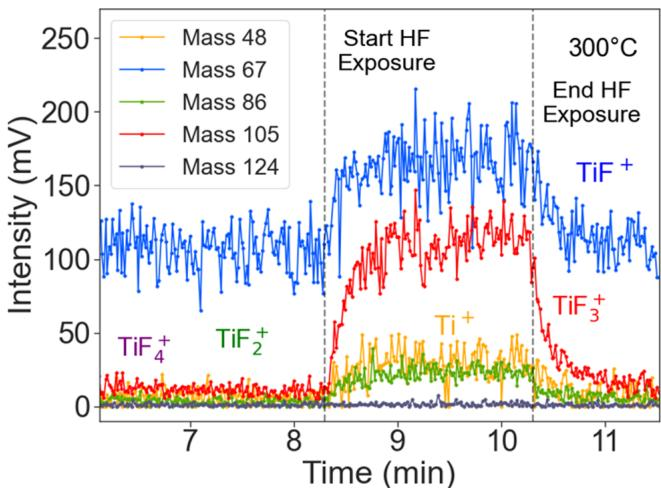  
Figure 13. Mass spectrometry scans for  $\mathrm{TiF}_4^+$ ,  $\mathrm{TiF}_3^+$ ,  $\mathrm{TiF}_2^+$ ,  $\mathrm{TiF}^+$ , and  $\mathrm{Ti}^+$  during an HF exposure lasting  $2\mathrm{min}$ . All  $\mathrm{TiF}_x^+$  species rise and fall with the HF exposure.

ionization. Attempts to observe the  $\mathrm{TiF_4}$  parent were unsuccessful even when heating  $\mathrm{TiF_4}$  powder in a separate vacuum chamber equipped with a mass spectrometer. $^{50}$

Figure 14a shows the increase in the  $\mathrm{H}_2\mathrm{O}^+$  intensity at 18 amu, and Figure 14b shows the increase in the  $\mathrm{HF^{+}}$  intensity at 20 amu during the HF exposure with a duration of  $2\mathrm{min}$ . The  $\mathrm{H}_2\mathrm{O}^+$  signal rises and falls with the HF exposure.  $\mathrm{H}_2\mathrm{O}$  is an expected product of both the CVE1 and CVE3 reactions where  $\mathrm{TiF}_{(4)}$  and  $\mathrm{TiF}_{(3)}$  are the respective products. The mass signal for  $\mathrm{O}_2$  at 32 amu did not have an increase during the HF exposure. After the etching experiments, the mass of the powder was measured to investigate the mass decrease resulting from etching. The final mass was  $31.26\mathrm{mg}$  compared with  $40.58\mathrm{mg}$  before etching. The etching resulted in a  $23\%$  decrease in the mass of the  $\mathrm{TiO}_2$  nanopowder.

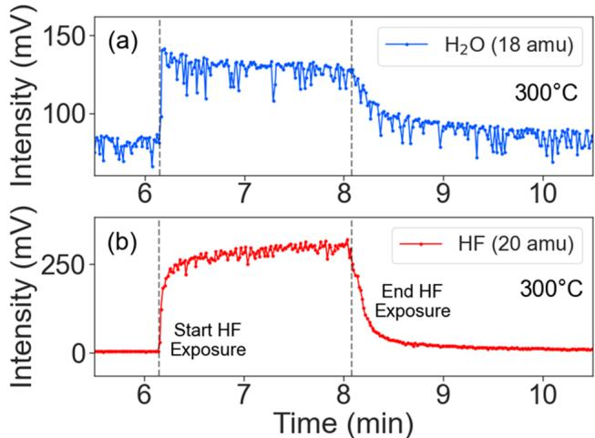  
Figure 14. Mass spectrometry scans for (a)  $\mathrm{H}_2\mathrm{O}^+$  and (b)  $\mathrm{HF^{+}}$  during an HF exposure lasting  $2\mathrm{min}$ . The  $\mathrm{H}_2\mathrm{O}^+$  intensity rises and falls with the HF exposure.

# IV. DISCUSSION

The FEPs of postulated SL and CVE reactions for HF exposure on  $\mathrm{TiO}_2$  were calculated over wide temperature and pressure ranges of interest. Experimental results were also obtained for the etch onset, etch rate versus temperature and etch products. The onset temperature was the first temperature where the change in the integrated FTIR absorbance of the  $\mathrm{Ti} - \mathrm{O}$  vibrational band was found to be non- negligible. The FTIR measurements showed that the spontaneous etch of  $\mathrm{TiO}_2$  (a CVE- type reaction) was favorable from an onset temperature of  $80 - 90^{\circ}\mathrm{C}$ , which agrees with the theoretical prediction that the continuous etching of  $\mathrm{TiO}_2$  by reaction CVE1 dominates at temperatures greater than  $360\mathrm{K}$ $(87^{\circ}\mathrm{C})$ . In this case, the predicted onset temperature is based on crossover of the computed thermodynamics of the candidate etching reactions. The correlation between the experimental and theoretical onset temperature counters the common assumption that onset temperatures are exclusively a reflection of reaction kinetics. Whether this is a general finding remains to be seen in the future.

The calculations show that the surface remains completely passivated with  $\mathrm{Ti} - \mathrm{F}$  species due to the self- limiting SL1 reaction at temperatures below the onset temperature. The FTIR difference spectra in Figure 8 also show a persistent  $\mathrm{Ti} - \mathrm{F}$  signal and the loss of  $\mathrm{Ti} - \mathrm{O}$  signal after each HF pulse on the

$\mathrm{TiO}_2$  surface at  $280^{\circ}\mathrm{C}$ $(553\mathrm{K})$ . At this temperature, the HF pulse is predicted to be in the "preferred etching" state where both SL1 and CVE1 reactions are favorable and compete with each other, but with CVE1 more thermochemically favorable. The favorability of CVE1 explains why spontaneous etching and loss of  $\mathrm{Ti} - \mathrm{O}$  signal is observed in Figure 8. The  $\mathrm{Ti} - \mathrm{F}$  signal at the surface is observed because the FTIR measurement takes place after the HF exposure. The F- covered  $\mathrm{TiO}_2$  surface from the SL1 reaction is preserved because  $\mathrm{Ti} - \mathrm{F}$  is a favorable surface intermediate at this temperature.

The mass spectrometry measurements identify  $\mathrm{TiF_4}$  and  $\mathrm{H}_2\mathrm{O}$  as the volatile etch products during HF exposure on  $\mathrm{TiO}_2$ . These volatile etch products are consistent with the reaction products of the CVE1 reaction pathway that is computed to be favorable, i.e.,  $\mathrm{TiO}_2 + 4\mathrm{HF} \rightarrow \mathrm{TiF}_4 + 2\mathrm{H}_2\mathrm{O}$ . There were no observed  $\mathrm{TiOF}_2$  products in agreement with a thermodynamically unfavorable CVE2 reaction. There was also no detection of an  $\mathrm{O}_2$  etch product in agreement with the thermodynamically unfavorable SL3 pathway.

This computational model generates thermodynamic information from a few DFT calculations on relatively small systems (i.e., bulk crystal, gas- phase molecules, and idealized surface slabs), which makes the model suitable for screening large numbers of candidate chemistries and designing new ALE processes. To look at the mechanism and kinetics underlying the process would require more time- consuming calculations. We expect that such calculations would show which individual steps in the CVE1 reaction are responsible for the measured activation energy  $(E_{\mathrm{a}} = 42\mathrm{kJ / mol}$ , Figure 11). This activation energy may be the barrier for diffusion of  $\mathrm{Ti}$  and  $\mathrm{O}$  atoms from subsurface layers to the fluorinated surface, prior to desorption as  $\mathrm{TiF}_4$  and  $\mathrm{H}_2\mathrm{O}$  respectively.

# V. CONCLUSION

A combined computational and experimental approach has been presented to understand the competition between self- limiting and continuous etch reactions in an ALE process using HF exposures on  $\mathrm{TiO}_2$  as an example. In situ FTIR spectroscopy was used to study etch rates and surface species during the etching of  $\mathrm{TiO}_2$  with HF exposure. In situ mass spectrometry was also employed to identify the volatile etch products. The HF exposure was predicted to continuously etch  $\mathrm{TiO}_2$  in the temperature window  $360 - 770\mathrm{K}$ $(87 - 497^{\circ}\mathrm{C})$ . There was excellent agreement between the onset temperature for the  $\mathrm{TiO}_2$  spontaneous etching of  $87^{\circ}\mathrm{C}$  calculated by the simulations and threshold for absorbance change at  $80 - 90^{\circ}\mathrm{C}$  measured by FTIR spectroscopy. The calculations also determined that an increase in the reactant pressure did not alter the etching onset temperature of the preferred etching pathway.

HF was predicted to passivate the  $\mathrm{TiO}_2$  surface with  $\mathrm{Ti} - \mathrm{F}$  species in a self- limiting reaction at temperatures up to  $360\mathrm{K}$ $(87^{\circ}\mathrm{C})$ , and FTIR spectroscopy confirmed the presence of  $\mathrm{Ti} - \mathrm{F}$  surface species after HF exposures. The calculations predicted that  $\mathrm{TiO}_2$  was more favorably etched as  $\mathrm{TiF}_4$  rather than  $\mathrm{TiF}_3$  or  $\mathrm{TiOF}_2$ , and this was confirmed by the observation of cracking fragments of  $\mathrm{TiF}_4$  in mass spectrometry.

This study illustrates that the competition between self- limiting and continuous reactions can be predicted with straightforward DFT calculations and used to determine the temperature window for ALE processes. In addition, theory can predict the expected volatile etch products and surface species resulting from the self- limiting reactions. This

theoretical approach has also been experimentally validated using HF exposures on  $\mathrm{TiO_2}$ . These theoretical predictions can therefore guide experiments so as to more efficiently develop viable ALE processes. This method of understanding the competition between self- limiting and continuous reactions should be useful for rapid high- throughput screening of precursors and various substrates to design new thermal ALE processes.

# ASSOCIATED CONTENT

# $\bullet$  Supporting Information

The Supporting Information is available free of charge at https://pubs.acs.org/doi/10.1021/acs.jpcc.1c08110.

Convergence tests on unrelaxed surface models, free energy tables, entropy and free energy comparison, and free energy profiles on changes in product pressure (PDF)

# AUTHOR INFORMATION

# Corresponding Author

Suresh Kondati Natarajan - Tyndall National Institute, University College Cork, Cork T12 R5CP, Ireland; Department of Electrical Engineering and Automation, Aalto University, Espoo 02150, Finland;  $\oplus$  orcid.org/0000- 0002- 7018- S253; Email: suresh0807@gmail.com

# Authors

Austin M. Cano - Department of Chemistry, University of Colorado, Boulder, Colorado 80309, United States  Jonathan L. Partridge - Department of Chemistry, University of Colorado, Boulder, Colorado 80309, United States  Steven M. George - Department of Chemistry, University of Colorado, Boulder, Colorado 80309, United States;  $\oplus$  orcid.org/0000- 0003- 0253- 9184  Simon D. Elliott - Schrodinger Inc., New York, New York 10036- 4041, United States;  $\oplus$  orcid.org/0000- 0001- 5573- 5694

Complete contact information is available at: https://pubs.acs.org/10.1021/acs.jpcc.1c08110

# Notes

The authors declare no competing financial interest.

# ACKNOWLEDGMENTS

The work at the University of Colorado was funded by Intel Corporation through a directed research grant from the Semiconductor Research Corporation. Additional support for the new mass spectrometry apparatus was provided by Lam Research. S.K.N. and S.D.E. thank the Irish Centre for High- End Computing (project code: tiche077c) and the Science Foundation Ireland funded computing cluster at Tyndall for the computer time.

# REFERENCES

(1) George, S. M. Atomic Layer Deposition: An Overview. Chem. Rev. 2010, 110, 111-131. 
(2) Puurunen, R. L. Surface chemistry of atomic layer deposition: A case study for the trimethylaluminum/water process. J. Appl. Phys. 2005, 97, 121301. 
(3) Elliott, S. D. Atomic-Scale Simulation of ALD Chemistry. Semicond. Sci. Technol. 2012, 27, 074008.

(4) Kim, H.; Lee, H. B. R.; Maeng, W. J. Applications of Atomic Layer Deposition to Nanofabrication and Emerging Nanodevices. Thin Solid Films 2009, 517, 2563-2580. 
(5) Knez, M.; Nielsch, K.; Niinisto, L. Synthesis and Surface Engineering of Complex Nanostructures by Atomic Layer Deposition. Adv. Mater. 2007, 19, 3425-3438. 
(6) George, S. M.; Lee, Y. Prospects for Thermal Atomic Layer Etching Using Sequential, Self-Limiting Fluorination and Ligand-Exchange Reactions. ACS Nano 2016, 10, 4889-4894. 
(7) Kanarik, K. J.; Lill, T.; Hudson, B. A.; Sriraman, S.; Tan, S.; Marks, J.; Vahedi, V.; Gottscho, R. A. Overview of Atomic Layer Etching in the Semiconductor Industry. J. Vac. Sci. Technol., A 2015, 33, 020802. 
(8) Song, S. K.; Saare, H.; Parsons, G. N. Integrated Isothermal Atomic Layer Deposition/Atomic Layer Etching Supercycles for Area-Selective Deposition of  $\mathrm{TiO_2}$ . Chem. Mater. 2019, 31, 4793-4804. 
(9) George, S. M. Mechanisms of Thermal Atomic Layer Etching. Acc. Chem. Res. 2020, 53, 1151-1160. 
(10) Lee, Y.; George, S. M. Atomic Layer Etching of  $\mathrm{Al}_2\mathrm{O}_3$  Using Sequential, Self-limiting Thermal Reactions with  $\mathrm{Sn(acac)}_2$  and Hydrogen Fluoride. ACS Nano 2015, 9, 2061-2070. 
(11) Tan, S.; Yang, W.; Kanarik, K. J.; Lill, T.; Vahedi, V.; Marks, J.; Gottscho, R. A. Highly Selective Directional Atomic Layer Etching of Silicon. ECS J. Solid State Sci. Technol. 2015, 4, N5010-N5012. 
(12) Fischer, A.; Routzahn, A.; George, S. M.; Lill, T. Thermal Atomic Layer Etching: A Review. J. Vac. Sci. Technol., A 2021, 39, 030801. 
(13) Mullins, R.; Kondati Natarajan, S.; Elliott, S. D.; Nolan, M. Self-Limiting Temperature Window for Thermal Atomic Layer Etching of  $\mathrm{HfO_2}$  and  $\mathrm{ZrO_2}$  Based on the Atomic-Scale Mechanism. Chem. Mater. 2020, 32, 3414-3426. 
(14) Filatova, E. A.; Hausmann, D.; Elliott, S. D. Investigating Routes Toward Atomic Layer Deposition of Silicon Carbide: Ab initio Screening of Potential Silicon and Carbon Precursors. J. Vac. Sci. Technol., A 2017, 35, 01B103. 
(15) Lee, Y.; George, S. M. Thermal Atomic Layer Etching of  $\mathrm{HfO_2}$  Using HF for Fluorination and  $\mathrm{TiCl_4}$  for Ligand-Exchange. J. Vac. Sci. Technol., A 2018, 36, 061504. 
(16) Lee, Y.; Huffman, C.; George, S. M. Selectivity in Thermal Atomic Layer Etching Using Sequential, Self-Limiting Fluorination and Ligand-Exchange Reactions. Chem. Mater. 2016, 28, 7657-7665. 
(17) Lemaire, P. C.; Parsons, G. N. Thermal Selective Vapor Etching of  $\mathrm{TiO_2}$ : Chemical Vapor Etching via  $\mathrm{WF_6}$  and Self-Limiting Atomic Layer Etching Using  $\mathrm{WF_6}$  and  $\mathrm{BCl_3}$ . Chem. Mater. 2017, 29, 6653-6665. 
(18) Xie, W.; Lemaire, P. C.; Parsons, G. N. Thermally Driven Self-Limiting Atomic Layer Etching of Metallic Tungsten Using  $\mathrm{WF_6}$  and  $\mathrm{O_2}$ . ACS Appl. Mater. Interfaces 2018, 10, 9147-9154. 
(19) Lemaire, P. C.; Parsons, G. N. Thermal Selective Vapor Etching of  $\mathrm{TiO_2}$ : Chemical Vapor Etching via  $\mathrm{WF_6}$  and Self-Limiting Atomic Layer Etching Using  $\mathrm{WF_6}$  and  $\mathrm{BCl_3}$ . Chem. Mater. 2017, 29, 6653-6666. 
(20) Chase, M. W. NIST-JANAF Thermochemical Tables; 4th ed.; American Institute of Physics: 1998. 
(21) Roine, A. HSC Chemistry for Windows—Chemical Reaction and Equilibrium Software with Extensive Thermochemical Database. Outokumpu, HSC chemistry for Windows—Chemical ReOutokumpu Research. Py. Pori, 1999. 
(22) Kanarik, K. J.; Tan, S.; Yang, W.; Kim, T.; Lill, T.; Kabansky, A.; Hudson, E. A.; Ohba, T.; Nojiri, K.; Yu, J.; Wise, R.; Berry, I. L.; Pan, Y.; Marks, J.; Gottscho, R. A. Predicting Synergy in Atomic Layer Etching. J. Vac. Sci. Technol., A 2017, 35, 05C302. 
(23) Kondati Natarajan, S.; Elliott, S. D. Modeling the Chemical Mechanism of the Thermal Atomic Layer Etch of Aluminum Oxide: A Density Functional Theory Study of Reactions during HF Exposure. Chem. Mater. 2018, 30, 5912-5922. 
(24) Diebold, U. The Surface Science of Titanium Dioxide. Surf. Sci. Rep. 2003, 48, 53-229.

(25) Fujishima, A.; Zhang, X. T.; Tryk, D. A.  $\mathrm{TiO_2}$  Photocatalysis and Related Surface Phenomena. Surf. Sci. Rep. 2008, 63, 515-582. 
(26) Wong, H. S. P.; Lee, H. Y.; Yu, S. M.; Chen, Y. S.; Wu, Y.; Chen, P. S.; Lee, B.; Chen, F. T.; Tsai, M. J. Metal-Oxide RRAM. Proc. IEEE 2012, 100, 1951-1970. 
(27) Niemela, J.-P.; Marin, G.; Karppinen, M. Titanium Dioxide Thin Films by Atomic Layer Deposition: A Review. Semicond. Sci. Technol. 2017, 32, 093005. 
(28) Ritala, M.; Leskela, M.; Rykanen, E.; Soininen, P.; Niinisto, L. Growth of Titanium Dioxide Thin Films by Atomic Layer Epitaxy. Thin Solid Films 1993, 225, 288-295. 
(29) Lee, Y.; George, S. M. Thermal Atomic Layer Etching of Titanium Nitride Using Sequential, Self-limiting Reactions: Oxidation to  $\mathrm{TiO_2}$  and Fluorination to Volatile  $\mathrm{TiF_4}$ . Chem. Mater. 2017, 29, 8202-8210. 
(30) Kresse, G.; Furthmuller, J. Efficient Iterative Schemes for Ab Initio Total-Energy Calculations Using a Plane-Wave Basis Set. Phys. Rev. B: Condens. Matter Mater. Phys. 1996, 54, 11169-11186. 
(31) Perdew, J. P.; Burke, K.; Ernzerhof, M. Generalized Gradient Approximation Made Simple. Phys. Rev. Lett. 1996, 77, 3865-3868. 
(32) Blochl, P. E. Projector Augmented-Wave Method. Phys. Rev. B: Condens. Matter Mater. Phys. 1994, 50, 17953-17979. 
(33) Kresse, G.; Joubert, D. From Ultrasoft Pseudopotentials to the Projector Augmented-Wave Method. Phys. Rev. B: Condens. Matter Mater. Phys. 1999, 59, 1758-1775. 
(34) Togo, A.; Tanaka, I. First Principles Phonon Calculations in Materials Science. Scr. Mater. 2015, 108, 1-5. 
(35) Kariainen, M. L.; Kariainen, T. O.; Cameron, D. C. Titanium Dioxide Thin Films, Their Structure and its Effect on Their Photoactivity and Photocatalytic Properties. Thin Solid Films 2009, 517, 6666-6670. 
(36) Balasubramani, S. G.; Chen, G. P.; Coriani, S.; Diedenhofen, M.; Frank, M. S.; Franzke, Y. J.; Furche, F.; Grotjahn, R.; Harding, M. E.; Hattig, C.; Hellweg, A.; Helmich-Paris, B.; Holzer, C.; Huniar, U.; Kaupp, M.; Marefat Khah, A.; Karbalaei Khani, S.; Müller, T.; Mack, F.; Nguyen, B. D.; Parker, S. M.; Pertl, E.; Rappoport, D.; Reiter, K.; Roy, S.; Rückert, M.; Schmitz, G.; Sierka, M.; Tapavczna, E.; Tew, D. P.; Van Willen, C.; Voorag, V. K.; Weigend, F.; Wodynski, A.; Yu, J. M. TURBOMOLE: Modular Program Suite for Ab initio Quantum-Chemical and Condensed-Matter Simulations. J. Chem. Phys. 2020, 152, 184107. 
(37) Ferguson, J. D.; Weimer, A. W.; George, S. M. Atomic Layer Deposition of Ultrathin and Conformal  $\mathrm{Al}_2\mathrm{O}_3$  films on BN Particles. Thin Solid Films 2000, 371, 95-104. 
(38) DuMont, J. W.; George, S. M. Pyrolysis of Alucone Molecular Layer Deposition Films Studied Using in Situ Transmission Fourier Transform Infrared Spectroscopy. J. Phys. Chem. C 2015, 119, 14603-14612. 
(39) Ferguson, J. D.; Yoder, A. R.; Weimer, A. W.; George, S. M.  $\mathrm{TiO_2}$  Atomic Layer Deposition on  $\mathrm{ZrO_2}$  Particles Using Alternating Exposures of  $\mathrm{TiCl_4}$  and  $\mathrm{H}_2\mathrm{O}$ . Appl. Surf. Sci. 2004, 226, 393-404. 
(40) Saric, I.; Peter, R.; Piltaver, I. K.; Badovinac, I. J.; Salamon, K.; Petravic, M. Residual Chlorine in  $\mathrm{TiO_2}$  Films Grown at Low Temperatures by Plasma Enhanced Atomic Layer Deposition. Thin Solid Films 2017, 628, 142-147. 
(41) Lii-Rosales, A.; Cavanagh, A. S.; Fischer, A.; Lill, T.; George, S. M. Spontaneous Etching of Metal Fluorides Using Ligand-Exchange Reactions: Landscape Revealed by Mass Spectrometry. Chem. Mater. 2021, 33, 7719-7730. 
(42) Peng, G. W.; Chen, S. K.; Liu, H. S. Infrared-Absorption Spectra and Their Correlation with the Ti-O Bond-Length Variations for  $\mathrm{TiO_2}$  (Rutile), Na-Titanates and Na-Titanosilicate (Natisite,  $\mathrm{Na}_2\mathrm{TiOSiO}_4$ ). Appl. Spectrosc. 1995, 49, 1646-1651. 
(43) Madhusudan Reddy, K.; Gopal Reddy, C.V.; Manorama, S.V. Preparation, Characterization, and Spectral Studies on Nanocrystalline Anatase  $\mathrm{TiO_2}$ . J. Solid State Chem. 2001, 158, 180-186. 
(44) DuMont, J. W.; Marquardt, A. E.; Cano, A. M.; George, S. M. Thermal Atomic Layer Etching of  $\mathrm{SiO_2}$  by a "Conversion-Etch" Mechanism Using Sequential Reactions of Trimethylaluminum and

Hydrogen Fluoride. ACS Appl. Mater. Interfaces 2017, 9, 10296- 10307. (45) Queeney, K. T.; Weldon, M. K.; Chang, J. P.; Chabal, Y. J.; Gurevich, A. B.; Sapjeta, J.; Opila, R. L. Infrared Spectroscopic Analysis of the  $\mathrm{Si / SiO_2}$  Interface Structure of Thermally Oxidized Silicon. J. Appl. Phys. 2000, 87, 1322- 1330. (46) Liu, J. C. M- x- O- y- Si- z Bonding Models for Silica- Supported Ziegler- Natta Catalysts. Appl. Organomet. Chem. 1999, 13, 295- 302. (47) Ricchiardi, G.; Damin, A.; Bordiga, S.; Lamberti, C.; Spano, G.; Rivetti, F.; Zecchina, A. Vibrational Structure of Titanium Silicate Catalysts. A Spectroscopic and Theoretical Study. J. Am. Chem. Soc. 2001, 123, 11409- 11419. (48) Beattie, I. R.; Jones, P. J. The Infrared Spectrum of the Nu- 3 Band of  $\mathrm{TiF_4}$ . Comment. J. Chem. Phys. 1989, 90, 5309- 5310. (49) Beattie, I. R.; Jones, P. J.; Young, H. A. Do Any  $\mathrm{AB_n}$  Molecules Have Anomalous Shapes? Nu- 3 of  $\mathrm{TiF_4}$  and  $\mathrm{TiF_3}$  and Their Relevance to the Shape of  $\mathrm{TiF_2}$ . Angew. Chem., Int. Ed. Engl. 1989, 28, 313- 315. (50) Clancey, J. W.; Cavanagh, A. S.; Smith, J. E. T.; Sharma, S.; George, S. M. Volatile Etch Species Produced during Thermal  $\mathrm{Al}_2\mathrm{O}_3$  Atomic Layer Etching. J. Phys. Chem. C 2020, 124, 287- 299.

# NOTE ADDED AFTER ASAP PUBLICATION

This paper was published ASAP on November 12, 2021, with errors in the text. The corrected version was reposted on November 15, 2021.