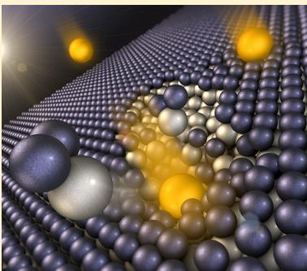
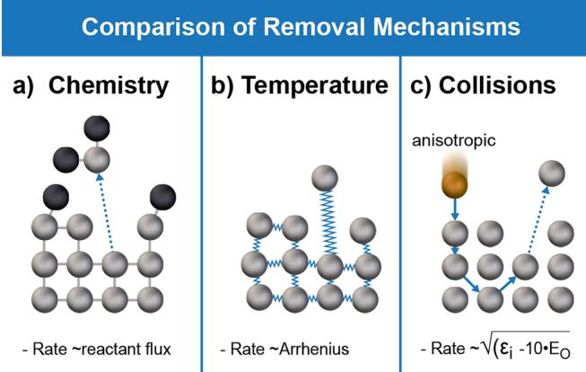
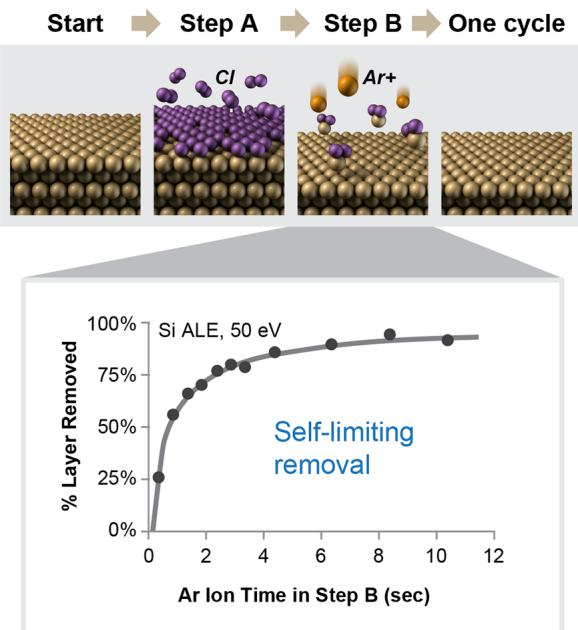
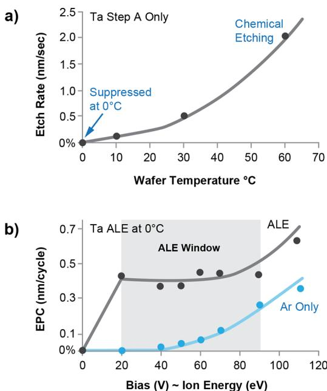
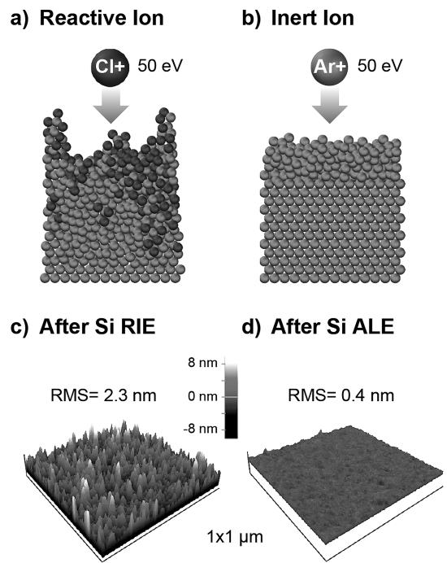
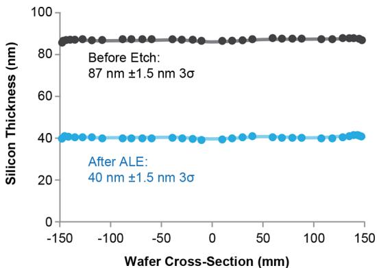
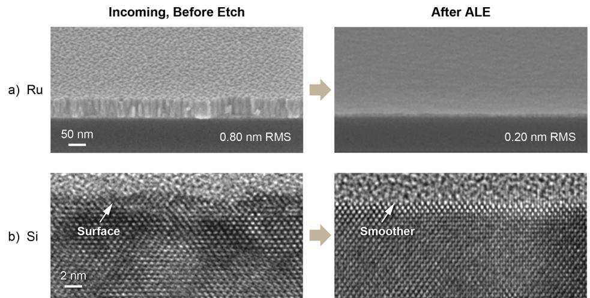

# Atomic Layer Etching: Rethinking the Art of Etch

Keren J. Kanarik,\* Samantha Tan, and Richard A. Cottscho

Lam Research Corporation, Fremont, California 94538, United States

ABSTRACT: Atomic layer etching (ALE) is the most advanced etching technique in production today. In this Perspective, we describe ALE in comparison to long- standing conventional etching techniques, relating it to the underlying principles behind the ancient art of etching. Once considered too slow, we show how leveraging plasma has made ALE a thousand times faster than earlier approaches. While Si is the case study ALE material, prospects are better for strongly bound materials such as C, Ta, W, and Ru. Among the ALE advantages discussed, we introduce an ALE benefit with potentially broad application—the ALE smoothing effect—in which the surface flattens. Finally, regarding its well- established counterpart of atomic layer deposition (ALD), we discuss the combination of ALE and ALD in tackling real world challenges at sub- 10 nm technology nodes.

Ech has a noble history. Many centuries ago, etching was of kings and, in the 1600s, by artists such as Rembrandt to create intricate drawings. Lines were scratched through a resistant coating, and the metal underneath was dissolved upon exposure to acid solutions. Since the 1970s, the semiconductor industry has fabricated electronic circuits using a pattern- transfer approach that is remarkably reminiscent of the early artform. Only, now, the patterns are 100 000 times smaller and are enabled by a wafer fab equipment industry worth well over \(\) 40$ billion per year. Modern equipment means we deposit various thin films instead of beeswax, print patterns with ultraviolet light instead of hand- held needles, and etch into the target material with plasma rather than an acid bath.

Plasma etch has become highly sophisticated over the past 40 years with advanced plasma sources and control systems. The industry increasingly relies on etch to define the shape, sharpness, and precision of features at technology nodes with sub-  $10 \mathrm{nm}$  dimensions. The desire to etch logic and memory The desire to etch logic and memory structures to within a few atoms on features less than 40 atoms wide has shifted our thinking toward the underlying surface mechanisms.

structures to within a few atoms on features less than 40 atoms wide has shifted our thinking toward the underlying surface mechanisms. The result is the most advanced etching technique in production today: atomic layer etching (ALE). Although disregarded as too slow in the 1990s, the recent adoption of ALE follows the path of its more well- established counterpart, atomic layer deposition (ALD), in production for over a decade. An historical overview of ALE can be found in ref 1. In this Perspective, we discuss the basic mechanisms behind ALE in an evolving story of making ALE faster, discovering new ALE benefits, and integrating ALE with ALD.

Toolbox of Etch Mechanisms. We start with a holistic view of etching. Microscopically, etching means that atoms are removed from a substrate by breaking bonds that attach them to their neighbors, which means overcoming an energetic barrier called the surface binding energy, or  $E_0$ . The  $E_0$  is an average energy, given that each individual atom has a barrier that depends on its specific position and orientation on the surface. For example, atoms residing at imperfections—kinks, corners, or protrusions—may require a different amount of energy to be removed than atoms on a flat plane. For most materials,  $E_0$  values range from 2 to  $12 \mathrm{eV}$ ; that of silicon (Si) is  $4.7 \mathrm{eV}$ . In principle, many different methods can be used to modify or overcome  $E_0$ , including those shown in Figure 1, as follows

(1) Chemistry: Surface reactions can form species that are more loosely bound to, and thus more easily removed from, the surface. For example, etching in an acid bath removes a metal (M) as  $2\mathrm{M(s)} + 2\mathrm{HCl:H_2O_2(l)}\rightarrow$ $2\mathrm{MCl(l)} + 2\mathrm{H}_2\mathrm{O(l)}$  . In the semiconductor industry, plasma is more commonly used as it dissociates gases into highly reactive radicals  $(\epsilon ,g,\mathrm{F}^{*})$  .Modification of the surface can enhance etching through chemisorption as the radicals transform the surface into volatile species:  $\mathrm{Si(s) + 4F^*(plasma)\rightarrow SiF_4(g)}$  .In this way, the new chemical bond alters the barrier to removal of a surface atom by providing a different pathway, now through desorption of the new species (Figure 1a). We call the energy barrier for desorption  $E_{\mathrm{des}}$  .For example, fluorination of Si reduces  $E_0$  of  $4.7\mathrm{eV}$  to  $E_{\mathrm{des}}< 0.5$  eV, such that  $\mathrm{SiF_4(g)}$  desorbs at room temperature. Chemical etching tends to be transport-limited, meaning

  
Figure 1. Comparison of different methods to overcome the surface binding energy,  $E_{0}$ , including via (a) chemical bonds that lower  $E_{0}$ ; (b) kinetic energy from vibrations; and/or (c) kinetic energy from collisions ( $\epsilon_{\mathrm{i}} =$  ion energy).

that the etch rate is a strong function of reactant flux. It is normally isotropic, absent a crystallographic dependence.

(2) Temperature: Vibrating surface atoms will sublime if their kinetic energy overcomes  $E_{0}$  (Figure 1b). For example, Si sublimes above  $\sim 1500^{\circ}\mathrm{C}$ , too hot for electrical devices. Lower surface temperatures suffice with chemically reduced  $E_{\mathrm{des}}$ . For thermally induced etching, the etch rate depends exponentially on temperature according to the Arrhenius law. The typical substrate temperature operating range is  $-20$  to  $150^{\circ}\mathrm{C}$ . Thermal etching is isotropic, absent crystallographic dependencies.

(3) Collisions: A high-energy object hitting the surface can eject an atom if, through the transfer of momentum, the atom accumulates enough kinetic energy in the upward direction to overcome  $E_{0}$  (Figure 1c). In the semiconductor industry, the most commonly used bombarding object is an ion accelerated perpendicular to the surface. Traveling at speeds of greater than  $10 \mathrm{~km / s}$ , the ion upon impact produces a "hot spot" of  $\sim 3000 \mathrm{~K}$ . Without the assistance of chemical reactions, the subsequent ejection of atoms is known as physical sputtering. For Si, the observed sputtering threshold ion energy is  $\sim 50 \mathrm{eV}$ , or roughly 10 times its  $E_{0}$  of  $4.7 \mathrm{eV}$ . That much bombarding energy is needed because, statistically, a molecule being removed must rebound up and away from the surface, and this is not usually caused by the initial ion strike. Instead, the impact energy dissipates as roughly 100 atoms bounce off of each other during the picosecond time scale collision cascade. With chemically reduced  $E_{\mathrm{des}}$ , the mechanism is referred to as reactive sputtering, and the threshold ion energy is lowered to  $16 \mathrm{eV}$  for chlorinated Si. Either way, the removal rate depends on the square root of the ion energy above a threshold. This mechanism is anisotropic, or directional, as only atoms near the impact site are affected.

We made a point of describing etch mechanisms as anisotropic versus isotropic because most pattern transfers require directionality to maintain critical dimensions, and thus, directional etching is the main focus of this Perspective. Note that in addition to the three methods highlighted here, removal can also be induced by other energy sources, such as exposure to electrons and photons. Also, often multiple methods are being used at the same time (intentionally or not), as discussed in the section on conventional etching.

# Most pattern transfers require directionality to maintain critical dimensions; thus, directional etching is the main focus of this Perspective

The basic concept behind ALE is to break down the etch into two or more individually controlled, self- limiting, surface reaction steps that remove material (i.e., overcome  $E_{0}$ ) only when run in sequence. You then switch back and forth between the steps. The ALE concept is simple, and this makes the chemistry and physics easier to understand. Since the first ALE report in 1987, there have been many implementations. Almost all are built on combinations of the energies in our toolbox, targeting one individual surface reaction per step.

ALE Example. Here we describe the directional Si ALE case study. It is based on two successive steps, Step A and Step B, that occur in a cycle repeated until the desired number of layers are removed (Figure 2). To start, picture a clean and flat surface, where each surface atom has at least one bond primed for reaction.

  
Figure 2. Simplified cartoon of directional Si ALE showing Steps A (modification of surface via chlorination to form  $\mathrm{SiCl}_{x}$ ) and B (desorption of the modified layer via Ar ion energy). The data shows self-limiting removal of the chlorinated Si layer in Step B at  $50 \mathrm{eV}$  as a function of step time.

In Step A, the purpose is to weaken the binding energy of the surface so that it is easier to remove than the bulk. In this case, we use a chlorine (Cl) bond. Chlorination is self- limiting and, ideally, there should be no etching in this step. For chlorinated Si, room temperature is typically used to suppress thermal desorption, which is known to occur at  $650^{\circ}\mathrm{C}$ . With plasma chlorination, an operating regime is chosen to minimize

premature etching by ions  $\mathrm{Cl^+}$  and  $\mathrm{Cl}_2^+$  ) or photons released in the plasma. At the end of this step,  $\mathrm{Cl}$  is purged from the reaction chamber so that it is not available for surface modification in the subsequent step. This is critical as crosscontamination may lead to loss of atomic- scale precision.

In Step B, we etch Si by removing the  $\mathrm{SiCl}_x$  layer. Desorption is thought to occur when Cl from one  $\mathrm{SiCl}_2$  unit shifts to its neighboring  $\mathrm{SiCl}_2$  unit and evaporates as  $\mathrm{SiCl}_2$  the smallest volatile silicon chloride), as in  $2\mathrm{SiCl(s)}\rightarrow \mathrm{Si(s)}+$ $\mathrm{SiCl}_2(\mathrm{g})$  .Thus, the barrier has been effectively reduced from an  $E_0$  of  $4.7\mathrm{eV}$  for pure Si to  $E_{\mathrm{des}}\approx 2.3\mathrm{eV}$  for  $\mathrm{SiCl}_2$  7 The idea is to operate within an ALE window: provide enough energy to overcome  $E_{\mathrm{des}}$  but not  $E_0$  in order to keep the unmodified Si intact once the chlorinated silicon layer is removed. If temperature were used to provide the desorption energy in Step B, it may take many years at room temperature. It can be sped up by raising the temperature according to the Arrhenius relation, per the mechanism described in Figure 1b, within the window from  $650^{\circ}\mathrm{C}$ $\mathrm{SiCl}_2$  removal above  $E_{\mathrm{des}}$  to  $1500^{\circ}\mathrm{C}$  (Si removal above  $E_0$  ). However, to make removal directional and stay within device thermal budgets, we instead use Ar ions from a plasma source, per the mechanism described in Figure 1c. The experimental data in Figure 2 shows that the removal step is self- limiting with  $50~\mathrm{eV}$  ions. The etching stops once the chlorine is consumed, completing one ALE cycle.

The amount of material removed per cycle is the "etch per cycle", or EPC. For reference, the interatomic distance of  $(1,0,0)$  Si layers is  $0.136\mathrm{nm}$  .With the simplest case of Si attaching to one Cl and rearranging to the desorption product  $\mathrm{SiCl}_2,$  theoretically,  $\mathrm{EPC} = 0.068 \mathrm{nm}$  .This is consistent with experimentally observed  $\mathrm{EPC} = 0.067 \mathrm{nm}$  in thermal Si ALE with  $\mathrm{Cl}_2$  gas.11 Use of plasma in our case study results in more effective chlorination with  $\mathrm{EPC}\approx 0.5 \mathrm{nm}_i$  roughly a Si unit cell length. The thickness of that layer is presumably determined by the depth to which the plasma can penetrate. While EPC is important for etch resolution and productivity, it is the selflimiting steps that define ALE and are most beneficial.

We have come a long way in making ALE faster compared to a decade ago, when reported cycle times for Si ALE took nearly  $5\mathrm{min}$  .Dividing EPC by cycle time, this corresponds to a Si removal rate of  $\sim 0.01 \mathrm{nm / min}$  12 To understand how rates can be improved, the time needed for each step is considered. The saturation time in Step A is approximated using LangmuirHinshelwood kinetics, where the fractional surface coverage  $(\theta)$  saturates asymptotically as the available sites disappear, depending on the partial pressure of the Cl reactant  $(P)$  and the chemisorption rate constant  $(K)$  .As a function of time, we use  $\theta (t) = 1 - \exp (- K\cdot P\cdot t),$  in which the time to  $97\%$  surface coverage is  $t_{97\%} = \left(\ln 0.03\right) / (K\cdot P)$  .With thermal adsorption, saturation for  $\mathrm{Cl}_2$  gas was reported to occur in  $\sim 10$  s at  $P = 0.5$ $\mathrm{mT},^{12}$  giving  $K = 0.7(\mathrm{mT}\cdot \mathrm{s})^{- 1}$  . The speed of this step was limited by the time needed for the  $\mathrm{Cl}_2$  molecules to dissociate, which must occur before chlorine can react with a dangling silicon bond at the film surface. In contrast, the use of plasma provides  $\mathbf{Cl}^*$  radicals that increases  $K$  by 2 orders of magnitude, to 81  $(\mathrm{mT}\cdot \mathrm{s})^{- 1}$  13 Using a typical  $P = 50~\mathrm{mT}$  and assuming full dissociation to  $\mathbf{Cl}^*$  radicals by the plasma, surface saturation should theoretically occur on a flat exposed surface in  $\sim 1$  ms. This step is not usually rate- limiting with plasma.

Desorption is ordinarily the rate- limiting step. In this step, we use  $t_{97\%} = \left[(\ln 0.03)\cdot \bar{d}\right] / (Y\cdot F),$  where  $F$  is the ion flux,  $Y$  is the ion yield, and  $d$  is the density of surface atoms removed. For Si ALE,  $Y$  is estimated to be 0.1 per ion at  $50\mathrm{eV}$  from molecular dynamics (MD) simulations. In other words, statistically, only a fraction of ions are productive at this energy, and a high ion dose is required to fully remove the chlorinated layer. The rate is limited by the ion flux, which can be  $10^{13}$  ions  $\mathrm{cm}^2$  on laboratory beam equipment, requiring several minutes to complete. Fortunately, the ion flux in our test on Lam's Kiyo equipment was higher at  $F = 2\times 10^{16}$  ions  $\mathrm{cm}^2$  at  $50\mathrm{eV}$  Using  $d = 2.5\times 10^{15}$  Si atoms  $\mathrm{cm}^2$  from EPC  $= 0.5 \mathrm{nm}_i$  we estimate a saturation time of  $4.4~\mathrm{s}$  0.07 min) for Step B in our test case. This is consistent with the data shown in Figure 2. Overall, this desorption time would translate into an average removal rate for plasma- enhanced ALE of almost  $10~\mathrm{nm / min}$  ignoring switching time. This sample calculation shows that plasma has been critical to making ALE faster than earlier tests (by up to 3 orders of magnitude in our example), and there is still room for further improvement.

# ALE is useful not because it is perfect but because it offers more control than conventional etching techniques.

It is also important to know how well the ALE process is performing. Controlling exactly which reactions happen and do not happen in Steps A and B is not trivial. Etch should occur only when running the steps in sequence, which means that we need to operate in a specific energy window in each step. In Step A, we want enough energy present to adsorb  $(>$  associated barrier called  $E_{\mathrm{ads}})$  without desorbing  $(< E_{\mathrm{des}})$  while in Step B we want enough energy to desorb  $(>E_{\mathrm{des}})$  without removing bulk material  $(< E_0)$  .It can be difficult to avoid extraneous etching induced by photons or enhanced by incomplete purging between steps. One common indicator to show control of the ALE steps is a saturation test (shown in Figure 2) as this determines the extent to which the steps are self- limiting. As another indicator of how close a process is to the ALE limit, we previously proposed a simple parameter called ALE synergy, defined as

$$
\mathrm{ALESynergy(\%)} = \frac{\mathrm{EPC} - (\alpha + \beta)}{\mathrm{EPC}}\times 100
$$

where  $\alpha$  represents the amount of unintended etching in Step A and  $\beta$  represents the amount of sputtering of unmodified material in Step B. We regularly use this parameter to optimize our processes. On blanket test wafers, we aim for greater than  $80\%$  synergy and often approach  $100\%$  In our Si ALE test, the synergy was  $90\%$  due to some residual etching in Step A and sputtering in Step B. Synergy could be improved by lowering the ion energy in Step B, although the saturation time will increase with lower Y. Often, sacrificing some synergy for throughput is a reasonable trade- off. We emphasize that ALE is useful not because it is perfect but because it offers more control than conventional etching techniques.

ALE Prospects in Materials beyond Silicon. Until now we've discussed only Si. Yet there is an abundance of materials involved in chipmaking, as well as other domains like batteries, solar, and aerospace. To date, roughly 30 materials have been reportedly etched using ALE techniques, including Ge, C,  $\mathrm{SiO}_2,$ $\mathrm{Al}_2\mathrm{O}_3,$ $\mathrm{TiO}_2,$  ZnO, SiN, GaN, GaAs, GaSb, Cu,  $\mathrm{Mo}_2,$  W, graphene, and polymers. The question is: how does ALE

  
Figure 3. Color map of surface binding energies  $(E_0)$  of elemental materials, from values independently given by Yamamura and Tawara. Materials with high  $E_0$  values, such as carbon and the refractory metals, are most likely to exhibit high synergy in directional ALE.

work in other material systems as compared to the ALE case study?

We recently made some predictions by comparing the energetic barriers for the directional ALE scheme. High synergy is understood as operating the ALE process within the energy windows that satisfy the inequality  $E_{\mathrm{ads}}< E_{\mathrm{des}}< E_0$  In the Si ALE example,  $E_{\mathrm{ads}} = 0 \mathrm{eV}$ $E_{\mathrm{des}} = 2.3 \mathrm{eV}$  and  $E_0 = 4.7 \mathrm{eV}$  Generally, the farther apart the energy barriers are spaced, the easier it is to control the intended surface reaction. We often approximate  $E_{\mathrm{ads}}$  as zero when adsorption is fast due to the use of plasma. On the other hand, for maximal control and reactant choice, we want  $E_0$  to be large, i.e., materials with strong lattice binding that makes them resistance to heat, wear, and sputtering. Figure 3 shows a color map of  $E_0$  values for monatomic solids, from which we note the following, specifically for directional ALE:

(1) Although Si is the most studied material, it is not the most favorable for ALE due to mediocre value of  $4.7 \mathrm{eV}$  
(2) While materials with low  $E_0$  e.g., Ge, Ag readily etch due to weaker bonding between the atoms, it is more challenging to control etching in such materials (i.e., smaller window for high synergy). 
(3) The best elemental candidate materials for high-synergy ALE are those with  $E_0 > 6 \mathrm{eV}$ . These include elemental materials of C and refractory metals such as W, Ta, Mo, Re, and Ru. Coincidentally, diamond was the first reported material studied with ALE. Refractory metals are notable because they have not, to date, been addressed to any significant extent in the ALE literature. 
(4) The analysis should be extendable to binary compounds. Specifically, we predict that oxides (e.g.,  $\mathrm{ZrO_2}$ ,  $\mathrm{In}_2\mathrm{O}_3$ ), nitrides (e.g., BN, GaN, TaN), and carbides (e.g.,  $\mathrm{B}_4\mathrm{C}$ ) with high  $E_0 > 6 \mathrm{eV}$  make good candidate materials for directional ALE and its associated benefits.

For a new material demonstration, we chose to study tantalum  $(\mathrm{Ta})$  based on our prediction of near- perfect ALE synergy due to high  $E_0 = 8.1 \mathrm{eV}$ , nearly twice as high as the  $4.7 \mathrm{eV}$  for Si. To compare to Si ALE, we likewise used  $\mathrm{Cl}_2$  plasma in Step A and Ar ions in Step B. We estimate  $E_{\mathrm{des}} \approx 0.6 \mathrm{eV}$  based on the literature value for the thermal desorption temperature of  $- 23^{\circ}\mathrm{C}$  for the etch product  $\mathrm{TaCl}_5$ , using the Arrhenius law and proportionality to the corresponding Si values of  $650^{\circ}\mathrm{C}$  and  $E_{\mathrm{des}} = 2.3 \mathrm{eV}$ . The markedly lower  $E_{\mathrm{des}}$  means that  $\mathrm{Cl}$  etches  $\mathrm{Ta}$  at room temperature. Fortunately, thermally induced desorption in Step A can be suppressed by simply reducing the temperature to  $0^{\circ}\mathrm{C}$ , as shown in Figure

4a. In Figure 4b, the ion energy is scanned at  $0^{\circ}\mathrm{C}$  to locate the ALE window, the plateau where the etch is relatively

  
Figure 4. Data for (a) the Ta etch rate in  $\mathrm{Cl}_2$  plasma (i.e., Step A only) as a function of temperature, showing that etching is suppressed at  $0^{\circ}\mathrm{C}$ . (b) Etch per cycle (ETC) as a function of ion energy for the Ta substrate at  $0^{\circ}\mathrm{C}$  for ALE (in gray), averaged over 40 full ALE cycles, and for Ar sputter (i.e., Step B only) (in blue).

independent of ion energy. At energies above the window, pure physical sputtering of the raw material dominates as the ion energy overcomes  $E_0$ .

As predicted, Ta ALE has a relatively large ALE window width of  $70 \mathrm{eV}$ , which correlates with the large  $7.5 \mathrm{eV}$  difference between  $E_0$  and  $E_{\mathrm{des}}$ . For reference, the width is  $20 \mathrm{eV}$  in Si ALE and  $40 \mathrm{eV}$  in amorphous carbon ALE. Characteristic of a high- synergy ALE process, EPC was self- limiting in time (saturating in under  $1 \mathrm{s}$  in Step B). Overall, Ta ALE appears to be a model ALE system, more so than Si. It also offers proof that our ALE predictions for new materials is generally valid and that there is good reason to believe that ALE is achievable for a variety of materials, from semiconductors to dielectrics to metals.

Comparison of ALE to Conventional Etch. Conventional etching refers to a continuous and simultaneous process, in which multiple surface reactions occur for the duration of the

Ta ALE appears to be a model ALE system and also offers proof that our ALE predictions is generally valid and there is good reason to believe that ALE is achievable for a variety of materials, from semiconductors to dielectrics to metals.

process, i.e., combining Steps A and B. It can refer to any medium of etching, whether it is liquid (e.g., acid bath), gas, or plasma. The most common directional etching today is called reactive- ion etching (RIE),16 in which literally hundreds of competing plasma/surface interactions are at play simultaneously, with chemicals both dissociating into radicals and ionizing into high- energy reactive ions. RIE typically uses multiple chemistries (e.g.,  $\mathrm{CF}_4$ ,  $\mathrm{HBr}$ ,  $\mathrm{O}_2$ ,  $\mathrm{CH}_3\mathrm{F}$ ,  $\mathrm{SF}_6$ ) in a plasma mixture with high ion energies ( $\sim 1000$  eV) for directionality. The rate tends to be transport- limited, depending strongly on delivery of neutral and/or ion fluxes. Because removal is proportional to exposure time, process variability at every length scale may be compromised as fluxes inevitably vary due to gradients in the reaction chamber, along the wafer, within the die, and in the feature. The complexity is compounded by the simultaneous deposition that accompanies the etching for side- wall passivation. Etch control is further degraded by  $\sim 5 - 20$  nm of disordered surface left behind, called a selvage layer, due to the presence of reactive ions (Figure 5a). In short, RIE is fast compared to ALE, but it does not allow atomic precision control.

  
Figure 5. Top images are schematics showing Si bombarded by (a) reactive ions and (b) inert ions at the same energy, based on computational studies by Humbird, 2004. The lower images show AFM data on Si ALE to compare (c) RIE  $\mathrm{Cl}_2 / \mathrm{Ar}$  plasma at  $50~\mathrm{eV}$  and (d) ALE (alternating  $\mathrm{Cl}_2$  plasma and Ar ions at  $50~\mathrm{eV}$

The way that ALE processes are designed is different from that for RIE. Instead of balancing multiple interacting reactions, we think stepwise about exactly what each step should do to the surface. The primary benefit of ALE, due to the self- limiting behavior, is that all exposed surfaces etch the same amount, i.e., repeatability. To demonstrate, Figure 6

  
Figure 6. Uniformity across a blanket silicon wafer before and after the ALE process. Reproduced with permission, copyright 2013.

shows that uniformity is maintained across a blanket silicon wafer by the Si ALE process.18 Thus, to the extent that it is ideal, ALE reduces dependence of the etch amount on the location and aspect ratio—important to reducing process variability. Self- limiting steps also promote a flatter etch front to help make sharper, better- defined features, with less corner residue.19 As the focus on the ALE field is relatively recent (note: prior to 2013 there were only a small handful of ALE papers published per year), new benefits of ALE are still being discovered. We highlight two that are still in the early stages of understanding—improved material selectivity and smoother surfaces—discussed next.

# ALE reduces dependence of the etch amount on the location and aspect ratio.

Improving Material Selectivity. Material selectivity means etching one material X preferentially while avoiding etching another material Y, commonly expressed as the ratio X:Y. The need for selectivity is nearly synonymous with etching as selectivity to the mask has been required since the earliest days of etching for pattern transfer. The basic concept of selectivity is overcoming the  $E_0$  of material X but not Y. The most common method is with chemicals that react with one material more than the other. While some wet etching processes have inherent chemical selectivity greater than 1000:1, high selectivity can be elusive with RIE when directionality is required.

To illustrate, consider etching Si  $(E_0 = 4.7 \mathrm{eV})$  versus  $\mathrm{SiO}_2$ $(E_0 = 5.0 \mathrm{eV})$ , which is a  $0.3 \mathrm{eV}$  difference in surface binding energies—a small window. Adding Cl widens the window by reducing the barrier from  $E_0 = 4.7 \mathrm{eV}$  to  $E_{\mathrm{des}} = 2.3 \mathrm{eV}$  in Si, with less chemical influence on  $\mathrm{SiO}_2$ , which is already oxidized. The selectivity window width is now closer to  $2.7 \mathrm{eV}$ , making it easier to achieve high selectivity. However, in practice, even within the selectivity window, selectivity quickly breaks down as the selvage layer in RIE degrades the surface state of material Y. In our test with RIE, the maximum selectivity was

only 30:1.  $^{20}$  Selectivity can be increased by delaying the time for which material Y does not etch (defined as the incubation time). We find that ALE offers an advantage in increasing the incubation time, resulting in selectivity above 1000:1. We postulate that the higher selectivity in ALE is due to minimization of the sewage layer with use of inert versus reactive ions (Figure 5a,b), which slows degradation of the surface state. While ALE can increase selectivity, breakdown eventually occurs, and we note that  $\mathrm{SiO}_2$  ultimately etched after 70 cycles of ALE. To summarize, chemical selectivity is obtained by widening and operating within a selectivity window and by maximizing incubation time.

The way ALE processes are designed is different from conventional etching techniques. Instead of balancing multiple interacting reactions, we think stepwise about exactly what each step should do to the surface.

In many cases, inherent chemical selectivity may be difficult to achieve. A more complex strategy in RIE involves deposition to protect only material Y from exposure to etchants. Consider the reverse selectivity of  $\mathrm{SiO}_2$ :Si, which was studied in RIE by Coburn in 1979.  $^{21}$  Using  $\mathrm{CF}_4$ - based plasma chemistry,  $\mathrm{SiO}_2$  etches via:  $\mathrm{SiO}_2(\mathrm{s}) + \mathrm{CF}_4(\mathrm{g}) \rightarrow \mathrm{SiF}_4(\mathrm{g}) + \mathrm{CO}_2(\mathrm{g})$  as the presence of  $\mathrm{O}$  in  $\mathrm{SiO}_2$  consumed in the carbon, allowing the etch to continue. However, on Si, the excess carbon preferentially builds up on the Si surface to form a SiC- containing film, which helps blocks Si etching. As you might imagine, having both deposition and etching at the same time is complicated. Again, ALE can help when selectivity is deposition- enhanced by keeping the steps separated, integrating with ALD, and keeping the selvage layer minimized.

As an application, consider the case of contact etching, where oxide is etched to enable subsequent metal deposition for connecting to the source, drain, and/or gate of the transistor. This is one of the most challenging etches because the contact must be formed between the gates without damaging them. This etch requires both directionality and selectivity of  $\mathrm{SiO}_2$ : SiN. In this case, a fluorocarbon film (e.g., from  $\mathrm{C}_4\mathrm{F}_8$  plasma) preferentially deposits over SiN and thereby protects it. The  $\mathrm{SiO}_2$  ALE system using fluorocarbon deposition was initially proposed based on computational studies in 2007  $^{22,23}$  and then validated in the laboratory in 2014.  $^{24}$  Using this type of ALE has shown to increase selectivity by a factor of 2 over RIE while maintaining directionality and layer- by- layer removal. What is the significance of the improved selectivity? It was an important factor for ALE being adopted into production at the 10 nm node in 2016.  $^{25}$

ALE Smoothing Effect. We now focus on the surface topography left behind after the etch, which will define the sharpness of the interfaces of the final device. Surface roughness is generally undesirable, especially as it becomes a large fraction of the size of printed features. Rough surfaces add variability that hurts device performance.  $^{26}$  It can degrade electrical resistivity in metals due to electron scattering. Roughness can limit the formation of thin films and/or cause voids as films are stacked. In critical pattern- transfer applications, smoothness of less than 1 nm is required. This is challenging because roughness at the atomic scale is often stochastic in nature and compounded by all of the processes involved—deposition, lithography, and etch.

While smoothness should be thermodynamically favorable in terms of reducing overall surface energy, there are several mechanisms that hinder flattening of the surface. In fact, at the etch front, many RIE regimes tend to roughen the surface. The reasons are not always understood. It may be due to stochastic effects from temporal and spatial nonuniformities in the reactant flux, ion scattering, and micromasking of tops of features from etch inhibitors.  $^{26}$  Also, grain boundaries in a material tend to etch faster due to weakness of the structure. The formation of a selvage layer of about 5 nm can itself account for roughness on the same scale, as shown in Figure 5a,c. In contrast, one of the hallmarks of ALE is maintaining smoothness of the etched film, as the surface morphology replicates downward with each removed layer. Comparison of panels c and d in Figure 5 shows that we observe about an order of magnitude smoother surfaces for ALE relative to RIE.

  
Figure 7. Examples of the ALE smoothing effect. Images show the surface before and after ALE in (a) tilt SEM with Ru ALE, 100 cycles and (b) side-view HR-TEM with Si ALE, 50 cycles.

Surprisingly, beyond maintaining surface topography, we observe that ALE often improves surface smoothness. The effect can be particularly dramatic, as with  $75\%$  smoothing of  $\mathrm{Ru}$ $(E_0 = 6.8 \mathrm{eV})$  which after 100 ALE cycles went from an initial roughness of 0.80 to  $0.20 \mathrm{nm}$  RMS (root- mean- squared, as determined by AFM over  $1\times 1\mu \mathrm{m}$  Figure 7a).Figure 7b also shows an example of Si at high resolution, in which the incoming surface has visual structural disorder and roughness that is reduced by ALE. Another example is C  $(E_0 = 7.4 \mathrm{eV},$  estimated as graphitic carbon), which we observe smoothing from an incoming roughness of 0.39 to  $0.28 \mathrm{nm}$  RMS after C ALE in the system reported in ref 4. In addition, the Ta ALE  $(E_0 = 8.1 \mathrm{eV})$  example described earlier smoothed about  $33\%$  from 1.04 to  $0.70 \mathrm{nm}$  RMS after 40 cycles. The effect is found in binary compounds, such as in  $\mathrm{GaN}$ $(E_0 = 8.6 \mathrm{eV})$  in which RMS improved from an initial 0.8 to  $0.6 \mathrm{nm}$  an order of magnitude smoother than the  $4.0 \mathrm{nm}$  RMS after RIE with the same etched depth.27 Some smoothing has also been observed in other types of ALE, such as isotropic ALE (discussed later), in which X- ray reflectivity measurements indicate that the of  $\mathrm{Al}_2\mathrm{O}_3$  surface was smoothed  $50\%$  by about 100 ALE cycles.28 Overall, the pervasive effect observed across many different material systems leads us to suspect that ALE smoothing is the rule rather than an exception.

Although largely overlooked in previous ALE literature, this smoothing phenomenon may be inherent to many high- synergy, self- limiting ALE processes. As such, it is expected to be particularly evident in high  $E_0$  materials, such as those cited above. We postulate several reasons for the effect, focusing on directional ALE. In Step A, a small radius of curvature can have adsorption sites with higher reactivity to Cl, and this may preferentially etch sharp corners faster (for example, if Si bonds to  $2 - 3 \mathrm{Cl}$  atoms at protrusions instead of  $1 \mathrm{Cl}$  on flat surfaces), Furthermore, in Step B, computational studies have shown that  $50 \mathrm{eV}$  inert ions, in the absence of reactants, can flatten surfaces through amorphization/recrystallization (Figure 5b) as ion energy promotes diffusion of surface atoms. In contrast, diffusion of the surface atoms is hindered by strong Cl bonds attached to the Si in RIE. In support, Park et al. report that roughness is induced, rather than improved, if the ALE process only partially removes chlorine, more akin to a RIE process. We speculate that the smoothing effect will prove to be an important ALE benefit for applications both in and beyond the semiconductor industry.

We speculate that the smoothing effect will prove to be an important ALE benefit for applications both in and beyond the semiconductor industry.

ALE in Relation to ALD. As we've pointed out, the need for directionality is integral to most etching applications in pattern- transfer today, and it is achieved using accelerated ions. In RIE, unintentional isotropic etching reduces pattern- transfer fidelity. This is addressed by adding passivating gases into the plasma that protect sidewalls. Directionality in small features requires an extremely high level of directionality, and even with ALE, there may still be undesirable secondary reactions (in part due to longer saturation times needed in tight features). Thus, we have begun adding ALD cycles to protect the sidewalls. In this sense, deposition will likely remain integral to forming our most intricate patterns by protecting areas that we do not want to etch.

While we focused on directional ALE, some etch applications require isotropy. One example is forming nanowires for future transistors. In this case, isotropic etching is necessary because ion bombardment would warp the shape of the wire by hitting the top and not the bottom. We've already showed one way of achieving isotropic ALE: by using temperature in Step B of Si ALE. To tackle the isotropic ALE challenge at more moderate temperatures, a new class of ALE was discovered a few years ago using dry chemicals in both Steps A and B, as described by Lee and George. An example is  $\mathrm{Al}_2\mathrm{O}_3$  ALE using alternating exposure to HF vapor and trimethyl aluminum (TMA). The chemicals are the same as those used in ALD, showing an underlying parallelism between deposition and removal processes.

Another area where ALD and ALE are being integrated is selective deposition. It has become apparent that selective deposition is also desirable to potentially change the way patterning is done, to allow masks or features to be grown upward. The strategies for selectivity in deposition are analogous to those in etching, with similar incubation problems causing selectivity breakdown. In the same way that etch relies on deposition, a promising approach for selective deposition is to use ALE to etch back extraneous nucleation sites. This active area of research is yet another example of the expected integration of ALE and ALD. In the future, we will continue to deposit to etch and will also etch to deposit.

In summary, ALE is the most advanced etch technique in volume manufacturing. Once thought too slow for commercial viability, cost- effective solutions have found their way into volume production. As RIE reaches its fifth decade, its drawbacks have become apparent. ALE offers better control by isolating steps in time and switching between the steps in a repeatable cycle. Control over which reactions happen, and when and where they happen, improves uniformity, the ability to deal with high- aspect- ratio features, selectivity, and smoothing. The ALE and ALD combination will help to circumvent the limitations of lithography. As we look to the future, ALE lies at the frontier of our ability to etch at the atomic scale as we continue to advance the ancient art of etch.

# AUTHOR INFORMATION

# Corresponding Author

*E- mail: keren.kanarik@lamresearch.com.

# ORCID

Keren J. Kanarik: 0000- 0002- 2526- 8500

# Notes

The authors declare no competing financial interest.

# Biographies

Keren J. Kanarik received her Ph.D. in Physical Chemistry from U.C. Berkeley. She is a senior director at Lam Research, where she has worked  $>15$  years on plasma etching and deposition. She authored the ALE field's overview in 2015, co- founded the ALE Workshop, and co- chaired ALE2017.

Samantha Tan received her Ph.D. in Analytical Chemistry from U. Alberta in Canada. She is a managing director at Lam Research, where she leads ALE development as head of the Process Interaction group. Prior to joining Lam, she co- founded ChemTrace Corp. She has been in the semiconductor industry for  $>25$  years.

Richard A. Gottscho received his Ph.D. in Physical Chemistry from MIT. He is currently CTO of Lam Research, where he has served in various executive levels including head of the Global Product Group. Prior to joining Lam in 1996, he was a Department Head of Bell Laboratories. In 2016, Rick was inducted into the National Academy of Engineering.

# ACKNOWLEDGMENTS

The authors thank our co- workers in the ALE team at Lam.

# REFERENCES

(1) Kanarik, K. J.; Lill, T.; Hudson, E. A.; Sriraman, S.; Tan, S.; Marks, J.; Vahedi, V.; Gottscho, R. A. Overview of Atomic Layer Etching in the Semiconductor Industry. J. Vac. Sci. Technol., A 2015, 33, 020802. 
(2) George, S. M. Atomic Layer Deposition: An Overview. Chem. Rev. 2010, 110, 111-131. 
(3) Puurunen, R. L. Surface Chemistry of Atomic Layer Deposition: A Case Study for the Trimethylaluminum/Water Process. J. Appl. Phys. 2005, 97, 121301. 
(4) Kanarik, K. J.; Tan, S.; Yang, W.; Kim, T.; Lill, T.; Kabansky, A.; Hudson, E. A.; Ohba, T.; Nojiri, K.; Yu, J.; et al. Predicting Synergy in Atomic Layer Etching. J. Vac. Sci. Technol., A 2017, 35, 05C302. 
(5) Yamamura, Y.; Tawara, H. Energy Dependence of Ion-Induced Sputtering Yields From Monatomic Solids at Normal Incidence. At. Data Nucl. Data Tables 1996, 22, 149-253. 
(6) Tu, Y.-y.; Chuang, T. J.; Winters, H. F. Chemical Sputtering of Fluorinated Si. Phys. Rev. B: Condens. Matter Mater. Phys. 1981, 23, 823-835. 
(7) Sakurai, S.; Nakayama, T. Adsorption, Diffusion and Desorption of Cl Atoms on Si(111) Surfaces. J. Cryst. Growth 2002, 237-239, 212-216. 
(8) Athavale, S. D.; Economou, D. J. Molecular Dynamics Simulation of Atomic Layer Etching of Si. J. Vac. Sci. Technol., A 1995, 13, 966-971. 
(9) Shin, H.; Zhu, W.; Donnelly, V. M.; Economou, D. J. Surprising Importance of Photo-Assisted Etching of Si in Cl-containing plasmas. J. Vac. Sci. Technol., A 2012, 30, 021306. 
(10) Steinbruchel, C. Universal Energy Dependence of Physical and Ion-Enhanced Chemical Etch Yields at Low Ion Energy. Appl. Phys. Lett. 1989, 55, 1960-1962. 
(11) Imai, S.; Haga, T.; Matsuzaki, O.; Hattori, T.; Matsumura, M. Atomic Layer Etching of Si by Thermal Desorption Method. Jpn. J. Appl. Phys. 1995, 34, 5049-5053. 
(12) Park, S. D.; Lee, D. H.; Yeom, G. Y. Atomic Layer Etching of Si(100) and Si(111) Using Cl2 and Ar Neutral Beam. Electrochem. Solid-State Lett. 2005, 8, C1006-C109. 
(13) Herman, I. P.; Donnelly, V. M.; Cheng, C.-C.; Guinn, K. V. Surface Analysis during Plasma Etching by Laser-induced Thermal Desorption. Jpn. J. Appl. Phys. 1996, 35, 2410-2415. 
(14) Yoder, M. N. Flooding Diamond Surface with Pulse of Nitrogen Dioxide. U.S. Patent 4756794A, July 12, 1988. 
(15) Lemonds, A. M.; White, J. M.; Ekerdt, J. G. Surface Chemistry of  $\mathrm{TaCl}_5$  on Polycrystalline Ta. Surf. Sci. 2003, 527, 124-136. 
(16) Donnelly, V. M.; Kornblit, A. Plasma Etching: Yesterday, Today, and Tomorrow. J. Vac. Sci. Technol., A 2013, 31, 050825. 
(17) Graves, D. B.; Humbird, D. Surface Chemistry Associated with Plasma Etching Processes. Appl. Surf. Sci. 2002, 192, 72-87. 
(18) Kanarik, K. J.; Tan, S.; Holland, J.; Eppler, A.; Marks, J.; Gottscho, R. A. Moving Atomic Layer Etch from Lab to Fab. Solid State Technol. 2013, 56, 14. 
(19) Huard, C. M.; Zhang, Y.; Sriraman, S.; Paterson, A.; Kanarik, K. J.; Kushner, M. J. Atomic Layer Etching of 3D Structures in Si: Self-Limiting and Nonideal Reactions. J. Vac. Sci. Technol., A 2017, 35, 031306.

(20) Tan, S.; Yang, W.; Kanarik, K. J.; Lill, T.; Vahedi, V.; Marks, J.; et al. Highly Selective Directional Atomic Layer Etching of Si. ECS J. Solid State Sci. Technol. 2015, 4, N5010-N5012. 
(21) Coburn, J. W. In Situ Auger Electron Spectroscopy of Si and  $\mathrm{SiO}_2$  Surfaces Plasma Etched in  $\mathrm{CF}_4$ -H. Glow Discharges. J. Appl. Phys. 1979, 50, 5210-5213. 
(22) Rauf, S.; Sparks, T.; Ventzek, P.; Smirnov, V.; Stengach, A.; Gaynullin, K. G.; Pavlovsky, V. A. A Molecular Dynamics Investigation of Fluorocarbon Based Layer-By-Layer Etching of Si and  $\mathrm{SiO}_2$ . J. Appl. Phys. 2007, 101, 033308. 
(23) Agarwal, A.; Kushner, M. Strategies for Plasma Atomic Layer Etching; Techcon: Austin, TX, 2007. 
(24) Metzler, D.; Bruce, R. L.; Engelmann, S.; Joseph, E. A.; Ochkin, G. S. Fluorocarbon Assisted Atomic Layer Etching of  $\mathrm{SiO}_2$  Using Cyclic  $\mathrm{Ar / C_4F_8}$  Plasma. J. Vac. Sci. Technol., A 2014, 32, 020603. 
(25) Lam Research Corporation. https://investor.lamresearch.com/news-releases/news-release-details/lam-research-introduces-dielectric-atomic-layer-etching (Sept 2016). 
(26) Ono, K.; Nakazaki, N.; Tsuda, H.; Takao, Y.; Eriguchi, K. Surface Morphology Evolution During Plasma Etching of Si: Roughening, Smoothing and Ripple Formation. J. Phys. D: Appl. Phys. 2017, 50, 414001. 
(27) Ohba, T.; Yang, W.; Tan, W.; Kanarik, K. J.; Nojiri, K. Atomic Layer Etching of GaN and AlGaN Using Directional Plasma-Enhanced Approach. Jpn. J. Appl. Phys. 2017, 56, 06HB06. 
(28) Lee, Y.; George, S. M. Atomic Layer Etching of  $\mathrm{Al}_2\mathrm{O}_3$  Using Sequential, Self-Limiting Thermal Reactions with  $\mathrm{Sn(acac)}_2$  and Hydrogen Fluoride. ACS Nano 2015, 9, 2061-2070. 
(29) Park, S. D.; Oh, C. K.; Lee, D. H.; Yeom, G. Y. Surface Roughness Variation during Si Atomic Layer Etching by Cl Adsorption Followed by an Ar Neutral Beam Irradiation. Electrochem. Solid-State Lett. 2005, 8, C177-C179. 
(30) Feil, H.; Dieleman, J.; Garrison, B. J. Chemical Sputtering of Si Related to Roughness Formation of a Cl-Passivated Si Surface. J. Appl. Phys. 1993, 74, 1303-1309. 
(31) Kalanyan, B.; Lemaire, P. C.; Ananasov, S. E.; Ritz, M. J.; Parsons, G. N. Using Hydrogen to Expand the Inherent Substrate Selectivity Window During Tungsten Atomic Layer Deposition. Chem. Mater. 2016, 28, 117-126.