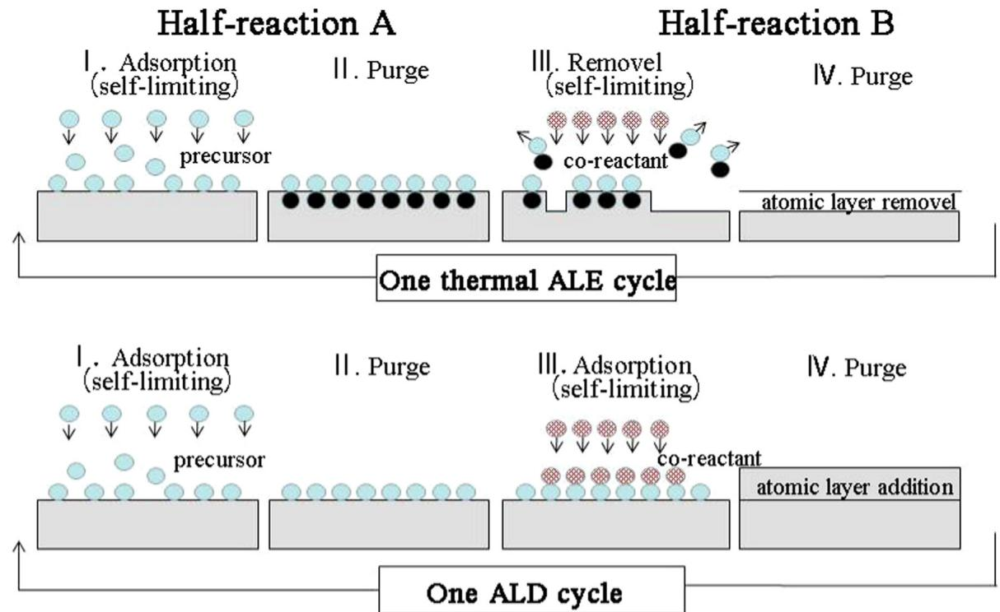
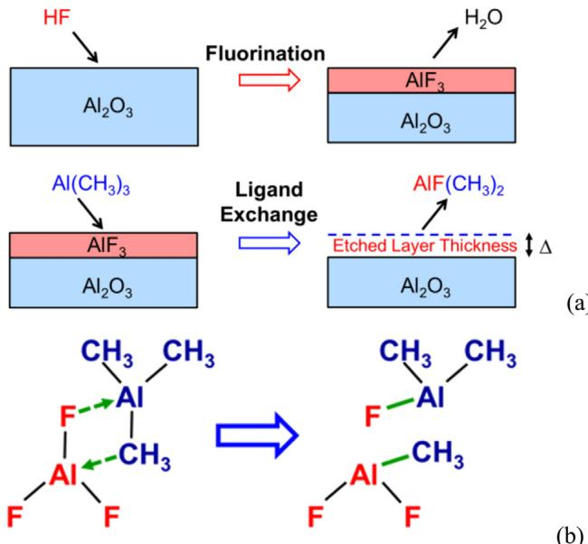
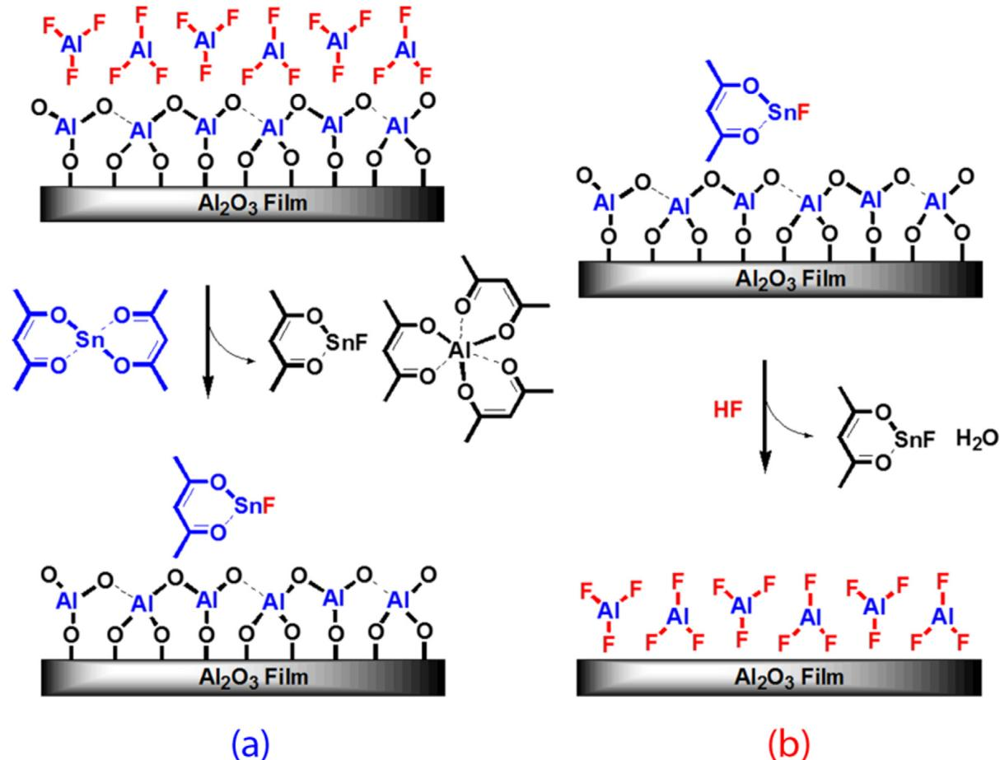
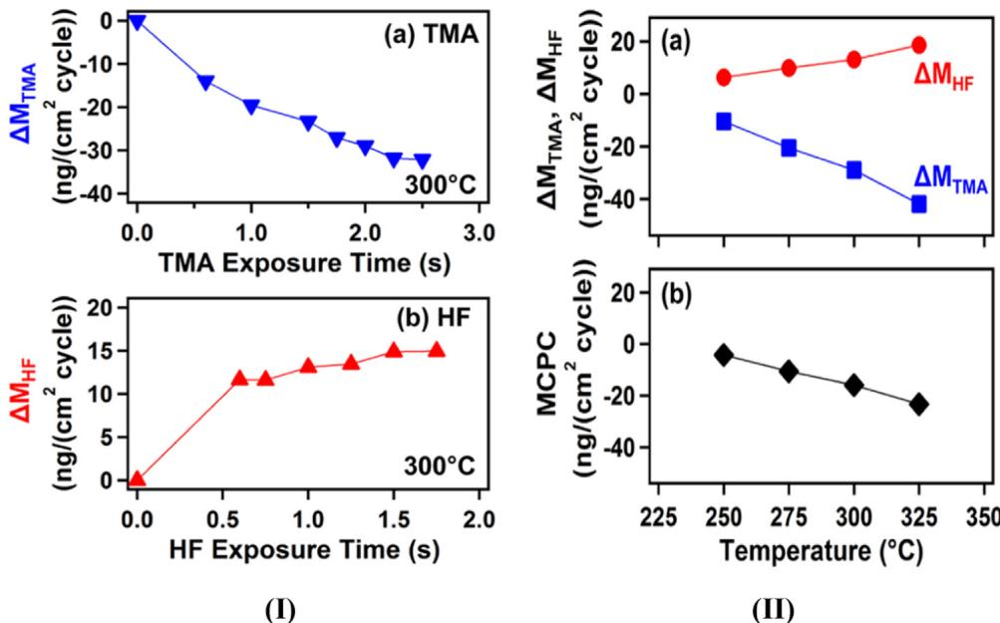
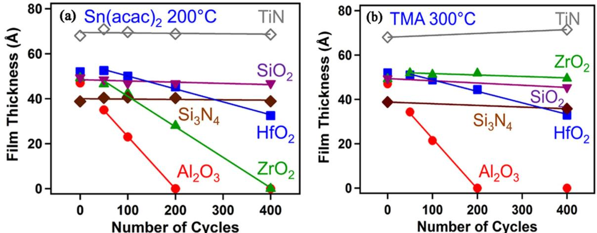
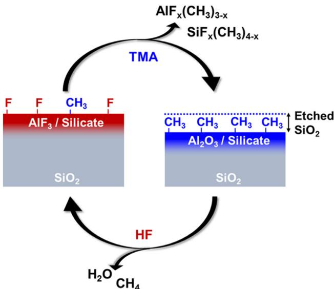
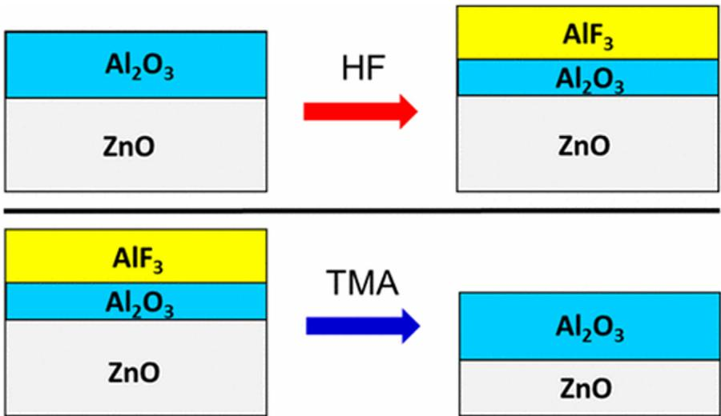
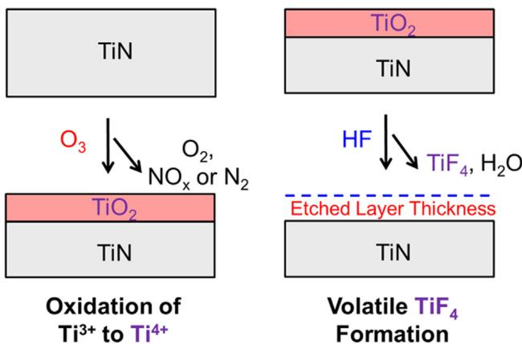
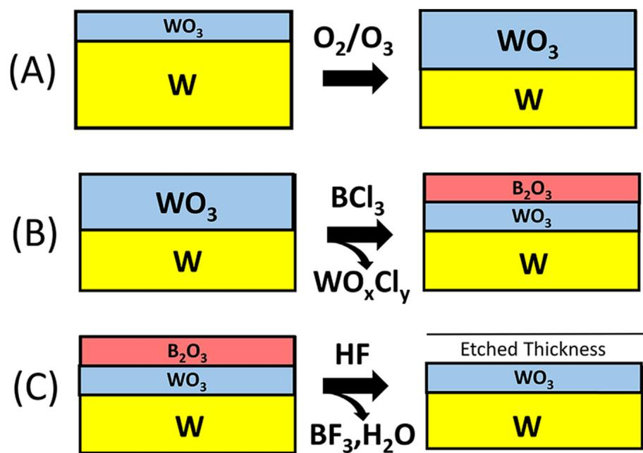
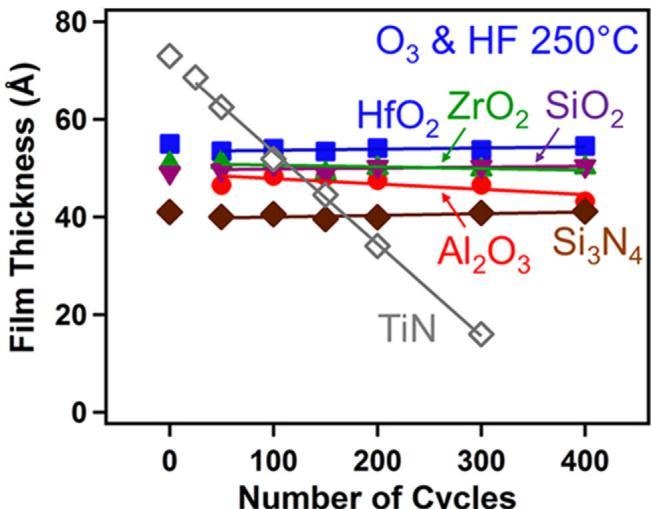

# Review

# Thermal atomic layer etching: Mechanism, materials and prospects

Chang Fang, Yanqiang Cao, Di Wu, Aidong Li*

t

# ARTICLEINFO

# ABSTRACT

Keywords: Thermal atomic layer etching Atomic layer deposition Self- limiting Reaction mechanism Atomic- scale precision

In the semiconductors and related industries, the fabrication of nanostructures and nanopatterns has become progressive demand for achieving near- atomic accuracy and selectivity in etching different materials, particularly in ultra- thin gate dielectrics and ultra- thin channels used in field- effect transistors and other nanodevices below  $10\mathrm{nm}$  scale. Atomic layer etching (ALE) is a novel technique for removing thin layers of material using sequential and self- limiting reactions. Different from most ALE processes using plasma- enhanced or other energetic particles- enhanced surface reactions, thermal ALE realizes isotropic atomic- level etch control based on sequential thermal- drive reaction steps that are self- terminating and self- saturating. Thermal ALE can be viewed as the reverse of atomic layer deposition (ALD), both of which define the atomic layer removal and growth steps required for advanced semiconductor fabrication. In this review, we focus on the concept and basic characteristics of the thermal ALE in comparison with ALD. Several typical thermal ALE mechanisms including fluorination and ligand- exchange, conversion- etch, oxidation and fluorination reactions are intensively introduced. The pros and cons of thermal ALE, plasma ALE, and traditional plasma etching are compared. Some representative materials and their typical thermal ALE processes are summarized. Finally, the outlook and challenges of thermal ALE are addressed.

# 1. Introduction

In the modern semiconductor industry, atomic- scale etching control and material selectivity are more and more important in the pattern transfer process, especially in the fabrication of nanodevices [1- 3].

As is well known, reactive ion etching is the important plasma etching with directional removal and fast etching rate by using continuous processing [4]. However, plasma etching cannot meet the requirements of the current semiconductor industry precision due to process variability, plasma- induced surface damage and unlimited reactivity [5- 7].

Recently, atomic layer etching has drawn great attention because of its advantages in atomic- scale etching. As the reverse process of atomic layer deposition (ALD) [8- 10], the earliest report on atomic layer etching (ALE) technique can be traced back to a U.S. patent in 1988 [11]. Yoder first proposed the concept of ALE to remove a single atomic layer from the surface of synthetic diamond films, which contains four- step processes: 1. Passing  $\mathrm{NO_2}$  to be chemically adsorbed on diamond surface; 2. Cleaning; 3. Impulsing the diamond surface with ions of mixed precious metal and hydrogen; 4. Cleaning. Maki and Ehrlich also contributed to early ALE. In 1989, they introduced  $\mathrm{Cl_2}$  to form an atomic- scale passivation layer of GaAs, and then the ArF laser was used to decompose the passivation layer, obtaining self- limiting etching at the atomic level [12]. Later, Si was etched using  $\mathrm{F_2}$  or  $\mathrm{Cl_2}$  adsorption on Si and subsequent  $\mathrm{Ar}^+$  plasma bombardment to remove the Si surface adsorption layer with an etching rate of  $0.4\mathrm{\AA}$  cycle [13]. This processing can be called plasma atomic layer etching (plasma ALE), which mainly consists of two steps: the surface adsorption process and the surface removal process. Plasma chlorination is used to adsorb chloride ions on the surface of the etched materials by chlorine- based chemistry. Removal of the surface utilizes activated ions such as neutral Ar plasma beams [14] or  $\mathrm{Cl_2}$  plasma [15] to bombard the surface of the materials adsorption layer, so as to achieve atomic level etching.

At the turn of the 21st century, the development of ALE was relatively slow compared to thriving ALE, because of its slow etching rate and long processing time. However, in recent years in order to reduce the size of logic components, the integration of semiconductor devices to sub-  $10\mathrm{nm}$  technology nodes requires urgently atomic scale controllability  $(< 0.5\mathrm{nm})$  and selectivity using layer- by- layer etch processes for microelectronics industry. Traditional plasma or wet etching processes fail to meet such harsh demands in such thin- layer architectures, especially high conformality.

Recently, thermal ALE method was first reported by George's group in the University of Colorado in 2015 [16]. Unlike the anisotropic plasma ALE, the thermal ALE is etched isotropically by using thermal- drive sequential and self- limiting reactions and can be regarded as the inverse of ALD process [8- 10]. The combination of ALD and ALE can define the atomic layer growth and removal required for advanced semiconductor fabrication, producing ultrasmooth thin films based on deposit/etch- back methods and conformal etching in high- aspect- ratio structures [17]. The etching accuracy reaches atomic- scale dimensions, and a large area of uniform etching surface can be obtained. At the same time, the thermal ALE can also be selectively etched according to the specific radicals or ions process. Because of the above advantages, thermal ALE is triggering tremendous research interests in searching for the most applicable etching materials, processing approach and etching mechanism.

In this review, we focus on the concept and basic characteristics of the thermal ALE in comparison with ALD. Several typical thermal ALE mechanisms including fluorination and ligand- exchange, conversion- etch, oxidation and fluorination reactions are highlighted. The advantages and disadvantages of thermal ALE, plasma ALE, and plasma etching are compared. The representative materials and their typical thermal ALE processes are summarized. This overview also discusses the prospects and challenges of thermal ALE.

# 2. Concept and reaction mechanisms of thermal ALE

Thermal atomic layer etching (ALE) is a technique that uses a sequence of self- limiting reactions for thin film etching. Similar to the concept of layer- by- layer growth of atomic layer deposition (ALD) [8], thermal ALE leads to the layer- by- layer removal of materials [14,18,19]. Fig. 1 shows schematics of one complete thermal ALE and ALD cycle. A typical thermal ALE cycle usually consists of two half- reactions: surface modification (half- reaction A) and surface removal (half- reaction B) in Fig. 1(a). Surface modification A refers to that a surface chemisorption layer is formed on the etched surface via precursor vapor self- limiting adsorption, similar to ALD. Surface removal B is that the surface chemisorption layer is converted to volatile etching products by introducing proper precursor, different from ALD. Each thermal ALE cycle can also be divided into four steps, corresponding to the ALD cycle (Fig. 1(b)): (I) surface adsorption; (II) excess reactant evacuation; (III) surface removal and (IV) volatile reaction products evacuation. The I and III steps are the key surface self- limiting steps. The II and IV steps are velocity- limited evacuation steps, which depend on the residence time of reactants and products in the reaction chamber.

At the same time, according to the growth rate in ALD (growth per cycle, GPC), the etching rate (or depth) of each cycle can also be defined as EPC (etch per cycle) in thermal ALE. Due to the nature of the self- limiting reaction during thermal ALE, EPC keeps constant, which does not change with the etching process parameters when the etching process parameters such as precursor exposure time or reactant pressure attain certain critical value. Correspondingly, there is also the concept of thermal ALE window in atomic layer etching. However, ALD window is not an essential requirement. For most thermal ALE reported up to date, EPC is evidently temperature- dependent, but in few thermal ALE reactions such as removal of TiN,  $\mathrm{HfO_2}$  and  $\mathrm{TiO_2}$ , ALE window has been observed [20- 22].

For the thermal ALE process, it is the separated half- reaction that helps to remove the interaction between the surface modification A and the surface removal B, control the order of surface reactions, make self- limiting behavior possible, and open the thermal ALE window. That is, "discontinuity" avoids the formation of thick mixed layers and the resulting unrestricted reactivity in continuous plasma etching [23].

The chemistry of thermal ALE based on sequential fluorination and ligand- exchange reactions has been investigated firstly [17]. It can be used to etch several metal oxides, metal nitride, metal fluoride, etc. In order to broaden the choice of etched materials and types, some new strategies in thermal ALE have also been developed based on "conversion- etch" and "oxidation and fluorination reactions" mechanisms to etch  $\mathrm{SiO_2}$  [24], TiN [20],  $\mathrm{WO_3}$  and metal W [25]. Next, the representative reaction mechanisms of thermal ALE will be elaborated, respectively.

  
Fig. 1. Schematic illustrations of one typical cycle of (a) thermal ALE and (b) ALD.

  
Fig. 2. Proposed reaction mechanism for thermal ALE  $\mathrm{Al_2O_3}$  thin films using HF and TMA as reactants. (a) Schematic of fluorination and ligand-exchange reactions during thermal ALE; (b) Schematic of the four-center ring transition state in the ligand-exchange reaction. Reproduced from Ref. [26].

# 2.1. Fluorination and ligand-exchange reactions

Fig. 2 shows the proposed reaction mechanism for thermal ALE  $\mathrm{Al_2O_3}$  thin films using HF and trimethylaluminum  $\mathrm{(Al(CH_3)_3}$  TMA) as reactants [26].  $\mathrm{Al_2O_3}$  thermal ALE is achieved by sequential, self- limiting reactions of fluorination and ligand- exchange using an AB exposure sequence. The overall reaction can be expressed as [26]:

exchange, TMA or  $\mathrm{Sn(acac)_2}$  reactant is introduced and etch happens if ligand- exchange convert  $\mathrm{AlF_3}$  surface layer to a stable and volatile reaction product; IV- purge, excess reactant of TMA or  $\mathrm{Sn(acac)_2}$  and volatile etch products, such as  $\mathrm{AlF(CH_3)_2}$ $\mathrm{Al(acac)_3}$  and  $\mathrm{SnF(acac)}$  are removed.

Ligand- exchange reactions during thermal ALE are related to metal- exchange transmetalation or redistribution reactions [26,27]. Fig. 2(b) shows the four- center ring transition state in the ligand- exchange reaction during ALE  $\mathrm{Al_2O_3}$  which is formed by adjacent metal centers of Al in TMA and Al in  $\mathrm{AlF_3}$  through a bridge between F ligand and  $\mathrm{CH_3}$  ligand [17]. Fluorine facilitates the four- center ring transition state because of its ability to form bimetallic bridges [26,28].

Fig. 4 illustrates the impact of reactant exposure time and temperature on the sample mass change during thermal ALE  $\mathrm{Al_2O_3}$  thin films using TMA and HF measured by a quartz crystal microbalance (QCM) [28]. At  $300^{\circ}\mathrm{C}$ , nearly self- limiting etching behavior is observed after  $2.0s$  TMA exposure when using various TMA exposure time with a  $1.0s$  HF pulse and constant  $30s$ $\mathrm{N}_2$  purge pulse in Fig. 4 (I- a). The half- reaction of ligand- exchange tends to be saturated with the etched  $\mathrm{AlF_3}$  surface layer of  $\Delta \mathrm{M_{TMA}} = - 29\mathrm{ng / cm^2}$  per cycle. When the TMA pulse and  $\mathrm{N}_2$  purge pulse is fixed at  $2.0s$  and  $30s$  respectively, the dependence of  $\Delta \mathrm{M_{HF}}$  of HF exposure time indicates that the nearly self- limiting adsorption characteristics are confirmed after  $1.0s$  HF exposure due to the saturated fluorination reaction (Fig. 4 (I- b)). The  $\mathrm{AlF_3}$  layer with about  $\Delta \mathrm{M_{TMA}} = 13\mathrm{ng / cm^2}$  per cycle is formed, which passivates the underlying  $\mathrm{Al_2O_3}$  film.

This overall reaction can be divided into two half- reaction A and B: Fluorination A:  $\mathrm{Al_2O_3}$ $\mathrm{Al_2O_3^*}$ $(\mathrm{s}) + 6\mathrm{HF}$ $(\mathrm{g})\rightarrow \mathrm{Al_2O_3}$ $\mathrm{|AlF_3^*}$  (s)  $+3\mathrm{H_2O}$  (g) (2) Ligand- exchange B:  $\mathrm{Al_2O_3}$ $\mathrm{|AlF_3^*}$ $(\mathrm{s}) + 4\mathrm{Al(CH_3)_3}$ $(\mathrm{g})\rightarrow \mathrm{Al_2O_3^*}$  (s)  $+6\mathrm{AlF(CH_3)_2}$  (g) (3)

The tin (II) acetylacetonate  $(\mathrm{Sn(acac)}_2)$  and HF instead of TMA and HF can also be used for thermal ALE  $\mathrm{Al_2O_3}$  films at temperatures from 150 to  $250^{\circ}C$  [16]. The etched surface becomes very smooth with surface roughness of only  $2 - 3\mathrm{\AA}$  (original RMS (root- mean- square) value of  $\sim 5\mathrm{\AA}$  . The schematic for the proposed surface chemistry of thermal ALE  $\mathrm{Al_2O_3}$  is displayed in Fig. 3 [16]. The overall reaction can be written as [16]:

In addition, the sample mass change vs  $\mathrm{Al_2O_3}$  film etching rate is significantly dependent on the reaction temperature, as seen in Fig. 4 (II- b) [28]. With increasing the temperature, the mass loss of  $\Delta \mathrm{M_{TMA}}$  in the TMA half- reaction becomes large obviously, and meanwhile the mass gain of  $\Delta \mathrm{M_{HF}}$  in the HF half- reaction also shows an increasing trend. Considering the two factors, the larger mass loss of  $\Delta \mathrm{M_{TMA}}$  in the TMA half- reaction than mass gain of  $\Delta \mathrm{M_{HF}}$  in the HF half- reaction correspondingly leads to the increase of the etching rate with temperature. The etch rate of  $\mathrm{Al_2O_3}$  is  $0.14\mathrm{\AA}$  cycle at  $250^{\circ}C$ $0.51\mathrm{\AA}$  cycle at  $300^{\circ}C$  and  $0.75\mathrm{\AA}$  cycle at  $325^{\circ}C$  respectively. These data reveal that only  $19\%$  of  $\mathrm{AlF_3}$  is removed at  $250^{\circ}C$  and about  $75\%$  of  $\mathrm{AlF_3}$  is etched at  $325^{\circ}C$  At different temperatures, the etching depth is linear with the number of ALE cycles.

At present, besides  $\mathrm{Al_2O_3}$ $\mathrm{HfO_2}$ $\mathrm{ZrO_2}$  AlN, and  $\mathrm{AlF_3}$  have been successfully etched using fluorination and ligand- exchange reactions [21,29- 31]. Most thermal ALE processes are strongly temperature- dependent, except  $\mathrm{HfO_2}$  ALE with an ALE window ranging from  $200^{\circ}C$  to  $250^{\circ}C$  [21]. Selectivity in thermal ALE of  $\mathrm{Al_2O_3}$ $\mathrm{HfO_2}$ $\mathrm{ZrO_2}$ $\mathrm{SiO_2}$ $\mathrm{Si_3N_4}$  and TiN based on fluorination and ligand- exchange reactions has been confirmed using  $\mathrm{Sn(acac)_2}$  TMA,  $\mathrm{Al(CH_3)_2Cl}$  and  $\mathrm{SiCl_4}$  as the metal precursors and HF- pyridine as the fluorination agent, as illustrated in Fig. 5 [29].  $\mathrm{HfO_2}$  can be etched by all of the metal precursors.  $\mathrm{Al_2O_3}$  and  $\mathrm{ZrO_2}$  can be etched by all of the metal precursors except  $\mathrm{SiCl_4}$  and TMA. On the contrary,  $\mathrm{SiO_2}$ $\mathrm{Si_3N_4}$  and TiN cannot be etched by any of the metal precursors. Selective etching is related to the stability and volatility of possible reaction products. For example,  $\mathrm{SiO_2}$  and  $\mathrm{Si_3N_4}$  cannot be etched by this process because on one hand neither  $\mathrm{SiO_2}$  nor  $\mathrm{Si_3N_4}$  is etched spontaneously by HF in absence of  $\mathrm{H}_2\mathrm{O}$  [29,32], on the other hand the Si- F bond is too strong to undergo an effective ligand exchange reaction to generate Si- containing volatiles [30]. The negligible etching of TiN is ascribed to either the absence of stable or volatile Ti (III) reaction products or the difficulty of fluorinating Ti (IV) surface species using HF [29].

This overall reaction can be separated into  $\mathrm{Sn(acac)_2}$  and HF reactions:

Ligand- exchange A:  $\mathrm{Al_2O_3}$ $\mathrm{|2AlF_3^*}$ $(\mathrm{s}) + 6\mathrm{Sn(acac)}_2$ $(\mathrm{g})\rightarrow \mathrm{Al_2O_3}$ $\mathrm{|xSnF}$ $(\mathrm{acac})^* (\mathrm{s}) + 2\mathrm{Al(acac)}_3$ $(\mathrm{g}) + (6 - x)\mathrm{SnF(acac)}$  (g) (5)

Fluorination B:  $\mathrm{Al_2O_3}$ $\mathrm{|xSnF(acac)^*}$ $(\mathrm{s}) + 6\mathrm{HF}$ $(\mathrm{g})\rightarrow 2\mathrm{AlF_3^*}$ $(\mathrm{s}) + \mathrm{xSnF}$ $(\mathrm{acac})$ $(\mathrm{g}) + 3\mathrm{H_2O}$  (g) (6)

Whether TMA/HF or  $\mathrm{Sn(acac)_2 / HF}$  are used as the reactants, the etching process can be divided into four steps: I- fluorination, HF reactant is transferred into the reactor and reacts with  $\mathrm{Al_2O_3}$  surface to form  $\mathrm{AlF_3}$ ; II- purge, inert purge gas is introduced to remove excess HF and gaseous by- products such as  $\mathrm{H}_2\mathrm{O}$ ,  $\mathrm{CH_4}$  or  $\mathrm{SnF(acac)}$ ; III- ligand

Therefore, on the basis of fluorination and ligand- exchange reactions, George's group has extended the new etching mechanisms of "conversion- etch" such as "conversion- fluorination" and "oxidation- conversion- fluorination" so as to etch more materials such as  $\mathrm{SiO_2}$  [24],  $\mathrm{ZnO}$  [33],  $\mathrm{WO_3}$  and  $\mathrm{W}$  [25] by thermal ALE. It will be addressed in next section.

  
Fig. 3. Schematic of proposed reaction mechanism for  $\mathrm{Al}_2\mathrm{O}_3$  thermal ALE showing (a)  $\mathrm{Sn}(\mathrm{acac})_2$  reaction and (b) HF reaction. Reproduced from Ref. [16].

  
Fig. 4. Influence of reactant exposure time and temperature on the sample mass changes during thermal ALE  $\mathrm{Al}_2\mathrm{O}_3$  films using TMA and HF. (I): effect of TMA (a) and HF (b) exposure time on mass changes ( $\Delta \mathrm{M}_{\mathrm{TMA}}$  and  $\Delta \mathrm{M}_{\mathrm{HF}}$ ) at  $300^{\circ}\mathrm{C}$ , respectively; (II): effect of temperature on  $\Delta \mathrm{M}_{\mathrm{TMA}}$  and  $\Delta \mathrm{M}_{\mathrm{HF}}$  of TMA, HF half-reaction (a) and mass change per ALE cycle (MCPC). Reproduced from Ref. [28].

# 2.2. Conversion-etch

As mentioned above,  $\mathrm{SiO_2}$  cannot be etched by fluorination and ligand exchange reactions using TMA and HF reactants at  $300^{\circ}\mathrm{C}$  with lower reactant pressure of 0.08 Torr [29], nevertheless through the conversion- etch method, thermal ALE  $\mathrm{SiO_2}$  thin films have been realized using an AB exposure sequence of TMA and HF at  $300^{\circ}\mathrm{C}$  with higher precursor pressure of 0.5, 1.0, and 4.0 Torr [24]. The key conversion step from  $\mathrm{SiO_2}$  to  $\mathrm{Al}_2\mathrm{O}_3$  can be achieved by introducing TMA reactant at higher reactant pressures:

Conversion:  $3\mathrm{SiO}_2$  (s)  $+4\mathrm{Al(CH_3)_3(g)}\rightarrow 2\mathrm{Al_2O_3(s)} + 3\mathrm{Si(CH_3)_4(g)}$ $\Delta \mathrm{G} = - 235\cdot 0\mathrm{kcal / mol}$  at  $300^{\circ}\mathrm{C}$  (7)

Then the following process is similar to  $\mathrm{Al}_2\mathrm{O}_3$  film etching in fluorination and ligand exchange [26]. The schematic of conversion- fluorination reactions of thermal ALE  $\mathrm{SiO_2}$  using TMA/HF is shown in

  
Fig. 5. Selective etching of  $\mathrm{Al_2O_3}$ ,  $\mathrm{HfO_2}$ ,  $\mathrm{ZrO_2}$ ,  $\mathrm{SiO_2}$ ,  $\mathrm{Si_3N_4}$ , and TiN by the metal ALE using fluorination and ligand-exchange reactions: (a)  $\mathrm{Sn(acac)}_2$  at  $200^{\circ}\mathrm{C}$  and (b) TMA at  $300^{\circ}\mathrm{C}$ . Reproduced from Ref. [29].

  
Fig. 6. Schematic of proposed reaction mechanism for TMA/HF thermal ALE  $\mathrm{SiO_2}$  thin films. Reproduced from Ref. [24].

Fig. 6. The conversion reaction from  $\mathrm{SiO_2}$  to  $\mathrm{Al_2O_3}$  is spontaneous because of a large negative value of  $\Delta \mathrm{G}$ . First,  $\mathrm{SiO_2}$  is converted to  $\mathrm{Al_2O_3}$  Al- silicate intermediate after TMA exposure. The following HF exposure can fluorinate  $\mathrm{Al_2O_3 / Al}$  silicate into  $\mathrm{AlF_3}$  and  $\mathrm{SiO_xF_y}$ . Subsequently, the next TMA exposure can remove  $\mathrm{AlF_3}$  and  $\mathrm{SiO_xF_y}$  by a ligand exchange transmetalation reactions and then convert additional  $\mathrm{SiO_2}$  to  $\mathrm{Al_2O_3}$  again. Continuous TMA and HF reactions result in  $\mathrm{SiO_2}$  ALE, and each TMA/HF reaction is self- limiting behavior. The  $\mathrm{SiO_2}$  etching rate is dependent on static reactant pressures, such as 0.027, 0.15, 0.20, and  $0.31\mathrm{\AA}$  cycle at 0.1, 0.5, 1.0, and 4.0 Torr, respectively [24]. The larger etching rates at higher reactant pressures suggest a pressure- dependent reaction mechanism for  $\mathrm{SiO_2}$  ALE.

Similar conversion- fluorination reactions can be observed in thermal ALE of  $\mathrm{ZnO}$  thin films utilizing TMA and HF [33], as shown in Fig. 7. The conversion reaction (Eq. (8)) from  $\mathrm{ZnO}$  to  $\mathrm{Al_2O_3}$  is also spontaneous by TMA treatment. The EPC (etch per cycle) is temperature- dependent with  $2.11\mathrm{\AA}$  cycle at  $265^{\circ}\mathrm{C}$ , which is much higher than thermal ALE of other oxide materials such as  $\mathrm{Al_2O_3}$ ,  $\mathrm{SiO_2}$ ,  $\mathrm{HfO_2}$ , and  $\mathrm{ZrO_2}$ . And the etched surface becomes smooth with the decreased RMS value from  $11\mathrm{\AA}$  to  $5.8\mathrm{\AA}$ .

Conversion:  $3\mathrm{ZnO}$  (s)  $+2\mathrm{Al(CH_3)_3}$  (g)  $\rightarrow \mathrm{Al_2O_3}$  (s)  $+3\mathrm{Zn(CH_3)_2}$  (g)  $\Delta \mathrm{G} = - 1668\mathrm{kcal / mol}$  at  $265^{\circ}\mathrm{C}$  (8)

Above all, in the conversion- etch procedure, the etched surface layer is converted to a different material such as  $\mathrm{Al_2O_3}$  by TMA.  $\mathrm{Al_2O_3}$  can easily be fluorinated by HF and removed by ligand- exchange. Therefore, conversion- etch approaches may provide alternative pathways for etching additional materials with volatile fluorides using thermal ALE.

For example, such conversion- fluorination reactions can also be expected in thermal ALE  $\mathrm{SnO_2}$ ,  $\mathrm{In_2O_3}$ , and  $\mathrm{Si_3N_4}$  using TMA and HF, because the TMA reactant converts them into more stable  $\mathrm{Al_2O_3}$  or AlN and volatile organometallic compounds such as  $\mathrm{Sn(CH_3)_2}$ ,  $\mathrm{In(CH_3)_3}$ , and  $\mathrm{Si(CH_3)_4}$  with thermochemically favorable  $\Delta \mathrm{G}$  values [24].  $\mathrm{Al_2O_3}$  can easily be etched by a variety of fluorine precursors, such as HF and  $\mathrm{SF_4}$ , and metal precursors, such as  $\mathrm{Sn(acac)_2}$  and TMA [16,26,29]. AlN can be etched using sequential HF and  $\mathrm{Sn(acac)_2}$  exposures [30]. Therefore, the conversion- etch mechanism may be very useful in thermal ALE.

Apart from TMA,  $\mathrm{BCl_3}$  can also be used in conversion reactions as the reactant.  $\mathrm{BCl_3}$  can turn many metal oxides into  $\mathrm{B_2O_3}$ , which easily forms volatile  $\mathrm{BF_3}$  and  $\mathrm{H_2O}$  after HF exposures.  $\mathrm{WO_3}$  cannot be etched by fluorination and ligand- exchange reactions due to the formation of volatile fluorides causing spontaneous etching, but it could be successfully etched using an AB exposure sequence with  $\mathrm{BCl_3}$  and HF as the reactants via thermal ALE [25]. The conversion reaction from  $\mathrm{WO_3}$  to  $\mathrm{B_2O_3}$  with  $\mathrm{BCl_3}$  is thermodynamically favorable with  $\Delta \mathrm{G}^{\circ}$  of  $- 7.8\mathrm{kcal / mol}$  at  $200^{\circ}\mathrm{C}$ , producing volatile  $\mathrm{WO_2O_2}$ .  $\mathrm{B_2O_3}$  layer on  $\mathrm{WO_3}$  surface is formed to impede further reaction of  $\mathrm{BCl_3}$  and  $\mathrm{WO_3}$ , indicating the self- limiting behavior. Then  $\mathrm{B_2O_3}$  is spontaneously fluorinated and removed with HF to generate volatile  $\mathrm{BF_3}$  and  $\mathrm{H_2O}$ , while the underlying  $\mathrm{WO_3}$  films act as an etch stop because HF does not react with  $\mathrm{WO_3}$  based on their positive standard free energy change ( $\Delta \mathrm{G}^{\circ}$ ).

Parsons's group reported the self- limiting thermal ALE of  $\mathrm{TiO_2}$  using  $\mathrm{WF_6}$  and  $\mathrm{BCl_3}$  based on similar and more complicated conversion- fluorination reactions at low temperature [22], a higher EPC of  $\sim 0.6\mathrm{\AA}$  cycle at  $170^{\circ}\mathrm{C}$  was achieved, twice GPC of ALD  $\mathrm{TiO_2}$ . Moreover this ALE process is evidently selective for etching  $\mathrm{TiO_2}$  over  $\mathrm{Al_2O_3}$ .

The above "conversion- fluorination" mechanism of thermal ALE  $\mathrm{WO_3}$  using  $\mathrm{BCl_3}$  and HF reactants can be further extended to "oxidation- conversion- fluorination" mechanism for etching metal W using  $\mathrm{O_2 / O_3}$ ,  $\mathrm{BCl_3}$  and HF, as presented in Fig. 8 [25]. The main difference between "conversion- fluorination" using AB cycle mode and "oxidation- conversion- fluorination" using ABC cycle mode lies in the introduction of oxygen or ozone, which oxidizes the metal W surface to a  $\mathrm{WO_3}$  layer. Then  $\mathrm{WO_3}$  layer is etched by  $\mathrm{BCl_3}$  and HF with similar reaction procedure. The EPC of  $\mathrm{WO_3}$  is temperature- dependent with  $0.55\mathrm{\AA}$  cycle at  $128^{\circ}\mathrm{C}$  and  $4.19\mathrm{\AA}$  cycle at  $207^{\circ}\mathrm{C}$ , while the EPC of W is  $\sim 2.5\mathrm{\AA}$  cycle at  $207^{\circ}\mathrm{C}$  [25]. The residual  $\mathrm{WO_3}$  layer ( $\sim 20\mathrm{\AA}$ ) after thermal ALE W

  
Fig. 7. Schematic of proposed reaction mechanism for HF/TMA thermal ALE ZnO thin film. Reproduced from Ref. [33].

can be removed with  $\mathrm{BCl}_3$  and HF without influence on the metal W layer.

Besides  $\mathrm{WO_3}$ , the conversion- fluorination reactions using  $\mathrm{BCl}_3$  and HF can be employed to etch many metal oxides such as  $\mathrm{MoO_3}$ ,  $\mathrm{VO_2}$ ,  $\mathrm{V_2O_5}$ ,  $\mathrm{Ta_2O_5}$ ,  $\mathrm{GeO_2}$ ,  $\mathrm{As_2O_3}$ ,  $\mathrm{Sb_2O_3}$ ,  $\mathrm{Fe_2O_3}$ ,  $\mathrm{SnO_2}$ ,  $\mathrm{HfO_2}$ ,  $\mathrm{ZrO_2}$  and  $\mathrm{NbO_2}$  [25]. They can be converted to  $\mathrm{B_2O_3}$  by  $\mathrm{BCl}_3$  and possess volatile metal chlorides and metal oxychlorides. Moreover, in addition to metal W, the oxidation- conversion- fluorination reactions using  $\mathrm{O_2 / O_3}$ ,  $\mathrm{BCl}_3$  and HF can also be applied to etch some metal materials such as Ta, Nb, V, W, Mo, and Cr. Overall, the conversion- etch including "conversion- fluorination" and "oxidation- conversion- fluorination" will be especially useful to enable ALE pathways for metals and metal oxides that have volatile metal fluorides and oxychlorides.

# 2.3. Oxidation and fluorination

In this section, we will focus on another valuable thermal ALE mechanism based on sequential, self- limiting oxidation and fluorination reactions. Fig. 9 displays the schematic of TiN ALE using  $\mathrm{O_3}$  and HF as

  
Fig. 9. Schematic for TiN ALE using  $\mathrm{O_3}$  and HF as the reactants. Reproduced from Ref. [20].

  
Fig. 8. Schematic of proposed reaction mechanism for thermal ALE W thin film using using  $\mathrm{O_2 / O_3}$ ,  $\mathrm{BCl}_3$  and HF: (a) oxidation of W using  $\mathrm{O_2 / O_3}$ , (b) conversion of  $\mathrm{WO_3}$  to  $\mathrm{B_2O_3}$  using  $\mathrm{BCl}_3$  with volatile  $\mathrm{WO_xCl_y}$ , and (c) fluorination of  $\mathrm{B_2O_3}$  by HF to form volatile  $\mathrm{BF}_3$  and  $\mathrm{H_2O}$ . Reproduced from Ref. [25].

the reactants [20].

The overall etching reaction can be expressed as:

$\mathrm{TiN(s) + 3O_3(g) + 4HF(g)\rightarrow TiF_4(g) + NO(g) + 3O_2(g) + 2H_2O}$  (g) (9)

This overall reaction can be separated into  $\mathrm{O_3}$  and HF reactions:

Oxidation: TiN  $\mathrm{(s) + 3O_3(g)\rightarrow TiO_2(s) + NO(g) + 3O_2(g)}$  (10)

Fluorination:  $\mathrm{TiO_2(s) + 4HF(g)\rightarrow TiF_4(g) + 2H_2O(g)}$  (11)

In the proposed reaction mechanism, the strong oxidant  $(O_3)$  oxidizes TiN from  $\mathrm{Ti}^{+3}$  to  $\mathrm{Ti}^{+4}$  and forms a stable and self- passivation  $\mathrm{TiO_2}$  layer on the TiN substrate, which is thermodynamically favorable [20]. Herein,  $\mathrm{TiO_2}$  layer as a diffusion barrier prevents further oxidation, showing a self- limiting oxidation reaction. The standard free energy change  $\Delta \mathbf{G}^{\circ}$  values for the HF reaction with  $\mathrm{TiO_2}$  is  $- 6.1\mathrm{kcal / mol}$  at room temperature, however it becomes positive  $(\Delta \mathrm{G}^{\circ} = +6.1\mathrm{kcal / mol})$  at  $250^{\circ}C$  due to the entropic reason, indicating thermodynamically unfavorable [20]. In fact, under nonstandard conditions, the  $\Delta \mathbf{G}$  value for fluorination reaction may be negative and the etching could be continued in excess of HF vapor because the products of  $\mathrm{TiF_4}$  and  $\mathrm{H}_2\mathrm{O}$  are rapidly evacuated by  $\mathbb{N}_2$  purge gas. The EPC of ALE TiN increases from  $0.06\mathrm{\AA}$  cycle at  $150^{\circ}C$  to  $0.20\mathrm{\AA}$  cycle at  $250^{\circ}C_{\cdot}$  which confirms the speculation. Moreover, there exists ALE window for TiN ALE between  $250^{\circ}C$  and  $350^{\circ}C$  with nearly constant EPC value [20]. In addition,  $\mathrm{H}_2\mathrm{O}_2$  can also be used as oxidation reactant to etch TiN, leading to similar surface smoothing after thermal ALE.

The selective etching of TiN is observed using  $\mathrm{O_3}$  and HF as the reactants in the presence of other surrounding materials, including  $\mathrm{Al}_2\mathrm{O}_3$ $\mathrm{HfO_2}$ $\mathrm{ZrO_2}$ $\mathrm{SiO_2}$  and  $\mathrm{Si_3N_4}$  as seen in Fig. 10 [20].  $\mathrm{Al}_2\mathrm{O}_3$ $\mathrm{HfO_2}$ $\mathrm{ZrO_2}$ $\mathrm{SiO_2}$  and  $\mathrm{Si_3N_4}$  show negligible thickness change, indicating that they cannot be etched because their fluorides are stable and nonvolatile such as  $\mathrm{AlF_3}$ $\mathrm{HF_4}$  and  $\mathrm{ZrF_4}$  or their fluorides cannot be obtained in dry HF such as  $\mathrm{SiO_2}$  and  $\mathrm{Si_3N_4}$

Similarly, two- step thermal ALE of W has been demonstrated based on sequential, self- limiting oxidation and fluorination reactions using  $\mathrm{O_2 / O_3}$  and  $\mathrm{WF_6}$  as the reactants [34].

This etching reaction can be divided into  $\mathrm{O_2}$  and  $\mathrm{WF_6}$  reactions:

Oxidation:  $\mathrm{W(s) + 1.5O_2(g)\rightarrow WO_3}$  (s)

Fluorination:  $\mathrm{WO_3(s) + 0.5WF_6(g)\rightarrow 1.5WO_2F_2(g)}$

The  $\mathrm{O_2 / WF_6}$  process is strongly temperature dependent. The EPC is only  $0.34\mathrm{\AA}$  cycle at  $220^{\circ}C$  but increases to  $\sim 6.3\mathrm{\AA}$  cycle at  $300^{\circ}C_{\cdot}$

  
Fig.10. Selective etching of TiN at  $250^{\circ}C$  using  $\mathrm{O_3}$  and HF in the presence of other surrounding materials of  $\mathrm{Al}_2\mathrm{O}_3$ $\mathrm{HfO_2}$ $\mathrm{ZrO_2}$ $\mathrm{SiO_2}$  and  $\mathrm{Si_3N_4}$  . Reproduced from Ref. [20].

which is attributed to the limited volatility of the  $\mathrm{WO_2F_2}$  etch product at temperatures  $< 275^{\circ}C$  [34].

This thermal ALE using oxidation and fluorination mechanism should also be applicable to metal carbides, metal sulfides, metal selenides, and elemental metals that have volatile metal fluorides and oxyfluorides, which expands the number of materials that can be etched by thermal ALE methods.

Table 1 summarizes several typical thermal ALE mechanisms, reactants, etched materials and requirements. These mechanisms are valuable to clarify the understanding of ALE reactions and expand the base of available ALE processes for advanced material processing. It is expected that the multiple pathways for selective thermal ALE can be achieved by choosing proper metal precursors with various ligands and appropriate processing temperatures.

# 3. Basic characteristics of thermal ALE

Table 2 summaries the advantages and disadvantages of thermal ALE in comparison with plasma ALE and traditional plasma etching processes.

Herein the plasma etching mainly refers to traditional dry reactive ion etching, which continuously uses chemically reactive plasma to remove the films on wafer surface. It has the advantages of fast etching rate, high throughput, anisotropic etch capability, and wide processing temperature range. However, the principal problem is that continuous plasma etching cannot meet the increasing demands of microelectronics industry on processing accuracy of nanodevices. At present, the technology node of semiconductor processing has approached the critical scale of  $10\mathrm{nm}$  and the requirements of precision control are less than  $0.5\mathrm{nm}$  No matter what thermal ALE or plasma ALE has sequential, selflimiting reaction characteristics, they enable the possible applications in atomic- scale etching with high precision. Moreover thermal ALE can avoid the surface lattice damage and charge defects caused by plasma etching with energetic ions, thereby enhancing the reliability of nanodevices.

# 4. Etched materials by thermal ALE

Table 3 summarizes the typical thermal ALE processes of some representative materials, mainly involving the fluorination and ligandexchange, conversion- etch, and oxidation and fluorination mechanisms with sequential and self- limiting behavior. Since thermal ALE processing appeared in 2015, at present some etching experiments mainly concentrate on oxides, including  $\mathrm{Al}_2\mathrm{O}_3$ $\mathrm{HfO_2}$ $\mathrm{ZrO_2}$ $\mathrm{ZnO}$ $\mathrm{TiO_2}$ $\mathrm{SiO_2}$ $\mathrm{WO_3}$  et al., among which thermal ALE of  $\mathrm{ZnO}$  [33],  $\mathrm{TiO_2}$  [22],  $\mathrm{SiO_2}$  [21], and  $\mathrm{WO_3}$  [23] uses the conversion- fluorination reactions instead of the fluorination and ligand- exchange reactions.

W Metal is commonly applied in integrated circuits as an internet layer and diffusion barrier [35], so W etching processes with atomic- layer dimension are very important in micro- nano device fabrications. One AB sequence [34] and one ABC sequence [23] thermal ALE W processes have been reported based on oxidation- fluorination and oxidation- conversion- fluorination reactions, respectively. They both first convert metal W to  $\mathrm{WO_3}$  by oxygen or ozone. Similar processing should be applicable to elemental metals such as Mo, Ta and Nb.

TiN is also a valuable material as a gate electrode for complementary metal- oxide- semiconductor (CMOS) and a copper diffusion barrier in semiconductor devices [36]. Similarly, TiN is first oxidized to form  $\mathrm{TiO_2}$  and then  $\mathrm{TiO_2}$  is fluorinated by HF and removed as volatile  $\mathrm{TiF_4}$  using oxidation and fluorination reactions. Thermal ALE of AlN can be realized by fluorination and ligand- exchange using HF and Sn  $(\mathrm{acac})_2$  [30]. It is found that adding  $\mathrm{H}_2$  or Ar plasma exposure after each  $\mathrm{Sn(acac)}_2$  exposure dramatically increases the AlN EPC form  $0.36\mathrm{\AA}/$  cycle to 1.96 or  $0.66\mathrm{\AA}$  cycle. This enhancement can be ascribed to the removal or desorption of acac surface species limiting the AlN etch rate [30]. Finally,  $\mathrm{AlF_3}$  ALE is the first example of the thermal ALE of a

Table 1 Several typical thermal ALE mechanism, reactants, etched materials, and requirements.  

<table><tr><td>Thermal ALE mechanism</td><td>Reactants</td><td>Etched materials</td><td>Requirements</td></tr><tr><td>Fluorination and ligand-exchange</td><td>HF/Sn(acac)2(TMA, Al(CH3)2Cl, SiCl4)</td><td>Al2O3, HfO2, ZnO2, AlN, AlF3</td><td>Stable and nonvolatile fluorides, volatile etching products in ligand-exchange</td></tr><tr><td rowspan="2">Conversion-fluorination</td><td>HF/TMA (BCl3)</td><td rowspan="2">SiO2, ZnO, WC3, TiO2</td><td rowspan="2">Converted to a different material such as Al2O3 or B2O3 easily be fluorinated, stable and volatile fluorides</td></tr><tr><td>WF6/BCl3</td></tr><tr><td>Oxidation- conversion-fluorination</td><td>O2(O3)/BCl3/HF</td><td>W</td><td>Metals with volatile chlorides or oxycolorides</td></tr><tr><td rowspan="2">Oxidation and fluorination</td><td>O2(H2O2)/HF</td><td rowspan="2">TiN, W</td><td rowspan="2">Stable and volatile metal fluorides or oxyfluorides</td></tr><tr><td>O2(O3)/WF6</td></tr></table>

Table 2 Basic characteristics of thermal ALE, plasma ALE, and plasma etching processes.  

<table><tr><td></td><td>Thermal ALE</td><td>Plasma ALE</td><td>Plasma etching</td></tr><tr><td>Method</td><td>Discontinuous process with two half-reactions of surface adsorption and surface removal, similar to the inverse of the ALD process. By sequential, self-limiting thermal reactions, the conformal removal of sub-atomic layer is achieved.</td><td>Discontinuous process with two half-reactions of surface adsorption and surface removal. In surface removal step, plasma bombardment is used for etching. Surface adsorption step may be heat adsorption or plasma assisted adsorption.</td><td>Continuous etching process containing a reactive etching gas, plasma generates a large number of chemically active species, interacting with the material surface to form volatile products, including physical and chemical etching.</td></tr><tr><td>Advantage</td><td>Self-limiting, atomic layer precision, large area uniformity, conformal etching, ultra-smooth etched surfaces, ALE window, isotropic etching, selective etching</td><td>Self-limiting, low process temperature, atomic layer precision, ALE window, directional etching, selective etching</td><td>High etching rate, high throughput, low process temperature, directional etching, selective etching</td></tr><tr><td>Disadvantage</td><td>Low etching rate, throughput, process temperature, proper thermal ALE reaction mechanism and precursor</td><td>Low etching rate, complex plasma physics and chemistry, wafer scale uniformity</td><td>Plasma damage, etching accuracy, nonuniform, unlimited reactivity; chemical residue, complex plasma physics and chemistry</td></tr><tr><td>Example</td><td>Thermal ALE of Al2O3films with TMA/HF, TiN with O2/HF, W with O3/BCl3/HF</td><td>Plasma ALE of Si and W with Cl2and Ar+plasma</td><td>C4F8reactive ion etching Si, CHF3/O2reactive ion etching SiO2</td></tr></table>

Table 3 Typical thermal ALE processes for some representative materials.  

<table><tr><td>Materials</td><td>Surface adsorption</td><td>Surface removal</td><td>EPC (Å/cycle)</td><td>Etching temperature</td><td>Ref.</td></tr><tr><td rowspan="2">Al2O3</td><td>HF</td><td>Sn(acac)2</td><td>0.61</td><td>250℃</td><td>[16]</td></tr><tr><td>HF</td><td>TMA</td><td>0.14/0.75</td><td>250/325℃</td><td>[26]</td></tr><tr><td rowspan="2">HfO2</td><td>HF</td><td>Sn(acac)2</td><td>0.117</td><td>250℃</td><td>[21]</td></tr><tr><td>HF</td><td>Al(CH3)2Cl</td><td>0.77</td><td>250℃</td><td>[29]</td></tr><tr><td rowspan="3">ZrO2</td><td rowspan="2">HF</td><td>SiCl4/Sn</td><td>0.14</td><td>350℃/200℃</td><td>[29]</td></tr><tr><td>(acac)2</td><td></td><td></td><td></td></tr><tr><td>HF</td><td>Al(CH3)2Cl</td><td>0.117</td><td>250℃</td><td>[29]</td></tr><tr><td>ZnO</td><td>HF</td><td>TMA</td><td>2.19</td><td>295℃</td><td>[33]</td></tr><tr><td>TiO2</td><td>WF6</td><td>BCl3</td><td>0.6-0.7</td><td>170℃</td><td>[22]</td></tr><tr><td>SiO2</td><td>HF</td><td>TMA</td><td>0.31</td><td>300℃</td><td>[24]</td></tr><tr><td>WO3</td><td>BCl3</td><td>HF</td><td>4.19</td><td>207℃</td><td>[25]</td></tr><tr><td rowspan="2">W</td><td rowspan="2">O3/BCl3</td><td>HF</td><td>2.5</td><td>207℃</td><td>[25]</td></tr><tr><td>WF6</td><td>6.3</td><td>300℃</td><td>[34]</td></tr><tr><td>TiN</td><td>O3</td><td>HF</td><td>0.20</td><td>250℃</td><td>[20]</td></tr><tr><td rowspan="2">AlN</td><td>HF</td><td>Sn(acac)2</td><td>0.36</td><td>250℃</td><td>[30]</td></tr><tr><td>HF</td><td>Sn(acac)2/HS</td><td>1.96</td><td>250℃</td><td>[30]</td></tr><tr><td>AlF3</td><td>HF</td><td>Sn(acac)2</td><td>0.069/0.63</td><td>150/250℃</td><td>[31]</td></tr></table>

metal fluoride using  $\mathrm{Sn(acac)_2}$  and HF as reactants by yielding SnF (acac) and  $\mathrm{AlF(acac)_2}$  as volatile reaction products [31].

In summary, compared to plentiful materials prepared by ALD, now the materials etched by thermal ALE are very limited by actual verification. But it is believed that thermal ALE of more materials with atomic- scale precision will be achieved by designing feasible reaction routes and choosing proper precursors.

# 5. Prospects and challenges

Rapid progress is made on the atomic layer etching technology with self- limiting characteristics and atomic- scale control precision, which has great potential applications in microelectronics, optoelectronics, micro- electro- mechanical systems (MEMS) and nanotechnology fields, especially in semiconductor nanodevices. Ultra- thin gate dielectrics, ultra- thin channels, novel field- effect transistors (FET) architecture such as fin field- effect transistors (FinFET) and Gate- All- Around CMOS require near- atomic scale etching control and selectivity. Compared with the continuous plasma etching developed for more than 30 years, only atomic layer etching can meet such harsh requirements. In several material systems, thermal ALE has been confirmed to obtain controllable and conformal surface etching with sub- nanometer scale, ultra- smooth surface, no damage in high aspect- ratio structures, and possible anisotropic etching with ion or radical enhancement. As an essential counterpart to ALD, ALE and ALD can enable the atomic layer growth and removal steps for advanced semiconductor fabrication, providing new processing capabilities for constructing three- dimensional nanodevices.

Although thermal ALE has achieved exciting and promising progress recently, compared to extensive and intensive ALD research, thermal ALE is still in an early stage of development. The ALE precursor and materials have yet to be enriched greatly, and the reaction mechanism needs to be further revealed. The low etching rate, long cycling time, low throughput and high cost lead to the difficulty for transferring thermal ALE from research to manufacturing, impeding its commercial applications in industry.

When IC critical dimension and feature size shrink below  $10\mathrm{nm}$  the low etching rate of ALE becomes relatively less crucial. The quality and smoothness of etched surface and subsurface, etching fidelity in high aspect- ratio structures, and high materials selectivity become more and more important. This provides an alternative approach for thermal ALE to find the way in future semiconductor manufacturing processes. Above all, at the tipping point the development of thermal ALE is facing tremendous opportunities and challenges ahead. It is believed that emerging thermal ALE could have promising futures and prospects like ALD through continuous efforts of academia and industry.

# Acknowledgments

This project is supported by the Natural Science Foundation of China (51571111, 51721001, 51802150) and Jiangsu Province (BK2016230, and BK20170645)The grant from the State Key Program

for Basic Research of China (2015CB921203) and the general grant from the China Postdoctoral Science Foundation (2017M611778) are acknowledged. Dr. Ai- Dong Li thanks the support from the Fundamental Research Funds for the Central Universities (021314380075) and open project of NLSSM (M30038).

# References

[1] M. Guillorn, J. Chang, N. Fuller, J.J. Patel, Vac. Sci. Technol. B 27 (6) (2009) 2588- 2592. [2] S. Samukawa, M. Hori, S. Rauf, K. Tachibana, P. Bruggeman, G. Kroesen, J.C. Whitehead, A.B. Murphy, A.F. Gutsol, S. Starikovskaia, U. Kortshagen, J.P. Boeuf, T.J. Sommerer, M.J. Kushner, U. Czarnetzki, J. Phys. D: Appl. Phys. 45 (25) (2012) 253001. [3] S.M. George, Chem. Rev. 110 (2010) 111- 131. [4] V.M. Donnelly, A. Kornblit, J. Vac. Sci. Technol. A 31 (5) (2013) 050825- 050848. [5] C.G.N. Lee, K.J. Kanarik, R.A. Gettscho, J. Phys. D: Appl. Phys. 47 (27) (2014) 994- 1004. [6] S. Banna, A. Agarwal, G. Cungo, M. Darnon, E. Pargon, O. Joubert, J. Vac. Sci. Technol. A 30 (4) (2012) 040801- 040829. [7] N. Marchack, J.P. Chang, J. Phys. D: Appl. Phys. 44 (17) (2011) 174011- 174021. [8] T. Faraz, F. Roozeboom, H.C.M. Knoops, W.M.M. Kessels, ECS J. Solid State Sci. Technol. 4 (6) (2015) N5023- N5032. [9] A. Sherman, Atomic Layer Deposition For Nanotechnology: an Enabling Process for Nanotechnology Fabrication, Ivoryton Press, New York, 2008. [10] A.D. Li, Atomic Layer Deposition Technology- Fundamental and Applications, Scientific Press, Beijing, 2016. [11] M.N. Yoder, Atomic layer etching: U.S. Patent, 4756794A, 1988. [12] P.A. Maki, D.J. Ehrlich, Appl. Phys. Lett. 55 (1989) 91- 93. [13] H. Sakaue, K. Asami, T. Ichihara, S. Ishizuka, K.K.Y. Horiike, Digital process for advanced VLSI's and surface reaction study, MRS Proc. (1991) 222. [14] G.S. Oehrlein, D. Metzler, C. Li, Atomic layer etching at the tipping point: an

overview, ECS J. Solid State Sci. Technol. 4 (6) (2015) N5041- N5053. [15] C. Petit- Etienne, M. Darnon, P. Bodart, M. Fouchier, G. Cunge, E. Pargon, L. Vallier, O. Joubert, J. Vac. Sci. Technol. B 31 (1) (2013) (01201- 1- 8). [16] Y. Lee, S.M. George, ACS Nano 9 (2015) 2061- 2070. [17] S.M. George, Y. Lee, ACS Nano 10 (2016) 4889- 4894. [18] C.T. Carver, J.J. Pombon, P.E. Romero, S. Suri, T.A. Tronic, R.B. Turkot, J. ECS J. Solid State Sci. Technol. 4 (2015) N5005- N5009. [19] K.J. Kanarik, T. Lill, E.A. Hudson, S. Sriraman, S. Tan, J. Marks, V. Vahedi, R.A. Gottscho, J. Vac. Sci. Technol. A 33 (12) (2015) (20802- 1- 14). [20] Y. Lee, S.M. George, Chem. Mater. 29 (2017) 8202- 8210. [21] Y. Lee, J.W. DuMont, S.M. George, ECS J. Solid State Sci. Technol. 4 (2015) N5013- N5022. [22] C. Paul, Lemaire, N.P. Gregory, Chem. Mater. 29 (2017) 6653- 6665. [23] O. Joubert, E. Despiau- Pujo, G. Cunge, In: Proceedings of the Workshop on Atomic- Layer- Etch and Clean Technology. San Francisco, CA, 2014. [24] J. DuMont, A.E. Marquardt, A.M. Cano, S.M. George, ACS Appl. Mater. Interfaces 9 (2017) 10296- 10307. [25] R. Nicholas, Johnson, S.M. George, ACS Appl. Mater. Interfaces 9 (2017) 34435- 34447. [26] Y. Lee, J.W. DuMont, S.M. George, Chem. Mater. 28 (2016) 2994- 3003. [27] J.C. Lockhart, Chem. Rev. 65 (1965) 131- 151. [28] H.W. Roesky, I.J. Haiduc, Chem. Soc., Dalton Trans. (1999) 2249- 2264. [29] Y. Lee, C. Huffman, S.M. George, Chem. Mater. 28 (2016) 7657- 7665. [30] N.R. Johnson, H. Sun, K. Sharma, S.M. George, J. Vac. Sci. Technol. A 34 (2016) 050603. [31] Y. Lee, J.W. DuMont, S.M. George, J. Phys. Chem. C 119 (2015) 25385- 25393. [32] J.K. Kang, J. Chem. Phys. 116 (2002) 275- 280. [33] R. David, Zywotko, S.M. George, Chem. Mater. 29 (2017) 1183- 1191. [34] W.Y. Xie, C. Paul, Lemaire, G.N. Parsons, ACS Appl. Mater. Interfaces 10 (2018) 9147- 9154. [35] D. Choi, K. Barmak, Electron. Mater. Lett. 13 (2017) 449- 456. [36] H.J. Kim, Vac. Sci. Technol., B: Microelectron. Process. Phenom. 21 (2003) 2231- 2261.