# Self-Limiting Temperature Window for Thermal Atomic Layer Etching of  $\mathbf{HfO}_2$  and  $\mathbf{ZrO}_2$  Based on the Atomic-Scale Mechanism

Rita Mullins, $^{1}$  Suresh Kondati Natarajan, $^{1}$  Simon D. Elliott, and Michael Nolan $^{*}$

Cite This: Chem. Mater. 2020, 32, 3414- 3426

ACCESS | | Metrics & More | Article Recommendations | Supporting Information

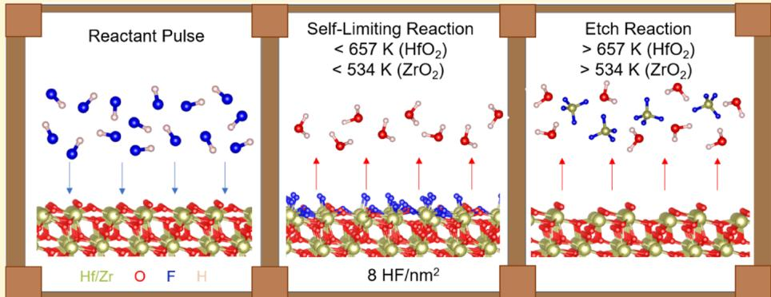

ABSTRACT:  $\mathrm{HfO}_2$  and  $\mathrm{ZrO}_2$  are two high-  $k$  materials that are important in the downscaling of semiconductor devices. Atomic- level control of material processing is required for the fabrication of thin films of these materials at nanoscale device sizes. Thermal atomic layer etching (ALE) of metal oxides, in which up to one monolayer of the material can be removed, can be achieved by sequential self- limiting (SL) fluorination and ligand- exchange reactions at elevated temperatures. However, to date, a detailed atomistic understanding of the mechanism of thermal ALE of these technologically important oxides is lacking. In this paper, we investigate the hydrogen fluoride (HF) pulse in the first step in the thermal ALE process of  $\mathrm{HfO}_2$  and  $\mathrm{ZrO}_2$  using first- principles simulations. We introduce Natarajan- Elliott analysis, a thermodynamic methodology, to compare reaction models representing the self- limiting (SL) and continuous spontaneous etching (SE) processes taking place during an ALE pulse. Applying this method to the first HF pulse on  $\mathrm{HfO}_2$  and  $\mathrm{ZrO}_2$ , we found that thermodynamic barriers impeding continuous etching are present at ALE- relevant temperatures. We performed explicit HF adsorption calculations on the oxide surfaces to understand the mechanistic details of the HF pulse. A HF molecule adsorbs dissociatively on both oxides by forming metal- F and  $\mathrm{O} - \mathrm{H}$  bonds. HF coverages ranging from  $1.0 \pm 0.3$  to  $17.0 \pm 0.3 \mathrm{HF / nm}^2$  are investigated, and a mixture of molecularly and dissociatively adsorbed HF molecules is present at higher coverages. Theoretical etch rates of  $- 0.61 \pm 0.02 \mathrm{~A / cycle}$  for  $\mathrm{HfO}_2$  and  $- 0.57 \pm 0.02 \mathrm{~A / cycle}$  for  $\mathrm{ZrO}_2$  were calculated using maximum coverages of  $7.0 \pm 0.3$  and  $6.5 \pm 0.3 \mathrm{~M} - \mathrm{F}$  bonds  $\mathrm{nm}^2$ , respectively  $(\mathrm{M} = \mathrm{HE}, \mathrm{Zr})$ .

# INTRODUCTION

The scaling of semiconductor devices means that features are required at the nanometer scale. As a result of the shrinking of device feature sizes,  $\mathrm{SiO}_2$  gate dielectrics would be so thin that electron tunneling through the dielectric layer, which leads to high leakage currents, is impossible to avoid. Materials with high dielectric constant,  $k$ , allow a high drive current to be maintained, while minimized leakage current and a low equivalent oxide thickness can be achieved.  $\mathrm{HfO}_2$  and  $\mathrm{ZrO}_2$  are high-  $k$  dielectric materials with dielectric constants of  $22 - 23$ , which are used in semiconductor devices.  $\mathrm{HfO}_2$  and  $\mathrm{ZrO}_2$  are also thermodynamically stable when interfaced with silicon in semiconductor applications. However, conformal nanometer- scale feature sizes in high- aspect- ratio structures are difficult to achieve with traditional wet and dry chemical etching methods, which do not permit the level of control required. Recently, atomic layer etching (ALE) has gained significant interest for the controlled etching of thin films, in particular, for nanoelectronic devices. ALE shares many features with atomic layer deposition (ALD) and can be considered as the reverse of ALD. ALE permits the removal of thin films with atomic- scale precision using sequential and self- limiting (SL) surface reactions, similar to ALD.

Traditional ALE processes are anisotropic as they use directional high- energy ion bombardment to remove the modified surface layer. Thermal ALE relies on temperature

  
Figure 1. Schematic model of the thermal ALE process.

and thermochemically favorable reactions to remove surface species.10 While there have been many examples of thermal ALE of a range of materials, including  $\mathrm{HfO}_2,$  4,9,11,124,9,11,12  $\mathrm{ZrO}_2,$  4,12  $\mathrm{SiO}_2,$  13  $\mathrm{Al}_2\mathrm{O}_3,$  12,14- 18  $\mathrm{AlN},$  19  $\mathrm{AlF}_3,$  20  $\mathrm{TiO}_2,$  21  $\mathrm{TiN},^{22,23}\mathrm{W},^{24,25}\mathrm{WO}_3,$  26  $\mathrm{ZnO},^{26}$  and  $\mathrm{GaN}^{27}$  and for other ALE techniques including Ar neutral beam  $\mathrm{ZrO}_2,$  plasma ALE  $\mathrm{SiO}_2,$  29,30  $\mathrm{ZnO},^{31}\mathrm{GaN},^{32,33}$  and ALE of  $\mathrm{Si}_3\mathrm{N}_4^{34}$  using infrared annealing, the details of the mechanism of the ALE process still require significant work to understand.

The first step in ALE is the formation of a reactive but nonvolatile layer on the initial film, which is followed by a material removal step to take off only the modified layer as indicated schematically in Figure 1. The key aspect of the ALE process is the self- limiting modification of the pristine film with the first precursor to produce a thin nonvolatile surface layer. The purpose of this modification step is to form a reactive, but nonvolatile, layer that can be easily removed in the subsequent ligand- exchange step.6,33 To date, reactions during thermal ALE are based on gas- phase fluorination that converts the metal- containing film into a layer of the corresponding nonvolatile metal fluoride.4,7,11 For metal oxides, thermal ALE processes generally use HF for the fluorination step.2 HF is a useful nucleophilic fluorination reactant in which the fluoride anion serves as the active reaction species.36 This modification step in thermal ALE is the focus of this paper.

The other half of the thermal ALE cycle consists of a ligand exchange between a metal precursor and the newly formed fluoride layer at elevated temperatures,4,7,11 for which examples include  $\mathrm{Sn(acac)}_2,$  4  $\mathrm{Al(CH}_3\mathrm{)}_{3},^{4,37}\mathrm{Al(CH}_3\mathrm{)}_2\mathrm{Cl},$  4  $\mathrm{SiCl}_4,$  4  $\mathrm{TiCl}_4,$  11  $\mathrm{BCl}_3,$  21 and  $\mathrm{WF}_6$  24 This second reaction produces stable etch products, which are now volatile36 and can be easily removed, leaving behind a film from which one layer or a fraction of a layer has been removed as shown schematically in Figure 1. Repeating this cycle results in controlled removal of layers from the original film. Other applications of thermal ALE include surface cleaning for the removal of metal impurities in semiconductor fabrication, conformal etching in high- aspect- ratio structures, and smoothing of surfaces to obtain flat and damage- free layers, which are also important in the semiconductor industry.7,38 Therefore, thermal ALE is a strong candidate as a processing technology in current and future semiconductor device fabrication.37

Given that it is difficult to investigate the ALE reactions directly using experimental techniques, first- principles- based atomic- level simulations using density functional theory (DFT) can give deep insights into the precursor chemistry and the reactions that drive the etch of metal oxides. In this paper, the hydrogen fluoride (HF) pulse in the first step in thermal ALE of  $\mathrm{HfO}_2$  and  $\mathrm{ZrO}_2$  using DFT calculations will be examined. HF molecules adsorb at the surfaces of metal oxides by forming metal- F bonds, and there can also be hydrogen bonds between HF molecules. In addition, adsorbed HF may remain intact or dissociate. In the latter case,  $\mathrm{Hf - F / Zr - F}$  and  $\mathrm{O - H}$  are formed on  $\mathrm{HfO}_2$  and  $\mathrm{ZrO}_2,$  similar to that in recent work on  $\mathrm{Al}_2\mathrm{O}_3$  etch modeling.39 The amount etched (etch rate) is determined by how much of the oxide surface is fluorinated and how much of the metal fluoride can be removed in the ligand exchange for one ALE cycle.4

In addition to investigating HF adsorption, we introduce Natarajan- Elliott analysis (N- E analysis, in short) to predict the conditions at which a self- limiting (SL) or continuous spontaneous etch (SE) reaction becomes thermodynamically favorable, subject to kinetic barriers. This information is useful for directing experimental studies of thermal ALE. Self- limiting reactions are a necessary part of thermal ALE and allow the degree of etching to be well controlled and defined. We find that SL reactions are more favorable than the competing SE reactions for the HF pulse on  $\mathrm{HfO}_2$  and  $\mathrm{ZrO}_2$  at  $0\mathrm{K}$ . The temperatures above which spontaneous etching is favored are 657 and  $534\mathrm{K}$  for  $\mathrm{HfO}_2$  and  $\mathrm{ZrO}_2,$  respectively, at typical thermal ALE reactant pressures. Introducing one HF molecule to the bare surfaces of  $\mathrm{HfO}_2$  and  $\mathrm{ZrO}_2$  results in dissociative adsorption irrespective of the binding site. We determine the maximum coverage of metal- F bonds on the surface and use this coverage to calculate a theoretical etch rate. We also determine the maximum etch rate computed from the lattice constants of  $\mathrm{HfO}_2$  and  $\mathrm{ZrO}_2$  for one monolayer (ML) removal of  $\mathrm{Hf / Zr}$ . We compare this maximum etch rate to experimental etch rates to calculate the number of  $\mathrm{Hf / Zr}$  removed per surface area. We study the spontaneous formation of water that resulted from some of our relaxed geometries. This combined thermodynamic and mechanistic investigation using the first- principles simulation allows us to understand and design novel ALE processes for other technologically relevant materials. We first present a thermodynamic analysis that shows that the fluorinated surface is preferred over the oxygen fluoride and then present a detailed analysis of the adsorption coverage of HF molecules at  $\mathrm{HfO}_2$  and  $\mathrm{ZrO}_2,$  which allows us to also predict etch rates and number of metal atoms removed in a cycle.

# COMPUTATIONAL METHODS

All reported surface slab calculations in this paper are performed using spin- polarized density functional theory as implemented in the VASP40 5.4 package. The calculations are based on the generalized gradient approximation (GGA) using the Perdew- Burke- Ernzerhof (PBE) exchange- correlation (XC) functional.41 The self- consistent energy for the electronic minimization is converged within  $1\times 10^{- 4}$  eV, and the forces for ionic relaxation are converged within  $- 2\times 10^{- 2}$  eV/Å. The default smearing method of Methfessel- Paxton first order is used with  $0.1\mathrm{eV}$  broadening for electronic relaxation. The core

electrons are described by projector- augmented wave (PAW) potentials,42 and the valence electrons (Hf:  $6s^2 5d^2$  Zr:  $5s^2 4d^2$  O:  $2s^2 2p^4$  F:  $2s^2 2p^5,$  and H:  $1s^1$  ) are treated using plane- wave basis sets with a kinetic energy cutoff of  $400\mathrm{eV}$  For configurations 2HF B for  $\mathrm{HfO_2}$  and  $\mathrm{ZrO_2},$  we include the tag  $\mathrm{IVDW} = 20$  for the TkatchenkoScheffler scheme in our INCAR. We found that their adsorption energies were increased only by  $\approx 0.05\mathrm{eV}$  by including this dispersion method and therefore we do not include it in the below analysis.

Relating SL and SE Processes: N- E Analysis. The relationship between SE and SL processes of a substrate exposed to a single gaseous reactant is described schematically in Figure 2. In an SL reaction, represented by the solid green arrow in Figure 2, the reactant molecules passivate the material surface and form a nonvolatile layer that resists further reaction. Such a reaction is referred to as a "surf  $\rightarrow$  surf" reaction

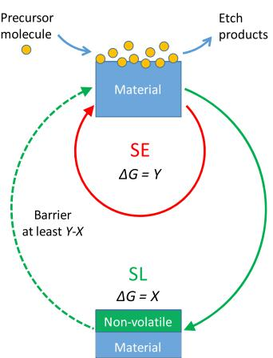  
Figure 2. Schematic representation of the relationship between continuous spontaneous etch (SE, red) and self-limiting (SL, green) processes.  $\Delta G$  represents the reaction free energy.

$$
\mathrm{SL}:A_{\mathrm{surf}} + B_{\mathrm{gas}}\rightarrow C_{\mathrm{surf}} \tag{1}
$$

with the reaction free energy defined as  $\Delta G = X$  Here, the starting surface  $A$  is necessarily different from the final surface C. It is possible that byproducts are released into the gas phase during this reaction

$$
\mathrm{SL}:A_{\mathrm{surf}} + B_{\mathrm{gas}}\rightarrow C_{\mathrm{surf}} + D_{\mathrm{gas}} \tag{2}
$$

Conversely, in a SE reaction (represented by the solid red arrow in Figure 2), the reactant molecules etch away units of bulk material continuously by forming stable and volatile etch byproducts. This continues until the supply of the reactant gas molecules is stopped or the substrate material is exhausted (e.g., an etch stop is reached). Such a reaction is referred to as a "bulk  $\rightarrow$  gas" reaction

$$
\mathrm{SE}\colon A_{\mathrm{surf}} + A_{\mathrm{bulk}} + B_{\mathrm{gas}}\rightarrow A_{\mathrm{surf}} + B_{\mathrm{gas}} \tag{3}
$$

$$
\mathrm{SE}\colon A_{\mathrm{bulk}} + B_{\mathrm{gas}}\rightarrow E_{\mathrm{gas}} \tag{4}
$$

with the reaction free energy  $\Delta G = Y$  Clearly,  $Y$  is independent of  $A_{\mathrm{surf}}$

The reaction free energy  $\Delta G$  at temperature  $T$  is computed as

$$
\begin{array}{rl} & {\Delta G = \Delta H - T\Delta S + RT\ln (Q)}\\ & {\Delta H = \Delta E + \Delta Z\mathrm{PE} + \Delta W(T)}\\ & {\Delta E = \sum_{\mathrm{P}}\mu E_{\mathrm{P}} - \sum_{\mathrm{r}}\mu E_{\mathrm{r}}}\\ & {Q = \prod p_{\mathrm{products}}^{\mu} / \prod p_{\mathrm{reactants}}^{\mu}} \end{array} \tag{7}
$$

In eq 5,  $\Delta H$  and  $\Delta S$  represent the changes in reaction enthalpy and reaction entropy, respectively. Since the partial pressures of the reactants and products are variable in the reaction chamber, the  $RT\ln (Q)$  term is included.  $\Delta H$  in eq 6 includes three contributions, namely, electronic reaction energy  $\Delta E,$  zero- point energy change  $\Delta Z\mathrm{PE},$  and a temperature- dependent enthalpic contribution  $\Delta W(T)$  While the reaction energy  $(\Delta E)$  in eq 7 includes only the bonding information at temperature  $T = 0\mathrm{K},$  the reaction free energy  $(\Delta G)$  provides finite temperature and pressure behavior of a particular reaction. In eq 7,  $\mu$  refers to the stoichiometric coefficient of the corresponding species and indices r and  $\mathbb{P}$  indicate reactant and product species, respectively. The reaction quotient  $Q$  includes partial pressures of the gas- phase reactant and product molecules only. If the reactant and product pressures are the same, then ln  $Q$  becomes 0. A negative  $\Delta S$  increases the free energy and tends to make the reaction more endergonic. Via the translational entropy, the value of  $\Delta S$  is strongly dependent on the difference in molecularity between the products and the reactants. For example, if the number of gaseous molecules in the products is considerably smaller than in the reactants, then the  $\Delta S$  value is likely to be negative and to result in an increase in the reaction free energy. In this work, we also evaluate the contribution from changes in surface entropy.

A negative value of  $\Delta G$  means that the corresponding reaction is exergonic (favorable); otherwise, it is endergonic (unfavorable). The  $\Delta G$  values are based on the SE and SL reactions as thermochemically isolated processes. However, we find it useful to consider also the overall energetics of the reaction pathway that theoretically links SL to SE (the green dotted line in Figure 2). It may be possible to form SE reaction products from the SL reaction products by overcoming one or several energetic barriers. While it is possible to compute kinetic barriers at the first- principles level, we omit this in favor of developing a computational approach that allows rapid screening. Balancing the energies in Figure 2 shows that these unknown barriers must be of magnitude at least  $Y - X$  (free energy difference of SL and SE

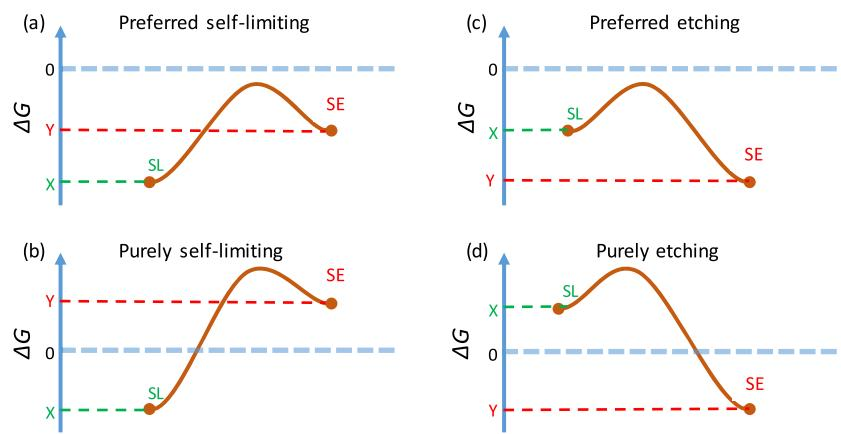  
Figure 3. Schematic energy profiles representing (a) preferred self-limiting, (b) purely self-limiting, (c) preferred etching, and (d) purely etching.

Table 1. Reaction Energies  $\Delta E$  at  $\mathbf{0K}$  and Reaction Free Energies  $\Delta G$  at  $500~\mathrm{K}$  of the Model SE and SL Reactions Representing the HF Pulse on  $\mathbf{HfO}_2$  and  $\mathbf{ZrO}_2^a$  

<table><tr><td colspan="2">reactions</td><td>ΔE (eV/M)</td><td>ΔG (eV/M)</td></tr><tr><td colspan="2">HfO2</td><td></td><td></td></tr><tr><td>SE1</td><td>1HfO2(b) + 4HF(g) → 1HF4(g) + 2H2O(g)</td><td>-0.91</td><td>-0.65</td></tr><tr><td>SL1</td><td>1HfO2(surf) + 4HF(g) → 1HF4(surf) + 2H2O(g)</td><td>-3.27 (2.36)</td><td>-1.20 (0.55)</td></tr><tr><td>SE2</td><td>1HfO2(b) + 2HF(g) → 1HfOF2(g) + 1H2O(g)</td><td>3.87</td><td>3.10</td></tr><tr><td>SL2</td><td>1HfO2(surf) + 2HF(g) → 1HfOF2(surf) + 1H2O(g)</td><td>-1.64 (5.51)</td><td>-0.60 (3.70)</td></tr><tr><td colspan="2">ZrO2</td><td></td><td></td></tr><tr><td>SE1</td><td>1ZrO2(b) + 4HF(g) → 1ZrF4(g) + 2H2O(g)</td><td>-1.14</td><td>-0.89</td></tr><tr><td>SL1</td><td>1ZrO2(surf) + 4HF(g) → 1ZrF4(surf) + 2H2O(g)</td><td>-3.04 (1.90)</td><td>-1.00 (0.11)</td></tr><tr><td>SE2</td><td>1ZrO2(b) + 2HF(g) → 1ZrF4(g) + 1H2O(g)</td><td>-2.96</td><td>-1.9</td></tr><tr><td>SL2</td><td>1ZrO2(surf) + 2HF(g) → 1ZrOF2(surf) + 1H2O(g)</td><td>-1.52 (4.48)</td><td>-0.50 (2.69)</td></tr></table>

The value within parenthesis corresponds to the minimum barrier between the respective SE and SL reactions. The product state of SL1 and SL2 reactions is the 8O/16F surface of  $\mathrm{MO}_2$ $\mathrm{(M = Hf / Zr)}$  as described in the previous section, and the reaction energy is listed per the modified M atom.

reactions) in energy units. This term  $Y - X$  will be referred to as the "minimum barrier" in this paper.

Based on the values of  $X$  and  $Y$ , we can distinguish the four possible scenarios for the precursor pulse shown in Figure 3. Each profile in Figure 3 depicts a set of SL and SE reaction free energies separated by unknown energetic barriers, which in reality may consist of many barriers in the configurational space of the system. Computing all of the reaction pathways and barriers separating the SL and SE product states would be computationally demanding. The aim of this methodology is to form useful conclusions without computing these pathways, thus accelerating process design. The minimum possible barrier to drive the etch reaction from the SL to SE product state is  $Y - X$  in energy units as mentioned earlier. In the energy profiles, the SL reaction appears on the left- hand side of the horizontal axis since the precursor molecules start first react with the surface before accessing the bulk. To cause etching from there onward, the precursor molecules may have to lift the surface atoms out of their lattice positions or diffuse into the subsurface region and finally form volatile products. Therefore, the SL reaction is shown to the right of the SL reaction in these energy profiles.

Depending on whether the SL reaction or the SE reaction is the most favorable (based on their  $\Delta G$  values), the energy profiles in Figure 3 are classified broadly as self- limiting or etching. The energy profile in Figure 3a is termed as "preferred self- limiting" since the SL reaction is more thermodynamically favored than the SE reaction, even though both SL and SE reactions are exergonic. Here, there is a possibility of etching if the collective barrier (at least  $Y - X$ ) could be overcome under the reactor conditions. If the energy profile in Figure 3a is shifted along the vertical axis such that the SL reaction is exoergic and the SE reaction is endergonic, we obtain the energy profile in Figure 3b termed as "purely self- limiting". This is the ideal energy profile for the surface modification pulse in an ALE process since unlimited etching is energetically unfavorable. The energy profile in Figure 3c is the reverse of that in Figure 3a since the SE reaction is energetically more favorable than the SL reaction ( $Y - X < 0$ ). The collective barrier, if any, for etching would be comparatively lower than in the preferred self- limiting state, and it may be easily breached under the reactor conditions. Therefore, the energy profile in Figure 3c is termed as "preferred etching". Figure 3d is obtained by shifting the energy profile in Figure 3c such that the SL reaction is endergonic and the SE reaction is exergonic. This profile is termed as "purely etching" since the precursor molecules should readily volatilize the surface atoms and proceed to the subsurface region to cause bulk etching without significant barriers. This is the ideal energy profile for a SE pulse. Thus, the shape of the energy profile at any given temperature and pressure will allow us to predict the net effect of the precursor- substrate interaction. We refer to this computational approach as the N- E analysis.

To summarize, by comparing the energetics and thermodynamics of the SE (bulk  $\rightarrow$  gas) and SL (surf  $\rightarrow$  surf) reactions, along with the minimum energetic barrier separating them, we can predict whether the gas of a particular precursor pulse will spontaneously etch the substrate material at the temperatures and pressures of interest.

Bulk and Slab Models. We have optimized the bulk unit cell of monoclinic  $\mathrm{HfO}_2$  (space group:  $P2_{1} / c$ ) and  $\mathrm{ZrO}_2$  (space group:  $P2_{1} / c$ ) by simultaneously relaxing the ionic positions, cell shape, and cell volume with an energy cutoff of  $550 \mathrm{eV}$  and a Monkhorst- Pack  $k$ - point sampling mesh of  $(6 \times 6 \times 6)$ . The bulk monoclinic unit cells of  $\mathrm{HfO}_2$  and  $\mathrm{ZrO}_2$  have four metal atoms and eight O atoms. The optimized lattice constants of  $\mathrm{HfO}_2$  from this setup are  $a = 5.142 \mathrm{\AA}$ ,  $b = 5.195 \mathrm{\AA}$ , and  $c = 5.326 \mathrm{\AA}$ , while the lattice constants of  $\mathrm{ZrO}_2$  are  $a = 5.140 \mathrm{\AA}$ ,  $b = 5.189 \mathrm{\AA}$ , and  $c = 5.239 \mathrm{\AA}$ . Comparing our values to the experimental values for the baddeleyite phase, the deviations for  $\mathrm{HfO}_2$  are  $a = 0.43\%$ ,  $b = 0.48\%$ , and  $c = 0.96\%$  and for  $\mathrm{ZrO}_2$  are  $a = 0.58\%$ ,  $b = 0.78\%$ , and  $c = 1.89\%$ .

A surface slab of monoclinic  $\mathrm{HfO}_2$  and  $\mathrm{ZrO}_2$  with a (111) orientation is used for the surface calculations as this is the most stable facet at low temperatures and has the lowest surface energy. A surface supercell of  $\mathrm{HfO}_2$  and  $\mathrm{ZrO}_2$  with a  $(2 \times 2)$  expansion of the hexagonal unit cell and  $16 \mathrm{\AA}$  of vacuum separating the slabs is used for the surface models; this has a stoichiometry of  $\mathrm{Hf}_{80} / \mathrm{Zr}_{80} \mathrm{O}_{160}$  per supercell. It consists of five layers of  $16 \mathrm{HfO}_2 / \mathrm{ZrO}_2$  units, and a  $k$ - point sampling mesh of  $(2 \times 2 \times 1)$  is used for geometry optimization. The product states of the SL reactions needed for the  $\mathrm{N} - \mathrm{E}$  analysis are obtained by adding two  $\mathrm{F}$  atoms per surface  $\mathrm{O}$  removed (for brevity, we denote this ratio  $1 \mathrm{O} / 2 \mathrm{~F}$ ) from the top layer of the slab models. We consider three product states for our analysis:  $8 \mathrm{O} / 16 \mathrm{~F}$ ,  $12 \mathrm{O} / 24 \mathrm{~F}$ , and  $16 \mathrm{O} / 32 \mathrm{~F}$ . For the surface slabs, enthalpy  $\mathrm{H}$  and entropy  $\mathrm{S}$  are computed using the Phonopy code by considering only the first layer of atoms. The calculations for the reactant molecules and gas- phase byproducts are performed in VASP with a large periodic box of dimensions  $15.0 \mathrm{\AA} \times 16.0 \mathrm{\AA} \times 15.5 \mathrm{\AA}$  and  $400 \mathrm{eV}$  plane- wave energy cutoff. The enthalpy and entropy for the gas- phase molecules were calculated from the free program in the Turbomole suite at 1 atm pressure. The above calculations are performed with the PBE exchange- correlation functional and a polarized triple  $\zeta$  basis set (def- TZVPP) and default medium grid.

For the HF adsorption studies, the molecules are introduced at various surface sites and at different coverages on the (111) surface slabs of  $\mathrm{HfO}_2$  and  $\mathrm{ZrO}_2$ . The absorbate coverages and binding energies are computed, and a surface model with maximum coverage of metal-  $\mathrm{F}$  is then used to derive the theoretical etch rate for the HF pulse on  $\mathrm{HfO}_2$  and  $\mathrm{ZrO}_2$ .

The VASP data can be found at the GitHub repository https://github.com/RitaMull/Thermal- ALE- HfO2- and- ZrO2- with- HF.

# RESULTS

In the first part of this section, we will perform the  $\mathrm{N} - \mathrm{E}$  analysis and compare self- limiting with spontaneous etch

reaction models. In the next part, the adsorption mechanism of HF at a range of coverages on  $\mathrm{HfO}_2$  and  $\mathrm{ZrO}_2$  will be studied, together with analysis of  $\mathrm{H}_2\mathrm{O}$  formation. Finally, a theoretical etch rate is predicted based on the maximum possible coverage of dissociated HF on the material surfaces.

Self- Limiting vs Spontaneous Etch. Comparing the energetics and thermodynamics of the SL and SE model reactions for the fluorination of  $\mathrm{HfO}_2$  and  $\mathrm{ZrO}_2$  using HF, we can predict whether the HF pulse will spontaneously etch or result in a self- limiting reaction at the given conditions. Model reactions representing the HF pulse on  $\mathrm{HfO}_2$  and  $\mathrm{ZrO}_2$  are listed in Table 1 together with the corresponding reaction (free) energies at 0 and  $500~\mathrm{K}$ , with a reactant pressure of 0.2 Torr and a product pressure of 0.01 Torr, as computed from DFT calculations.

This table also includes the minimum barrier to cause spontaneous etch as already discussed. Negative minimum barriers indicate that spontaneous etch is thermodynamically favorable and is hindered only by kinetic barriers, if any. Two SE reactions and two SL reactions are postulated for HF exposure on both  $\mathrm{HfO}_2$  and  $\mathrm{ZrO}_2$ . The SE reactions involve the complete conversion of the bulk metal oxide into volatile metal fluoride (SE1) or metal oxyfluoride (SE2) and water, while the corresponding SL reactions involve conversion of the outermost surface layer of the metal oxide into the nonvolatile metal (oxy)fluoride (terminating the metal oxide), releasing water molecules. For the SE1 reaction of  $\mathrm{Hf / ZrO}_2$ , four HF molecules are needed to etch away one unit of bulk  $\mathrm{Hf / ZrO}_2$  to form  $\mathrm{Hf / ZrF}_4$  and  $\mathrm{H}_2\mathrm{O}$ . For the SE2 reaction for  $\mathrm{Hf / ZrO}_2$ , two HF molecules are required to etch a unit of  $\mathrm{Hf / ZrO}_2$  to form  $\mathrm{Hf / ZrOF}_2$  and  $\mathrm{H}_2\mathrm{O}$ . In the SE reactions, the surface of the material before and after each precursor pulse will be identical and therefore their contributions are ignored from the reaction model. For the SL reactions, the surfaces are not identical before and after the pulse and their contributions have to be included. In Table 1, the SL product state of the surfaces is 8O/16F (refer to Supporting Information (SI) for the geometry).

A negative reaction (free) energy  $(\Delta G)$  means that the reaction is exergonic (favorable), and a positive  $\Delta G$  means that the reaction is endergonic (unfavorable). The SE2 reactions forming volatile metal oxyfluorides are unfavorable at 0 and  $500~\mathrm{K}$  as the reaction (free) energy is positive (unfavorable), whereas the SE1 reactions forming volatile metal fluorides are favorable. For all of the SL- SE combinations at  $0\mathrm{K}$ , for both materials, the minimum barrier to etch was positive, suggesting that self- limiting reaction is the most favorable energetically. At  $500\mathrm{K}$ , the thermodynamic barrier is reduced considerably, which means high temperatures favor SE reactions. In any case, below  $500~\mathrm{K}$ , the minimum barrier is positive, suggesting that SL reactions are preferred for both metal oxides. Therefore, up to  $500~\mathrm{K}$ , the reactions are in preferred self- limiting state for both materials. Therefore, we can propose that the reaction of HF in the first step will self- limit on both metal oxides at least up to  $500~\mathrm{K}$ .

As the SE1 reactions forming the volatile metal fluoride are more favorable than the SE2 reactions that form the oxyfluoride, we will consider only the SE1 reactions for further analysis. Moreover, the barrier to etch was very high for the SL2- SE2 reactions as compared to the SL1- SE1, even at 500 K, suggesting that spontaneous formation of oxyfluoride is not probable at ALE- relevant temperatures.

Reaction Free Energy Profiles (FEPs). The free energy profiles (FEPs) of the reactions in Table 1 are discussed in this section. Comparing the reaction FEPs of the SE and SL reactions, we can determine at a given temperature and reactant pressure whether the HF pulse will favor spontaneous etching or self- limited conversion of  $\mathrm{HfO}_2$  and  $\mathrm{ZrO}_2$  into a nonvolatile metal fluoride layer. Here, we use a reactant pressure of 0.2 Torr and a product pressure of 0.01 Torr within a temperature range of  $0 - 1000\mathrm{K}$ . The various contributions to the free energy for the example of the SE1 reaction for  $\mathrm{HfO}_2$  are plotted in Figure 4.

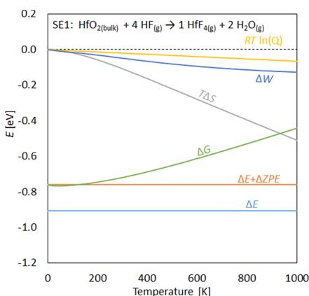  
Figure 4. Contributions to the reaction FEP of the SE1 reaction of  $\mathrm{HfO}_2$  shown in Table 1.  $RT\ln (Q)$  in gold accounts for the partial pressures of the reactants and products, enthalpic contribution  $(\Delta W)$  is given in dark blue, entropy term  $(T\Delta S)$  in gray, reaction energy  $(\Delta E)$  in light blue, the sum of reaction energy and zero-point energy change  $(\Delta E + \Delta \mathrm{ZPE})$  in brown, and reaction free energy  $(\Delta G)$  in green.

In Figure 4, the  $\Delta E$  and  $\Delta \mathrm{ZPE}$  contributions are temperature independent.  $T\Delta S$  is the entropy contribution and is  $0\mathrm{eV}$  at  $0\mathrm{K}$  and  $- 0.5\mathrm{eV}$  at  $1000~\mathrm{K}$ . The entropy term decreases with increasing temperature because four gaseous reactant molecules result in the formation of three product molecules only. The  $RT\ln (Q)$  and  $\Delta W$  contributions are clearly smaller in comparison to the entropy term. They decrease the free energy at high temperatures and compete against the entropy term that increases the free energy with temperature. The FEP of this reaction at the reactant and product pressures stated above is exergonic up to  $1000~\mathrm{K}$ . The other reactions show similar contributions.

The FEPs of the SE1 and SL1 reactions of  $\mathrm{HfO}_2$  and  $\mathrm{ZrO}_2$  are compared in Figure 5. For  $\mathrm{HfO}_2$ , the self- limiting reaction is preferred up to  $656~\mathrm{K}$ . At  $657~\mathrm{K}$ , the SE1 and SL1 reactions are isoenergetic, with the minimum barrier becoming zero, and beyond this, the SE1 reaction is more favorable. Finally, at  $813~\mathrm{K}$ , the self- limiting reaction becomes endergonic and continuous etching dominates. We see similar trends for  $\mathrm{ZrO}_2$ , with self- limiting reactions preferred up to  $533~\mathrm{K}$ , while at  $770~\mathrm{K}$ , the self- limiting reaction becomes endergonic and continuous etching remains exergonic.

In Figure 5, the FEP is computed using the 8O/16F model as the SL product state. For completeness, we also determine the FEPs for two other SL product models, namely,  $12\mathrm{O} / 24\mathrm{F}$  and  $16\mathrm{O} / 32\mathrm{F}$ . Both surfaces of  $\mathrm{HfO}_2$  and  $\mathrm{ZrO}_2$  have 16 topmost O atoms (oxygen) in the supercell that could react with the HF molecules. For the  $12\mathrm{O} / 24\mathrm{F}$  product state, three- fourths of surface O are removed and  $24~\mathrm{F}$  (fluorine) are

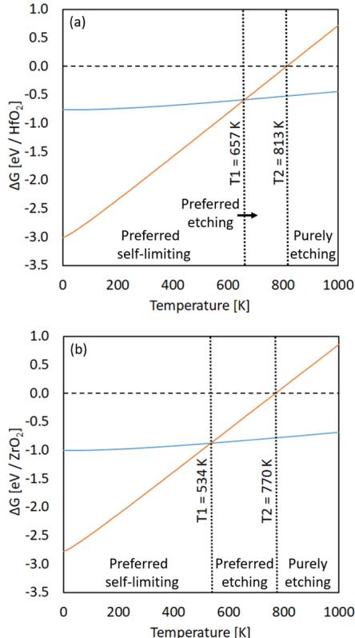  
Figure 5. Free energy profiles for the SE1 (blue) and SL1 (orange) reactions of (a)  $\mathrm{HfO}_2$  and (b)  $\mathrm{ZrO}_2$  from 0 to  $1000\mathrm{K}$  at the pressures given in the text.  $T_{1}$  is where the self-limiting and spontaneous etch reactions cross over for the 8O/16F model, and  $T_{2}$  is where spontaneous etching is preferred.

added to replace them. For the 16O/32F, all surface O are removed and  $32\mathrm{F}$  are added to replace them. All oxygen atoms were removed as  $\mathrm{H}_2\mathrm{O}$  molecules. Basically, the  $\mathrm{M} - \mathrm{O}$ $\mathrm{M} = \mathrm{Hf},$  Zr) coordination numbers of the surface metal atoms are decreasing from 8O/16F to 16O/32F. Note that the more O atoms are removed, the easier it would be to remove the surface metal atoms in the second pulse due to the reduced metal- O interaction. Therefore, we use the 12O/24F and 16O/32F product states merely as extreme test cases to compare their thermodynamic stability with the more reasonable 8O/16F model. The geometries used for the SL thermochemical calculations of both metal oxides are shown in Section S1 of the Supporting Information. Table 2 shows the energetics for the SL reactions including 12O/24F and 16O/ 32F models.

At  $0\mathrm{K},$  all SL reactions are more favorable than the SE reaction for both oxides and the minimum barriers are positive. For both oxides, we find the minimum barrier to decrease with the number of surface O atoms removed, with the lowest barriers for  $\mathrm{ZrO}_2$  At  $500\mathrm{K},$  the SL1 and SL2 reactions continue to be more favorable than the SE reaction, whereas the SL3 reaction is not. This means that an aggressive removal of surface O by HF during the first pulse would also enhance etching of the surface  $\mathrm{Hf} / \mathrm{Zr}$  atoms at ALE- relevant temperatures, say  $500~\mathrm{K}$

Experimental work showed that the HF reaction is selflimiting on  $\mathrm{HfO}_2$  at  $200^{\circ}C$ $(473\mathrm{K})$ $520^{\circ}C$ $(523\mathrm{K})$  11 and  $300^{\circ}\mathrm{C}$ $(573\mathrm{K})$  11 Compared (8O/16F), Figure 6, this is true for partial surface O removal (8O/16F), where self- limiting is preferred up to  $618~\mathrm{K}$  for three- fourths of surface O removal and up to  $657~\mathrm{K}$  for one half of surface O removal. The same analysis holds for  $\mathrm{ZrO}_2$  (Figure 7). Therefore,  $\mathrm{N} - \mathrm{E}$  analysis is a simple and relatively inexpensive method to predict the structure of the surface after the first ALE pulse. We will further validate this methodology on experimental results for different ALE processes in a future publication.

Table 2. Reaction (Free) Energies and Minimum Barriers within Parenthesis at O and  $500~\mathrm{K}$  for the Model SL Reactions Representing the HF Pulse on  $\mathbf{HfO}_2$  and  $\mathbf{ZrO}_2$  for 8O/16F,12O/24F, and 16O/32F SL Product States  $\mathbf{M} =$  Hf, Zr)  

<table><tr><td></td><td>SL product state</td><td>ΔE (0 K) (eV/M)</td><td>ΔG (500 K) (eV/M)</td></tr><tr><td></td><td></td><td>HfO2</td><td></td></tr><tr><td>SE1</td><td>HfF4</td><td>-0.91</td><td>-0.65</td></tr><tr><td>SL1</td><td>8O/16F</td><td>-3.27 (2.36)</td><td>-1.20 (0.55)</td></tr><tr><td>SL2</td><td>12O/24F</td><td>-3.05 (2.14)</td><td>-1.04 (0.39)</td></tr><tr><td>SL3</td><td>16O/32F</td><td>-2.45 (1.54)</td><td>-0.41 (-0.24)</td></tr><tr><td></td><td></td><td>ZrO2</td><td></td></tr><tr><td>SE1</td><td>ZrF4</td><td>-1.14</td><td>-0.89</td></tr><tr><td>SL1</td><td>8O/16F</td><td>-3.04 (1.90)</td><td>-1.00 (0.11)</td></tr><tr><td>SL2</td><td>12O/24F</td><td>-2.91 (1.77)</td><td>-0.90 (0.01)</td></tr><tr><td>SL3</td><td>16O/32F</td><td>-2.17 (1.03)</td><td>-0.11 (-0.78)</td></tr></table>

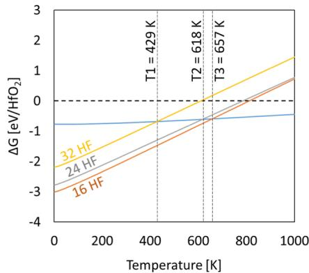  
Figure 6. Free energy profiles of the continuous etching and self-limiting reactions for  $\mathrm{HfO}_2$ .  $T_{1}$ ,  $T_{2}$ , and  $T_{3}$  are where the self-limiting and spontaneous etch reactions cross over for 16O/32F, 12O/24F, and 8O/16F models, respectively.

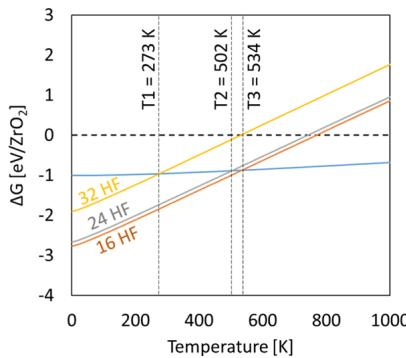  
Figure 7. Free energy profiles of the continuous etching and self-limiting reactions for  $\mathrm{ZrO}_2$ .  $T_{1}$ ,  $T_{2}$ , and  $T_{3}$  are where the self-limiting and spontaneous etch reactions cross over for 16O/32F, 12O/24F, and 8O/16F models, respectively.

Adsorption of One HF Molecule at  $\mathsf{HfO}_2$  and  $\mathbf{ZrO}_2$ . Kondati Natarajan and Elliott studied the adsorption of HF on the bare surface of  $\mathrm{Al}_2\mathrm{O}_3$  and found that Al- F bonding is

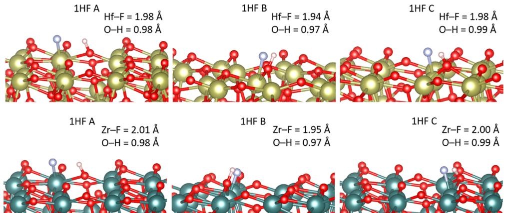  
Figure 8. Relaxed adsorption structures for one HF molecule interacting with the bare surfaces of  $\mathrm{HfO_2}$  and  $\mathrm{ZrO_2}$ . The color coding is yellow  $= \mathrm{Hf}$ , green  $= \mathrm{Zr}$ , red  $= \mathrm{O}$ , white  $= \mathrm{H}$ , and blue  $= \mathrm{F}$ .

crucial for HF dissociation. To find whether the same holds for  $\mathrm{HfO_2}$  and  $\mathrm{ZrO_2}$ , we adsorb one HF molecule to the optimized bare surfaces of both oxides at different binding sites (which we term A, B, and C). These sites were chosen to test whether molecular or dissociative adsorption of HF is sensitive to the adsorption site. The different binding sites for one HF are shown in Section S2 of the Supporting Information.

Figure 8 shows that the HF molecule is spontaneously dissociated at each binding site to form metal- F and  $\mathrm{O} - \mathrm{H}$  bonds on both oxides. No molecular HF adsorption was found. Similar to the  $\mathrm{Al}_2\mathrm{O}_3$  case, we find that the HF dissociation proceeds after a stable  $\mathrm{M} - \mathrm{F}$ $\mathrm{M} = \mathrm{Hf}, \mathrm{Zr}$  bond is formed. The computed adsorption energies for the dissociative adsorption of one HF molecule on the bare surface of  $\mathrm{HfO_2}$  are  $- 1.52$ ,  $- 1.95$ , and  $- 1.63 \mathrm{eV}$  at sites A, B, and C, respectively. The corresponding values for  $\mathrm{ZrO_2}$  are  $- 1.25$ ,  $- 1.74$ , and  $- 1.48 \mathrm{eV}$ . The interaction between  $\mathrm{HfO_2}$  and HF is  $0.15 - 0.21 \mathrm{eV}$  stronger than between  $\mathrm{ZrO_2}$  and HF. The  $\mathrm{Hf} - \mathrm{F}, \mathrm{Zr} - \mathrm{F}$ , and  $\mathrm{O} - \mathrm{H}$  bond lengths are shown for each adsorption mode in Figure 8. The surface  $\mathrm{O}$  atoms are either 2- fold or 3- fold coordinated by surface  $\mathrm{Hf / Zr}$  atoms on both surfaces. All of the surface  $\mathrm{Hf / Zr}$  atoms are 6- fold coordinated by  $\mathrm{O}$  atoms. Since the structures of  $\mathrm{HfO_2}$  and  $\mathrm{ZrO_2}$  are similar, the strongest adsorption mode (one HF B for  $\mathrm{HfO_2} - 1.95 \mathrm{eV}$  and for  $\mathrm{ZrO_2} - 1.74 \mathrm{eV}$ ) involves the same 6- fold coordinated metal lattice site and 2- fold coordinated surface oxygen site.

Stability of Different HF Coverages. The stability of different HF coverages was examined by introducing up to 34 randomly oriented HF molecules per supercell ca.  $3 \mathrm{\AA}$  from the bare monoclinic (111) surface of  $\mathrm{HfO_2}$  and  $\mathrm{ZrO_2}$ ; this results in coverages ranging from  $1.0 \pm 0.3$  to  $17.0 \pm 0.3 \mathrm{HF / nm^2}$  (2 HF to  $34 \mathrm{HF}$  molecules per supercell). There are 16 topmost metal atoms on the surface of the  $(2 \times 2)$  supercell that may form metal- F bonds on both oxides. There are also 16 surface oxygen atoms on the bare surface of each metal oxide that can form  $\mathrm{O} - \mathrm{H}$  bonds or, as seen in some simulations,  $\mathrm{H}_2\mathrm{O}$ , which we discuss later. For each metal oxide, three different configurations (A, B, and C) were examined for the range of HF coverages using 2, 3, 4, 5, and 8 molecules per supercell and two configurations (A and B) using 12 and 16 molecules per supercell and one configuration for 30, 32, and 34 molecules per supercell. The computed energies of adsorption for the above- mentioned geometries are shown in Tables 3 and 4.

Table 3. Adsorbate Coverages and Binding Energies for the HF Coverages on the  $\mathbf{HfO}_2$  Surface Shown in Figure 9 and in Section S4 of the Supporting Information  

<table><tr><td>HfO2</td><td colspan="2">coverage</td><td colspan="2">Ebind</td></tr><tr><td>geometry</td><td>adsorbed HF (nm-2)</td><td>(Hf-F, dissociated F) (nm-2)</td><td>eV/HF</td><td>eV/nm2</td></tr><tr><td>2HF A (2, 2)</td><td>1.0</td><td>(1.0, 1.0)</td><td>-1.5</td><td>-1.5</td></tr><tr><td>2HF B (1, 1)</td><td>1.0</td><td>(0.5, 0.5)</td><td>-0.8</td><td>-0.8</td></tr><tr><td>2HF C (1, 1)</td><td>1.0</td><td>(0.5, 0.5)</td><td>-1.0</td><td>-1.0</td></tr><tr><td>3HF A (2, 2)</td><td>1.5</td><td>(1.0, 1.0)</td><td>-1.1</td><td>-1.7</td></tr><tr><td>3HF B (2, 2)</td><td>1.5</td><td>(1.0, 1.0)</td><td>-1.1</td><td>-1.6</td></tr><tr><td>3HF C (3, 3)</td><td>1.5</td><td>(1.5, 1.5)</td><td>-1.7</td><td>-2.6</td></tr><tr><td>4HF A (3, 3)</td><td>2.0</td><td>(1.5, 1.5)</td><td>-1.3</td><td>-2.6</td></tr><tr><td>4HF B (3, 3)</td><td>2.0</td><td>(1.5, 1.5)</td><td>-1.3</td><td>-2.7</td></tr><tr><td>4HF C (4, 4)</td><td>2.0</td><td>(2.0, 2.0)</td><td>-1.6</td><td>-3.2</td></tr><tr><td>5HF A (5, 5)</td><td>2.5</td><td>(2.5, 2.5)</td><td>-1.8</td><td>-4.6</td></tr><tr><td>5HF B (4, 4)</td><td>2.5</td><td>(2.0, 2.0)</td><td>-1.4</td><td>-3.4</td></tr><tr><td>5HF C (5, 5)</td><td>2.5</td><td>(2.5, 2.5)</td><td>-1.5</td><td>-3.7</td></tr><tr><td>8HF A (5, 4)</td><td>4.0</td><td>(2.5, 2.0)</td><td>-1.1</td><td>-4.6</td></tr><tr><td>8HF B (6, 6)</td><td>4.0</td><td>(3.0, 3.0)</td><td>-1.3</td><td>-5.2</td></tr><tr><td>8HF C (6, 5)</td><td>4.0</td><td>(3.0, 2.5)</td><td>-1.1</td><td>-4.4</td></tr><tr><td>12HF A (10, 7)</td><td>6.0</td><td>(5.0, 3.5)</td><td>-1.3</td><td>-7.7</td></tr><tr><td>12HF B (10, 7)</td><td>6.0</td><td>(5.0, 3.5)</td><td>-1.2</td><td>-7.3</td></tr><tr><td>16HF A (12, 8)</td><td>8.0</td><td>(6.0, 4.0)</td><td>-1.1</td><td>-9.0</td></tr><tr><td>16HF B (13, 9)</td><td>8.0</td><td>(6.5, 4.5)</td><td>-1.2</td><td>-9.6</td></tr><tr><td>30HF (12, 7)</td><td>15.0</td><td>(6.0, 3.5)</td><td>-0.8</td><td>-11.8</td></tr><tr><td>32HF (12, 6)</td><td>16.0</td><td>(6.0, 3.0)</td><td>-0.8</td><td>-12.1</td></tr><tr><td>34HF (14, 7)</td><td>17.0</td><td>(7.0, 3.0)</td><td>-0.9</td><td>-12.9</td></tr></table>

The first number in parenthesis within the first column corresponds to the total number of  $\mathrm{Hf} - \mathrm{F}$  bonds, and the second number corresponds to the number of dissociated HF molecules. The most stable configurations, when more than one configuration is studied for a coverage, are highlighted in bold.

For  $\mathrm{HfO_2}$ , spontaneous complete dissociation of the adsorbed HF molecules was observed for some configurations with coverages of two, three, four, and five HF molecules, as shown in Figure 9. Similarly, for  $\mathrm{ZrO_2}$ , complete dissociation of adsorbed HF was seen for some configurations with coverages of two and four HF molecules only as shown in Figure 10. However, for the adsorption of three, five, and eight HF molecules on the  $\mathrm{ZrO_2}$  surface, upon relaxation, there were two, four, and seven dissociated HF molecules present for each configuration (A, B, or C); see Section S4 of the Supporting Information.

Table 4. Adsorbate Coverages and Binding Energies for the HF Coverages on the  $\mathbf{ZrO}_2$  Surface Shown in Figure 10 and in Section S4 of the Supporting Information  

<table><tr><td>ZrO2</td><td colspan="2">coverage</td><td colspan="2">Ebind</td></tr><tr><td>geometry</td><td>adsorbed HF (nm-2)</td><td>(Zr-F, dissociated F) (nm-2)</td><td>eV/HF</td><td>eV/nm2</td></tr><tr><td>2HF A (1, 1)</td><td>1.0</td><td>(0.5, 0.5)</td><td>-0.9</td><td>-0.9</td></tr><tr><td>2HF B (1, 1)</td><td>1.0</td><td>(0.5, 0.5)</td><td>-1.0</td><td>-1.0</td></tr><tr><td>2HF C (2, 2)</td><td>1.0</td><td>(1.0, 1.0)</td><td>-1.2</td><td>-1.2</td></tr><tr><td>3HF A (2, 2)</td><td>1.5</td><td>(1.0, 1.0)</td><td>-1.0</td><td>-1.6</td></tr><tr><td>3HF B (3, 2)</td><td>1.5</td><td>(1.5, 1.0)</td><td>-1.2</td><td>-1.9</td></tr><tr><td>3HF C (3, 3)</td><td>1.5</td><td>(1.0, 1.0)</td><td>-0.8</td><td>-1.2</td></tr><tr><td>4HF A (4, 4)</td><td>2.0</td><td>(2.0, 2.0)</td><td>-1.4</td><td>-2.6</td></tr><tr><td>4HF B (4, 4)</td><td>2.0</td><td>(2.0, 2.0)</td><td>-1.5</td><td>-3.1</td></tr><tr><td>4HF C (3, 3)</td><td>2.0</td><td>(1.5, 1.5)</td><td>-1.1</td><td>-2.2</td></tr><tr><td>5HF A (5, 4)</td><td>2.5</td><td>(2.5, 2.0)</td><td>-1.3</td><td>-3.2</td></tr><tr><td>5HF B (4, 4)</td><td>2.5</td><td>(2.0, 2.0)</td><td>-1.1</td><td>-2.8</td></tr><tr><td>5HF C (4, 4)</td><td>2.5</td><td>(2.0, 2.0)</td><td>-1.3</td><td>-3.3</td></tr><tr><td>8HF A (7, 7)</td><td>4.0</td><td>(3.5, 3.5)</td><td>-1.2</td><td>-5.0</td></tr><tr><td>8HF B (7, 7)</td><td>4.0</td><td>(3.5, 3.5)</td><td>-1.3</td><td>-5.1</td></tr><tr><td>8HF C (7, 7)</td><td>4.0</td><td>(3.5, 3.5)</td><td>-1.2</td><td>-4.9</td></tr><tr><td>12HF A (9, 6)</td><td>6.0</td><td>(4.5, 3.0)</td><td>-1.0</td><td>-6.0</td></tr><tr><td>12HF B (9, 7)</td><td>6.0</td><td>(4.5, 3.5)</td><td>-1.0</td><td>-6.3</td></tr><tr><td>16HF A (10, 8)</td><td>8.0</td><td>(5.0, 4.0)</td><td>-1.0</td><td>-7.9</td></tr><tr><td>16HF B (11, 7)</td><td>8.0</td><td>(5.5, 3.5)</td><td>-1.1</td><td>-8.6</td></tr><tr><td>30HF (13, 8)</td><td>15.0</td><td>(6.5, 4.0)</td><td>-0.8</td><td>-11.5</td></tr><tr><td>32HF (12, 6)</td><td>16.0</td><td>(6.0, 3.0)</td><td>-0.7</td><td>-11.5</td></tr><tr><td>34HF (13, 8)</td><td>17.0</td><td>(6.5, 4.0)</td><td>-0.7</td><td>-12.3</td></tr></table>

aThe first number in parenthesis within the first column corresponds to the total number of  $\mathrm{Zr - F}$  bonds, and the second number corresponds to the number of dissociated HF molecules. The most stable configurations, when more than one configuration is studied for a coverage, are highlighted in bold.

In all other HF adsorption configurations for  $\mathrm{HfO}_2$  and  $\mathrm{ZrO}_2,$  we find a mixture of molecular and dissociative adsorption of the HF molecules. We have computed binding energies per HF and per unit surface area of the material as listed in Tables 3 and 4.

For both metal oxides, the binding energy is more favorable as the extent of metal- F bonding increases on the bare surface. This can be seen for  $\mathrm{HfO}_2$  in Table 3 and Figure 11c with HfF coverage from  $1.0\pm 0.3$  to  $7.0\pm 0.3\mathrm{nm}^{- 2}$  with surface binding energies  $- 1.5$  to  $- 12.9\mathrm{eV / nm^2}$  . Similar trends are also seen for  $\mathrm{ZrO}_2$  in Table 4 and Figure 12c with  $\mathrm{Zr - F}$  coverage from  $1.0\pm 0.3$  to  $6.5\pm 0.3\mathrm{nm}^{- 2}$  with surface binding energies  $- 0.9$  to  $- 12.3\mathrm{eV / nm^2}$  .The HF molecules that did not dissociate in the relaxed geometries shown in Section S4 of the Supporting Information form hydrogen bonds with the remaining HF molecules and dissociated F atoms. For higher HF coverages, a more extensive hydrogen- bonded HF network is expected. There are intact HF molecules forming  $\mathrm{M - F}$  bonds as well  $\mathrm{(M = Hf,Zr)}$  whose coverage is found by subtracting the two numbers within parenthesis in Tables 3 and 4. These metal- bound HF molecules  $\mathrm{(M - FH)}$  are not likely to be purged away in the next ALE step as they form strong bonds  $\mathrm{(Hf - F6.7eV}$  and  $\mathrm{Zr - F6.5eV}$  and these HF molecules should likely dissociate when the kinetic barriers are overcome inside the reactor. Therefore, we will use the total number of  $\mathrm{M - F}$  bonds for the etch rate prediction in a later section.

Plot (a) in Figures 11 and 12 show scatter plots for metal- F coverage versus adsorbed HF coverage from the data in Tables 3 and 4 for  $\mathrm{HfO}_2$  and  $\mathrm{ZrO}_2,$  respectively. The dashed line shows a linear correlation between HF adsorption and metalF coverage, which indicates the cases where all adsorbed HF molecules form metal- F bonds. The square data points along the dashed lines are those geometries where adsorbed HF coverage equals metal- F coverage. For HF adsorption at  $\mathrm{HfO}_2,$  this corresponds to the most stable configurations at coverages of 1.0, 1.5, 2.0, and  $2.5\mathrm{HF / nm}^2$  .For  $\mathrm{ZrO}_2,$  this corresponds to the most stable configurations at coverages of 1.0 and  $2.0\mathrm{HF / nm^2}$  . Note that the data points of (2HF B and 2HF C),3HF A and 3HF B),4HF A and 4HF B),5HF A and 5HF C),3HF B and 8HF C),and 12HF A and 12HF B overlap in Figure 11a as their adsorbed HF and  $\mathrm{Hf - F}$  coverages are the same. Similarly, the data points of (2HF A and 2HF B),3HF A and 3HF C),4HF A and 4HF B),5HF B and 5HF C),8HF A and 8HF B and 8HF C),and 12HF A and 12HF B overlap in Figure 12a. The points at higher HF coverages correspond to those geometries in which partially dissociated HF molecules are present, and hence, the points lie below the correlation line. As the HF coverage increases, the metal- F coverage starts to plateau, suggesting maximal coverages of  $(6.0\pm 0.3) - (7.0\pm 0.3)$  metal-  $\mathrm{F / nm^2}$  .Lee et al. found that for low HF coverages during etching of  $\mathrm{HfO}_2$  using HF and  $\mathrm{Sn(acac)}_2,$  there was a lack of self- limiting behavior as the HF reaction had not reached saturation. We

  
Figure 9. Relaxed geometries for HF coverages 2A, 3C, 4C, 5A, and 5C of  $\mathrm{HfO}_2$  where complete dissociation of HF occurred spontaneously. Color coding is the same as in Figure 8.

  
Figure 10. Relaxed geometries for HF coverages 2C, 4A, and 4B of  $\mathrm{ZrO_2}$  where complete dissociation of HF occurred spontaneously. Color coding is the same as in Figure 8.

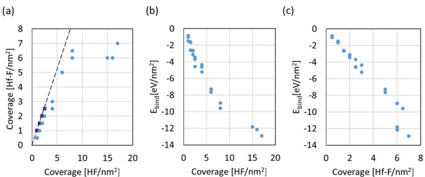  
Figure 11. (a) Scatter plot for  $\mathrm{Hf - F}$  coverage versus total HF coverage for the surface coverage values in Table 3. Note that some HF coverages resulted in partial or complete  $\mathrm{Hf - F}$  coverage for different configurations, for example, the coverage of  $1.0\mathrm{HF / nm^2}$ . The square data points are where the adsorbed HF coverage equals  $\mathrm{Hf - F}$  coverage. The circular data points are where partially dissociated HF molecules are present. Plots (b) and (c) show the change in binding energy per square nanometer with an increase in HF and  $\mathrm{Hf - F}$  coverage, respectively.

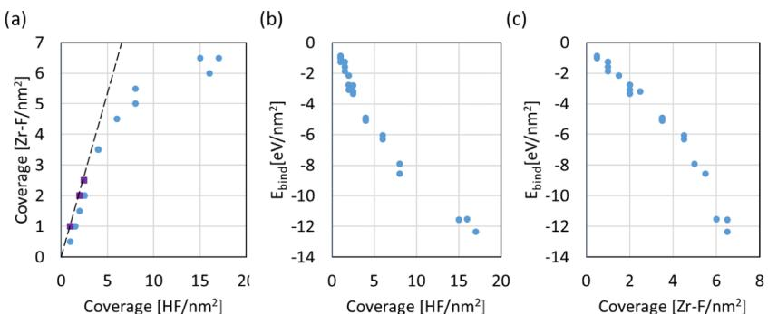  
Figure 12. (a) Scatter plot for  $\mathrm{Zr - F}$  coverage versus total HF coverage for the surface coverage values in Table 4. Note that some HF coverages resulted in partial or complete  $\mathrm{Zr - F}$  coverage for different configurations, for example, the coverage of  $1.0\mathrm{HF / nm^2}$ . The square data points are where the adsorbed HF coverage equals  $\mathrm{Zr - F}$  coverage. The circular data points are where partially dissociated HF molecules are present. Plots (b) and (c) show the change in binding energy per square nanometer with an increase in HF and  $\mathrm{Zr - F}$  coverage, respectively.

  
Figure 13. Relaxed fluorination geometries for  $\mathrm{HfO_2}$  that resulted in  $\mathrm{H}_2\mathrm{O}$  forming spontaneously. Color coding is the same as in Figure 8.

also find from plots (b) and (c) of Figures 11 and 12 that a saturation in the binding energy is not reached even at high HF coverages. Therefore, the highest adsorbed HF coverage of 34 HF with  $\mathrm{M - F}$  coverages  $(\mathrm{M} = \mathrm{Hf}, \mathrm{Zr})$  of  $7.0 \pm 0.3$  and  $6.5 \pm 0.3$  metal-  $\mathrm{F / nm^2}$  will be used as the maximum coverage for the  $\mathrm{HfO_2}$  and  $\mathrm{ZrO_2}$  etch rate prediction, respectively. We added an exponential fit to the data in plot (b) of Figures 11 and 12 in Section S6 of SI along with its derivative, which provides HF addition energy indirectly.

Water Formation. The spontaneous formation of  $\mathrm{H}_2\mathrm{O}$  was observed in some of our relaxed geometries for the examples of 8C  $(3.0 \pm 0.3 \mathrm{Hf - F / nm^2})$  on  $\mathrm{HfO_2}$  and 16A  $(5.0 \pm 0.3 \mathrm{Zr - F / nm^2})$  on  $\mathrm{ZrO_2}$ . The atomic structures are shown in Figure 13, where dissociation of at least two HF molecules provides the hydrogen atoms required to form  $\mathrm{H}_2\mathrm{O}$  as a

  
Figure 14. Relaxed fluorination geometries for  $\mathrm{ZrO_2}$  that resulted in  $\mathrm{H}_2\mathrm{O}$  forming spontaneously. Color coding is the same as in Figure 8.

reaction product, which removes oxygen from  $\mathrm{HfO}_2,$  as discussed in ref 9, but not discussed to date for  $\mathrm{ZrO_2}$ $\mathrm{H}_2\mathrm{O}$  formation on the  $\mathrm{HfO}_2$  surface was observed on geometries 8HF C and 32HF, in which the  $\mathrm{H - O - H}$  bond angle is  $104.2^{\circ}$  Similarly,  $\mathrm{H}_2\mathrm{O}$  formation on the  $\mathrm{ZrO_2}$  surface was observed on geometries 12HF B and 16HF A HF as shown in Figure 14. The  $\mathrm{H - O - H}$  bond angle is  $110.2^{\circ}$  for 12HF B, and for 16HF A, it is 109.4 and  $110.8^{\circ}$

The energy to remove  $\mathrm{H}_2\mathrm{O}$  (energy of desorption) from the fluorinated surfaces of 8HF C and 32HF for  $\mathrm{HfO}_2$  and 12HF B and 16HF A for  $\mathrm{ZrO_2}$  was calculated using eq 9

$$
E_{\mathrm{des}} = (E_{\mathrm{HfO}_{2(\mathrm{surf})} / \mathrm{HF}_{(\mathrm{ads})}} + E_{\mathrm{H}_2\mathrm{O}_{(\mathrm{g})}}) - (E_{\mathrm{HfO}_{2(\mathrm{surf})} / \mathrm{HF}_{(\mathrm{ads})} / \mathrm{H}_2\mathrm{O}_{(\mathrm{ads})}})
$$

The term  $^{\mathrm{a}}E_{\mathrm{HfO}_{2(\mathrm{surf})} / \mathrm{HF}_{(\mathrm{ads})} / \mathrm{H}_{2\mathrm{O}_{(\mathrm{ads})}}}$  is the total energy of HF adsorbed on  $\mathrm{HfO}_2$  with spontaneous  $\mathrm{H}_2\mathrm{O}$  formation.  $\mathrm{H}_2\mathrm{O}$  was removed from the fluorinated metal oxide surface with unbound HF molecules, and the resulting geometry was relaxed. The term  $^{\mathrm{a}}E_{\mathrm{HfO}_{2(\mathrm{surf})} / \mathrm{HF}_{(\mathrm{ads})}}$  is the total energy of HF adsorbed on  $\mathrm{HfO}_2$  after removing  $\mathrm{H}_2\mathrm{O}$  from the surface, and  $^{\mathrm{a}}E_{\mathrm{H}_2\mathrm{O}_{(\mathrm{g})}}$  is the energy of a gas- phase  $\mathrm{H}_2\mathrm{O}$  molecule. The desorption energies of  $\mathrm{H}_2\mathrm{O}$  are presented in Table 5. These energies are relatively low and can be achievable at process conditions to remove surface- bound  $\mathrm{H}_2\mathrm{O}$

Table 5. List of Configurations That Resulted in Barrierless  $\mathbf{H}_2\mathbf{O}$  Formation and the Energy Required to Remove  $\mathbf{H}_2\mathbf{O}$  from Their Surface  

<table><tr><td>configuration</td><td>no. H2O formed</td><td>E(des) (eV/H2O)</td></tr><tr><td></td><td>HfO2</td><td></td></tr><tr><td>8C HF</td><td>1</td><td>0.70</td></tr><tr><td>32 HF</td><td>2</td><td>1.32</td></tr><tr><td></td><td>ZrO2</td><td></td></tr><tr><td>12B HF</td><td>1</td><td>1.30</td></tr><tr><td>16A HF</td><td>2</td><td>0.50</td></tr></table>

# DISCUSSION

From the  $\mathrm{N} - \mathrm{E}$  analysis, at all  $T< 500\mathrm{K}$  using reactant and product pressures of 0.2 and 0.01 Torr, respectively, and an 8O/16F surface model as the SL product state, the HF pulse on  $\mathrm{HfO}_2$  and  $\mathrm{ZrO}_2$  is self- limiting in nature, as the reaction energies for the self- limiting reactions were more favorable than the spontaneous etching reactions. Therefore, we suggest that the first precursor pulse using  $\mathrm{HF}_i$  at these conditions, will produce a stable and nonvolatile layer of metal fluorides and  $\mathrm{H}_2\mathrm{O}$  as byproducts. We also found that at elevated temperatures, the formation of the volatile metal fluoride is more favorable than the formation of the volatile metal oxyfluoride. The self- limiting nature of the fluorination reaction is due to the formation of a passivated layer during HF exposure.26 The HfFx layer formed on  $\mathrm{HfO}_2$  after fluorination is self- limiting because this surface layer forms a diffusion barrier to subsequent fluorination by HF.11 Multiple coverages of HF molecules starting from  $1.0\pm 0.3$  to  $17.0\pm$ $0.3\mathrm{HF / nm}^2$  resulted in mixed dissociated and molecular adsorption of HF to the surfaces of  $\mathrm{HfO}_2$  and  $\mathrm{ZrO}_2$  .We found maximal coverages of  $(6.0\pm 0.3) - (7.0\pm 0.3)$  metal  $- \mathrm{F / nm}^2$  at higher HF coverages. Water forms spontaneously on relaxation from some of the geometries for multiple HF adsorption for both  $\mathrm{HfO}_2$  and  $\mathrm{ZrO}_2$  . The computed desorption energies to remove  $\mathrm{H}_2\mathrm{O}$  from our fluorinated surfaces of  $\mathrm{HfO}_2$  and  $\mathrm{ZrO}_2$  are low enough to be overcome at process conditions.

For both  $\mathrm{HfO}_2$  and  $\mathrm{ZrO}_2,$  the surfaces with an initial coverage of  $17.0\pm 0.3\mathrm{HF / nm}^2$  that resulted in  $7.0\pm 0.3\mathrm{Hf}-$ $\mathrm{F / nm}^2$  and  $6.5\pm 0.3\mathrm{Zr - F / nm}^2$  respectively, are used to calculate a theoretical etch rate. Both  $(2\times 2)$  supercells of monoclinic (111)  $\mathrm{HfO}_2$  and  $\mathrm{ZrO}_2$  have surface areas of 1.98  $\mathrm{nm}^2$  with 16 metal atoms on the surface that can form metal- F bonds that correspond to coverages of  $8.0\pm 0.3\mathrm{Hf / nm}^2$  and  $8.0\pm 0.3\mathrm{Zr / nm}^2$  respectively. As the maximum coverage of  $\mathrm{Hf - F}$  is  $7.0\pm 0.3\mathrm{F / nm}^2$  there will be approximately  $0.88\mathrm{F}$  atoms per surface Hf. The maximum coverage of  $\mathrm{Zr - F}$  is  $6.5\pm$ $0.3\mathrm{F / nm}^2$  so there will be approximately  $0.81\mathrm{F}$  atoms per surface  $\mathrm{Zr}$  The SE1 reactions showed that four F atoms lead to the etching of one  $\mathrm{Hf / Zr}$  atom as volatile metal tetrafluoride. Similar to the analysis done by Kondati Natarajan et al,39 the coverage of  $\mathrm{Hf / Zr}$  that can be etched is one- quarter of the  $\mathrm{M - }$  F coverage  $(\mathrm{M} = \mathrm{Hf},\mathrm{Zr})$ $1.8\pm 0.1\mathrm{Hf / (nm}^2$  cycle) for  $\mathrm{HfO}_2$  and  $1.6\pm 0.1\mathrm{Zr / (nm}^2$  cycle) for  $\mathrm{ZrO}_2$  .As the surface concentration of metal atoms is  $8.0\pm 0.3\mathrm{Hf}$  or  $\mathrm{Zr / nm}^2$  this etch rate corresponds to 0.2 monolayer cycle. For  $\mathrm{HfO}_2,$  this corresponds to  $- 61.2\pm 0.8\mathrm{ng / (cm}^2$  cycle) and using the mass density of bulk  $\mathrm{HfO}_2$ $(10.0\mathrm{g / cm}^3)$ $- 0.61\pm 0.02\mathrm{\AA / cycle}$  .For  $\mathrm{ZrO}_2,$  this corresponds to  $- 33.3\pm 0.8\mathrm{ng / (cm}^2$  cycle) and using the mass density of bulk  $\mathrm{ZrO}_2$ $(3.9\mathrm{g / cm}^3)$ $- 0.57\pm 0.02$ $\dot{\mathrm{A}} /$  cycle. It is important to note that these computed etch rates do not take into account kinetic effects that would be included in experimental etch rates. Therefore, we also compute the maximum etch rate for the removal of a complete monolayer of material from  $\mathrm{HfO}_2$  and  $\mathrm{ZrO}_2$  .We used 16 metal atoms for one ML removal, which requires a  $\mathrm{Hf - F / Zr - F}$  coverage of  $32.32\pm 0.3\mathrm{F / nm}^2$  An etch rate of  $- 2.82\pm 0.02\mathrm{\AA / cycle}$  was computed for one ML removal using the same method for calculating the theoretical etch rate. Therefore, if the etch rate is greater than  $- 2.82\pm 0.02\mathrm{\AA / cycle}$  then it suggests that subsurface metal atoms are being etched.

A summary of experimental etch rates for  $\mathrm{HfO}_2$  and  $\mathrm{ZrO}_2$  using HF and a metal precursor is shown in Section S5 of the

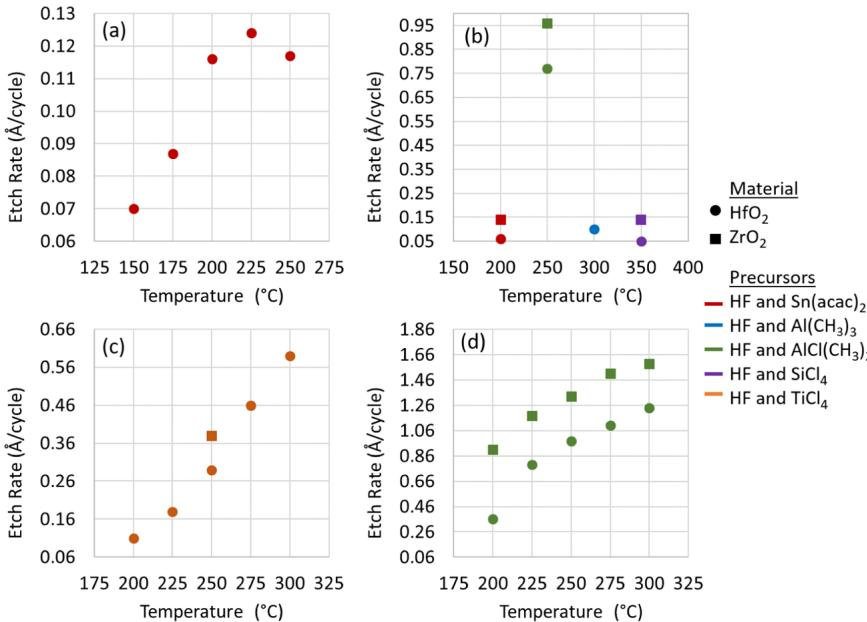  
Figure 15. Experimental etch rates for the thermal ALE of  $\mathrm{HfO_2}$  and  $\mathrm{ZrO_2}$  using precursors HF and  $\mathrm{Sn(acac)}_2,^{4,9}\mathrm{Al(CH_3)_3,^{4}AlCl(CH_3)_2,^{4,12}}$ $\mathrm{SiCl_4}^4$  and  $\mathrm{TiCl_4}$  111 (a) Etch rates for the thermal ALE of  $\mathrm{HfO_2}$  using HF and  $\mathrm{Sn(acac)}_2$  for the temperature range of  $150 - 250^{\circ}C$  b) Etch rates for the thermal ALE of  $\mathrm{HfO_2}$  and  $\mathrm{ZrO_2}$  using HF and  $\mathrm{Sn(acac)}_2 / \mathrm{AlCl(CH_3)_2 / Al(CH_3)_3 / SiCl_4}$  at the temperatures shown. (c) Etch rates for the thermal ALE using HF and  $\mathrm{TiCl_4}$  of  $\mathrm{HfO_2}$  for the temperature range  $200 - 300^{\circ}C$  and  $\mathrm{ZrO_2}$  at  $250^{\circ}C$  d) Etch rates for the thermal ALE of  $\mathrm{HfO_2}$  and  $\mathrm{ZrO_2}$  using HF and  $\mathrm{AlCl(CH_3)_2}$  for the temperature range  $200 - 300^{\circ}C$

Supporting Information and also in Figure 15. The first thing we observe is that for a specific reactant combination, the etch rate increases with temperature for both materials and the etch rate for  $\mathrm{ZrO_2}$  is larger than that of  $\mathrm{HfO_2}$ . We have predicted this from  $\mathrm{N} - \mathrm{E}$  analysis that the minimum barrier to continuous etching decreases considerably with an increase in temperature, more so in the case of  $\mathrm{ZrO_2}$  when compared to  $\mathrm{HfO_2}$ . Between 150 and  $350^{\circ}C$ , for different reactant combinations, the etch rates can be anywhere between 0.05 and  $1.24\mathrm{\AA}$  cycle for  $\mathrm{HfO_2}$  and between 0.01 and  $1.59\mathrm{\AA}$  cycle for  $\mathrm{ZrO_2}$ . The computed etch rate prediction given earlier based on the maximal  $\mathrm{M} - \mathrm{F}$  coverage  $\mathrm{M} = \mathrm{Hf}, \mathrm{Zr}$  should be taken carefully as the experimental etch rate varies greatly with temperature and the reactant, in the second pulse. Moreover, the maximal experimental etch rate reported is much larger than the predicted etch rate, suggesting that further reaction of adsorbed HF with the substrate is possible and this reaction surmounts the kinetic barriers, which we have not included in this simple adsorption study. However, comparing the maximal etch rate of  $- 2.82\pm 0.02\mathrm{\AA}$  cycle for one ML removal of  $\mathrm{Hf / ZrO_2}$  along with experimental etch rates, we can calculate the number of  $\mathrm{Hf / Zr}$  removed  $\mathrm{nm}^2$  in those experiments. Our surface model contains  $8.0\pm 0.3\mathrm{M / nm^2}$ $\mathrm{M} = \mathrm{Hf}, \mathrm{Zr}$  as mentioned earlier. Therefore, an etch rate of  $- 2.82\pm 0.02\mathrm{\AA}$  cycle corresponds to a removal of  $8.0\pm 0.3\mathrm{M / nm^2}$  of the surface. Thus

no. of metal atoms removed  $\mathrm{nm}^2$

$$
= \mathrm{expt.}\mathrm{etchrate}\times \left(-\frac{8.0}{2.8}\pm 0.1\right) \tag{10}
$$

For example,  $4.5\pm 0.1\mathrm{Zr}$  atoms  $\mathrm{nm}^2$  are removed as volatile  $\mathrm{ZrF_4}$  per cycle for an experimental etch rate of  $1.59\mathrm{\AA}$  cycle using HF and DMAC at  $300^{\circ}C$ . These results are also listed in Section S5 of the Supporting Information. It is clear that in all of these experiments, less than a monolayer of material is removed per ALE cycle. This computational approach detailed In this paper provides a general guideline to safely examine the influence of any reactant species on the substrate materials of interest.

# CONCLUSIONS

We present DFT calculations to understand the nature of the HF pulse on the bare surfaces of monoclinic  $\mathrm{HfO_2}$  and  $\mathrm{ZrO_2}$  for thermal ALE.  $\mathrm{N} - \mathrm{E}$  analysis of the self- limiting and spontaneous (continuous) etching using simple reaction models representing the HF exposure on  $\mathrm{HfO_2}$  and  $\mathrm{ZrO_2}$  allowed us to predict whether SL or SE reaction is favorable at a given temperature and at a given pressure. At  $T< 500\mathrm{K}$ , the HF reaction with both oxides is found to be in the preferred self- limiting state. This is a relatively inexpensive way to screen the reactant molecules for ALE, also equally applicable to ALD, of any given substrate. We studied the adsorption of HF molecules on  $\mathrm{HfO_2}$  and  $\mathrm{ZrO_2}$  for HF coverages ranging from  $1.0\pm 0.3$  to  $17.0\pm 0.3\mathrm{HF / nm^2}$  along with analysis of  $\mathrm{H}_2\mathrm{O}$  formation. From this analysis, we predict a theoretical etch rate based on the maximum possible coverage of surface- bound HF for  $\mathrm{HfO_2}$  and  $\mathrm{ZrO_2}$ . The maximal computed metal- F coverage on both surfaces is from  $6.0\pm 0.3$  to  $7.0\pm 0.3\mathrm{metal - F / nm^2}$ . The spontaneous formation of water was also seen at some HF coverages on both oxides. We calculated theoretical etch rates of  $- 0.61\pm 0.02\mathrm{\AA}$  cycle for  $\mathrm{HfO_2}$  and  $- 0.57\pm 0.02\mathrm{\AA}$  cycle for  $\mathrm{ZrO_2}$ , which are lower than the maximal etch rates reported from experiments. The etch rate for a complete ML removal,  $- 2.82\pm 0.02\mathrm{\AA}$  cycle, was used with experimental etch rates to compute the number of metal atoms removed from the surface per square nanometer per cycle. We can use the presented methodology for the first pulse on  $\mathrm{HfO_2}$  and  $\mathrm{ZrO_2}$  to examine other reagents such as  $\mathrm{HCl}$  and  $\mathrm{HBr}$  with a similar analysis as well as examine the interaction of  $\mathrm{HF}$  on hydroxyl- terminated surfaces of  $\mathrm{HfO_2}$  and  $\mathrm{ZrO_2}$ .

# ASSOCIATED CONTENT

# $=$  Supporting Information

The Supporting Information is available free of charge at https://pubs.acs.org/doi/10.1021/acs.chemmater.9b05021.

Self- limiting surface models used for thermochemical analysis, binding sites of one HF molecule at  $\mathrm{HfO}_2$  and  $\mathrm{ZrO}_2$  in HF adsorption studies, summary of bond dissociation energies, mixed molecular and dissociative adsorption of HF molecules from HF adsorption studies, experimental etch rates of  $\mathrm{HfO}_2$  and  $\mathrm{ZrO}_2$  with the corresponding number of metal atoms removed per square nanometer, and addition energy from increasing HF coverages (PDF)

# AUTHOR INFORMATION

# Corresponding Author

Michael Nolan - Tyndall National Institute, University College Cork, Cork T12 RSCP, Ireland;  $\oplus$  orcid.org/0000- 0002- 5224- 8580; Email: michael.nolan@tyndall.ie

# Authors

Rita Mullins - Tyndall National Institute, University College Cork, Cork T12 RSCP, Ireland;  $\oplus$  orcid.org/0000- 0002- 3898- 7328 Suresh Kondati Natarajan - Tyndall National Institute, University College Cork, Cork T12 RSCP, Ireland; Department of Electrical Engineering and Automation, Aalto University, Espoo 02150, Finland;  $\oplus$  orcid.org/0000- 0002- 7018- 5253 Simon D. Elliott - Schrodinger Inc., New York, New York 10036- 4041, United States;  $\oplus$  orcid.org/0000- 0001- 5573- 5694

Complete contact information is available at: https://pubs.acs.org/10.1021/acs.chemmater.9b05021

# Author Contributions

$\parallel \mathbb{R}.\mathbb{M}.$  and S.K.N. contributed equally to this manuscript.

# Notes

The authors declare no competing financial interest.

# ACKNOWLEDGMENTS

We acknowledge support for this work from LAM Research and the Science Foundation Ireland- NSF China Partnership Program, NITRALD Grant number: 17/NSFC/5279. We are grateful for access to Tyndall computing facilities supported by SFI and the Irish Centre for High- End Computing, www.ichec. ie.

# REFERENCES

1 RaghuP.YimC.ShadmanF.SheroE.Susceptibility of  $\mathrm{SiO}_2,$ $\mathrm{ZrO}_2,$  and  $\mathrm{HfO}_2$  dielectrics to moisture contamination. AIChE J. 2004,50,1881- 1888. 2 RaghuP.RanaN.YimC.SheroE.ShadmanF.Adsorption of Moisture and Organic Contaminants on Hafnium Oxide, Zirconium Oxide, and Silicon Oxide Gate Dielectrics. J. Electrochem. Soc.2003,150,No.F186. 3 HausmannD.M.KimE.BeckerJ.GordonR.G.Atomic Layer Deposition of Hafnium and Zirconium Oxides Using Metal Amide Precursors. Chem. Mater. 2002, 14, 4350- 4358. 4Lee,Y.HuffmanG.GeorgeS.M.Selectivity in Thermal Atomic Layer Etching Using Sequential, Self Limiting Fluorination and Ligand- Exchange Reactions. Chem. Mater. 2016, 28, 7657- 7665.

REFERENCES(1) Raghu, P.; Yim, C.; Shadman, F.; Shero, E. Susceptibility of  $\mathrm{SiO}_2$ ,  $\mathrm{ZrO}_2$ , and  $\mathrm{HfO}_2$  dielectrics to moisture contamination. AIChE J. 2004, 50, 1881- 1888. (2) Raghu, P.; Rana, N.; Yim, C.; Shero, E.; Shadman, F. Adsorption of Moisture and Organic Contaminants on Hafnium Oxide, Zirconium Oxide, and Silicon Oxide Gate Dielectrics. J. Electrochem. Soc. 2003, 150, No. F186. (3) Hausmann, D. M.; Kim, E.; Becker, J.; Gordon, R. G. Atomic Layer Deposition of Hafnium and Zirconium Oxides Using Metal Amide Precursors. Chem. Mater. 2002, 14, 4350- 4358. (4) Lee, Y.; Huffman, C.; George, S. M. Selectivity in Thermal Atomic Layer Etching Using Sequential, Self Limiting Fluorination and Ligand- Exchange Reactions. Chem. Mater. 2016, 28, 7657- 7665. (5) Oehrlein, G. S.; Metzler, D.; Li, C. Atomic Layer Etching at the Tipping Point: An Overview. ECS J. Solid State Sci. Technol. 2015, 4, N5041. (6) Kanarik, K. J.; Lill, T.; Hudson, E. A.; Sriraman, S.; Tan, S.; Marks, J.; Vahedi, V.; Gottscho, R. A. Overview of atomic layer etching in the semiconductor industry. J. Vac. Sci. Technol., A 2015, 33, No. 020802. (7) George, S. M.; Lee, Y. Prospects for Thermal Atomic Layer Etching Using Sequential, Self- Limiting Fluorination and Ligand- Exchange Reactions. ACS Nano 2016, 10, 4889- 4894. (8) Yuan, G.; Wang, N.; Huang, S.; Liu, J. In A Brief Overview of Atomic Layer Deposition and Etching in the Semiconductor Processing, 2016 17th International Conference on Electronic Packaging Technology (ICEPT), 2016, pp 1365- 1368. (9) Lee, Y.; DuMont, J. W.; George, S. M. Atomic Layer Etching of  $\mathrm{HfO}_2$  Using Sequential, Self- Limiting Thermal Reactions with  $\mathrm{Sn}(\mathrm{acac})_2$  and HF. ECS J. Solid State Sci. Technol. 2015, 4, N5013. (10) Lee, Y.; George, S. M. Atomic Layer Etching of  $\mathrm{Al}_2\mathrm{O}_3$  Using Sequential, Self- Limiting Thermal Reactions with  $\mathrm{Sn}(\mathrm{acac})_2$  and Hydrogen Fluoride. ACS Nano 2015, 9, 2061- 2070. (11) Lee, Y.; George, S. M. Thermal atomic layer etching of  $\mathrm{HfO}_2$  using HF for fluorination and  $\mathrm{TiCl}_4$  for ligand- exchange. J. Vac. Sci. Technol., A 2018, 36, No. 061504. (12) Lee, Y.; George, S. M. Thermal Atomic Layer Etching of  $\mathrm{Al}_2\mathrm{O}_3$ ,  $\mathrm{HfO}_2$ , and  $\mathrm{ZrO}_2$  Using Sequential Hydrogen Fluoride and Dimethylaluminum Chloride Exposures. J. Phys. Chem. C 2019, 123, 18455- 18466. (13) DuMont, J. W.; Marquardt, A. E.; Cano, A. M.; George, S. M. Thermal Atomic Layer Etching of  $\mathrm{SiO}_2$  by a Conversion- etch Mechanism Using Sequential Reactions of Trimethylaluminum and Hydrogen Fluoride. ACS Appl. Mater. Interfaces 2017, 9, 10296- 10307. (14) Lee, Y.; DuMont, J. W.; George, S. M. Mechanism of Thermal  $\mathrm{Al}_2\mathrm{O}_3$  Atomic Layer Etching Using Sequential Reactions with  $\mathrm{Sn}(\mathrm{acac})_2$  and HF. Chem. Mater. 2015, 27, 3648. (15) Lee, Y.; George, S. M. Atomic Layer Etching of  $\mathrm{Al}_2\mathrm{O}_3$  Using Sequential, Self- Limiting Thermal Reactions with  $\mathrm{Sn}(\mathrm{acac})_2$  and Hydrogen Fluoride. ACS Nano 2015, 9, 2061- 2070. (16) Lee, Y.; DuMont, J. W.; George, S. M. Trimethylaluminum as the Metal Precursor for the Atomic Layer Etching of  $\mathrm{Al}_2\mathrm{O}_3$  Using Sequential, Self- Limiting Thermal Reactions. Chem. Mater. 2016, 28, 2994. (17) Hennessy, J.; Moore, C. S.; Balasubramanian, K.; Jewell, A. D.; France, K.; Nikzad, S. Enhanced atomic layer etching of native aluminum oxide for ultraviolet optical applications. J. Vac. Sci. Technol., A 2017, 35, No. 041512. (18) DuMont, J. W.; George, S. M. Competition between  $\mathrm{Al}_2\mathrm{O}_3$  atomic layer etching and  $\mathrm{AlF}_3$  atomic layer deposition using sequential exposures of trimethylaluminum and hydrogen fluoride. J. Chem. Phys. 2017, 146, No. 052819. (19) Johnson, N. R.; Sun, H.; Sharma, K.; George, S. M. Thermal atomic layer etching of crystalline aluminum nitride using sequential, self- limiting hydrogen fluoride and  $\mathrm{Sn}(\mathrm{acac})_2$  reactions and enhancement by  $\mathrm{H}_2$  and Ar plasmas. J. Vac. Sci. Technol., A 2016, 34, No. 050603. (20) Lee, Y.; DuMont, J. W.; George, S. M. Atomic Layer Etching of  $\mathrm{AlF}_3$  Using Sequential, Self- Limiting Thermal Reactions with  $\mathrm{Sn}(\mathrm{acac})_2$  and Hydrogen Fluoride. J. Phys. Chem. C 2015, 119, 25385- 25393. (21) Lemaire, P. C.; Parsons, G. N. Thermal Selective Vapor Etching of  $\mathrm{TiO}_2$ : Chemical Vapor Etching via  $\mathrm{WF}_6$  and Self- Limiting Atomic Layer Etching Using  $\mathrm{WF}_6$  and  $\mathrm{BCl}_3$ . Chem. Mater. 2017, 29, 6653- 6665. (22) Lee, Y.; George, S. M. Thermal Atomic Layer Etching of Titanium Nitride Using Sequential, Self- Limiting Reactions: Oxidation to  $\mathrm{TiO}_2$  and Fluorination to Volatile  $\mathrm{TiF}_4$ . Chem. Mater. 2017, 29, 8202- 8210. (23) Shinoda, K.; Miyoshi, N.; Kobayashi, H.; Izawa, M.; Ishikawa, K.; Hori, M. Rapid thermal- cyclic atomic- layer etching of titanium

nitride in  $\mathrm{CHF}_3 / \mathrm{O}_2$  downstream plasma. J. Phys. D: Appl. Phys. 2019, S2, No. 475106. (24) Xie, W.; Lemaire, P. C.; Parsons, G. N. Thermally Driven Self- Limiting Atomic Layer Etching of Metallic Tungsten Using  $\mathrm{WF}_6$  and  $\mathrm{O}_2$ . ACS Appl. Mater. Interfaces 2018, 10, 9147- 9154. (25) Johnson, N. R.; George, S. M.  $\mathrm{WO}_3$  and W Thermal Atomic Layer Etching Using Conversion- Fluorination and Oxidation- Conversion- Fluorination Mechanisms. ACS Appl. Mater. Interfaces 2017, 9, 34435- 34447. (26) Zywotko, D. R.; George, S. M. Thermal Atomic Layer Etching of  $\mathrm{ZnO}$  by a Conversion- Etch Mechanism Using Sequential Exposures of Hydrogen Fluoride and Trimethylaluminum. Chem. Mater. 2017, 29, 1183- 1191. (27) Johnson, N. R.; Hite, K.; Mastro, M. A.; Eddy, C. R.; George, S. M. Thermal atomic layer etching of crystalline GaN using sequential exposures of  $\mathrm{XeF}_2$  and  $\mathrm{BCl}_3$ . Appl. Phys. Lett. 2019, 114, No. 243103. (28) Lim, W. S.; Park, J. B.; Park, J. Y.; Park, B. J.; Yeom, G. Y. Low damage atomic layer etching of  $\mathrm{ZrO}_2$  by using  $\mathrm{BCl}_3$  gas and ar neutral beam. J. Nanosci. 2009, 9, 7379- 7382. (29) Dallorto, S.; Goodyear, A.; Cooke, M.; Szornel, J. E.; Ward, C.; Kastl, C.; Schwartzberg, A.; Rangelow, I. W.; Cabrini, S. Atomic layer etching of  $\mathrm{SiO}_2$  with Ar and  $\mathrm{CHF}_3$  plasmas: A self- limiting process for aspect ratio independent etching. Plasma Process Polym. 2019, 16, No. 1900051. (30) Koh, K.; Kim, Y.; Kim, C.- K.; Chae, H. Quasi atomic layer etching of  $\mathrm{SiO}_2$  using plasma fluorination for surface cleaning. J. Vac. Sci. Technol., A 2018, 36, No. 01B106. (31) Mameli, A.; Verheijen, M. A.; Mackus, A. J. M.; Kessels, W. M. M.; Roozeboom, F. Isotropic Atomic Layer Etching of  $\mathrm{ZnO}$  Using Acetylacetone and  $\mathrm{O}_2$  Plasma. ACS Appl. Mater. Interfaces 2018, 10, 38588- 38595. (32) Ohba, T.; Yang, W.; Tan, S.; Kanarik, K.; Nojiri, K. Atomic layer etching of  $\mathrm{GaN}$  and  $\mathrm{Al}_2\mathrm{aN}$  using directional plasma- enhanced approach. Jpn. J. Appl. Phys. 2017, 56, No. 06HB06. (33) Kauppinen, C.; Khan, S. A.; Sundqvist, J.; Suyatin, D. B.; Suihkonen, S.; Kauppinen, E. I.; Sopanen, M. Atomic layer etching of gallium nitride (0001). J. Vac. Sci. Technol., A 2017, 35, No. 060603. (34) Miyoshi, N.; Kobayashi, H.; Shinoda, K.; Kurihara, M.; Watanabe, T.; Kouzuma, Y.; Yokogawa, K.; Sakai, S.; Izawa, M. Atomic layer etching of silicon nitride using infrared annealing for short desorption time of ammonium fluorosilicate. Jpn. J. Appl. Phys. 2017, 56, No. 06HB01. (35) Lu, W.; Lee, Y.; Gertsch, J. C.; Murdzek, J. A.; Cavanagh, A. S.; Kong, L.; del Alamo, J. A.; George, S. M. In Situ Thermal Atomic Layer Etching for Sub- 5 nm InGaAs Multigate MOSFETs. Nano Lett. 2019, 19, 5159- 5166. (36) Gertsch, J. C.; Cano, A. M.; Bright, V. M.; George, S. M.  $\mathrm{SF}_4$  as the Fluorination Reactant for  $\mathrm{Al}_2\mathrm{O}_3$  and  $\mathrm{VO}_2$  Thermal Atomic Layer Etching. Chem. Mater. 2019, 21, 3624- 3635. (37) Rahman, R.; Mattson, E. C.; Klesko, J. P.; Dangerfield, A.; Rivillon- Amy, S.; Smith, D. C.; Hausmann, D.; Chabal, Y. J. Thermal Atomic Layer Etching of Silica and Alumina Thin Films Using Trimethylaluminum with Hydrogen Fluoride or Fluoroform. ACS Appl. Mater. Interfaces 2018, 10, 31784- 31794. (38) Fang, C.; Cao, Y.; Wu, D.; Li, A. Thermal atomic layer etching: Mechanism, materials and prospects. Prog. Nat. Sci.: Mater. Int. 2018, 28, 667- 675. (39) Kondati Natarajan, S.; Elliott, S. D. Modeling the Chemical Mechanism of the Thermal Atomic Layer Etch of Aluminum Oxide: A Density Functional Theory Study of Reactions during HF Exposure. Chem. Mater. 2018, 30, 5912- 5922. (40) Kresse, G.; Furthmuller, J. Efficient iterative schemes for ab initio total- energy calculations using a plane- wave basis set. Phys. Rev. B 1996, 54, 11169. (41) Perdew, J. P.; Burke, K.; Ernzerhof, M. Generalized gradient approximation made simple. Phys. Rev. Lett. 1996, 77, 3865. (42) Kresse, G.; Joubert, D. From ultrasoft pseudopotentials to the projector augmented- wave method. Phys. Rev. B 1999, 59, 1758.

(43) Lowther, J. E.; Dewhurst, J. K.; Leger, J. M.; Haines, J. Relative stability of  $\mathrm{ZrO}_2$  and  $\mathrm{HfO}_2$  structural phases. Phys. Rev. B 1999, 60, 14485-14488. 
(44) Zhao, X.; Vanderbilt, D. First-principles study of structural, vibrational, and lattice dielectric properties of hafnium oxide. Phys. Rev. B 2002, 65, No. 233106. 
(45) Togo, A.; Tanaka, I. First principles phonon calculations in materials science. Scr. Mater. 2015, 108, 1-5. 
(46) TURBOMOLE v6.2 2010, A Development of University of Karlsruhe and Forschungszentrum Karlsruhe GmbH, 1989-2007, TURBOMOLE GmbH, since 2007. Available from http://www.turbomole.com (last accessed 27 Nov, 2019). 
(47) Schafer, A.; Huber, C.; Ahlrichs, R. Fully optimized contracted Gaussian basis sets of triple- octa- valence quality for atoms Li to Kr. J. Chem. Phys. 1994, 100, 5829-5835. 
(48) Schafer, A.; Horn, H.; Ahlrichs, R. Fully optimized contracted Gaussian basis sets for atoms Li to Kr. J. Chem. Phys. 1992, 97, 2571-2577. 
(49) Luo, Y. R. Comprehensive Handbook of Chemical Bond Energies; CRC Press: Boca Raton, FL, 2007.