# Isotropic atomic layer etching of GaN using  $\mathsf{SF}_6$  plasma and  $\mathsf{Al(CH_3)_3}$

Nicholas J. Chittock  $\oplus$  ; Yi Shu; Simon D. Elliott  $\oplus$  ; Harm C. M. Knoops  $\oplus$  ; W. M. M. (Erwin). Kessels  $\oplus$  ; Adriaan J. M. Mackus  $\oplus$

J. Appl. Phys. 134, 075302 (2023) https://doi.org/10.1063/510158129

# Articles You May Be Interested In

Origin of enhanced thermal atomic layer etching of amorphous  $\mathsf{HfO}_2$

J. Vac. Sci. Technol. A (February 2022)

Isotropic plasma atomic layer etching of  $\mathsf{Al}_2\mathsf{O}_3$  using a fluorine containing plasma and  $\mathsf{Al(CH_3)_3}$

Appl. Phys. Lett. (October 2020)

Process study of gadolinium aluminate atomic layer deposition from the gadolinium tris- di- isopropylacetamidinate precursor

J. Vac. Sci. Technol. A (December 2011)

# Isotropic atomic layer etching of GaN using  $\mathsf{SF}_6$  plasma and  $\mathsf{Al(CH_3)_3}$

Cite as: J. Appl. Phys. 134, 075302 (2023); doi: 10.1063/5.0158129  Submitted: 15 May 2023 · Accepted: 24 July 2023 · Published Online: 17 August 2023

Nicholas J. Chittock, $^{1,40}$  Yi Shu, $^{2}$  Simon D. Elliott, $^{3}$  Harm C. M. Knoops, $^{1,2}$  W. M. M. (Erlwin). Kessels, $^{1}$  and Adriaan J. M. Mackus $^{1,2}$

# AFFILIATIONS

$^{1}$ Department of Applied Physics, Eindhoven University of Technology, P.O. Box 513, 5600 MB Eindhoven, The Netherlands   $^{2}$ Oxford Instruments Plasma Technology, North End, Bristol BS49 4AP, United Kingdom   $^{3}$ Schrödinger Inc., 1540 Broadway, New York, New York 10036, USA

$^{a}$ Authors to whom correspondence should be addressed: nj.Chittock@tue.nl and aj.m.mackus@tue.nl

# ABSTRACT

GaN is an enabling material for light emitting diodes, advanced radio frequency, and power semiconductor devices. However, fabrication of GaN devices often relies on harsh etch processes, which can leave an etch damage layer, limiting final device performance. In this work, an isotropic atomic layer etching (ALE) process involving  $\mathrm{SF}_6$  plasma and trimethylaluminium  $[\mathrm{Al(CH_3)_3}]$  is presented for the controlled etching of GaN, which reduces oxygen and carbon contamination while smoothing the surface. The ALE chemistry was first examined with density functional theory. A comparison between proposed thermal and plasma- driven reactions is made by implementing Natarajan- Elliott analysis, highlighting that the plasma process is a good candidate for GaN ALE. Saturation was experimentally confirmed for both ALE half- cycles at 150 and  $300^{\circ}\mathrm{C}$ , with etch rates of  $0.31\pm 0.01$  and  $0.40\pm 0.02\mathrm{nm}$  /cycle, respectively. Analysis of the films post- ALE shows that the RMS roughness of the films decreases from  $2.6\pm 0.1$  to  $1.9\pm 0.1\mathrm{nm}$  after  $25\mathrm{nm}$  of etching at  $800^{\circ}\mathrm{C}$ , in agreement with a previously developed curvature- dependent smoothing model. Taken together, this ALE process enables accurate GaN thickness tuning, surface cleaning, and surface smoothing, allowing for further development of GaN devices.

$\widehat{\Xi}$  2023 Author(s). All article content, except where otherwise noted, is licensed under a Creative Commons Attribution (CC BY) license (http://creativecommons.org/licenses/by/4.0/). https://doi.org/10.1063/5.0158129

# I. INTRODUCTION

For decades, Si has been the material- of- choice for allowing management and control of electrical power within many different devices. However, the transition toward higher voltages and switching frequencies in advanced power semiconductor devices requires a material with a different set of properties.1- 4 Alternatives to Si are currently being explored: silicon carbide (SiC) is the preferred material for high voltage applications  $(>1\mathrm{kV})$  due to its improved thermal properties, while gallium nitride (GaN) is widely being researched for sub-  $650\mathrm{V}$  applications, such as chargers for electric vehicles, onboard power converters, and consumer electronics.2,5 GaN devices are particularly useful because of the formation of a 2D electron gas (2DEG) at the AlGaN/GaN interface, which enables the fabrication of high electron mobility transistors (HEMTs) with superior switching frequencies.2- 4,6 GaN HEMTs already have commercial applications and are rapidly being deployed in power supplies, data centers, fast chargers, and LIDAR systems.3,6,7 There are, however, several challenges in producing GaN- based devices due to etch- induced damage.47- 14 Beyond the RF and power semiconductor applications, GaN is also commonly used in light emitting diodes (LEDs). In the push toward fabricating microLEDs, damage from conventional etch techniques leads to carrier recombination at sidewalls, which limits device efficiency.13,15- 17 For all these applications, it is, therefore, important that low damage etch and cleaning processes are developed such that device efficiency and yield can be increased.

A low- damage etch technique that is emerging for many applications is atomic layer etching (ALE). ALE involves sequential self- limiting half- cycles separated by purging steps. The first ALE half- cycle generates a modified surface layer, either through gas or plasma exposure, the thickness of which saturates during the half- cycle. Subsequently, this modified layer is removed in the second half- cycle, without etching into the underlying bulk material.18- 22 Employing a cyclic process of self- limiting half- cycles enables more

controlled removal of a material over conventional etch techniques, providing the benefit of low- damage etching.20- 24 Currently, the focus for GaN ALE has been on anisotropic etching,23,25- 28 which acts to remove material directionally. Development of isotropic GaN ALE is also required to clean/etch surfaces independent of orientation, such as on trench/mesa structures or around nanowires.1,15,16 Furthermore, following a similar development path as conventional IC fabrication, GaN devices are predicted to implement more complex 3D device structures in the future, requiring the use of both anisotropic and isotropic etching.1- 3,21,29- 31 A current limitation of ALE is that GaN device dimensions are relatively large (in the order of  $\sim \mu \mathrm{m}$ ), potentially making ALE unsuitable for the main etching step, considering the relatively slow etch rates  $(\sim 1\mathrm{nm / cycle})$ . However, the benefits of low damage and accurate thickness control can be leveraged when used as a "cleaning" step after the main etch.

Etch damage for two different GaN- based devices is highlighted in Fig. 1, Fig. 1(a) shows a simplified structure of a GaN microLED, and Fig. 1(b) shows a recessed gate GaN metal- insulator- semiconductor HEMT (MISHEMT).2,5- 8,11,32,33 Looking at the GaN MISHEMT device, the recess etching step, typically performed by reactive ion etching (RIE), can introduce damage on the etch front and sidewalls. This etch damage layer compromises the final device performance, necessitating cleaning steps post etch to remove damage isotropically from the whole recess.7,10 Wet etching is a typical isotropic etch technique used for surface cleaning, but GaN is resistant to many wet etchants and, typically, requires solvents to be heated to above  $85^{\circ}C$  for etching to occur.9,34- 36 Additionally, wet etching adds process complexity by necessitating the transfer between wet and dry equipment. Furthermore, as GaN applications with higher vertical and lateral aspect ratios become more prevalent, preventing stiction and pattern collapse during drying will become increasingly challenging. Dry etching would avoid some of these limitations. The literature already reports that etching of GaN is possible with  $\mathrm{H}_{2}$  plasma. However, for this process, there is significant preferential etching along grain boundaries, which leads to rough films and undercutting.37,38 Continuous etching also requires accurate end point detection to prevent damage to functional layers, while the flux- dependent nature could also lead to uneven etch profiles in high aspect- ratio structures. Isotropic ALE would be a good candidate for a controlled GaN etching process, but there has only been limited research in this direction.39,40

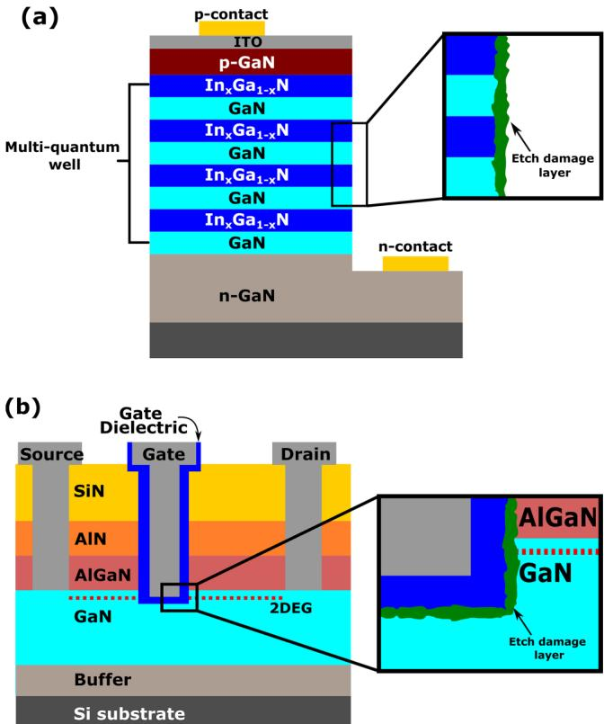  
FIG. 1. (a) Simplified MicroLED structure where surface damage increasingly limits the external quantum efficiency as devices scale down. (b) The general structure of a GaN MISHEMT device showing the recess into the GaN layer. Etching of the recess using reactive ion etching can lead to a rough interface, degrading the device performance.

Previous isotropic thermal ALE literature has shown that GaN films are resistant to fluorination via hydrogen fluoride (HF) or sulfur tetrafluoride  $(\mathrm{SF}_4)$ .39 Instead, the stronger fluorinating agent xenon difluoride  $(\mathrm{XeF}_2)$  was used. When alternating  $\mathrm{XeF}_2$  with boron trichloride  $(\mathrm{BCl}_3)$  exposures, an etch per cycle (EPC) of  $0.072\mathrm{nm / cycle}$  was observed at  $300^{\circ}\mathrm{C}$ .39 Another approach employed a three- step ALE cycle, which relied on first oxidizing the GaN using  $\mathrm{H}_2\mathrm{O}$  vapor or  $\mathrm{O}_2$  plasma.40 Removal of the oxide was then tested using HF and trimethylgallium  $\mathrm{[TMG, Ga(CH_3)_3]}$  pulses; however, this ALE process was unable to significantly etch the film.40 The minimal etching seen for this process was attributed to the formation of a well ordered oxide during the oxidation step that is resistant to the etch chemistry.40 Fluorination- based ALE approaches are potentially ideal candidates for surface cleaning of GaN MISHEMTs, as fluorine doping of the channel region beneath the gate has been linked to improved device performance.6,7,10,32,33 A stronger fluorine source,  $\mathrm{NF}_3$  plasma, was tested as an alternative to thermal fluorination and when cycled with  $\mathrm{BCl}_3$  gave a higher EPC compared to  $\mathrm{XeF}_2$ , highlighting a potential benefit of utilizing plasmas.39 An alternative, sulfur hexafluoride  $(\mathrm{SF}_6)$  plasma is used here after which TMA  $\mathrm{[Al(CH_3)_3]}$  is dosed to etch away the fluorinated layer. Similarly, it is expected that any fluorine- containing plasma, such as  $\mathrm{NF}_3$  or  $\mathrm{CF}_4$ , can be employed to fluorinate the GaN, for which  $\mathrm{NF}_3$  has the benefit that it would not lead to residues of either S or C on the etched surface.39,41,42

Simulations have been employed for comparison between the thermal and plasma isotropic GaN ALE reactions, which additionally helps us to guide and support our experimental studies. Simulations are increasingly being utilized in atomic- scale processing to expedite process development and to improve understanding of underlying mechanisms.43- 51 Density functional theory (DFT) allows for the calculation of the Gibbs free energy changes as a function of temperature for the corresponding ALE half- reactions. Using the output from the DFT simulations, Natarajan- Elliott (N- E) analysis has been developed as a way to identify ALE

process windows before performing extensive tests in the laboratory.43- 45 N- E analysis is a relatively simple rapid screening technique for ALE chemistries; in the previous work, N- E analysis was used to identify an ALE process window for  $\mathrm{TiO_2}$  ALE with HF.51 In that study, excellent agreement was found between the experimental and simulated onset temperature of continuous etching. By operating below this temperature, self- limiting modification of the  $\mathrm{TiO_2}$  surface was achieved.51

In this work, the insights from DFT are discussed first to outline the anticipated reactions. Simulations were also performed with the thermal reactant HF, to enable a comparison between thermal and plasma ALE. Subsequently, the plasma ALE process was characterized by the measurement of saturation curves, reactant synergy, and the temperature dependence of the etch rate. To assess the films after ALE, atomic force microscopy (AFM) and  $\mathbf{x}$  - ray photoelectron spectroscopy (XPS) were used, revealing a decrease in film roughness as well as the amount of oxygen and carbon contamination present in the GaN films.

# II.METHODS

# A.Simulations

DFT simulations were performed utilizing the Jaguar and Quantum Espresso packages accessed through the Schrodinger Materials Science Suite.52- 54 The bulk calculations are performed in Quantum Espresso and are based on the generalized gradient approximation of DFT using the Perdew- Burke- Ernzerhof exchange correlation functional with DFT- D3 dispersion correction.55- 57 The self- consistent energy convergence threshold was set to  $1.4\times 10^{- 5}\mathrm{eV}$  with the total energy threshold for geometry optimization set to  $1.4\times 10^{- 4}\mathrm{eV}$  The plane wave energy cutoff was  $30\mathrm{Ry}$  for the wavefunctions and  $200\mathrm{Ry}$  for the charge density. Reciprocal space was spanned by a  $(2\times 2\times 1)$  k- point set. Core electrons are described by ultra- soft pseudopotentials, and valence electrons (Ga:  $4\mathrm{s}^2 4\mathrm{p}^1$  Al:  $3\mathrm{s}^2 3\mathrm{p}^1$  N:  $2\mathrm{s}^2 2\mathrm{p}^3$ $\mathrm{F};2\mathrm{s}^2 2\mathrm{p}^5$  C:  $2\mathrm{s}^2 2\mathrm{p}^2$  H:  $1\mathrm{s}^1$  ) are treated using plane wave basis sets.58 For calculations involving doublet F radicals spin polarized treatment was enabled. Entropy was calculated by vibrational analysis of gas- phase structures optimized using the B3LYP- D3 functional and  $6 - 31\mathrm{g}^{**}$  basis set in Jaguar at a pressure of  $50~\mathrm{mTorr}$  comparable to the pressure used during experiments.54

Similar to previous ALE simulations,43- 45,48- 51 the reactions for chemical vapor etching (CVE) and ALE conversion (AC) are studied using a modified N- E analysis. In this approach, bulk models instead of surface models are used to compute the Gibbs free energy change  $(\Delta G)$  between the products and reactants. Consideration of bulk species means that the surface coverage of F cannot be obtained, however, this simplifies the simulations allowing for rapid screening of the thermodynamics over a wide temperature range. We do not consider the bulk entropy or an explicit reaction pathway between the reactants and products, and these omissions could lead to a discrepancy with the experiment.44 As the reactant and product partial pressure changes with temperature, the term RT  $\ln (\mathrm{Q})$  is also included in the free energy calculation.

By comparing the  $\Delta G$  for CVE and AC reactions, similar to N- E analysis, we can identify four different thermodynamic regimes for the modification step: purely etching, preferred etching, purely conversion, and preferred conversion.44 For ALE, ideally the modification step should be in the pure conversion regime, where the AC reaction is energetically favorable  $(\Delta G< 0)$  and the CVE reaction is energetically unfavorable  $(\Delta G > 0)$  .Alternatively, ALE can be achieved in the preferred conversion regime where both AC and CVE reactions have  $\Delta G< 0$  but with the AC reaction being more energetically favorable. In this regime, there may be some competition between the two reactions. Reactions in the regimes of purely or preferred continuous etching are not expected to be suitable for ALE. The AG was computed in the temperature range  $- 273 - 527^{\circ}\mathrm{C}$ $(0 - 800\mathrm{K})$  for all reactions simulated in this work.

# B.Experimental

# 1.ALD and ALE processes

GaN films were grown via plasma ALD using triethylgallium and a  $\mathrm{H}_2 / \mathrm{N}_2$  plasma at  $350^{\circ}C$  in an Oxford Instruments FlexAL employing an inductively coupled plasma (ICP) source.59 The film thickness was  $43.5\mathrm{nm}$  with a non- uniformity of  $\pm 1.6\%$  across a 6- in. wafer. Oxygen is observed throughout the GaN ALD film  $(3 - 7\mathrm{at}.\%)$  due to oxygen containing impurities incorporated during ALD from background species and reactor surfaces, as discussed in Sec. III C 2.60 The film was stored in ambient, which led to the formation of a more heavily oxidized layer  $(>15\mathrm{at}.\%)$  on the GaN surface.

The ALE process was performed in a different Oxford Instruments FlexAL reactor (chamber volume  $13.8\pm 0.41^{61}$  ) at table temperatures between 100 and  $300^{\circ}C_{\cdot}$  and the walls set to  $150^{\circ}C$  The reaction chamber was conditioned with hafnium dioxide  $\mathrm{(HfO_2)}$  for 200 ALD cycles at  $300^{\circ}C$  before any ALE cycles were performed; details of this process have been previously reported in Ref. 62.  $\mathrm{HfO_2}$  is chosen as the conditioning film as it is the most resistant film to this ALE chemistry available on the tool.63 The ALE process consists of an  $\mathrm{SF}_6$  plasma step, followed by TMA dosing as shown in Fig. 2, where the chamber is continuously pumped and pressure controlled by an automated pressure controller (APC). The APC is a butterfly valve located before the turbo pump that throttles the pumping speed of the reactor, enabling a high chamber pressure with a low gas flow, thereby maximizing the residence time of reaction species.61 A pre- plasma step of  $5\mathrm{s}$  is used to stabilize the gas flows through the ICP tube, which are 50 sccm  $\mathrm{SF}_6$  and 150 sccm Ar, with the chamber pressure maintained at 100 mTorr by the APC. After this, the plasma is struck at  $100\mathrm{W}_{\cdot}$  with the plasma on time varied from 0 to  $30~\mathrm{s}$  The reactor is then purged with 300 sccm Ar for  $10~\mathrm{s}$  with the APC fully open. This is followed by TMA dose/hold pulses: TMA is dosed into the reactor for  $0.1~\mathrm{s}$  with the pressure kept at 150 mTorr by the APC; the TMA is subsequently held in the reactor for  $2\mathrm{s}$  before TMA is again dosed into the chamber. This so- called "hold" step is designed to act as a soak step to increase the exposure of the precursor to the sample to facilitate the ligand- exchange reactions. During the TMA dose and hold, a constant 10 sccm Ar is flown through the ICP to limit upstream TMA diffusion. The number of TMA dose/hold pulses was varied from 0 to 10 to measure the saturation as a function of pulses. After the TMA dose and hold, the APC is fully opened and the reactor is purged for  $25~\mathrm{s}$  with a 300 sccm Ar flow.

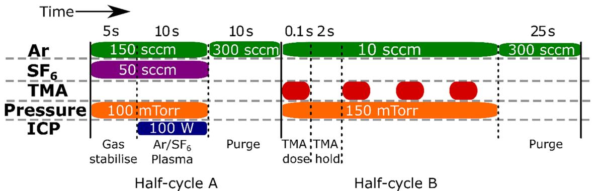  
FIG. 2. Schematic of the standard ALE process used in this work. Half-cycle A is a 10 s Ar/SF6 plasma. Half-cycle B is a TMA dose and hold, repeated four times per cycle. Each half-cycle ends with a purge before the next half-cycle. Pressure is maintained by an automated pressure controller and the inductively coupled plasma is operated at 100 W.

# 2. Analysis techniques

Thickness changes during ALE were determined with a fixed angle in situ M- 2000 J.A. Woollam spectroscopic ellipsometer (SE) in the photon energy range  $1.2 - 4.9\mathrm{eV}$ . In addition, ex situ SE measurements were performed using a variable angle (vertical) M- 2000 J.A. Woollam at  $65^{\circ}$ ,  $70^{\circ}$ , and  $75^{\circ}$  in the photon energy range  $1.2 - 6.5\mathrm{eV}$ . The GaN is modeled using a Tauc- Lorentz general oscillator, from which the bandgap of the GaN film was determined to be  $3.5\mathrm{eV}$ , within the expected range from the literature. AFM measurements were performed on the Dimension Icon AFM manufactured by Bruker, operated in PeakForce with the ScanAsyst mode, using a PeakForce- Air tip. The scan frequency was set to  $1\mathrm{Hz}$  and the scan area was  $1\times 1\mu \mathrm{m}^2$ . X- ray diffraction (XRD) scans were performed on a D8 Discover Bruker tool using a  $2\theta /\omega$  scan and a Cu anode. XPS data were obtained using an Al K- alpha x- ray source on a photoelectron spectrometer system from ThermoFischer Scientific. XPS depth profiles were performed with  $500\mathrm{eV}$  Ar ions for both pristine and etched samples. Relatively low ion energies were employed to minimize mixing during sputter depth profiling. For depth profiling, the samples were sputtered in the XPS chamber for a total of  $350\mathrm{s}$ , with XPS measurements after every  $5\mathrm{s}$  of sputtering.

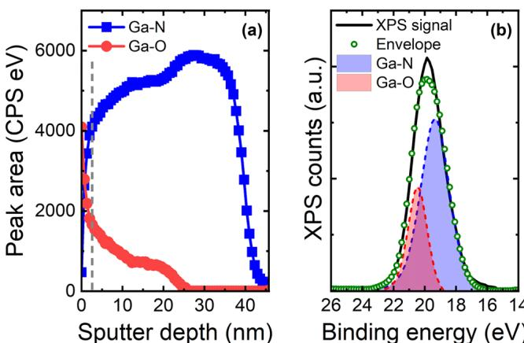  
FIG. 3. (a) Contributions of Ga-O and Ga-N to the Ga3d peak area plotted as a function of sputter depth. The vertical dashed line indicates the spectra shown in (b). (b) The Ga3d signal after  $20\mathrm{s}$  of sputtering, highlighting the positions of the Ga-O and the Ga-N peaks at  $20.5$  and  $19.3\mathrm{eV}$ , respectively.

# 3. Surface characterization pre-ALE

To provide a reference for the GaN post- ALE, it is important to characterize the film before ALE. To this end, XPS, AFM, SE, and XRD were performed on the as- prepared GaN films. Figure 3(a) shows the peak area for the Ga- O and Ga- N contribution to the Ga3d peak as a function of sputter depth. To accurately fit the Ga3d peak, both Ga- O and Ga- N peaks at  $20.5$  and  $19.3\mathrm{eV}$ , respectively, are required as shown in Fig. 3(b). Using depth profiling, it was observed that this oxide layer extends into the bulk of the film. The thickness of this oxidized layer was estimated to be around  $10\mathrm{nm}$  by correlating the thickness of the film from SE with the appearance of the Si2p peak in the XPS depth profile. There is still a detectable amount of oxygen in the film until around  $25\mathrm{nm}$  sputter depth. A high O signal to this depth may be a symptom of mixing during the XPS sputtering, which forces O atoms deeper into the film as the depth profile proceeds. The presence of a surface oxide layer leads to a Ga- deficient surface layer, which transitions into a more stoichiometric GaN layer in the bulk, as can be seen in Fig. S.1. The bulk appears slightly nitrogen- deficient, likely caused by preferential sputtering of N during the XPS depth profile measurements. Additionally,  $\sim 2$  at.  $\%$  F was detected throughout the entire GaN film, which is attributed to chamber cleaning performed on the ALD tool before deposition of the GaN sample. The crystalline nature of the films was confirmed by XRD analysis. A (0.02) GaN peak at  $34.5^{\circ}$  was observed indicative of hexagonal wurtzite GaN grown by ALD, as shown in Fig. S.2. The surface roughness was measured to be  $2.6\pm 0.1\mathrm{nm}$ , with the different crystallites visible in the AFM map as will be discussed in Sec. III C 1.

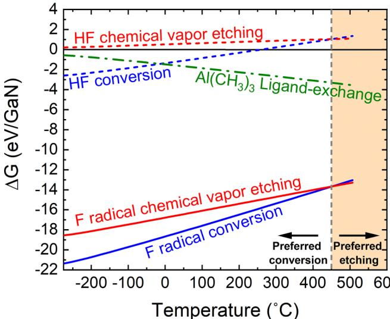  
FIG. 4. Gibbs free energy change  $(\Delta G)$  as a function of temperature for the fluorination half-cycle considering both the conversion (blue) and chemical vapor etching (red) reactions. Solid lines indicate plasma fluorination reactions (F radicals), while the thermal fluorination reactions (HF) are indicated by dashed lines. A vertical dashed line at  $450^{\circ}C$  highlights the change for the plasma fluorination reactions from the preferred conversion regime to the preferred etching regime. The ligand-exchange half-cycle is also included (dashed-dotted line, green) and shows a negative  $\Delta G$  over the entire evaluated temperature range.

# III. RESULTS AND DISCUSSION

# A. Simulations

GaN fluorination reactions are chosen for simulation to investigate the difference between the formation of a solid product  $\mathrm{GaF_{3(bulk)}}$  and a gaseous product  $\mathrm{GaF_{3(g)}}$  which correspond to AC and CVE behavior, respectively. As F radicals are one of the dominant neutral species in an  $\mathrm{SF_6 / Ar}$  plasma and are expected to drive the fluorination reaction, the simulations were limited to considering only the F radicals as constituents of the plasma.68,69 The oxidized surface layer highlighted in Fig. 3 has not been included in the simulations, as the material of interest in this study is GaN. In any case it is expected the ALE chemistry studied here would etch the surface  $\mathrm{GaOx}$  70 Sputtering from ions was not considered since no substrate bias is applied, and a relatively high pressure is utilized such that only low energy ions are present.71 Experimentally no sputtering was observed during the  $\mathrm{SF_6}$  plasma step as is discussed later in this work. Ultraviolet/vacuum ultraviolet (UV/ VUV) photons are a product of the plasma, which could also play a role in the etching mechanism. However, previous isotropic plasma ALE studies found that the etch rate was the same at the sidewalls and horizontal surfaces of a trench structure indicating that UV/VUV photons are not driving the etch process.63 Thus, the effect of VUV photons was not taken into account in this work but could be explored more in future studies. The equations simulated for the plasma fluorination step are

$$
\mathrm{ALE~convergion:~GaN_{(bulk)} + 6F_{\cdot(g)}\rightarrow GaF_{3(bulk)} + NF_{3(g)}}, \tag{1}
$$

Chemical vapor etching:  $\mathrm{GaN_{(bulk)} + 6F_{\cdot(g)}\rightarrow GaF_{3(g)} + NF_{3(g)}}$

where  $F$  denotes the fluorine radical. AG as a function of temperature for Eqs. (1) and (2) for the plasma fluorination reactions are shown in Fig. 4. Both reactions have a large negative  $\Delta G$  over the entire temperature range, indicating both are energetically favorable. Crucially, below  $450^{\circ}C$  the AC reaction is more energetically favorable than the CVE reaction. Therefore, the process is in the preferred conversion regime and will likely yield self- limiting behavior.43,44 Above  $450^{\circ}C$  the process transitions to the preferred etching regime, which is probably unsuitable for ALE.

For comparison, fluorination by HF was also simulated as it is a common fluorine source for thermal ALE.39,44 The reactions simulated were

$$
\mathrm{ALE~convergion:~GaN_{(bulk)} + 3HF_{(g)}\rightarrow GaF_{3(bulk)} + NH_{3(g)}}, \tag{3}
$$

Chemical vapor etching:  $\mathrm{GaN_{(bulk)} + 3HF_{(g)}\rightarrow GaF_{3(g)} + NH_{3(g)}}$

The  $\Delta G$  values for Eqs. (3) and (4) are also shown in Fig. 4 as a function of temperature. The conversion of the surface with HF reaction (3), is thermodynamically favorable at low temperatures up to  $250^{\circ}C$  At higher temperatures, the entropy cost of passivating with fluorine overcomes the enthalpy gain. Chemical vapor etching to volatilize Ga with HF, reaction (4), is unfavorable at all the temperatures evaluated in this work. This analysis agrees with the experimental observations for  $\mathrm{HF / BC_3}$  thermal ALE where etching of GaN films was not observed at  $250^{\circ}C$  In that study, it was hypothesized that the HF was unable to fluorinate the GaN films.39

In this work, modified N- E analysis has also been employed to analyze the removal step, which is expected to be a ligand- exchange reaction between  $\mathrm{GaF_3}$  and TMA. The following reaction was postulated:

$$
\mathrm{GaF_{3(bulk)} + 2Al(CH_3)_{3(g)}\rightarrow GaF(CH_3)_{2(g)} + 2AlF(CH_3)_{2(g)}}, \tag{5}
$$

where two TMA molecules each exchange a single methyl group with the GaF surface to generate volatile  $\mathrm{GaF(CH_3)_{2(g)}}$  . This reaction is based on the previous  $\mathrm{Ga_2O_3}$  thermal ALE literature, for which a ligand- exchange reaction between  $\mathrm{GaF_x}$  and trimethylgallium (TMG) precursor has been proposed, resulting in the production of  $\mathrm{GaF(CH_3)_2}$  70,72 For thermal ALE of  $\mathrm{Al}_2\mathrm{O}_3,$  a similar ligand- exchange reaction is the expected pathway for a fluorination/TMA ALE chemistry.73 The  $\Delta G$  value for the ligand- exchange reaction is also shown in Fig. 4. The  $\Delta G$  is negative at all temperatures and becomes increasingly negative as the temperature increases. This suggests that the thermodynamics of ligand exchange do not constrain the ALE process window, except

perhaps at low temperatures where activation barriers may inhibit the ligand- exchange reaction. It may be best to perform the ligand- exchange reaction at high temperatures, to overcome any kinetic barriers, while staying always below  $450^{\circ}\mathrm{C}$  to avoid CVE during the fluorination step.

In summary, both half- cycles of the proposed plasma ALE process are thermodynamically favorable over a wide range of temperatures, suggesting that this process is viable down to low temperatures. DFT simulations thereby indicate that the  $\mathrm{SF}_6$  plasma/ TMA chemistry is a good candidate for GaN ALE.

# B. ALE behavior

# 1. Saturation curves

The saturation curve for  $\mathrm{SF}_6$  plasma exposure (half- cycle A) is shown in Fig. 5(a), performed using  $10\times 100\mathrm{ms}$  TMA pulses in half- cycle B. For both 150 and  $300^{\circ}\mathrm{C}$ , there is an initial steep rise in EPC, after which only a gradual increase is observed. The shape of the curve is consistent with other diffusion- driven surface modification ALE processes.63,72,75 Soft- saturation during the fluorination step is hypothesized to be caused by fluorine radicals rapidly fluorinating the surface, after which the fluorinated surface acts as a diffusion barrier impeding further fluorination of the bulk.72,74,76 Due to the similarity to the Deal- Grove model for oxidation of Si, fluorination in ALE with a fluorine- based plasma is assumed to follow the same mechanism.63,72,74,77 At  $300^{\circ}\mathrm{C}$ , the EPC saturates at  $0.40\pm 0.02\mathrm{nm / cycle}$  for a  $10\mathrm{s}$ $\mathrm{SF}_6$  plasma step. A  $\mathrm{SF}_6$  plasma exposure time of  $10\mathrm{s}$  was chosen as the standard condition because the EPC increases by only  $0.02\mathrm{nm / cycle}$  when extending the plasma time to  $30\mathrm{s}$ , which is within the error. The saturation curve at  $150^{\circ}\mathrm{C}$  shows comparable behavior to the one at  $300^{\circ}\mathrm{C}$ , however, the soft- saturation is more pronounced, and a lower EPC of  $0.31\pm 0.01\mathrm{nm / cycle}$  is observed. The lower EPC may be due to the diffusion of fluorine being inhibited at lower temperatures, as is predicted by the Deal- Grove model.7 Alternatively, the ligand- exchange reaction becomes less energetically favorable at lower temperatures, as shown in Fig. 4.

The saturation behavior for the TMAy dose in half- cycle B using a  $10\mathrm{s}\mathrm{SF}_6$  plasma in half- cycle A, is shown in Fig. 5(b). The EPC saturates at  $0.40\pm 0.02\mathrm{nm / cycle}$  when using  $4\times 100\mathrm{ms}$  TMA doses at  $300^{\circ}\mathrm{C}$ . In contrast to the  $\mathrm{SF}_6$  plasma half- cycle, there is clear saturation during the TMA step. For  $1\times 100\mathrm{ms}$  dose times, a small increase in film thickness was observed (denoted by a negative EPC value). This is attributed to  $\mathrm{AlF}_3$  growth as the same  $\mathrm{SF}_6$  plasma/ TMA process chemistry can be used for  $\mathrm{AlF}_3$  ALD.78,79 A higher dose of TMA is necessary to reach saturation at  $150^{\circ}\mathrm{C}$ . This is possibly due to competition between  $\mathrm{AlF}_3$  ALD and GaN ALE reactions. The  $\mathrm{AlF}_3$  ALD reactions are enhanced at lower temperatures, leading to a higher consumption of TMA on the cooler reactor components.79,80 Evaluating the etched thickness as a function of ALE cycles using an  $\mathrm{SF}_6$  plasma time of  $10\mathrm{s}$  and a TMA dose of  $4\times 100\mathrm{ms}$  gives an EPC of  $0.39\pm 0.02\mathrm{nm / cycle}$  at  $300^{\circ}\mathrm{C}$ , as shown in Fig. S.3. The EPC obtained from the linear fit in Fig. S.3 is consistent with the value obtained from the saturation curves.

# 2. Synergy test

Reactant synergy is a concept in ALE that aims to measure the ideality of a process.20 In order to achieve precise film thickness control, etching should only occur when alternating the ALE half- cycles. To test the synergy, the sample is first exposed to 25 pulses of the  $\mathrm{SF}_6$  plasma, followed by 25 pulses of TMA, and finally, 75 full ALE cycles. The film thickness is monitored using in situ SE after each pulse/cycle, as shown in Fig. 6.

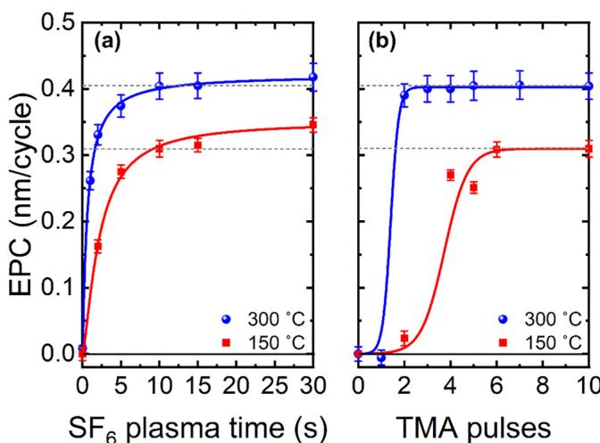  
FIG. 5. Saturation curves at 150 and  $300^{\circ}\mathrm{C}$  for (a)  $\mathrm{SF}_6$  plasma exposure using  $10\times 100\mathrm{ms}$  TMA exposures and (b) varied number of  $100\mathrm{ms}$  TMA pulses with a  $10\mathrm{s}$ $\mathrm{SF}_6$  plasma step, determined over 30 ALE cycles. Lines are guides for the eye.

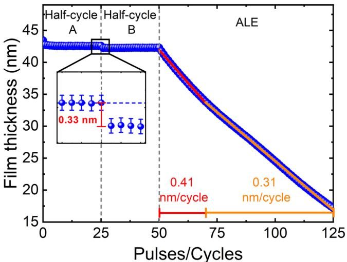  
FIG. 6. Synergy plot for GaN using  $\mathrm{SF}_6$  plasma and TMA at  $300^{\circ}\mathrm{C}$ . The first 25 pulses only involve dosing  $\mathrm{SF}_6$  plasma, the next 25 pulses only TMA, and the last 75 cycles are full ALE cycles with both  $\mathrm{SF}_6$  plasma and TMA dosed. The inset shows the transition between only  $\mathrm{SF}_6$  pulses and only TMA pulses.

Only dosing  $\mathrm{SF}_6$  plasma on the unetched GaN- coated sample leads to a small reduction  $(\sim 0.7 \mathrm{nm})$  in film thickness during the first pulse. This decrease could be due to either the removal of a carbon surface layer formed during storage in atmosphere (also known as adventitious carbon), removal of a heavily oxidized GaN surface layer, or changes in the optical properties of the film due to fluorination of the surface. The film thickness remains constant afterward, indicating saturation of the fluorination reaction, without continuous etching of GaN film at  $300^{\circ}\mathrm{C}$ . The inset of Fig. 6 shows that there is a thickness decrease of  $0.33 \mathrm{nm}$  when switching from  $\mathrm{SF}_6$  plasma only pulses to the TMA only pulses, suggesting that etching occurs during the TMA step of the ALE cycle. Subsequent TMA doses do not cause any thickness change, which confirms the self- limiting nature of the TMA half- cycle.

When switching to full ALE cycles, the etching immediately starts without a delay. The etching observed over the 75 cycles can be split into two regimes, one with an EPC of  $0.41 \pm 0.01 \mathrm{nm / cycle}$  for the first 20 cycles and a second with an EPC of  $0.31 \pm 0.01 \mathrm{nm / cycle}$ . This change in EPC is hypothesized to be caused by the transition from the oxidized surface layer into the more stoichiometric GaN layer underneath, as the decrease in EPC coincides with the decrease in O content observed by XPS [Fig. 3(a)]. Despite the slight decrease, the EPC remains high, which shows that the ALE process can etch both the oxidized surface layer and the bulk GaN. The transition at  $10 \mathrm{nm}$  can be more clearly seen in Fig. S.4, where the EPC is plotted as a function of the etched thickness. As there is no continuous etching observed for either half- cycle individually, the synergy value for this process is  $100\%$ .

# 3. Temperature dependence

Analysis of the EPC as a function of temperature provides valuable information about the ALE processing window. Figure 7 plots the GaN EPC from this study as a function of the table temperature. Thermal ALE data taken from the literature is included for comparison, as well as data for  $\mathrm{Al}_2\mathrm{O}_3$  ALE from our previous work with the same  $\mathrm{SF}_6$  plasma/TMA chemistry.

For the GaN ALE process reported in this work, there is a linear increase in EPC with temperature from  $0.31 \pm 0.01 \mathrm{nm / cycle}$  to  $0.40 \pm 0.02 \mathrm{nm / cycle}$  between 150 and  $300^{\circ}\mathrm{C}$ . At higher temperatures, a higher EPC is observed, likely due to enhanced diffusion generating a thicker fluorinated layer, as is predicted by the Deal- Grove model. Below  $150^{\circ}\mathrm{C}$ , the GaN EPC decreases rapidly, with no etching measured when processing at  $100^{\circ}\mathrm{C}$ . Instead, at  $100^{\circ}\mathrm{C}$ , the thickness increases, indicating that growth of an  $\mathrm{AlF}_3$  film may be occurring. As DFT predicts the ligand- exchange reaction between TMA and  $\mathrm{GaF}_{3 / 8}$  to be thermodynamically favorable down to temperatures below  $100^{\circ}\mathrm{C}$ , this lower temperature limit is likely caused by a kinetic barrier in the TMA step. The product  $\mathrm{GaF(CH_3)_2}$  is either not formed or not sufficiently volatile for these process conditions and time scale. Similar behavior, but shifted to a higher temperature, has been observed for  $\mathrm{Al}_2\mathrm{O}_3$  ALE using the same chemistry, as shown in Fig. 7. ALE of  $\mathrm{Al}_2\mathrm{O}_3$  with  $\mathrm{SF}_6$  plasma/TMA is not possible below  $200^{\circ}\mathrm{C}$ , the EPC then rapidly increases, before reaching a more steady increase at  $275^{\circ}\mathrm{C}$ . Since TMG  $\left[\mathrm{Ga(CH_3)_3}\right]$  has a much higher vapor pressure than TMA

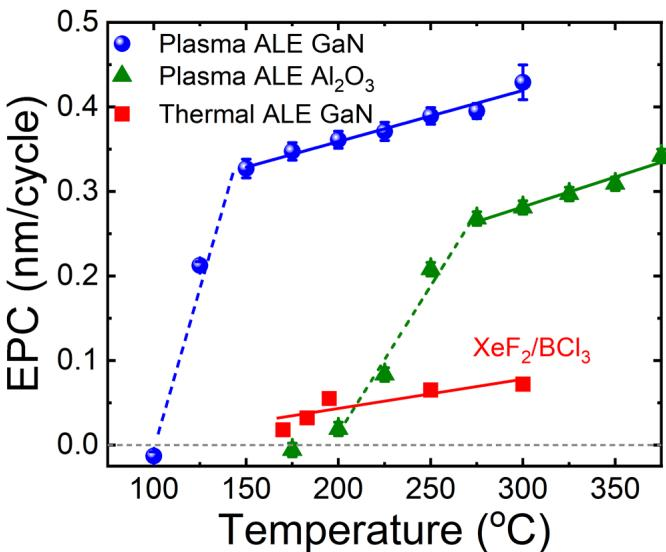  
FIG. 7. GaN EPC as a function of table temperature. Data for  $\mathrm{Al}_2\mathrm{O}_3$  ALE using the same  $\mathrm{SF}_6$  plasma/TMA chemistry are shown from our previous work. Thermal GaN ALE with  $\mathrm{XeF}_2 / \mathrm{BCl}_3$  is also included in the plot. Lines are guides to the eye.

$\left[\mathrm{Al(CH_3)_3}\right]$ , it is hypothesized that the wider temperature window of GaN ALE is related to the potentially higher volatility of the proposed  $\mathrm{GaF(CH_3)_3}$  etch product compared to  $\mathrm{AlF(CH_3)_3}$ .

From the temperature dependence in Fig. 7, a selectivity window for ALE of GaN over  $\mathrm{Al}_2\mathrm{O}_3$  can be observed between 150 and  $200^{\circ}\mathrm{C}$ . Selectivity was confirmed by performing 30 ALE cycles at  $150^{\circ}\mathrm{C}$  with  $\mathrm{HfO}_2$ ,  $\mathrm{Al}_2\mathrm{O}_3$ , and GaN samples in the reactor. Thickness measurements on all three samples before and after ALE revealed that neither  $\mathrm{Al}_2\mathrm{O}_3$  nor  $\mathrm{HfO}_2$  films were etched, while  $9.5 \mathrm{nm}$  of the material was etched from the GaN film, as shown in Table S1. This experiment demonstrates that selective processing can be achieved simply by operating at a low temperature. As  $\mathrm{Al}_2\mathrm{O}_3$  can be utilized as a hard mask for the deep RIE, it is possible that this selectivity could be exploited to enable surface cleaning of GaN post RIE before removal of the hardmask.

Comparing the plasma and thermal ALE processes for GaN shows that the etch rate for the plasma process is higher, while etching is obtained for a wider temperature window. The higher etch rate is likely due to the increased reactivity of fluorine radicals compared to the thermal  $\mathrm{XeF}_2$  counterpart, enabling a thicker modified layer to be formed. The use of plasmas for isotropic ALE of GaN, therefore, brings two main benefits: (i) higher etch rates and (ii) wider temperature window.

# C. Post-ALE film properties

# 1. Roughness

Previously, ALE has been shown to be an effective way to reduce the roughness of films. AFM scans taken before and after GaN ALE are shown in Fig. 8. The initial GaN surface,

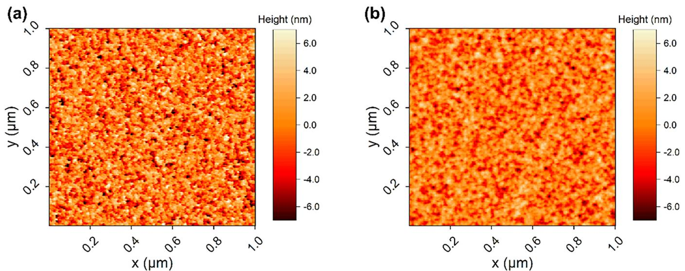  
FIG. 8. AFM height maps for (a) the as-deposited  $43 \text{nm}$  thick GaN film and (b) after  $25 \text{nm}$  ALE at  $300^{\circ} \text{C}$  using the standard recipe shown in Fig. 2.

Fig. 8(a), has sharp peaks and valleys, indicating the presence of crystalline grains on the GaN surface, as expected from the polycrystalline nature of ALD GaN films. Post  $25 \text{nm}$  of ALE at  $300^{\circ} \text{C}$ , Fig. 8(b), the surface is usually smoother, with the density and height of the crystallites reduced, yielding a reduction in RMS surface roughness from  $2.6 \pm 0.1$  to  $1.9 \pm 0.1 \text{nm}$ .

Figure 9 evaluates the surface roughness as a function of the etched thickness, where a decrease in roughness is observed for increasing etch depth. The rate of smoothing slows as the number of cycles increases, similar to ALD and ALE smoothing studies from the literature.84- 87 Smoothing by ALE involving a fluorination step has been described in our previous work using a curvature- dependent smoothing model.85 The comparison between the model and experimental results is included in Fig. 9, with a good agreement between the two. The fitted term  $\epsilon$ , representing a measure for the rate of F diffusion, is lower for GaN compared to amorphous  $\mathrm{Al}_2\mathrm{O}_3$  ( $\epsilon = 0.05 \times 10^{- 9}$  and  $\epsilon = 1.50 \times 10^{- 9} \text{m}$ , respectively), which agrees with the previous literature suggesting that GaN is more resistant to fluorination than AlN or  $\mathrm{Al}_2\mathrm{O}_3$ . The rate of smoothing may also be affected by the crystalline nature of the GaN film. Power spectral density (PSD) analysis presented in Fig. S.5 also shows a reduction in surface roughness with increasing ALE cycles. The PSD plot shows that the majority of smoothing on the GaN film occurs at small length scales ( $< 50 \text{nm}$ ) that are comparable to the total etched thickness.

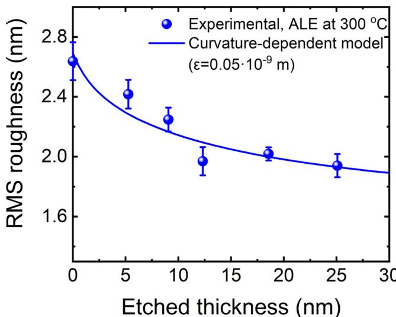  
FIG. 9. RMS roughness as a function of etched thickness, plotted alongside the fitted change in RMS roughness as obtained using the curvature-dependent model from Ref. 85.

# 2. Surface contamination

Figure 10 shows the F, S, O, and C atomic percentages at the GaN surface as a function of ALE cycles. As discussed in Sec. II B 3, the starting film has a large amount of O and C contamination, 16 and 14 at.%, respectively, as well as  $\sim 2 \text{at.}\%$  F. After ALE, the F and S content at the surface is largely independent of the number of ALE cycles, with 6 at.  $\%$  F and  $< 2 \text{at.}\%$  S for all films. The F content decreases with increasing XPS sputter time for all samples, returning to the bulk value of 2 at.  $\%$  after approximately  $5 \text{nm}$  of sputtering in the XPS, as shown in Fig. S.6. Doping with F in the region beneath the gate has been shown to be beneficial for GaN MISHEMT applications, therefore, some F in the film may be acceptable in these applications. A significant reduction in O and C content is seen after 10 ALE cycles. Removal of oxide layers and carbon is particularly important for improving device performance as they can

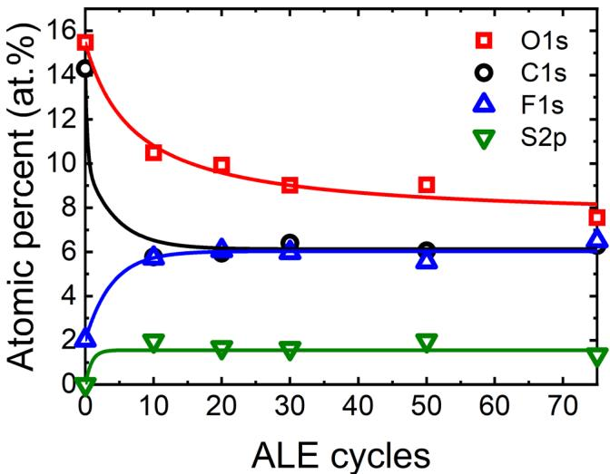  
FIG. 10. Atomic percentages of F, O, S, and C at the etched surface from XPS as a function of ALE cycles at  $300^{\circ}\mathrm{C}$ . Lines are a guide to the eye.

act as trap states and reduce electron mobility.4,6,15,17,31,34,89 The C content remains constant with increasing ALE cycles, while the O content continues to decrease. The decrease in O content with increasing cycles can be explained by the presence of an initially oxidized layer seen in Fig. 3(a). Additionally, the samples are exposed to ambient when transferred between the ALE and XPS tools, which may limit the measured reduction in C and O contents.

As TMA is a commonly used ALD precursor, it is possible that some deposition/residue of Al atoms could contaminate the surface during ALE. In certain applications, the GaN surface will be capped with a gate dielectric, such as  $\mathrm{Al}_2\mathrm{O}_3$  or AlN, meaning that small amounts of Al atoms at the surface may not be detrimental.90- 93 However, Al residues may be deleterious to device performance for applications outside MISHEMT devices.

In Fig. 11, the Al2p peak area and binding energy are plotted as a function of the table temperature during the ALE process. The fitted Al2p spectra for 100 and  $200^{\circ}\mathrm{C}$  are shown as insets. The XPS spectra of samples etched between 100 and  $300^{\circ}\mathrm{C}$  are shown in Fig. S.7. At low temperatures, the Al2p peak area is large, with the binding environment close to that of Al- F bonds. As the process temperature is increased the Al2p peak area decreases and then remains constant at  $200^{\circ}\mathrm{C}$  and above. Concurrently, the binding environment shifts from 76.5 to  $74.5\mathrm{eV}$ , indicating that the bonds are more Al- O in nature at higher process temperatures. The behavior seen in Fig. 11 can be explained by considering three competing reactions occurring within the reactor: (i)  $\mathrm{AlF}_3$  ALD, (ii) ALE of Al containing films, and (iii) GaN ALE, as will be explained below.

At  $100^{\circ}\mathrm{C}$ , the  $\mathrm{AlF}_3$  ALD reaction is dominant, and growth occurs on the GaN sample. This is supported by the negative EPC in Fig. 7, the large Al2p peak at  $76.5\mathrm{eV}$  in Fig. 11 and the enhanced growth of  $\mathrm{AlF}_3$  at low temperatures seen in the literature.78,79 The dominance of the ALD reaction overshadows any ALE contributions.

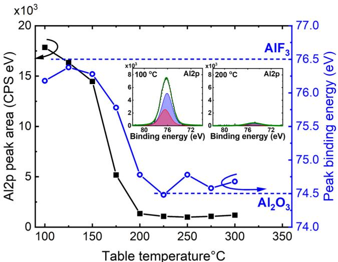  
FIG. 11. Al2p XPS peak area and peak binding energy after 30 ALE cycles as a function of table temperature. The binding energies of  $\mathrm{AlF}_3$  and  $\mathrm{Al}_2\mathrm{O}_3$  have been included as dashed lines to show the transition between the two binding environments. The insets show the fitted Al2p XPS spectra for the films etched at 100 and  $200^{\circ}\mathrm{C}$ .

Between 125 and  $175^{\circ}\mathrm{C}$ , there is competition between the three reactions. The  $\mathrm{AlF}_3$  ALD reaction is suppressed by higher temperatures, meaning fewer Al atoms are deposited on the surface. However, the ligand- exchange reaction between AlF and TMA is limited below  $200^{\circ}\mathrm{C}$ , as can be seen in Fig. 7 and in the ALE literature.41,42,63,83,94 Therefore, any deposited Al atoms are only partially removed, allowing the Al content to build up over the ALE cycles. The Al2p content decreases with increasing temperature from 125 to  $175^{\circ}\mathrm{C}$ , as the deposition reaction is further suppressed, and the etching reaction enhanced. In the same temperature range, the binding environment shifts toward Al- O bonds, as opposed to Al- F bonds. It is hypothesized that the O here comes from exposure to atmosphere during sample transfer, as will be discussed in the next paragraph. The changes in Al binding environment indicate that the  $\mathrm{AlF}_3$  ALD reaction is being suppressed and the Al ALE reactions enhanced. As the  $\mathrm{AlF}_3$  ALD reaction is not dominant, there is exposed GaN at the surface, which enables the etching of the GaN film.

As temperature is increased to  $200^{\circ}\mathrm{C}$  and above, the  $\mathrm{AlF}_3$  ALD reaction is further suppressed, and the ligand- exchange reaction between Al compounds and TMA is enhanced. This leads to minimal deposition of Al atoms on the surface, and any Al atoms that are deposited are readily etched at the high temperature. The GaN film can be freely etched as there is no buildup of an Al containing layer. However, a small Al2p signal (<1 at.%) is still present on the films processed above  $200^{\circ}\mathrm{C}$ . It is hypothesized that the Al2p signal is due to excess TMA from the final half- cycle. As there are no subsequent ALE cycles, the TMA remains on the surface and is oxidized during transfer in ambient to the XPS. This hypothesis is supported by the shift in Al2p binding environment

at high temperatures to Al- O bonds, indicating that the Al atoms on the GaN surface have not been exposed to the  $\mathrm{SF}_6$  plasma. Additionally, the Al2p peak area remains constant for all films processed above  $200^{\circ}\mathrm{C}$ , suggesting that the effect is constant across different temperatures.

# IV. CONCLUSIONS

In this study, an ALE process has been developed, which allows for the controlled removal of GaN at the sub- nm scale. Good agreement was observed between the predictions from DFT simulations and experimental results, demonstrating the utility of simulations to screen atomic- scale processing chemistries. Saturation behavior was experimentally measured at both 150 and  $300^{\circ}\mathrm{C}$ , with an etch rate of  $0.31\pm 0.01$  and  $0.40\pm 0.02\mathrm{nm / cycle}$  respectively. For applications where selectivity or low thermal budget are important, process temperatures down to  $125^{\circ}\mathrm{C}$  can be used. However, below  $200^{\circ}\mathrm{C}$ , there is an increase in Al and F contamination. Based on the saturation and synergy data, the ALE process is expected to follow a fluorination and ligand- exchange mechanism. The observed etch rate is higher than reported for thermal ALE of GaN, and significant etching was obtained over a wider temperature range. This highlights some of the benefits from a plasma- driven isotropic ALE process, such as the ability to etch materials that are resistant to thermal modification processes.

The ALE process was found to remove C and O contamination from the ALD prepared films, with only a small increase in the F, S, and Al content when processing above  $200^{\circ}\mathrm{C}$ . Such an increase may be tolerable depending on the final application of the GaN layer, especially if the ALE process can successfully remove the surface oxide. Smoothing of the polycrystalline GaN surface was also observed, following a curvature- dependent smoothing model. Reduction in both surface contamination and roughness indicates this process could be utilized as a "cleaning" step, which may lead to improved performance in a final GaN device. Such a cleaning step could be used post RIE to remove a damaged layer from the GaN surface before further processing. Future work could look to improve these qualities further. Surface contamination from ambient exposure could be avoided by in situ deposition of the next layer required for device fabrication, for example, the gate oxide in a MISHEMT device. An alternate etchant to TMA, such as TMG, could also be employed which may prevent Al contamination. Additionally, roughness and thickness can potentially be fine- tuned by implementing GaN ALE alongside GaN ALD in a supercycling technique.

Accurately controlling GaN film thickness, while simultaneously smoothing and removing contaminants, makes isotropic plasma ALE a good candidate for surface cleaning. Improving the interface quality in GaN devices will further enhance performance and yield, while the ability to process 3D structures will enable advances in GaN- based LED, RF, and power semiconductor devices.

# SUPPLEMENTARY MATERIAL

This section contains details on the stoichiometry and crystallinity of the ALD GaN films, GaN etched film thickness as a function of ALE cycles, change in EPC during synergy measurement,

ALE selectivity at  $150^{\circ}\mathrm{C}$ , PSD plots, the XPS depth profiles for films post- ALE and CIF files used for DFT simulations.

# ACKNOWLEDGMENTS

This work is part of the research program HTSM with Project No. 17124, which is financed by the Netherlands Organization for Scientific Research NWO. The authors would like to thank J. J. A. Zeebregts, C. A. A. van Helvoirt, C. van Bommel, J. J. L. M. Meulendijks, and B. Krishnamoorthy for technical support, as well as Dr. A. O'Mahony and Dr. M. Loveday for fruitful discussions on this work. We would also like to thank Schrodinger for providing access to their software, which is utilized in this work.

# AUTHOR DECLARATIONS

# Conflict of Interest

The authors have no conflicts to disclose.

# Author Contributions

Nicholas J. Chittock: Conceptualization (equal); Data curation (equal); Formal analysis (equal); Investigation (equal); Methodology (equal); Software (equal); Visualization (equal); Writing - original draft (equal); Writing - review & editing (equal). Yi Shu: Resources (equal); Writing - review & editing (equal). Simon D. Elliott: Methodology (equal); Software (equal); Writing - review & editing (equal). Harm C. M. Knoops: Funding acquisition (equal); Project administration (equal); Writing - review & editing (equal). W. M. M. (Ervvin): Kossels: Funding acquisition (equal); Project administration (equal); Supervision (equal); Writing - review & editing (equal). Adriaan J. M. Mackus: Conceptualization (equal); Formal analysis (equal); Funding acquisition (equal); Methodology (equal); Project administration (equal); Supervision (equal); Visualization (equal); Writing - original draft (equal); Writing - review & editing (equal).

# DATA AVAILABILITY

The data that support the findings of this study are openly available in 4TU.ResearchData at http://doi.org/10.4121/b7383943- 2ae0- 4339- 8cbf- 657765023fd6, Ref. 95.

# REFERENCES

1. Zhang, A. Zubair, Z. Liu, M. Xiao, J. Perozek, Y. Ma, and T. Palacios, "GaN FinFETs and trigate devices for power and RF applications: Review and perspective," Semicond. Sci. Technol. 36(5), 054001 (2021). 
2. H. Amano, Y. Baines, E. Beam, M. Borga, T. Bouchet, P. R. Chalker, M. Charles, K. J. Chen, N. Chowdhury, R. Chu, C. De Santi, M. M. De Souza, S. Decoutere, L. Di Cioccio, B. Eckardt, T. Egawa, P. Fay, J. J. Freedman, L. Guido, O. Haberlen, G. Haynes, T. Heckel, D. Hemakumara, P. Houston, J. Hu, M. Hua, Q. Huang, A. Huang, S. Jiang, H. Kawai, D. Kinzer, M. Kuball, A. Kumar, K. B. Lee, X. Li, D. Marcon, M. Marz, R. McCarthy, G. Meneghesso, M. Meneghini, E. Morvan, A. Nakajima, L. M. S. Narayanan, S. Oliver, T. Palacios, D. Piedra, M. Plissonnier, R. Reddy, M. Sun, I. Thayne, A. Torres, N. Trivellin, V. Unni, M. J. Uren, M. Van Hove, D. J. Wallis, J. Wang, J. Xie, S. Yagi, S. Yang, C. Youtsey, R. Yu, E. Zanoni, S. Zeltner, and Y. Zhang, "The 2018 GaN power electronics roadmap," J. Phys. D: Appl. Phys. 51(16), 163001 (2018).

$^3\mathrm{X}$  Ding, Y. Zhou, and J. Cheng, "A review of gallium nitride power device and its applications in motor driver," CES Trans. Electr.l Mach. Syst. 3(1), 54- 64 (2019).  $^4\mathrm{P}$  Fernandes Paes Pinto Rocha, L. Vauche, P. Pimenta- Barros, S. Ruel, R. Escoffier, and J. Buckley, "Recent developments and prospects of fully recessed MIS gate structures for GaN on S power transistors," Energies 16(7), 2978 (2023).  $^5\mathrm{F}$  Roccaforte, G. Greco, P. Fiorenza, and F. Iucolano, "An overview of normally- off GaN- based high electron mobility transistors," Materials 12(10), 1599- 1518 (2019).  $^6\mathrm{M}$  Meneghini, G. Meneghesso, and E. Zanoni, Power GaN Devices (Springer International Publishing, Chem. 2017).  $^7\mathrm{T}$  Ueda, "GaN power device: Current status and future challenges," Jpn. J. Appl. Phys. 58(SC), SC0804 (2019).  $^8\mathrm{Y}$  He, H. Gao, C. Wang, Y. Zhao, X. Lu, C. Zhang, X. Zheng, L. Guo, X. Ma, and Y. Hao, "Comparative study between partially and fully recessed- gate enhancement- mode AlGaN/GaN MIS HEMT on the breakdown mechanism," Phys. Status Solidi A Appl. Mater. Sci. 216(16), 1- 6 (2019).  $^9\mathrm{S}$  Benrabah, M. Legaallis, P. Besson, S. Ruel, L. Vauche, B. Pelissier, C. Thieuleux, B. Salem, and M. Charles,  $\mathrm{^3H_3CO_4}$  - based wet chemical etching for recovery of dryetched GaN surfaces," Appl. Surf./Sci. 582(December 2021), 152309 (2022).  $^{10}\mathrm{N}$  Gosset, J. Ladroue, T. Tillocher, P. Lefaucheux, M. Boufnichel, and R. Dussart, "Improvement of GaN deep etched surface state by fluorination dedicated to power devices," ECS Trans. 64(7), 255- 262 (2014).  $^{11}\mathrm{F}$  Le Roux, N. Posseme, P. Burtin, P. Gergaud, and V. Delaye, "Characterization of AlGaN/GaN degradations during plasma etching for power devices," Microelectron. Eng. 249, 111619 (2021).  $^{12}\mathrm{H}$  Tokuda, S. Harada, J. T. Aubar, and M. Kuzuhara, "Influence of reactive- ion- etching depth on interface properties in  $\mathrm{Al}_2\mathrm{O}_3 / \mathrm{n}$  - GaN MOS diodes," Jpn. J. Appl. Phys. 58(10), 106503 (2019).  $^{13}\mathrm{S}$  J. Pearton, E. A. Douglas, R. J. Shul, and F. Ren, "Plasma etching of wide bandgap and ultrawide bandgap semiconductors," J. Vac. Sci. Technol. A 38(2), 020802 (2020).  $^{14}\mathrm{F}$  Le Roux, N. Posseme, and P. Burtin, "Influences of etching chemical parameters on AlGaN/GaN electrical degradation in power devices," J. Vac. Sci. Technol. B 39(6), 063201 (2021).  $^{15}\mathrm{T}$  Y. Seong and H. Amano, "Surface passivation of light emitting diodes: From nano- size to conventional mesa- etched devices," Surf. Interfaces 21(October), 100765 (2020).  $^{16}\mathrm{T}$  Y. Lee, L.- Y. Chen, Y.- Y. Lo, S. S. Swayamprabha, A. Kumar, Y.- M. Huang, S.- C. Chen, H.- W. Zan, F.- C. Chen, R.- H. Horng, and H.- C. Kuo, "Technology and applications of micro- LEDs: Their characteristics, fabrication, advancement, and challenges," ACS Photonics 9(9), 2905- 2930 (2022).  $^{17}\mathrm{F}$  Olivier, A. Daami, C. Liciira, and F. Templier, "Shockley- Read- Hall and Auger non- radiative recombination in GaN based LEDs: A size effect study," Appl. Phys. Lett. 111(2), 022104 (2017).  $^{18}\mathrm{A}$  Fischer, A. Routzahn, S. M. George, and T. Lill, "Thermal atomic layer etching: A review," J. Vac. Sci. Technol., A 39(3), 030801 (2021).  $^{19}\mathrm{G}$  S. Oehrlein, D. Metzler, and C. Li, "Atomic layer etching at the tipping point: An overview," ECS J. Solid State Sci. Technol. 4(6), N5041- N5053 (2015).  $^{20}\mathrm{K}$  J. Kanarik, S. Tan, and R. A. Gottscho, "Atomic layer etching: Rethinking the art of etch," J. Phys. Chem. Lett. 9(16), 4814- 4821 (2018).  $^{21}\mathrm{K}$  J. Kanarik, T. Lill, E. A. Hudson, S. Sriraman, S. Tan, J. Marks, V. Vahedi, and R. A. Gottscho, "Overview of atomic layer etching in the semiconductor industry," J. Vac. Sci. Technol., A 33(2), 020802 (2015).  $^{22}\mathrm{A}$  Fischer, R. Janek, J. Boniface, T. Lill, K. J. Kanarik, Y. Pan, V. Vahedi, and R. A. Gottscho, Advanced Etch Technology for Nanopatterning VI, edited by S. U. Engelmann and R. S. Wise (American Vacuum Society, 2017), p. 101490H.  $^{23}\mathrm{T}$  Ohba, W. Yang, S. Tan, K. J. Kanarik, and K. Nojiri, "Atomic layer etching of GaN and AlGaN using directional plasma- enhanced approach," Jpn. J. Appl. Phys. 56(6), 2- 5 (2017).  $^{24}\mathrm{J}$  B. Park, W. S. Lim, B. J. Park, I. H. Park, Y. W. Kim, and G. Y. Yeom, "Atomic layer etching of ultra- thin  $\mathrm{HfO_2}$  film for gate oxide in MOSFET devices," J. Phys. D: Appl. Phys. 42(5), 055202 (2009).

$^{25}\mathrm{K}$  G. Crawford, J. Grant, D. T. Hemakumara, X. Li, I. Thayne, and D. A. J. Moran, "High synergy atomic layer etching of AlGaN/GaN with HBr and Ar," J. Vac. Sci. Technol. A 40(4), 042601 (2022).  $^{26}\mathrm{S}$  Ruel, P. Pimenta- Barros, F. Le Roux, N. Chauvet, M. Massardier, P. Thoueille, S. Tan, D. Shin, F. Gaucher, and N. Posseme, "Atomic layer etching of GaN using  $\mathrm{Cl}_2$  and He or Ar plasma," J. Vac. Sci. Technol. A 39(2), 022601 (2021).  $^{27}\mathrm{C}$  Kauppinen, S. A. Khan, J. Sundqvist, D. B. Suyatin, S. Suihkonen, E. I. Kauppinen, and M. Sopanen, "Atomic layer etching of gallium nitride (0001)," J. Vac. Sci. Technol. A 35(6), 060603 (2017).  $^{28}\mathrm{Y}$  Li, P. Ma, X. Ji- T. Wei, X. Tan, J. Wang, and J. Li, "Plasma atomic layer etching of GaN/AlGaN materials and application: An overview," J. Semicond. 39(11), 113002 (2018).  $^{29}\mathrm{Y}$  Zhang and T. Palacios, "Ultra) wide- bandgap vertical power FinFETs," IEEE Trans. Electron Devices 67(10), 3960- 3971 (2020).  $^{30}\mathrm{J}$  Li, Y. Yin, F. Liao, M. Lian, X. Zhang, Y. Xie, Y. Wu, B. Zou, Z. Zhang, and J. Li, "2.57GW/cm² normally- off composite stepped gate GaN- based HEMT with p- GaN buried layer and field plate," Mater. Sci. Semicond. Process. 153, 107152 (2023).  $^{31}\mathrm{Y}$  Zhong, J. Zhang, S. Wu, L. Jia, X. Yang, Y. Liu, Y. Zhang, and Q. Sun, "A review on the GaN- on- Si power electronic devices," Fundam. Res. 2(3), 462- 475 (2022).  $^{32}\mathrm{C}$  H. Wu, P. C. Han, Q. H. Luc, C. Y. Hsu, T. E. Hsieh, H. C. Wang, Y. K. Lin, P. C. Chang, Y. C. Lin, and E. Y. Chang, "Normally- OFF GaN MIS- HEMT with F- doped gate insulator using standard Ion implantation," IEEE Electron Devices Soc. 6, 893- 899 (2018).  $^{33}\mathrm{Y}$  Cai, Y. Zhou, K. J. Chen, and K. M. Laug, 63rd Device Research Conference Digest, 2005. DRC 05 (IEEE, 2005), pp. 179- 180.  $^{34}\mathrm{S}$  W. King, J. P. Barnak, M. D. Bremser, K. M. Tracy, C. Ronning, R. F. Davis, and R. J. Nemanich, "Cleaning of AlN and GaN surfaces," J. Appl. Phys. 84(9), 5248- 5260 (1998).  $^{35}\mathrm{B}$  Li, M. Namu, S. Wang, and J. Han, "In situ and selective area etching of GaN by tertiarybitychloride (TBCl)," Appl. Phys. Lett. 115(16), 162101 (2019).  $^{36}\mathrm{D}$  Zhuang and J. H. Edgar, "Wet etching of GaN, AlN, and SiC: A review," Mater. Sci. Eng., R: Rep. 48(1), 1- 46 (2005).  $^{37}\mathrm{T}$  Kako, Z. Liu, K. Ishikawa, H. Kondo, O. Oda, M. Sekine, and M. Hori, "Elevated- temperature etching of gallium nitride (GaN) in dual- frequency capacitively coupled plasma of  $\mathrm{CH}_4 / \mathrm{H}_2$  at  $300 - 500^{\circ}\mathrm{C}$ ," Vacuum 156, 219- 223 (2018).  $^{38}\mathrm{Y}$  H. Yeh, K.- M. Chen, Y.- H. Wu, Y.- C. Hsu, and W.- I. Lee, "Hydrogen etching on the surface of GaN for producing patterned structures," J. Cryst. Growth 314(1), 9- 12 (2011).  $^{39}\mathrm{N}$  R. Johnson, J. K. Hite, M. A. Mastro, C. R. Eddy, and S. M. George, "Thermal atomic layer etching of crystalline GaN using sequential exposures of  $\mathrm{XeF}_2$  and  $\mathrm{BCl}_3$ ," Appl. Phys. Lett. 114(24), 243103 (2019).  $^{40}\mathrm{D}$  C. Messina, K. A. Hatch, S. Vishwakarma, D. J. Smith, Y. Zhao, and R. J. Nemanich, "Challenges in atomic layer etching of gallium nitride using surface oxidation and ligand- exchange," J. Vac. Sci. Technol. A 41(2), 022603 (2023).  $^{41}\mathrm{J}$  Kim, D. Shim, Y. Kim, and H. Chae, "Atomic layer etching of  $\mathrm{Al}_2\mathrm{O}_3$  with  $\mathrm{NF}_3$  plasma fluorination and trimethylaluminum ligand exchange," J. Vac. Sci. Technol. A 40(3), 032603 (2022).  $^{42}\mathrm{C}$  W. Chen, W.- H. Cho, C.- Y. Chang, C.- Y. Su, N.- N. Chu, C.- C. Kei, and B.- R. Li, "  $\mathrm{CF}_4$  plasma- based atomic layer etching of  $\mathrm{Al}_2\mathrm{O}_3$  and surface smoothing effect," J. Vac. Sci. Technol. A 41(1), 012602 (2023).  $^{43}\mathrm{S}$  Kondati Natarajan, M. Nolan, P. Theofanis, C. Mokhtarzadeh, and S. B. Clendenning, "Mechanism of thermal atomic layer etch of W metal using sequential oxidation and chlorination: A first- principles study," ACS Appl. Mater. Interfaces 12(32), 36670- 36680 (2020).  $^{44}\mathrm{R}$  Mullins, S. Kondati Natarajan, S. D. Elliott, and M. Nolan, "Self- limiting temperature window for thermal atomic layer etching of  $\mathrm{HfO}_2$  and  $\mathrm{ZrO}_2$  based on the atomic- scale mechanism," Chem. Mater. 32(8), 3414- 3426 (2020).  $^{45}\mathrm{S}$  Kondati Natarajan and S. D. Elliott, "Modeling the chemical mechanism of the thermal atomic layer etch of aluminum oxide: A density functional theory

study of reactions during HF exposure," Chem. Mater. 30(17), 5912- 5922 (2018). 46A. H. Basher, M. Krstic, T. Takeuchi, M. Isobe, T. Ito, M. Kiuchi, K. Karahashi, W. Wenzel, and S. Hamaguchi, "Stability of hexafluoroacetylacetone molecules on metallic and oxidized nickel surfaces in atomic- layer- etching processes," J. Vac. Sci. Technol. A 38(1), 022610 (2020). 47R. Hidayat, T. Chowdhury, Y. Kim, S. Kim, T. R. Mayangsari, S. H. Kim, and W. J. Lee, "Density functional theory study on the reducing agents for atomic layer deposition of tungsten using tungsten chloride precursor," Appl. Surf. Sci. 538, 148156 (2021). 48c. Kandati Natarajan, M. Nolen, R. Theofanis, C. Malhtarramadh, and S. B. Clendenning, "In silico design of a thermal atomic layer etch process of cobalt," J. Vac. Sci. Technol. A 39(2), 022603 (2021). 49V. Sharma, S. Kondati Natarajan, S. D. Elliott, T. Blomberg, S. Haukka, M. E. Givens, M. Tuominen, and M. Ritala, "Combining experimental and DFT investigation of the mechanism involved in thermal etching of titanium nitride using alternate exposures of  $\mathrm{NbF_5}$  and  $\mathrm{CCl_4}$ , or  $\mathrm{CCl_4}$  only," Adv. Mater. Interfaces 8(22), 2101085 (2021). 50R. Mullins, J. J. Gutierrez Moreno, and M. Nolan, "Origin of enhanced thermal atomic layer etching of amorphous  $\mathrm{HfO_2}$ ," J. Vac. Sci. Technol., A 40(2), 022604 (2022). 51S. Kondati Natarajan, A. M. Cano, J. L. Partridge, S. M. George, and S. D. Elliott, "Prediction and validation of the process window for atomic layer etching: HF exposure on  $\mathrm{TiO_2}$ ," J. Phys. Chem. C 125(46), 25589- 25599 (2021). 52P. Giannozzi, S. Baroni, N. Bonini, M. Calandra, R. Car, C. Cavazzoni, D. Ceresoli, G. L. Chiarotti, M. Cococcioni, I. Dabo, A. Dal Corso, S. de Gironcoli, S. Fabris, G. Fratesi, R. Gebauer, U. Gerstmann, C. Gougoussis, A. Kokalj, M. Lazzeri, L. Martin- Santos, N. Marzari, F. Mauri, R. Mazzarello, S. Paolini, A. Pasquarello, L. Paulatto, C. Sbraccia, S. Scandolo, G. Sclauzero, A. P. Seitsonen, A. Smogunov, P. Umari, and R. M. Wentzcovitch, "QUANTUM ESPRESSO: A modular and open- source software project for quantum simulations of materials," J. Phys.: Condens. Matter 21(39), 395502 (2009). 53P. Giannozzi, O. Andreussi, T. Brumme, O. Buna, M. Buongiorno Nardelli, M. Calandra, R. Car, C. Cavazzoni, D. Ceresoli, M. Cococcioni, N. Colonna, I. Carnimeo, A. Dal Corso, S. de Gironcoli, P. Delugas, R. A. DiStasio, A. Ferretti, A. Floris, G. Fratesi, G. Fugallo, R. Gebauer, U. Gerstmann, F. Giustino, T. Gorni, J. Jia, M. Kawamura, H.- Y. Ko, A. Kokalj, E. Kucukbenli, M. Lazzeri, M. Marsili, N. Marzari, F. Mauri, N. L. Nguyen, H.- V. Nguyen, A. Otero- de- la- Roza, L. Paulatto, S. Ponce, D. Rocca, R. Sabatini, B. Santra, M. Schlipf, A. P. Seitsonen, A. Smogunov, I. Timrov, T. Thonhauser, P. Umari, N. Vast, X. Wu, and S. Baroni, "Advanced capabilities for materials modeling with quantum ESPRESSO," J. Phys.: Condens. Matter 29(46), 465901 (2017). 54A. D. Bochevarov, E. Harder, T. F. Hughes, J. R. Greenwood, D. A. Braden, D. M. Philipp, D. Rinaldo, M. D. Halls, J. Zhang, and R. A. Friesner, "Jaguar: A high- performance quantum chemistry software program with strengths in life and materials sciences," Int. J. Quantum Chem. 113(18), 2110- 2142 (2013). 55A. D. Becke, "Density- functional exchange- energy approximation with correct asymptotic behavior," Phys. Rev. A 38(6), 3098- 3100 (1988). 56J. P. Perdew, M. Ernzerhof, and K. Burke, "Rationale for mixing exact exchange with density functional approximations," J. Chem. Phys. 105(22), 9982- 9985 (1996). 57S. Grimme, J. Antony, S. Ehrlich, and H. Krieg, "A consistent and accurate ab initio parametrization of density functional dispersion correction (DFT- D) for the 94 elements H- Pu," J. Chem. Phys. 132(15), 154104 (2010). 58G. Kresse and D. Joubert, "From ultrasoft pseudopotentials to the projector augmented- wave method," Phys. Rev. B 59(3), 1758- 1775 (1999). 59S. B. S. Heil, J. L. van Hemmen, C. J. Hodson, N. Singh, J. H. Klootwijk, F. Roozeboom, M. C. M. van de Sanden, and W. M. M. Kessels, "Deposition of TiN and  $\mathrm{HfO_2}$  in a commercial  $200~\mathrm{mm}$  remote plasma atomic layer deposition reactor," J. Vac. Sci. Technol. A 25(5), 1357- 1366 (2007). 60H. C. M. Knoops, T. Faraz, K. Arts, and W. M. M. E. Kessels, "Status and prospects of plasma- assisted atomic layer deposition," J. Vac. Sci. Technol. A 37(3), 030902 (2019).

61H. C. M. Knoops, K. de Peuter, and W. M. M. Kessels, "Redeposition in plasma- assisted atomic layer deposition: Silicon nitride film quality ruled by the gas residence time," Appl. Phys. Lett. 107(1), 014102 (2015). 62A. Sharma, V. Longo, M. A. Verheijen, A. A. Bol, and W. M. M. E. Kessels, "Atomic layer deposition of  $\mathrm{HfO_2}$  using  $\mathrm{HfCp(NMe_2)_3}$  and  $\mathrm{O_2}$  plasma," J. Vac. Sci. Technol. A 35(1), 011B30 (2017). 63N. J. Chittock, M. F. J. Vos, T. Faraz, W. M. M. E. Kessels, H. C. M. Knoops, and A. J. M. Mackus, "Isotropic plasma atomic layer etching of  $\mathrm{Al_2O_3}$  using a fluorine containing plasma and  $\mathrm{Al(CH_3)_3}$ ," Appl. Phys. Lett. 117(16), 162107 (2020). 64P. Motamedi, N. Dalili, and K. Cadieu, "A route to less temperature growth of single crystal GaN on sapphire," J. Mater. Chem. C 3(28), 7428- 7436 (2015). 65M. Alevli, A. Haider, S. Kizir, S. A. Leghari, and N. Biyikli, "Comparison of trimethylgallium and triethylgallium as 'Ga' source materials for the growth of ultrathin GaN films on Si (100) substrates via hollow- cathode plasma- assisted atomic layer deposition," J. Vac. Sci. Technol. A 34(1), 01A137 (2016). 66P. Deminskyi, C.- W. Hsu, B. Bakhit, P. Rouf, and H. Pedersen, "Surface ligand removal in atomic layer deposition of GaN using triethylgallium," J. Vac. Sci. Technol. A 39(1), 012411 (2021). 67S. Kizir, A. Haider, and N. Biyikli, "Substrate impact on the low- temperature growth of GaN thin films by plasma- assisted atomic layer deposition," J. Vac. Sci. Technol. A 34(4), 041511 (2016). 68G. Kokkoris, A. Panagiotopoulos, A. Goodyear, M. Cooke, and E. Gogolides, "A global model for  $\mathrm{SF_6}$  plasmas coupling reaction kinetics in the gas phase and on the surface of the reactor walls," J. Phys. D: Appl. Phys. 42(5), 055209 (2009). 69M. Mao, Y. N. Wang, and A. Bogaerts, "Numerical study of the plasma chemistry in inductively coupled  $\mathrm{SF_6}$  and  $\mathrm{SF_6 / Ar}$  plasmas used for deep silicon etching applications," J. Phys. D: Appl. Phys. 44(43), 435202 (2011). 70K. A. Hatch, D. C. Messina, and R. J. Nemanich, "Plasma enhanced atomic layer deposition and atomic layer etching of pallium oxide using trimethylgallium," J. Vac. Sci. Technol. A 40(4), 42609 (2022). 71H. B. Proftj and W. M. M. Kessels, "Ion bombardment during plasma- assisted atomic layer deposition," ECS Trans. 50(13), 23- 34 (2013). 72Y. Lee, N. R. Johnson, and S. M. George, "Thermal atomic layer etching of gallium oxide using sequential exposures of HF and various metal precursors," Chem. Mater. 32(14), 5937- 5948 (2020). 73J. W. Clancey, A. S. Cavanagh, J. E. T. Smith, S. Sharma, and S. M. George, "Volatile etch species produced during thermal  $\mathrm{Al_2O_3}$  atomic layer etching," J. Phys. Chem. C 124(1), 287- 299 (2020). 74A. M. Cano, A. E. Marquardt, J. W. Dumont, and S. M. George, "Effect of HF pressure on thermal  $\mathrm{Al_2O_3}$  atomic layer etch rates and  $\mathrm{Al_2O_3}$  fluorination," J. Phys. Chem. C 123(16), 10346- 10355 (2019). 75S. M. George and Y. Lee, "Prospects for thermal atomic layer etching using sequential, self- limiting fluorination and ligand- exchange reactions," ACS Nano 10(5), 4889- 4894 (2016). 76A. Fischer, A. Routzahn, Y. Lee, T. Lill, and S. M. George, "Thermal etching of  $\mathrm{AlF_3}$  and thermal atomic layer etching of  $\mathrm{Al_2O_3}$ ," J. Vac. Sci. Technol. A 38(2), 02603 (2020). 77B. E. Deal and A. S. Grove, "General relationship for the thermal oxidation of silicon," J. Appl. Phys. 36(12), 3770- 3778 (1965). 78M. F. J. Vos, H. C. M. Knoops, W. M. M. Kessels, and A. J. M. Mackus, "Reaction mechanisms during atomic layer deposition of  $\mathrm{AlF_3}$  using  $\mathrm{Al(CH_3)_3}$  and  $\mathrm{SF_6}$  plasma," J. Phys. Chem. C 125(7), 3915- 3923 (2021). 79M. F. J. Vos, H. C. M. Knoops, R. A. Syhowicki, W. M. M. Kessels, and A. J. M. Mackus, "Atomic layer deposition of aluminum fluoride using  $\mathrm{Al(CH_3)_3}$  and  $\mathrm{SF_6}$  plasma," Appl. Phys. Lett. 111(11), 114105 (2017). 80M. Fulem, K. Ruzicka, V. Ruzicka, E. Hulicius, T. Simecek, K. Melichar, J. Pangrac, S. A. Rushworth, and L. M. Smith, "Vapor pressure of metal organic precursors," J. Cryst. Growth 248(SUPPL.), 99- 107 (2003). 81M. Drost, S. Marschmeyer, M. Fraschke, O. Fursenko, F. Barwolf, I. Costina, M. K. Mahadevaiah, and M. Lisker, "Etch mechanism of an  $\mathrm{Al_2O_3}$  hard mask in the Bosch process," Micro Nano Eng. 14, 100102 (2022).

$^{82}$ M. D. Henry, S. Walavalkar, A. Homyk, and A. Scherer, "Alumina etch masks for fabrication of high- aspect- ratio silicon micropillars and nanopillars," Nanotechnology 20(25), 255305 (2009). $^{83}$ H. Wang, A. Hossain, D. Catherall, and A. J. Minnich, "Isotropic plasma- thermal atomic layer etching of aluminum nitride using  $\mathrm{SF}_6$  plasma and Al  $(\mathrm{CH}_3)_3$ ," J. Vac. Sci. Tech. A 41, 032006 (2022). $^{84}$ D. R. Zywotko, J. Faguet, and S. M. George, "Rapid atomic layer etching of  $\mathrm{Al}_2\mathrm{O}_3$  using sequential exposures of hydrogen fluoride and trimethylaluminum with no purging," J. Vac. Sci. Technol. A 36(6), 061508 (2018). $^{85}$ S. H. Gerritsen, N. J. Chittock, V. Vandalon, M. A. Verheijen, H. C. M. Knoege, W. M. Knoege, and A. J. M. Mackus, "Surface smoothing by atomic layer deposition and etching for the fabrication of nanodevices," ACS Appl. Nano Mater. 5(12), 18116- 18126 (2022). $^{86}$ J. W. Elam, Z. A. Sechrist, and S. M. George, "ZnO/Al $_2$ O $_3$  nanolaminates fabricated by atomic layer deposition: Growth and surface roughness measurements," Thin Solid Films 414(1), 43- 55 (2002). $^{87}$ T. J. Myers, J. A. Throckmorton, R. A. Borrelli, M. O'Sullivan, T. Hatwar, and S. M. George, "Smoothing surface roughness using  $\mathrm{Al}_2\mathrm{O}_3$  atomic layer deposition," Appl. Surf. Sci. 569(June), 150878 (2021). $^{88}$ N. R. Johnson, H. Sun, K. Sharma, and S. M. George, "Thermal atomic layer etching of crystalline aluminum nitride using sequential, self- limiting hydrogen fluoride and Sn(acac) $_2$  reactions and enhancement by H2 and Ar plasmas," J. Vac. Sci. Technol. A 34(5), 050603 (2016). $^{89}$ T.- H. Hung, P. S. Park, S. Krishnamoorthy, D. N. Nath, and S. Rajan, "Interface charge engineering for enhancement- mode GaN MISHEMTs," IEEE Electron Device Lett. 35(3), 312- 314 (2014). $^{90}$ M. Whiteside, S. Arulkumaran, Y. Dikme, A. Sandupatla, and G. I. Ng, "Demonstration of AlGaN/GaN MISHEMT on Si with low- temperature epitaxy grown AlN dielectric gate," Electronics (Basel) 9(11), 1858 (2020). $^{91}$ M. Ishiguro, S. Urano, R. S. Low, M. Faris, I. Nagase, A. Baratov, J. T. Asubar, T. Motoyama, Y. Nakamura, Z. Yatabe, and M. Kazuhara, in 2021 IEEE International Meeting for Future Electron Devices, Kansai (IMFEDK) (IEEE, 2021), pp. 1- 2. $^{92}$ X. Y. Liu, S. X. Zhao, L.- Q. Zhang, H. F. Huang, J. S. Shi, C.- M. Zhang, H. L. Jo, R. F. Wang, and D. W. Zhang, "AlGaN/CaN MISHEMTs with AlN gate dielectric grown by thermal ALD technique," Nanoscale Res. Lett. 10(1), 109 (2015). $^{93}$ M. Legallais, G. Lefevre, S. Martin, S. Labau, F. Bassani, B. Pelissier, T. Baron, L. Vauche, C. Le Royer, M. Charles, W. Vandendaele, M. Plissonnier, R. Gwoziecki, and B. Salem, "Impact of substrate biasing during AlN growth by PEALD on  $\mathrm{Al}_2\mathrm{O}_3 / \mathrm{AlN} / \mathrm{GaN}$  MOS capacitors," Adv. Mater. Interfaces 9(5), 2101731 (2022). $^{94}$ A. Lii- Rosales, A. S. Cavanagh, A. Fischer, T. Lill, and S. M. George, "Spontaneous etching of metal fluorides using ligand- exchange reactions: Landscape revealed by mass spectrometry," Chem. Mater. 33(19), 7719- 7730 (2021). $^{95}$ N. Chittock, "Isotropic Atomic Layer Etching of GaN using SF6 plasma and Al(CH3) $_3$ ," 4TU.ResearchData. https://data.4tuhl/.

$^{89}$ T.- H. Hung, P. S. Park, S. Krishnamoorthy, D. N. Nath, and S. Rajan, "Interface charge engineering for enhancement- mode GaN MISHEMTs," IEEE Electron Device Lett. 35(3), 312- 314 (2014). $^{90}$ M. Whiteside, S. Arulkumaran, Y. Dakme, A. Sandupatla, and G. I. Ng, "Demonstration of AlGaN/GaN MISHEMT on Si with low- temperature epitaxy grown AlN dielectric gate," Electronics (Basel) 9(11), 1858 (2020). $^{91}$ M. Ishiguro, S. Urano, R. S. Low, M. Faris, I. Nagase, A Baratov, J. T. Asubar, T. Motoyama, Y. Nakamura, Z. Yatabe, and M. Kazuhara, in 2021 IEEE International Meeting for Future Electron Devices, Kansai (IMFEDK) (IEEE, 2021), pp. 1- 2. $^{92}$ X. Y. Liu, S. X. Zhao, L.- Q. Zhang, M. Huang, J. S. Shi, C.- M. Zhang, H. L. Jo, R. F. Wang, and D. W. Zhang, "AlGaN/CaN MISHEMTs with AlN gate dielectric grown by thermal ALD technique," Nanoscale Res. Lett. 10(1), 109 (2015). $^{93}$ M. Legallais, G. Lefevre. S. Martin, S. Labau, F. Bassani, B. Pelissier, T. Baron, L. Vauche, C. Le Royer, M. Charles, W. Vandendaele, M. Plissonnier, R. Gwoziecki, and B. Salem, "Impact of substrate biasing during AlN growth by PEALD on  $\mathrm{Al}_2\mathrm{O}_3 / \mathrm{AlN} /\mathrm{GaN}$  MOS capacitors," Adv. Mater. Interfaces 9(5), 2101731 (2022). $^{94}$ A. Lii- Rosales, A. S. Cavanagh, A. Fischer, T. Lill, and S. M. George, "Spontaneous etching of metal fluorides using ligand- exchange reactions: Landscape revealed by mass spectrometry," Chem. Mat. 33(19), 7719- 7730 (2021). $^{95}$ N. Chittock, "Isotropic Atomic Layer Etching of GaN using SF6 plasma and Al(CH3) $_3$ ," 4TU.ResearchData. https://data.4tuhl/.