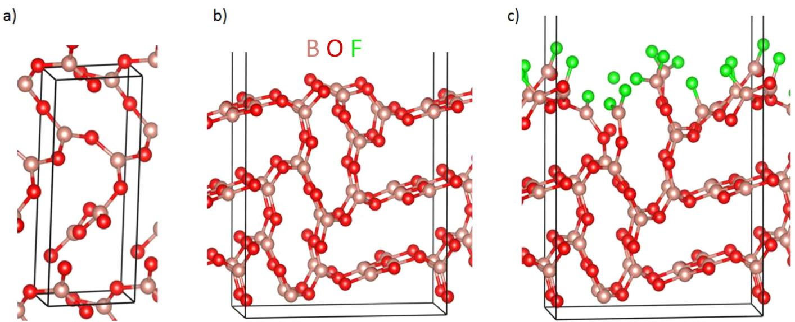
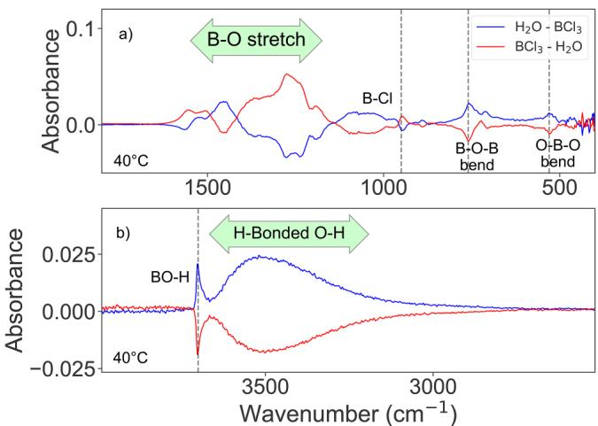
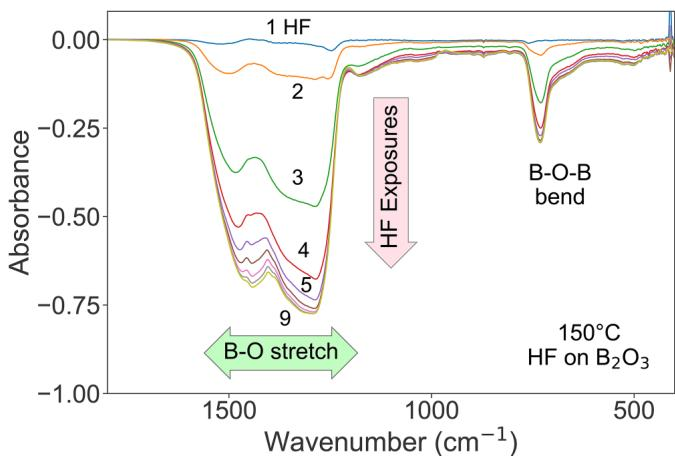
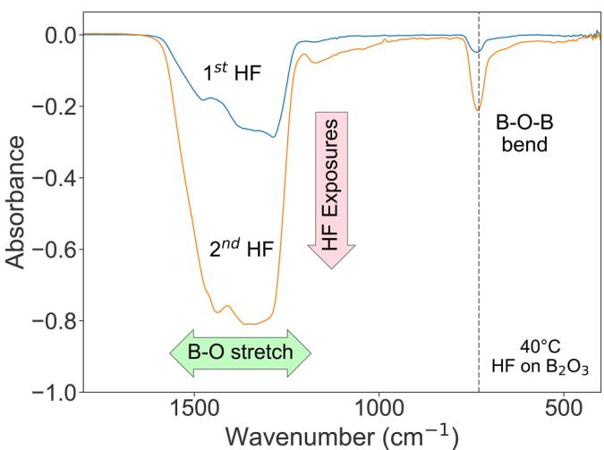
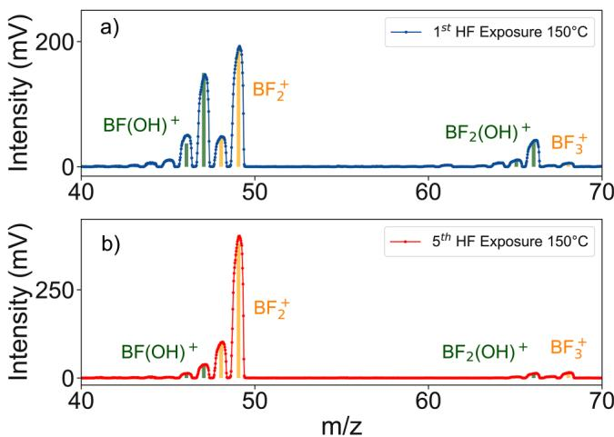
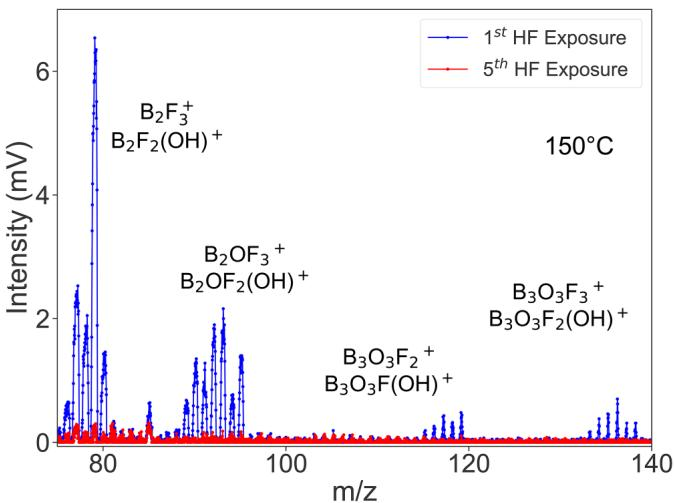
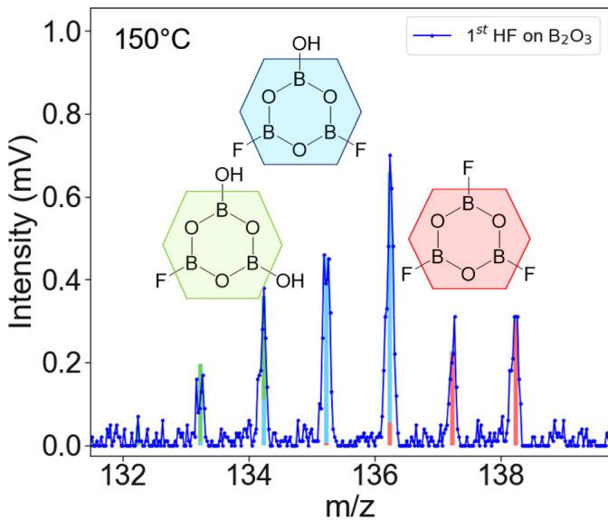
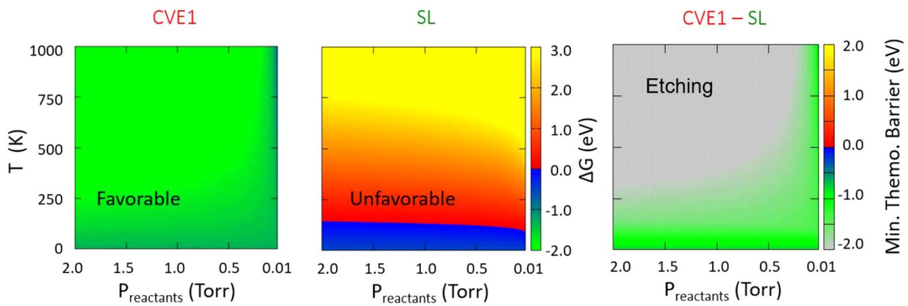
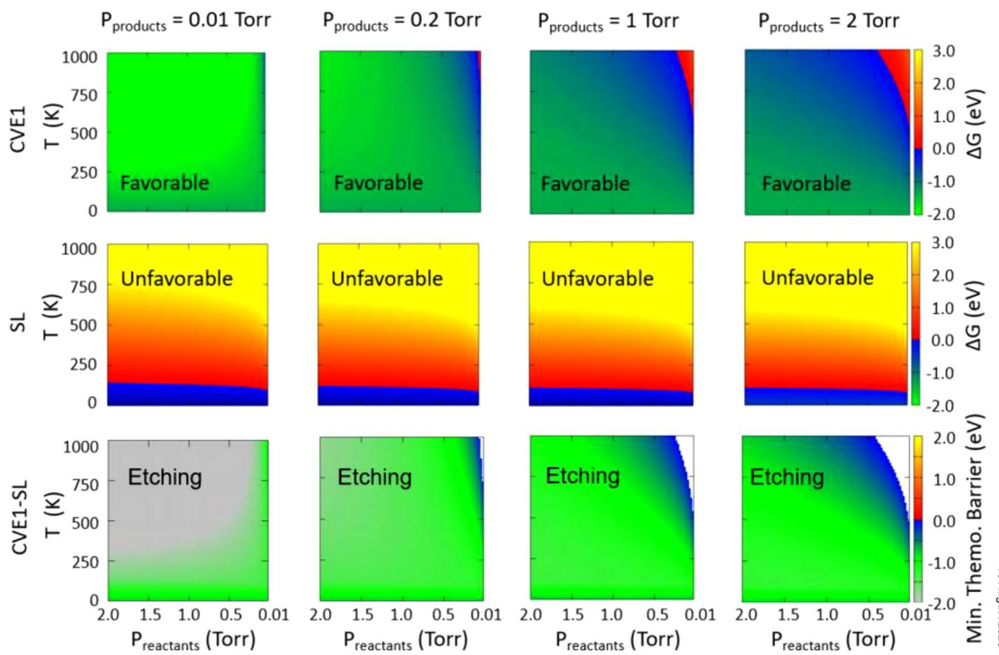

# Spontaneous etching of  $\mathsf{B}_2\mathsf{O}_3$  by HF gas studied using infrared spectroscopy, mass spectrometry, and density functional theory

Special Collection: Atomic Layer Etching (ALE)

Austin M. Cano; Suresh Kondati Natarajan  $\oplus$ ; Jonathan L. Partridge; Simon D. Elliott  $\oplus$ ; Steven M. George

Check for updates J.Vac.Sci.Technol.A 40,022601 (2022) https://doi.org/10.1116/S0001542

# Articles You May Be Interested In

Perfectly planar boronyl boroxine  $D_{3h}B_6O_6$ : A boron oxide analog of boroxine and benzene

J.Chem.Phys.June2013

Thermal atomic layer etching of  $\mathsf{VO}_2$  using sequential  $\mathsf{BCl}_3$  and  $\mathsf{SF}_4$  exposures; Observation of conversion, ligand- exchange, and oxidation state changes

J.Vac.Sci.Technol.A(January 2023)

Evaluated Chemical Kinetic Data for the Reactions of Atomic Oxygen  $\mathsf{O}(^3\mathsf{P})$  with Unsaturated Hydrocarbons

J.Phys.Chem.Ref.Data (April 1987)

# Spontaneous etching of  $\mathrm{B}_{2}\mathrm{O}_{3}$  by HF gas studied using infrared spectroscopy, mass spectrometry, and density functional theory

Cite as: J. Vac. Sci. Technol. A 40, 022601 (2022); doi: 10.1116/s0001542 Submitted: 8 October 2021 · Accepted: 10 December 2021 · Published Online: 11 January 2022

Austin M. Cano, $^{1}$  Suresh Kondati Natarajan, $^{2,3}$ $\oplus$  Jonathan L. Partridge, $^{1}$  Simon D. Elliott, $^{4}$ $\oplus$  and Steven M. George $^{1}$

# AFFILIATIONS

$^{1}$ Department of Chemistry, University of Colorado, Boulder, Colorado 80309  $^{2}$ University College Cork, Tyndall National Institute, Lee Maltings, Dyke Parade, Cork T12 R5CP, Ireland  $^{3}$ Department of Electrical Engineering and Automation, Aalto University, Espoo 02150, Finland  $^{4}$ Schrödinger Inc., 120 West 45th Street, 17th Floor, New York, New York 10036- 4041

Note: This paper is part of the 2022 Special Topic Collection on Atomic Layer Etching (ALE)

# ABSTRACT

The spontaneous etching of boron oxide  $(\mathrm{B}_2\mathrm{O}_3)$  by hydrogen fluoride (HF) gas is important during thermal atomic layer etching after  $\mathrm{BC}_3$  ,con. verts the surface of various metal oxides to a  $\mathrm{B}_2\mathrm{O}_3$  layer. In this study, the chemical vapor etching (CVE) of  $\mathrm{B}_2\mathrm{O}_3$  by HF was experimentally monitored using Fourier transform infrared (FTIR) spectroscopy and quadrupole mass spectrometry (QMS). The spontaneous etching of  $\mathrm{B}_2\mathrm{O}_3$  by HF gas was also analyzed using density functional theory (DFT).  $\mathrm{B}_2\mathrm{O}_3$  films were grown using  $\mathrm{B}_2\mathrm{O}_3$  atomic layer deposition with  $\mathrm{BC}_3$  and  $\mathrm{H}_2\mathrm{O}$  as the reactants at  $40^{\circ}\mathrm{C}$  FTIR spectroscopy then observed the CVE of  $\mathrm{B}_2\mathrm{O}_3$  by HF at  $150^{\circ}\mathrm{C}$ $\mathrm{B}_2\mathrm{O}_3$  etching was monitored by the loss of absorbance for  $\mathrm{B - O}$  stretching vibration in  $\mathrm{B}_2\mathrm{O}_3$  films. FTIR spectroscopy studies also observed  $\mathrm{B - F}$  stretching vibrations from  $\mathrm{BF}_x$  species on the  $\mathrm{B}_2\mathrm{O}_3$  surface after HF exposures. In addition, the QMS analysis was able to identify the etch products during the spontaneous etching of  $\mathrm{B}_2\mathrm{O}_3$  by HF gas at  $150^{\circ}\mathrm{C}$  The QMS studies observed the main volatile etch products as  $\mathrm{BF}_3$ $\mathrm{BF}_2(\mathrm{OH})$  and  $\mathrm{H}_2\mathrm{O}$  Additional volatile etch products were also detected including  $\mathrm{B}_3\mathrm{O}_3\mathrm{F}_3$  and other boroxine ring compounds. The DFT predictions were consistent with the spontaneous etching of  $\mathrm{B}_2\mathrm{O}_3$  by HF gas. DFT confirmed that CVE was likely because the energetics of the spontaneous etching reaction  $\mathrm{B}_2\mathrm{O}_3(\mathrm{s}) + 6\mathrm{HF}(\mathrm{g})\rightarrow 2\mathrm{BF}_3(\mathrm{g}) + 3\mathrm{H}_2\mathrm{O}(\mathrm{g})$  were more favorable than the self- limiting reaction  $\mathrm{B}_2\mathrm{O}_3(\mathrm{s}) + 6\mathrm{HF}(\mathrm{g}) - 2\mathrm{BF}_3(\mathrm{s}) + 3\mathrm{H}_2\mathrm{O}(\mathrm{g})$  . The spontaneous etching of  $\mathrm{B}_2\mathrm{O}_3$  was predicted at temperatures above  $- 163^{\circ}\mathrm{C}$  for an HF reactant pressure of 0.2 Torr and  $\mathrm{BF}_3$  and  $\mathrm{H}_2\mathrm{O}$  product pressure of 0.01 Torr.

Published under an exclusive license by the AVs. https://doi.org/10.1116/6.0001542

# I. INTRODUCTION

Etching has been important in making images and patterns for many centuries.' Dry etching has been particularly crucial in semiconductor processing.' The fabrication of three- dimensional device structures uses successive steps of deposition and etching in the presence of masks to control the areas for deposition and etching. Much of the previous dry etching has been performed using reactive radical and ionic species from plasmas. Some dry etching has also utilized plasmaless thermal chemistry.45 A prominent application of dry etching using only thermal chemistry is micromachining and feature release during MEMS processing.6- 8

Compared with plasma etching, there are not many examples of dry thermal etching. The main demonstrations of dry thermal etching involve the formation of volatile halides using various halogenation reactants. For example, the dry thermal etching of silicon can occur spontaneously using  $\mathrm{XeF_2}$ $\mathrm{F}_2$  or  $\mathrm{ClF}_3$  as the reactants.4,5,9 Many metals can also be etched by exposure to halogenation reactants. Tungsten and niobium can undergo dry thermal etching using  $\mathrm{XeF_2}$  7,8,10,11 Other metals, such as copper and aluminum, can also be spontaneously etched by  $\mathrm{Cl}_2$  11,12

Many metal oxides can also be spontaneously etched using ligand addition or halogenation reactions. Copper oxide, iron oxide, and other metal oxides can be spontaneously etched by exposure to ligands that can coordinate with the metal and produce volatile products.13- 15 The dry etching of  $\mathrm{SiO}_2$  can also occur with hydrogen fluoride (HF) in the presence of  $\mathrm{H}_2\mathrm{O}$  vapor at  $\mathrm{H}_2\mathrm{O}$

pressures sufficient to form an  $\mathrm{H}_2\mathrm{O}$  multilayer on the  $\mathrm{SiO}_2$  surface.16 Other examples of dry thermal spontaneous etching involve a variety of ligand- exchange reactions between metal fluorides and precursors that transfer ligands and volatilize the metal fluoride.17- 22

Spontaneous etching is also involved in thermal atomic layer etching (ALE).19,23 Two sequential reactions typically define thermal ALE. One reaction modifies the surface layer of the material and the second reaction leads to the volatile release of this modified surface layer.19 For example, the surface modification of metal oxides and metal nitrides during thermal ALE can be performed using fluorination to form a metal fluoride.19,24 The metal fluoride can then be volatilized using ligand- exchange reactions. Other mechanisms for thermal ALE can employ oxidation reactions to change the oxidation state of the metal or conversion reactions to convert the initial metal oxide to a different metal oxide that has an etching pathway.19,25,26 If at least one reaction in the thermal ALE reaction sequence is self- limiting (SL), the other reactions in the sequence may involve spontaneous etching.

Spontaneous etching in thermal ALE reaction sequences has been identified in several systems.  $\mathrm{WO}_3$  ALE using  $\mathrm{BCl}_3$  and HF as the reactants involves the conversion of  $\mathrm{WO}_3$  to boron oxide  $(\mathrm{B}_2\mathrm{O}_3)$  and then the spontaneous etching of  $\mathrm{B}_2\mathrm{O}_3$  by HF.26 TiN ALE using  $\mathrm{O}_3$  and HF as the reactants is defined by the oxidation of TiN to  $\mathrm{TiO}_2$  and then the spontaneous etching of  $\mathrm{TiO}_2$  by HF.27 In addition,  $\mathrm{Al}_2\mathrm{O}_3$  ALE using HF and TMA as the reactants proceeds with the fluorination of  $\mathrm{Al}_2\mathrm{O}_{3}$  to  $\mathrm{AlF}_3$  and then the spontaneous etching of  $\mathrm{AlF}_3$  by TMA.18,27 In these examples, the conversion, oxidation, or fluorination reactions are self- limiting, and then the removal of the modified surface layer occurs by spontaneous etching.

The reaction of HF plays a pivotal role in many thermal ALE systems.28,29 HF can fluorinate the initial material leading to the formation of a stable SL metal fluoride. Alternatively, HF can fluorinate and remove the initial material as a volatile fluoride by chemical vapor etching (CVE). The SL or CVE pathways are determined by the energetics and volatility of the reaction products. Having a better knowledge of HF reactions with metals and metal oxides will help improve the understanding of spontaneous etching and its role in thermal ALE.

In this article, the spontaneous etching of  $\mathrm{B}_2\mathrm{O}_3$  by HF gas is examined using Fourier transform infrared (FTIR) spectroscopy, quadrupole mass spectrometry (QMS), and density functional theory (DFT). The FTIR analysis confirms the spontaneous etching of  $\mathrm{B}_2\mathrm{O}_3$  by HF gas and reveals the species remaining on the  $\mathrm{B}_2\mathrm{O}_3$  surface after HF etching. The QMS measurements identify the volatile etch products that leave the  $\mathrm{B}_2\mathrm{O}_3$  surface during etching. The DFT investigations examine the energetics of the CVE and SL reactions between  $\mathrm{B}_2\mathrm{O}_3$  and HF gas and predict the expected etch products versus temperature and reactant and product pressures.

# II. EXPERIMENT AND METHODS

# A. FTIR spectroscopy

The FTIR spectroscopy studies of  $\mathrm{B}_2\mathrm{O}_3$  etching by HF were performed in a reactor reported previously.30 Prior to  $\mathrm{B}_2\mathrm{O}_3$  etching, the boron oxide was deposited using  $\mathrm{B}_2\mathrm{O}_3$  atomic layer deposition (ALD) using sequential exposures of  $\mathrm{BCl}_3$ $(\geq 99.9\%$  trace metals basis, Sigma- Aldrich) and de- ionized  $\mathrm{H}_2\mathrm{O}$  at  $35^{\circ}\mathrm{C}$ .26 The  $\mathrm{BCl}_3$  reaction was a  $2\mathrm{s}$  exposure, followed by a  $90\mathrm{s}$  purge. The FTIR scan was then recorded for  $60\mathrm{s}$ . The water reaction consisted of a  $1\mathrm{s}$  exposure, followed by a  $60\mathrm{s}$  purge. The FTIR scan was then again recorded for  $60\mathrm{s}$ .

The  $\mathrm{B}_2\mathrm{O}_3$  ALD film was deposited on silicon nanoparticles  $(>98\%$  U.S. Research Nanomaterials). The silicon nanoparticles had a diameter of  $\sim 30 - 50\mathrm{nm}$ . The silicon nanoparticles have a large surface area and ensure a high signal to noise ratio when using transmission FTIR spectroscopy to identify surface species.25 The silicon nanoparticles were pressed into a tungsten grid. The FTIR spectroscopy was then conducted by passing the IR light through the tungsten grid.31 The tungsten grid was  $\sim 1.7\times 3.0\mathrm{cm}^2$ ,  $50\mu \mathrm{m}$  thick with 100 grid lines per inch. The tungsten grid was resistively heated with a DC power supply (6268B,  $12\mathrm{V} / 40\mathrm{A}$ , HP). The power supply was controlled by a PID temperature controller (Love Controls 16B, Dwyer Instruments). To monitor the temperature, a type K thermocouple was connected to the tungsten grid with a nonconductive epoxy (Cermabond 571).

The  $\mathrm{B}_2\mathrm{O}_3$  spontaneous etching experiments were performed using HF- pyridine (70 wt. % HF, Sigma- Aldrich) as the HF source.32 Each HF exposure was a  $2\mathrm{s}$  static exposure of HF at  $200\mathrm{mTorr}$  followed by a  $90\mathrm{s}$  purge. Subsequently, the FTIR scan was recorded for  $60\mathrm{s}$ . Longer purges than necessary were used to eliminate the possibility of HF contact with the KBr windows during the FTIR scan.

# B. Quadrupole mass spectroscopy

The QMS investigations employed a new reactor that has been described earlier.22 This reactor is different from a previous reactor that employed static exposures and then sampled the gas- phase products using a pulsed valve.33 The new reactor studies volatile etch products produced by flowing reactant gases through powder samples. The volatile etch products and background gas were expanded through an aperture to form a molecular beam. The beam of background gas and volatile etch products were then passed through a skimmer and entered a differentially pumped region for the QMS analysis.

The skimmer aperture diameter was  $1.4\mathrm{mm}$  and the skimmer was positioned  $41\mathrm{mm}$  from the sample aperture.22 The volatile etch products were observed using a high sensitivity, high mass quadrupole mass spectrometer (Extrac MAX- QMS Flange Mounted System). Each spectrum monitored mass intensities from 2 to 300 amu and was recorded in  $1\mathrm{s}$ . An average of 100 scans was collected during HF exposures to help eliminate noise. Electron- impact ionization of gas- phase etching products was achieved with a circular thoriated iridium filament in the ionization volume inside the ionizer housing. An electron ionization energy of  $70\mathrm{eV}$  was used for these experiments.

HF was first introduced into a reservoir at a pressure of 9 Torr to have a consistent HF partial pressure during the reaction. HF was leaked into the flowing  $\mathrm{N}_2$  background gas. The HF pressure in the sample holder containing the  $\mathrm{B}_2\mathrm{O}_3$  powder was  $5.2\mathrm{Torr}$ . The background  $\mathrm{N}_2$  pressure was  $2.8\mathrm{Torr}$ .  $\mathrm{B}_2\mathrm{O}_3$  nanopowder was purchased from U.S. Research Nanomaterials  $(99.9\% , 165\mathrm{nm}$

diameter) and added to the sample holder. The mass of the  $\mathrm{B}_2\mathrm{O}_3$  nanopowder was recorded before and after the etching experiments. The mass of the  $\mathrm{B}_2\mathrm{O}_3$  nanopowder before spontaneous etching was  $50.5\mathrm{mg}$ .

# C. Density functional theory

The computational approach is similar to the approach employed in previous studies.28,29 In these earlier investigations, the energetics and thermochemistry of SL and CVE reactions were compared to reveal their competition. In the CVE reaction, the HF precursor gas molecules etch  $\mathrm{B}_2\mathrm{O}_3$  and form gaseous products. In the SL reaction, the HF precursor gas molecules interact and passivate the material surface by forming a nonvolatile fluoride layer.

This computational study considered the following CVE and SL reactions:

$$
\mathrm{CVE1:B_2O_{3(b)} + 6HF_{(g)}\longrightarrow 2BF_{3(g)} + 3H_2O_{(g)},} \tag{1}
$$

$$
\begin{array}{r}\mathrm{CVE2:4B_2O_{3(b)} + 14HF_{(g)}\longrightarrow 5H_2O_{(g)} + BF_{3(g)}}\\ +4\mathrm{B(OH)F_{2(g)} + B_3O_3F_{3(g)},} \end{array} \tag{2}
$$

$$
\mathrm{SL:2B_2O_3^* + 12HF_{(g)}\longrightarrow 4BF_3^* + 6H_2O_{(g)}.} \tag{3}
$$

In these reactions, b indicates bulk, g refers to gas, and the asterisks designate surface species. These are overall reactions for spontaneous etching (CVE1 and CVE2) or surface fluorination (SL) of  $\mathrm{B}_2\mathrm{O}_3$ . These reactions are independent of the reaction pathway. Reaction kinetics are not considered in this study.

This computational approach revealed that there is a "minimum thermodynamic barrier" that must be overcome to allow etching from the passivated surface. Based on the value of this "minimum thermodynamic barrier" and the respective energies of the CVE and SL reactions, the HF precursor gas pulse can be in one of the four following states: purely self- limiting, preferred self- limiting, preferred etching, and purely etching. These states are discussed in detail in previous studies.28

All the DFT calculations performed in this study were based on the spin- polarized generalized gradient approximation using the Perdew- Burke- Ernzerhof (PBE) exchange- correlation (XC) functional34 as implemented in the Vienna ab initio simulation package (VASP).35 In this approach, the valence electrons are treated explicitly by expanding their wave functions in a plane wave basis up to an energy cutoff of  $400\mathrm{eV}$ , whereas the core electrons are treated by projector augmented waves.36,37

The enthalpy and entropy contributions of the bulk and surface geometries were computed with the help of the PHONOPY code,38 which requires accurate interatomic force constants obtained from density functional perturbation theory (DFPT) calculations in VASP. The total electronic energies of gas- phase molecules,  $\mathrm{BF}_3$  and  $\mathrm{H}_2\mathrm{O}$ , were computed in VASP by placing the molecules in a large periodic box of dimensions  $15.0\times 15.5\times 16.0\mathrm{\AA}_3$  and relaxing their geometries. However, the enthalpy and entropy contributions of the gas- phase molecules were obtained from the free enthalpy (freeh) code of Turbomole suite39 using the PBE XC functional and triple zeta basis set (def- TZVPP).

To model the bulk  $\mathrm{B}_2\mathrm{O}_3$  geometry, a trigonal lattice geometry was employed from the materials project database.40 The geometry is simultaneously reoptimized for the ionic positions, cell shape, and cell volume with an increased plane wave energy cutoff of  $550\mathrm{eV}$  and a Monkhorst- Pack K- point mesh of  $4\times 4\times 2$ . The converged lattice parameters were found to be  $\mathrm{a} = \mathrm{b} = 4.4027\mathrm{\AA}$ ,  $c = 8.8174\mathrm{\AA}$ ,  $\alpha = \beta = 90^{\circ}$ , and  $\gamma = 120^{\circ}$  as shown in Fig. 1(a).

A  $9.4\mathrm{\AA}$  thick slab of trigonal  $\mathrm{B}_2\mathrm{O}_3$  sliced along the (1 0 1) surface plane with  $15\mathrm{\AA}$  of vacuum separating the periodic images along the surface normal was then chosen to represent the surface model for the self- limiting reaction. This surface slab model consisted of three layers of  $6\mathrm{B}_2\mathrm{O}_3$  units  $(\mathrm{B}_{16}\mathrm{O}_{54})$  as shown in Fig. 1(b). To model the fluorinated surface, six surface O atoms were removed as  $\mathrm{H}_2\mathrm{O}$  and  $12\mathrm{F}$  atoms were introduced such that the F atoms bind to surface boron atoms as shown in Fig. 1(c). The geometry was optimized to obtain the ground state electronic energy. Only the top most layer of these surfaces was considered for the DFPT calculations.

The reaction free energy  $(\Delta \mathrm{G})$  discussed in this article was computed as

$$
\Delta \mathrm{G} = \Delta \mathrm{H}\text{-}\mathrm{T}\Delta \mathrm{S} + \mathrm{R}\mathrm{T}\mathrm{ln}(\mathrm{Q}), \tag{4}
$$

where

$$
\Delta \mathrm{H} = \Delta \mathrm{E} + \Delta \mathrm{ZPE} + \Delta \mathrm{W(T)}, \tag{5}
$$

$$
\mathrm{Q} = \Pi \mathrm{p}_{\mathrm{products}}^{\prime \prime} / \Pi \mathrm{p}_{\mathrm{reactants}}^{\prime \prime}. \tag{6}
$$

In these equations,  $\Delta \mathrm{H}$  and  $\Delta \mathrm{S}$  are the enthalpy and entropy change, respectively.  $\Delta \mathrm{H}$  is computed as the sum of the electronic reaction energy  $(\Delta \mathrm{E})$ , zero point energy change  $(\Delta \mathrm{ZPE})$ , and a temperature- dependent contribution  $[\mathrm{W(T)}]$ . R is the gas constant,  $\mathrm{Q}$  is the reaction quotient that allows for changes in reactant and product pressures, and  $\mu$  is the stoichiometric coefficient of the respective reactant and product species.

# III. RESULTS AND DISCUSSION

# A. FTIR spectroscopy

The etching of  $\mathrm{B}_2\mathrm{O}_3$  films was studied using transmission FTIR spectroscopy. To study the etching of  $\mathrm{B}_2\mathrm{O}_3$  films,  $\mathrm{B}_2\mathrm{O}_3$  was first deposited on silicon nanoparticles. FTIR studies of  $\mathrm{B}_2\mathrm{O}_3$  ALD are shown in Fig. 2.  $\mathrm{B}_2\mathrm{O}_3$  ALD was performed with  $\mathrm{BCl}_3$  and  $\mathrm{H}_2\mathrm{O}$  as the reactants at a low deposition temperature of  $\sim 40^{\circ}\mathrm{C}$ . The overall reaction is  $2\mathrm{BCl}_3 + 3\mathrm{H}_2\mathrm{O}\rightarrow \mathrm{B}_2\mathrm{O}_3 + 6\mathrm{HCl}$ . The  $\mathrm{BCl}_3$  exposure was conducted for  $1\mathrm{s}$  at  $500\mathrm{mTorr}$ . The  $\mathrm{H}_2\mathrm{O}$  exposure was conducted for  $1\mathrm{s}$  at  $80\mathrm{mTorr}$ .  $\mathrm{B}_2\mathrm{O}_3$  ALD with  $\mathrm{BCl}_3$  and  $\mathrm{H}_2\mathrm{O}$  is similar to  $\mathrm{B}_2\mathrm{O}_3$  ALD using  $\mathrm{BBr}_3$  and  $\mathrm{H}_2\mathrm{O}$ . Earlier studies of  $\mathrm{B}_2\mathrm{O}_3$  ALD films using  $\mathrm{BCl}_3$  and  $\mathrm{H}_2\mathrm{O}$  have been performed and found to have the correct  $\mathrm{B}_2\mathrm{O}_3$  stoichiometry by XPS.26

Figure 2 shows the FTIR spectra referenced to the original silicon nanoparticle substrate. After the first  $\mathrm{BCl}_3$  and  $\mathrm{H}_2\mathrm{O}$  cycle, absorbance gains are measured at  $1450$  and  $1315\mathrm{cm}^{- 1}$  and a smaller absorbance loss is observed at  $1250\mathrm{cm}^{- 1}$ . These absorbance features can be identified as a gain of  $\mathrm{B} - \mathrm{O}$  stretching vibrations

  
FIG. 1. (a) Reoptimized trigonal lattice geometry for  $\mathsf{B}_2\mathsf{O}_3$  bulk. (b) Bare (1 0 1) surface of trigonal  $\mathsf{B}_2\mathsf{O}_3$ . (c) Fluorinated  $\mathsf{B}_2\mathsf{O}_3$  surface from (b) after removing six surface O atoms.

and a small loss of  $\mathrm{Si - O - Si}$  vibrations, respectively.42- 45 The loss of absorbance for  $\mathrm{Si - O - Si}$  vibrations likely results from boron being slightly soluble in silicon.46 Three main vibrational modes grow at 1450, 1315, and  $730~\mathrm{cm^{- 1}}$  with an increasing number of  $\mathrm{B}_2\mathrm{O}_3$  ALD cycles up to 15 cycles. These vibrational features are assigned to different boron- oxygen stretch modes and ring- stretching modes in boric acid and borate.42,43,45,47

Difference spectra recorded during the 13th  $\mathrm{BCl}_3$  and  $\mathrm{H}_2\mathrm{O}$  exposures during  $\mathrm{B}_2\mathrm{O}_3$  ALD are displayed in Fig. 3. These difference spectra are consistent with the sequential AB reactions during  $\mathrm{B}_2\mathrm{O}_3$  ALD as

  
FIG. 2. Infrared absorbance spectra from 400 to  $1800~\mathrm{cm^{-1}}$  during  $\mathsf{B}_2\mathsf{O}_3$  ALD using  $\mathrm{BCl}_3$  and  $\mathrm{H}_2\mathrm{O}$  as reactants after 1, 5, 10, and 15  $\mathrm{B}_2\mathrm{O}_3$  ALD cycles at  $40^{\circ}\mathrm{C}$ .

$$
\begin{array}{rl} & {\mathrm{(A)BOH^{*} + BCl_{3}(g)\rightarrow BOBCl_{2}^{*} + HCl(g),}}\\ & {\mathrm{(B)BCl^{*} + H_{2}O(g)\rightarrow BOH^{*} + HCl(g).}} \end{array} \tag{8}
$$

In these equations, the asterisks indicate the surface species.

In Fig. 3(a), positive vibrational absorbance peaks are observed at 1530, 1362, 1273, and  $950~\mathrm{cm^{- 1}}$  after the  $\mathrm{BCl}_3$  exposure. The

  
FIG. 3. Infrared difference spectra recorded after  $\mathrm{BCl}_3$  and  $\mathrm{H}_2\mathrm{O}$  exposures during 13th  $\mathrm{B}_2\mathrm{O}_3$  ALD cycle at  $40^{\circ}\mathrm{C}$ . (a) Difference spectra between 400 and  $1800~\mathrm{cm^{-1}}$ . (b) Difference spectra between 2500 and  $4000~\mathrm{cm^{-1}}$ .

absorbance peaks at 1530, 1362, and  $1273~\mathrm{cm^{- 1}}$  are attributed to different boron oxide vibrations such as ring- stretching boroxol vibrations and B- O stretching vibrations.42,43,45,47 The absorbance peak at  $950~\mathrm{cm^{- 1}}$  is attributed to B- Cl surface vibrations left on the surface after  $\mathrm{BCl}_3$  exposure.48 There may also be B- Cl vibrations found between 1300 and  $1500\mathrm{cm}^{- 1}$  that are largely obscured by the absorbance from B- O vibrational modes.48 Negative vibrational absorbance peaks are also observed at 750 and  $500~\mathrm{cm^{- 1}}$  after  $\mathrm{BCl}_3$  exposure. These peaks are assigned to  $\mathrm{BO}_2$  bending vibrations.42,45,47 A small loss of  $1450~\mathrm{cm^{- 1}}$  is assigned to B- OH and is likely lost resulting from the  $\mathrm{BCl}_3$  reaction with  $\mathrm{BOH}$  species.43

Positive vibrational absorbance peaks are also observed in Fig. 3(a) at 1440, 730, and  $530~\mathrm{cm^{- 1}}$  after the  $\mathrm{H}_2\mathrm{O}$  exposure. These vibrational features result from the reaction of  $\mathrm{H}_2\mathrm{O}$  with BCl surface species. These are likely B- OH stretching vibrations and the bending modes of  $\mathrm{BO}_2$ .45 In addition, there are also negative absorbance peaks at 1530, 1362, 1273, and  $950~\mathrm{cm^{- 1}}$  after the  $\mathrm{H}_2\mathrm{O}$  exposure. These negative absorbance peaks after the  $\mathrm{H}_2\mathrm{O}$  exposure mirror the reverse of the positive absorbance peaks monitored after the  $\mathrm{BCl}_3$  exposure.

Figure 3(b) shows the change in the  $\mathrm{O - H}$  stretching vibrations after  $\mathrm{H}_2\mathrm{O}$  and  $\mathrm{BCl}_3$  exposures. After  $\mathrm{H}_2\mathrm{O}$  exposures, there is an increase at  $3700~\mathrm{cm^{- 1}}$  that is consistent with isolated  $\mathrm{O - H}$  groups in boric acidlike films.49 There is also a very broad peak at  $3600 - 3000~\mathrm{cm^{- 1}}$  that is attributed to hydrogen- bonded  $\mathrm{BOH}$  species on the surface.49 The positive absorbance features observed after the  $\mathrm{H}_2\mathrm{O}$  exposure are then almost exactly reversed when the  $\mathrm{BOH}$  species are removed from the surface by reaction with the  $\mathrm{BCl}_3$  exposure.

The spontaneous etching of  $\mathrm{B}_2\mathrm{O}_3$  by  $\mathrm{HF}$  gas was then examined using the  $\mathrm{B}_2\mathrm{O}_3$  ALD films. FTIR spectra were recorded after each  $2\mathrm{s}$  static exposure of  $\mathrm{HF}$  at  $200~\mathrm{mTorr}$  at  $150^{\circ}\mathrm{C}$ . These FTIR spectra were referenced to the initial  $\mathrm{B}_2\mathrm{O}_3$  ALD film on the silicon nanoparticles. The progressive FTIR spectra versus number of  $\mathrm{HF}$  exposures for nine HF exposures on  $\mathrm{B}_2\mathrm{O}_3$  are shown in Fig. 4. Each consecutive HF exposure removes a fraction of the absorbance from the  $\mathrm{B}_2\mathrm{O}_3$  ALD film. This absorbance loss corresponds to CVE of the  $\mathrm{B}_2\mathrm{O}_3$  film. The vibrational modes at 1450, 1315, and  $730~\mathrm{cm^{- 1}}$  are attributed to B- O vibrations as discussed earlier during the growth of the  $\mathrm{B}_2\mathrm{O}_3$  ALD films.42,45,47

  
FIG. 4. Infrared difference spectra between 400 and  $1800~\mathrm{cm^{-1}}$  recorded after consecutive HF exposures on the  $\mathrm{B}_2\mathrm{O}_3$  ALD film at  $150^{\circ}\mathrm{C}$  using the original  $\mathrm{B}_2\mathrm{O}_3$  ALD film as reference. Original  $\mathrm{B}_2\mathrm{O}_3$  ALD film is nearly completely removed after  $>5$  HF exposures.

The first HF exposure in Fig. 4 only removes a small fraction of the  $\mathrm{B}_2\mathrm{O}_3$  film. Perhaps the first HF exposure is required to fluorinate the surface and condition the  $\mathrm{B}_2\mathrm{O}_3$  film. The largest absorbance losses are observed during the second, third, and fourth HF exposures in Fig. 4. The absorbance losses are reduced during the subsequent HF exposures. By the eighth HF exposure, the  $\mathrm{B}_2\mathrm{O}_3$  film has been completely removed by the CVE reaction.

The spontaneous etching of  $\mathrm{B}_2\mathrm{O}_3$  by  $\mathrm{HF}$  at  $150^{\circ}\mathrm{C}$  is consistent with earlier results for  $\mathrm{B}_2\mathrm{O}_3$  etching by  $\mathrm{HF}$  at  $207^{\circ}\mathrm{C}$  observed by spectroscopic ellipsometry studies.26 These previous studies were conducted to confirm that  $\mathrm{HF}$  could spontaneously remove  $\mathrm{B}_2\mathrm{O}_3$  films after using  $\mathrm{BCl}_3$  to convert the surface of  $\mathrm{WO}_3$  to a  $\mathrm{B}_2\mathrm{O}_3$  layer. The conversion of  $\mathrm{WO}_3$  to  $\mathrm{B}_2\mathrm{O}_3$  was an important step in the thermal ALE of  $\mathrm{WO}_3$  using  $\mathrm{BCl}_3$  and  $\mathrm{HF}$  and also the thermal ALE of  $\mathrm{W}$  using  $\mathrm{O}_2 / \mathrm{O}_3$ ,  $\mathrm{BCl}_3$  and  $\mathrm{HF}$ .26

The earlier study of  $\mathrm{WO}_3$  ALE examined  $\mathrm{B}_2\mathrm{O}_3$  ALD films grown using  $\mathrm{BCl}_3$  and  $\mathrm{H}_2\mathrm{O}$  as the reactants and then etched the  $\mathrm{B}_2\mathrm{O}_3$  ALD films using  $\mathrm{HF}$  exposures of  $100\mathrm{mTorr}$ .26 Each  $\mathrm{HF}$  exposure removed  $\approx 1.8\mathrm{\AA}$  of  $\mathrm{B}_2\mathrm{O}_3$  at  $207^{\circ}\mathrm{C}$ . In contrast, approximately  $5\mathrm{HF}$  exposures were required to remove the  $\mathrm{B}_2\mathrm{O}_3$  ALD film in Fig. 4 where each  $\mathrm{HF}$  exposure was  $400\mathrm{mTorr}$  s. Based on a  $\mathrm{B}_2\mathrm{O}_3$  ALD growth rate of  $\approx 1\mathrm{\AA / cycle}$  using  $\mathrm{BCl}_3$  and  $\mathrm{H}_2\mathrm{O}$ , the etch rate in Fig. 4 for the  $\mathrm{B}_2\mathrm{O}_3$  film grown using  $15\mathrm{B}_2\mathrm{O}_3$  ALD cycles is  $\approx 3\mathrm{\AA / HF}$  exposure. There is reasonable agreement between these etch rates per  $\mathrm{HF}$  exposure given the different  $\mathrm{HF}$  exposures and temperatures.

  
FIG. 5. Infrared difference spectra between 3350 and  $3850~\mathrm{cm^{-1}}$  recorded after consecutive  $\mathrm{HF}$  exposures on the  $\mathrm{B}_2\mathrm{O}_3$  ALD film at  $150^{\circ}\mathrm{C}$  using the original  $\mathrm{B}_2\mathrm{O}_3$  ALD film as reference.

Figure 5 shows difference spectra from 3350 to  $3850~\mathrm{cm^{- 1}}$  referenced to the initial  $\mathrm{B}_2\mathrm{O}_3$  film during HF exposures on  $\mathrm{B}_2\mathrm{O}_3$ . There is an absorbance increase at  $3740~\mathrm{cm^{- 1}}$ , an absorbance loss at  $3700~\mathrm{cm^{- 1}}$ , and another broad absorbance loss from 3400 to  $3700~\mathrm{cm^{- 1}}$ . The positive absorbance feature at  $3740~\mathrm{cm^{- 1}}$  appears after the fourth HF exposure and is attributed to H- F stretching vibrations from adsorbed HF on the surface. Figure 4 shows that most of the  $\mathrm{B}_2\mathrm{O}_3$  film has been etched by the fourth HF exposure. Before the fourth HF exposure, HF was presumably consumed by the  $\mathrm{B}_2\mathrm{O}_3$  etching reaction.

Figure 5 shows that the peak at  $3700~\mathrm{cm^{- 1}}$  decreases and is constant after the first HF exposure. This peak is attributed to terminal BO- H vibrational stretching vibrations. Terminal BOH species were also present during  $\mathrm{B}_2\mathrm{O}_3$  ALD after the  $\mathrm{H}_2\mathrm{O}$  exposure as shown in Fig. 3(b). These terminal BOH species are consumed by the first HF exposure. The broad absorbance loss from 3400 to  $3700~\mathrm{cm^{- 1}}$  is also assigned to the loss of hydrogen- bonded BOH groups on the  $\mathrm{B}_2\mathrm{O}_3$  film. However, these hydrogen- bonded BOH groups are not removed until after the fourth HF exposure. The removal of these hydrogen- bonded BOH groups coincides with the growth of absorbance assigned to HF on the  $\mathrm{B}_2\mathrm{O}_3$  surface.

Figure 6 shows the FTIR difference spectra during the first HF exposure and during the last (ninth) HF exposure. The first HF exposure is referenced to the initial  $\mathrm{B}_2\mathrm{O}_3$  ALD film and the ninth HF exposure is referenced to the eighth HF exposure to understand the change of each individual HF exposure. For comparison, these difference spectra are contrasted with the inverted absorbance for the  $\mathrm{B}_2\mathrm{O}_3$  ALD film over the same frequency range. The FTIR difference spectrum after the first HF exposure shows apparent absorbance loss peaks at 1242 and  $1517~\mathrm{cm^{- 1}}$ . These two apparent absorbance loss peaks result from removal of B- O vibrations together with an absorbance gain at  $1440~\mathrm{cm^{- 1}}$  resulting from another vibrational feature. The absorbance gain at  $1440~\mathrm{cm^{- 1}}$  does not appear as a positive absorbance peak because this absorbance gain occurs concurrently with a larger absorbance loss resulting from  $\mathrm{B}_2\mathrm{O}_3$  spontaneous etching.

If the first HF exposure was only removing  $\mathrm{B}_2\mathrm{O}_3$ , then the FTIR difference spectra after the first HF exposure and the absorbance from the  $\mathrm{B}_2\mathrm{O}_3$  ALD film should be similar in Fig. 6. The discrepancy between the first HF exposure and ninth HF exposure can be explained by the growth of absorbance from B- F vibrational modes of  $\mathrm{BF}_x$  surface species at  $1440~\mathrm{cm^{- 1}}$ . This new positive absorbance partially offsets the absorbance loss resulting from  $\mathrm{B}_2\mathrm{O}_3$  etching. Subsequent HF exposures lead to the loss of more  $\mathrm{B}_2\mathrm{O}_3$  and the comparison between the FTIR difference spectra and the absorbance from the  $\mathrm{B}_2\mathrm{O}_3$  ALD film is more similar as shown in Fig. 4. This behavior is expected if the  $\mathrm{BF}_x$  surface species stay constant during subsequent HF exposures while the B- O absorbance losses continue to increase with more HF exposures.

Further confirmation for the assignment of B- F stretching vibrations from  $\mathrm{BF}_x$  surface species centered at  $\sim 1430~\mathrm{cm^{- 1}}$  is derived from the evolution of the difference spectra with each HF exposure. The FTIR difference spectra after the ninth exposure show only an absorbance loss centered at  $1430~\mathrm{cm^{- 1}}$ . This absorbance loss is again consistent with the B- F stretching vibrations from  $\mathrm{BF}_3$  surface species. In this case, nearly all the  $\mathrm{B}_2\mathrm{O}_3$  has been etched away. The ninth HF exposure then removes the last of the B- F surface species.

The  $\mathrm{B}_2\mathrm{O}_3$  was also easily etched by HF at lower temperatures than  $150^{\circ}\mathrm{C}$ . Figure 7 shows the etching of  $\mathrm{B}_2\mathrm{O}_3$  during HF exposures at a lower temperature of  $40^{\circ}\mathrm{C}$ . This temperature was the lowest temperature examined in this study. The B- O vibrational feature at  $1200 - 1600~\mathrm{cm^{- 1}}$  decreases in intensity during the first and second HF exposures. The absorbance loss is faster than the

  
FIG. 6. Infrared difference spectra showing absorbance after first HF exposure referenced to the initial  $\mathrm{B}_2\mathrm{O}_3$  ALD film and ninth HF exposure referenced to absorbance after the eighth HF exposure. Inverted absorbance for original  $\mathrm{B}_2\mathrm{O}_3$  ALD film is also shown for comparison.

  
FIG. 7. Infrared difference spectra between 400 and  $1800~\mathrm{cm^{-1}}$  recorded after consecutive HF exposures on  $\mathrm{B}_2\mathrm{O}_3$  ALD film at  $40^{\circ}\mathrm{C}$  using the original  $\mathrm{B}_2\mathrm{O}_3$  ALD film as reference. Original  $\mathrm{B}_2\mathrm{O}_3$  ALD film is nearly completely removed after 2 HF exposures.

absorbance loss observed for  $\mathrm{B}_2\mathrm{O}_3$  etching at  $150^{\circ}\mathrm{C}$  as shown in Fig. 4. However, the  $\mathrm{B}_2\mathrm{O}_3$  etching rate was not quantified versus temperature.

# B. Quadrupole mass spectrometry

QMS was used to identify the volatile etch products during the spontaneous etching of  $\mathrm{B}_2\mathrm{O}_3$  by HF. The QMS observed that the main volatile etch products were  $\mathrm{BF}_3$ ,  $\mathrm{BF}_2(\mathrm{OH})$ , and  $\mathrm{H}_2\mathrm{O}$ . Figure 8 shows a portion of the mass spectrum from 40 to 70 amu during the first and fifth HF exposures at  $150^{\circ}\mathrm{C}$  on  $\mathrm{B}_2\mathrm{O}_3$ . In this spectral range, the main peaks are assigned to  $\mathrm{BF}_3$  and  $\mathrm{BF}_2(\mathrm{OH})$ . The largest masses at  $m / z = 68$  and 67 amu are assigned to the  $\mathrm{BF}_3$  molecular ion. The shapes of the clusters are determined by the 80:20 isotopic ratio between  ${}^{11}\mathrm{B}$  and  ${}^{10}\mathrm{B}$ . The ratio of the signal intensities at  $m / z = 68$  and 67 amu is consistent with the natural isotopic abundance of boron.

The largest mass intensity is observed for a fragment of  $\mathrm{BF}_3^+$  corresponding to  $\mathrm{BF}_2^+$  at  $m / z = 49$  amu for  ${}^{11}\mathrm{B}$ . There is also a signal at  $m / z = 48$  amu based on the isotopic abundance of  ${}^{10}\mathrm{B}$ . This peak also has the correct signal intensity relative to the signal at  $m / z = 49$  amu. In addition, there are other peaks at  $m / z = 66$  and 65 amu that are assigned to  $\mathrm{BF}_2(\mathrm{OH})$ . The fragmentation of  $\mathrm{BF}_2(\mathrm{OH})^+$  also produces a signal for  $\mathrm{BF(OH)^+}$  at  $m / z = 47$  and 46 amu. The species  $\mathrm{BF}_2(\mathrm{OH})^+$  and  $\mathrm{BF(OH)^+}$  have been observed and characterized previously by reacting  $\mathrm{BF}_3$  with  $\mathrm{B(OH)_3}$  at room temperature. The etching of  $\mathrm{B}_2\mathrm{O}_3$  can also be confirmed by the mass loss of  $\mathrm{B}_2\mathrm{O}_3$  powder. The initial mass of the  $\mathrm{B}_2\mathrm{O}_3$  powder was  $50.5\mathrm{mg}$ . After multiple HF exposures, the  $\mathrm{B}_2\mathrm{O}_3$  powder mass was reduced to  $24.8\mathrm{mg}$ .

Figure 8(a) shows that there are more  $\mathrm{BF}_2(\mathrm{OH})$  species observed during the first HF exposure compared with the fifth HF exposure displayed in Fig. 8(b). In particular, the signals for  $\mathrm{BF}_2(\mathrm{OH})^+$  and  $\mathrm{BF(OH)^+}$  both drop dramatically versus the signal for  $\mathrm{BF}_2^+$  when comparing Figs. 8(a) and 8(b). The initial  $\mathrm{B}_2\mathrm{O}_3$  powder was loaded into the chamber from ambient air. The air exposure likely hydrated the  $\mathrm{B}_2\mathrm{O}_3$  surface to form a boric acidlike surface. This surface yields more OH species during HF etching.

  
FIG.8.Mass spectrum of products monitored in the range of  $m / z = 40 - 75$  amu during spontaneous etching of  $\mathrm{B}_2\mathrm{O}_3$  by HF at  $150^{\circ}C$  during the a first HF exposure and (b) fifth HF exposure. Observed products are  $\mathsf{BF}_3$  and  $\mathsf{B(OH)}\mathsf{F}_2$

Figure 9 shows the mass signals at higher mass from  $m / z = 75$  to 140 amu. This portion of the mass spectrum corresponds to boroxine ring compounds. The existence of gas- phase  $\mathrm{B}_3\mathrm{O}_3\mathrm{F}_3$  boroxine rings has been previously reported and characterized using mass spectrometry. Figure 9 reveals that clusters of mass peaks are observed around  $m / z = 136$ , 118, 52, and 79 amu. The peaks located from  $m / z = 131$  to 140 amu are shown on an expanded scale in Fig. 10. These peaks are attributed to the parent  $\mathrm{B}_3\mathrm{O}_3\mathrm{F}_3$ ,  $\mathrm{B}_3\mathrm{O}_3\mathrm{F}_2\mathrm{OH}$ , and  $\mathrm{B}_3\mathrm{O}_3\mathrm{F}(\mathrm{OH})_2$  boroxine rings. The identity of these peaks is confirmed by the predictions for their masses based on the isotopic abundance of  ${}^{11}\mathrm{B}$  and  ${}^{10}\mathrm{B}$  shown in Fig. 10.

The next grouping of peaks is observed around  $m / z = 118$  amu in Fig. 9. These peaks are consistent with  $\mathrm{B}_3\mathrm{O}_3\mathrm{F}_2^+$  and  $\mathrm{B}_3\mathrm{O}_3\mathrm{F}(\mathrm{OH})^+$ . These peaks are assigned to fragments of the  $\mathrm{B}_3\mathrm{O}_3\mathrm{F}_3$  and  $\mathrm{B}_3\mathrm{O}_3\mathrm{F}_2\mathrm{OH}$  boroxine ring compounds. The grouping of peaks around  $m / z = 92$  amu is attributed to  $\mathrm{B}_2\mathrm{OF}_2\mathrm{OH}^+$  and  $\mathrm{B}_2\mathrm{OF}_3^+$  and assigned to boron dimers or fragments of the parent boroxine rings. Likewise, the grouping of peaks around  $m / z = 79$  amu is attributed to  $\mathrm{B}_2\mathrm{F}_3^+$  and  $\mathrm{B}_2\mathrm{F}_2(\mathrm{OH})^+$  and assigned to boron dimers or fragments. The signals for the boroxine rings with hydroxyl groups in Fig. 9 are much larger during the first HF exposure compared with the fifth HF exposure. The larger hydroxyl content during the first HF exposure is again attributed to the initial boric acidlike surface of the  $\mathrm{B}_2\mathrm{O}_3$  powders. This hydrated  $\mathrm{B}_2\mathrm{O}_3$  surface is removed by the fifth HF exposure.

The etch products evolve versus the number of HF exposures on the  $\mathrm{B}_2\mathrm{O}_3$  powder. Figure 11 shows the evolution of the main volatile etch products during the first five HF exposures on the

  
FIG.9. Mass spectrum of products monitored in the range of  $m / z = 70-140$  amu during spontaneous etching of  $\mathrm{B}_2\mathrm{O}_3$  by HF at  $150^{\circ}C$  during the a first HF exposure and (b) fifth HF exposure. Observed products are  $\mathrm{B}_3\mathrm{O}_3\mathrm{F}_3$ ,  $\mathrm{B}_3\mathrm{O}_3\mathrm{F}_2\mathrm{OH}$ , and  $\mathrm{B}_3\mathrm{O}_3\mathrm{F}(\mathrm{OH})_2$  boroxine rings.

  
FIG. 10. Mass spectrum of products monitored in the range of  $m / z = 131 - 140$  amu during spontaneous etching of  $\mathrm{B}_2\mathrm{O}_3$  by HF at  $150^{\circ}\mathrm{C}$ . Parent peaks of  $\mathrm{B}_3\mathrm{O}_3\mathrm{F}_3$ ,  $\mathrm{B}_3\mathrm{O}_2\mathrm{F}_2(\mathrm{OH})$ , and  $\mathrm{B}_3\mathrm{O}_2\mathrm{F}(\mathrm{OH})_2$  boroxine rings are observed during the first HF exposure.

$\mathrm{B}_2\mathrm{O}_3$  powder. Figure 11(a) shows the mass intensities for  $\mathrm{BF}_2^+$  and  $\mathrm{BF(OH)^+}$ . These species are the highest mass intensities corresponding to  $\mathrm{BF}_3$  and  $\mathrm{BF}_2(\mathrm{OH})$  volatile etch products. Figure 11(b) displays the mass intensities for  $\mathrm{H}_2\mathrm{O}^+$  corresponding to the same first five HF exposures.

A comparison between the signals for  $\mathrm{BF}_2^+$  and  $\mathrm{BF(OH)^+}$  for the first five HF exposures in Fig. 11(a) reveals that the intensity for the  $\mathrm{BF(OH)^+}$  drops significantly with increasing HF exposures. In contrast, the intensity for  $\mathrm{H}_2\mathrm{O}^+$  in Fig. 11(b) is very constant for the second to fifth HF exposures. The decrease in the signal for  $\mathrm{BF(OH)^+}$  is consistent with HF etching through the initial surface of the hydrated  $\mathrm{B}_2\mathrm{O}_3$  powder. After removing this boric acidlike surface of the  $\mathrm{B}_2\mathrm{O}_3$  powder, the HF exposure yields primarily  $\mathrm{BF}_3$  as the volatile etch product.

  
FIG.11. Mass traces of (a)  $\mathsf{BF}_2^+$  at  $m / z = 47$  amu and  $\mathsf{BFOH}^+$  at  $m / z = 49$  amu and (b)  $\mathrm{H}_2\mathrm{O}^+$  at  $m / z = 18$  amu vs time during the first five HF exposures on  $\mathrm{B}_2\mathrm{O}_3$  powder.

  
FIG.12. G free energy profiles of CVE1, CVE2, and SL reactions vs temperature at a constant HF reactant pressure of  $0.2$  Torr and a product pressure of  $0.01$  Torr. SL reaction becomes endergonic at  $110\mathrm{K}$ .

# C. Density functional theory

DFT was used to determine the reaction energies and "minimum thermodynamic barriers" to etch. The CVE1 reaction is  $\mathrm{B}_2\mathrm{O}_3 + 6\mathrm{HF}(\mathrm{g})\rightarrow 2\mathrm{BF}_3(\mathrm{g}) + 3\mathrm{H}_2\mathrm{O}(\mathrm{g})$ . This reaction needs  $6\mathrm{HF}$  molecules to etch a unit bulk of  $\mathrm{B}_2\mathrm{O}_3$  and form  $2\mathrm{BF}_3$  and  $3\mathrm{H}_2\mathrm{O}$  gas- phase molecules. The  $\mathrm{BF}_3$  and  $\mathrm{H}_2\mathrm{O}$  reaction products are consistent with the results from the QMS studies. The CVE1 reaction is determined to be exoergic with a reaction energy of  $- 1.6\mathrm{eV}$ . The SL reaction is also exoergic with a reaction energy of  $- 0.8\mathrm{eV}$ . This SL reaction energy is less exoergic than the CVE1 reaction by  $0.8\mathrm{eV}$ . Consequently, the spontaneous etch reaction is more favorable than the self- limiting reaction, and there is a negative "minimum thermodynamic barrier" for spontaneous etching.

The CVE2 reaction is  $4\mathrm{B}_2\mathrm{O}_3 + 14\mathrm{HF}(\mathrm{g})\rightarrow 5\mathrm{H}_2\mathrm{O}(\mathrm{g}) + \mathrm{BF}_3(\mathrm{g}) + 4\mathrm{B(OH)}\mathrm{F}_2(\mathrm{g}) + \mathrm{B}_3\mathrm{O}_3\mathrm{F}_3(\mathrm{g})$ . This reaction was considered to study the formation of the  $\mathrm{B(OH)}\mathrm{F}_2$  and  $\mathrm{B}_3\mathrm{O}_3\mathrm{F}_3$  reaction products. These reaction products were also identified by the QMS investigations. The CVE2 reaction is exoergic with a reaction energy of  $- 1.1\mathrm{eV}$ . However, this reaction energy of  $- 1.1\mathrm{eV}$  is only  $- 0.27\mathrm{eV}$  per each  $\mathrm{B}_2\mathrm{O}_3$  unit. Therefore, this reaction energy is much less than the reaction energy of  $- 1.8\mathrm{eV}$  per each  $\mathrm{B}_2\mathrm{O}_3$  unit

  
FIG. 13. 2D heat maps of  $\Delta G$  free energies of CVE1 and SL reactions and corresponding "minimum thermodynamic barrier" to etch given by CVE1-SL at different reactant HF pressures from 0.01 to 2.0 Torr at a constant product pressure of 0.01 Torr. The CVE1 and SL contour plots (left and middle) share the same color bar and  $y$  axis.

for the CVE1 reaction. The "minimum thermodynamic barrier" to etch  $\mathrm{B}_2\mathrm{O}_3$  and form these  $\mathrm{B(OH)F_2}$  and  $\mathrm{B}_3\mathrm{O}_3\mathrm{F}_3$  products is also negative. The much larger reaction energy for the CVE1 reaction is consistent with the QMS observation of primarily BF, etch products after removing the hydrated layer on the  $\mathrm{B}_2\mathrm{O}_3$  powder.

Figure 12 displays the free energy profiles (FEPs) of CVE1, CVE2, and SL reactions in the temperature range of  $0 - 1000\mathrm{K}$  at a constant HF reactant pressure of 0.2 Torr and a product pressure of 0.01 Torr. The SL reaction is exergonic at  $0\mathrm{K}$  and increases in free energy with temperature. The SL reaction crosses the zero line at  $110\mathrm{K}$  and becomes endergonic at higher temperatures. In comparison, the free energies of CVE1 and CVE2 reactions are exergonic at  $0\mathrm{K}$ . The free energies of the CVE1 and CVE2 reactions decrease with temperature albeit with a small negative slope. The FEP of the CVE1 reaction has a comparatively slightly larger negative slope than the FEP of the CVE2 reaction. The CVE1 and CVE2 reactions never cross the zero line.

The region up to  $110\mathrm{K}$  in Fig. 12 is labeled as "preferred etching" since the CVE reactions are more favorable than the SL reaction and both CVE and SL reactions are exergonic in this temperature range. The region at temperatures greater than  $110\mathrm{K}$  in Fig. 12 is labeled as "purely etching." In this temperature zone, the SL reaction is endergonic. The stable surface B- F bonds at  $\mathrm{T}< 110\mathrm{K}$ $(- 163^{\circ}\mathrm{C})$  are not favorable in the presence of a continuous supply of HF gas at  $\mathrm{T} > 110\mathrm{K}$ . The experimental FTIR and QMS observations of spontaneous etching of  $\mathrm{B}_2\mathrm{O}_3$  by HF exposure at  $150^{\circ}\mathrm{C}$ $(423\mathrm{K})$  are in the "purely etching" region and consistent with these computational results. The FTIR results of spontaneous  $\mathrm{B}_2\mathrm{O}_3$  etching by HF at  $40^{\circ}\mathrm{C}$  and the earlier spectroscopic ellipsometry measurements of spontaneous  $\mathrm{B}_2\mathrm{O}_3$  etching by HF at  $207^{\circ}\mathrm{C}$  are also in agreement with these theoretical predictions.

The FEPs of the CVE1 and SL reactions were then examined at different reactant HF pressure from 0.01 to 2.0 Torr at a constant product pressure of 0.01 Torr in the temperature range of  $0 - 1000\mathrm{K}$ . The resulting free energy changes for CVE1 and SL reactions and the difference between the reactions, CVE1- SL, are shown in Fig. 13. The CVE1 reaction is favorable at all pressures and temperatures. An increase in the reactant HF pressure decreases the slope of the CVE1 FEP and makes the reaction slightly more favorable at any given temperature. In agreement with Fig. 12, the SL reaction displays a zero crossing at approximately  $110\mathrm{K}$ $(- 163^{\circ}\mathrm{C})$  at all pressures. The plot of CVE1- SL does not show significant change versus reactant pressure. The spontaneous etching reaction becomes only slightly more favorable relative to the self- limiting reaction as the reactant pressure increases.

The FEPs of the CVE1 and SL reactions were also explored at different product pressures of 0.01, 0.21, and 2 Torr for reactant HF pressures from 0.01 to 2.0 Torr in the temperature range of  $0 - 1000\mathrm{K}$ . The resulting free energy changes for CVE1 and SL reactions and the difference between the reactions, CVE1- SL, are displayed in Fig. 14. Note that the product pressure cannot be controlled in an etch reactor. These plots are thermochemical predictions at some chosen product pressures.

First, looking at the top row of contour plots in Fig. 14, the free energy of CVE1 increases with the increase in the product pressure and the reaction becomes unfavorable at high temperatures and low reactant pressures. This behavior is not surprising because a high product pressure and low reactant pressure indicates that the chamber is mostly filled with the product species. The forward reaction cannot be the most favorable. Second, looking at the middle row of plots in Fig. 14, the free energy of SL also increases with product pressure. The temperature for the zero crossing  $(\Delta G = 0)$  for the SL FEP also decreases, although with a very small change, at higher product pressures.

Third, the last row of plots in Fig. 14 shows the contour plot of the minimum thermodynamic barrier (CVE1- SL). Here, the colored region shows the pressure- temperature window for favorable etching. The unfavorability of both the CVE1 and SL reactions at high product pressure leads to the white region for CVE1- SL in Fig. 14. In this region, at high product pressure, the reaction may

  
FIG. 14. 2D heat maps of  $\Delta G$  free energies of CVE1 and SL reactions and corresponding "minimum thermodynamic barrier" to etch given by CVE1-SL with respect to change in HF pressure from 0.01 to 2.0 Torr for product pressures of 0.01, 0.2, 1, and 2 Torr. Plots in each row share the same color bar and y axis.

reverse and lead to  $\mathrm{B}_2\mathrm{O}_3$  deposition by  $2\mathrm{BF}_3 + 3\mathrm{H}_2\mathrm{O}\rightarrow \mathrm{B}_2\mathrm{O}_3 + 6\mathrm{HF}$ . However, high product pressures may not stop the etching reaction if the reactant pressure is also maintained at a high value.

# IV. CONCLUSIONS

The reaction of HF on  $\mathrm{B}_2\mathrm{O}_3$  was investigated using FTIR to demonstrate the spontaneous etching and understand the surface chemistry, QMS to identify the etch products, and DFT to predict and understand the CVE reaction. Using  $\mathrm{B}_2\mathrm{O}_3$  films grown using  $\mathrm{B}_2\mathrm{O}_3$  ALD, FTIR spectroscopy observed the CVE of  $\mathrm{B}_2\mathrm{O}_3$  by HF at  $150^{\circ}\mathrm{C}$ .  $\mathrm{B}_2\mathrm{O}_3$  etching was monitored by the loss of absorbance for the  $\mathrm{B} - \mathrm{O}$  stretching vibration in  $\mathrm{B}_2\mathrm{O}_3$  at  $1200 - 1600\mathrm{~cm}^{- 1}$ . FTIR spectroscopy studies also observed  $\mathrm{B} - \mathrm{F}$  stretching vibrations from  $\mathrm{BF}_x$  species on the  $\mathrm{B}_2\mathrm{O}_3$  surface at  $1440\mathrm{~cm}^{- 1}$  after HF exposures.

The volatile etch products during the spontaneous etching of  $\mathrm{B}_2\mathrm{O}_3$  by HF at  $150^{\circ}\mathrm{C}$  were identified by QMS studies. The main etch products were  $\mathrm{BF}_3$ ,  $\mathrm{B(OH)F}_2$ , and  $\mathrm{H}_2\mathrm{O}$ . During the initial HF exposures on  $\mathrm{B}_2\mathrm{O}_3$  powders that had been exposed to air, boroxine ring etch products were also detected including  $\mathrm{B}_3\mathrm{O}_3\mathrm{F}_3$

$\mathrm{B}_3\mathrm{O}_3\mathrm{F}_2(\mathrm{OH})$ , and  $\mathrm{B}_3\mathrm{O}_3\mathrm{F}(\mathrm{OH})_2$ . After etching through the initial hydrated  $\mathrm{B}_2\mathrm{O}_3$  powder, the later HF exposures produced mostly  $\mathrm{BF}_3$  and  $\mathrm{H}_2\mathrm{O}$  and fewer  $\mathrm{B(OH)F}_2$  and boroxine ring products.

DFT studies investigated the energetics of the CVE reactions and SL reactions. The spontaneous etching of  $\mathrm{B}_2\mathrm{O}_3$  was predicted at temperatures above  $- 163^{\circ}\mathrm{C}$  for an HF reactant pressure of 0.2 Torr and  $\mathrm{BF}_3$  and  $\mathrm{H}_2\mathrm{O}$  combined product pressure of 0.01 Torr. DFT calculations confirmed that  $\mathrm{BF}_3$  is the preferred etch product. In addition, the energetics of the reaction was affected slightly by the pressure of the reactant and products.

# ACKNOWLEDGMENTS

The FTIR studies were funded by Intel through a member specific research grant through the Semiconductor Research Corporation (SRC). Support for the new QMS reactor and the QMS investigations was provided by Lam Research. S.K.N. and S.D.E. acknowledge the Irish Centre for High- End Computing (Project Code No. tiche077c) and the Science Foundation Ireland funded computing cluster at Tyndall for computer time.

# DATA AVAILABILITY

DATA AVAILABILITYThe data that support the findings of this study are available within the article.

# REFERENCES

1K. J. Kanarik, S. Tan, and R. A. Gottscho, J. Phys. Chem. Lett. 9, 4814 (2018).  $\mathbf{2}_{\mathrm{H}}$  Abe, M. Yoneda, and N. Fujiwara, Jpn. J. Appl. Phys. 47, 1435 (2008).  $\mathbf{3}_{\mathrm{V}}$  M. Donnelly and A. Kornblit, J. Vac. Sci. Technol. A 31, 050825 (2013).  $\mathbf{4}_{\mathrm{D}}$  E. Elhetteren, J. A. Mucha, D. L. Flamm, and J. M. Cash, J. Appl. Phys. 56, 2939 (1984).  $\mathbf{5}_{\mathrm{H}}$  F. Winters and J. W. Coburn, Appl. Phys. Lett. 34, 70 (1979).  $\mathbf{6}_{\mathrm{G}}$  T. A. Kovacs, N. I. Maluf, and K. E. Petersen, Proc. IEEE 86, 1536 (1998).  $\mathbf{7}_{\mathrm{K}}$  R. Williams, K. Gupta, and M. Wasilik, J. Microelectromech. Syst. 12, 761 (2003).  $\mathbf{8}_{\mathrm{K}}$  R. Williams and R. S. Muller, J. Microelectromech. Syst. 5, 256 (1996).  $\mathbf{9}_{\mathrm{L}}$  R. Arana, N. d. Mas, R. Schmidt, A. J. Franz, M. A. Schmidt, and K. F. Jensen, J. Micromech. Microeng. 17, 384 (2007).  $\mathbf{10}_{\mathrm{H}}$  F. Winters, J. Vac. Sci. Technol. A 3, 700 (1985).  $\mathbf{11}_{\mathrm{H}}$  F. Winters, J. Vac. Sci. Technol. B 3, 9 (1985).  $\mathbf{12}_{\mathrm{H}}$  F. Winters, J. Vac. Sci. Technol. A 3, 786 (1985).  $\mathbf{13}_{\mathrm{J}}$  K. C. Chen, N. D. Altieri, T. Kim, E. Chen, T. Lill, M. H. Shen, and J. P. Chang, J. Vac. Sci. Technol. A 35, 05C305 (2017).  $\mathbf{14}_{\mathrm{M}}$  A. George, D. W. Hess, S. E. Beck, J. C. Ivankovits, D. A. Bohling, and A. P. Lane, J. Electrochem. Soc. 142, 961 (1995).  $\mathbf{15}_{\mathrm{M}}$  A. George, D. W. Hess, S. E. Beck, K. Young, D. A. Bohling, G. Voloshin, and A. P. Lane, J. Electrochem. Soc. 143, 3257 (1996).  $\mathbf{16}_{\mathrm{C}}$  R. Helms and B. E. Deal, J. Vac. Sci. Technol. A 10, 806 (1992).  $\mathbf{17}_{\mathrm{P}}$  C. Lemaire and G. N. Parsons, Chem. Mater. 29, 6653 (2017).  $\mathbf{18}_{\mathrm{A}}$  Fischer, A. Routzahn, Y. Lee, T. Lill, and S. M. George, J. Vac. Sci. Technol. A 38, 022603 (2020).  $\mathbf{19}_{\mathrm{S}}$  M. George, Acc. Chem. Res. 53, 1151 (2020).  $\mathbf{20}_{\mathrm{Y}}$  Lee, J. W. DuMont, and S. M. George, Chem. Mater. 28, 2994 (2016).  $\mathbf{21}_{\mathrm{Y}}$  Lee, J. W. DuMont, A. S. Cavanagh, and S. M. George, J. Phys. Chem. C 119, 14185 (2015).  $\mathbf{22}_{\mathrm{A}}$  Lii- Rosales, A. S. Cavanagh, A. Fischer, T. Lill, and S. M. George, Chem. Mater. 33, 7719 (2021).  $\mathbf{23}_{\mathrm{A}}$  Fischer, A. Routzahn, S. M. George, and T. Lill, J. Vac. Sci. Technol. A 39, 030801 (2021).  $\mathbf{24}_{\mathrm{S}}$  M. George and Y. Lee, ACS Nano 10, 4889 (2016).  $\mathbf{25}_{\mathrm{J}}$  W. DuMont, A. E. Marquardt, A. M. Cano, and S. M. George, ACS Appl. Mater. Interfaces 9, 10296 (2017).

26N. R. Johnson and S. M. George, ACS Appl. Mater. Interfaces 9, 34435 (2017). 27Y. Lee and S. M. George, Chem. Mater. 29, 8202 (2017). 28R. Mullins, S. Kondati Natarajan, S. D. Elliott, and M. Nolan, Chem. Mater. 32, 3414 (2020). 29S. Kondati Natarajan and S. D. Elliott, Chem. Mater. 30, 5912 (2018). 30W. DuMont and S. M. George, J. Phys. Chem. C 119, 14603 (2015). 31D. Ferguson, A. W. Weimer, and S. M. George, Thin Solid Films 371, 95 (2000). 32Y. Lee, J. W. DuMont, and S. M. George, ECS J. Solid State Sci. Technol. 4, N5013 (2015). 33J. W. Clancey, A. S. Cavanagh, J. E. T. Smith, S. Sharma, and S. M. George, J. Phys. Chem. C 124, 287 (2020). 34P. Perdew, K. Burke, and M. Ernzerhof, Phys. Rev. Lett. 77, 3865 (1996). 35G. Kresse and J. Furthmuller, Phys. Rev. B 54, 11169 (1996). 36G. Kresse and D. Joubert, Phys. Rev. B 59, 1758 (1999). 37P. E. Blochl, Phys. Rev. B 50, 17953 (1994). 38A. Togo and I. Tanaka, Scr. Mater. 108, 1 (2015). 39TurbOMOLE V6.2 2010, a development of University of Karlsruhe and Forschungszentrum Karlsruhe GmbH, 1989- 2007, TURBOMOLE GmbH, since 2007, see http://www.turbomole.com. 40K. Persson, Materials Data on  $\mathrm{B}_2\mathrm{O}_3$  (SG:152), 2014: Materials Project. 41M. Putkonen and L. Niinisto, Thin Solid Films 514, 145 (2006). 42J. S. Ogden and N. A. Young, J. Chem. Soc. Dalton Trans. 6, 1645 (1988). 43J. L. Parsons, J. Chem. Phys. 33, 1860 (1960). 44K. T. Queeney, M. K. Weldon, J. P. Chang, Y. J. Chabal, A. B. Gurevich, J. Sapjeta, and R. L. Opila, J. Appl. Phys. 87, 1322 (2000). 45A. S. Tenney and J. Wong, J. Chem. Phys. 56, 5516 (1972). 46G. L. Vick and K. M. Whittle, J. Electrochem. Soc. 116, 1142 (1969). 47D. Peak, G. W. Luther, and D. L. Sparks, Geochim. Cosmochim. Acta 67, 2851 (2003). 48R. E. Scruby, J. R. Lacher, and J. D. Park, J. Chem. Phys. 19, 386 (1951). 49Y. Gong and M. F. Zhou, J. Phys. Chem. A 112, 5670 (2008). 50P. Avotte, M. Hebert, and P. Marchand, J. Chem. Phys. 123, 184501 (2005). 51J. W. DuMont and S. M. George, J. Chem. Phys. 146, 052819 (2017). 52D. A. Dows, J. Chem. Phys. 31, 1637 (1959). 53L. M. Nxumalo and T. A. Ford, Vib. Spectrosc. 6, 333 (1994). 54P. Saenz, R. E. Cachau, G. Seoane, M. Kieninger, and O. N. Ventura, J. Phys. Chem. A 110, 11734 (2006). 55C. J. Ultee, J. Chem. Phys. 40, 3746 (1964). 56R. F. Porter, D. R. Bidinosti, and K. F. Watterson, J. Chem. Phys. 36, 2104 (1962). 57D. R. Bidinosti and L. L. Coatsworth, Can. J. Chem. 48, 2484 (1970).