# Atomic layer etching of 3D structures in silicon: Self-limiting and nonideal reactions

Chad M. Huard; Yiting Zhang; Saravanapriyan Sriraman; Alex Paterson; Keren J. Kanarik; Mark J. Kushner

Check for updates

J. Vac. Sci. Technol. A 35, 031906 (2017) https://doi.org/10.1116/1.4979661

# Articles You May Be Interested In

Investigation of feature orientation and consequences of ion tilting during plasma etching with a three- dimensional feature profile simulator

J. Vac. Sci. Technol. A (November 2016)

Role of neutral transport in aspect ratio dependent plasma etching of three- dimensional features

J. Vac. Sci. Technol. A (January 2017)

New insight into description step by  $\mathsf{Ar^{+}}$  ion- bombardment during the atomic layer etching of silicon

J. Vac. Sci. Technol. A (April 2018)

# Atomic layer etching of 3D structures in silicon: Self-limiting and nonideal reactions

Chad M. Huarda)  Department of Electrical Engineering and Computer Science, University of Michigan, 1301 Beal Ave., Ann Arbor, Michigan 48109- 2122

Yiting Zhangb), Saravanapriyan Sriramanc), Alex Patersond), and Keren J. Kanarike)  Lam Research Corporation, 4650 Cushing Parkway, Fremont, California 94538

Mark J. Kushnera)  Department of Electrical Engineering and Computer Science, University of Michigan, 1301 Beal Ave., Ann Arbor, Michigan 48109- 2122

(Received 2 February 2017; accepted 21 March 2017; published 7 April 2017)

Current (and future) microelectronics fabrication requirements place unprecedented demands on the fidelity of plasma etching. As device features shrink to atomic dimensions, the plasma etching processes used to define these devices must resolve these scales. By separating etching processes into cycles of multiple, self- limited steps, different physics processes which are closely coupled in traditional plasma etching can be largely decoupled and separately optimized. This technique, atomic layer etching (ALE), can ideally remove uniform layers of material with consistent thickness in each cycle. ALE holds the promise of improving uniformity, reducing damage, increasing selectivity, and minimizing aspect ratio dependent etching (ARDE) rates. The practical implementation of ALE depends on how close to ideal the system can be operated and the tolerance to nonideal conditions. In this paper, results are discussed from a computational investigation of the consequences of nonidealities in the ALE of silicon using  $\mathrm{Ar / Cl}_2$  plasmas for both two dimensional trenches and three dimensional features. The authors found that ideal ALE requires self- limited processes during all steps of the ALE cycle. Steps that include continuous (non- self- limited) etching reactions reduce the ability of ALE to decouple process parameters. In addition to an etch depth that depends on pulse length per cycle, non- self- limited processes can reintroduce ARDE and produce surface roughening. By controlling subcycle pulse times, these deleterious effects can be minimized, and many of the benefits of ALE can be restored. Even nonideal ALE processes, when properly optimized, still provide benefits over continuous etching with similar chemistries and ion energy distributions. Using fluxes generated by a conventional inductively coupled plasma reactor, an example ALE process is able to clear the corners in a three- dimensional fin based field effect transistor case study with significantly less over- etch than the continuous process. © 2017 American Vacuum Society.

[http://dx.doi.org/10.1116/1.4979661]

# I. INTRODUCTION

High fidelity pattern transfer into semiconductor, metal, and dielectric materials is critical to the fabrication of microelectronics devices that now have characteristic feature sizes of  $< 10\mathrm{nm}$  1- 3 Plasma etching has long been an essential tool that has enabled the economic scaling of pattern transfer as device scales continue to shrink.4 As the critical dimension (CD) of devices approach atomic scales, the demands placed on plasma etching techniques have become difficult to meet using traditional continuous or pulsed etching processes.5,6 The use of self- limited surface reactions to remove a welldefined layer of material in a controlled fashion, atomic layer etching (ALE), has been proposed as a method to overcome some of the limitations in current etching techniques.6- 8 A typical ALE cycle consists of a minimum of two steps. The first step passivates the top layer of material in a self- limited manner. That is, the passivation ceases when the exposed surface is fully passivated. An example is the passivation of an Si surface by Cl atoms the process ends when the surface is fully occupied by  $\mathrm{SiCl}_x$  .The second step preferentially removes the passivated layer. For example, low energy ion bombardment removes the  $\mathrm{SiCl}_x$  but not the underlying Si.9

By using self- limited surface reactions in both steps, ALE decouples the formation of a preferentially etched passivation layer on the surface from the actual etching step.1o The passivation step is usually accomplished by chemical reactions between radical species and the surface. These radical species diffusively transport through the feature by molecular flow, which is highly dependent on the aspect ratio and geometry of the feature. Even though the transport of radicals through the feature depends on aspect ratio, if the passivation is self- limiting then features will eventually fully passivate regardless of the aspect ratio. Etching, on the other hand, often occurs by ion bombardment. Most ions reach the

etch front ballistically from the plasma by line- of- sight due to the anisotropic angular distribution of ions. This anisotropic transport mechanism enables the ion flux reaching the etch surface to be essentially independent of aspect ratio. During continuous processing, the etch rate depends on the ratio of neutral to ion species incident onto the etch front, and so the difference in transport mechanisms between radicals and ions gives rise to an aspect ratio dependent etch rate (ARDE) in many systems.19 Decoupling the fluxes of passivating radicals and etch stimulating ions through time multiplexing enables their contributions to the etch process to be definitively controlled for all aspect ratios, despite their different transport mechanisms.

Decoupling passivation and etching phases allows for several possible advantages over continuous etching, including more ideal etching profiles, aspect ratio independent etching, high selectivity, and low plasma induced damage.7 The first two advantages are accomplished directly by being able to control the ratio of the passivating and etching fluxes independent of aspect ratio. The last two advantages, high selectivity and low plasma induced damage, are related to the use of low ion energies during the ALE cycle.

In many etching systems, it is difficult to achieve fully self- limited reactions during both phases of the ALE cycle in order to obtain ideal results. To achieve fully self- limiting passivation requires that no ion activated processes take place during the passivation step. This requirement implies that either there are no ions present in the incident passivating fluxes or that the ion energies are strictly below the threshold for chemical sputtering of the passivated layer. Both of these requirements can be difficult to meet as practical etching processes demand a reasonably large flux of radicals to rapidly passivate the surface and this usually requires an active plasma source.13,14

During the ion etching step, control of the incident ion energies is required such that the surface is exposed to ions with energies greater than the sputtering threshold of the passivated layer, but below the sputtering threshold of the bare underlying material. This energy window is often small, perhaps a few tens of electron volts (eV) in silicon, when compared to the ion energy range in many conventional plasma etching processes.15 Control of ion energies to this level has been shown with conventional plasma sources, indicating that this requirement may be strict but manageable in ALE processes.16,17 In addition to the ion energy requirement, no passivating radicals should reach the wafer during the etch step, as these fluxes would enable a continuous etching process. This requirement implies using an inert gas for the ion etching phase preceded by a long purge time to remove reactive species that may remain in the reactor from the passivation step. This is a particularly challenging requirement for systems that rely on radicals that can adsorb on the surfaces of the reactor or reactive etch products that may deposit on the reactor walls. Either scenario may release passivating radicals back into the plasma during the etching phase.

While the requirements for ideal ALE are strict, it remains unclear how much continuous, nonideal etching can occur during the ALE cycle while still retaining the benefits of ALE. To design effective ALE processes, one should understand how close to ideal an ALE process must be in order to maintain the desired CDs. For example, the gate etch in a finFET process requires that three- dimensional (3D) corners be accurately resolved to maintain a uniform metallurgical gate length along the height of the fin. Producing this accuracy may require significant etching after clearing the majority of the feature in order to remove residual poly- silicon from 3D corners, a condition termed overetch. Plasma damage during over- etch can be detrimental to device performance,18 and so the reduction in over- etch time enabled by ALE is an attractive feature. In this particular application, clearing 3D corners, the roughness of the etch front and the exact etch depth per cycle (EPC) are not as critical as the ability of ALE to be resistant to ARDE. While other applications will have different requirements, not all applications require ideal ALE for the process to favorably compare to continuous etching.

In this paper, results are discussed from a computational investigation of ALE when either or both of the process steps are not fully self- limited—that is, nonideal ALE. As a base case, we investigated the ALE of Si. This ALE mechanism ideally consists of two self- limited reactions: a Cl passivation step, which utilizes an  $\mathrm{Ar / Cl}_2$  plasma to generate a flux of Cl radicals resulting in a single layer of  $\mathrm{SiCl}_x$  passivation, and an  $\mathrm{Ar}^+$  ion bombardment step, using a pure Ar plasma to generate fluxes of ions to remove the single layer of passivated Si. This system is capable of producing ALE behavior in experiments, and previous modeling efforts.14,19- 21 Starting from an idealized process, where only completely self- limited reactions occur, individual nonidealities are introduced to examine their effect on ALE performance. Once these dependencies are established, realistic nonidealities are introduced by coupling the feature scale model to a reactor scale model of an inductively coupled plasma (ICP). A procedure for optimizing the pulse times in an ALE process with non- self- limited conditions is discussed. Finally, the etching of a poly- silicon gate in a finFET- like structure is used as a case study to demonstrate the benefits of ALE etching even in the presence of nonidealities.

The results of these studies indicate that an ideal ALE mechanism is capable of etching essentially uniform and consistent depths per cycle, with little surface roughening or ARDE. The introduction of continuous etching processes to an otherwise self- limited ALE mechanism produces surface roughening and ARDE. Continuous etching reactions which rely on a neutral- ion synergy (e.g., chemical etching of  $\mathrm{SiCl}_x$ ) generate both roughening and ARDE, whereas processes initiated only by ions (e.g., ions with energies above the physical sputtering threshold of Si) generate roughness but not ARDE. By reducing pulse times, the consequences of nonideal process conditions can be partially mitigated, at the expense of reintroducing some components of ARDE. A case study of a finFET gate etching indicates that ALE with nonideal fluxes is capable of significantly reducing the overetch time required to clear 3D corners, provided that the pulse times are properly optimized.

The computational models used for this study are described in Sec. II. Results from simulations describing ALE behavior for ideal conditions are discussed in Sec. II and for nonideal conditions are discussed in Sec. V. A demonstration case for etching a FinFET structure is described in Sec. V, followed by our concluding remarks in Sec. VI.

# II. DESCRIPTION OF THE MODELS

A hybrid simulation technique was used for this investigation of ALE, incorporating several modules designed to address physical processes at different length and time scales. The Hybrid Plasma Equipment Model (HPEM)22 was used to simulate reactor scale plasma phenomena, the plasma chemistry Monte Carlo module (PCMCM)23 resolved the dynamics of ions accelerated through the plasma sheath, and the three dimensional Monte Carlo Feature Profile Model (MCFPM)24 was employed to simulate the evolution of nm scaled etch features on the wafer.

The HPEM employs hybrid, time- slicing techniques using three main modules to solve for the properties of the ICP investigated here. The electromagnetics module (EMM) generates the electromagnetic fields produced by alternating current through the antenna followed by absorption in the plasma. The fluid- kinetics module (FKM) solves continuity, momentum, and energy equations for ions and neutrals to calculate transport of these species. The resulting position dependent densities of charged species in the volume and charge distributions on surfaces are then used by the FKM to solve Poisson's equation for the time varying electrostatic fields. The electromagnetic and electrostatic fields are used in the electron energy transport module (EETM) to kinetically solve Boltzmann's equation using Monte Carlo techniques. Electron impact rate and transport coefficients produced by the EETM are in turn used by the FKM as source functions. These modules each act on different time scales and are iterated in a time- slicing manner to achieve a quasisteady state solution.

Using the same electron impact source functions and electric fields generated elsewhere in the HPEM, the PCMCM calculates the ion energy and angle distribution (IEAD), and the analogous distribution of neutrals (NEAD), of fluxes to surfaces in contact with the plasma. This is accomplished by launching psuedoparticles from various locations in the plasma based on the electron impact source functions and tracking their motion through the time varying fields using Monte Carlo techniques. Once an ion (neutral) strikes a surface, its energy and angle relative to the local surface normal is summed to generate the IEAD (NEAD).

The MCFPM uses the incoming fluxes, IEDs, and NEADs calculated by the HPEM to predict the evolution of 3D etch profiles at the nanometer scale. The algorithms used in the MCFPM are discussed in Ref. 24. The profile simulation domain is composed of a rectilinear grid of cubic computational cells, each representing a single material. Pseudoparticles representing incoming gas phase particles are randomly chosen in proportion to the fluxes generated by the PCMCM and launched at the feature with energies and angles randomly chosen from their respective IEDs and NEADs. Each pseudoparticle is tracked through 3D space until it impacts a solid cell, at which point a reaction is chosen from a user defined reaction mechanism for that gas- solid pair using Monte Carlo techniques. These reactions can include chemical reactions which change the chemical identity of the solid cell, etching reactions which remove the solid cell, deposition reactions in which the gas phase particle deposits on the solid surface at the point of impact or a reflection without a reaction that alters the surface.

An important aspect of accurate simulation of profile evolution, particularly for pulsed systems such as ALE, is the rigorous representation of physical time in the simulation. In the MCFPM this is performed by assigning each incoming pseudoparticle a time weight of

$$
\Delta t = \frac{N_s}{\Gamma_tA}, \tag{1}
$$

where  $N_{s}$  is the number of atoms per solid computational cell,  $\Gamma_{t}$  is the total flux of gas phase species entering the feature  $(\mathrm{cm}^{- 2}\mathrm{s}^{- 1})$  ,and  $A$  is the area through which the flux is launched into the computational domain. Scaling the time weighting of each pseudoparticle by  $N_{s}$  in Eq.1) is required to enable gas phase particles to react stoichiometrically with solid cells having nonunity numbers of atoms per cell. The number of atoms per solid cell is given by

$$
N_{s} = V_{c}\rho , \tag{2}
$$

where  $V_{c}$  is the volume of the computational cell  $(27\mathrm{\AA}^3$  in this case), and  $\rho$  is the material atomic density (assumed to be  $5\times 10^{22}\mathrm{cm}^{- 3}$  here). This procedure results in a minimum time per pseudoparticle of  $\Delta t\approx 150$  ns for the largest flux for the conditions examined here. In the physical system the incoming particles would arrive with time intervals following a Poisson distribution, which results in a standard deviation of  $n^{- 1 / 2}$  in the number of particles per pulse, where  $n$  is the average number of particles per pulse. The shortest subcycle used in the simulations discussed here have  $n\approx 2$ $\times 10^4$  giving a deviation of less than  $1\%$  from pulse to pulse. This pulse- to- pulse variation is not expected to contribute to the results, and so a constant  $\Delta t$  for each particle was assumed. What is purely statistical and Poisson distributed is the time interval between launching of a particle of a particular species, whose total number of particles may be a small fraction of the total. In complex gas mixtures, there may be ten or more different types of radicals and ions whose fluxes may differ by factors of 100 or more. For the species with low fluxes, there may be a statistically different number of particles of that species launched into the computational domain during each pulsed cycle.

To enable the sequence of two self- limited sets of reactions, as required for ALE, pulsing of input gas and plasma properties is often used, involving two different plasma chemistries. Modeling this process is accomplished by running the HPEM to a steady state for each of the two plasma conditions using different reaction mechanisms, which then produces two separate sets of fluxes and IEDs/NEADs.

Repetitive pulsing is addressed in the MCFPM by selecting pseudoparticles from one set fluxes and Ieads/NEADs until the number of particles released is equal to the subcycle duration divided by  $\Delta t$  The process is then repeated for the other subcycle, recognizing that  $\Delta t$  will usually be different between subcycles due to the difference in fluxes. In this study, the largest  $\Delta t$  is about  $0.5\mu \mathrm{s}$  and pulse times range from tens of milliseconds to several seconds, making the discretization error small.

To investigate ideal and nonideal aspects of the ALE process, a model reaction mechanism was developed. This reaction mechanism is described in detail in Ref. 25, and will only be briefly reviewed here. The dominant mechanism for etching silicon in a chlorine containing plasma is through the formation of a chlorinated passivation layer on the silicon surface, which is preferentially removed by ion impact over bare silicon by low energy ions due to its lower binding energy. The chlorination process is modeled by the successive addition of Cl to silicon sites, from  $\mathrm{Si}_{\mathrm{(s)}}$  to  $\mathrm{SiCl}_{\mathrm{(s)}}$  to  $\mathrm{SiCl}_{2(\mathrm{s})}$  and finally  $\mathrm{SiCl}_{3(\mathrm{s})}$  when exposed to atomic chlorine. These transitions are given decreasing probabilities with increasing chlorination, with values of 0.99, 0.40, and 0.30 for the chlorination of  $\mathrm{Si}_{\mathrm{(s)}}$ $\mathrm{SiCl}_{\mathrm{(s)}}$  and  $\mathrm{SiCl}_{2(\mathrm{s})}$  Reactions for the recombination of Cl on the silicon surface to form  $\mathrm{Cl}_2$  are also included. To model this recombination, an impinging Cl can abstract a Cl atom from  $\mathrm{SiCl}_{x(\mathrm{s})}$ $(x = 2,3)$  , resulting in a solid product of  $\mathrm{SiCl}_{x - 1(\mathrm{s})}$  and a volatile  $\mathrm{Cl}_2$  . In a more detailed reaction mechanism, there is also a thermal etching reaction which chlorinates  $\mathrm{SiCl}_{x(\mathrm{s})}$  to create the volatile etch product  $\mathrm{SiCl_4}$  which is then desorbed into the gas phase. However, for ambient surface temperatures, the reaction probability is low,  $10^{- 4}$  . This process was removed from the mechanism in our idealized ALE studies discussed in Sec. III but is included in the simulations for nonideal conditions discussed in Sec. IV.

Sputtering of the solid surface by high energy particles is given the probability

$$
P_S(\epsilon) = p_0\left(\frac{\epsilon - \epsilon_{th}}{\epsilon_0 - \epsilon_{th}}\right)^{1 / 2}, \tag{3}
$$

where  $\epsilon_{th}$  is the threshold energy for the process,  $\epsilon_0$  is a reference energy, and  $p_0$  is the probability at the reference energy. Desorption of chlorinated silicon sites occurs preferentially to bare silicon due to the chemically enhanced sputtering of  $\mathrm{SiCl}_x$ $(0< x< 4)$  by ions. Chemically enhanced sputtering of  $\mathrm{SiCl}_x$ $(0< x< 4)$  is modeled with a lower sputtering threshold  $(\epsilon_{th})$ $10\mathrm{eV}$  for  $\mathrm{SiCl}_x$  versus  $50\mathrm{eV}$  for bare Si, and higher reference sputtering probability  $(p_0)$  . The sputtering probability at the reference energy also increases with chlorine coordination, with values of 0.1 for Si, 0.2 for  $\mathrm{SiCl}$  and 0.5 for  $\mathrm{SiCl}_2$  and  $\mathrm{SiCl}_3$  ,for  $\epsilon_0 = 100\mathrm{eV}$  . The sputtering threshold of  $50\mathrm{eV}$  for bare silicon was chosen to represent a compromise between the full- plane sputtering energy required to remove a fully coordinated silicon atom from a complete, atomically smooth surface, and the weakest- bond energy needed to remove a silicon atom from a disordered surface.26 This compromise was made because the model does not separately track the silicon- silicon coordination state, and therefore may overestimate bulk silicon sputtering from the smooth surfaces generated by ALE.

The probabilities of the reactions used for this study were chosen, wherever possible, to match available experimental data. Chemical sputtering probabilities, and their energy and angular dependence, were chosen to match experimental trends for etch yield for low ion energy.27 Recombination probabilities are set such that a steady- state passivated surface produces a recombination coefficient of 0.07, which is between the measured values for pristine crystalline silicon and that of poly- silicon in a neutral beam experiment.28 Passivation reactions between Cl radicals and silicon surface sites were chosen to qualitatively reproduce surface species coverage results from XPS data of  $\mathrm{Cl}_2$  plasma etching.29

While ideal ALE removes a single layer of material having a uniform and consistent thickness with each pulse cycle, this layer is not necessarily a single monolayer (ML) of the silicon lattice.7 Experiments on ALE which have shown selflimited behavior have reported etch depths per cycle ranging from  $\approx 1.3$  Ref.30 to  $\approx 14\mathrm{\AA / cycle}$  14 This large difference in etch depth may be related to the method by which the silicon surface is passivated. Exposure to chlorine containing plasma increases chlorine incorporation into the silicon surface when compared to exposure to molecular chlorine.31,32 The increased chlorine incorporation is due to both the presence of chlorine radicals, and the surface mixing which occurs under ion bombardment. The depth and composition of the passivated layer is therefore related to fluence of ions and their energy to the surface.32 Since the ion energy is anisotropically delivered, it is not expected to significantly change with aspect ratio. While the thickness of the passivated layer (and therefore, the etch depth per cycle) may not be a single silicon monolayer, it should be similar for all aspect ratios for a given ion fluence and energy.

In our simulations, the finite chlorine mixing depth was modeled using a constant computational cell size of  $3\times 3$ $\times 3\mathrm{\AA}$  about twice the silicon monolayer thickness. Surface chlorination processes are assumed to be limited to computational sites in direct contact with the plasma, with the finite size of the computational cells representing the mixing layer. The removal of one uniform layer of computational cells is then a measure of ideal ALE. The computational cell volume,  $27\mathrm{\AA}^3$  , was chosen to represent the finite chlorine mixing layer having a depth of approximately two monolayers, consistent with the experimental range. This cell volume is also approximately equal to one eighth of the silicon lattice cell volume, and therefore each computational cell occupies a similar volume as a single silicon atom. The model does not strictly prohibit using computational cell dimensions smaller than the atomic spacing; however, it may be difficult to interpret results from a finite cell model with subatomic dimensions. Since the  $\Delta t$  associated with each particle for a cell size of  $27\mathrm{\AA}^3$  is already much smaller than any processing time, the smaller  $\Delta t$  provided by a smaller cell size does not bring any advantage.

Several computational metrics were developed to analyze the results of the simulations. One important metric of ALE

performance is the EPC, expressed here in ML, where the etching of  $1\mathrm{ML}$  is the removal of one layer of computational cells  $(3\mathrm{\AA})$  , not a single layer of silicon atoms  $[\approx 1.36\mathrm{\AA}$  for  $\mathrm{Si(100)}]$  .While ideal ALE will be limited to exactly  $1\mathrm{ML}$  per cycle, it is not true that an EPC of  $1\mathrm{ML}$  implies ideal ALE.

A metric for ALE that is complimentary to EPC is the relative quality of the etch process compared to fully selflimited ALE. When both ALE steps are fully self- limited, etching results from an interaction or synergy between the steps- the first step must fully passivate the surface in order for the second step to only sputter that single passivated layer. This linkage between neutral and ion dominated processes in ALE is analogous to the neutral- ion synergy that occurs in continuous etching, and so, this linkage is referred to as ALE synergy.7.33 As a measure of ALE synergy,  $S_{y}$  is the material removed by self- limited reactions divided by the total material removed per etch cycle.  $S_{y} = 100\%$  implies a fully self- limited etch which exclusively relies on the synergy between the ALE steps.  $S_{y} = 0\%$  implies a fully continuous etch process. Processes can have large values of EPC while having small values of  $S_{y}$  if the material is removed by continuous (non- self- limited) etch processes. Ideal ALE would have both  $\mathrm{EPC} = 1$  ML and  $S_{y} = 100\%$

$S_{y}$  can be experimentally estimated from the individual rates of etching for three conditions. The first etch is performed using the nominal passivation conditions (omitting intentional ion bombardment), the second is performed using the nominal ion bombardment conditions (omitting intentional passivation), and the third etch is performed cycling between the passivation and ion bombardment steps.33 In this investigation,  $S_{y}$  is computed from the results of simulating a single ALE etch by separately comparing the relative contributions of each etch mechanism. This is only possible in simulation by keeping track of etch products that are produced during each cycle. The experimental and computation methods for deriving  $S_{y}$  are intended to measure the same phenomenon, and so are expected to produce qualitatively similar results. Conditions using very short pulses, where plasma transients become important, or chemistries where the reactor walls may produce a memory effect from one subcycle to the next, may result in differences between the measurement techniques.

In order to evaluate  $S_{y}$  we need to know the amount of etching, as measured by etch products due to the presence of radicals in the ion bombardment step. To distinguish between etch products that resulted from Cl radicals during the passivation step and passivation during the ion bombardment step, a labeling technique was used. Fluxes of Cl atoms during the passivation and ion bombardment steps were given different labels but otherwise participated in the same reactions. These labels then extended to passivation and etch products produced by the initial flux of Cl atoms. Etch products were then summed according to their labels and attributed to initial fluxes of Cl atoms during the passivation or ion bombardment steps.

Surface roughness is also an important parameter in evaluating ALE performance, with ideal ALE cycles resulting in little roughness. To quantify roughness, the exposed surface area of a perfectly horizontally flat surface is subtracted from the actual exposed surface area of the etch front, and then divided by the area of the perfectly flat surface. A roughness of zero implies a perfectly smooth surface, while a roughness of one has twice the surface area of a flat plane. Equating roughness to surface area was intended to minimize exaggerating the roughness of fluctuations in height having a large spatial frequency, which can happen when measuring RMS roughness. To isolate process- induced roughness, all simulations begin with atomically smooth surfaces. Roughness in our model is stochastically generated by the etching reactions and does not include other effects which may affect roughening or smoothing, such as the surface diffusion of adatoms.

# III. CHARACTERISTICS OF IDEAL ALE

Before investigating the impact of nonidealities on ALE processes, a baseline was established using an idealized reaction mechanism. In this baseline, fluxes and energy distributions from the HPEM were not used. Instead, conditions which allow for ideally self- limited surface reactions were chosen. The passivation subcycle included only an isotropic flux of Cl radicals of  $7.0\times 10^{17}\mathrm{cm}^{- 2}\mathrm{s}^{- 1}$  with zero ion flux. The ion bombardment subcycle had an ion flux of 2.3  $\times 10^{16}\mathrm{cm}^{- 2}\mathrm{s}^{- 1}$  , composed entirely of  $\mathrm{Ar^{+}}$  with zero flux of  $\mathrm{Cl}^+$ $\mathrm{Cl}_2^+$  , or Cl. The ions were given a perfectly anisotropic angular distribution and were monosenergetic at  $24\mathrm{eV}$  .This energy, in our mechanism, is above the threshold for chemically enhanced sputtering of  $\mathrm{SiCl}_x$  and below the threshold for physical sputtering of Si. The normal angular distribution eliminates ions interacting with vertical sidewalls and minimizes interactions with sloped walls. With the initial ion energy strictly between the threshold energies of the passivated  $\mathrm{SiCl}_x$  and that of bare Si, there is no physical sputtering of Si.

These idealized etching conditions were used to simulate the etching of a  $30\mathrm{nm}$  wide trench in silicon using pulse times of  $0.5\mathrm{s}$  for the passivation step and  $3.0\mathrm{s}$  for the ion bombardment phase. The geometry used in the study is shown in Fig. 1(a), and it includes a shallow feature with an AR of 2 and a deeper feature with an AR of 10. The aspect ratios were established by pre- etched ideal trenches of different depths in the bulk silicon. Etching of the top surface is prevented by a thin hard mask to avoid complications caused by mask erosion and energetic particles reflecting from the mask. The composition of the surface is qualitatively shown in Fig. 1(b) at several times throughout a single ALE cycle. Note that the surface coverages in Fig. 1(b) are not shown with a constant time interval between images. The images are intended to show the progress of the chlorination and etching during the ALE period. During the passivation phase the surface concentration of Cl quickly increases to a steady state coverage. Once  $\mathrm{Ar^{+}}$  bombardment begins, the passivated surface is eroded to leave an ideally smooth silicon surface.

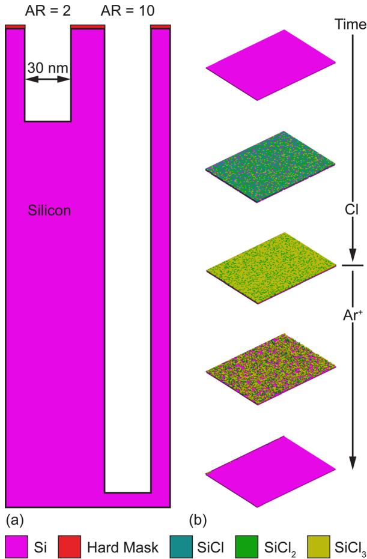  
FIG. 1. (Color online) Schematic of the ideal ALE process. (a) Schematic of the initial trench geometry used for ideal ALE simulations. (b) View of the etch front at multiple times, with different colors representing different materials. Time increases from top to bottom, but not with equal steps between images.

The ideal ALE etching behavior is shown more quantitatively in Fig. 2. The etch depth as a function of time for the  $\mathrm{AR} = 2$  feature shows exactly one ML of material being removed in each ALE cycle in Fig. 2(a), from the second cycle after starting the etch, to the fifth cycle. The roughness increases at the beginning of each ion bombardment step as the passivated layer is partially and statistically eroded. The roughness returns to zero as the smooth Si under- layer is exposed. This smooth underlayer of silicon cannot be physical sputtered by the low energy  $\mathrm{Ar}^+$ , resulting in the process being self- limiting. The surface coverages of  $\mathrm{SiCl}_x$  plotted as a function of time for one ALE cycle in Fig. 2(b), indicate that there is a short  $(\approx 50\mathrm{ms})$  transient period at the beginning of the Cl passivation step where  $\mathrm{SiCl}_x x< 3$  species dominate. After the initial transient the surface quickly establishes a steady state coverage of  $1\%$  SiCl,  $21\%$ $\mathrm{SiCl}_2$  and  $78\%$ $\mathrm{SiCl}_3$  making an average chlorination per surface site,  $\langle \mathrm{Cl}\rangle$  of 2.77. The predicted time to saturation for both the chlorination and ion bombardment phases are similar to those observed by Ranjan et al.,20 as well as Goodyear and Cooke.34

The same etching conditions were used on the  $\mathrm{AR} = 10$  feature as for the  $\mathrm{AR} = 2$  feature. The etch results also produce an ideal ALE as expected, with an identical etch sequence and roughness values as for the  $\mathrm{AR} = 2$  case. This result implies that the ideally self- limited nature of the reactions allow for the process to decouple etching from the transport of neutral species, thereby negating ARDE over this range of aspect ratio. The only significant difference between the ideal ALE of features having  $\mathrm{AR} = 2$  and  $\mathrm{AR} = 10$  is the time required to achieve the steady state value of  $\langle \mathrm{Cl}\rangle$  as shown in Fig. 3. A longer time is required to fully passivate the  $\mathrm{AR} = 10$  feature compared to  $\mathrm{AR} = 2$ . As the AR increases, the neutral conductance through the feature decreases, and a larger portion of the incoming neutral flux is reflected back into the plasma by collisions with the sidewalls before the flux can passivate the etch front at the bottom of the feature. The lower conductance of the  $\mathrm{AR} = 10$  feature requires a larger fluence of Cl radicals, and therefore a longer passivation time, to achieve the same  $\langle \mathrm{Cl}\rangle$  as the  $\mathrm{AR} = 2$  feature. Since the passivation step is perfectly self- limiting, the passivation time used here is chosen to be long enough for both the  $\mathrm{AR} = 2$  and  $\mathrm{AR} = 10$  features to reach a steady state surface passivation with there being no ill effects for the  $\mathrm{AR} = 2$  feature.

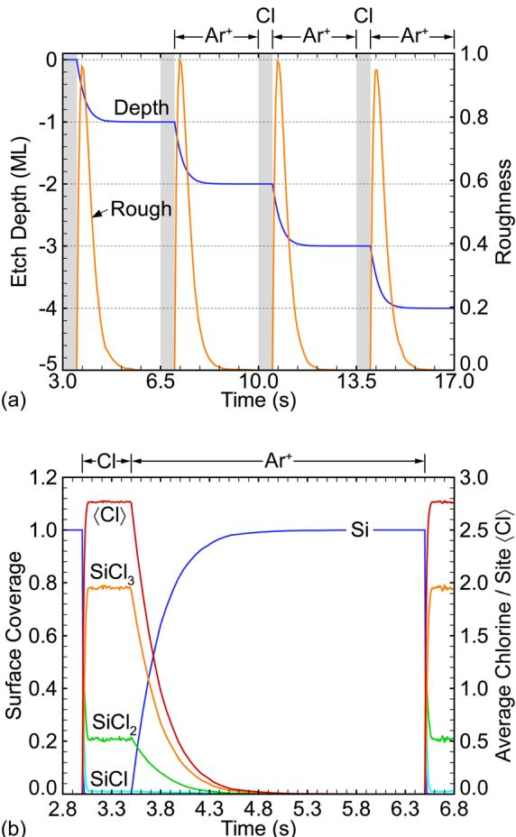  
FIG. 2. (Color online) Etch front characteristics during ideal ALE etching. (a) Etch depth and surface roughness as a function of time for the second through fifth ALE pulses. The different subcycles  $\mathrm{Cl} =$  passivation,  $\mathrm{Ar}^+$ $=$  ion bombardment) are shown at the top for reference, with passivation phases being highlighted by gray bands in the figure. Four pulse periods are shown in total. (b) Surface coverage of Si,  $\mathrm{SiCl}$ $\mathrm{SiCl}_2$ $\mathrm{SiCl}_3$  and average chlorine per site at the etch front as a function of time for the second pulse.

For ion fluxes that have highly anisotropic angular distributions, such as those used here, there should be little

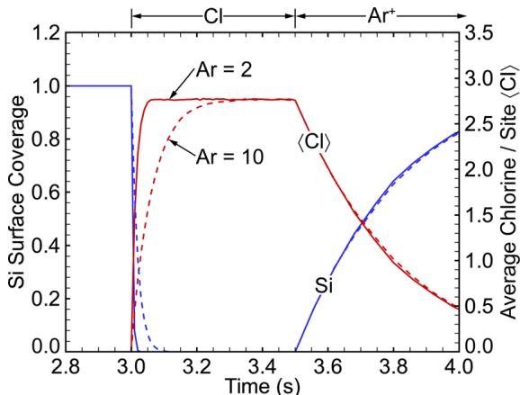  
FIG. 3. (Color online) Surface coverage of Si and average chlorine per site at the etch front for ideal ALE as a function of time for the second ALE pulse for  $\mathrm{AR} = 2$  and 10 trenches.

dependence of Cl surface coverage on AR during the ion bombardment step. If the ions had a larger angular spread there would be a weak dependence on AR due the loss of ions striking the sidewalls at larger AR (ion shadowing). A longer etch time would be required to remove the single layer passivation, as the view- angle of any given point on the etch front would subtend less of the incoming flux. However, the final etch surface would be independent of AR, provided the ion bombardment time was long enough. However, if the angular distribution is broad enough to desorb Cl atoms from the side walls, then additional etching at the bottom of the feature could occur by recycling the Cl atoms into passivation of the etch front.

With fluxes and a reaction mechanism that produce self- limiting passivation and etching, perfect ALE can be achieved independent of AR. Due to the ideally self- limited nature of the ALE reactions described here, ideal ALE behavior can always be achieved by using sufficiently long pulse times.

# IV. ALE WITH NONIDEAL REACTANT FLUXES A. Nonideal radical or ion fluxes

In this section, small deviations from the fluxes that produce ideal ALE will be investigated. In this regard, the ratios of ion to neutral radical fluxes  $(\Gamma_{i} / \Gamma_{n})$  during the passivation step, and neutral Cl radical to ion fluxes  $(\Gamma_{n} / \Gamma_{i})$  in the ion bombardment step of the ALE cycle were varied. Having a nonzero value of  $\Gamma_{i} / \Gamma_{n}$  during the passivation step introduces ions while the surface is being chlorinated or is fully chlorinated, enabling the possibility of continuous etching, which is detrimental to ALE. Similarly, having a neutral flux during the ion bombardment phase (by having a nonzero  $\Gamma_{n} / \Gamma_{i}$ ) also enables the possibility of continuous etching by allowing the surface to rechlorinate while under ion bombardment. Both of these sources of continuous etching proceed by the chemical sputtering of  $\mathrm{SiCl}_x$  species, making them dependent on ion/neutral synergy. A third nonideal aspect investigated is having ion fluxes with energies greater than the physical sputtering threshold for Si.

Introducing a small flux of ions into the passivation phase demonstrates the sensitivity of the ALE mechanism to this nonideality. The outcomes of having nonzero  $\Gamma_{i} / \Gamma_{n}$ ,  $10^{- 4}$  to 0.02, are shown in Fig. 4 where EPC,  $S_{y}$ , and the proportion of etching occurring during passivation and ion bombardment steps are shown for aspect ratios of  $\mathrm{AR} = 2$  and 10. The pulse times used were the same as the ideal case,  $0.5\mathrm{s}$  for the passivation phase and  $3.0\mathrm{s}$  for the ion bombardment step. The exact amount of nonideal etching reactions which take place will depend directly on the passivation phase time, as will be discussed in more detail later. For these pulse times, nearly ideal behavior for both low and high AR is retained for  $\Gamma_{i} / \Gamma_{n} = 10^{- 4}$ . However, etching with  $\Gamma_{i} / \Gamma_{n}$  as low as  $10^{- 3}$  shows significant nonideality. For  $\mathrm{AR} = 2$ , the EPC increases to  $1.1~\mathrm{ML}$  while  $S_{y}$  decreases to  $96\%$ . With  $\Gamma_{i} / \Gamma_{n} = 0.01$  and 0.02, values that would be typical if an ICP was used to generate the Cl flux, the results indicate far from ideal behavior.  $S_{y}$  decreases to  $76\%$  for  $\Gamma_{i} / \Gamma_{n} = 0.01$  and to  $63\%$  for  $\Gamma_{i} / \Gamma_{n} = 0.02$ . These results imply that for  $\Gamma_{i} / \Gamma_{n} = 0.02$ , over one third of the etching occurs during the passivation phase through continuous etch processes.

The results shown in Fig. 4 also indicate an unexpected trend—not all of the etching in excess of  $1\mathrm{ML}$  occurs during the passivation phase. For  $\Gamma_{i} / \Gamma_{n}\geq 10^{- 3}$ , etching during the ion bombardment phase results in removal of more than  $1\mathrm{ML}$ . The conditions of the ion bombardment phase are the same as for the ideal case, so in principle the ion- bombardment phase is intrinsically self- limited. The extra etching producing  $>1\mathrm{ML}$  per cycle results from roughness produced by the nonideal passivation phase. Since this etching mechanism is self- limited, it cannot lower  $S_{y}$  during the ion bombardment phase. In fact, extending the ion bombardment phase will not introduce more etching per cycle. The excess material ( $>1\mathrm{ML}$ ) removed during the ion bombardment phase is only a function of the surface roughness introduced during the passivation phase. More than

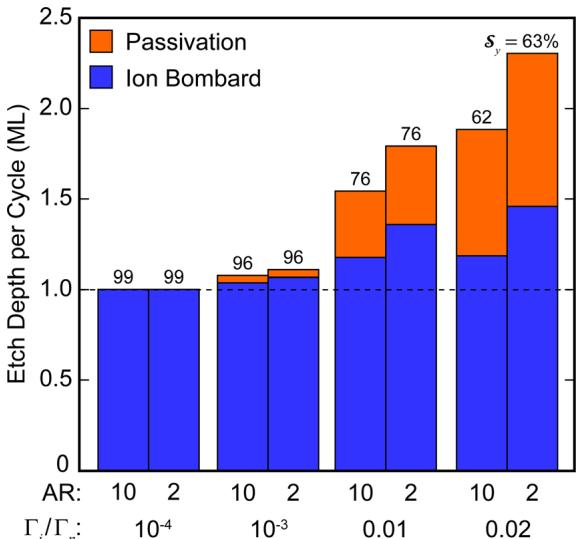  
FIG. 4. (Color online) Etch depth per cycle in the passivation and ion bombardment phase for values of  $\Gamma_{i} / \Gamma_{n} = 0.02$ , 0.01,  $10^{-3}$ , and  $10^{-4}$  in the passivation step, for both  $\mathrm{AR} = 2$  and 10 trenches. The dotted line represents ideal ALE, with an etch depth per cycle of  $1\mathrm{ML}$ .

1 ML of material is removed because roughness enables more Si atoms to be exposed to the plasma and so be chlorinated. This correlation between surface roughness and increased material removed per cycle does not necessarily introduce nonideality since the self- limited nature of the etch process is retained. However, this coupling of surface roughness and  $S_{y}$  could jeopardize etch uniformity and aspect ratio independence if the surface roughness depends on etch time or aspect ratio.

A motivation for implementing ALE processing is to reduce or eliminate the propensity for ARDE that occurs in continuous processing due to in- feature transport phenomena. The etch characteristics shown in Fig. 4 indicate that for  $\Gamma_{i} / \Gamma_{n} > 0$  the EPC is different for the  $\mathrm{AR} = 2$  and  $\mathrm{AR} = 10$  features. Ion fluxes during the passivation phase reintroduce an ARDE which was absent in the ideal case. ALE synergy,  $S_{y}$ , does not have the same dependence on AR, being nearly constant for both ARs over the entire range of  $\Gamma_{i} / \Gamma_{n}$  studied. Etching the  $\mathrm{AR} = 10$  feature resulted in a lower EPC than the  $\mathrm{AR} = 2$  feature in spite of having the same  $S_{y}$ . These results indicate that the amount of etching during the passivation phase is less for  $\mathrm{AR} = 10$  than for  $\mathrm{AR} = 2$  in spite of having the same ion fluence. The larger AR, with its lower conductance of Cl radicals from the plasma, results in a lower rate of repassivation of etched sites at the bottom of the feature. This lower rate of repassivation then slows the rate of nonideal etching. Any conductance dependent process will have a strong sensitivity on aspect ratio. The fact that  $S_{y}$  remains nearly constant over this range of AR could be coincidental. However, it may also imply that there is a correlation between the amount of material removed by the nonideal etching during the passivation phase and the increase in the self- limited etching during the ion bombardment phase. This coupling between the etching mechanisms of the passivation and ion bombardment phases occurs due to increase in surface roughness due to the nonideal etching.

The just- discussed correlation emphasizes the importance of surface roughness in producing ideal- ALE. Smooth surfaces are important not only because smooth features are usually preferred to rough surfaces, but also due to the coupling between surface roughness and material removed per cycle. The surface roughness as a function of time is shown in Fig. 5(a) for  $\Gamma_{i} / \Gamma_{n} = 10^{- 4}$ ,  $10^{- 3}$  and 0.01. The case having  $\Gamma_{i} / \Gamma_{n} = 10^{- 4}$  during the passivation phase produces  $S_{y} \approx 100\%$ , but still suffers from a steadily increasing cycle averaged roughness over the pulses shown. This roughness will eventually saturate at a value of 0.9, significantly higher than the ideal case despite the nearly ideal  $S_{y}$ . The cycle averaged steady state roughness is 1.8, 1.6, 1.4, and 0.9 for  $\Gamma_{i} / \Gamma_{n} = 0.02$ , 0.01,  $10^{- 3}$ , and  $10^{- 4}$ . There is also a characteristic time scale before the system reaches a steady state roughness. Larger  $\Gamma_{i} / \Gamma_{n}$  produces more roughness but reaches its quasisteady state value sooner. The details of the roughening depend on etch time and etch depth. However, the roughening is similar when compared on the basis of the fluence of ions during the passivation phase. This similarity suggests that each ion impinging on the etch front during the passivation phase is responsible for some stochastic roughening of the surface. This trend was also recently observed experimentally for very low ion to neutral flux ratios generated in pulsed  $\mathrm{Cl}_{2}$  plasmas. An ion fluence of  $\approx 4 \times 10^{15}\mathrm{cm}^{- 2}$  is required to reach the steady state roughness, after which no further dependence on fluence is observed. These factors indicate that there is a competition between a roughening process, produced by stochastic ion impacts during the passivation phase, and a smoothing process during the otherwise ideal ALE cycle.

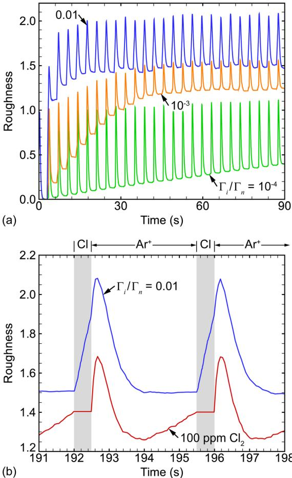  
Fig. 5. (Color online) Surface roughness as a function of time. (a) First 25 pulses for  $\Gamma_{i} / \Gamma_{n} = 0.01$ ,  $10^{-3}$ , and  $10^{-4}$  in the passivation step, showing the transient roughening at early etch times. (b) Subcycle roughening behavior at steady-state (55th pulse) for  $\Gamma_{i} / \Gamma_{n} = 0.01$  in the passivation phase and  $100\mathrm{ppmCl}_{2}$  in the ion bombardment phase. ALE subcycles are listed at the top, with the passivation phase highlighted with gray in the figure.

The surfaces at the bottom of the trench are shown in Fig. 6 for  $\Gamma_{i} / \Gamma_{n} = 0.01$ ,  $10^{- 3}$ , and  $10^{- 4}$  after 25 ALE pulses (87.5 s) for the  $\mathrm{AR} = 2$  feature. The overall roughness increases as the ion to neutral flux ratio increases. The surface for  $\Gamma_{i} / \Gamma_{n} = 10^{- 4}$  has a scattering of small divots caused by individual ion strikes and larger divots where several ion strikes stochastically occurred in close proximity during the same passivation step. The surface for  $\Gamma_{i} / \Gamma_{n} = 10^{- 3}$  has a similar pattern of larger divots, but with significantly more uniform roughening as well. The surface for  $\Gamma_{i} / \Gamma_{n} = 0.01$  has few large divots with the surface being dominated by random roughness; however, the divots which persist are larger and deeper.

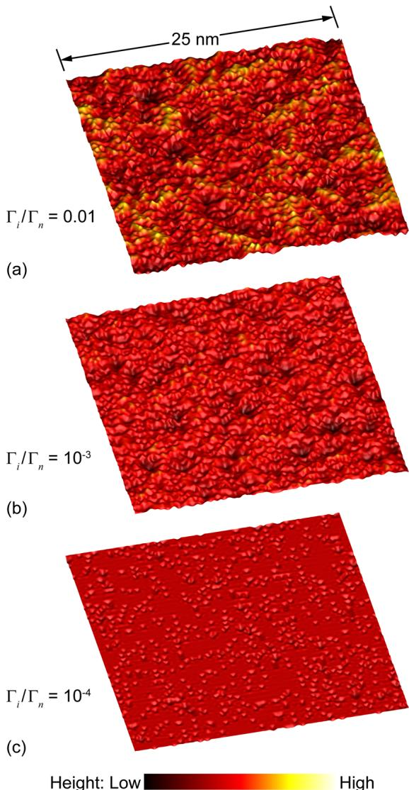  
FIG. 6. (Color online) Surface morphology of the trench bottom for  $\Gamma_{i} / \Gamma_{n} = (a)0.01$  b  $10^{-3}$  and (c)  $10^{-4}$  in the passivation step after 25 pulses (87.5 s etch time). The color bar indicates the profile height, with dark representing deeper etching and light representing higher features.

In addition to nonidealities caused by ions during the passivation phase, nonidealities can also occur by chlorine fluxes onto the wafer during the ion bombardment phase, a condition that can also result in continuous etching. While long purge times can be used to eliminate most of the gas phase Cl remaining in the chamber from the passivation phase, etch products released from the wafer during the ion bombardment phase are themselves chlorine containing. These etch products can be dissociated by electron impact in the plasma, or they can deposit on the chamber walls which can then act as a source of Cl radicals under ion bombardment. Cl may also be adsorbed onto any surface in contact with the plasma during the passivation phase, and desorb during the etching phase. While the actual source of Cl radicals during the ion bombardment phase is likely not  $\mathrm{Cl}_2$  gas in the feedstock gases, it is convenient to quantify the level of Cl contamination by parts- per- million (ppm) of  $\mathrm{Cl}_2$  in the gas phase. In this case, the HPEM was used to calculate the

Cl flux to the surface of the wafer when the feedstock Ar gas contained 1, 10, and  $100\mathrm{ppm}$  of  $\mathrm{Cl}_2$  . These levels of contamination resulted in Cl fluxes of  $2.3\times 10^{13}$ $1.1\times 10^{14}$  , and  $7.9\times 10^{14}\mathrm{cm}^{- 2}\mathrm{s}^{- 1}$  to the wafer. The argon ion flux was kept constant at  $2.3\times 10^{16}\mathrm{cm}^{- 2}\mathrm{s}^{- 1}$  . The simulation of profiles was then performed with these fluxes during the ion bombardment phase using the idealized etch mechanism.

EPC and  $S_{y}$  for  $\mathrm{AR} = 2$  and 10 with these small levels of  $\mathrm{Cl}_2$  contamination are shown in Fig. 7. These results indicate that increasing concentrations of  $\mathrm{Cl}_2$  result in increased EPC and decreased  $S_{y}$  due to the continuous etching enabled by even these small Cl fluxes. Only  $1\mathrm{ppm}$  of  $\mathrm{Cl}_2$  in the reactor can generate enough Cl flux to the wafer to decrease  $S_{y}$  from  $100\%$  in the ideal case to  $98\%$  for the  $\mathrm{AR} = 2$  feature. For  $10\mathrm{ppm}$ $\mathrm{Cl}_2$ $S_{y}$  decreases to  $94\%$  and with  $100\mathrm{ppm}$ $\mathrm{Cl}_2$  ,there is a further reduction of  $S_{y}$  to  $71\%$  . In order to evaluate  $S_{y}$  in these cases, the Cl labeling technique described in Sec. II was used to determine the ratio of etch products which were passivated in the ion bombardment phase to those passivated during the passivation phase.

Since the chlorine flux transports through the feature by molecular flow, the high aspect ratio feature is less sensitive to increasing Cl fluxes due to its lower neutral conductance. In the  $\mathrm{AR} = 10$  feature, the reduction of  $S_{y}$  is smaller than statistical errors  $(\approx 100\%)$  with  $1\mathrm{ppm}$ $\mathrm{Cl}_2$  decreasing to  $99\%$  and  $92\%$  for 10 and  $100\mathrm{ppm}$ $\mathrm{Cl}_2$  .There is a strong aspect ratio dependence in both the etch rate and in  $S_{y}$  These trends contrast with adding ions to the passivation phase, where EPC depended on AR but  $S_{y}$  did not. With the introduction of radicals into the ion bombardment phase, the etching due to the self- limited chlorination during the passivation phase increases slightly with  $\mathrm{Cl}_2$  concentration again, due to surface roughening. However, this increase is not a function of AR. The larger dependence on AR of continuous etching by radicals in the ion bombardment is due to neutral transport through the feature. This process is particularly

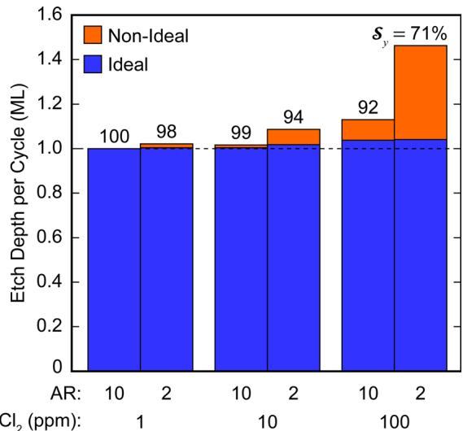  
FIG. 7. (Color online) Etch depth per cycle due to ideal (reactions which occur through ALE synergy) and nonideal (continuous) etching for cases with 1, 10, and  $100\mathrm{ppm}$ $\mathrm{Cl}_2$  in the ion bombardment step, for both  $\mathrm{AR} = 2$  and 10 trenches. The dotted line represents ideal ALE, with an etch depth per cycle of  $1\mathrm{ML}$

sensitive to AR due to the dependence of conductance on AR. As the AR increases and the neutral conductance decreases, a significant fraction of the nonideal flux of radicals during the ion bombardment phase will be reflected back into the plasma by the feature without ever having interacted with the etch front.

Having a passivating radical flux during the ion bombardment phase also results in a roughening of the surface compared to the ideal case. The average roughening again increases over several pulses at the beginning of the etch before reaching a steady state. The cycle averaged steady state roughness increases with larger concentrations  $\mathrm{Cl}_2$  reaching 1.1, 1.2, and 1.4 for 1, 10, and  $100\mathrm{ppm}$  of  $\mathrm{Cl}_2$ . The subcycle resolved pattern of roughness, shown in Fig. 5(b) for  $100\mathrm{ppm}$  of  $\mathrm{Cl}_2$ , indicates that the majority of the roughening occurs during the latter part of the ion bombardment phase when the continuous etching occurs. In the prior case of adding an ion flux during the passivation step, roughening occurred dominantly during the passivation step while the surface was smoothed during the ion bombardment step; enabling the system to achieve a steady state. With a Cl flux during the ion bombardment step, smoothing and roughening both occur during the ion bombardment step. The two mechanisms compete to enable the system to reach a steady state roughness after an initial transient.

The surface morphology generated by having a Cl flux during the ion bombardment phase differs slightly from that when having an ion flux during the passivation phase. The height of the etched surface at the bottom of the  $\mathrm{AR} = 2$  trench after 25 ALE pulses (32 s) is shown in Fig. 8 for the  $100\mathrm{ppm}\mathrm{Cl}_2$  case. The surface has the characteristic divots, but the surface is also slightly concave due to a higher etch rate in the center of the feature. This higher etch rate is due to a higher flux of Cl atoms incident onto the center of the feature. The concavity becomes more pronounced with longer etch times (more pulses).

Another nonideality is having ions with energies greater than  $\epsilon_{rh}$  for physical sputtering during the ion bombardment phase. To investigate this nonideality, the IEADs consisted of a continuous distribution from  $25\mathrm{eV}$  to the maximum ion energy  $\epsilon_{m}$ , where  $\epsilon_{m}$  was 50, 55, 60, and  $65\mathrm{eV}$ . The resulting etch characteristics are shown in Fig. 9. With  $\epsilon_{m} = 50\mathrm{eV}$ , there is little difference compared to the ideal case. Although the IEAD is not monoenergetic, it also does not include any ions with energies greater than  $\epsilon_{th} = 50\mathrm{eV}$ . Other than the increased rate of chemical sputtering of  $\mathrm{SiCl}_x$  species, the etch should be ideal. With  $\epsilon_{m} > 50\mathrm{eV}$ , the distribution contains ions with energies high enough to sputter bare silicon, introducing a continuous etching mechanism due to physical sputtering. Even having a small fraction of the ions with energies greater than the Si sputtering regime produce significant nonideality with these pulse times, with  $\mathcal{S}_y$  decreasing to  $71\%$  for  $\epsilon_{m} = 65\mathrm{eV}$  in the  $\mathrm{AR} = 10$  feature. However, this nonideality does not result in significant ARDE. The physical sputtering of bare silicon is a purely ion driven process, while the other two nonidealities discussed are based on a chemically enhanced sputtering mechanism. Chemical sputtering inherently requires a neutral/ion synergy which relies on conductance through the feature and will therefore be susceptible to ARDE. The extra etching is due to physical sputtering by anisotropic ion fluxes and not due to a synergistic process reliant on conductance limited Cl fluxes. If the ion angular distribution is narrow enough, the rate of physical sputtering will be independent of AR. The pattern of roughness resulting from physical sputtering of silicon is similar in character to having ions in the passivation phase.

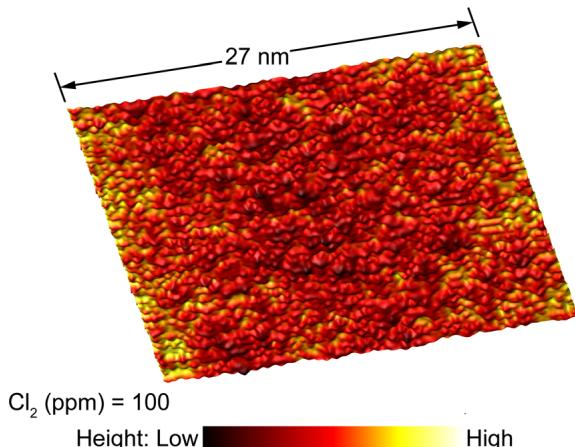  
FIG. 8. (Color online) Surface morphology of the trench bottom with  $100\mathrm{ppm}\mathrm{Cl}_2$  in the ion bombardment step after 25 pulses (32 s etch time). The color bar indicates the profile height, with dark representing deeper etching and light representing higher features.

# B. Controlling EPC and ALE synergy with pulse times

Introducing a single nonideality into the ALE process provides insights into the requirements for designing an optimized process. In the practical implementation of ALE, it is possible that all of the nonidealities discussed here may occur at the same time, and so their effects must be simultaneously mitigated. If the fluxes and ion energies have been

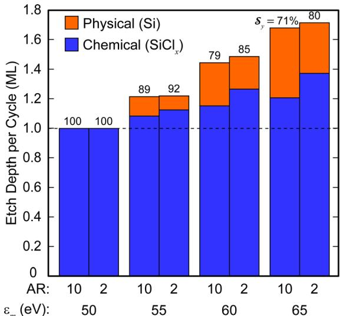  
FIG. 9. (Color online) Etch depth per cycle for physical and chemical sputtering processes for values of  $\epsilon_{m} = 50$ , 55, 60 and 65 in the ion bombard step, for both  $\mathrm{AR} = 2$  and 10 trenches. The dotted line represents ideal ALE, with an etch depth per cycle of 1 ML.

tailored to be as ideal as possible for a given plasma reactor, the last process parameter that can be used to tune the ideality of the ALE process is the pulse times of the two ALE process steps passivation time  $(T_{P})$  and ion bombardment time  $(T_{I})$  . Tuning the pulse times also incurs some trade- offs. For instance, if ions fluxes are significant during the passivation step and producing continuous etching,  $T_{P}$  can be decreased to a point where the entire surface is chlorinated, but perhaps not to the fully saturated state of  $\mathrm{SiCl}_3$  .Such a condition will enable the ALE process to proceed, as all  $\mathrm{SiCl}_x$  species have a reduced threshold compared to bare silicon, but will require longer  $T_{I}$  to be removed. If there are any nonidealities in the ion bombardment phase, they will be exacerbated by the longer  $T_{I}$  required to reduce the continuous etching during the passivation phase.

In practice, if the radical Cl and ion bombardment fluxes onto the wafer are being directly produced by a plasma in contact with the wafer, it is difficult to obtain perfectly selflimited ALE reactions. Using a plasma in the vicinity of the wafer to generate a high radical flux during the passivation phase will inevitably also result in some ion flux. With the expected electron temperatures in typical inductively coupled plasmas of  $2 - 5\mathrm{eV}$  , the sheath produced by the floating potential may have a large enough potential drop to produce ions above  $\epsilon_{th}$  .During the ion bombardment phase, the plasma must be sustained in pure Ar to avoid there being chlorine radical and ion fluxes to the wafer. Reducing the chlorine concentration in the reactor to zero is difficult due to the chlorine containing etch products which are released from the wafer during this step and Cl containing passivation on the sidewalls.

In this section, we discuss the consequences and possible remedies of using fully nonideal reactant fluxes and Ieads during ALE. These nonideal fluxes were obtained from reactor scale modeling of an ICP. The reactor, shown in Fig. 10, has a three- turn flat antenna delivering  $300\mathrm{W}$  at  $10\mathrm{MHz}$  to the plasma. The coil is located above a quartz window  $10\mathrm{cm}$  from the wafer, in a reactor  $22.5\mathrm{cm}$  in diameter. The resulting plasma densities are also shown in Fig. 10 for both the ion bombardment and passivation phases. For the passivation phase a gas mixture of  $\mathrm{Ar / Cl}_2 = 70 / 30$  at 200 sccm was used with a regulation system maintaining the chamber pressure at  $20~\mathrm{mTorr}$  . No bias was applied to the wafer during the passivation phase, however a plasma potential of  $25\mathrm{V}$  provided acceleration to ions reaching the wafer surface. The resulting fluxes to the wafer are  $7.0\times 10^{17}$ $1.1\times 10^{16}$ $1.6\times 10^{15}$  , and  $4.9\times 10^{14}\mathrm{cm}^{- 2}\mathrm{s}^{- 1}$  , for Cl,  $\mathrm{Cl}_2^+$ $\mathrm{Cl}^+$  and  $\mathrm{Ar}^+$  , with ion energies peaked around  $24\mathrm{V}$  as shown in Fig. 11(a). During the ion bombardment phase Ar gas with  $100\mathrm{ppm}\mathrm{Cl}_2$  was used to simulate chlorine contamination of the process due to incomplete purging, etch products or desorption from the walls. The total gas flow was 200 sccm at a pressure of 20 mTorr. A bias of  $30\mathrm{V}$  at  $10\mathrm{MHz}$  was applied to the wafer, resulting in a DC bias of  $- 8.4\mathrm{V}$  and a plasma potential oscillating between  $35\mathrm{V}$  and  $49\mathrm{V}$  .The resulting fluxes to the wafer are  $7.8\times 10^{14}$ $3.9\times 10^{12}$ $9.2\times 10^{13}$  , and  $2.3\times 10^{16}\mathrm{cm}^{- 2}\mathrm{s}^{- 1}$  , for Cl,  $\mathrm{Cl}_2^+$ $\mathrm{Cl}^+$  and  $\mathrm{Ar}^+$  , with ion energies distributed from  $33\mathrm{eV}$  to  $60\mathrm{eV}$  , as shown in Fig. 11(b).

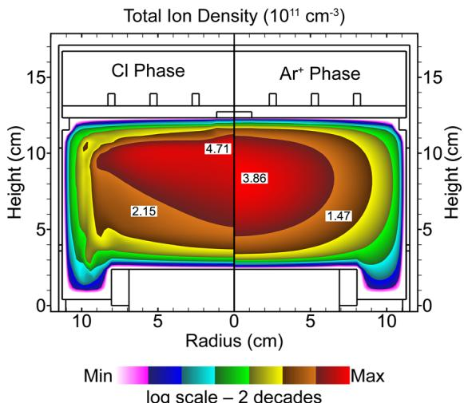  
FIG. 10. (Color online) Reactor geometry and total ion densities in the (left) Cl passivation phase and (right)  $\mathrm{Ar}^+$  ion bombardment phase. A log scale showing two decades is used.

Optimizing the ALE process for these nonideal conditions involves selecting step times which both remove a consistent amount of material over the required range of aspect ratios, and which minimize the material removed by continuous

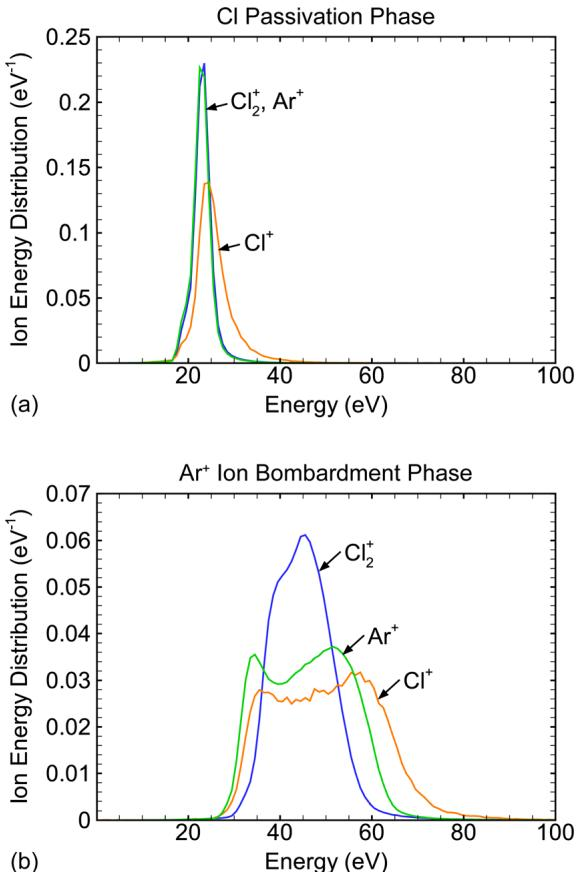  
FIG. 11. (Color online) Ion energy distribution for  $\mathrm{Cl}^+$ $\mathrm{Cl}_2^+$  ,and  $\mathrm{Ar}^+$  in the (a) passivation and (b) ion bombardment phases. Each ion energy distribution is a probability density function for that ion, and is normalized such that integrating the function in energy results in a value of 1 regardless of the total flux of that ion.

etching processes. To investigate the pulse time parameter space, simulations were performed for  $T_{P}$  from 5 to  $105\mathrm{ms}$  and  $T_{I}$  from 0.1 to  $1.4\mathrm{s}$  .The results indicate that for any given  $T_{P}$  there is some  $T_{I}$  which will remove  $1\mathrm{ML}$  of material per cycle, or  $\mathrm{EPC} = 1$  ML.

These trends are shown in Fig. 12, where the solid lines are for conditions that produce  $\mathrm{EPC} = 1$  ML, and the shaded areas indicate the range of  $0.9 < \mathrm{EPC} < 1.1$  ML. Results are shown for aspect ratios of 2, 4 and 6. There are regions where EPC is near  $1\mathrm{ML}$  and which are nearly independent of  $T_{I}$  (nearly vertical in Fig. 12), depending dominantly on  $T_{P}$ . These regions might be described as radical- starved for a continuous etch. Other regions where EPC is near  $1\mathrm{ML}$  are almost independent of  $T_{P}$  (nearly horizontal in Fig. 12), depending dominantly on  $T_{I}$ . These regions might be described as ion- starved for a continuous etch. The width of the window for which  $0.9 < \mathrm{EPC} < 1.1$  ML is largest at the transition between these two limiting regimes, indicating more tolerance to process variation. The largest overlap of process conditions for different AR that produce  $\mathrm{EPC} \approx 1$  is also in this transition region.

These trends imply that operating in this region will have the largest window for etching features that have different aspect ratios; however, there is a limit to this process window. There is little overlap between the shaded ALE windows for  $\mathrm{AR} = 2$  and  $\mathrm{AR} = 6$  case. This disparity indicates that the nonidealities for these conditions are severe enough to preclude obtaining a constant etch depth per cycle over this range of AR when using a single set of pulse times. To maintain a constant etch depth per cycle over this range (or even wider ranges) of AR during a single etch,  $T_{P}$  and  $T_{I}$  would need to be adjusted as the AR of the feature increases. While a constant EPC over a wide range of AR is a requirement for many applications, maintaining  $\mathrm{EPC} = 1$  ML does not necessarily imply ideal ALE.

ALE synergy,  $\mathcal{S}_y$  also depends on ALE step times. For example,  $\mathcal{S}_y$  is shown in Fig. 13(a) for  $\mathrm{AR} = 4$  as a function of  $T_{I}$  for three values of  $T_{P}$  (44, 66, and  $88\mathrm{ms}$ ). For short  $T_{I}$

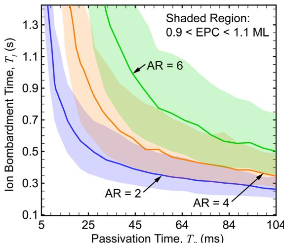  
FIG. 12. (Color online) Trend of etch depth per cycle (EPC) as a function of ion bombardment time  $(T_{I})$  and passivation time  $(T_{P})$ . The solid line represents an EPC of 1, and the shaded region is the window from  $0.9 < \mathrm{EPC} < 1.1$ .

  
FIG. 13. (Color online) Trends in the ALE synergy  $(S_{y})$  as a function of pulse times for an AR of 4. (a)  $S_{y}$  as a function of ion bombardment time  $(T_{I})$  for three values of passivation time  $(T_{P})$ . (b)  $S_{y}$  as a function of  $T_{I}$  and  $T_{P}$ . The solid black line represents  $\mathrm{EPC} = 1$  and the dotted lines bound the range  $0.9 < \mathrm{EPC} < 1.1$ .

$(< 0.15\mathrm{s})$  a large fraction of the passivated Si which covers the surface of the feature is not removed during the ion bombardment step. The continuous etching produced by ions in the passivation phase then makes a significant contribution to the total rate of etching, which then lowers  $\mathcal{S}_y$ . For long  $T_{I} (>1\mathrm{s})$ , the passivated Si covering the feature is completely removed and the now bare silicon is exposed to ion bombardment for an extended time. The continuous etching produced during the ion bombardment step by the presence of chlorine radicals and physical sputtering then accounts for a significant portion of the EPC, which then lowers  $\mathcal{S}_y$ . The  $T_{I}$  which results in the maximum  $\mathcal{S}_y$  minimizes these nonidealities and maximizes the etching occurring due to the synergy between the ion bombardment and passivation steps. Due to the continuous etching which may occur during each of the ALE steps, the conditions which produce the highest  $S_{y}$  do not necessarily result in an  $\mathrm{EPC} = 1$  ML. Rather, the pulse times which result in the maximum  $\mathcal{S}_y$  usually result in an  $\mathrm{EPC} < 1$  ML. A similar maximum occurs in  $\mathcal{S}_y$  as a function of  $T_{P}$  (for any given ion bombardment time) for similar reasons.

The relationships of ALE synergy and EPC to both  $T_{I}$  and  $T_{P}$  are shown in Fig. 13(b) for an  $\mathrm{AR} = 4$ . The contours are

values of  $S_{y}$  and the solid black line corresponds to an  $\mathrm{EPC} = 1\mathrm{ML}$  .The maximum value of  $S_{y}$ $(95\%)$  in this parameter space occurs with short pulse times  $(T_{I} = 0.11\mathrm{s}$ $T_{P} = 14\mathrm{ms})$  which results in an EPC on only  $0.3\mathrm{ML}$  If an  $\mathrm{EPC} = 1$  is required, the maximum value of  $S_{y}$  is obtained at  $T_{I} = 0.59\mathrm{s}$  and  $T_{P} = 43\mathrm{ms}$

In general, to minimize nonidealities during ALE, the optimized process should use the shortest pulse times which result in  $\approx 1\mathrm{ML}$  material removal per cycle for the largest AR feature being etched. These optimized process times will be given by the point closest to the origin on the solid line in Fig. 13(b). These conditions also correspond to the smallest contribution of continuous chemical sputtering, and will result in the smoothest surface and widest processing window in terms of AR.

Optimizing  $S_{y}$  reduces the influence of non- ideal reactions on the ALE process, but the resulting feature profiles can also depend on factors not captured by this metric. For instance, bowing of feature side- walls is caused by interactions with off- axis ions, and is therefore directly proportional to  $T_{I}$ . As an example, simulations were performed using nonideal ALE to etch features with ARs of 2 and 6, using  $T_{I} = 0.63$  and  $1.03\mathrm{s}$ , respectively. Passivation pulse times were also adjusted to produce an EPC of  $\approx 1.1\mathrm{ML}$ . These pulsing conditions result in a  $S_{y}$  of  $86\%$  for the AR 2 feature and  $90\%$  for  $\mathrm{AR} = 6$ . Despite its higher ALE synergy, the increase in feature width due to bowing after 100 ALE pulses was  $10\%$  for  $\mathrm{AR} = 6$ , significantly more than in the  $\mathrm{AR} = 2$  case (5% increase in width). Other than the differences in bowing the profiles were essentially the same, demonstrating that the ALE process is resistant to profile changes due to AR.

# V.GATE ETCH USING ALE

The investigation of the effects of non- self- limited reactions in the ALE process was performed for simple trench structures. To test whether these trends extend to more complicated structures, the etching of a finFET- like geometry was used as a case study. This test is demanding as it requires low damage and high selectivity to stop on a thin stopping layer, but also often has need for long over- etch times to clear the 3D corner at the base of the fins.

The geometry used for this case study consists of a periodic array of vertical crystalline silicon fins, each with a width of  $10\mathrm{nm}$  and height of  $42\mathrm{nm}$  set at a pitch of  $42\mathrm{nm}$  as shown in Fig. 14. The fins are covered with a etch stop layer  $\mathrm{SiO}_2$  in our model) with a thickness of about  $1\mathrm{nm}$  on the sides, with a thicker  $(10\mathrm{nm})$  blocking layer on the top to prevent damage to the fin. The fin structures are then covered with a thick, conformal poly- silicon layer. This poly- Si layer is masked perpendicular to the direction of the fins, to create the gate structure upon anisotropic etching. The model includes a recess in the poly layer, as would be produced by a well behaved main etch which was stopped just before exposing the tops of the fins. This structure was etched using both a low ion energy continuous etching process and using our optimized nonideal ALE process for comparison.

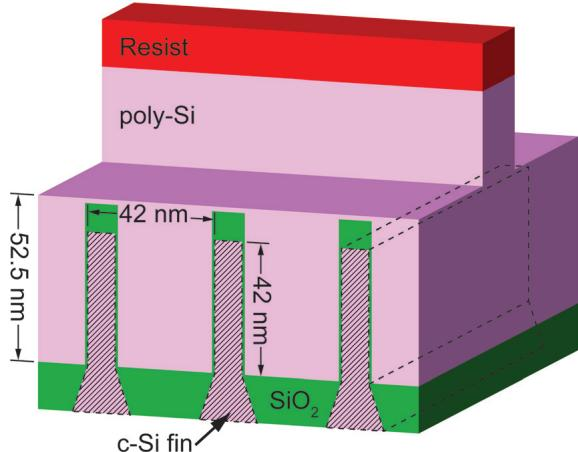  
FIG. 14. (Color online) Initial geometry used for the gate etch case study. The crystalline silicon (c-Si) fin travels back into the page, as indicated by the dotted lines. The resist masks the poly-silicon gate structure, which is pre-etched to a depth just above the top of the fins.

To compare the results from ALE with continuous etching, while still meeting the selectivity and low damage requirements of the gate etch, simulations were performed using the HPEM of a plasma with a feed- gas of  $\mathrm{Ar / Cl}_2 = 70 / 30$  and an RF bias of  $30\mathrm{V}$ . The resulting fluxes to the wafer were  $8.7\times 10^{17}$ ,  $9.1\times 10^{15}$ ,  $3.6\times 10^{15}$ , and  $4.5\times 10^{14}\mathrm{cm}^{- 2}\mathrm{s}^{- 1}$  for  $\mathrm{Cl}$ ,  $\mathrm{Cl}_2^+$ ,  $\mathrm{Cl}^+$ , and  $\mathrm{Ar}^+$ . The resulting ion energies are almost identical to those in Fig. 12(b) for the ALE ion bombardment phase, and should therefore produce comparably high selectivity and low damage for a given fluence.

The profiles resulting from using the continuous etch conditions are shown in Figs. 15(a)- 15(c) for over- etch of  $0\%$ ,  $25\%$ , and  $100\%$ . (Here, over- etch is defined as the additional etch time after first exposing the bottom  $\mathrm{SiO}_2$  surface divided by the time required to reach the bottom.) The profile in Fig. 15(a) is shown just before the etch- front touches the underlying  $\mathrm{SiO}_2$  layer. At this point, the profile has significantly tapered away from the trench sidewalls formed by the fins. The etch- front shows some microtrenching, or deeper etch features at the base of the vertical walls, produced by ions (or hot neutrals) having been specularly reflected from the tapered sidewalls. After a  $25\%$  over- etch, a large area of the  $\mathrm{SiO}_2$  has been exposed at the bottom of the feature. However, a significant amount of  $\mathrm{Si}$  remains in the corners and on the sides of the fins. Even after an over- etch of  $100\%$ , there is still silicon remaining in the corners which would require even longer etch times to remove.

Profiles produced using the ALE pulsing scheme are shown in Figs. 15(d)- 15(f) for over- etch of  $0\%$ ,  $25\%$  and  $100\%$ , with a passivation time of  $42\mathrm{ms}$  and an ion bombardment time of  $0.55\mathrm{s}$ . Choosing optimum pulse times is difficult for this test structure as there is no strict definition of aspect ratio in 3D features. If the purpose of this etch was to clear the poly- Si from between the fins with no masking, the etch feature would look like a trench with an AR slightly more than 1. For these conditions, one might benefit from shorter pulse times for optimal etching. The pulse times used in this demonstration would be optimum for feature with an

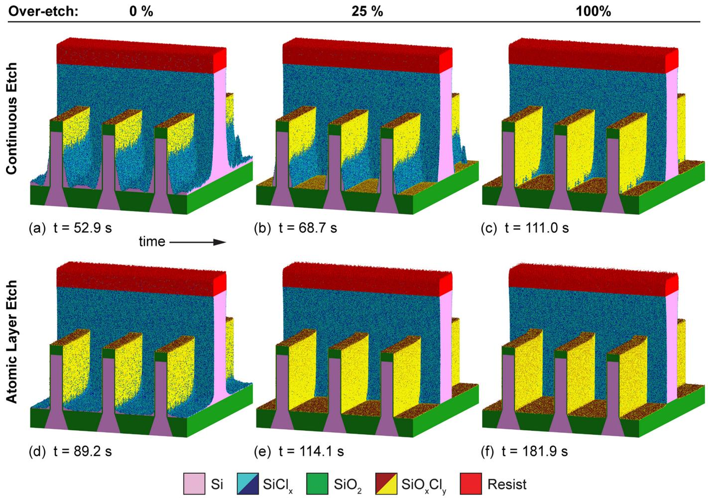  
FIG. 15. (Color online) Profiles resulting from etching the gate structure with a (a)–(c) continuous etching process, and (d)–(f) the optimized ALE process. Time increases from left to right. Frames are taken at equal over-etch (as a percentage of the time required to expose the bottom  $\mathrm{SiO}_2$ ), not at equal etch times. The etch times listed for the ALE process (d)–(f) are active (plasma on) times, and ignore any purge or dwell times necessary for a functional ALE process.

$\mathrm{AR} \approx 4$  to account for the higher effective aspect ratio in the 3D corners.

The profile of the feature etched by ALE just before exposing the  $\mathrm{SiO}_2$  is shown in Fig. 15(d). The etch front is slightly concave, likely due to the continuous etching enabled by the radicals in the ion bombardment phase. However, the concavity is less than that produced during continuous etching. There is little or no silicon left on the side of the fins whereas silicon did persist on the sidewalls in the continuous etch case. After  $25\%$  over- etch, the bottom  $\mathrm{SiO}_2$  surface has been almost completely cleared, with little residue in the corners. Continuing to  $100\%$  over- etch results in little change to the profile.

Comparing the results of etching the finFET gate structure using ALE with the continuous etch, there is a distinct advantage to using ALE despite the nonideal processing conditions. The reduction in over- etch from  $>100\%$  to  $\approx 25\%$  with similar ion energies, should reduce plasma damage. The etch times reported here for the ALE process are active process times, and do not include the time required to purge and refill gases between pulses. To clear the feature using ALE required  $\approx 200$  pulses. The purge times will depend on hardware considerations,34 but assuming each pulse requires $5\mathrm{s}$  of purge time the ALE process would require a total process time of  $\approx 15 - 20\mathrm{min}$  to clear the feature. This is a significant increase in total process time over the continuous etch  $(\approx 2\mathrm{min})$  .However, the active (plasma on) time to completely clear the feature is comparable between the ALE and continuous etching, and so the reduced over- etch time required by ALE potentially results in less damage. It is also possible that combining a continuous main etch until reaching the bottom of the feature followed by ALE steps to clear the feature could reduce the number of ALE pulses required, thereby reducing the total processing time without losing the over- etch benefits of ALE.21

# VI. CONCLUSION

As demands for plasma etch fidelity increase, atomic resolution is rapidly becoming a necessity, and atomic layer etching is one option to achieve that resolution. In our computational investigation of ALE, two main conclusions can be drawn regarding the use of ALE to meet this goal. First, even small deviations from perfectly self- limited reactions significantly compromise the ideality of the ALE process. For example, having as little as  $10\mathrm{ppm}\mathrm{Cl}_2$  residual gas in

the reactor during the ion bombardment phase produced nonidealities in the ALE. Introducing any source of continuous chemical etching into the ALE process leads to the onset of ARDE and roughening of the etch front. These trends have significant implications for both the design of specialized reactors, which intend to utilize ideal ALE for atomic level fidelity, and also for the use of ALE to control uniformity.

A second conclusion is that nonideal ALE processes, such as those that might occur in typical ICP reactors, may offer significant advantages over continuous etching. As a demonstration, a 3D gate etch using nonideal ALE conditions with optimized pulse times, was able to clear 3D corners more efficiently (less over- etch) than the equivalent continuous etch. This results in less plasma exposure which minimizes damage to the devices. These advantages come at the trade- off of having one more process parameter, pulse time, which must be carefully controlled, along with the longer processing times related to the ALE pulsing scheme. The gate etch does not necessarily require that the etch depth per cycle be the same for the entire etch depth, as other applications may. For applications in which EPC must be constant for a wide range of AR, pulse times may need to be adjusted as aspect ratios increase with etch time.

The conclusions here, while based on the ALE of silicon using  $\mathrm{Ar / Cl}_2$  plasmas, are expected to be applicable to other ALE systems as well. For instance, the ALE of  $\mathrm{SiO}_2$  which has been demonstrated experimentally,36,37 will have a different set of physical pathways that introduce continuous, non- self- limited processes. The results of our simulations of the ALE of silicon indicate that the presence of continuous etching mechanisms will affect surface roughening, and that any process which relies on ion/neutral synergy will introduce ARDE. Since the benefits of ALE directly depend on the self- limited nature of the surface reactions, and not the details of the reactions themselves, it is expected that the presence of continuous etching mechanisms in the ALE of  $\mathrm{SiO}_2$  will also introduce nonideality in a similar way.

# ACKNOWLEDGMENTS

This work was supported by Lam Research Corporation, the Department of Energy Office of Fusion Energy Science (DE- SC000319, DE- SC0011132), and the National Science Foundation (PHY- 1519117, CHE- 1124724).

$^1\mathrm{F}_{- }\mathrm{J}$  HouP.- J.SungF.- K.HsuehC.- T.WuY.- J.LeeY.LiS. Samukawa, and T.- H. Hou, IEEE Trans. Electron Devices 63, 3837 (2016).  $^2\mathrm{H}$  Mertens et al., 2016 IEEE Symposium on VLSI Technology, Honolulu, HI (2016), pp. 1- 2.  $^3\mathrm{K}$  J. Kuhn et al., 2012 IEEE International Electron Devices Meeting, San Francisco, CA (2012), pp. 8.1.1- 8.1.4.

$^4\mathrm{V}$  M. Donnelly and A. Kornblit, J. Vac. Sci. Technol., A 31, 50825 (2013).  $^5\mathrm{C}$  G. N. Lee, K. J. Kanarik, and R. A. Gottscho, J. Phys. D: Appl. Phys. 47, 273001 (2014).  $^6\mathrm{G}$  S. Oehrlein, D. Metzler, and C. Li, ECS J. Solid State Sci. Technol. 4, N5041 (2015).  $^7\mathrm{K}$  J. Kanarik, T. Lill, E. A. Hudson, S. Sriraman, S. Tan, J. Marks, V. Vahedi, and R. A. Gottscho, J. Vac. Sci. Technol., A 33, 20802 (2015).  $^8\mathrm{C}$  Carver, J. Plombon, P. Romero, S. Surit, T. Tronic, and R. Turkot, ECS J. Solid State Sci. Technol. 4, N5005 (2015).  $^{10}\mathrm{N}$  A. Kubota, D. J. Economou, and S. J. Pimpason, J. Appl. Phys. 83, 4055 (1998).  $^{10}\mathrm{S}$  U. Engelmann, R. L. Bruce, M. Nakamura, D. Metzler, S. G. Walton, and E. A. Joseph, ECS J. Solid State Sci. Technol. 4, N5054 (2015).  $^{11}\mathrm{R}$  A. Gottscho, C. W. Jurgensen, and D. J. Vitkavage, J. Vac. Sci. Technol., B 10, 2133 (1992).  $^{12}\mathrm{J}$  W. Coburn and H. F. Winters, Appl. Phys. Lett. 55, 2730 (1989).  $^{13}\mathrm{T}$  Matsuura, J. Murota, Y. Sawada, and T. Ohmi, Appl. Phys. Lett. 63, 2803 (1993).  $^{14}\mathrm{S}$  Tan, W. Yang, K. J. Kanarik, T. Lill, V. Vahedi, J. Marks, and R. A. Gottscho, ECS J. Solid State Sci. Technol. 4, N5010 (2015).  $^{15}\mathrm{J}$  P. Chang, J. Arnold, G. Zau, H.- S. Shin, and H. H. Sawin, J. Vac. Sci. Technol., A 15, 1853 (1997).  $^{16}\mathrm{H}$  Shin, W. Zhu, L. Xu, V. M. Donnelly, and D. J. Economou, Plasma Sources Sci. Technol. 20, 55001 (2011).  $^{17}\mathrm{M}$  D. Logue, H. Shin, W. Zhu, L. Xu, V. M. Donnelly, D. J. Economou, and M. J. Kushner, Plasma Sources Sci. Technol. 21, 65009 (2012).  $^{18}\mathrm{T}$  T. Gu, M. Okandan, O. O. Awadelkarim, J. F. Rembetski, P. Aum, and Y. D. Chan, IEEE Electron Device Lett. 15, 48 (1994).  $^{19}\mathrm{S}$  D. Athavale and D. J. Economou, J. Vac. Sci. Technol., B 14, 3702 (1996).  $^{20}\mathrm{A}$  Ranjan, M. Wang, S. D. Sherpa, V. Rastogi, A. Koshiishi, and P. L. G. Ventzek, J. Vac. Sci. Technol., A 34, 31304 (2016).  $^{21}\mathrm{A}$  Agarwal and M. J. Kushner, J. Vac. Sci. Technol., A 27, 37 (2009).  $^{22}\mathrm{M}$  J. Kushner, J. Phys. D: Appl. Phys. 42, 194013 (2009).  $^{23}\mathrm{Y}$  Zhang, M. J. Kushner, S. Sriraman, A. Marakhtanov, J. Holland, and A. Paterson, J. Vac. Sci. Technol., A 33, 31502 (2015).  $^{24}\mathrm{Y}$  Zhang, C. Huard, S. Sriraman, J. Belen, A. Paterson, and M. J. Kushner, J. Vac. Sci. Technol., A 35, 21303 (2017).  $^{25}\mathrm{C}$  M. Huard, Y. Zhang, S. Sriraman, A. Paterson, and M. J. Kushner, J. Vac. Sci. Technol., A 35, 05C301 (2017).  $^{26}\mathrm{E}$  B. Henschke and S. E. Derby, J. Appl. Phys. 34, 2458 (1963).  $^{27}\mathrm{J}$  P. Chang and H. H. Sawin, J. Vac. Sci. Technol., A 15, 610 (1997).  $^{28}\mathrm{G}$  P. Kota, J. W. Coburn, and D. B. Graves, J. Vac. Sci. Technol., A 16, 270 (1998).  $^{29}\mathrm{C}$  Petit- Etienne, M. Diarnon, P. Bodart, M. Fouchier, G. Cunge, E. Pargon, L. Vallier, O. Joubert, and S. Barna, J. Vac. Sci. Technol., B 31, 11201 (2013).  $^{30}\mathrm{S}$  D. Park, K.- S. Min, B.- Y. Yoon, D.- H. Lee, and G.- Y. Yeom, Jpn. J. Appl. Phys., Part 1 44, 389 (2005).  $^{31}\mathrm{C}$  C. Cheng, K. V. Guinn, V. M. Donnelly, and I. P. Herman, J. Vac. Sci. Technol., A 12, 2630 (1994).  $^{32}\mathrm{N}$  Layadi, V. M. Donnelly, and J. T. C. Lee, J. Appl. Phys. 81, 6738 (1997).  $^{33}\mathrm{K}$  J. Kanarik et al., J. Vac. Sci. Technol., A 35, 05C302 (2017).  $^{34}\mathrm{A}$  Goodyear and M. Cooke, J. Vac. Sci. Technol., A 35, 01A105 (2017).  $^{35}\mathrm{O}$  Mourey, C. Petit- Etienne, G. Cunge, M. Darnon, E. Despiau- Pujo, P. Brichon, E. Lattu- Romain, M. Pons, and O. Joubert, J. Vac. Sci. Technol., A 34, 41306 (2016).  $^{36}\mathrm{D}$  Metzler, R. L. Bruce, S. Engelmann, E. A. Joseph, and G. S. Oehrlein, J. Vac. Sci. Technol., A 32, 20603 (2014).  $^{37}\mathrm{D}$  Metzler, C. Li, S. Engelmann, R. L. Bruce, E. A. Joseph, and G. S. Oehrlein, J. Vac. Sci. Technol., A 34, 01B101 (2016).