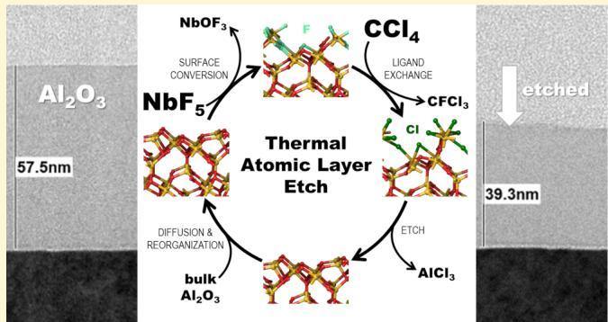
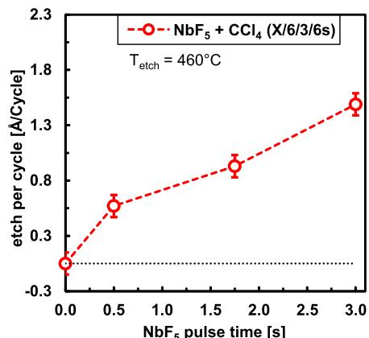
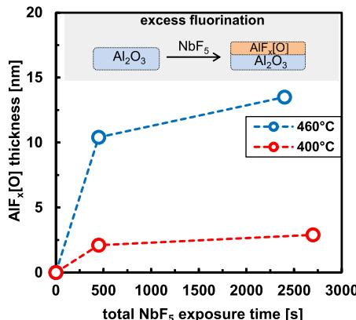
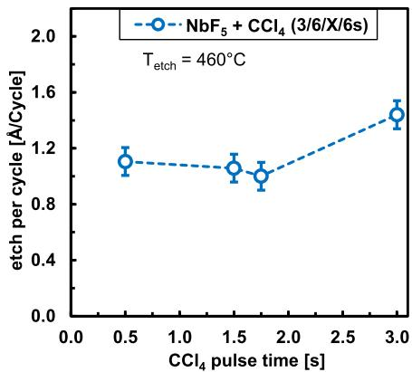
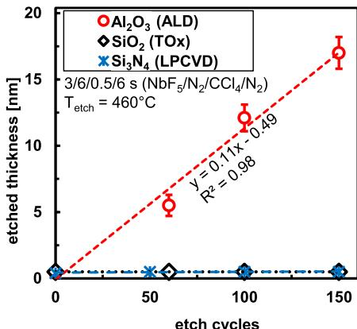
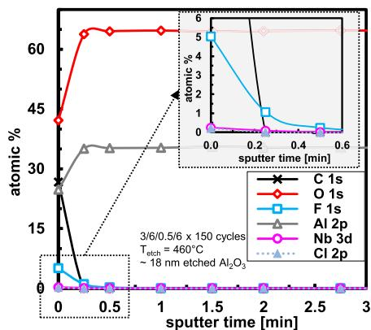
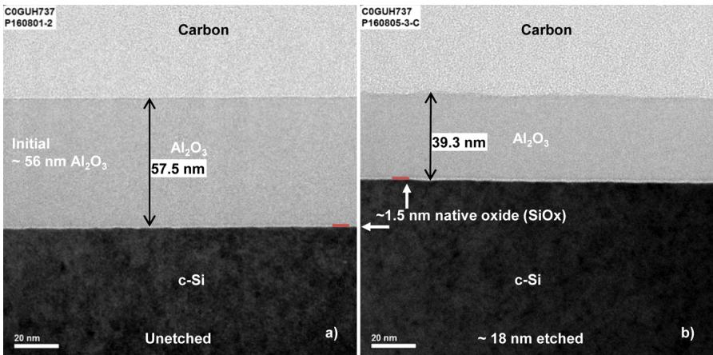
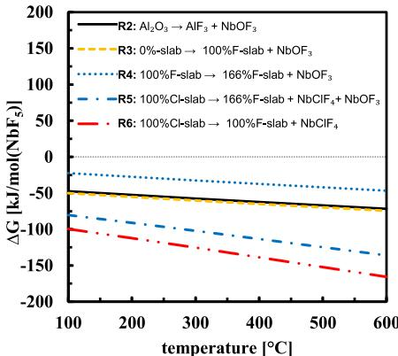
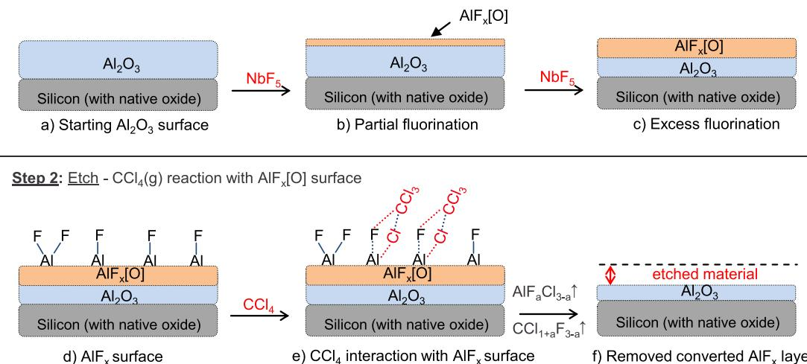

# Thermal Atomic Layer Etching of Aluminum Oxide  $(\mathsf{Al}_2\mathsf{O}_3)$  Using Sequential Exposures of Niobium Pentafluoride  $(\mathsf{NbF}_5)$  and Carbon Tetrachloride  $(\mathsf{CCl}_4)$ : A Combined Experimental and Density Functional Theory Study of the Etch Mechanism

Varun Sharma,\* Simon D. Elliott, Tom Blomberg, Suvi Haukka, Michael E. Givens, Marko Tuominen, and Mikko Ritala\*

Cite This: Chem. Mater. 2021, 33, 2883- 2893

# Read Online

# ACCESS

# Metrics & More

# Article Recommendations

Supporting Information

ABSTRACT: Thermal atomic layer etching (ALEt) of amorphous  $\mathrm{Al}_2\mathrm{O}_3$  was performed by alternate exposures of niobium pentafluoride  $(\mathrm{NbF}_5)$  and carbon tetrachloride  $(\mathrm{CCl}_4)$ . The ALEt of  $\mathrm{Al}_2\mathrm{O}_3$  is observed at temperatures from 380 to  $460^{\circ}\mathrm{C}$ . The etched thickness and the etch rate were determined using spectroscopic ellipsometry and verified by X- ray reflectivity. The maximum etch rate of about  $1.4\mathrm{\AA}$  cycle and a linear increase of the removed film thickness with the number of etch cycles were obtained at a temperature of  $460^{\circ}\mathrm{C}$ . With the help of density functional theory calculations, an etch mechanism is proposed where  $\mathrm{NbF}_5$  converts part of the  $\mathrm{Al}_2\mathrm{O}_3$  surface into an  $\mathrm{AlF}_3$  or aluminum oxyfluoride layer, which upon reacting with  $\mathrm{CCl}_4$  is converted into volatile halide- containing byproducts, thus etching away the converted portion of the material. Consistent with this, a significant surface fluorine content of about 55 at.  $\%$  was revealed when the elemental depth profile analysis of a thick  $\mathrm{NbF}_5$  - treated  $\mathrm{Al}_2\mathrm{O}_3$  layer was performed by X- ray photoelectron spectroscopy. The surface morphology of the reference, pre- , and postetch  $\mathrm{Al}_2\mathrm{O}_3$  surfaces was analyzed using atomic force microscopy and bright- field transmission electron microscopy. Moreover, it is found that this process chemistry is able to etch  $\mathrm{Al}_2\mathrm{O}_3$  selectively over silicon dioxide  $(\mathrm{SiO}_2)$  and silicon nitride  $(\mathrm{Si}_3\mathrm{N}_4)$ .

# INTRODUCTION

In an era of emerging nano- technologies, the fabrication of sub-  $10~\mathrm{nm}$  complex, and 3- D device structures demands unprecedented thickness control in the atomic regime. Specific advances in semiconductor manufacturing techniques are therefore required,1- 4 and several techniques are being actively developed, such as thermal atomic layer deposition (ALD),5 plasma enhanced ALD plasma- based atomic layer etching (ALE),1,2,6 and the recently explored thermal atomic layer etching (ALEt).7- 9 Complementary to ALD, ALEt is a technique that utilizes either partial or complete self- limiting sequential gas- solid reactions to allow the removal of material from the surface with atomic- level precision.7,10,11 Due to the self- limiting nature of at least one of the ALEt half- reactions, it can be preferred over plasma- based ALE for isotropic etching of material from non- line- of- sight features.

Several thermal ALEt processes have been developed that employ a conversion- etch reaction mechanism.12 During the conversion step, the surface is converted into a more reactive material, which during the etch step is exposed to a coreactant and forms volatile products. In ALEt, the conversion step can form an oxide,13 fluoride,8- 10 or another type of reactive surface that differs from the actual etch target. In the etch step, ligands from the coreactant molecules can undergo surface reactions such as ligand- exchange transmetalation,7,8,11 fluorination,13 or chlorination14,15 to form species that may leave the surface.

In most of the reported ALEt reactions, hydrogen fluoride (HF) is used as a fluorinating agent in either the conversion11 or the etch step.15 However, the use of HF can be restricted due to the safety concerns associated with its handling and storage. Moreover, its corrosive nature can pose some compatibility issues with gas- feed as well as exhaust lines, pumps, and other reactor parts, especially when kept at elevated temperatures. Therefore, alternatives to HF- based

ALEt chemistries would prove to be beneficial. Several other highly reactive and toxic16 fluorinating agents such as  $\mathrm{SF}_{4},$ $\mathrm{XeF}_2,$ $\mathrm{F}_2,$ $\mathrm{CCl}_2\mathrm{F}_2,$  and  $\mathrm{CHClF}_2$  have been proposed.17- 20

In this paper, we explore a novel ALEt chemistry for etching amorphous  $\mathrm{Al}_2\mathrm{O}_3$  . It is proposed that  $\mathrm{NbF}_5$  can be used as a fluorinating agent, replacing HF.  $\mathrm{CCl_4}$  is used to carry out the halide- exchange reactions with the fluorinated aluminum oxide surface in order to form volatile  $\mathrm{AlF}_x\mathrm{Cl}_y$  species. Moreover,  $\mathrm{CCl_4}$  is relatively more stable21 than the trimethyl aluminum (TMA) used in the ALE literature,8,9,11 which decomposes below  $400^{\circ}\mathrm{C}$  22- 24 Despite  $\mathrm{NbF}_5$  being solid, it has sufficient vapor pressure (about 0.1 Torr at  $45^{\circ}\mathrm{C}^{25}$  and forms volatile species upon fluorinating the  $\mathrm{Al}_2\mathrm{O}_3$  surface (at least at  $460^{\circ}\mathrm{C}$  and thus leads to almost no surface contaminations. Moreover, it is relatively safer to handle and store and is compatible with the semiconductor vacuum processing equipment.

# EXPERIMENTAL SECTION

Substrates and Process Gases. The target films deposited on ptype  $200~\mathrm{mm}$  silicon wafers that were used in the etch experiments are thermally grown  $\mathrm{SiO}_2$ $\mathrm{(TCx)}$  high- quality low- pressure chemical vapor deposited  $\mathrm{Si}_3\mathrm{N}_4,$  and ALD- grown  $\mathrm{Al}_2\mathrm{O}_3$  .The  $\mathrm{SiO}_2$  and  $\mathrm{Si}_3\mathrm{N}_4$  films were about 20 and  $30~\mathrm{nm}$  thick, respectively. The  $\mathrm{Al}_2\mathrm{O}_3$  films were deposited at  $300^{\circ}\mathrm{C}$  by the TMA and water  $(\mathrm{H}_2\mathrm{O})$  ALD process.26

The fluorinating agent was  $99.5\%$  pure  $\mathrm{NbF}_5$  purchased from abcr GmbH, Germany). The  $\mathrm{CCl}_4$  (anhydrous) was bought from Merck KGaA (Germany) and had a purity  $\geq 99.5\%$  .The  $\mathrm{NbF}_5$  vessel was kept at  $45^{\circ}\mathrm{C},$  and the  $\mathrm{CCl}_4$  source vessel was operated at room temperature  $^\mathrm{27}\mathrm{CCl}_4$  has a vapor pressure of about 90 Torr at room temperature27 and was therefore used in a vapor- draw mode, whereas  $\mathrm{NbF}_5$  was used in a vapor- push mode. Nitrogen  $(99.999\%)$  was used as an inert purge gas. Both the purge gas flows as well as  $\mathrm{CCl}_4$  dose were controlled by needle valves.

Experimental Setup. The etch experiments were conducted on a Pulsar 2000 (P2000) cross- flow reactor manufactured by ASM International N.V. designed to process  $200~\mathrm{mm}$  silicon wafers. The P2000 chamber was operated at isothermal conditions to a maximum  $T_{\mathrm{etch}}$  of  $460^{\circ}\mathrm{C}$  Prior to any etching, all target substrates were kept in a vacuum chamber for  $5\mathrm{min}$  in order to ensure stabilization of the wafer surface temperature. The chamber pressure was between 2 and 4 Torr.

Characterization Techniques. The thickness and optical constants of the films were evaluated using SE- 800 spectroscopic ellipsometer from SENTECH Instruments GmbH, (Germany). X- ray reflectometry (XRR) was performed for confirming the removed thickness values, measuring the postetched surface roughness, and film densities using Xpert (PRO MRD X- ray diffractometer from Malvern Panalytical Ltd. (United Kingdom). For consistency, the exact center points of the wafers were chosen as measurement spots.

Elementary surface composition investigations were performed by X- ray photoelectron spectroscopy (XPS) and conducted on PHI Quantera XSM. Monochromatic Al Kα (1486.6 eV/13 kV) X- rays with a take- off angle of  $45^{\circ}$  were used. The analysis chamber pressure was  $3\times 10^{- 6}$  Pa. In all XPS depth profile measurements, the argon ion energy was set to  $1\mathrm{keV}$  and the X- ray spot size was  $100\mu \mathrm{m}$  .The pass energy of  $140\mathrm{eV}$  was used. The detection limit of this particular tool is about  $0.1 - 0.5$  at.  $\%$

Transmission electron microscopy (TEM) imaging was performed by Evans Analytical Group (California, USA) on FEI Tecnai TF- 20 FEG/TEM operated at  $200\mathrm{kV}$  in a bright- field imaging mode. The TEM lamellas for imaging were prepared by using the focused ion beam lift- out technique. The thicknesses of the TEM lamellas were around  $100\mathrm{nm}$  For preserving the contrast and structural integrity of the sample, a carbon coating was performed prior to the ion- milling.

Computational Techniques. The chemical mechanism of the ALEt process was investigated using first- principles density functional theory (DFT) as implemented in the Schrodinger Materials Science

Suite.28 Atomic- scale models of bulk materials, surfaces, and gas- phase molecules were optimized under periodic boundary conditions with the Perdew- Burke- Ernzerhof (PBE) functional,29 a plane wave basis to a wavefunction cut- off of  $40\mathrm{Ry},$  PBE ultrasoft pseudopotentials,30 and Monkhorst- Pack  $k$  point sets31 using the Quantum ESPRESSO code.32,33 Total energies from DFT are used to calculate reaction energies  $\Delta E$  for possible chemical transformations of these surfaces by the etchants during ALEt.

Since etching is likely to be driven by entropy  $(S)$  it is important to also determine reaction free energies  $(\Delta G)$  that include the effect of temperature  $(T)$  and pressure of reactants  $(p_{\mathrm{react}})$  and products  $(p_{\mathrm{prod}})$  which for ideal gases at constant volume is given by  $\Delta G = \Delta E$ $- T\Delta S = k_{\mathrm{B}}T\ln (\Pi p_{\mathrm{prod}}\mu /\Pi p_{\mathrm{react}}\mu)$  where  $\mu$  are stoichiometric coefficients.34 For the etchants, we use  $p_{\mathrm{react}} = 0.1$  Torr, approximating the experimental conditions, and assume equilibrium with product gases at  $p_{\mathrm{prod}} = sp_{\mathrm{react}}$  where the sticking coefficient  $s$  is an unknown precursor parameter that is typically in the range  $10^{- 2}$  to  $10^{- 4}$  for ALD precursors.35 As explained in the Supporting Information, the entropy terms at  $100^{\circ}\mathrm{C}< T< 600^{\circ}\mathrm{C}$  and  $p_{\mathrm{react}}$  or  $p_{\mathrm{prod}}$  were derived from molecular vibrational analysis of the gas- phase reactant and product molecules at the PBE/LAV3D\*r level with the Jaguar code.36

The  $(\bar{2} 01)$  surface of  $\theta - \mathrm{Al}_2\mathrm{O}_3$  was used as the periodic slab model for the alumina surface during ALEt.  $\theta - \mathrm{Al}_2\mathrm{O}_3$  was chosen because ions in this polymorph have a similar coordination environment to those in the amorphous as- deposited  $\mathrm{Al}_2\mathrm{O}_3$  37 The  $2\times 1$  expansion of a 3- layer  $(\bar{2} 01)$  slab was selected as a representative model surface on the basis of its stability and level of corrugation when bare or fluorinated (see the Supporting Information).

As shown in Figure 1, half of the Al atoms on the bare surface are exposed (4- coordinate to O) and half are covered (6- coordinate).

  
Figure 1. Structural models optimized with DFT for the a) bare  $\mathrm{Al}_2\mathrm{O}_3$  surface with  $0\%$  halides, b surface covered with  $166\%$  F,c  $100\%$  F,and d  $100\%$  Cl. The colors are as follows:  $\mathrm{Al} =$  yellow,  $\mathrm{O} =$  red,  $\mathrm{F} =$  light green, and  $\mathrm{Cl} =$  dark green.

Fluorinated and chlorinated surfaces were generated by progressively replacing  $\mathrm{O}$  with  $\mathrm{F}$  or  $\mathrm{Cl}$  in the topmost layer of the slab, always adding two halide monoanions for each oxide dianion removed so as to preserve stoichiometry and charge neutrality.

The maximum level of chlorination was determined to be  $3\mathrm{Cl}$  per 4- coordinate Al (  $12\mathrm{Cl}$  per  $2\times 1$  cell), which we designate as  $100\%$  - Cl coverage since higher coverages led to the spontaneous desorption of  $\mathrm{AlCl}_3$  molecules during optimization. By contrast, fluorination up to  $166\%$  - F  $20\mathrm{F}$  per  $2\times 1$  cell) was energetically favorable, albeit with a substantial reorganization to give a surface resembling  $\mathrm{AlF}_3$  structural motifs. In this study, we focus on interconversions between the  $166\%$

F,  $100\%$  - F,  $100\%$  - Cl, and  $0\%$  (i.e., bare alumina) surfaces depicted in Figure 1.

F,  $100\%$  - F,  $100\%$  - Cl, and  $0\%$  (i.e., bare alumina) surfaces depicted in Figure 1. The aim of the DFT simulations is to map out the general form of the ALEt mechanism. Many reactions and byproducts can be possible, and we seek here to distinguish which surface transformations are thermodynamically favorable as a function of process conditions. This can reveal the nature of the saturating surface after each precursor exposure during the ALEt cycle and hence account for the etch rate. However, ALEt is actually a non- equilibrium process, driven by kinetics and the irreversible removal of byproducts from the surface into the gas flow. Computing the detailed sequence of surface adsorbates, intermediates, reaction pathways, and associated kinetics with DFT would be a possible future step but is beyond the current scope. It is worth remembering, therefore, that a reaction computed here to be thermodynamically feasible (with  $\Delta G< 0$  at a given  $T$  may in fact face a high kinetic barrier and so not be observed on the experimental time scale. Nevertheless, in the absence of kinetic data, we assume that for a family of competing reactions, the kinetic barriers scale with reaction energies and therefore the most exoergic reaction is the most kinetically likely one.

# RESULTS AND DISCUSSION

Etch- Process Characterization.  $\mathrm{Al}_2\mathrm{O}_3$  is etched by utilizing sequential exposures of  $\mathrm{NbF}_5$  and  $\mathrm{CCl}_4$  precursors at elevated temperatures  $(380 - 460^{\circ}\mathrm{C})$ . An inert gas purging was introduced after each exposure to remove the volatile byproducts and excess of precursor molecules from the reaction chamber. The etch per cycle (EPC) was estimated by subtracting the post- etch thickness from the initial thickness and dividing by the number of etch cycles. The  $\mathrm{Al}_2\mathrm{O}_3$  film thickness values were reliably determined by spectroscopic ellipsometry (SE) and in some cases confirmed with the help of XRR and TEM images.

As shown in Figure 2, an increase in EPC is observed with increasing  $\mathrm{NbF}_5$  pulse time at an etch temperature  $(T_{\mathrm{etch}})$  of $460^{\circ}\mathrm{C}$ . In the figure,  $\mathrm{NbF}_5$  pulse time is varied from 0 to  $3\mathrm{~s~}$  while the  $\mathrm{CCl}_4$  pulse time is fixed to  $3\mathrm{~s~}$ . For each data point plotted in Figure 2, a total of 150 etch cycles were performed. In the absence of  $\mathrm{NbF}_5$ , no  $\mathrm{Al}_2\mathrm{O}_3$  etching was observed as confirmed by XRR, TEM, and XPS. When the  $\mathrm{NbF}_5$  pulse time is increased to  $0.5\mathrm{~s~}$  an etch rate of about  $0.5\mathrm{~\AA~}$  per cycle is noticed. Further increase in the  $\mathrm{NbF}_5$  pulse time to  $3\mathrm{~s~}$  provides an etch rate of about  $1.4\mathrm{~\AA~}$  cycle. Longer  $\mathrm{NbF}_5$  pulse times were not tested. The figure shows that at a  $T_{\mathrm{etch}}$  of  $460^{\circ}\mathrm{C}$ , the EPC did not show strong self- limiting characteristics but may still indicate a soft saturation behavior. A nonsaturative fluorination behavior may affect the etch uniformity across the wafer especially in a cross- flow reactor. This non- self- limiting behavior can be explained by enhanced diffusion of fluoride ions at  $460^{\circ}\mathrm{C}$ . The thickness of the converted layer may depend on factors such as surface temperature, partial pressure, as well as flux of the precursor molecules, reaction time, adsorbate concentration, interaction between surface and diffusing adspecies, presence of defects, being accompanied by phase transitions, and so forth. Thus, in thermal- based ALE processes there may not exist an ALE window.

  
Figure 2. Change in EPC vs  $\mathrm{NbF}_5$  pulse time at the etch temperature of  $460^{\circ}\mathrm{C}$ . The  $\mathrm{CCl}_4$  pulse time was set to  $3\mathrm{~s~}$  and in-between  $\mathrm{N}_2$  purges were  $6\mathrm{~s~}$  each.

For studying the temperature- dependent kinetics of the fluorination step, excess fluorination was carried out by exposing the aluminum oxide surface to  $\mathrm{NbF}_5$  at 400 and  $460^{\circ}\mathrm{C}$  (Figure 3). At  $400^{\circ}\mathrm{C}$ , excess fluorination was performed for 150 and 600 cycles of  $4.5\mathrm{~s~}$ $\mathrm{NbF}_5$  pulse times, while 150 and 800 cycles of  $3\mathrm{~s~}$ $\mathrm{NbF}_5$  pulse times were used at  $460^{\circ}\mathrm{C}$ . After performing the excess fluorination step, the thickness of the formed  $\mathrm{AlF}_x[\mathrm{O}]$  layer was measured by ex situ SE. About 11 and  $14\mathrm{~nm}$  thick fluorinated layers were obtained after 450 and  $2400\mathrm{~s~}$  of total  $\mathrm{NbF}_5$  exposure time, respectively, at  $460^{\circ}\mathrm{C}$ . The formation of thick  $(>10\mathrm{~nm})$ $\mathrm{AlF}_x[\mathrm{O}]$  layers must be due to the prolonged fluorination step and the fluoride ions diffusing deeper into the aluminum oxide layer. The diffusion of fluoride is evidently dependent on the temperature and thus may hint at the existence of no ALE window. According to Morelock et al., aluminum trifluoride adopts a cubic form above  $440^{\circ}\mathrm{C}$ , which upon cooling changes to a rhombohedral phase. The X- ray diffraction (XRD) analysis of about  $11\mathrm{~nm}$ $\mathrm{AlF}_x[\mathrm{O}]$  layer revealed the rhombohedral phase (see the Supporting Information S4) and is thus consistent with the literature. On the contrary, at  $400^{\circ}\mathrm{C}$ , the thickness of the fluorinated layer stayed around  $3\mathrm{~nm}$  even after prolonged total  $\mathrm{NbF}_5$  exposure of  $2700\mathrm{~s~}$ . Chen et al. showed the fluoride ions penetrating up to  $2\mathrm{~nm}$  thick aluminum oxide after treating fluorinated alumina at  $400^{\circ}\mathrm{C}$ , and neutral/ion beams- assisted fluorination lead to a thicker  $\mathrm{AlF}_x[\mathrm{O}]$  layer. Moreover, up to  $0.5\mathrm{~nm}$  thick  $\mathrm{AlF}_3$  layer was obtained at a lower temperature of  $300^{\circ}\mathrm{C}$  with HF as a fluorinating agent. This temperature- dependent thickness of

  
Figure 3.  $\mathrm{AlF}_x[\mathrm{O}]$  film thickness vs variation in total  $\mathrm{NbF}_5$  exposure time at 400 and  $460^{\circ}\mathrm{C}$ . The total  $\mathrm{NbF}_5$  exposure time is calculated by multiplying the  $\mathrm{NbF}_5$  pulse time by the total number of cycles. The  $\mathrm{NbF}_5$  pulse times of 4.5 and  $3\mathrm{~s~}$  were used at 400 and  $460^{\circ}\mathrm{C}$ , respectively. Each  $\mathrm{NbF}_5$  pulse was separated by a  $6\mathrm{~s~}$  long  $\mathrm{N}_2$  purge step.

the converted fluorinated layer suggests that the conversion step is diffusion- limited.

The fluorination step produced a very hydrophilic surface with water contact angles  $\leq 15^{\circ}$ , which is consistent with earlier reports from Roodenko et al. The low water contact angle of the  $\mathrm{AlF}_x[\mathrm{O}]$  surface is attributed to the high Lewis acidity of  $\mathrm{Al - F}$  species, resulting in strong adsorption of  $\mathrm{H}_2\mathrm{O}$  molecules at under- coordinated aluminum sites.

Figure 4 reveals the effect of variation in the  $\mathrm{CCl_4}$  pulse time on EPC at  $460^{\circ}\mathrm{C}$ . The  $\mathrm{NbF}_5$  pulse and  $\mathrm{N}_2$  purge lengths were set to 3 and  $6\mathrm{~s}$ , respectively, and the  $\mathrm{CCl_4}$  pulse time was changed from 0.5 to  $3\mathrm{~s}$ . The figure shows that an EPC around  $1.1\mathrm{\AA}$  is observed for  $\mathrm{CCl_4}$  pulse times between 0.5 and  $1.75\mathrm{~s}$ . However, when  $3\mathrm{~s}$ $\mathrm{CCl_4}$  pulse time is used, an etch rate of  $1.4\mathrm{\AA}$  /cycle is noticed. This could indicate a partial self- limiting nature of the etching step, which could be due to limited  $\mathrm{AlF}_x$  material available at the surface for  $\mathrm{CCl_4}$  to react with and volatilize. Moreover, Figures 3 and 4 together indicate a two- step ALEt mechanism of conversion followed by etching.

  
Figure 4. Effect of  $\mathrm{CCl_4}$  pulse time variation on EPC at  $460^{\circ}\mathrm{C}$ . A total of 150 etch cycles were performed per data point.

Figure 5 plots EPC values at various etch temperatures for the  $\mathrm{Al}_2\mathrm{O}_3$  ALEt process by  $\mathrm{NbF}_5 + \mathrm{CCl}_4$  (red curve). The figure also demonstrates that  $\mathrm{CCl_4}$  alone (blue curve) does not etch  $\mathrm{Al}_2\mathrm{O}_3$  within the tested temperature range of  $380 - 460^{\circ}\mathrm{C}$ . The incapability of  $\mathrm{CCl_4}$  alone in etching  $\mathrm{Al}_2\mathrm{O}_3$  is also confirmed by XRR and TEM images as seen below. However, at  $380^{\circ}\mathrm{C}$ , the etch rate of  $\mathrm{Al}_2\mathrm{O}_3$  by the  $\mathrm{NbF}_5 + \mathrm{CCl}_4$  ALEt process is comparatively low, at about  $0.08\mathrm{\AA}$  /cycle, and no significant etching was observed at temperatures  $< 380^{\circ}\mathrm{C}$ . From Figure 5, it can be seen that the EPC increases with the etch temperature and reaches an etch rate of  $1.4\mathrm{\AA}$  /cycle at  $460^{\circ}\mathrm{C}$ . The Figures 2- 4 also corroborate the proposed ALEt mechanism, whereby  $\mathrm{NbF}_5$  is necessary to fluorinate the  $\mathrm{Al}_2\mathrm{O}_3$  and the converted layer is etched by a subsequent pulse of  $\mathrm{CCl_4}$ . In most of the thermal ALE reports, the ALE window is not observed, and the EPC is dependent on the partial pressure and temperature. Similarly, it is evident from our findings that there exists no ALE window. However, a few ALE processes exhibit an ALE window such as ALE of  $\mathrm{HfO}_2$ ,  $\mathrm{TiO}_2$ , and  $\mathrm{TiN}$ .

  
Figure 5. Change in EPC with etch temperature for the  $\mathrm{NbF}_5$  and  $\mathrm{CCl_4}$  cyclic etching process and compared to no-etching by  $\mathrm{CCl_4}$  only. A total of 150 etch cycles were performed per data point. The EPC at etch temperatures below  $380^{\circ}\mathrm{C}$  stayed zero for both curves.

Selective Etching. In thin- film technology, many applications may benefit from thermal ALEt processes that provide selective etching of  $\mathrm{Al}_2\mathrm{O}_3$  over  $\mathrm{SiO}_2$  and  $\mathrm{Si}_3\mathrm{N}_4$ . Figure 6 shows that the  $\mathrm{NbF}_5 + \mathrm{CCl}_4$  ALEt process is able to etch

  
Figure 6. Etched thickness of  $\mathrm{Al}_2\mathrm{O}_3$ ,  $\mathrm{SiO}_2$ , and  $\mathrm{Si}_3\mathrm{N}_4$  as a function of the number of etch cycles at  $460^{\circ}\mathrm{C}$ . The  $\mathrm{NbF}_5$  and  $\mathrm{CCl_4}$  pulse times are 3 and  $0.5\mathrm{~s}$ , respectively. The  $\mathrm{N}_2$  purge time was kept constant at 6 s.

$\mathrm{Al}_2\mathrm{O}_3$  linearly with the number of etch cycles at  $460^{\circ}\mathrm{C}$ . A linear fit of  $\mathrm{Al}_2\mathrm{O}_3$ - etched thickness with respect to etch cycles yields a constant etch rate of  $0.11\mathrm{~nm}$  /cycle when  $0.5\mathrm{~s}$ $\mathrm{NbF}_5$  and  $3\mathrm{~s}$ $\mathrm{CCl_4}$  pulse times are used. By contrast, under all conditions tested here, no etching of  $\mathrm{SiO}_2$  and  $\mathrm{Si}_3\mathrm{N}_4$  films was observed. In other words, between 380 and  $460^{\circ}\mathrm{C}$ ,  $\mathrm{Al}_2\mathrm{O}_3$  can be etched selectively over  $\mathrm{SiO}_2$  and  $\mathrm{Si}_3\mathrm{N}_4$  by the  $\mathrm{NbF}_5 + \mathrm{CCl}_4$  etch process.

Surface Characterization. XPS studies were conducted in order to understand the etch mechanism. An  $\mathrm{Al}_2\mathrm{O}_3$  surface exposed to  $\mathrm{NbF}_5$  was the test subject. Figure 7 shows the XPS elemental depth profile analysis of the surface that has been fluorinated. The aluminum oxide surface was subjected to a total of 150 cycles of  $3\mathrm{~s}$ $\mathrm{NbF}_5$  pulses with intermittent  $6\mathrm{~s}$ $\mathrm{N}_2$  purges at  $460^{\circ}\mathrm{C}$ . Reasons for conducting the fluorination step under such extreme conditions were to ensure a significant as well as meaningful fluorine signal, to understand the fluorination step, and to deduce a reliable reaction mechanism. From the XPS depth profiling and SE measurements, the thickness of the  $\mathrm{AlF}_x[\mathrm{O}]$  layer formed under these conditions was estimated to be around  $11\mathrm{~nm}$ .

After  $15\mathrm{~s}$  of sputtering, a very high fluorine content of about 55 at.  $\%$  (similar F content was found by Kim et al. after fluorinating  $\mathrm{Al}_2\mathrm{O}_3$ ) and a decreased oxygen content of 17 at.  $\%$  (as compared to roughly 60 at.  $\%$  oxygen in  $\mathrm{Al}_2\mathrm{O}_3$ ) is observed.

  
Figure 7. XPS depth profile of  $\mathrm{Al}_2\mathrm{O}_3$  exposed to  $\mathrm{NbF}_5$  for a total of 450 s at  $460^{\circ}\mathrm{C}$ . The atomic percentage of elements found in the converted film is plotted with respect to the sputter time.

The fluorine content gradually decreases with sputter time and may indicate the presence of a gradient in the composition of the  $\mathrm{AlF}_x[\mathrm{O}]$  layer. Furthermore, a very low niobium content of about 1 at.  $\%$ , decreased oxygen, and high fluorine content support the proposed reaction mechanism in favor of reaction R2 described below. This confirms that the  $\mathrm{NbF}_5$  molecules impart at least some fluoride ions to aluminum and form a volatile species with oxygen. Moreover, the formation of an about  $11\mathrm{nm}$  thick  $\mathrm{AlF}_x[\mathrm{O}]$  layer upon excess fluorination may explain the non- self- limiting EPC curve in Figure 2.

Figure 8 reveals atomic percentages of several elements found on the  $\mathrm{Al}_2\mathrm{O}_3$  surface as a function of sputtering time after removing about  $18\mathrm{nm}$  of the  $56\mathrm{nm}$ $\mathrm{Al}_2\mathrm{O}_3$  film by the  $\mathrm{NbF}_5 + \mathrm{CCl}_4$  ALEt process. A total of 150 ALEt cycles at 460  $^\circ \mathrm{C}$  were performed with  $\mathrm{CCl}_4$  being the last pulse. The zoomed part of the figure depicts the fluorine content around 5 at.  $\%$  and very low amounts of niobium  $(< 0.3$  at.  $\%$  and chlorine  $(< 0.2$  at.  $\%$  ). The presence of surface fluorine may indicate that a  $\mathrm{CCl}_4$  pulse time longer than  $0.5\mathrm{s}$  is necessary to either fully remove the converted layer or complete the halide- transmetalation reaction or it does not go to completion. From SE and XPS depth profiling, the fluorine- containing top layer is estimated to be around  $1.2\mathrm{nm}$  thick.

  
Figure 8. XPS depth profile of the remaining  $\mathrm{Al}_2\mathrm{O}_3$  after removing about  $18\mathrm{nm}$  film by the  $\mathrm{NbF}_5$  and  $\mathrm{CCl}_4$  ALEt process. A zoomed picture at the top right corner focuses on Nb, F, and Cl signals.

In Figure 9, cross- sectional bright- field transmission electron micrographs of  $\mathrm{Al}_2\mathrm{O}_3$ - coated silicon substrate are displayed. The thickness of an original  $\mathrm{Al}_2\mathrm{O}_3$  film was  $56\mathrm{nm}$  as revealed by SE and confirmed by XRD. Figure 9a shows the  $\mathrm{Al}_2\mathrm{O}_3$  film that remained unetched after being exposing to 150 cycles of 3 s  $\mathrm{CCl}_4$  pulses. The figure also shows very smooth films devoid of significant surface defects. In Figure 9b, it is shown that after exposing the  $\mathrm{Al}_2\mathrm{O}_3$  film to 150 etch cycles of the  $\mathrm{NbF}_5 + \mathrm{CCl}_4$  ALEt process, about  $18\mathrm{nm}$  of the film is removed and the remaining  $\mathrm{Al}_2\mathrm{O}_3$  film appears to be rougher than the unetched film. In addition, atomic force microscopy (AFM) measurements (see the Supporting Information) revealed a slight increase in the surface root- mean- squared (or  $R_{\mathrm{a}}$ ) roughness. This increase in surface roughness can be associated with the fluorination step and therefore can be due to either the variation in the diffusion depths or the reorganization of the near- surface region during diffusion- based fluorination. The etched surface does not appear to be crystalline.

Computation of Mechanism. Although the gaseous reactants undergo individual reaction steps when they adsorb to the surface during ALEt, along with bulk- surface diffusion, the net effect of each cycle is the removal of bulk  $\mathrm{Al}_2\mathrm{O}_3$  and regeneration of surface functionality. The most straightforward way to assess the viability of ALEt is therefore to compute the thermodynamics of bulk etching, which is presented next. Afterward, DFT results for the thermodynamics of surface reactions are presented (more details in the Supporting Information)

We first investigate whether it is thermodynamically favorable for either precursor alone to etch bulk alumina, transforming it into gas- phase products.  $\mathrm{NbF}_5$  can in principle remove both Al and O as follows

$$
\mathrm{Al}_2\mathrm{O}_{3(\mathrm{s})} + 3\mathrm{NbF}_{5(\mathrm{g})}\rightarrow 2\mathrm{AlF}_{3(\mathrm{g})} + 3\mathrm{NbOF}_{3(\mathrm{g})} \tag{R1}
$$

and for this reaction, periodic DFT yields  $\Delta E = +140\mathrm{kJ / mol - NbF}_5$  and  $\Delta G^{300\circ \mathrm{C}} = - 100\mathrm{kJ / mol - NbF}_5$ . The positive value of  $\Delta E$  indicates a net cost in bond energies, while the negative value of  $\Delta G$  reflects the entropy gain in volatilizing the solid. Bulk alumina may be more readily etched by the Cl source alone according to the reaction

$$
\mathrm{Al}_2\mathrm{O}_{3(\mathrm{s})} + 3\mathrm{CCl}_{4(\mathrm{g})}\rightarrow 2\mathrm{AlCl}_{3(\mathrm{g})} + 3\mathrm{COCl}_{2(\mathrm{g})} \tag{R7}
$$

which has DFT- computed energetics of  $\Delta E = - 18\mathrm{kJ / mol - Al}_2\mathrm{O}_3$  and  $\Delta G^{300\circ \mathrm{C}} = - 248\mathrm{kJ / mol - Al}_2\mathrm{O}_3$ . (If the reaction would proceed to completion,  $\mathrm{CO}_2$  could be produced, but it seems more likely that  $\mathrm{COCl}_2$  would desorb first). However, no etching is observed experimentally with  $\mathrm{CCl}_4$  alone (Figure 4), which suggests that kinetic barriers prevent this reaction from taking place. Consistent with this, periodic DFT simulations show that the  $\mathrm{CCl}_4$  molecule resists adsorption to a bare alumina surface probably because the molecule is nonpolar. We therefore exclude these single- etchant reactions from the reaction equations below and restrict our analysis to reactions that etch away either Al or O as volatile products but not both simultaneously. Such reactions are the prerequisite for a successful, self- limiting ALEt process.

The conversion of bulk alumina into solid aluminum fluoride according to

$$
\mathrm{Al}_2\mathrm{O}_{3(\mathrm{s})} + 3\mathrm{NbF}_{5(\mathrm{g})}\rightarrow 2\mathrm{AlF}_{3(\mathrm{s})} - 3\mathrm{NbOF}_{3(\mathrm{g})} \tag{R2}
$$

is computed to show that  $\Delta E = - 24\mathrm{kJ / mol - NbF}_5$  and  $\Delta G^{300\circ \mathrm{C}} = - 58\mathrm{kJ / mol - NbF}_5$  (Table 1). Although labeled as "conversion" in the ALEt literature, this reaction necessarily involves the etching of oxygen, as one oxide dianion is exchanged with two fluoride monoanions. The thermodynamics of conversion of the bare alumina surface into a  $100\%$

  
Figure 9. Cross-sectional BE-TEM images of (a) unetched  $57.5 \mathrm{nm}$  (includes  $1.5 \mathrm{nm}$  native silicon oxide)  $\mathrm{Al}_2\mathrm{O}_3$  after exposing to 150 cycles of each  $3 \mathrm{s}$  long  $\mathrm{CCl}_4$  pulses and (b) after etching about  $18 \mathrm{nm} \mathrm{Al}_2\mathrm{O}_3$  film by 150 cycles of the  $\mathrm{NbF}_5 + \mathrm{CCl}_4$  ALEt process. Initially, about  $56 \mathrm{nm} \mathrm{Al}_2\mathrm{O}_3$  was measured by SE (TEM not taken). The  $\mathrm{NbF}_5$  and  $\mathrm{CCl}_4$  pulse times were 3 and  $0.5 \mathrm{s}$ , respectively. For both experiments, an etch temperature of  $460^{\circ}\mathrm{C}$  was used.

fluorinated surface is found to be similar in terms of energetics to that of the bulk (R3:  $\Delta E = - 27 \mathrm{kJ / mol - NbF}_5$  and  $\Delta G^{300\circ \mathrm{C}} = - 60 \mathrm{kJ / mol - NbF}_5$ ). Further fluorination of the surface is slightly less favorable (e.g., R4:  $\Delta E = +0.8 \mathrm{kJ / mol - NbF}_5$  and  $\Delta G^{300\circ \mathrm{C}} = - 33 \mathrm{kJ / mol - NbF}_5$  for  $100\%$  F to  $166\%$  F) but still exoergic, indicating that surface conversion does not self- limit. As shown in Figure 10, there is little variation with temperature in these free energies of fluorination of the bulk and surface by  $\mathrm{NbF}_5$ .

We conclude that continuous conversion of alumina into aluminum fluoride is moderately exoergic under the experimental conditions, but again, the extent to which such conversion actually takes place depends on the kinetics of individual steps that bring  $\mathrm{NbF}_5$  and alumina into contact. We suggest that this is likely to be dictated by the kinetics of diffusion across the  $\mathrm{Al}_2\mathrm{O}_3 - \mathrm{AlF}_3$  interface. The  $\mathrm{NbF}_5$  pulse therefore produces a surface layer and possibly also subsurface layers that are fluorinated and is experimentally verified in Figures 3 and 8.

We now examine the potential reactions of such fluorinated surfaces (considering the sample surfaces  $100\%$  F and  $166\%$  F) with gas- phase  $\mathrm{CCl}_4$  in the next phase of the ALEt cycle. The computations show that the most energetically favorable products are  $\mathrm{CFCl}_3$  and  $\mathrm{AlCl}_3$  and the resulting thermodynamics are given in Table 1 and Figure 11.

$\mathrm{CFCl}_3$  is the likely product of halide- exchange between the  $\mathrm{CCl}_4$  reagent and the fluorinated surface. The simplest of such reactions produces a chlorinated surface with the same coverage

$$
100\% \mathrm{F - slab} + 12\mathrm{CCl}_{4(\mathrm{g})}\rightarrow 100\% \mathrm{Cl - slab} + 12\mathrm{CFCl}_{3(\mathrm{g})}
$$

which is computed to be endoergic across a wide temperature range  $(\Delta G^{300\circ \mathrm{C}} = +41 \mathrm{kJ / mol - CCl}_4)$ . The reaction becomes more favorable if  $\mathrm{Al}$  is also etched away as  $\mathrm{AlCl}_3$ . For instance,  $\Delta G^{300\circ \mathrm{C}} = +4.3 \mathrm{kJ / mol - CCl}_4$  for partial etching

$$
\begin{array}{rl} & 100\% \mathrm{F - slab} + 12\mathrm{CCl}_{4(\mathrm{g})} + 2 / 3\mathrm{Al}_2\mathrm{O}_{3(\mathrm{s})}\\ & \rightarrow 66\% \mathrm{Cl - slab} + 12\mathrm{CFCl}_{3(\mathrm{g})} + 4 / 3\mathrm{AlCl}_{3(\mathrm{g})} \end{array} \tag{R11}
$$

and  $\Delta G^{300\circ \mathrm{C}} = - 58 \mathrm{kJ / mol - CCl}_4$  for complete etching to a bare surface:

$$
\begin{array}{rl} & 100\% \mathrm{F - slab} + 12\mathrm{CCl}_{4(\mathrm{g})} + 2\mathrm{Al}_2\mathrm{O}_{3(\mathrm{s})}\\ & \rightarrow 0\% \mathrm{-slab} + 12\mathrm{CFCl}_{3(\mathrm{g})} + 4\mathrm{AlCl}_{3(\mathrm{g})} \end{array} \tag{R13}
$$

Similar results for the  $166\%$  F surface are displayed in Figure 11. As expected, these etch reactions are driven by entropy and thus become more favored at high temperatures. We can not confidently state the exact temperature above which a given reaction becomes exoergic since this is affected by the pressure correction and thus by the arbitrary choice of the sticking coefficient  $s$ . Nevertheless, Figure 11 allows us to conclude that it is thermodynamically favored for  $\mathrm{CCl}_4$  to entirely etch away the aluminum fluoride layer and reveal bare alumina ( $0\%$  surface).

Since  $\mathrm{CCl}_4$  may in principle etch bulk alumina (reaction R7), we need to consider whether the bare alumina surface is reactive with this precursor. Converting the bare surface to a  $100\%$  chlorinated surface is found to be exoergic, with  $\Delta E = - 40 \mathrm{kJ / mol - CCl}_4$  and  $\Delta G^{300\circ \mathrm{C}} = - 51 \mathrm{kJ / mol - CCl}_4$  (reaction R9) following a similar trend to the conversion of bulk alumina to bulk aluminum chloride (reaction R8). However, as noted above, the experimental result of no etching by  $\mathrm{CCl}_4$  alone indicates that this reaction pathway is not accessible. A bare alumina surface is therefore the thermodynamically favored outcome of the  $\mathrm{CCl}_4$  pulse.

In case fluorinated or chlorinated portions of the surface persist into the  $\mathrm{NbF}_5$  pulse of the next ALEt cycle, we include exemplary reactions of  $100\%$  F and  $100\%$  Cl surfaces with  $\mathrm{NbF}_5$  in Figure 10 (reactions R4- R6). In this case, halide- exchange to  $\mathrm{NbCl}_4$  is the most favorable reaction, but the addition of  $\mathrm{F}$  and removal of  $\mathrm{O}$  is also exoergic across the entire temperature range. Therefore, these reactions also lead to a fluorinated surface as the outcome of the  $\mathrm{NbF}_5$  pulse.

Having identified the saturated surfaces at the end of each precursor pulse, we are now able to combine half- reactions (R3 + R13 or R4 + R14) into the overall ALEt reaction

$$
\begin{array}{rl} & {\mathrm{Al}_2\mathrm{O}_{3(\mathrm{s})} + 3\mathrm{NbF}_{5(\mathrm{g})} + 6\mathrm{CCl}_{4(\mathrm{g})}}\\ & {\quad \rightarrow 2\mathrm{AlCl}_{3(\mathrm{g})} + 3\mathrm{NbOF}_{3(\mathrm{g})} + 6\mathrm{CFCl}_{3(\mathrm{g})}} \end{array} \tag{R15}
$$

The overall energies per ALEt cycle computed with DFT are  $\Delta E = +421 \mathrm{kJ / mol - Al}_2\mathrm{O}_3$  and  $\Delta G^{300\circ \mathrm{C}} = - 329 \mathrm{kJ / mol - Al}_2\mathrm{O}_3$ .

e e e e e e e e e e e e e e e e e e e e e e e e e e e e e e e e e e e e e e e e e e e e e e e e e e e e e e e e e e e e e e e e e e e e e e e e e e e e e e e e e e e e e e e e e e e e e e e e e e e e e  

<table><tr><td>R. no.</td><td>reaction</td><td>ΔE</td><td>ΔG100C</td><td>ΔG200C</td><td>ΔG300C</td><td>ΔG400C</td><td>ΔG500C</td><td>ΔG600C</td><td>units</td></tr><tr><td>R1</td><td>Al2O3(s) + 3NBrF(s) → 2AlF3(s) (R1)</td><td>139.9</td><td>-10.2</td><td>-54.6</td><td>-100.1</td><td>-241.4</td><td>kJ/mol(NbF3)</td><td></td><td></td></tr><tr><td>R2</td><td>Al2O3(s) + 3NBrF(s) → 2AlF3(s) (R2)</td><td>-24.1</td><td>-47.4</td><td>-52.5</td><td>-57.5</td><td>-71.7</td><td>kJ/mol(NbF3)</td><td></td><td></td></tr><tr><td>R3</td><td>0%-slab + 6NBrF(s) → 100%F-slab + 6NBrF(s) (R3)</td><td>-26.8</td><td>-50.1</td><td>-55.3</td><td>-60.3</td><td>-74.5</td><td>kJ/mol(NbF3)</td><td></td><td></td></tr><tr><td>R4</td><td>100%-slab + 4NBrF(s) → 100% F-slab + 4NBrF(s) (R4)</td><td>0.8</td><td>-22.4</td><td>-27.6</td><td>-32.6</td><td>-46.8</td><td>kJ/mol(NbF3)</td><td></td><td></td></tr><tr><td>R5</td><td>100% Cl-slab + 16NBrF(s) → 16% F-slab + 12NBrCl4(s) + 4NbF3(s) (R5)</td><td>-44.9</td><td>-80.4</td><td>-91.1</td><td>-102.1</td><td>-130.0</td><td>kJ/mol(NbF3)</td><td></td><td></td></tr><tr><td>R6</td><td>100% Cl-slab + 12NBrF(s) → 100% F-slab + 12NBrCl4(s) (R6)</td><td>-60.1</td><td>-99.7</td><td>-112.3</td><td>-125.3</td><td>-165.7</td><td>kJ/mol(NbF3)</td><td></td><td></td></tr><tr><td>R7</td><td>Al2O3(s) + 3CCl4(s) → 2AlCl4(s) + 3CCl2(s) (R7)</td><td>-17.7</td><td>-164.1</td><td>-206.0</td><td>-248.4</td><td>-372.9</td><td>kJ/mol(CCl4)</td><td></td><td></td></tr><tr><td>R8</td><td>Al2O3(s) + 3CCl4(s) → 2AlCl4(s) + 3CCl2(s) (R8)</td><td>-62.8</td><td>-74.2</td><td>-74.1</td><td>-73.4</td><td>-62.8</td><td>kJ/mol(CCl4)</td><td></td><td></td></tr><tr><td>R9</td><td>0%-slab + 6CCl4(s) → 100% Cl-slab + 6CCl2(s) (R9)</td><td>-40.1</td><td>-51.6</td><td>-51.5</td><td>-50.7</td><td>-40.2</td><td>kJ/mol(CCl4)</td><td></td><td></td></tr><tr><td>R10</td><td>100% F-slab + 12CCl4(s) → 100% Cl-slab + 12CCl2(s) (R10)</td><td>72.5</td><td>51.4</td><td>46.2</td><td>41.0</td><td>25.7</td><td>kJ/mol(CCl4)</td><td></td><td></td></tr><tr><td>R11</td><td>100% F-slab + 12CCl4(s) (R11)</td><td>72.5</td><td>28.9</td><td>16.7</td><td>4.3</td><td>-33.5</td><td>kJ/mol(CCl4)</td><td></td><td></td></tr><tr><td>R12</td><td>→ 66% Cl-slab + 12CCl2(s) (R12)</td><td>71.5</td><td>23.3</td><td>9.7</td><td>-4.1</td><td>-46.4</td><td>kJ/mol(CCl4)</td><td></td><td></td></tr><tr><td>R13</td><td>→ 100% F-slab + 12CCl4(s) (R13)</td><td>83.7</td><td>-4.9</td><td>-31.1</td><td>-57.9</td><td>-140.6</td><td>kJ/mol(CCl4)</td><td></td><td></td></tr><tr><td>R14</td><td>166% F-slab + 20CCl4(s) (R14)</td><td>78.2</td><td>-10.4</td><td>-36.6</td><td>-63.4</td><td>-146.2</td><td>kJ/mol(CCl4)</td><td></td><td></td></tr><tr><td>R15</td><td>→ 0%-slab + 20CCl4(s) + 10%Cl2(s) (R15)</td><td>421.8</td><td>-62.6</td><td>-194.2</td><td>-329.1</td><td>-747.6</td><td>kJ/mol(Al2O3)</td><td></td><td></td></tr></table>

  
Figure 10. Change in the Gibbs free energy with temperature for various fluorination ALEt-half-reactions.

  
Figure 11. Change in the Gibbs free energy with temperature for possible chlorination or halide-exchange reactions.

Consistent with the data in Figure 2, the EPC in this mechanism depends on the level of conversion that is achieved in the  $\mathrm{NbF}_5$  pulse.  $100\%$  F means the etching of 2  $(\mathrm{Al}_2\mathrm{O}_3)/$  cycle in the  $2\times 1$  slab. Dividing by the cross- sectional area of the slab  $(84.5\mathrm{\AA}^2)$  and multiplying by the molar volume of  $\theta$  alumina  $(48.5\mathrm{\AA}^3 /\mathrm{Al}_2\mathrm{O}_3)$  yields a theoretical EPC of  $1.2\mathrm{\AA}/$  cycle for this F- coverage. Converting a greater proportion of the surface zone to  $\mathrm{AlF}_3$  means a higher EPC—for example,  $166\%$  F means etching 3.3  $(\mathrm{Al}_2\mathrm{O}_3)$  /cycle per slab and an EPC of  $1.9\mathrm{\AA}/$  cycle.

Proposed Reaction Mechanism. Many reported thermal ALEt reactions undergo a two- step, conversion- etch mechanism,7- 11,13 with the conversion (or fluorination) step followed by an etch step. The experimental findings in this report also suggest a two- step etch mechanism.

The first step of the proposed reaction mechanism shown in Figure 12 is the conversion step. Figure 12a depicts the initial  $\mathrm{Al}_2\mathrm{O}_3$  film on the silicon substrate, and Figure 12b shows the fluorinated  $\mathrm{Al}_2\mathrm{O}_3$  layer after exposing to the  $\mathrm{NbF}_5$ . As evident from Figures 3 and 7, the  $\mathrm{NbF}_5$  is believed to act like a fluorinating agent similar to  $\mathrm{HF}^7$  or  $\mathrm{WF}_6^{13}$  and converts the  $\mathrm{Al}_2\mathrm{O}_3$  surface into  $\mathrm{AlF}_x[\mathrm{O}]$ . The experimental findings suggest that the fluorination is not self- limiting, and therefore, with excessive fluorination, a thicker  $\mathrm{AlF}_x[\mathrm{O}]$  layer is formed, as depicted in Figure 12c.

From the DFT calculations for gas- bulk (R1 and R2) as well as gas- surface reactions R3- R5, it is proposed that niobium most likely forms the volatile  $\mathrm{NbOF}_3$  species. The existence of gaseous  $\mathrm{NbOF}_3$  has been previously reported, and its volatility has been studied.53- 56 The reaction  $\mathrm{NbOF}_{3(\mathrm{s})}\rightarrow \mathrm{NbOF}_{3(\mathrm{g})}$  is favorable  $(\Delta G< 0)$  above  $140^{\circ}\mathrm{C}$ .25 Moreover, thermogravimetric analysis of  $\mathrm{NbOF}_3$  showed mass loss above  $80^{\circ}\mathrm{C}$ .25

During this conversion step, the oxygen from the  $\mathrm{Al}_2\mathrm{O}_3$  layer is also removed at least partially if not completely and therefore the fluorinated layer is labeled as  $\mathrm{AlF}_x[\mathrm{O}]$ . Moreover, it is also possible that the fluorinated layer is  $\mathrm{AlF}_3$  which partially oxidizes in the air to form  $\mathrm{AlF}_x[\mathrm{O}]$ . Figure 12d depicts an outcome of the excess fluorination step and is supported by Figures 3 and 7.

In the second step, the  $\mathrm{AlF}_x[\mathrm{O}]$  layer can be etched as shown in Figure 12 (d- f). The etch step involves halide- exchange transmetalation to form volatile byproducts such as  $\mathrm{AlF}_a\mathrm{Cl}_{3 - a}$  and  $\mathrm{CCl}_{1 + a}\mathrm{F}_{3 - a}$ , where  $0\leq a\leq 2$ . The DFT computations reveal  $\mathrm{AlCl}_3$  and  $\mathrm{OCFCl}_3$  as being the most favorable etch products from the various chlorination half- reactions R10- R14. In this fashion, an etching of  $\mathrm{Al}_2\mathrm{O}_3$  can be achieved by alternating exposures of  $\mathrm{NbF}_5$  and  $\mathrm{CCl}_4$ , which

  
Step 1: Conversion/Fluorination -  $\mathrm{NbF}_5(\mathrm{g})$  fluorinates the  $\mathrm{Al}_2\mathrm{O}_3$  surface  Figure 12. Proposed ALEt mechanism consists of a conversion step followed by an etch step: (a) starting  $\mathrm{Al}_2\mathrm{O}_3$  surface, (b) after partial fluorination by  $\mathrm{NbF}_5,$  (c) upon excess  $\mathrm{NbF}_5$  exposure, a thick  $\mathrm{AlF}_x[\mathrm{O}]$  is formed, (d)  $\mathrm{AlF}_x[\mathrm{O}]$  surface with  $\mathrm{Al - F}$  bonds, (f) possible halideexchange interaction between  $\mathrm{CCl}_4$  and the  $\mathrm{AlF}_x[\mathrm{O}]$  surface, and  $(\mathbf{g})$  converted  $\mathrm{AlF}_x[\mathrm{O}]$  layer removed and the underlying  $\mathrm{Al}_2\mathrm{O}_3$  surface revealed.

may follow the described conversion- etch mechanism by the overall reaction R15.

Discussion of Etch Rate. According to the overall etch reaction R15, the theoretical EPC of  $1.2\mathrm{\AA / cycle}$  for  $100\%$  Fslab coverage is evaluated. For prolonged fluorination as per reactions R4 and R5, where  $166\%$  F- slab is used, an EPC of 1.9  $\mathrm{\AA / cycle}$  is obtained. An EPC of  $1.4\mathrm{\AA / cycle}$  is recorded for  $3\mathrm{s}$ $\mathrm{NbF}_5$  and  $\mathrm{CCl_4}$  pulse lengths (as shown in Figure 2), which is therefore consistent with a coverage of  $120\%$  F during etching by R15. Moreover, both the experiment and the DFT calculations indicate that the EPC is not self- limiting for  $\mathrm{NbF}_5$  pulse time variation and strongly depends on the fluorination step.

Another parameter that largely impacts the EPC is the etch temperature. Higher EPC values are observed at higher temperatures  $(\geq 380^{\circ}C)$  .At temperatures below  $380^{\circ}\mathrm{C},$  no etching was observed. However, DFT thermodynamic calculations did not show any evidence for this behavior. Therefore, this temperature dependence probably reflects the kinetics of diffusion and structural reorganization at the  $\mathrm{Al}_2\mathrm{O}_3\mathrm{- AlF}_3$  interface. Based on our examination of the DFT- computed structures, it may be that atoms near the interface have to reorganize so that aluminum takes a low coordination number (i.e., 4 rather than 6) as the prerequisite for the fluoride to form and hence for the etching to take place.

# CONCLUSIONS

ALEt of amorphous  $\mathrm{Al}_2\mathrm{O}_3$  is demonstrated using cyclic exposures of  $\mathrm{NbF}_5$  and  $\mathrm{CCl_4}$  etchants. The  $\mathrm{Al}_2\mathrm{O}_3$  ALEt is found to follow a two- step etch mechanism. In the first step,  $\mathrm{NbF}_5$  converts part of the  $\mathrm{Al}_2\mathrm{O}_3$  layer into  $\mathrm{AlF}_X[\mathrm{O}]$ , or more evidently  $\mathrm{AlF}_3$ , which is described as a conversion or fluorination step. The most likely volatile byproduct is found to be  $\mathrm{NbOF}_3$ . In the second step, the chlorine atoms from  $\mathrm{CCl}_4$  undergo halide- exchange with the converted  $\mathrm{AlF}_X[\mathrm{O}]$  surface. As a result of such an interaction, various volatile byproducts such as  $\mathrm{AlF}_2\mathrm{Cl}$ ,  $\mathrm{AlFCl}_2$ ,  $\mathrm{AlCl}_3$ , and several chlorofluorocarbon molecules can be produced. Of these,  $\mathrm{AlCl}_3$  and  $\mathrm{CFCl}_3$  are found by DFT to be the most favorable, which leads to the overall etching reaction

$$
\begin{array}{rl} & {\mathrm{Al}_2\mathrm{O}_{3(\mathrm{s})} + 3\mathrm{NbF}_{5(\mathrm{g})} + 6\mathrm{CCl}_{4(\mathrm{g})}}\\ & {\quad \rightarrow 2\mathrm{AlCl}_{3(\mathrm{g})} + 3\mathrm{NbOF}_{3(\mathrm{g})} + 6\mathrm{CFCl}_{3(\mathrm{g})}} \end{array}
$$

Similar reactions can be written for the other possible byproducts.

In this manner, the converted  $\mathrm{AlF}_X[\mathrm{O}]$  layer is volatilized from the surface by  $\mathrm{CCl}_4$  and hence the desired etching takes place. The feasibility of the proposed reaction mechanism was confirmed with thermodynamic calculations based on DFT. In addition, XPS and XRD analyses confirmed the formation as well as the removal of the fluorinated  $\mathrm{AlF}_X[\mathrm{O}]$  layer.

The dependence of the EPC on  $\mathrm{NbF}_5$  pulse time shows soft self- limiting characteristics, which can be due to slow kinetics, diffusion- limited gas- solid reaction, high residence time of  $\mathrm{NbF}_5$ , low concentration or partial pressure of  $\mathrm{NbF}_5$ , or slow sublimation of volatile  $\mathrm{NbOF}_3$  surface species. The  $\mathrm{CCl}_4$  reaction is found to be more self- limiting than that of  $\mathrm{NbF}_5$ .

Aluminum oxide ALEt is observed between 380 and  $460^{\circ}\mathrm{C}$ . From its onset (removing just  $0.08\mathrm{\AA / cycle}$  at  $380^{\circ}\mathrm{C}$ ), the etch rate tends to increase with etch temperature. We tentatively link this temperature- dependence to the kinetics of diffusion across the oxide- fluoride interface. The linear removal of  $\mathrm{Al}_2\mathrm{O}_3$  with cycles is observed with an etch rate of about  $1.1\mathrm{\AA / cycle}$  at  $460^{\circ}\mathrm{C}$ . An etch rate of about  $1.4\mathrm{\AA / cycle}$  is measured when the exposure time for each precursor is set to  $3\mathrm{s}$ , separated by  $6\mathrm{s}\mathrm{N}_2$  purges. This etch rate is consistent with fluorination that extends partly into the subsurface layer. As revealed by TEM analysis, the surface of the post- etch  $\mathrm{Al}_2\mathrm{O}_3$  film was rougher than the unetched film, again pointing to diffusion at the interface.

It is proposed that the thermal  $\mathrm{NbF}_5 + \mathrm{CCl}_4$  ALEt process reported here could etch other metal oxides in a similar twostep etch mechanism with selectivity against  $\mathrm{SiO}_2$  and  $\mathrm{Si}_3\mathrm{N}_4$ .

# ASSOCIATED CONTENT

# $\circledcirc$  Supporting Information

The Supporting Information is available free of charge at https://pubs.acs.org/doi/10.1021/acs.chemmater.1c00142.

Details on DFT calculations; bulk calculations; optimized unit cells of bulk structures of  $\theta - \mathrm{Al}_2\mathrm{O}_3$  and  $\mathrm{AlF}_3$ ; slab calculations; entropy estimation; computed structural and energetic data of the surface slabs; optimized surface slabs; grazing- incidence XRD (GIXRD) analysis of aluminum fluoride and the formed aluminum fluoride layer after prolonged fluorination at  $460^{\circ}\mathrm{C}$ ; and surface morphology determination by AFM (PDF) Computed bare slabs in crystallographic information file (.cif) format (ZIP)

# AUTHOR INFORMATION

# Corresponding Authors

Varun Sharma - ASM Microchemistry Oy, Helsinki, Uusimaa 00560, Finland; Department of Chemistry, University of Helsinki, Helsinki, Uusimaa 00014, Finland;  $\oplus$  orcid.org/ 0000- 0003- 0079- 2434; Email: varun.sharma@asm.com, varun.sharma@helsinki.fi Mikko Ritala - Department of Chemistry, University of Helsinki, Helsinki, Uusimaa 00014, Finland;  $\oplus$  orcid.org/ 0000- 0002- 6210- 2980; Email: mikko.ritala@helsinki.fi

# Authors

Simon D. Elliott - Schrödinger, New York 10036- 4041, United States;  $\oplus$  orcid.org/0000- 0001- 5573- 5694 Tom Blomberg - Department of Chemistry and Materials Science, Aalto University, Espoo, Uusimaa 02150, Finland Suvi Haukka - ASM Microchemistry Oy, Helsinki, Uusimaa 00560, Finland Michael E. Givens - ASM Microchemistry Oy, Helsinki, Uusimaa 00560, Finland Marko Tuominen - ASM Microchemistry Oy, Helsinki, Uusimaa 00560, Finland

Complete contact information is available at: https://pubs.acs.org/10.1021/acs.chemmater.1c00142

# Notes

The authors declare no competing financial interest.

# ACKNOWLEDGMENTS

The authors thank Bernd Böck from Tascon GmbH (Münster, Germany) for XPS depth profile analysis of the  $\mathrm{Al}_2\mathrm{O}_3$  films. We acknowledge the support from Eurofins EAG Materials Science, LLC (California, USA) for the TEM analysis and understanding the data associated with it.

# REFERENCES

(1) Kanarik, K. J.; Lill, T.; Hudson, E. A.; Sriraman, S.; Tan, S.; Marks, J.; Vahedi, V.; Gottscho, R. A. Overview of atomic layer etching in the semiconductor industry. J. Vac. Sci. Technol., A 2015, 33, 020802.  
(2) Oehrlein, G. S.; Metzler, D.; Li, C. Atomic Layer Etching at the Tipping Point: An Overview. ECS J. Solid State Sci. Technol. 2015, 4, N5041-N5053.  
(3) Kuhn, K. J.; Liu, M. Y.; Kannel, H. Technology options for 22 nm and beyond. International Workshop on Junction Technology Extended Abstracts: Shanghai, China, 2010; pp 1-6.  
(4) Kuhn, K. J.; et al. The ultimate CMOS device and beyond. International Electron Devices Meeting: San Francisco, CA, USA, 2012; pp 8.1.1-8.1.1.6.  
(5) Haukka, S. ALD Technology - Present and Future Challenges. ECS Trans. 2007, 3, 15-26.  
(6) Marchack, N.; Chang, J. P. Perspectives in nanoscale plasma etching: what are the ultimate limits? J. Phys. D: Appl. Phys. 2011, 44, 174011.  
(7) Lee, Y.; DuMont, J. W.; George, S. M. Mechanism of Thermal  $\mathrm{Al}_2\mathrm{O}_3$  Atomic Layer Etching Using Sequential Reactions with  $\mathrm{Sn(acac)}_2$  and HF. Chem. Mater. 2015, 27, 3648-3657.  
(8) Lee, Y.; DuMont, J. W.; George, S. M. Trimethylaluminum as the Metal Precursor for the Atomic Layer Etching of  $\mathrm{Al}_2\mathrm{O}_3$  Using Sequential, Self-Limiting Thermal Reactions. Chem. Mater. 2016, 28, 2994-3003.  
(9) Abdulagatov, A. I.; George, S. M. Thermal atomic layer etching of silicon nitride using an oxidation and "conversion etch" mechanism. J. Vac. Sci. Technol., A 2020, 38, 022607.  
(10) Zywotko, D. R.; George, S. M. Thermal Atomic Layer Etching of  $\mathrm{ZnO}$  by a "Conversion-Etch" Mechanism Using Sequential Exposures of Hydrogen Fluoride and Trimethylaluminum. Chem. Mater. 2017, 29, 1183-1191.  
(11) DuMont, J. W.; Marquardt, A. E.; Cano, A. M.; George, S. M. Thermal Atomic Layer Etching of  $\mathrm{SiO}_2$  by a "Conversion-Etch" Mechanism Using Sequential Reactions of Trimethylaluminum and Hydrogen Fluoride. ACS Appl. Mater. Interfaces 2017, 9, 10296-10307.  
(12) George, S. M. Mechanisms of Thermal Atomic Layer Etching. Acc. Chem. Res. 2020, 53, 1151-1160.  
(13) Lemaire, P. C.; Parsons, G. N. Thermal Selective Vapor Etching of  $\mathrm{TiO}_2$ : Chemical Vapor Etching via  $\mathrm{WF}_6$  and Self-Limiting Atomic Layer Etching Using  $\mathrm{WF}_6$  and  $\mathrm{BCl}_3$ . Chem. Mater. 2017, 29, 6653-6665.  
(14) Knapas, K.; Rahtu, A.; Ritala, M. Etching of  $\mathrm{Nb}_2\mathrm{O}_5$  Thin Films by  $\mathrm{NbCl}_6$ . Chem. Vap. Deposition 2009, 15, 269-273.  
(15) Kondati Natarajan, S.; Nolan, M.; Theofanis, P.; Mokhtarzadeh, C.; Clendenning, S. B. Mechanism of Thermal Atomic Layer Etch of W Metal Using Sequential Oxidation and Chlorination: A First-Principles Study. ACS Appl. Mater. Interfaces 2020, 12, 36670-36680.  
(16) Moon, J. E. v. C. A Bridge Not Attacked: Chemical Warfare Civilian Research During World War II (review). Journal of Military History 2005, 69, 269.  
(17) Jia, W. Z.; Luj, J. Q.; Chen, P.; Wang, Y.-J.; Luo, M.-F. A novel method for the synthesis of well-crystallized  $\beta$ - $\mathrm{AlF}_3$  with high surface area derived from  $\gamma$ - $\mathrm{Al}_2\mathrm{O}_3$ . J. Mater. Chem. 2011, 21, 8987-8990.  
(18) Chupas, P. J.; Grey, C. P. Surface modification of fluorinated aluminas: Application of solid state NMR spectroscopy to the study of acidity and surface structure. J. Catal. 2004, 224, 69-79.  
(19) Roodenko, K.; Halls, M. D.; Gogte, Y.; Seitz, O.; Veyan, J.-F.; Chabal, Y. J. Nature of Hydrophilic Aluminum Fluoride and Oxyaluminum Fluoride Surfaces Resulting from  $\mathrm{XeF}_2$  Treatment of Al and  $\mathrm{Al}_2\mathrm{O}_3$ . J. Phys. Chem. C 2011, 115, 21351-21357.  
(20) Gertsch, J. C.; Cano, A. M.; Bright, V. M.; George, S. M.  $\mathrm{SF}_4$  as the Fluorination Reactant for  $\mathrm{Al}_2\mathrm{O}_3$  and  $\mathrm{VO}_2$ . Thermal Atomic Layer Etching. Chem. Mater. 2019, 31, 3624-3635.  
(21) Michael, J. V.; Lim, K. P.; Kumaran, S. S.; Kiefer, J. H. Thermal decomposition of carbon tetrachloride. J. Phys. Chem. 1993, 97, 1914-1919.

(22) Gow, T. R.; Lin, R.; Cadwell, L. A.; Lee, F.; Backman, A. L.; Masel, R. I. Decomposition of trimethylaluminum on silicon(100). Chem. Mater. 1989, 1, 406-411.  
(23) Hill, J. J.; Aquino, A.; Mulcahy, C.; Harwood, N.; Jones, A.; Jones, T. The adsorption and thermal decomposition of trimethylaluminium and dimethylaluminium hydride on GaAs(100). Surf. Sci. 1995, 340, 49-56.  
(24) Squire, D. W. Mechanistic studies of the decomposition of trimethylaluminum on heated surfaces. J. Vac. Sci. Technol., B: Microelectron. Nanometer Struct.-Process., Areas, Phenom. 1985, 3, 1513-1519.  
(25) Pienaar, A. D. Niobium and tantalum beneficiation using gas-phase fluorination. Ph.D. Dissertation, University of Pretoria, 2015, available online: http://hdl.handle.net/2263/46243.  
(26) Gosset, L. G.; Damlencourt, J.-F.; Renault, O.; Rouchon, D.; Holliger, P.; Ermolieff, A.; Trimaille, L.; Ganem, J.-J.; Martin, F.; Semeia, M.-N. Interface and material characterization of thin  $\mathrm{Al}_2\mathrm{O}_3$  layers deposited by ALD using TMA/H2O. J. Non-Cryst. Solids 2002, 303, 17-23.  
(27) Hildenbrand, D. L.; McDonald, R. A. The Heat of Vaporization and Vapor Pressure of Carbon Tetrachloride; The Entropy from Calorimetric Data. J. Phys. Chem. 1959, 63, 1521-1522.  
(28) Schrodinger, LLC. Schrodinger: Maestro Suite, (version 11.0): New York, NY, 2020. https://www.schrodinger.com/user-announcement/announcing-schrodinger-software-release-2020-1.  
(29) Perdew, J. P.; Burke, K.; Ernzerhof, M. Generalized Gradient Approximation Made Simple. Phys. Rev. Lett. 1996, 77, 3865-3868.  
(30) Garrity, K. F.; Bennett, J. W.; Rabe, K. M.; Vanderbilt, D. GBRV pseudopotential library. https://www.physics.rutgers.edu/brv/, (accessed July 25, 2020).  
(31) Monkhorst, H. J.; Pack, J. D. Special points for Brillouin-zone integrations. Phys. Rev. B 1976, 13, 5188-5192.  
(32) Giannozzi, P.; et al. QUANTUM ESPRESSO: a modular and open-source software project for quantum simulations of materials. J. Phys.: Condens. Matter 2009, 21, 395502.  
(33) Giannozzi, P.; et al. Advanced capabilities for materials modelling with QUANTUM ESPRESSO. J. Phys.: Condens. Matter 2017, 29, 465901.  
(34) Mullins, R.; Kondati Natarajan, S.; Elliott, S. D.; Nolan, M. Self-Limiting Temperature Window for Thermal Atomic Layer Etching of  $\mathrm{HfO}_2$  and  $\mathrm{ZrO}_2$  Based on the Atomic-Scale Mechanism. Chem. Mater. 2020, 32, 3414-3426.  
(35) Arts, K.; Vandalon, V.; Puurunen, R. L.; Utriainen, M.; Gao, F.; Kessels, W. M. M.; Knoops, H. C. M. Sticking probabilities of  $\mathrm{H}_2\mathrm{O}$  and  $\mathrm{Al}(\mathrm{CH}_3)_3$  during atomic layer deposition of  $\mathrm{Al}_2\mathrm{O}_3$  extracted from their impact on film conformality. J. Vac. Sci. Technol., A 2019, 37, 030908.  
(36) Bochevarov, A. D.; Harder, E.; Hughes, T. F.; Greenwood, J. R.; Braden, D. A.; Philipp, D. M.; Rinaldo, D.; Halls, M. D.; Zhang, J.; Priesner, R. A. Jaguar: A high-performance quantum chemistry software program with strengths in life and materials sciences. Int. J. Quantum Chem. 2013, 113, 2110-2142.  
(37) Young, M. J.; Bedford, N. M.; Yanguas-Gil, A.; Letourneau, S.; Caile, M.; Mandic, D. J.; Aown, B.; Cavanagh, A. S.; George, S. M.; Elam, J. W. Probing the Atomic-Scale Structure of Amorphous Aluminum Oxide Grown by Atomic Layer Deposition. ACS Appl. Mater. Interfaces 2020, 12, 22804-22814.  
(38) Cano, A. M.; Marquardt, A. E.; DuMont, J. W.; George, S. M. Effect of HF Pressure on Thermal Al2O3 Atomic Layer Etch Rates and Al2O3 Fluorination. J. Phys. Chem. C 2019, 123, 10346-10355.  
(39) Oura, K.; Katayama, M.; Zotov, A. V.; Lifshits, V. G.; Saranin, A. A. Elementary Processes at Surfaces II. Surface Diffusion. Surface Science: An Introduction; Springer Berlin Heidelberg: Berlin, Heidelberg, 2003; pp 325-356.  
(40) Morelock, C. R.; Hancock, J. C.; Wilkinson, A. P. Thermal expansion and phase transitions of  $\alpha$ -AlF3. J. Solid State Chem. 2014, 219, 143-147.  
(41) Sorrell, C.; Groetsch, J.; Soboroff, D. Aluminum Fluxing Salts: A Critical Review of the Chemistry and Structure of Alkali Aluminum

Halides; United States Department of the Interior (Bureau of Mines), 1986; pp 1- 37, Information circular 9069. (42) Tressaud, A. Functionalized Inorganic Fluorides: Synthesis, Characterization & Properties of Nanostructured Solids; John Wiley and Sons, 2010; pp 173- 203. (43) Chaudhuri, S.; Chupas, P. J.; Wilson, M.; Madden, P.; Grey, C. P. Study of the Nature and Mechanism of the Rhombohedral- to- Cubic Phase Transition in  $\alpha$ - AlF3 with Molecular Dynamics Simulations. J. Phys. Chem. B 2004, 108, 3437- 3445. (44) Stavrou, E.; Zaug, J. M.; Bastea, S.; Crowhurst, J. C.; Goncharov, A. F.; Radousky, H. B.; Armstrong, M. R.; Roberts, S. K.; Plaue, J. W. Equations of state of anhydrous  $\mathrm{AlF}_3$  and  $\mathrm{AlI}_3$ : Modeling of extreme condition halide chemistry. J. Chem. Phys. 2015, 142, 214506. (45) Chen, C.; Liu, X.; Tian, B.; Shu, P.; Chen, Y.; Zhang, W.; Jiang, H.; Li, Y. Fabrication of Enhancement- Mode AlGaN/GaN MISHEMTs by Using Fluorinated  $\mathrm{Al}_2\mathrm{O}_3$  as Gate Dielectrics. IEEE Electron Device Lett. 2011, 32, 1373- 1375. (46) Park, B. J.; Lim, W. S.; Yeon, J. K.; Kim, Y. Y.; Kang, S. K.; Lim, J. T.; Yeom, G. Y. Fluorination of Aluminum Oxide Gate Dielectrics Using Fluorine Neutral/Ion Beams. J. Nanosci. Nanotechnol. 2011, 11, 5904- 5908. (47) Lee, Y.; DuMont, J. W.; George, S. M. Atomic Layer Etching of  $\mathrm{HfO}_2$  Using Sequential, Self- Limiting Thermal Reactions with  $\mathrm{Sn(acac)}_2$  and HF. ECS J. Solid State Sci. Technol. 2015, 4, N5013. (48) Fischer, A.; Routzahn, A.; Lee, Y.; Lill, T.; George, S. M. Thermal etching of  $\mathrm{AlF}_3$  and thermal atomic layer etching of  $\mathrm{Al}_2\mathrm{O}_3$ . J. Vac. Sci. Technol., A 2020, 38, 022603. (49) Lee, Y.; Huffman, C.; George, S. M. Selectivity in Thermal Atomic Layer Etching Using Sequential, Self- Limiting Fluorination and Ligand- Exchange Reactions. Chem. Mater. 2016, 28, 7657- 7665. (50) Abdulagatov, A. I.; Sharma, V.; Murdzek, J. A.; Cavanagh, A. S.; George, S. M. Thermal atomic layer etching of germanium- rich SiGe using an oxidation and "conversion- etch" mechanism. J. Vac. Sci. Technol., A 2021, 39, 022602. (51) Lee, Y.; George, S. M. Thermal Atomic Layer Etching of Titanium Nitride Using Sequential, Self- Limiting Reactions: Oxidation to  $\mathrm{TiO}_2$  and Fluorination to Volatile  $\mathrm{TiF}_4$ . Chem. Mater. 2017, 29, 8202- 8210. (52) Kim, J. W.; Kim, Y. C.; Lee, W. J. Reactive ion etching mechanism of plasma enhanced chemically vapor deposited aluminum oxide film in  $\mathrm{CF}_4 / \mathrm{O}_2$  plasma. J. Appl. Phys. 1995, 78, 2045- 2049. (53) Andersson, S.; Astrom, A.; Issidorides, C.; Kallner, A. The Thermal Decomposition of  $\mathrm{NbO}_2\mathrm{F}$ . Acta Chem. Scand. 1965, 19, 2136- 2138. (54) Binnewies, M.; Glaum, R.; Schmidt, M.; Schmidt, P. Chemische Transportreaktionen; De Gruyter, 2011; pp 159- 285. (55) Schafer, H.; Huesker, M. Beiträge zur Chemie der Elemente Niob und Tantal. XXX. Chemische Transportreaktionen. VIII. Über die Darstellung der Nioboxide und ihren Transport im Temperaturgälle. Z. Anorg. Allg. Chem. 1962, 317, 321- 333. (56) Orloff, G. J.; Bernasek, S. L.; Wolk, G. L.; Coyle, R. J. Laser- Assisted Etching of Lithium Niobate. MRS Proc. 1988, 126, 251- 256.