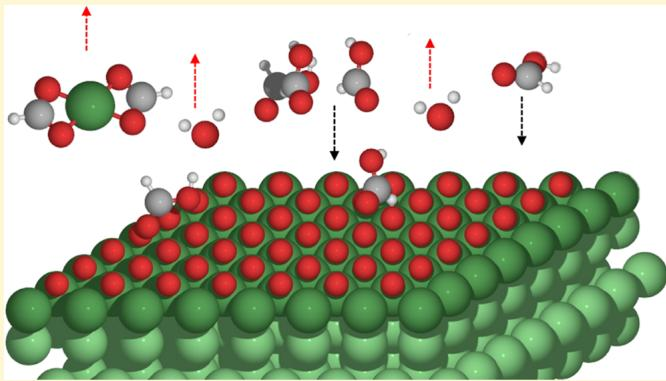
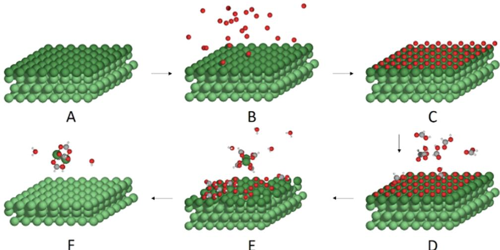
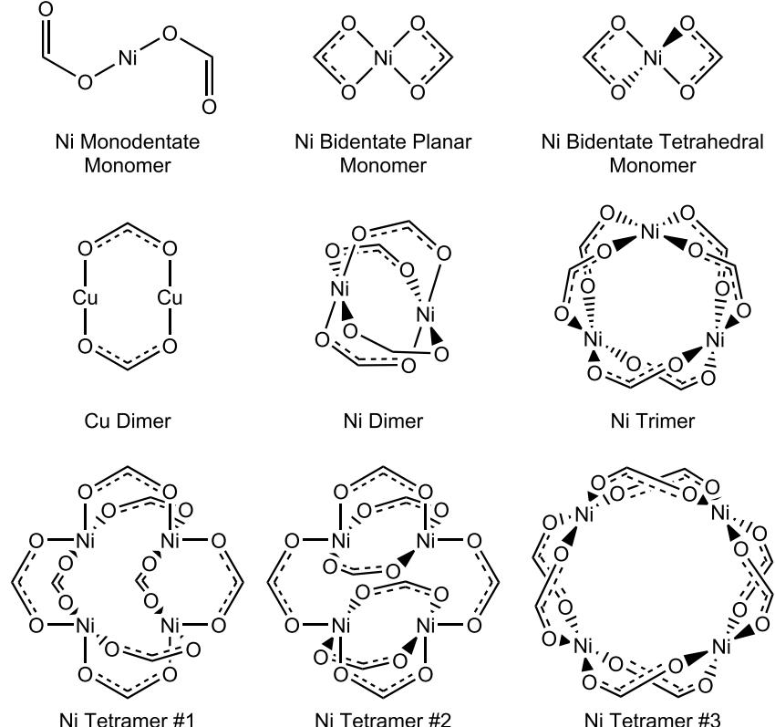
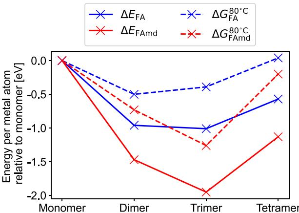
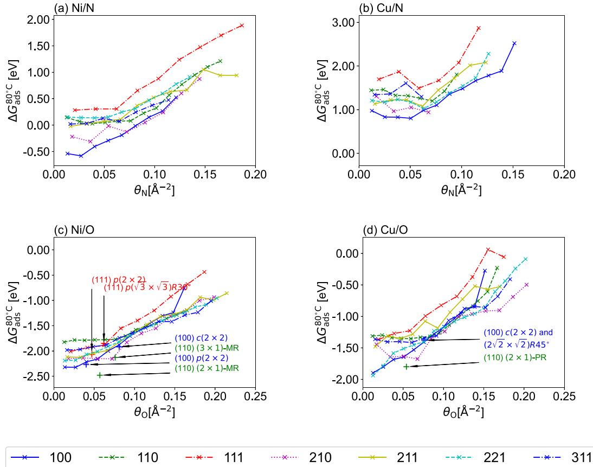
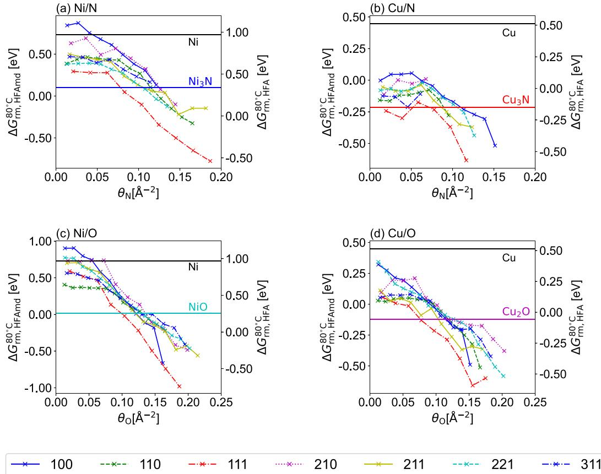
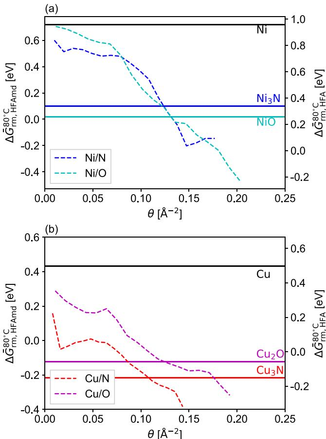

# Thermodynamics of Atomic Layer Etching Chemistry on Copper and Nickel Surfaces from First Principles

Yantao Xia* and Philippe Sautet*

Cite This: Chem. Mater. 2021, 33, 6774- 6786

# ACCESS

Metrics & More

Article Recommendations

Supporting Information

ABSTRACT: Plasma- thermal atomic layer etching is a promising technique to enable selective and directional etching on metals. It involves a plasma activation step and a thermal step where etchant molecules remove a fraction of the surface. To accelerate process development, a computational model for the thermodynamics of the thermal removal step is highly desirable. An energy expression is developed here to calculate the removal step energy for an activated slab structure. The approach samples the configurations of the activated metal surfaces and determines the thermodynamic balance of the removal step for each obtained configuration. The heterogeneity of the surface terminations is treated by the equilibrium crystal shape method. The models are put to test with combinations of two modifiers (O and N), two substrates (Cu and Ni), and two etchants (formic acid and formamidine). It is found that higher coverages of modifiers lead to more favorable etching. In addition, our results show that removal step energies vary among different terminations, with differences on the order of  $0.5\mathrm{eV}$  This suggests that etching can preferentially occur over certain crystal terminations. Qualitative agreement with the experiment on the  $\mathrm{Ni / O / }$  formic acid system is obtained with the layer model at high coverages of oxygen atoms.

# 1. INTRODUCTION

All solids terminate by a surface. As a result, surface processes are key for a vast array of applications. For the ultimate control of the composition and structure of surfaces, selective and accurate engineering methods at the nanometer/subnanometer scale are required. Whereas atomic layer deposition (ALD) enables the atomistic control of material addition, the reverse process of atomic layer etching (ALE) is not yet incorporated into mainstream industrial processes as it was considered too slow to be practical. However, continued feature- size scaling has made it apparent that for certain applications, precision rather than throughput is the bottleneck. Existing plasma etching techniques are fundamentally unable to fulfill this role as they all rely on inert ions as an energy source to some extent, yielding a poorly selective process with little control in thickness.

Atomic layer etching is itself an outgrowth of plasma etching. The process is composed of two self- limited steps. During the activation step, the top atomic layer(s) of the pristine surface are converted to another compound by the modifiers. The activation is limited by the surface compound formed, which blocks further reaction once all pristine surface atoms/sites are consumed/occupied. Next, during the removal step, etchant molecules are introduced that remove the surface compound. The removal stops as soon as the surface compound is consumed since the etchant molecules are selected such that they cannot etch the pristine surface. The cycle is repeated until the desired etch thickness is achieved. While the abstract concepts are the same, the actual processes demonstrated to date span a wide range of chemistries and conditions.

Metals lie on the frontier of integrated circuits in terms of the material choice since they offer many traits desirable for microelectronics integration, such as high electrical and thermal conductivities. This, in turn, necessitates new metal patterning techniques. Etching of metals is conventionally done in the solution phase by harsh chemicals. The random motion of etchant molecules implies that this process is inherently isotropic. To create an anisotropic process, modern patterning techniques exploit the directionality of ions in the plasma sheath. While plasma etching has been applied successfully to silicon- based materials, its application on metals is problematic since the metal species leaves the surface in the form of unstable, high- energy compounds that readily redeposit on the chamber walls and other parts of the wafer.

Recently, a novel process combining plasma activation and thermal removal was developed and successfully applied to directionally etch  $\mathrm{Ni}^{4,5}$  and Cu. This process is illustrated in

  
Figure 1. Plasma-thermal atomic layer etching process depicted here for the Ni/O/formic acid system. The metal surface (A) is first subjected to a plasma ion bombardment (B), forming a surface activation layer until saturation (C). Etchant molecules are then introduced (D) after the plasma has been switched off. The etchants adsorb dissociatively on the activated surface (E), etching the top layers by the formation of volatile metal complexes and water. The reaction stops when all of the modifier atoms are consumed, exposing the metal surface again (F).

Figure 1. An oxygen plasma is used to activate the metal surface (Figure 1A- 1C). The removal step (Figure 1D- 1F) is done with organic etchants that react with the surface oxide to form volatile complexes and water, eliminating the need for an extra energy source and avoiding redeposition. This new process, termed plasma- thermal ALE, is conceptually very similar to the thermal ALE process developed by George and co- workers. The main difference of plasma- thermal ALE lies in the activation step, where the oxidizing reagent is excited via a low- temperature plasma. Plasma imparts directionality to the process, enabling an anisotropic etching profile.

A recent review presents an excellent introduction to the large body of experimental and theoretical work on the similar thermal ALE process. A 2020 review for the various strategies to implement thermal ALE on different substrates is available as well. The existing thermal ALE processes on metal substrates require the oxidation of pristine metals by either oxygen  $\mathrm{O}_2$  and/or  $\mathrm{O}_3$  or halogens, followed by the introduction of diketone molecules to form volatile metal complexes. Existing studies center on a single process, using combinations of experimental and computational tools to propose a mechanism. These allow for the classification of existing ALE processes, and the rationalization can be generalized to other substrates, modifiers, and etchants to discover new processes. However, difficulties of in situ characterization of the surface and the low pressures of the products formed prevent direct confirmation of these mechanisms. These challenges also mean that the mechanisms lack atomistic detail, limiting their usefulness in understanding the chemistry and conditions that lead to a successful metal ALE process. For this purpose, a computational thermodynamic model of ALE is necessary.

One such model, the Natarajan- Elliott analysis (N- E analysis), provides great insight into the temperature dependence of the thermal ALE fluorination step. While it already improves on the previous work by supplementing the bulk reactions (converting bulk metal to bulk oxides and halides) with surface models at different coverages, the crystal termination and the coverages are chosen arbitrarily. As a result, the effects of surface morphology cannot be evaluated from these models. In addition, the N- E analysis is developed on the activation step. For plasma- thermal ALE, the activation step is achieved using energetic ions. The substrate temperature only plays a secondary role, as the postactivation surface is mostly determined by the kinetic energy of the ions.

On the other hand, for plasma- thermal ALE, the effects of surface morphology are highly relevant from a practical point of view. For instance, the current setup does not involve a self- limited oxidation reaction, as oxides of thicknesses on the order of  $\sim 5\mathrm{nm}$  are observed. A different modifier and/or ion energy in the plasma could potentially create a self- limited process that offers far more control. These drawbacks point to the need for a computational model to quickly determine the feasibility of proposed processes with new conditions and/or new chemistries. Ideally, given the specifications of substrates, modifiers, etchants, and relevant reaction conditions (temperatures, pressures, and ion energies), one should be able to predict, on a thermodynamic basis, whether an ALE process would be possible.

The present work attempts to provide a thermodynamic prediction for the removal step of plasma- thermal ALE processes. The layer model energy expression, the core of the model, allows the calculation of the removal step energy change from quantum chemical calculations on a slab structure. The activated surfaces, after interaction with the modifiers, are sampled with adsorption configuration search by the "greedy" algorithm. The etching products are determined computationally using literature data as input structures when available. The removal step energies on different terminations are combined via a weighted sum, with weights obtained via the equilibrium crystal shape construction. The combined approach results in a single- valued prediction for the removal step energies, based on the postplasma surface structure, modifier, and etchant. The model thus links the postactivation surface morphology to the removal step thermodynamics. We propose that this removal step energy can be used to evaluate and screen potential plasma- thermal atomic layer etching processes.

The systems chosen to test the models involve two metal substrates (Cu and Ni), two modifiers (O and N), and two etchants (formamidine (HFAmd) and formic acid (HFA)). Ni, O, and formic acid serve as the obvious choices for computational investigation since process viability is already demonstrated. Additional chemistries, involving Cu, N, and HFAmd,

  
Figure 2. Structures of the  $\mathrm{Ni}(\mathrm{II})$  and  $\mathrm{Cu(I)}$  complexes considered. Only the formates are shown. Respective formamidinates can be found by replacing oxygen atoms with secondary amine groups. The relative stabilities are shown in Figure 3. The dimer and tetramer structures are found to be the most stable for formate and formamidinate complexes, respectively. Oligomers are not investigated for  $\mathrm{Cu}$  (see page 9).

are chosen to find useful trends.  $\mathrm{Cu}$  is by far the most used metal in circuitry, mainly as an interconnect material. As features scale down, the existing process that couples additive patterning (damascene process) to chemical- mechanical polishing (CMP), developed to circumvent the inability to etch  $\mathrm{Cu}$ , is too harsh for the bottom layers on the interconnect. New, "gentle" etching approaches must be developed for this niche application.  $\mathrm{N}$  is chosen because a nitridation- based activation process more readily allows for ex situ surface characterization. Such characterization of oxidation- based process is difficult due to interference from ambient water during the vacuum break. The inclusion of formamidine is inspired by the success of the amidinate family of ligands in atomic layer deposition and by the fact that the removal step in plasma- thermal ALE is the reverse reaction.

As words of caution, the results here can only speak of thermodynamics. The reaction barriers are not considered. While we do not expect kinetic barriers to be significant in the activation step, in the removal step, the formation of the hydride and desorption of the formed complex might be activated. Existing data suggests that the desorption of the metal- organic complex is the limiting step and often high temperature is required to overcome the barrier. It is likely, however, that the magnitude of such barriers will depend to a significant extent on the surface morphology. The postplasma surface morphology is far from clear at this point, and we do not claim that the surface structure used here corresponds to the postplasma surface. In other words, the effect of kinetic energy of the ion is a missing link, deferred to a future study.

# 2. METHODS

The reactions studied are listed in reactions 1a- 3b. HL refers to a generic protonated etchant since formic acid and formamidine etchings have the same stoichiometry. The symbol indicates surface species, as in the Ni/Ni species for the Ni etching reaction (reaction 1a). The right part (INi) represents the surface atomic layer that is etched, and the left part (Nil) represents the subsurface part of the slab that is exposed after one full cycle. For the discussion below, the Ni/O/HFA system is used as our working example. The etching reactions on the pristine and activated surfaces are given, respectively, by reactions 1a and 2b, where the activated surface is modeled by a NiO slab. The "bulk model" expressions for the Gibbs free- energy change for the surface layer removal step are given in eqs 1 and 2, respectively. The nickel complexes have a range of nuclearities from monomers to tetramers. For simplicity, we refer to all of these molecules as  $\mathrm{Ni}(\mathrm{L})_2$ . The specific ligomer used will be clear from the context. The notation for  $\mathrm{Cu}$  complexes is not ambiguous since only the dimers are used (see page 9)

$$
\mathrm{NiNi + 2HL\rightarrow Ni + [Ni(L)_2] + H_2} \tag{1a}
$$

$$
\mathrm{CuICu + HL\rightarrow Cu + \frac{1}{2}[Cu_2(L)_2] + \frac{1}{2}H_2} \tag{1b}
$$

$$
\mathrm{Ni}_3\mathrm{N}\bigg|\frac{2}{3}\mathrm{Ni}_3\mathrm{N} + 2\mathrm{HL}\rightarrow [\mathrm{Ni}(\mathrm{L})_2] + \frac{2}{3}\mathrm{NH}_3 + \mathrm{Ni}_3\mathrm{N}\bigg|\mathrm{Ni} \tag{2a}
$$

$$
\mathrm{NiOINiO + 2HL\rightarrow NiOl + [Ni(L)_2] + H_2O} \tag{2b}
$$

$$
\mathrm{Cu}_3\mathrm{N}\bigg|\frac{1}{3}\mathrm{Cu}_3\mathrm{N} + \mathrm{HL}\rightarrow \mathrm{Cu}_3\mathrm{N}\bigg| + \frac{1}{2}\big[\mathrm{Cu}_2(\mathrm{L})_2\big] + \frac{1}{3}\mathrm{NH}_3 \tag{3a}
$$

$$
\mathrm{Cu}_2\mathrm{O}\bigg|\frac{1}{2}\mathrm{Cu}_2\mathrm{O} + \mathrm{HL}\rightarrow \mathrm{Cu}_2\mathrm{O}\bigg| + \frac{1}{2}\big[\mathrm{Cu}_2(\mathrm{L})_2\big] + \frac{1}{2}\mathrm{H}_2\mathrm{O}
$$

The plasma- thermal ALE process is made possible by a change of metal oxidation state during the activation step. Take our working example; metallic Ni is converted from  $\mathrm{Ni(0)}$  to  $\mathrm{Ni(II)}$  after activation. During the etching step, the  $\mathrm{Ni(II)}$  oxidation state is preserved. In the absence of activation, the change of oxidation state would occur during the etching, with Ni oxidizing to  $\mathrm{Ni(II)}$  and protons from etchant reducing to form  $\mathbf{H}_{2}$  . The same can be said of copper: Cu has an oxidation state of  $+1$  in both the activated surface and the product complex.

This brief consideration shows that the redox potential of the metal is a key factor for the practicality of plasma- metal ALE processes and, in general, any oxidation state- based metal etching processes. For both metals studied, we will show that the oxidation of the pristine surface with protons is highly unfavorable on both metals studied, a prerequisite for the self- limiting behavior observed

$$
\Delta G_{\mathrm{rm,Ni}} = [G_{\mathrm{[Ni(L)_2]}} + G_{\mathrm{H_2}} + G_{\mathrm{NiI}}] - [G_{\mathrm{Ni|Ni}} + 2G_{\mathrm{HL}}] \tag{1}
$$

$$
\Delta G_{\mathrm{rm,NiO}} = [G_{[\mathrm{Ni(L)}_2]} + G_{\mathrm{H_2O}} + G_{\mathrm{NiO}}] - [G_{\mathrm{NiO|NiO}} + 2G_{\mathrm{HL}}]
$$

The bulk model simplifies the problem by assuming that the same pristine nickel/nickel oxide surface is exposed after one cycle. Therefore, the surface formation energies are unchanged, and surface effects cancel out. For the pristine surface, the two surface terms cancel out to give the bulk formation energy

$$
G_{\mathrm{Ni}} - G_{\mathrm{Ni|Ni}} = -G_{\mathrm{Ni,bulk}}
$$

The bulk model further assumes that the activated surfaces are thick enough so that they can be approximated as a bulk oxide or nitride. Under this assumption, removing one atomic layer from the activated surface is equivalent to removing one layer from the bulk oxide/nitride lattice, energetically corresponding to the Gibbs free energy of formation of bulk oxide or nitride

$$
\begin{array}{rl} & G_{\mathrm{NiO}} - G_{\mathrm{NiO|NiO}} = -G_{\mathrm{NiO,bulk}}\\ & G_{\mathrm{Ni_3Ni}} - G_{\mathrm{Ni_3Ni_3N}} = -G_{\mathrm{Ni_3N,bulk}} \end{array}
$$

The energy expression of the bulk model is given in eqs 3 and 4 for etching on pristine and activated Ni systems. Note that this model avoids any calculation of surface species and hence can be applied easily. However, since the bulk oxide or nitride structure is assumed, this model cannot be applied to processes where only a thin surface activation layer is expected. For such processes, the layer model would be more appropriate

$$
\begin{array}{rl} & {\Delta G_{\mathrm{rm,Ni}} = G_{[\mathrm{Ni(L)}_2]} + G_{\mathrm{H_2}} - 2G_{\mathrm{HL}} - G_{\mathrm{Ni,bulk}}}\\ & {\Delta G_{\mathrm{rm,NiO}} = G_{[\mathrm{Ni(L)}_2]} + G_{\mathrm{H_2O}} - 2G_{\mathrm{HL}} - G_{\mathrm{NiO,bulk}}} \end{array} \tag{3}
$$

The structures and energies of the bulk crystals used are detailed in the Supplementary Information (SI) Table S1. The molecular structures of the metal formate complexes considered are shown in Figure 2. The corresponding formamidinate complexes are trivially found by replacing oxygen atoms with secondary amine groups. These structures are selected by a combination of experimental15- 23 and simulated results. X- ray diffraction spectroscopy on a range of copper(I) amidinates of the formula  $\mathrm{[R^{\prime}NC(R)NR^{\prime\prime}Cu]_{2}}$ $\mathbb{R}^{\prime}$  and  $\mathbb{R}^{\prime \prime} = n$  - propyl, isopropyl,  $n$  - butyl, isobutyl, sec- butyl, tert- butyl;  $\mathbb{R} =$  methyl,  $n$  - butyl) in the solid phase suggests a planar dimer structure.15 Early mass spectroscopy suggests that the Cu formate dimerizes in the vapor phase.21,22 Although no direct structural determination exists for the formate complex, the related copper acetate complex is shown to crystallize in the  $P2_{1} / m$  space group as infinite sheets of 8- membered rings.23 The high saturation pressure of the complex22 suggests that there is little structural difference between the vapor and solid phases of the copper acetate complex. Taking a clue from these, the copper(I) complexes are taken to be a dimer structure that forms an 8- membered ring containing  $2\mathrm{Cu}$  atoms. The nickel complexes (written as  $\mathrm{Ni(L)}_2$  for simplicity by factoring out the nuclearity) have extended covalent bonds in the solid phase; hence, their gas- phase structures have been searched by constructing different structures and comparing their stabilities. The structures of the determined complexes are shown in Figure 2.

The layer model accounts for the effects of surface termination and coverage, defined as the area density of modifier atoms. Here, the stoichiometry is allowed to differ from that of the bulk model. The postetch surfaces are assumed to terminate in the same orientation as the preactivation surfaces. A full- layer removal is still desirable since it allows the explicit consideration of the postremoval surface to be avoided. As a result, the postetch surface is assumed to be modifier- free. The energies of dimers, trimers, and tetramers of the nickel complex are normalized to the monomer formula unit for use in eqs 3 and 4.

Suppose, for instance, that the modifier coverage after activation is less than that specified by reaction 2b for the  $\mathrm{Ni / O / }$  formic acid system. Since the reaction is constrained to proceed at the stoichiometry, such "insufficient" coverages would result in an incomplete etching of the surface layer, with Ni islands remaining at the termination of the etching process because the pristine surface cannot be etched by the etchant (see Section 4.2). To account for this, the surface oxide is multiplied by a factor so that just enough oxygen atoms are present in the balance  $(\frac{x}{y} \times y = x \mathrm{O}$  atoms) to satisfy the stoichiometry required for the etching of  $x\mathrm{Ni}$  atoms\[ \begin{array}{l}\frac{x}{y} \mathrm{Ni}_s \mathrm{Ni}_x \mathrm{O}_y + 2x \mathrm{HL} \\ \rightarrow \mathrm{Ni}_s \mathrm{Ni}_0 \mathrm{O}_0 + \left(\frac{x}{y} - 1\right) \mathrm{Ni}_s \mathrm{Ni}_x \mathrm{O}_0 + x \mathrm{NiL}_2 + x \mathrm{H}_2 \mathrm{O} \end{array} \]

The extra  $(x / y - 1)$  activated nickel slabs that are brought into the reaction balance only serve to contribute the oxygen atoms. The unetched metal atoms correspond to the islands that remain on the surface after etching (one layer higher than the etched regions). s and x refer to the structure models used, with s denoting the total number of metal atoms in the unactivated layers of the slab and  $x$  denoting the number of metal atoms per layer. Hence,  $\mathrm{Ni}_s \mathrm{Ni}_0$  and  $\mathrm{Ni}_s \mathrm{Ni}_x$  are the slab models differing by one layer in vertical thickness. See the next paragraph for more details. The coefficients in reaction 4 and factors of Gibbs free energies in eq 6 would depend on the substrate/modifier/ etchant combination. The molecular terms follow directly from the bulk model reaction. The reaction energy normalized to one Ni atom removed is expressed in eq 6

$$
\begin{array}{r}\Delta G_{\mathrm{rm,layer}} = \frac{1}{x}\Bigg\{\Bigg[G_{\mathrm{Ni_l}} + \bigg(\frac{x}{y} -1\bigg)G_{\mathrm{Ni|Ni_x}} + xG_{[\mathrm{Ni(L)}_2]} + xG_{\mathrm{H_2O}}\Bigg]\\ -\bigg[\frac{x}{y} G_{\mathrm{Ni_j|Ni_xO_y}} + 2xG_{\mathrm{HL}}\bigg]\Bigg\} \end{array} \tag{3}
$$

In the subscripts, following the convention so forth in eqs 1 and 2, the species on the left and right of the symbol | refer to the unactivated atomic layers and the activated layers, respectively. The meanings of  $\mathrm{Ni}_s$  and  $\mathrm{Ni}_x$  are already explained above.  $\mathrm{Ni}_x \mathrm{O}_y$  refers to the slab activated by  $y$  oxygen modifier atoms. The molecular terms are self- explanatory, and the same values are used as in the bulk model. The terms in eq 6 can be regrouped to yield eq 1 in which the three terms can be assigned physical meanings: the first term on the left  $(1 / x [G_{\mathrm{Ni_l}} - G_{\mathrm{Ni_lNi_x}}])$  differs only in the number of layers included in the slab model and can be replaced by  $- \mu_{\mathrm{Ni_{i,bulk}}}$  if the surface formation energy (eq 11) is converged with respect to the number of layers. The second term  $(1 / y [G_{\mathrm{Ni_lNi_xO_y}} - G_{\mathrm{Ni_lNi_x}}])$  corresponds to the energy of the modified surface per modifier (eq S2) to a constant term. The third term  $\left([G_{[\mathrm{Ni(L)}_2]} + G_{\mathrm{H_2O}} - 2G_{\mathrm{HL}}\right]$  describes the bond breaking and formation of the etchant, hydride, and metal complex. For a given substrate/modifier/etchant combination, the first and last terms are constants. The information about activation (ion species, coverage, etc.) is expressed through the second term only and hence decoupled from that of the etchant. It is

shown that the number of atoms  $(x)$  is canceled out, and there is no need to specify the number of atoms per layer

$$
\begin{array}{r}\Delta G_{\mathrm{rm,layer}} = \frac{1}{x} [G_{\mathrm{Ni}_i} - G_{\mathrm{Ni}_i|\mathrm{Ni}_x}] - \frac{1}{y} [G_{\mathrm{Ni}_i,\mathrm{Ni}_x,\mathrm{O}_y} - G_{\mathrm{Ni}_i|\mathrm{Ni}_x}]\\ +[G_{[\mathrm{Ni}(\mathrm{L})_2]} + G_{\mathrm{H}_2\mathrm{O}} - 2G_{\mathrm{HL}}] \end{array} \tag{7}
$$

While the layer models are derived for the case of a deficient modifier coverage (less than the bulk model reaction stoichiometry), there is no limit on the applicability since the number of metal atoms per layer does not appear in the energy expression. In fact, the layer model reduces to the bulk model if the same assumptions are reimposed. In eq 7, the molecular term is the same as that in the bulk model. In the case of bulk  $\mathrm{NiO}, x = y$ , therefore, the left two terms can be rewritten as

$$
\frac{1}{x} [G_{\mathrm{Ni}_i} - G_{\mathrm{Ni}_i|\mathrm{Ni}_x}] - \frac{1}{y} [G_{\mathrm{Ni}_i,\mathrm{Ni}_x,\mathrm{O}_y} - G_{\mathrm{Ni}_i|\mathrm{Ni}_x}] = \frac{1}{x} [G_{\mathrm{Ni}_i} - G_{\mathrm{Ni}_i,\mathrm{Ni}_x,\mathrm{O}_y}]
$$

Since the activation layer is assumed to take the form of the bulk oxide

$$
G_{\mathrm{Ni}_i|\mathrm{Ni}_x\mathrm{O}_x}\approx G_{\mathrm{Ni}_i|(\mathrm{NiO})_x}
$$

following the bulk model, we assume a thick oxide layer so that the interface and surface formation energies are negligible compared with the energy to etch

$$
\frac{1}{x} [G_{\mathrm{Ni}_i} - G_{\mathrm{Ni}_i|(\mathrm{NiO})_x}]\approx -G_{\mathrm{NiO,bulk}}
$$

and the bulk model energy expression is recovered immediately by adding back the molecular term. Unfortunately, the bulk model on the pristine surface is not recovered at low coverages with the layer model since it is restricted to hydride formation, while the pristine surface bulk model forms  $\mathrm{H}_2$  molecules. It may suggest that the layer model is more applicable at significant coverages. However, this aspect was not pursued.

The configurations of the adsorbates are obtained by a greedy- search algorithm that proceeds iteratively. At every iteration, one adsorbate is added to each available adsorption site, forming a pool of candidate structures for the next round. The adsorption sites themselves are determined by symmetry on the primitive pristine surface unit cell: every unique atom defines a top site, every unique pair of atoms defines a bridge site, etc. The supercell is not varied. Figure S2 gives the supercell used and the adsorption sites. Each candidate is then fully relaxed, and the most stable candidate is selected to enter the next round. Figures S7- S10 give the structures of the selected candidates at every round. The configuration search determines a unique configuration for every termination at discrete coverages. The method adopted here is a static one, the effect of finite temperature is included in the entropy contribution to the free energy obtained via calculation of the surface phonon frequencies. A full computational treatment of the temperature effect on activation, requiring dynamic calculations (e.g., as molecular dynamics simulation of ion impact), is outside our scope.

While the energy expression determines the reaction energy normalized to one Ni atom removed  $(\Delta G_{\mathrm{rm}})$  for a given termination, the results for different terminations span a large range of values at any coverage. As a descriptor for process feasibility, a single- valued prediction is desirable. To minimize the experimental input required, a weighted average of the per- termination etching energies is calculated, with weights given by the equilibrium crystal shape construction (ECS) (eq 8). The Wulff construction is applied to the activated surfaces so that more stable structures with a low surface formation energy are preferred over less stable ones and assigned a larger weight  $(a^i)$

$$
\Delta \bar{G}_{\mathrm{rm}} = \sum_{i\in \{(100),(110),\ldots \}}a^{i}\Delta G_{\mathrm{rm}}^{i} \tag{8}
$$

The determination of  $a^i$  requires the surface energies, which, in turn, depend on the modifier coverage, the chemical potential of the modifier, and the substrate. Thermodynamically, the substrate is connected to a large reservoir of pristine atoms, hence (e.g., for Ni)

$$
\begin{array}{rl} & {\mu_{\mathrm{Ni}} = G_{t,\mathrm{Ni}}}\\ & {\quad = \mathrm{Gibbs~free~energy~of~formation~of~fcc~Ni~bulk,~per~Ni~atom}} \end{array}
$$

The chemical potential of the modifier is difficult to determine confidently due to the various excited species present. Plasma diagnostics or simulation of ion energy distributions (IEDs) is not attempted. Instead, the assumption of surface- plasma equilibrium allows us to indirectly determine the chemical potential through the simulated modifier coverage (area density). At the coverage observed (the coverage that self- limited adsorption stops at), no termination should have a positive adsorption energy. The chemical potential of the modifier is thus chosen to be the minimum required to set the adsorption free energy of all terminations greater than or equal to 0, leading to a modifier chemical potential as a function of coverage (eq 10)

$$
\mu_{\mathrm{O}}(\theta_{\mathrm{O}}) = \min_{i\in \{(100),(110),\ldots \}}\frac{G_{\mathrm{Ni}_i,\mathrm{Ni}_x,\mathrm{O}_y}^i(\theta_{\mathrm{O}}) - G_{\mathrm{Ni}_i,\mathrm{Ni}_x}^i}{\gamma} \tag{10}
$$

In effect, we have substituted the chemical potential, the usual control parameter for reaction thermodynamics, with the experimentally observable parameter of modifier area density (coverage). The surface energies can be calculated by eq 11, where  $\gamma_{\mathrm{Ni}}^i$  represents the surface energy of the pristine substrate (needed to correct for the bottom pristine surface exposed in asymmetric slab structures), and  $s$  is the number of metal atoms in the pristine substrate. The resulting surface energies are shown in Figure S5. The set of surface energies for a given coverage now allows Wulff construction to be performed, which minimizes the total surface energy of exposed terminations on crystal grains constrained by a fixed volume. The fractions  $(a^i)$  resulting from the minimization (see Figure S6) are used as weights for averaging the per- termination removal step energies.

The rationale behind using Wulff construction is that terminations more favorable to etching are also less stable and hence may be present in less significant fractions in the ensemble. Admittedly, the ECS method is not entirely consistent with our process since it minimizes the total surface energy subject to a fixed grain volume, whereas the surface faceting behavior is limited by a fixed cross- sectional area. Hence, we do not claim that our ECS- based model accurately describes the microfaceting that might occur in response to adsorbate coverage changes. Solving the cross- sectional area- constrained minimization problem is outside the scope of the present work, and the ECS method is adopted as a physics- inspired way to systematically assign the weights. Nor do we claim that microfaceting reconstruction will occur at our target process temperatures. The inspiration came from the transient heat spikes present locally near the ion impact region during the plasma oxidation, which can temporarily bring the local temperature close to the melting point. Nevertheless, the ECS is an ad hoc addition to the model to allow for calculation of single- valued etching energies that can be more readily compared between different proposed ALE processes. Since the per- termination removal step energies are independent of this assumption, when more reliable information on the surface is available (e.g., via the crystal orientation distribution function from X- ray diffraction), the weights can be substituted in

$$
\gamma_{\mathrm{Ni}_i,\mathrm{Ni}_x,\mathrm{O}_y}^i = [G_{\mathrm{Ni}_i,\mathrm{Ni}_x,\mathrm{O}_y}^i -(x + s)\mu_{\mathrm{Ni}} - \gamma \mu_{\mathrm{O}}] / A_0 - \gamma_{\mathrm{Ni}}^i \tag{11}
$$

# 3. COMPUTATIONAL DETAILS

All electronic energy calculations are performed with density functional theory (DFT), as implemented in the Vienna ab initio simulation package (VASP). The electron- ion interactions are treated using the projector- augmented wave (PAW) method, and the valence one- electron functions are developed on a basis set of plane waves. The PBE exchange- correlation functional is used throughout. The van der Waals correction to the PBE functional was tested, for example, with the DFT- dDsC

method,29,30 but not applied due to the overestimated bulk formation energies (see section "Validation of Computational Methods" in the Supporting Information). The bulk crystal parameters are obtained starting from their experimental values31- 34 by a two- step direct volume relaxation. The configuration search is done in two steps, where a reasonably crude but fast computational setup is used to relax all candidate structures and a slow but accurate setup is used for single- point calculations of the most stable structures. The two setups differ in the Monkhorst- Pack K- space sampling density with the  $3\times 3$ $\times 1$  versus  $5\times 5\times 1$  mesh and a plane- wave cutoff  $300~\mathrm{eV}$  versus  $400\mathrm{eV}$  ). The relaxed structure and the relative stability of each adsorption site do not change with respect to these parameters. All other parameters are identical. Energies are converged to  $10^{- 6}\mathrm{eV}$  . Forces are converged to  $0.02\mathrm{eV / \AA}$  For the molecules, the plane- wave cutoff is maintained at  $400\mathrm{eV}$

For the Gaussian3 calculations on the gas- phase molecules, the PBE functional and the triple- zeta split valence basis set of Ahlrichs et al. (def- TZVP)36 were used. Geometric structures were converged, with forces converged to  $1.5\times 10^{- 5}$  Hartree/ Bohr, and displacement were converged to  $6\times 10^{- 5}$  Bohr on an "ultrafine" grid. These calculations were only used for confirming the relative stabilities, and the resulting energies were not used in the reported data.

Free energies reported include translational, rotational, and vibrational contributions to the entropy whenever appropriate. The phonons of the bulk systems are calculated with density functional perturbation theory (DFPT).37 The surface vibrational frequencies are calculated for the  $\Gamma$  point only with the bottom two layers frozen. The many degrees of freedom prevented the practical use of a more accurate setup. The vibrational analysis for molecules is also performed with finite difference, with a step size of  $0.015\mathrm{\AA}$  Soft vibrational modes (resulting from the internal rotations of the  $\mathrm{Ni(II)}$  complexes) with frequencies smaller than  $100~\mathrm{cm^{- 1}}$  are shifted to the threshold value. Performing this shift resulted in a change in removal step energy on the order of  $0.01 - 0.03\mathrm{eV}$  depending on the etching chemistry (HFA vs HFAmd) and the coverage. The free energies are evaluated at  $80^{\circ}C$  throughout the paper. The pressures are estimated according to the fluxes in the experiment (see eq S1).

The Wulffpack package is used in obtaining the evolution of surface termination distribution38 with respect to the modifier coverage  $\theta$  . Since the adsorbates are added to substrates with finite area, the available coverages are discrete. The discrete data set is interpolated linearly to yield a continuous  $\gamma - \theta$  curve, which is then used to perform the Wulff construction. At high coverages, terminations that saturate below a given coverage are not considered and are removed from the Wulff construction calculations (i.e., no extrapolation is performed).

# 4.RESULTS AND DISCUSSION

4.1. Formate and Formamidinate Complexes of Ni and Cu. The energetics of the nickel complexes simulated are shown in Figure 3. For the monomer case, three structures (monodentate, bidentate planar, bidentate tetrahedral) are searched and the bidentate planar is found to be the most stable. Our results contradict an earlier study17,39 that suggested tetrahedral being more stable. We confirmed the trend by performing atomic basis set calculations in Gaussian35 (see Section 3). Dimers, trimers, and tetramers of various configurations are built and compared. Three tetramers are built (Figure 2), and only the most stable structures' energies are

  
Figure 3. Electronic potential energies  $(\Delta E)$  and Gibbs free energies  $(\Delta G^{80^{\circ}C})$  of nickel formate  $\left(\mathrm{Ni}(\mathrm{FA})_{2}\right)$  and formamidinate (Ni $\left(\mathrm{FAmd}\right)_2)$  oligomer (olig.) complexes relative to the monomer (mono.) complex. Energy differences are normalized by nuclearity (nucl.) for comparison on a per-metal atom basis.

plotted in Figure 3. For the dimers, trimers, and tetramer #3, the chelation angles are the same as the tetrahedral monomer. The bonds from the metal center to the ligand atoms are progressively elongated with respect to the nuclearity to accommodate more ligands. The formate and formamidinate complexes follow the same pattern, although the metal- nitrogen bonds in amidinate complexes are slightly longer than the corresponding metal- oxygen bonds in formate complexes, presumably due to steric repulsion among the amine groups. By the Gibbs free energy, the most stable formate complex is the dimer, and the most stable formamidinate complex is the trimer. Since thermodynamics cannot preclude kinetic barriers that may prevent the formation of these large complexes, the main results are recalculated with the monomer complex as the product in Figures S11 and S12.

4.2. Bulk Model. The results from the bulk model on the pristine  $(\Delta G_{\mathrm{rm,pris}})$  and activated  $(\Delta G_{\mathrm{rm,act}})$  substrates are shown in Tables 1 and 2, respectively.

Table 1. Gibbs Free Energy of the Removal Step Reactions (Reactions 1a and 1b) on Pristine Substrates from the Bulk Model  $(\Delta G_{\mathrm{rm,pris}}^{\mathrm{80^{\circ}C}}$  eq 1)  

<table><tr><td>substrate</td><td>etchant</td><td>ΔG80°C
1,00</td></tr><tr><td>Ni</td><td>HFA</td><td>0.00</td></tr><tr><td>Ni</td><td>HFAmd</td><td>0.76</td></tr><tr><td>Cu</td><td>HFA</td><td>0.50</td></tr><tr><td>Cu</td><td>HFAmd</td><td>0.44</td></tr></table>

"The energy values are normalized to one metal atom etched.

Both Ni and Cu in their pristine forms are found to resist etching by HFA and HFAmd due to the large positive values of  $\Delta G_{\mathrm{rm,pris}}$  making self- limited reactions possible. The results on bare metal substrates involving HFAmd are expected since substituted derivatives of the formamidinate complex are used to deposit Cu and Ni in atomic layer deposition (ALD).15 The reducing agent used is  $\mathrm{H}_2;$  hence, the ALD reaction is the exact reversal of the ALE reaction. Overall, Ni has a higher (more unfavorable) removal step energy than Cu for the pristine surface.

The results on activated surfaces show a sharp contrast between Cu and Ni. Throughout the text, the units for reaction

Table 2. Gibbs Free Energy of the Removal Step on Activated Substrates (Reactions 2a-3b) from the Bulk Model  $(\Delta G_{\mathrm{rm,act}}^{80^{\circ}\mathrm{C}};$  eq 2)a  

<table><tr><td>substrate</td><td>modifier</td><td>etchant</td><td>ΔG80°C [eV]</td></tr><tr><td>Ni</td><td>N</td><td>HFA</td><td>0.34</td></tr><tr><td>Ni</td><td>N</td><td>HFAmd</td><td>0.10</td></tr><tr><td>Ni</td><td>O</td><td>HFA</td><td>0.26</td></tr><tr><td>Ni</td><td>O</td><td>HFAmd</td><td>0.02</td></tr><tr><td>Cu</td><td>N</td><td>HFA</td><td>-0.15</td></tr><tr><td>Cu</td><td>N</td><td>HFAmd</td><td>-0.22</td></tr><tr><td>Cu</td><td>O</td><td>HFA</td><td>-0.06</td></tr><tr><td>Cu</td><td>O</td><td>HFAmd</td><td>-0.12</td></tr></table>

The energy values are normalized to one metal atom etched.

energies are eV per- metal atom etched, unless otherwise stated. All four modifier and etchant combinations give a slightly favorable (negative) removal step energy on  $\mathrm{Cu},$  whereas, on  $\mathrm{Ni},$  the same four combinations are unfavorable (positive). The calculated  $\Delta G_{\mathrm{rm,act}}$  is  $0.10\mathrm{eV}$  for the HFAmd etching of  $\mathrm{Ni}_3\mathrm{N},$  which is consistent with the reports of  $\mathrm{Ni}_3\mathrm{N}$  deposition using amidinate complexes of nickel (which can be subsequently reduced by  $\mathrm{H}_{2}$  to give Ni films), although the ligands in the report are heavily substituted.40 We highlight the fact that etching O- activated Ni with formic acid is predicted to be unfavorable by  $0.26\mathrm{eV},$  inconsistent with the experimentally observed etching.41

The bulk model results suggest that formamidine etching is preferable compared to formic acid by 0.24 and  $0.07\mathrm{eV},$  respectively, on Ni and Cu. The differences between oxygen and nitrogen activation  $(0.08\mathrm{eV}$  favoring oxygen on Ni,  $0.09\mathrm{eV}$  favoring nitrogen on  $\mathrm{Cu},$  are not significant.

To better understand the trend, energy decomposition is performed. The decomposed reactions (reactions  $5a - 6b$  on the pristine surfaces separate the influence of the metal substrate from that of the etchant. In Table 3, it can be seen that it is more

Table 3. Energy Decomposition of Bulk Model on Pristine Surfaces  

<table><tr><td>substrate</td><td>etchant</td><td>ΔG80°C [eV]</td><td>ΔG80°C [eV]</td></tr><tr><td>Ni</td><td>HFA</td><td>+4.19</td><td>-3.23</td></tr><tr><td>Ni</td><td>HFAmd</td><td>+4.19</td><td>-3.47</td></tr><tr><td>Cu</td><td>HFA</td><td>+3.05</td><td>-2.55</td></tr><tr><td>Cu</td><td>HFAmd</td><td>+3.05</td><td>-2.62</td></tr></table>

aSteps a and b correspond to the labels in reactions  $5a - 6b$  and refer to bulk metal evaporating and complex/  $\mathrm{H}_{2}$  formation, respectively. The energy values are normalized to one metal atom etched.

costly to atomize Ni than Cu, yet Ni binds the complexes more strongly. The two effects cancel somewhat, and the overall result is that Ni is less favorable to etch. A similar conclusion can be drawn from the energy decomposition of the activated substrates (reactions  $7a - 10b$  where the activation with nitrogen or oxygen is separated from the binding of the metal to the complexes and the formation of hydrides. Table 4 shows the results. First, note that the oxides are thermally stable with respect to  $\mathrm{O}_2,$  while the nitrides are not stable with respect to  $\mathbf{N}_2$  - Second, activation with both N and O are more favorable on  $\mathrm{Ni}$  e.g.,by comparing  $\mathrm{Ni / N / FA}$  and  $\mathrm{Cu / N / FA},$  reaction a relative to  $\mathrm{Cu}_i$  effectively stabilizing the Ni metal. Since the relative difference on the b reactions for each set are the same as that of the pristine metal (which already indicates that pristine

Table 4. Energy Decomposition of Bulk Model on Activated Surfaces  

<table><tr><td>substrate</td><td>modifier</td><td>etchant</td><td>ΔG80°C [eV]</td><td>ΔG80°C [eV]</td></tr><tr><td>Ni</td><td>N</td><td>HFA</td><td>-0.37</td><td>+0.71</td></tr><tr><td>Ni</td><td>N</td><td>HFAmd</td><td>-0.37</td><td>+0.47</td></tr><tr><td>Ni</td><td>O</td><td>HFA</td><td>+1.45</td><td>-1.19</td></tr><tr><td>Ni</td><td>O</td><td>HFAmd</td><td>+1.45</td><td>-1.43</td></tr><tr><td>Cu</td><td>N</td><td>HFA</td><td>10S2</td><td>+0.37</td></tr><tr><td>Cu</td><td>N</td><td>HFAmd</td><td>-0.52</td><td>+0.31</td></tr><tr><td>Cu</td><td>O</td><td>HFA</td><td>+0.52</td><td>-0.58</td></tr><tr><td>Cu</td><td>O</td><td>HFAmd</td><td>+0.52</td><td>-0.64</td></tr></table>

aSteps a and b correspond to the labels in reactions  $7a - 10b$  and refer to the reverse of oxidation/nitridation (modifier desorption) and complex/hydride formation, respectively. The energy values are normalized to one metal atom etched.

Cu is more favorable to etch), this further stabilization makes the nickel nitride less favorable to etch compared with  $\mathrm{Cu}_3\mathrm{N}$  The same can be said of the oxides, hence giving the global qualitative difference between Ni and Cu, Ni being harder to etch.

The role of oxidation states can be seen clearly in the data. The fact that reaction 8a on NiO is  $0.93\mathrm{eV}$  less favorable than reaction 10a on  $\mathrm{Cu}_2\mathrm{O}$  can be partially attributed to the difference in the oxidation state change. This is evident since the difference for the nitrides, between reaction 7a on  $\mathrm{Ni}_3\mathrm{N}$  and reaction 9a on  $\mathrm{Cu}_3\mathrm{N},$  is only  $0.15\mathrm{eV},$  much smaller compared with that on the oxides.

On the other hand, note that the decomposed reactions cannot be used to compare  $\mathbb{N}$  and  $\mathrm{o}$  activation e.g,by comparing reactions  $7a$  to 8a),as the reference points to  $\mathbb{N}_2$  and  $\mathrm{O}_2$  are arbitrary and they bear no significance for the actual plasma activation process. The decomposed reactions obviously do not correspond to the actual reaction mechanisms, and their sole purpose here is to separate the influences of the substrate, the modifier, and the ligand on a thermodynamic level

$$
\mathrm{Ni(bulk)}\rightarrow \mathrm{Ni(atom)} \tag{5a}
$$

$$
\mathrm{Ni(atom)} + 2\mathrm{HL}\rightarrow [\mathrm{NiL}_2] + \mathrm{H}_2 \tag{5b}
$$

$$
\mathrm{Cu(bulk)}\rightarrow \mathrm{Cu(atom)} \tag{6a}
$$

$$
\mathrm{Cu(atom)} + \mathrm{HL}\rightarrow 1 / 2[\mathrm{Cu}_2\mathrm{L}_2] + \frac{1}{2}\mathrm{H}_2 \tag{6b}
$$

$$
\frac{2}{3}\mathrm{Ni}_3\mathrm{N}\rightarrow 2\mathrm{Ni}(\mathrm{bulk}) + \frac{1}{3}\mathrm{N}_2 \tag{7a}
$$

$$
\begin{array}{l}{2\mathrm{Ni(bulk)} + \frac{1}{3}\mathrm{N}_2 + 2\mathrm{HL}}\\ {\rightarrow [\mathrm{NiL}_2] + \frac{2}{3}\mathrm{NH}_3 + \mathrm{Ni(bulk)}} \end{array} \tag{7b}
$$

$$
\mathrm{NiO}\rightarrow \mathrm{Ni(bulk)} + \frac{1}{2}\mathrm{O}_2 \tag{8a}
$$

$$
\mathrm{Ni(bulk)} + 2\mathrm{HL} + \frac{1}{2}\mathrm{O}_2\rightarrow [\mathrm{NiL}_2] + \mathrm{H}_2\mathrm{O} \tag{8b}
$$

$$
\frac{1}{3}\mathrm{Cu}_3\mathrm{N}\rightarrow \mathrm{Cu(bulk)} + \frac{1}{6}\mathrm{N}_2 \tag{9a}
$$

$$
\mathrm{Cu(bulk)} + \mathrm{HL} + \frac{1}{6}\mathrm{N}_2\rightarrow \frac{1}{2} [\mathrm{Cu}_2\mathrm{L}_2] + \frac{1}{3}\mathrm{NH}_3 \tag{9b}
$$

  
Figure 4. Adsorption energies of different terminations of the  $\mathrm{Ni / N}$ ,  $\mathrm{Cu / N}$ ,  $\mathrm{Ni / O}$ , and  $\mathrm{Cu / O}$  systems as a function of coverage. The labels "PR" and "MP" represent the "pairing row" and "missing row" reconstructions of the (110) surfaces, respectively.

$$
\frac{1}{2}\mathrm{Cu}_2\mathrm{O}\rightarrow \mathrm{Cu(bulk)} + \frac{1}{4}\mathrm{O}_2 \tag{10a}
$$

$$
\mathrm{Cu(bulk)} + \mathrm{HL} + \frac{1}{4}\mathrm{O}_2\rightarrow \frac{1}{2} [\mathrm{Cu}_2\mathrm{L}_2] + \frac{1}{2}\mathrm{H}_2\mathrm{O} \tag{10b}
$$

4.3. Layer Model: Per Termination. The fact that HFA is able to etch nickel films activated with oxygen plasma suggests that the substrate resulting from the plasma activation could be quite different from the bulk nickel oxide. The predicted unfavorable Gibbs free energy for the removal step of  $0.26\mathrm{eV}$  is significant enough to conclude that the bulk model is inadequate to offer qualitatively correct predictions for the plasma- activated surface. While the bulk model lacks the flexibility to account for the variety of surface structures since it is limited to the few known bulk lattices, its simplicity makes it useful as a reference and sanity check for the more sophisticated layer model.

The layer model energy expression given in eq 7 relies on the adsorption energy as the central coverage- dependent term. As adsorption energy is the more established metric to quantify the adsorbate- surface interaction, we discuss our sampling of the surface structures in terms of it. The adsorption energies of the structures picked by the configuration search are shown in Figure 4. The reference points are arbitrarily chosen to be gas- phase  $\mathrm{O}_2$  and  $\mathrm{N}_2$  for  $\mathrm{O}$  and  $\mathrm{N}$  adsorptions, respectively. This choice does not affect the rest of the model. The general trend in all four combinations is that the adsorption energies tend to increase (become less favorable) with increasing coverage as the more favorable sites are preferentially occupied by our algorithm. The lateral repulsion among adsorbates at high coverages also makes the high- coverage configurations less favorable. However, on the  $\mathrm{Cu / N}$  system, the trend is not completely followed. In Figure 4, around  $0.06\mathrm{\AA}^{- 2}$ , all adsorption energies on all terminations except (110) decreased to form a "dip". This is explained by referring back to the structures shown in Figure S8. On the  $\mathrm{Cu}(111)$  termination, the most significant "dip" occurred between structures with 2 and 3 nitrogen atom adsorbates. On the 3- adsorbate structure, the surface in the vicinity of one of the adsorbed nitrogen atoms relaxed into a square pseudo- (100) structure, as previously reported both experimentally and computationally. The 4- adsorbate structure has two adsorbates forming the pseudo- (100) structure. Eventually, the increasing trend resumed due to the interadsorbate repulsion as the adsorbates become closer. It also explains why the "dip" is not observed on the (100) termination. The (211) and (221) terminations follow a similar trend due to the large (111) terraces present.

The adsorption energy of nitrogen is  $\sim 1.5\mathrm{eV}$  less favorable on  $\mathrm{Cu}$  than  $\mathrm{Ni}$ , while oxygen adsorption is  $\sim 0.3\mathrm{eV}$  less favorable. In particular, nitrogen adsorption is unfavorable with respect to  $\mathrm{N}_2$  at all coverages for  $\mathrm{Cu}$  surfaces and at coverages above  $\sim 0.10\mathrm{\AA}^{- 2}$  on  $\mathrm{Ni}$  surfaces, suggesting that these surface nitrides on  $\mathrm{Cu}$  and  $\mathrm{Ni}$  are not thermodynamically stable. Without significant energy barriers, the surface nitride may spontaneously decompose to form  $\mathrm{N}_2$  and the pristine surface. The practical implication is that if nitrogen is used as the modifier, the activated surface must present a significant kinetic barrier to prevent desorption once the nitrogen plasma is purged. The  $\mathrm{O}$  adsorption on both substrates is favorable with respect to  $\mathrm{O}_2$  for all terminations and coverages considered.

The adsorption of oxygen on  $\mathrm{Cu}$  and  $\mathrm{Ni}$  in some experimentally known low- coverage configurations is indicated

  
Figure 5. Removal step energies by terminations on the  $\mathrm{Ni / N}$ ,  $\mathrm{Cu / N}$ ,  $\mathrm{Ni / O}$ , and  $\mathrm{Cu / O}$  systems as functions of coverage, evaluated at  $80^{\circ}\mathrm{C}$ . Two axes are shown. The x-axis on the left corresponds to the formamidine chemistry. The y-axis on the right corresponds to the formic acid chemistry. The bulk model results on the pristine and activated substrates are, respectively, marked with colored and black horizontal lines for comparison. The values are in eV per-metal atom etched.

in Figure 4. The complete list of structures investigated is shown in Table S3. The comparison reveals that the adsorption energy trajectories discovered by the configuration search lie very close to the experimentally observed surface structures, as can be seen for the  $\mathrm{Ni}(100)$ ,  $\mathrm{Ni}(111)$ , and  $\mathrm{Cu}(100)$  terminations. The surface supercell used is briefly investigated for the (100), (111), and (211) surfaces by considering a few supercells of symmetries different from those used for the configuration search. The results (see Figure S3) indicate that the errors introduced by supercell selection are small. Furthermore, in the event that the configuration search misses some more stable structures at a given coverage, this error does not propagate significantly through the Wulff construction to the final, averaged removal step energy. For structures with extended reconstruction (e.g., missing row (MR) and pairing row (PR) reconstructions on the (110) termination), the adsorption energies are much more favorable than what we have found. Since these structures require the addition or removal of metal atoms, our algorithm cannot recover them. Depending on the size of the crystalline domains on the amorphous or polycrystalline surface, these reconstructed domains may or may not be important. The comparison indicates that our configurations lie close to the global minimum when extended reconstructions are not considered.

The removal step energies for each surface termination are shown in Figure 5. The formic acid and formamidine results are shown on the left and right y- scales, respectively. The results from the bulk model are indicated with horizontal lines. Unlike the adsorption energies, here the absolute scales are meaningful.

For the Ni surfaces, the layer model produces removal step energies similar to that of the pristine bulk model at low coverages. As the coverages increase, all terminations become more favorable to etch than the pristine bulk. The curves of different terminations decrease with roughly the same slope, but some terminations saturate (terminate) at lower coverages. At the highest coverages explored (the "saturation coverage"),  $\Delta G_{\mathrm{rm}}$  is slightly below  $0.0\mathrm{eV}$  for all terminations except (110), which saturated just above  $0.0\mathrm{eV}$ . In particular, on  $\mathrm{Ni}(111)$  surfaces, at a coverage of  $0.18\mathrm{\AA}^{- 2}$ , etching is the most favorable  $(- 0.50$  and  $- 0.75\mathrm{eV}$  for  $\mathrm{Ni / N}$  and  $\mathrm{Ni / O}$  with formic acid, respectively) among all terminations investigated.

For the Cu systems, all terminations lie below the line of the bulk metal (Figure 5b,d, solid black line). The curves do not have an easily recognizable slope due to reconstructions discussed earlier. The terminations for the  $\mathrm{Cu / N}$  system saturate early compared with those in other three systems, suggesting that nitrogen- based modification may not persist long enough for thermal activation, as noted earlier. As with the Ni surface, most of the curves crossed the  $0\mathrm{eV}$  line, resulting in favorable etching at high enough coverage.

4.4. Layer Model: ECS Averaged. While a lot of information is presented in the per-termination  $\Delta G_{\mathrm{rm}}$ , it is difficult to relate to the experimental data. At a given coverage, the difference between the most favorable and least favorable terminations is on the order of  $0.5\mathrm{eV}$  for every system. To proceed, one must average the removal step energies on the different occurring terminations. The present work relies on the equilibrium crystal shape with the inverse definition of modifier

chemical potentials, as described in Section 2. The chemical potential determined for four pairs of substrates and modifiers is shown in Figure S4. The resulting surface energies and fractions of surfaces are shown in Figures S5 and S6, respectively. The average removal step energies  $\Delta \bar{G}_{\mathrm{rm}}$ , the final result of the layer model calculated via eq 8, are given in Figure 6. The results from the bulk model (both pristine and activated) are also provided for comparison.

  
Figure 6. Wulff construction-averaged removal step energies as functions of coverage (dashed lines) for (a) nickel and (b) copper systems. The solid lines correspond to the results from the bulk model for the pristine (black) and modified (colored) systems. The values are in eV per-metal atom etched.

To illustrate the effect of the surface- averaging method, compare Figure 5a to Figure 6. On the Ni substrate, both O and N modifiers show a significantly more favorable etching on the (111) termination compared with the rest. The averaged curves in Figure 6, however, do not follow the trend indicated by the (111) due to its diminishing surface fractions (see Figures S5 and S6) according to the ECS method. Above  $0.08\mathrm{\AA}^{- 2}$  on  $\mathrm{Ni / N}$  and  $0.10\mathrm{\AA}^{- 2}$  on  $\mathrm{Ni / O}$ , the (111) termination is essentially absent, and the averaged removal step energies are dominated by the higher- indexed terminations. The method therefore prevents biasing the final averaged removal step energy toward any termination.

The  $\mathrm{Ni / N}$  and  $\mathrm{Ni / O}$  curves follow a smooth, nearly linear decrease with respect to coverage. Both rapidly decreased below the bulk oxide and nitride lines. Over the coverage investigated, the bulk model results lie near the center of the range of removal step energies found. It can be seen that the bulk model predictions lie close to the center of the range spanned by the layer model prediction. The N and O curves give very similar energetics in the middle of the range observed, and both crossed the  $\Delta \bar{G}_{\mathrm{rm}} = 0\mathrm{eV}$  line to become favorable to etching at  $\sim 0.14$ $\mathrm{\AA}^{- 2}$ . Thus, our layer model predicts that with overlayer adsorption structures and oligomer product structures, etching on Ni can become favorable already. The experimental fact is that  $\mathrm{O}_2$  plasma- activated Ni can be favorably etched with formic acid at  $80^{\circ}\mathrm{C}$ . Our results thus qualitatively agree with the experiments, despite significant difference in activation layer thickness.

On the Cu substrates, the most striking observation is that the two curves of  $\mathrm{Cu / N}$  and  $\mathrm{Cu / O}$  nearly parallel each other. This is especially surprising when we see in Figure S6 that the parallel curves are results of contributions from different terminations. The  $\mathrm{Cu / N}$  curve mostly consists of contributions from (100) and (221) terminations, whereas on the  $\mathrm{Cu / O}$  curve, the (100) is suppressed at low coverages, and the significant contributors are (210) and (211). Our results clearly indicate that the energetics of surface adsorption structures are similar between N and O adsorbates, as was previously demonstrated by a DFT study.

Additionally, the layer model predicts that etching N- activated Cu stays  $\sim 0.2\mathrm{eV}$  more favorable than the O- activated Cu, consistent with a bulk model prediction of  $0.09\mathrm{eV}$  more favorable etching with N. This can be understood in terms of the difference in bonding:  $\mathrm{Cu}_3\mathrm{N}$  has  $1 / 3\mathrm{Cu - N}$  bonds per Cu atom, while  $\mathrm{Cu}_2\mathrm{O}$  has  $1 / 2\mathrm{Cu - O}$  bonds per Cu atom. Since etching 1 Cu atom leads to  $1\mathrm{O - H / N - H}$  bond being formed in both cases, etching  $\mathrm{Cu / N}$  breaks fewer bonds in total, and more favorable removal step energy is expected. The same cannot be said of the Ni etching due to its nitride and oxide having different valences.

As we have shown earlier, the layer model reduces to the bulk model and will give identical removal step energies if additional assumptions of the bulk model are imposed. Our results show that the energetics of etching oxide/nitride on top of the pristine crystal is different from that predicted by the bulk model. Indeed, the integral heats of adsorption at high coverages of oxygen on Ni have been determined to be much lower than bulk  $\mathrm{NiO}$  formation energy.

The most useful results obtained are that (1) nitrogen activation could also lead to working processes similar to oxide (already demonstrated with formic acid) on both substrates, as the nitrogen activation gives a more favorable removal step than the oxygen activation, and (2) formamidine leads to more favorable removal step energies compared with formic acid. This is potentially important as formamidine is a much more volatile etchant than formic acid (337 vs  $40\mathrm{mmHg}$  at  $298\mathrm{K}$ ). Potentially, formamidine could yield higher etch rates than formic acid, important for the industry and for characterizing the etching product. Furthermore, the trend toward more favorable removal step energies at higher coverages suggests that activation should always aim for a higher modifier content.

Note that the configuration search is limited to surface adsorption sites. Following the general trend of more favorable etching at higher coverages, it is expected that the inclusion of subsurface sites into the configuration search scheme will continue this trend and yield more favorable sites. As our published results show, this is indeed the case. The results from our previous work on the nickel oxide systems with nickel formate monomer as the etching product are marked in Figure S12 for comparison. Etching with formic acid on these metastable oxide structures is favorable. Note that the earlier

results are calculated for the nickel formate monomer product, while the product used throughout this study is the dimer.

It is observed through our study that the viability of the ALE process is determined by several factors. As expected, the cohesive energy of the metal clearly plays a significant role. The easier it is to atomize the metal crystal, the more favorable etching would become. The relative strength of metal- modifier, hydrogen- modifier, and hydrogen- hydrogen bonding, as well as the number of bonds broken and formed, also influences the removal step energy outcome. In particular, the redox potential of the metal will clearly play a role in the strength of the metal- modifier bond since this interaction involves a change in the metal oxidation state. Moreover, the difference between hydrogen- modifier bond energy and hydrogen- hydrogen bond energy will affect the selectivity of etching the activated surface to the pristine surface: the stronger hydrogen binds to the modifier compared with another hydrogen atom, the stronger the driving force for the etching reaction on the activated surface, and the more likely the removal step will be self- limited. The free energy of the metal complex is also of the utmost importance. While the most stable structure can be searched in a straightforward manner as is done here, there is little guarantee that the most stable molecule is the actual molecule formed. The case in point is the nickel complexes (Figure 2). While the dimers, trimers, and tetramers are all thermodynamically more stable than the monomer, the formation of these large complexes on the surface may be prohibitively slow. In such cases, the monomer- based thermodynamics could be more relevant to the design of ALE processes.

The factors discussed above can be estimated easily by either simple calculations or reference to standard thermochemical data tables. Influences more difficult to treat involve surface effects, including (1) evolution of surface morphology on the same termination under modifier adsorption and (2) surface heterogeneity effects. Such effects cannot be determined a priori without a detailed study. The influence of surface morphology is clearly indicated when the layer model (assuming a mononuclear nickel formate complex) predicts etching with formic acid to be unfavorable on  $\mathrm{Ni}(111)$  but favorable when the subsurface sites become occupied.41 The heterogeneity among different terminations must be treated carefully for thermodynamic predictions to guide the experiments. The approach taken in the present work relies on the surface energies to summarize the results from various terminations (higher surface energy structures are suppressed). Whenever experimental crystal orientation distribution functions are available, such information can be directly utilized to yield more accurate pictures.

To summarize, the factors favoring metal- plasma ALE processes are weaker metal- metal bonding (that still allows self- limited etching), stronger modifier- hydrogen bonding, more stable (small) complexes, and less stable activation layer (that does not desorb spontaneously).

As a final note, it is readily seen from the results of the layer model that "atomic layer etching" is not removing strictly one atomic layer for certain substrates. To achieve the precise atomic layer removal, the activation has to be limited to the top layer. However, for some substrates, this constraint might make it difficult to find modifiers and etchants that give a favorable removal step energy at these coverages. Alternatively, etching may stop before all of the modifiers are consumed since the low coverage of modifiers left on the surface would lead to unfavorable etching. Thus, the observed etch per cycle can be still one layer or less but the modification penetrates deeper than that, persisting to the next activation step. In both cases, the etching process influences more than one atomic layer. The reader is reminded that the layer model itself was derived with the hypothetical reaction that leads to complete removal of modifier atoms and exposure of the underlying pristine metal. In essence, it is a thermodynamic average of the removal step, whereas, as the etch proceeds, modifier coverage continuously decreases. It is not possible to pinpoint the coverage or activation thickness at which the etching will stop with the present model. Such a prediction would require eq 6 to be rewritten with the postremoval surface on the product side, which is outside the scope of this work.

# 5. CONCLUSIONS

Atomic layer etching (ALE) is a technique poised to transform existing semiconductor manufacturing processes. At the ideal level, it uses time- separated steps of self- limited surface reactions to achieve high selectivity, specificity, and anisotropy, at the same time opening up the process to many new, traditionally hard- to- etch materials. The large chemical space of ALE, involving the antecedent choices of substrates, modifiers, etchants, and process parameters, is impossible to exhaust by a trial- and- error approach. In the present work, the thermodynamics of the removal step is proposed as a descriptor for ALE chemistries. A computational framework that attempts to evaluate this descriptor has been developed. Only a minimal input from the experiment is required to keep it as self- contained as possible, but experimental information on the etch product, the distribution of the crystal terminations, and the postplasma surface structure can be readily used to improve the accuracy of the model.

Two models are proposed and evaluated. The bulk model is the simplest approach. While easy to use, it lacks the flexibility needed to treat the complex surface effects. The layer model is developed to remedy this. Relying on surface adsorption calculations, an approach has been developed to yield a single- valued removal step free- energy change. It is found through the layer model study that the etching tends to become more favorable at higher coverages of modifier atoms. At high coverages, the surface oxides and nitrides are more favorable to etch than the bulk oxides and nitrides. Nitrogen activation results in more favorable etching than oxygen activation on the Cu surfaces, and the two give similar removal step energies on Ni surfaces. Qualitative agreement with the experiment can be obtained by destabilizing the surface via sublayer adsorption structures or stabilizing the products via forming polynuclear metal complexes.

As directly simulating molecular impact at the DFT level is still prohibitively expensive, the surface activation layers were obtained using the so- called greedy- search algorithm. The free energies are obtained as extrapolations from  $0\mathrm{K}$  using ab initio thermodynamics. When an atomistic model of plasma activation becomes available, our layer model energy expression can be applied directly to such realistic structures.

Our modeling efforts can help ALL process development in the following ways. First, the effect of etchants can be separated from the rest of the process provided that accurate free energies of etchants and complexes are available. This allows the decoupling of the etchant design from the rest of the process at the basic thermodynamic level, which may allow for rapid screening of etchant structures with high- throughput calculations. Second, the importance of surface morphology and

heterogeneity is highlighted to call for the diverse sampling of the surface structures and physically consistent termination- averaging models. Existing concepts in surface science, such as adsorption energy, surface formation energy, etc., offer an additional understanding of the parameters that control the calculated removal step energy descriptor.

# ASSOCIATED CONTENT

# $\bullet$  Supporting Information

The Supporting Information is available free of charge at https://pubs.acs.org/doi/10.1021/acs.chemmater.1c01324.

The Supporting Information first discusses the estimation of reactant and product pressures based on the flow rates of the reactant and carrier gas; the errors introduced by the uncertain product pressure are quantified; the computational methods are validated with the lattice parameters and cohesive energies of the bulk solids; the effect of dispersion correction is illustrated to be uniform across the coverages and small compared with our etching reaction energetics; the configuration search setup is then explained in detail, with figures attached showing the structures obtained at each coverage; the formation energies and the fractions of surfaces determined via the Wulff construction are provided; and finally, the main results on the nickel substrates are represented with the nickel monomer complexes as the product (PDF)

# AUTHOR INFORMATION

# Corresponding Authors

Yantao Xia - Department of Chemical and Biomolecular Engineering, University of California, Los Angeles, California 90095, United States; Email: xyttyxy@ucla.edu Philippe Sautet - Department of Chemical and Biomolecular Engineering, University of California, Los Angeles, California 90095, United States; Department of Chemistry and Biochemistry, University of California, Los Angeles, California 90095, United States;  $\oplus$  orcid.org/0000- 0002- 8444- 3348; Email: sautet@ucla.edu

Complete contact information is available at: https://pubs.acs.org/10.1021/acs.chemmater.1c01324

# Notes

The authors declare no competing financial interest.

# ACKNOWLEDGMENTS

The authors gratefully acknowledge the support from UCLA Institute of Digital Research and Education (IDRE) for computational resources on the UCLA Hoffman2 cluster. This work used the Extreme Science and Engineering Discovery Environment (XSEDE) Comet and Expanse cluster at San Diego Supercomputer Center, and Bridges- 2 cluster at Pittsburgh Computing Center. These XSEDE resources are accessed through allocation TG- CHE170060. XSEDE is supported by National Science Foundation Grant number ACI- 1548562.

# REFERENCES

1) Carver, C. T.; Plombos, J. J.; Romero, P. E.; Suri, S.; Tronic, T. A.; Turkot, R. B. Atomic Layer Etching: An Industry Perspective. ECS J. Solid State Sci. Technol. 2015, 4, N5005-N5009.

(2) Adamovich, I.; et al. The 2017 Plasma Roadmap: Low temperature plasma science and technology. J. Phys. D: Appl. Phys. 2017, 50, No. 323001. 
(3) Oehrlein, G. S.; Metzler, D.; Li, C. Atomic Layer Etching at the Tipping Point: An Overview. ECS J. Solid State Sci. Technol. 2015, 4, N5041-N5053. 
(4) Sang, X.; Chang, J. P. Patterning nickel for extreme ultraviolet lithography mask application. II. Hybrid reactive ion etch and atomic layer etch processing. J. Vac. Sci. Technol., A 2020, 38, No. 042604. 
(5) Sang, X.; Chen, E.; Chang, J. P. Patterning nickel for extreme ultraviolet lithography mask application I. Atomic layer etch processing. J. Vac. Sci. Technol., A 2020, 38, No. 042603. Publisher: American Vacuum Society. 
(6) Aldrich, N. D.; Chen, J. K. C.; Minardi, L.; Chang, J. P. Review Article: Plasma-surface interactions at the atomic scale for patterning metals. J. Vac. Sci. Technol., A 2017, 35, No. 05C203. 
(7) Fischer, A.; Routzahn, A.; George, S. M.; Lill, T. Thermal atomic layer etching: A review. J. Vac. Sci. Technol., A 2021, 39, No. 030801. 
(8) George, S. M. Mechanisms of Thermal Atomic Layer Etching. Acc. Chem. Res. 2020, 53, 1151-1160. 
(9) Mullins, R.; Kondati Natarajan, S.; Elliott, S. D.; Nolan, M. Self-Limiting Temperature Window for Thermal Atomic Layer Etching of HfO2 and ZrO2 Based on the Atomic-Scale Mechanism. Chem. Mater. 2020, 32, 3414-3426. 
(10) Konh, M.; He, C.; Lin, X.; Guo, X.; Pallem, V.; Opila, R. L.; Teplyakov, A. V.; Wang, Z.; Yuan, B. Molecular mechanisms of atomic layer etching of cobalt with sequential exposure to molecular chlorine and diketones. J. Vac. Sci. Technol., A 2019, 37, No. 021004. 
(11) Basher, A. H.; Krstic, M.; Fink, K.; Ito, T.; Karahashi, K.; Wenzel, W.; Hamaguchi, S. Formation and desorption of nickel hexafluoroacetylacetonate Ni(hfac)2 on a nickel oxide surface in atomic layer etching processes. J. Vac. Sci. Technol., A 2020, 38, No. 052602. 
(12) Sharma, V.; Elliott, S. D.; Blomberg, T.; Haukka, S.; Givens, M. E.; Tuominen, M.; Ritala, M. Thermal Atomic Layer Etching of Aluminum Oxide (Al2O3) Using Sequential Exposures of Niobium Pentafluoride (NbF5) and Carbon Tetrachloride (CCl4): A Combined Experimental and Density Functional Theory Study of the Etch Mechanism. Chem. Mater. 2021, 33, 2883-2893. 
(13) Basher, A. H.; Hamada, I.; Hamaguchi, S. Self-limiting processes in thermal atomic layer etching of nickel by hexafluoroacetylacetone. Jpn. J. Appl. Phys. 2020, 59, No. 090905. 
(14) Basher, A. H.; Krstic, M.; Takeuchi, T.; Isobe, M.; Ito, T.; Kiuchi, M.; Karahashi, K.; Wenzel, W.; Hamaguchi, S. Stability of hexafluoroacetylacetone molecules on metallic and oxidized nickel surfaces in atomic-layer-etching processes. J. Vac. Sci. Technol., A 2020, 38, No. 022610. 
(15) Li, Z.; Barry, S. T.; Gordon, R. G. Synthesis and Characterization of Copper(I) Amidinates as Precursors for Atomic Layer Deposition (ALD) of Copper Metal. Inorg. Chem. 2005, 44, 1728-1735. 
(16) Lim, B. S.; Rahtu, A.; Gordon, R. G. Atomic layer deposition of transition metals. Nat. Mater. 2003, 2, 749-754. 
(17) Li, J.; Wu, J.; Zhou, C.; Han, B.; Lei, X.; Gordon, R.; Cheng, H. On the relative stability of cobalt- and nickel-based amidinate complexes against beta-migration. Int. J. Quantum Chem. 2009, 109, 756-763. 
(18) Nijhuis, C. A.; Jellema, E.; Sciarone, T. J. J.; Meetsma, A.; Budzelaar, P. H. M.; Hessen, B. First-Row Transition Metal Bis(amidinate) Complexes; Planar Four-Coordination of FeII Enforced by Sterically Demanding Aryl Substituents. Eur. J. Inorg. Chem. 2005, 2005, 2089-2099. 
(19) Zenmyo, K.; Kubo, H.; Tokita, M.; Yamagata, K. Proton NMR Study of Nickel Formate Di-Hydrate, Ni(HCOO)2-2H2O. J. Phys. Soc. Jpn. 2006, 75, No. 104704. 
(20) Lin, J.; Neoh, K. G.; Teo, W. Thermogravimetry-FTIR study of the surface formate decomposition on Cu, CuCl, Cu2O and CuO. Correlations between reaction selectivity and structural properties. J. Chem. Soc., Faraday Trans. 1994, 90, 355-362. 
(21) Edwards, D.; Richards, R. The mass spectra of copper(I) carboxylates. Inorg. Nucl. Chem. Lett. 1972, 8, 783-792.

(22) Ogura, T.; Fernando, Q. Mass spectrometry and structures of copper(I) carboxylates in the vapor phase. Inorg. Chem. 1973, 12, 2611-2615.  
(23) Ogura, T.; Mounts, R. D.; Fernando, Q. Structure of a planar four-coordinate complex of copper(I). J. Am. Chem. Soc. 1973, 95, 949-951.  
(24) Blöchl, P. E. Projector augmented-wave method. Phys. Rev. B 1994, 50, 17953-17979.  
(25) Kresse, G.; Furthmüller, J. Efficient iterative schemes for ab initio total-energy calculations using a plane-wave basis set. Phys. Rev. B 1996, 54, 11169-11186.  
(26) Kresse, G.; Furthmüller, J. Efficiency of ab-initio total energy calculations for metals and semiconductors using a plane-wave basis set. Comput. Mater. Sci. 1996, 6, 13-50.  
(27) Kresse, G.; Joubert, D. From ultrasoft pseudopotentials to the projector augmented-wave method. Phys. Rev. B 1999, 59, 1758-1775.  
(28) Perdew, J. P.; Burke, K.; Ernzerhof, M. Generalized Gradient Approximation Made Simple. Phys. Rev. Lett. 1996, 77, 3865-3868.  
(29) Steinmann, S. N.; Corminboeuf, C. A generalized-gradient approximation exchange hole model for dispersion coefficients. J. Chem. Phys. 2011, 134, No. 044117.  
(30) Steinmann, S. N.; Corminboeuf, C. Comprehensive Benchmarking of a Density-Dependent Dispersion Correction. J. Chem. Theory Comput. 2011, 7, 3567-3577.  
(31) Haynes, W. M. CRC Handbook of Chemistry and Physics, 97th ed.; CRC Press, 2016; pp 5-11, 5-29, 5-30.  
(32) Vempaire, D.; Miraglia, S.; Sulpice, A.; Ortega, L.; Hlil, E.; Fruchart, D.; Pelletier, J. Structure and magnetic properties of nickel nitride thin film synthesized by plasma-based ion implantation. J. Magn. Magn. Mater. 2004, 272-276, E843-E844. Proceedings of the International Conference on Magnetism (ICM 2003).  
(33) Elder, S. H.; DiSalvo, F. J.; Topor, L.; Navrotsky, A. Thermodynamics of ternary nitride formation by ammonolysis: application to lithium molybdenum nitride (LiMoN2), sodium tungsten nitride (Na3WN3), and sodium tungsten oxide nitride (Na3WO3N). Chem. Mater. 1993, 5, 1545-1553.  
(34) Boyle, B. J.; King, E. G.; Conway, K. C. Heats of Formation of Nickel and Cobalt Oxides (NiO and CoO) of Combustion Calorimetry. J. Am. Chem. Soc. 1954, 76, 3835-3837.  
(35) Frisch, M. J. et al. Gaussian 16, revision C.01; Gaussian Inc.: Wallingford CT, 2016.  
(36) Schafer, A.; Horn, H.; Ahlrichs, R. Fully optimized contracted Gaussian basis sets for atoms Li to Kr. J. Chem. Phys. 1992, 97, 2571-2577.  
(37) Baroni, S.; Giannozzi, P.; Testa, A. Greenas-function approach to linear response in solids. Phys. Rev. Lett. 1987, 58, 1861-1864.  
(38) Rahm, J. M.; Erhart, P. WulffPack: A Python package for Wulff constructions. J. Open Source Softw. 2020, 5, No. 1944.  
(39) Wu, J.; Li, J.; Zhou, C.; Lee, X.; Gaffney, T.; Norman, J. A. T.; Li, Z.; Gordon, R.; Cheng, H. Computational Study on the Relative Reactivities of Cobalt and Nickel Amidinates via beta-H Migration. Organometallics 2007, 26, 2803-2805.  
(40) Li, Z.; Gordon, R. G.; Pallem, V.; Li, H.; Shenai, D. V. Direct-Liquid-Injection Chemical Vapor Deposition of Nickel Nitride Films and Their Reduction to Nickel Films. Chem. Mater. 2010, 22, 3060-3066.  
(41) Sang, X.; Xia, Y.; Sautet, P.; Chang, J. P. Atomic layer etching of metals with anisotropy, specificity, and selectivity. J. Vac. Sci. Technol., A 2020, 38, No. 043005.  
(42) Driver, S. M.; Woodruff, D. P. Nitrogen-induced pseudo-(100) reconstruction of the Cu(111) surface identified by STM. Surf. Sci. 1999, 442, 1-8.  
(43) Soon, A.; Wong, L.; Lee, M.; Todorova, M.; Delley, B.; Stampfl, C. Nitrogen adsorption and thin surface nitrides on Cu(111) from first-principles. Surf. Sci. 2007, 601, 4775-4785.  
(44) Soon, A.; Wong, L.; Delley, B.; Stampfl, C. Morphology of copper nanoparticles in a nitrogen atmosphere: A first-principles investigation. Phys. Rev. B 2008, 77, No. 125423.

(45) Brown, W. A.; Kose, R.; King, D. A. Femtomole Adsorption Calorimetry on Single-Crystal Surfaces. Chem. Rev. 1998, 98, 797-832.