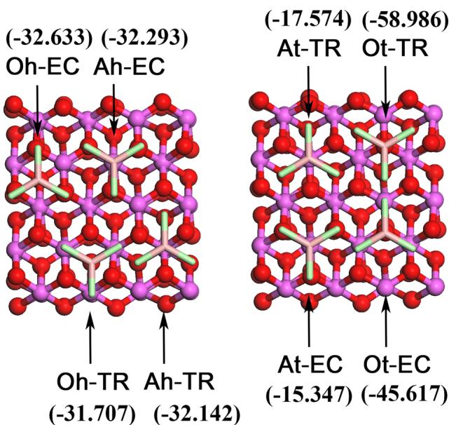
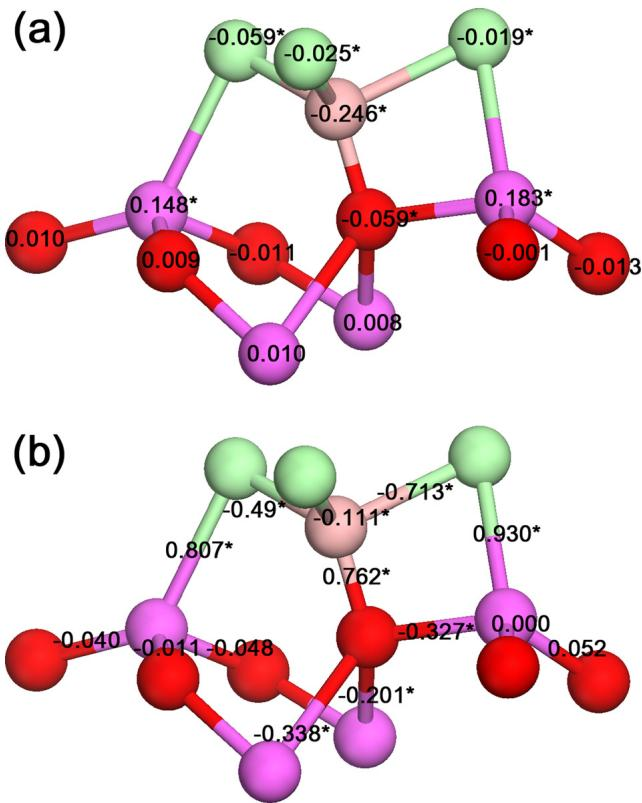
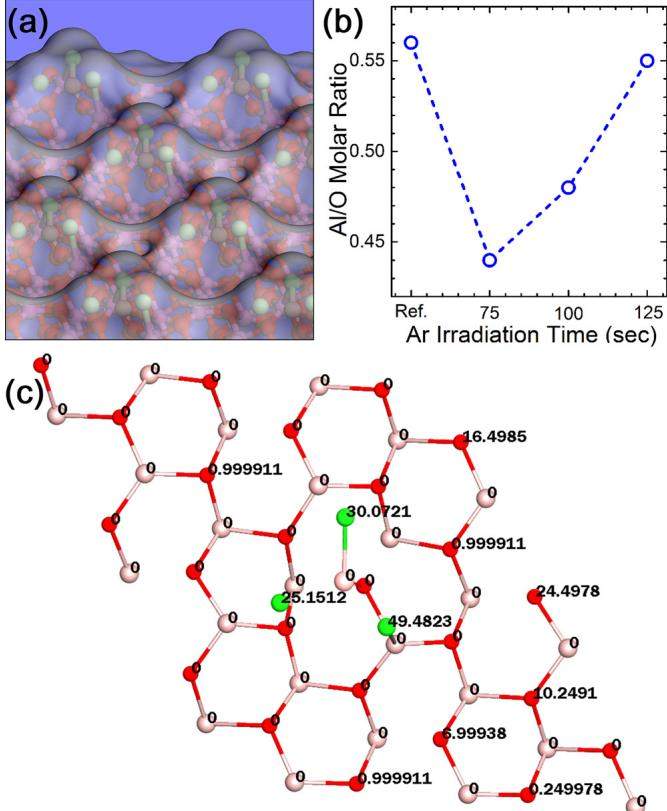
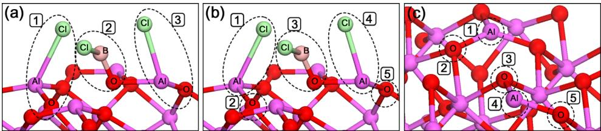
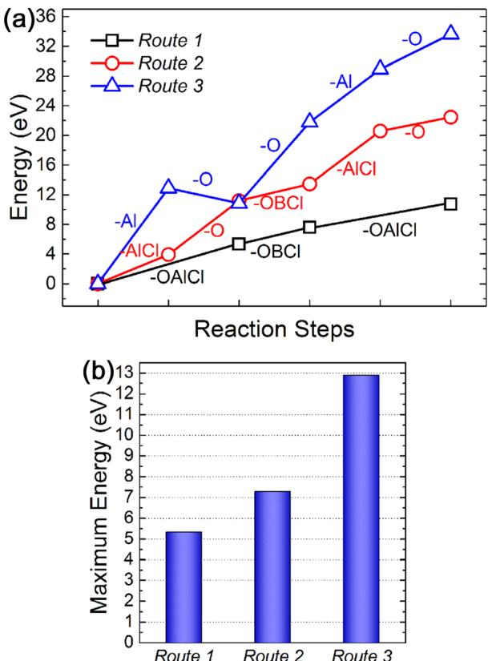

# Understanding time-resolved processes in atomic-layer etching of ultra-thin  $\mathsf{Al}_2\mathsf{O}_3$  film using  $\mathsf{BCl}_3$  and Ar neutral beam  $\odot$

Young I. Jhon; Kyung S. Min; G. Y. Yeom; Young Min Jhon

Check for updates

Appl. Phys. Lett. 105, 093104 (2014) https://doi.org/10.1063/1.4894523

# Articles You May Be Interested In

Damaged silicon contact layer removal using atomic layer etching for deep- nanoscale semiconductor devices

J. Vac. Sci. Technol. A (September 2013)

Atomic layer etching removal of damaged layers in a contact hole for low sheet resistance

J. Vac. Sci. Technol. A (May 1995)

Molecular dynamics simulation of atomic layer etching of silicon

J. Vac. Sci. Technol. A (May 1995)

# Understanding time-resolved processes in atomic-layer etching of ultra-thin  $\mathrm{Al}_2\mathrm{O}_3$  film using  $\mathrm{BCl}_3$  and Ar neutral beam

Young I. Jhon,1 Kyung S. Min,2 G. Y. Yeom,2,3, a) and Young Min Jhon1, b) 1Sensor System Research Center, Korea Institute of Science and Technology, Seoul 136- 791, South Korea 2Department of Advanced Materials Science and Engineering, Sungkyunkwan University, Suwon, Gyeonggi- do 440- 746, South Korea 3SKKU Advanced Institute of Nano Technology (SAINT), Sungkyunkwan University, Suwon 440- 746, South Korea

(Received 9 June 2014; accepted 12 August 2014; published online 5 September 2014)

We scrutinize time- resolved processes occurring in atomic- layer etching (ALET) of ultra- thin  $\mathrm{Al}_2\mathrm{O}_3$  film using  $\mathrm{BCl}_3$  gas and Ar neutral beam by employing density functional theory calculations and experimental measurements.  $\mathrm{BCl}_3$  gas is found to be preferentially chemisorbed on  $\mathrm{Al}_2\mathrm{O}_3(100)$  in trans form with the surface atoms creating O- B and Al- Cl contacts. We disclose that the most likely sequence of etching events involves dominant detachment of Al- associated moieties at early etching stages in good agreement with our concurrent experiments on tracking  $\mathrm{Al}_2\mathrm{O}_3$  surface compositional variations during Ar bombardment. In this etching regime, we find that ALET requires half the maximum reaction energy of conventional plasma etching, which greatly increases if the etching sequence changes. © 2014 AIP Publishing LLC.

[http://dx.doi.org/10.1063/1.4894523]

Continued downscaling of critical dimension (CD) beyond  $22\mathrm{nm}$  nodes renders plasma etching technology increasingly important due to its anisotropic etching- based precise CD controllability. However, during the patterning of high-  $k$  dielectric films and/or interface passivation layers (IPLs) in modern CMOS devices, normal plasma etching has inevitably led to damage to the semiconductor surface below due to their very thin depths  $(0.5 - 1.0\mathrm{nm})$  .12 The defects created on the semiconductor surface may significantly degrade electric properties of the CMOS devices.1- 3 Therefore, a precise etching with high selectivity (between high-  $k$  IPLs and substrates), rather than a high etching rate, is critically required for the patterning of next generation CMOS transistors. To solve this problem, atomic- layer etching (ALET) technology was introduced as it can etch materials at an atomic layer level without serious physical and chemical damages of the substrates as shown in the series of our previous experimental studies.4- 6

Thus far, a number of studies have been performed to understand the mechanism of conventional plasma etching process by using various computational methods such as equation- based numerical modelings,7- 10 kinetic Monte Carlo methods,11- 13 and molecular dynamics simulations.14- 16 However, the mechanism of ALET has rarely been studied17,18 and still remains elusive despite its significant impact on device fabrications. Agarwal et al. have simulated chlorine- based ALET of Si film and fluorocarbon- based ALET of  $\mathrm{SiO}_2$  film by using two- dimensional Monte Carlo feature profile model (MCFPM), where features on the wafer are resolved at the nanometer- scale using a two- dimensional rectilinear mesh.18 However, due to the inherent limits, this method could not provide any information on the formation/annihilation of atomic bonds, the geometries of adsorbed gas molecules, and the energetics of the reactions during ALET, which are crucial to establish systematic ALET design including the selection of appropriate reactive gas species and the control of Ar beam energy. All the above information are accessible through quantum mechanical calculations, but unfortunately, quantum mechanical study on this subject has never been reported so far. In this letter, to address this challenging issue, we have studied the time- resolved processes occurring in  $\mathrm{BCl}_3$  gas and Ar- neutral- beam based ALET of ultra- thin  $\mathrm{Al}_2\mathrm{O}_3$  film (which is selected as representative of high-  $k$  dielectric film and/or IPL) by using density functional theory (DFT) calculations and complementary experiments. All density functional theory calculations were performed within spin- polarized generalized gradient approximation (GGA) parameterized by Perdew- Burke- Ernzerhof (PBE) exchange- correlation as implemented in ATK software19,20 where double-  $\zeta$  plus polarization basis sets with cutoff energy of  $300\mathrm{Ry}$  were used. A periodic  $2\times 2\times 1$  supercell of  $\mathrm{Al}_2\mathrm{O}_3$  is employed as  $\mathrm{Al}_2\mathrm{O}_3$  film, the dimension of which is evaluated to be  $9.518\mathring{\mathrm{A}}\times 9.518\mathring{\mathrm{A}}\times 11.0\mathring{\mathrm{A}}$  (120 atoms). One  $\mathrm{BCl}_3$  molecule is assumed to be adsorbed on the  $\mathrm{Al}_2\mathrm{O}_3$  (100) surface with the area of  $9.518\mathring{\mathrm{A}}\times 9.518\mathring{\mathrm{A}}$  yielding the surface density of  $0.011\mathrm{BCl}_3 / \mathring{\mathrm{A}}^2$  . It should be noted that the depth of this film is as large as  $11.0\mathrm{\AA}$  (12 atomic layers), although it is only one multiple of  $z$ - directional length of  $\mathrm{Al}_2\mathrm{O}_3$  unit cell. This film depth is reduced to  $4.3\mathring{\mathrm{A}}$  (6 atomic layers) in the energetic studies of time- resolved reactions occurring in ALET. The  $k$ - point grid of  $2\times 2\times 1$  is used for the Brillouin zone sampling in all calculations.

First, in order to find the most favorable configuration of  $\mathrm{BCl}_3$  molecule when it is adsorbed on  $\mathrm{Al}_2\mathrm{O}_3(100)$  (this surface is known to be energetically most stable), we performed an extensive configurational search considering eight diverse initial configurations of  $\mathrm{BCl}_3$  as depicted in Fig. 1. Here, the configuration of  $\mathrm{BCl}_3$  is denoted as "Ot or At" if the boron

  
FIG. 1. The eight initial configurations of  $\mathrm{BCl}_3$  molecule considered here to find its most stable geometry when it adsorbed on  $\mathrm{Al}_2\mathrm{O}_3(100)$ . The values shown in parentheses indicate their respective adsorption energies (unit:  $\mathrm{Kcal / mol}$ ) obtained after geometric optimization. The oxygen, aluminum, boron, and chlorine atoms are shown in red, violet (dark and light grays in black and white, respectively), bronze, and green, respectively.

atom of  $\mathrm{BCl}_3$  is located on the top of the oxygen or aluminum atoms of the upmost layer of  $\mathrm{Al}_2\mathrm{O}_3$  film, respectively, while it is denoted as "Oh or Ah" if the boron atom is located at the hollow site of the oxygen or aluminum atoms of the second upmost layer, respectively. Each of these configurations was further subdivided to EC (eclipse) and TR (trans) if the chlorine atoms are more or less overlapped with the atoms of the upmost layer, respectively, when projected from the top view. With these eight initial configurations, we performed a series of quantum mechanical geometric optimizations and calculated adsorption energies at their respective optimized structures as given in parentheses in Fig. 1. We found that Ot- TR configuration led to the most stable  $\mathrm{BCl}_3$  adsorption with an adsorption energy of  $58.986\mathrm{Kcal / mol}$  dominating over those of the other initial configurations. It is a chemical adsorption characterized by one chloroboronbonded oxygen atom (O,BCl) and two chlorine- bonded aluminum atoms (Al- Cl) (Fig. 2(a)).

To gain physical insight into the role of  $\mathrm{BCl}_3$  adsorption in the ALET, we performed Mulliken atomic electron population analysis on  $\mathrm{BCl}_3$  - adsorbed  $\mathrm{Al}_2\mathrm{O}_3(100)$  with the most probable configuration (Ot- TR). Mulliken analysis provides a means of estimating atomic electron populations from the calculations based on the linear combination of atomic orbitals (LCAO) method. We found that four atoms constituting  $\mathrm{BCl}_3$  molecule as well as one boron- bonded oxygen atom (hereafter, denoted by  $\mathrm{O_{ads}}$ ) and two chlorine- bonded aluminum atoms (hereafter, denoted by  $\mathrm{Al_{ads}}$ ) of  $\mathrm{Al}_2\mathrm{O}_3$  film (all these atoms are marked with asterisk in Fig. 2(a)) should undergo most significant electron population changes upon the  $\mathrm{BCl}_3$  adsorption while the other atoms exhibit negligible electronic changes as shown in Fig. 2(a). In this Figure, positive/negative values imply the increase/decrease of electron population upon the  $\mathrm{BCl}_3$  adsorption, respectively, and we see that some charge transfer occurs from  $\mathrm{BCl}_3$  to  $\mathrm{Al}_2\mathrm{O}_3$  surface when it is chemisorbed.

  
FIG. 2. The atomic electron population changes (a) and bond electron population changes (b) of  $\mathrm{BCl}_3 + \mathrm{Al}_2\mathrm{O}_3(100)$  system upon the  $\mathrm{BCl}_3$  adsorption (unit: electron charge). The oxygen, aluminum, boron, and chlorine atoms are shown in red, violet, bronze, and green, respectively.

To get information on the formation/weakening of inter/intra chemical bonds of  $\mathrm{BCl}_3$  and  $\mathrm{Al}_2\mathrm{O}_3$  film upon the  $\mathrm{BCl}_3$  adsorption, we also carried out Mulliken bond electron population analysis on this system. The bond electron population indicates to what degree the electron orbitals between the two atoms are occupied by electrons. Therefore, the positive/negative numbers shown in Fig. 2(b) imply the increase/decrease of bond electron population upon the  $\mathrm{BCl}_3$  adsorption, respectively, which, in turn, reflects the bond formation/weakening between these two atoms. From this analysis, we found that the bonds between  $\mathrm{O_{ads}}$  and three adjacent Al atoms are substantially weakened (marked with asterisk in Fig. 2(b)) upon the  $\mathrm{BCl}_3$  adsorption while the bonds between  $\mathrm{Al_{ads}}$  and its neighboring oxygen atoms (except for the bond with  $\mathrm{O_{ads}}$ ) rather largely sustains the original bond strengths although they are also weakened (Fig. 2(b)). Notably, we also found that the (chemical) bonds are created between B and  $\mathrm{O_{ads}}$  atoms as well as Cl and  $\mathrm{Al_{ads}}$  atoms when  $\mathrm{BCl}_3$  is adsorbed on  $\mathrm{Al}_2\mathrm{O}_3(100)$ . From these findings, we infer that OAlCl (or  $\mathrm{O + AlCl}$ ) and OBCl molecules should readily detach under the Ar bombardment. Based on these detachable moieties, the most feasible etching sequence is suggested in this Letter as shown later.

In our simulations, we assumed rather sparse adsorption of  $\mathrm{BCl}_3$  molecules on  $\mathrm{Al}_2\mathrm{O}_3(100)$  but in actual ALET, reactive molecules are adsorbed on all available sites of the surface while forming a monolayer of adsorbates.4,17 Due to such full coverage of  $\mathrm{BCl}_3$  molecules and the dominant

  
FIG. 3. (a) The perspective view of Connolly surface constructed on  $\mathrm{BCl}_3$  adsorbed  $\mathrm{Al}_2\mathrm{O}_3(100)$  using a probe atom with a radius of  $2.77\mathrm{\AA}$ ; (b) The time-resolved variations of  $\mathrm{Al}_2\mathrm{O}$  molar ratio in  $\mathrm{Al}_2\mathrm{O}_3(100)$  surface during the Ar bombardment (XPS measurements); (c) Atomic ASAs obtained from the above Connolly surface (unit:  $\mathring{\mathrm{a}}^2$ ). The oxygen, aluminium, boron, and chlorine atoms are shown in red, violet, bronze, and green, respectively.

population of Cl atoms in the outmost region of  $\mathrm{BCl}_3$  adsorbed  $\mathrm{Al}_2\mathrm{O}_3$  surface (Fig. 3), we suppose that Ar atoms will primarily collide with Cl atoms, at least at the early etching stages. On the other hand, a sufficient portion of Ar kinetic energy must be transferred to  $\mathrm{A_{ads}}$  and  $\mathrm{O_{ads}}$  atoms to provoke meaningful ALET. When Ar atoms collide with Cl atoms, the kinetic energies of Ar atoms would be easily transferred to  $\mathrm{Al_{ads}}$  atoms because Cl and  $\mathrm{Al_{ads}}$  atoms are directly connected to each other. In contrast to that, efficient kinetic energy transfer should not occur between Cl and  $\mathrm{O_{ads}}$  atoms because these atoms are indirectly connected through the intermediate B atom, as far as our  $\mathrm{BCl}_3$  adsorption model is correct (Fig. 2). Putting these facts together, we infer that OAlCl (or AlCl) will predominantly detach at early etching stages.

For a quantitative assessment on this scenario, we calculated accessible surface area (ASA) for each of the surface atoms by constructing Connolly surface21 using a probing atom with a radius of  $2.77\mathrm{\AA}$  van der Waals radius of Ar atom) (Fig. 3(a)). The result showed that Cl atoms have extremely large atomic ASAs, dominating over those of the other atoms, and they are evaluated to be as much as 25- 50  $\mathring{\mathrm{A}}^2$  per one Cl atom (Fig. 3(c)). This fact supports our argument of prevailing collisions between Ar beam and substrate Cl atoms at early etching stages. For computational reason, we assumed rather sparse adsorption of  $\mathrm{BCl}_3$  molecules, and as a result, a few oxygen atoms of  $\mathrm{Al}_2\mathrm{O}_3$  film also have comparatively large ASAs in our system. Even in this case, Ar collisions with these oxygen atoms should not provoke meaningful etching of  $\mathrm{Al}_2\mathrm{O}_3$  film because their bonds with neighboring atoms are as strong as those of pristine  $\mathrm{Al}_2\mathrm{O}_3$  film (see Fig. 2(b)) and these oxygen atoms are located sufficiently far from weakest impact points (e.g.,  $\mathrm{O_{ads}}$  atoms) as well (Fig. 3(c)).

To validate our etching model more firmly, we also monitored  $\mathrm{BCl}_3$  - adsorbed  $\mathrm{Al}_2\mathrm{O}_3$  surface experimentally by tracking its compositional change as Ar bombardment proceeded. Three samples were prepared after 75, 100, and  $125\mathrm{s}$  (monolayer etching condition) of Ar bombardment. Then, we measured the surface compositions of these samples using X- ray photoelectron spectroscopy (XPS, Thermo VG, MultiLab 2000,  $\mathrm{MgK}\alpha$  source). The experiment was performed three times to avoid a possible statistical error, and their average values were used for the analysis. In this measurement, we obtained the consistent result to our above etching model. The atomic ratio of  $\mathrm{Al / O}$  decreased at the early stages of Ar bombardment and then increased as the process proceeded (Fig. 3(b)), which was consistently observed in each of three experiments.

In this etching regime, we finally explored the energetics of sequential etching events occurring in ALET. We considered three different etching routes as shown in Figs. 4(a)- 4(c). The first route involves the sequential etching of OAlCl- OBCl- OAlCl for ALET. The second route involves the sequential etching of AlCl- O- OBCl- AlCl- O, considering the possible breaking of OAlCl molecule under the Ar bombardment when compared to the first route. The third route involves the sequential etching of Al- O- O- Al- O for the etching of pristine  $\mathrm{Al}_2\mathrm{O}_3$  film (i.e., without  $\mathrm{BCl}_3$  adsorption), which corresponds to normal plasma etching process and may be regarded as control group of ALET to see the  $\mathrm{BCl}_3$  adsorption effect on  $\mathrm{Al}_2\mathrm{O}_3$  etching. For all examined routes, the system geometry was fully optimized at each of etching stages while the atomic coordinates of three downmost layers of  $\mathrm{Al}_2\mathrm{O}_3$  film were kept fixed. Then, we evaluated the reaction energy, which is defined as the difference between the energies of reactant and product, for each of etching events.

We found that the route  $l$  is energetically most favorable (minimum reaction energy is  $\sim 5.3\mathrm{eV}$ ) for the etching of  $\mathrm{Al}_2\mathrm{O}_3$  film (Fig. 5(b)). Despite such an energetic advantage, it is doubtful whether OAlCl would be detached at one time considering kinetic aspects such as the initial unstable structure of sputtered OAlCl. The reaction energy diagram of route 2 indicates that the breaking of OAlCl into AlCl and O during the etching process will increase the maximum reaction energy by up to  $\sim 2\mathrm{eV}$  (Fig. 5(b)). Meanwhile, route 3, which corresponds to conventional plasma etching process, requires the maximum reaction energy of  $\sim 12.9\mathrm{eV}$  much larger than those in routes  $l$  and 2 as shown in Fig. 5(b). The value of  $\sim 12.9\mathrm{eV}$  is quite reasonable considering that the chemical bond energy of Al- O has been experimentally measured to be  $\sim 115\mathrm{kcal / mol}$ $(4.987\mathrm{eV})$  (Ref. 22) and that  $12.9\mathrm{eV}$  is several times larger than this value.

These results indicate that the preservation of  $\mathrm{BCl}_3$  molecules, the main feature of ALET technology, will significantly reduce the Ar (threshold) kinetic energy required for the etching of  $\mathrm{Al}_2\mathrm{O}_3$  film. The large energy difference

  
FIG. 4. Three different routes for the etching of  $\mathrm{Al}_2\mathrm{O}_3$  film, i.e., route 1 (a), route 2 (b), and route 3 (c) where the numbers in the figures indicate their respective etching event sequence. Routes 1 and 2 are for ALET processes while route 3 is for conventional plasma etching process.

between  $\mathrm{BCl}_3$  - adsorbed  $\mathrm{Al}_2\mathrm{O}_3$  surface and pristine  $\mathrm{Al}_2\mathrm{O}_3$  surface eventually enables precise etching of the upmost atomic- layer of  $\mathrm{Al}_2\mathrm{O}_3$  film while keeping atomic layers below intact during the Ar bombardment in ALET.

In order to investigate how the reaction energetics would change if O- associated moieties detach first (instead of Al- associated ones) under the Ar bombardment, we also examined the etching event sequence of OBCl- AICl- O- AICl- O (i.e., by exchanging "AlCl- O" step with "OBCl" step at the early stages of route 2). Surprisingly, we found that this etching route brings out the increase of maximum reaction energy up to the level  $(\sim 13\mathrm{eV})$  of conventional plasma etching. It suggests the importance of etching event sequence in evaluating the energetics of etching process.

In our ALET experiments, Ar ions are initially accelerated in the ion gun, achieving  $100\mathrm{eV}$  energies in the end. These accelerated Ar ions are subsequently neutralized by a reflector plate, which is located in front of the ion gun with a low angle  $(5^{\circ})$  to prevent possible unwanted damage to the  $\mathrm{Al}_2\mathrm{O}_3$  film when they collide with the film.23 The kinetic energies of reflected Ar atoms from a reflector plate can be estimated approximately by using binary collision model24- 26 shown below.

  
FIG. 5. The reaction energy variations (a) and the maximum reaction energies (b) obtained from the sequential etching events of routes 1-3.

$$
\frac{E_r}{E_i} = \left(\frac{\cos\alpha\pm\sqrt{\mu^{-2} - \sin^2\alpha}}{1 + \mu^{-1}}\right)^2,
$$

where  $E_{\mathrm{r}}$  and  $E_{\mathrm{i}}$  are kinetic energies of incident and reflected atoms, respectively,  $\alpha$  is a scattering angle, and  $\mu$  is the mass ratio of an incident atom and a substrate atom. If we assume that the scattering angle is  $10^{\circ}$  considering the small incident angle of  $5^{\circ}$  to the reflected plate, we obtain that  $E_{\mathrm{r}} / E_{\mathrm{i}}$  is  $0.9784$  and the kinetic energy of reflected Ar atom is  $\sim 97.84\mathrm{eV}$  conserving most of its incident kinetic energy. Then, Ar beam composed of these reflected Ar atoms is irradiated onto  $\mathrm{BCl}_3$  - adsorbed  $\mathrm{Al}_2\mathrm{O}_3(100)$  toward the direction normal to the  $\mathrm{Al}_2\mathrm{O}_3$  surface. If we assume that an incident angle is  $70^{\circ}$  (for a large sputtering yield); a scattering angle is  $140^{\circ}$  and an effective substrate mass is equal to the mass of AlCl (for route 2 case), we obtain that  $E_{\mathrm{r}} / E_{\mathrm{i}}$  is  $0.066$ , and thus,  $\sim 91\%$  of initial Ar kinetic energy will be transferred to the  $\mathrm{Al}_2\mathrm{O}_3$  film. The maximum reaction energy of routes 2 is  $\sim 7.3\mathrm{eV}$  which are only  $\sim 8\%$  of the kinetic energy transferred to the  $\mathrm{Al}_2\mathrm{O}_3$  film. This fact indicates that a substantial portion of the transferred energy should be thermally dissipated eventually and only its small fraction will be actually used in the breaking of the chemical bonds between AlCl moiety and  $\mathrm{Al}_2\mathrm{O}_3$  substrate.

In conclusion, we find the most probable sequence of etching events occurring in  $\mathrm{BCl}_3$  gas and Ar- neutral- beam based ALET of ultra- thin  $\mathrm{Al}_2\mathrm{O}_3$  film by using both computational and experimental methods. In this etching regime, we can reasonably describe the reaction energetics of ALET in which ALET requires half the maximum reaction energy of conventional plasma etching but its magnitude increases greatly if the etching sequence changes. The research platform presented here may be applicable to a wide range of other ALET systems providing an instructive guideline for the selection/design of reactive gas species as well as informative etching pathway and energetics.

This research was supported by "Nano- Material Technology Development Program through the National Research Foundation of Korea (NRF) funded by the Ministry of Education, Science and Technology (2012M3A7B4035323)" and "Industrial Strategic Technology Development Program (10039226, Development of actinic EUV mask inspection tool and multiple electron beam wafer inspection technology) funded by the Ministry of Trade, Industry and Energy, Republic of Korea."

$^{3}$ J. Paul, V. Beyer, P. Michalovski, M. F. Beug, L. Bach, M. Ackermann, S. Wege, A. Tilke, N. Chan, T. Mikolajick, U. Bewersdorff- Sarlette, R. Knöfler, M. Czernohorsky, and C. Ludwig, Microelectron. Eng. 86, 949 (2009).  $^{4}$ S. D. Park, C. K. Oh, J. W. Bae, G. Y. Yeom, T. W. Kim, J. I. Song, and J. H. Jang, Appl. Phys. Lett. 89, 043109 (2006).  $^{5}$ W. S. Lim, Y. Y. Kim, H. K. Kim, S. J. Jang, N. Y. Kwon, B. J. Park, J. H. Ahn, I. S. Chung, B. H. Hong, and G. Y. Yeom, Carbon 50, 429 (2012).  $^{6}$ K. S. Min, S. H. Kang, J. K. Kim, Y. I. Jhon, M. S. Jhon, and G. Y. Yeom, Microelectron. Eng. 110, 457 (2013).  $^{7}$ D. J. Economou, Thin Solid Films 365, 348 (2000).  $^{8}$ Z. F. Zhou, Q. A. Huang, W. H. Li, and W. Lu, J. Micromech. Microeng. 15, 652 (2005).  $^{9}$ V. Ishchuk, B. E. Volland, M. Hauguth, M. Cooke, and I. W. Rangelow, J. Appl. Phys. 112, 084308 (2012).  $^{10}$ C. R. Tellier, J. Mater. Sci. 33, 117 (1998).  $^{11}$ E. Chan, K. Zhu, A. Chen, W. Huang, L. Feng, Z. Zhou, and G. Ge, Appl. Surf. Sci. 280, 655 (2013).  $^{12}$ Y. W. Zhang, G. Tang, K. Han, Z. H. Xun, Y. Y. Xie, and Y. Li, Acta Phys. Sin. 61, 020511 (2012).  $^{13}$ Y. Y. Xie, G. Tang, Z. P. Xun, K. Han, H. Xia, D. P. Hao, Y. W. Zhang, and Y. Li, Acta Phys. Sin. 61, 070506 (2012).

$^{14}$ C. F. Abrams and D. B. Graves, J. Vac. Sci. Technol. A 16, 3006 (1998).  $^{15}$ D. B. Graves and P. Brault, J. Phys. D: Appl. Phys. 42, 194011 (2009).  $^{16}$ M. Chaudhari, J. Du, S. Behera, S. Manandhar, S. Gaddam, and J. Kelber, Appl. Phys. Lett. 94, 204102 (2009).  $^{17}$ S. D. Athavale and D. J. Economou, J. Vac. Sci. Technol. A 13, 966 (1995).  $^{18}$ A. Agarwal and M. J. Kushner, J. Vac. Sci. Technol. A 27, 37 (2009).  $^{19}$ J. P. Perdew, K. Burke, and M. Ernzerhof, Phys. Rev. Lett. 77, 3865 (1996).  $^{20}$ ATK, Version 12.8.2; Quantumwise: Copenhagen, Denmark, 2010.  $^{21}$ M. L. Connolly, Science 221, 709 (1983).  $^{22}$ J. Drowart, G. DeMaria, R. P. Burns, and M. G. Inghram, J. Chem. Phys. 32, 1366 (1960).  $^{23}$ D. H. Lee, J. W. Bae, S. D. Park, and G. Y. Yeom, Thin Solid Films 398/ 399, 647 (2001).  $^{24}$ G. S. Hwang, C. M. Anderson, M. J. Gordon, T. A. Moore, T. K. Minton, and K. P. Giapis, Phys. Rev. Lett. 77, 3049 (1996).  $^{25}$ K. M. Klien, C. Park, and A. F. Tasch, IEEE Trans. Electron Devices 39, 1614 (1992).  $^{26}$ M. A. Shaheen and D. N. Ruzic, J. Vac. Sci. Technol. A 11, 3085 (1993).