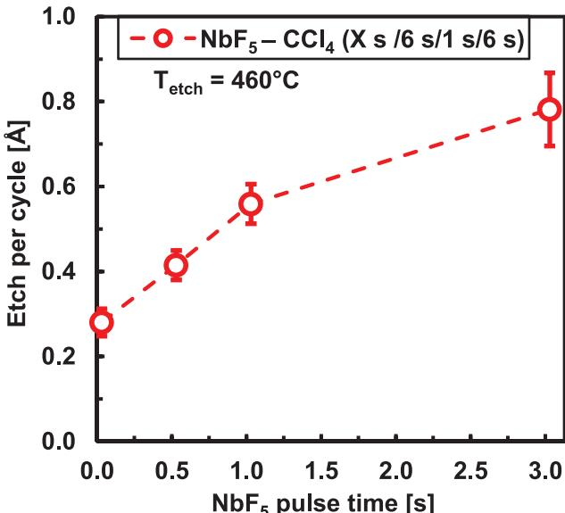
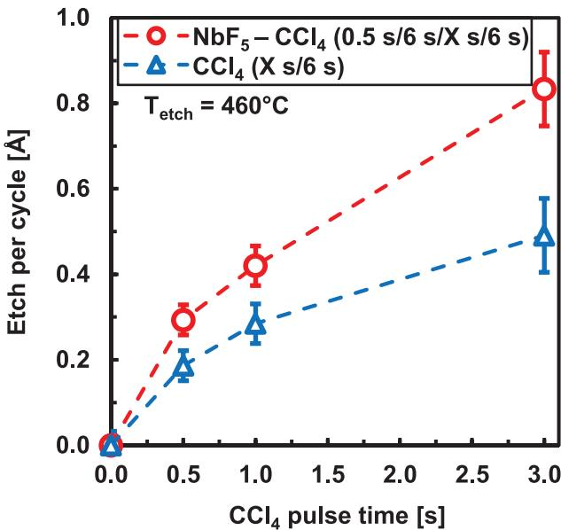
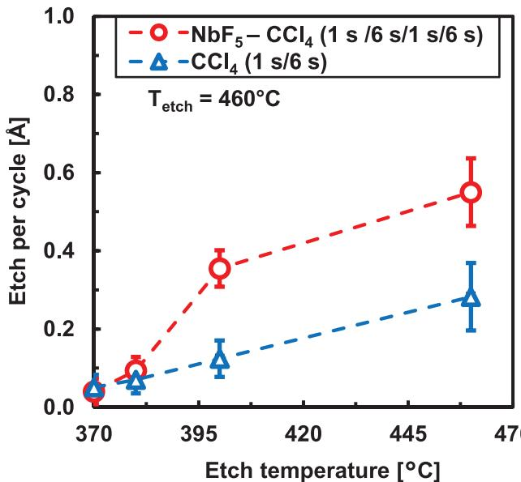
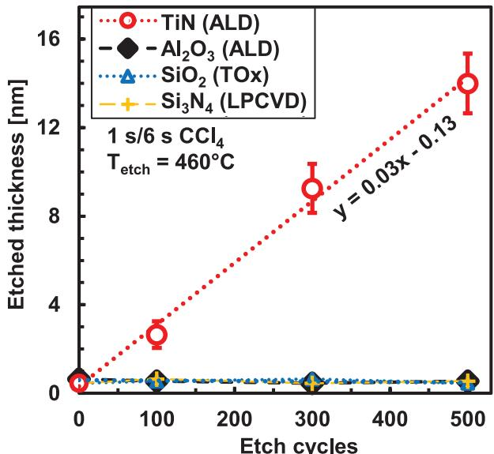
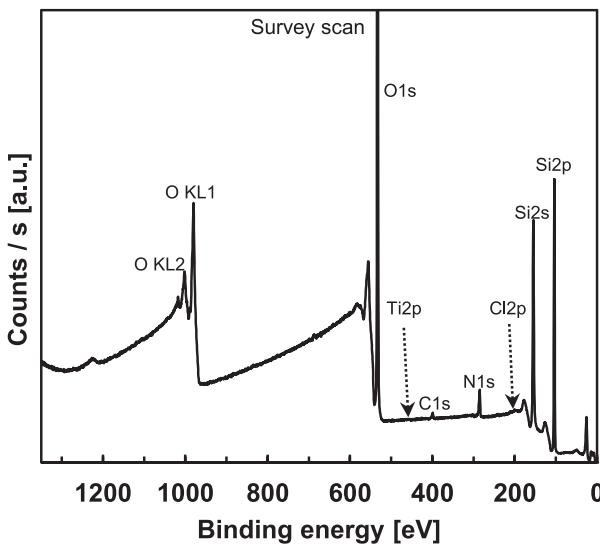
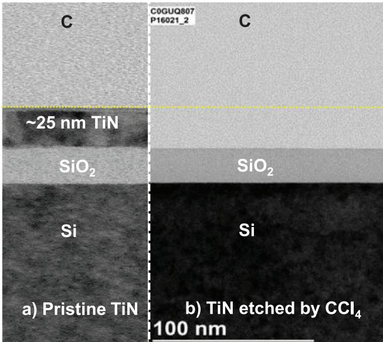
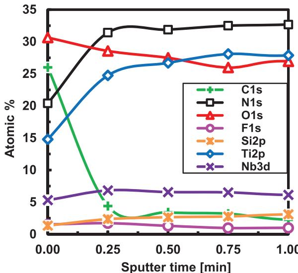
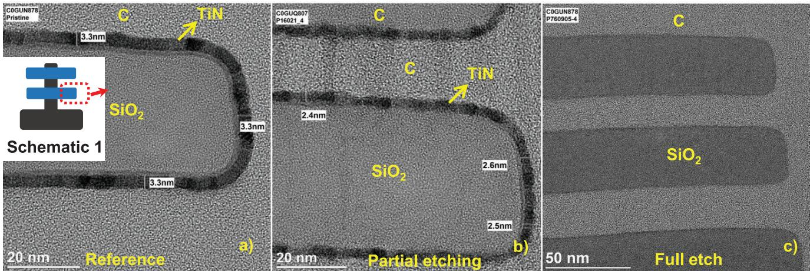

# Combining Experimental and DFT Investigation of the Mechanism Involved in Thermal Etching of Titanium Nitride Using Alternate Exposures of  $\mathrm{NbF}_5$  and  $\mathrm{CCl}_4$ , or  $\mathrm{CCl}_4$  Only

Varun Sharma,\* Suresh Kondati Natarajan, Simon D. Elliott, Tom Blomberg, Suvi Haukka, Michael E. Givens, Marko Tuominen, and Mikko Ritala\*

Thermally activated chemical vapor- phase etching of titanium nitride (TiN) is studied by utilizing either alternate exposures of niobium pentafluoride  $(\mathrm{NbF}_5)$  and carbon tetrachloride  $(\mathrm{CCl}_4)$  or by using  $\mathrm{CCl}_4$  alone. Nitrogen  $(\mathrm{N}_2)$  gas purge steps are carried out in between every reactant exposure. Titanium nitride is etched in a non- self- limiting way by  $\mathrm{NbF}_5\mathrm{- }\mathrm{CCl}_4$  based binary chemistry or by  $\mathrm{CCl}_4$  at temperatures between 370 and  $460^{\circ}C$ . Spectroscopic ellipsometry and a weight balance are used to calculate the etch per cycle. For the binary chemistry, an etch per cycle of  $\approx 0.8\mathrm{\AA}$  is obtained for 0.5 and 3 s long exposures of  $\mathrm{NbF}_5$  and  $\mathrm{CCl}_4$ , respectively at  $460^{\circ}C$ . On the contrary, under the same conditions, the etch process with  $\mathrm{CCl}_4$  alone gives an etch per cycle of about  $0.5\mathrm{\AA}$ . In the  $\mathrm{CCl}_4$ - only etch process, the thickness of TiN films removed at  $460^{\circ}C$  varies linearly with the number of etch cycles. Furthermore,  $\mathrm{CCl}_4$  alone is able to etch TiN selectively over other materials such as  $\mathrm{Al}_2\mathrm{O}_3$ ,  $\mathrm{SiO}_2$ , and  $\mathrm{Si}_3\mathrm{N}_4$ . X- ray photoelectron spectroscopy and bright field transmission electron microscopy are used for studying the post- etch surfaces. To understand possible reaction products and energetics, first- principles calculations are carried out with density functional theory. From thermochemical analysis of possible reaction models, it is found that  $\mathrm{NbF}_5$  alone cannot etch TiN while  $\mathrm{CCl}_4$  alone can etch it at high temperatures. The predicted byproducts of the reaction between the  $\mathrm{CCl}_4$  gas molecules and TiN surface are  $\mathrm{TiCl}_3$  and  $\mathrm{ClCN}$ . Similarly,  $\mathrm{TiF}_4$ ,  $\mathrm{NbFCl}_3$ , and  $\mathrm{ClCN}$  are predicted to be the likely products when TiN is exposed to both  $\mathrm{NbF}_5$  and  $\mathrm{CCl}_4$ . A more favorable etch reaction is predicted when TiN is exposed to both  $\mathrm{NbF}_5$  and  $\mathrm{CCl}_4$  ( $\Delta G = - 2.7\mathrm{eV}$  at  $640\mathrm{K}$ ) as compared to exposure to  $\mathrm{CCl}_4$  only ( $\Delta G = - 2\mathrm{eV}$  at  $640\mathrm{K}$ ) process. This indicates that an enhanced etch rate is possible when TiN is exposed alternately to both  $\mathrm{NbF}_5$  and  $\mathrm{CCl}_4$ , which is in close agreement with the experimental results.

# 1. Introduction

With the continuous scaling of device dimensions in integrated circuits, more complex 3D device architectures are constantly being developed.[1,2] In order to keep developing such non- line- of- sight features, processing techniques that provide conformal as well as precise control of thickness at the atomic scale have become indispensable.[3- 5] Deposition and etching are two of the most widely employed techniques in the fabrication of today's nanoelectronic devices. Semiconductor tool manufacturers have stretched their limits to gain atomic precision when depositing and etching various materials.[3- 7] Atomic layer deposition is a well established chemical gas phase deposition technique with hundreds of reported processes.[8,9] On the other hand, reports on plasma- free chemical- based etch processes are limited and especially so for the recently developed thermal atomic layer etching (ALE).[10,11] Thermal ALE is a technique that uses sequential self- limiting surface- gas reactions in order to etch material from the surface.[12] The self- limiting surface reactions may provide important advantages, such as isotropic etching,[11,12] thickness control in the atomic regime and possibly improved etch selectivity. Therefore, thermal ALE is

a promising technique for fabricating non- line- of- sight features in 3D nanoscale devices.

Titanium nitride (TiN) is a crucial material for the semiconductor industry due to its CMOS compatibility and has found use in applications such as tunable work- function metal gate[13] in FIN- field- effect- transistor and gate- all- around nanowire metal- oxide- semiconductor- field- effect- transistor,[14] gate electrode in metal- insulator- semiconductor field effect transistor,[15] diffusion barrier,[16] metal hard mask,[17] anti- reflective coating,[18] extreme ultraviolet patterning,[19] sub- bandgap[20] and Schottky photodetector,[21] and in plasmonics.[22,23]

So far, most of the TiN etch processes utilize either solutions[24- 26] or plasma chemistries,[27- 30] and a very few purely vapor etch processes have been reported.[31,32] Lee et al.[31] proposed a conversion- etch mechanism for TiN. First, the surface of the TiN films was oxidized to  $\mathrm{TiO_2}$  by ozone  $(\mathrm{O}_3)$  and then  $\mathrm{TiO_2}$  was etched by HF vapor in the form of volatile  $\mathrm{TiF_4}$  and  $\mathrm{H}_2\mathrm{O}$  species. Ozone is a strong oxidant[33] and is capable of oxidizing also other materials in the vicinity on the integrated circuit chips. HF is toxic and its use may result in the dreaded fluorine contamination that not only affects the performance of CMOS devices but also poses compatibility issues with storage as well as semiconductor processing equipment. Thus, new thermal processes with other etchants for TiN would be beneficial in fabricating complex devices.

We report novel chemical etching processes for titanium nitride. Two types of etching processes were studied: first, a twostep gas- surface reaction based on sequential exposures of  $\mathrm{NbF}_5-$ $\mathrm{CCl_4}$  reactants, and second a spontaneous etching by  $\mathrm{CCl_4}$  alone which can be defined as gas- phase pulsed etching (GPPE).[32]  $\mathrm{N}_2$  purge steps were introduced in between reactant pulses to avoid any reactant overlap, and to purge the etch system from excess reactant molecules as well as reaction products.

First principles calculations using density functional theory (DFT) are employed to study the thermochemistry of the reactions involved in the etch process. First principles calculations provide an effective approach for evaluating the free energies of the etch reactions. This is particularly important in this study as many exotic chemical species may be involved in the reaction for which experimental thermodynamic data are not available in the literature. We also use DFT to predict probable etch products from the product pressures evaluated at thermodynamic equilibrium.

# 2. Experimental Section

# 2.1. Substrates and Process Gases

P- doped silicon wafers of  $200~\mathrm{mm}$  diameter were chosen as substrates. The target films subjected to etching were  $\mathrm{SiO_2}$ $\mathrm{Si}_3\mathrm{N}_4,$ $\mathrm{Al}_2\mathrm{O}_3$  and TiN. The  $\mathrm{SiO_2}$  was either thermally grown silicon oxide of about  $22\mathrm{nm}$  thick or  $15\mathrm{nm}\mathrm{SiO}_2$  grown by the plasma- enhanced atomic layer deposition technique.[33] A  $20 \mathrm{nm}$  thick LPCVD nitride  $(\mathrm{Si}_3\mathrm{N}_4)$  was used.  $\mathrm{Al}_2\mathrm{O}_3$  of about  $20~\mathrm{nm}$  was deposited at  $300~^\circ \mathrm{C}$  by the trimethylaluminum and water  $(\mathrm{H}_2\mathrm{O})$  ALD process.[34] TiN was deposited on  $22~\mathrm{nm}$  thermal oxide at  $400^{\circ}C$  by thermal ALD process utilizing  $\mathrm{TiCl_4}$  and  $\mathrm{NH}_3$  [35] The TiN films used in these etch experiments were from 10 to  $50~\mathrm{nm}$  in thickness.

$\mathrm{NbF}_5$  (98%, CAS Number 7783- 68- 8) and anhydrous  $\mathrm{CCl_4}$  (CAS Number 56- 23- 5) were purchased from Sigma Aldrich, Inc. (Germany). The  $\mathrm{NbF}_5$  vessel was kept at  $45 - 50^{\circ}C$ . The  $\mathrm{CCl_4}$  vessel was kept at room temperature and the vapors were drawn into the chamber. The  $\mathrm{CCl_4}$  dose was controlled by a needle valve and the  $\mathrm{NbF}_5$  outlet line did not have the needle valve installed. Nitrogen of 5.0 purity was used as a carrier gas, and was further purified by a purifier to 26.0 level.

# 2.2. Experimental Setup and Methodology

The etch experiments were performed in a Pulsar 2000 (P2000) reaction chamber, manufactured by ASM. The etch temperature was varied from 370 to  $460^{\circ}C$  under isothermal conditions. Due to the hardware limitation of this particular P2000 module, the  $460^{\circ}C$  was the maximum obtainable temperature and therefore the choice of the range. This temperature range may require highly thermally stable reactants such as  $\mathrm{CCl_4}$ [36] and  $\mathrm{NbF}_5$ .[37,38] More details of a setup and methodology can be found in earlier reports.[32,39]

The etch rate per cycle (EPC) was calculated from the removed thickness values. Before and after etching, the thickness values were determined by spectroscopic ellipsometry (SE) and weight measurements as described earlier.[32] In order to verify the etch process, in situ grown TiN films were also subjected to etching. No significant differences in EPC were found between air- oxidized and in situ grown TiN films. In some cases, an X- ray reflectometer was also used to confirm the thickness and extract density values of TiN films. For simplicity, EPC values reported here were extracted from the weight measurements except in Figure 4, where SE thickness values are reported.

# 2.3. Characterization Techniques and Equipment

The SAG 204 balance from Mettler Toledo with a resolution of about  $0.1\mathrm{mg}$  was used for the weight measurements. The EPC and removed thickness values were extracted by using simple mass- density- volume relationship, as described in previous report.[32]

For thickness, optical constants and density measurements the SE 800 (from SENTECH) ellipsometer and X'pert PRO X'XR (from Malvern Panalytical Ltd.) were used.

The surface composition as well as depth profiles were determined with the help of X- ray photoelectron spectroscopy (XPS). The XPS used here was a K- Alpha+ from Thermo Scientific. The aluminum Kα (1486.6 eV)/15 kV) X- ray source was used with a spot size of about  $400\mu \mathrm{m}$ . In the XPS depth profile measurements, the argon ion energy was set to  $1000\mathrm{eV}$ . For the survey scan, a total of 10 scans were performed with a pass energy of  $200\mathrm{eV}$ , and an increment of  $0.5\mathrm{eV}$ .

The transmission electron microscopy was executed by Evans Analytical Group, California. For the imaging the FEI Tecnai TF- 20 FEG/TEM operated at  $200\mathrm{kV}$  was used in the bright- field TEM mode. For the sample preparation, an in situ focused ion beam (FIB) lift- out technique on an FEI dual beam FIB/SEM was used. Prior to the ion milling, the samples were carbon coated followed by sputtering iridium on top. The thickness of the TEM lamella was about  $100\mathrm{nm}$ .

# 3. Theory and Computational Setup

The Vienna Ab initio Simulation Package (VASP v5.3)[40,41] was used for the quantum chemical calculations reported in this manuscript. We have used spin- polarized DFT to describe the electronic structure of the system under study. The exchangecorrelation interactions are approximated by the Perdew- BurkeErnzerhof[42] generalized gradient corrected density functional. The valence electrons are expanded in a plane wave basis set with a  $400\mathrm{eV}$  cutoff, whereas the core electrons are treated by projector augmented wave (PAw) potentials.[43] The PAw potentials have 13 valence electrons for Nb, 4 for Ti, 5 for N, and 7 each for F and Cl. The geometries are relaxed within  $1\mathrm{meV}$  of energy and within  $0.02\mathrm{eV}\mathrm{\AA}^{- 1}$  of magnitude of each force component.

The cubic phase of TiN (space group  $\mathrm{Fm}\bar{3}\mathrm{m}$  is chosen for the DFT study. The bulk unit cell consists of 4 TiN units and its shape and volume are simultaneously relaxed with a higher energy cutoff of  $550\mathrm{eV}.$  A Monkhorst- Pack  $\mathrm{k}$  - point mesh of  $6\times 6\times 6$  is used to sample the first Brillouin zone. The minimum energies of the isolated molecules are computed by optimizing their geometries within a noncubic box of dimensions  $15\mathrm{\AA}\times 16\mathrm{\AA}\times 15.5\mathrm{\AA}$  The computation setup for the surface reaction are given in Section S0, Supporting Information.

For the reaction free energy computation, the free energy of a system at a given temperature  $T$  is given by

$$
G = E + H - TS \tag{1}
$$

in which  $E$  is the electronic energy of the system,  $H$  is the enthalpy and  $S$  is the entropy. Enthalpy and entropy of gas phase species are obtained from the "freeh" tool in the TURBOMOLE suite.[44] The enthalpy and entropy of bulk systems are obtained with the Phonopy code,[45] which uses the force constants obtained from a density functional perturbation theory calculation in VASP with an energy threshold of  $1.0e^{- 8}\mathrm{eV}$  for the self consistent field evaluation of the electronic energy. The reaction free energy is then computed as

$$
\Delta G = \Delta E + \Delta H - T\Delta S + RT\ln (\Pi \mathrm{P}_{\mathrm{products}}^{\mathrm{np}} / \Pi \mathrm{P}_{\mathrm{reactants}}^{\mathrm{nr}}) \tag{2}
$$

in which the  $\Delta$  symbol signifies difference between the product and reactant state contributions. The "np" and "nr" are the number of gas phase molecules in the product state and reactant state, respectively.  $P$  is pressure and  $R$  is the gas constant. We can also calculate product pressure  $P_{\mathrm{p}}$  at an user defined temperature  $T$  that will bring  $\Delta G = 0$  If at some temperature  $T,\Delta G$  without the  $RT\ln (Q)$  term is positive, then  $P_{\mathrm{p}}$  value must be lowered to bring the reaction to equilibrium and vice versa. A very low value of  $P_{\mathrm{p}}$  indicates that the corresponding reaction byproducts are less likely at that temperature and vice versa. Please note that this analysis cannot be used to obtain the product pressure value in Equation (2).

# 4.Results and Discussion

# 4.1. Thermochemistry: Free Energies of Proposed Reactions

Let us start by discussing the thermochemistry of the overall etch cycle and the individual reactant pulses using DFT data. In

Table 1. A list of reactions and computed thermochemistry representing the overall etch process in which 1 solid TiN bulk unit is converted into gas phase products on reacting with  $1\mathrm{NbF}_5$  and  $1\mathrm{CCl}_4$  molecules.R2, R4, and R5 (shown in bold font) are redox reactions. All species other than TiN are in gas phase.  $P_{\mathrm{p}}$  at  $\Delta G = 0$  is the product pressure at  $740~\mathrm{K}$  that will bring the reaction to equilibrium at a constant reactant pressure of 2.5 Torr. A low  $P_{\mathrm{p}}$  value indicates the reaction products are unlikely and vice versa.

<table><tr><td rowspan="2"></td><td rowspan="2">Reactions</td><td colspan="2">ΔG [eV]</td><td>Pp[Torr]</td></tr><tr><td>640 K</td><td>740 K</td><td>at ΔG = 0; T = 740 K</td></tr><tr><td>R1:</td><td>1 TiN + 1 NbF5 + 1 CCl4 → 1 TiCl3 + 1 NbNFCI + 1 CF4</td><td>2.8</td><td>2.5</td><td>7.3E-14</td></tr><tr><td>R2:</td><td>1 TiN + 1 NbF5 + 1 CCl4 → 1 TiCl4 + 1 NbNFCI + 1 CF4</td><td>3.3</td><td>2.9</td><td>1.5E-15</td></tr><tr><td>R3:</td><td>1 TiN + 1 NbF5 + 1 CCl4 → 1 TiCl3 + 1 NbCIF4 + 1 CNF</td><td>-1.2</td><td>-1.6</td><td>3.8E+00</td></tr><tr><td>R4:</td><td>1 TiN + 1 NbF5 + 1 CCl4 → 1 TiCl4 + 1 NbF4 + 1 CNF</td><td>-0.8</td><td>-1.2</td><td>1.4E-01</td></tr><tr><td>R5:</td><td>1 TiN + 1 NbF5 + 1 CCl4 → 1 TiF4 + 1 NbFCI3 + 1 CICN</td><td>-2.7</td><td>-3.1</td><td>3.8E+05</td></tr></table>

Table 1 we show the reaction free energies for a number of reactions postulated for the overall etch cycle considering a reactant pressure of 2.5 Torr and a product pressure of 0.01 Torr. Please note that the product pressure cannot be controlled in an etch reactor and it is typically much lower than the reactant pressure, so we choose a value of 0.01 Torr for our calculations.

In reactions R1- R5, we consider a unit of bulk TiN reacting simultaneously with  $1\mathrm{NbF}_5$  and  $1\mathrm{CCl}_4$  molecules to form different gas phase products. It is to be noted that Nb can take different oxidation states and thus there are very many possible combinations of volatile products. Since it is not practical to consider all of them, we have computed a small set of representative product combinations.

The reactions R2, R4, and R5 (with labels in bold font in Table 1) are redox reactions in which the Ti atoms are oxidized and Nb atoms are reduced. The production of gaseous products is often entropically favored and therefore the reaction free energies decrease as the temperature is increased to  $740~\mathrm{K}$ $(467^{\circ}C)$  with R5 being the most favorable at  $\Delta G = - 3.1\mathrm{eV}.$  R3 and R4 become favorable at  $740~\mathrm{K}$  although not as favorable as R5. At  $640~\mathrm{K}$ $(367^{\circ}C)$  the favorable reactions are R3, R4, R5, and R9. R1 and R2 are more unlikely compared to R3 and R4 not because of the Ti compound but because of the Nb and C compounds. From the reaction energies, Nb- N compounds are found to be less favorable in gas phase when compared to  $\mathbb{C} - \mathbb{N}$  compounds. For a similar reason, R3 and R4 are more favorable than R1 and R2, respectively, although both reactions in each set form the same Ti compound. R5 is the most favorable, because it results in a  $\mathbb{C} - \mathbb{N}$  compound and  $\mathrm{TiF_4}$  which is a well- known volatile and stable gas molecule. The  $\mathrm{TiF}_3$  as a byproduct was not considered due to its high boiling point of  $1400^{\circ}\mathrm{C}^{[31]}$  and nonvolatility,[31,46] especially within the experimented temperature range, that is,  $370 - 460^{\circ}C$

Even at  $740~\mathrm{K}$  the calculations show that reactions R1 and R2 are not favorable as the change in Gibbs free energy is  $+2.5$  and  $+2.9\mathrm{eV},$  respectively. The product pressure evaluated at  $\Delta G = 0$  and  $740~\mathrm{K}$  gives an indication of the likelihood of the formation of the considered reaction products. This value is very small for

Table 2. Potential reactions of individual reagent pulses with bulk TiN in the etch process, assessed via thermochemistry computed with DFT. R6-R8 represent the fluorination pulse and R9 represents the chlorination pulse.  $P_{p}$  at  $\Delta G = 0$  is the product pressure at  $740~\mathrm{K}$  that will bring the reaction to equilibrium at a constant reactant pressure of 2.5 Torr. A low  $P_{\mathrm{p}}$  value indicates the reaction products are unlikely and vice versa.  

<table><tr><td rowspan="2"></td><td rowspan="2">Reactions</td><td colspan="2">ΔG [eV]</td><td colspan="2">Pp[Torr]</td></tr><tr><td>640 K</td><td>740 K</td><td colspan="2">ΔG = 0; T = 740 K</td></tr><tr><td>R6:</td><td>1 TiN + 1 NbF5 → 1 TiNF + 1 NbF4</td><td>6.1</td><td>5.7</td><td colspan="2">7.3E-24</td></tr><tr><td>R7:</td><td>1 TiN + 1 NbF5 → 1 TiF3 + 1 NbNF2</td><td>3.5</td><td>3.1</td><td colspan="2">4.2E-15</td></tr><tr><td>R8:</td><td>1 TiN + 1 NbF5 → 1 TiF4 + 1 NbNF1</td><td>3.9</td><td>3.3</td><td colspan="2">2.5E-10</td></tr><tr><td>R9:</td><td>1 TiN + 1 CCl4 → 1 TiCl3 + 1 CICN</td><td>-2</td><td>-2.4</td><td colspan="2">1.8E+04</td></tr></table>

R1 and R2 suggesting that  $\mathrm{NbNF / Cl}$  and  $\mathrm{CF_4}$  are not very probable products. On the other hand, a high product pressure at  $\Delta G = 0$  and  $740\mathrm{K}$  is registered for reaction R5 indicating an increased likelihood in the formation of the volatile products  $\mathrm{TiF_4}$ $\mathrm{NbFCl}_3$  , and ClCN, hence the etching.

The reactions where  $\mathrm{N}_2$  is an etch product were also considered, and are as follows:  $2\mathrm{TiN(s)} + 6\mathrm{NbF}_5(\mathrm{g}) + 6\mathrm{CCl}_4(\mathrm{g})\rightarrow 6$ $\mathrm{NbFCl}_3(\mathrm{g}) + \mathrm{N}_2(\mathrm{g}) + 2\mathrm{TiCl}_3(\mathrm{g}) + 6\mathrm{CF}_4(\mathrm{g}),$  and  $2\mathrm{TiN(s)} + 8$ $\mathrm{NbF}_5(\mathrm{g}) + 8\mathrm{CCl}_4(\mathrm{g})\rightarrow 8\mathrm{NbFCl}_3(\mathrm{g}) + \mathrm{N}_2(\mathrm{g}) + 2\mathrm{TiCl}_4(\mathrm{g}) + 8\mathrm{CF}_4(\mathrm{g}).$  Both the reactions are highly endothermic and unfavorable even at  $500~\mathrm{K}$  with reaction energies of 9.5 and  $8.5\mathrm{eV},$  respectively.

In Table 2, we consider representative etch reactions (R6- R9) in the individual pulses when either  $\mathrm{NbF}_5$  or  $\mathrm{CCl}_4$  is used as reactant. The fluorination pulse is presented as reactions  $\mathrm{R6 - }$  R8, in which  $\mathrm{NbF}_5$  may interact with TiN and form gas phase  $\mathrm{TiF}_x$  and  $\mathrm{NbNF}_y$  species. The reaction free energies are very high  $(+3.1$  to  $+5.7\mathrm{eV}$  at  $740\mathrm{K}$  . The product pressure at  $\Delta G =$  0 and  $740~\mathrm{K}$  is correspondingly very small. This indicates that etch reactions are not possible when pulsing only  $\mathrm{NbF}_5$  mainly due to the unfavorable  $\mathrm{Nb - N}$  compounds. The adsorption mechanism of  $\mathrm{NbF}_5$  on the TiN surface has been computed and is described in Section S1, Supporting Information. We find that  $\mathrm{NbF}_5$  dissociates on the TiN(211) surface spontaneously at  $400~\mathrm{K}$  and results in the formation of strong surface bound Ti- F and  $\mathrm{Nb - N}$  bonds (see Section S1, Supporting Information). Thermodynamically, the Ti- F bonds on TiN surface are more stable and favorable when compared to Ti- Cl bonds (see Section S3, Supporting Information). The formation of any gas phase byproducts was not observed from the DFT simulations of the fluorination pulse.

Reaction R9 shows the TiN etch reaction by  $\mathrm{CCl}_4$  and a spontaneous etching at 640 and  $740\mathrm{K}$  as evidenced by the negative free energy change, is observed. The preferred products are  $\mathrm{TiCl}_3$  and ClCN. Expressed in another way, the product pressure at  $\Delta G = 0$  and  $740\mathrm{K}$  is very large. From simulations, we also found that  $\mathrm{CCl}_4$  molecule dissociated spontaneously on TiN(211) surface (see Section S2, Supporting Information).

Thus, the first principles thermochemistry suggests that the  $\mathrm{NbF}_5$  pulse could not etch (TiN) by itself, while the  $\mathrm{CCl}_4$  pulse alone could etch (TiN) spontaneously, however subject to kinetic barriers. Comparing R5 and R9, the combination of  $(\mathrm{NbF}_5)$  and  $(\mathrm{CCl}_4)$  pulses at  $740~\mathrm{K}$  is predicted to give more effective etching of TiN than etching by  $\mathrm{CCl}_4$  alone. The C compound in the two reactions is the same ClCN and the Ti compounds  $\mathrm{TiCl}_3$  and  $\mathrm{TiF_4}$  have very similar thermochemistry as well. However,  $\mathrm{NbFCl}_3$  offers lower zero point energy and higher entropy than  $\mathrm{NbF}_5$  which allowed R5 to have a lower reaction free energy than R9.

From simulations, a  $\mathrm{CCl}_4$  is found to dissociate spontaneously at a surface bound fluorine free Nb site which is the precursor for the formation of  $\mathrm{NbF}_5\mathrm{Cl}_4$  species in R9. Please refer to Section S2, Supporting Information of the Supporting Information for more information on the explicit reaction mechanisms that have been computed with DFT for this etch process. This enhanced etching phenomenon with sequential pulses of  $\mathrm{NbF}_5$  and  $\mathrm{CCl}_4$  is experimentally verified and observed in Figures 2 and 3.

# 4.2. Experimental Etching Characteristics

TiN films were etched by two types of etch processes: 1) a binary process that involves alternating exposures of  $\mathrm{NbF}_5$  and  $\mathrm{CCl}_4$  reactants in a cyclic manner and 2) a pulsing  $\mathrm{CCl}_4$  alone in a chemical vapor etching (CVE) or GPPE process. One cycle of pulsed CVE of TiN films consists of a  $\mathrm{CCl}_4$  exposure followed by an inert gas  $(\mathbb{N}_2)$  purge. The  $\mathrm{N}_2$  purges were introduced to ensure the products and excess precursor molecules were removed properly from the etch system.

In this context, an etch system is an aggregate term used to describe all the components such as gas lines, valves and the reaction chamber and its parts. The concept and feasibility studies performed under this section demonstrate TiN etching in the atomic regime. The  $\mathrm{CCl}_4$  based CVE process provides selectivity over  $\mathrm{Al}_2\mathrm{O}_3,$ $\mathrm{SiO}_2,$  and  $\mathrm{Si}_3\mathrm{N}_4$  . However, the  $\mathrm{NbF}_5\mathrm{- CCl}_4$  based etch process is able to etch  $\mathrm{Al}_2\mathrm{O}_3$  and provides selectivity over  $\mathrm{SiO}_2$  and  $\mathrm{Si}_3\mathrm{N}_4$  [39]

Figure 1 shows a change in the TiN EPC with varying  $\mathrm{NbF}_5$  pulse time for the  $\mathrm{NbF}_5\mathrm{- CCl}_4$  etch process at  $460^{\circ}C$  and 1 s long  $\mathrm{CCl}_4$  pulse time. The etch temperature of  $460^{\circ}C$  was chosen

  
Figure 1. Etch per cycle for TiN films versus  $\mathrm{NbF}_5$  pulse time at  $460^{\circ}C$  The duration of  $\mathbb{N}_2$  purges and  $\mathrm{CCl}_4$  pulses were fixed at 6 and 1 s, respectively.

  
Figure 2. Etch per cycle of TiN films with varying  $\mathbb{C}\mathbb{C}\mathbb{I}_4$  pulse time at  $460^{\circ}C$  6 s long  $\mathbb{N}_2$  purges were used. The figure compares the EPC for the binary process (red) to the CVE process (blue).

because it was limited by the hardware. The figure reveals that when no  $\mathrm{NbF}_5$  is used, an EPC of  $0.3\mathrm{\AA}$  is obtained which indicates that  $\mathrm{CCl_4}$  alone is capable of etching TiN films as will be discussed later. This is consistent with the favorable thermochemistry that is predicted with DFT. The EPC increases from 0.3 to about  $0.6\mathrm{\AA}$  when the  $\mathrm{NbF}_5$  pulse time is varied from 0 to  $1\mathrm{s}$  At  $3\mathrm{~s~NbF}_5$  pulse time an EPC of about  $0.8\mathrm{\AA}$  is measured. There is no clear saturation of EPC with the  $\mathrm{NbF}_5$  pulse time, but a marginal slowing of an EPC is observed. We speculate that this nonsaturated behavior can be attributed to various factors such as partially self- limiting nature of the surface reaction, insufficient purge time, low volatility, or otherwise slow removal of the products from the TiN surface and presence of finite vapors of  $\mathrm{CCl_4}$  in the etch system. This soft- saturation of the EPC with  $\mathrm{NbF}_5$  pulse time can also be assigned to a slow diffusion of F species through grain boundaries to form a converted TiN surface and form fluorinated TiN surface.

In Figure 2 EPCs for two etch processes are plotted against  $\mathrm{CCl_4}$  pulse time at an etch temperature of  $460^{\circ}C$  From the graph, it is worth noticing that the EPC for the  $\mathrm{NbF}_5\mathrm{- CCl}_4$  etch process is higher than that for the  $\mathrm{CCl_4}$  only CVE process. This holds true for a given set of process parameters such as gas flows, partial pressure of both the precursors, the pulse and purge times up to 3 and  $6\mathrm{~s~}$  respectively, and total pressure of the reaction chamber.

The earlier presented first principles simulations also predicted a more favorable etch reaction for the  $\mathrm{NbF}_5\mathrm{- CCl}_4$  process than for  $\mathrm{CCl_4}$  only. For both etch processes, the EPC tends to increase with the  $\mathrm{CCl_4}$  pulse time.

Figure 2 shows that no etching was observed when  $0.5\mathrm{~s~}$  of  $\mathrm{NbF}_5$  and no  $\mathrm{CCl_4}$  was used, for total 300 cycles. No change in the TiN thickness was observed even after 300 cycles of  $1\mathrm{~s~}$ $\mathrm{NbF}_5$  pulse. At temperatures below  $460^{\circ}C$ $\mathrm{NbF}_5$  alone was not able to etch TiN by itself. This is consistent with the first principles simulations. The TiN thickness values before and after  $\mathrm{NbF}_5$  exposure were confirmed by XRR measurements.

For both etch processes, no clear saturation of EPC is observed. The EPC continues to increase linearly with  $\mathrm{CCl_4}$  pulse time from  $0.5 - 3.0\mathrm{~s~}$  with no sign of saturation. At  $3\mathrm{~s~}$  long  $\mathrm{CCl_4}$  pulse time, EPC values of about 0.8 and  $0.5\mathrm{\AA}$  are observed for the  $\mathrm{NbF}_5\mathrm{- CCl}_4$  and  $\mathrm{CCl_4}$  only CVE processes, respectively.  $\mathrm{NbF}_5$  enhances the etch rate of TiN and this could be due to an enhanced reactivity of the  $\mathrm{CCl_4}$  with fluorinated TiN surface or the formation of more volatile species such as  $\mathrm{TiCl}_4$  (R5 in Table 1) instead of  $\mathrm{TiCl}_3$  [47] TiOCl, or  $\mathrm{TiF}_3$  . The  $\mathrm{TiCl}_3$  at  $427^{\circ}C$  has a sufficiently high vapor pressure of 37 mTorr.[48] On the contrary,  $\mathrm{TiF}_3$  has a very high boiling point of  $1400^{\circ}C^{[31]}$  and is nonvolatile.[49] The vapor pressures of  $\mathrm{TiCl}_4$  and  $\mathrm{TiF}_4$  at  $90^{\circ}C$  are 190 Torr[49] and  $18\mathrm{~mTorr}_{\mathrm{r}}^{[50]}$  respectively.

Another possible reason for the faster etching could be fluorine species diffusing through the TiN grain boundaries and therefore the etching may proceed three dimensionally rather than being limited to the surface. Later in Figure 7, the XPS depth profile analysis did show some fluorine penetration into the remaining TiN film, after exposing it to the  $\mathrm{NbF}_5\mathrm{- CCl}_4$  CVE process.

The simulation results provided in the Supporting Information (see Section S2, Supporting Information) reveal that the Nb sites are important for  $\mathrm{CCl_4}$  to react with when the rest of the surface is covered with F. It is found that the a favorable binding between the Cl atoms and Nb atom is possible (more details in the Section S2, Supporting Information) even when the Nb atom is weakly bound to  $2\mathrm{~F~}$  atoms. However, a strong dissociative adsorption of  $\mathrm{CCl}_4$ $(- 3.2\mathrm{~eV})$  is possible when the Nb atom is free of  $\mathrm{Nb - F}$  bonds (see Figure S5b, Supporting Information) in the Supporting Information). Based on the computational results, we propose that the ALE of TiN proceeds by self- limiting reaction of  $\mathrm{NbF}_5$  molecules with TiN surface in the first pulse (see Section S1, Supporting Information) followed by the dissociative adsorption of  $\mathrm{CCl_4}$  catalyzed by the Nb sites in the second pulse leading to the etch of TiN. Additionally, from the two it can be seen that the  $\mathrm{NbF}_5$  alone did not etch TiN and is predicted by the computational results.

In Figure 3, the effect of etch temperature on etch per cycle is captured for the both etch processes. The  $\mathrm{NbF}_5$  and  $\mathrm{CCl_4}$  pulse times were set to  $1\mathrm{~s~}$  with  $6\mathrm{~s~}$  long  $\mathrm{N}_2$  purges. For the data points in this graph, a total of 200, 200, 300, and 400 etch cycles were performed at etch temperatures of 370, 380, 400, and  $400^{\circ}C$  respectively. For the  $\mathrm{NbF}_5\mathrm{- CCl}_4$  etch process, a low EPC of  $0.03\mathrm{\AA}$  per cycle at  $370^{\circ}C$  is obtained and the EPC increases almost linearly to about  $0.4\mathrm{\AA}$  per cycle at  $400^{\circ}C$  At  $460^{\circ}C$  a higher etch rate of  $0.55\mathrm{\AA}$  per cycle is noted. In contrast, the  $\mathrm{CCl}_4$  only etch process shows an etch rate of  $0.07\mathrm{\AA}$  per cycle at  $370^{\circ}C$  and linearly increases to about  $0.3\mathrm{\AA}$  per cycle at  $460^{\circ}C$  Both the etch processes were unable to etch TiN significantly at temperatures below  $370^{\circ}C$  even after total 1000 etch cycles. This is in disagreement with DFT thermochemistry predictions, which shows possible etching at  $500\mathrm{~K~}(227^{\circ}C)$  and the reason for this can be due to higher activation barrier.

# 4.3. Etch Selectivity

Etch selectivity of TiN against different materials such as  $\mathrm{Al}_2\mathrm{O}_3$ ,  $\mathrm{SiO}_2$ , and  $\mathrm{Si}_3\mathrm{N}_4$  was also studied for the reported etch

  
Figure 3. Effect of etch temperature on etch per cycle for the binary process (blue curve) as well as  $\mathrm{CCl_4}$  alone (blue curve) process. Both the precursor pulses and the purge times were fixed to 1 and 6 s, respectively.

processes. Figure 4 investigates the ability of the  $\mathrm{CCl_4}$  alone CVE process to etch TiN selectively over  $\mathrm{Al}_2\mathrm{O}_3$ ,  $\mathrm{SiO_2}$ , and  $\mathrm{Si}_3\mathrm{N}_4$  at  $460^{\circ}\mathrm{C}$ . The figure plots the etched thickness with the total number of etch cycles, where each cycle consisted of 1 s long  $\mathrm{CCl_4}$  pulse followed by 6 s long  $\mathrm{N}_2$  purge. EPC of  $0.3\mathrm{\AA}$  per cycle is deduced from a linear fit. After 500 etch cycles, about  $13\mathrm{nm}$  TiN film is removed. No change in thickness is observed for  $\mathrm{Al}_2\mathrm{O}_3$ ,  $\mathrm{SiO_2}$ , and  $\mathrm{Si}_3\mathrm{N}_4$  even after exposing them to 1000 cycles of 1 s long  $\mathrm{CCl_4}$  pulses. Moreover, at temperatures below  $460^{\circ}\mathrm{C}$ ,  $\mathrm{CCl_4}$  is unable to etch  $\mathrm{Al}_2\mathrm{O}_3$ ,  $\mathrm{SiO_2}$ , and  $\mathrm{Si}_3\mathrm{N}_4$  either and therefore the selective etching of TiN is possible within temperature window of  $370 - 460^{\circ}\mathrm{C}$ .

  
Figure 4. A change in the thickness values with total number of etch cycles at  $460^{\circ}\mathrm{C}$  for TiN,  $\mathrm{SiO_2}$ ,  $\mathrm{Al}_2\mathrm{O}_3$ , and  $\mathrm{Si}_3\mathrm{N}_4$  films. A TiN is selectively etched away by  $\mathrm{CCl_4}$  alone over other materials.

  
Figure 5. An X-ray photoelectron spectroscopy of  $\mathrm{SiO_2}$  surface after complete removal of TiN film by  $\mathrm{CCl_4}$  based CVE process at  $460^{\circ}\mathrm{C}$ .

# 4.4. Post-Etch Analysis

After removing all  $25\mathrm{nm}$  TiN film from the  $\mathrm{SiO_2}$  substrate, an ex- situ XPS spectra of the post- etch surface was measured and is shown in Figure 5. The main constituents of the remaining surface were  $32.7\mathrm{at}\%$  Si,  $60.9\mathrm{at}\%$  O,  $5.1\mathrm{at}\%$  C, and  $1.2\mathrm{at}\%$  of N, as revealed by XPS. Both the titanium and chlorine were below the detection limit of the XPS  $(< 0.1\mathrm{at}\%)$ . The TiN film was etched at  $460^{\circ}\mathrm{C}$  by  $600^{\circ}\mathrm{C}$  CVE cycles, where each etch cycle was comprised of  $3\mathrm{~s}$  long  $\mathrm{CCl_4}$  pulse followed by  $6\mathrm{~s}$  long  $\mathrm{N}_2$  purge. After 600 etch cycles, about  $30\mathrm{~nm}$  TiN film was anticipated to have been etched. Keeping real etch applications in mind, this over- etch condition was deliberately chosen to remove any TiN remnants from the  $\mathrm{SiO_2}$  surface. Moreover, it was important to study possible surface contamination arising from the etch process itself. The XPS analysis in Figure 5 suggests that the surface is mostly composed of silicon, oxygen, and some adventitious carbon. In addition, about  $1.2\mathrm{at}\%$  nitrogen is seen. Titanium and chlorine were not detected. The detection limit of the particular XPS used here is  $0.1\mathrm{at}\%$ . The nitrogen and carbon signals were detected around  $399.1\mathrm{eV}$ $(\pm 0.01\mathrm{eV})$  and  $284.8\mathrm{eV}$ $(\pm 0.2\mathrm{eV})$ , respectively, and are most probably due to organic surface contamination. Hence they can be associated with handling, storage and transportation of samples within non- clean- room environment. The unetched silicon dioxide substrate shows no damage and matches with reference thermal  $\mathrm{SiO_2}$  films.

The same sample from the Figure 5 was subjected to a cross- sectional bright field transmission electron microscopy (BF- TEM). The BF- TEM images shown in Figure 6 reveal that TiN was completely removed from the  $\mathrm{SiO_2}$  surface by the  $\mathrm{CCl_4}$ - only etch process. Spin- on carbon was deposited prior to the TEM imaging for highlighting the material contrast. The unetched sample is shown for reference and was not exactly the same sample. The TEM image depicts that after complete removal of the TiN film from the  $\mathrm{SiO_2}$  surface, the surface appears to be clean and free of any surface contaminants from either the TiN film or the etch process.

  
Figure 6. BF-TEM images of a) the reference unetched  $25 \text{nm}$  TiN film on  $22 \text{nm} \text{SiO}_2$  film, b) after complete etching of  $25 \text{nm}$  TiN film by 600 cycles of each  $3 \text{s}$  long  $\text{CCl}_4$  pulse separated by  $6 \text{s}$  of  $\text{N}_2$  purges.

Figure 7 plots an XPS depth profile of the elements found in an about  $9 \text{nm}$  TiN film remaining when the etch process was incomplete. The TiN film was etched by 300 cycles of the  $\text{NbF}_5\text{- }\text{CCl}_4$  etch process at  $460^{\circ} \text{C}$ . The total of  $60 \text{s}$  sputter time is estimated to etch about  $1.8 \text{nm}$  of the TiN film. From the figure it can be seen that the surface contains about  $26 \text{at\%}$  carbon,  $31 \text{at\%}$  oxygen,  $20 \text{at\%}$  nitrogen,  $15 \text{at\%}$  titanium, and about  $5 \text{at\%}$  niobium. In addition, small amounts of silicon and fluorine were also detected with both being below  $2 \text{at\%}$ . The silicon signal is from the  $\text{SiO}_2$  film underneath the TiN film. After  $15 \text{s}$  of argon ion sputtering, the carbon signal is dropped to about  $4 \text{at\%}$  and goes further down to  $3 \text{at\%}$  after  $1 \text{min}$  of sputtering. The atomic percentages for titanium, nitrogen, and oxygen are observed around 24, 32, and 28 respectively after sputtering the surface for  $15 \text{s}$ . A fairly high niobium amount from 5 to  $6 \text{at\%}$  along with fluorine of about  $0.9 - 1.7 \text{at\%}$  may indicate that the  $\text{NbF}_5$  is capable of either reacting or dissociating on TiN or the TiN surface modified by  $\text{CCl}_4$ . The presence of niobium is evidently consistent with the DFT adsorption studies discussed in Section S1, Supporting Information. After sputtering for a minute, the presence of significant amounts of niobium, fluorine and carbon inside the top layer of the TiN films may be attributed to various reasons such as surface diffusion of the elements at etch temperatures preferentially through TiN grain boundaries, or increased surface area due to preferential etching along grain boundaries. They can also result from energetic argon ions bombarding the atoms deeper into the film. The absence of chlorine on or in the post- etch TiN layer points toward the formation of volatile products containing chlorine such as  $\text{TiCl}_3$ ,  $\text{TiCl}_4$ ,  $\text{NbFCl}_3$ ,  $\text{NbClF}_4$ , and  $\text{ClCN}$ . All these compounds are predicted by the DFT simulation results.

  
Figure 7. An XPS depth profiling through remaining TiN film after partial etching at  $460^{\circ} \text{C}$ . Total 300 cycles were performed with  $0.5 \text{s}$  of both  $\text{NbF}_5$  and  $\text{CCl}_4$  pulse lengths with  $6 \text{s}$  of  $\text{N}_2$  purges.

Figure 8 is a series of TEM images taken from 3D horizontal FIN structures. For a reference, schematic 1 provides an idea of such a 3D structure where the blue horizontal fins are  $\text{SiO}_2$  fins and the black back- bone is silicon. This 3D structure was coated by a thin ALD TiN film[35] with extremely high confor- . mality. One big advantage of gas- phase chemical etching over plasma- based etching is its capability to etch material from non- line- of- sight features of this sort. Another advantage can be maintaining conformality during the etching or thinning of the films. However, the non- self- limiting gas- phase chemical etching reactions can also affect the conformality. In order to improve the etch conformality, another etchant or controlreactant can be introduced to either improve conformality or modify the etch rate such that etching from non- line- of- sight features may follow more uniform removal.

In Figure 8a, a reference  $\text{SiO}_2$  fin structure is covered by on average  $3.3 \text{nm}$  pristine TiN film. The goal of this etching test was to observe the etch conformality and isotropic nature of the binary  $\text{NbF}_5\text{- }\text{CCl}_4$  etch process. The same sample was subjected to the binary etch process and from Figure 8b it can be concluded that after removal of about  $0.8 \text{nm}$  of TiN conformally, no significant increase in the surface defects is observed. After applying over- etch the TiN is removed completely as seen in Figure 8c. From these TEM images, no etching of  $\text{SiO}_2$  fins was observed, thus confirming the selectivity.

# 5. Summary

We successfully demonstrated two novel gas- phase etching processes for titanium nitride. The binary etching process is based on alternate exposures of  $\text{NbF}_5\text{- }\text{CCl}_4$ , each separated by  $\text{N}_2$  purge. The chemical vapor etch (CVE) etch process utilizes  $\text{CCl}_4$  exposures alone in a pulsed fashion. In addition, the selective etching of TiN with respect to  $\text{SiO}_2$ ,  $\text{Si}_3\text{N}_4$ , and  $\text{Al}_2\text{O}_3$  was also demonstrated. Furthermore, the gas- phase etching reported here also exhibits nondirectional etching from non- line- of- sight features.

From the first principles based DFT thermochemistry simulations the possible reactions and the candidate products

  
Figure 8. Cross-sectional bright field transmission electron micrograph (BF-TEM) of 3D structures: a) about  $3.3 \text{nm}$  TiN film deposited on  $\text{SiO}_2$  fins with lateral cavities, b) the same after about  $0.8 \text{nm}$  TiN is etched by the  $\text{NbF}_5\text{-}\text{CCl}_4$  etch-process, and c) after removing the TiN film completely. The etching was performed at  $460^{\circ}\text{C}$ .

involved in TiN etching were assessed. The surface etch mechanism is also presented in the Supporting Information.

In a two- step etch process, the DFT MD studies predict that the  $\text{NbF}_5$  is able to fluorinate the TiN surface but is unable to etch it by itself. This non- etching is attributed to the formation  $\text{NbNF}_x$  species that are difficult to desorb from the surface. In corroboration with this, the presence of Nb and F on surface was confirmed by XPS in Figure 7.

However, the simulations predict that in  $\text{NbF}_5\text{- }\text{CCl}_4$  etch process,  $\text{NbF}_5$  could enhance the etch rate (favorable reaction free energy compared to  $\text{CCl}_4$  only process) and this was experimentally verified. The Ti- F bonds are stronger and highly polar when compared to Ti- Cl bonds.[51] Thus, in comparison to Cl covered TiN surfaces, F covered TiN surfaces are more favorable for etching.

In the etching step, the  $\text{CCl}_4$  has a tendency to chlorinate the Ti- F bonds and Nb atoms on the surface via halide- exchange mechanism[52] and hence fluorinated TiN and surface Nb as well as N atoms are etched by  $\text{CCl}_4$  in the form of volatile compounds such as  $\text{TiF}_4$ ,  $\text{NbFCl}_3$ ,  $\text{ClCN}$ , and  $\text{TiCl}_4$ .

For the  $\text{NbF}_5\text{- }\text{CCl}_4$  etch process, the EPC varied from  $0.03 \text{\AA}$  at  $370^{\circ}\text{C}$  to a higher value of  $0.55 \text{\AA}$  at  $460^{\circ}\text{C}$ . It was found that the EPC at  $460^{\circ}\text{C}$  increases with an increase in either  $\text{NbF}_5$  or  $\text{CCl}_4$  pulse durations and a no clear self- limiting behavior is observed for either of the pulse durations.

Consistent with the simulation results, experiments found that  $\text{CCl}_4$  is able to etch TiN spontaneously in a CVE fashion. The formation of volatile species such as  $\text{TiCl}_3$  and  $\text{ClCN}$  is predicted by the thermochemical studies. The  $\text{CCl}_4$ - only CVE process shows an EPC of about  $0.07 \text{\AA}$  per cycle at  $370^{\circ}\text{C}$ , linearly increasing to about  $0.3 \text{\AA}$  per cycle at  $460^{\circ}\text{C}$ . At  $460^{\circ}\text{C}$ , for a given pulse duration, the TiN removal proceeds in a linear fashion with etch exposures.

After a complete removal of titanium nitride film by  $\text{CCl}_4$ , the XPS as well as TEM analysis revealed a  $\text{SiO}_2$  surface with no significant amounts of residues arising either from the etch process or the TiN film itself. In case of incomplete removal of TiN by the  $\text{NbF}_5\text{- }\text{CCl}_4$  process, XPS showed the presence of niobium and fluorine on the remaining TiN film. The absence of chlorine on the surface suggests effective formation of volatile species containing chlorine, as predicted by the simulations. The TEM images verify uniform, conformal thinning, leading eventually to complete removal of TiN from 3D structures.

# Supporting Information

Supporting Information is available from the Wiley Online Library or from the author.

# Acknowledgements

The authors thank Eurofins EAG Materials Science, LLC (California, USA) for the TEM analysis. S.K.N. thanks ICHEC and the Science Foundation Ireland funded computing center of Tyndall National Institute for computer time. S.K.N. thanks Rita Mullins for help with reaction free energy calculations.

# Conflict of Interest

The authors declare no conflict of interest.

# Data Availability Statement

Research data are not shared.

# Keywords

atomic layer etching, density functional theory, thermal etching

Received: June 28, 2021  Revised: September 26, 2021  Published online: October 22, 2021

[3] M. Ritala, J. Niinisto, ECS Trans. 2019, 25, 641.  [4] C. T. Carver, J. J. Plombon, P. E. Romero, S. Suri, T. A. Tronic, R. B. Turkot, Solid State Sci. Technol. 2015, 4, N5005.  [5] G. Oehrlein, D. Metzler, C. Li, ECS J. Solid State Sci. Technol. 2015, 4, N5041.  [6] K. J. Kanarik, T. Lill, E. A. Hudson, S. Sriraman, S. Tan, J. Marks, V. Vahedi, R. A. Gottscho, J. Vac. Sci. Technol. A 2015, 33, 020802.  [7] E. Marin, A. Lanzutt, F. Andreatta, M. Lekka, L. Guzman, L. Fedrizzi, Corros. Rev. 2011, 29, 191.  [8] V. Miikkulainen, M. Leskela, M. Ritala, R. L. Puurunen, J. Appl. Phys. 2013, 113, 021301.  [9] P. O. Oviroh, R. Akbarzadeh, D. Pan, R. A. M. Coetzee, T.- C. Jen, Sci. Technol. Adv. Mater. 2015, 20, 455.  [10] S. M. George, Acc. Chem. Res. 2020.  [11] C. Fang, Y. Cao, D. Wu, A. Li, Prog. Nat. Sci. 2018, 28, 667.  [12] Y. Lee, S. M. George, ECS Nano 2015, 9, 2061.  [13] H. Dadgour, K. Endo, V. De, K. Banerjee, IEEE Trans. Electron. Devices 2010, 57, 2504.  [14] L. Lu, Wei- Feng; Dai, Microelectron. J. 2019, 84, 54.  [15] K. Matsuura, M. Hamada, T. Hamada, H. Tanigawa, T. Sakamoto, A. Hori, I. Muneta, T. Kawanago, K. Kakushima, K. Tsutsui, A. Ogura, H. Wakabayashi, Jpn. J. Appl. Phys. 2020, 59, 080906.  [16] H. Kim, J. Vac. Sci. Technol. B Microelectron. and Nanometer Struct. 2003, 21, 2231.  [17] M. Darnon, T. Chevolleau, D. Eon, L. Vallier, J. Torres, O. Joubert, J. Vac. Sci. Technol. B: Microelectron. Nanometer Struct.- Process., Meas., Phenom. 2006, 24, 2262.  [18] S. C. Abraham, J. Vac. Sci. Technol. A Vac. Surf. Films 1997, 15, 702.  [19] S. DeVries, E. A. De Silva, D. Canaperi, A. Simon, A. A. de la Pena, W. Wang, J. Maniscalco, L. Meli, B. Mendoza, in 31st Annual SEMI Advanced Semiconductor Manufacturing Conference (ASMC), IEEE, Piscataway, NJ 2020, pp. 1- 5.  [20] S. L. Shinde, S. Ishii, T. Nagao, ACS Appl. Mater. Interfaces 2019, 11, 21965.  [21] J. Gosciniak, F. B. Atar, E. Corbett, M. Rasras, ACS Omega 2019.  [22] F. Mehmood, R. Pachter, N. R. Murphy, W. E. Johnson, J. Appl. Phys. 2015, 118, 195302.  [23] P. Patsalas, N. Kalfagianaris, S. Kassavetis, Materials 2015, 8, 3128.  [24] E. I. Cooper, R. Rajaram, M. Payne, S. Lippy, Solid State Phenom. 2012, 195, 143.  [25] Y. Liu, T. Kamei, K. Endo, S. O'uchi, J. Tsukada, H. Yamauchi, T. Hayashida, Y. Ishikawa, T. Matsukawa, K. Sakamoto, A. Ogura, M. Masahara, Jpn. J. Appl. Phys. 2010, 49, 06GH18.  [26] D. Bhattacharyya, S. Kuchibhatla, A. Sehgal, Y. P. Shen, W. Haiting, J. Prasad, in 26th Annual SEMI Advanced Semiconductor Manufacturing Conference (ASMC), IEEE, Piscataway, NJ 2015, pp. 305- 308.  [27] J. Tonotani, T. Iwamoto, F. Sato, K. Hattori, S. Ohmi, H. Iwai, J. Vac. Sci. Technol., B: Microelectron. Nanometer Struct.- Process., Meas., Phenom. 2003, 21, 2163.

[28] Y.- Y. Wang, Y.- H. Joo, C.- I. Kim, J. Nanosci. Nanotechnol. 2016, 16, 12933.  [29] N. Marchack, J. M. Papalia, S. Engelmann, E. A. Joseph, J. Vac. Sci. Technol. Vac. Surf. Films 2017, 35, 05C314.  [30] K. Shinoda, N. Miyoshi, H. Kobayashi, M. Izawa, K. Ishikawa, M. Hori, J. Phys. D: Appl. Phys. 2019, 475106.  [31] Y. Lee, S. M. George, Chem. Mater. 2017, 29, 8202.  [32] V. Sharma, T. Blomberg, S. Haukka, S. Cembella, M. E. Givens, M. Tuominen, R. Odedra, W. Graff, M. Ritala, Appl. Surf. Sci. 2020, 52, 148309.  [33] G. Dingemans, C. Van Helvoirt, M. Van de Sanden, W. M. Kessels, in ECS Transactions [ECS 219th ECS Meeting - Montreal, QC, Canada (May 1 - May 6, 2011)], Plasma- assisted Atomic Layer Doping of Low Temperature  $SiO_2$ , IOP Publishing, Bristol 2011, pp. 191- 204.  [34] L. Gosset, J.- F. Damlencourt, O. Renault, D. Rouchon, P. Holliger, A. Ermolieff, I. Trimaille, J.- J. Ganem, F. Martin, M.- N. Semeuria, J. Non- Cryst. Solids 2002, 303, 17.  [35] C. H. Ahn, S. G. Cho, H. J. Lee, K. H. Park, S. H. Jeong, Metals Mater. Int. 2001, 7, 621.  [36] J. V. Michael, K. P. Lim, S. S. Kumaran, J. H. Kiefer, J. Phys. Chem. 1993, 97, 1914.  [37] F. Huang, H. Zhao, A. Yan, Z. Li, H. Liang, Q. Gao, Y. Qiang, J. Alloys Compd. 2017, 695, 489.  [38] R. J. M. Konings, Struct. Chem. 1994, 5, 9.  [39] V. Sharma, S. D. Elliott, T. Blomberg, S. Haukka, M. E. Givens, M. Tuominen, M. Ritala, Chem. Mater. 2021, 33, 2883.  [40] G. Kresse, J. Furthmuller, Phys. Rev. B 1996, 54, 11169.  [41] G. Kresse, D. Joubert, Phys. Rev. B 1999, 59, 1758.  [42] J. P. Perdew, K. Burke, M. Ernzerhof, Phys. Rev. Lett. 1996, 77, 3865.  [43] P. Blochl, Phys. Rev. B 1994, 50, 17953.  [44] TURBOMOLE V6.2 2010, a development of University of Karlsruhe and Forschungszentrum Karlsruhe GmbH, 1989- 2007, TURBOMOLE GmbH (2010), http://www.turbomole.com (accessed: November 2019).  [45] A. Togo, I. Tanaka, Scr. Mater. 2015, 108, 1.  [46] G. Ramanath, J. E. Greene, J. R. A. Carlsson, L. H. Allen, V. C. Hornback, D. J. Allman, J. Appl. Phys. 1999, 85, 1961.  [47] H. Sekimoto, Y. Nose, T. Uda, H. Sugimura, High Temp. Mater. Processes 2011, 30, 435.  [48] K. Kelley, A. Mah, Metallurgical Thermochemistry of Titanium, Report of investigations/U.S. Dept. of the Interior, Bureau of Mines, University of Michigan, Ann Arbor, MI 1959.  [49] F. P. Pike, C. T. Foster, J. Chem. Eng. Data 1959, 4, 305.  [50] E. H. Hall, J. M. Blocher, I. E. Campbell, J. Electrochem. Soc. 1958, 105, 275.  [51] S. P. Webb, M. S. Gordon, J. Am. Chem. Soc. 1999, 121, 2552.  [52] G. Evano, A. Nitelet, P. Thilmany, D. F. Dewez, Front. Chem. 2018, 6, 114.