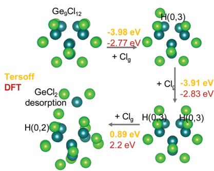
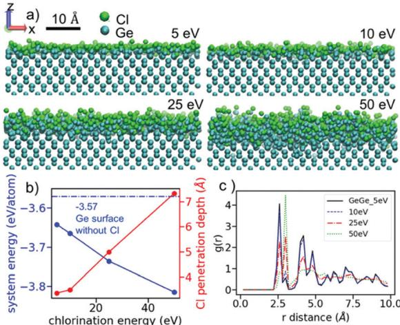
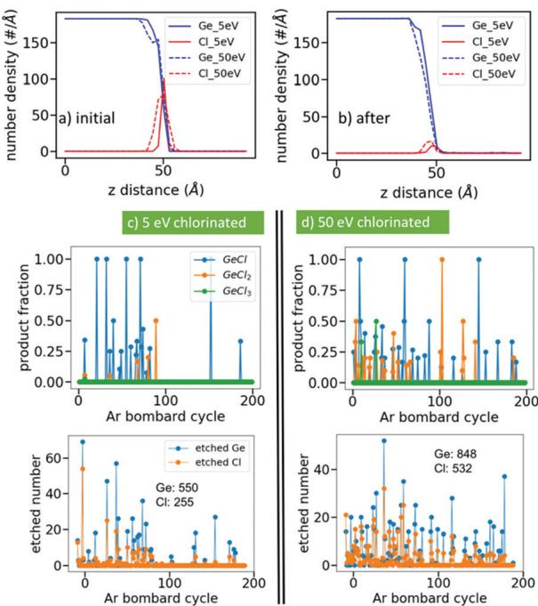
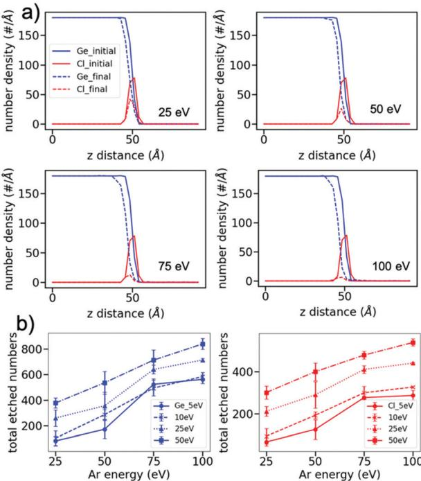

# Computational modelling of atomic layer etching of chlorinated germanium surfaces by argon†

Cite this: Phys. Chem. Chem. Phys., 2019, 21, 5898

Received 8th January 2019, Accepted 19th February 2019

DOI: 10.1039/c9cp00125e

rsc.li/pccp

The atomic layer etching of chlorinated germanium surfaces under argon bombardment was simulated using molecular dynamics with a newly fitted Tersoff potential. The chlorination energy determines the threshold energy for etching and the number of etched atoms in the bombardment phase. Etch rate is determined by bombardment energy.

With the decrease of electronic device size from the micro, via the nano, down to the atomic scale, the variability of the surface patterning needs to be controlled within dozens of atoms accordingly.1,2 Plasma etching is an essential surface patterning technique. Conventionally, it is realized by ionizing non- reactive species such as Ar to transfer energy to the surface, and at the same time another reactive species such as  $\mathrm{Cl}_2$  etches the surface either in its neutral or ionized state.3- 6 However, mixing of energetic and reactive flows leads to coupling of their transport, which increases complexity and makes it hard to achieve highly defined low feature sizes. Moreover, this mixing can lead to the damage of the etching front, as high energy ions distort the surface structure and open a way for reactive species to penetrate deep into the substrate  $(>20~\mathrm{nm})$  . Thus, new methods are needed to meet the requirement of precise etching control at the atomic scale, and atomic layer etching (ALE) has been proposed as one solution.1,2,7,8 The basic idea is to separate the energetic and reactive flows to avoid the above problems. It removes thin layers of material based on a two- step self- limiting reaction: surface modification and removal. Surface modification makes a surface layer within a well- defined range more easily to be etched afterwards; for example, one can use halogen gas adsorption on the semiconductor surface to weaken the bonds; in the removal step, plasma ions are controlled within a certain Shenli Zhang, Yihan Huang, Gulcin Tetiker, Saravanapriyan Sriraman, Alex Paterson and Roland Faller  $\oplus$  \*c

range of energy to remove the modified layers while avoiding physical sputtering of untreated materials.

The first report of this technique is by Yoder et al. in 1988 on diamond. Silicon and GaAs have been the most studied ALE materials since.1 Germanium is another interesting material as a candidate to replace Si for application as transistor channels due to its superior hole mobility. Several papers have been studied ALE of Ge experimentally,3,11,1 but the microscopic understanding of the influence of the process variables on etching is still missing. Such a study is crucial to determine appropriate conditions for ALE to achieve optimal accuracy and efficiency. To bridge this gap, we report our results of an ALE simulation using molecular dynamics on a Ge surface. The surface modification step involves chlorine adsorption (chlorination) of the Ge(100) surface. Chlorine has been found to be non- reactive with Ge below  $350^{\circ}\mathrm{C},$  and thus is suitable to be used for a self- limiting reaction at room temperature. Removal is then achieved by  $\mathrm{Ar^{+}}$  bombardment. In our simulation, neutral Ar is used instead of its charged state as the ion will become neutral when approaching the surface.12

A new variation of the Tersoff potential based on DFT data was developed for the Ge- Cl interaction, the format used is shown in eqn (1)- (8) (see ESI,  $\dagger$  Section S1 for discussion on the choice of potential and its training process).

$$
E = \frac{1}{2}\sum_{i}\sum_{j\neq i}V_{ij} \tag{1}
$$

$$
V_{ij} = f_{\mathrm{C}}(r_{ij})[f_{\mathrm{R}}(r_{ij}) + b_{ij}f_{\mathrm{A}}(r_{ij})] \tag{2}
$$

$$
f_{\mathrm{C}}(r) = \left( \begin{array}{c}1:r< R - D\\ \displaystyle \frac{1}{2} -\frac{1}{2}\sin \left(\frac{\pi r - R}{2}\right):R - D< r< R + D\\ 0:r > R + D \end{array} \right) \tag{3}
$$

$$
\begin{array}{r}f_{\mathrm{R}}(r) = A\exp (-\lambda_1r)\\ f_{\mathrm{A}}(r) = -B\exp (-\lambda_2r) \end{array} \tag{5}
$$

$$
\zeta_{ij} = \sum_{k\neq i,j}f_{\mathrm{C}}(r_{ik},g(\theta_{ijk})\exp [\lambda_3^m (r_{ij} - r_{ik})^m ] \tag{7}
$$

$$
g(\theta) = \gamma_{ijk}\left(1 + \frac{c^2}{d^2} -\frac{c^2}{[d^2 + (\cos\theta - \cos\theta_0)^2]}\right) \tag{8}
$$

where  $f_{\mathrm{R}}$  is a two- body repulsion term and  $f_{\mathrm{A}}$  the attraction term. The bond order term  $b_{ij}$  is a three- body term added to the attraction part, which includes all neighbors  $j$  and  $k$  of atom  $i$ .  $f_{\mathrm{C}}$  is the interaction cutoff function to smoothly transit full interaction to zero.  $R - D$  and  $R + D$  is the inner and outer cutoff distance. Interaction parameters for Ge- Ge and Cl- Cl atom pairs are available from previous literature, so only Ge- Cl interaction terms were trained, as shown in Tables 1 and 2.

Fig. 1 shows the validation of this potential on a small  $\mathrm{Ge_9Cl_{12}}$  cluster, similar to a previous study in Si- F case. The energy difference is obtained by energy minimization of the corresponding structure in both LAMMPS (Tersoff) and Gaussian (DFT). The B3LYP functional with the LanL2DZ basis set is used for DFT. Initial conditions with different Ge- Cl distance and angle were tested for each case, and consistent minimized structure was obtained. The bond length of the surface Ge- Ge in  $\mathrm{Ge_9Cl_{12}}$  was found to be  $2.43\mathrm{\AA}$  (DFT:  $2.56\mathrm{\AA}$ ), and adsorbed Ge- Cl bond length to be  $2.22\mathrm{\AA}$  (DFT:  $2.20\mathrm{\AA}$ ). The energy change calculated by the fitted Tersoff potential predicts exothermic (endothermic) nature for adsorption (desorption), and the desorption energy barrier is well above  $350^{\circ}\mathrm{C}$ , although the energy difference is  $1\mathrm{eV}$  lower than in DFT.

A Ge slab of surface dimension  $64\mathrm{\AA}\times 64\mathrm{\AA}$ $(8\sqrt{2}\times 8\sqrt{2}$  in lattice units, about 256 Ge atoms on the top surface) and  $113\mathrm{\AA}$  thick was first equilibrated at room temperature in LAMMPS in the NPT ensemble (anisotropic zero pressure in surface xy plane), with  $T_{\mathrm{damp}} = 0.1$  ps and  $P_{\mathrm{damp}} = 10$  ps. Dimers were found to form, consistent to both DFT and experimental results (see ESI,† Section S2 for details).  $800~\mathrm{Cl}$  atoms were then introduced with a flux normally incident onto the surface with a defined kinetic energy. One Cl atom at a time was introduced to the simulation box every  $0.1$  ps and the system was then equilibrated for  $2\mathrm{ns}$ . Single Cl atoms instead of  $\mathrm{Cl}_2$  molecules were used to shorten the equilibration time for the adsorption process, as with  $\mathrm{Cl}_2$  it also involves the Cl- Cl bond breaking step when it is adsorbed. Charged Cl species were not considered similar to the reason that Ar was used instead of  $\mathrm{Ar}^+$ . Four different chlorination energies were tested:  $5\mathrm{eV}$ ,  $10\mathrm{eV}$ ,  $25\mathrm{eV}$  and  $50\mathrm{eV}$ , and simulation was repeated with different initial Cl positions to generate three chlorinated configurations for each condition. Non- adsorbed Cl atoms or  $\mathrm{Cl}_2$  molecules ( $\mathrm{Cl}_2$  can be formed from two Cl atoms) were removed from the simulation cell. The adsorption criteria are based on the Ge- Cl bond length  $2.53\mathrm{\AA}$ , which means a Cl atom is considered non- adsorbed if it is more than  $2.53\mathrm{\AA}$  away from a surface Ge atom. Only chemisorption is considered. Chlorinated configurations were then subjected to Ar bombardment with energies varying from  $20\mathrm{eV}$  to  $100\mathrm{eV}$ . The interaction between Ar and  $\mathrm{Ge / Cl}$  is described by Ziegler- Biersack- Littmark (ZBL) potential, which describes high- energy collisions between atoms. The Ge slab was coupled to a room- temperature thermostat. During a bombardment cycle, one Ar atom is introduced towards the surface and stays in the simulation box for  $1.5\mathrm{ps}$ . Then the Ar atom is deleted and the system equilibrates for  $0.5\mathrm{ps}$ . Etched products were then deleted before the start of a new bombardment cycle. Two hundred bombardment cycles were performed for each test condition, and each condition was repeated three times with different chlorinated configurations. The determination of etching products is again based on bond distance  $r_{ij}$ . If  $r_{ij}< R_{ij}$  (1) (which is the inner cutoff distance for the  $i,j$  interaction in Tersoff potential), then atoms  $i$  and  $j$  are considered to be in the same cluster.

Table 1 Fitted two-body parameters using annealing algorithm.  $R_{\min} =$ $R - D$  and  $R_{\max} = R + D$  are set to be the average value from Ge-Ge and Cl-Cl cutoff distances  

<table><tr><td>Fitted parameters</td><td>Ge-Cl</td></tr><tr><td>A (eV)</td><td>521.8338</td></tr><tr><td>B (eV)</td><td>62.9673</td></tr><tr><td>λ1 (Å-1)</td><td>2.3248</td></tr><tr><td>λ2 (Å-1)</td><td>0.9857</td></tr><tr><td>rmin (Å)</td><td>2.53</td></tr><tr><td>rmax (Å)</td><td>2.83</td></tr></table>

Table 2 Fitted parameters in bond order  $b_{ij}$  term  

<table><tr><td>j-i-k parameters</td><td>Cl-Ge-Cl</td><td>Cl-Ge-Ge</td><td>Ge-Cl-Ge</td><td>Ge-Cl-Cl</td><td>Ge-Ge-Cl</td></tr><tr><td>m</td><td>3.0</td><td>3.0</td><td>1.0</td><td>1.0</td><td>3.0</td></tr><tr><td>γijk</td><td>1.0</td><td>1.0</td><td>4.0</td><td>4.0</td><td>1.0</td></tr><tr><td>λ3</td><td>0.0</td><td>0.0</td><td>6.0</td><td>6.0</td><td>0.0</td></tr><tr><td>c</td><td>1.0643 × 105</td><td>1.0643 × 105</td><td>0.0</td><td>0.0</td><td>1.0643 × 105</td></tr><tr><td>d</td><td>15.652</td><td>15.652</td><td>1</td><td>1</td><td>15.652</td></tr><tr><td>cosθ0</td><td>-0.43884</td><td>-0.43884</td><td>1</td><td>1</td><td>-0.43884</td></tr><tr><td>n</td><td>2.23669</td><td>0.67543</td><td>1</td><td>1</td><td>0.75627</td></tr><tr><td>β</td><td>1.234 × 10-4</td><td>1.0273 × 10-5</td><td>1</td><td>1</td><td>9.02 × 10-7</td></tr></table>

  
Fig. 1 DFT and Tersoff calculated energy change during  $\mathrm{Cl}_g$  adsorption and desorption from  $\mathrm{Ge_9Cl_{12}}$  cluster. Light green: Cl. Cyan: Ge. H(0,2) and H(0,3) marks the number of neighbour atoms  $k$  of Cl and Ge type for the surface Ge atom, not including its neighbour atom  $j$ . For example, H(0,2) means the surface Ge has zero Cl neighbours if not including the adsorbed Cl atom  $j$ , and has 2 other Ge atoms as its neighbours.

During chlorination, Cl atoms quickly adsorb and partially penetrate beneath the surface due to the strong incident energy. Few single Ge atoms and GeCl products leave the surface. Fig. 2a shows the side view of Ge surface after chlorination,

  
Fig. 2 (a) Side view of Ge surface after chlorination with different energies. The layer thickness showing here is around  $16\mathrm{\AA}$ . Non-adsorbed Cl/Cl $_2$  away from surface have been deleted. (b) System energy (including both kinetic and potential energy) after equilibration (error bar smaller than the symbol) and Cl penetration depth change with chlorination energy. The dashed blue line represents the system energy in pure Ge surface structure, which is  $-3.57\mathrm{eV}$  per atom. (c) Radial distribution function (RDF) of Ge-Ge atom pair within  $10\mathrm{\AA}$  from the chlorinated surface generated by different chlorination energy.

where increasing Cl adsorption and penetration with Cl incident energy can be seen. The adsorbed/absorbed Cl number increases from  $320\pm 5$  atoms  $(5\mathrm{eV})$  to  $616\pm 4$  atoms  $(50\mathrm{eV})$ . Defining Cl penetration depth as the full width at half maximum of Cl density peak, Fig. 2b demonstrates that the penetration depth increases with Cl incident energy. Notice the coverage on surface already reaches  $100\%$  at  $5\mathrm{eV}$  (coverage is defined as the Cl- bonded Ge numbers to the number of top layer Ge). From Ge- Cl coordination number (CN) characterization (Table 3), most Ge are bonded to one Cl, however increasing chlorination energy will increase the bonded Cl number (from the increase of the average CN). Also, more Ge will bond with Cl (from the increase of the coverage). The high population of Ge- 1Cl bonding is because the energy decrease from Ge- Ge to Ge- 1Cl is much larger than that from Ge- 1Cl to Ge- nCl. It is worth noting that the result could be sensitive to force field training, if the bond energy change from GeCl to  $\mathrm{GeCl_2}$  is larger than Ge- Ge to Ge- 1Cl, then Ge- 2Cl can be a more favorable configuration. The decrease of energy with Cl penetration can be also seen in the system energy (Fig. 2b). The system energy is defined as the total energy divided by the number of atoms in the system. It decreases with chlorination energy, or Cl numbers, as bonding between Ge and Cl is stronger than that among Ge. The Ge surface structure becomes highly distorted with increasing chlorination energy, as the radial distribution function in Fig. 2c shows the eventual formation of amorphous structures at  $25\mathrm{eV}$  and  $50\mathrm{eV}$ . It is also seen that the Ge- Ge bond length increases from  $2.8\mathrm{\AA}$  (in the perfect crystal) to  $3.2\mathrm{\AA}$  due to Cl penetration, as the first peak in RDF shifted towards longer bond distance with increasing energy.

  
Fig. 3 Snapshots of Ge surface after  $100\mathrm{eV}$  Ar bombardment (200 times). Light green: Cl. Cyan: Ge.

The influence of chlorination energy extends to the Ar bombardment stage. During the bombardment, energy from Ar was transferred to the surface and the weakened Ge- Ge bonds break, allowing Ge- Cl clusters or single atoms to leave as etching products. Few residual Cl atoms remain on the surface (Fig. 3, also from the difference between the etched Cl number and total adsorbed Cl number during chlorination).

To compare the surface morphology with different chlorination energies before and after the bombardment, density profiles (Fig. 4a and b) are used to show the etching front evolution. The  $Z$  axis is the surface normal pointing from the bulk to the top surface. The Ge density profile starts with a plateau in the bulk phase and then decreases to zero, where the transition region represents the surface layers. Correspondingly, Cl shows a density peak in this transition region due to surface adsorption and penetration. For initial configurations, the  $50\mathrm{eV}$  chlorinated case shows a wider Cl peak distribution than  $5\mathrm{eV}$  and Cl penetrates deeper as the peak position moves towards bulk, consistent with Fig. 2b. After bombardment with  $100\mathrm{eV}$  Ar, slightly more Ge layers have been etched away with the highly chlorinated configuration as the profile recedes more into the bulk region, while a similar amount of Cl residues stays on the surface. This could be understood by the fact that more Cl was adsorbed on the surface originally.

Next, to characterize the influence of chlorination energy on etching products, the product fraction, defined as the ratio of the number of a product to the total number of all the products (including physical sputtering products), is plotted for each Ar

Table 3 Percentage of different Ge-Cl coordination numbers (CN) at various chlorination energies, averaged from the three samples with standard deviation. Average CN and coverage are also calculated. Coverage is the ratio of Cl-bonded Ge numbers to the top layer Ge number (256) at the surface  

<table><tr><td>Cl energy (eV)</td><td>Ge-Cl</td><td>Ge-2Cl</td><td>Ge-3Cl</td><td>Ge-4Cl</td><td>Average CN</td><td>Coverage</td></tr><tr><td>5</td><td>0.60 ± 0.01</td><td>0.35 ± 0.005</td><td>0.05 ± 0.008</td><td>0 ± 0</td><td>1.45 ± 0.02</td><td>1.38 ± 0.03</td></tr><tr><td>10</td><td>0.55 ± 0.03</td><td>0.35 ± 0.03</td><td>0.10 ± 0.009</td><td>0.02 ± 0.02</td><td>1.61 ± 0.08</td><td>1.64 ± 0.03</td></tr><tr><td>25</td><td>0.45 ± 0.01</td><td>0.37 ± 0</td><td>0.18 ± 0.02</td><td>0.002 ± 0.001</td><td>1.74 ± 0.03</td><td>2.43 ± 0.06</td></tr><tr><td>50</td><td>0.41 ± 0.07</td><td>0.38 ± 0.02</td><td>0.21 ± 0.05</td><td>0.006 ± 0.006</td><td>1.81 ± 0.14</td><td>3.56 ± 0.05</td></tr></table>

  
Fig. 4 Number density change of  $5\in V$  chlorinated and  $50~\mathrm{eV}$  chlorinated surface (a) before and (b) after  $100~\mathrm{eV}$  Ar bombardment. Etching products fraction  $(\mathsf{GeCl},\mathsf{GeCl}_2$  and  $\mathsf{GeCl}_3$  ) and element etched number change in each Ar bombardment cycle for (c)  $5\in V$  and (d)  $50~\mathrm{eV}$  chlorinated surface. The insets number on etched number graph shows the total etched Ge and Cl number. Sample 1 is used as an example here. Characterizations for  $10~\mathrm{eV}$  and  $25~\mathrm{eV}$  chlorinated surface are shown in ESI,  $\dagger$  Fig.S7.

bombardment cycle, as shown in Fig. 4c and d.  $\mathrm{Ge_xCl_y}$  (with  $x > y$  clusters and single Ge atoms also appear during bombardment cycles (not shown in the above figure, fraction higher than GeCl). They are likely due to physical sputtering of several atoms together.  $\mathrm{Cl}_2$  was barely observed as an etching product in our case, almost all Cl were attached to Ge. GeCl was found to be the main chemical etching product, fluctuating around  $55 - 85\%$  depending on energy conditions (see  $\mathrm{ESI},\dagger$  Fig. S8 and Table S6), if only  $\mathrm{GeCl}_n$  clusters are considered.  $\mathrm{GeCl}_2$  is of between  $15 - 35\%$  followed by a very small fraction of  $\mathrm{GeCl}_3$  (below  $10\%$  ). The latter may be due to a slight inaccuracy in the force field (see  $\mathrm{ESI}^{\dagger}$  ). No  $\mathrm{GeCl}_4$  is found under any condition. This distribution follows the Ge- Cl CN trend in the chlorination step, as Ge- 1Cl has the highest fraction, followed by Ge- 2Cl and Ge- 3Cl. It's likely the chlorination morphology determines the etching product. Besides, for surface with low chlorination energy such as the  $5\mathrm{eV}$  case (Fig.4c), both Ge and Cl etched number decrease greatly after about hundred bombardment cycle, as the surface becomes deficient in Cl. This indicates two things: first, chlorination is necessary to weaken Ge- Ge bond strength and makes etching possible; second, amorphization of top Ge surface layers also weakens Ge- Ge bond strength such that physical sputtering is only possible within modified layers. With higher chlorination energy, the self- terminated etching process could require more Ar bombardment cycles.

By varying the Ar bombardment energy from  $25\mathrm{eV}$  to  $100\mathrm{eV}$  we see that the chlorination energy influences the threshold energy for etching. The density profile (Fig. 5a) indicates whether etching occurs. Fig. 5a shows the evolution of element density profile of  $25\mathrm{eV}$  chlorinated surface under different bombardment condition (see ESI,  $\dagger$  Fig. S9- S11 for other chlorinated conditions). At  $25\mathrm{eV}$  Ar energy, Cl density peak already starts to decrease, and Ge surface recedes towards the bulk phase. With  $50\mathrm{eV}$  Ar, the etching effect is more obvious, and most Cl has been etched away when Ar energy reaches  $75\mathrm{eV}$ . Thus, the threshold energy should be below  $25\mathrm{eV}$  Ar, matching well with the experimental operation window. Similarly, the  $5\mathrm{eV}$  chlorinated surface has a threshold energy between  $50 - 55\mathrm{eV}$ . For the  $10\mathrm{eV}$  chlorinated case, this threshold energy slightly decreases to  $25 - 50\mathrm{eV}$ , and for  $25\mathrm{eV}$  and  $50\mathrm{eV}$  chlorinated surface, etching starts below  $25\mathrm{eV}$ . Thus, a higher chlorination energy generally decreases the threshold energy for bombardment, possibly because the highly disordered surface structure makes it more vulnerable for detachment.

  
Fig. 5 (a) Density profile of Ge and Cl element change before and after 200 times Ar bombardment with different bombardment energy on  $25\mathrm{eV}$  chlorinated surface. (b) Total etched number change (blue: Ge, red: Cl) with Ar bombardment energy for each chlorination condition, averaged from three samples with error bars calculated.

Meanwhile, we notice the complete etching (defined as when the Cl peak density approaches zero and no longer evolves) occurs between  $60 - 75\mathrm{eV}$  bombardment energy for  $5\mathrm{eV}$  chlorinated surface, while it increases to the  $75 - 100\mathrm{eV}$  range for  $10$  and  $25\mathrm{eV}$  chlorinated surfaces, and higher than  $100\mathrm{eV}$  for the  $50\mathrm{eV}$  case, possibly because the Cl atoms penetrate deeper into the surface for high chlorination energy. Besides, both chlorination energy and bombardment energy have an impact on the etching efficiency. Fig. 5b shows the change of the total etched number of Ge and Cl atoms with Ar energy for each chlorinated condition. Several things can be noticed here. First, both Ge and Cl etching increases with Ar energy. Since the etching time and bombardment flux is fixed,

this indicates a higher etching rate and efficiency at higher bombardment energy. Second, the etching numbers change of Ge and Cl are coupled. Both etched Cl and Ge number in  $5\mathrm{eV}$  chlorinated case tend to reach a plateau with increasing Ar energy, due to the limited Cl number and modification layer in the system (self- limited etching process), which further proves the bond weakening by chlorination. Higher chlorination energy such as  $50\mathrm{eV}$  postpones the appearance of the plateau, as more Cl are originally in the system. If the Ar energy is further increased beyond the plateau, the etched Ge number should increase quickly again due to pure physical sputtering. This naturally leads to the third conclusion that this limit of chemically etched number depends on chlorination energy, or the number of Cl available in the system.

In conclusion, we used molecular dynamics with a newly improved and validated Ge- Cl Tersoff potential to understand the influence of operation energy on each stage in ALE of Ge and their synergy effect. The chlorination energy is the key factor in surface modification step. Increasing chlorination energy increases Cl adsorption and its penetration depth. It also increases Ge- Cl coordination number from Ge- 1Cl to Ge- 2Cl and turns the surface into amorphous layer after  $25\mathrm{eV}$ . The configuration and composition of modified surface then dominates the etching results in Ar bombardment step. First, GeCl is the main chemical etching product in our case, as Ge- 1Cl is also the main CN during chlorination. Second, the chlorination quantity determines the limit of chemically etched number in bombardment stage. This reflects the self- limiting characteristic in ALE, as the etching termination point is based on the number of Ge- Ge bonds that have been weakened. The more Cl atoms are bonded in the system, the more etched atoms leave. Third, the extent of chlorination determines the threshold for etching. Highly chlorinated surfaces lead to a lower threshold energy, and at the same time a higher energy or more Ar bombardment cycles for complete etching. The lowest threshold energy is below  $25\mathrm{eV}$  for the 25 and  $50\mathrm{eV}$  chlorinated cases. In terms of the influence of bombardment energy, the effective self- terminated etching would require a specific energy range, higher than the threshold energy but lower than spontaneous physical sputtering. And within this range, the increase of bombardment energy leads to an increase of etching rate.

Our work demonstrates the microscopic link between the surface modification and bombardment step in a Ge- Cl reaction system. Future work should focus on the improvement of the

Ge- Cl force field, a full characterization of the operation energy window, and experimental validation.

# Conflicts of interest

There are no conflicts to declare.

# Acknowledgements

We thank the Silicon Valley Community Foundation for a gift which partially supported this research.

# Notes and references

1 K. J. Kanarik, T. Lill, E. A. Hudson, S. Sriraman, S. Tan, J. Marks, V. Vahedi and R. A. Gottscho, J. Vac. Sci. Technol., A, 2015, 33, 020802. 2 K. J. Kanarik, S. Tan, W. Yang, T. Kim, T. Lill, A. Kabansky, E. A. Hudson, T. Ohba, K. Nojiri, J. Yu, R. Wise, I. L. Berry, Y. Pan, J. Marks and R. A. Gottscho, J. Vac. Sci. Technol., A, 2017, 35, 05C302. 3 J. W. Coburn and H. F. Winters, J. Appl. Phys., 1979, 50, 3189- 3196. 4 R. A. Gottscho, C. W. Jurgensen and D. J. Vitkavage, J. Vac. Sci. Technol., B: Microelectron. Nanometer Struct.- Process., Meas., Phenom., 1992, 10, 2133- 2147. 5 K. Nojiri, Dry etching technology for semiconductors, Springer, 2015. 6 V. M. Donnelly and A. Kornblit, J. Vac. Sci. Technol., A, 2013, 31, 030825. 7 G. S. Oehrlein, D. Metzler and C. Li, ECS J. Solid State Sci. Technol., 2015, 4, N5041- N5053. 8 K. J. Kanarik, S. Tan and R. A. Gottscho, J. Phys. Chem. Lett., 2018, 9, 4814- 4821. 9 M. N. Yoder, Atomic layer etching, US Pat., 4756794, 1988. 10 T. Sugiyama, T. Matsuura and J. Murota, Appl. Surf. Sci., 1997, 112, 187- 190. 11 K. Ikeda, S. Imai and M. Matsumura, Appl. Surf. Sci., 1997, 112, 87- 91. 12 H. D. Hagstrum, Phys. Rev., 1954, 96, 325- 335. 13 D. Humbird and D. B. Graves, J. Chem. Phys., 2004, 120, 2405- 2412. 14 S. Plimpton, J. Comput. Phys., 1995, 117, 1- 19. 15 J. F. Ziegler, J. P. Biersack and U. Littmark, The Stopping and Range of Ions in Matter, Pergamon, 1985, vol. 1.