# Dynamics of plasma atomic layer etching: Molecular dynamics simulations and optical emission spectroscopy

Special Collection: Atomic Layer Etching (ALE)

Joseph R. Vella  $\oplus$  ; Qinthan Hao  $\oplus$  ; Vincent M. Donnelly  $\oplus$  ; David B. Graves  $\oplus$

# Check for updates

J. Vac. Sci. Technol. A 41, 062602 (2023) https://doi.org/10.1116/S00003011.1

# Articles You May Be Interested In

Reactor wall effects in  $\mathrm{Si - Cl_2}$  Ar atomic layer etching

J. Vac. Sci. Technol. A (June 2024)

Atomic layer etching in HBr/He/Ar/O₂ plasmas

J. Vac. Sci. Technol. A (May 2024)

Comparisons of atomic layer etching of silicon in  $\mathrm{Cl}_2$  and HBr- containing plasmas

J. Vac. Sci. Technol. A (December 2024)

# Dynamics of plasma atomic layer etching: Molecular dynamics simulations and optical emission spectroscopy

Cite as: J. Vac. Sci. Technol. A 41, 062602 (2023); doi: 10.1116/s0003011  Submitted: 27 July 2023 · Accepted: 9 October 2023 · Published Online: 13 November 2023

Joseph R. Vella,  $\oplus$  Qinzhen Hao,  $\oplus$  Vincent M. Donnelly,  $\oplus$  and David B. Graves $^{1,3,a)}$

# AFFILIATIONS

$^{1}$ Princeton Plasma Physics Laboratory, Princeton, New Jersey 08540   $^{2}$ William A. Brookshire Department of Chemical and Biomolecular Engineering, University of Houston, Houston, Texas 77204   $^{3}$ Department of Chemical and Biological Engineering, Princeton University, Princeton, New Jersey 08540

Note: This paper is part of the 2024 Special Topic Collection on Atomic Layer Etching (ALE).   $^{a)}$ Author to whom correspondence should be addressed: dgraves@pppl.gov

# ABSTRACT

Atomic layer etching is intrinsically dynamic as it involves sequential and repeated exposures of a surface to be etched with different species at different energies. The composition and structure of the near surface region change in both time and depth. Full understanding of this process requires resolving both temporal and spatial variations. In this work, we consider silicon (Si) atomic layer etching (ALE) by alternating exposure to chlorine gas  $(\mathrm{Cl}_2)$  and argon ions  $(\mathrm{Ar}^{+})$ . Molecular dynamics (MD) simulations are compared to experimental measurements with the aim of better understanding the dynamics of ALE and to test the simulation procedure. The simulations help to more fully interpret the experimental measurements. Optical emission measured just above the surface being etched can be related to etch products and can, therefore, be directly compared to simulation predictions. The simulations capture the measured initial product distribution leaving the surface and match the measured etch per cycle reasonably well. While simulations demonstrate the importance of ion- induced surface damage and mixing into a layer below the surface, the depth of which depends mainly on ion energy, the experiments suggest there is more Cl mixed into the layer than the MD procedure predicts.

Published under an exclusive license by the AVs. https://doi.org/10.1116/6.0003011

# I. INTRODUCTION

Plasma- assisted atomic layer etching (ALE) processes are designed (at least in principle) for etching with atomic- scale precision. $^{1 - 8}$  These techniques involve the sequential and pulsed application of different gases and plasma protocols and have had significant success industrially, even in cases for which true ALE is not achieved. The technique involves complex pulsing strategies with gas composition and plasma powers being altered sequentially. We focus here on ALE of silicon (Si) using chlorine chemistry (Cl) to modify the surface layer at atoms and argon ions  $(\mathrm{Ar}^{+})$  to remove the chlorinated layer. $^{9 - 13}$  This system has also been studied using molecular dynamics simulations. $^{14 - 17}$  However, there have been few direct comparisons between experimental and MD studies. It is common for these thrusts to be performed separately, or for MD studies to refer to previous experimental results to validate simulation predictions. In this work, we aim to combine MD ALE simulations, similar to our previously published work, $^{16,17}$  with recent ALE and optical emission spectroscopy (OES) experiments $^{18}$  in order to better understand  $\mathrm{Si - Cl}_2$ - Ar ALE. Direct comparison of simulation with measurements can both help test the assumptions used in the simulation and can also help interpret experimental measurements. In Si ALE with chlorine, the chlorination step can be performed using a chlorine plasma or with chlorine gas  $(\mathrm{Cl}_2)$ . We have chosen to focus on using chlorine gas  $(\mathrm{Cl}_2)$  to keep the system as simple as possible for this comparison of MD simulation with the experiment.

The paper is organized as follows. Section II will provide details on the experimental setup and the MD simulations will be described in Sec. III. Results focusing on the comparison between MD and experiments will be given in Sec. IV. Section V will

discuss the comparison of simulations and experimental observations. Finally, Sec. VI will give concluding remarks and comments on future work.

# II. EXPERIMENTAL METHODS

The apparatus used in this study has been described in greater detail in previous publications.18- 24 It consisted of an inductively coupled plasma (ICP) source and substrate stage, powered at 13.56 and  $18\mathrm{MHz}$  respectively. Figures 1 presents a schematic of the side view of the apparatus.

The plasma was confined by a water- cooled, yttria- coated aluminum liner, inside a cylindrical stainless steel chamber. Gas was injected radially symmetrically at the top and pumped radially at the bottom. The 6 in. diameter flat ICP coil was adjacent to a quartz window. Si (100) wafers (3 in. diameter) were mounded with double- sided carbon tape on a 3 in. diameter stainless steel holder. In some cases,  $\mathrm{SiO_2}$  - masked Si coupon pieces were taped to the Si wafer, and  $405~\mathrm{nm}$  laser interferometry was used to measure real- time etching rates. The sample stage was surrounded by an alumina ring, so that when the sample holder was placed on the stage, no stainless steel was exposed. The sample holders were moved in and out of the chamber through a vacuum load- lock. The DC self- bias potential with respect to ground potential was measured through rf- chokes. Cl gas flow, and powers to the ICP and substrate stage, applied through impedance- matching networks, were turned on and off under computer control. Using a continuous Ar carrier gas flow of 80 standard cubic centimeters per minute (SCCM), one 7 s ALE cycle consisted of a  $2\mathrm{s},20\mathrm{SCCM}$ $\mathrm{Cl}_2$  flow with no ICP power  $(250W)$  at  $300\mathrm{K}$  and  $20\mathrm{mTorr}$  followed by  $3\mathrm{s}$  of both ICP and bias power, an additional 1 s of ICP power only, and then a 1 s period with ICP power turned off. DC self- bias voltage,  $\mathrm{Cl}_2$  flow rate, and total pressure were measured continuously during multiple ALE cycles. An example of these measurements for one ALE cycle is given in Fig. 2.

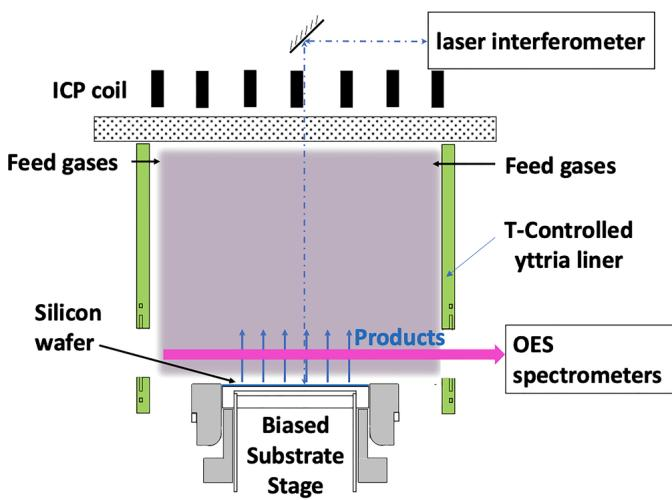  
FIG. 1. Schematic of the experimental apparatus. The plasma is powered by an inductively coupled coil at the top and by a RF biased substrate stage. The major measurements are of the etch rate (via laser interferometry) and optical emission spectroscopy of species near the silicon substrate being etched during the  $\mathsf{Ar}^+$  bombardment stage of ALE.

In pure Ar plasmas, positive ion saturation current was measured by applying negative DC bias voltage to the substrate. From these measurements, a positive ion flux of  $3.7\times 10^{16}\mathrm{Ar^{+} / cm^{2}s}$  was measured for  $250\mathrm{W}$  ICP power. This corresponds to a positive ion density of about  $2.3\times 10^{11}\mathrm{Ar^{+} / cm^{3}}$  above the Si surface. The measured  $\mathrm{Ar^{+}}$  flux is used as input to the MD simulations, as described in Sec. III.

Optical emission along a line approximately  $1\mathrm{cm}$  above the substrate surface was collected with lenses and optical fibers and dispersed with spectrometers (Ocean Optics HR4000, Ocean Insights May  $2000\mathrm{Pro}$  and McPherson model 218 with an RCA C31034 GaAs photomultiplier tube), with full width at half maximum resolutions of 0.17,  $0.4\mathrm{nm}$  and variable, respectively. Spectra were recorded continuously every  $0.05\mathrm{s}$  In a previous study, using modulated bias power, it was shown that the emission is largely representative of products sputtered from the surface early in the bias period.18 Later in the bias period, slowly evolving etch product residues on the chamber walls may contribute to weaker emission intensities detected from Si- containing products. The significance of this observation is discussed in greater detail later on.

The ion energy distribution impacts the Si surface during the exposure to  $\mathrm{Ar^{+}}$  will depend on the difference between the plasma potential and the surface potential and will likely be nonmonotonic. The MD simulations assume a single ion energy impacting the surface for a given RF bias, and so we require an estimate of the average ion energy. With rf bias power applied to the substrate, as noted above, the DC self- bias potential with respect to ground potential was measured through rf- chokes. Since no Faraday shield was used between the inductive coil source and the quartz window, some degree of capacitive coupling from the coil to

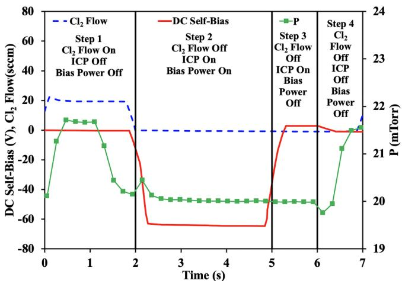  
FIG.2.  $\mathbb{C}\mathbb{I}_2$  mass flow, pressure, and DC bias during one 7 s ALE cycle. The applied DC bias is  $-65\mathrm{V}$  for this case. The Ar flow (80 SCCM) is on continuously throughout the cycle. ICP power is 250 W.

the plasma will generate an additional RF and DC component of the plasma potential. The average ion energy will be close to the difference in DC plasma potential,  $\mathrm{V}_{p}$ , and the measured DC self- bias voltage,  $\mathrm{V}_{DC}$ . Assuming a plasma potential of approximately  $4.8 \mathrm{T}_{e}$  above, a  $3 \mathrm{V}$  floating potential and an (estimated) electron temperature,  $\mathrm{T}_{e} = 3 \mathrm{eV}$ , the average ion energy is approximately  $17 - \mathrm{V}_{DC} \mathrm{eV}$ . This is the value used in the MD simulations reported in Sec. III.

# III. MD SIMULATIONS

We model  $\mathrm{Si - Cl}_2 - \mathrm{Ar}$  ALE using classical MD simulations. Interactions for  $\mathrm{Si - Si}$ ,  $\mathrm{Si - Cl}$ , and  $\mathrm{Cl - Cl}$  are modeled using the reactive empirical bond order (REBO) potential $^{25}$  that was originally parameterized by Humbird and Graves. $^{26}$  As noted in another publication, $^{27}$  some of the  $\mathrm{Si - Cl}$  parameters were altered to better approximate spontaneous etching of  $\mathrm{Si}$  by  $\mathrm{Cl}$  atoms; however, we do not expect this to be significant for  $\mathrm{Si - Cl}_2 - \mathrm{Ar}$  ALE simulations. The Molière potential $^{28}$  is used for all interactions with  $\mathrm{Ar}^{+}$ .

As described in previous works, $^{16,17}$  we model ALE as a series of independent "impact simulations" of species originating from the gas or plasma. An impact simulation is a MD trajectory that is run for approximately  $2 \mathrm{ps}$  under the microcanonical ensemble (constant number of particles, volume, and energy). In these simulations, a semi- infinite slab of initially diamond- cubic  $\mathrm{Si}$  is created with periodic boundaries imposed in the lateral  $x$  and  $y$  directions. The lattice spacing of the crystal corresponds to  $\mathrm{Si}$  at  $300 \mathrm{K}$ . The volume of the cell is  $32.60 \times 32.60 \times 54.34 \mathrm{\AA}^{3}$ . In this work, we will refer to one monolayer (ML) of fluence for a given species as  $1 \times 10^{15}$  impacts of said species per  $\mathrm{cm}^{2}$  to or from the surface. The (100) surface of the  $\mathrm{Si}$  crystal is exposed to a vacuum space in the  $z$  direction. During the impact simulations, we place a  $\mathrm{Cl}_2$  molecule or an  $\mathrm{Ar}^{+}$  (depending on whether we are in the process of modeling the chemical modification step or the ion bombardment step) at a random  $(x,y)$  position in the vacuum space above the cell. The molecule or ion is allowed to impact the surface of the cell. The velocities of the incoming species are assigned depending on whether they are described as "thermal" or "energetic."  $\mathrm{Cl}_2$  molecules are "thermal" and their velocity components are assigned according to the Maxwell- Boltzmann distribution at  $300 \mathrm{K}$ . Only  $\mathrm{Cl}_2$  molecules with a negative  $z$  velocity component are considered in order to ensure they hit the surface of the simulation cell.  $\mathrm{Ar}^{+}$  ions are "energetic" and only have a negative  $z$  velocity assigned based on the ion energy being simulated. Ions are assumed to neutralize before impact. Energetic  $\mathrm{Ar}^{+}$  is assumed to impact at purely normal incidence. Following the initiation of the particle trajectory toward the surface, the simulation runs for about  $2 \mathrm{ps}$  after the impact. The bottom two layers of the  $\mathrm{Si}$  slab are fixed so that the cell does not drift in the negative  $z$  direction. The depth of the cell is maintained such that incoming species do not interact with the fixed atoms at the bottom of the cell. After each impact simulation, a Beredensen thermostat $^{29}$  is applied to bring the simulation cell back to a set temperature. In this work, the set temperature is  $300 \mathrm{K}$ . Also, etch products leaving the surface are identified at the end of each impact simulation. Previous reports $^{27,30}$  give details on the etch product identification routine. After two layers of  $\mathrm{Si}$  atoms are etched, two more layers are added to the bottom of the cell.

It is important to emphasize the differences between the ALE experiments and MD simulations. A single ALE cycle consists of a chemical modification step followed by an ion bombardment step. In the experiments that we are attempting to model with the MD simulations, the chlorination step is done by exposure to  $\mathrm{Cl}_2$  gas for  $2 \mathrm{s}$ , as noted above. If we refer to the specification given in Sec. II (2 s of  $20 \mathrm{SCCMCl}_2$  flow at  $300 \mathrm{K}$  and  $20 \mathrm{mTorr}$  using a continuous Ar carrier gas flow of  $80 \mathrm{SCCM}$ ), we can estimate the flux of  $\mathrm{Cl}_2$  impacting the surface. The mean velocity,  $\nu_{m}$ , of the  $\mathrm{Cl}_2$  molecules are estimated to be  $3 \times 10^{4} \mathrm{cm / s}$ . From the ideal gas law, the number density of  $\mathrm{Cl}_2$ ,  $\nu_{Cl_2}$ , is  $1.3 \times 10^{14} \mathrm{Cl}_2 / \mathrm{cm}^3$ . From the kinetic gas theory, the  $\mathrm{Cl}_2$  flux to the  $\mathrm{Si}$  substrate is given by  $\frac{1}{4} \nu_{m} n_{Cl_2} = 9.8 \times 10^{17} \mathrm{Cl}_2 / \mathrm{cm}^3 \mathrm{s}$ . With  $1 / 8$ $2 \mathrm{s}$  exposure time, this corresponds to a fluence of  $2.94 \times 10^{18} \mathrm{Cl}_2 / \mathrm{cm}^2$  (or  $2940 \mathrm{ML}$  of  $\mathrm{Cl}_2$ ). In the MD simulations, we model the chlorination step as 3000 thermal  $\mathrm{Cl}_2$  molecules impacts on a  $32.60 \times 32.60 \mathrm{\AA}^2$  surface. This corresponds to a fluence of  $2.82 \times 10^{16} \mathrm{Cl}_2$  molecules  $/ \mathrm{cm}^2$  or roughly  $28.2 \mathrm{ML}$  of  $\mathrm{Cl}_2$  molecules. The simulated  $\mathrm{Cl}_2$  fluence is, therefore, much lower than experimental  $\mathrm{Cl}_2$  fluence; however, as will be shown in the supplementary material, $^{31}$  the simulated  $\mathrm{Cl}$  surface coverage saturates by approximately  $30 \mathrm{ML}$  of  $\mathrm{Cl}_2$  fluence. See the supplementary material $^{31}$  for surface flux and fluence calculations and explicit evidence that a larger  $\mathrm{Cl}_2$  fluence will not result in more  $\mathrm{Cl}$  uptake into the  $\mathrm{Si}$  slab in the MD simulations. Therefore, to speed up computations, we use  $28.2 \mathrm{ML}$  of  $\mathrm{Cl}_2$  molecules for the chlorination step. However, it is important to note that the simulation time for the chlorination step is much shorter than the experimental chlorination step. As mentioned in the second paragraph of this section, each impact simulations last approximately  $2 \mathrm{ps}$ . Therefore, the simulated time for the chlorination step is only about  $3 \mathrm{ns}$ , orders of magnitude below the  $2 \mathrm{s}$  experimental time. Due to the timestep of the MD simulations being on the order of  $1 \mathrm{fs}$ , it is computationally intractable to directly simulate the experimental timescales. We address the question of whether the simulation procedure properly models surface chlorination in Sec. V.

For the experimental ion bombardment step, a flux of  $3.7 \times 10^{16} \mathrm{Ar}^{+} / \mathrm{cm}^{2} \mathrm{s}$  with an exposure time of  $3 \mathrm{s}$  corresponds to a fluence of  $1.11 \times 10^{17} \mathrm{Ar}^{+} / \mathrm{cm}^{2}$  or  $111 \mathrm{ML}$  of  $\mathrm{Ar}^{+}$ . In the MD simulations, we model the ion bombardment step as 3000 energetic  $\mathrm{Ar}^{+}$  impacts on a  $32.60 \times 32.60 \mathrm{\AA}^2$  surface. The corresponding fluence is  $2.82 \times 10^{16} \mathrm{Ar}^{+} / \mathrm{cm}^{2}$  or  $28.2 \mathrm{ML}$  of  $\mathrm{Ar}^{+}$ . At  $\mathrm{Ar}^{+}$ energies that are higher than the physical sputtering threshold for  $\mathrm{Si}$ , we need to account for physical sputtering when comparing experimental results to MD results. This is particularly important when comparing etch per cycles (EPCs). We will give details on how we handle this comparison in Sec. IV. It is also important to point out that, similar to the simulation of the chlorination step, the simulated time for the ion bombardment step is only about  $3 \mathrm{ns}$ , once again orders of magnitude below the  $3 \mathrm{s}$  experimental time. It should also be noted that in the MD code,  $\mathrm{Ar}^{+}$ are deleted at the end of each impact simulation. Finally, there is a  $1 \mathrm{s}$  period in the experimental section with no  $\mathrm{Cl}_2$  flow and with the ICP power turned off. This period is also not modeled in the MD simulations.

The major differences between the experiments and MD simulations can be summarized as follows. First, for both the chlorination and ion bombardment steps, the MD simulations use a lower

fluence of the relevant species to the surface than the experiments. Simulated surface chlorination of silicon by  $\mathrm{Cl}_2$  via dissociative adsorption appears to match published results as summarized previously. $^{16,17}$  The MD simulations predict self- limiting near- saturation of  $\mathrm{Cl}$  on the surface. The ion bombardment step, however, is not self- limiting as there will be some physical sputtering. We discuss the implications of this mismatch in simulated and experimental fluence in the following sections.

We simulated ion impact energies ranging from 15 to  $215\mathrm{eV}$  In all cases, multiple independent cycles are simulated in order to reach cyclic steady state. Once this has been achieved, we calculate the etch per cycle (EPC) and analyze the etch products that leave the surface during the ion bombardment step. The EPC and relative  $\mathrm{SiCl}_x$  (for  $x = 0 - 2$ ) and  $\mathrm{Cl}$  yields can be directly compared to experimental results.

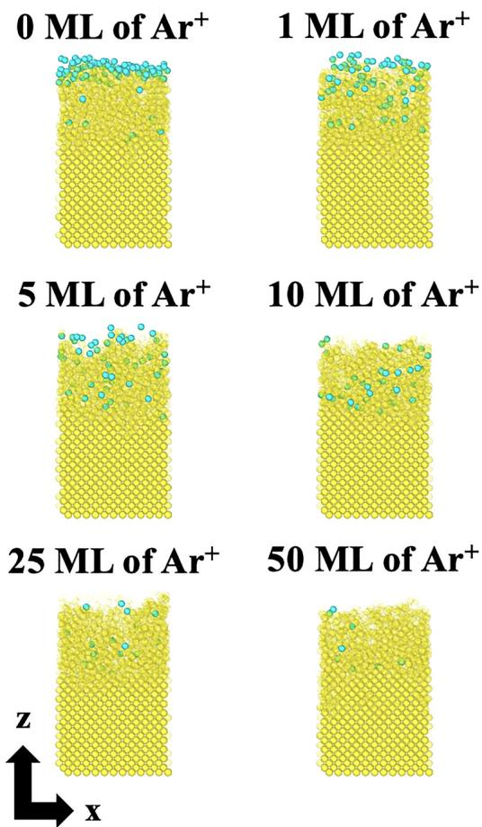  
FIG. 3. Side views of the simulations cell at various values of  $\mathsf{Ar}^+$  fluences during the ion bombardment step. The snapshot with the label of  $0\mathrm{ML}$  of  $\mathsf{Ar}^+$  refers to the simulation cell immediately after the chlorination step, before ion bombardment has begun. Translucent yellow spheres are  $\mathrm{Si}$  atoms, and solid cyan spheres are  $\mathrm{Cl}$  atoms. The  $\mathsf{Ar}^+$  energy is  $80\mathrm{eV}$ . The key results are that ion bombardment rapidly mixes  $\mathrm{Cl}$  into an amorphous layer about  $1\mathrm{nm}$  deep and that the  $\mathrm{Cl}$  is nearly uniform throughout the layer after a few  $\mathrm{ML}$  of fluence. The  $\mathrm{Cl}$  content in the layer slowly decreases with ion fluence. The snapshots were rendered in Ovito (Ref. 32).

# IV. RESULTS

In a recent publication, $^{17}$  we used MD simulations to study the near- surface etching behavior during  $\mathrm{Si - Cl}_2$ - Ar ALE. Here, we compare MD simulations to experiments. Figures 3 and 4 show snapshots of the simulation cell during various points of the final ion bombardment step using  $80\mathrm{eV}$ $\mathrm{Ar}^+$ . Figure 3 show the side views of the simulation cell, while Fig. 4 shows the top views.

The first snapshot (upper- left) in Fig. 3 shows the simulation cell immediately after the final chlorination step, before ion bombardment has begun. It can be seen that there is a heavily chlorinated region at the very top of the simulation cell. Underneath this region is a damaged amorphous mixed region with  $\mathrm{Cl}$  atoms throughout and, finally, the crystalline silicon region. As ion bombardment progresses, the heavily chlorinated region begins to be depleted either by atomic  $\mathrm{Cl}$  sputtering,  $\mathrm{SiCl}_x$  etching, or mixing of  $\mathrm{Cl}$  atoms deeper into the amorphous mixed layer. The amount of  $\mathrm{Cl}$  on the surface continues to decrease as the fluence of  $\mathrm{Ar}^+$

  
FIG. 4. Top views of the simulations cell at various values of  $\mathsf{Ar}^+$  fluences during the ion bombardment step corresponding to Fig. 3 (80 eV ion energy). The surface of the cell can be seen to be nearly saturated with  $\mathrm{Cl}$  before ion bombardment has begun (i.e.,  $0\mathrm{ML}$  fluence). After  $50\mathrm{ML}$  of ion fluence,  $\mathrm{Cl}$  is nearly but not completely removed from the surface. The snapshots were rendered in Ovito (Ref. 32).

increases as seen in Fig. 4. It is important to note that the amorphous region remains (Fig. 3).

increases as seen in Fig. 4. It is important to note that the amorphous region remains (Fig. 3).Figure 5 depicts the major events during the ion bombardment step of  $\mathrm{Si - Cl_2 - Ar}$  ALE. The Si slab is separated into three regions, the Cl layer, the amorphous mixed layer, and the crystalline Si region. The major etch products we observe are atomic Cl,  $\mathrm{SiCl}$ ,  $\mathrm{SiCl_2}$ , and atomic Si. As shown below, atomic Cl is the major etch product at the beginning of the ion bombardment step. As the ion bombardment step continues, the silicon chlorides dominate the etch product distribution and Cl from the top layer will be mixed into the underlying amorphous region. At higher  $\mathrm{Ar^+}$  fluences atomic Si is the main etch product observed. In this static image, Si from the underlying crystalline region replaces Si that is etched from the amorphous region.

# A. Comparison of etch per cycle (EPC)

The first comparison between the MD simulations and ALE experiments is the amount of Si etched per cycle (EPC) as a function of  $\mathrm{Ar^+}$  energy. As stated in Sec. III, we simulate several ALE cycles to reach a cyclic steady state before an EPC value is calculated. Figure 6 shows the amount of Si etched and Cl uptake as a function of cycle number, for one such simulation. The amount of Si etched in units of  $\mathrm{\AA}$  is calculated by counting the number of Si atoms that are removed from the surface and using the density of crystalline Si at  $300\mathrm{K}$  to calculate the etch depth. Note that these results are for  $100\mathrm{eVAr^{+}}$  and are representative of the other energies simulated. By tracking the Cl uptake, it appears that the cyclic steady state is reached after about three or four cycles. This is consistent with results obtained previously. It is also apparent that during the chlorination step, the cell is close to reaching complete saturation of Cl, thus more  $\mathrm{Cl}_2$  will not significantly alter the results.

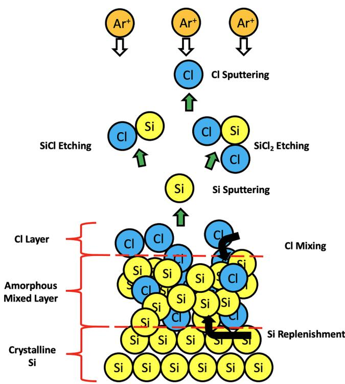  
FIG. 5. Depiction of the near-surface phenomena during  $\mathsf{Ar^+}$  bombardment in  $\mathrm{Si - Cl_2 - Ar}$  ALE as observed in MD simulations. The regions labeled by red brackets and separated by red dashed lines are the Cl layer, amorphous mixed layer, and crystalline Si region. The green arrows indicate the major products leaving the surface (atomic Cl,  $\mathrm{SiCl}_2$  and atomic Si). The black arrows indicate two major events occurring near the surface. These events are Cl mixing from the Cl layer into the mixed layer and Si replenishment from the crystalline Si region into the mixed layer.

As discussed in Sec. III, the  $\mathrm{Ar^+}$  simulated ion fluence during the ion bombardment step is smaller than the experiments. Therefore, to do a proper comparison between the MD predicted and experimental EPCs, the MD results are extrapolated to the experimental ion fluence. An example of this extrapolation is shown in Fig. 7 for the final cycle of the  $100\mathrm{eV}\mathrm{Ar}^{+}$  case. The value of the  $\mathrm{Ar^+}$  fluence we extrapolate to is approximately  $111\mathrm{ML}$  of  $\mathrm{Ar^+}$  (Note this corresponds to a value of about  $139\mathrm{ML}$  on the  $\mathcal{X}$  axis of Fig. 7 due to the fact that  $\mathrm{Cl}_2$  impacts are also included.). This experimental ion fluence is estimated from the experimental flux as detailed in Sec. III.

A comparison between simulated and experimental EPC values is shown in Fig. 8. Multiple cycles were used to determine etching rates presented in Fig. 8 (typically, 50- 300). In this plot, we employ the estimated experimental ion energies as described above. There is good agreement between the experiments and simulations up to ion energies of about  $125\mathrm{eV}$ . At higher energies, MD simulations underestimate the EPC relative to the experiments. The reason(s) behind this underestimation are under investigation. One possibility is the assumed monoenergetic ion energy distribution function neglects higher energy ions in the RF- biased sheath. In

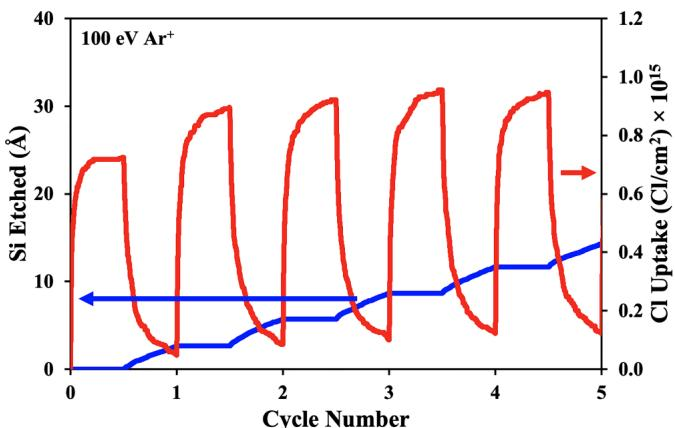  
FIG. 6. Amount of Si etched (in units of  $\mathrm{A}$ ) (blue lines) and Cl uptake (red lines) as a function of cycle number for  $\mathrm{Si - Cl_2 - Ar}$  ALE simulation using  $100\mathrm{eV}$ $\mathrm{Ar^+}$ . One cycle consists of  $28.2\mathrm{ML}$  of  $\mathrm{Cl}_2$  molecule impacts and  $28.2\mathrm{ML}$  of  $\mathrm{Ar^+}$  impacts. The surface is nearly saturated with Cl before ion bombardment starts each cycle. Ion bombardment reduces the Cl content of the layer (shown as an equivalent surface coverage of  $\mathrm{Cl / cm^2}$ ).

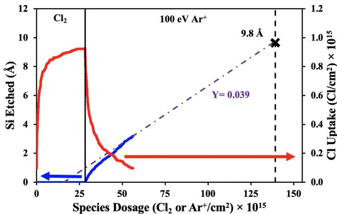  
FIG. 7. Amount of Si etched in units of  $\dot{A}$  (blue lines) and Cl uptake (red lines) during the final cycle for the  $\mathrm{Si - Cl_2 - Ar}$  ALE simulation using  $100\mathrm{eVAr^{+}}$  The final portion of the ion bombardment step (purple dashed-dotted line) is used to calculate the etch yield shown as the purple dashed-dotted line. The purple dashed-dotted line is extrapolated to the estimated experimental  $\mathsf{Ar}^+$  fluence.

addition, inaccuracies in the interatomic potentials or other details of the simulation procedure we use underestimates the true amount of Cl in the Si substrate. More details on this possible effect are described below.

# B. Comparison of etch products

Figures 9- 11 present typical optical emission intensities recorded as a function of time during two consecutive ALE cycles, long after steady state, which is achieved in the first few cycles and emission intensities for single, steady- state cycles are shown in Figs. 12- 15. The energy of  $\mathrm{Ar^{+}}$  in Figs. 9- 11 is estimated to be  $80\mathrm{eV}$  As discussed in more detail in a previous publication,18 optical emission intensities were recorded for Si at  $288.16\mathrm{nm}$

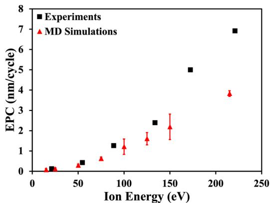  
FIG. 8. Etch per cycle (EPC) in units of nm/cycle for experiments (black squares) and MD simulations (red triangles) as a function of  $\mathsf{Ar}^+$  energy. Error bars represent  $95\%$  confidence intervals.

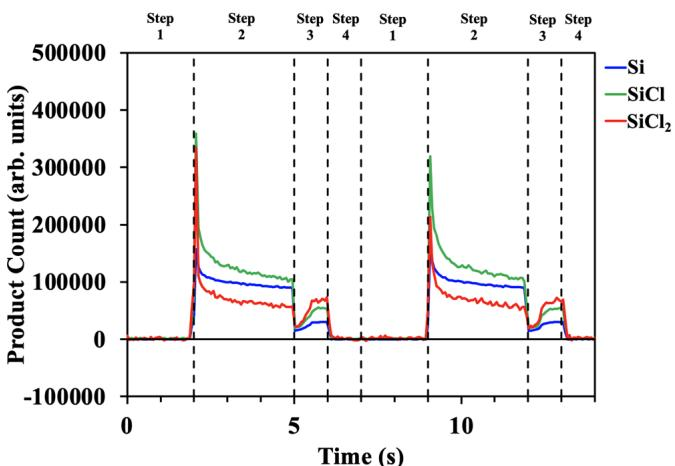  
FIG. 9. OES signals for atomic Si (middle line), SiCl (top line), and  $\mathrm{SiCl_2}$  (bottom line) for  $80\mathrm{eVAr^{+}}$  Results are shown for two ALE cycles. The relative intensities of the emission intensity have been adjusted for clarity and do not correspond to densities, in general. The signal for SiCl is multiplied by 10 and the signal for  $\mathrm{SiCl_2}$  is multiplied by 100. The steps shown correspond to Fig. 2.

$(3s^{2}3p4s\quad^{1}P^{o}\longrightarrow 3s^{2}3p^{2}\quad^{1}D),$  SiCl at 280.6 and  $282.2\mathrm{nm}$ $(\mathrm{B}^{\nu}\mathrm{\Omega}^{2}\Delta \longrightarrow \mathrm{X}^{2}\Pi_{r},\quad \nu^{\prime} = 0\longrightarrow \nu^{\prime \prime} = 0),\quad \mathrm{SiCl}_{2}\quad \mathrm{at}\quad 325 - 326\mathrm{nm}$ $(\mathrm{A}^{1}\mathrm{B}_{1}\rightarrow \mathrm{\tilde{X}}^{1}\mathrm{A}_{1})$  and Cl at  $837.6\mathrm{nm}$ $(3s^{2}3p^{4}(^{3}P)4p\quad^{4}D^{o}\longrightarrow 3s^{2}3p^{4}$ $(^{3}P)4s\quad^{4}P]$  The intensities for each species are arbitrary and depend on the energy dependent cross section for electron impact excitation of the emitting levels, and spectroscopic factors such as rotational and vibrational partitioning of the intensities and branching ratios. The intensities for  $\mathrm{SiCl_2}$  and SiCl were argued previously to be closely related to the relative yields of these species desorbing from the surface.18 Si emission, late in the ALE cycle, is

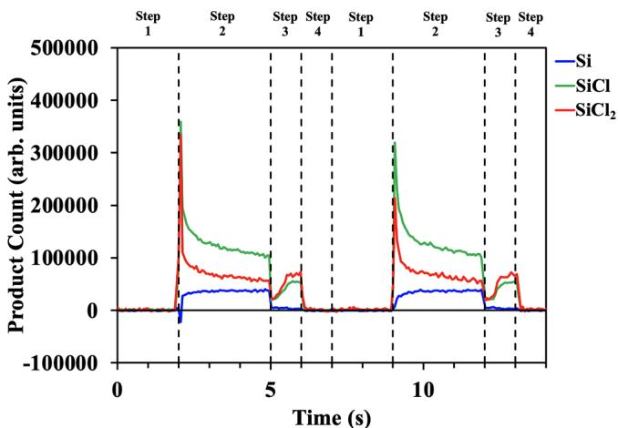  
FIG. 10. OES signals for atomic Si (bottom line), SiCl (top line), and  $\mathrm{SiCl_2}$  (middle line) for  $80\mathrm{eVAr^{+}}$  Results are shown for two ALE cycles. The signal for SiCl is multiplied by 10 and the signal for  $\mathrm{SiCl_2}$  is multiplied by 100. The atomic Si signal is modified to account for dissociative excitation of SiCl.

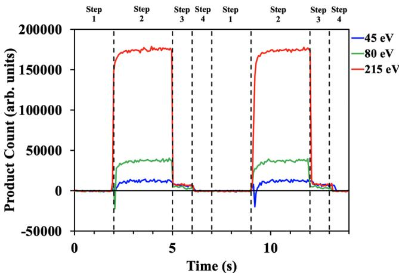  
FIG. 11. Si OES modified to account for dissociative excitation of SiCl as a function of time for various  $\mathrm{Ar^{+}}$  energies. Results are shown for two ALE cycles. The top line corresponds to results for  $215\mathrm{eV}$ , the middle line for  $80\mathrm{eV}$ , and the bottom line for  $45\mathrm{eV}$ .

likely produced mainly by e- impact excitation of sputtered Si, but earlier in the cycle, dissociative excitation of SiCl could also contribute to Si emission. Not shown are emission intensities from Ar  $(2\mathrm{p}_1$  Paschen notation) at  $750.4\mathrm{nm}$  which are nearly constant during the  $\textrm{\scriptsize 5s}$  ICP duration, indicating very little change in the plasma condition (electron density and  $\mathrm{T}_e$  ) introduced by the transient etching products. Thus, we attribute the time dependence of the emission of Si- containing species to be an indication of the relative rates of surface desorption of these species, at least in the earlier stages of the  $\mathrm{Ar^{+}}$  ion bombardment step.

As will be seen below, the observed peak in the atomic Si OES signal at the beginning of the ion bombardment period (cf. Fig. 9) does not match simulation results, which show a nearly flat Si desorption profile over this step. It is likely that Si emission is significantly affected by dissociative excitation of SiCl. We tested this possibility by subtracting from the measured Si emission a term that is a factor (in this case, we use a factor of 5) of the SiCl OES intensity. Figure 10 replots the results of Fig. 9 for  $80\mathrm{eV}$  ions with the corrected atomic Si signal. The peak in the atomic Si signal has been eliminated and the profile appears nearly flat over the ion bombardment period, in general agreement with the MD simulation predictions.

We applied the same correction to atomic Si OES signals for each of the ion energies, as seen in Fig. 11. We see flat profiles for all atomic Si signals for various  $\mathrm{Ar^{+}}$  energies following this correction. Although this consistency between MD results and corrected measured Si OES signals is not proof, it is strong evidence that SiCl dissociative excitation is contributing to the Si emission measurements.

SiCl and  $\mathrm{SiCl}_2$  emission profiles during ion bombardment show a peak corresponding to the onset of ICP power and RF bias in the (nominally) pure Ar plasma, following exposure to  $\mathrm{Cl}_2$  gas. The emission signals decay at various rates. At the  $5\mathrm{s}$  and  $12\mathrm{s}$  points in Fig. 9, the RF bias is turned off but the ICP power continues for  $1\mathrm{s}$ . There is an initial sharp drop in all OES signals, followed by a post- RF bias rise of emission. The source of this rise in OES during the bias- off period is not fully understood. It is possible that Cl or chlorine- containing products desorb from reactor walls and return to the substrate surface to rechlorinate it, but this question will require additional study.

We now turn to a direct comparison between measured (and corrected) OES signals and the MD predictions of species desorption during the ICP and RF bias on period of the ALE cycle. For all etch products examined in this work, the results from the MD simulations and the corresponding error bars (representing  $95\%$  confidence intervals), are calculated from 15 independent simulations of the  $\mathrm{Ar^{+}}$  on bombardment step. These simulations are performed after a cyclic steady state is reached.

Figure 12 plots normalized Si emission intensity and predicted desorption numbers as a function of  $\mathrm{Ar^{+}}$  fluence for both OES experiments and MD simulations, respectively. Results are shown for  $\mathrm{Ar^{+}}$  energies of 45, 80, and  $215\mathrm{eV}$ . We normalized the OES and MD simulation results to their respective values of the plateau for the  $80\mathrm{eV}$  results. This allows a clearer comparison between the OES and MD results. Neither set of data involve absolute values, but the relative intensity of each set of data is maintained. Both results show the plateau- behavior for Si for all ion energies are considered. Note that the measured (corrected) OES signal for Si at  $215\mathrm{eV}$  ions is about a factor of 5 above the value for  $80\mathrm{eV}$  ions. Similarly, the MD results predict Si desorption rate at  $215\mathrm{eV}$  to be about six to seven times larger than the value observed at for  $80\mathrm{eV}$  ions.

In Fig. 13, SiCl counts from OES experiments and MD simulations are shown. A similar normalization is used for SiCl as was used for Si; the first value for the  $80\mathrm{eV}$  case is taken as unity. There appears to be good agreement between the two sets of results. Both show a peak in the SiCl signal at low  $\mathrm{Ar^{+}}$  fluence with a subsequent decay. Moreover, the value of the peak appears to increase with ion energy in both sets of data. However, there are significant differences as well. The MD results decay faster than the OES results. We believe this may be an indication that the MD simulations predict less Cl mixed into the layer relative to experiments. This is discussed in greater detail below.

The results for  $\mathrm{SiCl}_2$  are shown in Fig. 14. Again, we normalize based on the peak for the  $80\mathrm{eV}$  ion case. Qualitative agreement is observed, similar to the SiCl case. Interestingly, the differences in the values of peaks are almost indistinguishable across ion energies, for both OES and MD simulations. However, the decay in  $\mathrm{SiCl}_2$  observed in MD simulations is once again more rapid relative to the OES experiments.

Finally, the atomic Cl signal from OES experiments and MD simulations are shown in Fig. 15. Each set of data is normalized using their respective peaks. Once again, the same qualitative behavior between OES and MD simulations is observed, but the decay in the atomic Cl count as a function of ion fluence is faster for the MD simulations when compared to the OES signal, consistent with the other Cl- containing species.

# V. COMPARISON OF SIMULATIONS AND EXPERIMENTAL OBSERVATIONS

In general, the experimental observations reported here support most of the key elements revealed in the MD simulations

  
FIG. 12. Normalized atomic Si counts as a function of  $\mathsf{Ar}^+$  fluence for various  $\mathsf{Ar}^+$  energies. Subfigure (a) shows the results for OES experiments (using the modified OES Si signals) and subfigure (b) shows results from MD ALE simulations. For both the OES and MD results, the counts are normalized using the value at the plateau observed at  $80 \text{eV}$ .

of ALE for this system  $(\mathrm{SiCl}_2 / \mathrm{Ar})$ . The reasonable agreement between the predicted and measured etch per cycle up to about  $100 \text{eV}$  (cf. Fig. 8) as a function of ion energy and fluence suggests the model is capturing some of the important elements of the process. MD simulations increasingly underpredict measured EPC values at ion energies above about  $125 \text{eV}$ . Further, OES measured from desorbing etch products during the cycle (cf. Figs. 12- 15) are also in reasonable agreement, at least early in the  $\mathrm{Ar}^+$  bombardment step. Measured OES signals from all three of the Cl- containing etch products  $(\mathrm{SiCl}_2$ ,  $\mathrm{SiCl}_3$ , and  $\mathrm{Cl})$  show the MD- predicted peaks immediately after the start of ion bombardment and the energy dependencies are also in agreement. However, the measured OES signals do not decay as rapidly as is predicted by the MD simulations. Both sets of disagreements- in the magnitude of the EPC at higher ion energies as well as the lack of a long "tail" in Cl- containing species OES during ion bombardment- are consistent with MD simulations underpredicting the degree of Cl mixing into the layer.

Another potentially important complicating factor in the experiments is the possibility that Cl- containing products might desorb from chamber walls during the ion bombardment phase of the cycle. The OES measurements made after RF bias is turned off but ICP power remains on (step 3 in Figs. 2 and 9) are difficult to interpret in the absence of additional Cl reaching the surface during this phase. If present, this additional Cl reaching the surface in the experiments would need to be included in the MD

  
FIG. 13. Normalized SiCl counts as a function of  $\mathsf{Ar}^+$  fluence for various  $\mathsf{Ar}^+$  energies. Subfigure (a) shows the results for OES experiments and subfigure (b) shows results from MD ALE simulations. For both the OES and MD results, the counts are normalized using the value at the peak observed at  $80 \text{eV}$ .

  
FIG. 14. Normalized  $\mathrm{SiCl}_2$  counts as a function of  $\mathsf{Ar}^+$  fluence for various  $\mathsf{Ar}^+$  energies. Subfigure (a) shows the results for OES experiments and subfigure (b) shows results from MD ALE simulations. For both the OES and MD results, the counts are normalized using the value at the peak observed at  $80\mathrm{eV}$

simulation protocol. Additional experimental measurements would be needed to address this issue.

It is also possible that the MD simulations underpredict Cl in the layer because we neglect processes (e.g., thermal diffusion) that take place over long- time scales. The procedure used in the MD simulations, as detailed by Humbird, only explicitly simulates the roughly 2 ps impact when a species hits the surface. We then search for and delete etch products and thermostat the cell to  $300\mathrm{K}$ . The next impact is then simulated with only about a few picoseconds (including the thermostat procedure) having been simulated since the previous impact. This procedure is adequate for simulating "prompt" processes like energetic ion impact, sputtering and dissociative adsorption of  $\mathrm{Cl}_2$ . However, for the surface area we consider in the simulations, the time between  $\mathrm{Cl}_2$  impacts with the surface is on the order of tens to hundreds of microseconds. It is possible that adsorbed Cl could be diffusing deeper into the Si substrate during these relatively long time scales. Unlike continuous plasma processes, the surfaces in ALE are not subject to ion bombardment for relatively long periods of time. It is also known, for example, that fluorine atoms often penetrate deeply into Si. Other studies show how adsorbed sulfur suppresses this penetration by enhancing etching. Furthermore, relatively recent work reported high Si etch yields using  $\mathrm{Cl}_2$  pulsed plasmas that result in unusually large neutral Cl to ion bombardment flux ratios. These

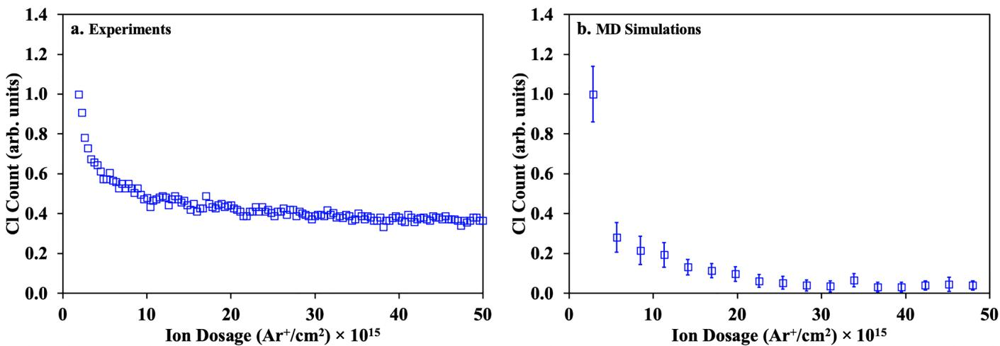  
FIG. 15. Normalized atomic Cl counts as a function of  $\mathsf{Ar}^+$  fluence. Subfigure (a) shows the results for OES experiments (where the ion energy is estimated to be about  $85\mathrm{eV}$ ) and subfigure (b) shows results from MD ALE simulations where the ion energy is  $80\mathrm{eV}$ . In both cases, the results are normalized using the value observed at the peak.

authors suggest the cause of the unusually high etch yields is a correspondingly high Cl content in the Si near surface region due to subsurface Cl diffusion.

If this is indeed the case, a better simulation strategy would include enhanced sampling techniques for incorporation of longer timescale phenomena, such as the parallel replica dynamics method, among others.40,41

# VI. CONCLUDING REMARKS

Plasma- assisted ALE is a complex process that induces changes in the near- surface region that vary in both depth and time during the cycle. With the goal of better understanding plasma ALE, we have compared molecular dynamics simulation predictions of  $\mathrm{Si - Cl}_2 - \mathrm{Ar}$  ALE to experimental measurements of the Si etch per cycle (EPC) and etch products leaving the surface. In general, the simulations reproduce the major features of the measurements. EPC predictions as a function of ion energy are in reasonable agreement with measurements, especially at lower ion energies. Measured etch product distributions as a function of time in the cycle and ion energy are also in good agreement with predictions, especially early in the ion bombardment step. This set of agreements supports the basic picture that emerges from MD simulations of plasma- assisted ALE for this system, as summarized in the illustration in Fig. 5.

However, simulations underpredict EPC values at ion energies above about  $125\mathrm{eV}$  Moreover, although simulations capture well the initial peak and decline of Cl- containing etch products (SiCl,  $\mathrm{SiCl}_2$  and atomic  $\mathrm{Cl}$  leaving the surface, experiments show a considerably longer tail in OES than simulations predict. There are multiple possible explanations for these disagreements. One possibility is Cl desorption from chamber walls followed by substrate incorporation during the ion bombardment step, an effect not included in the simulations. It is certainly possible that Cl subsurface diffusion is taking place in the experiments, leading to a more chlorinated layer than the simulations predict.

Plasma ALE- even imperfectly understood- is a powerful tool for near- atomic scale manipulation of surfaces. However, considerable additional study, both experimental and computational, is needed to systematically address the many unknown or poorly characterized processes that affect atomic- scale surface control.

# ACKNOWLEDGMENTS

This work was partially supported by the US Department of Energy OFES (Contract No.DE- AC02- 09CH11466) and Samsung Electronics (Project Code No.IO 210224- 08446- 01). The authors gratefully acknowledge discussions with Keren Kanarik (Lam Research Corporation) and David Humbird (DwH Process Consulting).

# AUTHOR DECLARATIONS

# Conflict of Interest

The authors have no conflicts to disclose.

# Author Contributions

Joseph R. Vella: Conceptualization (equal); Data curation (equal); Formal analysis (equal); Investigation (equal); Methodology (equal); Visualization (equal); Writing - original draft (equal); Writing - review & editing (equal). Qinzhen Hao: Conceptualization (equal); Data curation (equal); Formal analysis (equal); Investigation (equal); Methodology (equal); Writing - original draft (equal); Writing - review & editing (equal). Vincent M. Donnelly: Conceptualization (equal); Formal analysis (equal); Funding acquisition (equal); Investigation (equal); Methodology (equal); Supervision (equal); Writing - review & editing (equal). David B. Graves: Conceptualization (equal); Formal analysis (equal); Funding acquisition (equal); Investigation (equal); Methodology (equal); Supervision (equal); Writing - original draft (equal); Writing - review & editing (equal).

# DATA AVAILABILITY

The data that support the findings of this study are available from the corresponding author upon reasonable request.

# REFERENCES

1. G.T.Carver, J.J. Plombon, P.E. Romero, S. Suri, T. A. Tronic, and R.B. Turkot, Jr., ECS J. Solid State Sci. Technol. 4, N5005 (2015). 
2. T. Faraz, F. Roozeboom, H. C. M. Knoops, and W. M. M. Kessels, ECS J. Solid State Sci. Technol. 4, N5023 (2015). 
3. G. S. Oehrlein, D. Metzler, and C. Li, ECS J. Solid State Sci. Technol. 4, N5041 (2015). 
4. K. J. Kanarik, T. Lill, E. A. Hudson, S. Sriraman, S. Tan, J. Marks, V. Vahedi, and R. A. Gottscho, J. Vac. Sci. Technol. A 33, 020802-1-14 (2015). 
5. J. Chang and J. P. Chang, J. Phys. D: Appl. Phys. 50, 253001-1-23 (2017). 
6. K. J. Kanarik, S. Tan, and R. A. Gottscho, J. Phys. Chem. Lett. 9, 4814 (2018). 
7. K. Arts, S. Hamaguchi, T. Ito, K. Karahashi, H. C. M. Knoops, A. J. M. Mackus, and W. M. M. E. Kessels, Plasma Sources Sci. Technol. 31, 103002-1-20 (2022). 
8. D. Kim, J. Kim, D. Ahn, J. Choe, J. Kim, E. Jung, and S. Pyo, Electron. Mater. Lett. 19, 424 (2023). 
9. T. Matsuura, J. Murota, Y. Sawada, and T. Ohmi, Appl. Phys. Lett. 63, 2803 (1993). 
10. K. Suzue, T. Matsuura, J. Murota, Y. Sawada, and T. Ohmi, Appl. Surf. Sci. 82/83, 422 (1994). 
11. S. D. Athavale and D. J. Economou, J. Vac. Sci. Technol. B 14, 3702 (1996). 
12. B. Kim, S. Chung, and S. M. Cho, Appl. Surf. Sci. 187, 124 (2002). 
13. S. Park, K. Min, B. Yoon, D. Lee, and G. Yeom, Jpn. J. Appl. Phys. 44, 389 (2005). 
14. S. D. Athavale and D. J. Economou, J. Vac. Sci. Technol. A 13, 966 (1995). 
15. E. J. C. Tinacba, M. Isobe, and S. Hamaguchi, J. Vac. Sci. Technol. A 39, 154603-1-11 (2021). 
16. R. Vella, D. Humbird, and D. B. Graves, J. Vac. Sci. Technol. B 40, 023205-1-9 (2022). 
17. R. Vella and D. B. Graves, J. Vac. Sci. Technol. A 41, 042601 (2023). 
18. Q. Hao, P. Kim, S. Nam, S. Kang, and V. M. Donnelly, J. Vac. Sci. Technol. A 41, 032605-1-9 (2023). 
19. T. Ma, T. List, and V. M. Donnelly, J. Vac. Sci. Technol. A 35, 031303 (2017). 
20. T. Ma, T. List, and V. M. Donnelly, J. Vac. Sci. Technol. A 36, 031305 (2018). 
21. T. List, T. Ma, P. Arora, V. M. Donnelly, and S. Shannon, Plasma Sources Sci. Technol. 28, 025005 (2019). 
22. P. Arora, T. Nguyen, A. Chawla, and V. M. Donnelly, J. Vac. Sci. Technol. A 37, 061303 (2019).

23T. Ma, T. List, P. Arora, and V. M. Donnelly, J. Appl. Phys. 125, 023301 (2019). 24P. Arora, J. Cho, R. Cervantes, and V. M. Donnelly, J. Vac. Sci. Technol. A 38, 063004 (2020). 25D. W. Brenner, O. A. Shenderova, J. A. Harrison, S. J. Stuart, B. Ni, and S. B. Sinnott, J. Phys.: Condens. Matter 14, 783 (2002). 26D. Humbird and D. B. Graves, J. Chem. Phys. 120, 2405 (2004). 27J. R. Vella and D. B. Graves, J. Vac. Sci. Technol. A 40, 063203- 1- 7 (2022). 28G. Moliere, Z. Naturforschung A 2, 133 (1947). 29H. J. C. Berendsen, J. P. M. Postma, W. F. van Gunsteren, A. DiNola, and J. P. Haak, J. Chem. Phys. 81, 384 (1984). 30D. W. Humbird, "Computational studies of plasma- surface interactions," Ph.D. thesis (University of California, Berkeley, 2004). 31See supplementary material online for surface flux and fluence calculations and explicit evidence that a larger  $\mathrm{Cl}_2$  fluence will not result in more Cl uptake into the Si slab in the MD simulations.

32A. Stukowski, Modelling Simul. Mater. Sci. Eng. 18, 015012- 1- 7 (2010). 33P. Brault, P. Ranson, H. Estrade- Szwarckopf, and B. Rousseau, J. Appl. Phys. 68, 1702 (1990). 34P. Brault, J. Phys.: Condens. Matter 3, 7073 (1991). 35H. F. Winters and J. W. Coburn, Surf. Sci. Rep. 18, 161 (1992). 36J. W. Coburn, Appl. Phys. A 59, 451 (1994). 37S. S. Kaler, Q. Lou, V. M. Donnelly, and D. J. Econmou, J. Vac. Sci. Technol. A 34, 041301- 1- 8 (2016). 38P. Arora, T. Nguyen, A. Chawla, S. Nam, and V. M. Donnelly, J. Vac. Sci. Technol. A 37, 061303- 1- 9 (2019). 39O. Mourey, C. Petit- Etienne, G. Cunge, M. Darnon, E. Despiau- Pujo, P. Birchon, E. Lattu- Romain, M. Pons, and O. Joubert, J. Vac. Sci. Technol. A 34, 041306- 1- 12 (2016). 40A. F. Voter, Phys. Rev. B 57, R13985 (1998). 41C. Abrams and G. Bussi, Entropy 16, 163 (2014).