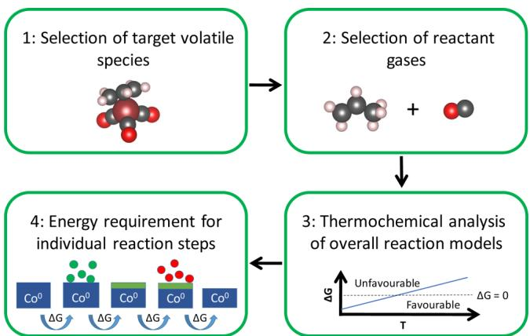
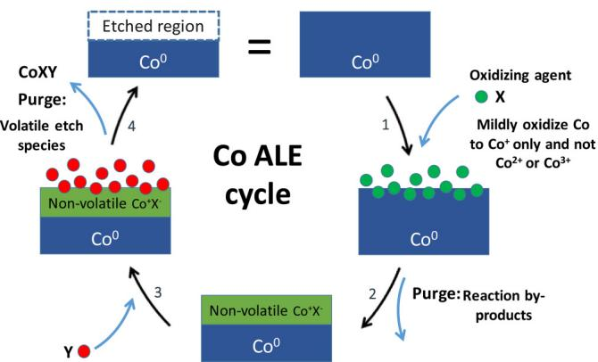
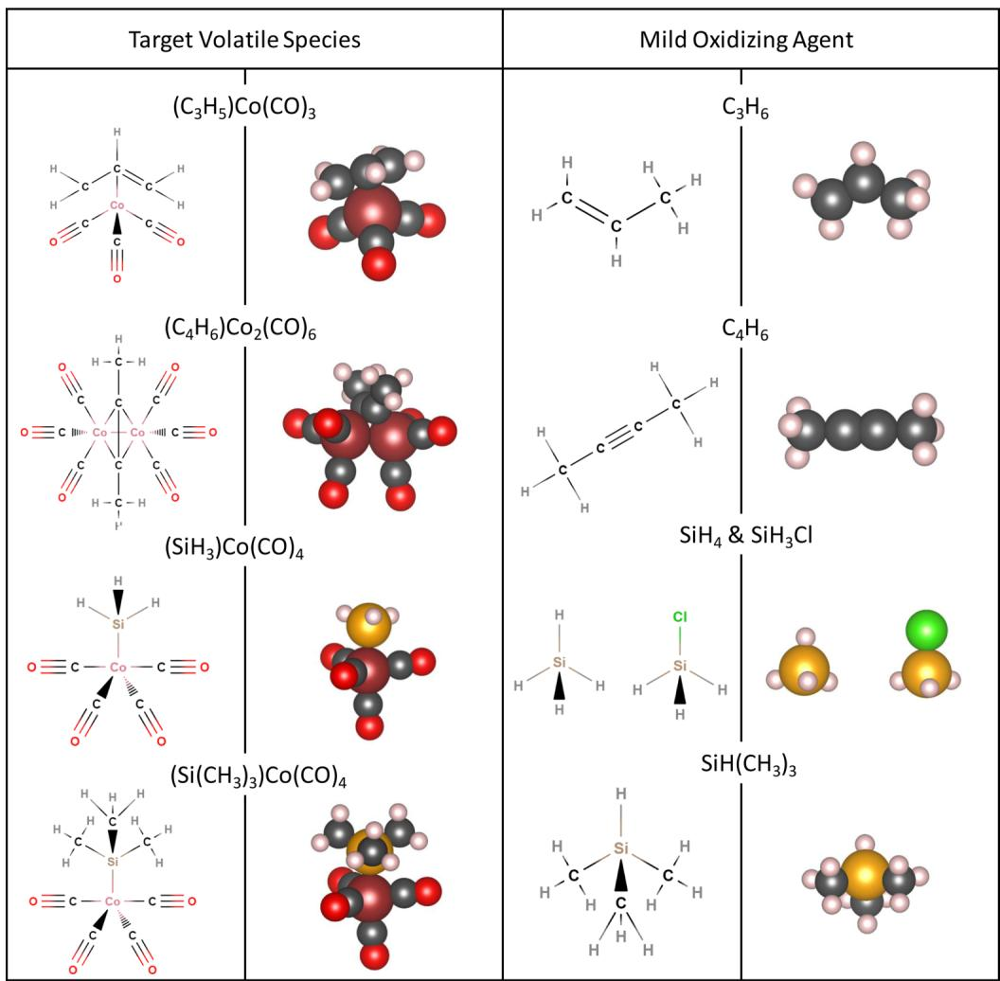
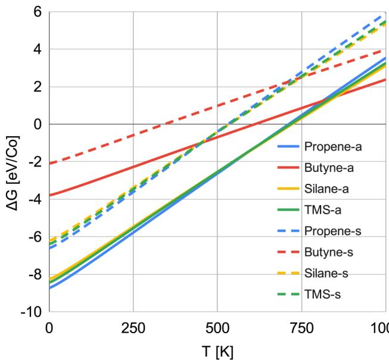
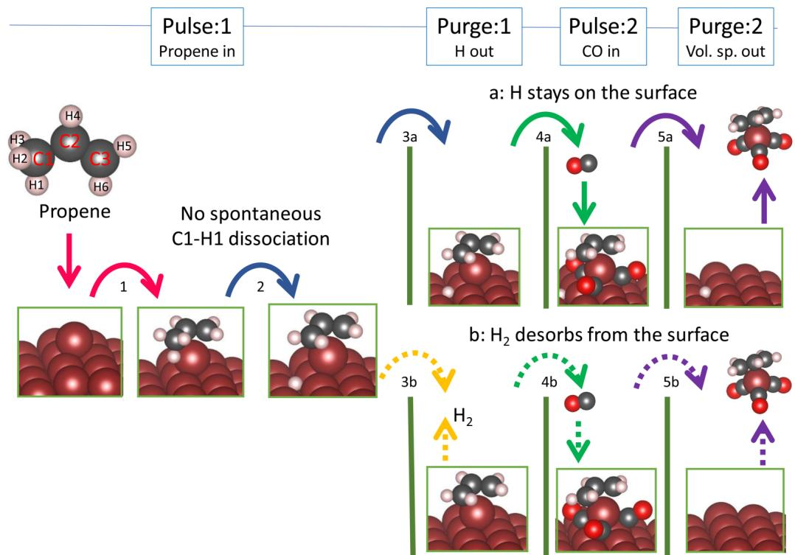
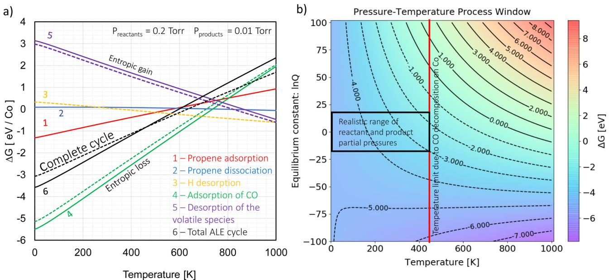

# RESEARCH ARTICLE | MARCH 03 2021

# In silico design of a thermal atomic layer etch process of cobalt  $\odot$

Special Collection: Atomic Layer Etching (ALE)

Suresh Kondati Natarajan  $\oplus$  ; Michael Nolan  $\oplus$  ; Patrick Theofanis; Charles Mokhtarzadeh; Scott B. Clendenning

J. Vac. Sci. Technol. A 39, 022603 (2021) https://doi.org/10.1166/0000804

# Articles You May Be Interested In

Dynamics of propene adsorption on Ag (001)

J. Chem. Phys. (April 2005)

Investigation of valence orbitals of propene by electron momentum spectroscopy

J. Chem. Phys. (June 2005)

Reference Correlations of the Thermal Conductivity of Ethene and Propene

J. Phys. Chem. Ref. Data (August 2016)

# In silico design of a thermal atomic layer etch process of cobalt

Cite as: J. Vac. Sci. Technol. A 39, 022603 (2021); doi: 10.1116/6.0000804  Submitted: 20 November 2020 · Accepted: 4 February 2021 · Published Online: 5 March 2021

Suresh Kondati Natarajan, $^{1,a)}$  Michael Nolan, $^{2,3}$  Patrick Theofanis, $^{4}$  Charles Mokhtarzadeh, $^{4}$  and Scott B. Clendenning $^{4}$

# AFFILIATIONS

$^{1}$ Department of Electrical Engineering and Automation, Aalto University, Espoo 02150, Finland   $^{2}$ Tyndall National Institute, University College Cork, Lee Maltings, Dyke Parade, Cork T12 R5CP, Ireland   $^{3}$ Nanotechnology and Integrated Bioengineering Centre, Ulster University, Shore Road, Newtownabbey, County Antrim BT37 0QB, Northern Ireland   $^{4}$ Intel Corporation, 2501 NE Century Blvd., Hillsboro, Oregon 97124

Note: This paper is part of the 2021 Special Topic Collection on Atomic Layer Etching (ALE).   $^{a)}$ Electronic mail: suresh08@gmail.com

# ABSTRACT

Thermal atomic layer etch (ALE), facilitating the removal of up to one monolayer of material per cycle, is growing in importance for thin- film processing. The number of available ALE processes is much smaller than for atomic layer deposition, its complementary growth process. Quantum chemical simulations are a key approach in the development of new thermal ALE processes, however, methodologies and workflows need to be developed. In this regard, the present paper reports a simulation- based approach toward the development of new thermal ALE processes using metallic cobalt as a test case. We demonstrate a predictive process discovery approach for ALE in which target volatile etch products and the corresponding gas phase reactants are chosen from the literature, an overall ALE cycle for each combination of reactant is investigated for thermochemical favorability, and the detailed mechanisms of the individual reaction steps in the proposed ALE processes are studied using density functional theory. From these results, we derive a temperature- pressure process window for each combination of reactants at typical reactant and product pressures allowing the selection of an ALE process window. For Co ALE, we investigated propene, butyne, silane, and trimethyl silane as a first pulse reactant and CO as the second pulse reactant. We propose propene and CO as the best combination of reactants for Co ALE. Propene adsorbs with sufficient strength to the target Co atom at temperatures below the CO decomposition temperature of  $440\mathrm{K}$ , which results in the lowest energy etch species. This approach is equally relevant for the ALE process design of elemental, binary, and ternary materials.

Published under license by AVs. https://doi.org/10.1116/6.0000804

# I. INTRODUCTION

One of the main bottlenecks in the down- scaling of modern- day semiconductor architectures is identifying novel materials that meet the necessary performance requirements for next generation devices. Even then, effective thin- film processing techniques need to be developed to meet the stringent critical dimension (CD) requirements of these semiconductor devices. To this end, thermal atomic layer etching (ALE) has been introduced as an isotropic material removal technique that can accompany atomic layer deposition (ALD) in the processing of nano- architectures with targeted CD's below  $10\mathrm{nm}$ . Thermal ALE is similar to ALD in that it is an iterative process made up of sequential self- limiting reactions enabling the conformal removal of up to one monolayer of material per cycle, even in high aspect- ratio structures.1- 6 A minimum of two reactant pulses per cycle are required, the first pulse to chemically modify only the surface layers and the second pulse to introduce an "etchant" in order to generate volatile etch products that can be thermally desorbed from the surface.

While there have been experimental reports on the thermal ALE of a range of compound materials,7- 23 such processes for elemental materials are less common, with only a handful of examples for materials such as for W,24- 26 Fe,27 Co,28 Cu,29- 31 Si,32 and Ge.33

In the semiconductor industry, metals such as Cu, Co, and W are widely used as conducting materials in interconnects and transistor contacts while oxides (e.g.,  $\mathrm{Al}_2\mathrm{O}_3$ ,  ${}^{34}\mathrm{HfO}_2$ , and  $\mathrm{ZrO}_2$ ${}^{35}$ ) and hard nitrides (e.g.,  $\mathrm{TiN}^{36}$  and  $\mathrm{TaN}^{37,38}$ ) are used as dielectric and barrier materials, respectively. Designing an ALE cycle for pure metals, unlike metal oxides for which the metal atoms are typically fully oxidized, requires a chemical approach that must manage the chemical potential energy. Pure metals, especially reactive metals, have high chemical potential energy relative to their metal oxides. The challenge in metal ALE is to find a path down the free energy mountain to control the surface chemistry and achieve the desired result.

Cobalt has been identified as a potential substitute for copper local interconnects and tungsten transistor contacts due to the increased performance at thinner dimensions. As such, ALE process technologies for Co thin- film materials have seen a great deal of development within recent years due to the increased performance of Co materials as the CD of semiconductor devices continue to shrink. However, unlike the surge in Co ALE process development, the complementary Co etch process development has seen very little development. Recently, Konh and co- workers reported an ALE process for metallic Co at  $140^{\circ}\mathrm{C}$  using  $\mathrm{Cl}_2$  and hfacH as reagents. They propose that the ALE process proceeds by an initial chlorination of the Co surface in the first pulse followed by the introduction of hfacH which reacts with the  $\mathrm{CoCl}_x$  surface at elevated temperatures and results in the formation of the etch product  $\mathrm{Co(hfac)_2}$  along with the generation of a volatile HCl by- product. This process is strongly temperature dependent with a variable etch rate of  $0.2\mathrm{nm / cycle}$  at  $140^{\circ}\mathrm{C}$  to  $1.6\mathrm{nm / cycle}$  at  $185^{\circ}\mathrm{C}$ . Moreover, the presence of surface F species was also confirmed with XPS in this study. In a similar fashion, chemical vapor etch processes that have utilized acacH and hfacH have also been reported but similarly the resulting thin films exhibit non- negligible amounts of fluorine contamination. This is an undesirable effect which has been shown to be detrimental to the performance of CMOS devices and a key attribute of these processes to be avoided. Therefore, an efficient fluorine- free ALE process for Co metal is vital for the fabrication of next generation local interconnects and transistor contacts at thinner dimensions and presents an excellent test case for a quantum chemical analysis of the development of a Co ALE process.

The ALE of oxide or nitride materials typically requires the metal atoms to be in an almost fully oxidized state  $(\mathrm{M}^{\mathrm{a + }})$ . In the case of elemental materials such as Co is in 0 oxidation state, it is necessary to facilitate a surface reaction that not only functionalizes the surface but also provides controlled oxidation of the surface. For metals, care must be taken so that the reaction self- limits and does not promote runaway oxidation of the metal which can produce a thick oxidized surface layer. The oxidizing agent must be carefully selected to drive the metal surface reactions toward the oxidation state of the metal in the desired etch product but not beyond it.

We have previously used density functional theory (DFT) based quantum chemical simulations to validate experimental findings such as etch rates and compute thermodynamic properties to estimate the reaction energy requirements of individual ALE steps and understand the underlying etch mechanisms of ALE processes for, e.g.,  $\mathrm{Al}_2\mathrm{O}_3$ , metallic W,  ${}^{51}\mathrm{HfO}_2$ , and  $\mathrm{ZrO}_2$ . Compared to experiments, computational studies offer a relatively inexpensive way to investigate a broad range of thermal ALE processes. However, very few rigorous computational studies of thermal ALE processes using quantum chemical calculations have been reported so far. Of note is the work of Ventzek and co- workers who presented a DFT study focusing on the ALE of polymer surfaces using an oxygen flux and Hamaguchi and co- workers who investigated the self- limiting behavior of hexafluoroacetylacetone (hfacH) on Ni and NiO. However, the above computational studies were based on known ALE processes. To date, no ALE process has been proposed exclusively from quantum chemical simulations.

In developing thermal ALE, we require a methodology that is general and applicable across multiple materials. This can be achieved by developing systems that are predisposed for the appropriate reactivity profiles such that precursors that produce volatile complexes as etch products can be quickly screened, a task for which density functional theory (DFT) is well positioned. Herein, we present a general computational approach for the prediction of a new ALE process as shown in Fig. 1, which we have employed for the development of a novel Co ALE process. In the first step of our computational approach, volatile etch products are identified from a survey of the literature based on the process requirements. It is to be mentioned that ALE precursors could be considered for the target etch species provided a synthetic route to their formation under ALE process conditions is feasible. The target etch species typically has one or more ligand types present. Bulkier etch products are associated with low etch rates, so care must be taken to choose targets with workable steric profiles to enable volatilization. In the second step, the gas phase coreagents are chosen to develop a reaction pathway capable of generating the desired etch product to complete the ALE cycle. In the third step, we use the reactants selected in the second step and compute the overall surface reaction energies from DFT to verify if the chosen reagents result in a thermodynamically viable ALE process. We also consider the thermochemistry of unwanted side reactions (such as undesired

  
FIG. 1. Graphical representation of the steps involved in the computer aided discovery of a new thermal atomic layer etch process.

by- product formation or nonself- limiting nature of the reactantsubstrate interaction) that might occur during the ALE pulses and make sure that they do not affect the desired reaction path in the ALE pulses. Finally, in the fourth step, the energy requirements for the individual reaction steps in the ALE process in addition to any kinetic barriers are studied using quantum chemical simulations. From these results, we construct a map of the pressure- temperature process window for our proposed process.

by- product formation or nonself- limiting nature of the reactant- substrate interaction) that might occur during the ALE pulses and make sure that they do not affect the desired reaction path in the ALE pulses. Finally, in the fourth step, the energy requirements for the individual reaction steps in the ALE process in addition to any kinetic barriers are studied using quantum chemical simulations. From these results, we construct a map of the pressure- temperature process window for our proposed process.Volatile organometallic Co compounds containing carbon monoxide and an organic ligand, such as  $(\mathrm{C}_3\mathrm{H}_5)\mathrm{Co}(\mathrm{CO})_3$ $(\mathrm{C}_4\mathrm{H}_6)$ $\mathrm{Co(CO)_6}$ $(\mathrm{SiH}_3)\mathrm{Co(CO)_4}$  and  $(\mathrm{Si(CH_3)_3})\mathrm{Co(CO)_4}$  in which the central Co atom is mildly oxidized  $(+1$  oxidation state) are chosen as suitable target etch products from the literature. In this work, we wanted to avoid higher oxidation states of Co. Higher oxidation states are usually induced by stronger reagents, and they may not be self- limiting and result in the formation of a thick modified layer, which is undesirable for ALE in general. For example, the use of  $\mathrm{O}_2$  as first pulse chemical oxidized Co atoms to  $+2$  or  $+3$  states and can also promote runaway oxidation. Therefore, we only chose those complexes where the central Co atom has  $+1$  as the highest oxidation state. Based on the above selection, propene  $(\mathrm{C}_3\mathrm{H}_6)$  butyne  $(\mathrm{C}_4\mathrm{H}_6)$  silane  $(\mathrm{SiH}_4)$  and trimethyl silane [TMS (SiH  $(\mathrm{CH}_3)_3)]$  are the corresponding organic molecules selected as surface modifiers that upon reacting with the surface would lead to a single oxidation event per Co atom in the first ALE pulse and CO is selected as the second pulse reactant. Out of all the considered etch species, based on thermochemical analysis,  $(\mathrm{C}_3\mathrm{H}_5)\mathrm{Co}(\mathrm{CO})_3$  is found to be the most suitable. Moreover, this complex is a Co ALD precursor which is stable and volatile at ALE relevant temperatures.56,57 Therefore, propene and CO are chosen as the corresponding first and second pulse reactants. In fact, propene is favorable as a reagent for the first pulse due to its availability, thermal stability, and better vapor pressure control over the other reagents. Using the above reactant combination, we performed a detailed mechanistic study for direct simulation of the individual reactant pulses in Co ALE. Moreover, this proposed ALE process for Co avoids fluorine contamination as the reactants are fluorine free and it is suitable for industrial process integration.This DFT based thermochemical analysis enables the prediction of the temperature- pressure process window for this proposed ALE process and showcases the role of quantum chemical modeling in ALE process development.

This DFT based thermochemical analysis enables the prediction of the temperature- pressure process window for this proposed ALE process and showcases the role of quantum chemical modeling in ALE process development.

# II. METHODS AND COMPUTATIONAL SETUP

# A.DFT settings

Spin- polarized density functional theory implemented in Vienna Ab initio Simulation Package (VASP v5.4)58 is the electronic structure method used in this work. Plane wave basis functions with an energy cutoff of  $400\mathrm{eV}$  were used to represent valence electrons, while projector augmented wave (PAw) potentials59,60 were used to represent the core electrons. The valence electronic configuration of the elements in the PAWs is Co: [Ar]  $3\mathrm{d}^8$ $4\mathrm{s}^1$  C: [He]  $2\mathrm{s}^2 2\mathrm{p}^2$  O: [He]  $2\mathrm{s}^2 2\mathrm{p}^4$  H:  $1\mathrm{s}^1$  and Si: [Ne]  $3\mathrm{s}^2 3\mathrm{p}^2$  Therefore, the valence charges of Co, C, O, H, and Si are 9, 4, 6, 1, and 4, respectively. Exchange- correlation (XC) contributions to the electronic energy are computed using generalized gradient approximatedPerdew- Burke- Ernzerhof (PBE) potential.61 Grimme's D3 dispersion correction62 is also included to account for the Van der Waals interactions, which cannot be excluded when organic molecules interact with metallic surfaces. The convergence criteria for the electronic energy and the ionic relaxations are  $10^{- 4}\mathrm{eV}$  and  $- 0.02\mathrm{eV / \AA}$  . The energetic barriers discussed in this paper are computed using climbing image nudged elastic band approach with three to five images and a convergence criterion of  $- 0.02\mathrm{eV / \AA}$  63,64

# B.Bader charge analysis

B. Bader charge analysisOxidation state (or oxidation number) is calculated as the difference between the computed total valence charge of atoms in the interacting heterogeneous system and the corresponding atomic valence charge given in the PAW potentials. If the computed valence charge value is less than the atomic valence charge, then the target atom is being oxidized and vice versa. The computed valence charges are based on the Bader charge partitioning scheme using the Bader code.65 The charge analysis is performed on the total charge density (valence + core) to account for the nonlocal charge distribution. Bader charge partitioning is based on the quantum theory of atoms in molecules (QTAIM)66 and works directly on the charge density given by the electronic structure code. This is a more intuitive way to partition atoms using a zero flux surface and provides better prediction for atomic charges than other charge density partitioning schemes. The computed valence charges will be integers if the computed electronic density is localized and symmetric. Fractional Bader valence charges indicate that the electron density is not localized, is not symmetric, and is polarized along the bond directions and shared between the participating atoms.

# C. Validation of Bader charge analysis

C. Validation of Bader charge analysisZunger and co-workers67 found that DFT calculations may show only a small change in the valence charge while the oxidation state of a transition metal is altered. Goodenough and co-workers68 found that the Bader valence charge of a V atom center in two different V containing materials was similar while they must clearly be in different oxidation states. This is due to the delocalization of the valence charge density of V atom within its local environment and Bader analysis can only provide a relative estimate of the charge, i.e., oxidation of V(III) to V(IV) might only result in a change in valence charge of 0.08e. Therefore, to validate the results obtained from Bader analysis, we computed the valence charges of Co atoms in bulk Co and bulk CoO (Materials project ID: mp-22408). The valence charge on an isolated Co atom is 9.0e based on our computational setup. Co atoms in bulk Co are at zero oxidation state, and the Bader analysis consistently predicts the valence charge as 9.0e. In CoO, the Co and O atoms form ionic bonds, and the Co atoms are in an oxidation state of  $+2$ . The computed Bader valence charge for the Co ions in CoO is 7.9e instead of 7.0e and for the O ions it was 7.1e instead of 8.0e. In the organometallic complexes of Co(I) introduced earlier, such as  $(\mathrm{C}_3\mathrm{H}_5)\mathrm{Co}(\mathrm{CO})_3$ ,  $(\mathrm{C}_4\mathrm{H}_6)\mathrm{Co}(\mathrm{CO})_6$ ,  $(\mathrm{SiH}_3)\mathrm{Co}(\mathrm{CO})_4$ , and  $[\mathrm{Si}(\mathrm{CH}_3)_3]\mathrm{Co}(\mathrm{CO})_4$ , the central Co atom has computed Bader valence charges of 8.45e, 8.5e, 8.38e, and 8.32e, respectively, instead of 8.0e. As discussed

earlier, charge partitioning schemes such as Bader's approach assume atom centered charge distributions; thus, they will not provide the absolute charge of an atom in a covalently bonded environment in which the charge distribution is nonlocal. A table with Bader valence charges of various Co containing materials and molecules is given in Table S1 of the SM.

# D. Bulk and surface models

Bulk Co has HCP symmetry with the computed lattice constant of  $\mathrm{a = b = 2.46\AA}$ $\mathrm{c = 3.98\AA}$ $\alpha = \beta = 90^{\circ}$  and  $\gamma = 120^{\circ}$  This matches well with the experimental lattice constant of  $\mathrm{a = b = 2.51\AA}$ $\mathrm{c = 4.07\AA}$ $\alpha = \beta = 90^{\circ}$  and  $\gamma = 120^{\circ}$  The bulk lattice constant was computed by simultaneously relaxing the cell volume and cell dimensions using a slightly increased plane wave energy cutoff of  $550\mathrm{eV}$  and a  $12\times 12\times 12$  Monkhorst- Pack K- point mesh. Moreover, the calculated cohesive energy of bulk Co was found to be  $- 5.58\mathrm{eV}$  and the experimental value is  $- 4.43\mathrm{eV}$  PBE functional has been shown to overestimate the cohesive energy of Co.71 The nearest Co- Co distance is computed at  $2.46\mathrm{\AA}$  while the experimental value was  $2.49\mathrm{\AA}$  71 A five- layered high- index  $\mathrm{Co}(2\mathrm{0}1)$  surface with a surface area of  $0.81~\mathrm{nm}^2$  is chosen for this study, and this surface has step edges that will make it more reactive to the reactant molecules as compared to the ideal flat 111) surface.

In each layer, there are in Co atoms which amounts to  $80\mathrm{Co}$  atoms in the slab. A Monkhorst- Pack K- point mesh of  $2\times 2\times 1$  is used for all the geometry relaxation calculations. For all adsorption calculations, the entire slab is relaxed to arrive at the local minimum geometries. Models of Co bulk and the  $\mathrm{Co}(2\mathrm{0}1)$  surface are given in Sec. S2 of the supplementary material.52

# E. Energy equations

Reaction energy  $\Delta E$  is computed as

$$
\Delta E = \sum_{i}^{nP}nE_{i} - \sum_{j}^{nR}mE_{j}. \tag{1}
$$

Here, nP and nR are the number of product molecules and reactant molecules, respectively.  $n$  and  $m$  are the stoichiometric coefficients of the respective species. Reaction free energy is computed as

$$
\Delta G = \sum_{i}^{nP}nG_{i} - \sum_{j}^{nR}mG_{j} + RT\ln (Q), \tag{2}
$$

$$
G = E + \mathrm{ZPE} + W(T) - TS, \tag{3}
$$

$$
Q = \prod P_{\mathrm{products}}^{\mu} / \prod P_{\mathrm{reactants}}^{\mu}. \tag{4}
$$

Here,  $R$  is the gas constant. ZPE,  $W(T)$  and  $S$  are the zero point energy, temperature dependent enthalpy contribution, and entropy, respectively. The  $RT\ln (Q)$  term introduces the reactant and product pressure contributions to the reaction free energy. We have used 0.2 Torr for reactant pressure and 0.01 Torr for the product pressure, the latter cannot be controlled in the etch reactor. An increase in reactant pressure would typically lower the free energy and make the forward reaction more favorable. Accurate force constants from density functional perturbation theory (DFPT) implemented in VASP are coupled with the Phonopy code72 to compute ZPE,  $W(T)$  and  $S$  of slab models and only the top layer atoms of the slab are used for this. For convenience, ZPE,  $W(T)$  and  $S$  of molecules are computed using the TURBOMOLE package73 with PBE XC functional and triple zeta basis set.

Binding energy of a molecule with a surface,  $E_{\mathrm{bind}}$  is computed as

$$
E_{\mathrm{bind}} = E_{\mathrm{interacting system}} - (E_{\mathrm{isolated surface}} + E_{\mathrm{isolated molecule}}), \tag{5}
$$

and the terms on the right hand side are the total energy of the molecule adsorbed on the surface (interacting system), the total energy of the bare surface, and the total energy of the isolated molecule.

# III. RESULTS

# A. Ideal Co ALE cycle

The four stages of an ideal Co ALE process, namely: 1) surface modification pulse, 2) purge, 3) material removal pulse, and (4) purge are schematically represented in Fig. 2.

The reactant chemical for the surface modification pulse (stage 1) must be chosen in such a way to ensure a self- limiting reaction and the formation of a thin modified layer leading to a sub- monolayer etch rate. The aim is to avoid the oxidation of Co to its  $+2$  or  $+3$  oxidation states (and we remind the reader that this discussion frames oxidation as a loss of electrons from the metal rather than metal oxide formation), which is typical when strong oxidants are used (e.g.,  $\mathrm{O_3}$  or  $\mathrm{N}_2\mathrm{O}$ ). This is to ensure favorable binding of second pulse reactant to the oxidized Co surface atoms.

For the above reasons, strong oxidizing agents such as  $\mathrm{O_3}$ ,  $\mathrm{O_2}$ ,  $\mathrm{N}_2\mathrm{O}$ ,  $\mathrm{Cl}_2$ , and  $\mathrm{F}_2$  are avoided as the first pulse reagent. Instead, we identified propene as the chemical to functionalize the Co surface and act as a mild oxidizing agent in stage 1 that will modify the

  
FIG. 2. Schematic representation of the ideal thermal atomic layer etch process for Co.

oxidation state of Co to at most  $+1$  without formation of thick modified layers. Following the chemical modification of the Co surface, the unreacted gases and any volatile by- products for the initial surface functionalization are purged from the system in stage 2. The modified Co layer is volatilized by the addition of a secondary etch ligand (Y) in stage 3 and subsequently removed in stage 4, which is a purge event.

# B. Step 1: Selection of target volatile species

In general, volatile metal complexes of the metal to be etched are a suitable initial choice as the target etch species. A thorough literature search on volatile compounds of the target material gives a wide selection of possible candidates. From the literature,74 volatile compounds of cobalt where the metal atom exists in a low oxidation state, e.g.,  $\mathrm{Co}^{+1}$  are selected for the reasons stated earlier. The selected volatile species include  $(\mathrm{C}_3\mathrm{H}_5)\mathrm{Co}(\mathrm{CO})_3$ $(\mathrm{C}_4\mathrm{H}_6)\mathrm{Co}_2$ $(\mathrm{CO})_6$ $(\mathrm{SiH}_3)\mathrm{Co}(\mathrm{CO})_4$  and  $[\mathrm{Si}(\mathrm{CH}_3)_3]\mathrm{Co}(\mathrm{CO})_4$  .As shown earlier, the central Co atom in these complexes has a computed Bader valence charge between  $8.3\mathrm{e}$  and  $8.5\mathrm{e}$  which corresponds to  $\mathrm{Co}^{1 + }$  All these complexes contain three to six carbonyl ligands that impart enhanced stability to the low valent metal center in the volatile etch product. CO functions as an L- type ligand as it does not oxidize or occupy a formal valence on the target Co metal atom. Moreover, further stability is imparted onto the volatile etch product by virtue of the strong metal  $\longrightarrow$  ligand  $\pi$  - back bonding interaction between Co and CO which helps to accommodate the increased electron density found on low- valent metal centers when compared to higher valent etch products [e.g.,  $\mathrm{Co(acac)_2}]$  75

# C. Steps 2: Selection of the reactant molecules

By identifying suitable volatile etch products in step 1 and by utilizing a molecular design approach, the corresponding oxidizing agents for the first pulse and subsequent pulses can be chosen to generate the desired etch products, as shown in Fig. 3. The first pulse reactants corresponding to the selected target species are  $\mathrm{C}_3\mathrm{H}_6$  (propene),  $\mathrm{C}_4\mathrm{H}_6$  (butyne),  $\mathrm{SiH}_4$  (silane), and  $\mathrm{SiH}(\mathrm{CH}_3)_3$  (trimethyl silane) shown in Fig. 3, while the second pulse reactant chosen is CO. Bulk conversion of Co to  $\mathrm{Co}_2(\mathrm{CO})_8$  during CO exposure is possible only at very high pressures of 100 atm (76 000 Torr) and  $473\mathrm{K}$  74 therefore, this bulk conversion reaction should be avoided at the modest reactant pressures typically used in ALE processes. Moreover, CO molecules do not dissociate spontaneously on the Co surface at ALE relevant temperatures. However, they were found to desorb as CO above  $350\mathrm{K}$  or form  $\mathrm{CO}_2$  at  $440\mathrm{K}$  76 These characteristics are ideal for the ALE process as they discourage oxide formation and restrict the deposition of carbon when the ALE temperature is set below  $440\mathrm{K}$

# D. Step 3: Overall reaction energies

The model reactions of all reactant combinations (R1: propene  $+\mathrm{CO}$  R2:butyne  $+\mathrm{CO}$  R3silane  $+\mathrm{CO}$  and R4:  $\mathrm{TMS + CO}$  for the full Co ALE cycle are given in Table I. In these reactions, we consider a bare surface of cobalt  $(\mathrm{Co}_{(\mathrm{surf})})$  exposed to one molecule of the first pulse reactant (1.23 molecules  $\mathrm{nm}^2$  ) and six CO molecules  $(7.4\mathrm{CO} / \mathrm{nm}^2)$  as identified in step 2. These reactions result in a bare surface of Co in which one or two Co atoms are removed, denoted as  $\mathrm{Co}_{(\mathrm{surf} - 1)}$  or  $\mathrm{Co}_{(\mathrm{surf} - 2)}$  together with a molecule of the corresponding gas phase etch product identified in step 1. The number of CO molecules needed to volatilize a Co surface atom is different depending on the oxidizing agent used (R1- propene  $= 3$  R2- butyne  $= 6$  and R3,R4- silane/TMS  $= 4$  .However, we have considered six CO molecules in all the reactions even though not all of them are needed to form the volatile species in R1, R3, and R4. This is to ensure that the comparison of free energies between different reactant combinations is not biased toward the molecules with large number of CO ligands. In R1, R3, and R4 reactions, the product surfaces have 3, 2, and 2 CO molecules left adsorbed on them. For reference, the reaction energies without any CO residues left on the surface are given in Sec. S3 of the supplementary material.82 The removed surface Co atoms could either be a highly coordinated surface atom  $(\mathrm{Co}_s)$  or an adatom  $(\mathrm{Co}_{\mathrm{a}})$

Table I presents the computed reaction free energies of these model reactions at  $0\mathrm{K}$  and at  $500\mathrm{K}$  for the removal of the  $\mathrm{Co}_{\mathrm{a}}$ $(\Delta G_{\mathrm{a}})$  a  $\mathrm{Co}_s$ $(\Delta G_s)$  and the energy difference between the two cases  $(\Delta G_s - \Delta G_a)$  .This energy difference provides a method to assess if the difference in reactivity of the target  $\mathrm{Co}_{\mathrm{a}}$  and a  $\mathrm{Co}_s$  changes with temperature. The free energy estimates for R2 are higher than the other reactions because 1 butyne molecule needs all six CO molecules to form the volatile species that removes two Co atoms at once and we have only shown the free energy per Co removal for fair comparison. The corresponding free energy profiles spanning  $0\mathrm{K}$  to  $1000\mathrm{K}$  are shown in Fig. 4. For all reactant combinations, the removal of the  $\mathrm{Co}_{\mathrm{a}}$  is always more favorable by ca.  $1.7\mathrm{eV} - 2.2\mathrm{eV}$  at all temperatures, Table J and Fig. 4. This is consistent with the recent work by Koch et al.28 The origin of this result is that the  $\mathrm{Co}_{\mathrm{a}}$  (adatom) has a lower coordination number of 3, compared to a coordination number of 9 for other  $\mathrm{Co}_s$  atoms, while bulk Co is 12- fold coordinated. The removal of a  $\mathrm{Co}_s$  atom involves breaking nine  $\mathrm{Co} - \mathrm{Co}$  bonds of which six are surface  $\mathrm{Co} - \mathrm{Co}$  bonds while the other three are subsurface bonds. In contrast, the  $\mathrm{Co}_{\mathrm{a}}$  is bound to only three surface Co atoms, which allow the reactants to attach more favorably to it.

For all reactant combinations, the etch of both  $\mathrm{Co}_{\mathrm{a}}$  and  $\mathrm{Co}_s$  atoms is favorable at  $0\mathrm{K}$  whereas the removal of the  $\mathrm{Co}_s$  atom is unfavorable only for R2 at  $500\mathrm{K}$  .The  $\Delta G_s - \Delta G_a$  values are similar for each reactant combinations at  $0\mathrm{K}$  and  $500\mathrm{K}$  This implies that the entropic cost for the removal of both  $\mathrm{Co}_{\mathrm{a}}$  and  $\mathrm{Co}_s$  atoms, with the studied reactant combinations, is roughly the same.

Reactions R1, R3, and R4 which incorporate propene, silane, and TMS as the first coreactant pulse show the most favorable reaction energies for Co etch in that order followed by R2. From Fig. 4, we find that all first pulse reactants result in favorable ALE process up to  $600\mathrm{K}$  for removal of the  $\mathrm{Co}_{\mathrm{a}}$  atom. Except butyne, all other first pulse reactants result in favorable removal of the  $\mathrm{Co}_s$  atom up to at least  $500\mathrm{K}$  .Free energy profiles for the reactions without CO residues are given in Sec. S3 of the supplementary material.82 Based on the above thermochemical results, the combination of propene and CO has a small energy advantage over the other reactant combinations. Taking this into account, we present a detailed investigation of the propene  $+\mathrm{CO}$  combination for ALE in Sec. III E. However, the other combinations were also studied, and the details are presented in Sec. S4 of the supplementary material.82

  
FIG. 3. Chemical formulas and structures of the target volatile species and first pulse chemicals.

TABLE I. Reaction free energies  $(\Delta G)$  of the postulated overall ALE reactions at  $0\kappa$  and  $500k$  The energy values are given in eV and are given per Co removed.  $\Delta G_{\mathrm{a}}$  and  $\Delta G_{s}$  refer to free energies when an adatom  $(C_{0a})$  and surface atom  $(C_{0s})$  are etched, respectively.  $\Delta G_{s} - \Delta G_{a}$  is the free energy difference between removing a  $C_{0s}$  and the  $C_{0a}$ $\mathbb{C}_{0\mathrm{surf}}$  refers to the clean (2 0 1) surface of Co and  $\mathbb{C}_{0\mathrm{surf - x}}$  refers to the same surface with  $x$  atoms removed from the top layer. Reactant pressure used is 0.2 Torr and product pressure used is 0.01 Torr.  

<table><tr><td rowspan="2"></td><td rowspan="2">Reactions</td><td colspan="2">at 0 K</td><td colspan="2">at 500 K</td><td colspan="2">at 500 K</td><td rowspan="2">(ΔGs - ΔGa)</td></tr><tr><td>ΔGa</td><td>ΔGs</td><td>(ΔGs - ΔGa)</td><td>ΔGa</td><td>ΔGs</td><td></td></tr><tr><td rowspan="2">R1</td><td>Co(surf) + C3H6(g) + 6CO(g) →</td><td></td><td></td><td></td><td></td><td></td><td></td><td></td></tr><tr><td>Co(surf-1+3CO) + (C3H5)Co(CO)3(g) + 0.5H2(g)</td><td>-8.73</td><td>-6.60</td><td>2.13</td><td>-2.62</td><td>-0.40</td><td>2.19</td><td></td></tr><tr><td rowspan="2">R2</td><td>Co(surf) + C4H6(g) + 6CO(g) →</td><td></td><td></td><td></td><td></td><td></td><td></td><td></td></tr><tr><td>Co(surf-2) + (C4H6)Co2(CO)6(g)</td><td>-3.79</td><td>-2.09</td><td>1.70</td><td>-0.69</td><td>0.98</td><td>1.67</td><td></td></tr><tr><td rowspan="2">R3</td><td>Co(surf) + SiH4(g) + 6CO(g) →</td><td></td><td></td><td></td><td></td><td></td><td></td><td></td></tr><tr><td>Co(surf-+2CO) + (SiH3)Co(CO)4(g) + 0.5H2(g)</td><td>-8.26</td><td>-6.21</td><td>2.05</td><td>-2.53</td><td>-0.41</td><td>2.12</td><td></td></tr><tr><td rowspan="2">R4</td><td>Co(surf) + SiH(CH3)3(g) + 6CO(g) →</td><td></td><td></td><td></td><td></td><td></td><td></td><td></td></tr><tr><td>Co(surf-+2CO) + (Si(CH3)3)CO(CO)4(g) + 0.5H2(g)</td><td>-8.44</td><td>-6.39</td><td>2.05</td><td>-2.54</td><td>-0.42</td><td>2.12</td><td></td></tr></table>

  
FIG. 4. Free energy profiles of the overall etch reactions given in Table I. Solid lines correspond to the etch of an adatom and dotted lines correspond to the etch of a surface atom.

# E. Step 4: Energy requirements of individual ALE steps: Propene+CO

In this section, we look at the mechanism involved in the ALE of Co using propene and CO as reactants.

Figure 5 shows a schematic representation of the proposed Co ALE process with propene and carbon monoxide (CO) as reactants. The free energy values of the individual reaction steps at  $0\mathrm{K}$ ,  $500\mathrm{K}$ , and  $800\mathrm{K}$  along with the cumulative free energy change are listed in Table II. The metal adatom on the Co surface is the targeted atom for removal.

# 1. Pulse 1

In the first ALE pulse, the Co surface is exposed to propene gas. A propene molecule initially adsorbs nondissociatively at the low coordinated Co atom (reaction 1 in Fig. 5) with a  $\Delta G$  of  $- 1.31\mathrm{eV}$  (this increases to  $- 0.15\mathrm{eV}$  at  $500\mathrm{K}$  due to entropic loss—see Table II). The target Co adatom sits at a threefold site coordinated by three nearest surface Co atoms. On adsorption, the length of the  $\mathbb{C} = \mathbb{C}$  bond in propene elongates slightly from  $1.33\mathrm{\AA}$  to  $1.37\mathrm{\AA}$ . The target cobalt atom is oxidized with a computed valence charge of  $8.79\mathrm{e}$  (see Sec. S1 of the supplementary material for the list of Bader charges). For comparison, the valence charge of Co in the final etch product is  $8.45\mathrm{e}$ . As discussed earlier in the methods section, the partial valence charges are because of the nonlocal

  
G.5.  t  t  t  t  t t t t t t t t t t t t t t t t t t t t t t t t t t t t t t t t t t t t t t t t t t t t t t t t t t t t t t t t t t t t t t t t t t t t t t t t t t t t t t t t t t t t t t t t t t t t t t t t t t t t h

TABLE II. Reaction free energies of the individual reactions of Co ALE cycle with propene and CO as reactants. a and b correspond to those reactions in which the dissociated H atom is adsorbed on and desorbed from the surface, respectively. For these calculations, the surface entropy contributions are assumed to be zero.  

<table><tr><td rowspan="3">Reaction</td><td colspan="6">ΔG (eV/CoT)</td></tr><tr><td colspan="2">T = 0 K</td><td colspan="2">T = 500 K</td><td colspan="2">T = 800 K</td></tr><tr><td>ΔG</td><td>ΔGcum.</td><td>ΔG</td><td>ΔGcum.</td><td>ΔG</td><td>ΔGcum.</td></tr><tr><td>1: C3H6 adsorption</td><td>-1.31</td><td></td><td>-0.15</td><td></td><td>0.50</td><td></td></tr><tr><td>2: H dissociation (H intact)</td><td>0.08</td><td>-1.23</td><td>0.06</td><td>-0.09</td><td>-0.01</td><td>0.49</td></tr><tr><td>3a: Purge 1</td><td>0.00</td><td>-1.23</td><td>0.00</td><td>-0.09</td><td>0.00</td><td>0.49</td></tr><tr><td>4a: CO adsorption</td><td>-5.49</td><td>-6.72</td><td>-1.79</td><td>-1.88</td><td>0.47</td><td>0.96</td></tr><tr><td>5a: Purge 2 (H desorbed)</td><td>3.13</td><td>-3.59</td><td>1.29</td><td>-0.59</td><td>0.23</td><td>1.19</td></tr><tr><td>3b: Purge 1</td><td>0.33</td><td>-0.90</td><td>-0.14</td><td>-0.23</td><td>-0.43</td><td>0.06</td></tr><tr><td>4b: CO adsorption</td><td>-5.15</td><td>-6.05</td><td>-1.52</td><td>-1.75</td><td>0.64</td><td>0.70</td></tr><tr><td>5b: Purge 2</td><td>2.98</td><td>-3.07</td><td>1.12</td><td>-0.63</td><td>0.07</td><td>0.77</td></tr></table>

distribution of charge density by the quantum chemical method. This type of adsorption study is well known and followed by computational surface science researchers.77,78

As predicted from our molecular design principles, this result indicates that we do not induce a high oxidation state of this Co atom, which is desirable. A  $\mathrm{C - H}$  bond from the  $- \mathrm{CH}_3$  fragment of the adsorbed propene molecule dissociates (reaction 2 in Fig. 5) with  $\Delta G = 0.08\mathrm{eV}$ $0.06\mathrm{eV}$  at  $500\mathrm{K}$  decreases due to entropic gain). The average distance of the target Co atom from the three closest surface Co atoms on the bare  $\mathrm{Co}(3\mathrm{10})$  surface is  $2.24\mathrm{\AA}$  and it increases to  $2.29\mathrm{\AA}$  and  $2.33\mathrm{\AA}$  after  $\mathrm{C_3H_6}$  adsorption and H dissociation, respectively. This indicates weakening of the  $\mathrm{Co_{T} - Co}$  bonds.

A pathway for H dissociation from adsorbed propene to the Co surface is explored in a short 90 fs MD simulation with a time step of 0.5 fs at  $300\mathrm{K}$  starting from the nondissociated geometry of propene adsorbed on the Co surface (MD snapshots and distance plots given in Sec. S5 of the supplementary material).82 At  $300\mathrm{K},$  H dissociation (C1- H1 bond in Fig. 5) is spontaneous and we estimate an activation free energy barrier of  $0.23\mathrm{eV}$  at  $300\mathrm{K}$  from the change in potential energy with respect to the C1- H1 distance in the MD trajectory, which compares to  $0.20\mathrm{eV}$  obtained from a CI- NEB calculation of the activation energy barrier for H dissociation (more details in Sec. S5 of the supplementary material).82

Reference 77 shows that dehydrogenation of propene on Co surfaces is favorable at low temperatures, which is compatible with our results.

Dissociation of propene results in a small change in the Bader valence charge of the target Co atom to 8.74e (Sec. S1 of the supplementary material shows Bader charges of all participating atoms).82 Hopping of hydrogen to different sites on the Co surface has activation energies between  $0.04\mathrm{eV}$  and  $0.64\mathrm{eV}$  depending on whether it diffuses via a bridge site (small barrier) or over the atop site (large barrier). The activation energy needed to desorb the H atom as gas phase  $\mathrm{H}_{2}$  is computed as  $0.7\mathrm{eV}$  which is consistent with the experimental range of  $0.6\mathrm{eV} - 0.8\mathrm{eV}$  79 The activation energy needed to dissociate the adsorbed propene and desorb the

H atom is, thus, ca.  $0.7\mathrm{eV}$  which allows them to proceed at reasonable temperatures.

# 2.Purge 1

In the first ALE purge, the unreacted propene molecules are removed from the etch chamber, with H remaining on the Co surface (reaction 3a in Fig. 5) or together with the removal of dissociated H atoms as  $\mathrm{H}_{2}$  reaction 3b in Fig. 5). The desorption of the H atom as  $\mathrm{H}_{2}$  costs energy of about  $0.33\mathrm{eV / H}$  at  $0\mathrm{K}$ $- 0.14\mathrm{eV}$  at  $500\mathrm{K}$  entropic gain) which increases the cumulative free energy up to this step to  $\Delta G_{\mathrm{cum.}} = - 0.98\mathrm{eV}$  at  $0\mathrm{K}$ $(- 0.35\mathrm{eV}$  at  $500\mathrm{K}$  as a result of the net entropic loss arising from propene adsorption and H desorption) per target Co atom in reaction 3b. In contrast, the  $\Delta G_{\mathrm{cum.}}$  is about  $- 1.31\mathrm{eV}$  at  $0\mathrm{K}$  in reaction 3a  $(- 0.21\mathrm{eV}$  at  $500\mathrm{K}$  here there is no entropic gain associated with desorption of H). Desorption of H is favored at high temperatures due to entropic gain. Thus, the  $\Delta G_{\mathrm{cum.}}$  difference between reactions 3a and 3b is reduced at  $500\mathrm{K}$  while  $\Delta G_{\mathrm{cum.}}$  becomes positive at  $800\mathrm{K}$  for both reactions suggesting that a self- limiting propene adsorption step is not possible beyond this temperature, which in any case is well above typical ALE operating temperatures.

# 3.Pulse 2 and purge 2

In the second ALE pulse, carbon monoxide (CO) molecules are introduced into the etch chamber. A reactor temperature around  $350\mathrm{K}$  is preferred as we have noted earlier that CO desorbs from the Co surface at this temperature. CO will saturate the Co surface at temperatures lower than  $350\mathrm{K}$  .Above  $350\mathrm{K}$  the lifetime of CO molecules at the Co surface is decreased because they start desorbing and they will eventually be removed from the reactor during the purge step. This will prevent excess CO from passivating the Co surface after the completion of the first ALE cycle which will allow the propene molecules in subsequent cycles to adsorb at the Co surface without significant diffusion delays due to adsorbed CO.

The role of propene and CO are different in this proposed ALE cycle. Surface passivation as a limiting condition for selflimiting reaction is only valid if the chemical reacts with the surface and modifies it like in the case of propene pulse. It is sufficient if CO etches the propene- modified surface Co atoms as long as it does not decompose and modify the Co surface again by forming CoO. So, keeping the temperature below CO decomposition temperature takes care of this issue. CO reaction is selflimiting in the sense that it does not affect the surface continuously. Therefore at around  $350\mathrm{K}$  some CO will desorb from the surface and other CO in the gas phase will adsorb at the surface. The purge will remove the desorbing CO and leave sites for propene adsorption in the next cycle.

In our analysis of this step, given the target volatile species that result from the etch process, we consider the adsorption of three CO molecules bound to the target Co atom as shown in Fig. 5 (reactions 4a and 4b). This gives a coverage of  $3.90\mathrm{CO / nm^2}$  There is a significant enthalpy gain of  $- 1.72$  to  $- 1.83\mathrm{eV}$  per adsorbed CO in this step. This is because the binding energy of a CO molecule on a bare Co (3 1 0) surface is in the range of  $- 2.5\mathrm{eV}$  to  $- 2.8\mathrm{eV}$  depending on the adsorption site, which is almost twice as strong as the binding energy of  $\mathrm{C_3H_6}$  at the Co surface.

The Bader valence charge of the target Co atom further decreases to 8.47e after the CO adsorption, which is very close to the Bader charge of Co atom in the target volatile species (8.45e). Table S2 in the supplementary material lists the Bader valence charges of all relevant participating atoms in this ALE cycle.82 Bader valence charges of isolated CO molecule are C: 2.9e and O: 7.1e, whereas the Bader charges of CO in the volatile species are C: 3.1e and O: 7.1e. For comparison, the Bader charges of CO adsorbed to the Co surface in pulse 2 is C: 3.5e - 3.6e and O: 7.1e which suggest a gain in electron density around the surface bound C (in CO) centers with respect to their molecular counterparts. The average Co- Co distance from the target Co atom to the neighboring surface atom further increases to  $2.57\mathrm{\AA}$  (from  $2.33\mathrm{\AA}$  just after C1- H1 dissociation) when the three CO molecules are adsorbed. Upon increasing the CO coverage to about  $15.6\mathrm{CO} / \mathrm{nm}^2$  (12 Co per supercell), although this is not likely to be possible under typical ALE conditions, this Co- Co distance increases to  $4.1\mathrm{\AA}$ . Thus, the strong Co- CO interaction weakens the binding of the target Co atom with the surface. We would like to note that we have not explicitly calculated any kinetic barriers involved in this pulse. This will be a topic of a future paper. Furthermore, adsorbed CO molecules do not interact with the dissociated H atoms that are present on the surface after the first purge. Therefore, undesirable formation of compounds like HCOOH is also not likely on the Co surface.81

The volatile species,  $(\mathrm{C_3H_5})\mathrm{Co(CO)_3}$  that forms at the surface is desorbed with an energy cost of ca.  $3.0\mathrm{eV}$  allowing the  $\Delta G_{\mathrm{cum}}$  for the entire ALE cycle to drop to  $- 3.67\mathrm{eV}$  at  $0\mathrm{K}$ $(- 0.71\mathrm{eV}$  at  $500\mathrm{K}$  for reaction 5a and  $- 3.15\mathrm{eV}$  at  $0\mathrm{K}$ $(- 0.75\mathrm{eV}$  at  $500\mathrm{K}$  for

reaction 5b (CO coverage of  $3.9 / \mathrm{nm}^2$  the desorption energy will be lower at higher CO coverages). These energies indicate that the overall Co ALE cycle will be exoergic at  $500\mathrm{K}$  As the volatile species are desorbed into vacuum in our model, the desorption energy barrier is equal to the desorption energy given above.

The Co surface modification by propene results in both oxidation of target Co atoms and decreased bond strength (due to increasing Co- Co bond distances) between the target Co atom and the neighboring surface Co atoms. In the second pulse, the interaction via strong pi- back bonding between CO- and surface Co atoms results in further reduction in bond strength (again due to increase in Co- Co bond distances) between the target Co atom and its neighbors. We also have shown that the higher the number of CO- Co bonds on the surface, the lower the  $\mathrm{Co_T - Co}$  bond strength will be. This aspect of weakening of the surface metal bonds by the chemicals is key to volatilizing the Co etch product and to the successful ALE of the substrate metal.

# 4. Free energy profiles

We now consider the prediction of a temperature- pressure window for a Co ALE process using the chemistry we have described. The free energy profiles of the individual reaction steps in our Co ALE model within the temperature range of  $0\mathrm{K} - 1000\mathrm{K}$  are plotted in Fig. 6(a), and the predicted pressure- temperature process window is displayed in Fig. 6(b). Solid lines in Fig. 6(a) represent the case where the dissociated H atom from propene molecule is not desorbed in purge 1, whereas the dotted lines represent case in which the H atom is desorbed. Comparing the two

  
FIG. 6. (a) Free energy profiles of the individual reaction steps for the ALE process with H desorption after propene adsorption (in dotted lines) or no desorption of H after propene adsorption (in solid lines) given in Fig. 5. (b) The pressure-temperature process window of the complete ALE cycle (H desorbed) computed by considering different  $\ln (Q)$  values for each temperature. The red line indicated the CO decomposition temperature on the Co surface. The region marked by the black rectangle gives the Co ALE process window when propene and CO are used as reactants.

situations shows that there is no qualitative difference in the reaction free energy for the individual steps of both cases. A reactant pressure of 0.2 Torr and a product pressure of 0.01 Torr are used for the plots in Fig. 6(a). The full range of reactant and product pressure combinations can be seen in the variation of  $\ln (\mathrm{Q})$  in Fig. 6(b). Adsorption of propene and CO on the Co surface [lines 1 and 4 in Fig. 6(a)] leads to the formation of strong bonds that increase the enthalpic contribution to the free energy at the expense of a net entropic loss, which arises as a result of hindering of the translational and rotational degrees of freedom of the molecule. The vibrational degrees of freedom are affected to a minor degree. At low temperatures the entropic loss is minimal since there is relatively less kinetic energy in the system, but as the temperature increases this loss becomes appreciable as can be seen from the positive slope of these profiles in Fig. 6(a). The dissociation and desorption of H atom from propene [lines 2 and 3 in Fig. 6(a)] and the desorption of the volatile metal etch species [line 5 in Fig. 6(a)] have the opposite effect to the adsorption of propene and CO discussed earlier (negative slope of the free energy profiles). In these cases, the surface bound molecule either dissociates into two or desorbs into the gas phase which requires energy to break bonds and leads to enthalpic loss. But the desorbed molecules enter into the gas phase and regain their translational and rotational degrees of freedom, which leads to a gain in entropy and this entropic gain is appreciable at elevated temperatures and compensates the enthalpic loss.

There are energy requirements for dissociation and desorption steps  $0.2\mathrm{eV}$  for H dissociation,  $0.33\mathrm{eV}$  for H desorption and  $3.0\mathrm{eV}$  for the etch species desorption) and they can be breached at high temperatures. As a result of the significant gain in enthalpy of CO adsorption [line 4 in Fig. 6(a)], the overall ALE cycle [line 6 in Fig. 6(a)] is favorable up to  $620\mathrm{K}$  Due to undesirable CO decomposition on Co above  $440\mathrm{K}$  the process temperature needs to be maintained below 440, at which temperature the overall ALE cycle is favorable.

The next step is to select the reactant pressure, for which we have constructed a pressure- temperature contour plot from the computed free energy of the complete cycle [indicated as number 6 in Fig. 6(a)] with  $\ln (\mathrm{Q})$  values ranging from 100 to  $- 100$  in a temperature range of  $0\mathrm{K} - 1000\mathrm{K}$  in Fig. 6(b). For a fixed product pressure of 0.01 Torr,  $\ln (\mathrm{Q}) = 0$  for the overall ALE reaction is achieved when the reactant pressure is about 0.177 Torr. Increasing the reactant pressure further will result in negative  $\ln (\mathrm{Q})$  values that lead to free energy gain and vice versa. In this figure, the entire region below the contour line of  $\Delta G = 0$  is favorable for ALE. By taking the temperature limit of  $440\mathrm{K}$  and considering a realistic range of reactant and product pressures  $\ln (\mathrm{Q})$  values between 20 and  $- 20$ , the region within the black rectangle is predicted to be the most favorable process window for Co ALE when propene and CO are used as reactants. In this region, the free energy of the overall reaction is negative (favorable) and between  $- 5\mathrm{eV}$  and  $- 1\mathrm{eV}$  and negative  $\ln (\mathrm{Q})$  values enhance the reaction free energy.

# IV.CONCLUSION

In this work, we described a simple four step approach for the in silico design of a thermal ALE process using density functional theory, which has allowed the prediction of suitable precursors, a process temperature range and a process pressure.

These steps are

(1) Selection of target volatile species. 
(2) Selection of reactant chemicals for each ALE pulse. 
(3) Thermochemical evaluation of the proposed overall reactions. 
(4) Computing energy requirements, reaction mechanism for each step and a temperature/pressure window for the ALE process.

With Co ALE as the test case, a set of organometallic complexes of Co that contain CO were investigated as the candidates for the target volatile etch species. Based on the above targets, first and second pulse reactants are chosen. The first pulse reactant must serve to functionalize the surface while also serving as a mild oxidizing agent to increase the oxidation state of metal atoms to  $+1$  so as to form the target volatile species in the second pulse but without runaway oxidation of the metal. CO adsorbed strongly to the Co surface without further oxidizing Co, as a result of  $\pi$ - back bonding. The above two steps release enough energy to offset the energy needed to desorb the volatile etch products at the end of the second ALE pulse.

Pressure- temperature process windows were derived for all reactant combinations, from which we observe that it is crucial to restrict the process temperature to below  $440\mathrm{K}$ , which will prevent the decomposition of CO on a Co surface. All the reactant combinations considered in this study provide favorable free energies up to  $440\mathrm{K}$  and  $\ln \mathrm{Q}$  between 20 and  $- 20$  for the overall ALE process.

Propene shows the strongest binding per Co atom, when compared to the other oxidizing agents such as butyne, silane, and TMS. Moreover, propenyl containing volatile species required the least energy to desorb from the Co surface. Thus, we propose propene  $+\mathrm{CO}$  as a favorable reactant combination for fluorine- free ALE of Co metal at reasonable temperatures and pressure. With this paper, we provide a framework for the rational design of an ALE process, constrained by the formation of known species with known chemical transformations under realistic process conditions, and supported by quantum chemical calculations of the reaction cycle thermodynamics. Such studies will improve our understanding of the reaction mechanisms in the ALE processes and help us preserve valuable resources used in the lab.

# ACKNOWLEDGMENTS

S.K.N. and 
M.N. thank Intel Corporation for funding. 
S.K.N. and 
M.N. also thank the Irish Centre for High-End Computing (project code: tiche081c) and Science Foundation Ireland- funded computing cluster at Tyndall for the computer time.

# DATA AVAILABILITY

The data that support the findings of this study are available from the corresponding author upon reasonable request.

# REFERENCES

$^1\mathrm{K}$  J. Kanarik, T. Lill, E. A. Hudson, S. Sriraman, S. Tan, J. Marks, V. Vahedi, and R. A. Gottscho, J. Vac. Sci. Technol. A 33, 020802 (2015).

$^2\mathrm{G}$  S. Oehrlein, D. Metzler, and C. Li, ECS J. Solid State Sci. Technol. 4, N5041 (2015).  $^3\mathrm{S}$  M. George and Y. Lee, ACS Nano 10, 4889 (2016).  $^4\mathrm{K}$  J. Kanarik, S. Tan, and R. A. Gottscho, J. Phys. Chem. Lett. 9, 4814 (2018).  $^5\mathrm{S}$  K. Song, H. Saare, and G. N. Parsons, Chem. Mater. 31, 4793 (2019).  $^6\mathrm{S}$  M. George, Acc. Chem. Res. 53, 1151 (2020).  $^7\mathrm{Y}$  Lee and S. M. George, ACS Nano 9, 2061 (2015).  $^8\mathrm{Y}$  Lee, J. W. DuMont, and S. M. George, ECS J. Solid State Sci. Technol. 4, N5013 (2015).  $^9\mathrm{Y}$  Lee, J. W. DuMont, and S. M. George, J. Phys. Chem. C 119, 25385 (2015).  $^{10}\mathrm{Y}$  Lee, C. Huffman, and S. M. George, Chem. Mater. 28, 7657 (2016).  $^{11}\mathrm{N}$  R. Johnson, H. Sun, K. Sharma, and S. M. George, J. Vac. Sci. Technol. A 34, 050603 (2016).  $^{12}\mathrm{J}$  W. DuMont, A. E. Marquardt, A. M. Cano, and S. M. George, ACS Appl. Mater. Interfaces 9, 10296 (2017).  $^{13}\mathrm{D}$  R. Zywotko and S. M. George, Chem. Mater. 29, 1183 (2017).  $^{14}\mathrm{J}$  Hennessy, C. S. Moore, K. Balasubramanian, A. D. Jewell, K. France, and S. Nikzad, J. Vac. Sci. Technol. A 35, 041512 (2017).  $^{15}\mathrm{J}$  W. DuMont and S. M. George, J. Chem. Phys. 146, 052819 (2017).  $^{16}\mathrm{Y}$  Lee and S. M. George, Chem. Mater. 29, 8202 (2017).  $^{17}\mathrm{Y}$  Lee and S. M. George, J. Vac. Sci. Technol. A 36, 061504 (2018).  $^{18}\mathrm{Y}$  Lee and S. M. George, J. Phys. Chem. C 123, 18455 (2019).  $^{19}\mathrm{R}$  Rahman, E. C. Mattson, J. P. Klesko, A. Dangerfield, S. Rivillon- Amy, D. C. Smith, D. Hausmann, and Y. J. Chabal, ACS Appl. Mater. Interfaces 10, 31784 (2018).  $^{20}\mathrm{N}$  R. Johnson, J. K. Hite, M. A. Mastro, C. R. Eddy, and S. M. George, Appl. Phys. Lett. 114, 243103 (2019).  $^{21}\mathrm{K}$  Shinoda, N. Miyoshi, H. Kobayashi, M. Izawa, K. Ishikawa, and M. Hori, J. Phys. D: Appl. Phys. 52, 475106 (2019).  $^{22}\mathrm{W}$  Lu, Y. Lee, J. C. Gertsch, J. A. Murdzek, A. S. Cavanagh, L. Kong, J. A. del Alamo, and S. M. George, Nano Lett. 19, 5159 (2019).  $^{23}\mathrm{A}$  Fischer, A. Routzahn, Y. Lee, T. Lill, and S. M. George, J. Vac. Sci. Technol. A 38, 022603 (2020).  $^{24}\mathrm{N}$  R. Johnson and S. M. George, ACS Appl. Mater. Interfaces 9, 34435 (2017).  $^{25}\mathrm{W}$  Xie, P. C. Lemaire, and G. N. Parsons, ACS Appl. Mater. Interfaces 10, 9147 (2018).  $^{26}\mathrm{W}$  Xie and G. N. Parsons, J. Vac. Sci. Technol. A 38, 022605 (2020).  $^{27}\mathrm{X}$  Lin, M. Chen, A. Janotti, and R. Opila, J. Vac. Sci. Technol. A 36, 051401 (2018).  $^{28}\mathrm{M}$  Konh, C. He, X. Lin, X. Guo, V. Palle, R. L. Opila, A. V. Teplyakov, Z. Wang, and B. Yuan, J. Vac. Sci. Technol. A 37, 021004 (2019).  $^{29}\mathrm{N}$  Toyoda and A. Ogawa, J. Phys. D: Appl. Phys. 50, 184003 (2017).  $^{30}\mathrm{Y}$  Gong, K. Venkatraman, and R. Akolkar, J. Electrochem. Soc. 165, D282 (2018).  $^{31}\mathrm{E}$  Mohimi, X. I. Chu, B. B. Trinh, S. Babar, G. S. Girolami, and J. R. Abelson, ECS J. Solid State Sci. Technol. 7, P491 (2018).  $^{32}\mathrm{A}$  I. Abdulagatov and S. M. George, Chem. Mater. 30, 8465 (2018).  $^{33}\mathrm{K}$  Ikeda, S. Imai, and M. Matsumura, Appl. Surf. Sci. 112, 87 (1997).  $^{34}\mathrm{J}$  Acharya, J. Wilt, B. Liu, and H. Wu, ACS Appl. Mater. Interfaces 10, 3112 (2018).  $^{35}\mathrm{D}$  M. Hausmann, E. Kim, J. Becker, and R. G. Gordon, Chem. Mater. 14, 350 (2002).  $^{36}\mathrm{K}$  C. Park and K.- B. Kim, J. Electrochem. Soc. 142, 3109 (1995).  $^{37}\mathrm{K}$  Min, K. Chun, and K. Kim, J. Vac. Sci. Technol. B 14, 3263 (1996).  $^{38}\mathrm{Y}$  Zhao and G. Lu, Phys. Rev. B 79, 214104 (2009).  $^{39}\mathrm{C}$  Auth, et al., A  $10\mathrm{nm}$  high performance and low- power CMOS technology featuring 3rd generation FinFET transistors, Self- Aligned Quad Patterning, contact over active gate and cobalt local interconnects, in 2017 IEEE International Electron Devices Meeting (IEDM) (IEEE, New York, 2017), pp. 29.1.1- 29.1.4.  $^{40}\mathrm{J}$  Kwon, M. Saly, M. D. Halls, R. K. Kanjolia, and Y. J. Chabal, Chem. Mater. 24, 1025 (2012).  $^{41}\mathrm{H}$  B.- R. Lee and H. Kim, Electrochem. Solid State Lett. 9, G323 (2006).

$^{42}\mathrm{H}$  - B.- R. Lee, W.- H. Kim, J. W. Lee, J.- M. Kim, K. Heo, I. C. Hwang, Y. Park, S. Hong, and H. Kim, J. Electrochem. Soc. 157, D10 (2010).  $^{43}\mathrm{J}$  P. Klesko, M. M. Kerrigan, and C. H. Winter, Chem. Mater. 28, 700 (2016).  $^{44}\mathrm{S}$  B. Lim, A. Rahtu, and R. G. Gordon, Nat. Mater. 2, 749 (2003).  $^{45}\mathrm{M}$  M. Kerrigan, J. P. Klesko, S. M. Rupich, C. L. Dezelah, R. K. Kanjolia, Y. J. Chabal, and C. H. Winter, J. Chem. Phys. 146, 052813 (2017).  $^{46}\mathrm{J}$  K.- C. Chen, T. Kim, N. D. Altieri, E. Chen, and J. P. Chang, J. Vac. Sci. Technol. A 35, 031304 (2017).  $^{47}\mathrm{J}$  Zhao, M. Konh, and A. Teplyakov, Appl. Surf. Sci. 455, 438 (2018).  $^{48}\mathrm{L}$  P. Mendez De Leo, L. Pirolli, and A. V. Teplyakov, J. Phys. Chem. B 110, 14337 (2006).  $^{49}\mathrm{L}$  Li- Jung, T. Chih- Pin, C.- W. Soong, J.- H. Chen, S.- H. Wang, and S.- H. Chang, "Fluorine contamination control in semiconductor manufacturing process," U.S. patent application 2017035559 (2017). https://www.freepatentsonline.com/y2017/0352559. html.  $^{50}\mathrm{S}$  Kondati Natarajan and S. D. Elliott, Chem. Mater. 30, 5912 (2018).  $^{51}\mathrm{S}$  Kondati Natarajan, M. Nolan, P. Theofanis, C. Mokhtarzadeh, and S. B. Clendenning, ACS Appl. Mater. Interfaces 12, 36670 (2020).  $^{52}\mathrm{R}$  Mullins, S. Kondati Natarajan, S. D. Elliott, and M. Nolan, Chem. Mater. 32, 3414 (2020).  $^{53}\mathrm{R}$  C. Longo, A. Ranjan, and P. L. G. Ventzek, ACS Appl. Nano Mater. 3, 5189 (2020).  $^{54}\mathrm{A}$  H. Basher, I. Hamada, and S. Hamaguchi, Jpn. J. Appl. Phys. 59, 090905 (2020).  $^{55}\mathrm{A}$  H. Basher, M. Krstic, T. Takeuchi, M. Isobe, T. Ito, M. Kiuchi, K. Karahashi, W. Wenzel, and S. Hamaguchi, J. Vac. Sci. Technol. A 38, 022610 (2020).  $^{56}\mathrm{M}$  Kwon, M. Saly, M. D. Halls, R. K. Kanjolia, and Y. J. Chabal, Chem. Mater. 24, 1025 (2012).  $^{57}\mathrm{T}$  Pugh, S. D. Cosham, J. A. Hamilton, A. J. Kingsley, and A. L. Johnson, Inorg. Chem. 52, 13719 (2013).  $^{58}\mathrm{P}$  Kresse and I. Furthmuller, Phys. Rev. B 54, 11169 (1996).  $^{59}\mathrm{G}$  Bloshe, Phys. Rev. B 50, 17953 (1994).  $^{60}\mathrm{G}$  Kresse and D. Joubert, Phys. Rev. B 59, 1758 (1999).  $^{61}\mathrm{J}$  P. Perdew, K. Burke, and M. Ernzerhof, Phys. Rev. Lett. 77, 3865 (1996).  $^{62}\mathrm{S}$  Grimme, J. Antony, S. Ehrlich, and H. Krieg, J. Chem. Phys. 132, 154104 (2010).  $^{63}\mathrm{G}$  Henkelman and H. Jonsson, J. Chem. Phys. 113, 9978 (2000).  $^{64}\mathrm{G}$  Henkelman, B. P. Uberuaga, and H. Jonsson, J. Chem. Phys. 113, 9901 (2000).  $^{65}\mathrm{G}$  Henkelman, A. Arnaldsson, and H. Jonsson, Comput. Mater. Sci. 36, 354 (2006).  $^{66}\mathrm{R}$  F. Bader, Chem. Rev. 91, 893 (1991).  $^{67}\mathrm{H}$  Raebiger, S. Lany, and A. Zunger, Nature 453, 763 (2008).  $^{68}\mathrm{M}$  Xu, P. Xiao, S. Stauffer, J. Song, G. Henkelman, and J. B. Goodenough, Chem. Mater. 26, 3089 (2014).  $^{69}\mathrm{K}$  Persson, "Materials data on Co (SG:194) by materials project" (2016), http://materialsproject.org/materials/mp- 54/; Accessed 11 November 2019.  $^{70}\mathrm{C}$  Kittel, Introduction to Solid State Physics (Wiley, New York, 2004).  $^{71}\mathrm{P}$  Janthon, S. Luo, S. M. Kozlov, F. Vines, J. Limtrakul, D. G. Truhlar, and F. Illas, J. Chem. Theor. Comput. 10, 3832 (2014).  $^{72}\mathrm{A}$  Togo and I. Tanaka, Scr. Mater. 108, 1 (2015). "Turbomole V6.2 2010, a development of University of Karlsruhe and Forschungszentrum Karlsruhe GmbH, 1989- 2007, TURBOMOLE GmbH, since 2007" see: http://www.turbomole.com last; accessed 27 November 2019.  $^{74}\mathrm{D}$  Nicholls, The Chemistry of Iron, Cobalt and Nickel: Comprehensive Inorganic Chemistry (Elsevier, New York, 2013), Vol. 24.  $^{75}\mathrm{G}$  K. K. Gunasooriya, A. P. van Bavel, H. P. Kuipers, and M. Saeys, Surf. Sci. 642, L6 (2015).  $^{76}\mathrm{R}$  Gopalakrishnan and B. Viswanathan, Surf. Technol. 23, 173 (1984).

77C. J. Weststrate, I. M. Ciobica, J. van de Loosdrecht, and J. W. Niemantsverdriet, J. Phys. Chem. C 120, 29210 (2016). 78L. Nykänen and K. Honkala, J. Phys. Chem. C 115, 9578 (2011). 79K.- H. Ernst, E. Schwarz, and K. Christmann, J. Chem. Phys. 101, 5388 (1994). 80M. Bridge, C. Comrie, and R. Lambert, J. Catal. 58, 28 (1979).

81J. J. Sims, C. A. Ould Hamou, R. Réocreux, C. Michel, and J. B. Giorgi, J. Phys. Chem. C 122, 20279 (2018). 82See the supplementary material at http://dx.doi.org/10.1116/6.0000804 for S1: Bader charge analysis, S2: Co bulk and surface models, S3: Reaction energies without CO residue, S4: Proposed ALE cycle for butyne+CO, silane+CO and TMS+CO, and S5: MD and CI- NEB analysis of propene dissociation.