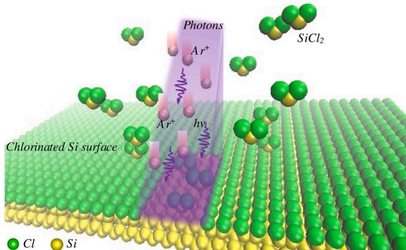
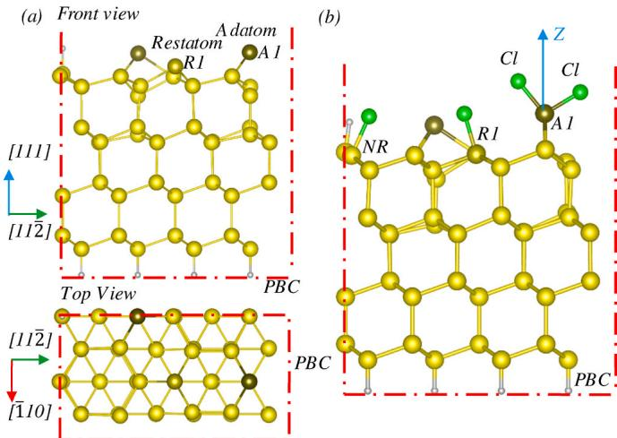
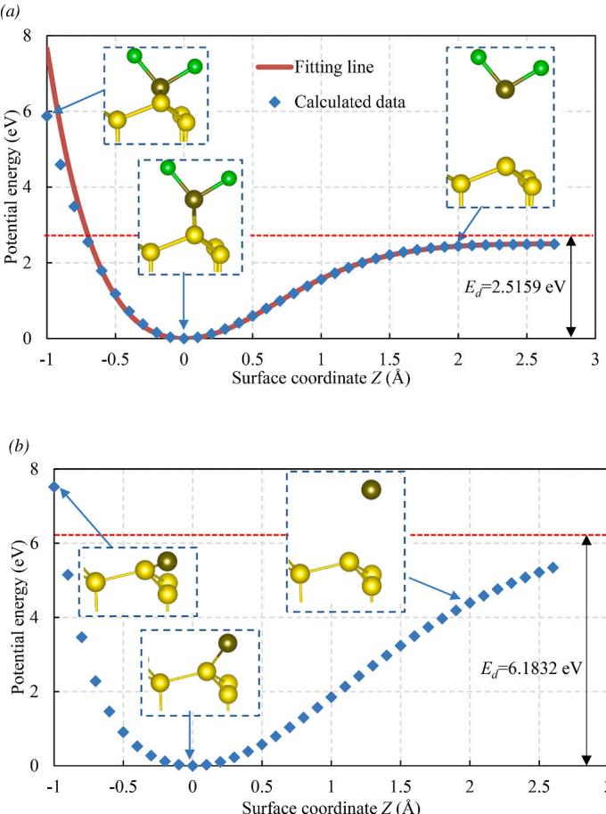
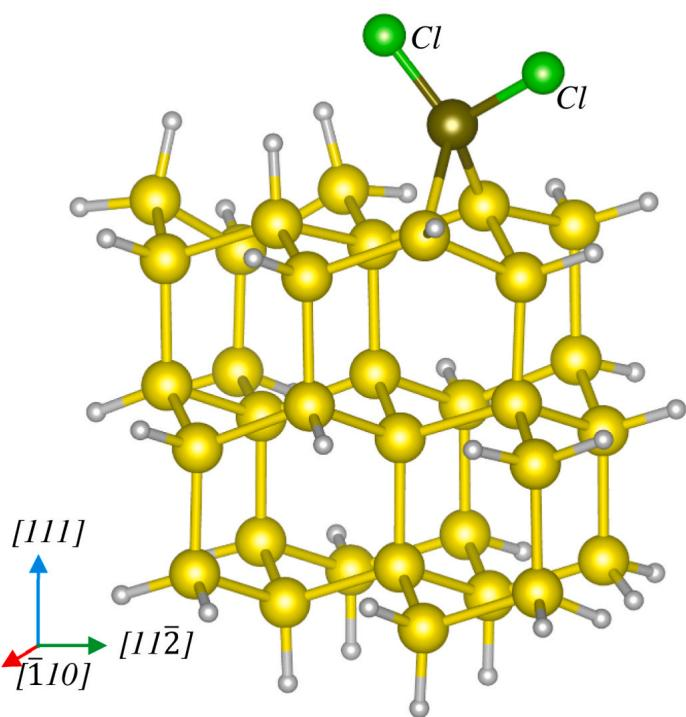
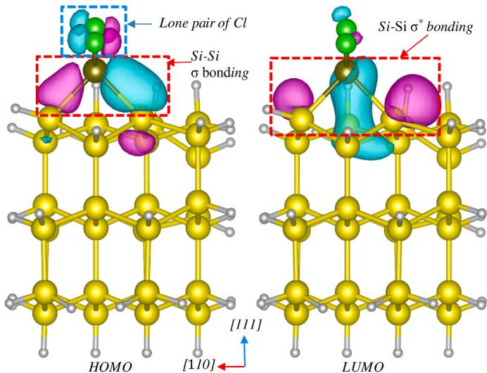
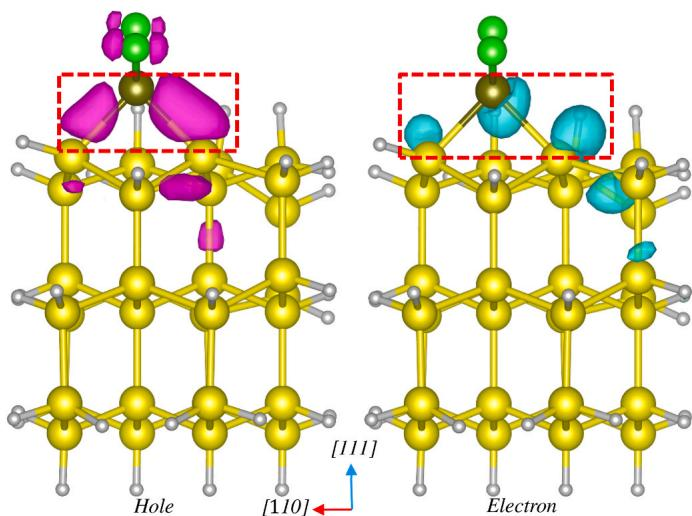
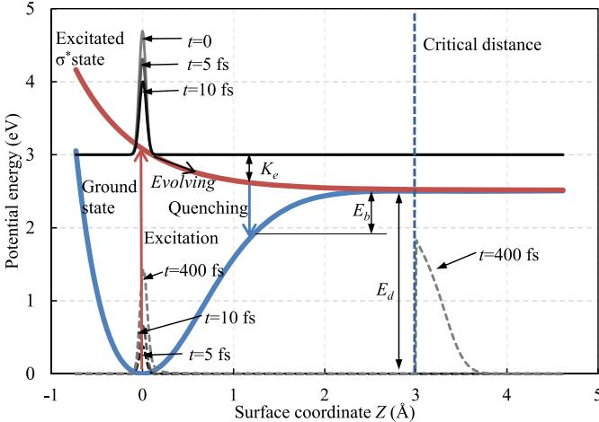
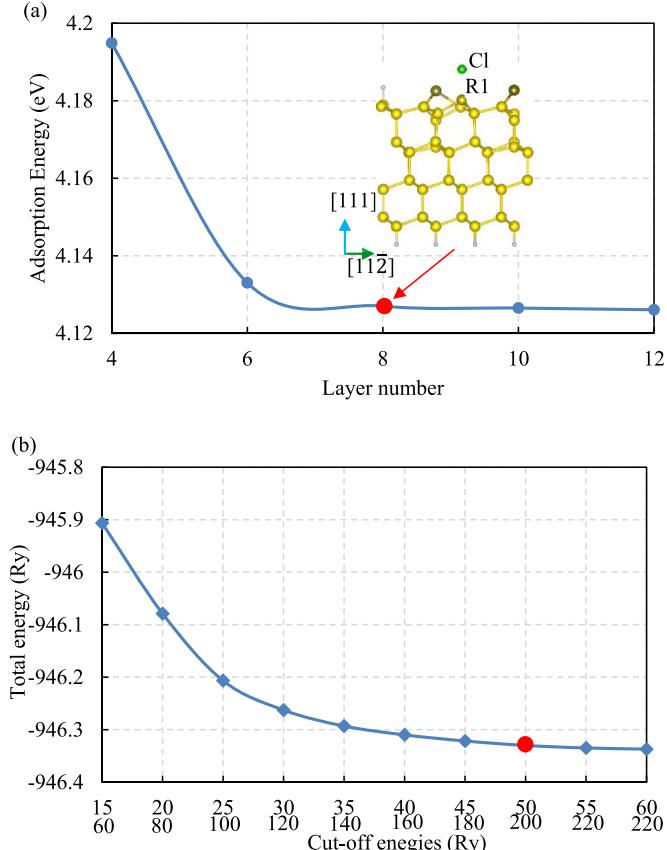
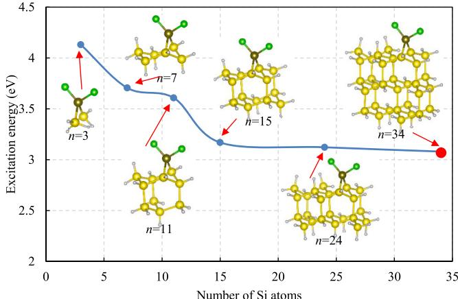

# Mechanism of photo-assisted atomic layer etching of chlorinated Si(111) surfaces: Insights from DFT/TDDFT calculations

Peizhi Wang a, Marco Castelli a, Fengzhou Fang a,b,*

a Centre of Micro/Nano Manufacturing Technology (MNMT- Dublin), University College Dublin, Dublin, 4, Ireland b State Key Laboratory of Precision Measuring Technology and Instruments, Laboratory of Micro/Nano Manufacturing Technology (MNMT), Tianjin University, Tianjin, 300072, China

# ARTICLEINFO

Keywords: Plasma atomic layer etching Photo- assisted processing Silicon Electronic devices DFT

# ABSTRACT

With the continued miniaturization of electronic devices, atomic layer etching (ALE) technique has attracted extensive attention. In plasma- ALE process, the etching energy threshold of plasma is a critical parameter that affects ion- bombardment- induced damage, etching efficiency, as well as material selectivity. Although plasma- generated photons were recently reported to help lower the etching energy, fundamental mechanism of the in- plasma photon- assisted ALE process is not fully understood. In this study, density functional theory (DFT) and time- dependent DFT calculations were carried out to give an in- depth fundamental understanding of the role of plasma- generated photons in the ALE process of chlorinated Si(111) surfaces. Calculation results show that the chlorination of targeted Si at atomic layer can effectively reduce the energy barrier for removal/desorption from 6.1832 eV to 2.5159 eV. Under the irradiation of plasma- generated photons, the  $\sigma$  bonding between chlorinated Si and underlying bulk Si can be excited to  $\sigma^{*}$  bonding, which further weakens the target Si- Si bonds and decreases the energy barrier for desorption. Moreover, the photon excited- state potential energy at  $\sigma^{*}$  bonding can be gradually converted into the kinetic energy of  $\mathrm{SiCl_2}$  with time evolution, facilitating the desorption of  $\mathrm{SiCl_2}$  from surfaces which provides fundamental guidance for the application of in- plasma photo- assisted ALE technique.

# 1. Introduction

Today the fabrication of electronic devices has been pushed into sub $5\mathrm{nm}$  technology nodes [1,2]. The further extension of Moore's law concerns the requirement of atomic and close- to- atomic scale manufacturing (ACSM) with high throughput [3,4]. As a counterpart of atomic layer deposition (ALD), atomic layer etching (ALE) technique has recently attracted extensive attention because of its potential for realizing controllable manufacturing with atomic- level precision and acceptable throughput [5- 7]. Compared with conventional dry etching techniques, ALE breaks down the conventional continuous and simultaneous dry etching process into two sequential and self- limiting reaction steps: surface modification and selective removal. The surface layer is first modified by specific precursors to weaken the bonds between surface- layer atoms and the underlying bulk atoms, followed by selective removal with plasma or heat. This enables the ALE technique with a higher- level controllability as well as higher etching precision. To date, the advanced ALE technique has been successfully applied to an abundance of materials, such as Si, Ge, C,  $\mathrm{Al_2O_3}$ $\mathrm{SiO_2}$  GaAs, GaN, and  $\mathrm{MoS_2}$  [5,8,9].

In ALE of Si, the dominant material for semiconductor devices, chlorine is commonly used as a precursor to weaken the back- bonds of the target Si atomic layer and then the plasma is employed to remove the chlorinated products by  $\mathrm{Ar^{+}}$  bombardment [10]. The selective removal/desorption of chlorinated products can be described as  $\mathrm{SiCl(s)}\rightarrow \mathrm{Si}$ $(\mathrm{s}) + \mathrm{SiCl_2(g)}$  where the collision of ions provides the  $\mathrm{SiCl_2}$  molecule with enough kinetic energy to overcome the energy barrier for desorption [7]. Although self- limited removal of Si can be achieved by the conventional plasma ALE, due to the high- energy ion bombardment, a thin damage layer would inevitably occur [11]. Thus, lowering the ion energy while ensuring the removal of  $\mathrm{SiCl_2}$  is an important alternative for the current plasma ALE process to minimize and even eliminate the damage layer.

It has been reported that photons exhibit good surface treatment capabilities of chlorinated Si surfaces, where the  $\mathrm{SiCl_2}$  can be desorbed by the photo- induced electronic excitation [12- 14]. Recent experiments

[15,16] showed that the irradiation of plasma- generated photons can effectively reduce the threshold of ion energy for the plasma etching process. These findings confirmed the important influence of the plasma- generated photons in conventional plasma ALE process through lowering the ion energy, as shown in Fig. 1. However, the underlying mechanism of in- plasma photo- assisted ALE is not fully understood, which has become a knowledge gap in establishing a cost- effective and damage- free in- plasma photo- assisted ALE approach.

In this study, DFT and time- dependent DFT (TDDFT) calculations were carried out to get an in- depth understanding of in- plasma photoassisted ALE of chlorinated Si(111) surfaces. The geometry of chlorinated Si(111) surfaces was optimized by DFT calculations, while TDDFT calculations [17] were carried out to demonstrate the photo- induced excitation dynamics through HOMO- LUMO analysis and hole- electron analysis [18,19]. In addition, photo- induced change in kinetic energy of  $\mathrm{SiCl_2}$  was analyzed using a TDDFT- based calculation method.

# 2. Computational methods

Based on the ALE process, the Si surface is first modified by chlorine atoms within the DFT scheme to simulate the modification step, and then photo- induced excitation and desorption dynamics in the removal step is calculated within the TDDFT scheme. The DFT calculations for geometry optimization and desorption energy barrier were performed with the plane- wave/pseudopotential approach as implemented in the Quantum Espresso codes [20- 22] (v.6.8) using the Perdew- Burke- Ernzerhof (PBE) exchange and correlation functionals [23]. Since the  $(4\times 2)$  surface has exhibited a good approximation for the  $(7\times 7)$  surface [24,25], a  $(4\times 2)$  surface unit cell (see Fig. 2(a)) was employed to effectively simulate the characteristic adatom- restatom structure of Si (111) -  $(7\times 7)$  surface. Each slab has 8 Si atom layers (see convergence tests in Fig. A1(a)) and a vacuum layer of  $18\mathrm{\AA}$  to avoid interaction between the periodic surfaces. The bottom 4 atomic layers were fixed, while the top 4 atomic layers were free to relax. The bottom of the slab was terminated by hydrogen. The Brillouin zone was meshed by a Monkhorst- Pack grid of  $2\times 4\times 1$  k- points [25,26]. Cutoff energies for wave function and electron density were selected to be  $50~\mathrm{Ry}$  and  $200\mathrm{Ry}$  (see convergence tests in Fig. A1(b)), respectively.

The optimized geometry of chlorinated Si(111) surface was then employed to a TDDFT calculation as implemented in the ORCA codes (v.5.0.2) [27,28] using TDDFT RI- PBE0/def2- SV(P) [18,29]. A cluster containing 34 Si atoms was selected by convergence tests (see Fig. A2). The value of n- roots was set to be 15, and the lowest excitation was analyzed. Hole- electron analysis was performed to investigate the photo- induced excitation dynamics by means of Multiwfn [18,19].

  
Fig. 1. Schematic of the photo-assistant ALE of chlorinated Si surfaces. The surface is modified by chlorine to weaken the back-bonds of target Si atomic layer; and then the modified Si layer is selectively removed/desorbed by  $\mathrm{Ar^{+}}$  bombardment assisted by photo-irradiation.

  
Fig. 2. (a) Front and top views of the Si(111) -  $(4\times 2)$  surface geometry, dark yellow atoms are Si-adatom and Si-restatom with a dangling bond, the red dotted lines are periodic boundary conditions (PBC). (b) The optimized geometry of chlorinated Si(111) surface, a  $\mathrm{SiCl_2}$  is generated on the adatom A1, A1 is the adatom, R1 is the restatom, NR is the newly exposed restatom due to the breakage of a back-bond of A1.

Molecular geometry, orbitals, and hole- electron distribution were visualized by VESTA [30]. The energy conversion from excited- state potential energy to kinetic energy of  $\mathrm{SiCl_2}$  with time evolution was calculated using a TDDFT- based calculation method for open systems based on the basic concept of Menzel- Gonar- Redhead model [31]. The time evolution process can be described by the following time- dependent Liouville- von Neumann equation [32,33], and algorithm for the detailed calculation was presented in Fig. A3.

$$
\frac{\partial\hat{\rho}}{\partial t} = \mathcal{L}\hat{\rho} = \mathcal{L}_H\hat{\rho} +\mathcal{L}_D\hat{\rho} \tag{1}
$$

$$
\mathcal{L}_H\hat{\rho} = -\frac{i}{\hbar} [\widehat{H},\widehat{\rho} ] \tag{2}
$$

$$
\mathcal{L}_D\hat{\rho} = \sum_{k = 1}^K\biggl (\hat{C}_k\hat{\rho}\hat{C}_k^+ -\frac{1}{2}\bigl [\hat{C}_k^+ \hat{C}_k,\hat{\rho}\bigr ]_+\biggr) \tag{3}
$$

where  $\mathcal{L},\mathcal{L}_H$  and  $\mathcal{L}_D$  are total, Hamiltonian, and dissipative Liouvillian operators, respectively,  $t$  is the evolution time,  $\hbar$  is the reduced Planck's constant,  $\hat{\rho},\hat{H}$  and  $\hat{C}_k$  are density, Hamiltonian, and Lindblad operators, respectively, [A, B] and  $[\mathrm{A},\mathrm{B}]_{+}$  represent the commutator and anti- commutator, respectively.

# 3. Results and discussion

# 3.1. Energy barrier for desorption

Although both SiCl and  $\mathrm{SiCl_2}$  can be generated on the Si surface after chlorination [34,35], the chlorinated products will be desorbed in the form of  $\mathrm{SiCl_2}$  in ALE, where the SiCl combines with its neighboring Cl atom to form a  $\mathrm{SiCl_2}$  molecule [7]. This present work mainly focuses on the photo- assistant desorption of  $\mathrm{SiCl_2}$  in ALE of chlorinated Si(111) surfaces. Fig. 2(b) shows the optimized geometry of chlorinated Si(111) surface, which is consistent with the results in literatures [34,35]. In the chlorination of ALE process, the dangling bonds of Si- adatom (A1) and its neighboring restatom (R1) are terminated by Cl atoms, and a back- bond of adatom A1 is broken, thereby forming a  $\mathrm{SiCl_2}$  molecule. The breakage of this back- bond leads to the exposure of a new restatom (NR), which is then terminated with a Cl atom.

Fig. 3(a) shows the calculated profile of potential energy versus the surface coordinate  $(Z)$  of  $\mathrm{SiCl_2}$ . The coordinate  $Z = 0$  represents the

  
Fig. 3. (a) Potential energy curve for  $\mathrm{SiCl_2}$  on the optimized Si(111) surface, here blue dots are the calculated data, and red line is the fitting function.  $Z = 0$  represents the equilibrium position, and insets are the local views of the desorbed species. (b) Potential energy curve for the Si-adatom (atom A1 in Fig. 2(a)) in the absence of chlorine, insets are the local views of the desorbed species.

original equilibrium position of  $\mathrm{SiCl_2}$  in the optimized geometry. As expected, the potential energy has a minimum value at  $Z = 0$  and starts to increase and gradually approaches a saturated value when the  $\mathrm{SiCl_2}$  molecule moves away from the surface  $(Z > 0)$ . The difference  $E_{d}$  between the minimum value (at  $Z = 0$ ) and the fixed value (at  $Z\rightarrow +\infty$ ) is defined as the energy barrier for desorption. The calculated energy barrier for  $\mathrm{SiCl_2}$  is  $2.5159\mathrm{eV}$ , which is close to the values  $(2.2\mathrm{eV}$  and  $2.4\mathrm{eV}$  in the literatures [36,37].

For the convenience of application, the energy data in Fig. 3(a) were fitted by a modified Tersoff function in Eq. (4) [38], which was widely used to simulate the interaction between Si atoms. The fitting function was modified by a Gamma probability density function Gampdf. It can be found that the function  $V_{g}(Z)$  (in eV) fits the data well, and the correlation coefficient  $R^2$  is 0.9886.

$$
\begin{array}{rl} & V_{g}(Z) = 17.4841\mathrm{e}^{-1.5702Z} - 20\mathrm{e}^{-1.3727Z} + \\ & \quad 1.1277\mathrm{Gampdf}(Z,4.3849,0.4114) + 2.5159 \end{array} \tag{4}
$$

$$
\mathrm{Gampdf}(Z,a,b) = \left\{ \begin{array}{ll}\frac{1}{b^a\Gamma(a)} Z^{a - 1}e^{-\frac{z}{b}} & (Z > 0)\\ 0 & (Z\leq 0) \end{array} \right. \tag{5}
$$

where  $\Gamma (\bullet)$  is the Gamma function.

For comparison, the potential energy for the Si- adatom (atom A1 in Fig. 2(a)) in the absence of chlorine was calculated as well and shown in Fig. 3(b). The desorption energy barrier of Si- adatom is  $6.1832\mathrm{eV}$  which is much higher than that of  $\mathrm{SiCl_2}$ .

# 3.2. Photo-stimulated excitation dynamics analysis

In this section, the in- plasma photo- stimulated excitation dynamics of chlorinated Si(111) surfaces were analyzed by TDDFT calculations. As shown in Fig. 4, a cluster containing 34 Si atoms was extracted from the optimized slab for the TDDFT calculations after convergence tests (see Fig. A2).

The lowest excitation energy was calculated to be  $3.080\mathrm{eV}$ , which is larger than the desorption barrier of  $\mathrm{SiCl_2}$ $(2.5159\mathrm{eV})$ . The contribution of HOMO (the highest occupied molecular orbital)  $\rightarrow$  LUMO (the lowest unoccupied molecular orbital) to this excitation is 0.831, indicating that the transition of HOMO  $\rightarrow$  LUMO dominates the excitation process. Fig. 5 shows the diagrams of HOMO and LUMO. A typical  $\sigma$  bonding between the  $\mathrm{SiCl_2}$  and underlying bulk Si, as well as a lone pair of chlorine, can be observed in HOMO, whereas a typical character of anti- bonding  $\sigma^{*}$  can be observed in LUMO.

To get a deep insight into the nature of in- plasma photo- stimulated electron excitations, hole- electron analysis was performed on Multiwfn [18]. The hole and electron distributions related to this excitation were depicted in Fig. 6. It shows that the electrons on the back- bonds of chlorinated Si are excited to the anti- bonding state, thereby facilitating the desorption of  $\mathrm{SiCl_2}$ . Although a small fraction of lone electrons of chlorine is lost, the contribution of this component is only  $9.68\%$ . Thus, it can be concluded that the photo- stimulated  $\sigma \rightarrow \sigma^{*}$  transition dominates the excitation process, which verifies our previous assumption [14]. In addition, it was found the electron and hole distributions are localized within the region of chlorinated Si with the help of adsorbed Cl, different from the case of hydrogen- terminated surface in literature [19]. The localized anti- bonding  $\sigma^{*}$  could weaken the bonds between chlorinated Si and underlying bulk Si and provide the  $\mathrm{SiCl_2}$  molecule with kinetic energy to make the desorption easier. Therefore, the involvement of plasma- generated photons could assist in overcoming the energy barrier of  $\mathrm{SiCl_2}$  in plasma ALF process. As for the detailed energy conversion from excited- state potential energy to kinetic energy, it will be discussed in the following section.

  
Fig. 4. Molecular structure of the selected cluster for TDDFT calculations. The cluster was extracted from the optimized slab (see Fig. 2(b)) and selected by convergence tests (see Fig. A2).

  
Fig. 5. HOMO and LOMO diagrams within the localized  $\mathrm{SiCl_2}$  region, side view of Fig. 4 is selected for a better visualization.

  
Fig. 6. Hole and electron distributions related to the lowest excitation,  $\mathrm{pink} =$  hole, blue  $=$  electron, hole indicates the loss of electron.

# 3.3. Energy conversion with time evolution

The foregoing discussion showed that  $\sigma \rightarrow \sigma^{*}$  transition dominates the plasma- generated photo- stimulated process. Once the  $\sigma^{*}$  bonding state is excited, the exciting state will evolve following the excited- state potential curve, and quench to the ground state with a rate of  $\Gamma$ , as shown in Fig. 7. The losing excited- state potential energy will be converted into kinetic energy  $(K_{e})$  of  $\mathrm{SiCl_2}$ , which facilitates the desorption of  $\mathrm{SiCl_2}$ . Moreover, the energy barrier for desorption will be further reduced from  $E_{d}$  to  $E_{b}$  at the time of quenching. It clearly indicates that the plasma- generated photons can help lower the ion energy, which contributes to the desorption/removal of the  $\mathrm{SiCl_2}$  and minimizes the formation of high- energy ion bombardment induced damage layer.

To conduct a quantitative analysis of the energy conversion, the time evolution process after the  $\sigma \rightarrow \sigma^{*}$  transition was calculated based on a previously established model (see Fig. A3). The Hamiltonian operator  $\hat{H}$  in Eq. (2) has the following form,

$$
\widehat{H}_l = -\frac{\hbar^2}{2m}\frac{\partial^2}{\partial Z^2} +V_l(Z),l = g,e \tag{6}
$$

where  $m$  is the molecule mass of  $\mathrm{SiCl_2}$ ,  $V_{g}$  is the potential energy operators for ground state (  $\sigma$  bonding) and can be obtained from Eq. (4),  $V_{e}$  (in eV) is the potential energy operator for excited state ( $\sigma^{*}$  bonding) and can be obtained as follows [14]:

  
Fig. 7. Schematic of the energy conversion process and snapshots of the density distribution with time evolution, the distributions on excited-state and ground-state potential energy curves are represented by solid and dashed lines, respectively. The vertical line  $Z = Z_{d}$  is the defined critical value, the  $\mathrm{SiCl_2}$  molecule crossing this line can be identified as to be completely desorbed. Since the distribution for  $Z > Z_{d}$  is small, it was multiplied by a factor of  $4\times 10^{5}$  if  $Z > Z_{d}$  to make it visible.

$$
V_{e}(Z) = 0.2631\mathrm{e}^{-1.5702Z} + 0.3010\mathrm{e}^{-1.3727Z} + 2.5159 \tag{7}
$$

Taking  $\Gamma = 1 / 20 \mathrm{fs}^{- 1}$  as an example, snapshots of the density distribution of adsorbate with time evolution is shown in Fig. 7. At the moment of excitation  $(t = 0)$ , density distribution peak (diagonals of the density matrix in coordinate space) is mainly concentrated near the equilibrium position  $(Z = 0)$  on the excited- state potential curve. With time propagating, the density distribution on the ground- state energy curve will grow gradually because of the excited state's quenching. After quenching, the  $\mathrm{SiCl_2}$  will continue to evolve along the ground- state potential curve with the obtained kinetic energy. If the kinetic energy gained from photo- stimulation and collision by ion bombardment is enough to overcome the remaining potential energy barrier  $(E_{b})$ , the  $\mathrm{SiCl_2}$  will be removed/desorbed from the surface.

# 4. Conclusions

The mechanism of in- plasma photo- assisted ALE of chlorinated Si (111) surfaces has been investigated using DFT/TDDFT calculations. The calculated energy barrier for removal/desorption of  $\mathrm{SiCl_2}$  (the main desorption product in ALE) is  $2.5159 \mathrm{eV}$ , whereas that for Si in the absence of chlorine is  $6.1832 \mathrm{eV}$ , indicating that the underlying back- bonds of target Si atoms are weakened by the adsorption of Cl. Under the irradiation of plasma- generated photons, the lowest excitation energy for the chlorinated Si surface was calculated to be  $3.080 \mathrm{eV}$ . The contribution of  $\mathrm{HOMO} \rightarrow \mathrm{LUMO}$  to this excitation is  $0.831$ , and the  $\sigma \rightarrow \sigma^{*}$  transition within the bond between chlorinated Si and underlying bulk Si was found to dominate the photo- stimulated excitation based on the hole- electron analysis. Once the  $\sigma^{*}$  bonding state is excited, the excited state would evolve following the excited- state potential curve, which provides the  $\mathrm{SiCl_2}$  with additional kinetic energy for desorption. Moreover, the energy barrier for desorption would be further decreased when the excited state quenches to the ground state. These findings confirm that the ion energy in ALE of Si could be lowered with the assistance of plasma- generated photons and explain the corresponding mechanism.

# CRediT authorship contribution statement

Peizhi Wang: Writing - original draft, Methodology, Investigation. Marco Castelli: Writing - review & editing, Methodology. Fengzhou Fang: Writing - review & editing, Supervision.

# Declaration of competing interest

The authors declare that they have no known competing financial interests or personal relationships that could have appeared to influence the work reported in this paper.

# Data availability

No data was used for the research described in the article.

# Acknowledgments

The work is support by the Science Foundation Ireland (SFI) (No.15/ RP/B3208). The authors would also like to thank Zhichao Geng, Chenghao Chen and Jintong Wu for valuable discussions.

# Appendix A1. Convergence tests for DFT/TDDFT calculations

Fig. A1 shows the convergence tests for DFT calculations of the slab geometry. The variation of adsorption energy with atomic layer number is shown in Fig. A1(a). The adsorption energy  $E_{ads}$  of chlorine atom on the Si- restatom R1 was calculated according to the following equation.

$$
E_{ads} = E_{Si} + E_{Cl} - E_{Si - Cl} \tag{A1}
$$

where  $E_{Si},E_{Cl},$  and  $E_{Si - Cl}$  are the energies of Si(111) surface, a chlorine atom, and the adsorbed system, respectively.

The variation of total energy with cutoff energies for wave function and electron density is shown in Fig. A1(b). The cutoff energy for electron density was set to be 4 times that for wave function, as a default setting in Quantum Espresso.

From Fig. A1, the atomic- layer number was selected to be 8, and the cutoff energies for wave function and electron density were selected to be 50 Ry and  $200\mathrm{Ry}$  , respectively.

  
Fig. A1. Convergce tests for atomic layr nmber and cutoff energies for DFT calculations. (a) Variation of adsorption energy of chlorine with layer number, cutoff energies of  $50 / 200\mathrm{Ry}$  were applied. (b) Variation of total system energy with cutoff energies for wave function and electron density, the cutoff energy for electron density was set to be 4 times that for wave function, as a default setting in Quantum Espresso.

Fig. A2 shows the convergence tests for TDDFT calculations. A total of 7 clusters containing different numbers of Si atoms were extracted from the optimized slab in Fig. 2(b), and applied to TDDFT calculations. The lowest excitation energy was calculated. The cluster with 34 Si atoms was finally selected for further TDDFT calculations.

  
Fig. A2. Variation of the lowest excitation energy with the number of Si atoms of the cluster, insets are the molecular structures of the associated clusters.

# Appendix A2. Calculation method for time evolution process

In the prs t 141, th  i  .  t  t  i t  i t  i t  i t  i t  i t  i t  i t  i t  i t  i t  i t  i t  i t  i t  i t  i t  i t  i t  i t  i t  i t  i t  i t  i t  i t  i t  i t  i t  i t  i t  i t  i t  i  i t  i t  i t  i t  i t  i t  i t  i t  i t  i t  i t  i t  i t  i t  i t  i t  i t  i t  i t  i t  i t  i t  i t  i t  i t  i t  i t  i t  i t  i t  i t  i t  i t

  
Fig. A3. Algorithm for the calculation of time evolution.

# References

[1] S. Wang, X. Liu, P. Zhou, The road for two- dimensional semiconductors in silicon age, Adv. Mater. (2021), 2106886. [2] W. Li, J. Wei, W. Chen, S. Jing, J. Pan, et al., The in- plane graphene and borophene[12 contacted sub- 10 nm monolayer black phosphorous Schottky barrier field- effect transistors, Mater. Sci. Semicond. Process. 138 (2022), 106279. [3] F.Z. Fang, Atomic and close- to- atomic scale manufacturing: perspectives and measures, Int. J. Extreme Manuf. 2 (2020), 030201. [4] R. Achal, M. Rashidi, J. Croshaw, et al., Lithography for robust and editable atomic- scale silicon devices and memories, Nat. Commun. 9 (2018) 1- 8. [5] K.J. Kanarik, T. Lill, E.A. Hudson, et al., Overview of atomic layer etching in the semiconductor industry, J. Vac. Sci. Technol., A 33 (2015), 020802. [6] G.S. Oehrlein, D. Metzler, C. Li, Atomic layer etching at the tipping point: an overview, ECS J. Solid State Sc 4 (2015) N5041.

[7] K.J. Kanarik, S. Tan, R.A. Gottscho, Atomic layer etching: rethinking the art of etch, J. Phys. Chem. Lett. 9 (2018), 4814- 4821. [8] F. Du, Y. Jiang, Z. Qiao, Z. Wu, C. Tang, et al., Atomic layer etching technique for InAlN/GaN heterostructure with AlN etch- top layer, Mater. Sci. Semicond. Process. 143 (2022), 106544. [9] Y. Rho, J. Pei, L. Wang, Z. Su, M. Eliceiri, C.P. Grigoropoulos, Site- selective atomic layer precision thinning of MoS2 via laser- assisted anisotropic chemical etching, ACS Appl. Mater. Interfaces 11 (2019) 39385- 39393. [10] S.A. Khan, D.B. Suyatin, J. Sundqvist, et al., High- definition nanoimprint stamp fabrication by atomic layer etching, ACS Appl. Nano Mater. 1 (2018) 2476- 2482. [11] E.J.C. Tinacba, M. Isobe, S. Hamaguchi, Surface damage formation during atomic layer etching of silicon with chlorine adsorption, J. Vac. Sci. Technol., A 39 (2021), 042603.

[12] K. Hattori, K. Shudo, Tiimori, F. Komori, Y. Murata, Laser- induced desorption from silicon (111) surfaces with adsorbed chlorine atoms, J. Phys- Condens. Mat. 8 (1996) 6543. [13] T. Iimori, K. Hattori, K. Shudo, T. Iwaki, M. Ueta, F. Komori, Laser- induced monoatomic- layer etching on Cl- adsorbed Si (111) surfaces, Appl. Surf. Sci. 130 (1998) 90- 95. [14] P. Wang, J. Wang, F.Z. Fang, Study on mechanisms of photon- induced material removal on silicon at atomic and close- to- atomic scale, Nanomanuf. Metrol. 4 (2021) 216- 225. [15] H. Shin, W. Zhu, V.M. Donnelly, D.J. Economou, Surprising importance of photoassisted etching of silicon in chlorine- containing plasmas, J. Vac. Sci. Technol., A 30 (2012) 021306. [16] L. Du, D.J. Economou, V.M. Donnelly, In- plasma photo- assisted etching of Si with chlorine aided by an external vacuum ultraviolet source, J. Vac. Sci. Technol., A 40 (2022) 022207. [17] G. He, J. Ma, H. He, Role of carbonaceous aerosols in catalyzing sulfate formation, ACS Catal. 8 (2018) 3825- 3832. [18] T. Lu, F. Chen, Multiwfn: a multifunctional wavefunction analyzer, J. Comput. Chem. 33 (2012) 580- 592. [19] Z. Liu, T. Lu, Q. Chen, An sp- hybridized all- carboatomic ring, cyclo [18] carbon: electronic structure, electronic spectrum, and optical nonlinearity, Carbon 165 (2020) 461- 467. [20] P. Giannozzi, S. Baroni, N. Bonini, M. Calandra, R. Car, C. Cavazzoni, et al., Quantum espresso: a modular and open- source software project for quantum simulations of materials, J. Phys- Condens. Mat. 21 (2009) 395502. [21] P. Giannozzi, O. Andreussi, T. Brumme, O. Bunau, M.B. Nardelli, M. Calandra, et al., Advanced capabilities for materials modelling with Quantum ESPRESSO, J. Phys- Condens. Mat. 29 (2017) 465901. [22] P. Giannozzi, O. Baseggio, P. Bonafa, D. Brunato, R. Car, I. Carnimeo, et al., Quantum ESPRESSO toward the exascale, J. Chem. Phys. 152 (2020), 154105. [23] J.P. Perdew, K. Burke, M. Ernzerhof, Generalized gradient approximation made simple, Phys. Rev. Lett. 77 (1996) 3865. [24] A. Vittadini, A. Selloni, H2 adsorption/desorption at Si (111)- (7×7): a density functional study, Surf. Sci. 383 (1997) L779- L784. [25] S.C. Jung, Y.K. Han, Facet- dependent lithium intercalation into Si crystals: Si (100) vs. Si (111), Phys. Chem. Chem. Phys. 13 (2011) 21282- 21287.

[26] S. Yadav, C.V. Singh, Molecular adsorption and surface formation reactions of HCl, H2 and chlorosilanes on Si (100)- c (4×2) with applications for high purity silicon production, Appl. Surf. Sci. 475 (2019) 124- 134. [27] F. Neese, The ORCA program system, WIREs Computat. Mol. Sci. 2 (2012) 73- 78. [28] F. Neese, Software update: the ORCA program system, version 4.0, WIREs Computat, Mol. Sci. 8 (2018) e1327. [29] F. Weigend, R. Ahlrichs, Balanced basis sets of split valence, triple zeta valence and quadruple zeta Vvalence quality for H to Fin: design and assessment of accuracy, Phys. Chem. Chem. Phys. 7 (2005) 3297- 3305. [30] K. Momma, F. Izumi, VESTA 3 for three- dimensional visualization of crystal, volumetric and morphology data, J. Appl. Crystallogr. 44 (2011) 1272- 1276. [31] D. Menzel, G. Robert, Desorption from metal surfaces by low- energy electrons, J. Chem. Phys. 41 (1964) 3311- 3328. [32] P. Saelfrank, R. Kosloff, Quantum dynamics of bond breaking in a dissipative environment: indirect and direct photodesorption of neutrals from metals, J. Chem. Phys. 105 (1996) 2441- 2455. [33] G. Boendingen, P. Saelfrank, STM- induced desorption of hydrogen from a silicon Surface: an open- system density matrix study, J. Phys. Chem. B 102 (1998) 8029- 8035. [34] K. Shudo, H. Washio, M. Tanaka, Reactivity of restatoms and adatoms in Cl adsorption at a Si (111)- 7×7 surface, J. Chem. Phys. 119 (2003) 13077- 13082. [35] T. Kirimura, K.I. Shudo, Y. Hayashi, Y. Tanaka, T. Ishikawa, M. Tanaka, Photon- stimulated desorption from chlorinated Si (111): etching of SiCl by picosecond- pulsed laser irradiation, Phys. Rev. B 73 (2006), 085309. [36] S. Sakurai, T. Nakayama, Electronic structures and etching processes of chlorinated Si (111) surfaces, Jap. J. Appl. Phys. 41 (2002) 2171. [37] K. Shudo, T. Kirimura, Y. Tanaka, T. Ishikawa, M. Tanaka, Quantitative analysis of thermally induced desorption during halogen- etching of a silicon (111) surface, Surf. Sci. 600 (2006) 3147- 3153. [38] J. Tersoff, Empirical interatomic potential for silicon with improved elastic properties, Phys. Rev. B 38 (1988) 9902. [39] Y.Y. Liu, Z. Wei, S. Meng, R. Wang, X. Jiang, R. Huang, et al., Electronically induced defect creation at semiconductor/oxide interface revealed by time- dependent density functional theory, Phys. Rev. B 104 (2021), 115310.